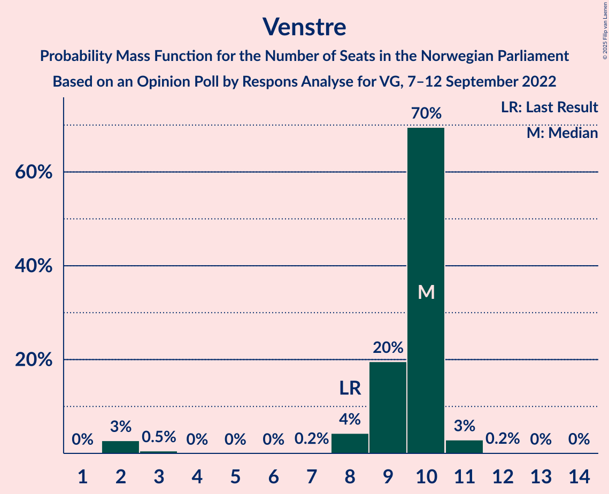

# Opinion Poll by Respons Analyse for VG, 7–12 September 2022

<a href="#voting-intentions">Voting Intentions</a> | <a href="#seats">Seats</a> | <a href="#coalitions">Coalitions</a> | <a href="#technical-information">Technical Information</a>

## Voting Intentions

### Confidence Intervals

| Party | Last Result | Poll Result | 80% Confidence Interval | 90% Confidence Interval | 95% Confidence Interval | 99% Confidence Interval |
|:-----:|:-----------:|:-----------:|:-----------------------:|:-----------------------:|:-----------------------:|:-----------------------:|
| Høyre | 20.4% | 30.2% | 28.4–32.1% |27.9–32.6% |27.4–33.1% |26.6–34.0% |
| Arbeiderpartiet | 26.2% | 19.8% | 18.2–21.5% |17.8–22.0% |17.4–22.4% |16.7–23.2% |
| Fremskrittspartiet | 11.6% | 12.7% | 11.4–14.1% |11.1–14.6% |10.8–14.9% |10.2–15.6% |
| Sosialistisk Venstreparti | 7.6% | 8.9% | 7.8–10.2% |7.5–10.5% |7.3–10.8% |6.8–11.5% |
| Rødt | 4.7% | 6.5% | 5.6–7.6% |5.3–7.9% |5.1–8.2% |4.7–8.8% |
| Senterpartiet | 13.5% | 6.0% | 5.1–7.1% |4.9–7.4% |4.7–7.7% |4.3–8.2% |
| Venstre | 4.6% | 4.9% | 4.1–5.9% |3.9–6.2% |3.7–6.4% |3.4–6.9% |
| Miljøpartiet De Grønne | 3.9% | 3.5% | 2.9–4.4% |2.7–4.6% |2.5–4.8% |2.2–5.3% |
| Kristelig Folkeparti | 3.8% | 3.3% | 2.7–4.1% |2.5–4.4% |2.4–4.6% |2.1–5.0% |
| Norgesdemokratene | 1.1% | 1.7% | 1.3–2.4% |1.2–2.5% |1.1–2.7% |0.9–3.1% |
| Industri- og Næringspartiet | 0.3% | 1.7% | 1.3–2.4% |1.2–2.5% |1.1–2.7% |0.9–3.1% |
| Konservativt | 0.4% | 0.4% | 0.2–0.8% |0.2–0.9% |0.2–1.0% |0.1–1.3% |
| Kystpartiet | 0.0% | 0.2% | 0.1–0.5% |0.1–0.6% |0.1–0.7% |0.0–0.9% |
| Pensjonistpartiet | 0.6% | 0.2% | 0.1–0.5% |0.1–0.6% |0.1–0.7% |0.0–0.9% |

*Note:* The poll result column reflects the actual value used in the calculations. Published results may vary slightly, and in addition be rounded to fewer digits.

## Seats

### Confidence Intervals

| Party | Last Result | Median | 80% Confidence Interval | 90% Confidence Interval | 95% Confidence Interval | 99% Confidence Interval |
|:-----:|:-----------:|:------:|:-----------------------:|:-----------------------:|:-----------------------:|:-----------------------:|
| <a href="#høyre">Høyre</a> | 36 | 56 | 51–56 |50–57 |50–59 |48–60 |
| <a href="#arbeiderpartiet">Arbeiderpartiet</a> | 48 | 42 | 34–42 |34–44 |33–44 |32–47 |
| <a href="#fremskrittspartiet">Fremskrittspartiet</a> | 21 | 20 | 19–24 |19–27 |18–29 |18–30 |
| <a href="#sosialistisk-venstreparti">Sosialistisk Venstreparti</a> | 13 | 16 | 13–19 |13–20 |12–20 |10–20 |
| <a href="#rødt">Rødt</a> | 8 | 11 | 10–12 |10–12 |9–13 |1–15 |
| <a href="#senterpartiet">Senterpartiet</a> | 28 | 10 | 9–14 |8–15 |6–15 |2–16 |
| <a href="#venstre">Venstre</a> | 8 | 10 | 9–10 |8–10 |2–11 |2–11 |
| <a href="#miljøpartiet-de-grønne">Miljøpartiet De Grønne</a> | 3 | 1 | 1–2 |1–7 |1–7 |1–9 |
| <a href="#kristelig-folkeparti">Kristelig Folkeparti</a> | 3 | 2 | 2–8 |2–8 |2–8 |0–9 |
| <a href="#norgesdemokratene">Norgesdemokratene</a> | 0 | 0 | 0 |0 |0 |0 |
| <a href="#industri--og-næringspartiet">Industri- og Næringspartiet</a> | 0 | 0 | 0 |0 |0–1 |0–2 |
| <a href="#konservativt">Konservativt</a> | 0 | 0 | 0 |0 |0 |0 |
| <a href="#kystpartiet">Kystpartiet</a> | 0 | 0 | 0 |0 |0 |0–1 |
| <a href="#pensjonistpartiet">Pensjonistpartiet</a> | 0 | 0 | 0 |0 |0 |0 |

### Høyre

*For a full overview of the results for this party, see the [Høyre](party-høyre.html) page.*

| Number of Seats | Probability | Accumulated | Special Marks |
|:---------------:|:-----------:|:-----------:|:-------------:|
| 36 | 0% | 100% | Last Result |
| 37 | 0% | 100% |  |
| 38 | 0% | 100% |  |
| 39 | 0% | 100% |  |
| 40 | 0% | 100% |  |
| 41 | 0% | 100% |  |
| 42 | 0% | 100% |  |
| 43 | 0% | 100% |  |
| 44 | 0% | 100% |  |
| 45 | 0.3% | 100% |  |
| 46 | 0% | 99.7% |  |
| 47 | 0.1% | 99.7% |  |
| 48 | 2% | 99.6% |  |
| 49 | 0.5% | 98% |  |
| 50 | 3% | 98% |  |
| 51 | 6% | 95% |  |
| 52 | 2% | 88% |  |
| 53 | 14% | 86% |  |
| 54 | 0.3% | 72% |  |
| 55 | 2% | 72% |  |
| 56 | 64% | 70% | Median |
| 57 | 2% | 6% |  |
| 58 | 0.9% | 4% |  |
| 59 | 0.9% | 3% |  |
| 60 | 1.4% | 2% |  |
| 61 | 0.2% | 0.4% |  |
| 62 | 0% | 0.2% |  |
| 63 | 0.1% | 0.2% |  |
| 64 | 0% | 0% |  |

### Arbeiderpartiet

*For a full overview of the results for this party, see the [Arbeiderpartiet](party-arbeiderpartiet.html) page.*

| Number of Seats | Probability | Accumulated | Special Marks |
|:---------------:|:-----------:|:-----------:|:-------------:|
| 32 | 2% | 100% |  |
| 33 | 2% | 98% |  |
| 34 | 9% | 96% |  |
| 35 | 2% | 87% |  |
| 36 | 5% | 85% |  |
| 37 | 9% | 80% |  |
| 38 | 2% | 71% |  |
| 39 | 0.5% | 69% |  |
| 40 | 2% | 69% |  |
| 41 | 1.0% | 67% |  |
| 42 | 60% | 66% | Median |
| 43 | 0.1% | 6% |  |
| 44 | 3% | 6% |  |
| 45 | 0.1% | 2% |  |
| 46 | 1.0% | 2% |  |
| 47 | 1.0% | 1.2% |  |
| 48 | 0.1% | 0.2% | Last Result |
| 49 | 0.1% | 0.1% |  |
| 50 | 0% | 0% |  |

### Fremskrittspartiet

*For a full overview of the results for this party, see the [Fremskrittspartiet](party-fremskrittspartiet.html) page.*

| Number of Seats | Probability | Accumulated | Special Marks |
|:---------------:|:-----------:|:-----------:|:-------------:|
| 17 | 0.4% | 100% |  |
| 18 | 4% | 99.6% |  |
| 19 | 8% | 96% |  |
| 20 | 59% | 88% | Median |
| 21 | 2% | 29% | Last Result |
| 22 | 11% | 26% |  |
| 23 | 2% | 16% |  |
| 24 | 5% | 14% |  |
| 25 | 0.8% | 9% |  |
| 26 | 2% | 8% |  |
| 27 | 3% | 6% |  |
| 28 | 0% | 4% |  |
| 29 | 3% | 4% |  |
| 30 | 1.0% | 1.0% |  |
| 31 | 0% | 0% |  |

### Sosialistisk Venstreparti

*For a full overview of the results for this party, see the [Sosialistisk Venstreparti](party-sosialistiskvenstreparti.html) page.*

| Number of Seats | Probability | Accumulated | Special Marks |
|:---------------:|:-----------:|:-----------:|:-------------:|
| 10 | 1.1% | 100% |  |
| 11 | 0.1% | 98.8% |  |
| 12 | 1.3% | 98.7% |  |
| 13 | 8% | 97% | Last Result |
| 14 | 2% | 89% |  |
| 15 | 5% | 87% |  |
| 16 | 66% | 83% | Median |
| 17 | 5% | 17% |  |
| 18 | 0.7% | 11% |  |
| 19 | 2% | 11% |  |
| 20 | 8% | 8% |  |
| 21 | 0.1% | 0.3% |  |
| 22 | 0.2% | 0.3% |  |
| 23 | 0% | 0% |  |

### Rødt

*For a full overview of the results for this party, see the [Rødt](party-rødt.html) page.*

| Number of Seats | Probability | Accumulated | Special Marks |
|:---------------:|:-----------:|:-----------:|:-------------:|
| 1 | 0.7% | 100% |  |
| 2 | 0% | 99.3% |  |
| 3 | 0% | 99.3% |  |
| 4 | 0% | 99.3% |  |
| 5 | 0% | 99.3% |  |
| 6 | 0% | 99.3% |  |
| 7 | 0.1% | 99.3% |  |
| 8 | 0.1% | 99.2% | Last Result |
| 9 | 3% | 99.1% |  |
| 10 | 8% | 96% |  |
| 11 | 68% | 89% | Median |
| 12 | 17% | 21% |  |
| 13 | 2% | 4% |  |
| 14 | 1.0% | 2% |  |
| 15 | 1.3% | 1.5% |  |
| 16 | 0.2% | 0.2% |  |
| 17 | 0% | 0% |  |

### Senterpartiet

*For a full overview of the results for this party, see the [Senterpartiet](party-senterpartiet.html) page.*

| Number of Seats | Probability | Accumulated | Special Marks |
|:---------------:|:-----------:|:-----------:|:-------------:|
| 1 | 0.2% | 100% |  |
| 2 | 0.8% | 99.8% |  |
| 3 | 0% | 99.0% |  |
| 4 | 0% | 99.0% |  |
| 5 | 0% | 99.0% |  |
| 6 | 2% | 99.0% |  |
| 7 | 0.3% | 97% |  |
| 8 | 2% | 97% |  |
| 9 | 5% | 95% |  |
| 10 | 60% | 90% | Median |
| 11 | 5% | 30% |  |
| 12 | 3% | 25% |  |
| 13 | 8% | 22% |  |
| 14 | 4% | 14% |  |
| 15 | 8% | 10% |  |
| 16 | 2% | 2% |  |
| 17 | 0% | 0% |  |
| 18 | 0% | 0% |  |
| 19 | 0% | 0% |  |
| 20 | 0% | 0% |  |
| 21 | 0% | 0% |  |
| 22 | 0% | 0% |  |
| 23 | 0% | 0% |  |
| 24 | 0% | 0% |  |
| 25 | 0% | 0% |  |
| 26 | 0% | 0% |  |
| 27 | 0% | 0% |  |
| 28 | 0% | 0% | Last Result |

### Venstre

*For a full overview of the results for this party, see the [Venstre](party-venstre.html) page.*

| Number of Seats | Probability | Accumulated | Special Marks |
|:---------------:|:-----------:|:-----------:|:-------------:|
| 2 | 3% | 100% |  |
| 3 | 0.5% | 97% |  |
| 4 | 0% | 97% |  |
| 5 | 0% | 97% |  |
| 6 | 0% | 97% |  |
| 7 | 0.2% | 97% |  |
| 8 | 4% | 97% | Last Result |
| 9 | 20% | 92% |  |
| 10 | 70% | 73% | Median |
| 11 | 3% | 3% |  |
| 12 | 0.2% | 0.3% |  |
| 13 | 0% | 0.1% |  |
| 14 | 0% | 0% |  |

### Miljøpartiet De Grønne

*For a full overview of the results for this party, see the [Miljøpartiet De Grønne](party-miljøpartietdegrønne.html) page.*

| Number of Seats | Probability | Accumulated | Special Marks |
|:---------------:|:-----------:|:-----------:|:-------------:|
| 1 | 80% | 100% | Median |
| 2 | 10% | 20% |  |
| 3 | 0.4% | 10% | Last Result |
| 4 | 0% | 9% |  |
| 5 | 0% | 9% |  |
| 6 | 0.2% | 9% |  |
| 7 | 7% | 9% |  |
| 8 | 2% | 2% |  |
| 9 | 0.6% | 0.9% |  |
| 10 | 0% | 0.3% |  |
| 11 | 0.3% | 0.3% |  |
| 12 | 0% | 0% |  |

### Kristelig Folkeparti

*For a full overview of the results for this party, see the [Kristelig Folkeparti](party-kristeligfolkeparti.html) page.*

| Number of Seats | Probability | Accumulated | Special Marks |
|:---------------:|:-----------:|:-----------:|:-------------:|
| 0 | 0.6% | 100% |  |
| 1 | 1.1% | 99.4% |  |
| 2 | 78% | 98% | Median |
| 3 | 6% | 21% | Last Result |
| 4 | 0% | 15% |  |
| 5 | 0% | 15% |  |
| 6 | 0.1% | 15% |  |
| 7 | 3% | 15% |  |
| 8 | 10% | 12% |  |
| 9 | 2% | 2% |  |
| 10 | 0% | 0.1% |  |
| 11 | 0.1% | 0.1% |  |
| 12 | 0% | 0% |  |

### Norgesdemokratene

*For a full overview of the results for this party, see the [Norgesdemokratene](party-norgesdemokratene.html) page.*

| Number of Seats | Probability | Accumulated | Special Marks |
|:---------------:|:-----------:|:-----------:|:-------------:|
| 0 | 100% | 100% | Last Result, Median |

### Industri- og Næringspartiet

*For a full overview of the results for this party, see the [Industri- og Næringspartiet](party-industri-ognæringspartiet.html) page.*

| Number of Seats | Probability | Accumulated | Special Marks |
|:---------------:|:-----------:|:-----------:|:-------------:|
| 0 | 97% | 100% | Last Result, Median |
| 1 | 2% | 3% |  |
| 2 | 1.1% | 1.2% |  |
| 3 | 0% | 0% |  |

### Konservativt

*For a full overview of the results for this party, see the [Konservativt](party-konservativt.html) page.*

| Number of Seats | Probability | Accumulated | Special Marks |
|:---------------:|:-----------:|:-----------:|:-------------:|
| 0 | 100% | 100% | Last Result, Median |

### Kystpartiet

*For a full overview of the results for this party, see the [Kystpartiet](party-kystpartiet.html) page.*

| Number of Seats | Probability | Accumulated | Special Marks |
|:---------------:|:-----------:|:-----------:|:-------------:|
| 0 | 98.7% | 100% | Last Result, Median |
| 1 | 1.2% | 1.3% |  |
| 2 | 0% | 0% |  |

### Pensjonistpartiet

*For a full overview of the results for this party, see the [Pensjonistpartiet](party-pensjonistpartiet.html) page.*

| Number of Seats | Probability | Accumulated | Special Marks |
|:---------------:|:-----------:|:-----------:|:-------------:|
| 0 | 100% | 100% | Last Result, Median |

## Coalitions

### Confidence Intervals

| Coalition | Last Result | Median | Majority? | 80% Confidence Interval | 90% Confidence Interval | 95% Confidence Interval | 99% Confidence Interval |
|:---------:|:-----------:|:------:|:---------:|:-----------------------:|:-----------------------:|:-----------------------:|:-----------------------:|
| Høyre – Fremskrittspartiet – Senterpartiet – Venstre – Kristelig Folkeparti | 96 | 98 | 100% | 98–104 | 95–109 | 94–109 | 91–109 |
| Høyre – Fremskrittspartiet – Venstre – Miljøpartiet De Grønne – Kristelig Folkeparti | 71 | 89 | 92% | 88–97 | 84–97 | 84–100 | 84–100 |
| Høyre – Fremskrittspartiet – Venstre – Kristelig Folkeparti | 68 | 88 | 89% | 83–93 | 83–96 | 83–96 | 81–96 |
| Høyre – Fremskrittspartiet – Venstre | 65 | 86 | 82% | 81–88 | 80–88 | 78–90 | 76–92 |
| Arbeiderpartiet – Sosialistisk Venstreparti – Rødt – Senterpartiet – Miljøpartiet De Grønne | 100 | 80 | 10% | 75–83 | 72–85 | 72–85 | 72–86 |
| Arbeiderpartiet – Sosialistisk Venstreparti – Rødt – Senterpartiet | 97 | 79 | 0.2% | 71–80 | 71–84 | 68–84 | 68–84 |
| Høyre – Fremskrittspartiet | 57 | 76 | 0.2% | 72–78 | 72–80 | 69–82 | 69–83 |
| Arbeiderpartiet – Sosialistisk Venstreparti – Senterpartiet – Miljøpartiet De Grønne – Kristelig Folkeparti | 95 | 71 | 0% | 69–75 | 69–77 | 66–80 | 63–80 |
| Høyre – Venstre – Kristelig Folkeparti | 47 | 68 | 0% | 64–69 | 61–74 | 60–74 | 58–74 |
| Arbeiderpartiet – Sosialistisk Venstreparti – Senterpartiet – Miljøpartiet De Grønne | 92 | 69 | 0% | 63–73 | 61–73 | 61–73 | 61–75 |
| Arbeiderpartiet – Sosialistisk Venstreparti – Rødt – Miljøpartiet De Grønne | 72 | 70 | 0% | 64–70 | 59–73 | 59–73 | 59–77 |
| Arbeiderpartiet – Sosialistisk Venstreparti – Senterpartiet | 89 | 68 | 0% | 61–70 | 60–72 | 58–72 | 56–73 |
| Arbeiderpartiet – Senterpartiet – Miljøpartiet De Grønne – Kristelig Folkeparti | 82 | 55 | 0% | 53–57 | 52–62 | 51–65 | 47–65 |
| Arbeiderpartiet – Senterpartiet – Kristelig Folkeparti | 79 | 54 | 0% | 50–55 | 48–58 | 46–63 | 45–63 |
| Arbeiderpartiet – Sosialistisk Venstreparti | 61 | 58 | 0% | 50–58 | 47–58 | 47–59 | 47–64 |
| Arbeiderpartiet – Senterpartiet | 76 | 52 | 0% | 47–52 | 44–55 | 42–55 | 42–56 |
| Senterpartiet – Venstre – Kristelig Folkeparti | 39 | 22 | 0% | 22–28 | 18–31 | 16–31 | 14–34 |

### Høyre – Fremskrittspartiet – Senterpartiet – Venstre – Kristelig Folkeparti

| Number of Seats | Probability | Accumulated | Special Marks |
|:---------------:|:-----------:|:-----------:|:-------------:|
| 86 | 0.1% | 100% |  |
| 87 | 0% | 99.9% |  |
| 88 | 0.2% | 99.9% |  |
| 89 | 0% | 99.7% |  |
| 90 | 0.1% | 99.6% |  |
| 91 | 0.1% | 99.5% |  |
| 92 | 0.2% | 99.5% |  |
| 93 | 0.8% | 99.3% |  |
| 94 | 2% | 98% |  |
| 95 | 1.4% | 96% |  |
| 96 | 0.1% | 95% | Last Result |
| 97 | 4% | 95% |  |
| 98 | 68% | 91% | Median |
| 99 | 2% | 23% |  |
| 100 | 2% | 22% |  |
| 101 | 5% | 19% |  |
| 102 | 0.5% | 14% |  |
| 103 | 3% | 14% |  |
| 104 | 1.2% | 10% |  |
| 105 | 2% | 9% |  |
| 106 | 0% | 7% |  |
| 107 | 0.8% | 7% |  |
| 108 | 0% | 6% |  |
| 109 | 6% | 6% |  |
| 110 | 0% | 0% |  |

### Høyre – Fremskrittspartiet – Venstre – Miljøpartiet De Grønne – Kristelig Folkeparti

| Number of Seats | Probability | Accumulated | Special Marks |
|:---------------:|:-----------:|:-----------:|:-------------:|
| 71 | 0% | 100% | Last Result |
| 72 | 0% | 100% |  |
| 73 | 0% | 100% |  |
| 74 | 0% | 100% |  |
| 75 | 0% | 100% |  |
| 76 | 0% | 100% |  |
| 77 | 0% | 100% |  |
| 78 | 0% | 100% |  |
| 79 | 0% | 100% |  |
| 80 | 0.1% | 100% |  |
| 81 | 0% | 99.8% |  |
| 82 | 0% | 99.8% |  |
| 83 | 0.1% | 99.8% |  |
| 84 | 8% | 99.8% |  |
| 85 | 0.7% | 92% | Majority |
| 86 | 0.5% | 91% |  |
| 87 | 0.2% | 91% |  |
| 88 | 3% | 91% |  |
| 89 | 58% | 87% | Median |
| 90 | 5% | 29% |  |
| 91 | 3% | 24% |  |
| 92 | 3% | 21% |  |
| 93 | 2% | 18% |  |
| 94 | 1.1% | 16% |  |
| 95 | 3% | 15% |  |
| 96 | 0.5% | 11% |  |
| 97 | 8% | 11% |  |
| 98 | 0.1% | 3% |  |
| 99 | 0.1% | 3% |  |
| 100 | 2% | 3% |  |
| 101 | 0.1% | 0.3% |  |
| 102 | 0.1% | 0.2% |  |
| 103 | 0% | 0.1% |  |
| 104 | 0.1% | 0.1% |  |
| 105 | 0% | 0% |  |

### Høyre – Fremskrittspartiet – Venstre – Kristelig Folkeparti

| Number of Seats | Probability | Accumulated | Special Marks |
|:---------------:|:-----------:|:-----------:|:-------------:|
| 68 | 0% | 100% | Last Result |
| 69 | 0% | 100% |  |
| 70 | 0% | 100% |  |
| 71 | 0% | 100% |  |
| 72 | 0% | 100% |  |
| 73 | 0% | 100% |  |
| 74 | 0% | 100% |  |
| 75 | 0% | 100% |  |
| 76 | 0% | 100% |  |
| 77 | 0% | 100% |  |
| 78 | 0.2% | 100% |  |
| 79 | 0.2% | 99.8% |  |
| 80 | 0% | 99.6% |  |
| 81 | 0.5% | 99.6% |  |
| 82 | 0.4% | 99.1% |  |
| 83 | 9% | 98.7% |  |
| 84 | 0.3% | 90% |  |
| 85 | 0.9% | 89% | Majority |
| 86 | 3% | 89% |  |
| 87 | 0.7% | 85% |  |
| 88 | 61% | 84% | Median |
| 89 | 7% | 24% |  |
| 90 | 2% | 17% |  |
| 91 | 3% | 15% |  |
| 92 | 1.2% | 12% |  |
| 93 | 2% | 10% |  |
| 94 | 0.5% | 8% |  |
| 95 | 0.4% | 8% |  |
| 96 | 7% | 7% |  |
| 97 | 0% | 0.2% |  |
| 98 | 0.1% | 0.2% |  |
| 99 | 0% | 0.1% |  |
| 100 | 0.1% | 0.1% |  |
| 101 | 0% | 0% |  |

### Høyre – Fremskrittspartiet – Venstre

| Number of Seats | Probability | Accumulated | Special Marks |
|:---------------:|:-----------:|:-----------:|:-------------:|
| 65 | 0% | 100% | Last Result |
| 66 | 0% | 100% |  |
| 67 | 0% | 100% |  |
| 68 | 0% | 100% |  |
| 69 | 0% | 100% |  |
| 70 | 0% | 100% |  |
| 71 | 0% | 100% |  |
| 72 | 0% | 100% |  |
| 73 | 0% | 100% |  |
| 74 | 0% | 100% |  |
| 75 | 0.2% | 100% |  |
| 76 | 0.5% | 99.8% |  |
| 77 | 0% | 99.3% |  |
| 78 | 3% | 99.3% |  |
| 79 | 0.8% | 96% |  |
| 80 | 0.7% | 95% |  |
| 81 | 9% | 95% |  |
| 82 | 1.4% | 86% |  |
| 83 | 1.4% | 84% |  |
| 84 | 1.3% | 83% |  |
| 85 | 0.8% | 82% | Majority |
| 86 | 63% | 81% | Median |
| 87 | 6% | 18% |  |
| 88 | 9% | 12% |  |
| 89 | 0% | 3% |  |
| 90 | 2% | 3% |  |
| 91 | 0.6% | 1.5% |  |
| 92 | 0.4% | 0.8% |  |
| 93 | 0.3% | 0.4% |  |
| 94 | 0.1% | 0.2% |  |
| 95 | 0% | 0.1% |  |
| 96 | 0.1% | 0.1% |  |
| 97 | 0% | 0% |  |

### Arbeiderpartiet – Sosialistisk Venstreparti – Rødt – Senterpartiet – Miljøpartiet De Grønne

| Number of Seats | Probability | Accumulated | Special Marks |
|:---------------:|:-----------:|:-----------:|:-------------:|
| 67 | 0.1% | 100% |  |
| 68 | 0% | 99.9% |  |
| 69 | 0% | 99.9% |  |
| 70 | 0.1% | 99.9% |  |
| 71 | 0.1% | 99.8% |  |
| 72 | 7% | 99.6% |  |
| 73 | 0.2% | 93% |  |
| 74 | 0.6% | 92% |  |
| 75 | 3% | 92% |  |
| 76 | 0.9% | 89% |  |
| 77 | 3% | 88% |  |
| 78 | 2% | 85% |  |
| 79 | 9% | 83% |  |
| 80 | 59% | 74% | Median |
| 81 | 0.6% | 15% |  |
| 82 | 4% | 15% |  |
| 83 | 1.2% | 11% |  |
| 84 | 0.1% | 10% |  |
| 85 | 9% | 10% | Majority |
| 86 | 0.8% | 1.3% |  |
| 87 | 0.1% | 0.4% |  |
| 88 | 0% | 0.3% |  |
| 89 | 0.2% | 0.3% |  |
| 90 | 0.1% | 0.1% |  |
| 91 | 0% | 0% |  |
| 92 | 0% | 0% |  |
| 93 | 0% | 0% |  |
| 94 | 0% | 0% |  |
| 95 | 0% | 0% |  |
| 96 | 0% | 0% |  |
| 97 | 0% | 0% |  |
| 98 | 0% | 0% |  |
| 99 | 0% | 0% |  |
| 100 | 0% | 0% | Last Result |

### Arbeiderpartiet – Sosialistisk Venstreparti – Rødt – Senterpartiet

| Number of Seats | Probability | Accumulated | Special Marks |
|:---------------:|:-----------:|:-----------:|:-------------:|
| 64 | 0.1% | 100% |  |
| 65 | 0.1% | 99.9% |  |
| 66 | 0% | 99.8% |  |
| 67 | 0.1% | 99.8% |  |
| 68 | 2% | 99.7% |  |
| 69 | 0.2% | 97% |  |
| 70 | 0.1% | 97% |  |
| 71 | 8% | 97% |  |
| 72 | 2% | 89% |  |
| 73 | 2% | 87% |  |
| 74 | 1.4% | 85% |  |
| 75 | 2% | 84% |  |
| 76 | 3% | 82% |  |
| 77 | 4% | 79% |  |
| 78 | 5% | 75% |  |
| 79 | 58% | 70% | Median |
| 80 | 3% | 12% |  |
| 81 | 0.2% | 9% |  |
| 82 | 0.2% | 9% |  |
| 83 | 0.7% | 9% |  |
| 84 | 8% | 8% |  |
| 85 | 0.1% | 0.2% | Majority |
| 86 | 0% | 0.2% |  |
| 87 | 0% | 0.2% |  |
| 88 | 0.1% | 0.1% |  |
| 89 | 0% | 0% |  |
| 90 | 0% | 0% |  |
| 91 | 0% | 0% |  |
| 92 | 0% | 0% |  |
| 93 | 0% | 0% |  |
| 94 | 0% | 0% |  |
| 95 | 0% | 0% |  |
| 96 | 0% | 0% |  |
| 97 | 0% | 0% | Last Result |

### Høyre – Fremskrittspartiet

| Number of Seats | Probability | Accumulated | Special Marks |
|:---------------:|:-----------:|:-----------:|:-------------:|
| 57 | 0% | 100% | Last Result |
| 58 | 0% | 100% |  |
| 59 | 0% | 100% |  |
| 60 | 0% | 100% |  |
| 61 | 0% | 100% |  |
| 62 | 0% | 100% |  |
| 63 | 0% | 100% |  |
| 64 | 0% | 100% |  |
| 65 | 0% | 100% |  |
| 66 | 0% | 100% |  |
| 67 | 0.2% | 100% |  |
| 68 | 0% | 99.7% |  |
| 69 | 3% | 99.7% |  |
| 70 | 1.1% | 97% |  |
| 71 | 0.3% | 96% |  |
| 72 | 8% | 95% |  |
| 73 | 2% | 87% |  |
| 74 | 0.6% | 85% |  |
| 75 | 0.3% | 85% |  |
| 76 | 58% | 84% | Median |
| 77 | 9% | 26% |  |
| 78 | 10% | 17% |  |
| 79 | 2% | 7% |  |
| 80 | 1.3% | 5% |  |
| 81 | 1.5% | 4% |  |
| 82 | 2% | 3% |  |
| 83 | 0.2% | 0.6% |  |
| 84 | 0.3% | 0.5% |  |
| 85 | 0.1% | 0.2% | Majority |
| 86 | 0% | 0% |  |

### Arbeiderpartiet – Sosialistisk Venstreparti – Senterpartiet – Miljøpartiet De Grønne – Kristelig Folkeparti

| Number of Seats | Probability | Accumulated | Special Marks |
|:---------------:|:-----------:|:-----------:|:-------------:|
| 60 | 0% | 100% |  |
| 61 | 0% | 99.9% |  |
| 62 | 0.4% | 99.9% |  |
| 63 | 0.3% | 99.5% |  |
| 64 | 0% | 99.2% |  |
| 65 | 0.7% | 99.1% |  |
| 66 | 1.5% | 98% |  |
| 67 | 0.2% | 97% |  |
| 68 | 1.3% | 97% |  |
| 69 | 11% | 95% |  |
| 70 | 5% | 84% |  |
| 71 | 59% | 79% | Median |
| 72 | 1.5% | 20% |  |
| 73 | 1.2% | 19% |  |
| 74 | 0.9% | 17% |  |
| 75 | 9% | 16% |  |
| 76 | 2% | 8% |  |
| 77 | 2% | 6% |  |
| 78 | 0.3% | 4% |  |
| 79 | 0.1% | 4% |  |
| 80 | 3% | 3% |  |
| 81 | 0.1% | 0.2% |  |
| 82 | 0% | 0.1% |  |
| 83 | 0.1% | 0.1% |  |
| 84 | 0% | 0% |  |
| 85 | 0% | 0% | Majority |
| 86 | 0% | 0% |  |
| 87 | 0% | 0% |  |
| 88 | 0% | 0% |  |
| 89 | 0% | 0% |  |
| 90 | 0% | 0% |  |
| 91 | 0% | 0% |  |
| 92 | 0% | 0% |  |
| 93 | 0% | 0% |  |
| 94 | 0% | 0% |  |
| 95 | 0% | 0% | Last Result |

### Høyre – Venstre – Kristelig Folkeparti

| Number of Seats | Probability | Accumulated | Special Marks |
|:---------------:|:-----------:|:-----------:|:-------------:|
| 47 | 0% | 100% | Last Result |
| 48 | 0% | 100% |  |
| 49 | 0% | 100% |  |
| 50 | 0% | 100% |  |
| 51 | 0% | 100% |  |
| 52 | 0% | 100% |  |
| 53 | 0% | 100% |  |
| 54 | 0.1% | 100% |  |
| 55 | 0% | 99.9% |  |
| 56 | 0.2% | 99.9% |  |
| 57 | 0% | 99.7% |  |
| 58 | 0.5% | 99.7% |  |
| 59 | 2% | 99.1% |  |
| 60 | 1.2% | 98% |  |
| 61 | 3% | 96% |  |
| 62 | 0.8% | 94% |  |
| 63 | 0.9% | 93% |  |
| 64 | 9% | 92% |  |
| 65 | 4% | 83% |  |
| 66 | 1.4% | 79% |  |
| 67 | 3% | 77% |  |
| 68 | 63% | 74% | Median |
| 69 | 2% | 11% |  |
| 70 | 0.4% | 9% |  |
| 71 | 0.1% | 9% |  |
| 72 | 1.2% | 9% |  |
| 73 | 0.9% | 8% |  |
| 74 | 6% | 7% |  |
| 75 | 0.2% | 0.4% |  |
| 76 | 0% | 0.2% |  |
| 77 | 0.1% | 0.2% |  |
| 78 | 0% | 0% |  |

### Arbeiderpartiet – Sosialistisk Venstreparti – Senterpartiet – Miljøpartiet De Grønne

| Number of Seats | Probability | Accumulated | Special Marks |
|:---------------:|:-----------:|:-----------:|:-------------:|
| 56 | 0.1% | 100% |  |
| 57 | 0% | 99.9% |  |
| 58 | 0% | 99.9% |  |
| 59 | 0% | 99.8% |  |
| 60 | 0% | 99.8% |  |
| 61 | 7% | 99.8% |  |
| 62 | 2% | 93% |  |
| 63 | 2% | 91% |  |
| 64 | 0.3% | 90% |  |
| 65 | 2% | 90% |  |
| 66 | 0.8% | 87% |  |
| 67 | 6% | 87% |  |
| 68 | 5% | 80% |  |
| 69 | 60% | 75% | Median |
| 70 | 0.1% | 15% |  |
| 71 | 0.8% | 15% |  |
| 72 | 4% | 14% |  |
| 73 | 9% | 10% |  |
| 74 | 0% | 1.4% |  |
| 75 | 1.0% | 1.3% |  |
| 76 | 0.1% | 0.3% |  |
| 77 | 0.1% | 0.2% |  |
| 78 | 0% | 0.2% |  |
| 79 | 0% | 0.1% |  |
| 80 | 0.1% | 0.1% |  |
| 81 | 0% | 0% |  |
| 82 | 0% | 0% |  |
| 83 | 0% | 0% |  |
| 84 | 0% | 0% |  |
| 85 | 0% | 0% | Majority |
| 86 | 0% | 0% |  |
| 87 | 0% | 0% |  |
| 88 | 0% | 0% |  |
| 89 | 0% | 0% |  |
| 90 | 0% | 0% |  |
| 91 | 0% | 0% |  |
| 92 | 0% | 0% | Last Result |

### Arbeiderpartiet – Sosialistisk Venstreparti – Rødt – Miljøpartiet De Grønne

| Number of Seats | Probability | Accumulated | Special Marks |
|:---------------:|:-----------:|:-----------:|:-------------:|
| 59 | 6% | 100% |  |
| 60 | 0.2% | 94% |  |
| 61 | 0.7% | 94% |  |
| 62 | 0% | 93% |  |
| 63 | 2% | 93% |  |
| 64 | 1.4% | 91% |  |
| 65 | 3% | 89% |  |
| 66 | 0.7% | 86% |  |
| 67 | 5% | 85% |  |
| 68 | 2% | 80% |  |
| 69 | 1.4% | 78% |  |
| 70 | 67% | 77% | Median |
| 71 | 4% | 9% |  |
| 72 | 0.1% | 5% | Last Result |
| 73 | 3% | 5% |  |
| 74 | 0.2% | 2% |  |
| 75 | 0.7% | 1.3% |  |
| 76 | 0.1% | 0.6% |  |
| 77 | 0.1% | 0.5% |  |
| 78 | 0.1% | 0.4% |  |
| 79 | 0% | 0.3% |  |
| 80 | 0.2% | 0.3% |  |
| 81 | 0% | 0.1% |  |
| 82 | 0.1% | 0.1% |  |
| 83 | 0% | 0% |  |

### Arbeiderpartiet – Sosialistisk Venstreparti – Senterpartiet

| Number of Seats | Probability | Accumulated | Special Marks |
|:---------------:|:-----------:|:-----------:|:-------------:|
| 53 | 0.1% | 100% |  |
| 54 | 0.1% | 99.9% |  |
| 55 | 0% | 99.8% |  |
| 56 | 0.9% | 99.8% |  |
| 57 | 0.1% | 98.9% |  |
| 58 | 1.4% | 98.8% |  |
| 59 | 0.2% | 97% |  |
| 60 | 6% | 97% |  |
| 61 | 6% | 91% |  |
| 62 | 1.1% | 85% |  |
| 63 | 1.1% | 84% |  |
| 64 | 3% | 83% |  |
| 65 | 2% | 80% |  |
| 66 | 5% | 79% |  |
| 67 | 4% | 74% |  |
| 68 | 57% | 70% | Median |
| 69 | 0.6% | 13% |  |
| 70 | 3% | 12% |  |
| 71 | 0.1% | 9% |  |
| 72 | 8% | 9% |  |
| 73 | 0.7% | 0.8% |  |
| 74 | 0% | 0.1% |  |
| 75 | 0% | 0.1% |  |
| 76 | 0% | 0% |  |
| 77 | 0% | 0% |  |
| 78 | 0% | 0% |  |
| 79 | 0% | 0% |  |
| 80 | 0% | 0% |  |
| 81 | 0% | 0% |  |
| 82 | 0% | 0% |  |
| 83 | 0% | 0% |  |
| 84 | 0% | 0% |  |
| 85 | 0% | 0% | Majority |
| 86 | 0% | 0% |  |
| 87 | 0% | 0% |  |
| 88 | 0% | 0% |  |
| 89 | 0% | 0% | Last Result |

### Arbeiderpartiet – Senterpartiet – Miljøpartiet De Grønne – Kristelig Folkeparti

| Number of Seats | Probability | Accumulated | Special Marks |
|:---------------:|:-----------:|:-----------:|:-------------:|
| 43 | 0% | 100% |  |
| 44 | 0% | 99.9% |  |
| 45 | 0% | 99.9% |  |
| 46 | 0.4% | 99.9% |  |
| 47 | 0% | 99.5% |  |
| 48 | 0.1% | 99.5% |  |
| 49 | 1.1% | 99.4% |  |
| 50 | 0.7% | 98% |  |
| 51 | 0.2% | 98% |  |
| 52 | 3% | 97% |  |
| 53 | 6% | 94% |  |
| 54 | 0.5% | 88% |  |
| 55 | 67% | 88% | Median |
| 56 | 8% | 20% |  |
| 57 | 3% | 13% |  |
| 58 | 1.5% | 10% |  |
| 59 | 0.4% | 8% |  |
| 60 | 2% | 8% |  |
| 61 | 0.3% | 6% |  |
| 62 | 0.6% | 5% |  |
| 63 | 0.1% | 5% |  |
| 64 | 1.1% | 5% |  |
| 65 | 3% | 3% |  |
| 66 | 0% | 0.4% |  |
| 67 | 0.2% | 0.4% |  |
| 68 | 0.1% | 0.1% |  |
| 69 | 0% | 0% |  |
| 70 | 0% | 0% |  |
| 71 | 0% | 0% |  |
| 72 | 0% | 0% |  |
| 73 | 0% | 0% |  |
| 74 | 0% | 0% |  |
| 75 | 0% | 0% |  |
| 76 | 0% | 0% |  |
| 77 | 0% | 0% |  |
| 78 | 0% | 0% |  |
| 79 | 0% | 0% |  |
| 80 | 0% | 0% |  |
| 81 | 0% | 0% |  |
| 82 | 0% | 0% | Last Result |

### Arbeiderpartiet – Senterpartiet – Kristelig Folkeparti

| Number of Seats | Probability | Accumulated | Special Marks |
|:---------------:|:-----------:|:-----------:|:-------------:|
| 38 | 0% | 100% |  |
| 39 | 0% | 99.9% |  |
| 40 | 0% | 99.9% |  |
| 41 | 0% | 99.9% |  |
| 42 | 0% | 99.9% |  |
| 43 | 0% | 99.9% |  |
| 44 | 0.1% | 99.9% |  |
| 45 | 1.3% | 99.8% |  |
| 46 | 2% | 98.5% |  |
| 47 | 0.3% | 97% |  |
| 48 | 2% | 97% |  |
| 49 | 3% | 95% |  |
| 50 | 2% | 92% |  |
| 51 | 3% | 90% |  |
| 52 | 4% | 87% |  |
| 53 | 2% | 82% |  |
| 54 | 65% | 80% | Median |
| 55 | 6% | 15% |  |
| 56 | 0.1% | 9% |  |
| 57 | 2% | 9% |  |
| 58 | 2% | 6% |  |
| 59 | 0.2% | 4% |  |
| 60 | 0.8% | 4% |  |
| 61 | 0.5% | 3% |  |
| 62 | 0% | 3% |  |
| 63 | 3% | 3% |  |
| 64 | 0% | 0% |  |
| 65 | 0% | 0% |  |
| 66 | 0% | 0% |  |
| 67 | 0% | 0% |  |
| 68 | 0% | 0% |  |
| 69 | 0% | 0% |  |
| 70 | 0% | 0% |  |
| 71 | 0% | 0% |  |
| 72 | 0% | 0% |  |
| 73 | 0% | 0% |  |
| 74 | 0% | 0% |  |
| 75 | 0% | 0% |  |
| 76 | 0% | 0% |  |
| 77 | 0% | 0% |  |
| 78 | 0% | 0% |  |
| 79 | 0% | 0% | Last Result |

### Arbeiderpartiet – Sosialistisk Venstreparti

| Number of Seats | Probability | Accumulated | Special Marks |
|:---------------:|:-----------:|:-----------:|:-------------:|
| 45 | 0% | 100% |  |
| 46 | 0.1% | 99.9% |  |
| 47 | 6% | 99.9% |  |
| 48 | 0.2% | 93% |  |
| 49 | 2% | 93% |  |
| 50 | 4% | 91% |  |
| 51 | 2% | 87% |  |
| 52 | 5% | 85% |  |
| 53 | 1.3% | 79% |  |
| 54 | 1.3% | 78% |  |
| 55 | 2% | 77% |  |
| 56 | 2% | 75% |  |
| 57 | 9% | 73% |  |
| 58 | 59% | 64% | Median |
| 59 | 4% | 5% |  |
| 60 | 0% | 1.4% |  |
| 61 | 0.2% | 1.4% | Last Result |
| 62 | 0.2% | 1.2% |  |
| 63 | 0.2% | 1.0% |  |
| 64 | 0.8% | 0.9% |  |
| 65 | 0% | 0% |  |

### Arbeiderpartiet – Senterpartiet

| Number of Seats | Probability | Accumulated | Special Marks |
|:---------------:|:-----------:|:-----------:|:-------------:|
| 36 | 0% | 100% |  |
| 37 | 0% | 99.9% |  |
| 38 | 0% | 99.9% |  |
| 39 | 0% | 99.9% |  |
| 40 | 0% | 99.9% |  |
| 41 | 0% | 99.9% |  |
| 42 | 2% | 99.9% |  |
| 43 | 0.2% | 97% |  |
| 44 | 2% | 97% |  |
| 45 | 2% | 95% |  |
| 46 | 0.4% | 93% |  |
| 47 | 7% | 92% |  |
| 48 | 5% | 86% |  |
| 49 | 3% | 81% |  |
| 50 | 5% | 78% |  |
| 51 | 2% | 73% |  |
| 52 | 65% | 71% | Median |
| 53 | 0.3% | 6% |  |
| 54 | 0.3% | 5% |  |
| 55 | 4% | 5% |  |
| 56 | 0.9% | 1.2% |  |
| 57 | 0.2% | 0.3% |  |
| 58 | 0.1% | 0.1% |  |
| 59 | 0% | 0% |  |
| 60 | 0% | 0% |  |
| 61 | 0% | 0% |  |
| 62 | 0% | 0% |  |
| 63 | 0% | 0% |  |
| 64 | 0% | 0% |  |
| 65 | 0% | 0% |  |
| 66 | 0% | 0% |  |
| 67 | 0% | 0% |  |
| 68 | 0% | 0% |  |
| 69 | 0% | 0% |  |
| 70 | 0% | 0% |  |
| 71 | 0% | 0% |  |
| 72 | 0% | 0% |  |
| 73 | 0% | 0% |  |
| 74 | 0% | 0% |  |
| 75 | 0% | 0% |  |
| 76 | 0% | 0% | Last Result |

### Senterpartiet – Venstre – Kristelig Folkeparti

| Number of Seats | Probability | Accumulated | Special Marks |
|:---------------:|:-----------:|:-----------:|:-------------:|
| 7 | 0.1% | 100% |  |
| 8 | 0% | 99.9% |  |
| 9 | 0% | 99.9% |  |
| 10 | 0% | 99.9% |  |
| 11 | 0% | 99.9% |  |
| 12 | 0% | 99.9% |  |
| 13 | 0.2% | 99.8% |  |
| 14 | 0.2% | 99.6% |  |
| 15 | 1.4% | 99.4% |  |
| 16 | 0.9% | 98% |  |
| 17 | 2% | 97% |  |
| 18 | 1.0% | 95% |  |
| 19 | 1.0% | 94% |  |
| 20 | 2% | 93% |  |
| 21 | 0.9% | 91% |  |
| 22 | 59% | 90% | Median |
| 23 | 4% | 31% |  |
| 24 | 1.3% | 28% |  |
| 25 | 1.5% | 26% |  |
| 26 | 11% | 25% |  |
| 27 | 0.1% | 14% |  |
| 28 | 6% | 14% |  |
| 29 | 0% | 7% |  |
| 30 | 0% | 7% |  |
| 31 | 7% | 7% |  |
| 32 | 0% | 0.6% |  |
| 33 | 0% | 0.6% |  |
| 34 | 0.6% | 0.6% |  |
| 35 | 0% | 0% |  |
| 36 | 0% | 0% |  |
| 37 | 0% | 0% |  |
| 38 | 0% | 0% |  |
| 39 | 0% | 0% | Last Result |

## Technical Information

### Opinion Poll

+ **Polling firm:** Respons Analyse
+ **Commissioner(s):** VG
+ **Fieldwork period:** 7–12 September 2022

### Calculations

+ **Sample size:** 1000
+ **Simulations done:** 1,048,576
+ **Error estimate:** 3.54%

