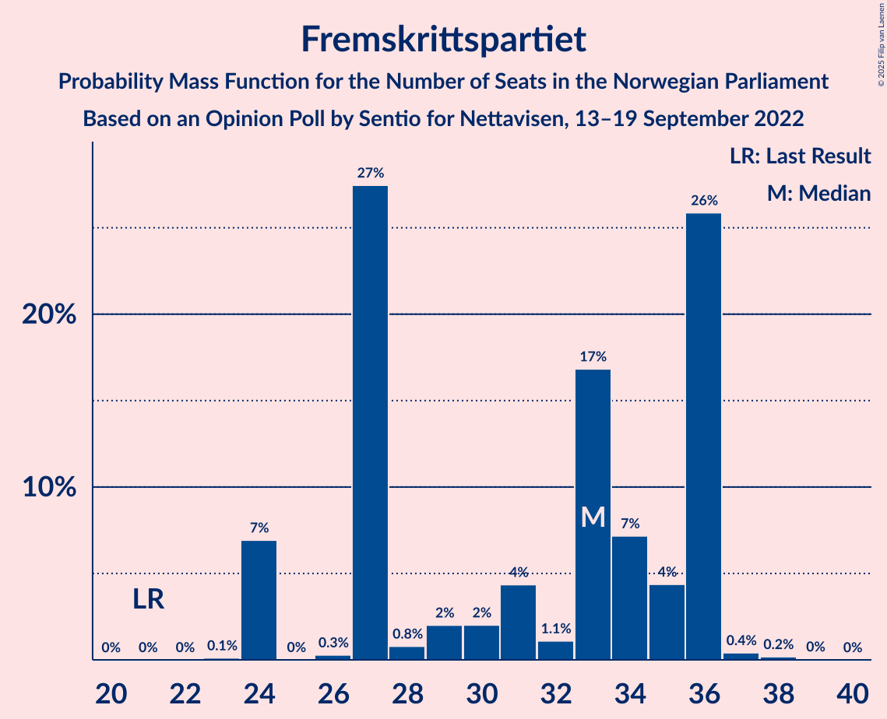
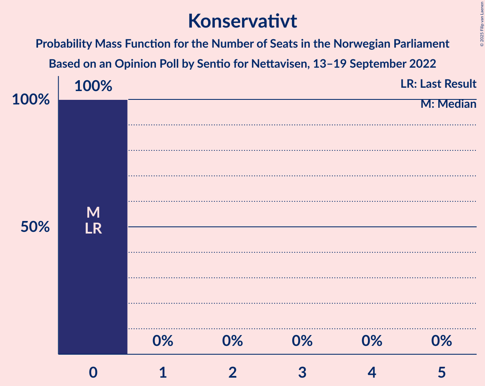

# Opinion Poll by Sentio for Nettavisen, 13–19 September 2022

<a href="#voting-intentions">Voting Intentions</a> | <a href="#seats">Seats</a> | <a href="#coalitions">Coalitions</a> | <a href="#technical-information">Technical Information</a>

## Voting Intentions

### Confidence Intervals

| Party | Last Result | Poll Result | 80% Confidence Interval | 90% Confidence Interval | 95% Confidence Interval | 99% Confidence Interval |
|:-----:|:-----------:|:-----------:|:-----------------------:|:-----------------------:|:-----------------------:|:-----------------------:|
| Høyre | 20.4% | 26.6% | 24.8–28.4% |24.3–28.9% |23.9–29.4% |23.1–30.3% |
| Arbeiderpartiet | 26.2% | 19.1% | 17.6–20.8% |17.1–21.2% |16.8–21.6% |16.0–22.5% |
| Fremskrittspartiet | 11.6% | 16.7% | 15.2–18.3% |14.8–18.7% |14.5–19.1% |13.8–19.9% |
| Rødt | 4.7% | 7.5% | 6.5–8.7% |6.2–9.0% |6.0–9.3% |5.6–9.9% |
| Sosialistisk Venstreparti | 7.6% | 7.4% | 6.4–8.6% |6.2–8.9% |5.9–9.2% |5.5–9.8% |
| Senterpartiet | 13.5% | 5.4% | 4.6–6.4% |4.3–6.7% |4.2–7.0% |3.8–7.5% |
| Venstre | 4.6% | 5.0% | 4.2–6.0% |4.0–6.3% |3.8–6.5% |3.5–7.0% |
| Kristelig Folkeparti | 3.8% | 4.3% | 3.6–5.2% |3.4–5.5% |3.2–5.7% |2.9–6.2% |
| Miljøpartiet De Grønne | 3.9% | 4.0% | 3.3–4.9% |3.1–5.2% |2.9–5.4% |2.6–5.9% |
| Industri- og Næringspartiet | 0.3% | 2.1% | 1.6–2.8% |1.5–3.0% |1.4–3.2% |1.2–3.6% |
| Norgesdemokratene | 1.1% | 0.8% | 0.5–1.3% |0.5–1.4% |0.4–1.6% |0.3–1.8% |
| Konservativt | 0.4% | 0.4% | 0.2–0.8% |0.2–0.9% |0.2–1.0% |0.1–1.3% |
| Pensjonistpartiet | 0.6% | 0.4% | 0.2–0.8% |0.2–0.9% |0.2–1.0% |0.1–1.3% |
| Folkets parti | 0.1% | 0.2% | 0.1–0.5% |0.1–0.6% |0.1–0.7% |0.0–0.9% |
| Helsepartiet | 0.2% | 0.2% | 0.1–0.5% |0.1–0.6% |0.1–0.7% |0.0–0.9% |

*Note:* The poll result column reflects the actual value used in the calculations. Published results may vary slightly, and in addition be rounded to fewer digits.

## Seats

### Confidence Intervals

| Party | Last Result | Median | 80% Confidence Interval | 90% Confidence Interval | 95% Confidence Interval | 99% Confidence Interval |
|:-----:|:-----------:|:------:|:-----------------------:|:-----------------------:|:-----------------------:|:-----------------------:|
| <a href="#høyre">Høyre</a> | 36 | 46 | 43–50 |43–50 |41–50 |41–54 |
| <a href="#arbeiderpartiet">Arbeiderpartiet</a> | 48 | 34 | 31–39 |31–42 |31–42 |31–44 |
| <a href="#fremskrittspartiet">Fremskrittspartiet</a> | 21 | 33 | 27–36 |24–36 |24–36 |24–37 |
| <a href="#rødt">Rødt</a> | 8 | 13 | 10–14 |10–14 |10–14 |8–17 |
| <a href="#sosialistisk-venstreparti">Sosialistisk Venstreparti</a> | 13 | 12 | 11–15 |11–15 |10–15 |8–17 |
| <a href="#senterpartiet">Senterpartiet</a> | 28 | 9 | 8–14 |8–14 |7–14 |1–16 |
| <a href="#venstre">Venstre</a> | 8 | 9 | 7–11 |3–11 |3–12 |2–12 |
| <a href="#kristelig-folkeparti">Kristelig Folkeparti</a> | 3 | 7 | 3–8 |3–9 |2–9 |2–10 |
| <a href="#miljøpartiet-de-grønne">Miljøpartiet De Grønne</a> | 3 | 7 | 2–10 |1–10 |1–10 |1–10 |
| <a href="#industri--og-næringspartiet">Industri- og Næringspartiet</a> | 0 | 1 | 0–2 |0–2 |0–2 |0–2 |
| <a href="#norgesdemokratene">Norgesdemokratene</a> | 0 | 0 | 0 |0 |0 |0 |
| <a href="#konservativt">Konservativt</a> | 0 | 0 | 0 |0 |0 |0 |
| <a href="#pensjonistpartiet">Pensjonistpartiet</a> | 0 | 0 | 0 |0 |0 |0 |
| <a href="#folkets-parti">Folkets parti</a> | 0 | 0 | 0 |0 |0 |0 |
| <a href="#helsepartiet">Helsepartiet</a> | 0 | 0 | 0 |0 |0 |0 |

### Høyre

*For a full overview of the results for this party, see the [Høyre](party-høyre.html) page.*

| Number of Seats | Probability | Accumulated | Special Marks |
|:---------------:|:-----------:|:-----------:|:-------------:|
| 36 | 0% | 100% | Last Result |
| 37 | 0% | 100% |  |
| 38 | 0% | 100% |  |
| 39 | 0.2% | 100% |  |
| 40 | 0.2% | 99.8% |  |
| 41 | 4% | 99.7% |  |
| 42 | 0.1% | 96% |  |
| 43 | 19% | 96% |  |
| 44 | 0.4% | 77% |  |
| 45 | 18% | 76% |  |
| 46 | 27% | 59% | Median |
| 47 | 0.5% | 31% |  |
| 48 | 9% | 31% |  |
| 49 | 8% | 22% |  |
| 50 | 12% | 14% |  |
| 51 | 0.2% | 2% |  |
| 52 | 0% | 2% |  |
| 53 | 0.4% | 2% |  |
| 54 | 1.3% | 1.4% |  |
| 55 | 0.1% | 0.1% |  |
| 56 | 0% | 0% |  |

### Arbeiderpartiet

*For a full overview of the results for this party, see the [Arbeiderpartiet](party-arbeiderpartiet.html) page.*

| Number of Seats | Probability | Accumulated | Special Marks |
|:---------------:|:-----------:|:-----------:|:-------------:|
| 30 | 0.2% | 100% |  |
| 31 | 42% | 99.8% |  |
| 32 | 0.6% | 58% |  |
| 33 | 2% | 58% |  |
| 34 | 11% | 56% | Median |
| 35 | 20% | 44% |  |
| 36 | 1.0% | 24% |  |
| 37 | 8% | 23% |  |
| 38 | 0.3% | 15% |  |
| 39 | 8% | 14% |  |
| 40 | 1.2% | 7% |  |
| 41 | 0.3% | 5% |  |
| 42 | 4% | 5% |  |
| 43 | 0.5% | 1.2% |  |
| 44 | 0.6% | 0.8% |  |
| 45 | 0% | 0.2% |  |
| 46 | 0.2% | 0.2% |  |
| 47 | 0% | 0% |  |
| 48 | 0% | 0% | Last Result |

### Fremskrittspartiet

*For a full overview of the results for this party, see the [Fremskrittspartiet](party-fremskrittspartiet.html) page.*

| Number of Seats | Probability | Accumulated | Special Marks |
|:---------------:|:-----------:|:-----------:|:-------------:|
| 21 | 0% | 100% | Last Result |
| 22 | 0% | 100% |  |
| 23 | 0.1% | 100% |  |
| 24 | 7% | 99.9% |  |
| 25 | 0% | 93% |  |
| 26 | 0.3% | 93% |  |
| 27 | 27% | 93% |  |
| 28 | 0.8% | 65% |  |
| 29 | 2% | 64% |  |
| 30 | 2% | 62% |  |
| 31 | 4% | 60% |  |
| 32 | 1.1% | 56% |  |
| 33 | 17% | 55% | Median |
| 34 | 7% | 38% |  |
| 35 | 4% | 31% |  |
| 36 | 26% | 27% |  |
| 37 | 0.4% | 0.7% |  |
| 38 | 0.2% | 0.2% |  |
| 39 | 0% | 0.1% |  |
| 40 | 0% | 0% |  |

### Rødt

*For a full overview of the results for this party, see the [Rødt](party-rødt.html) page.*

| Number of Seats | Probability | Accumulated | Special Marks |
|:---------------:|:-----------:|:-----------:|:-------------:|
| 8 | 0.6% | 100% | Last Result |
| 9 | 0.3% | 99.4% |  |
| 10 | 14% | 99.1% |  |
| 11 | 19% | 85% |  |
| 12 | 8% | 65% |  |
| 13 | 38% | 57% | Median |
| 14 | 17% | 19% |  |
| 15 | 1.3% | 2% |  |
| 16 | 0.3% | 0.9% |  |
| 17 | 0.3% | 0.6% |  |
| 18 | 0.1% | 0.3% |  |
| 19 | 0.2% | 0.2% |  |
| 20 | 0% | 0% |  |

### Sosialistisk Venstreparti

*For a full overview of the results for this party, see the [Sosialistisk Venstreparti](party-sosialistiskvenstreparti.html) page.*

| Number of Seats | Probability | Accumulated | Special Marks |
|:---------------:|:-----------:|:-----------:|:-------------:|
| 7 | 0.1% | 100% |  |
| 8 | 0.6% | 99.9% |  |
| 9 | 2% | 99.3% |  |
| 10 | 2% | 98% |  |
| 11 | 16% | 96% |  |
| 12 | 35% | 80% | Median |
| 13 | 24% | 45% | Last Result |
| 14 | 2% | 20% |  |
| 15 | 17% | 19% |  |
| 16 | 0.4% | 2% |  |
| 17 | 1.3% | 1.3% |  |
| 18 | 0% | 0% |  |

### Senterpartiet

*For a full overview of the results for this party, see the [Senterpartiet](party-senterpartiet.html) page.*

| Number of Seats | Probability | Accumulated | Special Marks |
|:---------------:|:-----------:|:-----------:|:-------------:|
| 0 | 0.1% | 100% |  |
| 1 | 0.6% | 99.9% |  |
| 2 | 0.1% | 99.3% |  |
| 3 | 0% | 99.2% |  |
| 4 | 0% | 99.2% |  |
| 5 | 0% | 99.2% |  |
| 6 | 0% | 99.2% |  |
| 7 | 2% | 99.2% |  |
| 8 | 21% | 97% |  |
| 9 | 36% | 76% | Median |
| 10 | 13% | 40% |  |
| 11 | 7% | 27% |  |
| 12 | 0.2% | 20% |  |
| 13 | 2% | 20% |  |
| 14 | 17% | 18% |  |
| 15 | 0% | 0.5% |  |
| 16 | 0.5% | 0.5% |  |
| 17 | 0% | 0% |  |
| 18 | 0% | 0% |  |
| 19 | 0% | 0% |  |
| 20 | 0% | 0% |  |
| 21 | 0% | 0% |  |
| 22 | 0% | 0% |  |
| 23 | 0% | 0% |  |
| 24 | 0% | 0% |  |
| 25 | 0% | 0% |  |
| 26 | 0% | 0% |  |
| 27 | 0% | 0% |  |
| 28 | 0% | 0% | Last Result |

### Venstre

*For a full overview of the results for this party, see the [Venstre](party-venstre.html) page.*

| Number of Seats | Probability | Accumulated | Special Marks |
|:---------------:|:-----------:|:-----------:|:-------------:|
| 2 | 0.8% | 100% |  |
| 3 | 9% | 99.2% |  |
| 4 | 0% | 90% |  |
| 5 | 0% | 90% |  |
| 6 | 0.2% | 90% |  |
| 7 | 1.2% | 90% |  |
| 8 | 6% | 89% | Last Result |
| 9 | 42% | 83% | Median |
| 10 | 20% | 41% |  |
| 11 | 17% | 21% |  |
| 12 | 4% | 4% |  |
| 13 | 0.1% | 0.2% |  |
| 14 | 0.1% | 0.1% |  |
| 15 | 0% | 0% |  |

### Kristelig Folkeparti

*For a full overview of the results for this party, see the [Kristelig Folkeparti](party-kristeligfolkeparti.html) page.*

| Number of Seats | Probability | Accumulated | Special Marks |
|:---------------:|:-----------:|:-----------:|:-------------:|
| 2 | 3% | 100% |  |
| 3 | 46% | 97% | Last Result |
| 4 | 0% | 51% |  |
| 5 | 0% | 51% |  |
| 6 | 0.8% | 51% |  |
| 7 | 18% | 50% | Median |
| 8 | 23% | 32% |  |
| 9 | 8% | 9% |  |
| 10 | 0.4% | 0.6% |  |
| 11 | 0.2% | 0.2% |  |
| 12 | 0% | 0% |  |

### Miljøpartiet De Grønne

*For a full overview of the results for this party, see the [Miljøpartiet De Grønne](party-miljøpartietdegrønne.html) page.*

| Number of Seats | Probability | Accumulated | Special Marks |
|:---------------:|:-----------:|:-----------:|:-------------:|
| 1 | 9% | 100% |  |
| 2 | 5% | 91% |  |
| 3 | 14% | 87% | Last Result |
| 4 | 0% | 72% |  |
| 5 | 0% | 72% |  |
| 6 | 0.1% | 72% |  |
| 7 | 49% | 72% | Median |
| 8 | 3% | 23% |  |
| 9 | 4% | 20% |  |
| 10 | 17% | 17% |  |
| 11 | 0% | 0% |  |

### Industri- og Næringspartiet

*For a full overview of the results for this party, see the [Industri- og Næringspartiet](party-industri-ognæringspartiet.html) page.*

| Number of Seats | Probability | Accumulated | Special Marks |
|:---------------:|:-----------:|:-----------:|:-------------:|
| 0 | 48% | 100% | Last Result |
| 1 | 15% | 52% | Median |
| 2 | 37% | 38% |  |
| 3 | 0.2% | 0.3% |  |
| 4 | 0% | 0% |  |

### Norgesdemokratene

*For a full overview of the results for this party, see the [Norgesdemokratene](party-norgesdemokratene.html) page.*

| Number of Seats | Probability | Accumulated | Special Marks |
|:---------------:|:-----------:|:-----------:|:-------------:|
| 0 | 100% | 100% | Last Result, Median |

### Konservativt

*For a full overview of the results for this party, see the [Konservativt](party-konservativt.html) page.*

| Number of Seats | Probability | Accumulated | Special Marks |
|:---------------:|:-----------:|:-----------:|:-------------:|
| 0 | 100% | 100% | Last Result, Median |

### Pensjonistpartiet

*For a full overview of the results for this party, see the [Pensjonistpartiet](party-pensjonistpartiet.html) page.*

| Number of Seats | Probability | Accumulated | Special Marks |
|:---------------:|:-----------:|:-----------:|:-------------:|
| 0 | 100% | 100% | Last Result, Median |

### Folkets parti

*For a full overview of the results for this party, see the [Folkets parti](party-folketsparti.html) page.*

| Number of Seats | Probability | Accumulated | Special Marks |
|:---------------:|:-----------:|:-----------:|:-------------:|
| 0 | 100% | 100% | Last Result, Median |

### Helsepartiet

*For a full overview of the results for this party, see the [Helsepartiet](party-helsepartiet.html) page.*

| Number of Seats | Probability | Accumulated | Special Marks |
|:---------------:|:-----------:|:-----------:|:-------------:|
| 0 | 100% | 100% | Last Result, Median |

## Coalitions

### Confidence Intervals

| Coalition | Last Result | Median | Majority? | 80% Confidence Interval | 90% Confidence Interval | 95% Confidence Interval | 99% Confidence Interval |
|:---------:|:-----------:|:------:|:---------:|:-----------------------:|:-----------------------:|:-----------------------:|:-----------------------:|
| Høyre – Fremskrittspartiet – Senterpartiet – Venstre – Kristelig Folkeparti | 96 | 103 | 99.8% | 94–106 | 94–106 | 94–106 | 93–111 |
| Høyre – Fremskrittspartiet – Venstre – Kristelig Folkeparti – Miljøpartiet De Grønne | 71 | 98 | 100% | 96–101 | 94–101 | 90–103 | 85–106 |
| Høyre – Fremskrittspartiet – Venstre – Kristelig Folkeparti | 68 | 92 | 98.6% | 86–95 | 86–95 | 85–98 | 82–102 |
| Høyre – Fremskrittspartiet – Venstre | 65 | 86 | 68% | 82–91 | 82–91 | 81–92 | 77–96 |
| Høyre – Fremskrittspartiet | 57 | 77 | 0.8% | 72–82 | 72–83 | 72–84 | 72–86 |
| Arbeiderpartiet – Rødt – Sosialistisk Venstreparti – Senterpartiet – Miljøpartiet De Grønne | 100 | 76 | 0.3% | 71–82 | 71–82 | 70–83 | 66–84 |
| Arbeiderpartiet – Rødt – Sosialistisk Venstreparti – Senterpartiet | 97 | 69 | 0% | 65–72 | 65–74 | 64–78 | 60–81 |
| Arbeiderpartiet – Sosialistisk Venstreparti – Senterpartiet – Kristelig Folkeparti – Miljøpartiet De Grønne | 95 | 71 | 0% | 62–73 | 62–75 | 62–75 | 61–78 |
| Arbeiderpartiet – Rødt – Sosialistisk Venstreparti – Miljøpartiet De Grønne | 72 | 63 | 0.2% | 61–74 | 61–74 | 61–74 | 57–74 |
| Arbeiderpartiet – Sosialistisk Venstreparti – Senterpartiet – Miljøpartiet De Grønne | 92 | 64 | 0% | 58–68 | 58–68 | 58–68 | 55–71 |
| Høyre – Venstre – Kristelig Folkeparti | 47 | 59 | 0% | 58–68 | 57–68 | 55–68 | 51–68 |
| Arbeiderpartiet – Sosialistisk Venstreparti – Senterpartiet | 89 | 58 | 0% | 52–61 | 52–62 | 52–65 | 49–68 |
| Arbeiderpartiet – Senterpartiet – Kristelig Folkeparti – Miljøpartiet De Grønne | 82 | 56 | 0% | 50–61 | 50–63 | 50–63 | 49–65 |
| Arbeiderpartiet – Senterpartiet – Kristelig Folkeparti | 79 | 52 | 0% | 43–56 | 43–57 | 43–57 | 42–61 |
| Arbeiderpartiet – Sosialistisk Venstreparti | 61 | 45 | 0% | 43–52 | 43–53 | 43–54 | 41–56 |
| Arbeiderpartiet – Senterpartiet | 76 | 44 | 0% | 40–48 | 40–50 | 40–52 | 39–53 |
| Senterpartiet – Venstre – Kristelig Folkeparti | 39 | 22 | 0% | 21–30 | 21–30 | 20–30 | 15–30 |

### Høyre – Fremskrittspartiet – Senterpartiet – Venstre – Kristelig Folkeparti

| Number of Seats | Probability | Accumulated | Special Marks |
|:---------------:|:-----------:|:-----------:|:-------------:|
| 83 | 0.2% | 100% |  |
| 84 | 0% | 99.8% |  |
| 85 | 0% | 99.8% | Majority |
| 86 | 0% | 99.8% |  |
| 87 | 0% | 99.8% |  |
| 88 | 0% | 99.8% |  |
| 89 | 0% | 99.8% |  |
| 90 | 0% | 99.7% |  |
| 91 | 0.1% | 99.7% |  |
| 92 | 0.1% | 99.7% |  |
| 93 | 0.2% | 99.6% |  |
| 94 | 16% | 99.4% |  |
| 95 | 0.5% | 83% |  |
| 96 | 0.6% | 83% | Last Result |
| 97 | 0.7% | 82% |  |
| 98 | 0.9% | 81% |  |
| 99 | 0.1% | 80% |  |
| 100 | 3% | 80% |  |
| 101 | 13% | 77% |  |
| 102 | 2% | 64% |  |
| 103 | 24% | 62% |  |
| 104 | 7% | 38% | Median |
| 105 | 13% | 31% |  |
| 106 | 17% | 18% |  |
| 107 | 0.3% | 2% |  |
| 108 | 0.5% | 1.3% |  |
| 109 | 0% | 0.8% |  |
| 110 | 0.1% | 0.8% |  |
| 111 | 0.3% | 0.7% |  |
| 112 | 0.4% | 0.4% |  |
| 113 | 0% | 0% |  |

### Høyre – Fremskrittspartiet – Venstre – Kristelig Folkeparti – Miljøpartiet De Grønne

| Number of Seats | Probability | Accumulated | Special Marks |
|:---------------:|:-----------:|:-----------:|:-------------:|
| 71 | 0% | 100% | Last Result |
| 72 | 0% | 100% |  |
| 73 | 0% | 100% |  |
| 74 | 0% | 100% |  |
| 75 | 0% | 100% |  |
| 76 | 0% | 100% |  |
| 77 | 0% | 100% |  |
| 78 | 0% | 100% |  |
| 79 | 0% | 100% |  |
| 80 | 0% | 100% |  |
| 81 | 0% | 100% |  |
| 82 | 0% | 100% |  |
| 83 | 0% | 100% |  |
| 84 | 0% | 100% |  |
| 85 | 0.6% | 100% | Majority |
| 86 | 0% | 99.4% |  |
| 87 | 0% | 99.4% |  |
| 88 | 1.2% | 99.4% |  |
| 89 | 0.2% | 98% |  |
| 90 | 0.7% | 98% |  |
| 91 | 0% | 97% |  |
| 92 | 1.0% | 97% |  |
| 93 | 0.6% | 96% |  |
| 94 | 4% | 96% |  |
| 95 | 1.0% | 92% |  |
| 96 | 24% | 91% |  |
| 97 | 7% | 67% |  |
| 98 | 11% | 60% |  |
| 99 | 17% | 49% |  |
| 100 | 2% | 32% |  |
| 101 | 28% | 31% |  |
| 102 | 0.1% | 3% | Median |
| 103 | 0.3% | 3% |  |
| 104 | 0.5% | 2% |  |
| 105 | 0.2% | 2% |  |
| 106 | 2% | 2% |  |
| 107 | 0% | 0.1% |  |
| 108 | 0% | 0.1% |  |
| 109 | 0% | 0% |  |

### Høyre – Fremskrittspartiet – Venstre – Kristelig Folkeparti

| Number of Seats | Probability | Accumulated | Special Marks |
|:---------------:|:-----------:|:-----------:|:-------------:|
| 68 | 0% | 100% | Last Result |
| 69 | 0% | 100% |  |
| 70 | 0% | 100% |  |
| 71 | 0% | 100% |  |
| 72 | 0% | 100% |  |
| 73 | 0% | 100% |  |
| 74 | 0% | 100% |  |
| 75 | 0% | 100% |  |
| 76 | 0% | 100% |  |
| 77 | 0% | 100% |  |
| 78 | 0% | 100% |  |
| 79 | 0% | 100% |  |
| 80 | 0% | 100% |  |
| 81 | 0% | 100% |  |
| 82 | 0.8% | 100% |  |
| 83 | 0.1% | 99.2% |  |
| 84 | 0.5% | 99.1% |  |
| 85 | 1.2% | 98.6% | Majority |
| 86 | 17% | 97% |  |
| 87 | 0.4% | 81% |  |
| 88 | 0.2% | 80% |  |
| 89 | 0.7% | 80% |  |
| 90 | 7% | 80% |  |
| 91 | 0.2% | 72% |  |
| 92 | 25% | 72% |  |
| 93 | 1.2% | 47% |  |
| 94 | 24% | 46% |  |
| 95 | 18% | 21% | Median |
| 96 | 0.2% | 3% |  |
| 97 | 0.1% | 3% |  |
| 98 | 1.4% | 3% |  |
| 99 | 0.5% | 2% |  |
| 100 | 0% | 1.1% |  |
| 101 | 0.4% | 1.0% |  |
| 102 | 0.4% | 0.7% |  |
| 103 | 0.2% | 0.2% |  |
| 104 | 0% | 0.1% |  |
| 105 | 0% | 0% |  |

### Høyre – Fremskrittspartiet – Venstre

| Number of Seats | Probability | Accumulated | Special Marks |
|:---------------:|:-----------:|:-----------:|:-------------:|
| 65 | 0% | 100% | Last Result |
| 66 | 0% | 100% |  |
| 67 | 0% | 100% |  |
| 68 | 0% | 100% |  |
| 69 | 0% | 100% |  |
| 70 | 0% | 100% |  |
| 71 | 0% | 100% |  |
| 72 | 0% | 100% |  |
| 73 | 0% | 100% |  |
| 74 | 0% | 100% |  |
| 75 | 0% | 100% |  |
| 76 | 0% | 100% |  |
| 77 | 0.5% | 100% |  |
| 78 | 0.2% | 99.4% |  |
| 79 | 0.1% | 99.3% |  |
| 80 | 1.5% | 99.1% |  |
| 81 | 0.6% | 98% |  |
| 82 | 8% | 97% |  |
| 83 | 17% | 89% |  |
| 84 | 4% | 73% |  |
| 85 | 17% | 68% | Majority |
| 86 | 7% | 51% |  |
| 87 | 12% | 44% |  |
| 88 | 0.2% | 32% | Median |
| 89 | 4% | 32% |  |
| 90 | 0.8% | 28% |  |
| 91 | 24% | 27% |  |
| 92 | 0.6% | 3% |  |
| 93 | 0.1% | 2% |  |
| 94 | 0.2% | 2% |  |
| 95 | 0.3% | 2% |  |
| 96 | 1.3% | 2% |  |
| 97 | 0% | 0.2% |  |
| 98 | 0.1% | 0.2% |  |
| 99 | 0% | 0.1% |  |
| 100 | 0.1% | 0.1% |  |
| 101 | 0% | 0% |  |

### Høyre – Fremskrittspartiet

| Number of Seats | Probability | Accumulated | Special Marks |
|:---------------:|:-----------:|:-----------:|:-------------:|
| 57 | 0% | 100% | Last Result |
| 58 | 0% | 100% |  |
| 59 | 0% | 100% |  |
| 60 | 0% | 100% |  |
| 61 | 0% | 100% |  |
| 62 | 0% | 100% |  |
| 63 | 0% | 100% |  |
| 64 | 0% | 100% |  |
| 65 | 0% | 100% |  |
| 66 | 0% | 100% |  |
| 67 | 0% | 100% |  |
| 68 | 0% | 100% |  |
| 69 | 0.1% | 99.9% |  |
| 70 | 0% | 99.9% |  |
| 71 | 0.2% | 99.9% |  |
| 72 | 24% | 99.6% |  |
| 73 | 0.3% | 76% |  |
| 74 | 0.8% | 76% |  |
| 75 | 1.1% | 75% |  |
| 76 | 20% | 74% |  |
| 77 | 16% | 53% |  |
| 78 | 0.3% | 38% |  |
| 79 | 2% | 37% | Median |
| 80 | 0.7% | 36% |  |
| 81 | 0.2% | 35% |  |
| 82 | 25% | 35% |  |
| 83 | 7% | 10% |  |
| 84 | 2% | 3% |  |
| 85 | 0.3% | 0.8% | Majority |
| 86 | 0.2% | 0.5% |  |
| 87 | 0% | 0.3% |  |
| 88 | 0.3% | 0.3% |  |
| 89 | 0% | 0% |  |

### Arbeiderpartiet – Rødt – Sosialistisk Venstreparti – Senterpartiet – Miljøpartiet De Grønne

| Number of Seats | Probability | Accumulated | Special Marks |
|:---------------:|:-----------:|:-----------:|:-------------:|
| 63 | 0.1% | 100% |  |
| 64 | 0% | 99.9% |  |
| 65 | 0.2% | 99.8% |  |
| 66 | 0.3% | 99.7% |  |
| 67 | 0.8% | 99.3% |  |
| 68 | 0% | 98.5% |  |
| 69 | 0.1% | 98% |  |
| 70 | 1.5% | 98% |  |
| 71 | 11% | 97% |  |
| 72 | 31% | 86% |  |
| 73 | 0.2% | 55% |  |
| 74 | 0.7% | 54% |  |
| 75 | 1.2% | 54% | Median |
| 76 | 25% | 52% |  |
| 77 | 7% | 28% |  |
| 78 | 0.3% | 21% |  |
| 79 | 0.8% | 20% |  |
| 80 | 0% | 19% |  |
| 81 | 0.3% | 19% |  |
| 82 | 17% | 19% |  |
| 83 | 2% | 3% |  |
| 84 | 0.5% | 0.9% |  |
| 85 | 0% | 0.3% | Majority |
| 86 | 0.3% | 0.3% |  |
| 87 | 0% | 0% |  |
| 88 | 0% | 0% |  |
| 89 | 0% | 0% |  |
| 90 | 0% | 0% |  |
| 91 | 0% | 0% |  |
| 92 | 0% | 0% |  |
| 93 | 0% | 0% |  |
| 94 | 0% | 0% |  |
| 95 | 0% | 0% |  |
| 96 | 0% | 0% |  |
| 97 | 0% | 0% |  |
| 98 | 0% | 0% |  |
| 99 | 0% | 0% |  |
| 100 | 0% | 0% | Last Result |

### Arbeiderpartiet – Rødt – Sosialistisk Venstreparti – Senterpartiet

| Number of Seats | Probability | Accumulated | Special Marks |
|:---------------:|:-----------:|:-----------:|:-------------:|
| 60 | 0.5% | 100% |  |
| 61 | 0.2% | 99.5% |  |
| 62 | 1.3% | 99.3% |  |
| 63 | 0.2% | 98% |  |
| 64 | 0.4% | 98% |  |
| 65 | 24% | 97% |  |
| 66 | 0.1% | 73% |  |
| 67 | 4% | 73% |  |
| 68 | 13% | 69% | Median |
| 69 | 17% | 57% |  |
| 70 | 7% | 40% |  |
| 71 | 7% | 33% |  |
| 72 | 17% | 25% |  |
| 73 | 1.5% | 9% |  |
| 74 | 4% | 7% |  |
| 75 | 0.6% | 4% |  |
| 76 | 0.5% | 3% |  |
| 77 | 0.1% | 3% |  |
| 78 | 0.7% | 3% |  |
| 79 | 0.2% | 2% |  |
| 80 | 1.2% | 2% |  |
| 81 | 0.5% | 0.6% |  |
| 82 | 0% | 0.1% |  |
| 83 | 0.1% | 0.1% |  |
| 84 | 0% | 0% |  |
| 85 | 0% | 0% | Majority |
| 86 | 0% | 0% |  |
| 87 | 0% | 0% |  |
| 88 | 0% | 0% |  |
| 89 | 0% | 0% |  |
| 90 | 0% | 0% |  |
| 91 | 0% | 0% |  |
| 92 | 0% | 0% |  |
| 93 | 0% | 0% |  |
| 94 | 0% | 0% |  |
| 95 | 0% | 0% |  |
| 96 | 0% | 0% |  |
| 97 | 0% | 0% | Last Result |

### Arbeiderpartiet – Sosialistisk Venstreparti – Senterpartiet – Kristelig Folkeparti – Miljøpartiet De Grønne

| Number of Seats | Probability | Accumulated | Special Marks |
|:---------------:|:-----------:|:-----------:|:-------------:|
| 54 | 0.1% | 100% |  |
| 55 | 0.1% | 99.9% |  |
| 56 | 0% | 99.8% |  |
| 57 | 0% | 99.8% |  |
| 58 | 0% | 99.8% |  |
| 59 | 0% | 99.8% |  |
| 60 | 0.2% | 99.8% |  |
| 61 | 2% | 99.6% |  |
| 62 | 24% | 98% |  |
| 63 | 0.5% | 73% |  |
| 64 | 0.2% | 73% |  |
| 65 | 0.4% | 73% |  |
| 66 | 12% | 72% |  |
| 67 | 3% | 60% |  |
| 68 | 0.3% | 57% |  |
| 69 | 0.7% | 57% | Median |
| 70 | 0.4% | 56% |  |
| 71 | 24% | 56% |  |
| 72 | 20% | 31% |  |
| 73 | 2% | 11% |  |
| 74 | 0.2% | 9% |  |
| 75 | 7% | 9% |  |
| 76 | 0.7% | 1.5% |  |
| 77 | 0% | 0.7% |  |
| 78 | 0.5% | 0.7% |  |
| 79 | 0% | 0.2% |  |
| 80 | 0.2% | 0.2% |  |
| 81 | 0% | 0% |  |
| 82 | 0% | 0% |  |
| 83 | 0% | 0% |  |
| 84 | 0% | 0% |  |
| 85 | 0% | 0% | Majority |
| 86 | 0% | 0% |  |
| 87 | 0% | 0% |  |
| 88 | 0% | 0% |  |
| 89 | 0% | 0% |  |
| 90 | 0% | 0% |  |
| 91 | 0% | 0% |  |
| 92 | 0% | 0% |  |
| 93 | 0% | 0% |  |
| 94 | 0% | 0% |  |
| 95 | 0% | 0% | Last Result |

### Arbeiderpartiet – Rødt – Sosialistisk Venstreparti – Miljøpartiet De Grønne

| Number of Seats | Probability | Accumulated | Special Marks |
|:---------------:|:-----------:|:-----------:|:-------------:|
| 56 | 0.4% | 100% |  |
| 57 | 0.4% | 99.6% |  |
| 58 | 0.4% | 99.2% |  |
| 59 | 0.1% | 98.8% |  |
| 60 | 0.1% | 98.6% |  |
| 61 | 11% | 98.6% |  |
| 62 | 17% | 87% |  |
| 63 | 32% | 70% |  |
| 64 | 0.2% | 38% |  |
| 65 | 0.2% | 38% |  |
| 66 | 9% | 37% | Median |
| 67 | 6% | 28% |  |
| 68 | 3% | 23% |  |
| 69 | 0.1% | 20% |  |
| 70 | 2% | 19% |  |
| 71 | 0.1% | 18% |  |
| 72 | 0% | 17% | Last Result |
| 73 | 0.5% | 17% |  |
| 74 | 16% | 17% |  |
| 75 | 0.1% | 0.5% |  |
| 76 | 0% | 0.4% |  |
| 77 | 0.1% | 0.3% |  |
| 78 | 0% | 0.2% |  |
| 79 | 0% | 0.2% |  |
| 80 | 0% | 0.2% |  |
| 81 | 0% | 0.2% |  |
| 82 | 0% | 0.2% |  |
| 83 | 0% | 0.2% |  |
| 84 | 0% | 0.2% |  |
| 85 | 0.2% | 0.2% | Majority |
| 86 | 0% | 0% |  |

### Arbeiderpartiet – Sosialistisk Venstreparti – Senterpartiet – Miljøpartiet De Grønne

| Number of Seats | Probability | Accumulated | Special Marks |
|:---------------:|:-----------:|:-----------:|:-------------:|
| 51 | 0.1% | 100% |  |
| 52 | 0.2% | 99.9% |  |
| 53 | 0% | 99.7% |  |
| 54 | 0% | 99.6% |  |
| 55 | 0.7% | 99.6% |  |
| 56 | 0.5% | 98.9% |  |
| 57 | 0.1% | 98% |  |
| 58 | 11% | 98% |  |
| 59 | 26% | 87% |  |
| 60 | 0.3% | 61% |  |
| 61 | 0.4% | 61% |  |
| 62 | 7% | 60% | Median |
| 63 | 1.5% | 53% |  |
| 64 | 6% | 52% |  |
| 65 | 17% | 45% |  |
| 66 | 0.4% | 28% |  |
| 67 | 8% | 28% |  |
| 68 | 17% | 19% |  |
| 69 | 0.2% | 2% |  |
| 70 | 1.1% | 2% |  |
| 71 | 0.7% | 0.7% |  |
| 72 | 0% | 0% |  |
| 73 | 0% | 0% |  |
| 74 | 0% | 0% |  |
| 75 | 0% | 0% |  |
| 76 | 0% | 0% |  |
| 77 | 0% | 0% |  |
| 78 | 0% | 0% |  |
| 79 | 0% | 0% |  |
| 80 | 0% | 0% |  |
| 81 | 0% | 0% |  |
| 82 | 0% | 0% |  |
| 83 | 0% | 0% |  |
| 84 | 0% | 0% |  |
| 85 | 0% | 0% | Majority |
| 86 | 0% | 0% |  |
| 87 | 0% | 0% |  |
| 88 | 0% | 0% |  |
| 89 | 0% | 0% |  |
| 90 | 0% | 0% |  |
| 91 | 0% | 0% |  |
| 92 | 0% | 0% | Last Result |

### Høyre – Venstre – Kristelig Folkeparti

| Number of Seats | Probability | Accumulated | Special Marks |
|:---------------:|:-----------:|:-----------:|:-------------:|
| 47 | 0% | 100% | Last Result |
| 48 | 0% | 100% |  |
| 49 | 0% | 100% |  |
| 50 | 0% | 100% |  |
| 51 | 0.5% | 100% |  |
| 52 | 0.1% | 99.4% |  |
| 53 | 0% | 99.4% |  |
| 54 | 0.8% | 99.4% |  |
| 55 | 1.3% | 98.5% |  |
| 56 | 1.4% | 97% |  |
| 57 | 4% | 96% |  |
| 58 | 24% | 92% |  |
| 59 | 33% | 68% |  |
| 60 | 1.4% | 34% |  |
| 61 | 10% | 33% |  |
| 62 | 0.5% | 23% | Median |
| 63 | 0.8% | 22% |  |
| 64 | 0.3% | 21% |  |
| 65 | 0.6% | 21% |  |
| 66 | 7% | 20% |  |
| 67 | 0.3% | 13% |  |
| 68 | 12% | 13% |  |
| 69 | 0.1% | 0.3% |  |
| 70 | 0% | 0.2% |  |
| 71 | 0.2% | 0.2% |  |
| 72 | 0% | 0% |  |

### Arbeiderpartiet – Sosialistisk Venstreparti – Senterpartiet

| Number of Seats | Probability | Accumulated | Special Marks |
|:---------------:|:-----------:|:-----------:|:-------------:|
| 48 | 0% | 100% |  |
| 49 | 0.6% | 99.9% |  |
| 50 | 0.3% | 99.3% |  |
| 51 | 1.3% | 99.0% |  |
| 52 | 24% | 98% |  |
| 53 | 0.6% | 74% |  |
| 54 | 0.1% | 73% |  |
| 55 | 15% | 73% | Median |
| 56 | 0.4% | 58% |  |
| 57 | 1.1% | 58% |  |
| 58 | 34% | 57% |  |
| 59 | 0.4% | 23% |  |
| 60 | 8% | 23% |  |
| 61 | 8% | 14% |  |
| 62 | 4% | 7% |  |
| 63 | 0.3% | 3% |  |
| 64 | 0.3% | 3% |  |
| 65 | 0.8% | 3% |  |
| 66 | 0.7% | 2% |  |
| 67 | 0.6% | 1.1% |  |
| 68 | 0.5% | 0.5% |  |
| 69 | 0% | 0% |  |
| 70 | 0% | 0% |  |
| 71 | 0% | 0% |  |
| 72 | 0% | 0% |  |
| 73 | 0% | 0% |  |
| 74 | 0% | 0% |  |
| 75 | 0% | 0% |  |
| 76 | 0% | 0% |  |
| 77 | 0% | 0% |  |
| 78 | 0% | 0% |  |
| 79 | 0% | 0% |  |
| 80 | 0% | 0% |  |
| 81 | 0% | 0% |  |
| 82 | 0% | 0% |  |
| 83 | 0% | 0% |  |
| 84 | 0% | 0% |  |
| 85 | 0% | 0% | Majority |
| 86 | 0% | 0% |  |
| 87 | 0% | 0% |  |
| 88 | 0% | 0% |  |
| 89 | 0% | 0% | Last Result |

### Arbeiderpartiet – Senterpartiet – Kristelig Folkeparti – Miljøpartiet De Grønne

| Number of Seats | Probability | Accumulated | Special Marks |
|:---------------:|:-----------:|:-----------:|:-------------:|
| 41 | 0.1% | 100% |  |
| 42 | 0% | 99.9% |  |
| 43 | 0% | 99.9% |  |
| 44 | 0.1% | 99.9% |  |
| 45 | 0% | 99.8% |  |
| 46 | 0% | 99.8% |  |
| 47 | 0% | 99.8% |  |
| 48 | 0.1% | 99.7% |  |
| 49 | 0.4% | 99.6% |  |
| 50 | 26% | 99.2% |  |
| 51 | 0.5% | 74% |  |
| 52 | 0.1% | 73% |  |
| 53 | 0.1% | 73% |  |
| 54 | 2% | 73% |  |
| 55 | 14% | 71% |  |
| 56 | 17% | 57% |  |
| 57 | 1.1% | 40% | Median |
| 58 | 7% | 39% |  |
| 59 | 19% | 32% |  |
| 60 | 0.1% | 13% |  |
| 61 | 4% | 13% |  |
| 62 | 0.1% | 9% |  |
| 63 | 7% | 9% |  |
| 64 | 0.7% | 1.5% |  |
| 65 | 0.6% | 0.8% |  |
| 66 | 0% | 0.2% |  |
| 67 | 0% | 0.2% |  |
| 68 | 0% | 0.1% |  |
| 69 | 0% | 0.1% |  |
| 70 | 0.1% | 0.1% |  |
| 71 | 0% | 0% |  |
| 72 | 0% | 0% |  |
| 73 | 0% | 0% |  |
| 74 | 0% | 0% |  |
| 75 | 0% | 0% |  |
| 76 | 0% | 0% |  |
| 77 | 0% | 0% |  |
| 78 | 0% | 0% |  |
| 79 | 0% | 0% |  |
| 80 | 0% | 0% |  |
| 81 | 0% | 0% |  |
| 82 | 0% | 0% | Last Result |

### Arbeiderpartiet – Senterpartiet – Kristelig Folkeparti

| Number of Seats | Probability | Accumulated | Special Marks |
|:---------------:|:-----------:|:-----------:|:-------------:|
| 39 | 0.1% | 100% |  |
| 40 | 0% | 99.9% |  |
| 41 | 0% | 99.9% |  |
| 42 | 1.2% | 99.9% |  |
| 43 | 24% | 98.7% |  |
| 44 | 0% | 75% |  |
| 45 | 0.1% | 75% |  |
| 46 | 17% | 75% |  |
| 47 | 1.1% | 58% |  |
| 48 | 0.6% | 57% |  |
| 49 | 0.2% | 56% |  |
| 50 | 0.6% | 56% | Median |
| 51 | 0.9% | 55% |  |
| 52 | 32% | 54% |  |
| 53 | 4% | 23% |  |
| 54 | 0.9% | 19% |  |
| 55 | 0.9% | 18% |  |
| 56 | 8% | 17% |  |
| 57 | 7% | 9% |  |
| 58 | 1.4% | 2% |  |
| 59 | 0% | 0.9% |  |
| 60 | 0.2% | 0.9% |  |
| 61 | 0.5% | 0.7% |  |
| 62 | 0% | 0.2% |  |
| 63 | 0.2% | 0.2% |  |
| 64 | 0% | 0% |  |
| 65 | 0% | 0% |  |
| 66 | 0% | 0% |  |
| 67 | 0% | 0% |  |
| 68 | 0% | 0% |  |
| 69 | 0% | 0% |  |
| 70 | 0% | 0% |  |
| 71 | 0% | 0% |  |
| 72 | 0% | 0% |  |
| 73 | 0% | 0% |  |
| 74 | 0% | 0% |  |
| 75 | 0% | 0% |  |
| 76 | 0% | 0% |  |
| 77 | 0% | 0% |  |
| 78 | 0% | 0% |  |
| 79 | 0% | 0% | Last Result |

### Arbeiderpartiet – Sosialistisk Venstreparti

| Number of Seats | Probability | Accumulated | Special Marks |
|:---------------:|:-----------:|:-----------:|:-------------:|
| 40 | 0.5% | 100% |  |
| 41 | 0.1% | 99.5% |  |
| 42 | 0.2% | 99.5% |  |
| 43 | 25% | 99.2% |  |
| 44 | 18% | 74% |  |
| 45 | 11% | 56% |  |
| 46 | 4% | 45% | Median |
| 47 | 0.9% | 42% |  |
| 48 | 0.8% | 41% |  |
| 49 | 8% | 40% |  |
| 50 | 17% | 33% |  |
| 51 | 2% | 15% |  |
| 52 | 8% | 14% |  |
| 53 | 0.7% | 5% |  |
| 54 | 4% | 5% |  |
| 55 | 0% | 0.9% |  |
| 56 | 0.7% | 0.8% |  |
| 57 | 0% | 0.1% |  |
| 58 | 0% | 0.1% |  |
| 59 | 0.1% | 0.1% |  |
| 60 | 0% | 0% |  |
| 61 | 0% | 0% | Last Result |

### Arbeiderpartiet – Senterpartiet

| Number of Seats | Probability | Accumulated | Special Marks |
|:---------------:|:-----------:|:-----------:|:-------------:|
| 36 | 0.1% | 100% |  |
| 37 | 0% | 99.8% |  |
| 38 | 0.2% | 99.8% |  |
| 39 | 0.4% | 99.6% |  |
| 40 | 26% | 99.3% |  |
| 41 | 0.3% | 73% |  |
| 42 | 0.4% | 73% |  |
| 43 | 17% | 73% | Median |
| 44 | 15% | 56% |  |
| 45 | 17% | 41% |  |
| 46 | 0.5% | 23% |  |
| 47 | 0.4% | 23% |  |
| 48 | 14% | 22% |  |
| 49 | 0.9% | 8% |  |
| 50 | 3% | 7% |  |
| 51 | 1.4% | 4% |  |
| 52 | 1.3% | 3% |  |
| 53 | 1.3% | 1.5% |  |
| 54 | 0.1% | 0.2% |  |
| 55 | 0% | 0% |  |
| 56 | 0% | 0% |  |
| 57 | 0% | 0% |  |
| 58 | 0% | 0% |  |
| 59 | 0% | 0% |  |
| 60 | 0% | 0% |  |
| 61 | 0% | 0% |  |
| 62 | 0% | 0% |  |
| 63 | 0% | 0% |  |
| 64 | 0% | 0% |  |
| 65 | 0% | 0% |  |
| 66 | 0% | 0% |  |
| 67 | 0% | 0% |  |
| 68 | 0% | 0% |  |
| 69 | 0% | 0% |  |
| 70 | 0% | 0% |  |
| 71 | 0% | 0% |  |
| 72 | 0% | 0% |  |
| 73 | 0% | 0% |  |
| 74 | 0% | 0% |  |
| 75 | 0% | 0% |  |
| 76 | 0% | 0% | Last Result |

### Senterpartiet – Venstre – Kristelig Folkeparti

| Number of Seats | Probability | Accumulated | Special Marks |
|:---------------:|:-----------:|:-----------:|:-------------:|
| 12 | 0.3% | 100% |  |
| 13 | 0.1% | 99.7% |  |
| 14 | 0% | 99.5% |  |
| 15 | 0.1% | 99.5% |  |
| 16 | 0% | 99.4% |  |
| 17 | 0.1% | 99.4% |  |
| 18 | 0.4% | 99.3% |  |
| 19 | 0.7% | 98.9% |  |
| 20 | 1.3% | 98% |  |
| 21 | 32% | 97% |  |
| 22 | 18% | 65% |  |
| 23 | 4% | 47% |  |
| 24 | 1.1% | 43% |  |
| 25 | 5% | 42% | Median |
| 26 | 0.7% | 37% |  |
| 27 | 0.8% | 36% |  |
| 28 | 11% | 35% |  |
| 29 | 7% | 24% |  |
| 30 | 17% | 17% |  |
| 31 | 0% | 0% |  |
| 32 | 0% | 0% |  |
| 33 | 0% | 0% |  |
| 34 | 0% | 0% |  |
| 35 | 0% | 0% |  |
| 36 | 0% | 0% |  |
| 37 | 0% | 0% |  |
| 38 | 0% | 0% |  |
| 39 | 0% | 0% | Last Result |

## Technical Information

### Opinion Poll

+ **Polling firm:** Sentio
+ **Commissioner(s):** Nettavisen
+ **Fieldwork period:** 13–19 September 2022

### Calculations

+ **Sample size:** 1001
+ **Simulations done:** 1,048,576
+ **Error estimate:** 2.88%

