# Opinion Poll by Norstat for Vårt Land, 20–25 September 2022

<a href="#voting-intentions">Voting Intentions</a> | <a href="#seats">Seats</a> | <a href="#coalitions">Coalitions</a> | <a href="#technical-information">Technical Information</a>

## Voting Intentions

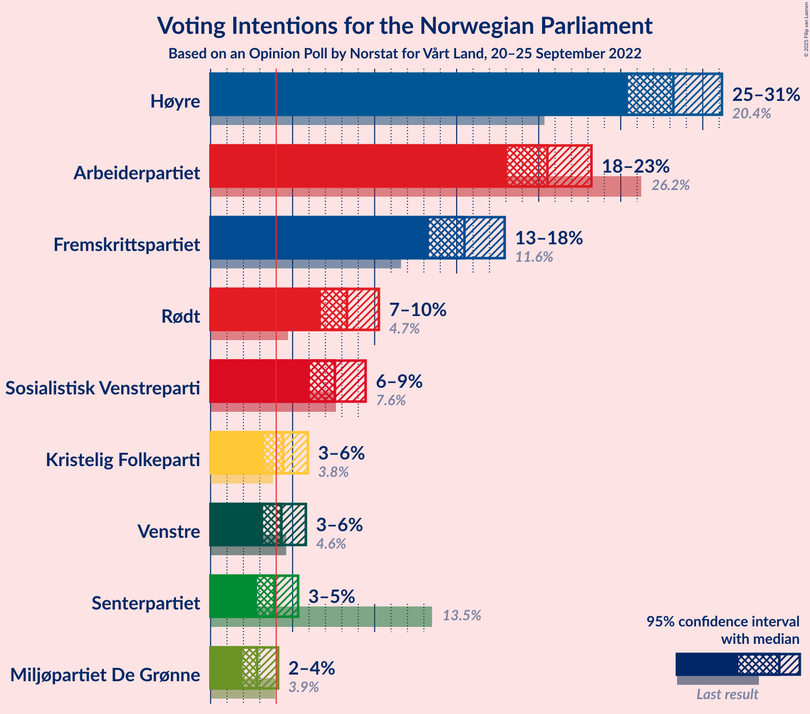

### Confidence Intervals

| Party | Last Result | Poll Result | 80% Confidence Interval | 90% Confidence Interval | 95% Confidence Interval | 99% Confidence Interval |
|:-----:|:-----------:|:-----------:|:-----------------------:|:-----------------------:|:-----------------------:|:-----------------------:|
| Høyre | 20.4% | 28.2% | 26.4–30.1% |25.9–30.7% |25.4–31.2% |24.6–32.1% |
| Arbeiderpartiet | 26.2% | 20.5% | 18.9–22.3% |18.5–22.8% |18.1–23.2% |17.3–24.1% |
| Fremskrittspartiet | 11.6% | 15.5% | 14.1–17.1% |13.7–17.5% |13.3–17.9% |12.7–18.7% |
| Rødt | 4.7% | 8.3% | 7.3–9.6% |7.0–9.9% |6.7–10.3% |6.2–10.9% |
| Sosialistisk Venstreparti | 7.6% | 7.6% | 6.6–8.8% |6.3–9.1% |6.1–9.4% |5.6–10.1% |
| Kristelig Folkeparti | 3.8% | 4.4% | 3.7–5.4% |3.5–5.7% |3.3–5.9% |3.0–6.4% |
| Venstre | 4.6% | 4.3% | 3.6–5.3% |3.4–5.6% |3.2–5.8% |2.9–6.3% |
| Senterpartiet | 13.5% | 3.9% | 3.2–4.8% |3.0–5.1% |2.8–5.3% |2.5–5.8% |
| Miljøpartiet De Grønne | 3.9% | 2.8% | 2.3–3.7% |2.1–3.9% |2.0–4.1% |1.7–4.5% |

*Note:* The poll result column reflects the actual value used in the calculations. Published results may vary slightly, and in addition be rounded to fewer digits.

## Seats

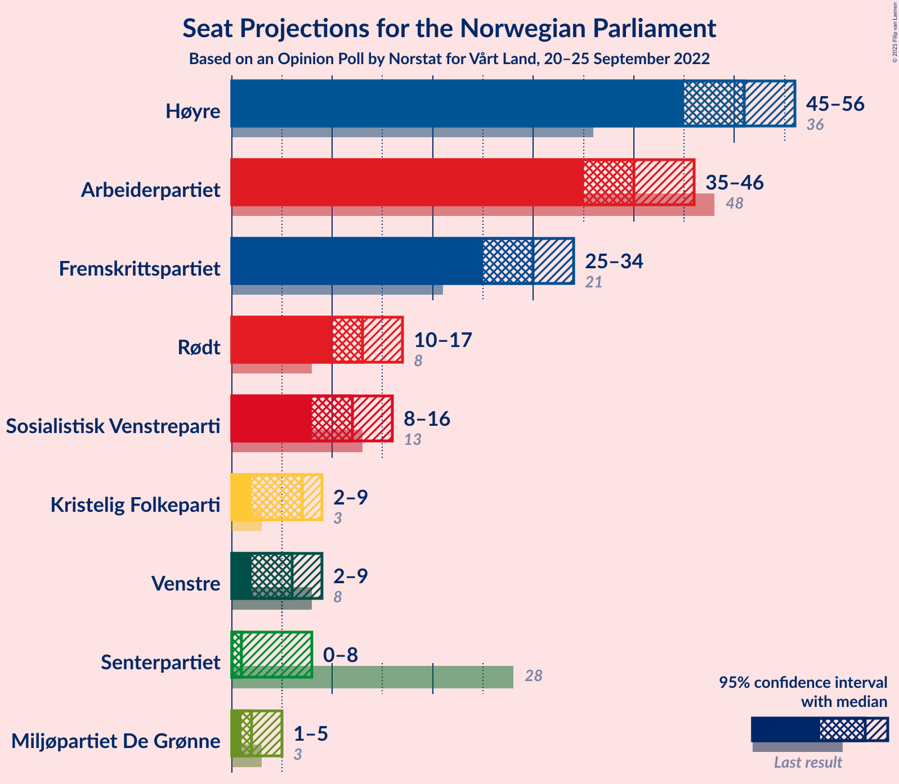

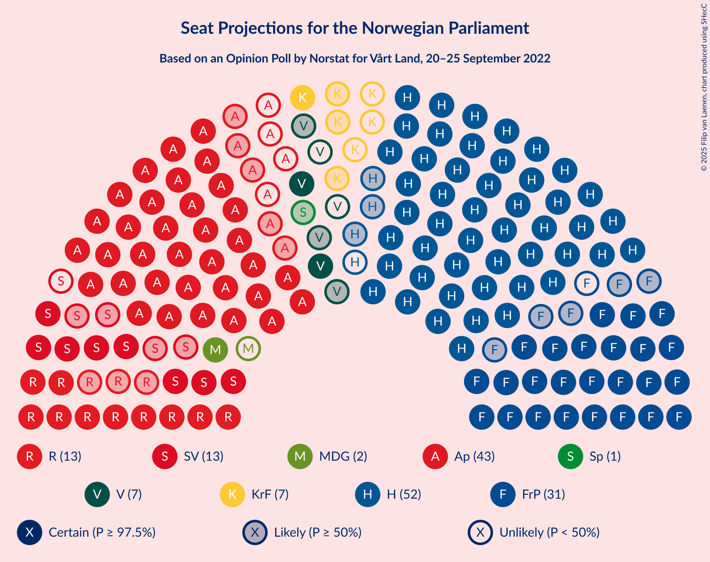

### Confidence Intervals

| Party | Last Result | Median | 80% Confidence Interval | 90% Confidence Interval | 95% Confidence Interval | 99% Confidence Interval |
|:-----:|:-----------:|:------:|:-----------------------:|:-----------------------:|:-----------------------:|:-----------------------:|
| <a href="#høyre">Høyre</a> | 36 | 51 | 47–54 |46–55 |45–56 |43–58 |
| <a href="#arbeiderpartiet">Arbeiderpartiet</a> | 48 | 40 | 37–44 |36–46 |35–46 |33–48 |
| <a href="#fremskrittspartiet">Fremskrittspartiet</a> | 21 | 30 | 27–32 |26–33 |25–34 |21–36 |
| <a href="#rødt">Rødt</a> | 8 | 13 | 11–15 |10–17 |10–17 |9–20 |
| <a href="#sosialistisk-venstreparti">Sosialistisk Venstreparti</a> | 13 | 12 | 9–15 |9–15 |8–16 |8–17 |
| <a href="#kristelig-folkeparti">Kristelig Folkeparti</a> | 3 | 7 | 3–8 |3–9 |2–9 |2–10 |
| <a href="#venstre">Venstre</a> | 8 | 6 | 2–8 |2–9 |2–9 |2–10 |
| <a href="#senterpartiet">Senterpartiet</a> | 28 | 1 | 0–8 |0–8 |0–8 |0–9 |
| <a href="#miljøpartiet-de-grønne">Miljøpartiet De Grønne</a> | 3 | 2 | 1–2 |1–3 |1–5 |0–7 |

### Høyre

*For a full overview of the results for this party, see the [Høyre](party-høyre.html) page.*

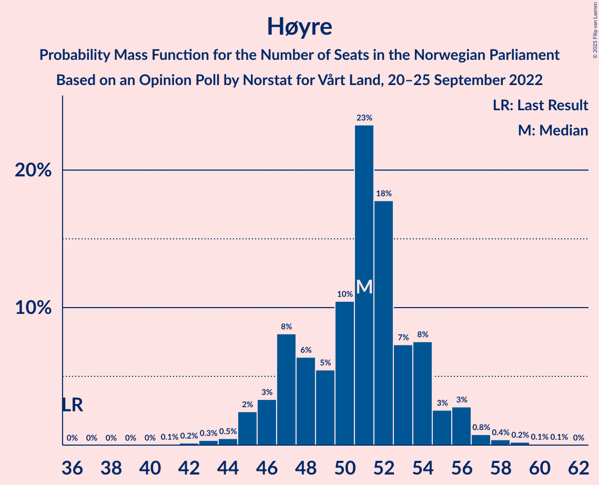

| Number of Seats | Probability | Accumulated | Special Marks |
|:---------------:|:-----------:|:-----------:|:-------------:|
| 36 | 0% | 100% | Last Result |
| 37 | 0% | 100% |  |
| 38 | 0% | 100% |  |
| 39 | 0% | 100% |  |
| 40 | 0% | 100% |  |
| 41 | 0.1% | 100% |  |
| 42 | 0.2% | 99.9% |  |
| 43 | 0.3% | 99.8% |  |
| 44 | 0.5% | 99.4% |  |
| 45 | 2% | 98.9% |  |
| 46 | 3% | 97% |  |
| 47 | 8% | 93% |  |
| 48 | 6% | 85% |  |
| 49 | 5% | 79% |  |
| 50 | 10% | 73% |  |
| 51 | 23% | 63% | Median |
| 52 | 18% | 39% |  |
| 53 | 7% | 22% |  |
| 54 | 8% | 14% |  |
| 55 | 3% | 7% |  |
| 56 | 3% | 4% |  |
| 57 | 0.8% | 2% |  |
| 58 | 0.4% | 0.8% |  |
| 59 | 0.2% | 0.4% |  |
| 60 | 0.1% | 0.2% |  |
| 61 | 0.1% | 0.1% |  |
| 62 | 0% | 0% |  |

### Arbeiderpartiet

*For a full overview of the results for this party, see the [Arbeiderpartiet](party-arbeiderpartiet.html) page.*

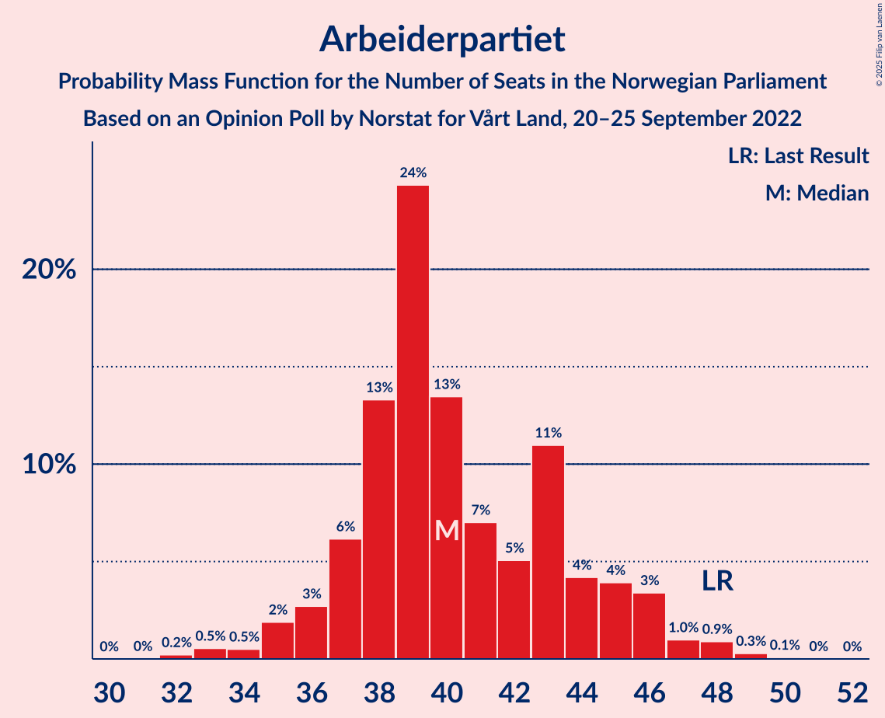

| Number of Seats | Probability | Accumulated | Special Marks |
|:---------------:|:-----------:|:-----------:|:-------------:|
| 32 | 0.2% | 100% |  |
| 33 | 0.5% | 99.8% |  |
| 34 | 0.5% | 99.2% |  |
| 35 | 2% | 98.7% |  |
| 36 | 3% | 97% |  |
| 37 | 6% | 94% |  |
| 38 | 13% | 88% |  |
| 39 | 24% | 75% |  |
| 40 | 13% | 50% | Median |
| 41 | 7% | 37% |  |
| 42 | 5% | 30% |  |
| 43 | 11% | 25% |  |
| 44 | 4% | 14% |  |
| 45 | 4% | 10% |  |
| 46 | 3% | 6% |  |
| 47 | 1.0% | 2% |  |
| 48 | 0.9% | 1.3% | Last Result |
| 49 | 0.3% | 0.4% |  |
| 50 | 0.1% | 0.1% |  |
| 51 | 0% | 0% |  |

### Fremskrittspartiet

*For a full overview of the results for this party, see the [Fremskrittspartiet](party-fremskrittspartiet.html) page.*

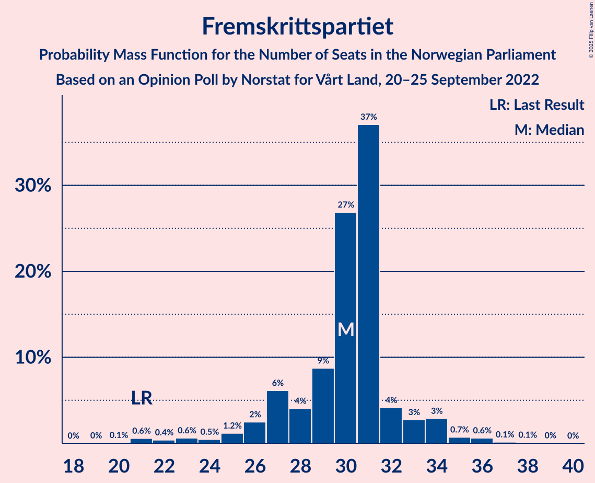

| Number of Seats | Probability | Accumulated | Special Marks |
|:---------------:|:-----------:|:-----------:|:-------------:|
| 20 | 0.1% | 100% |  |
| 21 | 0.6% | 99.9% | Last Result |
| 22 | 0.4% | 99.3% |  |
| 23 | 0.6% | 98.9% |  |
| 24 | 0.5% | 98% |  |
| 25 | 1.2% | 98% |  |
| 26 | 2% | 97% |  |
| 27 | 6% | 94% |  |
| 28 | 4% | 88% |  |
| 29 | 9% | 84% |  |
| 30 | 27% | 75% | Median |
| 31 | 37% | 48% |  |
| 32 | 4% | 11% |  |
| 33 | 3% | 7% |  |
| 34 | 3% | 4% |  |
| 35 | 0.7% | 2% |  |
| 36 | 0.6% | 0.9% |  |
| 37 | 0.1% | 0.3% |  |
| 38 | 0.1% | 0.1% |  |
| 39 | 0% | 0% |  |

### Rødt

*For a full overview of the results for this party, see the [Rødt](party-rødt.html) page.*

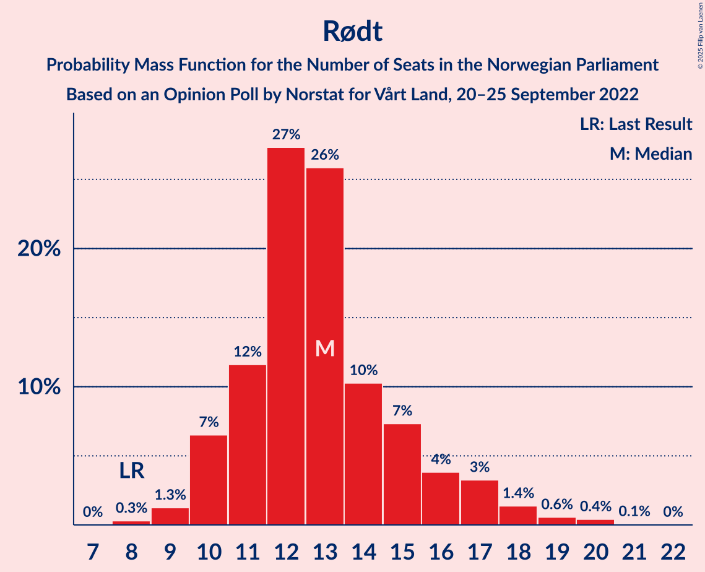

| Number of Seats | Probability | Accumulated | Special Marks |
|:---------------:|:-----------:|:-----------:|:-------------:|
| 8 | 0.3% | 100% | Last Result |
| 9 | 1.3% | 99.7% |  |
| 10 | 7% | 98% |  |
| 11 | 12% | 92% |  |
| 12 | 27% | 80% |  |
| 13 | 26% | 53% | Median |
| 14 | 10% | 27% |  |
| 15 | 7% | 17% |  |
| 16 | 4% | 10% |  |
| 17 | 3% | 6% |  |
| 18 | 1.4% | 2% |  |
| 19 | 0.6% | 1.1% |  |
| 20 | 0.4% | 0.5% |  |
| 21 | 0.1% | 0.1% |  |
| 22 | 0% | 0% |  |

### Sosialistisk Venstreparti

*For a full overview of the results for this party, see the [Sosialistisk Venstreparti](party-sosialistiskvenstreparti.html) page.*

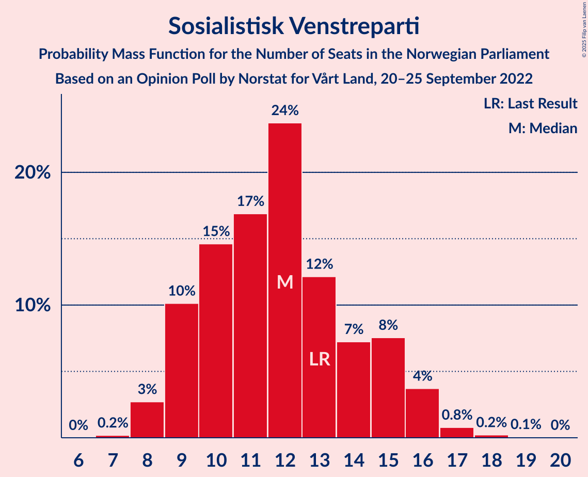

| Number of Seats | Probability | Accumulated | Special Marks |
|:---------------:|:-----------:|:-----------:|:-------------:|
| 7 | 0.2% | 100% |  |
| 8 | 3% | 99.8% |  |
| 9 | 10% | 97% |  |
| 10 | 15% | 87% |  |
| 11 | 17% | 72% |  |
| 12 | 24% | 55% | Median |
| 13 | 12% | 32% | Last Result |
| 14 | 7% | 20% |  |
| 15 | 8% | 12% |  |
| 16 | 4% | 5% |  |
| 17 | 0.8% | 1.1% |  |
| 18 | 0.2% | 0.3% |  |
| 19 | 0.1% | 0.1% |  |
| 20 | 0% | 0% |  |

### Kristelig Folkeparti

*For a full overview of the results for this party, see the [Kristelig Folkeparti](party-kristeligfolkeparti.html) page.*

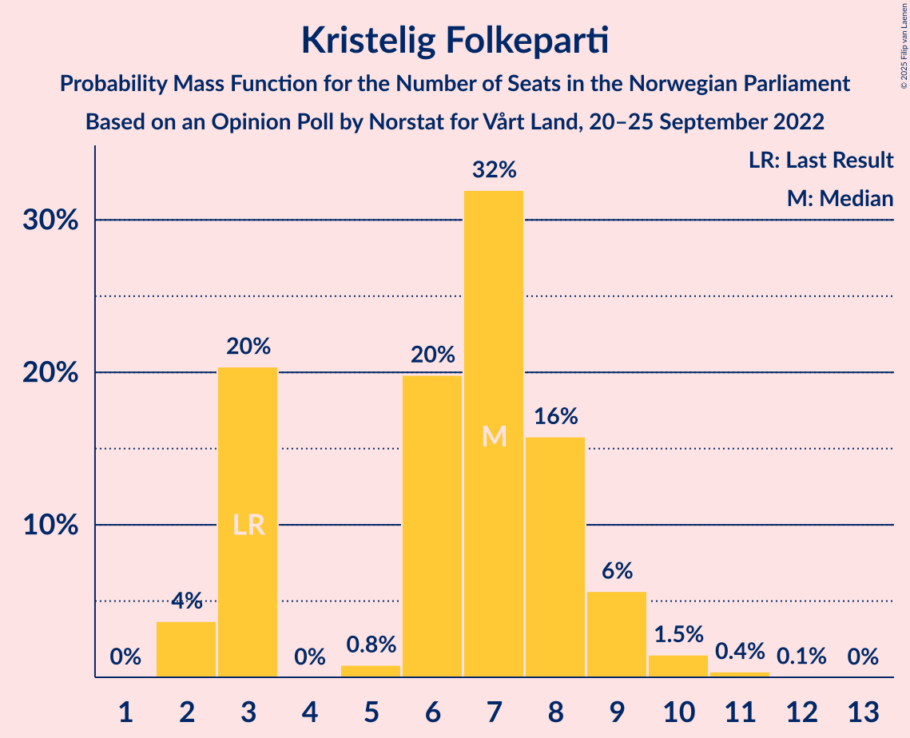

| Number of Seats | Probability | Accumulated | Special Marks |
|:---------------:|:-----------:|:-----------:|:-------------:|
| 2 | 4% | 100% |  |
| 3 | 20% | 96% | Last Result |
| 4 | 0% | 76% |  |
| 5 | 0.8% | 76% |  |
| 6 | 20% | 75% |  |
| 7 | 32% | 55% | Median |
| 8 | 16% | 23% |  |
| 9 | 6% | 8% |  |
| 10 | 1.5% | 2% |  |
| 11 | 0.4% | 0.4% |  |
| 12 | 0.1% | 0.1% |  |
| 13 | 0% | 0% |  |

### Venstre

*For a full overview of the results for this party, see the [Venstre](party-venstre.html) page.*

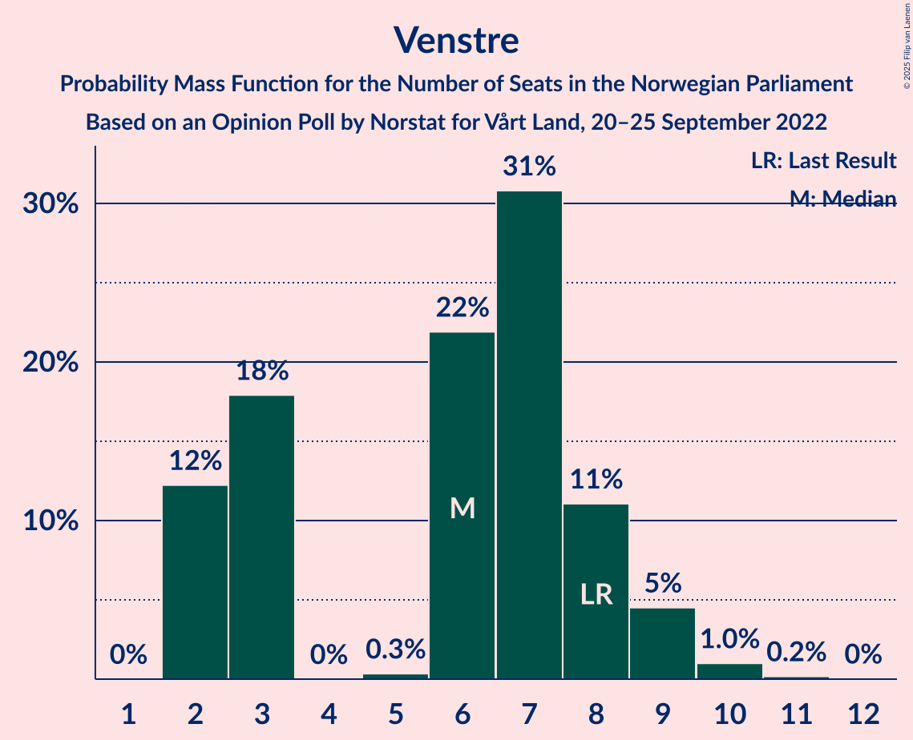

| Number of Seats | Probability | Accumulated | Special Marks |
|:---------------:|:-----------:|:-----------:|:-------------:|
| 2 | 12% | 100% |  |
| 3 | 18% | 88% |  |
| 4 | 0% | 70% |  |
| 5 | 0.3% | 70% |  |
| 6 | 22% | 69% | Median |
| 7 | 31% | 48% |  |
| 8 | 11% | 17% | Last Result |
| 9 | 5% | 6% |  |
| 10 | 1.0% | 1.2% |  |
| 11 | 0.2% | 0.2% |  |
| 12 | 0% | 0% |  |

### Senterpartiet

*For a full overview of the results for this party, see the [Senterpartiet](party-senterpartiet.html) page.*

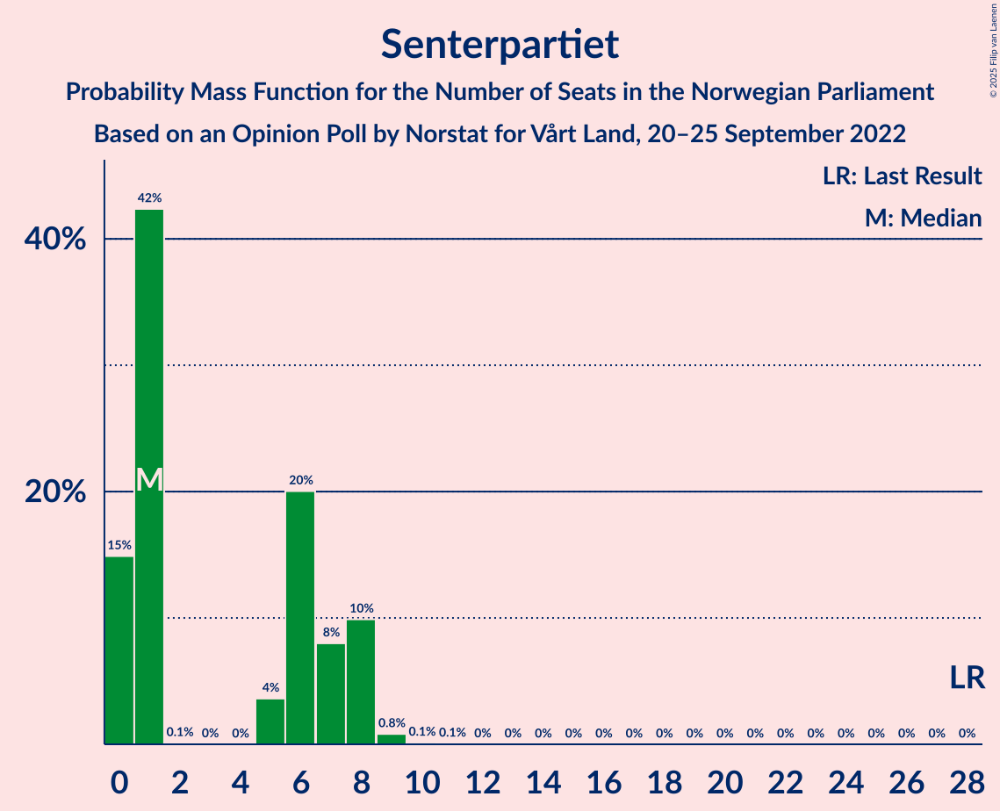

| Number of Seats | Probability | Accumulated | Special Marks |
|:---------------:|:-----------:|:-----------:|:-------------:|
| 0 | 15% | 100% |  |
| 1 | 42% | 85% | Median |
| 2 | 0.1% | 43% |  |
| 3 | 0% | 43% |  |
| 4 | 0% | 43% |  |
| 5 | 4% | 43% |  |
| 6 | 20% | 39% |  |
| 7 | 8% | 19% |  |
| 8 | 10% | 11% |  |
| 9 | 0.8% | 1.1% |  |
| 10 | 0.1% | 0.2% |  |
| 11 | 0.1% | 0.1% |  |
| 12 | 0% | 0% |  |
| 13 | 0% | 0% |  |
| 14 | 0% | 0% |  |
| 15 | 0% | 0% |  |
| 16 | 0% | 0% |  |
| 17 | 0% | 0% |  |
| 18 | 0% | 0% |  |
| 19 | 0% | 0% |  |
| 20 | 0% | 0% |  |
| 21 | 0% | 0% |  |
| 22 | 0% | 0% |  |
| 23 | 0% | 0% |  |
| 24 | 0% | 0% |  |
| 25 | 0% | 0% |  |
| 26 | 0% | 0% |  |
| 27 | 0% | 0% |  |
| 28 | 0% | 0% | Last Result |

### Miljøpartiet De Grønne

*For a full overview of the results for this party, see the [Miljøpartiet De Grønne](party-miljøpartietdegrønne.html) page.*

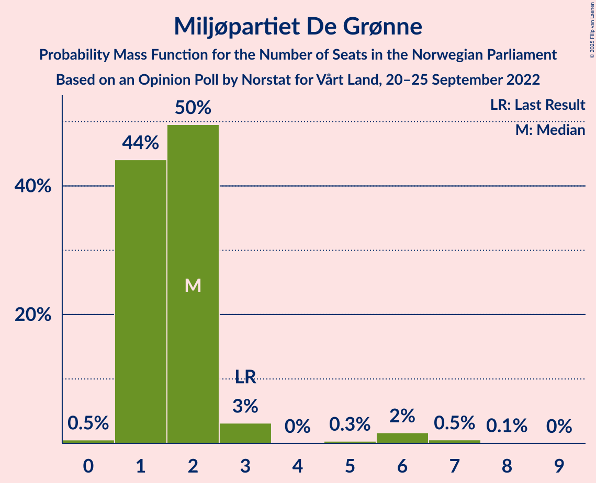

| Number of Seats | Probability | Accumulated | Special Marks |
|:---------------:|:-----------:|:-----------:|:-------------:|
| 0 | 0.5% | 100% |  |
| 1 | 44% | 99.5% |  |
| 2 | 50% | 55% | Median |
| 3 | 3% | 6% | Last Result |
| 4 | 0% | 3% |  |
| 5 | 0.3% | 3% |  |
| 6 | 2% | 2% |  |
| 7 | 0.5% | 0.7% |  |
| 8 | 0.1% | 0.1% |  |
| 9 | 0% | 0% |  |

## Coalitions

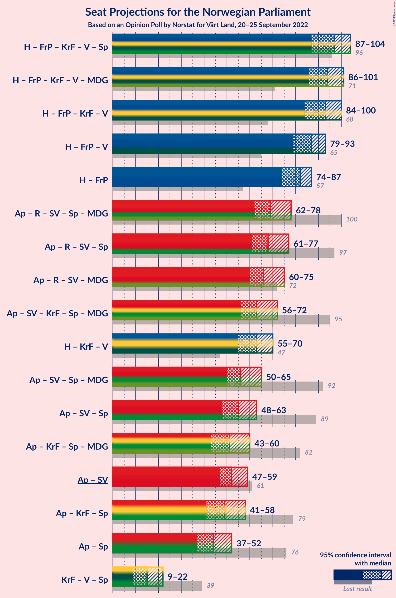

### Confidence Intervals

| Coalition | Last Result | Median | Majority? | 80% Confidence Interval | 90% Confidence Interval | 95% Confidence Interval | 99% Confidence Interval |
|:---------:|:-----------:|:------:|:---------:|:-----------------------:|:-----------------------:|:-----------------------:|:-----------------------:|
| Høyre – Fremskrittspartiet – Kristelig Folkeparti – Venstre – Senterpartiet | 96 | 97 | 99.7% | 91–101 | 89–102 | 87–104 | 85–105 |
| Høyre – Fremskrittspartiet – Kristelig Folkeparti – Venstre – Miljøpartiet De Grønne | 71 | 94 | 99.1% | 89–99 | 87–100 | 86–101 | 83–104 |
| Høyre – Fremskrittspartiet – Kristelig Folkeparti – Venstre | 68 | 93 | 97% | 87–97 | 86–98 | 84–100 | 82–101 |
| Høyre – Fremskrittspartiet – Venstre | 65 | 87 | 72% | 82–90 | 80–92 | 79–93 | 75–96 |
| Høyre – Fremskrittspartiet | 57 | 82 | 11% | 77–85 | 75–86 | 74–87 | 71–89 |
| Arbeiderpartiet – Rødt – Sosialistisk Venstreparti – Senterpartiet – Miljøpartiet De Grønne | 100 | 69 | 0.1% | 65–76 | 64–77 | 62–78 | 60–83 |
| Arbeiderpartiet – Rødt – Sosialistisk Venstreparti – Senterpartiet | 97 | 68 | 0% | 63–74 | 62–76 | 61–77 | 58–82 |
| Arbeiderpartiet – Rødt – Sosialistisk Venstreparti – Miljøpartiet De Grønne | 72 | 66 | 0% | 62–72 | 61–74 | 60–75 | 57–78 |
| Arbeiderpartiet – Sosialistisk Venstreparti – Kristelig Folkeparti – Senterpartiet – Miljøpartiet De Grønne | 95 | 63 | 0% | 58–69 | 57–71 | 56–72 | 54–74 |
| Høyre – Kristelig Folkeparti – Venstre | 47 | 63 | 0% | 57–67 | 56–68 | 55–70 | 53–71 |
| Arbeiderpartiet – Sosialistisk Venstreparti – Senterpartiet – Miljøpartiet De Grønne | 92 | 56 | 0% | 53–62 | 51–64 | 50–65 | 49–68 |
| Arbeiderpartiet – Sosialistisk Venstreparti – Senterpartiet | 89 | 55 | 0% | 51–60 | 49–62 | 48–63 | 47–66 |
| Arbeiderpartiet – Kristelig Folkeparti – Senterpartiet – Miljøpartiet De Grønne | 82 | 51 | 0% | 46–57 | 44–59 | 43–60 | 41–62 |
| Arbeiderpartiet – Sosialistisk Venstreparti | 61 | 52 | 0% | 48–56 | 47–58 | 47–59 | 44–62 |
| Arbeiderpartiet – Kristelig Folkeparti – Senterpartiet | 79 | 49 | 0% | 44–56 | 42–57 | 41–58 | 39–60 |
| Arbeiderpartiet – Senterpartiet | 76 | 44 | 0% | 39–49 | 38–51 | 37–52 | 35–54 |
| Kristelig Folkeparti – Venstre – Senterpartiet | 39 | 15 | 0% | 11–20 | 10–21 | 9–22 | 6–24 |

### Høyre – Fremskrittspartiet – Kristelig Folkeparti – Venstre – Senterpartiet

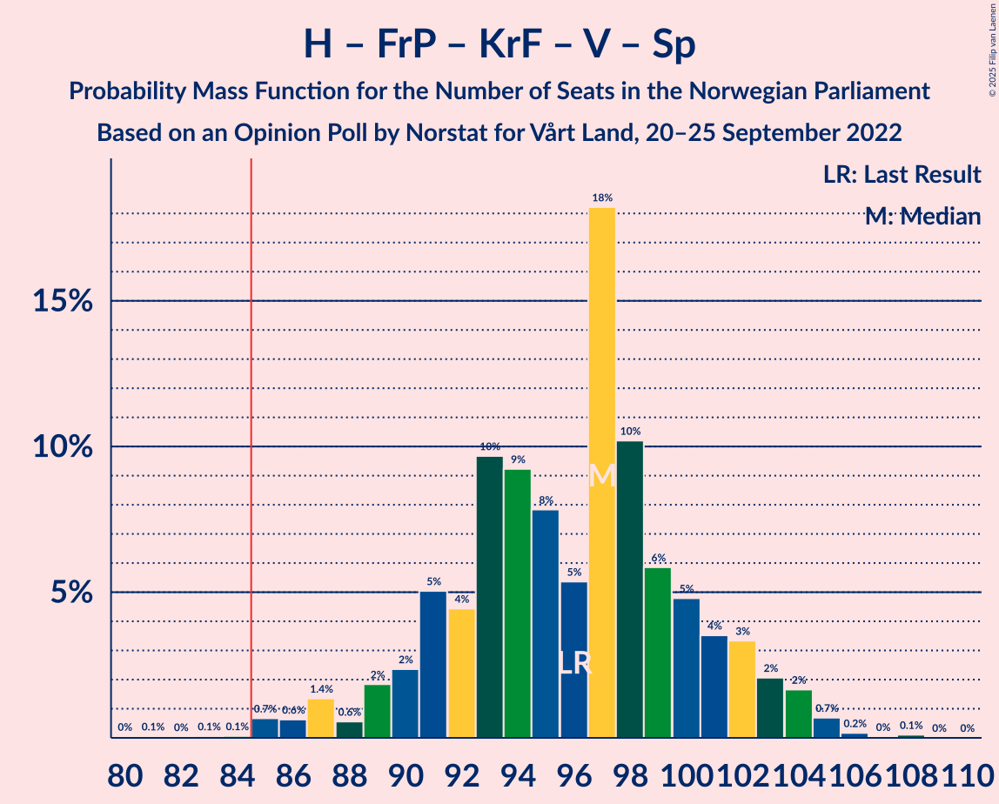

| Number of Seats | Probability | Accumulated | Special Marks |
|:---------------:|:-----------:|:-----------:|:-------------:|
| 80 | 0% | 100% |  |
| 81 | 0.1% | 99.9% |  |
| 82 | 0% | 99.9% |  |
| 83 | 0.1% | 99.8% |  |
| 84 | 0.1% | 99.8% |  |
| 85 | 0.7% | 99.7% | Majority |
| 86 | 0.6% | 99.0% |  |
| 87 | 1.4% | 98% |  |
| 88 | 0.6% | 97% |  |
| 89 | 2% | 96% |  |
| 90 | 2% | 95% |  |
| 91 | 5% | 92% |  |
| 92 | 4% | 87% |  |
| 93 | 10% | 83% |  |
| 94 | 9% | 73% |  |
| 95 | 8% | 64% | Median |
| 96 | 5% | 56% | Last Result |
| 97 | 18% | 51% |  |
| 98 | 10% | 32% |  |
| 99 | 6% | 22% |  |
| 100 | 5% | 16% |  |
| 101 | 4% | 12% |  |
| 102 | 3% | 8% |  |
| 103 | 2% | 5% |  |
| 104 | 2% | 3% |  |
| 105 | 0.7% | 1.0% |  |
| 106 | 0.2% | 0.3% |  |
| 107 | 0% | 0.2% |  |
| 108 | 0.1% | 0.1% |  |
| 109 | 0% | 0% |  |

### Høyre – Fremskrittspartiet – Kristelig Folkeparti – Venstre – Miljøpartiet De Grønne

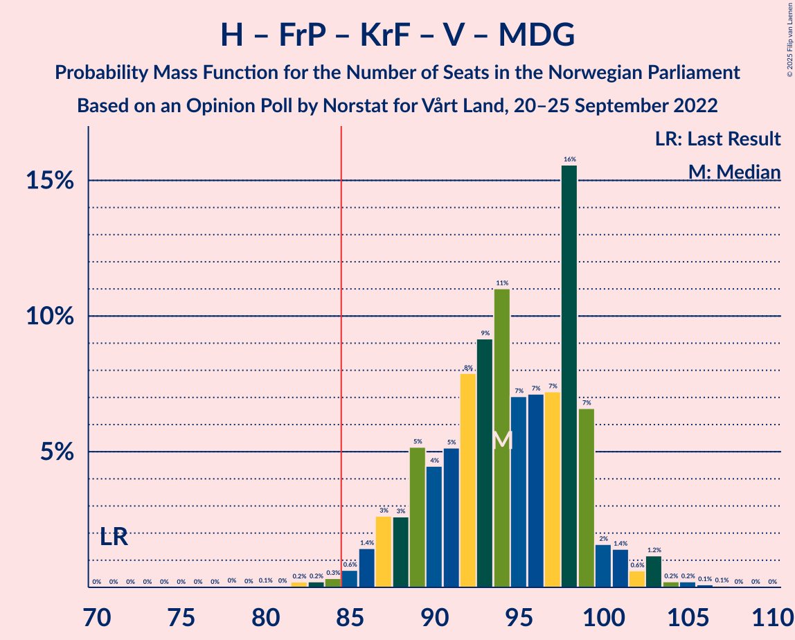

| Number of Seats | Probability | Accumulated | Special Marks |
|:---------------:|:-----------:|:-----------:|:-------------:|
| 71 | 0% | 100% | Last Result |
| 72 | 0% | 100% |  |
| 73 | 0% | 100% |  |
| 74 | 0% | 100% |  |
| 75 | 0% | 100% |  |
| 76 | 0% | 100% |  |
| 77 | 0% | 100% |  |
| 78 | 0% | 100% |  |
| 79 | 0% | 99.9% |  |
| 80 | 0.1% | 99.9% |  |
| 81 | 0% | 99.9% |  |
| 82 | 0.2% | 99.8% |  |
| 83 | 0.2% | 99.6% |  |
| 84 | 0.3% | 99.4% |  |
| 85 | 0.6% | 99.1% | Majority |
| 86 | 1.4% | 98% |  |
| 87 | 3% | 97% |  |
| 88 | 3% | 94% |  |
| 89 | 5% | 92% |  |
| 90 | 4% | 87% |  |
| 91 | 5% | 82% |  |
| 92 | 8% | 77% |  |
| 93 | 9% | 69% |  |
| 94 | 11% | 60% |  |
| 95 | 7% | 49% |  |
| 96 | 7% | 42% | Median |
| 97 | 7% | 35% |  |
| 98 | 16% | 28% |  |
| 99 | 7% | 12% |  |
| 100 | 2% | 5% |  |
| 101 | 1.4% | 4% |  |
| 102 | 0.6% | 2% |  |
| 103 | 1.2% | 2% |  |
| 104 | 0.2% | 0.6% |  |
| 105 | 0.2% | 0.4% |  |
| 106 | 0.1% | 0.2% |  |
| 107 | 0.1% | 0.1% |  |
| 108 | 0% | 0% |  |

### Høyre – Fremskrittspartiet – Kristelig Folkeparti – Venstre

| Number of Seats | Probability | Accumulated | Special Marks |
|:---------------:|:-----------:|:-----------:|:-------------:|
| 68 | 0% | 100% | Last Result |
| 69 | 0% | 100% |  |
| 70 | 0% | 100% |  |
| 71 | 0% | 100% |  |
| 72 | 0% | 100% |  |
| 73 | 0% | 100% |  |
| 74 | 0% | 100% |  |
| 75 | 0% | 100% |  |
| 76 | 0% | 100% |  |
| 77 | 0.1% | 100% |  |
| 78 | 0% | 99.9% |  |
| 79 | 0.1% | 99.9% |  |
| 80 | 0.1% | 99.8% |  |
| 81 | 0.1% | 99.7% |  |
| 82 | 0.4% | 99.6% |  |
| 83 | 0.3% | 99.1% |  |
| 84 | 2% | 98.8% |  |
| 85 | 1.5% | 97% | Majority |
| 86 | 3% | 96% |  |
| 87 | 6% | 93% |  |
| 88 | 3% | 87% |  |
| 89 | 5% | 85% |  |
| 90 | 8% | 80% |  |
| 91 | 9% | 72% |  |
| 92 | 7% | 63% |  |
| 93 | 13% | 56% |  |
| 94 | 4% | 42% | Median |
| 95 | 8% | 38% |  |
| 96 | 15% | 30% |  |
| 97 | 8% | 15% |  |
| 98 | 2% | 6% |  |
| 99 | 1.2% | 4% |  |
| 100 | 1.1% | 3% |  |
| 101 | 1.4% | 2% |  |
| 102 | 0.1% | 0.5% |  |
| 103 | 0.1% | 0.4% |  |
| 104 | 0.2% | 0.2% |  |
| 105 | 0% | 0.1% |  |
| 106 | 0% | 0% |  |

### Høyre – Fremskrittspartiet – Venstre

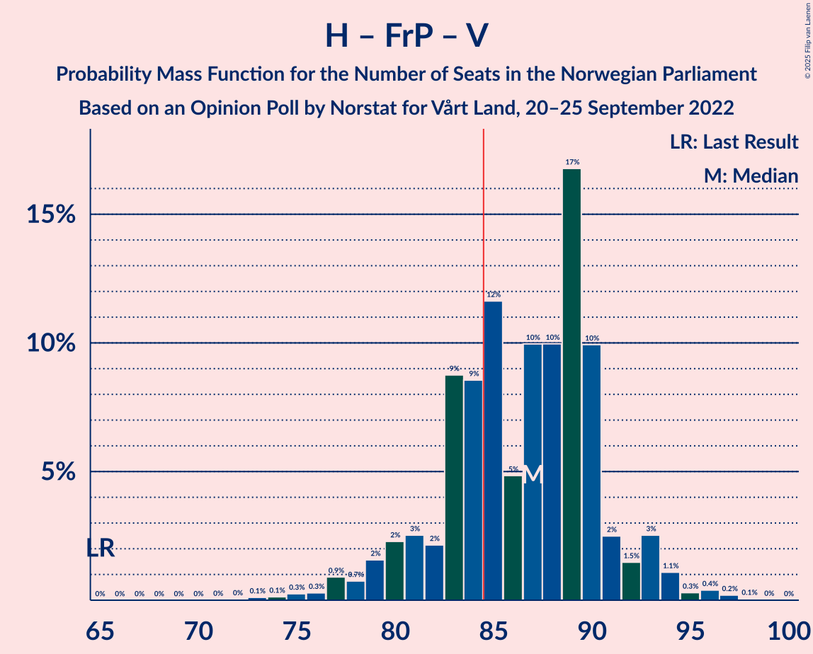

| Number of Seats | Probability | Accumulated | Special Marks |
|:---------------:|:-----------:|:-----------:|:-------------:|
| 65 | 0% | 100% | Last Result |
| 66 | 0% | 100% |  |
| 67 | 0% | 100% |  |
| 68 | 0% | 100% |  |
| 69 | 0% | 100% |  |
| 70 | 0% | 100% |  |
| 71 | 0% | 100% |  |
| 72 | 0% | 100% |  |
| 73 | 0.1% | 99.9% |  |
| 74 | 0.1% | 99.8% |  |
| 75 | 0.3% | 99.7% |  |
| 76 | 0.3% | 99.4% |  |
| 77 | 0.9% | 99.2% |  |
| 78 | 0.7% | 98% |  |
| 79 | 2% | 98% |  |
| 80 | 2% | 96% |  |
| 81 | 3% | 94% |  |
| 82 | 2% | 91% |  |
| 83 | 9% | 89% |  |
| 84 | 9% | 80% |  |
| 85 | 12% | 72% | Majority |
| 86 | 5% | 60% |  |
| 87 | 10% | 55% | Median |
| 88 | 10% | 45% |  |
| 89 | 17% | 35% |  |
| 90 | 10% | 18% |  |
| 91 | 2% | 9% |  |
| 92 | 1.5% | 6% |  |
| 93 | 3% | 5% |  |
| 94 | 1.1% | 2% |  |
| 95 | 0.3% | 1.0% |  |
| 96 | 0.4% | 0.7% |  |
| 97 | 0.2% | 0.3% |  |
| 98 | 0.1% | 0.1% |  |
| 99 | 0% | 0% |  |

### Høyre – Fremskrittspartiet

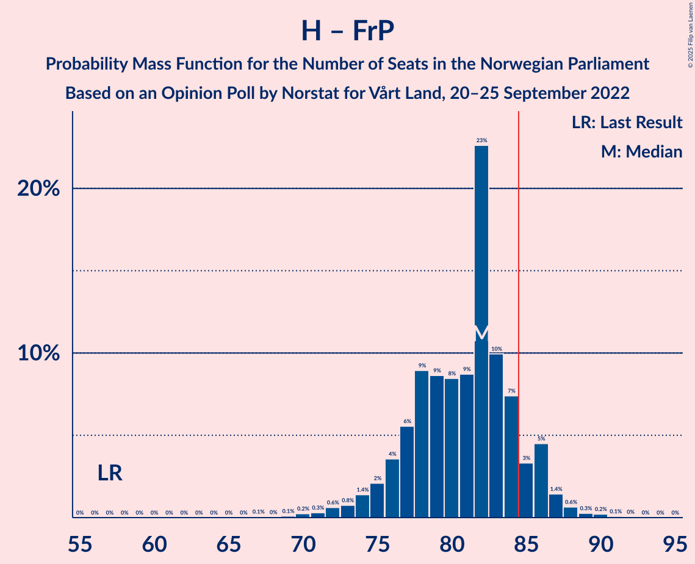

| Number of Seats | Probability | Accumulated | Special Marks |
|:---------------:|:-----------:|:-----------:|:-------------:|
| 57 | 0% | 100% | Last Result |
| 58 | 0% | 100% |  |
| 59 | 0% | 100% |  |
| 60 | 0% | 100% |  |
| 61 | 0% | 100% |  |
| 62 | 0% | 100% |  |
| 63 | 0% | 100% |  |
| 64 | 0% | 100% |  |
| 65 | 0% | 100% |  |
| 66 | 0% | 100% |  |
| 67 | 0.1% | 100% |  |
| 68 | 0% | 99.9% |  |
| 69 | 0.1% | 99.9% |  |
| 70 | 0.2% | 99.8% |  |
| 71 | 0.3% | 99.6% |  |
| 72 | 0.6% | 99.3% |  |
| 73 | 0.8% | 98.6% |  |
| 74 | 1.4% | 98% |  |
| 75 | 2% | 96% |  |
| 76 | 4% | 94% |  |
| 77 | 6% | 91% |  |
| 78 | 9% | 85% |  |
| 79 | 9% | 76% |  |
| 80 | 8% | 68% |  |
| 81 | 9% | 59% | Median |
| 82 | 23% | 51% |  |
| 83 | 10% | 28% |  |
| 84 | 7% | 18% |  |
| 85 | 3% | 11% | Majority |
| 86 | 5% | 7% |  |
| 87 | 1.4% | 3% |  |
| 88 | 0.6% | 1.3% |  |
| 89 | 0.3% | 0.6% |  |
| 90 | 0.2% | 0.4% |  |
| 91 | 0.1% | 0.1% |  |
| 92 | 0% | 0.1% |  |
| 93 | 0% | 0% |  |

### Arbeiderpartiet – Rødt – Sosialistisk Venstreparti – Senterpartiet – Miljøpartiet De Grønne

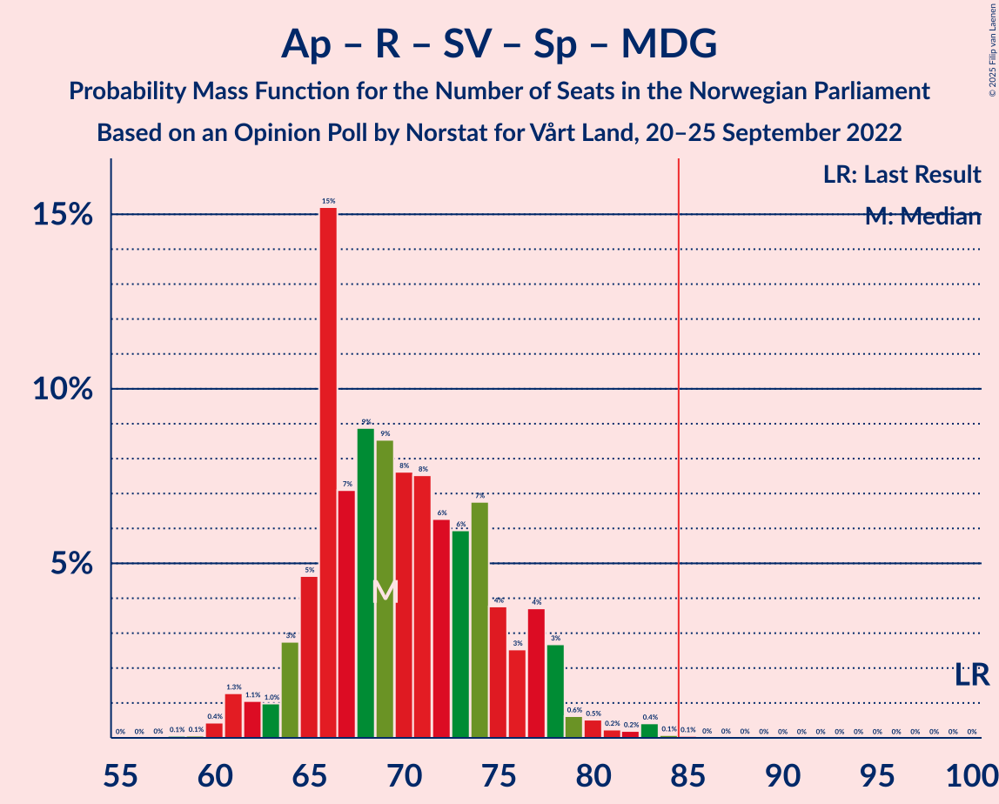

| Number of Seats | Probability | Accumulated | Special Marks |
|:---------------:|:-----------:|:-----------:|:-------------:|
| 58 | 0.1% | 100% |  |
| 59 | 0.1% | 99.9% |  |
| 60 | 0.4% | 99.9% |  |
| 61 | 1.3% | 99.4% |  |
| 62 | 1.1% | 98% |  |
| 63 | 1.0% | 97% |  |
| 64 | 3% | 96% |  |
| 65 | 5% | 93% |  |
| 66 | 15% | 89% |  |
| 67 | 7% | 74% |  |
| 68 | 9% | 66% | Median |
| 69 | 9% | 58% |  |
| 70 | 8% | 49% |  |
| 71 | 8% | 41% |  |
| 72 | 6% | 34% |  |
| 73 | 6% | 28% |  |
| 74 | 7% | 22% |  |
| 75 | 4% | 15% |  |
| 76 | 3% | 11% |  |
| 77 | 4% | 9% |  |
| 78 | 3% | 5% |  |
| 79 | 0.6% | 2% |  |
| 80 | 0.5% | 2% |  |
| 81 | 0.2% | 1.0% |  |
| 82 | 0.2% | 0.8% |  |
| 83 | 0.4% | 0.6% |  |
| 84 | 0.1% | 0.2% |  |
| 85 | 0.1% | 0.1% | Majority |
| 86 | 0% | 0% |  |
| 87 | 0% | 0% |  |
| 88 | 0% | 0% |  |
| 89 | 0% | 0% |  |
| 90 | 0% | 0% |  |
| 91 | 0% | 0% |  |
| 92 | 0% | 0% |  |
| 93 | 0% | 0% |  |
| 94 | 0% | 0% |  |
| 95 | 0% | 0% |  |
| 96 | 0% | 0% |  |
| 97 | 0% | 0% |  |
| 98 | 0% | 0% |  |
| 99 | 0% | 0% |  |
| 100 | 0% | 0% | Last Result |

### Arbeiderpartiet – Rødt – Sosialistisk Venstreparti – Senterpartiet

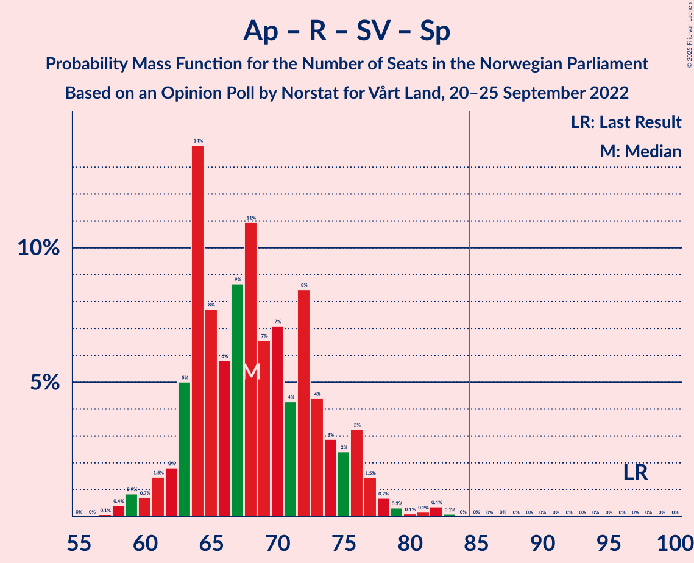

| Number of Seats | Probability | Accumulated | Special Marks |
|:---------------:|:-----------:|:-----------:|:-------------:|
| 57 | 0.1% | 100% |  |
| 58 | 0.4% | 99.9% |  |
| 59 | 0.9% | 99.5% |  |
| 60 | 0.7% | 98.6% |  |
| 61 | 1.5% | 98% |  |
| 62 | 2% | 96% |  |
| 63 | 5% | 95% |  |
| 64 | 14% | 90% |  |
| 65 | 8% | 76% |  |
| 66 | 6% | 68% | Median |
| 67 | 9% | 62% |  |
| 68 | 11% | 54% |  |
| 69 | 7% | 43% |  |
| 70 | 7% | 36% |  |
| 71 | 4% | 29% |  |
| 72 | 8% | 25% |  |
| 73 | 4% | 16% |  |
| 74 | 3% | 12% |  |
| 75 | 2% | 9% |  |
| 76 | 3% | 7% |  |
| 77 | 1.5% | 3% |  |
| 78 | 0.7% | 2% |  |
| 79 | 0.3% | 1.1% |  |
| 80 | 0.1% | 0.8% |  |
| 81 | 0.2% | 0.7% |  |
| 82 | 0.4% | 0.5% |  |
| 83 | 0.1% | 0.1% |  |
| 84 | 0% | 0% |  |
| 85 | 0% | 0% | Majority |
| 86 | 0% | 0% |  |
| 87 | 0% | 0% |  |
| 88 | 0% | 0% |  |
| 89 | 0% | 0% |  |
| 90 | 0% | 0% |  |
| 91 | 0% | 0% |  |
| 92 | 0% | 0% |  |
| 93 | 0% | 0% |  |
| 94 | 0% | 0% |  |
| 95 | 0% | 0% |  |
| 96 | 0% | 0% |  |
| 97 | 0% | 0% | Last Result |

### Arbeiderpartiet – Rødt – Sosialistisk Venstreparti – Miljøpartiet De Grønne

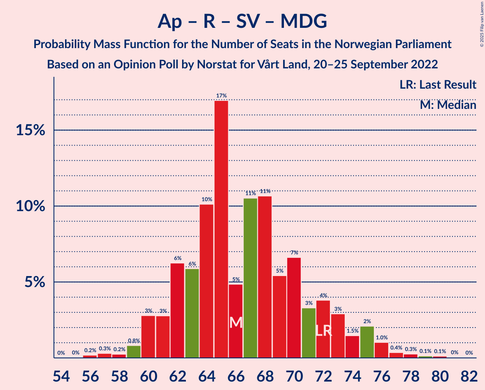

| Number of Seats | Probability | Accumulated | Special Marks |
|:---------------:|:-----------:|:-----------:|:-------------:|
| 55 | 0% | 100% |  |
| 56 | 0.2% | 99.9% |  |
| 57 | 0.3% | 99.8% |  |
| 58 | 0.2% | 99.5% |  |
| 59 | 0.8% | 99.2% |  |
| 60 | 3% | 98% |  |
| 61 | 3% | 96% |  |
| 62 | 6% | 93% |  |
| 63 | 6% | 87% |  |
| 64 | 10% | 81% |  |
| 65 | 17% | 71% |  |
| 66 | 5% | 54% |  |
| 67 | 11% | 49% | Median |
| 68 | 11% | 38% |  |
| 69 | 5% | 28% |  |
| 70 | 7% | 22% |  |
| 71 | 3% | 16% |  |
| 72 | 4% | 12% | Last Result |
| 73 | 3% | 8% |  |
| 74 | 1.5% | 6% |  |
| 75 | 2% | 4% |  |
| 76 | 1.0% | 2% |  |
| 77 | 0.4% | 0.9% |  |
| 78 | 0.3% | 0.6% |  |
| 79 | 0.1% | 0.3% |  |
| 80 | 0.1% | 0.2% |  |
| 81 | 0% | 0.1% |  |
| 82 | 0% | 0% |  |

### Arbeiderpartiet – Sosialistisk Venstreparti – Kristelig Folkeparti – Senterpartiet – Miljøpartiet De Grønne

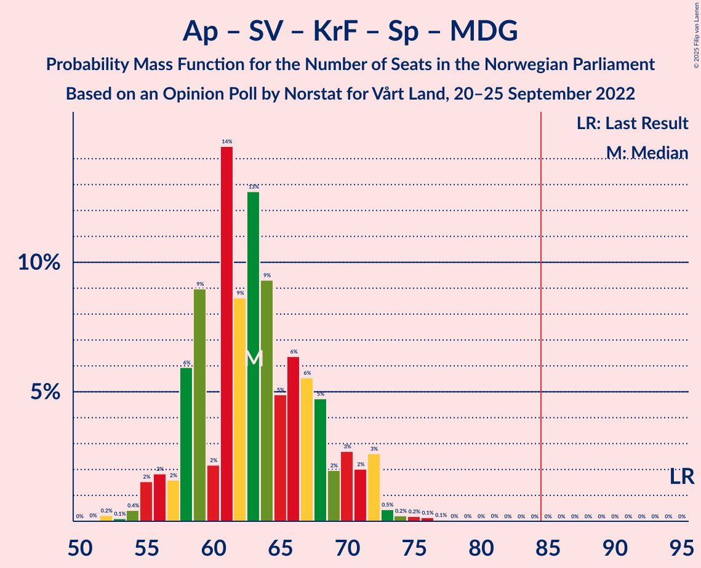

| Number of Seats | Probability | Accumulated | Special Marks |
|:---------------:|:-----------:|:-----------:|:-------------:|
| 51 | 0% | 100% |  |
| 52 | 0.2% | 99.9% |  |
| 53 | 0.1% | 99.7% |  |
| 54 | 0.4% | 99.6% |  |
| 55 | 2% | 99.2% |  |
| 56 | 2% | 98% |  |
| 57 | 2% | 96% |  |
| 58 | 6% | 94% |  |
| 59 | 9% | 88% |  |
| 60 | 2% | 79% |  |
| 61 | 14% | 77% |  |
| 62 | 9% | 63% | Median |
| 63 | 13% | 54% |  |
| 64 | 9% | 41% |  |
| 65 | 5% | 32% |  |
| 66 | 6% | 27% |  |
| 67 | 6% | 21% |  |
| 68 | 5% | 15% |  |
| 69 | 2% | 10% |  |
| 70 | 3% | 8% |  |
| 71 | 2% | 6% |  |
| 72 | 3% | 4% |  |
| 73 | 0.5% | 1.1% |  |
| 74 | 0.2% | 0.7% |  |
| 75 | 0.2% | 0.4% |  |
| 76 | 0.1% | 0.3% |  |
| 77 | 0.1% | 0.1% |  |
| 78 | 0% | 0.1% |  |
| 79 | 0% | 0% |  |
| 80 | 0% | 0% |  |
| 81 | 0% | 0% |  |
| 82 | 0% | 0% |  |
| 83 | 0% | 0% |  |
| 84 | 0% | 0% |  |
| 85 | 0% | 0% | Majority |
| 86 | 0% | 0% |  |
| 87 | 0% | 0% |  |
| 88 | 0% | 0% |  |
| 89 | 0% | 0% |  |
| 90 | 0% | 0% |  |
| 91 | 0% | 0% |  |
| 92 | 0% | 0% |  |
| 93 | 0% | 0% |  |
| 94 | 0% | 0% |  |
| 95 | 0% | 0% | Last Result |

### Høyre – Kristelig Folkeparti – Venstre

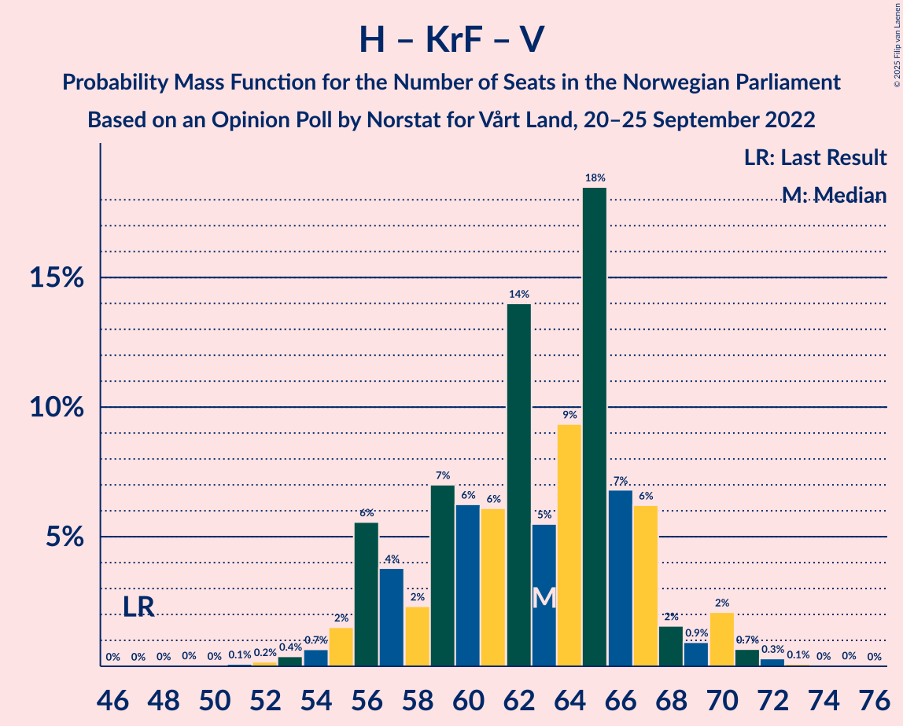

| Number of Seats | Probability | Accumulated | Special Marks |
|:---------------:|:-----------:|:-----------:|:-------------:|
| 47 | 0% | 100% | Last Result |
| 48 | 0% | 100% |  |
| 49 | 0% | 100% |  |
| 50 | 0% | 99.9% |  |
| 51 | 0.1% | 99.9% |  |
| 52 | 0.2% | 99.8% |  |
| 53 | 0.4% | 99.6% |  |
| 54 | 0.7% | 99.3% |  |
| 55 | 2% | 98.6% |  |
| 56 | 6% | 97% |  |
| 57 | 4% | 92% |  |
| 58 | 2% | 88% |  |
| 59 | 7% | 85% |  |
| 60 | 6% | 78% |  |
| 61 | 6% | 72% |  |
| 62 | 14% | 66% |  |
| 63 | 5% | 52% |  |
| 64 | 9% | 47% | Median |
| 65 | 18% | 37% |  |
| 66 | 7% | 19% |  |
| 67 | 6% | 12% |  |
| 68 | 2% | 6% |  |
| 69 | 0.9% | 4% |  |
| 70 | 2% | 3% |  |
| 71 | 0.7% | 1.2% |  |
| 72 | 0.3% | 0.5% |  |
| 73 | 0.1% | 0.2% |  |
| 74 | 0% | 0.1% |  |
| 75 | 0% | 0.1% |  |
| 76 | 0% | 0% |  |

### Arbeiderpartiet – Sosialistisk Venstreparti – Senterpartiet – Miljøpartiet De Grønne

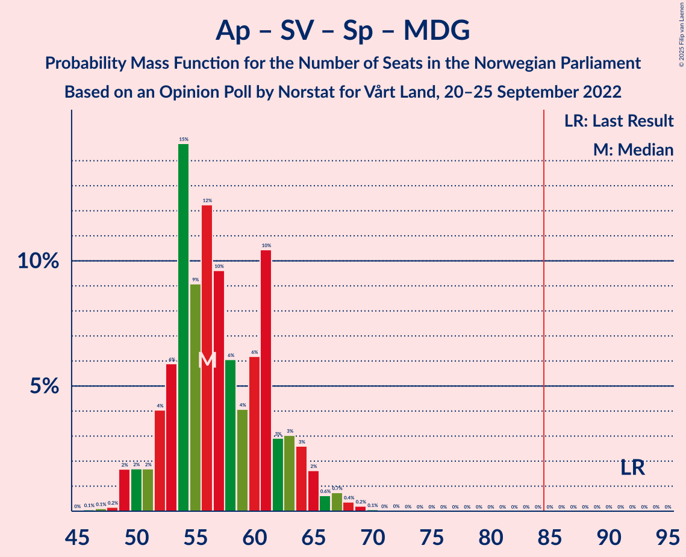

| Number of Seats | Probability | Accumulated | Special Marks |
|:---------------:|:-----------:|:-----------:|:-------------:|
| 46 | 0.1% | 100% |  |
| 47 | 0.1% | 99.9% |  |
| 48 | 0.2% | 99.8% |  |
| 49 | 2% | 99.6% |  |
| 50 | 2% | 98% |  |
| 51 | 2% | 96% |  |
| 52 | 4% | 95% |  |
| 53 | 6% | 91% |  |
| 54 | 15% | 85% |  |
| 55 | 9% | 70% | Median |
| 56 | 12% | 61% |  |
| 57 | 10% | 49% |  |
| 58 | 6% | 39% |  |
| 59 | 4% | 33% |  |
| 60 | 6% | 29% |  |
| 61 | 10% | 23% |  |
| 62 | 3% | 12% |  |
| 63 | 3% | 9% |  |
| 64 | 3% | 6% |  |
| 65 | 2% | 4% |  |
| 66 | 0.6% | 2% |  |
| 67 | 0.7% | 1.4% |  |
| 68 | 0.4% | 0.7% |  |
| 69 | 0.2% | 0.3% |  |
| 70 | 0.1% | 0.1% |  |
| 71 | 0% | 0.1% |  |
| 72 | 0% | 0% |  |
| 73 | 0% | 0% |  |
| 74 | 0% | 0% |  |
| 75 | 0% | 0% |  |
| 76 | 0% | 0% |  |
| 77 | 0% | 0% |  |
| 78 | 0% | 0% |  |
| 79 | 0% | 0% |  |
| 80 | 0% | 0% |  |
| 81 | 0% | 0% |  |
| 82 | 0% | 0% |  |
| 83 | 0% | 0% |  |
| 84 | 0% | 0% |  |
| 85 | 0% | 0% | Majority |
| 86 | 0% | 0% |  |
| 87 | 0% | 0% |  |
| 88 | 0% | 0% |  |
| 89 | 0% | 0% |  |
| 90 | 0% | 0% |  |
| 91 | 0% | 0% |  |
| 92 | 0% | 0% | Last Result |

### Arbeiderpartiet – Sosialistisk Venstreparti – Senterpartiet

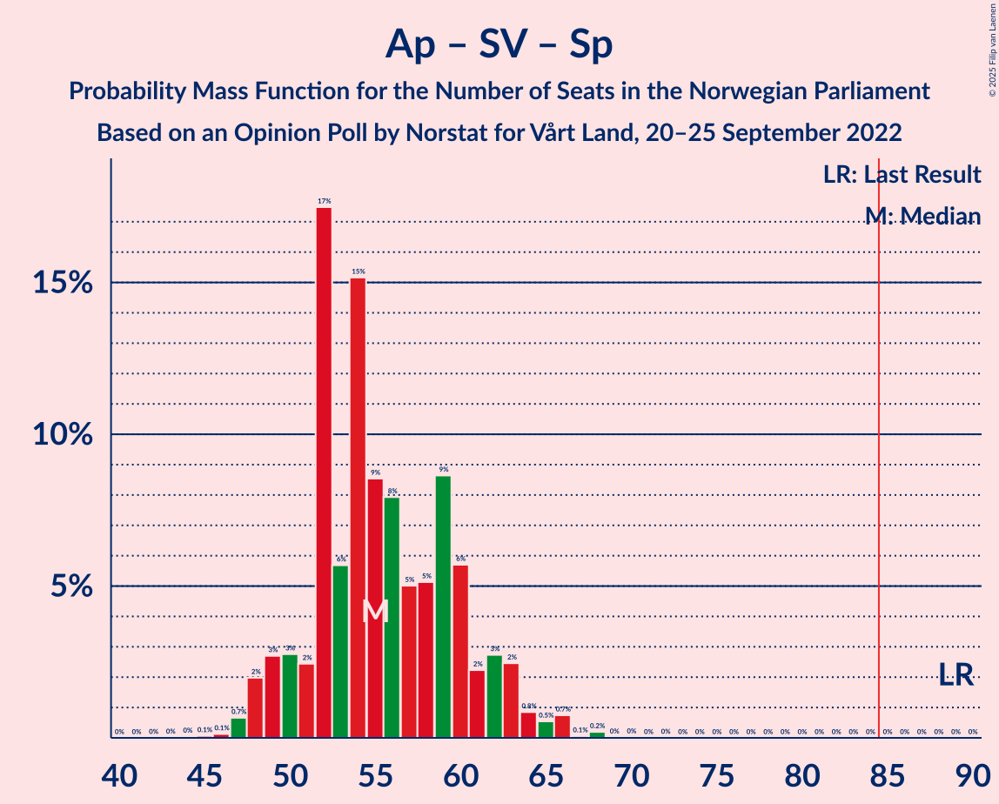

| Number of Seats | Probability | Accumulated | Special Marks |
|:---------------:|:-----------:|:-----------:|:-------------:|
| 44 | 0% | 100% |  |
| 45 | 0.1% | 99.9% |  |
| 46 | 0.1% | 99.9% |  |
| 47 | 0.7% | 99.7% |  |
| 48 | 2% | 99.1% |  |
| 49 | 3% | 97% |  |
| 50 | 3% | 94% |  |
| 51 | 2% | 92% |  |
| 52 | 17% | 89% |  |
| 53 | 6% | 72% | Median |
| 54 | 15% | 66% |  |
| 55 | 9% | 51% |  |
| 56 | 8% | 42% |  |
| 57 | 5% | 34% |  |
| 58 | 5% | 29% |  |
| 59 | 9% | 24% |  |
| 60 | 6% | 16% |  |
| 61 | 2% | 10% |  |
| 62 | 3% | 8% |  |
| 63 | 2% | 5% |  |
| 64 | 0.8% | 2% |  |
| 65 | 0.5% | 2% |  |
| 66 | 0.7% | 1.1% |  |
| 67 | 0.1% | 0.3% |  |
| 68 | 0.2% | 0.3% |  |
| 69 | 0% | 0.1% |  |
| 70 | 0% | 0% |  |
| 71 | 0% | 0% |  |
| 72 | 0% | 0% |  |
| 73 | 0% | 0% |  |
| 74 | 0% | 0% |  |
| 75 | 0% | 0% |  |
| 76 | 0% | 0% |  |
| 77 | 0% | 0% |  |
| 78 | 0% | 0% |  |
| 79 | 0% | 0% |  |
| 80 | 0% | 0% |  |
| 81 | 0% | 0% |  |
| 82 | 0% | 0% |  |
| 83 | 0% | 0% |  |
| 84 | 0% | 0% |  |
| 85 | 0% | 0% | Majority |
| 86 | 0% | 0% |  |
| 87 | 0% | 0% |  |
| 88 | 0% | 0% |  |
| 89 | 0% | 0% | Last Result |

### Arbeiderpartiet – Kristelig Folkeparti – Senterpartiet – Miljøpartiet De Grønne

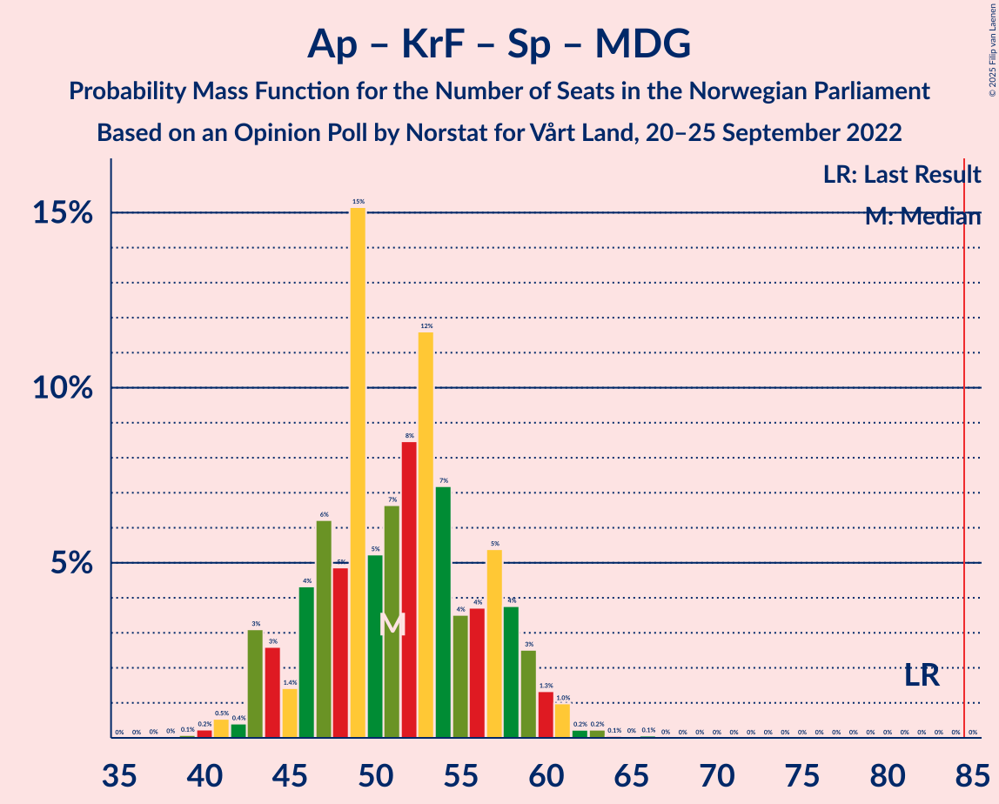

| Number of Seats | Probability | Accumulated | Special Marks |
|:---------------:|:-----------:|:-----------:|:-------------:|
| 38 | 0% | 100% |  |
| 39 | 0.1% | 99.9% |  |
| 40 | 0.2% | 99.9% |  |
| 41 | 0.5% | 99.6% |  |
| 42 | 0.4% | 99.1% |  |
| 43 | 3% | 98.7% |  |
| 44 | 3% | 96% |  |
| 45 | 1.4% | 93% |  |
| 46 | 4% | 92% |  |
| 47 | 6% | 87% |  |
| 48 | 5% | 81% |  |
| 49 | 15% | 76% |  |
| 50 | 5% | 61% | Median |
| 51 | 7% | 56% |  |
| 52 | 8% | 49% |  |
| 53 | 12% | 41% |  |
| 54 | 7% | 29% |  |
| 55 | 4% | 22% |  |
| 56 | 4% | 18% |  |
| 57 | 5% | 15% |  |
| 58 | 4% | 9% |  |
| 59 | 3% | 5% |  |
| 60 | 1.3% | 3% |  |
| 61 | 1.0% | 2% |  |
| 62 | 0.2% | 0.6% |  |
| 63 | 0.2% | 0.4% |  |
| 64 | 0.1% | 0.2% |  |
| 65 | 0% | 0.1% |  |
| 66 | 0.1% | 0.1% |  |
| 67 | 0% | 0% |  |
| 68 | 0% | 0% |  |
| 69 | 0% | 0% |  |
| 70 | 0% | 0% |  |
| 71 | 0% | 0% |  |
| 72 | 0% | 0% |  |
| 73 | 0% | 0% |  |
| 74 | 0% | 0% |  |
| 75 | 0% | 0% |  |
| 76 | 0% | 0% |  |
| 77 | 0% | 0% |  |
| 78 | 0% | 0% |  |
| 79 | 0% | 0% |  |
| 80 | 0% | 0% |  |
| 81 | 0% | 0% |  |
| 82 | 0% | 0% | Last Result |

### Arbeiderpartiet – Sosialistisk Venstreparti

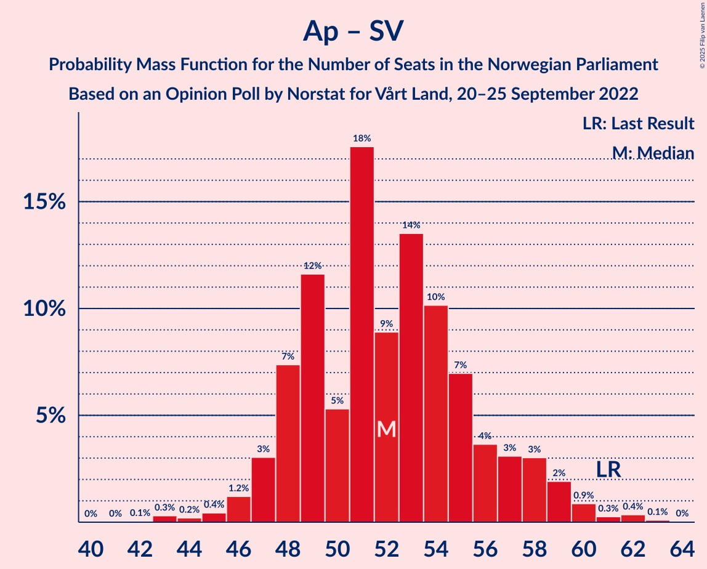

| Number of Seats | Probability | Accumulated | Special Marks |
|:---------------:|:-----------:|:-----------:|:-------------:|
| 42 | 0.1% | 100% |  |
| 43 | 0.3% | 99.9% |  |
| 44 | 0.2% | 99.6% |  |
| 45 | 0.4% | 99.4% |  |
| 46 | 1.2% | 99.0% |  |
| 47 | 3% | 98% |  |
| 48 | 7% | 95% |  |
| 49 | 12% | 87% |  |
| 50 | 5% | 76% |  |
| 51 | 18% | 70% |  |
| 52 | 9% | 53% | Median |
| 53 | 14% | 44% |  |
| 54 | 10% | 30% |  |
| 55 | 7% | 20% |  |
| 56 | 4% | 13% |  |
| 57 | 3% | 10% |  |
| 58 | 3% | 7% |  |
| 59 | 2% | 4% |  |
| 60 | 0.9% | 2% |  |
| 61 | 0.3% | 0.8% | Last Result |
| 62 | 0.4% | 0.5% |  |
| 63 | 0.1% | 0.1% |  |
| 64 | 0% | 0% |  |

### Arbeiderpartiet – Kristelig Folkeparti – Senterpartiet

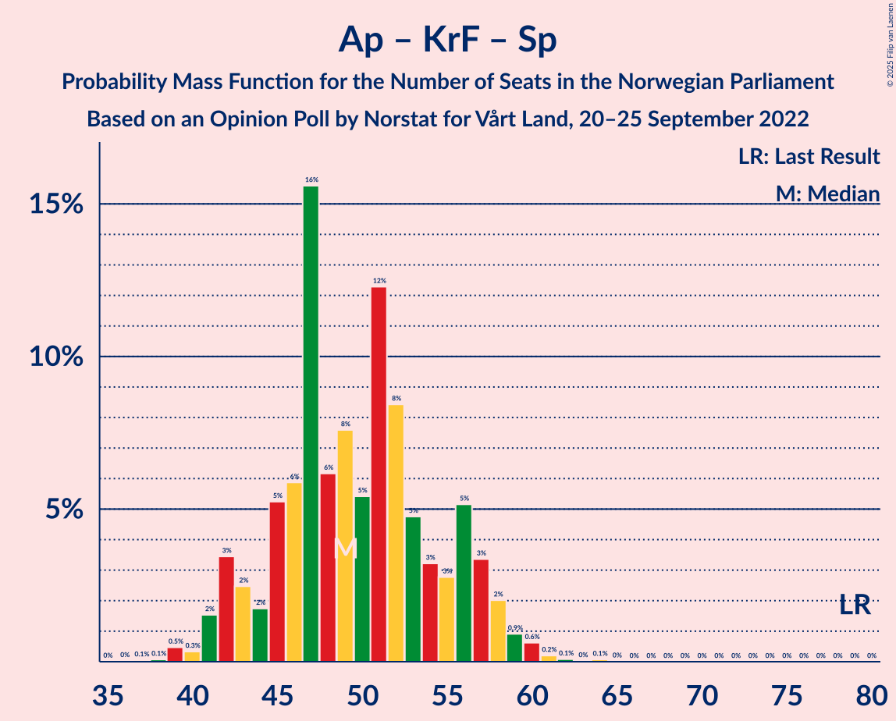

| Number of Seats | Probability | Accumulated | Special Marks |
|:---------------:|:-----------:|:-----------:|:-------------:|
| 37 | 0.1% | 100% |  |
| 38 | 0.1% | 99.9% |  |
| 39 | 0.5% | 99.8% |  |
| 40 | 0.3% | 99.4% |  |
| 41 | 2% | 99.0% |  |
| 42 | 3% | 97% |  |
| 43 | 2% | 94% |  |
| 44 | 2% | 92% |  |
| 45 | 5% | 90% |  |
| 46 | 6% | 85% |  |
| 47 | 16% | 79% |  |
| 48 | 6% | 63% | Median |
| 49 | 8% | 57% |  |
| 50 | 5% | 49% |  |
| 51 | 12% | 44% |  |
| 52 | 8% | 32% |  |
| 53 | 5% | 23% |  |
| 54 | 3% | 18% |  |
| 55 | 3% | 15% |  |
| 56 | 5% | 12% |  |
| 57 | 3% | 7% |  |
| 58 | 2% | 4% |  |
| 59 | 0.9% | 2% |  |
| 60 | 0.6% | 1.0% |  |
| 61 | 0.2% | 0.4% |  |
| 62 | 0.1% | 0.2% |  |
| 63 | 0% | 0.1% |  |
| 64 | 0.1% | 0.1% |  |
| 65 | 0% | 0% |  |
| 66 | 0% | 0% |  |
| 67 | 0% | 0% |  |
| 68 | 0% | 0% |  |
| 69 | 0% | 0% |  |
| 70 | 0% | 0% |  |
| 71 | 0% | 0% |  |
| 72 | 0% | 0% |  |
| 73 | 0% | 0% |  |
| 74 | 0% | 0% |  |
| 75 | 0% | 0% |  |
| 76 | 0% | 0% |  |
| 77 | 0% | 0% |  |
| 78 | 0% | 0% |  |
| 79 | 0% | 0% | Last Result |

### Arbeiderpartiet – Senterpartiet

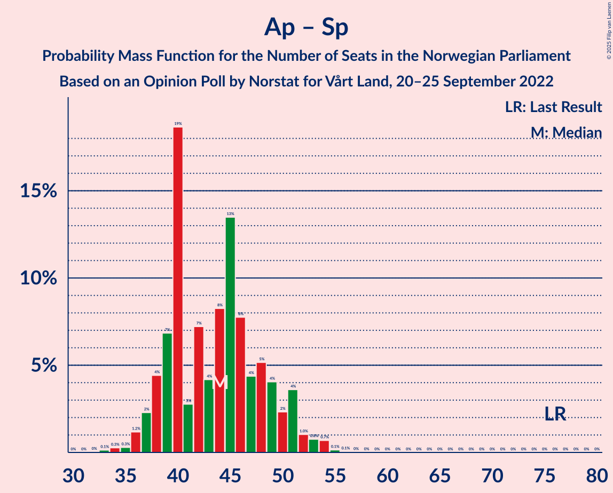

| Number of Seats | Probability | Accumulated | Special Marks |
|:---------------:|:-----------:|:-----------:|:-------------:|
| 33 | 0.1% | 100% |  |
| 34 | 0.3% | 99.8% |  |
| 35 | 0.3% | 99.6% |  |
| 36 | 1.2% | 99.3% |  |
| 37 | 2% | 98% |  |
| 38 | 4% | 96% |  |
| 39 | 7% | 91% |  |
| 40 | 19% | 85% |  |
| 41 | 3% | 66% | Median |
| 42 | 7% | 63% |  |
| 43 | 4% | 56% |  |
| 44 | 8% | 52% |  |
| 45 | 13% | 43% |  |
| 46 | 8% | 30% |  |
| 47 | 4% | 22% |  |
| 48 | 5% | 18% |  |
| 49 | 4% | 13% |  |
| 50 | 2% | 9% |  |
| 51 | 4% | 6% |  |
| 52 | 1.0% | 3% |  |
| 53 | 0.8% | 2% |  |
| 54 | 0.7% | 0.9% |  |
| 55 | 0.1% | 0.2% |  |
| 56 | 0.1% | 0.1% |  |
| 57 | 0% | 0% |  |
| 58 | 0% | 0% |  |
| 59 | 0% | 0% |  |
| 60 | 0% | 0% |  |
| 61 | 0% | 0% |  |
| 62 | 0% | 0% |  |
| 63 | 0% | 0% |  |
| 64 | 0% | 0% |  |
| 65 | 0% | 0% |  |
| 66 | 0% | 0% |  |
| 67 | 0% | 0% |  |
| 68 | 0% | 0% |  |
| 69 | 0% | 0% |  |
| 70 | 0% | 0% |  |
| 71 | 0% | 0% |  |
| 72 | 0% | 0% |  |
| 73 | 0% | 0% |  |
| 74 | 0% | 0% |  |
| 75 | 0% | 0% |  |
| 76 | 0% | 0% | Last Result |

### Kristelig Folkeparti – Venstre – Senterpartiet

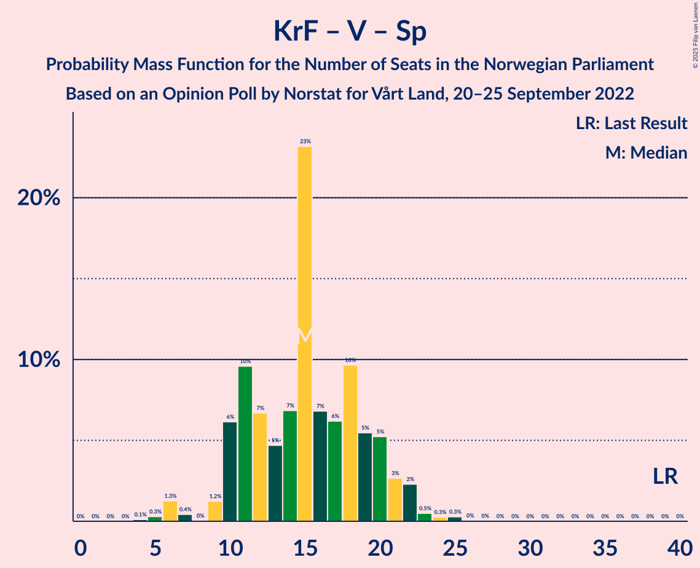

| Number of Seats | Probability | Accumulated | Special Marks |
|:---------------:|:-----------:|:-----------:|:-------------:|
| 4 | 0.1% | 100% |  |
| 5 | 0.3% | 99.9% |  |
| 6 | 1.3% | 99.6% |  |
| 7 | 0.4% | 98% |  |
| 8 | 0% | 98% |  |
| 9 | 1.2% | 98% |  |
| 10 | 6% | 97% |  |
| 11 | 10% | 90% |  |
| 12 | 7% | 81% |  |
| 13 | 5% | 74% |  |
| 14 | 7% | 69% | Median |
| 15 | 23% | 63% |  |
| 16 | 7% | 39% |  |
| 17 | 6% | 33% |  |
| 18 | 10% | 26% |  |
| 19 | 5% | 17% |  |
| 20 | 5% | 11% |  |
| 21 | 3% | 6% |  |
| 22 | 2% | 3% |  |
| 23 | 0.5% | 1.1% |  |
| 24 | 0.3% | 0.6% |  |
| 25 | 0.3% | 0.4% |  |
| 26 | 0% | 0.1% |  |
| 27 | 0% | 0% |  |
| 28 | 0% | 0% |  |
| 29 | 0% | 0% |  |
| 30 | 0% | 0% |  |
| 31 | 0% | 0% |  |
| 32 | 0% | 0% |  |
| 33 | 0% | 0% |  |
| 34 | 0% | 0% |  |
| 35 | 0% | 0% |  |
| 36 | 0% | 0% |  |
| 37 | 0% | 0% |  |
| 38 | 0% | 0% |  |
| 39 | 0% | 0% | Last Result |

## Technical Information

### Opinion Poll

+ **Polling firm:** Norstat
+ **Commissioner(s):** Vårt Land
+ **Fieldwork period:** 20–25 September 2022

### Calculations

+ **Sample size:** 950
+ **Simulations done:** 1,048,576
+ **Error estimate:** 1.74%

