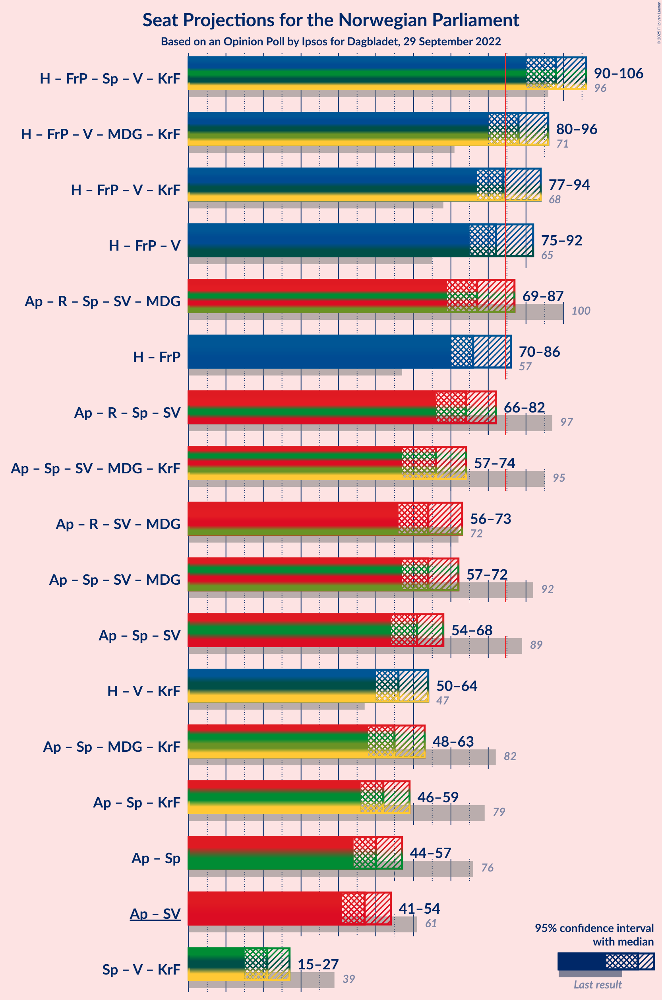
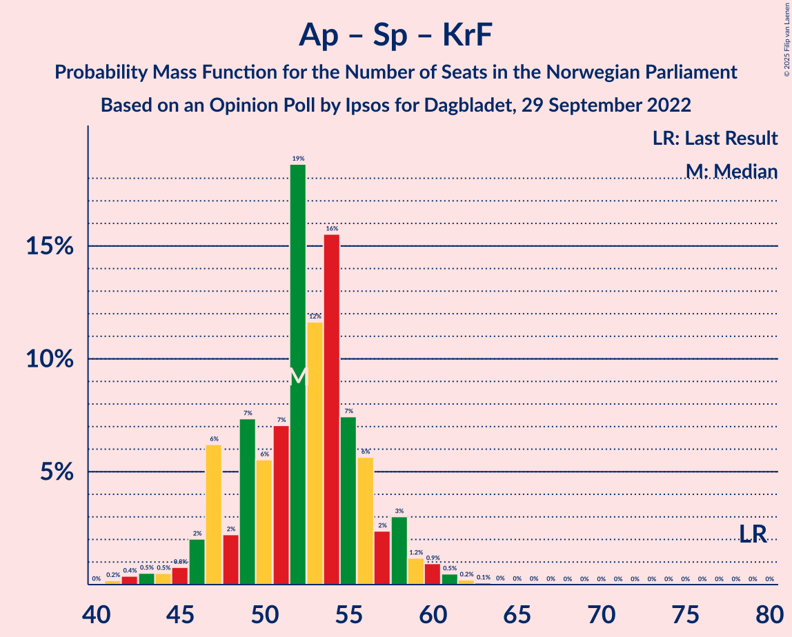
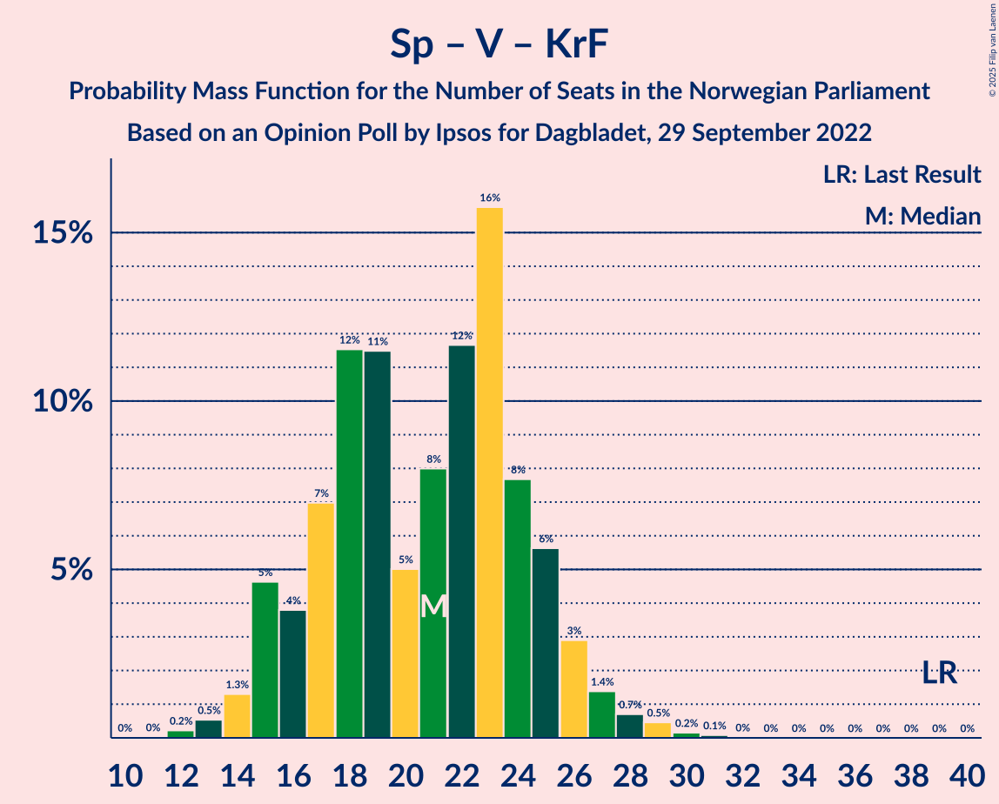

# Opinion Poll by Ipsos for Dagbladet, 29 September 2022

<a href="#voting-intentions">Voting Intentions</a> | <a href="#seats">Seats</a> | <a href="#coalitions">Coalitions</a> | <a href="#technical-information">Technical Information</a>

## Voting Intentions

### Confidence Intervals

| Party | Last Result | Poll Result | 80% Confidence Interval | 90% Confidence Interval | 95% Confidence Interval | 99% Confidence Interval |
|:-----:|:-----------:|:-----------:|:-----------------------:|:-----------------------:|:-----------------------:|:-----------------------:|
| Høyre | 20.4% | 28.1% | 26.1–30.3% |25.5–31.0% |25.0–31.5% |24.0–32.6% |
| Arbeiderpartiet | 26.2% | 19.4% | 17.6–21.4% |17.1–21.9% |16.7–22.4% |15.9–23.4% |
| Fremskrittspartiet | 11.6% | 15.4% | 13.8–17.3% |13.4–17.8% |13.0–18.2% |12.3–19.2% |
| Rødt | 4.7% | 8.3% | 7.1–9.8% |6.8–10.2% |6.5–10.6% |6.0–11.3% |
| Senterpartiet | 13.5% | 7.7% | 6.5–9.1% |6.2–9.5% |5.9–9.8% |5.4–10.5% |
| Sosialistisk Venstreparti | 7.6% | 6.3% | 5.3–7.6% |5.0–8.0% |4.7–8.3% |4.3–9.0% |
| Venstre | 4.6% | 4.1% | 3.3–5.2% |3.1–5.5% |2.9–5.8% |2.5–6.4% |
| Miljøpartiet De Grønne | 3.9% | 3.4% | 2.7–4.5% |2.5–4.7% |2.3–5.0% |2.0–5.5% |
| Kristelig Folkeparti | 3.8% | 2.7% | 2.1–3.7% |1.9–3.9% |1.8–4.2% |1.5–4.7% |

*Note:* The poll result column reflects the actual value used in the calculations. Published results may vary slightly, and in addition be rounded to fewer digits.

## Seats

### Confidence Intervals

| Party | Last Result | Median | 80% Confidence Interval | 90% Confidence Interval | 95% Confidence Interval | 99% Confidence Interval |
|:-----:|:-----------:|:------:|:-----------------------:|:-----------------------:|:-----------------------:|:-----------------------:|
| <a href="#høyre">Høyre</a> | 36 | 50 | 46–54 |44–55 |44–56 |41–59 |
| <a href="#arbeiderpartiet">Arbeiderpartiet</a> | 48 | 37 | 33–41 |32–42 |32–43 |30–46 |
| <a href="#fremskrittspartiet">Fremskrittspartiet</a> | 21 | 27 | 24–31 |23–34 |22–35 |21–36 |
| <a href="#rødt">Rødt</a> | 8 | 13 | 11–16 |11–17 |10–18 |9–20 |
| <a href="#senterpartiet">Senterpartiet</a> | 28 | 14 | 11–15 |11–16 |10–17 |9–18 |
| <a href="#sosialistisk-venstreparti">Sosialistisk Venstreparti</a> | 13 | 10 | 8–12 |8–13 |8–14 |7–15 |
| <a href="#venstre">Venstre</a> | 8 | 6 | 2–8 |2–9 |2–9 |2–11 |
| <a href="#miljøpartiet-de-grønne">Miljøpartiet De Grønne</a> | 3 | 2 | 1–7 |1–7 |1–8 |1–9 |
| <a href="#kristelig-folkeparti">Kristelig Folkeparti</a> | 3 | 2 | 0–3 |0–3 |0–6 |0–7 |

### Høyre

*For a full overview of the results for this party, see the [Høyre](party-høyre.html) page.*

| Number of Seats | Probability | Accumulated | Special Marks |
|:---------------:|:-----------:|:-----------:|:-------------:|
| 36 | 0% | 100% | Last Result |
| 37 | 0% | 100% |  |
| 38 | 0% | 100% |  |
| 39 | 0% | 100% |  |
| 40 | 0.2% | 100% |  |
| 41 | 0.4% | 99.8% |  |
| 42 | 0.7% | 99.4% |  |
| 43 | 1.0% | 98.7% |  |
| 44 | 3% | 98% |  |
| 45 | 4% | 95% |  |
| 46 | 7% | 91% |  |
| 47 | 10% | 84% |  |
| 48 | 9% | 73% |  |
| 49 | 9% | 65% |  |
| 50 | 19% | 56% | Median |
| 51 | 16% | 37% |  |
| 52 | 6% | 21% |  |
| 53 | 4% | 14% |  |
| 54 | 5% | 10% |  |
| 55 | 2% | 5% |  |
| 56 | 1.1% | 3% |  |
| 57 | 0.3% | 2% |  |
| 58 | 1.1% | 2% |  |
| 59 | 0.3% | 0.5% |  |
| 60 | 0.1% | 0.2% |  |
| 61 | 0.1% | 0.1% |  |
| 62 | 0% | 0% |  |

### Arbeiderpartiet

*For a full overview of the results for this party, see the [Arbeiderpartiet](party-arbeiderpartiet.html) page.*

| Number of Seats | Probability | Accumulated | Special Marks |
|:---------------:|:-----------:|:-----------:|:-------------:|
| 28 | 0% | 100% |  |
| 29 | 0.2% | 99.9% |  |
| 30 | 0.3% | 99.8% |  |
| 31 | 2% | 99.4% |  |
| 32 | 4% | 98% |  |
| 33 | 7% | 94% |  |
| 34 | 4% | 87% |  |
| 35 | 13% | 83% |  |
| 36 | 15% | 70% |  |
| 37 | 17% | 55% | Median |
| 38 | 12% | 38% |  |
| 39 | 5% | 26% |  |
| 40 | 6% | 20% |  |
| 41 | 9% | 14% |  |
| 42 | 2% | 5% |  |
| 43 | 1.4% | 3% |  |
| 44 | 0.8% | 2% |  |
| 45 | 0.5% | 1.0% |  |
| 46 | 0.2% | 0.5% |  |
| 47 | 0.3% | 0.3% |  |
| 48 | 0% | 0% | Last Result |

### Fremskrittspartiet

*For a full overview of the results for this party, see the [Fremskrittspartiet](party-fremskrittspartiet.html) page.*

| Number of Seats | Probability | Accumulated | Special Marks |
|:---------------:|:-----------:|:-----------:|:-------------:|
| 19 | 0.1% | 100% |  |
| 20 | 0.2% | 99.9% |  |
| 21 | 0.9% | 99.7% | Last Result |
| 22 | 2% | 98.8% |  |
| 23 | 4% | 96% |  |
| 24 | 5% | 93% |  |
| 25 | 10% | 87% |  |
| 26 | 12% | 77% |  |
| 27 | 19% | 65% | Median |
| 28 | 14% | 46% |  |
| 29 | 11% | 32% |  |
| 30 | 5% | 21% |  |
| 31 | 7% | 17% |  |
| 32 | 2% | 10% |  |
| 33 | 3% | 8% |  |
| 34 | 2% | 5% |  |
| 35 | 2% | 3% |  |
| 36 | 1.4% | 2% |  |
| 37 | 0.3% | 0.4% |  |
| 38 | 0.1% | 0.1% |  |
| 39 | 0% | 0% |  |

### Rødt

*For a full overview of the results for this party, see the [Rødt](party-rødt.html) page.*

| Number of Seats | Probability | Accumulated | Special Marks |
|:---------------:|:-----------:|:-----------:|:-------------:|
| 8 | 0.1% | 100% | Last Result |
| 9 | 1.0% | 99.9% |  |
| 10 | 3% | 98.9% |  |
| 11 | 7% | 96% |  |
| 12 | 22% | 88% |  |
| 13 | 21% | 66% | Median |
| 14 | 15% | 44% |  |
| 15 | 12% | 29% |  |
| 16 | 8% | 17% |  |
| 17 | 5% | 9% |  |
| 18 | 2% | 4% |  |
| 19 | 0.8% | 1.3% |  |
| 20 | 0.4% | 0.5% |  |
| 21 | 0.1% | 0.1% |  |
| 22 | 0% | 0% |  |

### Senterpartiet

*For a full overview of the results for this party, see the [Senterpartiet](party-senterpartiet.html) page.*

| Number of Seats | Probability | Accumulated | Special Marks |
|:---------------:|:-----------:|:-----------:|:-------------:|
| 7 | 0.1% | 100% |  |
| 8 | 0.3% | 99.9% |  |
| 9 | 2% | 99.6% |  |
| 10 | 3% | 98% |  |
| 11 | 8% | 95% |  |
| 12 | 13% | 88% |  |
| 13 | 23% | 74% |  |
| 14 | 31% | 51% | Median |
| 15 | 12% | 20% |  |
| 16 | 3% | 7% |  |
| 17 | 3% | 5% |  |
| 18 | 1.1% | 1.5% |  |
| 19 | 0.2% | 0.4% |  |
| 20 | 0.1% | 0.1% |  |
| 21 | 0% | 0% |  |
| 22 | 0% | 0% |  |
| 23 | 0% | 0% |  |
| 24 | 0% | 0% |  |
| 25 | 0% | 0% |  |
| 26 | 0% | 0% |  |
| 27 | 0% | 0% |  |
| 28 | 0% | 0% | Last Result |

### Sosialistisk Venstreparti

*For a full overview of the results for this party, see the [Sosialistisk Venstreparti](party-sosialistiskvenstreparti.html) page.*

| Number of Seats | Probability | Accumulated | Special Marks |
|:---------------:|:-----------:|:-----------:|:-------------:|
| 1 | 0.1% | 100% |  |
| 2 | 0.1% | 99.9% |  |
| 3 | 0.1% | 99.8% |  |
| 4 | 0% | 99.7% |  |
| 5 | 0% | 99.7% |  |
| 6 | 0.1% | 99.7% |  |
| 7 | 1.4% | 99.6% |  |
| 8 | 12% | 98% |  |
| 9 | 22% | 86% |  |
| 10 | 17% | 65% | Median |
| 11 | 23% | 48% |  |
| 12 | 17% | 24% |  |
| 13 | 5% | 8% | Last Result |
| 14 | 2% | 3% |  |
| 15 | 0.9% | 1.3% |  |
| 16 | 0.3% | 0.3% |  |
| 17 | 0% | 0.1% |  |
| 18 | 0% | 0% |  |

### Venstre

*For a full overview of the results for this party, see the [Venstre](party-venstre.html) page.*

| Number of Seats | Probability | Accumulated | Special Marks |
|:---------------:|:-----------:|:-----------:|:-------------:|
| 1 | 0.1% | 100% |  |
| 2 | 17% | 99.9% |  |
| 3 | 25% | 83% |  |
| 4 | 0% | 57% |  |
| 5 | 0.1% | 57% |  |
| 6 | 9% | 57% | Median |
| 7 | 28% | 49% |  |
| 8 | 12% | 21% | Last Result |
| 9 | 7% | 9% |  |
| 10 | 1.1% | 2% |  |
| 11 | 0.5% | 0.6% |  |
| 12 | 0.1% | 0.1% |  |
| 13 | 0% | 0% |  |

### Miljøpartiet De Grønne

*For a full overview of the results for this party, see the [Miljøpartiet De Grønne](party-miljøpartietdegrønne.html) page.*

| Number of Seats | Probability | Accumulated | Special Marks |
|:---------------:|:-----------:|:-----------:|:-------------:|
| 1 | 13% | 100% |  |
| 2 | 37% | 87% | Median |
| 3 | 27% | 50% | Last Result |
| 4 | 0% | 23% |  |
| 5 | 0.1% | 23% |  |
| 6 | 7% | 23% |  |
| 7 | 12% | 16% |  |
| 8 | 3% | 4% |  |
| 9 | 0.4% | 0.5% |  |
| 10 | 0.1% | 0.1% |  |
| 11 | 0% | 0% |  |

### Kristelig Folkeparti

*For a full overview of the results for this party, see the [Kristelig Folkeparti](party-kristeligfolkeparti.html) page.*

| Number of Seats | Probability | Accumulated | Special Marks |
|:---------------:|:-----------:|:-----------:|:-------------:|
| 0 | 15% | 100% |  |
| 1 | 5% | 85% |  |
| 2 | 61% | 80% | Median |
| 3 | 16% | 19% | Last Result |
| 4 | 0% | 3% |  |
| 5 | 0% | 3% |  |
| 6 | 2% | 3% |  |
| 7 | 1.0% | 1.5% |  |
| 8 | 0.4% | 0.4% |  |
| 9 | 0% | 0% |  |

## Coalitions

### Confidence Intervals

| Coalition | Last Result | Median | Majority? | 80% Confidence Interval | 90% Confidence Interval | 95% Confidence Interval | 99% Confidence Interval |
|:---------:|:-----------:|:------:|:---------:|:-----------------------:|:-----------------------:|:-----------------------:|:-----------------------:|
| Høyre – Fremskrittspartiet – Senterpartiet – Venstre – Kristelig Folkeparti | 96 | 98 | 99.9% | 92–103 | 91–105 | 90–106 | 87–109 |
| Høyre – Fremskrittspartiet – Venstre – Miljøpartiet De Grønne – Kristelig Folkeparti | 71 | 88 | 76% | 83–93 | 81–95 | 80–96 | 78–98 |
| Høyre – Fremskrittspartiet – Venstre – Kristelig Folkeparti | 68 | 84 | 47% | 80–90 | 78–92 | 77–94 | 74–96 |
| Høyre – Fremskrittspartiet – Venstre | 65 | 82 | 29% | 77–88 | 76–90 | 75–92 | 72–94 |
| Arbeiderpartiet – Rødt – Senterpartiet – Sosialistisk Venstreparti – Miljøpartiet De Grønne | 100 | 77 | 8% | 72–83 | 71–85 | 69–87 | 66–89 |
| Høyre – Fremskrittspartiet | 57 | 76 | 4% | 73–82 | 71–84 | 70–86 | 68–88 |
| Arbeiderpartiet – Rødt – Senterpartiet – Sosialistisk Venstreparti | 97 | 74 | 1.2% | 70–79 | 68–81 | 66–82 | 64–85 |
| Arbeiderpartiet – Senterpartiet – Sosialistisk Venstreparti – Miljøpartiet De Grønne – Kristelig Folkeparti | 95 | 66 | 0% | 61–70 | 59–73 | 57–74 | 54–77 |
| Arbeiderpartiet – Rødt – Sosialistisk Venstreparti – Miljøpartiet De Grønne | 72 | 64 | 0% | 59–69 | 58–71 | 56–73 | 54–76 |
| Arbeiderpartiet – Senterpartiet – Sosialistisk Venstreparti – Miljøpartiet De Grønne | 92 | 64 | 0% | 59–68 | 58–71 | 57–72 | 54–76 |
| Arbeiderpartiet – Senterpartiet – Sosialistisk Venstreparti | 89 | 61 | 0% | 57–65 | 55–66 | 54–68 | 51–70 |
| Høyre – Venstre – Kristelig Folkeparti | 47 | 56 | 0% | 52–62 | 51–64 | 50–64 | 47–67 |
| Arbeiderpartiet – Senterpartiet – Miljøpartiet De Grønne – Kristelig Folkeparti | 82 | 55 | 0% | 50–61 | 49–62 | 48–63 | 45–66 |
| Arbeiderpartiet – Senterpartiet – Kristelig Folkeparti | 79 | 52 | 0% | 47–56 | 47–58 | 46–59 | 42–61 |
| Arbeiderpartiet – Senterpartiet | 76 | 50 | 0% | 47–54 | 45–55 | 44–57 | 42–59 |
| Arbeiderpartiet – Sosialistisk Venstreparti | 61 | 47 | 0% | 43–52 | 42–52 | 41–54 | 39–57 |
| Senterpartiet – Venstre – Kristelig Folkeparti | 39 | 21 | 0% | 16–25 | 15–26 | 15–27 | 13–29 |

### Høyre – Fremskrittspartiet – Senterpartiet – Venstre – Kristelig Folkeparti

| Number of Seats | Probability | Accumulated | Special Marks |
|:---------------:|:-----------:|:-----------:|:-------------:|
| 84 | 0.1% | 100% |  |
| 85 | 0.1% | 99.9% | Majority |
| 86 | 0.2% | 99.9% |  |
| 87 | 0.3% | 99.7% |  |
| 88 | 0.9% | 99.4% |  |
| 89 | 0.4% | 98.5% |  |
| 90 | 0.9% | 98% |  |
| 91 | 2% | 97% |  |
| 92 | 5% | 95% |  |
| 93 | 4% | 90% |  |
| 94 | 10% | 85% |  |
| 95 | 5% | 75% |  |
| 96 | 8% | 70% | Last Result |
| 97 | 10% | 62% |  |
| 98 | 7% | 52% |  |
| 99 | 12% | 45% | Median |
| 100 | 5% | 33% |  |
| 101 | 7% | 28% |  |
| 102 | 8% | 21% |  |
| 103 | 3% | 12% |  |
| 104 | 2% | 9% |  |
| 105 | 2% | 7% |  |
| 106 | 3% | 5% |  |
| 107 | 0.9% | 2% |  |
| 108 | 0.9% | 2% |  |
| 109 | 0.3% | 0.6% |  |
| 110 | 0.2% | 0.3% |  |
| 111 | 0% | 0.1% |  |
| 112 | 0% | 0% |  |

### Høyre – Fremskrittspartiet – Venstre – Miljøpartiet De Grønne – Kristelig Folkeparti

| Number of Seats | Probability | Accumulated | Special Marks |
|:---------------:|:-----------:|:-----------:|:-------------:|
| 71 | 0% | 100% | Last Result |
| 72 | 0% | 100% |  |
| 73 | 0% | 100% |  |
| 74 | 0% | 100% |  |
| 75 | 0.1% | 100% |  |
| 76 | 0.2% | 99.9% |  |
| 77 | 0.1% | 99.7% |  |
| 78 | 0.6% | 99.6% |  |
| 79 | 0.8% | 99.0% |  |
| 80 | 1.4% | 98% |  |
| 81 | 2% | 97% |  |
| 82 | 3% | 95% |  |
| 83 | 5% | 92% |  |
| 84 | 11% | 87% |  |
| 85 | 8% | 76% | Majority |
| 86 | 8% | 68% |  |
| 87 | 9% | 60% | Median |
| 88 | 11% | 51% |  |
| 89 | 5% | 40% |  |
| 90 | 10% | 35% |  |
| 91 | 9% | 25% |  |
| 92 | 4% | 16% |  |
| 93 | 3% | 12% |  |
| 94 | 3% | 9% |  |
| 95 | 2% | 6% |  |
| 96 | 2% | 3% |  |
| 97 | 0.6% | 1.5% |  |
| 98 | 0.6% | 0.9% |  |
| 99 | 0.2% | 0.4% |  |
| 100 | 0.1% | 0.2% |  |
| 101 | 0.1% | 0.1% |  |
| 102 | 0% | 0% |  |

### Høyre – Fremskrittspartiet – Venstre – Kristelig Folkeparti

| Number of Seats | Probability | Accumulated | Special Marks |
|:---------------:|:-----------:|:-----------:|:-------------:|
| 68 | 0% | 100% | Last Result |
| 69 | 0% | 100% |  |
| 70 | 0% | 100% |  |
| 71 | 0% | 100% |  |
| 72 | 0.1% | 99.9% |  |
| 73 | 0.1% | 99.9% |  |
| 74 | 0.5% | 99.8% |  |
| 75 | 0.8% | 99.3% |  |
| 76 | 0.5% | 98% |  |
| 77 | 1.4% | 98% |  |
| 78 | 2% | 97% |  |
| 79 | 4% | 94% |  |
| 80 | 5% | 90% |  |
| 81 | 13% | 86% |  |
| 82 | 6% | 72% |  |
| 83 | 11% | 66% |  |
| 84 | 8% | 55% |  |
| 85 | 11% | 47% | Median, Majority |
| 86 | 6% | 36% |  |
| 87 | 5% | 30% |  |
| 88 | 8% | 25% |  |
| 89 | 5% | 17% |  |
| 90 | 3% | 12% |  |
| 91 | 2% | 8% |  |
| 92 | 2% | 7% |  |
| 93 | 2% | 5% |  |
| 94 | 2% | 3% |  |
| 95 | 0.3% | 0.9% |  |
| 96 | 0.4% | 0.6% |  |
| 97 | 0.2% | 0.3% |  |
| 98 | 0% | 0.1% |  |
| 99 | 0% | 0% |  |

### Høyre – Fremskrittspartiet – Venstre

| Number of Seats | Probability | Accumulated | Special Marks |
|:---------------:|:-----------:|:-----------:|:-------------:|
| 65 | 0% | 100% | Last Result |
| 66 | 0% | 100% |  |
| 67 | 0% | 100% |  |
| 68 | 0% | 100% |  |
| 69 | 0% | 100% |  |
| 70 | 0.1% | 100% |  |
| 71 | 0.1% | 99.9% |  |
| 72 | 0.5% | 99.8% |  |
| 73 | 0.4% | 99.3% |  |
| 74 | 0.8% | 98.9% |  |
| 75 | 1.1% | 98% |  |
| 76 | 2% | 97% |  |
| 77 | 5% | 95% |  |
| 78 | 4% | 90% |  |
| 79 | 14% | 86% |  |
| 80 | 5% | 72% |  |
| 81 | 13% | 67% |  |
| 82 | 9% | 54% |  |
| 83 | 8% | 45% | Median |
| 84 | 8% | 37% |  |
| 85 | 5% | 29% | Majority |
| 86 | 7% | 25% |  |
| 87 | 3% | 17% |  |
| 88 | 5% | 15% |  |
| 89 | 4% | 10% |  |
| 90 | 2% | 6% |  |
| 91 | 1.0% | 4% |  |
| 92 | 1.4% | 3% |  |
| 93 | 0.7% | 2% |  |
| 94 | 0.6% | 1.0% |  |
| 95 | 0.2% | 0.4% |  |
| 96 | 0.1% | 0.2% |  |
| 97 | 0.1% | 0.1% |  |
| 98 | 0% | 0% |  |

### Arbeiderpartiet – Rødt – Senterpartiet – Sosialistisk Venstreparti – Miljøpartiet De Grønne

| Number of Seats | Probability | Accumulated | Special Marks |
|:---------------:|:-----------:|:-----------:|:-------------:|
| 63 | 0% | 100% |  |
| 64 | 0.1% | 99.9% |  |
| 65 | 0.2% | 99.9% |  |
| 66 | 0.4% | 99.7% |  |
| 67 | 0.5% | 99.3% |  |
| 68 | 0.9% | 98.7% |  |
| 69 | 0.9% | 98% |  |
| 70 | 1.1% | 97% |  |
| 71 | 2% | 96% |  |
| 72 | 5% | 94% |  |
| 73 | 7% | 89% |  |
| 74 | 6% | 81% |  |
| 75 | 7% | 75% |  |
| 76 | 13% | 69% | Median |
| 77 | 6% | 55% |  |
| 78 | 8% | 49% |  |
| 79 | 14% | 41% |  |
| 80 | 7% | 27% |  |
| 81 | 6% | 21% |  |
| 82 | 3% | 14% |  |
| 83 | 2% | 12% |  |
| 84 | 2% | 10% |  |
| 85 | 3% | 8% | Majority |
| 86 | 2% | 4% |  |
| 87 | 0.5% | 3% |  |
| 88 | 1.1% | 2% |  |
| 89 | 0.6% | 1.1% |  |
| 90 | 0.3% | 0.5% |  |
| 91 | 0.1% | 0.2% |  |
| 92 | 0% | 0.1% |  |
| 93 | 0% | 0% |  |
| 94 | 0% | 0% |  |
| 95 | 0% | 0% |  |
| 96 | 0% | 0% |  |
| 97 | 0% | 0% |  |
| 98 | 0% | 0% |  |
| 99 | 0% | 0% |  |
| 100 | 0% | 0% | Last Result |

### Høyre – Fremskrittspartiet

| Number of Seats | Probability | Accumulated | Special Marks |
|:---------------:|:-----------:|:-----------:|:-------------:|
| 57 | 0% | 100% | Last Result |
| 58 | 0% | 100% |  |
| 59 | 0% | 100% |  |
| 60 | 0% | 100% |  |
| 61 | 0% | 100% |  |
| 62 | 0% | 100% |  |
| 63 | 0% | 100% |  |
| 64 | 0% | 100% |  |
| 65 | 0% | 100% |  |
| 66 | 0.1% | 100% |  |
| 67 | 0.2% | 99.9% |  |
| 68 | 0.8% | 99.7% |  |
| 69 | 1.0% | 98.9% |  |
| 70 | 1.4% | 98% |  |
| 71 | 2% | 97% |  |
| 72 | 3% | 94% |  |
| 73 | 4% | 91% |  |
| 74 | 6% | 87% |  |
| 75 | 16% | 81% |  |
| 76 | 16% | 65% |  |
| 77 | 8% | 49% | Median |
| 78 | 9% | 42% |  |
| 79 | 10% | 33% |  |
| 80 | 5% | 23% |  |
| 81 | 4% | 17% |  |
| 82 | 5% | 13% |  |
| 83 | 2% | 8% |  |
| 84 | 3% | 7% |  |
| 85 | 0.5% | 4% | Majority |
| 86 | 1.4% | 4% |  |
| 87 | 2% | 2% |  |
| 88 | 0.4% | 0.7% |  |
| 89 | 0.1% | 0.3% |  |
| 90 | 0% | 0.2% |  |
| 91 | 0.1% | 0.1% |  |
| 92 | 0% | 0.1% |  |
| 93 | 0% | 0% |  |

### Arbeiderpartiet – Rødt – Senterpartiet – Sosialistisk Venstreparti

| Number of Seats | Probability | Accumulated | Special Marks |
|:---------------:|:-----------:|:-----------:|:-------------:|
| 61 | 0.1% | 100% |  |
| 62 | 0.1% | 99.9% |  |
| 63 | 0.2% | 99.8% |  |
| 64 | 0.6% | 99.6% |  |
| 65 | 0.8% | 99.0% |  |
| 66 | 1.5% | 98% |  |
| 67 | 1.1% | 97% |  |
| 68 | 2% | 96% |  |
| 69 | 3% | 94% |  |
| 70 | 9% | 91% |  |
| 71 | 5% | 81% |  |
| 72 | 8% | 76% |  |
| 73 | 13% | 68% |  |
| 74 | 10% | 56% | Median |
| 75 | 7% | 46% |  |
| 76 | 15% | 39% |  |
| 77 | 3% | 24% |  |
| 78 | 9% | 21% |  |
| 79 | 4% | 12% |  |
| 80 | 2% | 8% |  |
| 81 | 3% | 6% |  |
| 82 | 1.2% | 3% |  |
| 83 | 0.6% | 2% |  |
| 84 | 0.2% | 1.4% |  |
| 85 | 0.7% | 1.2% | Majority |
| 86 | 0.3% | 0.5% |  |
| 87 | 0% | 0.1% |  |
| 88 | 0.1% | 0.1% |  |
| 89 | 0% | 0.1% |  |
| 90 | 0% | 0% |  |
| 91 | 0% | 0% |  |
| 92 | 0% | 0% |  |
| 93 | 0% | 0% |  |
| 94 | 0% | 0% |  |
| 95 | 0% | 0% |  |
| 96 | 0% | 0% |  |
| 97 | 0% | 0% | Last Result |

### Arbeiderpartiet – Senterpartiet – Sosialistisk Venstreparti – Miljøpartiet De Grønne – Kristelig Folkeparti

| Number of Seats | Probability | Accumulated | Special Marks |
|:---------------:|:-----------:|:-----------:|:-------------:|
| 52 | 0.1% | 100% |  |
| 53 | 0.1% | 99.8% |  |
| 54 | 0.4% | 99.8% |  |
| 55 | 0.4% | 99.4% |  |
| 56 | 0.3% | 99.0% |  |
| 57 | 1.2% | 98.7% |  |
| 58 | 0.6% | 97% |  |
| 59 | 4% | 97% |  |
| 60 | 3% | 93% |  |
| 61 | 3% | 90% |  |
| 62 | 2% | 87% |  |
| 63 | 10% | 85% |  |
| 64 | 10% | 75% |  |
| 65 | 8% | 65% | Median |
| 66 | 11% | 57% |  |
| 67 | 17% | 46% |  |
| 68 | 6% | 29% |  |
| 69 | 7% | 23% |  |
| 70 | 7% | 17% |  |
| 71 | 2% | 10% |  |
| 72 | 2% | 7% |  |
| 73 | 3% | 5% |  |
| 74 | 0.8% | 3% |  |
| 75 | 0.7% | 2% |  |
| 76 | 0.3% | 1.1% |  |
| 77 | 0.3% | 0.8% |  |
| 78 | 0.4% | 0.5% |  |
| 79 | 0.1% | 0.1% |  |
| 80 | 0% | 0% |  |
| 81 | 0% | 0% |  |
| 82 | 0% | 0% |  |
| 83 | 0% | 0% |  |
| 84 | 0% | 0% |  |
| 85 | 0% | 0% | Majority |
| 86 | 0% | 0% |  |
| 87 | 0% | 0% |  |
| 88 | 0% | 0% |  |
| 89 | 0% | 0% |  |
| 90 | 0% | 0% |  |
| 91 | 0% | 0% |  |
| 92 | 0% | 0% |  |
| 93 | 0% | 0% |  |
| 94 | 0% | 0% |  |
| 95 | 0% | 0% | Last Result |

### Arbeiderpartiet – Rødt – Sosialistisk Venstreparti – Miljøpartiet De Grønne

| Number of Seats | Probability | Accumulated | Special Marks |
|:---------------:|:-----------:|:-----------:|:-------------:|
| 51 | 0% | 100% |  |
| 52 | 0.1% | 99.9% |  |
| 53 | 0.2% | 99.9% |  |
| 54 | 0.9% | 99.7% |  |
| 55 | 0.6% | 98.8% |  |
| 56 | 0.8% | 98% |  |
| 57 | 1.4% | 97% |  |
| 58 | 3% | 96% |  |
| 59 | 6% | 93% |  |
| 60 | 9% | 87% |  |
| 61 | 6% | 78% |  |
| 62 | 12% | 73% | Median |
| 63 | 6% | 60% |  |
| 64 | 10% | 55% |  |
| 65 | 8% | 45% |  |
| 66 | 15% | 37% |  |
| 67 | 4% | 23% |  |
| 68 | 4% | 19% |  |
| 69 | 5% | 15% |  |
| 70 | 2% | 10% |  |
| 71 | 4% | 8% |  |
| 72 | 1.1% | 4% | Last Result |
| 73 | 1.1% | 3% |  |
| 74 | 0.9% | 2% |  |
| 75 | 0.7% | 1.4% |  |
| 76 | 0.6% | 0.7% |  |
| 77 | 0.1% | 0.2% |  |
| 78 | 0% | 0.1% |  |
| 79 | 0% | 0% |  |

### Arbeiderpartiet – Senterpartiet – Sosialistisk Venstreparti – Miljøpartiet De Grønne

| Number of Seats | Probability | Accumulated | Special Marks |
|:---------------:|:-----------:|:-----------:|:-------------:|
| 51 | 0.1% | 100% |  |
| 52 | 0.1% | 99.9% |  |
| 53 | 0.2% | 99.8% |  |
| 54 | 0.6% | 99.5% |  |
| 55 | 0.8% | 99.0% |  |
| 56 | 0.5% | 98% |  |
| 57 | 2% | 98% |  |
| 58 | 2% | 96% |  |
| 59 | 6% | 94% |  |
| 60 | 4% | 88% |  |
| 61 | 10% | 84% |  |
| 62 | 9% | 75% |  |
| 63 | 10% | 65% | Median |
| 64 | 11% | 56% |  |
| 65 | 15% | 44% |  |
| 66 | 8% | 29% |  |
| 67 | 5% | 21% |  |
| 68 | 7% | 16% |  |
| 69 | 2% | 9% |  |
| 70 | 2% | 7% |  |
| 71 | 2% | 5% |  |
| 72 | 2% | 3% |  |
| 73 | 0.8% | 2% |  |
| 74 | 0.2% | 1.0% |  |
| 75 | 0.2% | 0.7% |  |
| 76 | 0.4% | 0.5% |  |
| 77 | 0% | 0.1% |  |
| 78 | 0% | 0.1% |  |
| 79 | 0% | 0% |  |
| 80 | 0% | 0% |  |
| 81 | 0% | 0% |  |
| 82 | 0% | 0% |  |
| 83 | 0% | 0% |  |
| 84 | 0% | 0% |  |
| 85 | 0% | 0% | Majority |
| 86 | 0% | 0% |  |
| 87 | 0% | 0% |  |
| 88 | 0% | 0% |  |
| 89 | 0% | 0% |  |
| 90 | 0% | 0% |  |
| 91 | 0% | 0% |  |
| 92 | 0% | 0% | Last Result |

### Arbeiderpartiet – Senterpartiet – Sosialistisk Venstreparti

| Number of Seats | Probability | Accumulated | Special Marks |
|:---------------:|:-----------:|:-----------:|:-------------:|
| 48 | 0% | 100% |  |
| 49 | 0.1% | 99.9% |  |
| 50 | 0.2% | 99.9% |  |
| 51 | 0.4% | 99.7% |  |
| 52 | 0.7% | 99.2% |  |
| 53 | 1.0% | 98.6% |  |
| 54 | 0.9% | 98% |  |
| 55 | 3% | 97% |  |
| 56 | 2% | 94% |  |
| 57 | 8% | 92% |  |
| 58 | 9% | 84% |  |
| 59 | 7% | 76% |  |
| 60 | 13% | 69% |  |
| 61 | 18% | 56% | Median |
| 62 | 13% | 37% |  |
| 63 | 8% | 24% |  |
| 64 | 6% | 16% |  |
| 65 | 5% | 10% |  |
| 66 | 1.5% | 6% |  |
| 67 | 0.9% | 4% |  |
| 68 | 2% | 3% |  |
| 69 | 0.8% | 2% |  |
| 70 | 0.5% | 0.9% |  |
| 71 | 0.2% | 0.3% |  |
| 72 | 0.1% | 0.2% |  |
| 73 | 0% | 0.1% |  |
| 74 | 0% | 0.1% |  |
| 75 | 0% | 0% |  |
| 76 | 0% | 0% |  |
| 77 | 0% | 0% |  |
| 78 | 0% | 0% |  |
| 79 | 0% | 0% |  |
| 80 | 0% | 0% |  |
| 81 | 0% | 0% |  |
| 82 | 0% | 0% |  |
| 83 | 0% | 0% |  |
| 84 | 0% | 0% |  |
| 85 | 0% | 0% | Majority |
| 86 | 0% | 0% |  |
| 87 | 0% | 0% |  |
| 88 | 0% | 0% |  |
| 89 | 0% | 0% | Last Result |

### Høyre – Venstre – Kristelig Folkeparti

| Number of Seats | Probability | Accumulated | Special Marks |
|:---------------:|:-----------:|:-----------:|:-------------:|
| 45 | 0.2% | 100% |  |
| 46 | 0.2% | 99.8% |  |
| 47 | 0.2% | 99.6% | Last Result |
| 48 | 0.8% | 99.4% |  |
| 49 | 0.6% | 98.5% |  |
| 50 | 1.4% | 98% |  |
| 51 | 4% | 97% |  |
| 52 | 6% | 92% |  |
| 53 | 3% | 86% |  |
| 54 | 7% | 82% |  |
| 55 | 16% | 75% |  |
| 56 | 13% | 59% |  |
| 57 | 6% | 47% |  |
| 58 | 7% | 41% | Median |
| 59 | 8% | 34% |  |
| 60 | 9% | 26% |  |
| 61 | 4% | 17% |  |
| 62 | 5% | 13% |  |
| 63 | 2% | 9% |  |
| 64 | 4% | 6% |  |
| 65 | 1.0% | 2% |  |
| 66 | 0.8% | 1.4% |  |
| 67 | 0.3% | 0.6% |  |
| 68 | 0.2% | 0.3% |  |
| 69 | 0% | 0.1% |  |
| 70 | 0% | 0% |  |

### Arbeiderpartiet – Senterpartiet – Miljøpartiet De Grønne – Kristelig Folkeparti

| Number of Seats | Probability | Accumulated | Special Marks |
|:---------------:|:-----------:|:-----------:|:-------------:|
| 43 | 0.1% | 100% |  |
| 44 | 0.4% | 99.9% |  |
| 45 | 0.5% | 99.6% |  |
| 46 | 0.4% | 99.1% |  |
| 47 | 0.8% | 98.7% |  |
| 48 | 2% | 98% |  |
| 49 | 5% | 96% |  |
| 50 | 2% | 91% |  |
| 51 | 2% | 89% |  |
| 52 | 7% | 87% |  |
| 53 | 7% | 80% |  |
| 54 | 7% | 73% |  |
| 55 | 20% | 66% | Median |
| 56 | 10% | 46% |  |
| 57 | 8% | 36% |  |
| 58 | 5% | 28% |  |
| 59 | 5% | 23% |  |
| 60 | 6% | 18% |  |
| 61 | 7% | 12% |  |
| 62 | 2% | 6% |  |
| 63 | 1.0% | 3% |  |
| 64 | 1.0% | 2% |  |
| 65 | 0.5% | 1.4% |  |
| 66 | 0.7% | 1.0% |  |
| 67 | 0.1% | 0.2% |  |
| 68 | 0.1% | 0.1% |  |
| 69 | 0% | 0% |  |
| 70 | 0% | 0% |  |
| 71 | 0% | 0% |  |
| 72 | 0% | 0% |  |
| 73 | 0% | 0% |  |
| 74 | 0% | 0% |  |
| 75 | 0% | 0% |  |
| 76 | 0% | 0% |  |
| 77 | 0% | 0% |  |
| 78 | 0% | 0% |  |
| 79 | 0% | 0% |  |
| 80 | 0% | 0% |  |
| 81 | 0% | 0% |  |
| 82 | 0% | 0% | Last Result |

### Arbeiderpartiet – Senterpartiet – Kristelig Folkeparti

| Number of Seats | Probability | Accumulated | Special Marks |
|:---------------:|:-----------:|:-----------:|:-------------:|
| 41 | 0.2% | 100% |  |
| 42 | 0.4% | 99.8% |  |
| 43 | 0.5% | 99.4% |  |
| 44 | 0.5% | 98.9% |  |
| 45 | 0.8% | 98% |  |
| 46 | 2% | 98% |  |
| 47 | 6% | 96% |  |
| 48 | 2% | 89% |  |
| 49 | 7% | 87% |  |
| 50 | 6% | 80% |  |
| 51 | 7% | 74% |  |
| 52 | 19% | 67% |  |
| 53 | 12% | 49% | Median |
| 54 | 16% | 37% |  |
| 55 | 7% | 21% |  |
| 56 | 6% | 14% |  |
| 57 | 2% | 8% |  |
| 58 | 3% | 6% |  |
| 59 | 1.2% | 3% |  |
| 60 | 0.9% | 2% |  |
| 61 | 0.5% | 0.9% |  |
| 62 | 0.2% | 0.4% |  |
| 63 | 0.1% | 0.2% |  |
| 64 | 0% | 0.1% |  |
| 65 | 0% | 0% |  |
| 66 | 0% | 0% |  |
| 67 | 0% | 0% |  |
| 68 | 0% | 0% |  |
| 69 | 0% | 0% |  |
| 70 | 0% | 0% |  |
| 71 | 0% | 0% |  |
| 72 | 0% | 0% |  |
| 73 | 0% | 0% |  |
| 74 | 0% | 0% |  |
| 75 | 0% | 0% |  |
| 76 | 0% | 0% |  |
| 77 | 0% | 0% |  |
| 78 | 0% | 0% |  |
| 79 | 0% | 0% | Last Result |

### Arbeiderpartiet – Senterpartiet

| Number of Seats | Probability | Accumulated | Special Marks |
|:---------------:|:-----------:|:-----------:|:-------------:|
| 40 | 0.1% | 100% |  |
| 41 | 0.3% | 99.8% |  |
| 42 | 0.6% | 99.6% |  |
| 43 | 1.0% | 98.9% |  |
| 44 | 1.5% | 98% |  |
| 45 | 2% | 96% |  |
| 46 | 3% | 95% |  |
| 47 | 11% | 92% |  |
| 48 | 6% | 81% |  |
| 49 | 9% | 75% |  |
| 50 | 19% | 66% |  |
| 51 | 13% | 47% | Median |
| 52 | 15% | 34% |  |
| 53 | 5% | 19% |  |
| 54 | 7% | 14% |  |
| 55 | 3% | 7% |  |
| 56 | 2% | 5% |  |
| 57 | 1.4% | 3% |  |
| 58 | 0.9% | 2% |  |
| 59 | 0.3% | 0.7% |  |
| 60 | 0.2% | 0.5% |  |
| 61 | 0.2% | 0.3% |  |
| 62 | 0% | 0% |  |
| 63 | 0% | 0% |  |
| 64 | 0% | 0% |  |
| 65 | 0% | 0% |  |
| 66 | 0% | 0% |  |
| 67 | 0% | 0% |  |
| 68 | 0% | 0% |  |
| 69 | 0% | 0% |  |
| 70 | 0% | 0% |  |
| 71 | 0% | 0% |  |
| 72 | 0% | 0% |  |
| 73 | 0% | 0% |  |
| 74 | 0% | 0% |  |
| 75 | 0% | 0% |  |
| 76 | 0% | 0% | Last Result |

### Arbeiderpartiet – Sosialistisk Venstreparti

| Number of Seats | Probability | Accumulated | Special Marks |
|:---------------:|:-----------:|:-----------:|:-------------:|
| 37 | 0.1% | 100% |  |
| 38 | 0.2% | 99.9% |  |
| 39 | 0.6% | 99.7% |  |
| 40 | 0.8% | 99.1% |  |
| 41 | 2% | 98% |  |
| 42 | 2% | 96% |  |
| 43 | 5% | 94% |  |
| 44 | 7% | 89% |  |
| 45 | 9% | 82% |  |
| 46 | 12% | 73% |  |
| 47 | 17% | 61% | Median |
| 48 | 9% | 44% |  |
| 49 | 15% | 35% |  |
| 50 | 6% | 20% |  |
| 51 | 3% | 14% |  |
| 52 | 6% | 11% |  |
| 53 | 2% | 4% |  |
| 54 | 1.0% | 3% |  |
| 55 | 0.6% | 2% |  |
| 56 | 0.7% | 1.3% |  |
| 57 | 0.2% | 0.6% |  |
| 58 | 0.3% | 0.4% |  |
| 59 | 0.1% | 0.1% |  |
| 60 | 0% | 0.1% |  |
| 61 | 0% | 0% | Last Result |

### Senterpartiet – Venstre – Kristelig Folkeparti

| Number of Seats | Probability | Accumulated | Special Marks |
|:---------------:|:-----------:|:-----------:|:-------------:|
| 12 | 0.2% | 100% |  |
| 13 | 0.5% | 99.7% |  |
| 14 | 1.3% | 99.2% |  |
| 15 | 5% | 98% |  |
| 16 | 4% | 93% |  |
| 17 | 7% | 89% |  |
| 18 | 12% | 82% |  |
| 19 | 11% | 71% |  |
| 20 | 5% | 59% |  |
| 21 | 8% | 54% |  |
| 22 | 12% | 46% | Median |
| 23 | 16% | 35% |  |
| 24 | 8% | 19% |  |
| 25 | 6% | 11% |  |
| 26 | 3% | 6% |  |
| 27 | 1.4% | 3% |  |
| 28 | 0.7% | 1.4% |  |
| 29 | 0.5% | 0.7% |  |
| 30 | 0.2% | 0.3% |  |
| 31 | 0.1% | 0.1% |  |
| 32 | 0% | 0% |  |
| 33 | 0% | 0% |  |
| 34 | 0% | 0% |  |
| 35 | 0% | 0% |  |
| 36 | 0% | 0% |  |
| 37 | 0% | 0% |  |
| 38 | 0% | 0% |  |
| 39 | 0% | 0% | Last Result |

## Technical Information

### Opinion Poll

+ **Polling firm:** Ipsos
+ **Commissioner(s):** Dagbladet
+ **Fieldwork period:** 29 September 2022

### Calculations

+ **Sample size:** 732
+ **Simulations done:** 1,048,576
+ **Error estimate:** 2.10%

