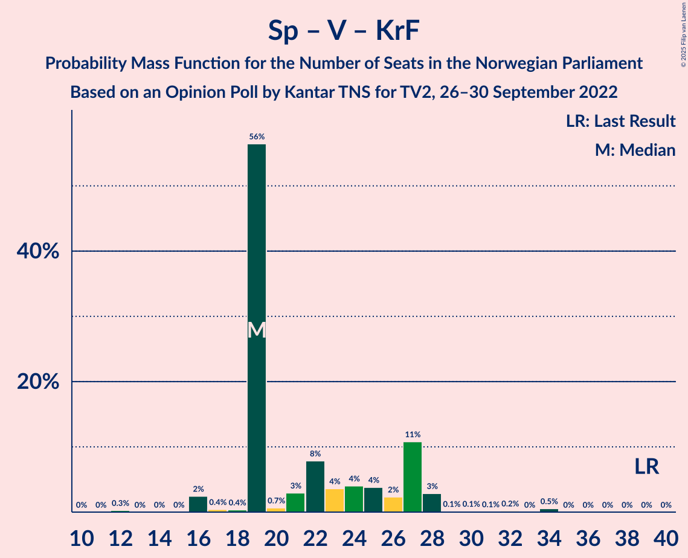

# Opinion Poll by Kantar TNS for TV2, 26–30 September 2022

<a href="#voting-intentions">Voting Intentions</a> | <a href="#seats">Seats</a> | <a href="#coalitions">Coalitions</a> | <a href="#technical-information">Technical Information</a>

## Voting Intentions

### Confidence Intervals

| Party | Last Result | Poll Result | 80% Confidence Interval | 90% Confidence Interval | 95% Confidence Interval | 99% Confidence Interval |
|:-----:|:-----------:|:-----------:|:-----------------------:|:-----------------------:|:-----------------------:|:-----------------------:|
| Høyre | 20.4% | 26.1% | 24.4–28.0% |23.9–28.5% |23.5–29.0% |22.6–29.9% |
| Arbeiderpartiet | 26.2% | 19.4% | 17.9–21.1% |17.4–21.6% |17.1–22.0% |16.3–22.8% |
| Fremskrittspartiet | 11.6% | 14.2% | 12.9–15.7% |12.5–16.2% |12.2–16.6% |11.6–17.3% |
| Rødt | 4.7% | 8.1% | 7.1–9.4% |6.8–9.7% |6.6–10.0% |6.1–10.6% |
| Sosialistisk Venstreparti | 7.6% | 7.2% | 6.2–8.4% |6.0–8.7% |5.8–9.0% |5.3–9.6% |
| Senterpartiet | 13.5% | 6.7% | 5.8–7.8% |5.5–8.2% |5.3–8.5% |4.9–9.0% |
| Venstre | 4.6% | 4.4% | 3.6–5.3% |3.4–5.6% |3.3–5.8% |2.9–6.3% |
| Miljøpartiet De Grønne | 3.9% | 4.2% | 3.4–5.1% |3.2–5.4% |3.1–5.6% |2.8–6.1% |
| Kristelig Folkeparti | 3.8% | 3.5% | 2.8–4.3% |2.6–4.6% |2.5–4.8% |2.2–5.2% |
| Norgesdemokratene | 1.1% | 2.2% | 1.7–3.0% |1.6–3.2% |1.5–3.4% |1.3–3.7% |
| Industri- og Næringspartiet | 0.3% | 1.9% | 1.5–2.6% |1.3–2.8% |1.2–3.0% |1.1–3.4% |
| Pensjonistpartiet | 0.6% | 0.7% | 0.5–1.2% |0.4–1.3% |0.4–1.5% |0.3–1.7% |
| Konservativt | 0.4% | 0.3% | 0.2–0.7% |0.1–0.8% |0.1–0.9% |0.1–1.1% |
| Helsepartiet | 0.2% | 0.2% | 0.1–0.5% |0.1–0.6% |0.1–0.7% |0.0–0.9% |

*Note:* The poll result column reflects the actual value used in the calculations. Published results may vary slightly, and in addition be rounded to fewer digits.

## Seats

### Confidence Intervals

| Party | Last Result | Median | 80% Confidence Interval | 90% Confidence Interval | 95% Confidence Interval | 99% Confidence Interval |
|:-----:|:-----------:|:------:|:-----------------------:|:-----------------------:|:-----------------------:|:-----------------------:|
| <a href="#høyre">Høyre</a> | 36 | 49 | 45–50 |44–52 |42–54 |40–56 |
| <a href="#arbeiderpartiet">Arbeiderpartiet</a> | 48 | 34 | 34–43 |34–44 |34–46 |32–46 |
| <a href="#fremskrittspartiet">Fremskrittspartiet</a> | 21 | 29 | 22–29 |21–29 |21–29 |20–32 |
| <a href="#rødt">Rødt</a> | 8 | 15 | 12–15 |12–17 |11–19 |11–19 |
| <a href="#sosialistisk-venstreparti">Sosialistisk Venstreparti</a> | 13 | 13 | 11–14 |11–16 |10–16 |9–17 |
| <a href="#senterpartiet">Senterpartiet</a> | 28 | 15 | 11–15 |9–15 |9–16 |9–16 |
| <a href="#venstre">Venstre</a> | 8 | 2 | 2–10 |2–10 |2–10 |2–11 |
| <a href="#miljøpartiet-de-grønne">Miljøpartiet De Grønne</a> | 3 | 9 | 7–9 |3–9 |2–10 |2–11 |
| <a href="#kristelig-folkeparti">Kristelig Folkeparti</a> | 3 | 2 | 2–3 |2–6 |2–7 |0–8 |
| <a href="#norgesdemokratene">Norgesdemokratene</a> | 0 | 0 | 0 |0 |0 |0–1 |
| <a href="#industri--og-næringspartiet">Industri- og Næringspartiet</a> | 0 | 0 | 0 |0–2 |0–2 |0–3 |
| <a href="#pensjonistpartiet">Pensjonistpartiet</a> | 0 | 0 | 0 |0 |0 |0 |
| <a href="#konservativt">Konservativt</a> | 0 | 0 | 0 |0 |0 |0 |
| <a href="#helsepartiet">Helsepartiet</a> | 0 | 0 | 0 |0 |0 |0 |

### Høyre

*For a full overview of the results for this party, see the [Høyre](party-høyre.html) page.*

| Number of Seats | Probability | Accumulated | Special Marks |
|:---------------:|:-----------:|:-----------:|:-------------:|
| 36 | 0% | 100% | Last Result |
| 37 | 0% | 100% |  |
| 38 | 0% | 100% |  |
| 39 | 0.4% | 100% |  |
| 40 | 0.3% | 99.6% |  |
| 41 | 0.4% | 99.4% |  |
| 42 | 4% | 98.9% |  |
| 43 | 0.1% | 95% |  |
| 44 | 1.2% | 95% |  |
| 45 | 10% | 94% |  |
| 46 | 6% | 84% |  |
| 47 | 4% | 78% |  |
| 48 | 0.6% | 74% |  |
| 49 | 60% | 73% | Median |
| 50 | 6% | 13% |  |
| 51 | 0.5% | 7% |  |
| 52 | 3% | 7% |  |
| 53 | 1.2% | 4% |  |
| 54 | 0.5% | 3% |  |
| 55 | 0.3% | 2% |  |
| 56 | 2% | 2% |  |
| 57 | 0.1% | 0.1% |  |
| 58 | 0% | 0% |  |

### Arbeiderpartiet

*For a full overview of the results for this party, see the [Arbeiderpartiet](party-arbeiderpartiet.html) page.*

| Number of Seats | Probability | Accumulated | Special Marks |
|:---------------:|:-----------:|:-----------:|:-------------:|
| 30 | 0.2% | 100% |  |
| 31 | 0.2% | 99.8% |  |
| 32 | 1.4% | 99.6% |  |
| 33 | 0.3% | 98% |  |
| 34 | 58% | 98% | Median |
| 35 | 3% | 39% |  |
| 36 | 7% | 36% |  |
| 37 | 1.3% | 30% |  |
| 38 | 8% | 28% |  |
| 39 | 2% | 21% |  |
| 40 | 2% | 19% |  |
| 41 | 1.3% | 17% |  |
| 42 | 0.6% | 15% |  |
| 43 | 9% | 15% |  |
| 44 | 2% | 6% |  |
| 45 | 0.1% | 4% |  |
| 46 | 4% | 4% |  |
| 47 | 0% | 0% |  |
| 48 | 0% | 0% | Last Result |

### Fremskrittspartiet

*For a full overview of the results for this party, see the [Fremskrittspartiet](party-fremskrittspartiet.html) page.*

| Number of Seats | Probability | Accumulated | Special Marks |
|:---------------:|:-----------:|:-----------:|:-------------:|
| 19 | 0.2% | 100% |  |
| 20 | 2% | 99.8% |  |
| 21 | 7% | 98% | Last Result |
| 22 | 13% | 91% |  |
| 23 | 3% | 78% |  |
| 24 | 5% | 75% |  |
| 25 | 6% | 71% |  |
| 26 | 4% | 65% |  |
| 27 | 0.8% | 61% |  |
| 28 | 0.6% | 60% |  |
| 29 | 58% | 59% | Median |
| 30 | 0.7% | 1.4% |  |
| 31 | 0.1% | 0.8% |  |
| 32 | 0.2% | 0.6% |  |
| 33 | 0.3% | 0.4% |  |
| 34 | 0% | 0.1% |  |
| 35 | 0.1% | 0.1% |  |
| 36 | 0% | 0% |  |

### Rødt

*For a full overview of the results for this party, see the [Rødt](party-rødt.html) page.*

| Number of Seats | Probability | Accumulated | Special Marks |
|:---------------:|:-----------:|:-----------:|:-------------:|
| 8 | 0% | 100% | Last Result |
| 9 | 0% | 100% |  |
| 10 | 0.3% | 100% |  |
| 11 | 4% | 99.6% |  |
| 12 | 12% | 96% |  |
| 13 | 8% | 83% |  |
| 14 | 8% | 76% |  |
| 15 | 60% | 68% | Median |
| 16 | 3% | 8% |  |
| 17 | 1.1% | 5% |  |
| 18 | 0.9% | 4% |  |
| 19 | 3% | 3% |  |
| 20 | 0.4% | 0.4% |  |
| 21 | 0% | 0% |  |

### Sosialistisk Venstreparti

*For a full overview of the results for this party, see the [Sosialistisk Venstreparti](party-sosialistiskvenstreparti.html) page.*

| Number of Seats | Probability | Accumulated | Special Marks |
|:---------------:|:-----------:|:-----------:|:-------------:|
| 8 | 0.1% | 100% |  |
| 9 | 2% | 99.9% |  |
| 10 | 1.4% | 98% |  |
| 11 | 10% | 97% |  |
| 12 | 15% | 87% |  |
| 13 | 62% | 73% | Last Result, Median |
| 14 | 2% | 11% |  |
| 15 | 1.4% | 10% |  |
| 16 | 7% | 8% |  |
| 17 | 0.5% | 0.9% |  |
| 18 | 0.3% | 0.4% |  |
| 19 | 0% | 0% |  |

### Senterpartiet

*For a full overview of the results for this party, see the [Senterpartiet](party-senterpartiet.html) page.*

| Number of Seats | Probability | Accumulated | Special Marks |
|:---------------:|:-----------:|:-----------:|:-------------:|
| 8 | 0.2% | 100% |  |
| 9 | 5% | 99.7% |  |
| 10 | 2% | 95% |  |
| 11 | 6% | 92% |  |
| 12 | 6% | 87% |  |
| 13 | 5% | 81% |  |
| 14 | 12% | 76% |  |
| 15 | 59% | 64% | Median |
| 16 | 5% | 5% |  |
| 17 | 0.3% | 0.3% |  |
| 18 | 0% | 0% |  |
| 19 | 0% | 0% |  |
| 20 | 0% | 0% |  |
| 21 | 0% | 0% |  |
| 22 | 0% | 0% |  |
| 23 | 0% | 0% |  |
| 24 | 0% | 0% |  |
| 25 | 0% | 0% |  |
| 26 | 0% | 0% |  |
| 27 | 0% | 0% |  |
| 28 | 0% | 0% | Last Result |

### Venstre

*For a full overview of the results for this party, see the [Venstre](party-venstre.html) page.*

| Number of Seats | Probability | Accumulated | Special Marks |
|:---------------:|:-----------:|:-----------:|:-------------:|
| 2 | 60% | 100% | Median |
| 3 | 3% | 40% |  |
| 4 | 0% | 37% |  |
| 5 | 0% | 37% |  |
| 6 | 0.1% | 37% |  |
| 7 | 4% | 37% |  |
| 8 | 9% | 32% | Last Result |
| 9 | 10% | 24% |  |
| 10 | 12% | 14% |  |
| 11 | 1.2% | 1.3% |  |
| 12 | 0.1% | 0.1% |  |
| 13 | 0% | 0% |  |

### Miljøpartiet De Grønne

*For a full overview of the results for this party, see the [Miljøpartiet De Grønne](party-miljøpartietdegrønne.html) page.*

| Number of Seats | Probability | Accumulated | Special Marks |
|:---------------:|:-----------:|:-----------:|:-------------:|
| 1 | 0.3% | 100% |  |
| 2 | 3% | 99.7% |  |
| 3 | 6% | 96% | Last Result |
| 4 | 0% | 90% |  |
| 5 | 0% | 90% |  |
| 6 | 0% | 90% |  |
| 7 | 15% | 90% |  |
| 8 | 4% | 75% |  |
| 9 | 67% | 71% | Median |
| 10 | 3% | 4% |  |
| 11 | 0.9% | 1.2% |  |
| 12 | 0.2% | 0.2% |  |
| 13 | 0.1% | 0.1% |  |
| 14 | 0% | 0% |  |

### Kristelig Folkeparti

*For a full overview of the results for this party, see the [Kristelig Folkeparti](party-kristeligfolkeparti.html) page.*

| Number of Seats | Probability | Accumulated | Special Marks |
|:---------------:|:-----------:|:-----------:|:-------------:|
| 0 | 0.9% | 100% |  |
| 1 | 0.1% | 99.1% |  |
| 2 | 67% | 99.0% | Median |
| 3 | 24% | 32% | Last Result |
| 4 | 0% | 8% |  |
| 5 | 0% | 8% |  |
| 6 | 4% | 8% |  |
| 7 | 3% | 5% |  |
| 8 | 2% | 2% |  |
| 9 | 0.3% | 0.4% |  |
| 10 | 0.1% | 0.1% |  |
| 11 | 0% | 0% |  |

### Norgesdemokratene

*For a full overview of the results for this party, see the [Norgesdemokratene](party-norgesdemokratene.html) page.*

| Number of Seats | Probability | Accumulated | Special Marks |
|:---------------:|:-----------:|:-----------:|:-------------:|
| 0 | 98.8% | 100% | Last Result, Median |
| 1 | 0.8% | 1.2% |  |
| 2 | 0% | 0.5% |  |
| 3 | 0% | 0.5% |  |
| 4 | 0% | 0.5% |  |
| 5 | 0% | 0.5% |  |
| 6 | 0% | 0.5% |  |
| 7 | 0.4% | 0.4% |  |
| 8 | 0% | 0% |  |

### Industri- og Næringspartiet

*For a full overview of the results for this party, see the [Industri- og Næringspartiet](party-industri-ognæringspartiet.html) page.*

| Number of Seats | Probability | Accumulated | Special Marks |
|:---------------:|:-----------:|:-----------:|:-------------:|
| 0 | 91% | 100% | Last Result, Median |
| 1 | 2% | 9% |  |
| 2 | 6% | 7% |  |
| 3 | 0.6% | 0.8% |  |
| 4 | 0% | 0.2% |  |
| 5 | 0% | 0.2% |  |
| 6 | 0% | 0.2% |  |
| 7 | 0.2% | 0.2% |  |
| 8 | 0% | 0% |  |

### Pensjonistpartiet

*For a full overview of the results for this party, see the [Pensjonistpartiet](party-pensjonistpartiet.html) page.*

| Number of Seats | Probability | Accumulated | Special Marks |
|:---------------:|:-----------:|:-----------:|:-------------:|
| 0 | 100% | 100% | Last Result, Median |

### Konservativt

*For a full overview of the results for this party, see the [Konservativt](party-konservativt.html) page.*

| Number of Seats | Probability | Accumulated | Special Marks |
|:---------------:|:-----------:|:-----------:|:-------------:|
| 0 | 100% | 100% | Last Result, Median |

### Helsepartiet

*For a full overview of the results for this party, see the [Helsepartiet](party-helsepartiet.html) page.*

| Number of Seats | Probability | Accumulated | Special Marks |
|:---------------:|:-----------:|:-----------:|:-------------:|
| 0 | 100% | 100% | Last Result, Median |

## Coalitions

### Confidence Intervals

| Coalition | Last Result | Median | Majority? | 80% Confidence Interval | 90% Confidence Interval | 95% Confidence Interval | 99% Confidence Interval |
|:---------:|:-----------:|:------:|:---------:|:-----------------------:|:-----------------------:|:-----------------------:|:-----------------------:|
| Høyre – Fremskrittspartiet – Senterpartiet – Venstre – Kristelig Folkeparti | 96 | 97 | 100% | 93–97 | 89–99 | 89–102 | 88–107 |
| Høyre – Fremskrittspartiet – Venstre – Miljøpartiet De Grønne – Kristelig Folkeparti | 71 | 91 | 98% | 87–92 | 86–96 | 85–97 | 82–99 |
| Arbeiderpartiet – Rødt – Sosialistisk Venstreparti – Senterpartiet – Miljøpartiet De Grønne | 100 | 86 | 87% | 82–88 | 79–90 | 78–91 | 73–93 |
| Høyre – Fremskrittspartiet – Venstre – Kristelig Folkeparti | 68 | 82 | 12% | 80–86 | 78–87 | 77–90 | 74–95 |
| Høyre – Fremskrittspartiet – Venstre | 65 | 80 | 3% | 75–83 | 74–84 | 74–86 | 71–92 |
| Arbeiderpartiet – Rødt – Sosialistisk Venstreparti – Senterpartiet | 97 | 77 | 1.2% | 76–81 | 72–81 | 71–83 | 69–85 |
| Høyre – Fremskrittspartiet | 57 | 78 | 0% | 67–78 | 67–78 | 66–82 | 64–82 |
| Arbeiderpartiet – Sosialistisk Venstreparti – Senterpartiet – Miljøpartiet De Grønne – Kristelig Folkeparti | 95 | 73 | 0.5% | 72–79 | 68–79 | 66–80 | 60–85 |
| Arbeiderpartiet – Rødt – Sosialistisk Venstreparti – Miljøpartiet De Grønne | 72 | 71 | 0% | 70–74 | 68–77 | 65–77 | 61–79 |
| Arbeiderpartiet – Sosialistisk Venstreparti – Senterpartiet – Miljøpartiet De Grønne | 92 | 71 | 0% | 67–76 | 65–76 | 63–77 | 57–77 |
| Arbeiderpartiet – Sosialistisk Venstreparti – Senterpartiet | 89 | 62 | 0% | 62–69 | 58–69 | 58–69 | 55–71 |
| Arbeiderpartiet – Senterpartiet – Miljøpartiet De Grønne – Kristelig Folkeparti | 82 | 60 | 0% | 59–67 | 55–67 | 55–68 | 49–69 |
| Høyre – Venstre – Kristelig Folkeparti | 47 | 53 | 0% | 53–61 | 53–63 | 52–65 | 50–66 |
| Arbeiderpartiet – Senterpartiet – Kristelig Folkeparti | 79 | 51 | 0% | 51–60 | 50–61 | 48–61 | 47–63 |
| Arbeiderpartiet – Sosialistisk Venstreparti | 61 | 47 | 0% | 47–55 | 47–57 | 47–57 | 43–57 |
| Arbeiderpartiet – Senterpartiet | 76 | 49 | 0% | 49–57 | 47–57 | 45–57 | 44–58 |
| Senterpartiet – Venstre – Kristelig Folkeparti | 39 | 19 | 0% | 19–27 | 19–27 | 16–28 | 16–34 |

### Høyre – Fremskrittspartiet – Senterpartiet – Venstre – Kristelig Folkeparti

| Number of Seats | Probability | Accumulated | Special Marks |
|:---------------:|:-----------:|:-----------:|:-------------:|
| 87 | 0.5% | 100% |  |
| 88 | 1.0% | 99.5% |  |
| 89 | 4% | 98% |  |
| 90 | 0% | 95% |  |
| 91 | 2% | 95% |  |
| 92 | 0.4% | 92% |  |
| 93 | 3% | 92% |  |
| 94 | 12% | 89% |  |
| 95 | 8% | 77% |  |
| 96 | 1.2% | 69% | Last Result |
| 97 | 59% | 68% | Median |
| 98 | 3% | 9% |  |
| 99 | 2% | 7% |  |
| 100 | 0.6% | 4% |  |
| 101 | 0.4% | 4% |  |
| 102 | 1.3% | 3% |  |
| 103 | 0.1% | 2% |  |
| 104 | 0.3% | 2% |  |
| 105 | 0.5% | 2% |  |
| 106 | 0.1% | 1.2% |  |
| 107 | 1.1% | 1.1% |  |
| 108 | 0% | 0% |  |

### Høyre – Fremskrittspartiet – Venstre – Miljøpartiet De Grønne – Kristelig Folkeparti

| Number of Seats | Probability | Accumulated | Special Marks |
|:---------------:|:-----------:|:-----------:|:-------------:|
| 71 | 0% | 100% | Last Result |
| 72 | 0% | 100% |  |
| 73 | 0% | 100% |  |
| 74 | 0% | 100% |  |
| 75 | 0% | 100% |  |
| 76 | 0% | 100% |  |
| 77 | 0% | 100% |  |
| 78 | 0% | 100% |  |
| 79 | 0.2% | 100% |  |
| 80 | 0% | 99.7% |  |
| 81 | 0% | 99.7% |  |
| 82 | 0.6% | 99.7% |  |
| 83 | 0.8% | 99.1% |  |
| 84 | 0.7% | 98% |  |
| 85 | 2% | 98% | Majority |
| 86 | 0.6% | 95% |  |
| 87 | 16% | 95% |  |
| 88 | 3% | 78% |  |
| 89 | 4% | 75% |  |
| 90 | 1.3% | 71% |  |
| 91 | 57% | 70% | Median |
| 92 | 6% | 13% |  |
| 93 | 0.7% | 7% |  |
| 94 | 0.8% | 6% |  |
| 95 | 0.1% | 5% |  |
| 96 | 2% | 5% |  |
| 97 | 1.1% | 3% |  |
| 98 | 0.1% | 2% |  |
| 99 | 2% | 2% |  |
| 100 | 0% | 0.1% |  |
| 101 | 0.1% | 0.1% |  |
| 102 | 0% | 0% |  |

### Arbeiderpartiet – Rødt – Sosialistisk Venstreparti – Senterpartiet – Miljøpartiet De Grønne

| Number of Seats | Probability | Accumulated | Special Marks |
|:---------------:|:-----------:|:-----------:|:-------------:|
| 73 | 1.2% | 100% |  |
| 74 | 0.1% | 98.8% |  |
| 75 | 0.2% | 98.7% |  |
| 76 | 0.1% | 98% |  |
| 77 | 0.7% | 98% |  |
| 78 | 2% | 98% |  |
| 79 | 0.9% | 96% |  |
| 80 | 0.3% | 95% |  |
| 81 | 3% | 95% |  |
| 82 | 3% | 91% |  |
| 83 | 0.8% | 88% |  |
| 84 | 0.8% | 87% |  |
| 85 | 5% | 87% | Majority |
| 86 | 63% | 82% | Median |
| 87 | 1.1% | 18% |  |
| 88 | 11% | 17% |  |
| 89 | 0.3% | 6% |  |
| 90 | 3% | 6% |  |
| 91 | 2% | 3% |  |
| 92 | 0.8% | 1.3% |  |
| 93 | 0.3% | 0.5% |  |
| 94 | 0% | 0.2% |  |
| 95 | 0.1% | 0.2% |  |
| 96 | 0% | 0.1% |  |
| 97 | 0% | 0% |  |
| 98 | 0% | 0% |  |
| 99 | 0% | 0% |  |
| 100 | 0% | 0% | Last Result |

### Høyre – Fremskrittspartiet – Venstre – Kristelig Folkeparti

| Number of Seats | Probability | Accumulated | Special Marks |
|:---------------:|:-----------:|:-----------:|:-------------:|
| 68 | 0% | 100% | Last Result |
| 69 | 0% | 100% |  |
| 70 | 0% | 100% |  |
| 71 | 0% | 100% |  |
| 72 | 0% | 100% |  |
| 73 | 0.2% | 99.9% |  |
| 74 | 0.4% | 99.8% |  |
| 75 | 0.3% | 99.4% |  |
| 76 | 0.4% | 99.0% |  |
| 77 | 3% | 98.6% |  |
| 78 | 3% | 96% |  |
| 79 | 0.3% | 93% |  |
| 80 | 14% | 93% |  |
| 81 | 2% | 78% |  |
| 82 | 60% | 76% | Median |
| 83 | 4% | 16% |  |
| 84 | 0.9% | 13% |  |
| 85 | 0.8% | 12% | Majority |
| 86 | 3% | 11% |  |
| 87 | 3% | 8% |  |
| 88 | 0.2% | 5% |  |
| 89 | 0.6% | 4% |  |
| 90 | 2% | 4% |  |
| 91 | 0.7% | 2% |  |
| 92 | 0% | 1.3% |  |
| 93 | 0.2% | 1.3% |  |
| 94 | 0% | 1.1% |  |
| 95 | 1.1% | 1.1% |  |
| 96 | 0% | 0% |  |

### Høyre – Fremskrittspartiet – Venstre

| Number of Seats | Probability | Accumulated | Special Marks |
|:---------------:|:-----------:|:-----------:|:-------------:|
| 65 | 0% | 100% | Last Result |
| 66 | 0% | 100% |  |
| 67 | 0% | 100% |  |
| 68 | 0% | 100% |  |
| 69 | 0% | 100% |  |
| 70 | 0.2% | 100% |  |
| 71 | 0.5% | 99.8% |  |
| 72 | 0.5% | 99.3% |  |
| 73 | 0.4% | 98.9% |  |
| 74 | 5% | 98% |  |
| 75 | 4% | 94% |  |
| 76 | 0.5% | 89% |  |
| 77 | 9% | 89% |  |
| 78 | 4% | 80% |  |
| 79 | 5% | 76% |  |
| 80 | 57% | 71% | Median |
| 81 | 4% | 14% |  |
| 82 | 0.2% | 10% |  |
| 83 | 4% | 10% |  |
| 84 | 3% | 6% |  |
| 85 | 0.2% | 3% | Majority |
| 86 | 0.6% | 3% |  |
| 87 | 0.5% | 2% |  |
| 88 | 0.1% | 2% |  |
| 89 | 0.6% | 2% |  |
| 90 | 0% | 1.1% |  |
| 91 | 0% | 1.0% |  |
| 92 | 1.0% | 1.0% |  |
| 93 | 0% | 0% |  |

### Arbeiderpartiet – Rødt – Sosialistisk Venstreparti – Senterpartiet

| Number of Seats | Probability | Accumulated | Special Marks |
|:---------------:|:-----------:|:-----------:|:-------------:|
| 66 | 0.2% | 100% |  |
| 67 | 0% | 99.8% |  |
| 68 | 0% | 99.8% |  |
| 69 | 2% | 99.7% |  |
| 70 | 0.1% | 98% |  |
| 71 | 1.1% | 98% |  |
| 72 | 2% | 97% |  |
| 73 | 0.4% | 95% |  |
| 74 | 0.9% | 94% |  |
| 75 | 0.3% | 93% |  |
| 76 | 7% | 93% |  |
| 77 | 57% | 87% | Median |
| 78 | 2% | 29% |  |
| 79 | 9% | 27% |  |
| 80 | 1.4% | 18% |  |
| 81 | 12% | 17% |  |
| 82 | 0.5% | 5% |  |
| 83 | 2% | 4% |  |
| 84 | 1.0% | 2% |  |
| 85 | 0.8% | 1.2% | Majority |
| 86 | 0.1% | 0.3% |  |
| 87 | 0% | 0.3% |  |
| 88 | 0% | 0.2% |  |
| 89 | 0.2% | 0.2% |  |
| 90 | 0% | 0% |  |
| 91 | 0% | 0% |  |
| 92 | 0% | 0% |  |
| 93 | 0% | 0% |  |
| 94 | 0% | 0% |  |
| 95 | 0% | 0% |  |
| 96 | 0% | 0% |  |
| 97 | 0% | 0% | Last Result |

### Høyre – Fremskrittspartiet

| Number of Seats | Probability | Accumulated | Special Marks |
|:---------------:|:-----------:|:-----------:|:-------------:|
| 57 | 0% | 100% | Last Result |
| 58 | 0% | 100% |  |
| 59 | 0% | 100% |  |
| 60 | 0% | 100% |  |
| 61 | 0% | 100% |  |
| 62 | 0% | 100% |  |
| 63 | 0.5% | 100% |  |
| 64 | 0% | 99.5% |  |
| 65 | 0.3% | 99.5% |  |
| 66 | 2% | 99.2% |  |
| 67 | 13% | 97% |  |
| 68 | 2% | 84% |  |
| 69 | 2% | 82% |  |
| 70 | 2% | 80% |  |
| 71 | 4% | 78% |  |
| 72 | 6% | 74% |  |
| 73 | 0.8% | 68% |  |
| 74 | 2% | 67% |  |
| 75 | 3% | 65% |  |
| 76 | 0.6% | 62% |  |
| 77 | 0.5% | 61% |  |
| 78 | 57% | 61% | Median |
| 79 | 0.8% | 4% |  |
| 80 | 0.2% | 3% |  |
| 81 | 0% | 3% |  |
| 82 | 3% | 3% |  |
| 83 | 0% | 0.4% |  |
| 84 | 0.3% | 0.3% |  |
| 85 | 0% | 0% | Majority |

### Arbeiderpartiet – Sosialistisk Venstreparti – Senterpartiet – Miljøpartiet De Grønne – Kristelig Folkeparti

| Number of Seats | Probability | Accumulated | Special Marks |
|:---------------:|:-----------:|:-----------:|:-------------:|
| 60 | 1.0% | 100% |  |
| 61 | 0.1% | 99.0% |  |
| 62 | 0% | 98.9% |  |
| 63 | 0.1% | 98.8% |  |
| 64 | 0.1% | 98.8% |  |
| 65 | 0.4% | 98.7% |  |
| 66 | 3% | 98% |  |
| 67 | 0.4% | 96% |  |
| 68 | 0.9% | 95% |  |
| 69 | 0.8% | 94% |  |
| 70 | 3% | 94% |  |
| 71 | 1.1% | 91% |  |
| 72 | 0.4% | 90% |  |
| 73 | 61% | 90% | Median |
| 74 | 3% | 29% |  |
| 75 | 2% | 26% |  |
| 76 | 1.1% | 24% |  |
| 77 | 4% | 23% |  |
| 78 | 2% | 19% |  |
| 79 | 13% | 17% |  |
| 80 | 3% | 3% |  |
| 81 | 0.1% | 0.6% |  |
| 82 | 0% | 0.5% |  |
| 83 | 0% | 0.5% |  |
| 84 | 0% | 0.5% |  |
| 85 | 0.5% | 0.5% | Majority |
| 86 | 0% | 0% |  |
| 87 | 0% | 0% |  |
| 88 | 0% | 0% |  |
| 89 | 0% | 0% |  |
| 90 | 0% | 0% |  |
| 91 | 0% | 0% |  |
| 92 | 0% | 0% |  |
| 93 | 0% | 0% |  |
| 94 | 0% | 0% |  |
| 95 | 0% | 0% | Last Result |

### Arbeiderpartiet – Rødt – Sosialistisk Venstreparti – Miljøpartiet De Grønne

| Number of Seats | Probability | Accumulated | Special Marks |
|:---------------:|:-----------:|:-----------:|:-------------:|
| 61 | 1.1% | 100% |  |
| 62 | 0.1% | 98.9% |  |
| 63 | 0.5% | 98.8% |  |
| 64 | 0.4% | 98% |  |
| 65 | 0.6% | 98% |  |
| 66 | 1.3% | 97% |  |
| 67 | 0.4% | 96% |  |
| 68 | 0.8% | 96% |  |
| 69 | 3% | 95% |  |
| 70 | 2% | 92% |  |
| 71 | 59% | 90% | Median |
| 72 | 1.0% | 31% | Last Result |
| 73 | 8% | 30% |  |
| 74 | 12% | 22% |  |
| 75 | 4% | 10% |  |
| 76 | 0.5% | 6% |  |
| 77 | 4% | 5% |  |
| 78 | 0.4% | 2% |  |
| 79 | 0.8% | 1.3% |  |
| 80 | 0% | 0.5% |  |
| 81 | 0.5% | 0.5% |  |
| 82 | 0% | 0% |  |

### Arbeiderpartiet – Sosialistisk Venstreparti – Senterpartiet – Miljøpartiet De Grønne

| Number of Seats | Probability | Accumulated | Special Marks |
|:---------------:|:-----------:|:-----------:|:-------------:|
| 57 | 1.0% | 100% |  |
| 58 | 0.1% | 99.0% |  |
| 59 | 0.1% | 98.9% |  |
| 60 | 0.1% | 98.8% |  |
| 61 | 0.1% | 98.8% |  |
| 62 | 0.1% | 98.6% |  |
| 63 | 3% | 98.5% |  |
| 64 | 0.4% | 96% |  |
| 65 | 0.5% | 95% |  |
| 66 | 1.4% | 95% |  |
| 67 | 5% | 93% |  |
| 68 | 0.8% | 89% |  |
| 69 | 1.1% | 88% |  |
| 70 | 1.3% | 87% |  |
| 71 | 60% | 85% | Median |
| 72 | 2% | 26% |  |
| 73 | 5% | 24% |  |
| 74 | 4% | 19% |  |
| 75 | 0.1% | 15% |  |
| 76 | 11% | 15% |  |
| 77 | 3% | 4% |  |
| 78 | 0.3% | 0.4% |  |
| 79 | 0% | 0.2% |  |
| 80 | 0% | 0.2% |  |
| 81 | 0% | 0.2% |  |
| 82 | 0.1% | 0.2% |  |
| 83 | 0% | 0% |  |
| 84 | 0% | 0% |  |
| 85 | 0% | 0% | Majority |
| 86 | 0% | 0% |  |
| 87 | 0% | 0% |  |
| 88 | 0% | 0% |  |
| 89 | 0% | 0% |  |
| 90 | 0% | 0% |  |
| 91 | 0% | 0% |  |
| 92 | 0% | 0% | Last Result |

### Arbeiderpartiet – Sosialistisk Venstreparti – Senterpartiet

| Number of Seats | Probability | Accumulated | Special Marks |
|:---------------:|:-----------:|:-----------:|:-------------:|
| 54 | 0.1% | 100% |  |
| 55 | 1.2% | 99.9% |  |
| 56 | 0.2% | 98.7% |  |
| 57 | 0.1% | 98.5% |  |
| 58 | 4% | 98% |  |
| 59 | 0.2% | 95% |  |
| 60 | 3% | 94% |  |
| 61 | 0.7% | 92% |  |
| 62 | 61% | 91% | Median |
| 63 | 3% | 30% |  |
| 64 | 5% | 27% |  |
| 65 | 0.5% | 23% |  |
| 66 | 5% | 22% |  |
| 67 | 2% | 18% |  |
| 68 | 4% | 15% |  |
| 69 | 10% | 11% |  |
| 70 | 0.5% | 1.2% |  |
| 71 | 0.5% | 0.7% |  |
| 72 | 0% | 0.2% |  |
| 73 | 0.2% | 0.2% |  |
| 74 | 0% | 0% |  |
| 75 | 0% | 0% |  |
| 76 | 0% | 0% |  |
| 77 | 0% | 0% |  |
| 78 | 0% | 0% |  |
| 79 | 0% | 0% |  |
| 80 | 0% | 0% |  |
| 81 | 0% | 0% |  |
| 82 | 0% | 0% |  |
| 83 | 0% | 0% |  |
| 84 | 0% | 0% |  |
| 85 | 0% | 0% | Majority |
| 86 | 0% | 0% |  |
| 87 | 0% | 0% |  |
| 88 | 0% | 0% |  |
| 89 | 0% | 0% | Last Result |

### Arbeiderpartiet – Senterpartiet – Miljøpartiet De Grønne – Kristelig Folkeparti

| Number of Seats | Probability | Accumulated | Special Marks |
|:---------------:|:-----------:|:-----------:|:-------------:|
| 49 | 1.0% | 100% |  |
| 50 | 0.1% | 98.9% |  |
| 51 | 0.1% | 98.8% |  |
| 52 | 0.3% | 98.7% |  |
| 53 | 0.4% | 98% |  |
| 54 | 0.4% | 98% |  |
| 55 | 3% | 98% |  |
| 56 | 0.3% | 95% |  |
| 57 | 3% | 94% |  |
| 58 | 1.1% | 91% |  |
| 59 | 0.9% | 90% |  |
| 60 | 58% | 89% | Median |
| 61 | 7% | 32% |  |
| 62 | 4% | 25% |  |
| 63 | 0.4% | 21% |  |
| 64 | 4% | 21% |  |
| 65 | 2% | 16% |  |
| 66 | 0.2% | 14% |  |
| 67 | 9% | 14% |  |
| 68 | 4% | 5% |  |
| 69 | 0.8% | 1.2% |  |
| 70 | 0% | 0.4% |  |
| 71 | 0% | 0.4% |  |
| 72 | 0.3% | 0.4% |  |
| 73 | 0% | 0% |  |
| 74 | 0% | 0% |  |
| 75 | 0% | 0% |  |
| 76 | 0% | 0% |  |
| 77 | 0% | 0% |  |
| 78 | 0% | 0% |  |
| 79 | 0% | 0% |  |
| 80 | 0% | 0% |  |
| 81 | 0% | 0% |  |
| 82 | 0% | 0% | Last Result |

### Høyre – Venstre – Kristelig Folkeparti

| Number of Seats | Probability | Accumulated | Special Marks |
|:---------------:|:-----------:|:-----------:|:-------------:|
| 47 | 0% | 100% | Last Result |
| 48 | 0.2% | 100% |  |
| 49 | 0.1% | 99.8% |  |
| 50 | 0.6% | 99.8% |  |
| 51 | 0.4% | 99.1% |  |
| 52 | 3% | 98.7% |  |
| 53 | 57% | 96% | Median |
| 54 | 4% | 39% |  |
| 55 | 0.7% | 35% |  |
| 56 | 0.8% | 34% |  |
| 57 | 1.4% | 33% |  |
| 58 | 10% | 32% |  |
| 59 | 4% | 22% |  |
| 60 | 1.2% | 18% |  |
| 61 | 9% | 17% |  |
| 62 | 0.7% | 8% |  |
| 63 | 3% | 7% |  |
| 64 | 0.4% | 4% |  |
| 65 | 2% | 4% |  |
| 66 | 2% | 2% |  |
| 67 | 0% | 0.1% |  |
| 68 | 0% | 0.1% |  |
| 69 | 0.1% | 0.1% |  |
| 70 | 0% | 0% |  |

### Arbeiderpartiet – Senterpartiet – Kristelig Folkeparti

| Number of Seats | Probability | Accumulated | Special Marks |
|:---------------:|:-----------:|:-----------:|:-------------:|
| 44 | 0.1% | 100% |  |
| 45 | 0.1% | 99.9% |  |
| 46 | 0.2% | 99.9% |  |
| 47 | 2% | 99.7% |  |
| 48 | 2% | 98% |  |
| 49 | 0.5% | 96% |  |
| 50 | 1.1% | 96% |  |
| 51 | 60% | 95% | Median |
| 52 | 6% | 35% |  |
| 53 | 2% | 29% |  |
| 54 | 3% | 27% |  |
| 55 | 3% | 24% |  |
| 56 | 2% | 20% |  |
| 57 | 2% | 18% |  |
| 58 | 0.5% | 16% |  |
| 59 | 1.0% | 16% |  |
| 60 | 9% | 15% |  |
| 61 | 4% | 5% |  |
| 62 | 0.6% | 1.2% |  |
| 63 | 0.1% | 0.6% |  |
| 64 | 0% | 0.5% |  |
| 65 | 0.4% | 0.4% |  |
| 66 | 0.1% | 0.1% |  |
| 67 | 0% | 0% |  |
| 68 | 0% | 0% |  |
| 69 | 0% | 0% |  |
| 70 | 0% | 0% |  |
| 71 | 0% | 0% |  |
| 72 | 0% | 0% |  |
| 73 | 0% | 0% |  |
| 74 | 0% | 0% |  |
| 75 | 0% | 0% |  |
| 76 | 0% | 0% |  |
| 77 | 0% | 0% |  |
| 78 | 0% | 0% |  |
| 79 | 0% | 0% | Last Result |

### Arbeiderpartiet – Sosialistisk Venstreparti

| Number of Seats | Probability | Accumulated | Special Marks |
|:---------------:|:-----------:|:-----------:|:-------------:|
| 42 | 0.1% | 100% |  |
| 43 | 1.2% | 99.9% |  |
| 44 | 0.2% | 98.6% |  |
| 45 | 0.1% | 98% |  |
| 46 | 0.7% | 98% |  |
| 47 | 58% | 98% | Median |
| 48 | 2% | 39% |  |
| 49 | 6% | 38% |  |
| 50 | 3% | 31% |  |
| 51 | 5% | 28% |  |
| 52 | 5% | 23% |  |
| 53 | 1.3% | 18% |  |
| 54 | 0.8% | 17% |  |
| 55 | 10% | 16% |  |
| 56 | 0.7% | 6% |  |
| 57 | 5% | 6% |  |
| 58 | 0.2% | 0.2% |  |
| 59 | 0% | 0.1% |  |
| 60 | 0% | 0% |  |
| 61 | 0% | 0% | Last Result |

### Arbeiderpartiet – Senterpartiet

| Number of Seats | Probability | Accumulated | Special Marks |
|:---------------:|:-----------:|:-----------:|:-------------:|
| 42 | 0.2% | 100% |  |
| 43 | 0% | 99.8% |  |
| 44 | 1.5% | 99.8% |  |
| 45 | 2% | 98% |  |
| 46 | 0.4% | 96% |  |
| 47 | 1.0% | 96% |  |
| 48 | 3% | 95% |  |
| 49 | 61% | 92% | Median |
| 50 | 4% | 31% |  |
| 51 | 3% | 27% |  |
| 52 | 6% | 23% |  |
| 53 | 1.0% | 18% |  |
| 54 | 2% | 17% |  |
| 55 | 4% | 15% |  |
| 56 | 0.5% | 11% |  |
| 57 | 9% | 10% |  |
| 58 | 0.4% | 0.9% |  |
| 59 | 0.1% | 0.5% |  |
| 60 | 0.3% | 0.3% |  |
| 61 | 0% | 0% |  |
| 62 | 0% | 0% |  |
| 63 | 0% | 0% |  |
| 64 | 0% | 0% |  |
| 65 | 0% | 0% |  |
| 66 | 0% | 0% |  |
| 67 | 0% | 0% |  |
| 68 | 0% | 0% |  |
| 69 | 0% | 0% |  |
| 70 | 0% | 0% |  |
| 71 | 0% | 0% |  |
| 72 | 0% | 0% |  |
| 73 | 0% | 0% |  |
| 74 | 0% | 0% |  |
| 75 | 0% | 0% |  |
| 76 | 0% | 0% | Last Result |

### Senterpartiet – Venstre – Kristelig Folkeparti

| Number of Seats | Probability | Accumulated | Special Marks |
|:---------------:|:-----------:|:-----------:|:-------------:|
| 12 | 0.3% | 100% |  |
| 13 | 0% | 99.7% |  |
| 14 | 0% | 99.7% |  |
| 15 | 0% | 99.7% |  |
| 16 | 2% | 99.7% |  |
| 17 | 0.4% | 97% |  |
| 18 | 0.4% | 97% |  |
| 19 | 56% | 96% | Median |
| 20 | 0.7% | 40% |  |
| 21 | 3% | 39% |  |
| 22 | 8% | 36% |  |
| 23 | 4% | 29% |  |
| 24 | 4% | 25% |  |
| 25 | 4% | 21% |  |
| 26 | 2% | 17% |  |
| 27 | 11% | 15% |  |
| 28 | 3% | 4% |  |
| 29 | 0.1% | 1.1% |  |
| 30 | 0.1% | 1.0% |  |
| 31 | 0.1% | 0.8% |  |
| 32 | 0.2% | 0.8% |  |
| 33 | 0% | 0.6% |  |
| 34 | 0.5% | 0.5% |  |
| 35 | 0% | 0% |  |
| 36 | 0% | 0% |  |
| 37 | 0% | 0% |  |
| 38 | 0% | 0% |  |
| 39 | 0% | 0% | Last Result |

## Technical Information

### Opinion Poll

+ **Polling firm:** Kantar TNS
+ **Commissioner(s):** TV2
+ **Fieldwork period:** 26–30 September 2022

### Calculations

+ **Sample size:** 984
+ **Simulations done:** 1,048,576
+ **Error estimate:** 4.12%

