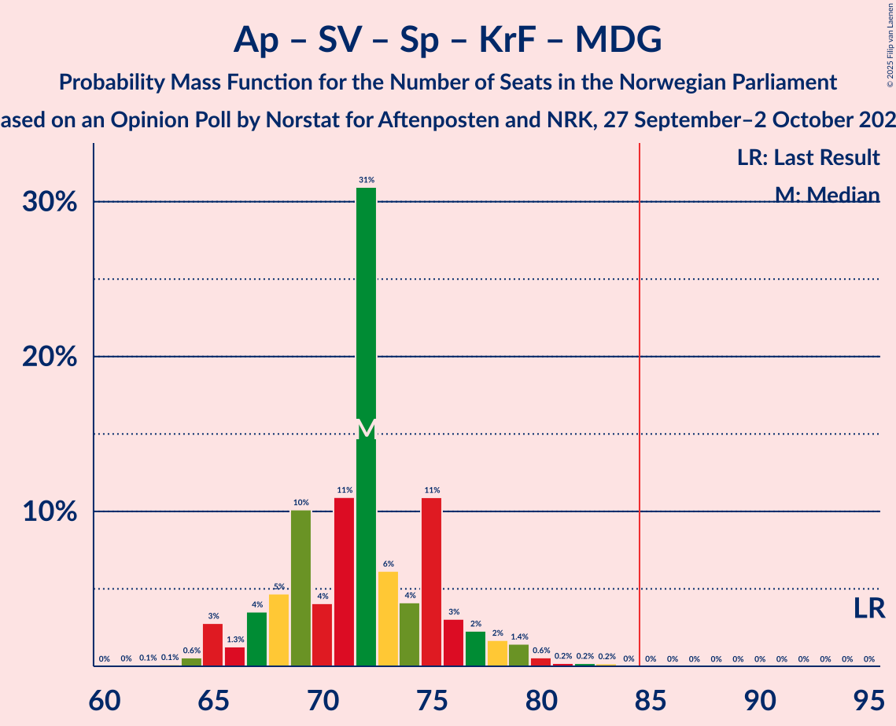

# Opinion Poll by Norstat for Aftenposten and NRK, 27 September–2 October 2022

<a href="#voting-intentions">Voting Intentions</a> | <a href="#seats">Seats</a> | <a href="#coalitions">Coalitions</a> | <a href="#technical-information">Technical Information</a>

## Voting Intentions

### Confidence Intervals

| Party | Last Result | Poll Result | 80% Confidence Interval | 90% Confidence Interval | 95% Confidence Interval | 99% Confidence Interval |
|:-----:|:-----------:|:-----------:|:-----------------------:|:-----------------------:|:-----------------------:|:-----------------------:|
| Høyre | 20.4% | 29.2% | 27.3–31.1% |26.8–31.7% |26.4–32.1% |25.5–33.1% |
| Arbeiderpartiet | 26.2% | 19.9% | 18.3–21.6% |17.9–22.1% |17.5–22.5% |16.8–23.4% |
| Fremskrittspartiet | 11.6% | 14.4% | 13.0–15.9% |12.6–16.4% |12.3–16.8% |11.7–17.5% |
| Sosialistisk Venstreparti | 7.6% | 9.1% | 8.0–10.4% |7.7–10.7% |7.4–11.1% |6.9–11.7% |
| Rødt | 4.7% | 7.0% | 6.0–8.2% |5.8–8.5% |5.5–8.8% |5.1–9.4% |
| Senterpartiet | 13.5% | 6.2% | 5.3–7.4% |5.1–7.7% |4.9–8.0% |4.5–8.5% |
| Kristelig Folkeparti | 3.8% | 3.4% | 2.8–4.3% |2.6–4.6% |2.5–4.8% |2.2–5.3% |
| Venstre | 4.6% | 3.4% | 2.8–4.3% |2.6–4.6% |2.5–4.8% |2.2–5.3% |
| Miljøpartiet De Grønne | 3.9% | 3.1% | 2.5–4.0% |2.3–4.2% |2.2–4.4% |1.9–4.9% |
| Norgesdemokratene | 1.1% | 1.7% | 1.2–2.3% |1.1–2.5% |1.0–2.7% |0.9–3.0% |

*Note:* The poll result column reflects the actual value used in the calculations. Published results may vary slightly, and in addition be rounded to fewer digits.

## Seats

### Confidence Intervals

| Party | Last Result | Median | 80% Confidence Interval | 90% Confidence Interval | 95% Confidence Interval | 99% Confidence Interval |
|:-----:|:-----------:|:------:|:-----------------------:|:-----------------------:|:-----------------------:|:-----------------------:|
| <a href="#høyre">Høyre</a> | 36 | 53 | 49–57 |48–59 |47–59 |47–61 |
| <a href="#arbeiderpartiet">Arbeiderpartiet</a> | 48 | 38 | 35–40 |34–42 |33–44 |32–45 |
| <a href="#fremskrittspartiet">Fremskrittspartiet</a> | 21 | 28 | 24–29 |23–30 |22–31 |21–34 |
| <a href="#sosialistisk-venstreparti">Sosialistisk Venstreparti</a> | 13 | 17 | 14–19 |14–20 |13–21 |12–21 |
| <a href="#rødt">Rødt</a> | 8 | 12 | 11–15 |10–16 |10–16 |9–17 |
| <a href="#senterpartiet">Senterpartiet</a> | 28 | 12 | 10–13 |9–14 |9–15 |8–16 |
| <a href="#kristelig-folkeparti">Kristelig Folkeparti</a> | 3 | 2 | 2–7 |2–8 |2–8 |0–10 |
| <a href="#venstre">Venstre</a> | 8 | 2 | 2–8 |2–8 |2–9 |1–9 |
| <a href="#miljøpartiet-de-grønne">Miljøpartiet De Grønne</a> | 3 | 2 | 1–3 |1–7 |1–8 |1–9 |
| <a href="#norgesdemokratene">Norgesdemokratene</a> | 0 | 0 | 0 |0 |0 |0 |

### Høyre

*For a full overview of the results for this party, see the [Høyre](party-høyre.html) page.*

| Number of Seats | Probability | Accumulated | Special Marks |
|:---------------:|:-----------:|:-----------:|:-------------:|
| 36 | 0% | 100% | Last Result |
| 37 | 0% | 100% |  |
| 38 | 0% | 100% |  |
| 39 | 0% | 100% |  |
| 40 | 0% | 100% |  |
| 41 | 0% | 100% |  |
| 42 | 0% | 100% |  |
| 43 | 0% | 100% |  |
| 44 | 0% | 100% |  |
| 45 | 0.1% | 99.9% |  |
| 46 | 0.4% | 99.9% |  |
| 47 | 2% | 99.5% |  |
| 48 | 4% | 97% |  |
| 49 | 4% | 93% |  |
| 50 | 7% | 90% |  |
| 51 | 9% | 83% |  |
| 52 | 6% | 74% |  |
| 53 | 35% | 68% | Median |
| 54 | 7% | 32% |  |
| 55 | 5% | 25% |  |
| 56 | 8% | 20% |  |
| 57 | 4% | 12% |  |
| 58 | 3% | 8% |  |
| 59 | 3% | 5% |  |
| 60 | 1.1% | 2% |  |
| 61 | 0.7% | 1.0% |  |
| 62 | 0.2% | 0.4% |  |
| 63 | 0.2% | 0.2% |  |
| 64 | 0% | 0% |  |

### Arbeiderpartiet

*For a full overview of the results for this party, see the [Arbeiderpartiet](party-arbeiderpartiet.html) page.*

| Number of Seats | Probability | Accumulated | Special Marks |
|:---------------:|:-----------:|:-----------:|:-------------:|
| 31 | 0.2% | 100% |  |
| 32 | 0.5% | 99.8% |  |
| 33 | 2% | 99.3% |  |
| 34 | 3% | 97% |  |
| 35 | 6% | 94% |  |
| 36 | 11% | 88% |  |
| 37 | 16% | 77% |  |
| 38 | 38% | 61% | Median |
| 39 | 8% | 23% |  |
| 40 | 6% | 15% |  |
| 41 | 2% | 9% |  |
| 42 | 3% | 7% |  |
| 43 | 1.0% | 4% |  |
| 44 | 1.2% | 3% |  |
| 45 | 1.2% | 2% |  |
| 46 | 0.3% | 0.4% |  |
| 47 | 0.1% | 0.1% |  |
| 48 | 0% | 0% | Last Result |

### Fremskrittspartiet

*For a full overview of the results for this party, see the [Fremskrittspartiet](party-fremskrittspartiet.html) page.*

| Number of Seats | Probability | Accumulated | Special Marks |
|:---------------:|:-----------:|:-----------:|:-------------:|
| 20 | 0.1% | 100% |  |
| 21 | 1.0% | 99.8% | Last Result |
| 22 | 3% | 98.9% |  |
| 23 | 4% | 96% |  |
| 24 | 7% | 92% |  |
| 25 | 16% | 86% |  |
| 26 | 11% | 70% |  |
| 27 | 9% | 59% |  |
| 28 | 7% | 51% | Median |
| 29 | 35% | 43% |  |
| 30 | 5% | 9% |  |
| 31 | 2% | 4% |  |
| 32 | 0.6% | 1.5% |  |
| 33 | 0.3% | 0.9% |  |
| 34 | 0.5% | 0.6% |  |
| 35 | 0.1% | 0.1% |  |
| 36 | 0% | 0% |  |

### Sosialistisk Venstreparti

*For a full overview of the results for this party, see the [Sosialistisk Venstreparti](party-sosialistiskvenstreparti.html) page.*

| Number of Seats | Probability | Accumulated | Special Marks |
|:---------------:|:-----------:|:-----------:|:-------------:|
| 11 | 0.1% | 100% |  |
| 12 | 0.4% | 99.8% |  |
| 13 | 2% | 99.5% | Last Result |
| 14 | 7% | 97% |  |
| 15 | 13% | 90% |  |
| 16 | 9% | 77% |  |
| 17 | 42% | 68% | Median |
| 18 | 12% | 26% |  |
| 19 | 9% | 14% |  |
| 20 | 2% | 5% |  |
| 21 | 3% | 3% |  |
| 22 | 0.2% | 0.3% |  |
| 23 | 0.1% | 0.1% |  |
| 24 | 0% | 0% |  |

### Rødt

*For a full overview of the results for this party, see the [Rødt](party-rødt.html) page.*

| Number of Seats | Probability | Accumulated | Special Marks |
|:---------------:|:-----------:|:-----------:|:-------------:|
| 8 | 0.1% | 100% | Last Result |
| 9 | 0.8% | 99.9% |  |
| 10 | 5% | 99.1% |  |
| 11 | 9% | 94% |  |
| 12 | 41% | 85% | Median |
| 13 | 18% | 44% |  |
| 14 | 13% | 25% |  |
| 15 | 7% | 12% |  |
| 16 | 5% | 5% |  |
| 17 | 0.5% | 0.7% |  |
| 18 | 0.1% | 0.3% |  |
| 19 | 0.1% | 0.1% |  |
| 20 | 0% | 0% |  |

### Senterpartiet

*For a full overview of the results for this party, see the [Senterpartiet](party-senterpartiet.html) page.*

| Number of Seats | Probability | Accumulated | Special Marks |
|:---------------:|:-----------:|:-----------:|:-------------:|
| 7 | 0.1% | 100% |  |
| 8 | 1.2% | 99.8% |  |
| 9 | 4% | 98.6% |  |
| 10 | 11% | 95% |  |
| 11 | 20% | 84% |  |
| 12 | 36% | 64% | Median |
| 13 | 20% | 27% |  |
| 14 | 5% | 8% |  |
| 15 | 2% | 3% |  |
| 16 | 0.5% | 0.6% |  |
| 17 | 0.1% | 0.1% |  |
| 18 | 0% | 0% |  |
| 19 | 0% | 0% |  |
| 20 | 0% | 0% |  |
| 21 | 0% | 0% |  |
| 22 | 0% | 0% |  |
| 23 | 0% | 0% |  |
| 24 | 0% | 0% |  |
| 25 | 0% | 0% |  |
| 26 | 0% | 0% |  |
| 27 | 0% | 0% |  |
| 28 | 0% | 0% | Last Result |

### Kristelig Folkeparti

*For a full overview of the results for this party, see the [Kristelig Folkeparti](party-kristeligfolkeparti.html) page.*

| Number of Seats | Probability | Accumulated | Special Marks |
|:---------------:|:-----------:|:-----------:|:-------------:|
| 0 | 1.0% | 100% |  |
| 1 | 0.6% | 99.0% |  |
| 2 | 55% | 98% | Median |
| 3 | 31% | 43% | Last Result |
| 4 | 0% | 12% |  |
| 5 | 0% | 12% |  |
| 6 | 0% | 12% |  |
| 7 | 3% | 12% |  |
| 8 | 7% | 9% |  |
| 9 | 2% | 2% |  |
| 10 | 0.5% | 0.5% |  |
| 11 | 0% | 0% |  |

### Venstre

*For a full overview of the results for this party, see the [Venstre](party-venstre.html) page.*

| Number of Seats | Probability | Accumulated | Special Marks |
|:---------------:|:-----------:|:-----------:|:-------------:|
| 1 | 2% | 100% |  |
| 2 | 62% | 98% | Median |
| 3 | 18% | 36% |  |
| 4 | 0% | 18% |  |
| 5 | 0% | 18% |  |
| 6 | 0.1% | 18% |  |
| 7 | 4% | 18% |  |
| 8 | 9% | 14% | Last Result |
| 9 | 4% | 4% |  |
| 10 | 0.4% | 0.5% |  |
| 11 | 0% | 0% |  |

### Miljøpartiet De Grønne

*For a full overview of the results for this party, see the [Miljøpartiet De Grønne](party-miljøpartietdegrønne.html) page.*

| Number of Seats | Probability | Accumulated | Special Marks |
|:---------------:|:-----------:|:-----------:|:-------------:|
| 0 | 0.1% | 100% |  |
| 1 | 32% | 99.9% |  |
| 2 | 28% | 68% | Median |
| 3 | 33% | 40% | Last Result |
| 4 | 0% | 7% |  |
| 5 | 0% | 7% |  |
| 6 | 0% | 7% |  |
| 7 | 3% | 7% |  |
| 8 | 3% | 4% |  |
| 9 | 0.8% | 0.9% |  |
| 10 | 0.1% | 0.1% |  |
| 11 | 0% | 0% |  |

### Norgesdemokratene

*For a full overview of the results for this party, see the [Norgesdemokratene](party-norgesdemokratene.html) page.*

| Number of Seats | Probability | Accumulated | Special Marks |
|:---------------:|:-----------:|:-----------:|:-------------:|
| 0 | 100% | 100% | Last Result, Median |

## Coalitions

### Confidence Intervals

| Coalition | Last Result | Median | Majority? | 80% Confidence Interval | 90% Confidence Interval | 95% Confidence Interval | 99% Confidence Interval |
|:---------:|:-----------:|:------:|:---------:|:-----------------------:|:-----------------------:|:-----------------------:|:-----------------------:|
| Høyre – Fremskrittspartiet – Senterpartiet – Kristelig Folkeparti – Venstre | 96 | 98 | 100% | 94–102 | 93–104 | 92–105 | 90–106 |
| Høyre – Fremskrittspartiet – Kristelig Folkeparti – Venstre – Miljøpartiet De Grønne | 71 | 89 | 89% | 84–94 | 83–94 | 82–95 | 81–97 |
| Høyre – Fremskrittspartiet – Kristelig Folkeparti – Venstre | 68 | 86 | 79% | 82–91 | 81–92 | 80–93 | 79–95 |
| Høyre – Fremskrittspartiet – Venstre | 65 | 84 | 26% | 79–87 | 78–89 | 77–90 | 74–92 |
| Arbeiderpartiet – Sosialistisk Venstreparti – Rødt – Senterpartiet – Miljøpartiet De Grønne | 100 | 82 | 17% | 77–86 | 76–87 | 75–87 | 73–89 |
| Høyre – Fremskrittspartiet | 57 | 81 | 8% | 76–84 | 74–86 | 73–87 | 71–89 |
| Arbeiderpartiet – Sosialistisk Venstreparti – Rødt – Senterpartiet | 97 | 79 | 6% | 74–84 | 74–85 | 73–86 | 71–87 |
| Arbeiderpartiet – Sosialistisk Venstreparti – Senterpartiet – Kristelig Folkeparti – Miljøpartiet De Grønne | 95 | 72 | 0% | 68–75 | 67–77 | 65–79 | 64–81 |
| Arbeiderpartiet – Sosialistisk Venstreparti – Rødt – Miljøpartiet De Grønne | 72 | 70 | 0% | 66–74 | 64–75 | 63–76 | 62–78 |
| Arbeiderpartiet – Sosialistisk Venstreparti – Senterpartiet – Miljøpartiet De Grønne | 92 | 70 | 0% | 65–72 | 63–73 | 63–75 | 61–77 |
| Arbeiderpartiet – Sosialistisk Venstreparti – Senterpartiet | 89 | 67 | 0% | 63–70 | 62–71 | 61–72 | 59–74 |
| Høyre – Kristelig Folkeparti – Venstre | 47 | 58 | 0% | 56–65 | 55–65 | 54–67 | 53–68 |
| Arbeiderpartiet – Senterpartiet – Kristelig Folkeparti – Miljøpartiet De Grønne | 82 | 55 | 0% | 51–59 | 50–61 | 49–62 | 47–65 |
| Arbeiderpartiet – Sosialistisk Venstreparti | 61 | 55 | 0% | 51–58 | 50–59 | 49–60 | 48–62 |
| Arbeiderpartiet – Senterpartiet – Kristelig Folkeparti | 79 | 52 | 0% | 49–56 | 48–58 | 48–59 | 46–62 |
| Arbeiderpartiet – Senterpartiet | 76 | 50 | 0% | 46–53 | 45–54 | 45–55 | 43–56 |
| Senterpartiet – Kristelig Folkeparti – Venstre | 39 | 17 | 0% | 15–23 | 14–24 | 14–24 | 13–27 |

### Høyre – Fremskrittspartiet – Senterpartiet – Kristelig Folkeparti – Venstre

| Number of Seats | Probability | Accumulated | Special Marks |
|:---------------:|:-----------:|:-----------:|:-------------:|
| 87 | 0.2% | 100% |  |
| 88 | 0% | 99.8% |  |
| 89 | 0.1% | 99.7% |  |
| 90 | 0.5% | 99.6% |  |
| 91 | 0.8% | 99.2% |  |
| 92 | 2% | 98% |  |
| 93 | 3% | 97% |  |
| 94 | 6% | 94% |  |
| 95 | 7% | 88% |  |
| 96 | 2% | 81% | Last Result |
| 97 | 7% | 79% | Median |
| 98 | 35% | 72% |  |
| 99 | 5% | 37% |  |
| 100 | 12% | 32% |  |
| 101 | 6% | 20% |  |
| 102 | 6% | 15% |  |
| 103 | 3% | 8% |  |
| 104 | 2% | 5% |  |
| 105 | 3% | 3% |  |
| 106 | 0.5% | 0.8% |  |
| 107 | 0.3% | 0.4% |  |
| 108 | 0% | 0.1% |  |
| 109 | 0% | 0% |  |

### Høyre – Fremskrittspartiet – Kristelig Folkeparti – Venstre – Miljøpartiet De Grønne

| Number of Seats | Probability | Accumulated | Special Marks |
|:---------------:|:-----------:|:-----------:|:-------------:|
| 71 | 0% | 100% | Last Result |
| 72 | 0% | 100% |  |
| 73 | 0% | 100% |  |
| 74 | 0% | 100% |  |
| 75 | 0% | 100% |  |
| 76 | 0% | 100% |  |
| 77 | 0% | 100% |  |
| 78 | 0% | 100% |  |
| 79 | 0.1% | 100% |  |
| 80 | 0.1% | 99.9% |  |
| 81 | 0.3% | 99.7% |  |
| 82 | 2% | 99.4% |  |
| 83 | 3% | 97% |  |
| 84 | 4% | 94% |  |
| 85 | 3% | 89% | Majority |
| 86 | 3% | 87% |  |
| 87 | 5% | 83% | Median |
| 88 | 13% | 78% |  |
| 89 | 36% | 65% |  |
| 90 | 5% | 29% |  |
| 91 | 6% | 24% |  |
| 92 | 6% | 18% |  |
| 93 | 2% | 12% |  |
| 94 | 8% | 10% |  |
| 95 | 1.1% | 3% |  |
| 96 | 0.6% | 1.5% |  |
| 97 | 0.5% | 0.9% |  |
| 98 | 0.2% | 0.4% |  |
| 99 | 0.1% | 0.1% |  |
| 100 | 0% | 0.1% |  |
| 101 | 0% | 0% |  |

### Høyre – Fremskrittspartiet – Kristelig Folkeparti – Venstre

| Number of Seats | Probability | Accumulated | Special Marks |
|:---------------:|:-----------:|:-----------:|:-------------:|
| 68 | 0% | 100% | Last Result |
| 69 | 0% | 100% |  |
| 70 | 0% | 100% |  |
| 71 | 0% | 100% |  |
| 72 | 0% | 100% |  |
| 73 | 0% | 100% |  |
| 74 | 0% | 100% |  |
| 75 | 0% | 100% |  |
| 76 | 0% | 100% |  |
| 77 | 0.2% | 99.9% |  |
| 78 | 0.2% | 99.7% |  |
| 79 | 0.4% | 99.5% |  |
| 80 | 2% | 99.1% |  |
| 81 | 4% | 97% |  |
| 82 | 5% | 94% |  |
| 83 | 6% | 89% |  |
| 84 | 4% | 83% |  |
| 85 | 3% | 79% | Median, Majority |
| 86 | 34% | 76% |  |
| 87 | 14% | 41% |  |
| 88 | 5% | 27% |  |
| 89 | 6% | 23% |  |
| 90 | 5% | 17% |  |
| 91 | 2% | 11% |  |
| 92 | 6% | 9% |  |
| 93 | 2% | 3% |  |
| 94 | 0.7% | 1.4% |  |
| 95 | 0.4% | 0.7% |  |
| 96 | 0.3% | 0.3% |  |
| 97 | 0% | 0.1% |  |
| 98 | 0% | 0% |  |

### Høyre – Fremskrittspartiet – Venstre

| Number of Seats | Probability | Accumulated | Special Marks |
|:---------------:|:-----------:|:-----------:|:-------------:|
| 65 | 0% | 100% | Last Result |
| 66 | 0% | 100% |  |
| 67 | 0% | 100% |  |
| 68 | 0% | 100% |  |
| 69 | 0% | 100% |  |
| 70 | 0% | 100% |  |
| 71 | 0% | 100% |  |
| 72 | 0.1% | 100% |  |
| 73 | 0.2% | 99.9% |  |
| 74 | 0.4% | 99.7% |  |
| 75 | 1.0% | 99.3% |  |
| 76 | 0.6% | 98% |  |
| 77 | 1.0% | 98% |  |
| 78 | 5% | 97% |  |
| 79 | 2% | 91% |  |
| 80 | 8% | 89% |  |
| 81 | 6% | 81% |  |
| 82 | 3% | 75% |  |
| 83 | 7% | 72% | Median |
| 84 | 38% | 64% |  |
| 85 | 7% | 26% | Majority |
| 86 | 3% | 19% |  |
| 87 | 7% | 16% |  |
| 88 | 2% | 9% |  |
| 89 | 4% | 7% |  |
| 90 | 2% | 4% |  |
| 91 | 0.7% | 1.3% |  |
| 92 | 0.5% | 0.6% |  |
| 93 | 0.1% | 0.1% |  |
| 94 | 0% | 0.1% |  |
| 95 | 0% | 0% |  |

### Arbeiderpartiet – Sosialistisk Venstreparti – Rødt – Senterpartiet – Miljøpartiet De Grønne

| Number of Seats | Probability | Accumulated | Special Marks |
|:---------------:|:-----------:|:-----------:|:-------------:|
| 70 | 0% | 100% |  |
| 71 | 0.1% | 99.9% |  |
| 72 | 0.3% | 99.9% |  |
| 73 | 0.4% | 99.6% |  |
| 74 | 0.7% | 99.2% |  |
| 75 | 2% | 98% |  |
| 76 | 6% | 97% |  |
| 77 | 2% | 91% |  |
| 78 | 5% | 89% |  |
| 79 | 6% | 83% |  |
| 80 | 5% | 77% |  |
| 81 | 14% | 72% | Median |
| 82 | 34% | 58% |  |
| 83 | 3% | 24% |  |
| 84 | 4% | 20% |  |
| 85 | 6% | 17% | Majority |
| 86 | 5% | 11% |  |
| 87 | 4% | 6% |  |
| 88 | 2% | 2% |  |
| 89 | 0.4% | 0.8% |  |
| 90 | 0.2% | 0.4% |  |
| 91 | 0.2% | 0.3% |  |
| 92 | 0% | 0.1% |  |
| 93 | 0% | 0% |  |
| 94 | 0% | 0% |  |
| 95 | 0% | 0% |  |
| 96 | 0% | 0% |  |
| 97 | 0% | 0% |  |
| 98 | 0% | 0% |  |
| 99 | 0% | 0% |  |
| 100 | 0% | 0% | Last Result |

### Høyre – Fremskrittspartiet

| Number of Seats | Probability | Accumulated | Special Marks |
|:---------------:|:-----------:|:-----------:|:-------------:|
| 57 | 0% | 100% | Last Result |
| 58 | 0% | 100% |  |
| 59 | 0% | 100% |  |
| 60 | 0% | 100% |  |
| 61 | 0% | 100% |  |
| 62 | 0% | 100% |  |
| 63 | 0% | 100% |  |
| 64 | 0% | 100% |  |
| 65 | 0% | 100% |  |
| 66 | 0% | 100% |  |
| 67 | 0% | 100% |  |
| 68 | 0% | 100% |  |
| 69 | 0.1% | 100% |  |
| 70 | 0.2% | 99.9% |  |
| 71 | 0.4% | 99.7% |  |
| 72 | 0.7% | 99.3% |  |
| 73 | 2% | 98.6% |  |
| 74 | 1.1% | 96% |  |
| 75 | 3% | 95% |  |
| 76 | 8% | 92% |  |
| 77 | 7% | 83% |  |
| 78 | 9% | 77% |  |
| 79 | 4% | 68% |  |
| 80 | 6% | 64% |  |
| 81 | 10% | 58% | Median |
| 82 | 31% | 48% |  |
| 83 | 7% | 17% |  |
| 84 | 2% | 10% |  |
| 85 | 3% | 8% | Majority |
| 86 | 3% | 5% |  |
| 87 | 1.3% | 3% |  |
| 88 | 0.9% | 1.4% |  |
| 89 | 0.1% | 0.5% |  |
| 90 | 0.4% | 0.4% |  |
| 91 | 0% | 0% |  |

### Arbeiderpartiet – Sosialistisk Venstreparti – Rødt – Senterpartiet

| Number of Seats | Probability | Accumulated | Special Marks |
|:---------------:|:-----------:|:-----------:|:-------------:|
| 67 | 0% | 100% |  |
| 68 | 0% | 99.9% |  |
| 69 | 0.1% | 99.9% |  |
| 70 | 0.3% | 99.8% |  |
| 71 | 0.5% | 99.6% |  |
| 72 | 0.7% | 99.1% |  |
| 73 | 1.1% | 98% |  |
| 74 | 8% | 97% |  |
| 75 | 2% | 90% |  |
| 76 | 6% | 87% |  |
| 77 | 6% | 81% |  |
| 78 | 5% | 75% |  |
| 79 | 36% | 70% | Median |
| 80 | 13% | 35% |  |
| 81 | 5% | 22% |  |
| 82 | 3% | 16% |  |
| 83 | 2% | 13% |  |
| 84 | 4% | 10% |  |
| 85 | 3% | 6% | Majority |
| 86 | 2% | 3% |  |
| 87 | 0.4% | 0.6% |  |
| 88 | 0.1% | 0.2% |  |
| 89 | 0% | 0.1% |  |
| 90 | 0% | 0% |  |
| 91 | 0% | 0% |  |
| 92 | 0% | 0% |  |
| 93 | 0% | 0% |  |
| 94 | 0% | 0% |  |
| 95 | 0% | 0% |  |
| 96 | 0% | 0% |  |
| 97 | 0% | 0% | Last Result |

### Arbeiderpartiet – Sosialistisk Venstreparti – Senterpartiet – Kristelig Folkeparti – Miljøpartiet De Grønne

| Number of Seats | Probability | Accumulated | Special Marks |
|:---------------:|:-----------:|:-----------:|:-------------:|
| 61 | 0% | 100% |  |
| 62 | 0.1% | 99.9% |  |
| 63 | 0.1% | 99.9% |  |
| 64 | 0.6% | 99.7% |  |
| 65 | 3% | 99.2% |  |
| 66 | 1.3% | 96% |  |
| 67 | 4% | 95% |  |
| 68 | 5% | 92% |  |
| 69 | 10% | 87% |  |
| 70 | 4% | 77% |  |
| 71 | 11% | 73% | Median |
| 72 | 31% | 62% |  |
| 73 | 6% | 31% |  |
| 74 | 4% | 25% |  |
| 75 | 11% | 21% |  |
| 76 | 3% | 10% |  |
| 77 | 2% | 7% |  |
| 78 | 2% | 4% |  |
| 79 | 1.4% | 3% |  |
| 80 | 0.6% | 1.2% |  |
| 81 | 0.2% | 0.6% |  |
| 82 | 0.2% | 0.4% |  |
| 83 | 0.2% | 0.2% |  |
| 84 | 0% | 0.1% |  |
| 85 | 0% | 0% | Majority |
| 86 | 0% | 0% |  |
| 87 | 0% | 0% |  |
| 88 | 0% | 0% |  |
| 89 | 0% | 0% |  |
| 90 | 0% | 0% |  |
| 91 | 0% | 0% |  |
| 92 | 0% | 0% |  |
| 93 | 0% | 0% |  |
| 94 | 0% | 0% |  |
| 95 | 0% | 0% | Last Result |

### Arbeiderpartiet – Sosialistisk Venstreparti – Rødt – Miljøpartiet De Grønne

| Number of Seats | Probability | Accumulated | Special Marks |
|:---------------:|:-----------:|:-----------:|:-------------:|
| 60 | 0.1% | 100% |  |
| 61 | 0.3% | 99.9% |  |
| 62 | 0.5% | 99.6% |  |
| 63 | 3% | 99.1% |  |
| 64 | 2% | 96% |  |
| 65 | 3% | 95% |  |
| 66 | 6% | 91% |  |
| 67 | 6% | 85% |  |
| 68 | 12% | 79% |  |
| 69 | 5% | 67% | Median |
| 70 | 35% | 63% |  |
| 71 | 7% | 28% |  |
| 72 | 2% | 21% | Last Result |
| 73 | 7% | 19% |  |
| 74 | 6% | 12% |  |
| 75 | 3% | 6% |  |
| 76 | 2% | 3% |  |
| 77 | 0.6% | 1.4% |  |
| 78 | 0.4% | 0.8% |  |
| 79 | 0.2% | 0.4% |  |
| 80 | 0% | 0.2% |  |
| 81 | 0.2% | 0.2% |  |
| 82 | 0% | 0% |  |

### Arbeiderpartiet – Sosialistisk Venstreparti – Senterpartiet – Miljøpartiet De Grønne

| Number of Seats | Probability | Accumulated | Special Marks |
|:---------------:|:-----------:|:-----------:|:-------------:|
| 59 | 0.1% | 100% |  |
| 60 | 0.2% | 99.8% |  |
| 61 | 0.3% | 99.7% |  |
| 62 | 2% | 99.4% |  |
| 63 | 3% | 98% |  |
| 64 | 3% | 95% |  |
| 65 | 4% | 92% |  |
| 66 | 12% | 88% |  |
| 67 | 6% | 76% |  |
| 68 | 12% | 70% |  |
| 69 | 5% | 58% | Median |
| 70 | 34% | 53% |  |
| 71 | 4% | 19% |  |
| 72 | 7% | 15% |  |
| 73 | 4% | 9% |  |
| 74 | 1.5% | 4% |  |
| 75 | 2% | 3% |  |
| 76 | 0.7% | 1.2% |  |
| 77 | 0.3% | 0.6% |  |
| 78 | 0.1% | 0.3% |  |
| 79 | 0.1% | 0.2% |  |
| 80 | 0% | 0.1% |  |
| 81 | 0% | 0% |  |
| 82 | 0% | 0% |  |
| 83 | 0% | 0% |  |
| 84 | 0% | 0% |  |
| 85 | 0% | 0% | Majority |
| 86 | 0% | 0% |  |
| 87 | 0% | 0% |  |
| 88 | 0% | 0% |  |
| 89 | 0% | 0% |  |
| 90 | 0% | 0% |  |
| 91 | 0% | 0% |  |
| 92 | 0% | 0% | Last Result |

### Arbeiderpartiet – Sosialistisk Venstreparti – Senterpartiet

| Number of Seats | Probability | Accumulated | Special Marks |
|:---------------:|:-----------:|:-----------:|:-------------:|
| 56 | 0% | 100% |  |
| 57 | 0.2% | 99.9% |  |
| 58 | 0.2% | 99.8% |  |
| 59 | 0.3% | 99.6% |  |
| 60 | 1.5% | 99.3% |  |
| 61 | 3% | 98% |  |
| 62 | 3% | 95% |  |
| 63 | 5% | 92% |  |
| 64 | 13% | 88% |  |
| 65 | 8% | 74% |  |
| 66 | 5% | 66% |  |
| 67 | 38% | 61% | Median |
| 68 | 6% | 22% |  |
| 69 | 5% | 16% |  |
| 70 | 2% | 11% |  |
| 71 | 5% | 9% |  |
| 72 | 2% | 4% |  |
| 73 | 0.8% | 1.4% |  |
| 74 | 0.5% | 0.6% |  |
| 75 | 0.1% | 0.2% |  |
| 76 | 0% | 0.1% |  |
| 77 | 0% | 0% |  |
| 78 | 0% | 0% |  |
| 79 | 0% | 0% |  |
| 80 | 0% | 0% |  |
| 81 | 0% | 0% |  |
| 82 | 0% | 0% |  |
| 83 | 0% | 0% |  |
| 84 | 0% | 0% |  |
| 85 | 0% | 0% | Majority |
| 86 | 0% | 0% |  |
| 87 | 0% | 0% |  |
| 88 | 0% | 0% |  |
| 89 | 0% | 0% | Last Result |

### Høyre – Kristelig Folkeparti – Venstre

| Number of Seats | Probability | Accumulated | Special Marks |
|:---------------:|:-----------:|:-----------:|:-------------:|
| 47 | 0% | 100% | Last Result |
| 48 | 0% | 100% |  |
| 49 | 0% | 100% |  |
| 50 | 0.1% | 100% |  |
| 51 | 0.1% | 99.9% |  |
| 52 | 0.2% | 99.8% |  |
| 53 | 0.4% | 99.6% |  |
| 54 | 4% | 99.2% |  |
| 55 | 3% | 95% |  |
| 56 | 3% | 92% |  |
| 57 | 34% | 89% | Median |
| 58 | 10% | 55% |  |
| 59 | 3% | 45% |  |
| 60 | 4% | 42% |  |
| 61 | 9% | 38% |  |
| 62 | 9% | 29% |  |
| 63 | 5% | 20% |  |
| 64 | 4% | 15% |  |
| 65 | 7% | 11% |  |
| 66 | 2% | 4% |  |
| 67 | 1.4% | 3% |  |
| 68 | 0.7% | 1.1% |  |
| 69 | 0.1% | 0.4% |  |
| 70 | 0.1% | 0.3% |  |
| 71 | 0.1% | 0.1% |  |
| 72 | 0% | 0% |  |

### Arbeiderpartiet – Senterpartiet – Kristelig Folkeparti – Miljøpartiet De Grønne

| Number of Seats | Probability | Accumulated | Special Marks |
|:---------------:|:-----------:|:-----------:|:-------------:|
| 45 | 0% | 100% |  |
| 46 | 0.1% | 99.9% |  |
| 47 | 0.4% | 99.9% |  |
| 48 | 0.4% | 99.4% |  |
| 49 | 2% | 99.0% |  |
| 50 | 4% | 97% |  |
| 51 | 3% | 93% |  |
| 52 | 8% | 90% |  |
| 53 | 7% | 82% |  |
| 54 | 13% | 75% | Median |
| 55 | 32% | 62% |  |
| 56 | 7% | 30% |  |
| 57 | 7% | 23% |  |
| 58 | 5% | 17% |  |
| 59 | 3% | 12% |  |
| 60 | 4% | 9% |  |
| 61 | 3% | 5% |  |
| 62 | 1.1% | 3% |  |
| 63 | 0.6% | 2% |  |
| 64 | 0.5% | 1.1% |  |
| 65 | 0.2% | 0.6% |  |
| 66 | 0.2% | 0.4% |  |
| 67 | 0% | 0.1% |  |
| 68 | 0% | 0.1% |  |
| 69 | 0% | 0.1% |  |
| 70 | 0% | 0% |  |
| 71 | 0% | 0% |  |
| 72 | 0% | 0% |  |
| 73 | 0% | 0% |  |
| 74 | 0% | 0% |  |
| 75 | 0% | 0% |  |
| 76 | 0% | 0% |  |
| 77 | 0% | 0% |  |
| 78 | 0% | 0% |  |
| 79 | 0% | 0% |  |
| 80 | 0% | 0% |  |
| 81 | 0% | 0% |  |
| 82 | 0% | 0% | Last Result |

### Arbeiderpartiet – Sosialistisk Venstreparti

| Number of Seats | Probability | Accumulated | Special Marks |
|:---------------:|:-----------:|:-----------:|:-------------:|
| 46 | 0.1% | 100% |  |
| 47 | 0.3% | 99.9% |  |
| 48 | 0.4% | 99.6% |  |
| 49 | 2% | 99.2% |  |
| 50 | 3% | 97% |  |
| 51 | 7% | 94% |  |
| 52 | 3% | 88% |  |
| 53 | 13% | 84% |  |
| 54 | 15% | 71% |  |
| 55 | 33% | 56% | Median |
| 56 | 5% | 23% |  |
| 57 | 4% | 18% |  |
| 58 | 6% | 14% |  |
| 59 | 5% | 8% |  |
| 60 | 2% | 3% |  |
| 61 | 0.4% | 1.1% | Last Result |
| 62 | 0.4% | 0.7% |  |
| 63 | 0.2% | 0.3% |  |
| 64 | 0.1% | 0.1% |  |
| 65 | 0% | 0% |  |

### Arbeiderpartiet – Senterpartiet – Kristelig Folkeparti

| Number of Seats | Probability | Accumulated | Special Marks |
|:---------------:|:-----------:|:-----------:|:-------------:|
| 44 | 0.1% | 100% |  |
| 45 | 0.2% | 99.9% |  |
| 46 | 0.8% | 99.7% |  |
| 47 | 1.0% | 99.0% |  |
| 48 | 4% | 98% |  |
| 49 | 5% | 94% |  |
| 50 | 5% | 89% |  |
| 51 | 10% | 84% |  |
| 52 | 35% | 73% | Median |
| 53 | 14% | 38% |  |
| 54 | 4% | 24% |  |
| 55 | 6% | 21% |  |
| 56 | 5% | 15% |  |
| 57 | 4% | 10% |  |
| 58 | 3% | 6% |  |
| 59 | 2% | 4% |  |
| 60 | 0.4% | 2% |  |
| 61 | 0.6% | 1.2% |  |
| 62 | 0.3% | 0.6% |  |
| 63 | 0.3% | 0.4% |  |
| 64 | 0.1% | 0.1% |  |
| 65 | 0% | 0% |  |
| 66 | 0% | 0% |  |
| 67 | 0% | 0% |  |
| 68 | 0% | 0% |  |
| 69 | 0% | 0% |  |
| 70 | 0% | 0% |  |
| 71 | 0% | 0% |  |
| 72 | 0% | 0% |  |
| 73 | 0% | 0% |  |
| 74 | 0% | 0% |  |
| 75 | 0% | 0% |  |
| 76 | 0% | 0% |  |
| 77 | 0% | 0% |  |
| 78 | 0% | 0% |  |
| 79 | 0% | 0% | Last Result |

### Arbeiderpartiet – Senterpartiet

| Number of Seats | Probability | Accumulated | Special Marks |
|:---------------:|:-----------:|:-----------:|:-------------:|
| 41 | 0.1% | 100% |  |
| 42 | 0.1% | 99.9% |  |
| 43 | 0.4% | 99.8% |  |
| 44 | 1.0% | 99.4% |  |
| 45 | 3% | 98% |  |
| 46 | 6% | 95% |  |
| 47 | 7% | 89% |  |
| 48 | 10% | 82% |  |
| 49 | 10% | 72% |  |
| 50 | 39% | 61% | Median |
| 51 | 7% | 23% |  |
| 52 | 6% | 16% |  |
| 53 | 4% | 10% |  |
| 54 | 3% | 6% |  |
| 55 | 1.4% | 3% |  |
| 56 | 1.2% | 2% |  |
| 57 | 0.2% | 0.3% |  |
| 58 | 0.1% | 0.2% |  |
| 59 | 0.1% | 0.1% |  |
| 60 | 0% | 0% |  |
| 61 | 0% | 0% |  |
| 62 | 0% | 0% |  |
| 63 | 0% | 0% |  |
| 64 | 0% | 0% |  |
| 65 | 0% | 0% |  |
| 66 | 0% | 0% |  |
| 67 | 0% | 0% |  |
| 68 | 0% | 0% |  |
| 69 | 0% | 0% |  |
| 70 | 0% | 0% |  |
| 71 | 0% | 0% |  |
| 72 | 0% | 0% |  |
| 73 | 0% | 0% |  |
| 74 | 0% | 0% |  |
| 75 | 0% | 0% |  |
| 76 | 0% | 0% | Last Result |

### Senterpartiet – Kristelig Folkeparti – Venstre

| Number of Seats | Probability | Accumulated | Special Marks |
|:---------------:|:-----------:|:-----------:|:-------------:|
| 11 | 0% | 100% |  |
| 12 | 0.4% | 99.9% |  |
| 13 | 0.9% | 99.6% |  |
| 14 | 4% | 98.6% |  |
| 15 | 8% | 95% |  |
| 16 | 36% | 87% | Median |
| 17 | 6% | 51% |  |
| 18 | 6% | 45% |  |
| 19 | 11% | 39% |  |
| 20 | 6% | 28% |  |
| 21 | 4% | 22% |  |
| 22 | 6% | 18% |  |
| 23 | 5% | 12% |  |
| 24 | 6% | 8% |  |
| 25 | 0.6% | 2% |  |
| 26 | 0.6% | 1.4% |  |
| 27 | 0.4% | 0.8% |  |
| 28 | 0.1% | 0.4% |  |
| 29 | 0.2% | 0.3% |  |
| 30 | 0% | 0% |  |
| 31 | 0% | 0% |  |
| 32 | 0% | 0% |  |
| 33 | 0% | 0% |  |
| 34 | 0% | 0% |  |
| 35 | 0% | 0% |  |
| 36 | 0% | 0% |  |
| 37 | 0% | 0% |  |
| 38 | 0% | 0% |  |
| 39 | 0% | 0% | Last Result |

## Technical Information

### Opinion Poll

+ **Polling firm:** Norstat
+ **Commissioner(s):** Aftenposten and NRK
+ **Fieldwork period:** 27 September–2 October 2022

### Calculations

+ **Sample size:** 960
+ **Simulations done:** 1,048,576
+ **Error estimate:** 2.15%

