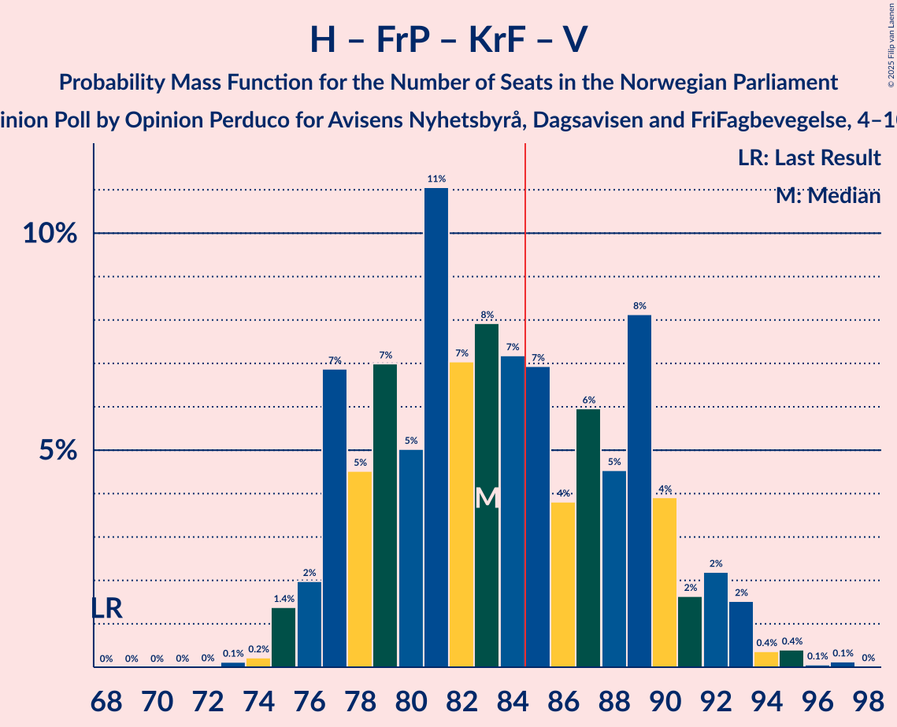

# Opinion Poll by Opinion Perduco for Avisens Nyhetsbyrå, Dagsavisen and FriFagbevegelse, 4–10 October 2022

<a href="#voting-intentions">Voting Intentions</a> | <a href="#seats">Seats</a> | <a href="#coalitions">Coalitions</a> | <a href="#technical-information">Technical Information</a>

## Voting Intentions

### Confidence Intervals

| Party | Last Result | Poll Result | 80% Confidence Interval | 90% Confidence Interval | 95% Confidence Interval | 99% Confidence Interval |
|:-----:|:-----------:|:-----------:|:-----------------------:|:-----------------------:|:-----------------------:|:-----------------------:|
| Høyre | 20.4% | 30.2% | 28.3–32.1% |27.8–32.7% |27.3–33.1% |26.5–34.1% |
| Arbeiderpartiet | 26.2% | 22.6% | 21.0–24.4% |20.5–24.9% |20.1–25.4% |19.3–26.2% |
| Fremskrittspartiet | 11.6% | 13.6% | 12.3–15.2% |11.9–15.6% |11.6–16.0% |11.0–16.7% |
| Sosialistisk Venstreparti | 7.6% | 8.2% | 7.1–9.4% |6.8–9.8% |6.6–10.1% |6.1–10.7% |
| Senterpartiet | 13.5% | 5.6% | 4.7–6.6% |4.5–7.0% |4.3–7.2% |3.9–7.8% |
| Rødt | 4.7% | 5.4% | 4.5–6.4% |4.3–6.7% |4.1–7.0% |3.7–7.5% |
| Kristelig Folkeparti | 3.8% | 3.4% | 2.8–4.3% |2.6–4.5% |2.4–4.8% |2.2–5.2% |
| Venstre | 4.6% | 3.4% | 2.8–4.3% |2.6–4.5% |2.4–4.8% |2.2–5.2% |
| Miljøpartiet De Grønne | 3.9% | 2.9% | 2.3–3.7% |2.1–3.9% |2.0–4.2% |1.8–4.6% |

*Note:* The poll result column reflects the actual value used in the calculations. Published results may vary slightly, and in addition be rounded to fewer digits.

## Seats

### Confidence Intervals

| Party | Last Result | Median | 80% Confidence Interval | 90% Confidence Interval | 95% Confidence Interval | 99% Confidence Interval |
|:-----:|:-----------:|:------:|:-----------------------:|:-----------------------:|:-----------------------:|:-----------------------:|
| <a href="#høyre">Høyre</a> | 36 | 52 | 50–57 |48–60 |48–61 |47–62 |
| <a href="#arbeiderpartiet">Arbeiderpartiet</a> | 48 | 45 | 40–48 |39–49 |37–50 |36–51 |
| <a href="#fremskrittspartiet">Fremskrittspartiet</a> | 21 | 24 | 20–29 |20–30 |19–31 |18–31 |
| <a href="#sosialistisk-venstreparti">Sosialistisk Venstreparti</a> | 13 | 13 | 11–16 |10–17 |10–18 |9–18 |
| <a href="#senterpartiet">Senterpartiet</a> | 28 | 9 | 7–12 |7–12 |6–13 |1–13 |
| <a href="#rødt">Rødt</a> | 8 | 9 | 7–11 |7–12 |6–12 |1–13 |
| <a href="#kristelig-folkeparti">Kristelig Folkeparti</a> | 3 | 3 | 2–6 |2–7 |1–7 |0–8 |
| <a href="#venstre">Venstre</a> | 8 | 2 | 2–7 |2–7 |1–8 |1–8 |
| <a href="#miljøpartiet-de-grønne">Miljøpartiet De Grønne</a> | 3 | 1 | 1–2 |1–3 |1–6 |1–7 |

### Høyre

*For a full overview of the results for this party, see the [Høyre](party-høyre.html) page.*

| Number of Seats | Probability | Accumulated | Special Marks |
|:---------------:|:-----------:|:-----------:|:-------------:|
| 36 | 0% | 100% | Last Result |
| 37 | 0% | 100% |  |
| 38 | 0% | 100% |  |
| 39 | 0% | 100% |  |
| 40 | 0% | 100% |  |
| 41 | 0% | 100% |  |
| 42 | 0% | 100% |  |
| 43 | 0% | 100% |  |
| 44 | 0% | 100% |  |
| 45 | 0% | 100% |  |
| 46 | 0.2% | 100% |  |
| 47 | 0.7% | 99.7% |  |
| 48 | 4% | 99.0% |  |
| 49 | 4% | 95% |  |
| 50 | 11% | 90% |  |
| 51 | 14% | 80% |  |
| 52 | 26% | 66% | Median |
| 53 | 9% | 40% |  |
| 54 | 10% | 31% |  |
| 55 | 5% | 21% |  |
| 56 | 4% | 16% |  |
| 57 | 3% | 11% |  |
| 58 | 1.1% | 9% |  |
| 59 | 2% | 8% |  |
| 60 | 3% | 6% |  |
| 61 | 2% | 3% |  |
| 62 | 0.7% | 1.2% |  |
| 63 | 0.2% | 0.4% |  |
| 64 | 0.1% | 0.2% |  |
| 65 | 0.1% | 0.1% |  |
| 66 | 0% | 0.1% |  |
| 67 | 0% | 0.1% |  |
| 68 | 0% | 0% |  |

### Arbeiderpartiet

*For a full overview of the results for this party, see the [Arbeiderpartiet](party-arbeiderpartiet.html) page.*

| Number of Seats | Probability | Accumulated | Special Marks |
|:---------------:|:-----------:|:-----------:|:-------------:|
| 35 | 0.1% | 100% |  |
| 36 | 0.7% | 99.8% |  |
| 37 | 3% | 99.1% |  |
| 38 | 0.8% | 96% |  |
| 39 | 2% | 96% |  |
| 40 | 4% | 93% |  |
| 41 | 6% | 89% |  |
| 42 | 11% | 83% |  |
| 43 | 13% | 72% |  |
| 44 | 8% | 59% |  |
| 45 | 18% | 52% | Median |
| 46 | 10% | 34% |  |
| 47 | 11% | 24% |  |
| 48 | 5% | 13% | Last Result |
| 49 | 5% | 8% |  |
| 50 | 2% | 3% |  |
| 51 | 0.4% | 0.7% |  |
| 52 | 0.2% | 0.3% |  |
| 53 | 0.1% | 0.1% |  |
| 54 | 0% | 0% |  |

### Fremskrittspartiet

*For a full overview of the results for this party, see the [Fremskrittspartiet](party-fremskrittspartiet.html) page.*

| Number of Seats | Probability | Accumulated | Special Marks |
|:---------------:|:-----------:|:-----------:|:-------------:|
| 17 | 0.2% | 100% |  |
| 18 | 2% | 99.8% |  |
| 19 | 3% | 98% |  |
| 20 | 6% | 95% |  |
| 21 | 11% | 89% | Last Result |
| 22 | 14% | 78% |  |
| 23 | 12% | 64% |  |
| 24 | 10% | 52% | Median |
| 25 | 8% | 42% |  |
| 26 | 7% | 35% |  |
| 27 | 6% | 27% |  |
| 28 | 6% | 21% |  |
| 29 | 6% | 15% |  |
| 30 | 6% | 9% |  |
| 31 | 3% | 3% |  |
| 32 | 0.3% | 0.4% |  |
| 33 | 0.1% | 0.1% |  |
| 34 | 0% | 0% |  |

### Sosialistisk Venstreparti

*For a full overview of the results for this party, see the [Sosialistisk Venstreparti](party-sosialistiskvenstreparti.html) page.*

| Number of Seats | Probability | Accumulated | Special Marks |
|:---------------:|:-----------:|:-----------:|:-------------:|
| 8 | 0.1% | 100% |  |
| 9 | 2% | 99.9% |  |
| 10 | 5% | 98% |  |
| 11 | 11% | 93% |  |
| 12 | 16% | 82% |  |
| 13 | 17% | 65% | Last Result, Median |
| 14 | 18% | 49% |  |
| 15 | 15% | 30% |  |
| 16 | 9% | 16% |  |
| 17 | 3% | 7% |  |
| 18 | 3% | 3% |  |
| 19 | 0.3% | 0.5% |  |
| 20 | 0.1% | 0.1% |  |
| 21 | 0% | 0% |  |

### Senterpartiet

*For a full overview of the results for this party, see the [Senterpartiet](party-senterpartiet.html) page.*

| Number of Seats | Probability | Accumulated | Special Marks |
|:---------------:|:-----------:|:-----------:|:-------------:|
| 0 | 0.2% | 100% |  |
| 1 | 1.0% | 99.8% |  |
| 2 | 0% | 98.8% |  |
| 3 | 0% | 98.8% |  |
| 4 | 0% | 98.8% |  |
| 5 | 0% | 98.8% |  |
| 6 | 3% | 98.8% |  |
| 7 | 9% | 96% |  |
| 8 | 18% | 87% |  |
| 9 | 21% | 70% | Median |
| 10 | 22% | 49% |  |
| 11 | 15% | 27% |  |
| 12 | 8% | 11% |  |
| 13 | 3% | 4% |  |
| 14 | 0.4% | 0.5% |  |
| 15 | 0.1% | 0.1% |  |
| 16 | 0% | 0% |  |
| 17 | 0% | 0% |  |
| 18 | 0% | 0% |  |
| 19 | 0% | 0% |  |
| 20 | 0% | 0% |  |
| 21 | 0% | 0% |  |
| 22 | 0% | 0% |  |
| 23 | 0% | 0% |  |
| 24 | 0% | 0% |  |
| 25 | 0% | 0% |  |
| 26 | 0% | 0% |  |
| 27 | 0% | 0% |  |
| 28 | 0% | 0% | Last Result |

### Rødt

*For a full overview of the results for this party, see the [Rødt](party-rødt.html) page.*

| Number of Seats | Probability | Accumulated | Special Marks |
|:---------------:|:-----------:|:-----------:|:-------------:|
| 1 | 1.4% | 100% |  |
| 2 | 0% | 98.6% |  |
| 3 | 0% | 98.6% |  |
| 4 | 0% | 98.6% |  |
| 5 | 0% | 98.6% |  |
| 6 | 3% | 98.6% |  |
| 7 | 12% | 96% |  |
| 8 | 23% | 83% | Last Result |
| 9 | 23% | 61% | Median |
| 10 | 21% | 37% |  |
| 11 | 11% | 16% |  |
| 12 | 4% | 5% |  |
| 13 | 0.6% | 0.8% |  |
| 14 | 0.1% | 0.1% |  |
| 15 | 0% | 0% |  |

### Kristelig Folkeparti

*For a full overview of the results for this party, see the [Kristelig Folkeparti](party-kristeligfolkeparti.html) page.*

| Number of Seats | Probability | Accumulated | Special Marks |
|:---------------:|:-----------:|:-----------:|:-------------:|
| 0 | 1.3% | 100% |  |
| 1 | 3% | 98.7% |  |
| 2 | 36% | 95% |  |
| 3 | 40% | 59% | Last Result, Median |
| 4 | 0% | 19% |  |
| 5 | 0.2% | 19% |  |
| 6 | 10% | 18% |  |
| 7 | 7% | 9% |  |
| 8 | 2% | 2% |  |
| 9 | 0.3% | 0.3% |  |
| 10 | 0% | 0% |  |

### Venstre

*For a full overview of the results for this party, see the [Venstre](party-venstre.html) page.*

| Number of Seats | Probability | Accumulated | Special Marks |
|:---------------:|:-----------:|:-----------:|:-------------:|
| 1 | 5% | 100% |  |
| 2 | 49% | 95% | Median |
| 3 | 24% | 46% |  |
| 4 | 0% | 22% |  |
| 5 | 0.1% | 22% |  |
| 6 | 8% | 22% |  |
| 7 | 9% | 14% |  |
| 8 | 4% | 4% | Last Result |
| 9 | 0.3% | 0.3% |  |
| 10 | 0% | 0% |  |

### Miljøpartiet De Grønne

*For a full overview of the results for this party, see the [Miljøpartiet De Grønne](party-miljøpartietdegrønne.html) page.*

| Number of Seats | Probability | Accumulated | Special Marks |
|:---------------:|:-----------:|:-----------:|:-------------:|
| 0 | 0.3% | 100% |  |
| 1 | 52% | 99.7% | Median |
| 2 | 38% | 47% |  |
| 3 | 6% | 10% | Last Result |
| 4 | 0.1% | 4% |  |
| 5 | 0% | 4% |  |
| 6 | 2% | 4% |  |
| 7 | 2% | 2% |  |
| 8 | 0.3% | 0.4% |  |
| 9 | 0% | 0% |  |

## Coalitions

### Confidence Intervals

| Coalition | Last Result | Median | Majority? | 80% Confidence Interval | 90% Confidence Interval | 95% Confidence Interval | 99% Confidence Interval |
|:---------:|:-----------:|:------:|:---------:|:-----------------------:|:-----------------------:|:-----------------------:|:-----------------------:|
| Høyre – Fremskrittspartiet – Senterpartiet – Kristelig Folkeparti – Venstre | 96 | 92 | 98.6% | 88–99 | 86–100 | 85–101 | 84–103 |
| Høyre – Fremskrittspartiet – Kristelig Folkeparti – Venstre – Miljøpartiet De Grønne | 71 | 85 | 52% | 79–92 | 78–93 | 77–94 | 76–96 |
| Høyre – Fremskrittspartiet – Kristelig Folkeparti – Venstre | 68 | 83 | 40% | 77–90 | 77–91 | 76–93 | 75–95 |
| Høyre – Fremskrittspartiet – Venstre | 65 | 80 | 21% | 75–87 | 74–87 | 73–89 | 72–91 |
| Høyre – Fremskrittspartiet | 57 | 77 | 5% | 72–83 | 71–84 | 70–86 | 69–88 |
| Arbeiderpartiet – Sosialistisk Venstreparti – Senterpartiet – Rødt – Miljøpartiet De Grønne | 100 | 78 | 5% | 72–83 | 70–84 | 70–85 | 66–88 |
| Arbeiderpartiet – Sosialistisk Venstreparti – Senterpartiet – Rødt | 97 | 76 | 1.2% | 70–82 | 68–83 | 67–84 | 65–86 |
| Arbeiderpartiet – Sosialistisk Venstreparti – Senterpartiet – Kristelig Folkeparti – Miljøpartiet De Grønne | 95 | 73 | 0.1% | 67–77 | 65–78 | 64–79 | 62–81 |
| Arbeiderpartiet – Sosialistisk Venstreparti – Senterpartiet – Miljøpartiet De Grønne | 92 | 69 | 0% | 64–74 | 62–75 | 61–76 | 58–78 |
| Arbeiderpartiet – Sosialistisk Venstreparti – Rødt – Miljøpartiet De Grønne | 72 | 68 | 0% | 63–73 | 62–75 | 61–75 | 59–77 |
| Arbeiderpartiet – Sosialistisk Venstreparti – Senterpartiet | 89 | 67 | 0% | 62–72 | 60–73 | 60–74 | 57–75 |
| Høyre – Kristelig Folkeparti – Venstre | 47 | 58 | 0% | 55–65 | 54–66 | 54–68 | 52–70 |
| Arbeiderpartiet – Senterpartiet – Kristelig Folkeparti – Miljøpartiet De Grønne | 82 | 59 | 0% | 53–63 | 52–64 | 51–65 | 49–67 |
| Arbeiderpartiet – Sosialistisk Venstreparti | 61 | 57 | 0% | 53–62 | 52–63 | 50–64 | 49–66 |
| Arbeiderpartiet – Senterpartiet – Kristelig Folkeparti | 79 | 57 | 0% | 52–61 | 51–62 | 49–63 | 48–65 |
| Arbeiderpartiet – Senterpartiet | 76 | 54 | 0% | 49–57 | 48–58 | 47–59 | 45–60 |
| Senterpartiet – Kristelig Folkeparti – Venstre | 39 | 15 | 0% | 13–20 | 12–22 | 11–23 | 5–24 |

### Høyre – Fremskrittspartiet – Senterpartiet – Kristelig Folkeparti – Venstre

| Number of Seats | Probability | Accumulated | Special Marks |
|:---------------:|:-----------:|:-----------:|:-------------:|
| 82 | 0.1% | 100% |  |
| 83 | 0.2% | 99.9% |  |
| 84 | 1.1% | 99.7% |  |
| 85 | 2% | 98.6% | Majority |
| 86 | 3% | 97% |  |
| 87 | 3% | 94% |  |
| 88 | 8% | 90% |  |
| 89 | 7% | 83% |  |
| 90 | 6% | 76% | Median |
| 91 | 9% | 70% |  |
| 92 | 10% | 60% |  |
| 93 | 8% | 50% |  |
| 94 | 7% | 42% |  |
| 95 | 5% | 35% |  |
| 96 | 5% | 29% | Last Result |
| 97 | 8% | 24% |  |
| 98 | 5% | 16% |  |
| 99 | 5% | 11% |  |
| 100 | 1.3% | 6% |  |
| 101 | 2% | 4% |  |
| 102 | 1.2% | 2% |  |
| 103 | 0.5% | 0.9% |  |
| 104 | 0.2% | 0.4% |  |
| 105 | 0.1% | 0.2% |  |
| 106 | 0.1% | 0.1% |  |
| 107 | 0% | 0.1% |  |
| 108 | 0% | 0.1% |  |
| 109 | 0% | 0% |  |

### Høyre – Fremskrittspartiet – Kristelig Folkeparti – Venstre – Miljøpartiet De Grønne

| Number of Seats | Probability | Accumulated | Special Marks |
|:---------------:|:-----------:|:-----------:|:-------------:|
| 71 | 0% | 100% | Last Result |
| 72 | 0% | 100% |  |
| 73 | 0% | 100% |  |
| 74 | 0% | 100% |  |
| 75 | 0.1% | 100% |  |
| 76 | 0.7% | 99.9% |  |
| 77 | 2% | 99.1% |  |
| 78 | 5% | 97% |  |
| 79 | 4% | 92% |  |
| 80 | 8% | 88% |  |
| 81 | 4% | 80% |  |
| 82 | 9% | 77% | Median |
| 83 | 6% | 68% |  |
| 84 | 10% | 62% |  |
| 85 | 7% | 52% | Majority |
| 86 | 7% | 46% |  |
| 87 | 6% | 39% |  |
| 88 | 5% | 33% |  |
| 89 | 5% | 27% |  |
| 90 | 6% | 22% |  |
| 91 | 6% | 16% |  |
| 92 | 4% | 10% |  |
| 93 | 1.3% | 6% |  |
| 94 | 2% | 5% |  |
| 95 | 1.2% | 2% |  |
| 96 | 0.6% | 0.9% |  |
| 97 | 0.2% | 0.4% |  |
| 98 | 0.1% | 0.2% |  |
| 99 | 0.1% | 0.1% |  |
| 100 | 0% | 0% |  |

### Høyre – Fremskrittspartiet – Kristelig Folkeparti – Venstre

| Number of Seats | Probability | Accumulated | Special Marks |
|:---------------:|:-----------:|:-----------:|:-------------:|
| 68 | 0% | 100% | Last Result |
| 69 | 0% | 100% |  |
| 70 | 0% | 100% |  |
| 71 | 0% | 100% |  |
| 72 | 0% | 100% |  |
| 73 | 0.1% | 100% |  |
| 74 | 0.2% | 99.9% |  |
| 75 | 1.4% | 99.6% |  |
| 76 | 2% | 98% |  |
| 77 | 7% | 96% |  |
| 78 | 5% | 89% |  |
| 79 | 7% | 85% |  |
| 80 | 5% | 78% |  |
| 81 | 11% | 73% | Median |
| 82 | 7% | 62% |  |
| 83 | 8% | 55% |  |
| 84 | 7% | 47% |  |
| 85 | 7% | 40% | Majority |
| 86 | 4% | 33% |  |
| 87 | 6% | 29% |  |
| 88 | 5% | 23% |  |
| 89 | 8% | 18% |  |
| 90 | 4% | 10% |  |
| 91 | 2% | 6% |  |
| 92 | 2% | 5% |  |
| 93 | 2% | 3% |  |
| 94 | 0.4% | 1.0% |  |
| 95 | 0.4% | 0.6% |  |
| 96 | 0.1% | 0.2% |  |
| 97 | 0.1% | 0.2% |  |
| 98 | 0% | 0% |  |

### Høyre – Fremskrittspartiet – Venstre

| Number of Seats | Probability | Accumulated | Special Marks |
|:---------------:|:-----------:|:-----------:|:-------------:|
| 65 | 0% | 100% | Last Result |
| 66 | 0% | 100% |  |
| 67 | 0% | 100% |  |
| 68 | 0% | 100% |  |
| 69 | 0% | 100% |  |
| 70 | 0.1% | 100% |  |
| 71 | 0.3% | 99.9% |  |
| 72 | 1.3% | 99.6% |  |
| 73 | 1.5% | 98% |  |
| 74 | 7% | 97% |  |
| 75 | 6% | 90% |  |
| 76 | 6% | 84% |  |
| 77 | 5% | 78% |  |
| 78 | 11% | 73% | Median |
| 79 | 7% | 61% |  |
| 80 | 8% | 54% |  |
| 81 | 8% | 46% |  |
| 82 | 6% | 38% |  |
| 83 | 6% | 31% |  |
| 84 | 4% | 25% |  |
| 85 | 5% | 21% | Majority |
| 86 | 6% | 16% |  |
| 87 | 5% | 10% |  |
| 88 | 2% | 5% |  |
| 89 | 1.0% | 3% |  |
| 90 | 0.7% | 2% |  |
| 91 | 0.6% | 1.0% |  |
| 92 | 0.2% | 0.4% |  |
| 93 | 0.1% | 0.2% |  |
| 94 | 0% | 0.1% |  |
| 95 | 0% | 0% |  |

### Høyre – Fremskrittspartiet

| Number of Seats | Probability | Accumulated | Special Marks |
|:---------------:|:-----------:|:-----------:|:-------------:|
| 57 | 0% | 100% | Last Result |
| 58 | 0% | 100% |  |
| 59 | 0% | 100% |  |
| 60 | 0% | 100% |  |
| 61 | 0% | 100% |  |
| 62 | 0% | 100% |  |
| 63 | 0% | 100% |  |
| 64 | 0% | 100% |  |
| 65 | 0% | 100% |  |
| 66 | 0% | 100% |  |
| 67 | 0% | 100% |  |
| 68 | 0.3% | 99.9% |  |
| 69 | 0.6% | 99.7% |  |
| 70 | 2% | 99.1% |  |
| 71 | 4% | 97% |  |
| 72 | 9% | 93% |  |
| 73 | 6% | 84% |  |
| 74 | 8% | 78% |  |
| 75 | 11% | 70% |  |
| 76 | 7% | 60% | Median |
| 77 | 8% | 53% |  |
| 78 | 12% | 45% |  |
| 79 | 7% | 34% |  |
| 80 | 5% | 26% |  |
| 81 | 6% | 21% |  |
| 82 | 3% | 14% |  |
| 83 | 2% | 12% |  |
| 84 | 5% | 9% |  |
| 85 | 2% | 5% | Majority |
| 86 | 2% | 3% |  |
| 87 | 0.6% | 1.3% |  |
| 88 | 0.3% | 0.7% |  |
| 89 | 0.3% | 0.4% |  |
| 90 | 0% | 0.1% |  |
| 91 | 0% | 0% |  |

### Arbeiderpartiet – Sosialistisk Venstreparti – Senterpartiet – Rødt – Miljøpartiet De Grønne

| Number of Seats | Probability | Accumulated | Special Marks |
|:---------------:|:-----------:|:-----------:|:-------------:|
| 64 | 0% | 100% |  |
| 65 | 0.2% | 99.9% |  |
| 66 | 0.3% | 99.8% |  |
| 67 | 0.4% | 99.5% |  |
| 68 | 1.0% | 99.1% |  |
| 69 | 0.6% | 98% |  |
| 70 | 3% | 98% |  |
| 71 | 4% | 94% |  |
| 72 | 4% | 90% |  |
| 73 | 6% | 86% |  |
| 74 | 5% | 80% |  |
| 75 | 7% | 75% |  |
| 76 | 9% | 68% |  |
| 77 | 4% | 59% | Median |
| 78 | 8% | 55% |  |
| 79 | 8% | 46% |  |
| 80 | 9% | 38% |  |
| 81 | 9% | 29% |  |
| 82 | 5% | 20% |  |
| 83 | 5% | 15% |  |
| 84 | 5% | 9% |  |
| 85 | 2% | 5% | Majority |
| 86 | 2% | 2% |  |
| 87 | 0.4% | 0.9% |  |
| 88 | 0.4% | 0.6% |  |
| 89 | 0.1% | 0.2% |  |
| 90 | 0% | 0% |  |
| 91 | 0% | 0% |  |
| 92 | 0% | 0% |  |
| 93 | 0% | 0% |  |
| 94 | 0% | 0% |  |
| 95 | 0% | 0% |  |
| 96 | 0% | 0% |  |
| 97 | 0% | 0% |  |
| 98 | 0% | 0% |  |
| 99 | 0% | 0% |  |
| 100 | 0% | 0% | Last Result |

### Arbeiderpartiet – Sosialistisk Venstreparti – Senterpartiet – Rødt

| Number of Seats | Probability | Accumulated | Special Marks |
|:---------------:|:-----------:|:-----------:|:-------------:|
| 63 | 0% | 100% |  |
| 64 | 0.3% | 99.9% |  |
| 65 | 0.4% | 99.6% |  |
| 66 | 1.2% | 99.2% |  |
| 67 | 0.6% | 98% |  |
| 68 | 3% | 97% |  |
| 69 | 3% | 95% |  |
| 70 | 6% | 92% |  |
| 71 | 5% | 86% |  |
| 72 | 6% | 81% |  |
| 73 | 5% | 75% |  |
| 74 | 10% | 70% |  |
| 75 | 6% | 61% |  |
| 76 | 8% | 55% | Median |
| 77 | 6% | 47% |  |
| 78 | 9% | 41% |  |
| 79 | 7% | 32% |  |
| 80 | 8% | 25% |  |
| 81 | 5% | 17% |  |
| 82 | 5% | 12% |  |
| 83 | 3% | 7% |  |
| 84 | 2% | 3% |  |
| 85 | 0.6% | 1.2% | Majority |
| 86 | 0.5% | 0.6% |  |
| 87 | 0% | 0.1% |  |
| 88 | 0.1% | 0.1% |  |
| 89 | 0% | 0% |  |
| 90 | 0% | 0% |  |
| 91 | 0% | 0% |  |
| 92 | 0% | 0% |  |
| 93 | 0% | 0% |  |
| 94 | 0% | 0% |  |
| 95 | 0% | 0% |  |
| 96 | 0% | 0% |  |
| 97 | 0% | 0% | Last Result |

### Arbeiderpartiet – Sosialistisk Venstreparti – Senterpartiet – Kristelig Folkeparti – Miljøpartiet De Grønne

| Number of Seats | Probability | Accumulated | Special Marks |
|:---------------:|:-----------:|:-----------:|:-------------:|
| 58 | 0.1% | 100% |  |
| 59 | 0% | 99.9% |  |
| 60 | 0.1% | 99.9% |  |
| 61 | 0.3% | 99.8% |  |
| 62 | 0.2% | 99.5% |  |
| 63 | 0.4% | 99.3% |  |
| 64 | 3% | 99.0% |  |
| 65 | 2% | 96% |  |
| 66 | 3% | 93% |  |
| 67 | 6% | 90% |  |
| 68 | 5% | 84% |  |
| 69 | 7% | 78% |  |
| 70 | 8% | 71% |  |
| 71 | 5% | 63% | Median |
| 72 | 7% | 58% |  |
| 73 | 11% | 51% |  |
| 74 | 12% | 40% |  |
| 75 | 11% | 28% |  |
| 76 | 5% | 17% |  |
| 77 | 4% | 12% |  |
| 78 | 4% | 8% |  |
| 79 | 2% | 4% |  |
| 80 | 0.8% | 1.5% |  |
| 81 | 0.3% | 0.7% |  |
| 82 | 0.2% | 0.4% |  |
| 83 | 0.1% | 0.2% |  |
| 84 | 0% | 0.1% |  |
| 85 | 0% | 0.1% | Majority |
| 86 | 0% | 0% |  |
| 87 | 0% | 0% |  |
| 88 | 0% | 0% |  |
| 89 | 0% | 0% |  |
| 90 | 0% | 0% |  |
| 91 | 0% | 0% |  |
| 92 | 0% | 0% |  |
| 93 | 0% | 0% |  |
| 94 | 0% | 0% |  |
| 95 | 0% | 0% | Last Result |

### Arbeiderpartiet – Sosialistisk Venstreparti – Senterpartiet – Miljøpartiet De Grønne

| Number of Seats | Probability | Accumulated | Special Marks |
|:---------------:|:-----------:|:-----------:|:-------------:|
| 56 | 0.1% | 100% |  |
| 57 | 0.1% | 99.9% |  |
| 58 | 0.4% | 99.8% |  |
| 59 | 0.3% | 99.4% |  |
| 60 | 0.3% | 99.1% |  |
| 61 | 2% | 98.8% |  |
| 62 | 3% | 96% |  |
| 63 | 3% | 93% |  |
| 64 | 5% | 90% |  |
| 65 | 7% | 85% |  |
| 66 | 8% | 78% |  |
| 67 | 9% | 70% |  |
| 68 | 7% | 61% | Median |
| 69 | 6% | 54% |  |
| 70 | 11% | 48% |  |
| 71 | 12% | 37% |  |
| 72 | 10% | 25% |  |
| 73 | 3% | 15% |  |
| 74 | 5% | 11% |  |
| 75 | 3% | 7% |  |
| 76 | 2% | 3% |  |
| 77 | 0.4% | 0.9% |  |
| 78 | 0.3% | 0.5% |  |
| 79 | 0.2% | 0.2% |  |
| 80 | 0% | 0.1% |  |
| 81 | 0% | 0% |  |
| 82 | 0% | 0% |  |
| 83 | 0% | 0% |  |
| 84 | 0% | 0% |  |
| 85 | 0% | 0% | Majority |
| 86 | 0% | 0% |  |
| 87 | 0% | 0% |  |
| 88 | 0% | 0% |  |
| 89 | 0% | 0% |  |
| 90 | 0% | 0% |  |
| 91 | 0% | 0% |  |
| 92 | 0% | 0% | Last Result |

### Arbeiderpartiet – Sosialistisk Venstreparti – Rødt – Miljøpartiet De Grønne

| Number of Seats | Probability | Accumulated | Special Marks |
|:---------------:|:-----------:|:-----------:|:-------------:|
| 55 | 0% | 100% |  |
| 56 | 0% | 99.9% |  |
| 57 | 0.1% | 99.9% |  |
| 58 | 0.2% | 99.8% |  |
| 59 | 0.4% | 99.6% |  |
| 60 | 0.6% | 99.3% |  |
| 61 | 3% | 98.7% |  |
| 62 | 2% | 96% |  |
| 63 | 8% | 94% |  |
| 64 | 5% | 86% |  |
| 65 | 9% | 81% |  |
| 66 | 6% | 72% |  |
| 67 | 11% | 66% |  |
| 68 | 8% | 55% | Median |
| 69 | 6% | 47% |  |
| 70 | 8% | 41% |  |
| 71 | 8% | 33% |  |
| 72 | 10% | 25% | Last Result |
| 73 | 5% | 15% |  |
| 74 | 2% | 9% |  |
| 75 | 5% | 7% |  |
| 76 | 2% | 2% |  |
| 77 | 0.3% | 0.6% |  |
| 78 | 0.1% | 0.3% |  |
| 79 | 0.1% | 0.2% |  |
| 80 | 0% | 0.1% |  |
| 81 | 0% | 0% |  |

### Arbeiderpartiet – Sosialistisk Venstreparti – Senterpartiet

| Number of Seats | Probability | Accumulated | Special Marks |
|:---------------:|:-----------:|:-----------:|:-------------:|
| 55 | 0.1% | 100% |  |
| 56 | 0.1% | 99.9% |  |
| 57 | 0.5% | 99.7% |  |
| 58 | 0.3% | 99.2% |  |
| 59 | 0.9% | 98.9% |  |
| 60 | 4% | 98% |  |
| 61 | 4% | 94% |  |
| 62 | 4% | 90% |  |
| 63 | 7% | 87% |  |
| 64 | 8% | 79% |  |
| 65 | 8% | 72% |  |
| 66 | 8% | 64% |  |
| 67 | 6% | 55% | Median |
| 68 | 8% | 49% |  |
| 69 | 9% | 40% |  |
| 70 | 12% | 31% |  |
| 71 | 7% | 19% |  |
| 72 | 4% | 12% |  |
| 73 | 5% | 8% |  |
| 74 | 3% | 3% |  |
| 75 | 0.3% | 0.7% |  |
| 76 | 0.3% | 0.4% |  |
| 77 | 0.1% | 0.2% |  |
| 78 | 0.1% | 0.1% |  |
| 79 | 0% | 0% |  |
| 80 | 0% | 0% |  |
| 81 | 0% | 0% |  |
| 82 | 0% | 0% |  |
| 83 | 0% | 0% |  |
| 84 | 0% | 0% |  |
| 85 | 0% | 0% | Majority |
| 86 | 0% | 0% |  |
| 87 | 0% | 0% |  |
| 88 | 0% | 0% |  |
| 89 | 0% | 0% | Last Result |

### Høyre – Kristelig Folkeparti – Venstre

| Number of Seats | Probability | Accumulated | Special Marks |
|:---------------:|:-----------:|:-----------:|:-------------:|
| 47 | 0% | 100% | Last Result |
| 48 | 0% | 100% |  |
| 49 | 0% | 100% |  |
| 50 | 0% | 100% |  |
| 51 | 0.3% | 99.9% |  |
| 52 | 0.5% | 99.7% |  |
| 53 | 1.5% | 99.1% |  |
| 54 | 6% | 98% |  |
| 55 | 10% | 91% |  |
| 56 | 9% | 82% |  |
| 57 | 12% | 73% | Median |
| 58 | 12% | 61% |  |
| 59 | 5% | 49% |  |
| 60 | 10% | 44% |  |
| 61 | 6% | 34% |  |
| 62 | 7% | 28% |  |
| 63 | 6% | 21% |  |
| 64 | 4% | 15% |  |
| 65 | 6% | 11% |  |
| 66 | 0.8% | 5% |  |
| 67 | 1.2% | 5% |  |
| 68 | 2% | 3% |  |
| 69 | 0.7% | 2% |  |
| 70 | 0.5% | 0.9% |  |
| 71 | 0.2% | 0.4% |  |
| 72 | 0.1% | 0.1% |  |
| 73 | 0% | 0.1% |  |
| 74 | 0% | 0.1% |  |
| 75 | 0% | 0% |  |

### Arbeiderpartiet – Senterpartiet – Kristelig Folkeparti – Miljøpartiet De Grønne

| Number of Seats | Probability | Accumulated | Special Marks |
|:---------------:|:-----------:|:-----------:|:-------------:|
| 45 | 0.1% | 100% |  |
| 46 | 0% | 99.9% |  |
| 47 | 0.1% | 99.9% |  |
| 48 | 0.1% | 99.8% |  |
| 49 | 0.2% | 99.7% |  |
| 50 | 0.9% | 99.5% |  |
| 51 | 3% | 98.6% |  |
| 52 | 2% | 96% |  |
| 53 | 5% | 94% |  |
| 54 | 4% | 89% |  |
| 55 | 7% | 85% |  |
| 56 | 8% | 78% |  |
| 57 | 6% | 70% |  |
| 58 | 9% | 64% | Median |
| 59 | 10% | 55% |  |
| 60 | 14% | 45% |  |
| 61 | 12% | 31% |  |
| 62 | 6% | 19% |  |
| 63 | 6% | 13% |  |
| 64 | 3% | 7% |  |
| 65 | 2% | 4% |  |
| 66 | 0.7% | 2% |  |
| 67 | 0.6% | 1.1% |  |
| 68 | 0.2% | 0.5% |  |
| 69 | 0.1% | 0.2% |  |
| 70 | 0.1% | 0.1% |  |
| 71 | 0% | 0% |  |
| 72 | 0% | 0% |  |
| 73 | 0% | 0% |  |
| 74 | 0% | 0% |  |
| 75 | 0% | 0% |  |
| 76 | 0% | 0% |  |
| 77 | 0% | 0% |  |
| 78 | 0% | 0% |  |
| 79 | 0% | 0% |  |
| 80 | 0% | 0% |  |
| 81 | 0% | 0% |  |
| 82 | 0% | 0% | Last Result |

### Arbeiderpartiet – Sosialistisk Venstreparti

| Number of Seats | Probability | Accumulated | Special Marks |
|:---------------:|:-----------:|:-----------:|:-------------:|
| 47 | 0% | 100% |  |
| 48 | 0.2% | 99.9% |  |
| 49 | 0.4% | 99.7% |  |
| 50 | 2% | 99.4% |  |
| 51 | 1.4% | 97% |  |
| 52 | 2% | 96% |  |
| 53 | 7% | 94% |  |
| 54 | 8% | 87% |  |
| 55 | 8% | 79% |  |
| 56 | 10% | 71% |  |
| 57 | 12% | 61% |  |
| 58 | 7% | 49% | Median |
| 59 | 7% | 42% |  |
| 60 | 11% | 35% |  |
| 61 | 9% | 24% | Last Result |
| 62 | 6% | 14% |  |
| 63 | 3% | 8% |  |
| 64 | 3% | 5% |  |
| 65 | 0.9% | 2% |  |
| 66 | 0.7% | 0.8% |  |
| 67 | 0.1% | 0.2% |  |
| 68 | 0% | 0.1% |  |
| 69 | 0% | 0% |  |

### Arbeiderpartiet – Senterpartiet – Kristelig Folkeparti

| Number of Seats | Probability | Accumulated | Special Marks |
|:---------------:|:-----------:|:-----------:|:-------------:|
| 44 | 0.1% | 100% |  |
| 45 | 0.1% | 99.9% |  |
| 46 | 0.1% | 99.8% |  |
| 47 | 0.2% | 99.8% |  |
| 48 | 0.3% | 99.6% |  |
| 49 | 2% | 99.3% |  |
| 50 | 2% | 97% |  |
| 51 | 3% | 95% |  |
| 52 | 6% | 92% |  |
| 53 | 4% | 86% |  |
| 54 | 12% | 82% |  |
| 55 | 6% | 70% |  |
| 56 | 6% | 64% |  |
| 57 | 10% | 58% | Median |
| 58 | 10% | 48% |  |
| 59 | 17% | 38% |  |
| 60 | 7% | 21% |  |
| 61 | 5% | 14% |  |
| 62 | 4% | 9% |  |
| 63 | 2% | 4% |  |
| 64 | 2% | 2% |  |
| 65 | 0.3% | 0.7% |  |
| 66 | 0.3% | 0.5% |  |
| 67 | 0.2% | 0.2% |  |
| 68 | 0% | 0% |  |
| 69 | 0% | 0% |  |
| 70 | 0% | 0% |  |
| 71 | 0% | 0% |  |
| 72 | 0% | 0% |  |
| 73 | 0% | 0% |  |
| 74 | 0% | 0% |  |
| 75 | 0% | 0% |  |
| 76 | 0% | 0% |  |
| 77 | 0% | 0% |  |
| 78 | 0% | 0% |  |
| 79 | 0% | 0% | Last Result |

### Arbeiderpartiet – Senterpartiet

| Number of Seats | Probability | Accumulated | Special Marks |
|:---------------:|:-----------:|:-----------:|:-------------:|
| 42 | 0.1% | 100% |  |
| 43 | 0.1% | 99.9% |  |
| 44 | 0.2% | 99.8% |  |
| 45 | 0.5% | 99.6% |  |
| 46 | 0.8% | 99.2% |  |
| 47 | 3% | 98% |  |
| 48 | 2% | 95% |  |
| 49 | 4% | 93% |  |
| 50 | 8% | 89% |  |
| 51 | 7% | 81% |  |
| 52 | 13% | 74% |  |
| 53 | 8% | 61% |  |
| 54 | 9% | 54% | Median |
| 55 | 8% | 44% |  |
| 56 | 17% | 37% |  |
| 57 | 11% | 19% |  |
| 58 | 5% | 9% |  |
| 59 | 2% | 4% |  |
| 60 | 1.1% | 1.3% |  |
| 61 | 0.1% | 0.2% |  |
| 62 | 0.1% | 0.1% |  |
| 63 | 0% | 0% |  |
| 64 | 0% | 0% |  |
| 65 | 0% | 0% |  |
| 66 | 0% | 0% |  |
| 67 | 0% | 0% |  |
| 68 | 0% | 0% |  |
| 69 | 0% | 0% |  |
| 70 | 0% | 0% |  |
| 71 | 0% | 0% |  |
| 72 | 0% | 0% |  |
| 73 | 0% | 0% |  |
| 74 | 0% | 0% |  |
| 75 | 0% | 0% |  |
| 76 | 0% | 0% | Last Result |

### Senterpartiet – Kristelig Folkeparti – Venstre

| Number of Seats | Probability | Accumulated | Special Marks |
|:---------------:|:-----------:|:-----------:|:-------------:|
| 5 | 0.5% | 100% |  |
| 6 | 0.3% | 99.5% |  |
| 7 | 0% | 99.2% |  |
| 8 | 0% | 99.2% |  |
| 9 | 0.1% | 99.2% |  |
| 10 | 0.7% | 99.1% |  |
| 11 | 3% | 98% |  |
| 12 | 4% | 95% |  |
| 13 | 12% | 91% |  |
| 14 | 14% | 79% | Median |
| 15 | 19% | 65% |  |
| 16 | 10% | 47% |  |
| 17 | 10% | 36% |  |
| 18 | 8% | 26% |  |
| 19 | 6% | 18% |  |
| 20 | 3% | 12% |  |
| 21 | 4% | 9% |  |
| 22 | 2% | 6% |  |
| 23 | 3% | 3% |  |
| 24 | 0.4% | 0.7% |  |
| 25 | 0.2% | 0.3% |  |
| 26 | 0.1% | 0.1% |  |
| 27 | 0% | 0% |  |
| 28 | 0% | 0% |  |
| 29 | 0% | 0% |  |
| 30 | 0% | 0% |  |
| 31 | 0% | 0% |  |
| 32 | 0% | 0% |  |
| 33 | 0% | 0% |  |
| 34 | 0% | 0% |  |
| 35 | 0% | 0% |  |
| 36 | 0% | 0% |  |
| 37 | 0% | 0% |  |
| 38 | 0% | 0% |  |
| 39 | 0% | 0% | Last Result |

## Technical Information

### Opinion Poll

+ **Polling firm:** Opinion Perduco
+ **Commissioner(s):** Avisens Nyhetsbyrå, Dagsavisen and FriFagbevegelse
+ **Fieldwork period:** 4–10 October 2022

### Calculations

+ **Sample size:** 968
+ **Simulations done:** 1,048,576
+ **Error estimate:** 2.44%

