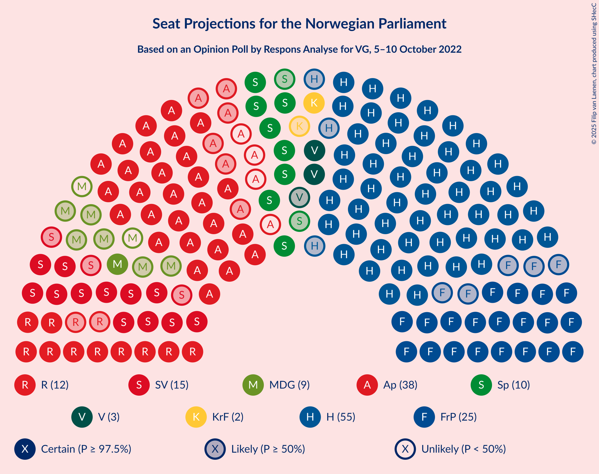
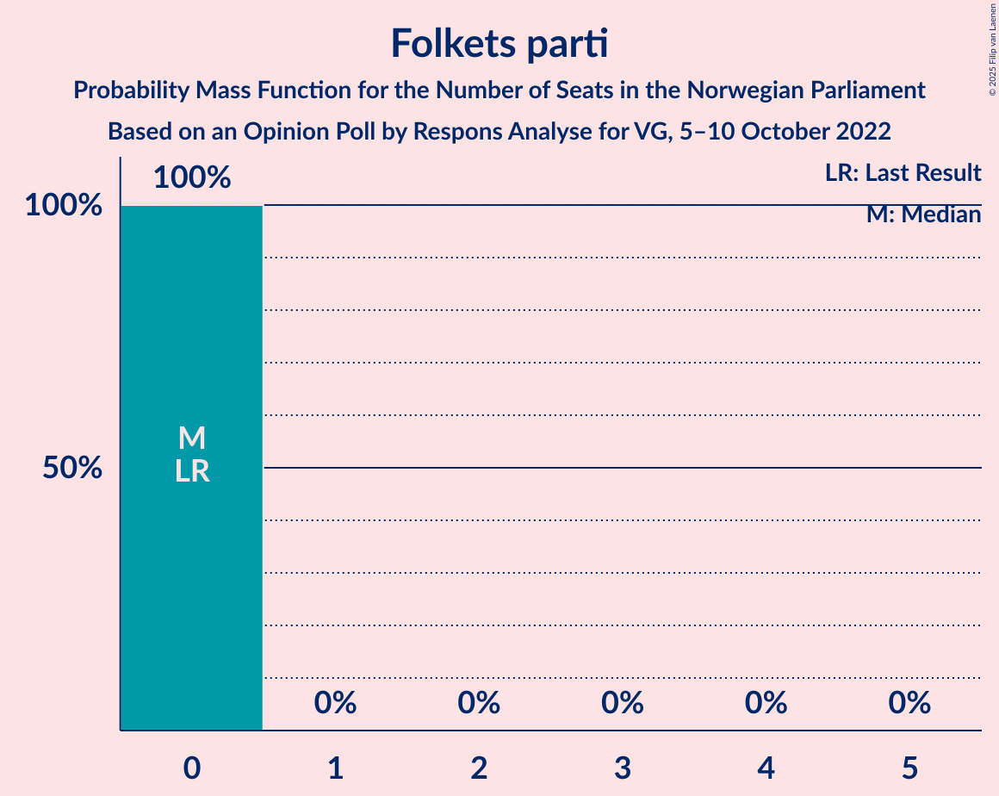

# Opinion Poll by Respons Analyse for VG, 5–10 October 2022

<a href="#voting-intentions">Voting Intentions</a> | <a href="#seats">Seats</a> | <a href="#coalitions">Coalitions</a> | <a href="#technical-information">Technical Information</a>

## Voting Intentions

### Confidence Intervals

| Party | Last Result | Poll Result | 80% Confidence Interval | 90% Confidence Interval | 95% Confidence Interval | 99% Confidence Interval |
|:-----:|:-----------:|:-----------:|:-----------------------:|:-----------------------:|:-----------------------:|:-----------------------:|
| Høyre | 20.4% | 30.0% | 28.2–31.9% |27.7–32.4% |27.2–32.9% |26.4–33.9% |
| Arbeiderpartiet | 26.2% | 20.0% | 18.4–21.7% |18.0–22.2% |17.6–22.6% |16.9–23.4% |
| Fremskrittspartiet | 11.6% | 13.1% | 11.8–14.6% |11.4–15.0% |11.1–15.3% |10.6–16.1% |
| Sosialistisk Venstreparti | 7.6% | 9.8% | 8.7–11.1% |8.4–11.5% |8.1–11.8% |7.6–12.5% |
| Rødt | 4.7% | 7.0% | 6.1–8.2% |5.8–8.5% |5.6–8.8% |5.2–9.3% |
| Senterpartiet | 13.5% | 5.5% | 4.7–6.5% |4.4–6.8% |4.3–7.1% |3.9–7.6% |
| Venstre | 4.6% | 4.1% | 3.4–5.0% |3.2–5.3% |3.0–5.5% |2.7–6.0% |
| Miljøpartiet De Grønne | 3.9% | 3.7% | 3.0–4.6% |2.9–4.8% |2.7–5.1% |2.4–5.5% |
| Kristelig Folkeparti | 3.8% | 2.9% | 2.3–3.7% |2.2–3.9% |2.0–4.1% |1.8–4.6% |
| Industri- og Næringspartiet | 0.3% | 1.6% | 1.2–2.2% |1.1–2.4% |1.0–2.6% |0.8–2.9% |
| Norgesdemokratene | 1.1% | 1.5% | 1.1–2.1% |1.0–2.3% |0.9–2.5% |0.7–2.8% |
| Pensjonistpartiet | 0.6% | 0.4% | 0.2–0.8% |0.2–0.9% |0.2–1.0% |0.1–1.3% |
| Folkets parti | 0.1% | 0.2% | 0.1–0.5% |0.1–0.6% |0.1–0.7% |0.0–0.9% |
| Konservativt | 0.4% | 0.2% | 0.1–0.5% |0.1–0.6% |0.1–0.7% |0.0–0.9% |

*Note:* The poll result column reflects the actual value used in the calculations. Published results may vary slightly, and in addition be rounded to fewer digits.

## Seats

### Confidence Intervals

| Party | Last Result | Median | 80% Confidence Interval | 90% Confidence Interval | 95% Confidence Interval | 99% Confidence Interval |
|:-----:|:-----------:|:------:|:-----------------------:|:-----------------------:|:-----------------------:|:-----------------------:|
| <a href="#høyre">Høyre</a> | 36 | 55 | 51–61 |50–62 |49–62 |45–62 |
| <a href="#arbeiderpartiet">Arbeiderpartiet</a> | 48 | 38 | 33–42 |33–42 |32–44 |32–48 |
| <a href="#fremskrittspartiet">Fremskrittspartiet</a> | 21 | 25 | 20–27 |20–27 |20–33 |18–34 |
| <a href="#sosialistisk-venstreparti">Sosialistisk Venstreparti</a> | 13 | 15 | 12–19 |12–21 |12–22 |12–24 |
| <a href="#rødt">Rødt</a> | 8 | 12 | 10–15 |10–15 |10–16 |10–17 |
| <a href="#senterpartiet">Senterpartiet</a> | 28 | 10 | 8–12 |8–14 |8–14 |7–16 |
| <a href="#venstre">Venstre</a> | 8 | 3 | 2–9 |2–9 |2–10 |2–10 |
| <a href="#miljøpartiet-de-grønne">Miljøpartiet De Grønne</a> | 3 | 8 | 2–9 |1–9 |1–9 |1–9 |
| <a href="#kristelig-folkeparti">Kristelig Folkeparti</a> | 3 | 2 | 0–2 |0–2 |0–3 |0–8 |
| <a href="#industri--og-næringspartiet">Industri- og Næringspartiet</a> | 0 | 0 | 0 |0 |0–2 |0–2 |
| <a href="#norgesdemokratene">Norgesdemokratene</a> | 0 | 0 | 0 |0 |0 |0 |
| <a href="#pensjonistpartiet">Pensjonistpartiet</a> | 0 | 0 | 0 |0 |0 |0 |
| <a href="#folkets-parti">Folkets parti</a> | 0 | 0 | 0 |0 |0 |0 |
| <a href="#konservativt">Konservativt</a> | 0 | 0 | 0 |0 |0 |0 |

### Høyre

*For a full overview of the results for this party, see the [Høyre](party-høyre.html) page.*

| Number of Seats | Probability | Accumulated | Special Marks |
|:---------------:|:-----------:|:-----------:|:-------------:|
| 36 | 0% | 100% | Last Result |
| 37 | 0% | 100% |  |
| 38 | 0% | 100% |  |
| 39 | 0% | 100% |  |
| 40 | 0% | 100% |  |
| 41 | 0% | 100% |  |
| 42 | 0% | 100% |  |
| 43 | 0% | 100% |  |
| 44 | 0% | 100% |  |
| 45 | 0.9% | 100% |  |
| 46 | 0% | 99.1% |  |
| 47 | 0.2% | 99.0% |  |
| 48 | 0.4% | 98.9% |  |
| 49 | 2% | 98% |  |
| 50 | 3% | 97% |  |
| 51 | 13% | 93% |  |
| 52 | 11% | 81% |  |
| 53 | 12% | 70% |  |
| 54 | 8% | 59% |  |
| 55 | 13% | 51% | Median |
| 56 | 8% | 38% |  |
| 57 | 0.9% | 30% |  |
| 58 | 5% | 29% |  |
| 59 | 11% | 24% |  |
| 60 | 2% | 12% |  |
| 61 | 1.1% | 11% |  |
| 62 | 9% | 9% |  |
| 63 | 0.1% | 0.2% |  |
| 64 | 0% | 0.1% |  |
| 65 | 0% | 0.1% |  |
| 66 | 0% | 0% |  |

### Arbeiderpartiet

*For a full overview of the results for this party, see the [Arbeiderpartiet](party-arbeiderpartiet.html) page.*

| Number of Seats | Probability | Accumulated | Special Marks |
|:---------------:|:-----------:|:-----------:|:-------------:|
| 30 | 0.1% | 100% |  |
| 31 | 0% | 99.9% |  |
| 32 | 3% | 99.9% |  |
| 33 | 13% | 97% |  |
| 34 | 0.8% | 84% |  |
| 35 | 6% | 83% |  |
| 36 | 2% | 78% |  |
| 37 | 16% | 76% |  |
| 38 | 12% | 60% | Median |
| 39 | 3% | 48% |  |
| 40 | 21% | 45% |  |
| 41 | 10% | 24% |  |
| 42 | 9% | 14% |  |
| 43 | 0.6% | 4% |  |
| 44 | 2% | 4% |  |
| 45 | 0% | 2% |  |
| 46 | 1.1% | 2% |  |
| 47 | 0.1% | 0.9% |  |
| 48 | 0.8% | 0.8% | Last Result |
| 49 | 0% | 0% |  |

### Fremskrittspartiet

*For a full overview of the results for this party, see the [Fremskrittspartiet](party-fremskrittspartiet.html) page.*

| Number of Seats | Probability | Accumulated | Special Marks |
|:---------------:|:-----------:|:-----------:|:-------------:|
| 17 | 0.1% | 100% |  |
| 18 | 1.0% | 99.9% |  |
| 19 | 0.2% | 98.8% |  |
| 20 | 14% | 98.6% |  |
| 21 | 0.7% | 85% | Last Result |
| 22 | 16% | 84% |  |
| 23 | 7% | 68% |  |
| 24 | 1.3% | 61% |  |
| 25 | 29% | 60% | Median |
| 26 | 14% | 31% |  |
| 27 | 13% | 17% |  |
| 28 | 0.1% | 4% |  |
| 29 | 0.7% | 4% |  |
| 30 | 0% | 4% |  |
| 31 | 0.1% | 4% |  |
| 32 | 0% | 3% |  |
| 33 | 2% | 3% |  |
| 34 | 2% | 2% |  |
| 35 | 0% | 0% |  |

### Sosialistisk Venstreparti

*For a full overview of the results for this party, see the [Sosialistisk Venstreparti](party-sosialistiskvenstreparti.html) page.*

| Number of Seats | Probability | Accumulated | Special Marks |
|:---------------:|:-----------:|:-----------:|:-------------:|
| 12 | 11% | 100% |  |
| 13 | 0.3% | 89% | Last Result |
| 14 | 28% | 89% |  |
| 15 | 13% | 61% | Median |
| 16 | 11% | 47% |  |
| 17 | 15% | 36% |  |
| 18 | 2% | 21% |  |
| 19 | 10% | 19% |  |
| 20 | 1.4% | 9% |  |
| 21 | 4% | 7% |  |
| 22 | 0.6% | 3% |  |
| 23 | 2% | 2% |  |
| 24 | 0.6% | 0.6% |  |
| 25 | 0% | 0% |  |

### Rødt

*For a full overview of the results for this party, see the [Rødt](party-rødt.html) page.*

| Number of Seats | Probability | Accumulated | Special Marks |
|:---------------:|:-----------:|:-----------:|:-------------:|
| 8 | 0.2% | 100% | Last Result |
| 9 | 0.1% | 99.8% |  |
| 10 | 10% | 99.7% |  |
| 11 | 25% | 90% |  |
| 12 | 19% | 65% | Median |
| 13 | 18% | 47% |  |
| 14 | 5% | 29% |  |
| 15 | 21% | 24% |  |
| 16 | 0.9% | 3% |  |
| 17 | 2% | 2% |  |
| 18 | 0% | 0% |  |

### Senterpartiet

*For a full overview of the results for this party, see the [Senterpartiet](party-senterpartiet.html) page.*

| Number of Seats | Probability | Accumulated | Special Marks |
|:---------------:|:-----------:|:-----------:|:-------------:|
| 1 | 0.1% | 100% |  |
| 2 | 0.1% | 99.9% |  |
| 3 | 0% | 99.8% |  |
| 4 | 0% | 99.8% |  |
| 5 | 0% | 99.8% |  |
| 6 | 0% | 99.8% |  |
| 7 | 0.3% | 99.8% |  |
| 8 | 10% | 99.5% |  |
| 9 | 18% | 89% |  |
| 10 | 26% | 71% | Median |
| 11 | 18% | 45% |  |
| 12 | 21% | 27% |  |
| 13 | 0.3% | 6% |  |
| 14 | 5% | 6% |  |
| 15 | 0.3% | 1.0% |  |
| 16 | 0.7% | 0.8% |  |
| 17 | 0.1% | 0.1% |  |
| 18 | 0% | 0% |  |
| 19 | 0% | 0% |  |
| 20 | 0% | 0% |  |
| 21 | 0% | 0% |  |
| 22 | 0% | 0% |  |
| 23 | 0% | 0% |  |
| 24 | 0% | 0% |  |
| 25 | 0% | 0% |  |
| 26 | 0% | 0% |  |
| 27 | 0% | 0% |  |
| 28 | 0% | 0% | Last Result |

### Venstre

*For a full overview of the results for this party, see the [Venstre](party-venstre.html) page.*

| Number of Seats | Probability | Accumulated | Special Marks |
|:---------------:|:-----------:|:-----------:|:-------------:|
| 2 | 48% | 100% |  |
| 3 | 8% | 52% | Median |
| 4 | 0% | 44% |  |
| 5 | 0% | 44% |  |
| 6 | 0% | 44% |  |
| 7 | 12% | 44% |  |
| 8 | 2% | 32% | Last Result |
| 9 | 25% | 30% |  |
| 10 | 4% | 5% |  |
| 11 | 0.4% | 0.4% |  |
| 12 | 0% | 0% |  |

### Miljøpartiet De Grønne

*For a full overview of the results for this party, see the [Miljøpartiet De Grønne](party-miljøpartietdegrønne.html) page.*

| Number of Seats | Probability | Accumulated | Special Marks |
|:---------------:|:-----------:|:-----------:|:-------------:|
| 1 | 8% | 100% |  |
| 2 | 32% | 92% |  |
| 3 | 5% | 60% | Last Result |
| 4 | 0% | 55% |  |
| 5 | 0% | 55% |  |
| 6 | 0% | 55% |  |
| 7 | 4% | 55% |  |
| 8 | 23% | 51% | Median |
| 9 | 28% | 28% |  |
| 10 | 0.4% | 0.5% |  |
| 11 | 0% | 0.1% |  |
| 12 | 0.1% | 0.1% |  |
| 13 | 0% | 0% |  |

### Kristelig Folkeparti

*For a full overview of the results for this party, see the [Kristelig Folkeparti](party-kristeligfolkeparti.html) page.*

| Number of Seats | Probability | Accumulated | Special Marks |
|:---------------:|:-----------:|:-----------:|:-------------:|
| 0 | 44% | 100% |  |
| 1 | 0.6% | 56% |  |
| 2 | 52% | 56% | Median |
| 3 | 2% | 3% | Last Result |
| 4 | 0% | 0.8% |  |
| 5 | 0% | 0.8% |  |
| 6 | 0% | 0.8% |  |
| 7 | 0.2% | 0.8% |  |
| 8 | 0.6% | 0.7% |  |
| 9 | 0.1% | 0.1% |  |
| 10 | 0% | 0% |  |

### Industri- og Næringspartiet

*For a full overview of the results for this party, see the [Industri- og Næringspartiet](party-industri-ognæringspartiet.html) page.*

| Number of Seats | Probability | Accumulated | Special Marks |
|:---------------:|:-----------:|:-----------:|:-------------:|
| 0 | 97% | 100% | Last Result, Median |
| 1 | 0.4% | 3% |  |
| 2 | 3% | 3% |  |
| 3 | 0% | 0% |  |

### Norgesdemokratene

*For a full overview of the results for this party, see the [Norgesdemokratene](party-norgesdemokratene.html) page.*

| Number of Seats | Probability | Accumulated | Special Marks |
|:---------------:|:-----------:|:-----------:|:-------------:|
| 0 | 100% | 100% | Last Result, Median |

### Pensjonistpartiet

*For a full overview of the results for this party, see the [Pensjonistpartiet](party-pensjonistpartiet.html) page.*

| Number of Seats | Probability | Accumulated | Special Marks |
|:---------------:|:-----------:|:-----------:|:-------------:|
| 0 | 100% | 100% | Last Result, Median |

### Folkets parti

*For a full overview of the results for this party, see the [Folkets parti](party-folketsparti.html) page.*

| Number of Seats | Probability | Accumulated | Special Marks |
|:---------------:|:-----------:|:-----------:|:-------------:|
| 0 | 100% | 100% | Last Result, Median |

### Konservativt

*For a full overview of the results for this party, see the [Konservativt](party-konservativt.html) page.*

| Number of Seats | Probability | Accumulated | Special Marks |
|:---------------:|:-----------:|:-----------:|:-------------:|
| 0 | 100% | 100% | Last Result, Median |

## Coalitions

### Confidence Intervals

| Coalition | Last Result | Median | Majority? | 80% Confidence Interval | 90% Confidence Interval | 95% Confidence Interval | 99% Confidence Interval |
|:---------:|:-----------:|:------:|:---------:|:-----------------------:|:-----------------------:|:-----------------------:|:-----------------------:|
| Høyre – Fremskrittspartiet – Senterpartiet – Venstre – Kristelig Folkeparti | 96 | 96 | 99.6% | 89–102 | 89–105 | 89–105 | 87–105 |
| Høyre – Fremskrittspartiet – Venstre – Miljøpartiet De Grønne – Kristelig Folkeparti | 71 | 92 | 92% | 86–95 | 84–95 | 82–95 | 81–95 |
| Høyre – Fremskrittspartiet – Venstre – Kristelig Folkeparti | 68 | 84 | 49% | 79–93 | 79–93 | 79–93 | 75–93 |
| Høyre – Fremskrittspartiet – Venstre | 65 | 84 | 43% | 78–91 | 77–91 | 76–91 | 73–91 |
| Arbeiderpartiet – Sosialistisk Venstreparti – Rødt – Senterpartiet – Miljøpartiet De Grønne | 100 | 83 | 39% | 75–89 | 75–89 | 75–89 | 75–92 |
| Høyre – Fremskrittspartiet | 57 | 81 | 4% | 74–82 | 73–84 | 71–85 | 68–87 |
| Arbeiderpartiet – Sosialistisk Venstreparti – Rødt – Senterpartiet | 97 | 76 | 2% | 73–82 | 73–84 | 73–84 | 73–87 |
| Arbeiderpartiet – Sosialistisk Venstreparti – Rødt – Miljøpartiet De Grønne | 72 | 72 | 0.1% | 66–79 | 63–79 | 63–79 | 63–81 |
| Arbeiderpartiet – Sosialistisk Venstreparti – Senterpartiet – Miljøpartiet De Grønne – Kristelig Folkeparti | 95 | 72 | 0.1% | 66–75 | 66–77 | 65–78 | 65–82 |
| Arbeiderpartiet – Sosialistisk Venstreparti – Senterpartiet – Miljøpartiet De Grønne | 92 | 71 | 0% | 64–74 | 64–75 | 63–76 | 62–78 |
| Høyre – Venstre – Kristelig Folkeparti | 47 | 60 | 0% | 55–70 | 54–73 | 54–73 | 54–73 |
| Arbeiderpartiet – Sosialistisk Venstreparti – Senterpartiet | 89 | 64 | 0% | 62–68 | 61–71 | 61–72 | 56–73 |
| Arbeiderpartiet – Sosialistisk Venstreparti | 61 | 54 | 0% | 50–58 | 50–61 | 50–61 | 47–65 |
| Arbeiderpartiet – Senterpartiet – Miljøpartiet De Grønne – Kristelig Folkeparti | 82 | 57 | 0% | 49–61 | 49–61 | 49–61 | 47–66 |
| Arbeiderpartiet – Senterpartiet – Kristelig Folkeparti | 79 | 50 | 0% | 47–52 | 46–54 | 43–58 | 43–59 |
| Arbeiderpartiet – Senterpartiet | 76 | 49 | 0% | 45–50 | 44–52 | 43–56 | 41–56 |
| Senterpartiet – Venstre – Kristelig Folkeparti | 39 | 15 | 0% | 12–23 | 10–23 | 10–23 | 10–26 |

### Høyre – Fremskrittspartiet – Senterpartiet – Venstre – Kristelig Folkeparti

| Number of Seats | Probability | Accumulated | Special Marks |
|:---------------:|:-----------:|:-----------:|:-------------:|
| 83 | 0.1% | 100% |  |
| 84 | 0.3% | 99.9% |  |
| 85 | 0% | 99.6% | Majority |
| 86 | 0.1% | 99.6% |  |
| 87 | 0.9% | 99.5% |  |
| 88 | 1.0% | 98.6% |  |
| 89 | 10% | 98% |  |
| 90 | 9% | 87% |  |
| 91 | 1.3% | 78% |  |
| 92 | 10% | 77% |  |
| 93 | 6% | 67% |  |
| 94 | 10% | 61% |  |
| 95 | 0.4% | 51% | Median |
| 96 | 3% | 51% | Last Result |
| 97 | 4% | 48% |  |
| 98 | 13% | 44% |  |
| 99 | 0.5% | 31% |  |
| 100 | 6% | 30% |  |
| 101 | 13% | 25% |  |
| 102 | 3% | 12% |  |
| 103 | 0% | 9% |  |
| 104 | 0.1% | 9% |  |
| 105 | 9% | 9% |  |
| 106 | 0% | 0% |  |

### Høyre – Fremskrittspartiet – Venstre – Miljøpartiet De Grønne – Kristelig Folkeparti

| Number of Seats | Probability | Accumulated | Special Marks |
|:---------------:|:-----------:|:-----------:|:-------------:|
| 71 | 0% | 100% | Last Result |
| 72 | 0% | 100% |  |
| 73 | 0% | 100% |  |
| 74 | 0% | 100% |  |
| 75 | 0% | 100% |  |
| 76 | 0% | 100% |  |
| 77 | 0% | 100% |  |
| 78 | 0.2% | 100% |  |
| 79 | 0% | 99.7% |  |
| 80 | 0% | 99.7% |  |
| 81 | 0.9% | 99.7% |  |
| 82 | 2% | 98.7% |  |
| 83 | 0.5% | 97% |  |
| 84 | 4% | 97% |  |
| 85 | 2% | 92% | Majority |
| 86 | 2% | 91% |  |
| 87 | 10% | 89% |  |
| 88 | 3% | 78% |  |
| 89 | 14% | 75% |  |
| 90 | 2% | 62% |  |
| 91 | 5% | 60% |  |
| 92 | 10% | 56% |  |
| 93 | 12% | 46% | Median |
| 94 | 20% | 33% |  |
| 95 | 13% | 14% |  |
| 96 | 0% | 0.4% |  |
| 97 | 0.2% | 0.3% |  |
| 98 | 0% | 0.1% |  |
| 99 | 0% | 0.1% |  |
| 100 | 0% | 0% |  |

### Høyre – Fremskrittspartiet – Venstre – Kristelig Folkeparti

| Number of Seats | Probability | Accumulated | Special Marks |
|:---------------:|:-----------:|:-----------:|:-------------:|
| 68 | 0% | 100% | Last Result |
| 69 | 0% | 100% |  |
| 70 | 0% | 100% |  |
| 71 | 0% | 100% |  |
| 72 | 0% | 100% |  |
| 73 | 0% | 100% |  |
| 74 | 0.1% | 99.9% |  |
| 75 | 0.4% | 99.8% |  |
| 76 | 0.3% | 99.4% |  |
| 77 | 0% | 99.1% |  |
| 78 | 0.9% | 99.1% |  |
| 79 | 11% | 98% |  |
| 80 | 10% | 87% |  |
| 81 | 0.8% | 77% |  |
| 82 | 3% | 77% |  |
| 83 | 12% | 74% |  |
| 84 | 12% | 61% |  |
| 85 | 3% | 49% | Median, Majority |
| 86 | 13% | 46% |  |
| 87 | 2% | 32% |  |
| 88 | 3% | 30% |  |
| 89 | 2% | 27% |  |
| 90 | 3% | 25% |  |
| 91 | 0.5% | 23% |  |
| 92 | 10% | 22% |  |
| 93 | 12% | 12% |  |
| 94 | 0% | 0.2% |  |
| 95 | 0.1% | 0.2% |  |
| 96 | 0% | 0.1% |  |
| 97 | 0% | 0% |  |

### Høyre – Fremskrittspartiet – Venstre

| Number of Seats | Probability | Accumulated | Special Marks |
|:---------------:|:-----------:|:-----------:|:-------------:|
| 65 | 0% | 100% | Last Result |
| 66 | 0% | 100% |  |
| 67 | 0% | 100% |  |
| 68 | 0% | 100% |  |
| 69 | 0% | 100% |  |
| 70 | 0% | 100% |  |
| 71 | 0% | 100% |  |
| 72 | 0.1% | 100% |  |
| 73 | 1.0% | 99.8% |  |
| 74 | 0% | 98.9% |  |
| 75 | 0% | 98.8% |  |
| 76 | 2% | 98.8% |  |
| 77 | 3% | 97% |  |
| 78 | 9% | 94% |  |
| 79 | 8% | 85% |  |
| 80 | 1.5% | 77% |  |
| 81 | 0.3% | 75% |  |
| 82 | 5% | 75% |  |
| 83 | 15% | 70% | Median |
| 84 | 12% | 55% |  |
| 85 | 2% | 43% | Majority |
| 86 | 13% | 40% |  |
| 87 | 0.6% | 28% |  |
| 88 | 2% | 27% |  |
| 89 | 3% | 25% |  |
| 90 | 10% | 22% |  |
| 91 | 12% | 12% |  |
| 92 | 0.1% | 0.2% |  |
| 93 | 0.1% | 0.1% |  |
| 94 | 0% | 0% |  |

### Arbeiderpartiet – Sosialistisk Venstreparti – Rødt – Senterpartiet – Miljøpartiet De Grønne

| Number of Seats | Probability | Accumulated | Special Marks |
|:---------------:|:-----------:|:-----------:|:-------------:|
| 72 | 0.1% | 100% |  |
| 73 | 0.1% | 99.9% |  |
| 74 | 0% | 99.8% |  |
| 75 | 12% | 99.8% |  |
| 76 | 10% | 88% |  |
| 77 | 0.5% | 78% |  |
| 78 | 2% | 77% |  |
| 79 | 3% | 75% |  |
| 80 | 3% | 72% |  |
| 81 | 2% | 70% |  |
| 82 | 14% | 67% |  |
| 83 | 3% | 53% | Median |
| 84 | 11% | 50% |  |
| 85 | 12% | 39% | Majority |
| 86 | 3% | 26% |  |
| 87 | 2% | 23% |  |
| 88 | 9% | 22% |  |
| 89 | 10% | 12% |  |
| 90 | 0.9% | 2% |  |
| 91 | 0.3% | 0.9% |  |
| 92 | 0.3% | 0.6% |  |
| 93 | 0.1% | 0.2% |  |
| 94 | 0.1% | 0.1% |  |
| 95 | 0% | 0% |  |
| 96 | 0% | 0% |  |
| 97 | 0% | 0% |  |
| 98 | 0% | 0% |  |
| 99 | 0% | 0% |  |
| 100 | 0% | 0% | Last Result |

### Høyre – Fremskrittspartiet

| Number of Seats | Probability | Accumulated | Special Marks |
|:---------------:|:-----------:|:-----------:|:-------------:|
| 57 | 0% | 100% | Last Result |
| 58 | 0% | 100% |  |
| 59 | 0% | 100% |  |
| 60 | 0% | 100% |  |
| 61 | 0% | 100% |  |
| 62 | 0% | 100% |  |
| 63 | 0% | 100% |  |
| 64 | 0% | 100% |  |
| 65 | 0% | 100% |  |
| 66 | 0% | 99.9% |  |
| 67 | 0% | 99.9% |  |
| 68 | 0.9% | 99.9% |  |
| 69 | 0% | 99.0% |  |
| 70 | 1.1% | 99.0% |  |
| 71 | 1.0% | 98% |  |
| 72 | 1.5% | 97% |  |
| 73 | 3% | 95% |  |
| 74 | 4% | 92% |  |
| 75 | 2% | 88% |  |
| 76 | 9% | 86% |  |
| 77 | 10% | 77% |  |
| 78 | 0.8% | 67% |  |
| 79 | 10% | 66% |  |
| 80 | 0.7% | 56% | Median |
| 81 | 29% | 56% |  |
| 82 | 18% | 27% |  |
| 83 | 2% | 8% |  |
| 84 | 3% | 7% |  |
| 85 | 1.5% | 4% | Majority |
| 86 | 2% | 2% |  |
| 87 | 0.5% | 0.6% |  |
| 88 | 0% | 0.1% |  |
| 89 | 0% | 0.1% |  |
| 90 | 0% | 0.1% |  |
| 91 | 0% | 0% |  |

### Arbeiderpartiet – Sosialistisk Venstreparti – Rødt – Senterpartiet

| Number of Seats | Probability | Accumulated | Special Marks |
|:---------------:|:-----------:|:-----------:|:-------------:|
| 69 | 0% | 100% |  |
| 70 | 0.1% | 99.9% |  |
| 71 | 0.2% | 99.8% |  |
| 72 | 0% | 99.7% |  |
| 73 | 13% | 99.6% |  |
| 74 | 20% | 86% |  |
| 75 | 12% | 66% | Median |
| 76 | 9% | 54% |  |
| 77 | 5% | 44% |  |
| 78 | 1.3% | 39% |  |
| 79 | 14% | 38% |  |
| 80 | 4% | 24% |  |
| 81 | 10% | 21% |  |
| 82 | 1.4% | 10% |  |
| 83 | 2% | 9% |  |
| 84 | 5% | 7% |  |
| 85 | 0.6% | 2% | Majority |
| 86 | 0.6% | 2% |  |
| 87 | 0.9% | 1.2% |  |
| 88 | 0% | 0.3% |  |
| 89 | 0% | 0.3% |  |
| 90 | 0.2% | 0.2% |  |
| 91 | 0% | 0% |  |
| 92 | 0% | 0% |  |
| 93 | 0% | 0% |  |
| 94 | 0% | 0% |  |
| 95 | 0% | 0% |  |
| 96 | 0% | 0% |  |
| 97 | 0% | 0% | Last Result |

### Arbeiderpartiet – Sosialistisk Venstreparti – Rødt – Miljøpartiet De Grønne

| Number of Seats | Probability | Accumulated | Special Marks |
|:---------------:|:-----------:|:-----------:|:-------------:|
| 62 | 0% | 100% |  |
| 63 | 9% | 99.9% |  |
| 64 | 0.1% | 91% |  |
| 65 | 0% | 91% |  |
| 66 | 3% | 91% |  |
| 67 | 13% | 88% |  |
| 68 | 6% | 75% |  |
| 69 | 0.5% | 69% |  |
| 70 | 13% | 69% |  |
| 71 | 3% | 56% |  |
| 72 | 4% | 52% | Last Result |
| 73 | 0.4% | 48% | Median |
| 74 | 9% | 48% |  |
| 75 | 6% | 39% |  |
| 76 | 10% | 33% |  |
| 77 | 1.2% | 23% |  |
| 78 | 10% | 22% |  |
| 79 | 11% | 12% |  |
| 80 | 0% | 1.4% |  |
| 81 | 0.9% | 1.4% |  |
| 82 | 0.3% | 0.5% |  |
| 83 | 0% | 0.1% |  |
| 84 | 0% | 0.1% |  |
| 85 | 0.1% | 0.1% | Majority |
| 86 | 0% | 0% |  |

### Arbeiderpartiet – Sosialistisk Venstreparti – Senterpartiet – Miljøpartiet De Grønne – Kristelig Folkeparti

| Number of Seats | Probability | Accumulated | Special Marks |
|:---------------:|:-----------:|:-----------:|:-------------:|
| 62 | 0.3% | 100% |  |
| 63 | 0.1% | 99.7% |  |
| 64 | 0% | 99.6% |  |
| 65 | 4% | 99.6% |  |
| 66 | 20% | 95% |  |
| 67 | 2% | 75% |  |
| 68 | 5% | 73% |  |
| 69 | 0.7% | 68% |  |
| 70 | 0.1% | 67% |  |
| 71 | 10% | 67% |  |
| 72 | 15% | 58% |  |
| 73 | 8% | 42% | Median |
| 74 | 18% | 34% |  |
| 75 | 9% | 16% |  |
| 76 | 0.5% | 7% |  |
| 77 | 3% | 6% |  |
| 78 | 1.4% | 4% |  |
| 79 | 1.1% | 2% |  |
| 80 | 0.2% | 1.0% |  |
| 81 | 0% | 0.8% |  |
| 82 | 0.6% | 0.8% |  |
| 83 | 0.1% | 0.2% |  |
| 84 | 0% | 0.1% |  |
| 85 | 0% | 0.1% | Majority |
| 86 | 0.1% | 0.1% |  |
| 87 | 0% | 0% |  |
| 88 | 0% | 0% |  |
| 89 | 0% | 0% |  |
| 90 | 0% | 0% |  |
| 91 | 0% | 0% |  |
| 92 | 0% | 0% |  |
| 93 | 0% | 0% |  |
| 94 | 0% | 0% |  |
| 95 | 0% | 0% | Last Result |

### Arbeiderpartiet – Sosialistisk Venstreparti – Senterpartiet – Miljøpartiet De Grønne

| Number of Seats | Probability | Accumulated | Special Marks |
|:---------------:|:-----------:|:-----------:|:-------------:|
| 59 | 0.1% | 100% |  |
| 60 | 0.3% | 99.9% |  |
| 61 | 0.1% | 99.6% |  |
| 62 | 0.1% | 99.6% |  |
| 63 | 4% | 99.5% |  |
| 64 | 20% | 95% |  |
| 65 | 2% | 76% |  |
| 66 | 4% | 74% |  |
| 67 | 0.4% | 70% |  |
| 68 | 2% | 69% |  |
| 69 | 0.3% | 67% |  |
| 70 | 3% | 67% |  |
| 71 | 16% | 64% | Median |
| 72 | 13% | 48% |  |
| 73 | 11% | 35% |  |
| 74 | 19% | 24% |  |
| 75 | 2% | 5% |  |
| 76 | 2% | 3% |  |
| 77 | 0.3% | 1.0% |  |
| 78 | 0.3% | 0.6% |  |
| 79 | 0.1% | 0.4% |  |
| 80 | 0.2% | 0.3% |  |
| 81 | 0% | 0.1% |  |
| 82 | 0% | 0.1% |  |
| 83 | 0% | 0.1% |  |
| 84 | 0.1% | 0.1% |  |
| 85 | 0% | 0% | Majority |
| 86 | 0% | 0% |  |
| 87 | 0% | 0% |  |
| 88 | 0% | 0% |  |
| 89 | 0% | 0% |  |
| 90 | 0% | 0% |  |
| 91 | 0% | 0% |  |
| 92 | 0% | 0% | Last Result |

### Høyre – Venstre – Kristelig Folkeparti

| Number of Seats | Probability | Accumulated | Special Marks |
|:---------------:|:-----------:|:-----------:|:-------------:|
| 47 | 0% | 100% | Last Result |
| 48 | 0% | 100% |  |
| 49 | 0% | 100% |  |
| 50 | 0.1% | 100% |  |
| 51 | 0% | 99.9% |  |
| 52 | 0% | 99.9% |  |
| 53 | 0.3% | 99.9% |  |
| 54 | 8% | 99.6% |  |
| 55 | 14% | 91% |  |
| 56 | 4% | 77% |  |
| 57 | 11% | 73% |  |
| 58 | 9% | 62% |  |
| 59 | 2% | 53% |  |
| 60 | 16% | 51% | Median |
| 61 | 2% | 35% |  |
| 62 | 2% | 33% |  |
| 63 | 0.5% | 31% |  |
| 64 | 0% | 30% |  |
| 65 | 5% | 30% |  |
| 66 | 1.1% | 25% |  |
| 67 | 0.1% | 23% |  |
| 68 | 1.0% | 23% |  |
| 69 | 0.1% | 22% |  |
| 70 | 13% | 22% |  |
| 71 | 0.1% | 10% |  |
| 72 | 0% | 10% |  |
| 73 | 9% | 10% |  |
| 74 | 0.1% | 0.1% |  |
| 75 | 0% | 0% |  |

### Arbeiderpartiet – Sosialistisk Venstreparti – Senterpartiet

| Number of Seats | Probability | Accumulated | Special Marks |
|:---------------:|:-----------:|:-----------:|:-------------:|
| 56 | 2% | 100% |  |
| 57 | 0.1% | 98% |  |
| 58 | 0.4% | 98% |  |
| 59 | 0.1% | 98% |  |
| 60 | 0.1% | 98% |  |
| 61 | 3% | 98% |  |
| 62 | 20% | 95% |  |
| 63 | 23% | 75% | Median |
| 64 | 12% | 53% |  |
| 65 | 12% | 41% |  |
| 66 | 12% | 29% |  |
| 67 | 2% | 17% |  |
| 68 | 6% | 15% |  |
| 69 | 1.4% | 10% |  |
| 70 | 1.0% | 8% |  |
| 71 | 4% | 7% |  |
| 72 | 1.2% | 3% |  |
| 73 | 2% | 2% |  |
| 74 | 0% | 0.3% |  |
| 75 | 0.1% | 0.3% |  |
| 76 | 0.3% | 0.3% |  |
| 77 | 0% | 0% |  |
| 78 | 0% | 0% |  |
| 79 | 0% | 0% |  |
| 80 | 0% | 0% |  |
| 81 | 0% | 0% |  |
| 82 | 0% | 0% |  |
| 83 | 0% | 0% |  |
| 84 | 0% | 0% |  |
| 85 | 0% | 0% | Majority |
| 86 | 0% | 0% |  |
| 87 | 0% | 0% |  |
| 88 | 0% | 0% |  |
| 89 | 0% | 0% | Last Result |

### Arbeiderpartiet – Sosialistisk Venstreparti

| Number of Seats | Probability | Accumulated | Special Marks |
|:---------------:|:-----------:|:-----------:|:-------------:|
| 47 | 2% | 100% |  |
| 48 | 0.1% | 98% |  |
| 49 | 0.2% | 98% |  |
| 50 | 9% | 98% |  |
| 51 | 11% | 89% |  |
| 52 | 14% | 78% |  |
| 53 | 12% | 65% | Median |
| 54 | 19% | 52% |  |
| 55 | 4% | 33% |  |
| 56 | 9% | 30% |  |
| 57 | 10% | 21% |  |
| 58 | 3% | 11% |  |
| 59 | 0.7% | 8% |  |
| 60 | 0.6% | 8% |  |
| 61 | 5% | 7% | Last Result |
| 62 | 0.2% | 2% |  |
| 63 | 0.2% | 2% |  |
| 64 | 1.0% | 2% |  |
| 65 | 0.8% | 0.9% |  |
| 66 | 0% | 0% |  |

### Arbeiderpartiet – Senterpartiet – Miljøpartiet De Grønne – Kristelig Folkeparti

| Number of Seats | Probability | Accumulated | Special Marks |
|:---------------:|:-----------:|:-----------:|:-------------:|
| 43 | 0% | 100% |  |
| 44 | 0% | 99.9% |  |
| 45 | 0.1% | 99.9% |  |
| 46 | 0.3% | 99.8% |  |
| 47 | 0.1% | 99.5% |  |
| 48 | 1.0% | 99.4% |  |
| 49 | 12% | 98% |  |
| 50 | 7% | 87% |  |
| 51 | 6% | 80% |  |
| 52 | 2% | 74% |  |
| 53 | 2% | 72% |  |
| 54 | 17% | 70% |  |
| 55 | 1.4% | 53% |  |
| 56 | 1.1% | 52% |  |
| 57 | 10% | 51% |  |
| 58 | 16% | 41% | Median |
| 59 | 11% | 25% |  |
| 60 | 2% | 13% |  |
| 61 | 9% | 11% |  |
| 62 | 0.3% | 2% |  |
| 63 | 0.1% | 2% |  |
| 64 | 0% | 2% |  |
| 65 | 0.1% | 2% |  |
| 66 | 2% | 2% |  |
| 67 | 0% | 0% |  |
| 68 | 0% | 0% |  |
| 69 | 0% | 0% |  |
| 70 | 0% | 0% |  |
| 71 | 0% | 0% |  |
| 72 | 0% | 0% |  |
| 73 | 0% | 0% |  |
| 74 | 0% | 0% |  |
| 75 | 0% | 0% |  |
| 76 | 0% | 0% |  |
| 77 | 0% | 0% |  |
| 78 | 0% | 0% |  |
| 79 | 0% | 0% |  |
| 80 | 0% | 0% |  |
| 81 | 0% | 0% |  |
| 82 | 0% | 0% | Last Result |

### Arbeiderpartiet – Senterpartiet – Kristelig Folkeparti

| Number of Seats | Probability | Accumulated | Special Marks |
|:---------------:|:-----------:|:-----------:|:-------------:|
| 40 | 0% | 100% |  |
| 41 | 0% | 99.9% |  |
| 42 | 0% | 99.9% |  |
| 43 | 3% | 99.9% |  |
| 44 | 0.3% | 97% |  |
| 45 | 0.2% | 96% |  |
| 46 | 4% | 96% |  |
| 47 | 11% | 92% |  |
| 48 | 4% | 81% |  |
| 49 | 19% | 77% |  |
| 50 | 25% | 58% | Median |
| 51 | 8% | 34% |  |
| 52 | 19% | 26% |  |
| 53 | 0.5% | 7% |  |
| 54 | 2% | 6% |  |
| 55 | 0.2% | 4% |  |
| 56 | 1.0% | 4% |  |
| 57 | 0% | 3% |  |
| 58 | 2% | 3% |  |
| 59 | 0.1% | 0.6% |  |
| 60 | 0% | 0.5% |  |
| 61 | 0% | 0.5% |  |
| 62 | 0% | 0.5% |  |
| 63 | 0% | 0.5% |  |
| 64 | 0.5% | 0.5% |  |
| 65 | 0% | 0% |  |
| 66 | 0% | 0% |  |
| 67 | 0% | 0% |  |
| 68 | 0% | 0% |  |
| 69 | 0% | 0% |  |
| 70 | 0% | 0% |  |
| 71 | 0% | 0% |  |
| 72 | 0% | 0% |  |
| 73 | 0% | 0% |  |
| 74 | 0% | 0% |  |
| 75 | 0% | 0% |  |
| 76 | 0% | 0% |  |
| 77 | 0% | 0% |  |
| 78 | 0% | 0% |  |
| 79 | 0% | 0% | Last Result |

### Arbeiderpartiet – Senterpartiet

| Number of Seats | Probability | Accumulated | Special Marks |
|:---------------:|:-----------:|:-----------:|:-------------:|
| 38 | 0% | 100% |  |
| 39 | 0% | 99.9% |  |
| 40 | 0.1% | 99.9% |  |
| 41 | 2% | 99.8% |  |
| 42 | 0.1% | 98% |  |
| 43 | 2% | 98% |  |
| 44 | 4% | 96% |  |
| 45 | 11% | 92% |  |
| 46 | 3% | 81% |  |
| 47 | 2% | 78% |  |
| 48 | 3% | 76% | Median |
| 49 | 25% | 73% |  |
| 50 | 42% | 48% |  |
| 51 | 0.5% | 6% |  |
| 52 | 2% | 6% |  |
| 53 | 1.0% | 4% |  |
| 54 | 0.8% | 3% |  |
| 55 | 0% | 3% |  |
| 56 | 3% | 3% |  |
| 57 | 0% | 0% |  |
| 58 | 0% | 0% |  |
| 59 | 0% | 0% |  |
| 60 | 0% | 0% |  |
| 61 | 0% | 0% |  |
| 62 | 0% | 0% |  |
| 63 | 0% | 0% |  |
| 64 | 0% | 0% |  |
| 65 | 0% | 0% |  |
| 66 | 0% | 0% |  |
| 67 | 0% | 0% |  |
| 68 | 0% | 0% |  |
| 69 | 0% | 0% |  |
| 70 | 0% | 0% |  |
| 71 | 0% | 0% |  |
| 72 | 0% | 0% |  |
| 73 | 0% | 0% |  |
| 74 | 0% | 0% |  |
| 75 | 0% | 0% |  |
| 76 | 0% | 0% | Last Result |

### Senterpartiet – Venstre – Kristelig Folkeparti

| Number of Seats | Probability | Accumulated | Special Marks |
|:---------------:|:-----------:|:-----------:|:-------------:|
| 10 | 9% | 100% |  |
| 11 | 0.2% | 91% |  |
| 12 | 12% | 91% |  |
| 13 | 11% | 78% |  |
| 14 | 11% | 67% |  |
| 15 | 6% | 56% | Median |
| 16 | 0.9% | 50% |  |
| 17 | 2% | 49% |  |
| 18 | 0.8% | 47% |  |
| 19 | 13% | 46% |  |
| 20 | 14% | 33% |  |
| 21 | 5% | 19% |  |
| 22 | 4% | 15% |  |
| 23 | 9% | 11% |  |
| 24 | 0% | 1.4% |  |
| 25 | 0% | 1.3% |  |
| 26 | 1.3% | 1.3% |  |
| 27 | 0.1% | 0.1% |  |
| 28 | 0% | 0% |  |
| 29 | 0% | 0% |  |
| 30 | 0% | 0% |  |
| 31 | 0% | 0% |  |
| 32 | 0% | 0% |  |
| 33 | 0% | 0% |  |
| 34 | 0% | 0% |  |
| 35 | 0% | 0% |  |
| 36 | 0% | 0% |  |
| 37 | 0% | 0% |  |
| 38 | 0% | 0% |  |
| 39 | 0% | 0% | Last Result |

## Technical Information

### Opinion Poll

+ **Polling firm:** Respons Analyse
+ **Commissioner(s):** VG
+ **Fieldwork period:** 5–10 October 2022

### Calculations

+ **Sample size:** 1000
+ **Simulations done:** 1,048,576
+ **Error estimate:** 2.73%

