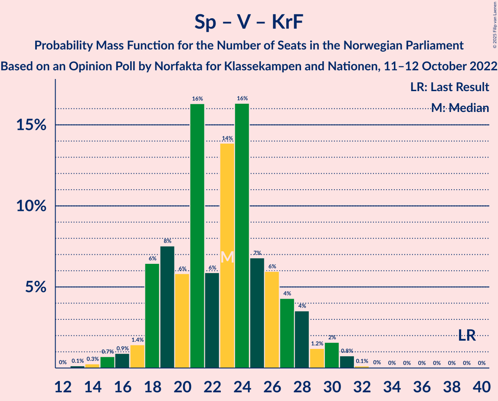

# Opinion Poll by Norfakta for Klassekampen and Nationen, 11–12 October 2022

<a href="#voting-intentions">Voting Intentions</a> | <a href="#seats">Seats</a> | <a href="#coalitions">Coalitions</a> | <a href="#technical-information">Technical Information</a>

## Voting Intentions

### Confidence Intervals

| Party | Last Result | Poll Result | 80% Confidence Interval | 90% Confidence Interval | 95% Confidence Interval | 99% Confidence Interval |
|:-----:|:-----------:|:-----------:|:-----------------------:|:-----------------------:|:-----------------------:|:-----------------------:|
| Høyre | 20.4% | 30.5% | 28.7–32.4% |28.2–33.0% |27.7–33.4% |26.9–34.4% |
| Arbeiderpartiet | 26.2% | 20.5% | 18.9–22.2% |18.5–22.7% |18.1–23.1% |17.4–24.0% |
| Fremskrittspartiet | 11.6% | 12.3% | 11.1–13.7% |10.7–14.1% |10.4–14.5% |9.8–15.2% |
| Sosialistisk Venstreparti | 7.6% | 10.1% | 9.0–11.4% |8.6–11.8% |8.4–12.1% |7.9–12.8% |
| Senterpartiet | 13.5% | 5.9% | 5.0–7.0% |4.8–7.3% |4.6–7.5% |4.2–8.1% |
| Rødt | 4.7% | 5.4% | 4.6–6.4% |4.3–6.7% |4.2–7.0% |3.8–7.5% |
| Venstre | 4.6% | 5.0% | 4.2–6.0% |4.0–6.3% |3.8–6.5% |3.5–7.1% |
| Kristelig Folkeparti | 3.8% | 3.6% | 2.9–4.5% |2.8–4.7% |2.6–5.0% |2.3–5.4% |
| Miljøpartiet De Grønne | 3.9% | 3.4% | 2.8–4.3% |2.6–4.5% |2.4–4.7% |2.2–5.2% |

*Note:* The poll result column reflects the actual value used in the calculations. Published results may vary slightly, and in addition be rounded to fewer digits.

## Seats

### Confidence Intervals

| Party | Last Result | Median | 80% Confidence Interval | 90% Confidence Interval | 95% Confidence Interval | 99% Confidence Interval |
|:-----:|:-----------:|:------:|:-----------------------:|:-----------------------:|:-----------------------:|:-----------------------:|
| <a href="#høyre">Høyre</a> | 36 | 54 | 49–58 |49–59 |48–60 |47–62 |
| <a href="#arbeiderpartiet">Arbeiderpartiet</a> | 48 | 39 | 34–43 |34–44 |34–45 |33–47 |
| <a href="#fremskrittspartiet">Fremskrittspartiet</a> | 21 | 22 | 19–24 |18–25 |18–26 |17–28 |
| <a href="#sosialistisk-venstreparti">Sosialistisk Venstreparti</a> | 13 | 18 | 15–20 |14–21 |14–21 |13–23 |
| <a href="#senterpartiet">Senterpartiet</a> | 28 | 10 | 8–13 |8–13 |8–13 |7–14 |
| <a href="#rødt">Rødt</a> | 8 | 10 | 8–11 |7–12 |7–12 |1–13 |
| <a href="#venstre">Venstre</a> | 8 | 8 | 7–10 |3–11 |3–11 |2–12 |
| <a href="#kristelig-folkeparti">Kristelig Folkeparti</a> | 3 | 3 | 2–8 |2–8 |2–8 |1–9 |
| <a href="#miljøpartiet-de-grønne">Miljøpartiet De Grønne</a> | 3 | 2 | 1–7 |1–8 |1–8 |1–9 |

### Høyre

*For a full overview of the results for this party, see the [Høyre](party-høyre.html) page.*

| Number of Seats | Probability | Accumulated | Special Marks |
|:---------------:|:-----------:|:-----------:|:-------------:|
| 36 | 0% | 100% | Last Result |
| 37 | 0% | 100% |  |
| 38 | 0% | 100% |  |
| 39 | 0% | 100% |  |
| 40 | 0% | 100% |  |
| 41 | 0% | 100% |  |
| 42 | 0% | 100% |  |
| 43 | 0% | 100% |  |
| 44 | 0% | 100% |  |
| 45 | 0.1% | 100% |  |
| 46 | 0.3% | 99.9% |  |
| 47 | 0.4% | 99.6% |  |
| 48 | 2% | 99.1% |  |
| 49 | 7% | 97% |  |
| 50 | 9% | 90% |  |
| 51 | 11% | 81% |  |
| 52 | 8% | 70% |  |
| 53 | 9% | 62% |  |
| 54 | 9% | 53% | Median |
| 55 | 11% | 44% |  |
| 56 | 9% | 33% |  |
| 57 | 7% | 23% |  |
| 58 | 11% | 17% |  |
| 59 | 3% | 6% |  |
| 60 | 1.4% | 3% |  |
| 61 | 0.5% | 2% |  |
| 62 | 0.7% | 1.2% |  |
| 63 | 0.2% | 0.4% |  |
| 64 | 0.1% | 0.2% |  |
| 65 | 0.1% | 0.1% |  |
| 66 | 0% | 0% |  |

### Arbeiderpartiet

*For a full overview of the results for this party, see the [Arbeiderpartiet](party-arbeiderpartiet.html) page.*

| Number of Seats | Probability | Accumulated | Special Marks |
|:---------------:|:-----------:|:-----------:|:-------------:|
| 32 | 0.1% | 100% |  |
| 33 | 2% | 99.8% |  |
| 34 | 9% | 98% |  |
| 35 | 5% | 89% |  |
| 36 | 9% | 84% |  |
| 37 | 10% | 75% |  |
| 38 | 5% | 65% |  |
| 39 | 13% | 60% | Median |
| 40 | 12% | 48% |  |
| 41 | 11% | 36% |  |
| 42 | 7% | 25% |  |
| 43 | 11% | 18% |  |
| 44 | 3% | 8% |  |
| 45 | 3% | 4% |  |
| 46 | 0.6% | 1.3% |  |
| 47 | 0.4% | 0.7% |  |
| 48 | 0.2% | 0.3% | Last Result |
| 49 | 0.1% | 0.1% |  |
| 50 | 0% | 0% |  |

### Fremskrittspartiet

*For a full overview of the results for this party, see the [Fremskrittspartiet](party-fremskrittspartiet.html) page.*

| Number of Seats | Probability | Accumulated | Special Marks |
|:---------------:|:-----------:|:-----------:|:-------------:|
| 16 | 0% | 100% |  |
| 17 | 2% | 99.9% |  |
| 18 | 6% | 98% |  |
| 19 | 10% | 92% |  |
| 20 | 13% | 82% |  |
| 21 | 17% | 70% | Last Result |
| 22 | 15% | 53% | Median |
| 23 | 19% | 39% |  |
| 24 | 10% | 20% |  |
| 25 | 4% | 9% |  |
| 26 | 3% | 5% |  |
| 27 | 0.9% | 2% |  |
| 28 | 0.8% | 1.3% |  |
| 29 | 0.3% | 0.5% |  |
| 30 | 0.2% | 0.2% |  |
| 31 | 0% | 0% |  |

### Sosialistisk Venstreparti

*For a full overview of the results for this party, see the [Sosialistisk Venstreparti](party-sosialistiskvenstreparti.html) page.*

| Number of Seats | Probability | Accumulated | Special Marks |
|:---------------:|:-----------:|:-----------:|:-------------:|
| 11 | 0.1% | 100% |  |
| 12 | 0.3% | 99.9% |  |
| 13 | 1.3% | 99.6% | Last Result |
| 14 | 4% | 98% |  |
| 15 | 7% | 95% |  |
| 16 | 14% | 88% |  |
| 17 | 23% | 73% |  |
| 18 | 16% | 50% | Median |
| 19 | 21% | 34% |  |
| 20 | 6% | 13% |  |
| 21 | 5% | 7% |  |
| 22 | 1.4% | 2% |  |
| 23 | 0.3% | 0.5% |  |
| 24 | 0.2% | 0.2% |  |
| 25 | 0% | 0% |  |

### Senterpartiet

*For a full overview of the results for this party, see the [Senterpartiet](party-senterpartiet.html) page.*

| Number of Seats | Probability | Accumulated | Special Marks |
|:---------------:|:-----------:|:-----------:|:-------------:|
| 1 | 0.1% | 100% |  |
| 2 | 0% | 99.9% |  |
| 3 | 0% | 99.9% |  |
| 4 | 0% | 99.9% |  |
| 5 | 0% | 99.9% |  |
| 6 | 0.2% | 99.8% |  |
| 7 | 2% | 99.7% |  |
| 8 | 9% | 98% |  |
| 9 | 17% | 89% |  |
| 10 | 25% | 72% | Median |
| 11 | 13% | 47% |  |
| 12 | 21% | 35% |  |
| 13 | 12% | 13% |  |
| 14 | 1.2% | 1.5% |  |
| 15 | 0.2% | 0.3% |  |
| 16 | 0% | 0.1% |  |
| 17 | 0% | 0% |  |
| 18 | 0% | 0% |  |
| 19 | 0% | 0% |  |
| 20 | 0% | 0% |  |
| 21 | 0% | 0% |  |
| 22 | 0% | 0% |  |
| 23 | 0% | 0% |  |
| 24 | 0% | 0% |  |
| 25 | 0% | 0% |  |
| 26 | 0% | 0% |  |
| 27 | 0% | 0% |  |
| 28 | 0% | 0% | Last Result |

### Rødt

*For a full overview of the results for this party, see the [Rødt](party-rødt.html) page.*

| Number of Seats | Probability | Accumulated | Special Marks |
|:---------------:|:-----------:|:-----------:|:-------------:|
| 1 | 1.0% | 100% |  |
| 2 | 0% | 99.0% |  |
| 3 | 0% | 99.0% |  |
| 4 | 0% | 99.0% |  |
| 5 | 0% | 99.0% |  |
| 6 | 0.3% | 99.0% |  |
| 7 | 6% | 98.7% |  |
| 8 | 19% | 93% | Last Result |
| 9 | 22% | 74% |  |
| 10 | 30% | 52% | Median |
| 11 | 14% | 22% |  |
| 12 | 6% | 8% |  |
| 13 | 1.1% | 1.3% |  |
| 14 | 0.1% | 0.2% |  |
| 15 | 0% | 0% |  |

### Venstre

*For a full overview of the results for this party, see the [Venstre](party-venstre.html) page.*

| Number of Seats | Probability | Accumulated | Special Marks |
|:---------------:|:-----------:|:-----------:|:-------------:|
| 2 | 2% | 100% |  |
| 3 | 8% | 98% |  |
| 4 | 0% | 91% |  |
| 5 | 0% | 91% |  |
| 6 | 0.5% | 91% |  |
| 7 | 8% | 90% |  |
| 8 | 33% | 82% | Last Result, Median |
| 9 | 20% | 50% |  |
| 10 | 19% | 29% |  |
| 11 | 8% | 10% |  |
| 12 | 2% | 2% |  |
| 13 | 0.4% | 0.4% |  |
| 14 | 0% | 0% |  |

### Kristelig Folkeparti

*For a full overview of the results for this party, see the [Kristelig Folkeparti](party-kristeligfolkeparti.html) page.*

| Number of Seats | Probability | Accumulated | Special Marks |
|:---------------:|:-----------:|:-----------:|:-------------:|
| 0 | 0.4% | 100% |  |
| 1 | 1.4% | 99.6% |  |
| 2 | 38% | 98% |  |
| 3 | 33% | 60% | Last Result, Median |
| 4 | 0% | 27% |  |
| 5 | 0% | 27% |  |
| 6 | 1.1% | 27% |  |
| 7 | 16% | 26% |  |
| 8 | 8% | 10% |  |
| 9 | 2% | 2% |  |
| 10 | 0.3% | 0.3% |  |
| 11 | 0% | 0% |  |

### Miljøpartiet De Grønne

*For a full overview of the results for this party, see the [Miljøpartiet De Grønne](party-miljøpartietdegrønne.html) page.*

| Number of Seats | Probability | Accumulated | Special Marks |
|:---------------:|:-----------:|:-----------:|:-------------:|
| 1 | 28% | 100% |  |
| 2 | 46% | 72% | Median |
| 3 | 8% | 26% | Last Result |
| 4 | 0% | 17% |  |
| 5 | 0.1% | 17% |  |
| 6 | 1.2% | 17% |  |
| 7 | 9% | 16% |  |
| 8 | 7% | 7% |  |
| 9 | 0.5% | 0.6% |  |
| 10 | 0.1% | 0.1% |  |
| 11 | 0% | 0% |  |

## Coalitions

### Confidence Intervals

| Coalition | Last Result | Median | Majority? | 80% Confidence Interval | 90% Confidence Interval | 95% Confidence Interval | 99% Confidence Interval |
|:---------:|:-----------:|:------:|:---------:|:-----------------------:|:-----------------------:|:-----------------------:|:-----------------------:|
| Høyre – Fremskrittspartiet – Senterpartiet – Venstre – Kristelig Folkeparti | 96 | 98 | 100% | 93–104 | 92–104 | 91–106 | 88–107 |
| Høyre – Fremskrittspartiet – Venstre – Kristelig Folkeparti – Miljøpartiet De Grønne | 71 | 91 | 93% | 86–95 | 84–96 | 83–98 | 81–100 |
| Høyre – Fremskrittspartiet – Venstre – Kristelig Folkeparti | 68 | 88 | 77% | 83–92 | 82–94 | 80–96 | 79–98 |
| Høyre – Fremskrittspartiet – Venstre | 65 | 84 | 41% | 79–89 | 78–90 | 77–91 | 74–93 |
| Arbeiderpartiet – Sosialistisk Venstreparti – Senterpartiet – Rødt – Miljøpartiet De Grønne | 100 | 79 | 10% | 74–84 | 73–85 | 71–86 | 69–88 |
| Arbeiderpartiet – Sosialistisk Venstreparti – Senterpartiet – Rødt | 97 | 77 | 1.1% | 72–81 | 70–82 | 68–84 | 67–85 |
| Høyre – Fremskrittspartiet | 57 | 75 | 0.4% | 71–81 | 69–81 | 69–82 | 67–84 |
| Arbeiderpartiet – Sosialistisk Venstreparti – Senterpartiet – Kristelig Folkeparti – Miljøpartiet De Grønne | 95 | 74 | 0.2% | 69–79 | 68–80 | 66–82 | 65–83 |
| Arbeiderpartiet – Sosialistisk Venstreparti – Senterpartiet – Miljøpartiet De Grønne | 92 | 70 | 0% | 65–75 | 64–76 | 62–77 | 60–79 |
| Arbeiderpartiet – Sosialistisk Venstreparti – Rødt – Miljøpartiet De Grønne | 72 | 69 | 0% | 64–75 | 62–76 | 61–76 | 59–79 |
| Arbeiderpartiet – Sosialistisk Venstreparti – Senterpartiet | 89 | 67 | 0% | 63–72 | 61–73 | 60–74 | 58–75 |
| Høyre – Venstre – Kristelig Folkeparti | 47 | 66 | 0% | 61–70 | 60–73 | 59–74 | 57–76 |
| Arbeiderpartiet – Senterpartiet – Kristelig Folkeparti – Miljøpartiet De Grønne | 82 | 56 | 0% | 51–61 | 50–63 | 49–65 | 47–66 |
| Arbeiderpartiet – Sosialistisk Venstreparti | 61 | 57 | 0% | 52–61 | 51–62 | 50–63 | 49–65 |
| Arbeiderpartiet – Senterpartiet – Kristelig Folkeparti | 79 | 54 | 0% | 49–58 | 48–59 | 47–61 | 45–63 |
| Arbeiderpartiet – Senterpartiet | 76 | 50 | 0% | 46–54 | 45–55 | 43–55 | 42–57 |
| Senterpartiet – Venstre – Kristelig Folkeparti | 39 | 23 | 0% | 19–27 | 18–28 | 17–30 | 15–31 |

### Høyre – Fremskrittspartiet – Senterpartiet – Venstre – Kristelig Folkeparti

| Number of Seats | Probability | Accumulated | Special Marks |
|:---------------:|:-----------:|:-----------:|:-------------:|
| 86 | 0.1% | 100% |  |
| 87 | 0.1% | 99.9% |  |
| 88 | 0.3% | 99.7% |  |
| 89 | 0.7% | 99.5% |  |
| 90 | 1.0% | 98.8% |  |
| 91 | 2% | 98% |  |
| 92 | 6% | 96% |  |
| 93 | 7% | 90% |  |
| 94 | 5% | 83% |  |
| 95 | 10% | 78% |  |
| 96 | 5% | 69% | Last Result |
| 97 | 9% | 63% | Median |
| 98 | 5% | 54% |  |
| 99 | 9% | 49% |  |
| 100 | 7% | 40% |  |
| 101 | 6% | 33% |  |
| 102 | 10% | 27% |  |
| 103 | 6% | 17% |  |
| 104 | 6% | 11% |  |
| 105 | 1.4% | 5% |  |
| 106 | 2% | 3% |  |
| 107 | 0.8% | 1.1% |  |
| 108 | 0.1% | 0.3% |  |
| 109 | 0.1% | 0.2% |  |
| 110 | 0% | 0.1% |  |
| 111 | 0% | 0.1% |  |
| 112 | 0% | 0% |  |

### Høyre – Fremskrittspartiet – Venstre – Kristelig Folkeparti – Miljøpartiet De Grønne

| Number of Seats | Probability | Accumulated | Special Marks |
|:---------------:|:-----------:|:-----------:|:-------------:|
| 71 | 0% | 100% | Last Result |
| 72 | 0% | 100% |  |
| 73 | 0% | 100% |  |
| 74 | 0% | 100% |  |
| 75 | 0% | 100% |  |
| 76 | 0% | 100% |  |
| 77 | 0% | 100% |  |
| 78 | 0% | 100% |  |
| 79 | 0.1% | 100% |  |
| 80 | 0.1% | 99.9% |  |
| 81 | 0.6% | 99.8% |  |
| 82 | 1.4% | 99.2% |  |
| 83 | 1.2% | 98% |  |
| 84 | 4% | 97% |  |
| 85 | 1.2% | 93% | Majority |
| 86 | 6% | 91% |  |
| 87 | 10% | 85% |  |
| 88 | 10% | 76% |  |
| 89 | 5% | 66% | Median |
| 90 | 9% | 60% |  |
| 91 | 12% | 52% |  |
| 92 | 11% | 40% |  |
| 93 | 12% | 29% |  |
| 94 | 6% | 18% |  |
| 95 | 3% | 12% |  |
| 96 | 4% | 9% |  |
| 97 | 1.5% | 5% |  |
| 98 | 2% | 3% |  |
| 99 | 0.6% | 2% |  |
| 100 | 0.9% | 1.2% |  |
| 101 | 0.2% | 0.3% |  |
| 102 | 0.1% | 0.1% |  |
| 103 | 0% | 0.1% |  |
| 104 | 0% | 0% |  |

### Høyre – Fremskrittspartiet – Venstre – Kristelig Folkeparti

| Number of Seats | Probability | Accumulated | Special Marks |
|:---------------:|:-----------:|:-----------:|:-------------:|
| 68 | 0% | 100% | Last Result |
| 69 | 0% | 100% |  |
| 70 | 0% | 100% |  |
| 71 | 0% | 100% |  |
| 72 | 0% | 100% |  |
| 73 | 0% | 100% |  |
| 74 | 0% | 100% |  |
| 75 | 0% | 100% |  |
| 76 | 0% | 100% |  |
| 77 | 0.1% | 99.9% |  |
| 78 | 0.3% | 99.8% |  |
| 79 | 0.7% | 99.6% |  |
| 80 | 2% | 98.9% |  |
| 81 | 1.3% | 97% |  |
| 82 | 4% | 96% |  |
| 83 | 8% | 92% |  |
| 84 | 7% | 84% |  |
| 85 | 12% | 77% | Majority |
| 86 | 5% | 65% |  |
| 87 | 9% | 60% | Median |
| 88 | 7% | 50% |  |
| 89 | 10% | 44% |  |
| 90 | 9% | 34% |  |
| 91 | 9% | 24% |  |
| 92 | 6% | 15% |  |
| 93 | 2% | 10% |  |
| 94 | 4% | 7% |  |
| 95 | 1.0% | 4% |  |
| 96 | 0.8% | 3% |  |
| 97 | 0.8% | 2% |  |
| 98 | 0.8% | 0.9% |  |
| 99 | 0% | 0.1% |  |
| 100 | 0% | 0.1% |  |
| 101 | 0% | 0% |  |

### Høyre – Fremskrittspartiet – Venstre

| Number of Seats | Probability | Accumulated | Special Marks |
|:---------------:|:-----------:|:-----------:|:-------------:|
| 65 | 0% | 100% | Last Result |
| 66 | 0% | 100% |  |
| 67 | 0% | 100% |  |
| 68 | 0% | 100% |  |
| 69 | 0% | 100% |  |
| 70 | 0% | 100% |  |
| 71 | 0% | 100% |  |
| 72 | 0.1% | 100% |  |
| 73 | 0.1% | 99.9% |  |
| 74 | 0.4% | 99.8% |  |
| 75 | 0.4% | 99.4% |  |
| 76 | 1.4% | 99.0% |  |
| 77 | 2% | 98% |  |
| 78 | 3% | 96% |  |
| 79 | 4% | 92% |  |
| 80 | 9% | 89% |  |
| 81 | 9% | 80% |  |
| 82 | 11% | 71% |  |
| 83 | 9% | 60% |  |
| 84 | 10% | 51% | Median |
| 85 | 7% | 41% | Majority |
| 86 | 7% | 34% |  |
| 87 | 11% | 28% |  |
| 88 | 3% | 17% |  |
| 89 | 6% | 14% |  |
| 90 | 4% | 8% |  |
| 91 | 3% | 5% |  |
| 92 | 0.9% | 2% |  |
| 93 | 0.6% | 1.0% |  |
| 94 | 0.4% | 0.5% |  |
| 95 | 0% | 0.1% |  |
| 96 | 0% | 0% |  |

### Arbeiderpartiet – Sosialistisk Venstreparti – Senterpartiet – Rødt – Miljøpartiet De Grønne

| Number of Seats | Probability | Accumulated | Special Marks |
|:---------------:|:-----------:|:-----------:|:-------------:|
| 66 | 0% | 100% |  |
| 67 | 0.1% | 99.9% |  |
| 68 | 0.1% | 99.8% |  |
| 69 | 0.8% | 99.7% |  |
| 70 | 1.0% | 98.9% |  |
| 71 | 1.0% | 98% |  |
| 72 | 1.2% | 97% |  |
| 73 | 2% | 96% |  |
| 74 | 4% | 93% |  |
| 75 | 3% | 89% |  |
| 76 | 7% | 86% |  |
| 77 | 9% | 79% |  |
| 78 | 12% | 70% |  |
| 79 | 10% | 58% | Median |
| 80 | 6% | 48% |  |
| 81 | 10% | 42% |  |
| 82 | 5% | 32% |  |
| 83 | 11% | 27% |  |
| 84 | 6% | 16% |  |
| 85 | 5% | 10% | Majority |
| 86 | 3% | 4% |  |
| 87 | 0.8% | 2% |  |
| 88 | 0.5% | 0.9% |  |
| 89 | 0.2% | 0.4% |  |
| 90 | 0.1% | 0.2% |  |
| 91 | 0% | 0.1% |  |
| 92 | 0% | 0% |  |
| 93 | 0% | 0% |  |
| 94 | 0% | 0% |  |
| 95 | 0% | 0% |  |
| 96 | 0% | 0% |  |
| 97 | 0% | 0% |  |
| 98 | 0% | 0% |  |
| 99 | 0% | 0% |  |
| 100 | 0% | 0% | Last Result |

### Arbeiderpartiet – Sosialistisk Venstreparti – Senterpartiet – Rødt

| Number of Seats | Probability | Accumulated | Special Marks |
|:---------------:|:-----------:|:-----------:|:-------------:|
| 64 | 0% | 100% |  |
| 65 | 0.2% | 99.9% |  |
| 66 | 0.2% | 99.8% |  |
| 67 | 0.5% | 99.5% |  |
| 68 | 2% | 99.1% |  |
| 69 | 0.8% | 97% |  |
| 70 | 2% | 96% |  |
| 71 | 3% | 94% |  |
| 72 | 5% | 92% |  |
| 73 | 4% | 87% |  |
| 74 | 7% | 83% |  |
| 75 | 12% | 76% |  |
| 76 | 11% | 64% |  |
| 77 | 13% | 52% | Median |
| 78 | 8% | 40% |  |
| 79 | 6% | 32% |  |
| 80 | 9% | 26% |  |
| 81 | 8% | 17% |  |
| 82 | 5% | 9% |  |
| 83 | 0.8% | 4% |  |
| 84 | 2% | 3% |  |
| 85 | 0.8% | 1.1% | Majority |
| 86 | 0.2% | 0.3% |  |
| 87 | 0.1% | 0.1% |  |
| 88 | 0% | 0% |  |
| 89 | 0% | 0% |  |
| 90 | 0% | 0% |  |
| 91 | 0% | 0% |  |
| 92 | 0% | 0% |  |
| 93 | 0% | 0% |  |
| 94 | 0% | 0% |  |
| 95 | 0% | 0% |  |
| 96 | 0% | 0% |  |
| 97 | 0% | 0% | Last Result |

### Høyre – Fremskrittspartiet

| Number of Seats | Probability | Accumulated | Special Marks |
|:---------------:|:-----------:|:-----------:|:-------------:|
| 57 | 0% | 100% | Last Result |
| 58 | 0% | 100% |  |
| 59 | 0% | 100% |  |
| 60 | 0% | 100% |  |
| 61 | 0% | 100% |  |
| 62 | 0% | 100% |  |
| 63 | 0% | 100% |  |
| 64 | 0% | 100% |  |
| 65 | 0.1% | 100% |  |
| 66 | 0.2% | 99.9% |  |
| 67 | 0.5% | 99.7% |  |
| 68 | 0.9% | 99.2% |  |
| 69 | 3% | 98% |  |
| 70 | 3% | 95% |  |
| 71 | 6% | 92% |  |
| 72 | 11% | 87% |  |
| 73 | 12% | 75% |  |
| 74 | 9% | 63% |  |
| 75 | 5% | 54% |  |
| 76 | 10% | 49% | Median |
| 77 | 5% | 40% |  |
| 78 | 7% | 35% |  |
| 79 | 12% | 28% |  |
| 80 | 3% | 16% |  |
| 81 | 9% | 13% |  |
| 82 | 2% | 4% |  |
| 83 | 1.1% | 2% |  |
| 84 | 0.8% | 1.2% |  |
| 85 | 0.2% | 0.4% | Majority |
| 86 | 0.1% | 0.2% |  |
| 87 | 0% | 0.1% |  |
| 88 | 0% | 0.1% |  |
| 89 | 0% | 0% |  |

### Arbeiderpartiet – Sosialistisk Venstreparti – Senterpartiet – Kristelig Folkeparti – Miljøpartiet De Grønne

| Number of Seats | Probability | Accumulated | Special Marks |
|:---------------:|:-----------:|:-----------:|:-------------:|
| 62 | 0% | 100% |  |
| 63 | 0.1% | 99.9% |  |
| 64 | 0.3% | 99.9% |  |
| 65 | 0.8% | 99.6% |  |
| 66 | 2% | 98.7% |  |
| 67 | 2% | 97% |  |
| 68 | 4% | 95% |  |
| 69 | 10% | 92% |  |
| 70 | 4% | 82% |  |
| 71 | 5% | 78% |  |
| 72 | 10% | 73% | Median |
| 73 | 11% | 63% |  |
| 74 | 5% | 51% |  |
| 75 | 12% | 46% |  |
| 76 | 7% | 34% |  |
| 77 | 9% | 27% |  |
| 78 | 7% | 18% |  |
| 79 | 6% | 12% |  |
| 80 | 2% | 6% |  |
| 81 | 1.2% | 4% |  |
| 82 | 1.4% | 3% |  |
| 83 | 0.7% | 1.1% |  |
| 84 | 0.3% | 0.5% |  |
| 85 | 0.1% | 0.2% | Majority |
| 86 | 0.1% | 0.1% |  |
| 87 | 0% | 0% |  |
| 88 | 0% | 0% |  |
| 89 | 0% | 0% |  |
| 90 | 0% | 0% |  |
| 91 | 0% | 0% |  |
| 92 | 0% | 0% |  |
| 93 | 0% | 0% |  |
| 94 | 0% | 0% |  |
| 95 | 0% | 0% | Last Result |

### Arbeiderpartiet – Sosialistisk Venstreparti – Senterpartiet – Miljøpartiet De Grønne

| Number of Seats | Probability | Accumulated | Special Marks |
|:---------------:|:-----------:|:-----------:|:-------------:|
| 59 | 0.2% | 100% |  |
| 60 | 0.8% | 99.8% |  |
| 61 | 1.0% | 99.0% |  |
| 62 | 0.8% | 98% |  |
| 63 | 2% | 97% |  |
| 64 | 2% | 95% |  |
| 65 | 4% | 93% |  |
| 66 | 5% | 89% |  |
| 67 | 11% | 84% |  |
| 68 | 7% | 73% |  |
| 69 | 8% | 66% | Median |
| 70 | 17% | 58% |  |
| 71 | 5% | 41% |  |
| 72 | 11% | 36% |  |
| 73 | 5% | 25% |  |
| 74 | 5% | 20% |  |
| 75 | 8% | 15% |  |
| 76 | 4% | 7% |  |
| 77 | 2% | 3% |  |
| 78 | 0.6% | 2% |  |
| 79 | 0.6% | 0.9% |  |
| 80 | 0.2% | 0.3% |  |
| 81 | 0.1% | 0.1% |  |
| 82 | 0% | 0% |  |
| 83 | 0% | 0% |  |
| 84 | 0% | 0% |  |
| 85 | 0% | 0% | Majority |
| 86 | 0% | 0% |  |
| 87 | 0% | 0% |  |
| 88 | 0% | 0% |  |
| 89 | 0% | 0% |  |
| 90 | 0% | 0% |  |
| 91 | 0% | 0% |  |
| 92 | 0% | 0% | Last Result |

### Arbeiderpartiet – Sosialistisk Venstreparti – Rødt – Miljøpartiet De Grønne

| Number of Seats | Probability | Accumulated | Special Marks |
|:---------------:|:-----------:|:-----------:|:-------------:|
| 56 | 0% | 100% |  |
| 57 | 0.1% | 99.9% |  |
| 58 | 0.1% | 99.9% |  |
| 59 | 0.8% | 99.8% |  |
| 60 | 0.5% | 99.0% |  |
| 61 | 1.2% | 98.6% |  |
| 62 | 3% | 97% |  |
| 63 | 2% | 95% |  |
| 64 | 7% | 93% |  |
| 65 | 7% | 85% |  |
| 66 | 10% | 78% |  |
| 67 | 6% | 68% |  |
| 68 | 10% | 62% |  |
| 69 | 11% | 52% | Median |
| 70 | 5% | 42% |  |
| 71 | 9% | 36% |  |
| 72 | 5% | 27% | Last Result |
| 73 | 9% | 23% |  |
| 74 | 3% | 14% |  |
| 75 | 5% | 11% |  |
| 76 | 4% | 6% |  |
| 77 | 0.7% | 2% |  |
| 78 | 0.3% | 1.0% |  |
| 79 | 0.5% | 0.7% |  |
| 80 | 0.1% | 0.2% |  |
| 81 | 0.1% | 0.1% |  |
| 82 | 0% | 0% |  |

### Arbeiderpartiet – Sosialistisk Venstreparti – Senterpartiet

| Number of Seats | Probability | Accumulated | Special Marks |
|:---------------:|:-----------:|:-----------:|:-------------:|
| 56 | 0% | 100% |  |
| 57 | 0.3% | 99.9% |  |
| 58 | 0.3% | 99.7% |  |
| 59 | 2% | 99.4% |  |
| 60 | 1.3% | 98% |  |
| 61 | 2% | 96% |  |
| 62 | 4% | 95% |  |
| 63 | 4% | 91% |  |
| 64 | 6% | 87% |  |
| 65 | 10% | 81% |  |
| 66 | 10% | 71% |  |
| 67 | 12% | 61% | Median |
| 68 | 10% | 49% |  |
| 69 | 14% | 39% |  |
| 70 | 11% | 26% |  |
| 71 | 5% | 15% |  |
| 72 | 4% | 10% |  |
| 73 | 4% | 6% |  |
| 74 | 2% | 3% |  |
| 75 | 0.3% | 0.8% |  |
| 76 | 0.2% | 0.5% |  |
| 77 | 0.2% | 0.3% |  |
| 78 | 0% | 0% |  |
| 79 | 0% | 0% |  |
| 80 | 0% | 0% |  |
| 81 | 0% | 0% |  |
| 82 | 0% | 0% |  |
| 83 | 0% | 0% |  |
| 84 | 0% | 0% |  |
| 85 | 0% | 0% | Majority |
| 86 | 0% | 0% |  |
| 87 | 0% | 0% |  |
| 88 | 0% | 0% |  |
| 89 | 0% | 0% | Last Result |

### Høyre – Venstre – Kristelig Folkeparti

| Number of Seats | Probability | Accumulated | Special Marks |
|:---------------:|:-----------:|:-----------:|:-------------:|
| 47 | 0% | 100% | Last Result |
| 48 | 0% | 100% |  |
| 49 | 0% | 100% |  |
| 50 | 0% | 100% |  |
| 51 | 0% | 100% |  |
| 52 | 0% | 100% |  |
| 53 | 0% | 100% |  |
| 54 | 0% | 100% |  |
| 55 | 0% | 100% |  |
| 56 | 0.2% | 99.9% |  |
| 57 | 0.3% | 99.7% |  |
| 58 | 0.5% | 99.4% |  |
| 59 | 3% | 98.9% |  |
| 60 | 3% | 96% |  |
| 61 | 5% | 94% |  |
| 62 | 6% | 89% |  |
| 63 | 13% | 83% |  |
| 64 | 9% | 70% |  |
| 65 | 7% | 62% | Median |
| 66 | 13% | 55% |  |
| 67 | 8% | 42% |  |
| 68 | 9% | 33% |  |
| 69 | 8% | 24% |  |
| 70 | 6% | 16% |  |
| 71 | 2% | 10% |  |
| 72 | 2% | 7% |  |
| 73 | 3% | 6% |  |
| 74 | 1.5% | 3% |  |
| 75 | 1.0% | 2% |  |
| 76 | 0.3% | 0.6% |  |
| 77 | 0.2% | 0.3% |  |
| 78 | 0.1% | 0.1% |  |
| 79 | 0% | 0.1% |  |
| 80 | 0% | 0% |  |

### Arbeiderpartiet – Senterpartiet – Kristelig Folkeparti – Miljøpartiet De Grønne

| Number of Seats | Probability | Accumulated | Special Marks |
|:---------------:|:-----------:|:-----------:|:-------------:|
| 45 | 0% | 100% |  |
| 46 | 0.1% | 99.9% |  |
| 47 | 0.5% | 99.8% |  |
| 48 | 1.2% | 99.3% |  |
| 49 | 1.1% | 98% |  |
| 50 | 5% | 97% |  |
| 51 | 3% | 92% |  |
| 52 | 10% | 89% |  |
| 53 | 7% | 79% |  |
| 54 | 7% | 72% | Median |
| 55 | 12% | 65% |  |
| 56 | 8% | 52% |  |
| 57 | 7% | 45% |  |
| 58 | 8% | 38% |  |
| 59 | 8% | 30% |  |
| 60 | 5% | 22% |  |
| 61 | 9% | 17% |  |
| 62 | 2% | 8% |  |
| 63 | 2% | 6% |  |
| 64 | 1.5% | 4% |  |
| 65 | 1.5% | 3% |  |
| 66 | 0.8% | 1.1% |  |
| 67 | 0.1% | 0.3% |  |
| 68 | 0.1% | 0.2% |  |
| 69 | 0.1% | 0.2% |  |
| 70 | 0% | 0.1% |  |
| 71 | 0% | 0% |  |
| 72 | 0% | 0% |  |
| 73 | 0% | 0% |  |
| 74 | 0% | 0% |  |
| 75 | 0% | 0% |  |
| 76 | 0% | 0% |  |
| 77 | 0% | 0% |  |
| 78 | 0% | 0% |  |
| 79 | 0% | 0% |  |
| 80 | 0% | 0% |  |
| 81 | 0% | 0% |  |
| 82 | 0% | 0% | Last Result |

### Arbeiderpartiet – Sosialistisk Venstreparti

| Number of Seats | Probability | Accumulated | Special Marks |
|:---------------:|:-----------:|:-----------:|:-------------:|
| 47 | 0% | 100% |  |
| 48 | 0.2% | 99.9% |  |
| 49 | 1.1% | 99.8% |  |
| 50 | 2% | 98.7% |  |
| 51 | 3% | 97% |  |
| 52 | 4% | 94% |  |
| 53 | 14% | 90% |  |
| 54 | 5% | 76% |  |
| 55 | 7% | 71% |  |
| 56 | 8% | 64% |  |
| 57 | 15% | 56% | Median |
| 58 | 9% | 41% |  |
| 59 | 7% | 32% |  |
| 60 | 9% | 24% |  |
| 61 | 7% | 15% | Last Result |
| 62 | 4% | 8% |  |
| 63 | 2% | 4% |  |
| 64 | 2% | 2% |  |
| 65 | 0.4% | 0.7% |  |
| 66 | 0.1% | 0.3% |  |
| 67 | 0.2% | 0.2% |  |
| 68 | 0% | 0% |  |

### Arbeiderpartiet – Senterpartiet – Kristelig Folkeparti

| Number of Seats | Probability | Accumulated | Special Marks |
|:---------------:|:-----------:|:-----------:|:-------------:|
| 43 | 0% | 100% |  |
| 44 | 0.1% | 99.9% |  |
| 45 | 0.6% | 99.8% |  |
| 46 | 0.9% | 99.2% |  |
| 47 | 2% | 98% |  |
| 48 | 4% | 96% |  |
| 49 | 6% | 93% |  |
| 50 | 11% | 87% |  |
| 51 | 5% | 76% |  |
| 52 | 8% | 71% | Median |
| 53 | 12% | 63% |  |
| 54 | 16% | 51% |  |
| 55 | 8% | 35% |  |
| 56 | 8% | 27% |  |
| 57 | 7% | 19% |  |
| 58 | 5% | 12% |  |
| 59 | 3% | 8% |  |
| 60 | 1.1% | 4% |  |
| 61 | 1.2% | 3% |  |
| 62 | 1.0% | 2% |  |
| 63 | 0.8% | 1.0% |  |
| 64 | 0.2% | 0.3% |  |
| 65 | 0% | 0.1% |  |
| 66 | 0% | 0% |  |
| 67 | 0% | 0% |  |
| 68 | 0% | 0% |  |
| 69 | 0% | 0% |  |
| 70 | 0% | 0% |  |
| 71 | 0% | 0% |  |
| 72 | 0% | 0% |  |
| 73 | 0% | 0% |  |
| 74 | 0% | 0% |  |
| 75 | 0% | 0% |  |
| 76 | 0% | 0% |  |
| 77 | 0% | 0% |  |
| 78 | 0% | 0% |  |
| 79 | 0% | 0% | Last Result |

### Arbeiderpartiet – Senterpartiet

| Number of Seats | Probability | Accumulated | Special Marks |
|:---------------:|:-----------:|:-----------:|:-------------:|
| 40 | 0% | 100% |  |
| 41 | 0.2% | 99.9% |  |
| 42 | 0.5% | 99.8% |  |
| 43 | 2% | 99.3% |  |
| 44 | 1.5% | 97% |  |
| 45 | 4% | 96% |  |
| 46 | 8% | 92% |  |
| 47 | 8% | 84% |  |
| 48 | 11% | 75% |  |
| 49 | 9% | 65% | Median |
| 50 | 12% | 56% |  |
| 51 | 19% | 43% |  |
| 52 | 7% | 24% |  |
| 53 | 6% | 17% |  |
| 54 | 6% | 11% |  |
| 55 | 3% | 5% |  |
| 56 | 1.5% | 2% |  |
| 57 | 0.6% | 0.9% |  |
| 58 | 0.1% | 0.2% |  |
| 59 | 0.1% | 0.1% |  |
| 60 | 0% | 0% |  |
| 61 | 0% | 0% |  |
| 62 | 0% | 0% |  |
| 63 | 0% | 0% |  |
| 64 | 0% | 0% |  |
| 65 | 0% | 0% |  |
| 66 | 0% | 0% |  |
| 67 | 0% | 0% |  |
| 68 | 0% | 0% |  |
| 69 | 0% | 0% |  |
| 70 | 0% | 0% |  |
| 71 | 0% | 0% |  |
| 72 | 0% | 0% |  |
| 73 | 0% | 0% |  |
| 74 | 0% | 0% |  |
| 75 | 0% | 0% |  |
| 76 | 0% | 0% | Last Result |

### Senterpartiet – Venstre – Kristelig Folkeparti

| Number of Seats | Probability | Accumulated | Special Marks |
|:---------------:|:-----------:|:-----------:|:-------------:|
| 12 | 0% | 100% |  |
| 13 | 0.1% | 99.9% |  |
| 14 | 0.3% | 99.8% |  |
| 15 | 0.7% | 99.5% |  |
| 16 | 0.9% | 98.8% |  |
| 17 | 1.4% | 98% |  |
| 18 | 6% | 96% |  |
| 19 | 8% | 90% |  |
| 20 | 6% | 83% |  |
| 21 | 16% | 77% | Median |
| 22 | 6% | 60% |  |
| 23 | 14% | 54% |  |
| 24 | 16% | 41% |  |
| 25 | 7% | 24% |  |
| 26 | 6% | 17% |  |
| 27 | 4% | 12% |  |
| 28 | 4% | 7% |  |
| 29 | 1.2% | 4% |  |
| 30 | 2% | 3% |  |
| 31 | 0.8% | 0.9% |  |
| 32 | 0.1% | 0.2% |  |
| 33 | 0% | 0.1% |  |
| 34 | 0% | 0% |  |
| 35 | 0% | 0% |  |
| 36 | 0% | 0% |  |
| 37 | 0% | 0% |  |
| 38 | 0% | 0% |  |
| 39 | 0% | 0% | Last Result |

## Technical Information

### Opinion Poll

+ **Polling firm:** Norfakta
+ **Commissioner(s):** Klassekampen and Nationen
+ **Fieldwork period:** 11–12 October 2022

### Calculations

+ **Sample size:** 1000
+ **Simulations done:** 1,048,576
+ **Error estimate:** 1.40%

