# Opinion Poll by Sentio for Nettavisen, 11–17 October 2022

<a href="#voting-intentions">Voting Intentions</a> | <a href="#seats">Seats</a> | <a href="#coalitions">Coalitions</a> | <a href="#technical-information">Technical Information</a>

## Voting Intentions

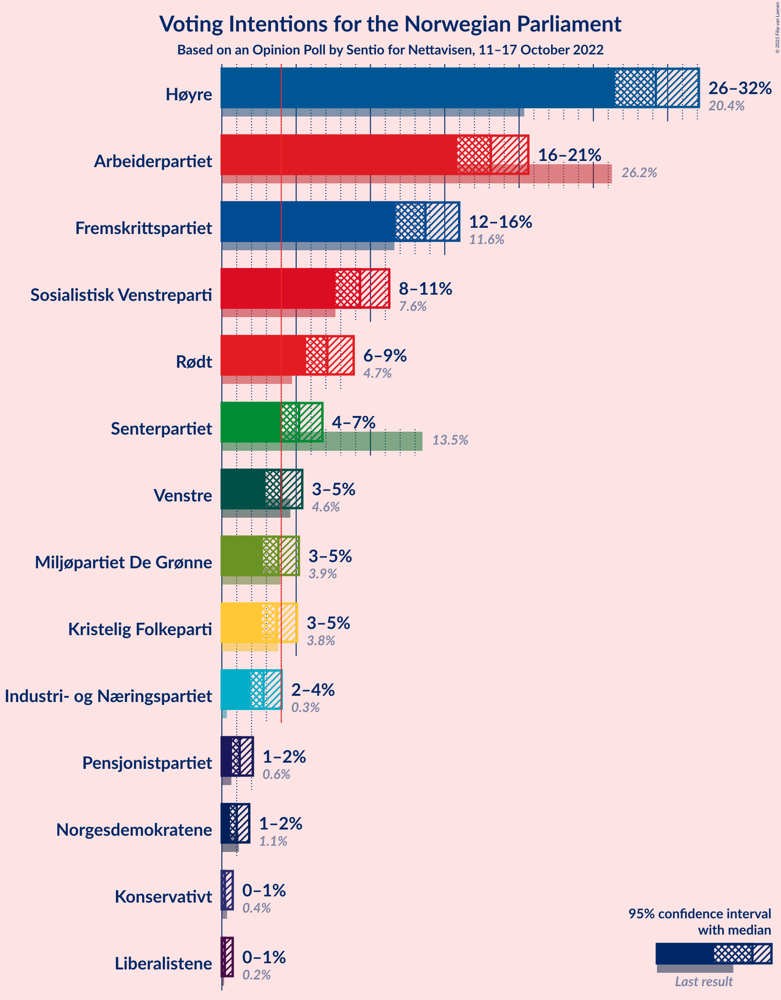

### Confidence Intervals

| Party | Last Result | Poll Result | 80% Confidence Interval | 90% Confidence Interval | 95% Confidence Interval | 99% Confidence Interval |
|:-----:|:-----------:|:-----------:|:-----------------------:|:-----------------------:|:-----------------------:|:-----------------------:|
| Høyre | 20.4% | 29.2% | 27.4–31.1% |26.9–31.6% |26.5–32.1% |25.6–33.0% |
| Arbeiderpartiet | 26.2% | 18.1% | 16.6–19.7% |16.2–20.2% |15.8–20.6% |15.2–21.4% |
| Fremskrittspartiet | 11.6% | 13.7% | 12.4–15.2% |12.0–15.6% |11.7–16.0% |11.1–16.7% |
| Sosialistisk Venstreparti | 7.6% | 9.3% | 8.2–10.6% |7.9–10.9% |7.7–11.3% |7.2–11.9% |
| Rødt | 4.7% | 7.1% | 6.2–8.3% |5.9–8.6% |5.7–8.9% |5.2–9.4% |
| Senterpartiet | 13.5% | 5.2% | 4.4–6.2% |4.2–6.5% |4.0–6.8% |3.6–7.3% |
| Venstre | 4.6% | 4.0% | 3.3–4.9% |3.1–5.2% |2.9–5.4% |2.7–5.9% |
| Miljøpartiet De Grønne | 3.9% | 3.8% | 3.1–4.7% |2.9–5.0% |2.8–5.2% |2.5–5.6% |
| Kristelig Folkeparti | 3.8% | 3.7% | 3.0–4.6% |2.9–4.8% |2.7–5.1% |2.4–5.5% |
| Industri- og Næringspartiet | 0.3% | 2.8% | 2.2–3.6% |2.1–3.8% |1.9–4.0% |1.7–4.4% |
| Pensjonistpartiet | 0.6% | 1.2% | 0.9–1.8% |0.8–1.9% |0.7–2.1% |0.5–2.4% |
| Norgesdemokratene | 1.1% | 1.0% | 0.7–1.5% |0.6–1.7% |0.5–1.8% |0.4–2.1% |
| Liberalistene | 0.2% | 0.2% | 0.1–0.5% |0.1–0.6% |0.1–0.7% |0.0–0.9% |
| Konservativt | 0.4% | 0.2% | 0.1–0.5% |0.1–0.6% |0.1–0.7% |0.0–0.9% |

*Note:* The poll result column reflects the actual value used in the calculations. Published results may vary slightly, and in addition be rounded to fewer digits.

## Seats

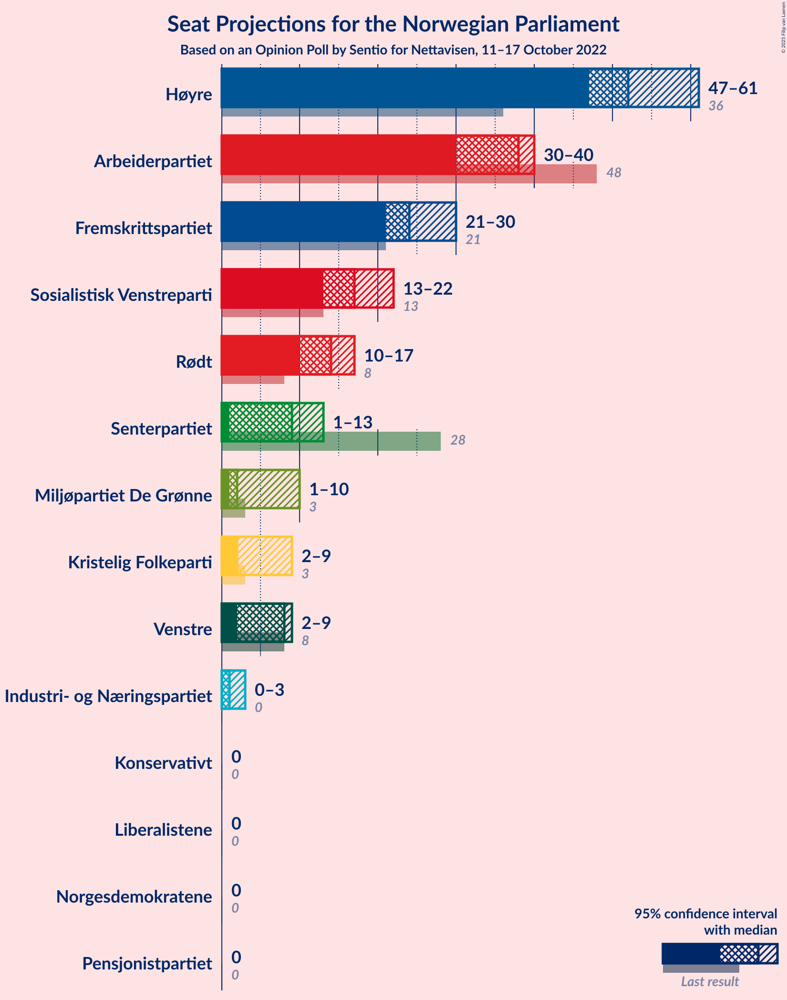

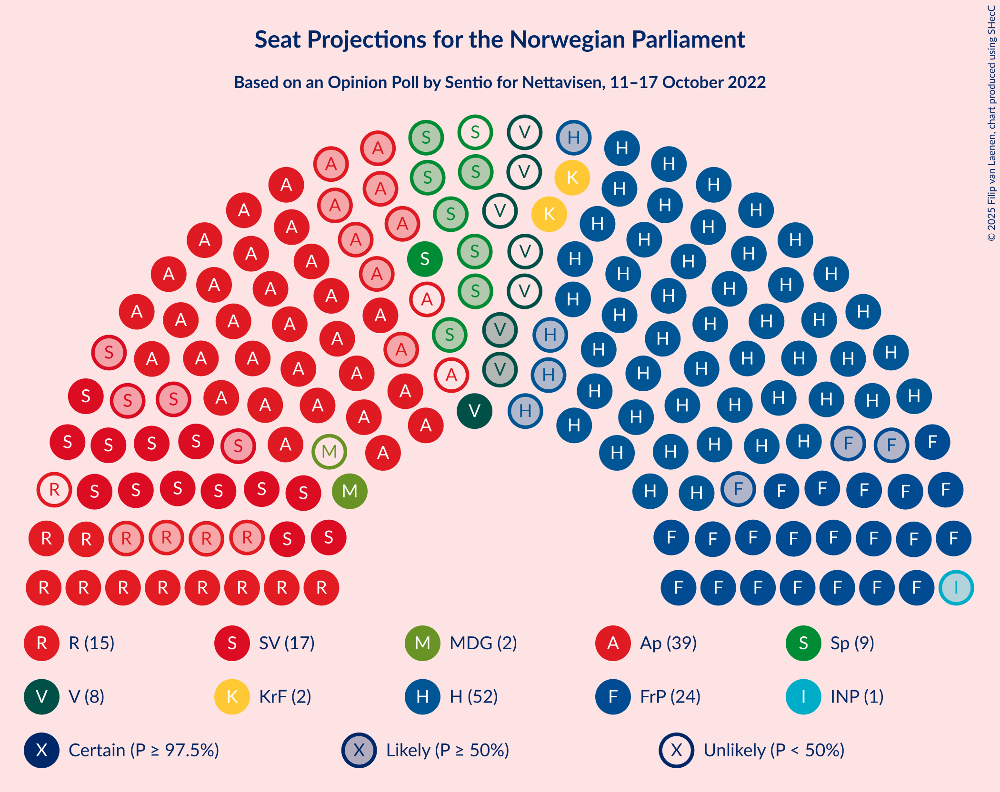

### Confidence Intervals

| Party | Last Result | Median | 80% Confidence Interval | 90% Confidence Interval | 95% Confidence Interval | 99% Confidence Interval |
|:-----:|:-----------:|:------:|:-----------------------:|:-----------------------:|:-----------------------:|:-----------------------:|
| <a href="#høyre">Høyre</a> | 36 | 52 | 48–57 |48–58 |47–61 |47–61 |
| <a href="#arbeiderpartiet">Arbeiderpartiet</a> | 48 | 38 | 33–39 |30–39 |30–40 |30–41 |
| <a href="#fremskrittspartiet">Fremskrittspartiet</a> | 21 | 24 | 23–30 |22–30 |21–30 |20–32 |
| <a href="#sosialistisk-venstreparti">Sosialistisk Venstreparti</a> | 13 | 17 | 13–19 |13–19 |13–22 |12–22 |
| <a href="#rødt">Rødt</a> | 8 | 14 | 12–15 |11–15 |10–17 |10–17 |
| <a href="#senterpartiet">Senterpartiet</a> | 28 | 9 | 7–11 |7–13 |1–13 |1–13 |
| <a href="#venstre">Venstre</a> | 8 | 8 | 2–8 |2–9 |2–9 |2–10 |
| <a href="#miljøpartiet-de-grønne">Miljøpartiet De Grønne</a> | 3 | 2 | 1–8 |1–9 |1–10 |1–10 |
| <a href="#kristelig-folkeparti">Kristelig Folkeparti</a> | 3 | 2 | 2–8 |2–9 |2–9 |1–11 |
| <a href="#industri--og-næringspartiet">Industri- og Næringspartiet</a> | 0 | 1 | 0–2 |0–3 |0–3 |0–7 |
| <a href="#pensjonistpartiet">Pensjonistpartiet</a> | 0 | 0 | 0 |0 |0 |0–1 |
| <a href="#norgesdemokratene">Norgesdemokratene</a> | 0 | 0 | 0 |0 |0 |0 |
| <a href="#liberalistene">Liberalistene</a> | 0 | 0 | 0 |0 |0 |0 |
| <a href="#konservativt">Konservativt</a> | 0 | 0 | 0 |0 |0 |0 |

### Høyre

*For a full overview of the results for this party, see the [Høyre](party-høyre.html) page.*

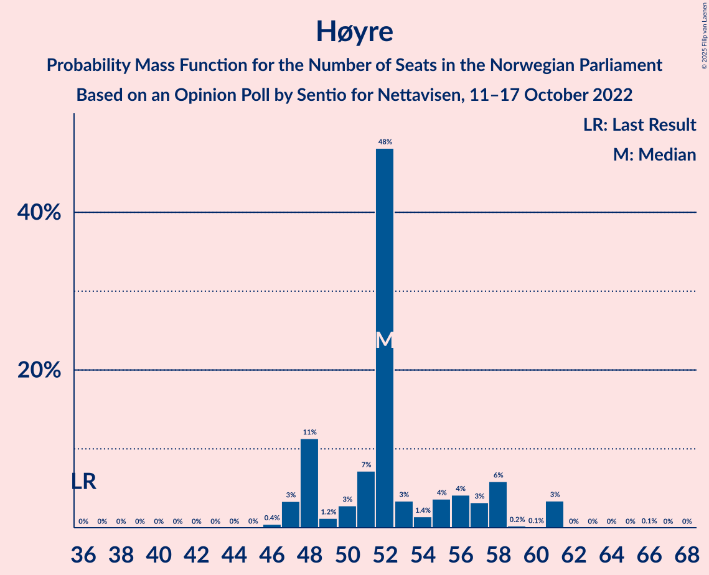

| Number of Seats | Probability | Accumulated | Special Marks |
|:---------------:|:-----------:|:-----------:|:-------------:|
| 36 | 0% | 100% | Last Result |
| 37 | 0% | 100% |  |
| 38 | 0% | 100% |  |
| 39 | 0% | 100% |  |
| 40 | 0% | 100% |  |
| 41 | 0% | 100% |  |
| 42 | 0% | 100% |  |
| 43 | 0% | 100% |  |
| 44 | 0% | 100% |  |
| 45 | 0% | 100% |  |
| 46 | 0.4% | 100% |  |
| 47 | 3% | 99.5% |  |
| 48 | 11% | 96% |  |
| 49 | 1.2% | 85% |  |
| 50 | 3% | 84% |  |
| 51 | 7% | 81% |  |
| 52 | 48% | 74% | Median |
| 53 | 3% | 25% |  |
| 54 | 1.4% | 22% |  |
| 55 | 4% | 21% |  |
| 56 | 4% | 17% |  |
| 57 | 3% | 13% |  |
| 58 | 6% | 10% |  |
| 59 | 0.2% | 4% |  |
| 60 | 0.1% | 4% |  |
| 61 | 3% | 3% |  |
| 62 | 0% | 0.1% |  |
| 63 | 0% | 0.1% |  |
| 64 | 0% | 0.1% |  |
| 65 | 0% | 0.1% |  |
| 66 | 0.1% | 0.1% |  |
| 67 | 0% | 0% |  |

### Arbeiderpartiet

*For a full overview of the results for this party, see the [Arbeiderpartiet](party-arbeiderpartiet.html) page.*

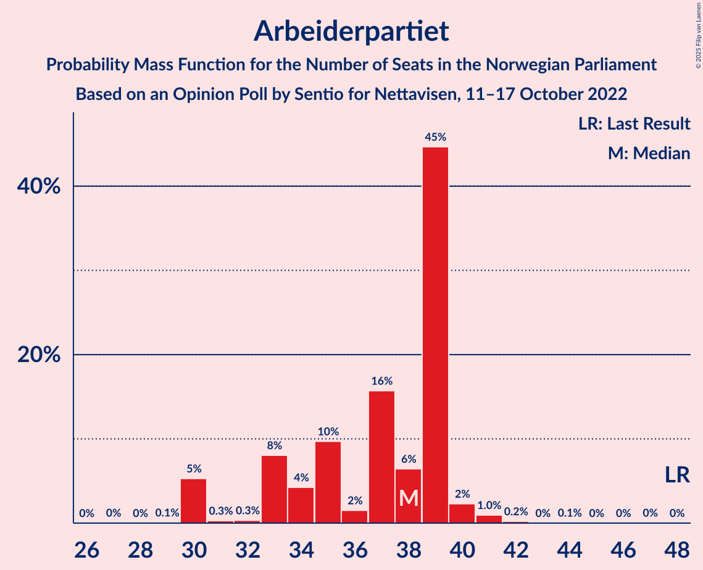

| Number of Seats | Probability | Accumulated | Special Marks |
|:---------------:|:-----------:|:-----------:|:-------------:|
| 27 | 0% | 100% |  |
| 28 | 0% | 99.9% |  |
| 29 | 0.1% | 99.9% |  |
| 30 | 5% | 99.9% |  |
| 31 | 0.3% | 95% |  |
| 32 | 0.3% | 94% |  |
| 33 | 8% | 94% |  |
| 34 | 4% | 86% |  |
| 35 | 10% | 82% |  |
| 36 | 2% | 72% |  |
| 37 | 16% | 70% |  |
| 38 | 6% | 55% | Median |
| 39 | 45% | 48% |  |
| 40 | 2% | 4% |  |
| 41 | 1.0% | 1.3% |  |
| 42 | 0.2% | 0.4% |  |
| 43 | 0% | 0.1% |  |
| 44 | 0.1% | 0.1% |  |
| 45 | 0% | 0.1% |  |
| 46 | 0% | 0.1% |  |
| 47 | 0% | 0.1% |  |
| 48 | 0% | 0% | Last Result |

### Fremskrittspartiet

*For a full overview of the results for this party, see the [Fremskrittspartiet](party-fremskrittspartiet.html) page.*

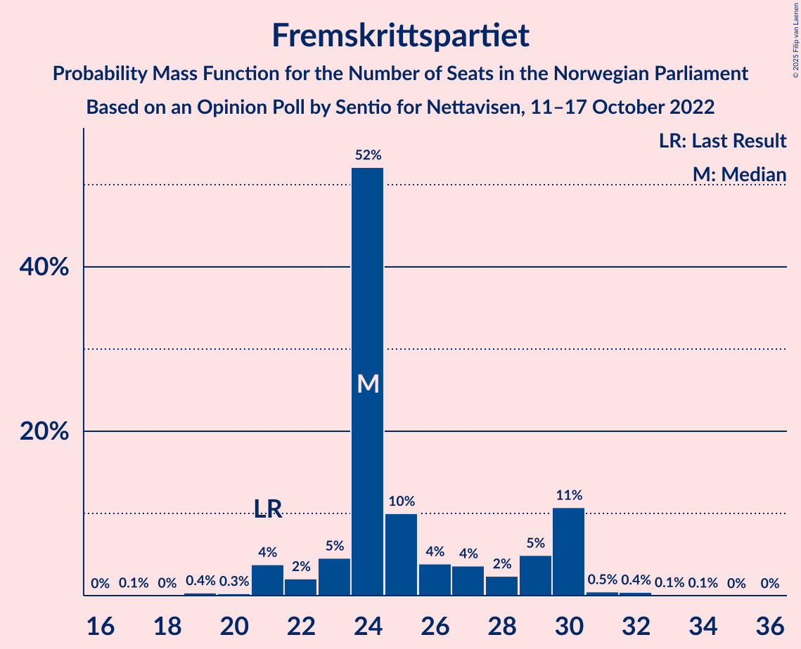

| Number of Seats | Probability | Accumulated | Special Marks |
|:---------------:|:-----------:|:-----------:|:-------------:|
| 17 | 0.1% | 100% |  |
| 18 | 0% | 99.9% |  |
| 19 | 0.4% | 99.9% |  |
| 20 | 0.3% | 99.5% |  |
| 21 | 4% | 99.3% | Last Result |
| 22 | 2% | 95% |  |
| 23 | 5% | 93% |  |
| 24 | 52% | 89% | Median |
| 25 | 10% | 37% |  |
| 26 | 4% | 27% |  |
| 27 | 4% | 23% |  |
| 28 | 2% | 19% |  |
| 29 | 5% | 17% |  |
| 30 | 11% | 12% |  |
| 31 | 0.5% | 1.1% |  |
| 32 | 0.4% | 0.6% |  |
| 33 | 0.1% | 0.2% |  |
| 34 | 0.1% | 0.1% |  |
| 35 | 0% | 0% |  |

### Sosialistisk Venstreparti

*For a full overview of the results for this party, see the [Sosialistisk Venstreparti](party-sosialistiskvenstreparti.html) page.*

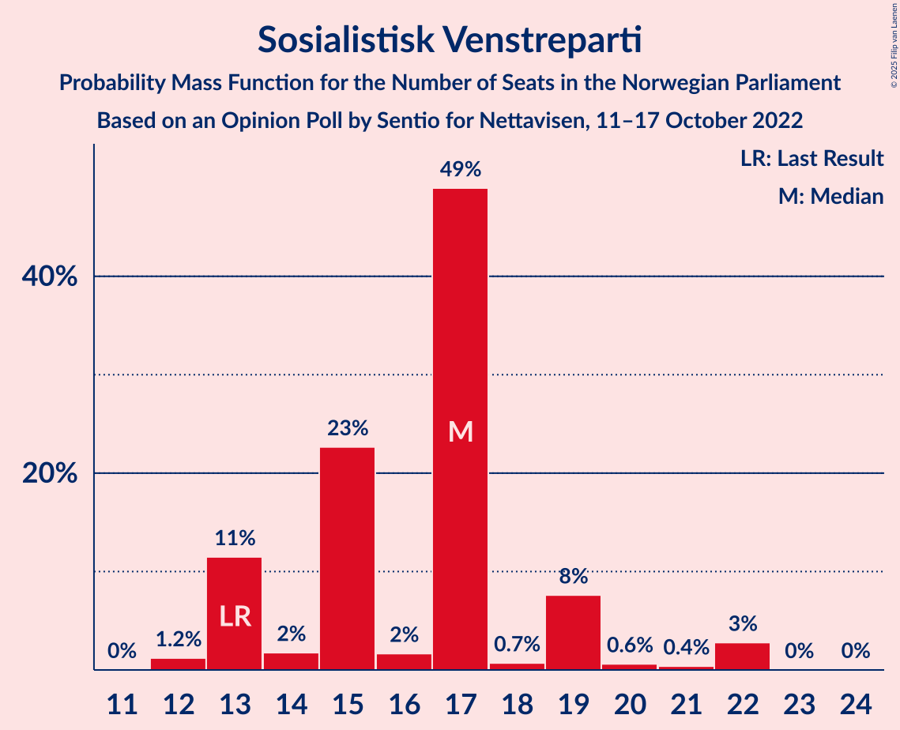

| Number of Seats | Probability | Accumulated | Special Marks |
|:---------------:|:-----------:|:-----------:|:-------------:|
| 11 | 0% | 100% |  |
| 12 | 1.2% | 99.9% |  |
| 13 | 11% | 98.7% | Last Result |
| 14 | 2% | 87% |  |
| 15 | 23% | 85% |  |
| 16 | 2% | 63% |  |
| 17 | 49% | 61% | Median |
| 18 | 0.7% | 12% |  |
| 19 | 8% | 11% |  |
| 20 | 0.6% | 4% |  |
| 21 | 0.4% | 3% |  |
| 22 | 3% | 3% |  |
| 23 | 0% | 0.1% |  |
| 24 | 0% | 0% |  |

### Rødt

*For a full overview of the results for this party, see the [Rødt](party-rødt.html) page.*

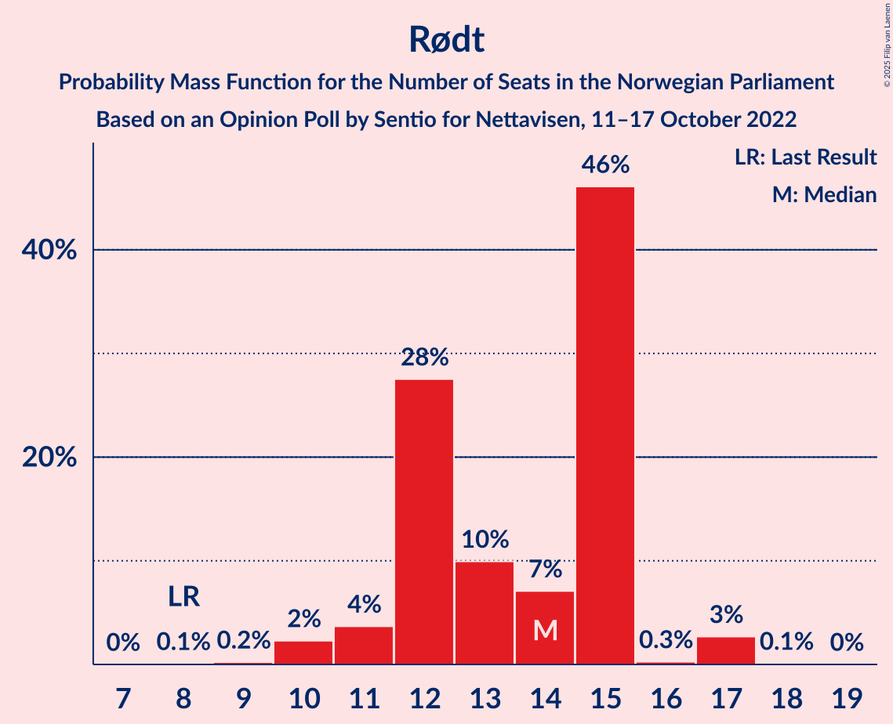

| Number of Seats | Probability | Accumulated | Special Marks |
|:---------------:|:-----------:|:-----------:|:-------------:|
| 8 | 0.1% | 100% | Last Result |
| 9 | 0.2% | 99.9% |  |
| 10 | 2% | 99.7% |  |
| 11 | 4% | 97% |  |
| 12 | 28% | 94% |  |
| 13 | 10% | 66% |  |
| 14 | 7% | 56% | Median |
| 15 | 46% | 49% |  |
| 16 | 0.3% | 3% |  |
| 17 | 3% | 3% |  |
| 18 | 0.1% | 0.1% |  |
| 19 | 0% | 0% |  |

### Senterpartiet

*For a full overview of the results for this party, see the [Senterpartiet](party-senterpartiet.html) page.*

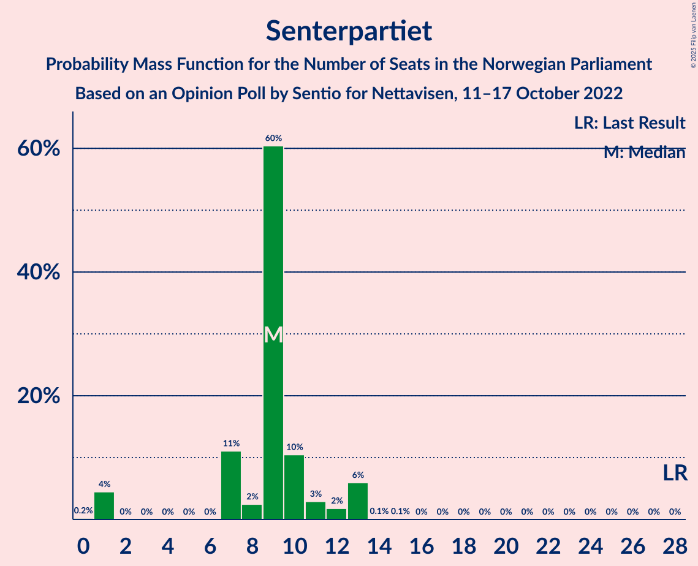

| Number of Seats | Probability | Accumulated | Special Marks |
|:---------------:|:-----------:|:-----------:|:-------------:|
| 0 | 0.2% | 100% |  |
| 1 | 4% | 99.8% |  |
| 2 | 0% | 95% |  |
| 3 | 0% | 95% |  |
| 4 | 0% | 95% |  |
| 5 | 0% | 95% |  |
| 6 | 0% | 95% |  |
| 7 | 11% | 95% |  |
| 8 | 2% | 84% |  |
| 9 | 60% | 82% | Median |
| 10 | 10% | 21% |  |
| 11 | 3% | 11% |  |
| 12 | 2% | 8% |  |
| 13 | 6% | 6% |  |
| 14 | 0.1% | 0.2% |  |
| 15 | 0.1% | 0.1% |  |
| 16 | 0% | 0% |  |
| 17 | 0% | 0% |  |
| 18 | 0% | 0% |  |
| 19 | 0% | 0% |  |
| 20 | 0% | 0% |  |
| 21 | 0% | 0% |  |
| 22 | 0% | 0% |  |
| 23 | 0% | 0% |  |
| 24 | 0% | 0% |  |
| 25 | 0% | 0% |  |
| 26 | 0% | 0% |  |
| 27 | 0% | 0% |  |
| 28 | 0% | 0% | Last Result |

### Venstre

*For a full overview of the results for this party, see the [Venstre](party-venstre.html) page.*

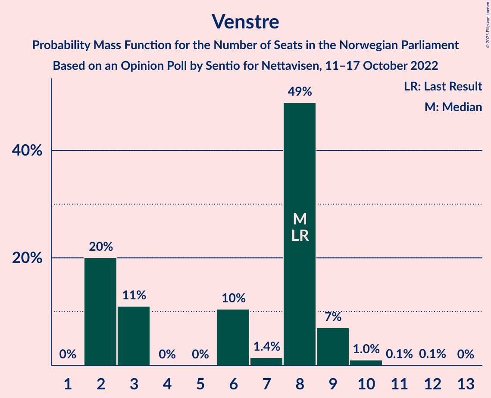

| Number of Seats | Probability | Accumulated | Special Marks |
|:---------------:|:-----------:|:-----------:|:-------------:|
| 2 | 20% | 100% |  |
| 3 | 11% | 80% |  |
| 4 | 0% | 69% |  |
| 5 | 0% | 69% |  |
| 6 | 10% | 69% |  |
| 7 | 1.4% | 58% |  |
| 8 | 49% | 57% | Last Result, Median |
| 9 | 7% | 8% |  |
| 10 | 1.0% | 1.1% |  |
| 11 | 0.1% | 0.2% |  |
| 12 | 0.1% | 0.1% |  |
| 13 | 0% | 0% |  |

### Miljøpartiet De Grønne

*For a full overview of the results for this party, see the [Miljøpartiet De Grønne](party-miljøpartietdegrønne.html) page.*

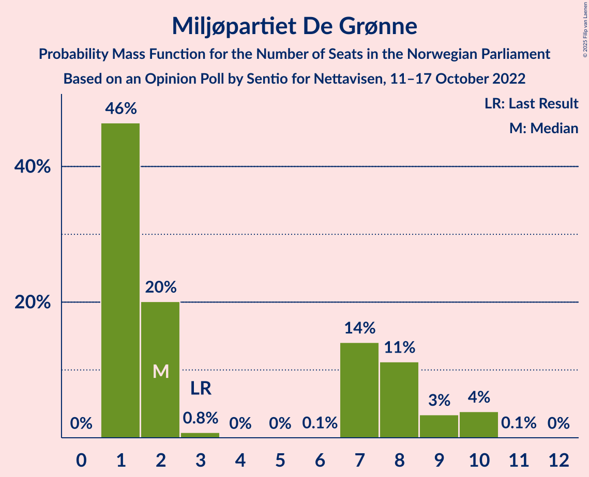

| Number of Seats | Probability | Accumulated | Special Marks |
|:---------------:|:-----------:|:-----------:|:-------------:|
| 1 | 46% | 100% |  |
| 2 | 20% | 54% | Median |
| 3 | 0.8% | 33% | Last Result |
| 4 | 0% | 33% |  |
| 5 | 0% | 33% |  |
| 6 | 0.1% | 33% |  |
| 7 | 14% | 33% |  |
| 8 | 11% | 19% |  |
| 9 | 3% | 7% |  |
| 10 | 4% | 4% |  |
| 11 | 0.1% | 0.1% |  |
| 12 | 0% | 0% |  |

### Kristelig Folkeparti

*For a full overview of the results for this party, see the [Kristelig Folkeparti](party-kristeligfolkeparti.html) page.*

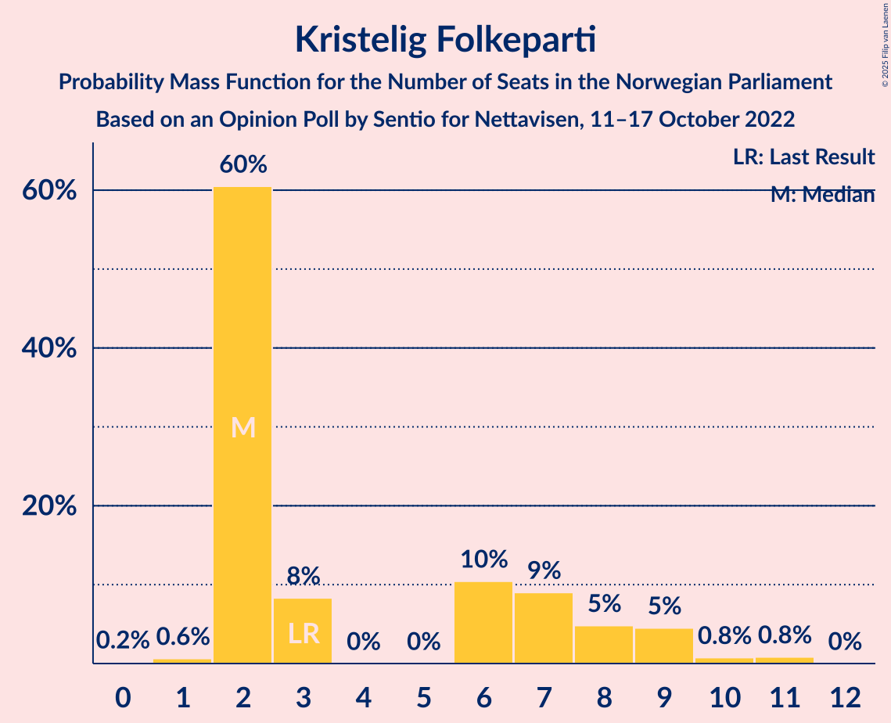

| Number of Seats | Probability | Accumulated | Special Marks |
|:---------------:|:-----------:|:-----------:|:-------------:|
| 0 | 0.2% | 100% |  |
| 1 | 0.6% | 99.8% |  |
| 2 | 60% | 99.2% | Median |
| 3 | 8% | 39% | Last Result |
| 4 | 0% | 30% |  |
| 5 | 0% | 30% |  |
| 6 | 10% | 30% |  |
| 7 | 9% | 20% |  |
| 8 | 5% | 11% |  |
| 9 | 5% | 6% |  |
| 10 | 0.8% | 2% |  |
| 11 | 0.8% | 0.8% |  |
| 12 | 0% | 0% |  |

### Industri- og Næringspartiet

*For a full overview of the results for this party, see the [Industri- og Næringspartiet](party-industri-ognæringspartiet.html) page.*

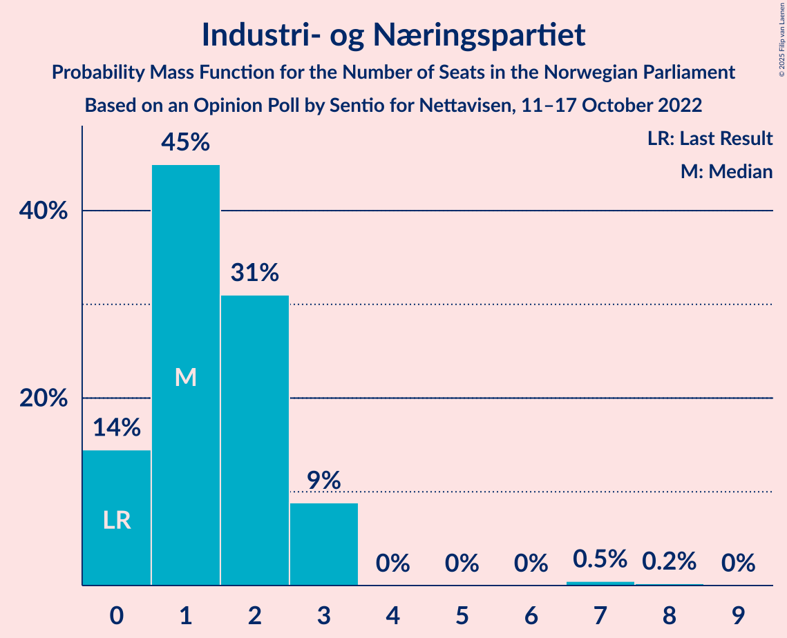

| Number of Seats | Probability | Accumulated | Special Marks |
|:---------------:|:-----------:|:-----------:|:-------------:|
| 0 | 14% | 100% | Last Result |
| 1 | 45% | 86% | Median |
| 2 | 31% | 41% |  |
| 3 | 9% | 10% |  |
| 4 | 0% | 0.7% |  |
| 5 | 0% | 0.7% |  |
| 6 | 0% | 0.7% |  |
| 7 | 0.5% | 0.7% |  |
| 8 | 0.2% | 0.2% |  |
| 9 | 0% | 0% |  |

### Pensjonistpartiet

*For a full overview of the results for this party, see the [Pensjonistpartiet](party-pensjonistpartiet.html) page.*

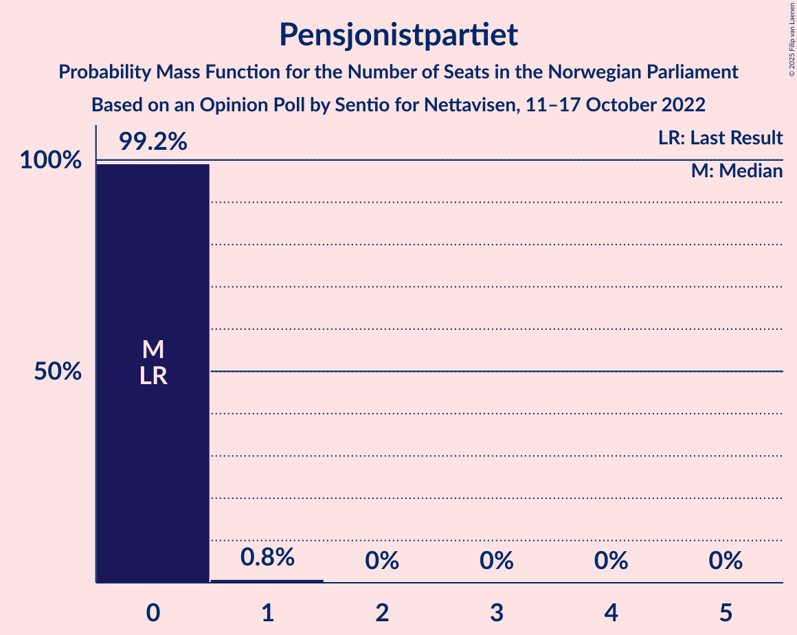

| Number of Seats | Probability | Accumulated | Special Marks |
|:---------------:|:-----------:|:-----------:|:-------------:|
| 0 | 99.2% | 100% | Last Result, Median |
| 1 | 0.8% | 0.8% |  |
| 2 | 0% | 0% |  |

### Norgesdemokratene

*For a full overview of the results for this party, see the [Norgesdemokratene](party-norgesdemokratene.html) page.*

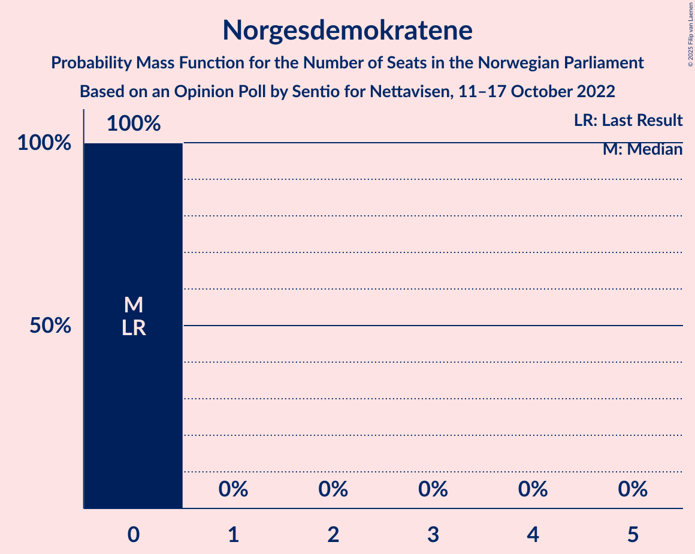

| Number of Seats | Probability | Accumulated | Special Marks |
|:---------------:|:-----------:|:-----------:|:-------------:|
| 0 | 100% | 100% | Last Result, Median |

### Liberalistene

*For a full overview of the results for this party, see the [Liberalistene](party-liberalistene.html) page.*

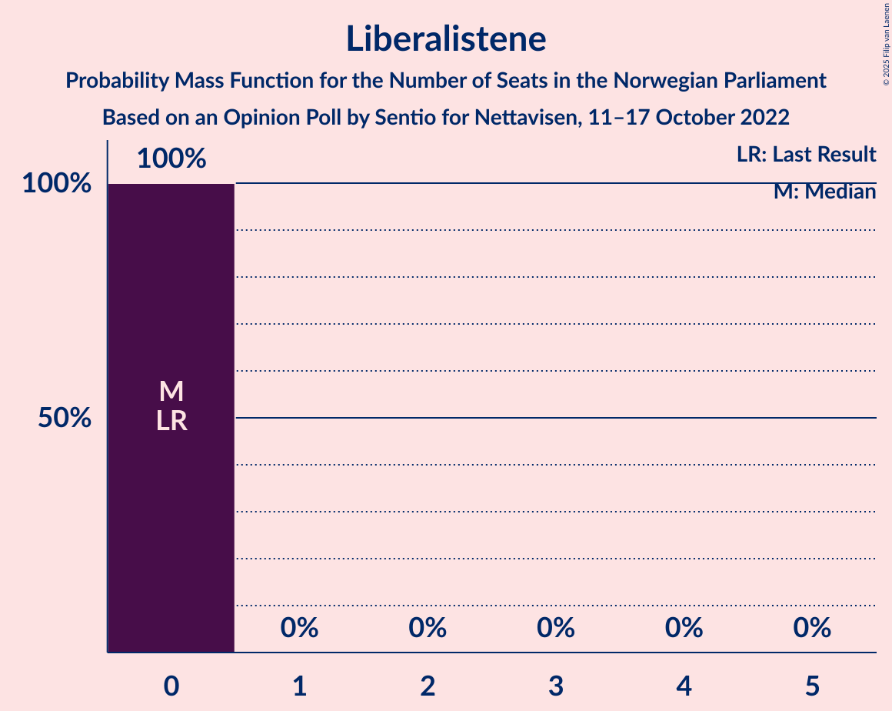

| Number of Seats | Probability | Accumulated | Special Marks |
|:---------------:|:-----------:|:-----------:|:-------------:|
| 0 | 100% | 100% | Last Result, Median |

### Konservativt

*For a full overview of the results for this party, see the [Konservativt](party-konservativt.html) page.*

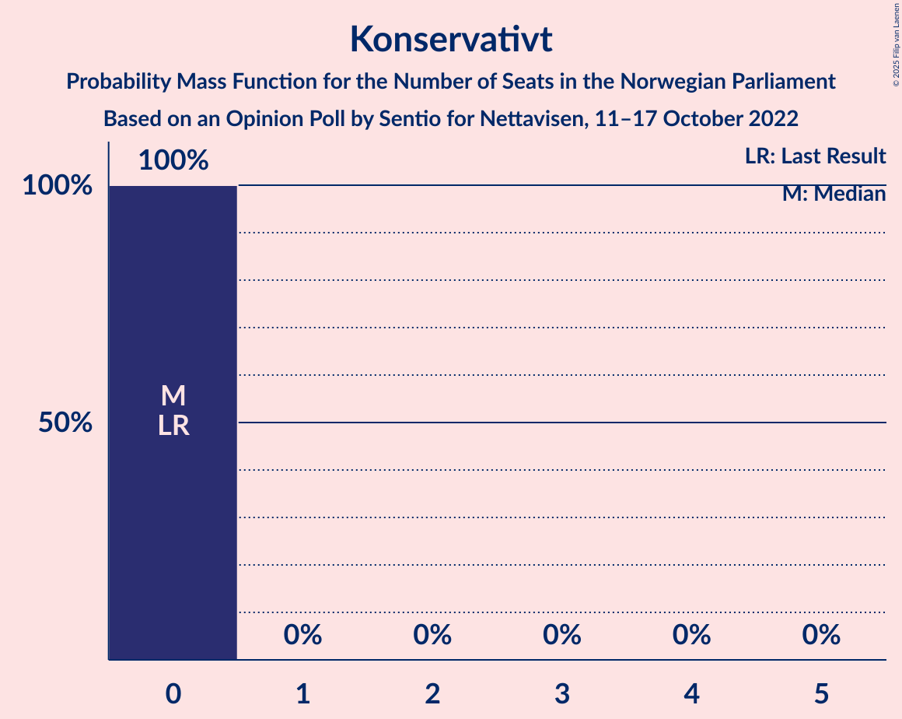

| Number of Seats | Probability | Accumulated | Special Marks |
|:---------------:|:-----------:|:-----------:|:-------------:|
| 0 | 100% | 100% | Last Result, Median |

## Coalitions

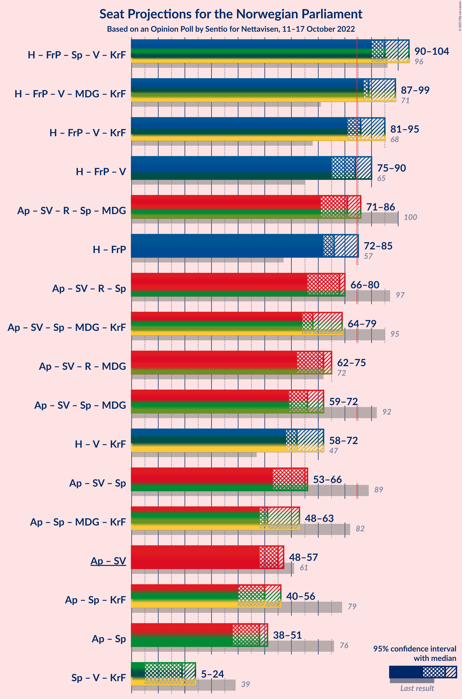

### Confidence Intervals

| Coalition | Last Result | Median | Majority? | 80% Confidence Interval | 90% Confidence Interval | 95% Confidence Interval | 99% Confidence Interval |
|:---------:|:-----------:|:------:|:---------:|:-----------------------:|:-----------------------:|:-----------------------:|:-----------------------:|
| Høyre – Fremskrittspartiet – Senterpartiet – Venstre – Kristelig Folkeparti | 96 | 95 | 100% | 94–101 | 90–103 | 90–104 | 90–105 |
| Høyre – Fremskrittspartiet – Venstre – Miljøpartiet De Grønne – Kristelig Folkeparti | 71 | 89 | 99.6% | 87–97 | 87–98 | 87–99 | 86–101 |
| Høyre – Fremskrittspartiet – Venstre – Kristelig Folkeparti | 68 | 86 | 95% | 85–90 | 84–94 | 81–95 | 79–95 |
| Høyre – Fremskrittspartiet – Venstre | 65 | 84 | 21% | 79–86 | 78–88 | 75–90 | 74–91 |
| Arbeiderpartiet – Sosialistisk Venstreparti – Rødt – Senterpartiet – Miljøpartiet De Grønne | 100 | 81 | 3% | 76–81 | 73–82 | 71–86 | 71–87 |
| Høyre – Fremskrittspartiet | 57 | 76 | 5% | 75–83 | 74–84 | 72–85 | 71–86 |
| Arbeiderpartiet – Sosialistisk Venstreparti – Rødt – Senterpartiet | 97 | 78 | 0.2% | 69–80 | 69–80 | 66–80 | 66–82 |
| Arbeiderpartiet – Sosialistisk Venstreparti – Senterpartiet – Miljøpartiet De Grønne – Kristelig Folkeparti | 95 | 68 | 0% | 68–74 | 65–75 | 64–79 | 61–79 |
| Arbeiderpartiet – Sosialistisk Venstreparti – Rødt – Miljøpartiet De Grønne | 72 | 72 | 0% | 66–72 | 64–75 | 62–75 | 61–78 |
| Arbeiderpartiet – Sosialistisk Venstreparti – Senterpartiet – Miljøpartiet De Grønne | 92 | 66 | 0% | 63–68 | 61–69 | 59–72 | 57–74 |
| Høyre – Venstre – Kristelig Folkeparti | 47 | 62 | 0% | 60–65 | 59–69 | 58–72 | 55–72 |
| Arbeiderpartiet – Sosialistisk Venstreparti – Senterpartiet | 89 | 65 | 0% | 57–65 | 56–66 | 53–66 | 53–67 |
| Arbeiderpartiet – Senterpartiet – Miljøpartiet De Grønne – Kristelig Folkeparti | 82 | 51 | 0% | 50–57 | 49–57 | 48–63 | 46–64 |
| Arbeiderpartiet – Sosialistisk Venstreparti | 61 | 55 | 0% | 49–56 | 49–56 | 48–57 | 45–58 |
| Arbeiderpartiet – Senterpartiet – Kristelig Folkeparti | 79 | 50 | 0% | 46–54 | 45–54 | 40–56 | 40–61 |
| Arbeiderpartiet – Senterpartiet | 76 | 48 | 0% | 40–48 | 39–51 | 38–51 | 37–53 |
| Senterpartiet – Venstre – Kristelig Folkeparti | 39 | 19 | 0% | 18–21 | 13–23 | 5–24 | 5–28 |

### Høyre – Fremskrittspartiet – Senterpartiet – Venstre – Kristelig Folkeparti

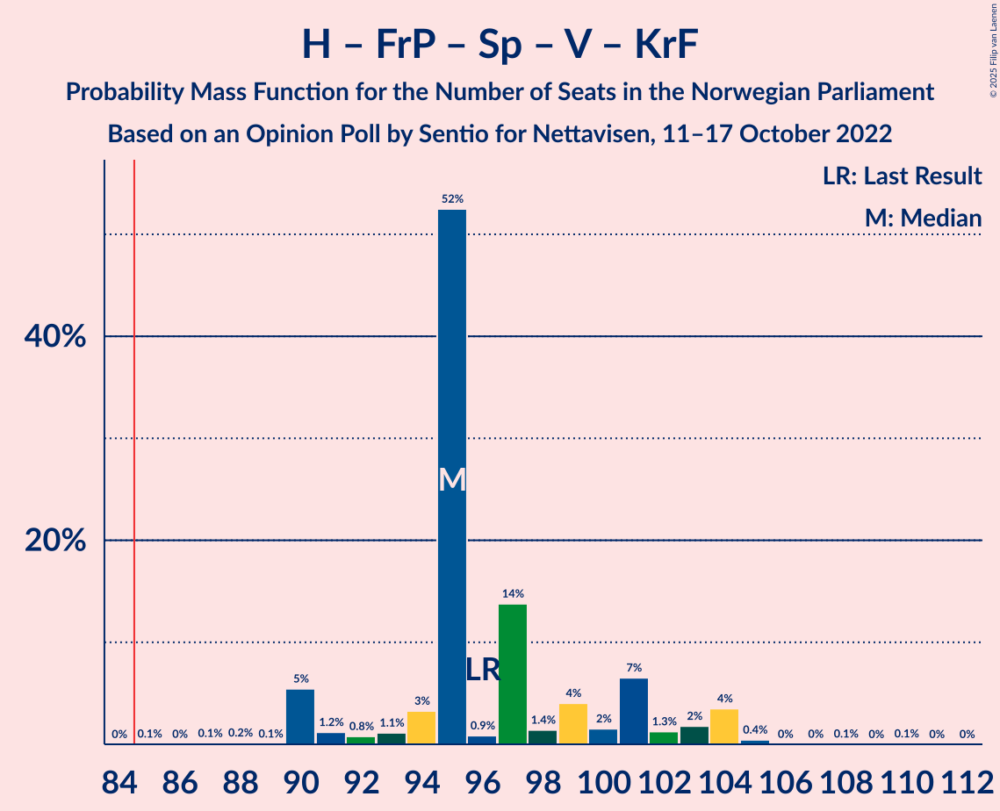

| Number of Seats | Probability | Accumulated | Special Marks |
|:---------------:|:-----------:|:-----------:|:-------------:|
| 85 | 0.1% | 100% | Majority |
| 86 | 0% | 99.9% |  |
| 87 | 0.1% | 99.9% |  |
| 88 | 0.2% | 99.8% |  |
| 89 | 0.1% | 99.7% |  |
| 90 | 5% | 99.6% |  |
| 91 | 1.2% | 94% |  |
| 92 | 0.8% | 93% |  |
| 93 | 1.1% | 92% |  |
| 94 | 3% | 91% |  |
| 95 | 52% | 88% | Median |
| 96 | 0.9% | 35% | Last Result |
| 97 | 14% | 34% |  |
| 98 | 1.4% | 21% |  |
| 99 | 4% | 19% |  |
| 100 | 2% | 15% |  |
| 101 | 7% | 14% |  |
| 102 | 1.3% | 7% |  |
| 103 | 2% | 6% |  |
| 104 | 4% | 4% |  |
| 105 | 0.4% | 0.6% |  |
| 106 | 0% | 0.2% |  |
| 107 | 0% | 0.2% |  |
| 108 | 0.1% | 0.1% |  |
| 109 | 0% | 0.1% |  |
| 110 | 0.1% | 0.1% |  |
| 111 | 0% | 0% |  |

### Høyre – Fremskrittspartiet – Venstre – Miljøpartiet De Grønne – Kristelig Folkeparti

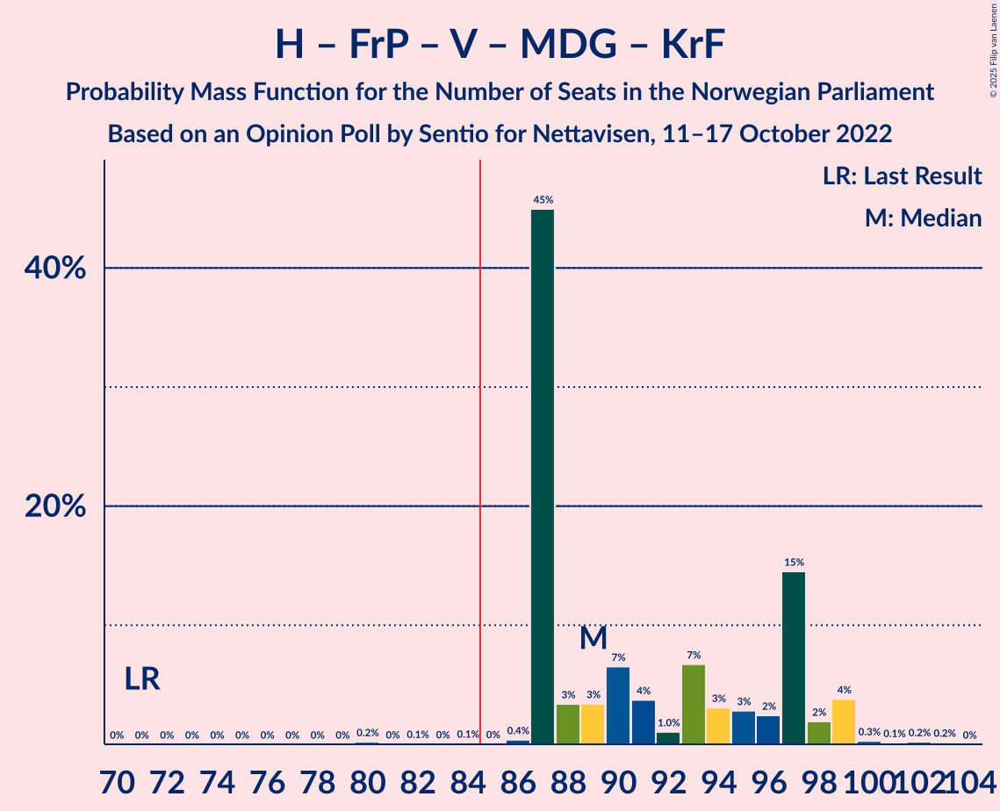

| Number of Seats | Probability | Accumulated | Special Marks |
|:---------------:|:-----------:|:-----------:|:-------------:|
| 71 | 0% | 100% | Last Result |
| 72 | 0% | 100% |  |
| 73 | 0% | 100% |  |
| 74 | 0% | 100% |  |
| 75 | 0% | 100% |  |
| 76 | 0% | 100% |  |
| 77 | 0% | 100% |  |
| 78 | 0% | 100% |  |
| 79 | 0% | 100% |  |
| 80 | 0.2% | 100% |  |
| 81 | 0% | 99.8% |  |
| 82 | 0.1% | 99.8% |  |
| 83 | 0% | 99.7% |  |
| 84 | 0.1% | 99.7% |  |
| 85 | 0% | 99.6% | Majority |
| 86 | 0.4% | 99.6% |  |
| 87 | 45% | 99.2% |  |
| 88 | 3% | 54% | Median |
| 89 | 3% | 51% |  |
| 90 | 7% | 47% |  |
| 91 | 4% | 41% |  |
| 92 | 1.0% | 37% |  |
| 93 | 7% | 36% |  |
| 94 | 3% | 29% |  |
| 95 | 3% | 26% |  |
| 96 | 2% | 23% |  |
| 97 | 15% | 21% |  |
| 98 | 2% | 7% |  |
| 99 | 4% | 5% |  |
| 100 | 0.3% | 0.8% |  |
| 101 | 0.1% | 0.5% |  |
| 102 | 0.2% | 0.4% |  |
| 103 | 0.2% | 0.2% |  |
| 104 | 0% | 0% |  |

### Høyre – Fremskrittspartiet – Venstre – Kristelig Folkeparti

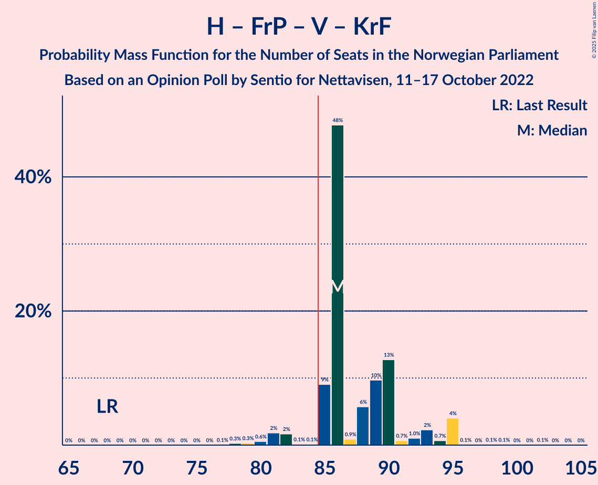

| Number of Seats | Probability | Accumulated | Special Marks |
|:---------------:|:-----------:|:-----------:|:-------------:|
| 68 | 0% | 100% | Last Result |
| 69 | 0% | 100% |  |
| 70 | 0% | 100% |  |
| 71 | 0% | 100% |  |
| 72 | 0% | 100% |  |
| 73 | 0% | 100% |  |
| 74 | 0% | 100% |  |
| 75 | 0% | 100% |  |
| 76 | 0% | 100% |  |
| 77 | 0.1% | 100% |  |
| 78 | 0.3% | 99.9% |  |
| 79 | 0.3% | 99.7% |  |
| 80 | 0.6% | 99.3% |  |
| 81 | 2% | 98.8% |  |
| 82 | 2% | 97% |  |
| 83 | 0.1% | 95% |  |
| 84 | 0.1% | 95% |  |
| 85 | 9% | 95% | Majority |
| 86 | 48% | 86% | Median |
| 87 | 0.9% | 38% |  |
| 88 | 6% | 37% |  |
| 89 | 10% | 32% |  |
| 90 | 13% | 22% |  |
| 91 | 0.7% | 9% |  |
| 92 | 1.0% | 8% |  |
| 93 | 2% | 7% |  |
| 94 | 0.7% | 5% |  |
| 95 | 4% | 4% |  |
| 96 | 0.1% | 0.3% |  |
| 97 | 0% | 0.2% |  |
| 98 | 0.1% | 0.2% |  |
| 99 | 0.1% | 0.2% |  |
| 100 | 0% | 0.1% |  |
| 101 | 0% | 0.1% |  |
| 102 | 0.1% | 0.1% |  |
| 103 | 0% | 0% |  |

### Høyre – Fremskrittspartiet – Venstre

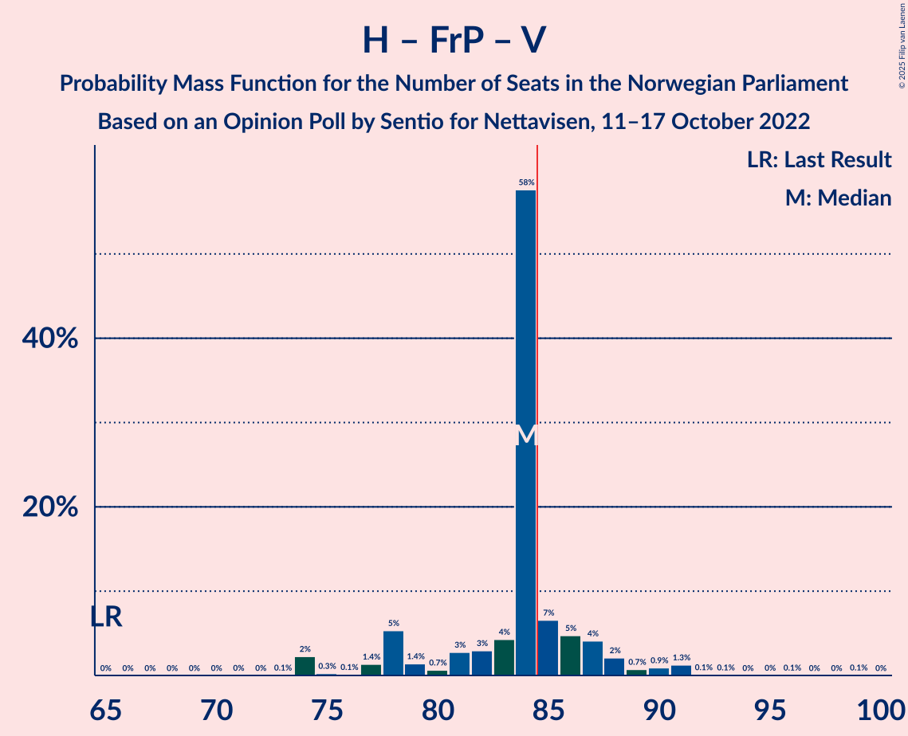

| Number of Seats | Probability | Accumulated | Special Marks |
|:---------------:|:-----------:|:-----------:|:-------------:|
| 65 | 0% | 100% | Last Result |
| 66 | 0% | 100% |  |
| 67 | 0% | 100% |  |
| 68 | 0% | 100% |  |
| 69 | 0% | 100% |  |
| 70 | 0% | 100% |  |
| 71 | 0% | 100% |  |
| 72 | 0% | 100% |  |
| 73 | 0.1% | 100% |  |
| 74 | 2% | 99.9% |  |
| 75 | 0.3% | 98% |  |
| 76 | 0.1% | 97% |  |
| 77 | 1.4% | 97% |  |
| 78 | 5% | 96% |  |
| 79 | 1.4% | 91% |  |
| 80 | 0.7% | 89% |  |
| 81 | 3% | 88% |  |
| 82 | 3% | 86% |  |
| 83 | 4% | 83% |  |
| 84 | 58% | 78% | Median |
| 85 | 7% | 21% | Majority |
| 86 | 5% | 14% |  |
| 87 | 4% | 9% |  |
| 88 | 2% | 5% |  |
| 89 | 0.7% | 3% |  |
| 90 | 0.9% | 3% |  |
| 91 | 1.3% | 2% |  |
| 92 | 0.1% | 0.3% |  |
| 93 | 0.1% | 0.2% |  |
| 94 | 0% | 0.2% |  |
| 95 | 0% | 0.2% |  |
| 96 | 0.1% | 0.1% |  |
| 97 | 0% | 0.1% |  |
| 98 | 0% | 0.1% |  |
| 99 | 0.1% | 0.1% |  |
| 100 | 0% | 0% |  |

### Arbeiderpartiet – Sosialistisk Venstreparti – Rødt – Senterpartiet – Miljøpartiet De Grønne

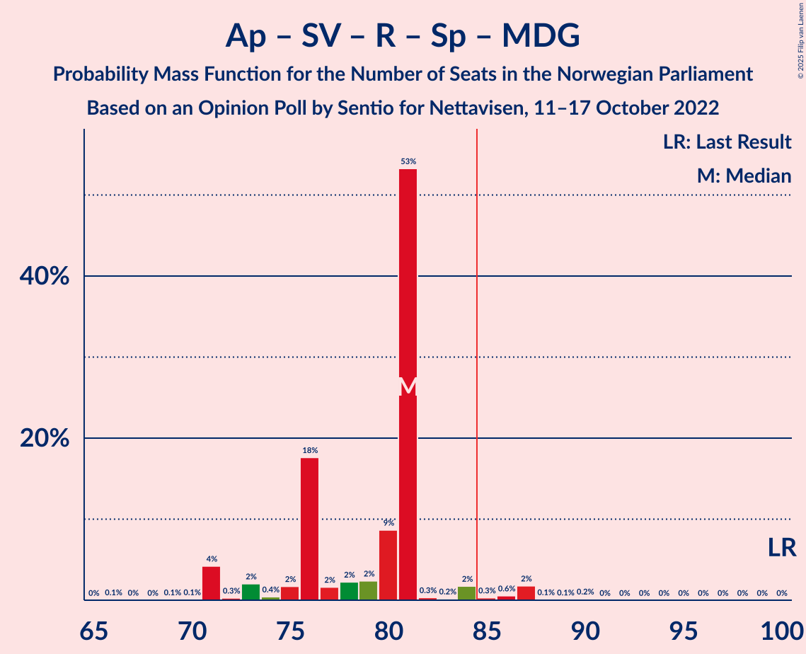

| Number of Seats | Probability | Accumulated | Special Marks |
|:---------------:|:-----------:|:-----------:|:-------------:|
| 66 | 0.1% | 100% |  |
| 67 | 0% | 99.9% |  |
| 68 | 0% | 99.9% |  |
| 69 | 0.1% | 99.9% |  |
| 70 | 0.1% | 99.8% |  |
| 71 | 4% | 99.7% |  |
| 72 | 0.3% | 96% |  |
| 73 | 2% | 95% |  |
| 74 | 0.4% | 93% |  |
| 75 | 2% | 93% |  |
| 76 | 18% | 91% |  |
| 77 | 2% | 73% |  |
| 78 | 2% | 72% |  |
| 79 | 2% | 70% |  |
| 80 | 9% | 67% | Median |
| 81 | 53% | 58% |  |
| 82 | 0.3% | 5% |  |
| 83 | 0.2% | 5% |  |
| 84 | 2% | 5% |  |
| 85 | 0.3% | 3% | Majority |
| 86 | 0.6% | 3% |  |
| 87 | 2% | 2% |  |
| 88 | 0.1% | 0.3% |  |
| 89 | 0.1% | 0.2% |  |
| 90 | 0.2% | 0.2% |  |
| 91 | 0% | 0% |  |
| 92 | 0% | 0% |  |
| 93 | 0% | 0% |  |
| 94 | 0% | 0% |  |
| 95 | 0% | 0% |  |
| 96 | 0% | 0% |  |
| 97 | 0% | 0% |  |
| 98 | 0% | 0% |  |
| 99 | 0% | 0% |  |
| 100 | 0% | 0% | Last Result |

### Høyre – Fremskrittspartiet

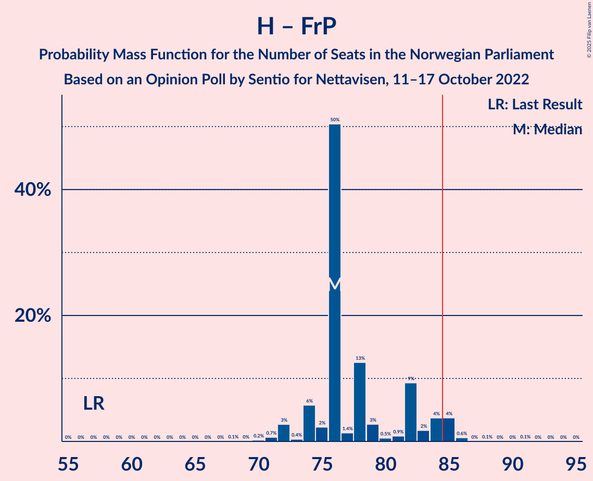

| Number of Seats | Probability | Accumulated | Special Marks |
|:---------------:|:-----------:|:-----------:|:-------------:|
| 57 | 0% | 100% | Last Result |
| 58 | 0% | 100% |  |
| 59 | 0% | 100% |  |
| 60 | 0% | 100% |  |
| 61 | 0% | 100% |  |
| 62 | 0% | 100% |  |
| 63 | 0% | 100% |  |
| 64 | 0% | 100% |  |
| 65 | 0% | 100% |  |
| 66 | 0% | 100% |  |
| 67 | 0% | 100% |  |
| 68 | 0.1% | 100% |  |
| 69 | 0% | 99.9% |  |
| 70 | 0.2% | 99.9% |  |
| 71 | 0.7% | 99.7% |  |
| 72 | 3% | 99.0% |  |
| 73 | 0.4% | 96% |  |
| 74 | 6% | 96% |  |
| 75 | 2% | 90% |  |
| 76 | 50% | 88% | Median |
| 77 | 1.4% | 37% |  |
| 78 | 13% | 36% |  |
| 79 | 3% | 23% |  |
| 80 | 0.5% | 21% |  |
| 81 | 0.9% | 20% |  |
| 82 | 9% | 19% |  |
| 83 | 2% | 10% |  |
| 84 | 4% | 8% |  |
| 85 | 4% | 5% | Majority |
| 86 | 0.6% | 0.8% |  |
| 87 | 0% | 0.2% |  |
| 88 | 0.1% | 0.1% |  |
| 89 | 0% | 0.1% |  |
| 90 | 0% | 0.1% |  |
| 91 | 0.1% | 0.1% |  |
| 92 | 0% | 0% |  |

### Arbeiderpartiet – Sosialistisk Venstreparti – Rødt – Senterpartiet

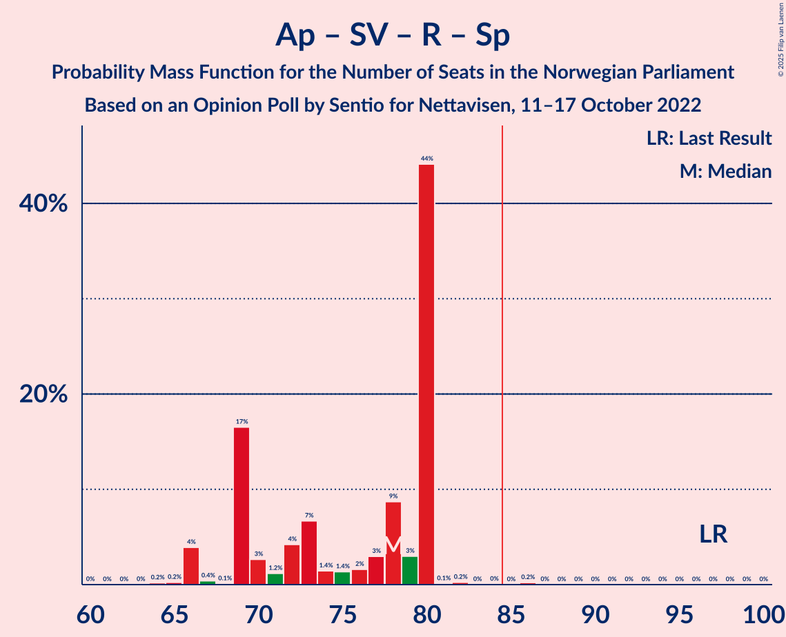

| Number of Seats | Probability | Accumulated | Special Marks |
|:---------------:|:-----------:|:-----------:|:-------------:|
| 63 | 0% | 100% |  |
| 64 | 0.2% | 99.9% |  |
| 65 | 0.2% | 99.8% |  |
| 66 | 4% | 99.5% |  |
| 67 | 0.4% | 96% |  |
| 68 | 0.1% | 95% |  |
| 69 | 17% | 95% |  |
| 70 | 3% | 79% |  |
| 71 | 1.2% | 76% |  |
| 72 | 4% | 75% |  |
| 73 | 7% | 71% |  |
| 74 | 1.4% | 64% |  |
| 75 | 1.4% | 62% |  |
| 76 | 2% | 61% |  |
| 77 | 3% | 59% |  |
| 78 | 9% | 56% | Median |
| 79 | 3% | 48% |  |
| 80 | 44% | 45% |  |
| 81 | 0.1% | 0.7% |  |
| 82 | 0.2% | 0.5% |  |
| 83 | 0% | 0.3% |  |
| 84 | 0% | 0.3% |  |
| 85 | 0% | 0.2% | Majority |
| 86 | 0.2% | 0.2% |  |
| 87 | 0% | 0% |  |
| 88 | 0% | 0% |  |
| 89 | 0% | 0% |  |
| 90 | 0% | 0% |  |
| 91 | 0% | 0% |  |
| 92 | 0% | 0% |  |
| 93 | 0% | 0% |  |
| 94 | 0% | 0% |  |
| 95 | 0% | 0% |  |
| 96 | 0% | 0% |  |
| 97 | 0% | 0% | Last Result |

### Arbeiderpartiet – Sosialistisk Venstreparti – Senterpartiet – Miljøpartiet De Grønne – Kristelig Folkeparti

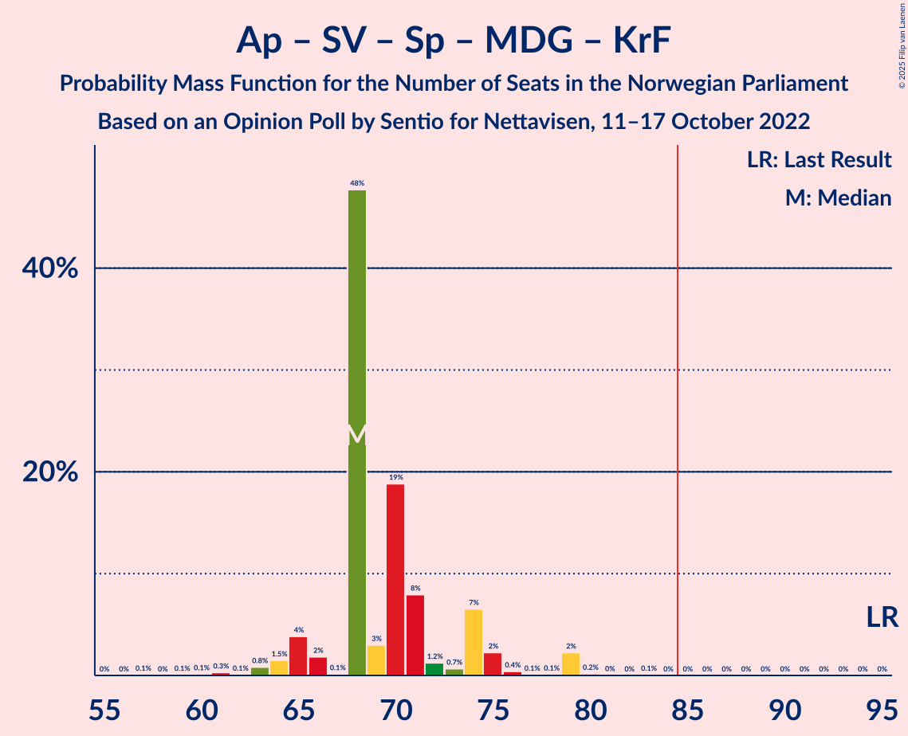

| Number of Seats | Probability | Accumulated | Special Marks |
|:---------------:|:-----------:|:-----------:|:-------------:|
| 57 | 0.1% | 100% |  |
| 58 | 0% | 99.9% |  |
| 59 | 0.1% | 99.9% |  |
| 60 | 0.1% | 99.9% |  |
| 61 | 0.3% | 99.7% |  |
| 62 | 0.1% | 99.4% |  |
| 63 | 0.8% | 99.4% |  |
| 64 | 1.5% | 98.5% |  |
| 65 | 4% | 97% |  |
| 66 | 2% | 93% |  |
| 67 | 0.1% | 91% |  |
| 68 | 48% | 91% | Median |
| 69 | 3% | 44% |  |
| 70 | 19% | 41% |  |
| 71 | 8% | 22% |  |
| 72 | 1.2% | 14% |  |
| 73 | 0.7% | 13% |  |
| 74 | 7% | 12% |  |
| 75 | 2% | 5% |  |
| 76 | 0.4% | 3% |  |
| 77 | 0.1% | 3% |  |
| 78 | 0.1% | 3% |  |
| 79 | 2% | 3% |  |
| 80 | 0.2% | 0.3% |  |
| 81 | 0% | 0.1% |  |
| 82 | 0% | 0.1% |  |
| 83 | 0.1% | 0.1% |  |
| 84 | 0% | 0% |  |
| 85 | 0% | 0% | Majority |
| 86 | 0% | 0% |  |
| 87 | 0% | 0% |  |
| 88 | 0% | 0% |  |
| 89 | 0% | 0% |  |
| 90 | 0% | 0% |  |
| 91 | 0% | 0% |  |
| 92 | 0% | 0% |  |
| 93 | 0% | 0% |  |
| 94 | 0% | 0% |  |
| 95 | 0% | 0% | Last Result |

### Arbeiderpartiet – Sosialistisk Venstreparti – Rødt – Miljøpartiet De Grønne

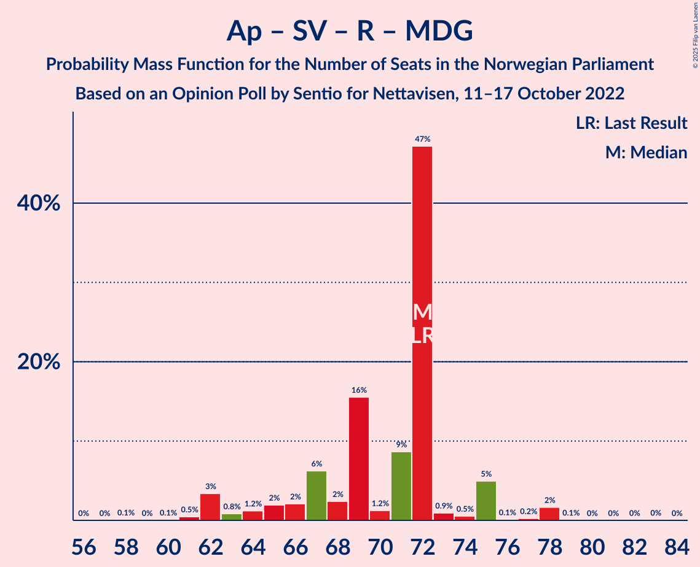

| Number of Seats | Probability | Accumulated | Special Marks |
|:---------------:|:-----------:|:-----------:|:-------------:|
| 58 | 0.1% | 100% |  |
| 59 | 0% | 99.9% |  |
| 60 | 0.1% | 99.9% |  |
| 61 | 0.5% | 99.8% |  |
| 62 | 3% | 99.4% |  |
| 63 | 0.8% | 96% |  |
| 64 | 1.2% | 95% |  |
| 65 | 2% | 94% |  |
| 66 | 2% | 92% |  |
| 67 | 6% | 90% |  |
| 68 | 2% | 84% |  |
| 69 | 16% | 81% |  |
| 70 | 1.2% | 66% |  |
| 71 | 9% | 64% | Median |
| 72 | 47% | 56% | Last Result |
| 73 | 0.9% | 9% |  |
| 74 | 0.5% | 8% |  |
| 75 | 5% | 7% |  |
| 76 | 0.1% | 2% |  |
| 77 | 0.2% | 2% |  |
| 78 | 2% | 2% |  |
| 79 | 0.1% | 0.1% |  |
| 80 | 0% | 0.1% |  |
| 81 | 0% | 0.1% |  |
| 82 | 0% | 0.1% |  |
| 83 | 0% | 0.1% |  |
| 84 | 0% | 0% |  |

### Arbeiderpartiet – Sosialistisk Venstreparti – Senterpartiet – Miljøpartiet De Grønne

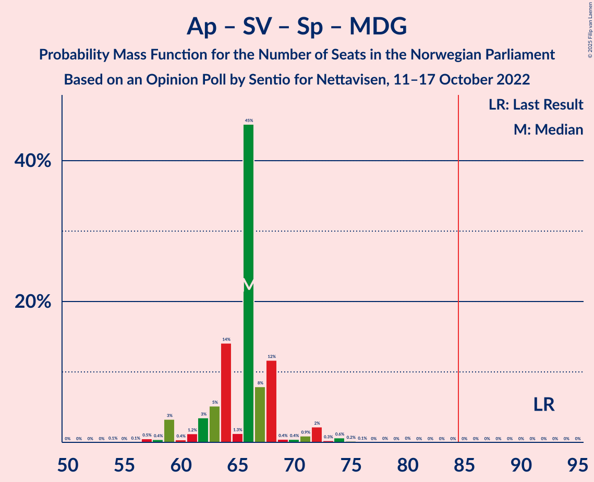

| Number of Seats | Probability | Accumulated | Special Marks |
|:---------------:|:-----------:|:-----------:|:-------------:|
| 54 | 0.1% | 100% |  |
| 55 | 0% | 99.9% |  |
| 56 | 0.1% | 99.9% |  |
| 57 | 0.5% | 99.8% |  |
| 58 | 0.4% | 99.3% |  |
| 59 | 3% | 98.9% |  |
| 60 | 0.4% | 96% |  |
| 61 | 1.2% | 95% |  |
| 62 | 3% | 94% |  |
| 63 | 5% | 91% |  |
| 64 | 14% | 85% |  |
| 65 | 1.3% | 71% |  |
| 66 | 45% | 70% | Median |
| 67 | 8% | 25% |  |
| 68 | 12% | 17% |  |
| 69 | 0.4% | 5% |  |
| 70 | 0.4% | 5% |  |
| 71 | 0.9% | 4% |  |
| 72 | 2% | 3% |  |
| 73 | 0.3% | 1.2% |  |
| 74 | 0.6% | 1.0% |  |
| 75 | 0.2% | 0.3% |  |
| 76 | 0.1% | 0.1% |  |
| 77 | 0% | 0.1% |  |
| 78 | 0% | 0.1% |  |
| 79 | 0% | 0% |  |
| 80 | 0% | 0% |  |
| 81 | 0% | 0% |  |
| 82 | 0% | 0% |  |
| 83 | 0% | 0% |  |
| 84 | 0% | 0% |  |
| 85 | 0% | 0% | Majority |
| 86 | 0% | 0% |  |
| 87 | 0% | 0% |  |
| 88 | 0% | 0% |  |
| 89 | 0% | 0% |  |
| 90 | 0% | 0% |  |
| 91 | 0% | 0% |  |
| 92 | 0% | 0% | Last Result |

### Høyre – Venstre – Kristelig Folkeparti

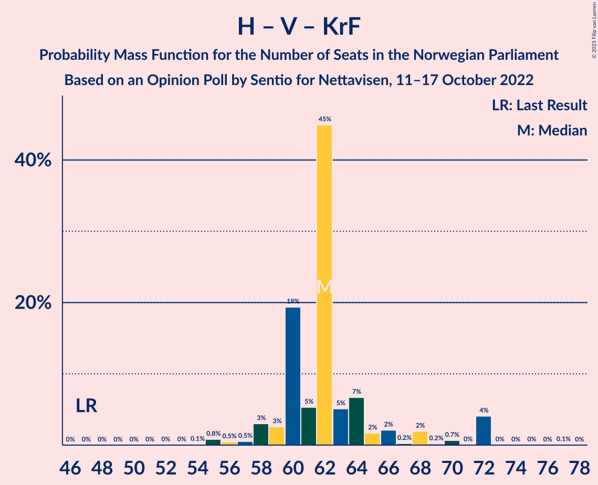

| Number of Seats | Probability | Accumulated | Special Marks |
|:---------------:|:-----------:|:-----------:|:-------------:|
| 47 | 0% | 100% | Last Result |
| 48 | 0% | 100% |  |
| 49 | 0% | 100% |  |
| 50 | 0% | 100% |  |
| 51 | 0% | 100% |  |
| 52 | 0% | 100% |  |
| 53 | 0% | 100% |  |
| 54 | 0.1% | 99.9% |  |
| 55 | 0.8% | 99.8% |  |
| 56 | 0.5% | 99.0% |  |
| 57 | 0.5% | 98.6% |  |
| 58 | 3% | 98% |  |
| 59 | 3% | 95% |  |
| 60 | 19% | 92% |  |
| 61 | 5% | 73% |  |
| 62 | 45% | 68% | Median |
| 63 | 5% | 23% |  |
| 64 | 7% | 18% |  |
| 65 | 2% | 11% |  |
| 66 | 2% | 9% |  |
| 67 | 0.2% | 7% |  |
| 68 | 2% | 7% |  |
| 69 | 0.2% | 5% |  |
| 70 | 0.7% | 5% |  |
| 71 | 0% | 4% |  |
| 72 | 4% | 4% |  |
| 73 | 0% | 0.1% |  |
| 74 | 0% | 0.1% |  |
| 75 | 0% | 0.1% |  |
| 76 | 0% | 0.1% |  |
| 77 | 0.1% | 0.1% |  |
| 78 | 0% | 0% |  |

### Arbeiderpartiet – Sosialistisk Venstreparti – Senterpartiet

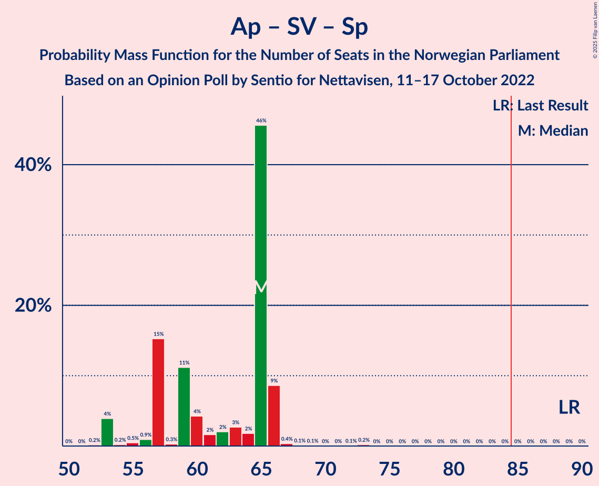

| Number of Seats | Probability | Accumulated | Special Marks |
|:---------------:|:-----------:|:-----------:|:-------------:|
| 52 | 0.2% | 100% |  |
| 53 | 4% | 99.8% |  |
| 54 | 0.2% | 96% |  |
| 55 | 0.5% | 96% |  |
| 56 | 0.9% | 95% |  |
| 57 | 15% | 94% |  |
| 58 | 0.3% | 79% |  |
| 59 | 11% | 79% |  |
| 60 | 4% | 68% |  |
| 61 | 2% | 63% |  |
| 62 | 2% | 62% |  |
| 63 | 3% | 60% |  |
| 64 | 2% | 57% | Median |
| 65 | 46% | 55% |  |
| 66 | 9% | 9% |  |
| 67 | 0.4% | 0.8% |  |
| 68 | 0.1% | 0.5% |  |
| 69 | 0.1% | 0.4% |  |
| 70 | 0% | 0.3% |  |
| 71 | 0% | 0.3% |  |
| 72 | 0.1% | 0.3% |  |
| 73 | 0.2% | 0.2% |  |
| 74 | 0% | 0% |  |
| 75 | 0% | 0% |  |
| 76 | 0% | 0% |  |
| 77 | 0% | 0% |  |
| 78 | 0% | 0% |  |
| 79 | 0% | 0% |  |
| 80 | 0% | 0% |  |
| 81 | 0% | 0% |  |
| 82 | 0% | 0% |  |
| 83 | 0% | 0% |  |
| 84 | 0% | 0% |  |
| 85 | 0% | 0% | Majority |
| 86 | 0% | 0% |  |
| 87 | 0% | 0% |  |
| 88 | 0% | 0% |  |
| 89 | 0% | 0% | Last Result |

### Arbeiderpartiet – Senterpartiet – Miljøpartiet De Grønne – Kristelig Folkeparti

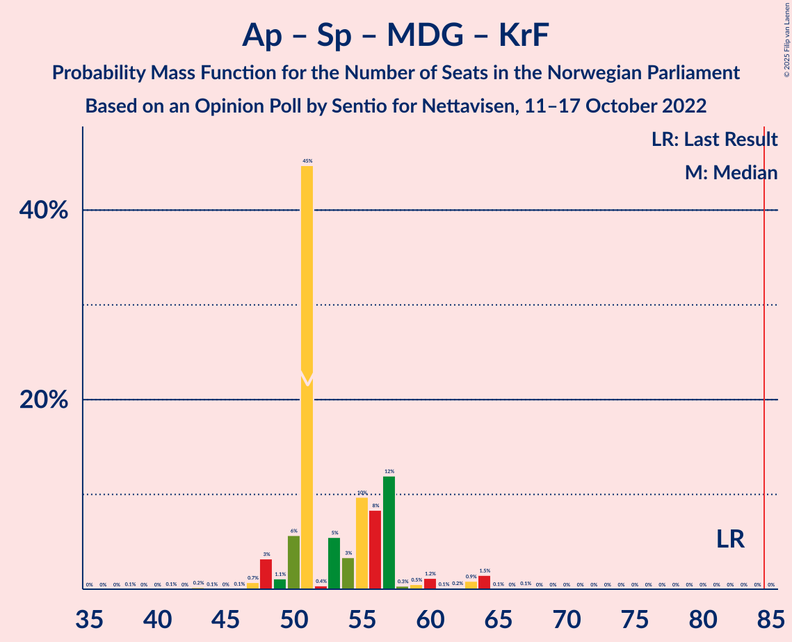

| Number of Seats | Probability | Accumulated | Special Marks |
|:---------------:|:-----------:|:-----------:|:-------------:|
| 38 | 0.1% | 100% |  |
| 39 | 0% | 99.9% |  |
| 40 | 0% | 99.9% |  |
| 41 | 0.1% | 99.9% |  |
| 42 | 0% | 99.9% |  |
| 43 | 0.2% | 99.9% |  |
| 44 | 0.1% | 99.7% |  |
| 45 | 0% | 99.6% |  |
| 46 | 0.1% | 99.6% |  |
| 47 | 0.7% | 99.5% |  |
| 48 | 3% | 98.8% |  |
| 49 | 1.1% | 96% |  |
| 50 | 6% | 94% |  |
| 51 | 45% | 89% | Median |
| 52 | 0.4% | 44% |  |
| 53 | 5% | 44% |  |
| 54 | 3% | 38% |  |
| 55 | 10% | 35% |  |
| 56 | 8% | 25% |  |
| 57 | 12% | 17% |  |
| 58 | 0.3% | 5% |  |
| 59 | 0.5% | 4% |  |
| 60 | 1.2% | 4% |  |
| 61 | 0.1% | 3% |  |
| 62 | 0.2% | 3% |  |
| 63 | 0.9% | 3% |  |
| 64 | 1.5% | 2% |  |
| 65 | 0.1% | 0.2% |  |
| 66 | 0% | 0.2% |  |
| 67 | 0.1% | 0.1% |  |
| 68 | 0% | 0% |  |
| 69 | 0% | 0% |  |
| 70 | 0% | 0% |  |
| 71 | 0% | 0% |  |
| 72 | 0% | 0% |  |
| 73 | 0% | 0% |  |
| 74 | 0% | 0% |  |
| 75 | 0% | 0% |  |
| 76 | 0% | 0% |  |
| 77 | 0% | 0% |  |
| 78 | 0% | 0% |  |
| 79 | 0% | 0% |  |
| 80 | 0% | 0% |  |
| 81 | 0% | 0% |  |
| 82 | 0% | 0% | Last Result |

### Arbeiderpartiet – Sosialistisk Venstreparti

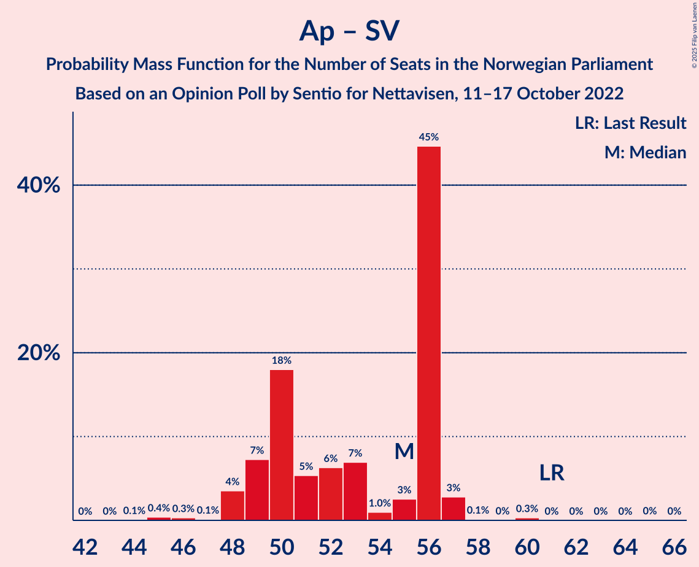

| Number of Seats | Probability | Accumulated | Special Marks |
|:---------------:|:-----------:|:-----------:|:-------------:|
| 44 | 0.1% | 100% |  |
| 45 | 0.4% | 99.9% |  |
| 46 | 0.3% | 99.5% |  |
| 47 | 0.1% | 99.2% |  |
| 48 | 4% | 99.0% |  |
| 49 | 7% | 95% |  |
| 50 | 18% | 88% |  |
| 51 | 5% | 70% |  |
| 52 | 6% | 65% |  |
| 53 | 7% | 59% |  |
| 54 | 1.0% | 52% |  |
| 55 | 3% | 51% | Median |
| 56 | 45% | 48% |  |
| 57 | 3% | 3% |  |
| 58 | 0.1% | 0.6% |  |
| 59 | 0% | 0.5% |  |
| 60 | 0.3% | 0.4% |  |
| 61 | 0% | 0.1% | Last Result |
| 62 | 0% | 0.1% |  |
| 63 | 0% | 0.1% |  |
| 64 | 0% | 0.1% |  |
| 65 | 0% | 0.1% |  |
| 66 | 0% | 0% |  |

### Arbeiderpartiet – Senterpartiet – Kristelig Folkeparti

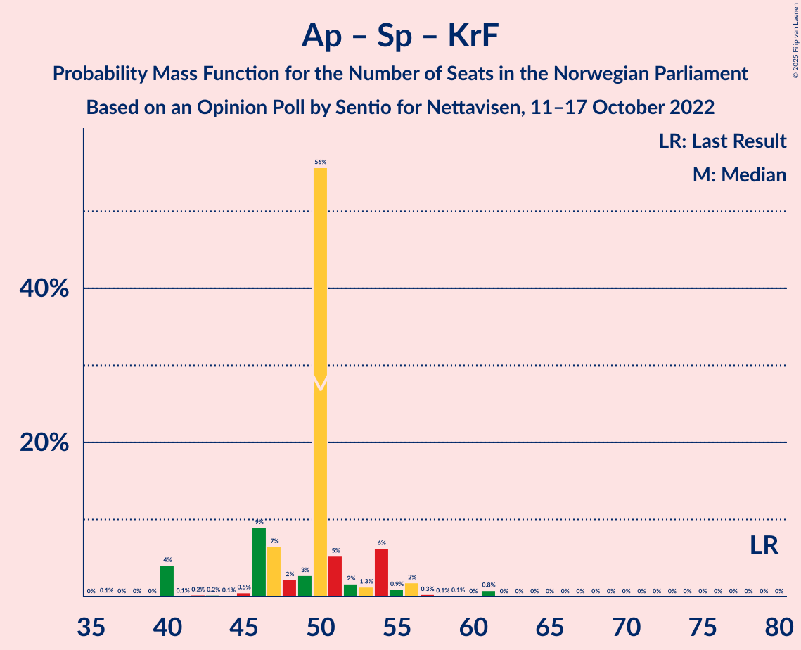

| Number of Seats | Probability | Accumulated | Special Marks |
|:---------------:|:-----------:|:-----------:|:-------------:|
| 36 | 0.1% | 100% |  |
| 37 | 0% | 99.9% |  |
| 38 | 0% | 99.9% |  |
| 39 | 0% | 99.9% |  |
| 40 | 4% | 99.9% |  |
| 41 | 0.1% | 96% |  |
| 42 | 0.2% | 96% |  |
| 43 | 0.2% | 96% |  |
| 44 | 0.1% | 95% |  |
| 45 | 0.5% | 95% |  |
| 46 | 9% | 95% |  |
| 47 | 7% | 86% |  |
| 48 | 2% | 79% |  |
| 49 | 3% | 77% | Median |
| 50 | 56% | 74% |  |
| 51 | 5% | 19% |  |
| 52 | 2% | 13% |  |
| 53 | 1.3% | 12% |  |
| 54 | 6% | 10% |  |
| 55 | 0.9% | 4% |  |
| 56 | 2% | 3% |  |
| 57 | 0.3% | 1.3% |  |
| 58 | 0.1% | 1.0% |  |
| 59 | 0.1% | 1.0% |  |
| 60 | 0% | 0.8% |  |
| 61 | 0.8% | 0.8% |  |
| 62 | 0% | 0% |  |
| 63 | 0% | 0% |  |
| 64 | 0% | 0% |  |
| 65 | 0% | 0% |  |
| 66 | 0% | 0% |  |
| 67 | 0% | 0% |  |
| 68 | 0% | 0% |  |
| 69 | 0% | 0% |  |
| 70 | 0% | 0% |  |
| 71 | 0% | 0% |  |
| 72 | 0% | 0% |  |
| 73 | 0% | 0% |  |
| 74 | 0% | 0% |  |
| 75 | 0% | 0% |  |
| 76 | 0% | 0% |  |
| 77 | 0% | 0% |  |
| 78 | 0% | 0% |  |
| 79 | 0% | 0% | Last Result |

### Arbeiderpartiet – Senterpartiet

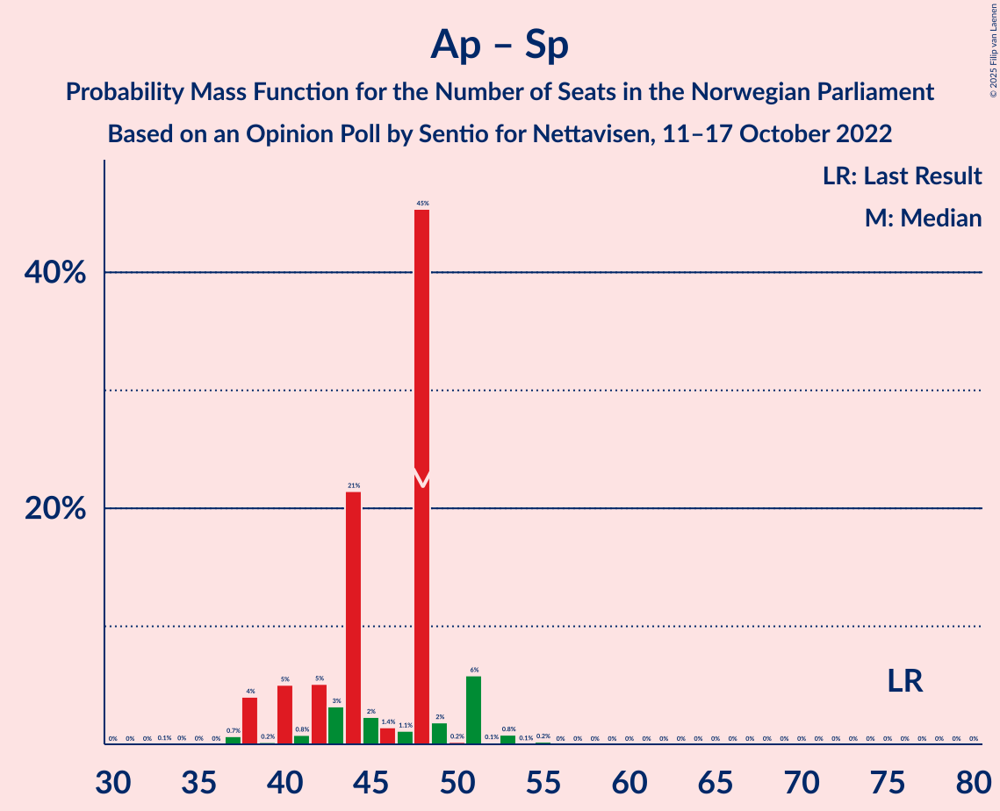

| Number of Seats | Probability | Accumulated | Special Marks |
|:---------------:|:-----------:|:-----------:|:-------------:|
| 33 | 0.1% | 100% |  |
| 34 | 0% | 99.9% |  |
| 35 | 0% | 99.9% |  |
| 36 | 0% | 99.9% |  |
| 37 | 0.7% | 99.8% |  |
| 38 | 4% | 99.2% |  |
| 39 | 0.2% | 95% |  |
| 40 | 5% | 95% |  |
| 41 | 0.8% | 90% |  |
| 42 | 5% | 89% |  |
| 43 | 3% | 84% |  |
| 44 | 21% | 81% |  |
| 45 | 2% | 59% |  |
| 46 | 1.4% | 57% |  |
| 47 | 1.1% | 56% | Median |
| 48 | 45% | 54% |  |
| 49 | 2% | 9% |  |
| 50 | 0.2% | 7% |  |
| 51 | 6% | 7% |  |
| 52 | 0.1% | 1.2% |  |
| 53 | 0.8% | 1.1% |  |
| 54 | 0.1% | 0.3% |  |
| 55 | 0.2% | 0.2% |  |
| 56 | 0% | 0% |  |
| 57 | 0% | 0% |  |
| 58 | 0% | 0% |  |
| 59 | 0% | 0% |  |
| 60 | 0% | 0% |  |
| 61 | 0% | 0% |  |
| 62 | 0% | 0% |  |
| 63 | 0% | 0% |  |
| 64 | 0% | 0% |  |
| 65 | 0% | 0% |  |
| 66 | 0% | 0% |  |
| 67 | 0% | 0% |  |
| 68 | 0% | 0% |  |
| 69 | 0% | 0% |  |
| 70 | 0% | 0% |  |
| 71 | 0% | 0% |  |
| 72 | 0% | 0% |  |
| 73 | 0% | 0% |  |
| 74 | 0% | 0% |  |
| 75 | 0% | 0% |  |
| 76 | 0% | 0% | Last Result |

### Senterpartiet – Venstre – Kristelig Folkeparti

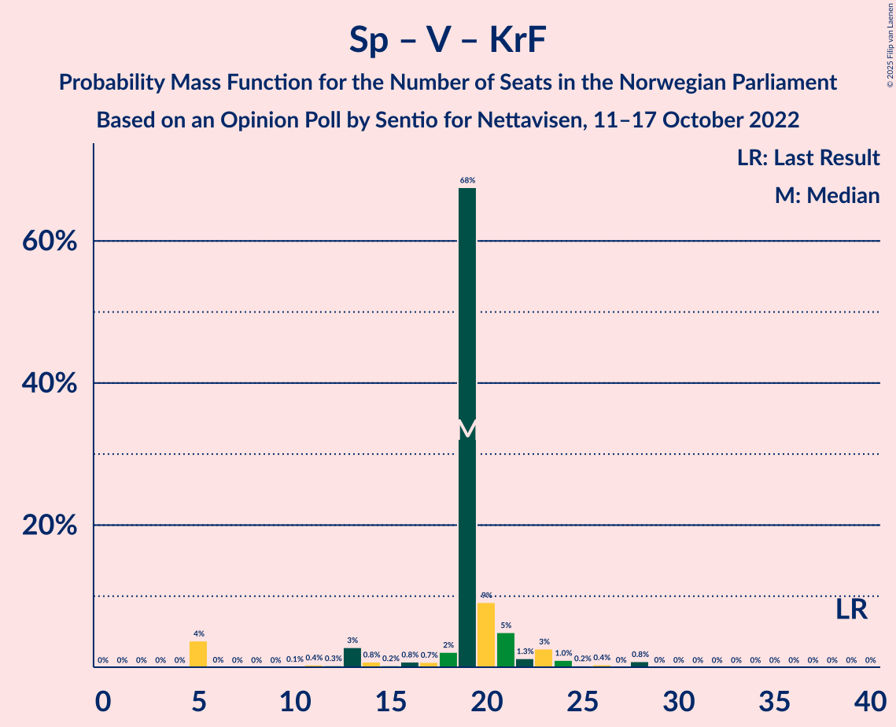

| Number of Seats | Probability | Accumulated | Special Marks |
|:---------------:|:-----------:|:-----------:|:-------------:|
| 5 | 4% | 100% |  |
| 6 | 0% | 96% |  |
| 7 | 0% | 96% |  |
| 8 | 0% | 96% |  |
| 9 | 0% | 96% |  |
| 10 | 0.1% | 96% |  |
| 11 | 0.4% | 96% |  |
| 12 | 0.3% | 96% |  |
| 13 | 3% | 95% |  |
| 14 | 0.8% | 93% |  |
| 15 | 0.2% | 92% |  |
| 16 | 0.8% | 92% |  |
| 17 | 0.7% | 91% |  |
| 18 | 2% | 90% |  |
| 19 | 68% | 88% | Median |
| 20 | 9% | 20% |  |
| 21 | 5% | 11% |  |
| 22 | 1.3% | 6% |  |
| 23 | 3% | 5% |  |
| 24 | 1.0% | 3% |  |
| 25 | 0.2% | 2% |  |
| 26 | 0.4% | 1.3% |  |
| 27 | 0% | 0.9% |  |
| 28 | 0.8% | 0.9% |  |
| 29 | 0% | 0.1% |  |
| 30 | 0% | 0% |  |
| 31 | 0% | 0% |  |
| 32 | 0% | 0% |  |
| 33 | 0% | 0% |  |
| 34 | 0% | 0% |  |
| 35 | 0% | 0% |  |
| 36 | 0% | 0% |  |
| 37 | 0% | 0% |  |
| 38 | 0% | 0% |  |
| 39 | 0% | 0% | Last Result |

## Technical Information

### Opinion Poll

+ **Polling firm:** Sentio
+ **Commissioner(s):** Nettavisen
+ **Fieldwork period:** 11–17 October 2022

### Calculations

+ **Sample size:** 1000
+ **Simulations done:** 1,048,576
+ **Error estimate:** 2.47%

