# Opinion Poll by InFact for Fiskeribladet, 21 October 2022

<a href="#voting-intentions">Voting Intentions</a> | <a href="#seats">Seats</a> | <a href="#coalitions">Coalitions</a> | <a href="#technical-information">Technical Information</a>

## Voting Intentions

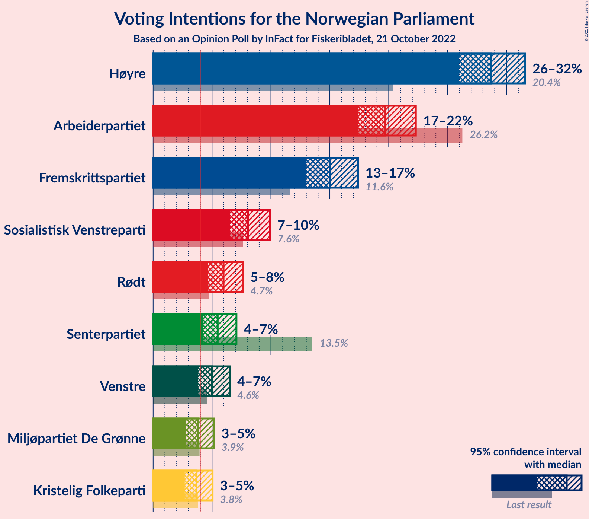

### Confidence Intervals

| Party | Last Result | Poll Result | 80% Confidence Interval | 90% Confidence Interval | 95% Confidence Interval | 99% Confidence Interval |
|:-----:|:-----------:|:-----------:|:-----------------------:|:-----------------------:|:-----------------------:|:-----------------------:|
| Høyre | 20.4% | 28.7% | 26.9–30.6% |26.4–31.1% |26.0–31.6% |25.1–32.5% |
| Arbeiderpartiet | 26.2% | 19.7% | 18.2–21.4% |17.7–21.9% |17.4–22.3% |16.7–23.1% |
| Fremskrittspartiet | 11.6% | 15.0% | 13.7–16.6% |13.3–17.0% |13.0–17.4% |12.3–18.2% |
| Sosialistisk Venstreparti | 7.6% | 8.1% | 7.1–9.3% |6.8–9.6% |6.5–9.9% |6.1–10.5% |
| Rødt | 4.7% | 6.0% | 5.1–7.1% |4.9–7.4% |4.7–7.6% |4.3–8.2% |
| Senterpartiet | 13.5% | 5.5% | 4.6–6.5% |4.4–6.8% |4.2–7.1% |3.9–7.6% |
| Venstre | 4.6% | 5.0% | 4.2–6.0% |4.0–6.3% |3.8–6.5% |3.4–7.0% |
| Miljøpartiet De Grønne | 3.9% | 3.8% | 3.1–4.7% |2.9–4.9% |2.8–5.2% |2.5–5.6% |
| Kristelig Folkeparti | 3.8% | 3.7% | 3.0–4.6% |2.8–4.8% |2.7–5.0% |2.4–5.5% |

*Note:* The poll result column reflects the actual value used in the calculations. Published results may vary slightly, and in addition be rounded to fewer digits.

## Seats

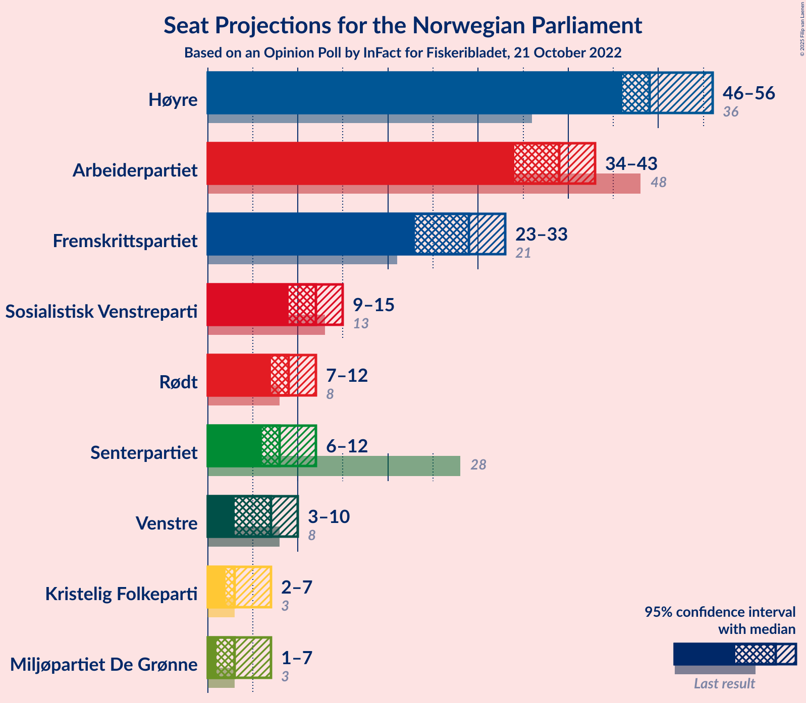

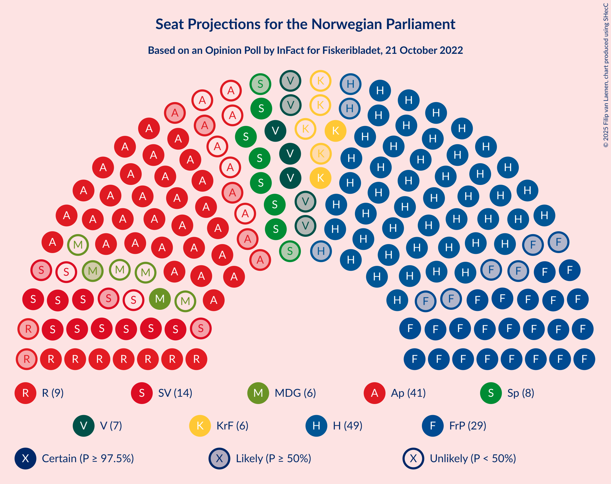

### Confidence Intervals

| Party | Last Result | Median | 80% Confidence Interval | 90% Confidence Interval | 95% Confidence Interval | 99% Confidence Interval |
|:-----:|:-----------:|:------:|:-----------------------:|:-----------------------:|:-----------------------:|:-----------------------:|
| <a href="#høyre">Høyre</a> | 36 | 49 | 48–53 |47–54 |46–56 |44–57 |
| <a href="#arbeiderpartiet">Arbeiderpartiet</a> | 48 | 39 | 35–42 |34–43 |34–43 |32–45 |
| <a href="#fremskrittspartiet">Fremskrittspartiet</a> | 21 | 29 | 26–32 |24–33 |23–33 |21–35 |
| <a href="#sosialistisk-venstreparti">Sosialistisk Venstreparti</a> | 13 | 12 | 10–14 |10–15 |9–15 |8–17 |
| <a href="#rødt">Rødt</a> | 8 | 9 | 7–10 |7–11 |7–12 |6–13 |
| <a href="#senterpartiet">Senterpartiet</a> | 28 | 8 | 7–10 |6–11 |6–12 |1–13 |
| <a href="#venstre">Venstre</a> | 8 | 7 | 6–9 |3–9 |3–10 |2–11 |
| <a href="#miljøpartiet-de-grønne">Miljøpartiet De Grønne</a> | 3 | 3 | 2–7 |1–7 |1–7 |1–8 |
| <a href="#kristelig-folkeparti">Kristelig Folkeparti</a> | 3 | 3 | 2–7 |2–7 |2–7 |1–8 |

### Høyre

*For a full overview of the results for this party, see the [Høyre](party-høyre.html) page.*

| Number of Seats | Probability | Accumulated | Special Marks |
|:---------------:|:-----------:|:-----------:|:-------------:|
| 36 | 0% | 100% | Last Result |
| 37 | 0% | 100% |  |
| 38 | 0% | 100% |  |
| 39 | 0% | 100% |  |
| 40 | 0% | 100% |  |
| 41 | 0% | 100% |  |
| 42 | 0% | 99.9% |  |
| 43 | 0.1% | 99.9% |  |
| 44 | 0.4% | 99.8% |  |
| 45 | 0.6% | 99.5% |  |
| 46 | 3% | 98.9% |  |
| 47 | 6% | 96% |  |
| 48 | 9% | 90% |  |
| 49 | 34% | 81% | Median |
| 50 | 18% | 47% |  |
| 51 | 9% | 29% |  |
| 52 | 6% | 20% |  |
| 53 | 6% | 14% |  |
| 54 | 4% | 9% |  |
| 55 | 2% | 5% |  |
| 56 | 2% | 3% |  |
| 57 | 0.4% | 0.9% |  |
| 58 | 0.2% | 0.5% |  |
| 59 | 0% | 0.2% |  |
| 60 | 0.2% | 0.2% |  |
| 61 | 0% | 0% |  |

### Arbeiderpartiet

*For a full overview of the results for this party, see the [Arbeiderpartiet](party-arbeiderpartiet.html) page.*

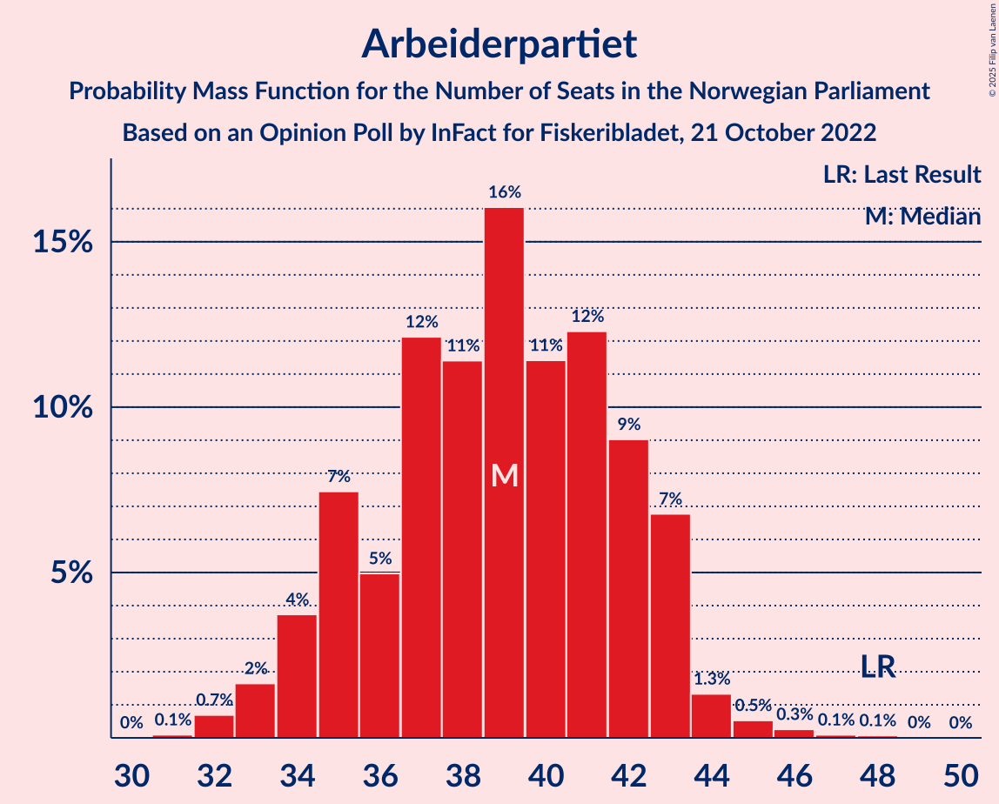

| Number of Seats | Probability | Accumulated | Special Marks |
|:---------------:|:-----------:|:-----------:|:-------------:|
| 31 | 0.1% | 100% |  |
| 32 | 0.7% | 99.9% |  |
| 33 | 2% | 99.2% |  |
| 34 | 4% | 98% |  |
| 35 | 7% | 94% |  |
| 36 | 5% | 86% |  |
| 37 | 12% | 81% |  |
| 38 | 11% | 69% |  |
| 39 | 16% | 58% | Median |
| 40 | 11% | 42% |  |
| 41 | 12% | 30% |  |
| 42 | 9% | 18% |  |
| 43 | 7% | 9% |  |
| 44 | 1.3% | 2% |  |
| 45 | 0.5% | 1.0% |  |
| 46 | 0.3% | 0.4% |  |
| 47 | 0.1% | 0.2% |  |
| 48 | 0.1% | 0.1% | Last Result |
| 49 | 0% | 0% |  |

### Fremskrittspartiet

*For a full overview of the results for this party, see the [Fremskrittspartiet](party-fremskrittspartiet.html) page.*

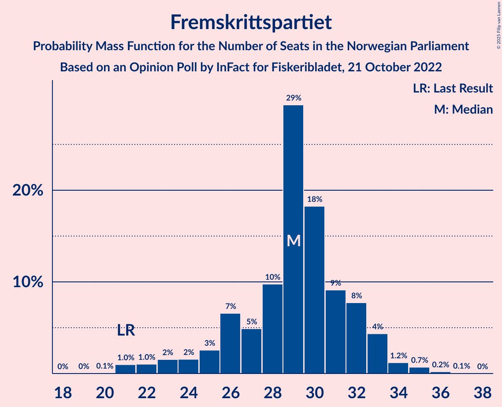

| Number of Seats | Probability | Accumulated | Special Marks |
|:---------------:|:-----------:|:-----------:|:-------------:|
| 20 | 0.1% | 100% |  |
| 21 | 1.0% | 99.9% | Last Result |
| 22 | 1.0% | 98.9% |  |
| 23 | 2% | 98% |  |
| 24 | 2% | 96% |  |
| 25 | 3% | 95% |  |
| 26 | 7% | 92% |  |
| 27 | 5% | 86% |  |
| 28 | 10% | 81% |  |
| 29 | 29% | 71% | Median |
| 30 | 18% | 42% |  |
| 31 | 9% | 23% |  |
| 32 | 8% | 14% |  |
| 33 | 4% | 7% |  |
| 34 | 1.2% | 2% |  |
| 35 | 0.7% | 1.0% |  |
| 36 | 0.2% | 0.3% |  |
| 37 | 0.1% | 0.1% |  |
| 38 | 0% | 0% |  |

### Sosialistisk Venstreparti

*For a full overview of the results for this party, see the [Sosialistisk Venstreparti](party-sosialistiskvenstreparti.html) page.*

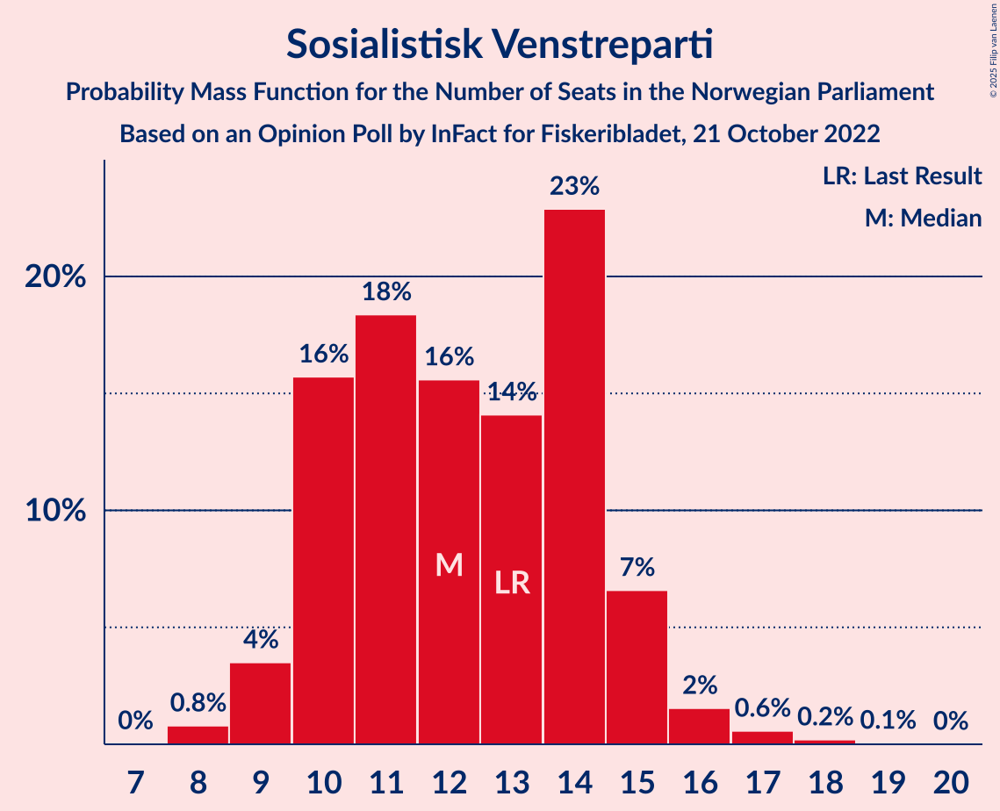

| Number of Seats | Probability | Accumulated | Special Marks |
|:---------------:|:-----------:|:-----------:|:-------------:|
| 8 | 0.8% | 100% |  |
| 9 | 4% | 99.2% |  |
| 10 | 16% | 96% |  |
| 11 | 18% | 80% |  |
| 12 | 16% | 62% | Median |
| 13 | 14% | 46% | Last Result |
| 14 | 23% | 32% |  |
| 15 | 7% | 9% |  |
| 16 | 2% | 2% |  |
| 17 | 0.6% | 0.9% |  |
| 18 | 0.2% | 0.3% |  |
| 19 | 0.1% | 0.1% |  |
| 20 | 0% | 0% |  |

### Rødt

*For a full overview of the results for this party, see the [Rødt](party-rødt.html) page.*

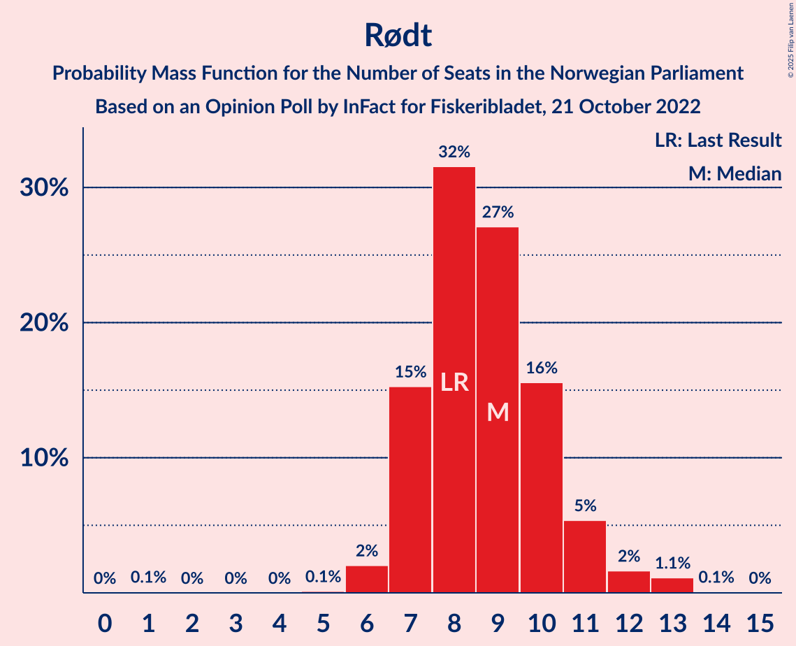

| Number of Seats | Probability | Accumulated | Special Marks |
|:---------------:|:-----------:|:-----------:|:-------------:|
| 1 | 0.1% | 100% |  |
| 2 | 0% | 99.9% |  |
| 3 | 0% | 99.9% |  |
| 4 | 0% | 99.9% |  |
| 5 | 0.1% | 99.9% |  |
| 6 | 2% | 99.8% |  |
| 7 | 15% | 98% |  |
| 8 | 32% | 82% | Last Result |
| 9 | 27% | 51% | Median |
| 10 | 16% | 24% |  |
| 11 | 5% | 8% |  |
| 12 | 2% | 3% |  |
| 13 | 1.1% | 1.2% |  |
| 14 | 0.1% | 0.1% |  |
| 15 | 0% | 0% |  |

### Senterpartiet

*For a full overview of the results for this party, see the [Senterpartiet](party-senterpartiet.html) page.*

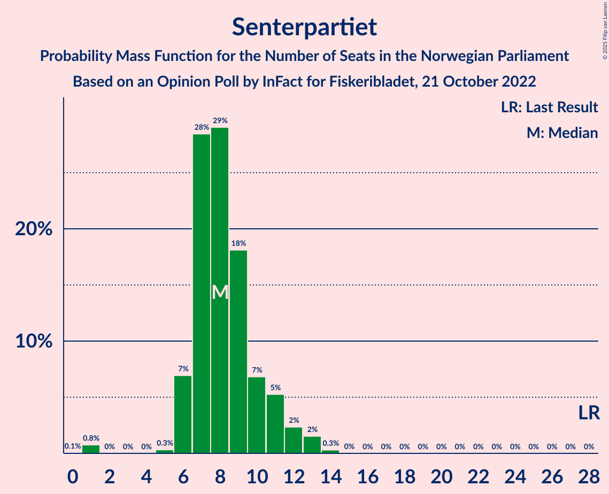

| Number of Seats | Probability | Accumulated | Special Marks |
|:---------------:|:-----------:|:-----------:|:-------------:|
| 0 | 0.1% | 100% |  |
| 1 | 0.8% | 99.9% |  |
| 2 | 0% | 99.2% |  |
| 3 | 0% | 99.2% |  |
| 4 | 0% | 99.2% |  |
| 5 | 0.3% | 99.2% |  |
| 6 | 7% | 98.9% |  |
| 7 | 28% | 92% |  |
| 8 | 29% | 63% | Median |
| 9 | 18% | 34% |  |
| 10 | 7% | 16% |  |
| 11 | 5% | 9% |  |
| 12 | 2% | 4% |  |
| 13 | 2% | 2% |  |
| 14 | 0.3% | 0.3% |  |
| 15 | 0% | 0% |  |
| 16 | 0% | 0% |  |
| 17 | 0% | 0% |  |
| 18 | 0% | 0% |  |
| 19 | 0% | 0% |  |
| 20 | 0% | 0% |  |
| 21 | 0% | 0% |  |
| 22 | 0% | 0% |  |
| 23 | 0% | 0% |  |
| 24 | 0% | 0% |  |
| 25 | 0% | 0% |  |
| 26 | 0% | 0% |  |
| 27 | 0% | 0% |  |
| 28 | 0% | 0% | Last Result |

### Venstre

*For a full overview of the results for this party, see the [Venstre](party-venstre.html) page.*

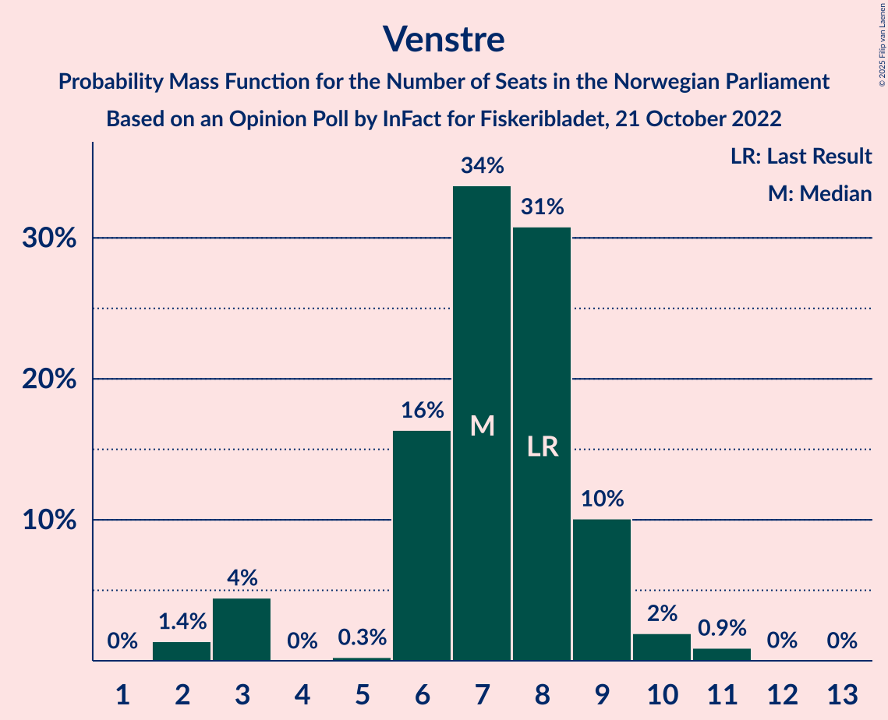

| Number of Seats | Probability | Accumulated | Special Marks |
|:---------------:|:-----------:|:-----------:|:-------------:|
| 2 | 1.4% | 100% |  |
| 3 | 4% | 98.6% |  |
| 4 | 0% | 94% |  |
| 5 | 0.3% | 94% |  |
| 6 | 16% | 94% |  |
| 7 | 34% | 78% | Median |
| 8 | 31% | 44% | Last Result |
| 9 | 10% | 13% |  |
| 10 | 2% | 3% |  |
| 11 | 0.9% | 1.0% |  |
| 12 | 0% | 0.1% |  |
| 13 | 0% | 0% |  |

### Miljøpartiet De Grønne

*For a full overview of the results for this party, see the [Miljøpartiet De Grønne](party-miljøpartietdegrønne.html) page.*

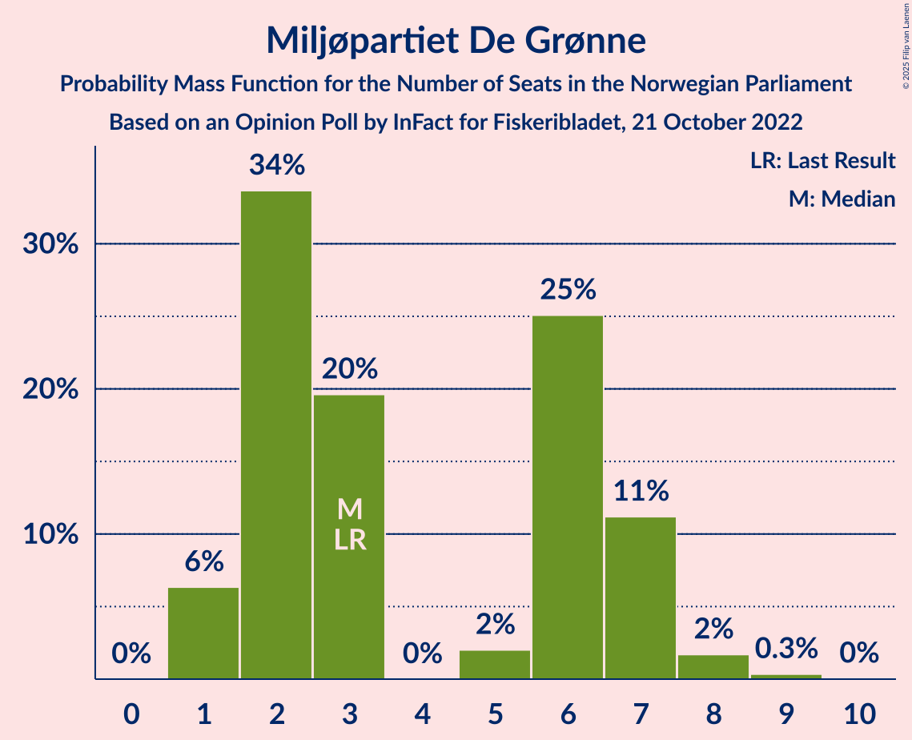

| Number of Seats | Probability | Accumulated | Special Marks |
|:---------------:|:-----------:|:-----------:|:-------------:|
| 1 | 6% | 100% |  |
| 2 | 34% | 94% |  |
| 3 | 20% | 60% | Last Result, Median |
| 4 | 0% | 40% |  |
| 5 | 2% | 40% |  |
| 6 | 25% | 38% |  |
| 7 | 11% | 13% |  |
| 8 | 2% | 2% |  |
| 9 | 0.3% | 0.4% |  |
| 10 | 0% | 0% |  |

### Kristelig Folkeparti

*For a full overview of the results for this party, see the [Kristelig Folkeparti](party-kristeligfolkeparti.html) page.*

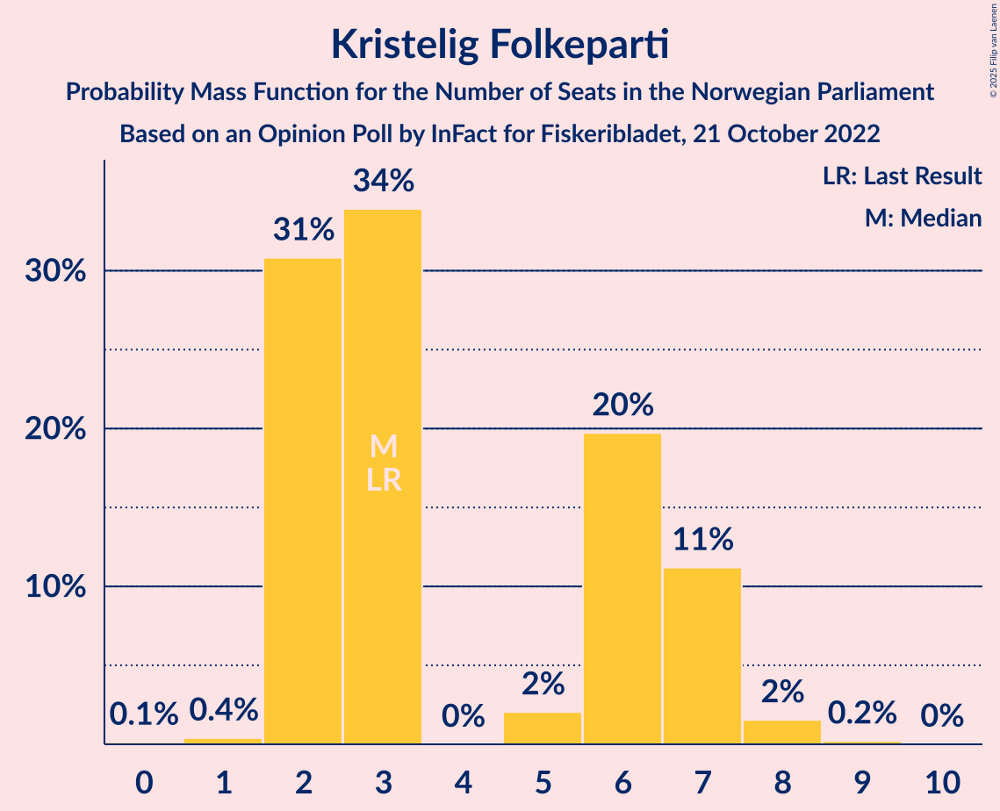

| Number of Seats | Probability | Accumulated | Special Marks |
|:---------------:|:-----------:|:-----------:|:-------------:|
| 0 | 0.1% | 100% |  |
| 1 | 0.4% | 99.9% |  |
| 2 | 31% | 99.5% |  |
| 3 | 34% | 69% | Last Result, Median |
| 4 | 0% | 35% |  |
| 5 | 2% | 35% |  |
| 6 | 20% | 33% |  |
| 7 | 11% | 13% |  |
| 8 | 2% | 2% |  |
| 9 | 0.2% | 0.2% |  |
| 10 | 0% | 0% |  |

## Coalitions

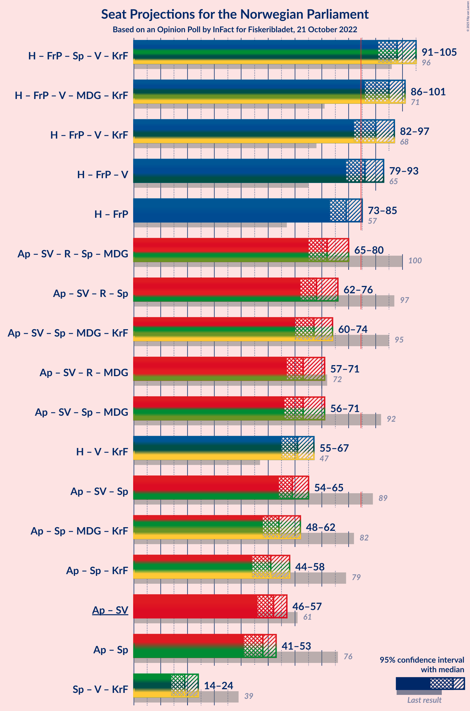

### Confidence Intervals

| Coalition | Last Result | Median | Majority? | 80% Confidence Interval | 90% Confidence Interval | 95% Confidence Interval | 99% Confidence Interval |
|:---------:|:-----------:|:------:|:---------:|:-----------------------:|:-----------------------:|:-----------------------:|:-----------------------:|
| Høyre – Fremskrittspartiet – Senterpartiet – Venstre – Kristelig Folkeparti | 96 | 98 | 100% | 94–103 | 92–104 | 91–105 | 89–108 |
| Høyre – Fremskrittspartiet – Venstre – Miljøpartiet De Grønne – Kristelig Folkeparti | 71 | 95 | 99.3% | 89–99 | 87–100 | 86–101 | 83–104 |
| Høyre – Fremskrittspartiet – Venstre – Kristelig Folkeparti | 68 | 90 | 93% | 85–95 | 84–96 | 82–97 | 79–100 |
| Høyre – Fremskrittspartiet – Venstre | 65 | 86 | 75% | 82–90 | 80–92 | 79–93 | 76–95 |
| Høyre – Fremskrittspartiet | 57 | 79 | 4% | 75–83 | 74–84 | 73–85 | 70–87 |
| Arbeiderpartiet – Sosialistisk Venstreparti – Rødt – Senterpartiet – Miljøpartiet De Grønne | 100 | 72 | 0.1% | 67–77 | 66–79 | 65–80 | 63–82 |
| Arbeiderpartiet – Sosialistisk Venstreparti – Rødt – Senterpartiet | 97 | 68 | 0% | 63–73 | 62–75 | 62–76 | 59–78 |
| Arbeiderpartiet – Sosialistisk Venstreparti – Senterpartiet – Miljøpartiet De Grønne – Kristelig Folkeparti | 95 | 67 | 0% | 63–71 | 62–74 | 60–74 | 58–77 |
| Arbeiderpartiet – Sosialistisk Venstreparti – Rødt – Miljøpartiet De Grønne | 72 | 63 | 0% | 60–68 | 58–70 | 57–71 | 55–73 |
| Arbeiderpartiet – Sosialistisk Venstreparti – Senterpartiet – Miljøpartiet De Grønne | 92 | 63 | 0% | 59–67 | 57–69 | 56–71 | 54–72 |
| Høyre – Venstre – Kristelig Folkeparti | 47 | 61 | 0% | 58–64 | 56–66 | 55–67 | 54–69 |
| Arbeiderpartiet – Sosialistisk Venstreparti – Senterpartiet | 89 | 59 | 0% | 55–63 | 54–65 | 54–65 | 50–68 |
| Arbeiderpartiet – Senterpartiet – Miljøpartiet De Grønne – Kristelig Folkeparti | 82 | 54 | 0% | 49–59 | 48–61 | 48–62 | 45–65 |
| Arbeiderpartiet – Senterpartiet – Kristelig Folkeparti | 79 | 51 | 0% | 47–56 | 45–57 | 44–58 | 42–60 |
| Arbeiderpartiet – Sosialistisk Venstreparti | 61 | 52 | 0% | 48–55 | 47–56 | 46–57 | 43–58 |
| Arbeiderpartiet – Senterpartiet | 76 | 48 | 0% | 43–51 | 42–52 | 41–53 | 39–55 |
| Senterpartiet – Venstre – Kristelig Folkeparti | 39 | 19 | 0% | 16–22 | 15–23 | 14–24 | 13–27 |

### Høyre – Fremskrittspartiet – Senterpartiet – Venstre – Kristelig Folkeparti

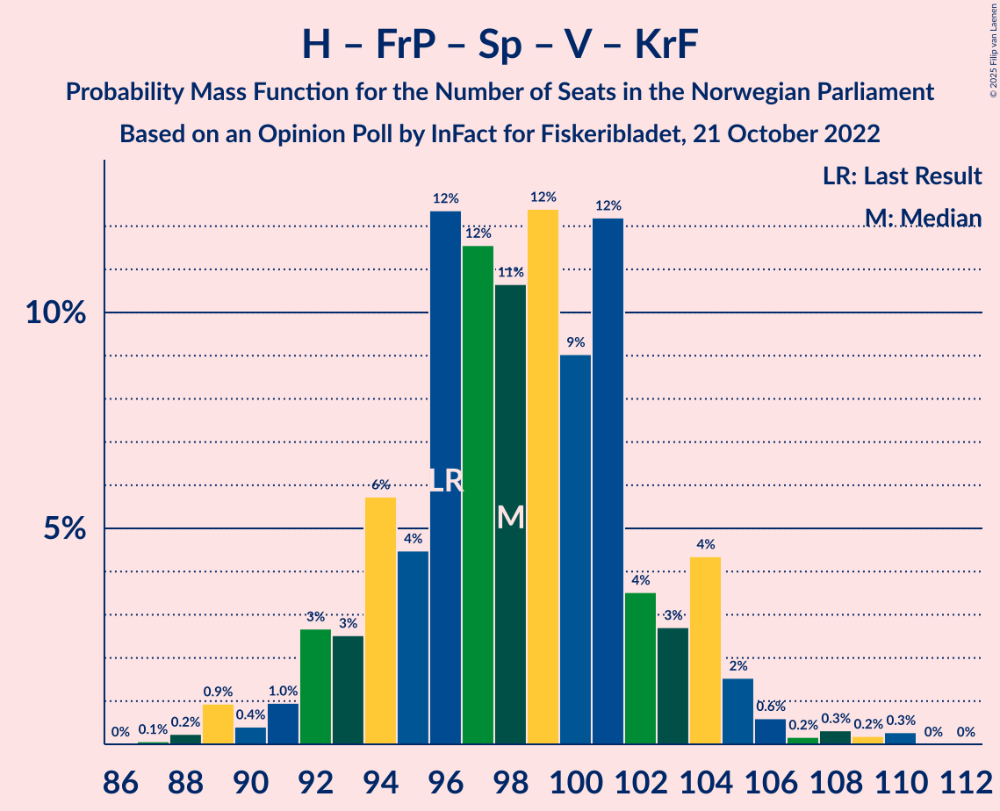

| Number of Seats | Probability | Accumulated | Special Marks |
|:---------------:|:-----------:|:-----------:|:-------------:|
| 87 | 0.1% | 100% |  |
| 88 | 0.2% | 99.9% |  |
| 89 | 0.9% | 99.7% |  |
| 90 | 0.4% | 98.7% |  |
| 91 | 1.0% | 98% |  |
| 92 | 3% | 97% |  |
| 93 | 3% | 95% |  |
| 94 | 6% | 92% |  |
| 95 | 4% | 86% |  |
| 96 | 12% | 82% | Last Result, Median |
| 97 | 12% | 70% |  |
| 98 | 11% | 58% |  |
| 99 | 12% | 47% |  |
| 100 | 9% | 35% |  |
| 101 | 12% | 26% |  |
| 102 | 4% | 14% |  |
| 103 | 3% | 10% |  |
| 104 | 4% | 7% |  |
| 105 | 2% | 3% |  |
| 106 | 0.6% | 2% |  |
| 107 | 0.2% | 1.0% |  |
| 108 | 0.3% | 0.8% |  |
| 109 | 0.2% | 0.5% |  |
| 110 | 0.3% | 0.3% |  |
| 111 | 0% | 0% |  |

### Høyre – Fremskrittspartiet – Venstre – Miljøpartiet De Grønne – Kristelig Folkeparti

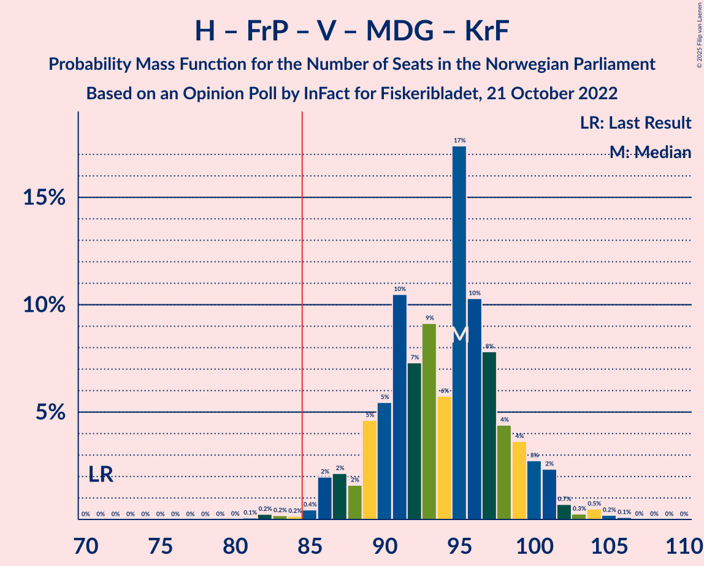

| Number of Seats | Probability | Accumulated | Special Marks |
|:---------------:|:-----------:|:-----------:|:-------------:|
| 71 | 0% | 100% | Last Result |
| 72 | 0% | 100% |  |
| 73 | 0% | 100% |  |
| 74 | 0% | 100% |  |
| 75 | 0% | 100% |  |
| 76 | 0% | 100% |  |
| 77 | 0% | 100% |  |
| 78 | 0% | 100% |  |
| 79 | 0% | 100% |  |
| 80 | 0% | 100% |  |
| 81 | 0.1% | 100% |  |
| 82 | 0.2% | 99.9% |  |
| 83 | 0.2% | 99.7% |  |
| 84 | 0.2% | 99.5% |  |
| 85 | 0.4% | 99.3% | Majority |
| 86 | 2% | 98.9% |  |
| 87 | 2% | 97% |  |
| 88 | 2% | 95% |  |
| 89 | 5% | 93% |  |
| 90 | 5% | 89% |  |
| 91 | 10% | 83% | Median |
| 92 | 7% | 73% |  |
| 93 | 9% | 65% |  |
| 94 | 6% | 56% |  |
| 95 | 17% | 50% |  |
| 96 | 10% | 33% |  |
| 97 | 8% | 23% |  |
| 98 | 4% | 15% |  |
| 99 | 4% | 11% |  |
| 100 | 3% | 7% |  |
| 101 | 2% | 4% |  |
| 102 | 0.7% | 2% |  |
| 103 | 0.3% | 1.1% |  |
| 104 | 0.5% | 0.8% |  |
| 105 | 0.2% | 0.3% |  |
| 106 | 0.1% | 0.1% |  |
| 107 | 0% | 0% |  |

### Høyre – Fremskrittspartiet – Venstre – Kristelig Folkeparti

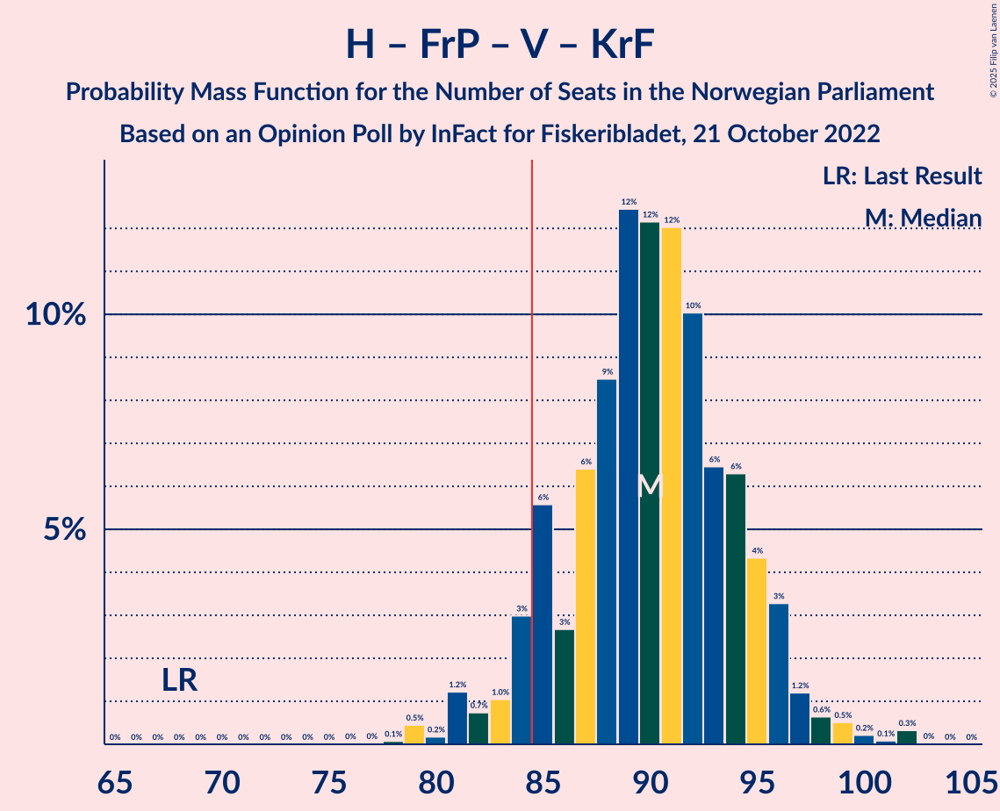

| Number of Seats | Probability | Accumulated | Special Marks |
|:---------------:|:-----------:|:-----------:|:-------------:|
| 68 | 0% | 100% | Last Result |
| 69 | 0% | 100% |  |
| 70 | 0% | 100% |  |
| 71 | 0% | 100% |  |
| 72 | 0% | 100% |  |
| 73 | 0% | 100% |  |
| 74 | 0% | 100% |  |
| 75 | 0% | 100% |  |
| 76 | 0% | 100% |  |
| 77 | 0% | 100% |  |
| 78 | 0.1% | 100% |  |
| 79 | 0.5% | 99.9% |  |
| 80 | 0.2% | 99.4% |  |
| 81 | 1.2% | 99.2% |  |
| 82 | 0.7% | 98% |  |
| 83 | 1.0% | 97% |  |
| 84 | 3% | 96% |  |
| 85 | 6% | 93% | Majority |
| 86 | 3% | 88% |  |
| 87 | 6% | 85% |  |
| 88 | 9% | 79% | Median |
| 89 | 12% | 70% |  |
| 90 | 12% | 58% |  |
| 91 | 12% | 45% |  |
| 92 | 10% | 33% |  |
| 93 | 6% | 23% |  |
| 94 | 6% | 17% |  |
| 95 | 4% | 11% |  |
| 96 | 3% | 6% |  |
| 97 | 1.2% | 3% |  |
| 98 | 0.6% | 2% |  |
| 99 | 0.5% | 1.2% |  |
| 100 | 0.2% | 0.7% |  |
| 101 | 0.1% | 0.4% |  |
| 102 | 0.3% | 0.4% |  |
| 103 | 0% | 0% |  |

### Høyre – Fremskrittspartiet – Venstre

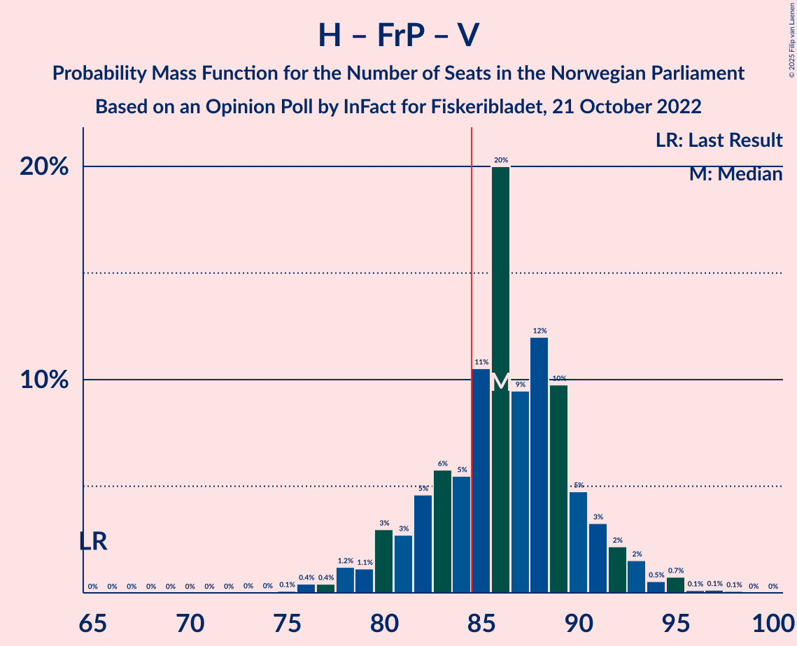

| Number of Seats | Probability | Accumulated | Special Marks |
|:---------------:|:-----------:|:-----------:|:-------------:|
| 65 | 0% | 100% | Last Result |
| 66 | 0% | 100% |  |
| 67 | 0% | 100% |  |
| 68 | 0% | 100% |  |
| 69 | 0% | 100% |  |
| 70 | 0% | 100% |  |
| 71 | 0% | 100% |  |
| 72 | 0% | 100% |  |
| 73 | 0% | 100% |  |
| 74 | 0% | 100% |  |
| 75 | 0.1% | 99.9% |  |
| 76 | 0.4% | 99.8% |  |
| 77 | 0.4% | 99.4% |  |
| 78 | 1.2% | 99.0% |  |
| 79 | 1.1% | 98% |  |
| 80 | 3% | 97% |  |
| 81 | 3% | 94% |  |
| 82 | 5% | 91% |  |
| 83 | 6% | 86% |  |
| 84 | 5% | 81% |  |
| 85 | 11% | 75% | Median, Majority |
| 86 | 20% | 65% |  |
| 87 | 9% | 45% |  |
| 88 | 12% | 35% |  |
| 89 | 10% | 23% |  |
| 90 | 5% | 13% |  |
| 91 | 3% | 9% |  |
| 92 | 2% | 5% |  |
| 93 | 2% | 3% |  |
| 94 | 0.5% | 2% |  |
| 95 | 0.7% | 1.1% |  |
| 96 | 0.1% | 0.4% |  |
| 97 | 0.1% | 0.2% |  |
| 98 | 0.1% | 0.1% |  |
| 99 | 0% | 0% |  |

### Høyre – Fremskrittspartiet

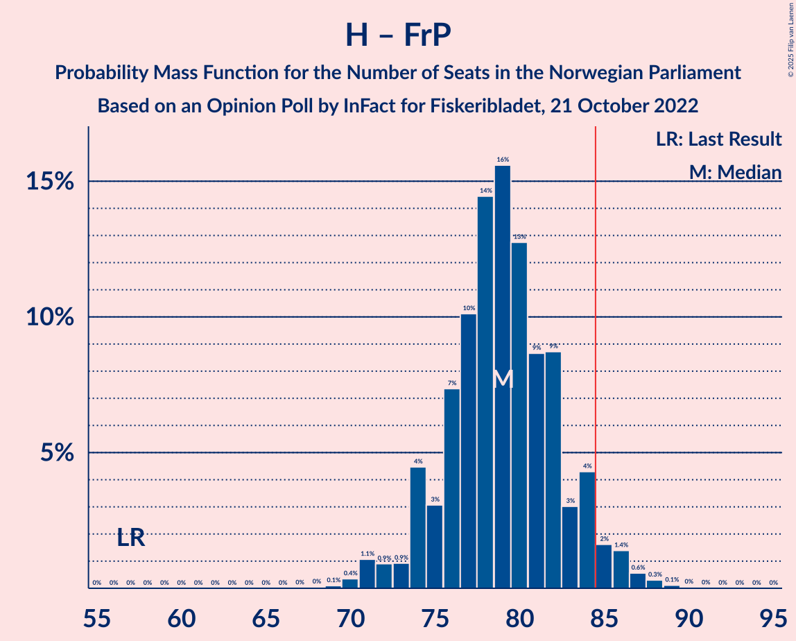

| Number of Seats | Probability | Accumulated | Special Marks |
|:---------------:|:-----------:|:-----------:|:-------------:|
| 57 | 0% | 100% | Last Result |
| 58 | 0% | 100% |  |
| 59 | 0% | 100% |  |
| 60 | 0% | 100% |  |
| 61 | 0% | 100% |  |
| 62 | 0% | 100% |  |
| 63 | 0% | 100% |  |
| 64 | 0% | 100% |  |
| 65 | 0% | 100% |  |
| 66 | 0% | 100% |  |
| 67 | 0% | 100% |  |
| 68 | 0% | 100% |  |
| 69 | 0.1% | 99.9% |  |
| 70 | 0.4% | 99.8% |  |
| 71 | 1.1% | 99.5% |  |
| 72 | 0.9% | 98% |  |
| 73 | 0.9% | 98% |  |
| 74 | 4% | 97% |  |
| 75 | 3% | 92% |  |
| 76 | 7% | 89% |  |
| 77 | 10% | 82% |  |
| 78 | 14% | 72% | Median |
| 79 | 16% | 57% |  |
| 80 | 13% | 42% |  |
| 81 | 9% | 29% |  |
| 82 | 9% | 20% |  |
| 83 | 3% | 11% |  |
| 84 | 4% | 8% |  |
| 85 | 2% | 4% | Majority |
| 86 | 1.4% | 2% |  |
| 87 | 0.6% | 1.1% |  |
| 88 | 0.3% | 0.5% |  |
| 89 | 0.1% | 0.2% |  |
| 90 | 0% | 0.1% |  |
| 91 | 0% | 0% |  |

### Arbeiderpartiet – Sosialistisk Venstreparti – Rødt – Senterpartiet – Miljøpartiet De Grønne

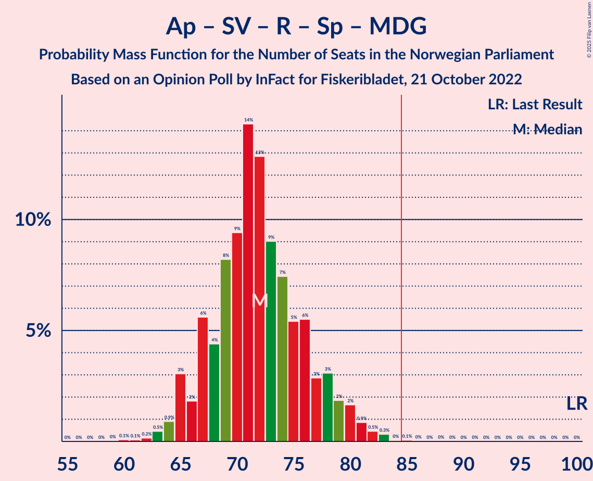

| Number of Seats | Probability | Accumulated | Special Marks |
|:---------------:|:-----------:|:-----------:|:-------------:|
| 60 | 0.1% | 100% |  |
| 61 | 0.1% | 99.9% |  |
| 62 | 0.2% | 99.8% |  |
| 63 | 0.5% | 99.7% |  |
| 64 | 0.9% | 99.2% |  |
| 65 | 3% | 98% |  |
| 66 | 2% | 95% |  |
| 67 | 6% | 93% |  |
| 68 | 4% | 88% |  |
| 69 | 8% | 83% |  |
| 70 | 9% | 75% |  |
| 71 | 14% | 66% | Median |
| 72 | 13% | 51% |  |
| 73 | 9% | 39% |  |
| 74 | 7% | 30% |  |
| 75 | 5% | 22% |  |
| 76 | 6% | 17% |  |
| 77 | 3% | 11% |  |
| 78 | 3% | 8% |  |
| 79 | 2% | 5% |  |
| 80 | 2% | 3% |  |
| 81 | 0.9% | 2% |  |
| 82 | 0.5% | 1.0% |  |
| 83 | 0.3% | 0.5% |  |
| 84 | 0% | 0.2% |  |
| 85 | 0.1% | 0.1% | Majority |
| 86 | 0% | 0.1% |  |
| 87 | 0% | 0% |  |
| 88 | 0% | 0% |  |
| 89 | 0% | 0% |  |
| 90 | 0% | 0% |  |
| 91 | 0% | 0% |  |
| 92 | 0% | 0% |  |
| 93 | 0% | 0% |  |
| 94 | 0% | 0% |  |
| 95 | 0% | 0% |  |
| 96 | 0% | 0% |  |
| 97 | 0% | 0% |  |
| 98 | 0% | 0% |  |
| 99 | 0% | 0% |  |
| 100 | 0% | 0% | Last Result |

### Arbeiderpartiet – Sosialistisk Venstreparti – Rødt – Senterpartiet

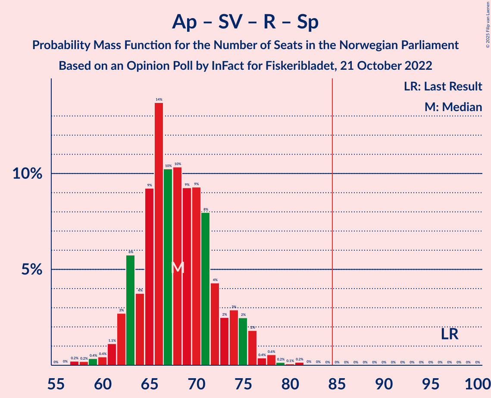

| Number of Seats | Probability | Accumulated | Special Marks |
|:---------------:|:-----------:|:-----------:|:-------------:|
| 56 | 0% | 100% |  |
| 57 | 0.2% | 99.9% |  |
| 58 | 0.2% | 99.7% |  |
| 59 | 0.4% | 99.5% |  |
| 60 | 0.4% | 99.2% |  |
| 61 | 1.1% | 98.7% |  |
| 62 | 3% | 98% |  |
| 63 | 6% | 95% |  |
| 64 | 4% | 89% |  |
| 65 | 9% | 85% |  |
| 66 | 14% | 76% |  |
| 67 | 10% | 62% |  |
| 68 | 10% | 52% | Median |
| 69 | 9% | 42% |  |
| 70 | 9% | 33% |  |
| 71 | 8% | 23% |  |
| 72 | 4% | 15% |  |
| 73 | 2% | 11% |  |
| 74 | 3% | 9% |  |
| 75 | 2% | 6% |  |
| 76 | 2% | 3% |  |
| 77 | 0.4% | 1.4% |  |
| 78 | 0.6% | 1.0% |  |
| 79 | 0.2% | 0.4% |  |
| 80 | 0.1% | 0.3% |  |
| 81 | 0.2% | 0.2% |  |
| 82 | 0% | 0.1% |  |
| 83 | 0% | 0% |  |
| 84 | 0% | 0% |  |
| 85 | 0% | 0% | Majority |
| 86 | 0% | 0% |  |
| 87 | 0% | 0% |  |
| 88 | 0% | 0% |  |
| 89 | 0% | 0% |  |
| 90 | 0% | 0% |  |
| 91 | 0% | 0% |  |
| 92 | 0% | 0% |  |
| 93 | 0% | 0% |  |
| 94 | 0% | 0% |  |
| 95 | 0% | 0% |  |
| 96 | 0% | 0% |  |
| 97 | 0% | 0% | Last Result |

### Arbeiderpartiet – Sosialistisk Venstreparti – Senterpartiet – Miljøpartiet De Grønne – Kristelig Folkeparti

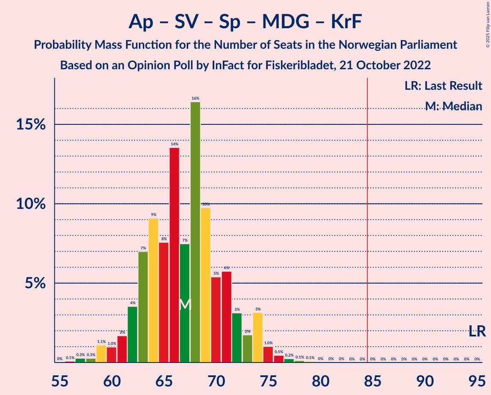

| Number of Seats | Probability | Accumulated | Special Marks |
|:---------------:|:-----------:|:-----------:|:-------------:|
| 55 | 0% | 100% |  |
| 56 | 0.1% | 99.9% |  |
| 57 | 0.3% | 99.9% |  |
| 58 | 0.3% | 99.6% |  |
| 59 | 1.1% | 99.3% |  |
| 60 | 1.0% | 98% |  |
| 61 | 2% | 97% |  |
| 62 | 4% | 96% |  |
| 63 | 7% | 92% |  |
| 64 | 9% | 85% |  |
| 65 | 8% | 76% | Median |
| 66 | 14% | 68% |  |
| 67 | 7% | 55% |  |
| 68 | 16% | 47% |  |
| 69 | 10% | 31% |  |
| 70 | 5% | 21% |  |
| 71 | 6% | 16% |  |
| 72 | 3% | 10% |  |
| 73 | 2% | 7% |  |
| 74 | 3% | 5% |  |
| 75 | 1.0% | 2% |  |
| 76 | 0.5% | 1.0% |  |
| 77 | 0.2% | 0.5% |  |
| 78 | 0.1% | 0.3% |  |
| 79 | 0.1% | 0.1% |  |
| 80 | 0% | 0.1% |  |
| 81 | 0% | 0% |  |
| 82 | 0% | 0% |  |
| 83 | 0% | 0% |  |
| 84 | 0% | 0% |  |
| 85 | 0% | 0% | Majority |
| 86 | 0% | 0% |  |
| 87 | 0% | 0% |  |
| 88 | 0% | 0% |  |
| 89 | 0% | 0% |  |
| 90 | 0% | 0% |  |
| 91 | 0% | 0% |  |
| 92 | 0% | 0% |  |
| 93 | 0% | 0% |  |
| 94 | 0% | 0% |  |
| 95 | 0% | 0% | Last Result |

### Arbeiderpartiet – Sosialistisk Venstreparti – Rødt – Miljøpartiet De Grønne

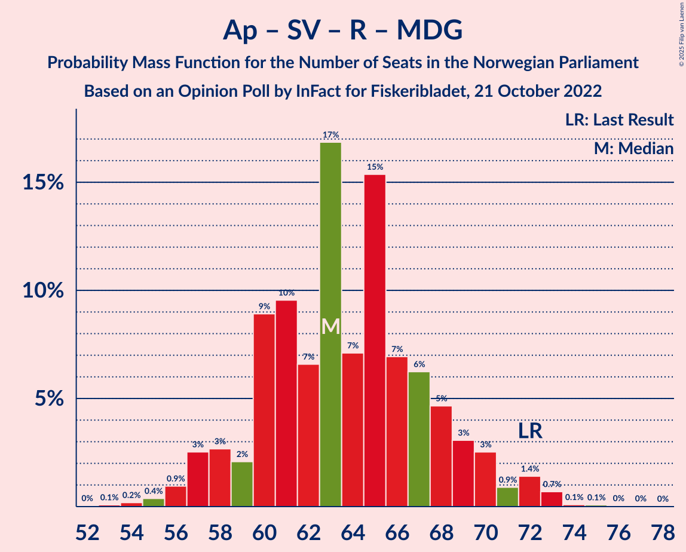

| Number of Seats | Probability | Accumulated | Special Marks |
|:---------------:|:-----------:|:-----------:|:-------------:|
| 52 | 0% | 100% |  |
| 53 | 0.1% | 99.9% |  |
| 54 | 0.2% | 99.9% |  |
| 55 | 0.4% | 99.7% |  |
| 56 | 0.9% | 99.3% |  |
| 57 | 3% | 98% |  |
| 58 | 3% | 96% |  |
| 59 | 2% | 93% |  |
| 60 | 9% | 91% |  |
| 61 | 10% | 82% |  |
| 62 | 7% | 73% |  |
| 63 | 17% | 66% | Median |
| 64 | 7% | 49% |  |
| 65 | 15% | 42% |  |
| 66 | 7% | 27% |  |
| 67 | 6% | 20% |  |
| 68 | 5% | 14% |  |
| 69 | 3% | 9% |  |
| 70 | 3% | 6% |  |
| 71 | 0.9% | 3% |  |
| 72 | 1.4% | 2% | Last Result |
| 73 | 0.7% | 1.0% |  |
| 74 | 0.1% | 0.3% |  |
| 75 | 0.1% | 0.2% |  |
| 76 | 0% | 0.1% |  |
| 77 | 0% | 0.1% |  |
| 78 | 0% | 0% |  |

### Arbeiderpartiet – Sosialistisk Venstreparti – Senterpartiet – Miljøpartiet De Grønne

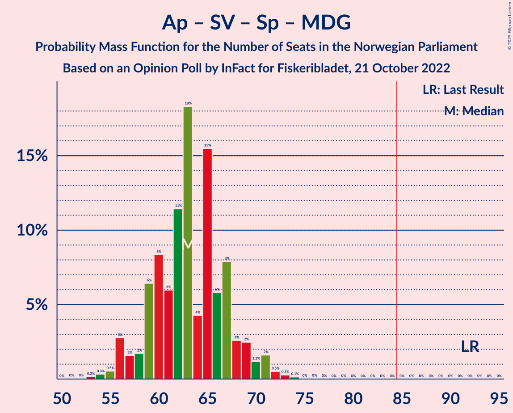

| Number of Seats | Probability | Accumulated | Special Marks |
|:---------------:|:-----------:|:-----------:|:-------------:|
| 51 | 0% | 100% |  |
| 52 | 0% | 99.9% |  |
| 53 | 0.2% | 99.9% |  |
| 54 | 0.3% | 99.7% |  |
| 55 | 0.5% | 99.4% |  |
| 56 | 3% | 98.9% |  |
| 57 | 2% | 96% |  |
| 58 | 2% | 95% |  |
| 59 | 6% | 93% |  |
| 60 | 8% | 86% |  |
| 61 | 6% | 78% |  |
| 62 | 11% | 72% | Median |
| 63 | 18% | 61% |  |
| 64 | 4% | 42% |  |
| 65 | 15% | 38% |  |
| 66 | 6% | 23% |  |
| 67 | 8% | 17% |  |
| 68 | 3% | 9% |  |
| 69 | 2% | 6% |  |
| 70 | 1.2% | 4% |  |
| 71 | 2% | 3% |  |
| 72 | 0.5% | 1.0% |  |
| 73 | 0.3% | 0.5% |  |
| 74 | 0.1% | 0.2% |  |
| 75 | 0% | 0.1% |  |
| 76 | 0% | 0.1% |  |
| 77 | 0% | 0% |  |
| 78 | 0% | 0% |  |
| 79 | 0% | 0% |  |
| 80 | 0% | 0% |  |
| 81 | 0% | 0% |  |
| 82 | 0% | 0% |  |
| 83 | 0% | 0% |  |
| 84 | 0% | 0% |  |
| 85 | 0% | 0% | Majority |
| 86 | 0% | 0% |  |
| 87 | 0% | 0% |  |
| 88 | 0% | 0% |  |
| 89 | 0% | 0% |  |
| 90 | 0% | 0% |  |
| 91 | 0% | 0% |  |
| 92 | 0% | 0% | Last Result |

### Høyre – Venstre – Kristelig Folkeparti

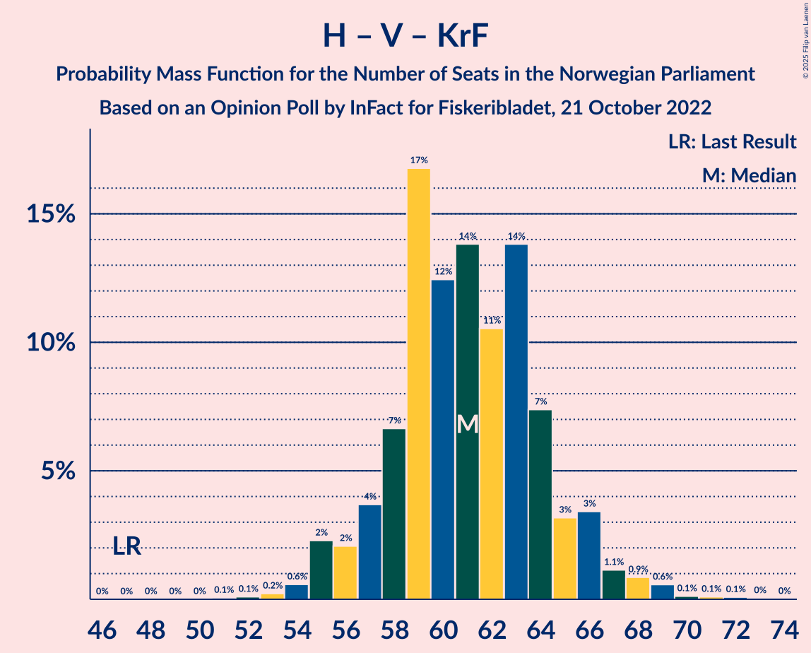

| Number of Seats | Probability | Accumulated | Special Marks |
|:---------------:|:-----------:|:-----------:|:-------------:|
| 47 | 0% | 100% | Last Result |
| 48 | 0% | 100% |  |
| 49 | 0% | 100% |  |
| 50 | 0% | 100% |  |
| 51 | 0.1% | 100% |  |
| 52 | 0.1% | 99.9% |  |
| 53 | 0.2% | 99.8% |  |
| 54 | 0.6% | 99.6% |  |
| 55 | 2% | 99.0% |  |
| 56 | 2% | 97% |  |
| 57 | 4% | 95% |  |
| 58 | 7% | 91% |  |
| 59 | 17% | 84% | Median |
| 60 | 12% | 68% |  |
| 61 | 14% | 55% |  |
| 62 | 11% | 41% |  |
| 63 | 14% | 31% |  |
| 64 | 7% | 17% |  |
| 65 | 3% | 10% |  |
| 66 | 3% | 6% |  |
| 67 | 1.1% | 3% |  |
| 68 | 0.9% | 2% |  |
| 69 | 0.6% | 1.0% |  |
| 70 | 0.1% | 0.4% |  |
| 71 | 0.1% | 0.3% |  |
| 72 | 0.1% | 0.2% |  |
| 73 | 0% | 0.1% |  |
| 74 | 0% | 0% |  |

### Arbeiderpartiet – Sosialistisk Venstreparti – Senterpartiet

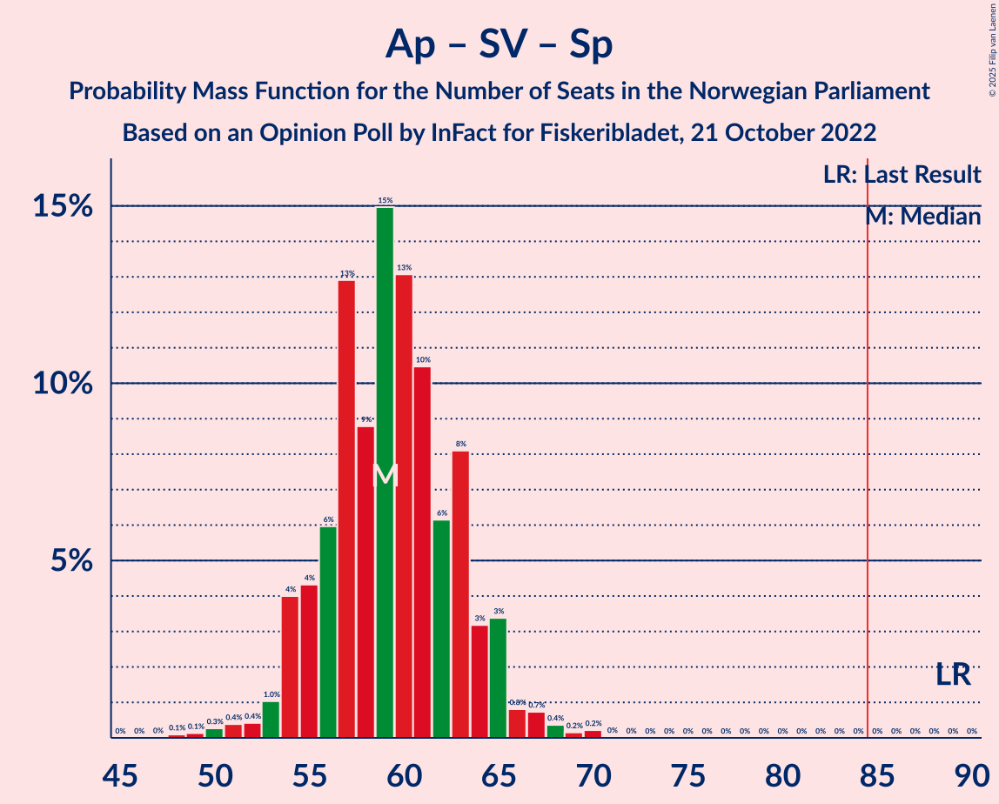

| Number of Seats | Probability | Accumulated | Special Marks |
|:---------------:|:-----------:|:-----------:|:-------------:|
| 48 | 0.1% | 100% |  |
| 49 | 0.1% | 99.9% |  |
| 50 | 0.3% | 99.7% |  |
| 51 | 0.4% | 99.5% |  |
| 52 | 0.4% | 99.1% |  |
| 53 | 1.0% | 98.7% |  |
| 54 | 4% | 98% |  |
| 55 | 4% | 94% |  |
| 56 | 6% | 89% |  |
| 57 | 13% | 83% |  |
| 58 | 9% | 70% |  |
| 59 | 15% | 62% | Median |
| 60 | 13% | 47% |  |
| 61 | 10% | 34% |  |
| 62 | 6% | 23% |  |
| 63 | 8% | 17% |  |
| 64 | 3% | 9% |  |
| 65 | 3% | 6% |  |
| 66 | 0.8% | 2% |  |
| 67 | 0.7% | 2% |  |
| 68 | 0.4% | 0.8% |  |
| 69 | 0.2% | 0.4% |  |
| 70 | 0.2% | 0.3% |  |
| 71 | 0% | 0% |  |
| 72 | 0% | 0% |  |
| 73 | 0% | 0% |  |
| 74 | 0% | 0% |  |
| 75 | 0% | 0% |  |
| 76 | 0% | 0% |  |
| 77 | 0% | 0% |  |
| 78 | 0% | 0% |  |
| 79 | 0% | 0% |  |
| 80 | 0% | 0% |  |
| 81 | 0% | 0% |  |
| 82 | 0% | 0% |  |
| 83 | 0% | 0% |  |
| 84 | 0% | 0% |  |
| 85 | 0% | 0% | Majority |
| 86 | 0% | 0% |  |
| 87 | 0% | 0% |  |
| 88 | 0% | 0% |  |
| 89 | 0% | 0% | Last Result |

### Arbeiderpartiet – Senterpartiet – Miljøpartiet De Grønne – Kristelig Folkeparti

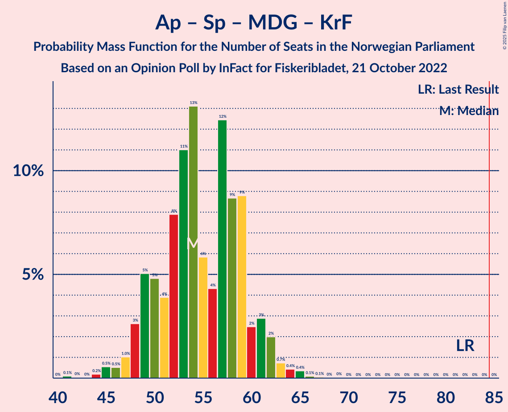

| Number of Seats | Probability | Accumulated | Special Marks |
|:---------------:|:-----------:|:-----------:|:-------------:|
| 41 | 0.1% | 100% |  |
| 42 | 0% | 99.9% |  |
| 43 | 0% | 99.8% |  |
| 44 | 0.2% | 99.8% |  |
| 45 | 0.5% | 99.6% |  |
| 46 | 0.5% | 99.1% |  |
| 47 | 1.0% | 98.6% |  |
| 48 | 3% | 98% |  |
| 49 | 5% | 95% |  |
| 50 | 5% | 90% |  |
| 51 | 4% | 85% |  |
| 52 | 8% | 81% |  |
| 53 | 11% | 73% | Median |
| 54 | 13% | 62% |  |
| 55 | 6% | 49% |  |
| 56 | 4% | 43% |  |
| 57 | 12% | 39% |  |
| 58 | 9% | 27% |  |
| 59 | 9% | 18% |  |
| 60 | 2% | 9% |  |
| 61 | 3% | 7% |  |
| 62 | 2% | 4% |  |
| 63 | 0.7% | 2% |  |
| 64 | 0.4% | 1.0% |  |
| 65 | 0.4% | 0.6% |  |
| 66 | 0.1% | 0.2% |  |
| 67 | 0.1% | 0.1% |  |
| 68 | 0% | 0.1% |  |
| 69 | 0% | 0% |  |
| 70 | 0% | 0% |  |
| 71 | 0% | 0% |  |
| 72 | 0% | 0% |  |
| 73 | 0% | 0% |  |
| 74 | 0% | 0% |  |
| 75 | 0% | 0% |  |
| 76 | 0% | 0% |  |
| 77 | 0% | 0% |  |
| 78 | 0% | 0% |  |
| 79 | 0% | 0% |  |
| 80 | 0% | 0% |  |
| 81 | 0% | 0% |  |
| 82 | 0% | 0% | Last Result |

### Arbeiderpartiet – Senterpartiet – Kristelig Folkeparti

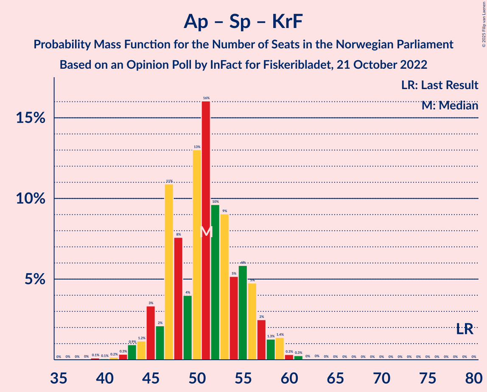

| Number of Seats | Probability | Accumulated | Special Marks |
|:---------------:|:-----------:|:-----------:|:-------------:|
| 39 | 0.1% | 100% |  |
| 40 | 0.1% | 99.9% |  |
| 41 | 0.2% | 99.8% |  |
| 42 | 0.3% | 99.6% |  |
| 43 | 0.9% | 99.3% |  |
| 44 | 1.2% | 98% |  |
| 45 | 3% | 97% |  |
| 46 | 2% | 94% |  |
| 47 | 11% | 92% |  |
| 48 | 8% | 81% |  |
| 49 | 4% | 73% |  |
| 50 | 13% | 69% | Median |
| 51 | 16% | 56% |  |
| 52 | 10% | 40% |  |
| 53 | 9% | 31% |  |
| 54 | 5% | 22% |  |
| 55 | 6% | 16% |  |
| 56 | 5% | 11% |  |
| 57 | 2% | 6% |  |
| 58 | 1.3% | 3% |  |
| 59 | 1.4% | 2% |  |
| 60 | 0.3% | 0.7% |  |
| 61 | 0.3% | 0.4% |  |
| 62 | 0% | 0.1% |  |
| 63 | 0% | 0.1% |  |
| 64 | 0% | 0% |  |
| 65 | 0% | 0% |  |
| 66 | 0% | 0% |  |
| 67 | 0% | 0% |  |
| 68 | 0% | 0% |  |
| 69 | 0% | 0% |  |
| 70 | 0% | 0% |  |
| 71 | 0% | 0% |  |
| 72 | 0% | 0% |  |
| 73 | 0% | 0% |  |
| 74 | 0% | 0% |  |
| 75 | 0% | 0% |  |
| 76 | 0% | 0% |  |
| 77 | 0% | 0% |  |
| 78 | 0% | 0% |  |
| 79 | 0% | 0% | Last Result |

### Arbeiderpartiet – Sosialistisk Venstreparti

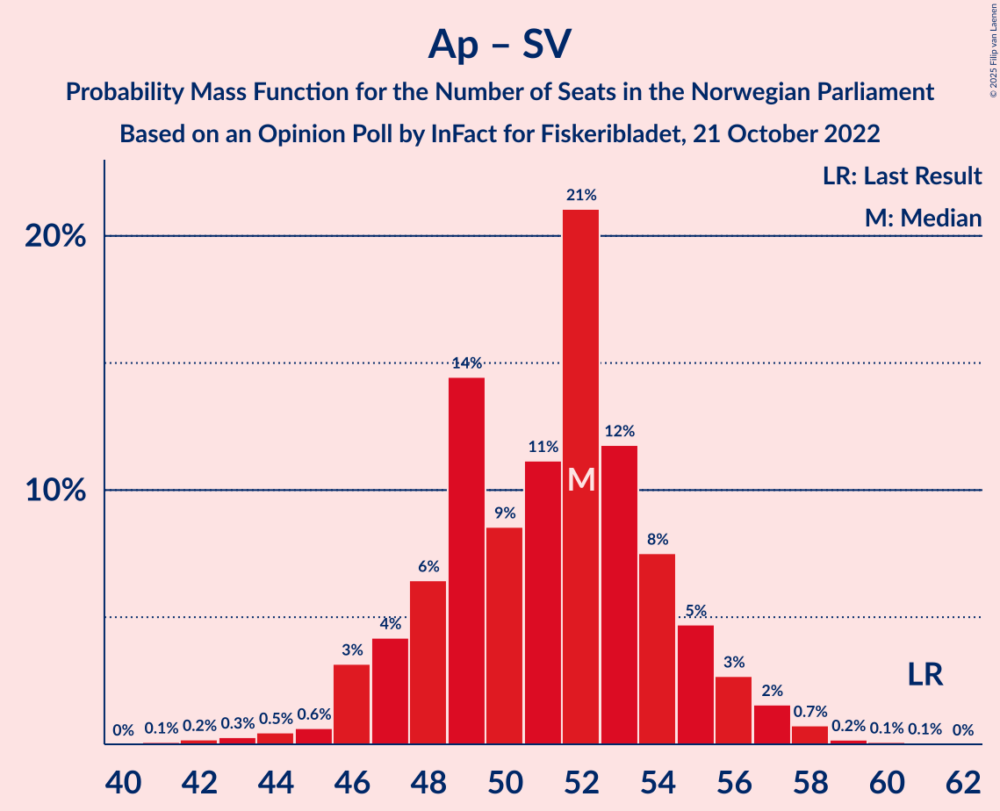

| Number of Seats | Probability | Accumulated | Special Marks |
|:---------------:|:-----------:|:-----------:|:-------------:|
| 41 | 0.1% | 100% |  |
| 42 | 0.2% | 99.9% |  |
| 43 | 0.3% | 99.7% |  |
| 44 | 0.5% | 99.4% |  |
| 45 | 0.6% | 99.0% |  |
| 46 | 3% | 98% |  |
| 47 | 4% | 95% |  |
| 48 | 6% | 91% |  |
| 49 | 14% | 85% |  |
| 50 | 9% | 70% |  |
| 51 | 11% | 62% | Median |
| 52 | 21% | 50% |  |
| 53 | 12% | 29% |  |
| 54 | 8% | 18% |  |
| 55 | 5% | 10% |  |
| 56 | 3% | 5% |  |
| 57 | 2% | 3% |  |
| 58 | 0.7% | 1.1% |  |
| 59 | 0.2% | 0.3% |  |
| 60 | 0.1% | 0.2% |  |
| 61 | 0.1% | 0.1% | Last Result |
| 62 | 0% | 0% |  |

### Arbeiderpartiet – Senterpartiet

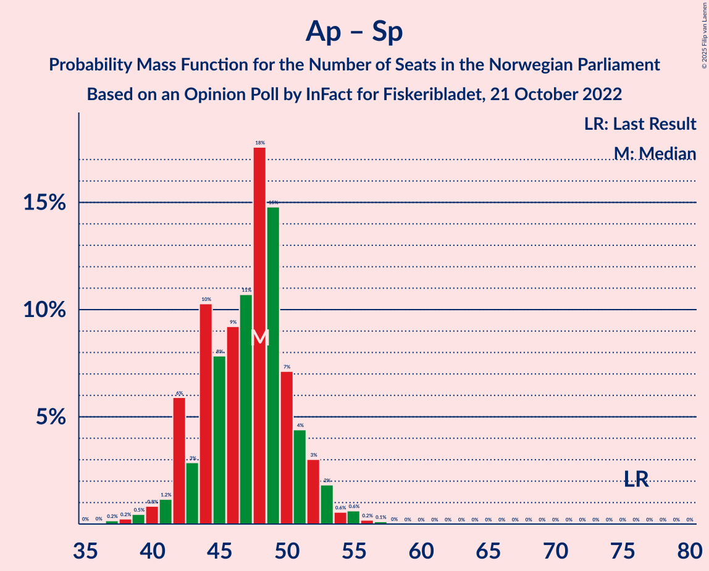

| Number of Seats | Probability | Accumulated | Special Marks |
|:---------------:|:-----------:|:-----------:|:-------------:|
| 36 | 0% | 100% |  |
| 37 | 0.2% | 99.9% |  |
| 38 | 0.2% | 99.8% |  |
| 39 | 0.5% | 99.5% |  |
| 40 | 0.8% | 99.1% |  |
| 41 | 1.2% | 98% |  |
| 42 | 6% | 97% |  |
| 43 | 3% | 91% |  |
| 44 | 10% | 88% |  |
| 45 | 8% | 78% |  |
| 46 | 9% | 70% |  |
| 47 | 11% | 61% | Median |
| 48 | 18% | 50% |  |
| 49 | 15% | 33% |  |
| 50 | 7% | 18% |  |
| 51 | 4% | 11% |  |
| 52 | 3% | 6% |  |
| 53 | 2% | 3% |  |
| 54 | 0.6% | 2% |  |
| 55 | 0.6% | 0.9% |  |
| 56 | 0.2% | 0.3% |  |
| 57 | 0.1% | 0.1% |  |
| 58 | 0% | 0% |  |
| 59 | 0% | 0% |  |
| 60 | 0% | 0% |  |
| 61 | 0% | 0% |  |
| 62 | 0% | 0% |  |
| 63 | 0% | 0% |  |
| 64 | 0% | 0% |  |
| 65 | 0% | 0% |  |
| 66 | 0% | 0% |  |
| 67 | 0% | 0% |  |
| 68 | 0% | 0% |  |
| 69 | 0% | 0% |  |
| 70 | 0% | 0% |  |
| 71 | 0% | 0% |  |
| 72 | 0% | 0% |  |
| 73 | 0% | 0% |  |
| 74 | 0% | 0% |  |
| 75 | 0% | 0% |  |
| 76 | 0% | 0% | Last Result |

### Senterpartiet – Venstre – Kristelig Folkeparti

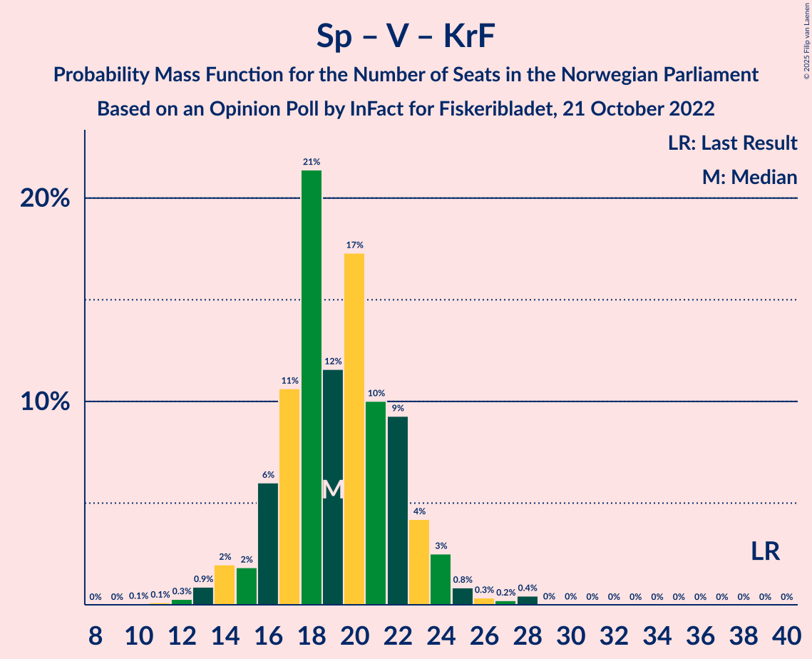

| Number of Seats | Probability | Accumulated | Special Marks |
|:---------------:|:-----------:|:-----------:|:-------------:|
| 10 | 0.1% | 100% |  |
| 11 | 0.1% | 99.9% |  |
| 12 | 0.3% | 99.8% |  |
| 13 | 0.9% | 99.5% |  |
| 14 | 2% | 98.7% |  |
| 15 | 2% | 97% |  |
| 16 | 6% | 95% |  |
| 17 | 11% | 89% |  |
| 18 | 21% | 78% | Median |
| 19 | 12% | 57% |  |
| 20 | 17% | 45% |  |
| 21 | 10% | 28% |  |
| 22 | 9% | 18% |  |
| 23 | 4% | 9% |  |
| 24 | 3% | 4% |  |
| 25 | 0.8% | 2% |  |
| 26 | 0.3% | 1.1% |  |
| 27 | 0.2% | 0.7% |  |
| 28 | 0.4% | 0.5% |  |
| 29 | 0% | 0.1% |  |
| 30 | 0% | 0% |  |
| 31 | 0% | 0% |  |
| 32 | 0% | 0% |  |
| 33 | 0% | 0% |  |
| 34 | 0% | 0% |  |
| 35 | 0% | 0% |  |
| 36 | 0% | 0% |  |
| 37 | 0% | 0% |  |
| 38 | 0% | 0% |  |
| 39 | 0% | 0% | Last Result |

## Technical Information

### Opinion Poll

+ **Polling firm:** InFact
+ **Commissioner(s):** Fiskeribladet
+ **Fieldwork period:** 21 October 2022

### Calculations

+ **Sample size:** 1004
+ **Simulations done:** 1,048,576
+ **Error estimate:** 1.10%

