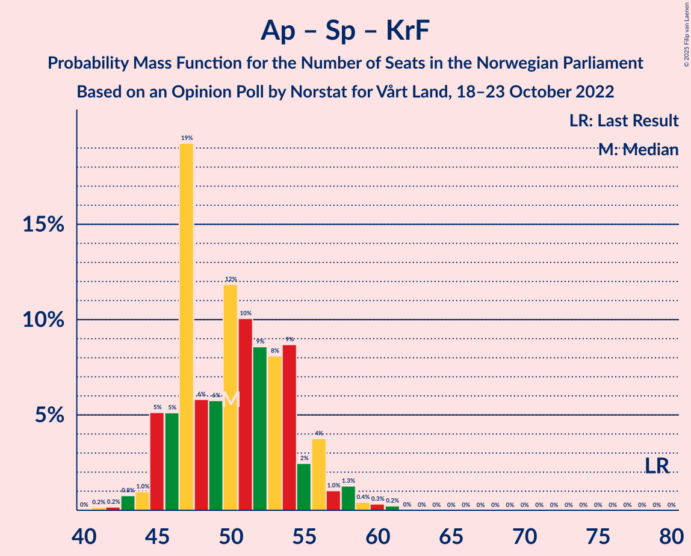

# Opinion Poll by Norstat for Vårt Land, 18–23 October 2022

<a href="#voting-intentions">Voting Intentions</a> | <a href="#seats">Seats</a> | <a href="#coalitions">Coalitions</a> | <a href="#technical-information">Technical Information</a>

## Voting Intentions

### Confidence Intervals

| Party | Last Result | Poll Result | 80% Confidence Interval | 90% Confidence Interval | 95% Confidence Interval | 99% Confidence Interval |
|:-----:|:-----------:|:-----------:|:-----------------------:|:-----------------------:|:-----------------------:|:-----------------------:|
| Høyre | 20.4% | 28.8% | 26.9–30.7% |26.4–31.2% |26.0–31.7% |25.1–32.6% |
| Arbeiderpartiet | 26.2% | 17.9% | 16.4–19.6% |16.0–20.1% |15.6–20.5% |14.9–21.3% |
| Fremskrittspartiet | 11.6% | 13.1% | 11.8–14.6% |11.4–15.0% |11.1–15.4% |10.5–16.2% |
| Sosialistisk Venstreparti | 7.6% | 8.8% | 7.7–10.1% |7.4–10.5% |7.2–10.8% |6.7–11.4% |
| Rødt | 4.7% | 6.7% | 5.8–7.9% |5.5–8.2% |5.3–8.5% |4.9–9.1% |
| Senterpartiet | 13.5% | 6.0% | 5.1–7.1% |4.8–7.4% |4.6–7.7% |4.3–8.2% |
| Venstre | 4.6% | 5.4% | 4.5–6.4% |4.3–6.7% |4.1–7.0% |3.7–7.5% |
| Miljøpartiet De Grønne | 3.9% | 4.4% | 3.7–5.4% |3.4–5.7% |3.3–5.9% |2.9–6.4% |
| Kristelig Folkeparti | 3.8% | 4.0% | 3.3–4.9% |3.1–5.2% |2.9–5.4% |2.6–5.9% |
| Industri- og Næringspartiet | 0.3% | 1.7% | 1.2–2.3% |1.1–2.5% |1.0–2.7% |0.9–3.1% |

*Note:* The poll result column reflects the actual value used in the calculations. Published results may vary slightly, and in addition be rounded to fewer digits.

## Seats

### Confidence Intervals

| Party | Last Result | Median | 80% Confidence Interval | 90% Confidence Interval | 95% Confidence Interval | 99% Confidence Interval |
|:-----:|:-----------:|:------:|:-----------------------:|:-----------------------:|:-----------------------:|:-----------------------:|
| <a href="#høyre">Høyre</a> | 36 | 50 | 48–54 |47–56 |46–57 |44–60 |
| <a href="#arbeiderpartiet">Arbeiderpartiet</a> | 48 | 34 | 33–39 |33–39 |32–40 |30–42 |
| <a href="#fremskrittspartiet">Fremskrittspartiet</a> | 21 | 23 | 21–27 |20–28 |19–29 |18–32 |
| <a href="#sosialistisk-venstreparti">Sosialistisk Venstreparti</a> | 13 | 15 | 13–17 |12–18 |12–18 |10–19 |
| <a href="#rødt">Rødt</a> | 8 | 11 | 9–13 |9–14 |9–15 |8–16 |
| <a href="#senterpartiet">Senterpartiet</a> | 28 | 10 | 8–12 |8–13 |8–13 |7–15 |
| <a href="#venstre">Venstre</a> | 8 | 8 | 7–11 |7–11 |7–12 |3–13 |
| <a href="#miljøpartiet-de-grønne">Miljøpartiet De Grønne</a> | 3 | 7 | 2–9 |2–10 |2–10 |1–11 |
| <a href="#kristelig-folkeparti">Kristelig Folkeparti</a> | 3 | 3 | 2–8 |2–8 |2–9 |2–10 |
| <a href="#industri--og-næringspartiet">Industri- og Næringspartiet</a> | 0 | 0 | 0 |0 |0–1 |0–2 |

### Høyre

*For a full overview of the results for this party, see the [Høyre](party-høyre.html) page.*

| Number of Seats | Probability | Accumulated | Special Marks |
|:---------------:|:-----------:|:-----------:|:-------------:|
| 36 | 0% | 100% | Last Result |
| 37 | 0% | 100% |  |
| 38 | 0% | 100% |  |
| 39 | 0% | 100% |  |
| 40 | 0% | 100% |  |
| 41 | 0% | 100% |  |
| 42 | 0% | 100% |  |
| 43 | 0.2% | 100% |  |
| 44 | 1.2% | 99.8% |  |
| 45 | 1.0% | 98.6% |  |
| 46 | 2% | 98% |  |
| 47 | 3% | 96% |  |
| 48 | 8% | 93% |  |
| 49 | 23% | 86% |  |
| 50 | 14% | 63% | Median |
| 51 | 10% | 49% |  |
| 52 | 20% | 39% |  |
| 53 | 8% | 19% |  |
| 54 | 3% | 11% |  |
| 55 | 2% | 8% |  |
| 56 | 4% | 6% |  |
| 57 | 1.0% | 3% |  |
| 58 | 0.6% | 2% |  |
| 59 | 0.5% | 1.3% |  |
| 60 | 0.3% | 0.8% |  |
| 61 | 0.3% | 0.4% |  |
| 62 | 0.1% | 0.1% |  |
| 63 | 0% | 0.1% |  |
| 64 | 0% | 0% |  |

### Arbeiderpartiet

*For a full overview of the results for this party, see the [Arbeiderpartiet](party-arbeiderpartiet.html) page.*

| Number of Seats | Probability | Accumulated | Special Marks |
|:---------------:|:-----------:|:-----------:|:-------------:|
| 29 | 0.2% | 100% |  |
| 30 | 0.5% | 99.8% |  |
| 31 | 0.6% | 99.3% |  |
| 32 | 3% | 98.7% |  |
| 33 | 17% | 96% |  |
| 34 | 31% | 78% | Median |
| 35 | 12% | 48% |  |
| 36 | 9% | 36% |  |
| 37 | 12% | 26% |  |
| 38 | 3% | 15% |  |
| 39 | 9% | 12% |  |
| 40 | 0.7% | 3% |  |
| 41 | 2% | 2% |  |
| 42 | 0.4% | 0.7% |  |
| 43 | 0.1% | 0.3% |  |
| 44 | 0.1% | 0.2% |  |
| 45 | 0% | 0.1% |  |
| 46 | 0% | 0% |  |
| 47 | 0% | 0% |  |
| 48 | 0% | 0% | Last Result |

### Fremskrittspartiet

*For a full overview of the results for this party, see the [Fremskrittspartiet](party-fremskrittspartiet.html) page.*

| Number of Seats | Probability | Accumulated | Special Marks |
|:---------------:|:-----------:|:-----------:|:-------------:|
| 17 | 0.1% | 100% |  |
| 18 | 0.8% | 99.9% |  |
| 19 | 2% | 99.1% |  |
| 20 | 3% | 97% |  |
| 21 | 4% | 93% | Last Result |
| 22 | 26% | 90% |  |
| 23 | 14% | 63% | Median |
| 24 | 15% | 49% |  |
| 25 | 10% | 34% |  |
| 26 | 9% | 24% |  |
| 27 | 9% | 15% |  |
| 28 | 2% | 6% |  |
| 29 | 2% | 4% |  |
| 30 | 0.6% | 2% |  |
| 31 | 0.6% | 1.2% |  |
| 32 | 0.5% | 0.6% |  |
| 33 | 0.1% | 0.1% |  |
| 34 | 0% | 0% |  |

### Sosialistisk Venstreparti

*For a full overview of the results for this party, see the [Sosialistisk Venstreparti](party-sosialistiskvenstreparti.html) page.*

| Number of Seats | Probability | Accumulated | Special Marks |
|:---------------:|:-----------:|:-----------:|:-------------:|
| 9 | 0.1% | 100% |  |
| 10 | 0.6% | 99.9% |  |
| 11 | 0.8% | 99.4% |  |
| 12 | 5% | 98.6% |  |
| 13 | 18% | 93% | Last Result |
| 14 | 9% | 75% |  |
| 15 | 30% | 67% | Median |
| 16 | 15% | 37% |  |
| 17 | 13% | 22% |  |
| 18 | 8% | 10% |  |
| 19 | 2% | 2% |  |
| 20 | 0.4% | 0.5% |  |
| 21 | 0.1% | 0.1% |  |
| 22 | 0% | 0.1% |  |
| 23 | 0% | 0% |  |

### Rødt

*For a full overview of the results for this party, see the [Rødt](party-rødt.html) page.*

| Number of Seats | Probability | Accumulated | Special Marks |
|:---------------:|:-----------:|:-----------:|:-------------:|
| 7 | 0.3% | 100% |  |
| 8 | 1.2% | 99.7% | Last Result |
| 9 | 11% | 98% |  |
| 10 | 10% | 87% |  |
| 11 | 35% | 77% | Median |
| 12 | 18% | 42% |  |
| 13 | 16% | 24% |  |
| 14 | 5% | 8% |  |
| 15 | 1.3% | 3% |  |
| 16 | 2% | 2% |  |
| 17 | 0% | 0.1% |  |
| 18 | 0% | 0% |  |

### Senterpartiet

*For a full overview of the results for this party, see the [Senterpartiet](party-senterpartiet.html) page.*

| Number of Seats | Probability | Accumulated | Special Marks |
|:---------------:|:-----------:|:-----------:|:-------------:|
| 1 | 0.1% | 100% |  |
| 2 | 0% | 99.9% |  |
| 3 | 0% | 99.9% |  |
| 4 | 0% | 99.9% |  |
| 5 | 0% | 99.9% |  |
| 6 | 0.2% | 99.9% |  |
| 7 | 2% | 99.7% |  |
| 8 | 15% | 98% |  |
| 9 | 12% | 83% |  |
| 10 | 39% | 71% | Median |
| 11 | 19% | 32% |  |
| 12 | 4% | 13% |  |
| 13 | 7% | 9% |  |
| 14 | 0.9% | 2% |  |
| 15 | 0.9% | 1.0% |  |
| 16 | 0.1% | 0.1% |  |
| 17 | 0% | 0% |  |
| 18 | 0% | 0% |  |
| 19 | 0% | 0% |  |
| 20 | 0% | 0% |  |
| 21 | 0% | 0% |  |
| 22 | 0% | 0% |  |
| 23 | 0% | 0% |  |
| 24 | 0% | 0% |  |
| 25 | 0% | 0% |  |
| 26 | 0% | 0% |  |
| 27 | 0% | 0% |  |
| 28 | 0% | 0% | Last Result |

### Venstre

*For a full overview of the results for this party, see the [Venstre](party-venstre.html) page.*

| Number of Seats | Probability | Accumulated | Special Marks |
|:---------------:|:-----------:|:-----------:|:-------------:|
| 2 | 0.4% | 100% |  |
| 3 | 1.0% | 99.6% |  |
| 4 | 0% | 98.7% |  |
| 5 | 0% | 98.7% |  |
| 6 | 0.3% | 98.7% |  |
| 7 | 17% | 98% |  |
| 8 | 32% | 82% | Last Result, Median |
| 9 | 23% | 50% |  |
| 10 | 13% | 27% |  |
| 11 | 11% | 14% |  |
| 12 | 2% | 3% |  |
| 13 | 0.5% | 0.7% |  |
| 14 | 0.2% | 0.2% |  |
| 15 | 0% | 0% |  |

### Miljøpartiet De Grønne

*For a full overview of the results for this party, see the [Miljøpartiet De Grønne](party-miljøpartietdegrønne.html) page.*

| Number of Seats | Probability | Accumulated | Special Marks |
|:---------------:|:-----------:|:-----------:|:-------------:|
| 1 | 0.7% | 100% |  |
| 2 | 15% | 99.3% |  |
| 3 | 10% | 85% | Last Result |
| 4 | 0% | 74% |  |
| 5 | 0% | 74% |  |
| 6 | 0.8% | 74% |  |
| 7 | 44% | 74% | Median |
| 8 | 16% | 30% |  |
| 9 | 7% | 13% |  |
| 10 | 4% | 6% |  |
| 11 | 1.3% | 1.3% |  |
| 12 | 0% | 0% |  |

### Kristelig Folkeparti

*For a full overview of the results for this party, see the [Kristelig Folkeparti](party-kristeligfolkeparti.html) page.*

| Number of Seats | Probability | Accumulated | Special Marks |
|:---------------:|:-----------:|:-----------:|:-------------:|
| 0 | 0.1% | 100% |  |
| 1 | 0.1% | 99.9% |  |
| 2 | 11% | 99.8% |  |
| 3 | 40% | 89% | Last Result, Median |
| 4 | 0% | 49% |  |
| 5 | 0% | 49% |  |
| 6 | 11% | 49% |  |
| 7 | 27% | 38% |  |
| 8 | 7% | 11% |  |
| 9 | 4% | 5% |  |
| 10 | 0.9% | 1.0% |  |
| 11 | 0.1% | 0.1% |  |
| 12 | 0% | 0% |  |

### Industri- og Næringspartiet

*For a full overview of the results for this party, see the [Industri- og Næringspartiet](party-industri-ognæringspartiet.html) page.*

| Number of Seats | Probability | Accumulated | Special Marks |
|:---------------:|:-----------:|:-----------:|:-------------:|
| 0 | 96% | 100% | Last Result, Median |
| 1 | 1.4% | 4% |  |
| 2 | 2% | 2% |  |
| 3 | 0.1% | 0.1% |  |
| 4 | 0% | 0% |  |

## Coalitions

### Confidence Intervals

| Coalition | Last Result | Median | Majority? | 80% Confidence Interval | 90% Confidence Interval | 95% Confidence Interval | 99% Confidence Interval |
|:---------:|:-----------:|:------:|:---------:|:-----------------------:|:-----------------------:|:-----------------------:|:-----------------------:|
| Høyre – Fremskrittspartiet – Senterpartiet – Venstre – Kristelig Folkeparti | 96 | 98 | 100% | 94–104 | 93–104 | 93–105 | 91–107 |
| Høyre – Fremskrittspartiet – Venstre – Miljøpartiet De Grønne – Kristelig Folkeparti | 71 | 94 | 99.7% | 91–99 | 90–101 | 89–102 | 86–104 |
| Høyre – Fremskrittspartiet – Venstre – Kristelig Folkeparti | 68 | 88 | 69% | 84–94 | 83–95 | 82–95 | 80–98 |
| Høyre – Fremskrittspartiet – Venstre | 65 | 82 | 36% | 79–88 | 78–90 | 77–92 | 76–93 |
| Arbeiderpartiet – Sosialistisk Venstreparti – Rødt – Senterpartiet – Miljøpartiet De Grønne | 100 | 77 | 4% | 74–84 | 73–84 | 70–86 | 68–87 |
| Høyre – Fremskrittspartiet | 57 | 74 | 0.4% | 71–79 | 69–82 | 68–83 | 67–84 |
| Arbeiderpartiet – Sosialistisk Venstreparti – Senterpartiet – Miljøpartiet De Grønne – Kristelig Folkeparti | 95 | 71 | 0% | 67–76 | 66–78 | 63–79 | 62–81 |
| Arbeiderpartiet – Sosialistisk Venstreparti – Rødt – Senterpartiet | 97 | 71 | 0% | 68–77 | 66–77 | 65–78 | 62–80 |
| Arbeiderpartiet – Sosialistisk Venstreparti – Rødt – Miljøpartiet De Grønne | 72 | 67 | 0% | 64–73 | 63–74 | 61–75 | 59–75 |
| Arbeiderpartiet – Sosialistisk Venstreparti – Senterpartiet – Miljøpartiet De Grønne | 92 | 67 | 0% | 61–73 | 60–73 | 60–73 | 58–75 |
| Høyre – Venstre – Kristelig Folkeparti | 47 | 64 | 0% | 60–69 | 59–70 | 59–72 | 57–75 |
| Arbeiderpartiet – Sosialistisk Venstreparti – Senterpartiet | 89 | 60 | 0% | 57–65 | 56–66 | 55–66 | 52–68 |
| Arbeiderpartiet – Senterpartiet – Miljøpartiet De Grønne – Kristelig Folkeparti | 82 | 56 | 0% | 52–61 | 50–63 | 49–64 | 47–66 |
| Arbeiderpartiet – Senterpartiet – Kristelig Folkeparti | 79 | 50 | 0% | 46–54 | 45–56 | 45–57 | 43–60 |
| Arbeiderpartiet – Sosialistisk Venstreparti | 61 | 50 | 0% | 48–54 | 47–55 | 46–55 | 44–56 |
| Arbeiderpartiet – Senterpartiet | 76 | 45 | 0% | 43–48 | 42–49 | 41–50 | 39–52 |
| Senterpartiet – Venstre – Kristelig Folkeparti | 39 | 22 | 0% | 20–28 | 20–30 | 19–31 | 15–32 |

### Høyre – Fremskrittspartiet – Senterpartiet – Venstre – Kristelig Folkeparti

| Number of Seats | Probability | Accumulated | Special Marks |
|:---------------:|:-----------:|:-----------:|:-------------:|
| 88 | 0% | 100% |  |
| 89 | 0.1% | 99.9% |  |
| 90 | 0.1% | 99.8% |  |
| 91 | 0.3% | 99.7% |  |
| 92 | 0.4% | 99.4% |  |
| 93 | 5% | 99.0% |  |
| 94 | 16% | 94% | Median |
| 95 | 11% | 77% |  |
| 96 | 4% | 67% | Last Result |
| 97 | 10% | 63% |  |
| 98 | 11% | 53% |  |
| 99 | 8% | 42% |  |
| 100 | 4% | 35% |  |
| 101 | 6% | 31% |  |
| 102 | 6% | 25% |  |
| 103 | 7% | 19% |  |
| 104 | 9% | 12% |  |
| 105 | 1.3% | 3% |  |
| 106 | 1.2% | 2% |  |
| 107 | 0.4% | 0.6% |  |
| 108 | 0.1% | 0.2% |  |
| 109 | 0.1% | 0.1% |  |
| 110 | 0% | 0.1% |  |
| 111 | 0% | 0% |  |

### Høyre – Fremskrittspartiet – Venstre – Miljøpartiet De Grønne – Kristelig Folkeparti

| Number of Seats | Probability | Accumulated | Special Marks |
|:---------------:|:-----------:|:-----------:|:-------------:|
| 71 | 0% | 100% | Last Result |
| 72 | 0% | 100% |  |
| 73 | 0% | 100% |  |
| 74 | 0% | 100% |  |
| 75 | 0% | 100% |  |
| 76 | 0% | 100% |  |
| 77 | 0% | 100% |  |
| 78 | 0% | 100% |  |
| 79 | 0% | 100% |  |
| 80 | 0% | 100% |  |
| 81 | 0% | 100% |  |
| 82 | 0% | 100% |  |
| 83 | 0.2% | 100% |  |
| 84 | 0% | 99.8% |  |
| 85 | 0.2% | 99.7% | Majority |
| 86 | 0.2% | 99.5% |  |
| 87 | 0.3% | 99.3% |  |
| 88 | 0.8% | 99.0% |  |
| 89 | 1.1% | 98% |  |
| 90 | 6% | 97% |  |
| 91 | 22% | 91% | Median |
| 92 | 6% | 69% |  |
| 93 | 8% | 64% |  |
| 94 | 6% | 56% |  |
| 95 | 9% | 49% |  |
| 96 | 8% | 40% |  |
| 97 | 16% | 32% |  |
| 98 | 4% | 16% |  |
| 99 | 3% | 11% |  |
| 100 | 2% | 8% |  |
| 101 | 3% | 6% |  |
| 102 | 0.8% | 3% |  |
| 103 | 1.5% | 2% |  |
| 104 | 0.4% | 0.9% |  |
| 105 | 0.3% | 0.5% |  |
| 106 | 0.1% | 0.2% |  |
| 107 | 0% | 0.1% |  |
| 108 | 0% | 0% |  |

### Høyre – Fremskrittspartiet – Venstre – Kristelig Folkeparti

| Number of Seats | Probability | Accumulated | Special Marks |
|:---------------:|:-----------:|:-----------:|:-------------:|
| 68 | 0% | 100% | Last Result |
| 69 | 0% | 100% |  |
| 70 | 0% | 100% |  |
| 71 | 0% | 100% |  |
| 72 | 0% | 100% |  |
| 73 | 0% | 100% |  |
| 74 | 0% | 100% |  |
| 75 | 0% | 100% |  |
| 76 | 0% | 100% |  |
| 77 | 0% | 100% |  |
| 78 | 0.1% | 99.9% |  |
| 79 | 0.1% | 99.8% |  |
| 80 | 0.4% | 99.7% |  |
| 81 | 0.7% | 99.3% |  |
| 82 | 3% | 98.6% |  |
| 83 | 3% | 95% |  |
| 84 | 23% | 92% | Median |
| 85 | 3% | 69% | Majority |
| 86 | 6% | 66% |  |
| 87 | 8% | 60% |  |
| 88 | 9% | 52% |  |
| 89 | 4% | 43% |  |
| 90 | 9% | 39% |  |
| 91 | 6% | 30% |  |
| 92 | 3% | 24% |  |
| 93 | 7% | 21% |  |
| 94 | 8% | 14% |  |
| 95 | 4% | 6% |  |
| 96 | 1.1% | 2% |  |
| 97 | 0.3% | 1.3% |  |
| 98 | 0.8% | 1.0% |  |
| 99 | 0.1% | 0.2% |  |
| 100 | 0.1% | 0.1% |  |
| 101 | 0% | 0% |  |

### Høyre – Fremskrittspartiet – Venstre

| Number of Seats | Probability | Accumulated | Special Marks |
|:---------------:|:-----------:|:-----------:|:-------------:|
| 65 | 0% | 100% | Last Result |
| 66 | 0% | 100% |  |
| 67 | 0% | 100% |  |
| 68 | 0% | 100% |  |
| 69 | 0% | 100% |  |
| 70 | 0% | 100% |  |
| 71 | 0% | 100% |  |
| 72 | 0% | 100% |  |
| 73 | 0.1% | 100% |  |
| 74 | 0.1% | 99.9% |  |
| 75 | 0.2% | 99.8% |  |
| 76 | 1.1% | 99.6% |  |
| 77 | 3% | 98.5% |  |
| 78 | 2% | 96% |  |
| 79 | 8% | 94% |  |
| 80 | 5% | 86% |  |
| 81 | 28% | 80% | Median |
| 82 | 4% | 53% |  |
| 83 | 2% | 48% |  |
| 84 | 11% | 46% |  |
| 85 | 9% | 36% | Majority |
| 86 | 7% | 26% |  |
| 87 | 6% | 19% |  |
| 88 | 4% | 13% |  |
| 89 | 2% | 9% |  |
| 90 | 3% | 7% |  |
| 91 | 2% | 5% |  |
| 92 | 2% | 3% |  |
| 93 | 0.5% | 0.8% |  |
| 94 | 0.2% | 0.3% |  |
| 95 | 0% | 0.1% |  |
| 96 | 0% | 0% |  |

### Arbeiderpartiet – Sosialistisk Venstreparti – Rødt – Senterpartiet – Miljøpartiet De Grønne

| Number of Seats | Probability | Accumulated | Special Marks |
|:---------------:|:-----------:|:-----------:|:-------------:|
| 64 | 0% | 100% |  |
| 65 | 0.1% | 99.9% |  |
| 66 | 0.1% | 99.8% |  |
| 67 | 0.1% | 99.7% |  |
| 68 | 0.3% | 99.6% |  |
| 69 | 0.9% | 99.2% |  |
| 70 | 1.0% | 98% |  |
| 71 | 0.5% | 97% |  |
| 72 | 2% | 97% |  |
| 73 | 4% | 95% |  |
| 74 | 8% | 91% |  |
| 75 | 7% | 82% |  |
| 76 | 8% | 76% |  |
| 77 | 19% | 67% | Median |
| 78 | 11% | 48% |  |
| 79 | 4% | 37% |  |
| 80 | 8% | 33% |  |
| 81 | 7% | 25% |  |
| 82 | 2% | 18% |  |
| 83 | 3% | 16% |  |
| 84 | 9% | 13% |  |
| 85 | 0.9% | 4% | Majority |
| 86 | 3% | 3% |  |
| 87 | 0.4% | 0.8% |  |
| 88 | 0.2% | 0.4% |  |
| 89 | 0% | 0.2% |  |
| 90 | 0.1% | 0.1% |  |
| 91 | 0% | 0% |  |
| 92 | 0% | 0% |  |
| 93 | 0% | 0% |  |
| 94 | 0% | 0% |  |
| 95 | 0% | 0% |  |
| 96 | 0% | 0% |  |
| 97 | 0% | 0% |  |
| 98 | 0% | 0% |  |
| 99 | 0% | 0% |  |
| 100 | 0% | 0% | Last Result |

### Høyre – Fremskrittspartiet

| Number of Seats | Probability | Accumulated | Special Marks |
|:---------------:|:-----------:|:-----------:|:-------------:|
| 57 | 0% | 100% | Last Result |
| 58 | 0% | 100% |  |
| 59 | 0% | 100% |  |
| 60 | 0% | 100% |  |
| 61 | 0% | 100% |  |
| 62 | 0% | 100% |  |
| 63 | 0% | 100% |  |
| 64 | 0% | 100% |  |
| 65 | 0.1% | 100% |  |
| 66 | 0.2% | 99.9% |  |
| 67 | 2% | 99.7% |  |
| 68 | 2% | 98% |  |
| 69 | 2% | 96% |  |
| 70 | 2% | 94% |  |
| 71 | 12% | 92% |  |
| 72 | 7% | 80% |  |
| 73 | 11% | 74% | Median |
| 74 | 18% | 63% |  |
| 75 | 6% | 45% |  |
| 76 | 20% | 39% |  |
| 77 | 5% | 19% |  |
| 78 | 3% | 14% |  |
| 79 | 2% | 11% |  |
| 80 | 1.4% | 9% |  |
| 81 | 3% | 8% |  |
| 82 | 2% | 5% |  |
| 83 | 2% | 3% |  |
| 84 | 0.4% | 0.8% |  |
| 85 | 0.3% | 0.4% | Majority |
| 86 | 0.1% | 0.1% |  |
| 87 | 0% | 0% |  |

### Arbeiderpartiet – Sosialistisk Venstreparti – Senterpartiet – Miljøpartiet De Grønne – Kristelig Folkeparti

| Number of Seats | Probability | Accumulated | Special Marks |
|:---------------:|:-----------:|:-----------:|:-------------:|
| 57 | 0.1% | 100% |  |
| 58 | 0% | 99.9% |  |
| 59 | 0% | 99.9% |  |
| 60 | 0.1% | 99.9% |  |
| 61 | 0.1% | 99.8% |  |
| 62 | 0.3% | 99.7% |  |
| 63 | 2% | 99.4% |  |
| 64 | 1.5% | 97% |  |
| 65 | 0.4% | 96% |  |
| 66 | 3% | 95% |  |
| 67 | 3% | 92% |  |
| 68 | 8% | 89% |  |
| 69 | 19% | 82% | Median |
| 70 | 9% | 63% |  |
| 71 | 8% | 54% |  |
| 72 | 5% | 47% |  |
| 73 | 9% | 41% |  |
| 74 | 10% | 32% |  |
| 75 | 2% | 22% |  |
| 76 | 12% | 20% |  |
| 77 | 2% | 8% |  |
| 78 | 2% | 6% |  |
| 79 | 2% | 4% |  |
| 80 | 0.9% | 1.5% |  |
| 81 | 0.4% | 0.6% |  |
| 82 | 0.1% | 0.2% |  |
| 83 | 0% | 0.1% |  |
| 84 | 0% | 0% |  |
| 85 | 0% | 0% | Majority |
| 86 | 0% | 0% |  |
| 87 | 0% | 0% |  |
| 88 | 0% | 0% |  |
| 89 | 0% | 0% |  |
| 90 | 0% | 0% |  |
| 91 | 0% | 0% |  |
| 92 | 0% | 0% |  |
| 93 | 0% | 0% |  |
| 94 | 0% | 0% |  |
| 95 | 0% | 0% | Last Result |

### Arbeiderpartiet – Sosialistisk Venstreparti – Rødt – Senterpartiet

| Number of Seats | Probability | Accumulated | Special Marks |
|:---------------:|:-----------:|:-----------:|:-------------:|
| 60 | 0% | 100% |  |
| 61 | 0.3% | 99.9% |  |
| 62 | 0.2% | 99.7% |  |
| 63 | 0.5% | 99.4% |  |
| 64 | 0.6% | 98.9% |  |
| 65 | 2% | 98% |  |
| 66 | 2% | 97% |  |
| 67 | 3% | 94% |  |
| 68 | 3% | 91% |  |
| 69 | 8% | 88% |  |
| 70 | 18% | 80% | Median |
| 71 | 19% | 62% |  |
| 72 | 7% | 43% |  |
| 73 | 9% | 35% |  |
| 74 | 7% | 27% |  |
| 75 | 4% | 20% |  |
| 76 | 5% | 17% |  |
| 77 | 7% | 12% |  |
| 78 | 3% | 5% |  |
| 79 | 0.5% | 2% |  |
| 80 | 0.6% | 1.0% |  |
| 81 | 0.1% | 0.4% |  |
| 82 | 0.1% | 0.3% |  |
| 83 | 0.1% | 0.2% |  |
| 84 | 0% | 0% |  |
| 85 | 0% | 0% | Majority |
| 86 | 0% | 0% |  |
| 87 | 0% | 0% |  |
| 88 | 0% | 0% |  |
| 89 | 0% | 0% |  |
| 90 | 0% | 0% |  |
| 91 | 0% | 0% |  |
| 92 | 0% | 0% |  |
| 93 | 0% | 0% |  |
| 94 | 0% | 0% |  |
| 95 | 0% | 0% |  |
| 96 | 0% | 0% |  |
| 97 | 0% | 0% | Last Result |

### Arbeiderpartiet – Sosialistisk Venstreparti – Rødt – Miljøpartiet De Grønne

| Number of Seats | Probability | Accumulated | Special Marks |
|:---------------:|:-----------:|:-----------:|:-------------:|
| 56 | 0.1% | 100% |  |
| 57 | 0.1% | 99.9% |  |
| 58 | 0.2% | 99.8% |  |
| 59 | 0.3% | 99.6% |  |
| 60 | 1.4% | 99.3% |  |
| 61 | 0.8% | 98% |  |
| 62 | 2% | 97% |  |
| 63 | 1.4% | 96% |  |
| 64 | 10% | 94% |  |
| 65 | 12% | 84% |  |
| 66 | 7% | 72% |  |
| 67 | 19% | 66% | Median |
| 68 | 6% | 47% |  |
| 69 | 8% | 41% |  |
| 70 | 11% | 33% |  |
| 71 | 5% | 23% |  |
| 72 | 3% | 18% | Last Result |
| 73 | 9% | 15% |  |
| 74 | 2% | 5% |  |
| 75 | 3% | 3% |  |
| 76 | 0.1% | 0.4% |  |
| 77 | 0.1% | 0.3% |  |
| 78 | 0% | 0.2% |  |
| 79 | 0.1% | 0.1% |  |
| 80 | 0% | 0% |  |

### Arbeiderpartiet – Sosialistisk Venstreparti – Senterpartiet – Miljøpartiet De Grønne

| Number of Seats | Probability | Accumulated | Special Marks |
|:---------------:|:-----------:|:-----------:|:-------------:|
| 54 | 0.1% | 100% |  |
| 55 | 0% | 99.9% |  |
| 56 | 0.1% | 99.9% |  |
| 57 | 0.2% | 99.8% |  |
| 58 | 0.3% | 99.5% |  |
| 59 | 1.4% | 99.2% |  |
| 60 | 3% | 98% |  |
| 61 | 6% | 95% |  |
| 62 | 1.2% | 89% |  |
| 63 | 8% | 87% |  |
| 64 | 5% | 79% |  |
| 65 | 7% | 74% |  |
| 66 | 18% | 68% | Median |
| 67 | 19% | 50% |  |
| 68 | 7% | 31% |  |
| 69 | 4% | 24% |  |
| 70 | 4% | 20% |  |
| 71 | 3% | 16% |  |
| 72 | 2% | 13% |  |
| 73 | 9% | 11% |  |
| 74 | 0.8% | 2% |  |
| 75 | 0.4% | 0.8% |  |
| 76 | 0.2% | 0.4% |  |
| 77 | 0.2% | 0.2% |  |
| 78 | 0% | 0.1% |  |
| 79 | 0% | 0% |  |
| 80 | 0% | 0% |  |
| 81 | 0% | 0% |  |
| 82 | 0% | 0% |  |
| 83 | 0% | 0% |  |
| 84 | 0% | 0% |  |
| 85 | 0% | 0% | Majority |
| 86 | 0% | 0% |  |
| 87 | 0% | 0% |  |
| 88 | 0% | 0% |  |
| 89 | 0% | 0% |  |
| 90 | 0% | 0% |  |
| 91 | 0% | 0% |  |
| 92 | 0% | 0% | Last Result |

### Høyre – Venstre – Kristelig Folkeparti

| Number of Seats | Probability | Accumulated | Special Marks |
|:---------------:|:-----------:|:-----------:|:-------------:|
| 47 | 0% | 100% | Last Result |
| 48 | 0% | 100% |  |
| 49 | 0% | 100% |  |
| 50 | 0% | 100% |  |
| 51 | 0% | 100% |  |
| 52 | 0% | 100% |  |
| 53 | 0% | 100% |  |
| 54 | 0% | 100% |  |
| 55 | 0.1% | 100% |  |
| 56 | 0.3% | 99.9% |  |
| 57 | 0.3% | 99.6% |  |
| 58 | 1.1% | 99.3% |  |
| 59 | 3% | 98% |  |
| 60 | 9% | 95% |  |
| 61 | 4% | 86% | Median |
| 62 | 18% | 81% |  |
| 63 | 5% | 63% |  |
| 64 | 13% | 58% |  |
| 65 | 10% | 45% |  |
| 66 | 11% | 35% |  |
| 67 | 5% | 24% |  |
| 68 | 5% | 19% |  |
| 69 | 7% | 14% |  |
| 70 | 2% | 7% |  |
| 71 | 2% | 5% |  |
| 72 | 1.2% | 3% |  |
| 73 | 1.0% | 2% |  |
| 74 | 0.3% | 0.8% |  |
| 75 | 0.2% | 0.6% |  |
| 76 | 0.3% | 0.4% |  |
| 77 | 0.1% | 0.1% |  |
| 78 | 0% | 0.1% |  |
| 79 | 0% | 0% |  |

### Arbeiderpartiet – Sosialistisk Venstreparti – Senterpartiet

| Number of Seats | Probability | Accumulated | Special Marks |
|:---------------:|:-----------:|:-----------:|:-------------:|
| 50 | 0.1% | 100% |  |
| 51 | 0.2% | 99.9% |  |
| 52 | 0.3% | 99.7% |  |
| 53 | 0.6% | 99.4% |  |
| 54 | 0.2% | 98.9% |  |
| 55 | 3% | 98.7% |  |
| 56 | 3% | 95% |  |
| 57 | 6% | 93% |  |
| 58 | 11% | 87% |  |
| 59 | 19% | 75% | Median |
| 60 | 19% | 57% |  |
| 61 | 10% | 38% |  |
| 62 | 7% | 28% |  |
| 63 | 6% | 21% |  |
| 64 | 4% | 15% |  |
| 65 | 4% | 12% |  |
| 66 | 6% | 8% |  |
| 67 | 0.7% | 1.4% |  |
| 68 | 0.4% | 0.8% |  |
| 69 | 0.3% | 0.3% |  |
| 70 | 0.1% | 0.1% |  |
| 71 | 0% | 0% |  |
| 72 | 0% | 0% |  |
| 73 | 0% | 0% |  |
| 74 | 0% | 0% |  |
| 75 | 0% | 0% |  |
| 76 | 0% | 0% |  |
| 77 | 0% | 0% |  |
| 78 | 0% | 0% |  |
| 79 | 0% | 0% |  |
| 80 | 0% | 0% |  |
| 81 | 0% | 0% |  |
| 82 | 0% | 0% |  |
| 83 | 0% | 0% |  |
| 84 | 0% | 0% |  |
| 85 | 0% | 0% | Majority |
| 86 | 0% | 0% |  |
| 87 | 0% | 0% |  |
| 88 | 0% | 0% |  |
| 89 | 0% | 0% | Last Result |

### Arbeiderpartiet – Senterpartiet – Miljøpartiet De Grønne – Kristelig Folkeparti

| Number of Seats | Probability | Accumulated | Special Marks |
|:---------------:|:-----------:|:-----------:|:-------------:|
| 44 | 0.1% | 100% |  |
| 45 | 0% | 99.9% |  |
| 46 | 0.1% | 99.9% |  |
| 47 | 1.2% | 99.8% |  |
| 48 | 0.2% | 98.6% |  |
| 49 | 2% | 98% |  |
| 50 | 1.3% | 96% |  |
| 51 | 1.2% | 95% |  |
| 52 | 4% | 94% |  |
| 53 | 8% | 90% |  |
| 54 | 24% | 81% | Median |
| 55 | 5% | 57% |  |
| 56 | 5% | 52% |  |
| 57 | 5% | 47% |  |
| 58 | 11% | 42% |  |
| 59 | 6% | 31% |  |
| 60 | 8% | 25% |  |
| 61 | 7% | 16% |  |
| 62 | 3% | 9% |  |
| 63 | 3% | 6% |  |
| 64 | 2% | 3% |  |
| 65 | 0.5% | 1.1% |  |
| 66 | 0.2% | 0.6% |  |
| 67 | 0.1% | 0.4% |  |
| 68 | 0.3% | 0.4% |  |
| 69 | 0% | 0% |  |
| 70 | 0% | 0% |  |
| 71 | 0% | 0% |  |
| 72 | 0% | 0% |  |
| 73 | 0% | 0% |  |
| 74 | 0% | 0% |  |
| 75 | 0% | 0% |  |
| 76 | 0% | 0% |  |
| 77 | 0% | 0% |  |
| 78 | 0% | 0% |  |
| 79 | 0% | 0% |  |
| 80 | 0% | 0% |  |
| 81 | 0% | 0% |  |
| 82 | 0% | 0% | Last Result |

### Arbeiderpartiet – Senterpartiet – Kristelig Folkeparti

| Number of Seats | Probability | Accumulated | Special Marks |
|:---------------:|:-----------:|:-----------:|:-------------:|
| 41 | 0.2% | 100% |  |
| 42 | 0.2% | 99.8% |  |
| 43 | 0.8% | 99.6% |  |
| 44 | 1.0% | 98.9% |  |
| 45 | 5% | 98% |  |
| 46 | 5% | 93% |  |
| 47 | 19% | 88% | Median |
| 48 | 6% | 68% |  |
| 49 | 6% | 63% |  |
| 50 | 12% | 57% |  |
| 51 | 10% | 45% |  |
| 52 | 9% | 35% |  |
| 53 | 8% | 26% |  |
| 54 | 9% | 18% |  |
| 55 | 2% | 10% |  |
| 56 | 4% | 7% |  |
| 57 | 1.0% | 3% |  |
| 58 | 1.3% | 2% |  |
| 59 | 0.4% | 1.0% |  |
| 60 | 0.3% | 0.6% |  |
| 61 | 0.2% | 0.3% |  |
| 62 | 0% | 0% |  |
| 63 | 0% | 0% |  |
| 64 | 0% | 0% |  |
| 65 | 0% | 0% |  |
| 66 | 0% | 0% |  |
| 67 | 0% | 0% |  |
| 68 | 0% | 0% |  |
| 69 | 0% | 0% |  |
| 70 | 0% | 0% |  |
| 71 | 0% | 0% |  |
| 72 | 0% | 0% |  |
| 73 | 0% | 0% |  |
| 74 | 0% | 0% |  |
| 75 | 0% | 0% |  |
| 76 | 0% | 0% |  |
| 77 | 0% | 0% |  |
| 78 | 0% | 0% |  |
| 79 | 0% | 0% | Last Result |

### Arbeiderpartiet – Sosialistisk Venstreparti

| Number of Seats | Probability | Accumulated | Special Marks |
|:---------------:|:-----------:|:-----------:|:-------------:|
| 42 | 0.1% | 100% |  |
| 43 | 0.3% | 99.9% |  |
| 44 | 0.2% | 99.6% |  |
| 45 | 0.7% | 99.4% |  |
| 46 | 2% | 98.6% |  |
| 47 | 6% | 97% |  |
| 48 | 12% | 91% |  |
| 49 | 28% | 79% | Median |
| 50 | 14% | 51% |  |
| 51 | 8% | 37% |  |
| 52 | 14% | 29% |  |
| 53 | 3% | 15% |  |
| 54 | 3% | 12% |  |
| 55 | 8% | 9% |  |
| 56 | 0.9% | 1.3% |  |
| 57 | 0.3% | 0.5% |  |
| 58 | 0.1% | 0.2% |  |
| 59 | 0.1% | 0.1% |  |
| 60 | 0% | 0% |  |
| 61 | 0% | 0% | Last Result |

### Arbeiderpartiet – Senterpartiet

| Number of Seats | Probability | Accumulated | Special Marks |
|:---------------:|:-----------:|:-----------:|:-------------:|
| 36 | 0% | 100% |  |
| 37 | 0% | 99.9% |  |
| 38 | 0.2% | 99.9% |  |
| 39 | 0.3% | 99.7% |  |
| 40 | 0.5% | 99.4% |  |
| 41 | 2% | 99.0% |  |
| 42 | 5% | 97% |  |
| 43 | 17% | 92% |  |
| 44 | 21% | 75% | Median |
| 45 | 14% | 55% |  |
| 46 | 9% | 41% |  |
| 47 | 16% | 32% |  |
| 48 | 8% | 16% |  |
| 49 | 5% | 8% |  |
| 50 | 1.2% | 3% |  |
| 51 | 1.1% | 2% |  |
| 52 | 0.6% | 1.0% |  |
| 53 | 0.2% | 0.4% |  |
| 54 | 0.1% | 0.2% |  |
| 55 | 0.1% | 0.1% |  |
| 56 | 0% | 0% |  |
| 57 | 0% | 0% |  |
| 58 | 0% | 0% |  |
| 59 | 0% | 0% |  |
| 60 | 0% | 0% |  |
| 61 | 0% | 0% |  |
| 62 | 0% | 0% |  |
| 63 | 0% | 0% |  |
| 64 | 0% | 0% |  |
| 65 | 0% | 0% |  |
| 66 | 0% | 0% |  |
| 67 | 0% | 0% |  |
| 68 | 0% | 0% |  |
| 69 | 0% | 0% |  |
| 70 | 0% | 0% |  |
| 71 | 0% | 0% |  |
| 72 | 0% | 0% |  |
| 73 | 0% | 0% |  |
| 74 | 0% | 0% |  |
| 75 | 0% | 0% |  |
| 76 | 0% | 0% | Last Result |

### Senterpartiet – Venstre – Kristelig Folkeparti

| Number of Seats | Probability | Accumulated | Special Marks |
|:---------------:|:-----------:|:-----------:|:-------------:|
| 14 | 0.3% | 100% |  |
| 15 | 0.3% | 99.7% |  |
| 16 | 0.2% | 99.4% |  |
| 17 | 0.3% | 99.2% |  |
| 18 | 0.6% | 98.9% |  |
| 19 | 2% | 98% |  |
| 20 | 18% | 96% |  |
| 21 | 6% | 78% | Median |
| 22 | 23% | 72% |  |
| 23 | 4% | 49% |  |
| 24 | 5% | 45% |  |
| 25 | 5% | 40% |  |
| 26 | 10% | 35% |  |
| 27 | 9% | 25% |  |
| 28 | 8% | 16% |  |
| 29 | 2% | 8% |  |
| 30 | 3% | 6% |  |
| 31 | 2% | 3% |  |
| 32 | 1.1% | 1.3% |  |
| 33 | 0.1% | 0.2% |  |
| 34 | 0.1% | 0.1% |  |
| 35 | 0% | 0% |  |
| 36 | 0% | 0% |  |
| 37 | 0% | 0% |  |
| 38 | 0% | 0% |  |
| 39 | 0% | 0% | Last Result |

## Technical Information

### Opinion Poll

+ **Polling firm:** Norstat
+ **Commissioner(s):** Vårt Land
+ **Fieldwork period:** 18–23 October 2022

### Calculations

+ **Sample size:** 953
+ **Simulations done:** 1,048,576
+ **Error estimate:** 1.10%

