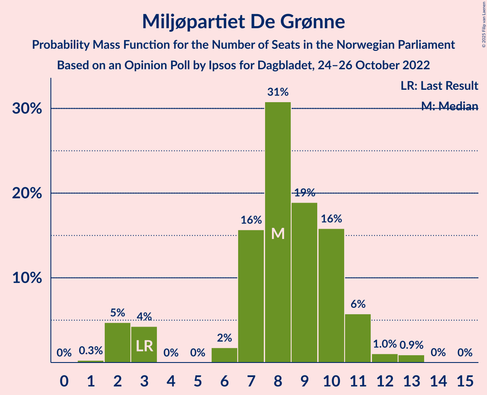
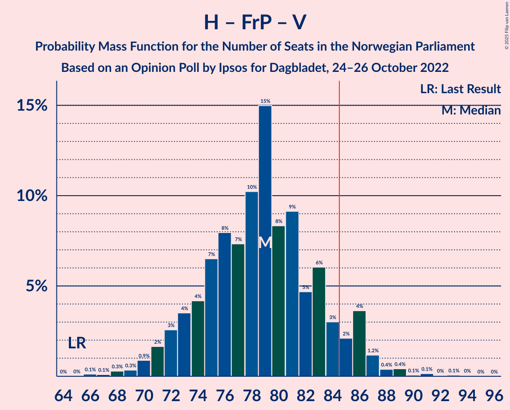
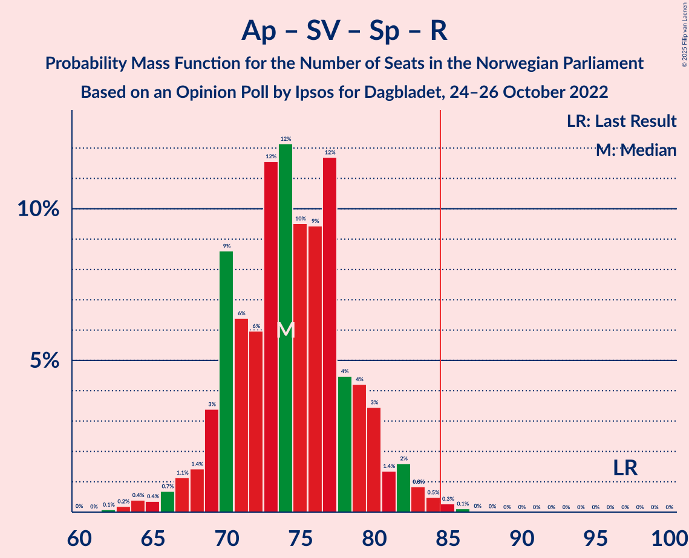
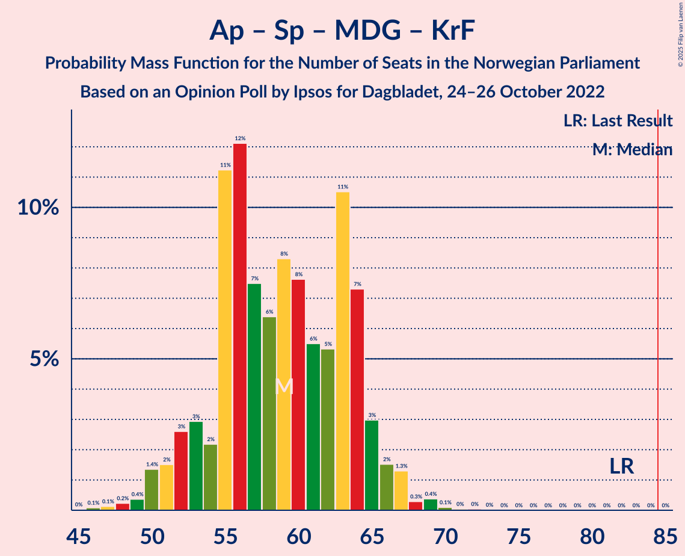

# Opinion Poll by Ipsos for Dagbladet, 24–26 October 2022

<a href="#voting-intentions">Voting Intentions</a> | <a href="#seats">Seats</a> | <a href="#coalitions">Coalitions</a> | <a href="#technical-information">Technical Information</a>

## Voting Intentions

### Confidence Intervals

| Party | Last Result | Poll Result | 80% Confidence Interval | 90% Confidence Interval | 95% Confidence Interval | 99% Confidence Interval |
|:-----:|:-----------:|:-----------:|:-----------------------:|:-----------------------:|:-----------------------:|:-----------------------:|
| Høyre | 20.4% | 29.2% | 27.1–31.5% |26.6–32.1% |26.0–32.6% |25.1–33.7% |
| Arbeiderpartiet | 26.2% | 18.0% | 16.3–20.0% |15.8–20.5% |15.4–21.0% |14.6–21.9% |
| Fremskrittspartiet | 11.6% | 13.1% | 11.6–14.8% |11.2–15.3% |10.9–15.8% |10.2–16.6% |
| Sosialistisk Venstreparti | 7.6% | 10.1% | 8.8–11.7% |8.4–12.1% |8.1–12.5% |7.5–13.3% |
| Senterpartiet | 13.5% | 7.0% | 5.9–8.3% |5.6–8.7% |5.3–9.1% |4.9–9.7% |
| Rødt | 4.7% | 6.4% | 5.4–7.7% |5.1–8.1% |4.9–8.4% |4.4–9.1% |
| Miljøpartiet De Grønne | 3.9% | 4.9% | 4.0–6.1% |3.8–6.4% |3.6–6.7% |3.2–7.3% |
| Venstre | 4.6% | 3.8% | 3.0–4.9% |2.8–5.2% |2.7–5.5% |2.3–6.0% |
| Kristelig Folkeparti | 3.8% | 3.7% | 2.9–4.8% |2.7–5.0% |2.5–5.3% |2.2–5.9% |

*Note:* The poll result column reflects the actual value used in the calculations. Published results may vary slightly, and in addition be rounded to fewer digits.

## Seats

### Confidence Intervals

| Party | Last Result | Median | 80% Confidence Interval | 90% Confidence Interval | 95% Confidence Interval | 99% Confidence Interval |
|:-----:|:-----------:|:------:|:-----------------------:|:-----------------------:|:-----------------------:|:-----------------------:|
| <a href="#høyre">Høyre</a> | 36 | 51 | 47–56 |46–56 |45–57 |43–60 |
| <a href="#arbeiderpartiet">Arbeiderpartiet</a> | 48 | 34 | 32–37 |31–39 |29–40 |28–42 |
| <a href="#fremskrittspartiet">Fremskrittspartiet</a> | 21 | 22 | 20–26 |19–27 |18–29 |17–31 |
| <a href="#sosialistisk-venstreparti">Sosialistisk Venstreparti</a> | 13 | 17 | 15–20 |13–21 |13–22 |12–23 |
| <a href="#senterpartiet">Senterpartiet</a> | 28 | 13 | 10–15 |9–15 |8–16 |7–17 |
| <a href="#rødt">Rødt</a> | 8 | 11 | 9–13 |8–14 |8–15 |7–16 |
| <a href="#miljøpartiet-de-grønne">Miljøpartiet De Grønne</a> | 3 | 8 | 6–10 |3–11 |2–11 |2–13 |
| <a href="#venstre">Venstre</a> | 8 | 3 | 2–8 |2–9 |2–9 |1–10 |
| <a href="#kristelig-folkeparti">Kristelig Folkeparti</a> | 3 | 3 | 2–8 |2–8 |2–9 |0–10 |

### Høyre

*For a full overview of the results for this party, see the [Høyre](party-høyre.html) page.*

| Number of Seats | Probability | Accumulated | Special Marks |
|:---------------:|:-----------:|:-----------:|:-------------:|
| 36 | 0% | 100% | Last Result |
| 37 | 0% | 100% |  |
| 38 | 0% | 100% |  |
| 39 | 0% | 100% |  |
| 40 | 0% | 100% |  |
| 41 | 0.1% | 100% |  |
| 42 | 0.2% | 99.9% |  |
| 43 | 0.4% | 99.7% |  |
| 44 | 1.1% | 99.3% |  |
| 45 | 2% | 98% |  |
| 46 | 3% | 97% |  |
| 47 | 5% | 94% |  |
| 48 | 9% | 88% |  |
| 49 | 11% | 79% |  |
| 50 | 11% | 68% |  |
| 51 | 14% | 58% | Median |
| 52 | 14% | 43% |  |
| 53 | 8% | 30% |  |
| 54 | 3% | 22% |  |
| 55 | 8% | 19% |  |
| 56 | 7% | 10% |  |
| 57 | 1.1% | 3% |  |
| 58 | 1.5% | 2% |  |
| 59 | 0.2% | 1.0% |  |
| 60 | 0.3% | 0.7% |  |
| 61 | 0.3% | 0.4% |  |
| 62 | 0% | 0.1% |  |
| 63 | 0% | 0.1% |  |
| 64 | 0% | 0% |  |

### Arbeiderpartiet

*For a full overview of the results for this party, see the [Arbeiderpartiet](party-arbeiderpartiet.html) page.*

| Number of Seats | Probability | Accumulated | Special Marks |
|:---------------:|:-----------:|:-----------:|:-------------:|
| 26 | 0% | 100% |  |
| 27 | 0.2% | 99.9% |  |
| 28 | 0.5% | 99.7% |  |
| 29 | 2% | 99.2% |  |
| 30 | 2% | 97% |  |
| 31 | 4% | 95% |  |
| 32 | 9% | 91% |  |
| 33 | 24% | 82% |  |
| 34 | 25% | 58% | Median |
| 35 | 10% | 33% |  |
| 36 | 7% | 23% |  |
| 37 | 7% | 16% |  |
| 38 | 3% | 9% |  |
| 39 | 3% | 6% |  |
| 40 | 0.7% | 3% |  |
| 41 | 0.8% | 2% |  |
| 42 | 1.0% | 1.4% |  |
| 43 | 0.3% | 0.4% |  |
| 44 | 0.1% | 0.1% |  |
| 45 | 0% | 0.1% |  |
| 46 | 0% | 0% |  |
| 47 | 0% | 0% |  |
| 48 | 0% | 0% | Last Result |

### Fremskrittspartiet

*For a full overview of the results for this party, see the [Fremskrittspartiet](party-fremskrittspartiet.html) page.*

| Number of Seats | Probability | Accumulated | Special Marks |
|:---------------:|:-----------:|:-----------:|:-------------:|
| 17 | 0.6% | 100% |  |
| 18 | 2% | 99.3% |  |
| 19 | 4% | 97% |  |
| 20 | 7% | 93% |  |
| 21 | 13% | 86% | Last Result |
| 22 | 24% | 73% | Median |
| 23 | 11% | 49% |  |
| 24 | 12% | 38% |  |
| 25 | 9% | 26% |  |
| 26 | 8% | 17% |  |
| 27 | 4% | 9% |  |
| 28 | 2% | 4% |  |
| 29 | 1.3% | 3% |  |
| 30 | 0.6% | 1.3% |  |
| 31 | 0.4% | 0.7% |  |
| 32 | 0.1% | 0.3% |  |
| 33 | 0.2% | 0.2% |  |
| 34 | 0% | 0.1% |  |
| 35 | 0% | 0% |  |

### Sosialistisk Venstreparti

*For a full overview of the results for this party, see the [Sosialistisk Venstreparti](party-sosialistiskvenstreparti.html) page.*

| Number of Seats | Probability | Accumulated | Special Marks |
|:---------------:|:-----------:|:-----------:|:-------------:|
| 10 | 0.1% | 100% |  |
| 11 | 0.3% | 99.9% |  |
| 12 | 1.4% | 99.6% |  |
| 13 | 4% | 98% | Last Result |
| 14 | 4% | 94% |  |
| 15 | 12% | 90% |  |
| 16 | 20% | 78% |  |
| 17 | 20% | 58% | Median |
| 18 | 16% | 38% |  |
| 19 | 7% | 22% |  |
| 20 | 7% | 15% |  |
| 21 | 4% | 7% |  |
| 22 | 2% | 3% |  |
| 23 | 0.6% | 0.9% |  |
| 24 | 0.2% | 0.3% |  |
| 25 | 0.1% | 0.1% |  |
| 26 | 0% | 0% |  |

### Senterpartiet

*For a full overview of the results for this party, see the [Senterpartiet](party-senterpartiet.html) page.*

| Number of Seats | Probability | Accumulated | Special Marks |
|:---------------:|:-----------:|:-----------:|:-------------:|
| 6 | 0.1% | 100% |  |
| 7 | 0.7% | 99.9% |  |
| 8 | 3% | 99.3% |  |
| 9 | 4% | 96% |  |
| 10 | 16% | 92% |  |
| 11 | 12% | 77% |  |
| 12 | 8% | 65% |  |
| 13 | 31% | 57% | Median |
| 14 | 12% | 26% |  |
| 15 | 10% | 14% |  |
| 16 | 3% | 4% |  |
| 17 | 1.1% | 1.4% |  |
| 18 | 0.2% | 0.2% |  |
| 19 | 0.1% | 0.1% |  |
| 20 | 0% | 0% |  |
| 21 | 0% | 0% |  |
| 22 | 0% | 0% |  |
| 23 | 0% | 0% |  |
| 24 | 0% | 0% |  |
| 25 | 0% | 0% |  |
| 26 | 0% | 0% |  |
| 27 | 0% | 0% |  |
| 28 | 0% | 0% | Last Result |

### Rødt

*For a full overview of the results for this party, see the [Rødt](party-rødt.html) page.*

| Number of Seats | Probability | Accumulated | Special Marks |
|:---------------:|:-----------:|:-----------:|:-------------:|
| 1 | 0.1% | 100% |  |
| 2 | 0% | 99.9% |  |
| 3 | 0% | 99.9% |  |
| 4 | 0% | 99.9% |  |
| 5 | 0% | 99.9% |  |
| 6 | 0.2% | 99.9% |  |
| 7 | 1.0% | 99.7% |  |
| 8 | 5% | 98.7% | Last Result |
| 9 | 15% | 94% |  |
| 10 | 23% | 79% |  |
| 11 | 24% | 56% | Median |
| 12 | 17% | 31% |  |
| 13 | 7% | 15% |  |
| 14 | 5% | 8% |  |
| 15 | 2% | 3% |  |
| 16 | 0.4% | 0.6% |  |
| 17 | 0.1% | 0.2% |  |
| 18 | 0% | 0% |  |

### Miljøpartiet De Grønne

*For a full overview of the results for this party, see the [Miljøpartiet De Grønne](party-miljøpartietdegrønne.html) page.*

| Number of Seats | Probability | Accumulated | Special Marks |
|:---------------:|:-----------:|:-----------:|:-------------:|
| 1 | 0.3% | 100% |  |
| 2 | 5% | 99.7% |  |
| 3 | 4% | 95% | Last Result |
| 4 | 0% | 91% |  |
| 5 | 0% | 91% |  |
| 6 | 2% | 91% |  |
| 7 | 16% | 89% |  |
| 8 | 31% | 73% | Median |
| 9 | 19% | 43% |  |
| 10 | 16% | 24% |  |
| 11 | 6% | 8% |  |
| 12 | 1.0% | 2% |  |
| 13 | 0.9% | 1.0% |  |
| 14 | 0% | 0.1% |  |
| 15 | 0% | 0% |  |

### Venstre

*For a full overview of the results for this party, see the [Venstre](party-venstre.html) page.*

| Number of Seats | Probability | Accumulated | Special Marks |
|:---------------:|:-----------:|:-----------:|:-------------:|
| 1 | 0.7% | 100% |  |
| 2 | 42% | 99.3% |  |
| 3 | 12% | 58% | Median |
| 4 | 0% | 45% |  |
| 5 | 0% | 45% |  |
| 6 | 5% | 45% |  |
| 7 | 16% | 40% |  |
| 8 | 18% | 24% | Last Result |
| 9 | 4% | 6% |  |
| 10 | 2% | 2% |  |
| 11 | 0.2% | 0.2% |  |
| 12 | 0% | 0% |  |

### Kristelig Folkeparti

*For a full overview of the results for this party, see the [Kristelig Folkeparti](party-kristeligfolkeparti.html) page.*

| Number of Seats | Probability | Accumulated | Special Marks |
|:---------------:|:-----------:|:-----------:|:-------------:|
| 0 | 0.6% | 100% |  |
| 1 | 0.9% | 99.4% |  |
| 2 | 35% | 98.5% |  |
| 3 | 26% | 63% | Last Result, Median |
| 4 | 0% | 38% |  |
| 5 | 0% | 38% |  |
| 6 | 3% | 37% |  |
| 7 | 24% | 35% |  |
| 8 | 7% | 11% |  |
| 9 | 3% | 4% |  |
| 10 | 0.4% | 0.6% |  |
| 11 | 0.2% | 0.2% |  |
| 12 | 0% | 0% |  |

## Coalitions

### Confidence Intervals

| Coalition | Last Result | Median | Majority? | 80% Confidence Interval | 90% Confidence Interval | 95% Confidence Interval | 99% Confidence Interval |
|:---------:|:-----------:|:------:|:---------:|:-----------------------:|:-----------------------:|:-----------------------:|:-----------------------:|
| Høyre – Fremskrittspartiet – Senterpartiet – Venstre – Kristelig Folkeparti | 96 | 95 | 99.5% | 90–100 | 88–101 | 87–103 | 84–106 |
| Høyre – Fremskrittspartiet – Miljøpartiet De Grønne – Venstre – Kristelig Folkeparti | 71 | 91 | 94% | 85–96 | 84–97 | 83–98 | 80–101 |
| Høyre – Fremskrittspartiet – Venstre – Kristelig Folkeparti | 68 | 83 | 34% | 78–88 | 76–89 | 75–91 | 72–95 |
| Arbeiderpartiet – Sosialistisk Venstreparti – Senterpartiet – Rødt – Miljøpartiet De Grønne | 100 | 82 | 31% | 77–88 | 76–89 | 74–91 | 70–93 |
| Høyre – Fremskrittspartiet – Venstre | 65 | 79 | 8% | 74–84 | 72–86 | 71–86 | 68–89 |
| Arbeiderpartiet – Sosialistisk Venstreparti – Senterpartiet – Miljøpartiet De Grønne – Kristelig Folkeparti | 95 | 76 | 1.4% | 71–81 | 69–82 | 68–83 | 65–86 |
| Arbeiderpartiet – Sosialistisk Venstreparti – Senterpartiet – Rødt | 97 | 74 | 0.5% | 70–79 | 69–80 | 67–82 | 64–84 |
| Høyre – Fremskrittspartiet | 57 | 74 | 0.7% | 70–79 | 68–80 | 68–81 | 65–85 |
| Arbeiderpartiet – Sosialistisk Venstreparti – Senterpartiet – Miljøpartiet De Grønne | 92 | 72 | 0% | 67–76 | 65–78 | 64–79 | 61–82 |
| Arbeiderpartiet – Sosialistisk Venstreparti – Rødt – Miljøpartiet De Grønne | 72 | 70 | 0% | 65–75 | 63–77 | 63–78 | 59–81 |
| Arbeiderpartiet – Sosialistisk Venstreparti – Senterpartiet | 89 | 63 | 0% | 60–68 | 59–69 | 57–70 | 55–72 |
| Høyre – Venstre – Kristelig Folkeparti | 47 | 60 | 0% | 55–65 | 53–67 | 52–67 | 50–70 |
| Arbeiderpartiet – Senterpartiet – Miljøpartiet De Grønne – Kristelig Folkeparti | 82 | 59 | 0% | 54–64 | 52–65 | 51–66 | 49–69 |
| Arbeiderpartiet – Sosialistisk Venstreparti | 61 | 51 | 0% | 48–55 | 47–57 | 46–58 | 44–60 |
| Arbeiderpartiet – Senterpartiet – Kristelig Folkeparti | 79 | 50 | 0% | 46–56 | 45–57 | 44–58 | 43–61 |
| Arbeiderpartiet – Senterpartiet | 76 | 47 | 0% | 43–50 | 42–51 | 41–52 | 40–54 |
| Senterpartiet – Venstre – Kristelig Folkeparti | 39 | 21 | 0% | 16–26 | 15–28 | 15–30 | 13–31 |

### Høyre – Fremskrittspartiet – Senterpartiet – Venstre – Kristelig Folkeparti

| Number of Seats | Probability | Accumulated | Special Marks |
|:---------------:|:-----------:|:-----------:|:-------------:|
| 81 | 0% | 100% |  |
| 82 | 0.1% | 99.9% |  |
| 83 | 0.2% | 99.9% |  |
| 84 | 0.2% | 99.7% |  |
| 85 | 0.2% | 99.5% | Majority |
| 86 | 0.9% | 99.3% |  |
| 87 | 2% | 98% |  |
| 88 | 1.3% | 96% |  |
| 89 | 3% | 95% |  |
| 90 | 2% | 92% |  |
| 91 | 4% | 90% |  |
| 92 | 12% | 85% | Median |
| 93 | 6% | 74% |  |
| 94 | 9% | 67% |  |
| 95 | 9% | 58% |  |
| 96 | 11% | 50% | Last Result |
| 97 | 8% | 39% |  |
| 98 | 7% | 31% |  |
| 99 | 11% | 24% |  |
| 100 | 4% | 13% |  |
| 101 | 4% | 9% |  |
| 102 | 2% | 5% |  |
| 103 | 1.0% | 3% |  |
| 104 | 0.7% | 2% |  |
| 105 | 0.7% | 1.2% |  |
| 106 | 0.3% | 0.5% |  |
| 107 | 0.2% | 0.3% |  |
| 108 | 0% | 0.1% |  |
| 109 | 0% | 0.1% |  |
| 110 | 0% | 0.1% |  |
| 111 | 0% | 0% |  |

### Høyre – Fremskrittspartiet – Miljøpartiet De Grønne – Venstre – Kristelig Folkeparti

| Number of Seats | Probability | Accumulated | Special Marks |
|:---------------:|:-----------:|:-----------:|:-------------:|
| 71 | 0% | 100% | Last Result |
| 72 | 0% | 100% |  |
| 73 | 0% | 100% |  |
| 74 | 0% | 100% |  |
| 75 | 0% | 100% |  |
| 76 | 0% | 100% |  |
| 77 | 0% | 100% |  |
| 78 | 0.2% | 99.9% |  |
| 79 | 0.1% | 99.8% |  |
| 80 | 0.3% | 99.7% |  |
| 81 | 0.4% | 99.4% |  |
| 82 | 0.8% | 99.0% |  |
| 83 | 0.9% | 98% |  |
| 84 | 4% | 97% |  |
| 85 | 4% | 94% | Majority |
| 86 | 4% | 89% |  |
| 87 | 5% | 85% | Median |
| 88 | 7% | 80% |  |
| 89 | 8% | 73% |  |
| 90 | 6% | 66% |  |
| 91 | 14% | 60% |  |
| 92 | 10% | 46% |  |
| 93 | 6% | 36% |  |
| 94 | 9% | 30% |  |
| 95 | 8% | 21% |  |
| 96 | 4% | 12% |  |
| 97 | 4% | 9% |  |
| 98 | 2% | 4% |  |
| 99 | 1.3% | 2% |  |
| 100 | 0.4% | 0.9% |  |
| 101 | 0.1% | 0.5% |  |
| 102 | 0.2% | 0.4% |  |
| 103 | 0.1% | 0.2% |  |
| 104 | 0% | 0.1% |  |
| 105 | 0% | 0% |  |

### Høyre – Fremskrittspartiet – Venstre – Kristelig Folkeparti

| Number of Seats | Probability | Accumulated | Special Marks |
|:---------------:|:-----------:|:-----------:|:-------------:|
| 68 | 0% | 100% | Last Result |
| 69 | 0.1% | 100% |  |
| 70 | 0.1% | 99.9% |  |
| 71 | 0.2% | 99.8% |  |
| 72 | 0.2% | 99.6% |  |
| 73 | 0.4% | 99.4% |  |
| 74 | 0.6% | 99.0% |  |
| 75 | 2% | 98% |  |
| 76 | 3% | 97% |  |
| 77 | 3% | 93% |  |
| 78 | 4% | 91% |  |
| 79 | 5% | 87% | Median |
| 80 | 6% | 82% |  |
| 81 | 8% | 75% |  |
| 82 | 11% | 67% |  |
| 83 | 12% | 56% |  |
| 84 | 10% | 44% |  |
| 85 | 8% | 34% | Majority |
| 86 | 11% | 27% |  |
| 87 | 4% | 16% |  |
| 88 | 3% | 12% |  |
| 89 | 4% | 9% |  |
| 90 | 1.2% | 4% |  |
| 91 | 1.5% | 3% |  |
| 92 | 0.6% | 2% |  |
| 93 | 0.3% | 1.1% |  |
| 94 | 0.2% | 0.8% |  |
| 95 | 0.3% | 0.6% |  |
| 96 | 0.2% | 0.3% |  |
| 97 | 0% | 0% |  |

### Arbeiderpartiet – Sosialistisk Venstreparti – Senterpartiet – Rødt – Miljøpartiet De Grønne

| Number of Seats | Probability | Accumulated | Special Marks |
|:---------------:|:-----------:|:-----------:|:-------------:|
| 68 | 0.1% | 100% |  |
| 69 | 0.3% | 99.9% |  |
| 70 | 0.2% | 99.6% |  |
| 71 | 0.1% | 99.4% |  |
| 72 | 0.5% | 99.3% |  |
| 73 | 1.0% | 98.7% |  |
| 74 | 0.9% | 98% |  |
| 75 | 1.2% | 97% |  |
| 76 | 2% | 96% |  |
| 77 | 4% | 93% |  |
| 78 | 4% | 89% |  |
| 79 | 10% | 85% |  |
| 80 | 8% | 75% |  |
| 81 | 6% | 67% |  |
| 82 | 12% | 61% |  |
| 83 | 8% | 49% | Median |
| 84 | 10% | 41% |  |
| 85 | 12% | 31% | Majority |
| 86 | 4% | 19% |  |
| 87 | 4% | 15% |  |
| 88 | 3% | 11% |  |
| 89 | 3% | 8% |  |
| 90 | 2% | 5% |  |
| 91 | 0.9% | 3% |  |
| 92 | 1.1% | 2% |  |
| 93 | 0.5% | 0.8% |  |
| 94 | 0.2% | 0.3% |  |
| 95 | 0.1% | 0.1% |  |
| 96 | 0% | 0% |  |
| 97 | 0% | 0% |  |
| 98 | 0% | 0% |  |
| 99 | 0% | 0% |  |
| 100 | 0% | 0% | Last Result |

### Høyre – Fremskrittspartiet – Venstre

| Number of Seats | Probability | Accumulated | Special Marks |
|:---------------:|:-----------:|:-----------:|:-------------:|
| 65 | 0% | 100% | Last Result |
| 66 | 0.1% | 100% |  |
| 67 | 0.1% | 99.9% |  |
| 68 | 0.3% | 99.8% |  |
| 69 | 0.3% | 99.5% |  |
| 70 | 0.9% | 99.1% |  |
| 71 | 2% | 98% |  |
| 72 | 3% | 97% |  |
| 73 | 4% | 94% |  |
| 74 | 4% | 91% |  |
| 75 | 7% | 86% |  |
| 76 | 8% | 80% | Median |
| 77 | 7% | 72% |  |
| 78 | 10% | 65% |  |
| 79 | 15% | 54% |  |
| 80 | 8% | 39% |  |
| 81 | 9% | 31% |  |
| 82 | 5% | 22% |  |
| 83 | 6% | 17% |  |
| 84 | 3% | 11% |  |
| 85 | 2% | 8% | Majority |
| 86 | 4% | 6% |  |
| 87 | 1.2% | 2% |  |
| 88 | 0.4% | 1.2% |  |
| 89 | 0.4% | 0.8% |  |
| 90 | 0.1% | 0.4% |  |
| 91 | 0.1% | 0.3% |  |
| 92 | 0% | 0.2% |  |
| 93 | 0.1% | 0.1% |  |
| 94 | 0% | 0.1% |  |
| 95 | 0% | 0% |  |

### Arbeiderpartiet – Sosialistisk Venstreparti – Senterpartiet – Miljøpartiet De Grønne – Kristelig Folkeparti

| Number of Seats | Probability | Accumulated | Special Marks |
|:---------------:|:-----------:|:-----------:|:-------------:|
| 62 | 0% | 100% |  |
| 63 | 0.1% | 99.9% |  |
| 64 | 0.1% | 99.9% |  |
| 65 | 0.2% | 99.7% |  |
| 66 | 0.8% | 99.5% |  |
| 67 | 0.9% | 98.7% |  |
| 68 | 2% | 98% |  |
| 69 | 2% | 96% |  |
| 70 | 4% | 94% |  |
| 71 | 6% | 90% |  |
| 72 | 8% | 85% |  |
| 73 | 9% | 77% |  |
| 74 | 9% | 68% |  |
| 75 | 7% | 60% | Median |
| 76 | 7% | 53% |  |
| 77 | 9% | 45% |  |
| 78 | 5% | 37% |  |
| 79 | 13% | 32% |  |
| 80 | 6% | 19% |  |
| 81 | 4% | 13% |  |
| 82 | 5% | 9% |  |
| 83 | 1.3% | 4% |  |
| 84 | 0.9% | 2% |  |
| 85 | 0.7% | 1.4% | Majority |
| 86 | 0.4% | 0.7% |  |
| 87 | 0.1% | 0.3% |  |
| 88 | 0.1% | 0.1% |  |
| 89 | 0% | 0.1% |  |
| 90 | 0% | 0% |  |
| 91 | 0% | 0% |  |
| 92 | 0% | 0% |  |
| 93 | 0% | 0% |  |
| 94 | 0% | 0% |  |
| 95 | 0% | 0% | Last Result |

### Arbeiderpartiet – Sosialistisk Venstreparti – Senterpartiet – Rødt

| Number of Seats | Probability | Accumulated | Special Marks |
|:---------------:|:-----------:|:-----------:|:-------------:|
| 61 | 0% | 100% |  |
| 62 | 0.1% | 99.9% |  |
| 63 | 0.2% | 99.8% |  |
| 64 | 0.4% | 99.7% |  |
| 65 | 0.4% | 99.3% |  |
| 66 | 0.7% | 98.9% |  |
| 67 | 1.1% | 98% |  |
| 68 | 1.4% | 97% |  |
| 69 | 3% | 96% |  |
| 70 | 9% | 92% |  |
| 71 | 6% | 84% |  |
| 72 | 6% | 77% |  |
| 73 | 12% | 71% |  |
| 74 | 12% | 60% |  |
| 75 | 10% | 48% | Median |
| 76 | 9% | 38% |  |
| 77 | 12% | 29% |  |
| 78 | 4% | 17% |  |
| 79 | 4% | 12% |  |
| 80 | 3% | 8% |  |
| 81 | 1.4% | 5% |  |
| 82 | 2% | 3% |  |
| 83 | 0.8% | 2% |  |
| 84 | 0.5% | 1.0% |  |
| 85 | 0.3% | 0.5% | Majority |
| 86 | 0.1% | 0.2% |  |
| 87 | 0% | 0.1% |  |
| 88 | 0% | 0% |  |
| 89 | 0% | 0% |  |
| 90 | 0% | 0% |  |
| 91 | 0% | 0% |  |
| 92 | 0% | 0% |  |
| 93 | 0% | 0% |  |
| 94 | 0% | 0% |  |
| 95 | 0% | 0% |  |
| 96 | 0% | 0% |  |
| 97 | 0% | 0% | Last Result |

### Høyre – Fremskrittspartiet

| Number of Seats | Probability | Accumulated | Special Marks |
|:---------------:|:-----------:|:-----------:|:-------------:|
| 57 | 0% | 100% | Last Result |
| 58 | 0% | 100% |  |
| 59 | 0% | 100% |  |
| 60 | 0% | 100% |  |
| 61 | 0% | 100% |  |
| 62 | 0% | 100% |  |
| 63 | 0.1% | 100% |  |
| 64 | 0.2% | 99.8% |  |
| 65 | 0.4% | 99.7% |  |
| 66 | 0.6% | 99.3% |  |
| 67 | 1.1% | 98.6% |  |
| 68 | 3% | 98% |  |
| 69 | 4% | 95% |  |
| 70 | 7% | 90% |  |
| 71 | 7% | 83% |  |
| 72 | 11% | 76% |  |
| 73 | 11% | 65% | Median |
| 74 | 8% | 54% |  |
| 75 | 9% | 46% |  |
| 76 | 11% | 37% |  |
| 77 | 10% | 26% |  |
| 78 | 6% | 16% |  |
| 79 | 5% | 10% |  |
| 80 | 1.4% | 5% |  |
| 81 | 2% | 4% |  |
| 82 | 0.6% | 2% |  |
| 83 | 0.6% | 2% |  |
| 84 | 0.2% | 0.9% |  |
| 85 | 0.3% | 0.7% | Majority |
| 86 | 0.2% | 0.4% |  |
| 87 | 0.2% | 0.2% |  |
| 88 | 0% | 0% |  |

### Arbeiderpartiet – Sosialistisk Venstreparti – Senterpartiet – Miljøpartiet De Grønne

| Number of Seats | Probability | Accumulated | Special Marks |
|:---------------:|:-----------:|:-----------:|:-------------:|
| 58 | 0% | 100% |  |
| 59 | 0.1% | 99.9% |  |
| 60 | 0.3% | 99.9% |  |
| 61 | 0.2% | 99.6% |  |
| 62 | 0.8% | 99.4% |  |
| 63 | 0.5% | 98.6% |  |
| 64 | 1.4% | 98% |  |
| 65 | 3% | 97% |  |
| 66 | 3% | 94% |  |
| 67 | 4% | 91% |  |
| 68 | 7% | 88% |  |
| 69 | 8% | 81% |  |
| 70 | 11% | 73% |  |
| 71 | 9% | 62% |  |
| 72 | 16% | 53% | Median |
| 73 | 8% | 37% |  |
| 74 | 9% | 29% |  |
| 75 | 7% | 20% |  |
| 76 | 3% | 13% |  |
| 77 | 2% | 9% |  |
| 78 | 3% | 7% |  |
| 79 | 2% | 4% |  |
| 80 | 1.0% | 2% |  |
| 81 | 0.5% | 1.1% |  |
| 82 | 0.5% | 0.6% |  |
| 83 | 0.1% | 0.1% |  |
| 84 | 0% | 0.1% |  |
| 85 | 0% | 0% | Majority |
| 86 | 0% | 0% |  |
| 87 | 0% | 0% |  |
| 88 | 0% | 0% |  |
| 89 | 0% | 0% |  |
| 90 | 0% | 0% |  |
| 91 | 0% | 0% |  |
| 92 | 0% | 0% | Last Result |

### Arbeiderpartiet – Sosialistisk Venstreparti – Rødt – Miljøpartiet De Grønne

| Number of Seats | Probability | Accumulated | Special Marks |
|:---------------:|:-----------:|:-----------:|:-------------:|
| 56 | 0% | 100% |  |
| 57 | 0.1% | 99.9% |  |
| 58 | 0.3% | 99.8% |  |
| 59 | 0.2% | 99.6% |  |
| 60 | 0.2% | 99.4% |  |
| 61 | 0.5% | 99.2% |  |
| 62 | 1.0% | 98.7% |  |
| 63 | 3% | 98% |  |
| 64 | 3% | 95% |  |
| 65 | 3% | 91% |  |
| 66 | 4% | 88% |  |
| 67 | 7% | 85% |  |
| 68 | 8% | 77% |  |
| 69 | 18% | 69% |  |
| 70 | 8% | 51% | Median |
| 71 | 6% | 43% |  |
| 72 | 11% | 37% | Last Result |
| 73 | 7% | 26% |  |
| 74 | 8% | 20% |  |
| 75 | 3% | 12% |  |
| 76 | 3% | 9% |  |
| 77 | 2% | 5% |  |
| 78 | 0.8% | 3% |  |
| 79 | 0.8% | 2% |  |
| 80 | 0.3% | 1.2% |  |
| 81 | 0.7% | 0.8% |  |
| 82 | 0.1% | 0.2% |  |
| 83 | 0.1% | 0.1% |  |
| 84 | 0% | 0% |  |

### Arbeiderpartiet – Sosialistisk Venstreparti – Senterpartiet

| Number of Seats | Probability | Accumulated | Special Marks |
|:---------------:|:-----------:|:-----------:|:-------------:|
| 52 | 0% | 100% |  |
| 53 | 0.1% | 99.9% |  |
| 54 | 0.1% | 99.9% |  |
| 55 | 0.6% | 99.7% |  |
| 56 | 0.8% | 99.2% |  |
| 57 | 2% | 98% |  |
| 58 | 2% | 97% |  |
| 59 | 5% | 95% |  |
| 60 | 5% | 91% |  |
| 61 | 13% | 86% |  |
| 62 | 9% | 73% |  |
| 63 | 17% | 64% |  |
| 64 | 12% | 47% | Median |
| 65 | 10% | 35% |  |
| 66 | 8% | 25% |  |
| 67 | 6% | 17% |  |
| 68 | 4% | 11% |  |
| 69 | 3% | 7% |  |
| 70 | 1.3% | 4% |  |
| 71 | 1.5% | 2% |  |
| 72 | 0.5% | 1.0% |  |
| 73 | 0.3% | 0.5% |  |
| 74 | 0.1% | 0.2% |  |
| 75 | 0% | 0.1% |  |
| 76 | 0% | 0% |  |
| 77 | 0% | 0% |  |
| 78 | 0% | 0% |  |
| 79 | 0% | 0% |  |
| 80 | 0% | 0% |  |
| 81 | 0% | 0% |  |
| 82 | 0% | 0% |  |
| 83 | 0% | 0% |  |
| 84 | 0% | 0% |  |
| 85 | 0% | 0% | Majority |
| 86 | 0% | 0% |  |
| 87 | 0% | 0% |  |
| 88 | 0% | 0% |  |
| 89 | 0% | 0% | Last Result |

### Høyre – Venstre – Kristelig Folkeparti

| Number of Seats | Probability | Accumulated | Special Marks |
|:---------------:|:-----------:|:-----------:|:-------------:|
| 47 | 0.1% | 100% | Last Result |
| 48 | 0.1% | 99.9% |  |
| 49 | 0.1% | 99.8% |  |
| 50 | 0.6% | 99.7% |  |
| 51 | 0.9% | 99.1% |  |
| 52 | 0.8% | 98% |  |
| 53 | 2% | 97% |  |
| 54 | 3% | 95% |  |
| 55 | 4% | 92% |  |
| 56 | 4% | 88% |  |
| 57 | 12% | 85% | Median |
| 58 | 12% | 73% |  |
| 59 | 6% | 61% |  |
| 60 | 13% | 55% |  |
| 61 | 9% | 42% |  |
| 62 | 6% | 33% |  |
| 63 | 4% | 27% |  |
| 64 | 8% | 23% |  |
| 65 | 5% | 14% |  |
| 66 | 3% | 9% |  |
| 67 | 4% | 6% |  |
| 68 | 0.8% | 2% |  |
| 69 | 0.4% | 1.2% |  |
| 70 | 0.3% | 0.8% |  |
| 71 | 0.1% | 0.4% |  |
| 72 | 0.1% | 0.3% |  |
| 73 | 0.2% | 0.2% |  |
| 74 | 0% | 0.1% |  |
| 75 | 0% | 0% |  |

### Arbeiderpartiet – Senterpartiet – Miljøpartiet De Grønne – Kristelig Folkeparti

| Number of Seats | Probability | Accumulated | Special Marks |
|:---------------:|:-----------:|:-----------:|:-------------:|
| 46 | 0.1% | 100% |  |
| 47 | 0.1% | 99.9% |  |
| 48 | 0.2% | 99.7% |  |
| 49 | 0.4% | 99.5% |  |
| 50 | 1.4% | 99.1% |  |
| 51 | 2% | 98% |  |
| 52 | 3% | 96% |  |
| 53 | 3% | 94% |  |
| 54 | 2% | 91% |  |
| 55 | 11% | 89% |  |
| 56 | 12% | 77% |  |
| 57 | 7% | 65% |  |
| 58 | 6% | 58% | Median |
| 59 | 8% | 51% |  |
| 60 | 8% | 43% |  |
| 61 | 6% | 35% |  |
| 62 | 5% | 30% |  |
| 63 | 11% | 25% |  |
| 64 | 7% | 14% |  |
| 65 | 3% | 7% |  |
| 66 | 2% | 4% |  |
| 67 | 1.3% | 2% |  |
| 68 | 0.3% | 0.9% |  |
| 69 | 0.4% | 0.6% |  |
| 70 | 0.1% | 0.2% |  |
| 71 | 0% | 0.1% |  |
| 72 | 0% | 0.1% |  |
| 73 | 0% | 0% |  |
| 74 | 0% | 0% |  |
| 75 | 0% | 0% |  |
| 76 | 0% | 0% |  |
| 77 | 0% | 0% |  |
| 78 | 0% | 0% |  |
| 79 | 0% | 0% |  |
| 80 | 0% | 0% |  |
| 81 | 0% | 0% |  |
| 82 | 0% | 0% | Last Result |

### Arbeiderpartiet – Sosialistisk Venstreparti

| Number of Seats | Probability | Accumulated | Special Marks |
|:---------------:|:-----------:|:-----------:|:-------------:|
| 41 | 0% | 100% |  |
| 42 | 0.1% | 99.9% |  |
| 43 | 0.2% | 99.9% |  |
| 44 | 0.3% | 99.7% |  |
| 45 | 0.8% | 99.4% |  |
| 46 | 3% | 98.5% |  |
| 47 | 4% | 96% |  |
| 48 | 6% | 91% |  |
| 49 | 11% | 86% |  |
| 50 | 18% | 74% |  |
| 51 | 19% | 56% | Median |
| 52 | 7% | 37% |  |
| 53 | 8% | 29% |  |
| 54 | 8% | 21% |  |
| 55 | 5% | 13% |  |
| 56 | 3% | 8% |  |
| 57 | 3% | 6% |  |
| 58 | 2% | 3% |  |
| 59 | 0.5% | 1.4% |  |
| 60 | 0.6% | 0.9% |  |
| 61 | 0.2% | 0.3% | Last Result |
| 62 | 0% | 0.1% |  |
| 63 | 0% | 0% |  |

### Arbeiderpartiet – Senterpartiet – Kristelig Folkeparti

| Number of Seats | Probability | Accumulated | Special Marks |
|:---------------:|:-----------:|:-----------:|:-------------:|
| 40 | 0.1% | 100% |  |
| 41 | 0.1% | 99.9% |  |
| 42 | 0.3% | 99.8% |  |
| 43 | 1.0% | 99.5% |  |
| 44 | 2% | 98% |  |
| 45 | 2% | 97% |  |
| 46 | 9% | 95% |  |
| 47 | 7% | 86% |  |
| 48 | 8% | 79% |  |
| 49 | 14% | 71% |  |
| 50 | 9% | 57% | Median |
| 51 | 8% | 48% |  |
| 52 | 7% | 41% |  |
| 53 | 6% | 34% |  |
| 54 | 10% | 27% |  |
| 55 | 5% | 17% |  |
| 56 | 7% | 12% |  |
| 57 | 2% | 5% |  |
| 58 | 1.1% | 3% |  |
| 59 | 0.6% | 1.5% |  |
| 60 | 0.3% | 0.9% |  |
| 61 | 0.3% | 0.6% |  |
| 62 | 0.2% | 0.2% |  |
| 63 | 0% | 0.1% |  |
| 64 | 0% | 0% |  |
| 65 | 0% | 0% |  |
| 66 | 0% | 0% |  |
| 67 | 0% | 0% |  |
| 68 | 0% | 0% |  |
| 69 | 0% | 0% |  |
| 70 | 0% | 0% |  |
| 71 | 0% | 0% |  |
| 72 | 0% | 0% |  |
| 73 | 0% | 0% |  |
| 74 | 0% | 0% |  |
| 75 | 0% | 0% |  |
| 76 | 0% | 0% |  |
| 77 | 0% | 0% |  |
| 78 | 0% | 0% |  |
| 79 | 0% | 0% | Last Result |

### Arbeiderpartiet – Senterpartiet

| Number of Seats | Probability | Accumulated | Special Marks |
|:---------------:|:-----------:|:-----------:|:-------------:|
| 37 | 0% | 100% |  |
| 38 | 0.2% | 99.9% |  |
| 39 | 0.2% | 99.7% |  |
| 40 | 1.2% | 99.5% |  |
| 41 | 2% | 98% |  |
| 42 | 3% | 97% |  |
| 43 | 9% | 93% |  |
| 44 | 12% | 85% |  |
| 45 | 5% | 73% |  |
| 46 | 16% | 68% |  |
| 47 | 17% | 52% | Median |
| 48 | 12% | 35% |  |
| 49 | 11% | 23% |  |
| 50 | 5% | 11% |  |
| 51 | 2% | 6% |  |
| 52 | 2% | 4% |  |
| 53 | 0.9% | 2% |  |
| 54 | 0.7% | 1.0% |  |
| 55 | 0.2% | 0.4% |  |
| 56 | 0.1% | 0.2% |  |
| 57 | 0.1% | 0.1% |  |
| 58 | 0% | 0% |  |
| 59 | 0% | 0% |  |
| 60 | 0% | 0% |  |
| 61 | 0% | 0% |  |
| 62 | 0% | 0% |  |
| 63 | 0% | 0% |  |
| 64 | 0% | 0% |  |
| 65 | 0% | 0% |  |
| 66 | 0% | 0% |  |
| 67 | 0% | 0% |  |
| 68 | 0% | 0% |  |
| 69 | 0% | 0% |  |
| 70 | 0% | 0% |  |
| 71 | 0% | 0% |  |
| 72 | 0% | 0% |  |
| 73 | 0% | 0% |  |
| 74 | 0% | 0% |  |
| 75 | 0% | 0% |  |
| 76 | 0% | 0% | Last Result |

### Senterpartiet – Venstre – Kristelig Folkeparti

| Number of Seats | Probability | Accumulated | Special Marks |
|:---------------:|:-----------:|:-----------:|:-------------:|
| 12 | 0.2% | 100% |  |
| 13 | 0.9% | 99.8% |  |
| 14 | 1.2% | 98.9% |  |
| 15 | 5% | 98% |  |
| 16 | 6% | 93% |  |
| 17 | 7% | 86% |  |
| 18 | 5% | 80% |  |
| 19 | 7% | 74% | Median |
| 20 | 9% | 68% |  |
| 21 | 9% | 58% |  |
| 22 | 15% | 49% |  |
| 23 | 8% | 34% |  |
| 24 | 8% | 26% |  |
| 25 | 6% | 19% |  |
| 26 | 3% | 12% |  |
| 27 | 2% | 9% |  |
| 28 | 3% | 7% |  |
| 29 | 2% | 5% |  |
| 30 | 2% | 3% |  |
| 31 | 0.4% | 0.6% |  |
| 32 | 0.1% | 0.2% |  |
| 33 | 0.1% | 0.1% |  |
| 34 | 0% | 0% |  |
| 35 | 0% | 0% |  |
| 36 | 0% | 0% |  |
| 37 | 0% | 0% |  |
| 38 | 0% | 0% |  |
| 39 | 0% | 0% | Last Result |

## Technical Information

### Opinion Poll

+ **Polling firm:** Ipsos
+ **Commissioner(s):** Dagbladet
+ **Fieldwork period:** 24–26 October 2022

### Calculations

+ **Sample size:** 732
+ **Simulations done:** 1,048,576
+ **Error estimate:** 3.78%

