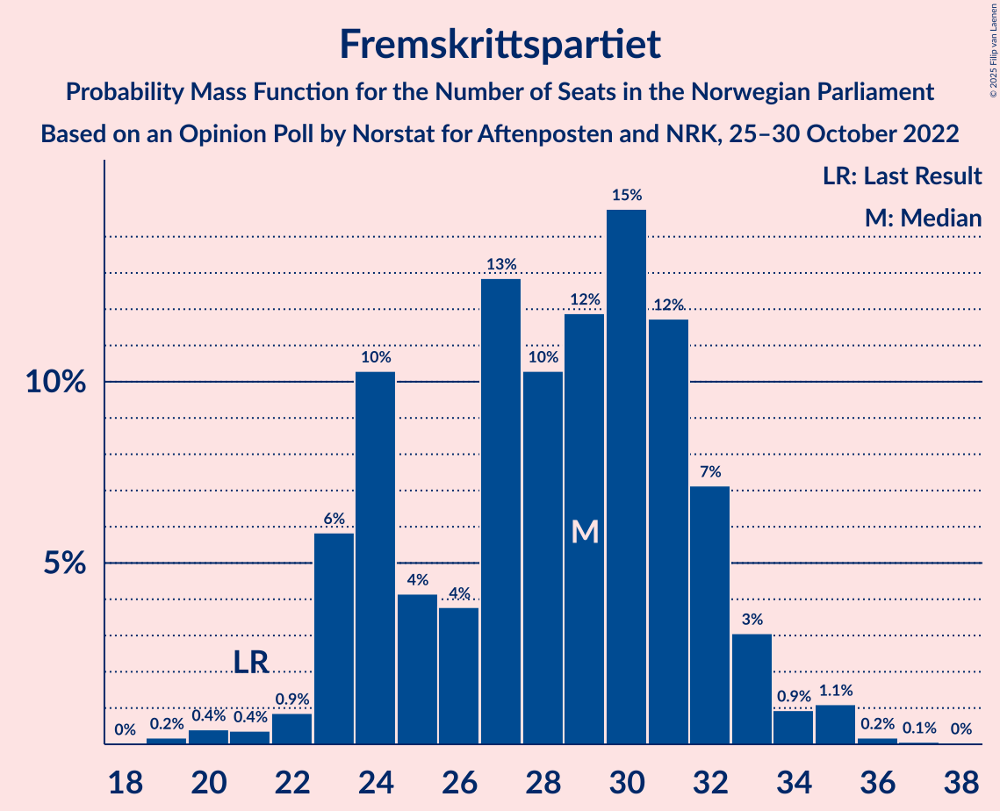
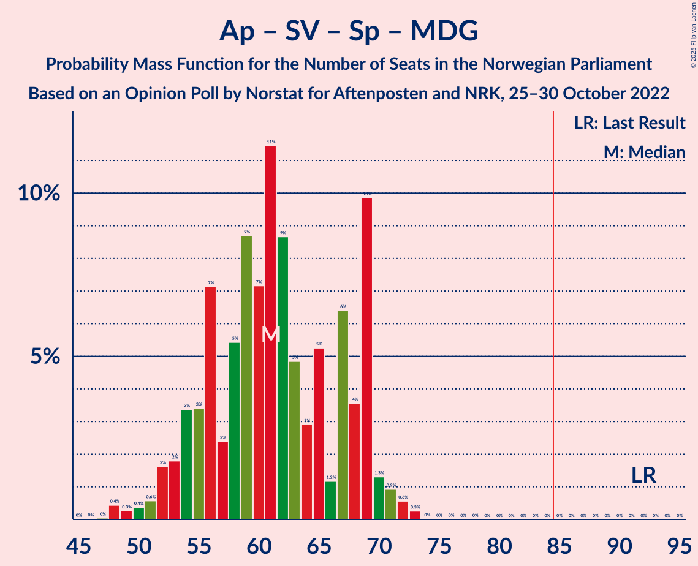

# Opinion Poll by Norstat for Aftenposten and NRK, 25–30 October 2022

<a href="#voting-intentions">Voting Intentions</a> | <a href="#seats">Seats</a> | <a href="#coalitions">Coalitions</a> | <a href="#technical-information">Technical Information</a>

## Voting Intentions

### Confidence Intervals

| Party | Last Result | Poll Result | 80% Confidence Interval | 90% Confidence Interval | 95% Confidence Interval | 99% Confidence Interval |
|:-----:|:-----------:|:-----------:|:-----------------------:|:-----------------------:|:-----------------------:|:-----------------------:|
| Høyre | 20.4% | 32.4% | 30.5–34.4% |29.9–34.9% |29.5–35.4% |28.6–36.4% |
| Arbeiderpartiet | 26.2% | 18.2% | 16.7–19.9% |16.2–20.4% |15.9–20.8% |15.2–21.6% |
| Fremskrittspartiet | 11.6% | 14.7% | 13.3–16.3% |12.9–16.7% |12.6–17.1% |11.9–17.9% |
| Sosialistisk Venstreparti | 7.6% | 8.4% | 7.3–9.6% |7.0–10.0% |6.8–10.3% |6.3–10.9% |
| Rødt | 4.7% | 5.9% | 5.0–7.0% |4.8–7.3% |4.6–7.6% |4.2–8.2% |
| Senterpartiet | 13.5% | 4.3% | 3.6–5.3% |3.4–5.6% |3.2–5.8% |2.9–6.3% |
| Miljøpartiet De Grønne | 3.9% | 3.7% | 3.0–4.6% |2.8–4.9% |2.7–5.1% |2.4–5.6% |
| Kristelig Folkeparti | 3.8% | 3.6% | 2.9–4.5% |2.7–4.8% |2.6–5.0% |2.3–5.5% |
| Venstre | 4.6% | 3.4% | 2.7–4.3% |2.6–4.5% |2.4–4.8% |2.1–5.2% |
| Industri- og Næringspartiet | 0.3% | 2.0% | 1.5–2.7% |1.4–2.9% |1.3–3.1% |1.1–3.5% |

*Note:* The poll result column reflects the actual value used in the calculations. Published results may vary slightly, and in addition be rounded to fewer digits.

## Seats

### Confidence Intervals

| Party | Last Result | Median | 80% Confidence Interval | 90% Confidence Interval | 95% Confidence Interval | 99% Confidence Interval |
|:-----:|:-----------:|:------:|:-----------------------:|:-----------------------:|:-----------------------:|:-----------------------:|
| <a href="#høyre">Høyre</a> | 36 | 59 | 54–64 |53–67 |53–68 |51–69 |
| <a href="#arbeiderpartiet">Arbeiderpartiet</a> | 48 | 36 | 32–38 |31–40 |31–41 |30–43 |
| <a href="#fremskrittspartiet">Fremskrittspartiet</a> | 21 | 29 | 24–32 |23–33 |23–33 |20–35 |
| <a href="#sosialistisk-venstreparti">Sosialistisk Venstreparti</a> | 13 | 15 | 12–18 |11–18 |11–19 |9–20 |
| <a href="#rødt">Rødt</a> | 8 | 10 | 8–13 |8–13 |7–14 |1–15 |
| <a href="#senterpartiet">Senterpartiet</a> | 28 | 7 | 0–10 |0–10 |0–11 |0–12 |
| <a href="#miljøpartiet-de-grønne">Miljøpartiet De Grønne</a> | 3 | 3 | 1–8 |1–8 |1–9 |1–10 |
| <a href="#kristelig-folkeparti">Kristelig Folkeparti</a> | 3 | 3 | 2–8 |2–8 |1–9 |1–9 |
| <a href="#venstre">Venstre</a> | 8 | 2 | 2–8 |2–8 |2–9 |1–9 |
| <a href="#industri--og-næringspartiet">Industri- og Næringspartiet</a> | 0 | 0 | 0–2 |0–2 |0–2 |0–3 |

### Høyre

*For a full overview of the results for this party, see the [Høyre](party-høyre.html) page.*

| Number of Seats | Probability | Accumulated | Special Marks |
|:---------------:|:-----------:|:-----------:|:-------------:|
| 36 | 0% | 100% | Last Result |
| 37 | 0% | 100% |  |
| 38 | 0% | 100% |  |
| 39 | 0% | 100% |  |
| 40 | 0% | 100% |  |
| 41 | 0% | 100% |  |
| 42 | 0% | 100% |  |
| 43 | 0% | 100% |  |
| 44 | 0% | 100% |  |
| 45 | 0% | 100% |  |
| 46 | 0% | 100% |  |
| 47 | 0% | 100% |  |
| 48 | 0% | 100% |  |
| 49 | 0.2% | 100% |  |
| 50 | 0.3% | 99.8% |  |
| 51 | 0.7% | 99.5% |  |
| 52 | 1.1% | 98.9% |  |
| 53 | 3% | 98% |  |
| 54 | 9% | 95% |  |
| 55 | 8% | 85% |  |
| 56 | 8% | 78% |  |
| 57 | 8% | 69% |  |
| 58 | 10% | 61% |  |
| 59 | 8% | 51% | Median |
| 60 | 11% | 43% |  |
| 61 | 8% | 32% |  |
| 62 | 9% | 24% |  |
| 63 | 5% | 15% |  |
| 64 | 1.2% | 10% |  |
| 65 | 2% | 9% |  |
| 66 | 1.2% | 7% |  |
| 67 | 2% | 6% |  |
| 68 | 1.0% | 3% |  |
| 69 | 2% | 2% |  |
| 70 | 0.3% | 0.5% |  |
| 71 | 0.1% | 0.1% |  |
| 72 | 0% | 0.1% |  |
| 73 | 0.1% | 0.1% |  |
| 74 | 0% | 0% |  |

### Arbeiderpartiet

*For a full overview of the results for this party, see the [Arbeiderpartiet](party-arbeiderpartiet.html) page.*

| Number of Seats | Probability | Accumulated | Special Marks |
|:---------------:|:-----------:|:-----------:|:-------------:|
| 28 | 0% | 100% |  |
| 29 | 0.3% | 99.9% |  |
| 30 | 1.2% | 99.7% |  |
| 31 | 4% | 98% |  |
| 32 | 5% | 94% |  |
| 33 | 9% | 89% |  |
| 34 | 6% | 80% |  |
| 35 | 21% | 74% |  |
| 36 | 9% | 53% | Median |
| 37 | 28% | 44% |  |
| 38 | 7% | 16% |  |
| 39 | 2% | 9% |  |
| 40 | 4% | 7% |  |
| 41 | 2% | 4% |  |
| 42 | 1.0% | 2% |  |
| 43 | 0.6% | 1.1% |  |
| 44 | 0.4% | 0.5% |  |
| 45 | 0% | 0.1% |  |
| 46 | 0% | 0.1% |  |
| 47 | 0% | 0% |  |
| 48 | 0% | 0% | Last Result |

### Fremskrittspartiet

*For a full overview of the results for this party, see the [Fremskrittspartiet](party-fremskrittspartiet.html) page.*

| Number of Seats | Probability | Accumulated | Special Marks |
|:---------------:|:-----------:|:-----------:|:-------------:|
| 19 | 0.2% | 100% |  |
| 20 | 0.4% | 99.8% |  |
| 21 | 0.4% | 99.4% | Last Result |
| 22 | 0.9% | 99.0% |  |
| 23 | 6% | 98% |  |
| 24 | 10% | 92% |  |
| 25 | 4% | 82% |  |
| 26 | 4% | 78% |  |
| 27 | 13% | 74% |  |
| 28 | 10% | 61% |  |
| 29 | 12% | 51% | Median |
| 30 | 15% | 39% |  |
| 31 | 12% | 24% |  |
| 32 | 7% | 13% |  |
| 33 | 3% | 5% |  |
| 34 | 0.9% | 2% |  |
| 35 | 1.1% | 1.4% |  |
| 36 | 0.2% | 0.3% |  |
| 37 | 0.1% | 0.1% |  |
| 38 | 0% | 0% |  |

### Sosialistisk Venstreparti

*For a full overview of the results for this party, see the [Sosialistisk Venstreparti](party-sosialistiskvenstreparti.html) page.*

| Number of Seats | Probability | Accumulated | Special Marks |
|:---------------:|:-----------:|:-----------:|:-------------:|
| 9 | 0.5% | 100% |  |
| 10 | 2% | 99.5% |  |
| 11 | 4% | 98% |  |
| 12 | 7% | 94% |  |
| 13 | 10% | 87% | Last Result |
| 14 | 13% | 76% |  |
| 15 | 25% | 64% | Median |
| 16 | 19% | 39% |  |
| 17 | 9% | 20% |  |
| 18 | 6% | 11% |  |
| 19 | 3% | 5% |  |
| 20 | 1.5% | 2% |  |
| 21 | 0.3% | 0.5% |  |
| 22 | 0.1% | 0.1% |  |
| 23 | 0% | 0% |  |

### Rødt

*For a full overview of the results for this party, see the [Rødt](party-rødt.html) page.*

| Number of Seats | Probability | Accumulated | Special Marks |
|:---------------:|:-----------:|:-----------:|:-------------:|
| 1 | 0.5% | 100% |  |
| 2 | 0% | 99.5% |  |
| 3 | 0% | 99.5% |  |
| 4 | 0% | 99.5% |  |
| 5 | 0% | 99.5% |  |
| 6 | 0% | 99.5% |  |
| 7 | 2% | 99.4% |  |
| 8 | 8% | 97% | Last Result |
| 9 | 16% | 90% |  |
| 10 | 26% | 74% | Median |
| 11 | 18% | 48% |  |
| 12 | 16% | 30% |  |
| 13 | 9% | 14% |  |
| 14 | 3% | 4% |  |
| 15 | 1.1% | 1.2% |  |
| 16 | 0.1% | 0.1% |  |
| 17 | 0% | 0% |  |

### Senterpartiet

*For a full overview of the results for this party, see the [Senterpartiet](party-senterpartiet.html) page.*

| Number of Seats | Probability | Accumulated | Special Marks |
|:---------------:|:-----------:|:-----------:|:-------------:|
| 0 | 10% | 100% |  |
| 1 | 15% | 90% |  |
| 2 | 0.1% | 75% |  |
| 3 | 0% | 74% |  |
| 4 | 0% | 74% |  |
| 5 | 0% | 74% |  |
| 6 | 3% | 74% |  |
| 7 | 22% | 71% | Median |
| 8 | 24% | 49% |  |
| 9 | 15% | 25% |  |
| 10 | 6% | 10% |  |
| 11 | 4% | 4% |  |
| 12 | 0.6% | 0.7% |  |
| 13 | 0.1% | 0.1% |  |
| 14 | 0% | 0% |  |
| 15 | 0% | 0% |  |
| 16 | 0% | 0% |  |
| 17 | 0% | 0% |  |
| 18 | 0% | 0% |  |
| 19 | 0% | 0% |  |
| 20 | 0% | 0% |  |
| 21 | 0% | 0% |  |
| 22 | 0% | 0% |  |
| 23 | 0% | 0% |  |
| 24 | 0% | 0% |  |
| 25 | 0% | 0% |  |
| 26 | 0% | 0% |  |
| 27 | 0% | 0% |  |
| 28 | 0% | 0% | Last Result |

### Miljøpartiet De Grønne

*For a full overview of the results for this party, see the [Miljøpartiet De Grønne](party-miljøpartietdegrønne.html) page.*

| Number of Seats | Probability | Accumulated | Special Marks |
|:---------------:|:-----------:|:-----------:|:-------------:|
| 1 | 15% | 100% |  |
| 2 | 23% | 85% |  |
| 3 | 18% | 62% | Last Result, Median |
| 4 | 0% | 44% |  |
| 5 | 0% | 44% |  |
| 6 | 2% | 44% |  |
| 7 | 8% | 41% |  |
| 8 | 29% | 33% |  |
| 9 | 3% | 4% |  |
| 10 | 0.5% | 0.8% |  |
| 11 | 0.2% | 0.3% |  |
| 12 | 0.1% | 0.1% |  |
| 13 | 0% | 0% |  |

### Kristelig Folkeparti

*For a full overview of the results for this party, see the [Kristelig Folkeparti](party-kristeligfolkeparti.html) page.*

| Number of Seats | Probability | Accumulated | Special Marks |
|:---------------:|:-----------:|:-----------:|:-------------:|
| 0 | 0.4% | 100% |  |
| 1 | 3% | 99.6% |  |
| 2 | 37% | 96% |  |
| 3 | 31% | 59% | Last Result, Median |
| 4 | 0% | 28% |  |
| 5 | 0.1% | 28% |  |
| 6 | 4% | 28% |  |
| 7 | 8% | 25% |  |
| 8 | 14% | 17% |  |
| 9 | 2% | 3% |  |
| 10 | 0.2% | 0.4% |  |
| 11 | 0.1% | 0.1% |  |
| 12 | 0% | 0% |  |

### Venstre

*For a full overview of the results for this party, see the [Venstre](party-venstre.html) page.*

| Number of Seats | Probability | Accumulated | Special Marks |
|:---------------:|:-----------:|:-----------:|:-------------:|
| 1 | 2% | 100% |  |
| 2 | 64% | 98% | Median |
| 3 | 13% | 34% |  |
| 4 | 0% | 21% |  |
| 5 | 0.1% | 21% |  |
| 6 | 3% | 21% |  |
| 7 | 7% | 18% |  |
| 8 | 8% | 11% | Last Result |
| 9 | 3% | 3% |  |
| 10 | 0.2% | 0.3% |  |
| 11 | 0% | 0% |  |

### Industri- og Næringspartiet

*For a full overview of the results for this party, see the [Industri- og Næringspartiet](party-industri-ognæringspartiet.html) page.*

| Number of Seats | Probability | Accumulated | Special Marks |
|:---------------:|:-----------:|:-----------:|:-------------:|
| 0 | 85% | 100% | Last Result, Median |
| 1 | 3% | 15% |  |
| 2 | 11% | 12% |  |
| 3 | 1.3% | 1.4% |  |
| 4 | 0% | 0% |  |

## Coalitions

### Confidence Intervals

| Coalition | Last Result | Median | Majority? | 80% Confidence Interval | 90% Confidence Interval | 95% Confidence Interval | 99% Confidence Interval |
|:---------:|:-----------:|:------:|:---------:|:-----------------------:|:-----------------------:|:-----------------------:|:-----------------------:|
| Høyre – Fremskrittspartiet – Senterpartiet – Kristelig Folkeparti – Venstre | 96 | 99 | 100% | 95–108 | 93–108 | 92–109 | 90–111 |
| Høyre – Fremskrittspartiet – Miljøpartiet De Grønne – Kristelig Folkeparti – Venstre | 71 | 99 | 100% | 92–105 | 91–107 | 90–109 | 88–111 |
| Høyre – Fremskrittspartiet – Kristelig Folkeparti – Venstre | 68 | 95 | 99.0% | 88–100 | 87–103 | 86–105 | 84–107 |
| Høyre – Fremskrittspartiet – Venstre | 65 | 89 | 91% | 85–97 | 84–99 | 83–100 | 80–102 |
| Høyre – Fremskrittspartiet | 57 | 86 | 69% | 82–93 | 81–95 | 80–96 | 77–98 |
| Arbeiderpartiet – Sosialistisk Venstreparti – Rødt – Senterpartiet – Miljøpartiet De Grønne | 100 | 72 | 0.1% | 65–79 | 63–81 | 62–81 | 59–84 |
| Høyre – Kristelig Folkeparti – Venstre | 47 | 66 | 0% | 59–73 | 58–73 | 58–76 | 57–80 |
| Arbeiderpartiet – Sosialistisk Venstreparti – Rødt – Senterpartiet | 97 | 68 | 0% | 61–73 | 60–74 | 57–76 | 55–79 |
| Arbeiderpartiet – Sosialistisk Venstreparti – Rødt – Miljøpartiet De Grønne | 72 | 65 | 0% | 60–72 | 59–72 | 57–74 | 55–75 |
| Arbeiderpartiet – Sosialistisk Venstreparti – Senterpartiet – Miljøpartiet De Grønne – Kristelig Folkeparti | 95 | 66 | 0% | 58–72 | 56–72 | 55–73 | 53–75 |
| Arbeiderpartiet – Sosialistisk Venstreparti – Senterpartiet – Miljøpartiet De Grønne | 92 | 61 | 0% | 55–69 | 53–69 | 52–70 | 48–72 |
| Arbeiderpartiet – Sosialistisk Venstreparti – Senterpartiet | 89 | 58 | 0% | 51–61 | 50–62 | 48–64 | 46–67 |
| Arbeiderpartiet – Senterpartiet – Miljøpartiet De Grønne – Kristelig Folkeparti | 82 | 51 | 0% | 42–56 | 41–57 | 40–58 | 37–61 |
| Arbeiderpartiet – Sosialistisk Venstreparti | 61 | 51 | 0% | 46–54 | 45–55 | 44–57 | 43–59 |
| Arbeiderpartiet – Senterpartiet – Kristelig Folkeparti | 79 | 46 | 0% | 39–51 | 38–53 | 37–54 | 34–56 |
| Arbeiderpartiet – Senterpartiet | 76 | 43 | 0% | 36–46 | 35–48 | 33–49 | 31–51 |
| Senterpartiet – Kristelig Folkeparti – Venstre | 39 | 13 | 0% | 5–19 | 4–21 | 4–22 | 4–24 |

### Høyre – Fremskrittspartiet – Senterpartiet – Kristelig Folkeparti – Venstre

| Number of Seats | Probability | Accumulated | Special Marks |
|:---------------:|:-----------:|:-----------:|:-------------:|
| 87 | 0% | 100% |  |
| 88 | 0% | 99.9% |  |
| 89 | 0.2% | 99.9% |  |
| 90 | 1.1% | 99.7% |  |
| 91 | 0.6% | 98.6% |  |
| 92 | 2% | 98% |  |
| 93 | 1.5% | 96% |  |
| 94 | 3% | 94% |  |
| 95 | 4% | 91% |  |
| 96 | 16% | 87% | Last Result |
| 97 | 10% | 71% |  |
| 98 | 6% | 61% |  |
| 99 | 6% | 55% |  |
| 100 | 6% | 48% | Median |
| 101 | 2% | 42% |  |
| 102 | 2% | 40% |  |
| 103 | 3% | 38% |  |
| 104 | 4% | 36% |  |
| 105 | 8% | 32% |  |
| 106 | 8% | 24% |  |
| 107 | 6% | 16% |  |
| 108 | 6% | 10% |  |
| 109 | 3% | 4% |  |
| 110 | 0.3% | 1.5% |  |
| 111 | 0.9% | 1.2% |  |
| 112 | 0.2% | 0.3% |  |
| 113 | 0.1% | 0.1% |  |
| 114 | 0% | 0% |  |

### Høyre – Fremskrittspartiet – Miljøpartiet De Grønne – Kristelig Folkeparti – Venstre

| Number of Seats | Probability | Accumulated | Special Marks |
|:---------------:|:-----------:|:-----------:|:-------------:|
| 71 | 0% | 100% | Last Result |
| 72 | 0% | 100% |  |
| 73 | 0% | 100% |  |
| 74 | 0% | 100% |  |
| 75 | 0% | 100% |  |
| 76 | 0% | 100% |  |
| 77 | 0% | 100% |  |
| 78 | 0% | 100% |  |
| 79 | 0% | 100% |  |
| 80 | 0% | 100% |  |
| 81 | 0% | 100% |  |
| 82 | 0% | 100% |  |
| 83 | 0% | 100% |  |
| 84 | 0% | 100% |  |
| 85 | 0.1% | 100% | Majority |
| 86 | 0.1% | 99.9% |  |
| 87 | 0.3% | 99.8% |  |
| 88 | 0.2% | 99.5% |  |
| 89 | 2% | 99.3% |  |
| 90 | 1.1% | 98% |  |
| 91 | 2% | 97% |  |
| 92 | 6% | 95% |  |
| 93 | 4% | 89% |  |
| 94 | 4% | 85% |  |
| 95 | 6% | 82% |  |
| 96 | 2% | 76% | Median |
| 97 | 14% | 74% |  |
| 98 | 9% | 59% |  |
| 99 | 7% | 50% |  |
| 100 | 11% | 43% |  |
| 101 | 7% | 32% |  |
| 102 | 5% | 25% |  |
| 103 | 5% | 20% |  |
| 104 | 2% | 16% |  |
| 105 | 4% | 14% |  |
| 106 | 3% | 9% |  |
| 107 | 3% | 7% |  |
| 108 | 1.5% | 4% |  |
| 109 | 0.4% | 3% |  |
| 110 | 0.6% | 2% |  |
| 111 | 1.4% | 2% |  |
| 112 | 0.1% | 0.2% |  |
| 113 | 0% | 0.1% |  |
| 114 | 0% | 0% |  |

### Høyre – Fremskrittspartiet – Kristelig Folkeparti – Venstre

| Number of Seats | Probability | Accumulated | Special Marks |
|:---------------:|:-----------:|:-----------:|:-------------:|
| 68 | 0% | 100% | Last Result |
| 69 | 0% | 100% |  |
| 70 | 0% | 100% |  |
| 71 | 0% | 100% |  |
| 72 | 0% | 100% |  |
| 73 | 0% | 100% |  |
| 74 | 0% | 100% |  |
| 75 | 0% | 100% |  |
| 76 | 0% | 100% |  |
| 77 | 0% | 100% |  |
| 78 | 0% | 100% |  |
| 79 | 0% | 100% |  |
| 80 | 0% | 100% |  |
| 81 | 0% | 100% |  |
| 82 | 0.1% | 100% |  |
| 83 | 0.1% | 99.8% |  |
| 84 | 0.7% | 99.7% |  |
| 85 | 1.3% | 99.0% | Majority |
| 86 | 2% | 98% |  |
| 87 | 4% | 95% |  |
| 88 | 2% | 91% |  |
| 89 | 15% | 89% |  |
| 90 | 5% | 74% |  |
| 91 | 6% | 68% |  |
| 92 | 3% | 62% |  |
| 93 | 6% | 59% | Median |
| 94 | 2% | 53% |  |
| 95 | 7% | 51% |  |
| 96 | 6% | 45% |  |
| 97 | 8% | 39% |  |
| 98 | 7% | 31% |  |
| 99 | 9% | 24% |  |
| 100 | 6% | 15% |  |
| 101 | 2% | 8% |  |
| 102 | 2% | 7% |  |
| 103 | 2% | 5% |  |
| 104 | 0.4% | 3% |  |
| 105 | 2% | 3% |  |
| 106 | 0.3% | 1.0% |  |
| 107 | 0.3% | 0.7% |  |
| 108 | 0.3% | 0.4% |  |
| 109 | 0% | 0% |  |

### Høyre – Fremskrittspartiet – Venstre

| Number of Seats | Probability | Accumulated | Special Marks |
|:---------------:|:-----------:|:-----------:|:-------------:|
| 65 | 0% | 100% | Last Result |
| 66 | 0% | 100% |  |
| 67 | 0% | 100% |  |
| 68 | 0% | 100% |  |
| 69 | 0% | 100% |  |
| 70 | 0% | 100% |  |
| 71 | 0% | 100% |  |
| 72 | 0% | 100% |  |
| 73 | 0% | 100% |  |
| 74 | 0% | 100% |  |
| 75 | 0% | 100% |  |
| 76 | 0% | 100% |  |
| 77 | 0% | 100% |  |
| 78 | 0% | 99.9% |  |
| 79 | 0.4% | 99.9% |  |
| 80 | 0.4% | 99.6% |  |
| 81 | 0.5% | 99.2% |  |
| 82 | 0.7% | 98.7% |  |
| 83 | 2% | 98% |  |
| 84 | 6% | 96% |  |
| 85 | 3% | 91% | Majority |
| 86 | 12% | 87% |  |
| 87 | 12% | 75% |  |
| 88 | 6% | 63% |  |
| 89 | 11% | 57% |  |
| 90 | 3% | 47% | Median |
| 91 | 6% | 44% |  |
| 92 | 3% | 38% |  |
| 93 | 4% | 35% |  |
| 94 | 7% | 31% |  |
| 95 | 4% | 24% |  |
| 96 | 8% | 20% |  |
| 97 | 4% | 12% |  |
| 98 | 3% | 8% |  |
| 99 | 2% | 5% |  |
| 100 | 2% | 3% |  |
| 101 | 0.4% | 1.0% |  |
| 102 | 0.2% | 0.6% |  |
| 103 | 0.1% | 0.4% |  |
| 104 | 0.2% | 0.3% |  |
| 105 | 0.1% | 0.1% |  |
| 106 | 0% | 0% |  |

### Høyre – Fremskrittspartiet

| Number of Seats | Probability | Accumulated | Special Marks |
|:---------------:|:-----------:|:-----------:|:-------------:|
| 57 | 0% | 100% | Last Result |
| 58 | 0% | 100% |  |
| 59 | 0% | 100% |  |
| 60 | 0% | 100% |  |
| 61 | 0% | 100% |  |
| 62 | 0% | 100% |  |
| 63 | 0% | 100% |  |
| 64 | 0% | 100% |  |
| 65 | 0% | 100% |  |
| 66 | 0% | 100% |  |
| 67 | 0% | 100% |  |
| 68 | 0% | 100% |  |
| 69 | 0% | 100% |  |
| 70 | 0% | 100% |  |
| 71 | 0% | 100% |  |
| 72 | 0% | 100% |  |
| 73 | 0% | 100% |  |
| 74 | 0% | 100% |  |
| 75 | 0.1% | 99.9% |  |
| 76 | 0.1% | 99.9% |  |
| 77 | 0.5% | 99.8% |  |
| 78 | 0.4% | 99.2% |  |
| 79 | 0.6% | 98.8% |  |
| 80 | 0.9% | 98% |  |
| 81 | 3% | 97% |  |
| 82 | 6% | 95% |  |
| 83 | 4% | 88% |  |
| 84 | 15% | 84% |  |
| 85 | 12% | 69% | Majority |
| 86 | 8% | 58% |  |
| 87 | 9% | 50% |  |
| 88 | 7% | 40% | Median |
| 89 | 6% | 33% |  |
| 90 | 5% | 27% |  |
| 91 | 5% | 22% |  |
| 92 | 5% | 16% |  |
| 93 | 3% | 11% |  |
| 94 | 3% | 8% |  |
| 95 | 1.4% | 5% |  |
| 96 | 2% | 4% |  |
| 97 | 2% | 2% |  |
| 98 | 0.1% | 0.5% |  |
| 99 | 0.1% | 0.4% |  |
| 100 | 0.2% | 0.3% |  |
| 101 | 0% | 0.2% |  |
| 102 | 0.1% | 0.2% |  |
| 103 | 0% | 0.1% |  |
| 104 | 0% | 0% |  |

### Arbeiderpartiet – Sosialistisk Venstreparti – Rødt – Senterpartiet – Miljøpartiet De Grønne

| Number of Seats | Probability | Accumulated | Special Marks |
|:---------------:|:-----------:|:-----------:|:-------------:|
| 56 | 0.1% | 100% |  |
| 57 | 0.1% | 99.9% |  |
| 58 | 0.3% | 99.8% |  |
| 59 | 0.2% | 99.5% |  |
| 60 | 0.6% | 99.4% |  |
| 61 | 0.5% | 98.8% |  |
| 62 | 0.9% | 98% |  |
| 63 | 2% | 97% |  |
| 64 | 2% | 95% |  |
| 65 | 3% | 93% |  |
| 66 | 3% | 90% |  |
| 67 | 2% | 87% |  |
| 68 | 8% | 86% |  |
| 69 | 11% | 78% |  |
| 70 | 8% | 66% |  |
| 71 | 8% | 59% | Median |
| 72 | 10% | 50% |  |
| 73 | 8% | 40% |  |
| 74 | 3% | 32% |  |
| 75 | 3% | 30% |  |
| 76 | 2% | 26% |  |
| 77 | 4% | 24% |  |
| 78 | 3% | 21% |  |
| 79 | 11% | 17% |  |
| 80 | 0.5% | 7% |  |
| 81 | 4% | 6% |  |
| 82 | 0.9% | 2% |  |
| 83 | 1.1% | 2% |  |
| 84 | 0.4% | 0.5% |  |
| 85 | 0.1% | 0.1% | Majority |
| 86 | 0% | 0% |  |
| 87 | 0% | 0% |  |
| 88 | 0% | 0% |  |
| 89 | 0% | 0% |  |
| 90 | 0% | 0% |  |
| 91 | 0% | 0% |  |
| 92 | 0% | 0% |  |
| 93 | 0% | 0% |  |
| 94 | 0% | 0% |  |
| 95 | 0% | 0% |  |
| 96 | 0% | 0% |  |
| 97 | 0% | 0% |  |
| 98 | 0% | 0% |  |
| 99 | 0% | 0% |  |
| 100 | 0% | 0% | Last Result |

### Høyre – Kristelig Folkeparti – Venstre

| Number of Seats | Probability | Accumulated | Special Marks |
|:---------------:|:-----------:|:-----------:|:-------------:|
| 47 | 0% | 100% | Last Result |
| 48 | 0% | 100% |  |
| 49 | 0% | 100% |  |
| 50 | 0% | 100% |  |
| 51 | 0% | 100% |  |
| 52 | 0% | 100% |  |
| 53 | 0% | 100% |  |
| 54 | 0.1% | 100% |  |
| 55 | 0.1% | 99.9% |  |
| 56 | 0.2% | 99.8% |  |
| 57 | 2% | 99.7% |  |
| 58 | 4% | 98% |  |
| 59 | 5% | 94% |  |
| 60 | 2% | 90% |  |
| 61 | 5% | 88% |  |
| 62 | 7% | 83% |  |
| 63 | 2% | 75% |  |
| 64 | 7% | 73% | Median |
| 65 | 13% | 66% |  |
| 66 | 11% | 53% |  |
| 67 | 9% | 42% |  |
| 68 | 8% | 33% |  |
| 69 | 5% | 25% |  |
| 70 | 2% | 20% |  |
| 71 | 4% | 18% |  |
| 72 | 4% | 15% |  |
| 73 | 5% | 10% |  |
| 74 | 1.1% | 5% |  |
| 75 | 0.8% | 4% |  |
| 76 | 1.2% | 3% |  |
| 77 | 0.4% | 2% |  |
| 78 | 0.3% | 1.3% |  |
| 79 | 0.5% | 1.1% |  |
| 80 | 0.2% | 0.5% |  |
| 81 | 0% | 0.3% |  |
| 82 | 0% | 0.3% |  |
| 83 | 0.3% | 0.3% |  |
| 84 | 0% | 0% |  |

### Arbeiderpartiet – Sosialistisk Venstreparti – Rødt – Senterpartiet

| Number of Seats | Probability | Accumulated | Special Marks |
|:---------------:|:-----------:|:-----------:|:-------------:|
| 53 | 0.1% | 100% |  |
| 54 | 0.1% | 99.9% |  |
| 55 | 0.4% | 99.8% |  |
| 56 | 0.1% | 99.4% |  |
| 57 | 2% | 99.3% |  |
| 58 | 0.8% | 97% |  |
| 59 | 1.0% | 97% |  |
| 60 | 2% | 96% |  |
| 61 | 4% | 94% |  |
| 62 | 5% | 89% |  |
| 63 | 5% | 85% |  |
| 64 | 3% | 80% |  |
| 65 | 6% | 77% |  |
| 66 | 9% | 71% |  |
| 67 | 7% | 62% |  |
| 68 | 9% | 55% | Median |
| 69 | 11% | 45% |  |
| 70 | 7% | 35% |  |
| 71 | 15% | 27% |  |
| 72 | 2% | 13% |  |
| 73 | 5% | 10% |  |
| 74 | 0.7% | 5% |  |
| 75 | 2% | 5% |  |
| 76 | 1.3% | 3% |  |
| 77 | 0.5% | 1.4% |  |
| 78 | 0.3% | 0.9% |  |
| 79 | 0.5% | 0.6% |  |
| 80 | 0.1% | 0.1% |  |
| 81 | 0% | 0% |  |
| 82 | 0% | 0% |  |
| 83 | 0% | 0% |  |
| 84 | 0% | 0% |  |
| 85 | 0% | 0% | Majority |
| 86 | 0% | 0% |  |
| 87 | 0% | 0% |  |
| 88 | 0% | 0% |  |
| 89 | 0% | 0% |  |
| 90 | 0% | 0% |  |
| 91 | 0% | 0% |  |
| 92 | 0% | 0% |  |
| 93 | 0% | 0% |  |
| 94 | 0% | 0% |  |
| 95 | 0% | 0% |  |
| 96 | 0% | 0% |  |
| 97 | 0% | 0% | Last Result |

### Arbeiderpartiet – Sosialistisk Venstreparti – Rødt – Miljøpartiet De Grønne

| Number of Seats | Probability | Accumulated | Special Marks |
|:---------------:|:-----------:|:-----------:|:-------------:|
| 53 | 0.1% | 100% |  |
| 54 | 0.2% | 99.9% |  |
| 55 | 0.6% | 99.7% |  |
| 56 | 0.6% | 99.1% |  |
| 57 | 2% | 98% |  |
| 58 | 1.3% | 97% |  |
| 59 | 3% | 95% |  |
| 60 | 6% | 92% |  |
| 61 | 6% | 86% |  |
| 62 | 9% | 80% |  |
| 63 | 8% | 71% |  |
| 64 | 7% | 63% | Median |
| 65 | 7% | 57% |  |
| 66 | 6% | 50% |  |
| 67 | 3% | 44% |  |
| 68 | 6% | 41% |  |
| 69 | 6% | 35% |  |
| 70 | 6% | 29% |  |
| 71 | 9% | 23% |  |
| 72 | 9% | 13% | Last Result |
| 73 | 2% | 4% |  |
| 74 | 2% | 3% |  |
| 75 | 0.5% | 0.8% |  |
| 76 | 0.1% | 0.2% |  |
| 77 | 0.1% | 0.1% |  |
| 78 | 0% | 0.1% |  |
| 79 | 0% | 0% |  |

### Arbeiderpartiet – Sosialistisk Venstreparti – Senterpartiet – Miljøpartiet De Grønne – Kristelig Folkeparti

| Number of Seats | Probability | Accumulated | Special Marks |
|:---------------:|:-----------:|:-----------:|:-------------:|
| 51 | 0.3% | 100% |  |
| 52 | 0.1% | 99.7% |  |
| 53 | 0.1% | 99.6% |  |
| 54 | 1.1% | 99.5% |  |
| 55 | 2% | 98% |  |
| 56 | 2% | 97% |  |
| 57 | 3% | 95% |  |
| 58 | 2% | 91% |  |
| 59 | 5% | 90% |  |
| 60 | 3% | 85% |  |
| 61 | 5% | 82% |  |
| 62 | 5% | 77% |  |
| 63 | 11% | 72% |  |
| 64 | 6% | 61% | Median |
| 65 | 5% | 55% |  |
| 66 | 7% | 50% |  |
| 67 | 6% | 43% |  |
| 68 | 4% | 37% |  |
| 69 | 7% | 33% |  |
| 70 | 7% | 26% |  |
| 71 | 2% | 19% |  |
| 72 | 14% | 16% |  |
| 73 | 1.0% | 3% |  |
| 74 | 0.9% | 2% |  |
| 75 | 0.4% | 0.8% |  |
| 76 | 0.1% | 0.5% |  |
| 77 | 0.1% | 0.4% |  |
| 78 | 0.1% | 0.3% |  |
| 79 | 0% | 0.2% |  |
| 80 | 0.2% | 0.2% |  |
| 81 | 0% | 0% |  |
| 82 | 0% | 0% |  |
| 83 | 0% | 0% |  |
| 84 | 0% | 0% |  |
| 85 | 0% | 0% | Majority |
| 86 | 0% | 0% |  |
| 87 | 0% | 0% |  |
| 88 | 0% | 0% |  |
| 89 | 0% | 0% |  |
| 90 | 0% | 0% |  |
| 91 | 0% | 0% |  |
| 92 | 0% | 0% |  |
| 93 | 0% | 0% |  |
| 94 | 0% | 0% |  |
| 95 | 0% | 0% | Last Result |

### Arbeiderpartiet – Sosialistisk Venstreparti – Senterpartiet – Miljøpartiet De Grønne

| Number of Seats | Probability | Accumulated | Special Marks |
|:---------------:|:-----------:|:-----------:|:-------------:|
| 47 | 0% | 100% |  |
| 48 | 0.4% | 99.9% |  |
| 49 | 0.3% | 99.5% |  |
| 50 | 0.4% | 99.2% |  |
| 51 | 0.6% | 98.9% |  |
| 52 | 2% | 98% |  |
| 53 | 2% | 97% |  |
| 54 | 3% | 95% |  |
| 55 | 3% | 91% |  |
| 56 | 7% | 88% |  |
| 57 | 2% | 81% |  |
| 58 | 5% | 79% |  |
| 59 | 9% | 73% |  |
| 60 | 7% | 64% |  |
| 61 | 11% | 57% | Median |
| 62 | 9% | 46% |  |
| 63 | 5% | 37% |  |
| 64 | 3% | 32% |  |
| 65 | 5% | 29% |  |
| 66 | 1.2% | 24% |  |
| 67 | 6% | 23% |  |
| 68 | 4% | 17% |  |
| 69 | 10% | 13% |  |
| 70 | 1.3% | 3% |  |
| 71 | 0.9% | 2% |  |
| 72 | 0.6% | 0.9% |  |
| 73 | 0.3% | 0.3% |  |
| 74 | 0% | 0% |  |
| 75 | 0% | 0% |  |
| 76 | 0% | 0% |  |
| 77 | 0% | 0% |  |
| 78 | 0% | 0% |  |
| 79 | 0% | 0% |  |
| 80 | 0% | 0% |  |
| 81 | 0% | 0% |  |
| 82 | 0% | 0% |  |
| 83 | 0% | 0% |  |
| 84 | 0% | 0% |  |
| 85 | 0% | 0% | Majority |
| 86 | 0% | 0% |  |
| 87 | 0% | 0% |  |
| 88 | 0% | 0% |  |
| 89 | 0% | 0% |  |
| 90 | 0% | 0% |  |
| 91 | 0% | 0% |  |
| 92 | 0% | 0% | Last Result |

### Arbeiderpartiet – Sosialistisk Venstreparti – Senterpartiet

| Number of Seats | Probability | Accumulated | Special Marks |
|:---------------:|:-----------:|:-----------:|:-------------:|
| 43 | 0.1% | 100% |  |
| 44 | 0% | 99.9% |  |
| 45 | 0.1% | 99.9% |  |
| 46 | 0.6% | 99.8% |  |
| 47 | 1.2% | 99.2% |  |
| 48 | 0.5% | 98% |  |
| 49 | 2% | 97% |  |
| 50 | 3% | 96% |  |
| 51 | 4% | 92% |  |
| 52 | 4% | 88% |  |
| 53 | 7% | 84% |  |
| 54 | 7% | 77% |  |
| 55 | 8% | 70% |  |
| 56 | 4% | 62% |  |
| 57 | 3% | 58% |  |
| 58 | 12% | 55% | Median |
| 59 | 15% | 43% |  |
| 60 | 7% | 27% |  |
| 61 | 11% | 20% |  |
| 62 | 4% | 9% |  |
| 63 | 2% | 5% |  |
| 64 | 0.9% | 3% |  |
| 65 | 0.7% | 2% |  |
| 66 | 0.8% | 1.4% |  |
| 67 | 0.4% | 0.7% |  |
| 68 | 0.1% | 0.3% |  |
| 69 | 0.2% | 0.2% |  |
| 70 | 0% | 0% |  |
| 71 | 0% | 0% |  |
| 72 | 0% | 0% |  |
| 73 | 0% | 0% |  |
| 74 | 0% | 0% |  |
| 75 | 0% | 0% |  |
| 76 | 0% | 0% |  |
| 77 | 0% | 0% |  |
| 78 | 0% | 0% |  |
| 79 | 0% | 0% |  |
| 80 | 0% | 0% |  |
| 81 | 0% | 0% |  |
| 82 | 0% | 0% |  |
| 83 | 0% | 0% |  |
| 84 | 0% | 0% |  |
| 85 | 0% | 0% | Majority |
| 86 | 0% | 0% |  |
| 87 | 0% | 0% |  |
| 88 | 0% | 0% |  |
| 89 | 0% | 0% | Last Result |

### Arbeiderpartiet – Senterpartiet – Miljøpartiet De Grønne – Kristelig Folkeparti

| Number of Seats | Probability | Accumulated | Special Marks |
|:---------------:|:-----------:|:-----------:|:-------------:|
| 36 | 0.2% | 100% |  |
| 37 | 0.6% | 99.8% |  |
| 38 | 0.6% | 99.2% |  |
| 39 | 0.9% | 98.6% |  |
| 40 | 2% | 98% |  |
| 41 | 4% | 96% |  |
| 42 | 4% | 92% |  |
| 43 | 3% | 87% |  |
| 44 | 2% | 85% |  |
| 45 | 2% | 83% |  |
| 46 | 2% | 81% |  |
| 47 | 4% | 79% |  |
| 48 | 6% | 74% |  |
| 49 | 10% | 68% | Median |
| 50 | 5% | 58% |  |
| 51 | 6% | 53% |  |
| 52 | 5% | 47% |  |
| 53 | 7% | 42% |  |
| 54 | 7% | 36% |  |
| 55 | 9% | 29% |  |
| 56 | 15% | 20% |  |
| 57 | 2% | 5% |  |
| 58 | 0.8% | 3% |  |
| 59 | 0.7% | 2% |  |
| 60 | 0.7% | 2% |  |
| 61 | 0.5% | 1.0% |  |
| 62 | 0.1% | 0.4% |  |
| 63 | 0.1% | 0.3% |  |
| 64 | 0% | 0.2% |  |
| 65 | 0.1% | 0.2% |  |
| 66 | 0% | 0% |  |
| 67 | 0% | 0% |  |
| 68 | 0% | 0% |  |
| 69 | 0% | 0% |  |
| 70 | 0% | 0% |  |
| 71 | 0% | 0% |  |
| 72 | 0% | 0% |  |
| 73 | 0% | 0% |  |
| 74 | 0% | 0% |  |
| 75 | 0% | 0% |  |
| 76 | 0% | 0% |  |
| 77 | 0% | 0% |  |
| 78 | 0% | 0% |  |
| 79 | 0% | 0% |  |
| 80 | 0% | 0% |  |
| 81 | 0% | 0% |  |
| 82 | 0% | 0% | Last Result |

### Arbeiderpartiet – Sosialistisk Venstreparti

| Number of Seats | Probability | Accumulated | Special Marks |
|:---------------:|:-----------:|:-----------:|:-------------:|
| 41 | 0% | 100% |  |
| 42 | 0.3% | 99.9% |  |
| 43 | 2% | 99.6% |  |
| 44 | 0.8% | 98% |  |
| 45 | 4% | 97% |  |
| 46 | 7% | 94% |  |
| 47 | 4% | 87% |  |
| 48 | 4% | 83% |  |
| 49 | 10% | 79% |  |
| 50 | 9% | 69% |  |
| 51 | 15% | 59% | Median |
| 52 | 18% | 44% |  |
| 53 | 13% | 26% |  |
| 54 | 4% | 13% |  |
| 55 | 5% | 9% |  |
| 56 | 1.5% | 4% |  |
| 57 | 0.7% | 3% |  |
| 58 | 0.9% | 2% |  |
| 59 | 0.6% | 1.0% |  |
| 60 | 0.3% | 0.4% |  |
| 61 | 0.1% | 0.1% | Last Result |
| 62 | 0% | 0% |  |

### Arbeiderpartiet – Senterpartiet – Kristelig Folkeparti

| Number of Seats | Probability | Accumulated | Special Marks |
|:---------------:|:-----------:|:-----------:|:-------------:|
| 33 | 0.2% | 100% |  |
| 34 | 0.6% | 99.8% |  |
| 35 | 0.2% | 99.2% |  |
| 36 | 1.0% | 99.0% |  |
| 37 | 2% | 98% |  |
| 38 | 3% | 96% |  |
| 39 | 7% | 93% |  |
| 40 | 4% | 86% |  |
| 41 | 1.1% | 82% |  |
| 42 | 4% | 81% |  |
| 43 | 3% | 77% |  |
| 44 | 4% | 74% |  |
| 45 | 3% | 69% |  |
| 46 | 17% | 66% | Median |
| 47 | 12% | 49% |  |
| 48 | 14% | 37% |  |
| 49 | 6% | 24% |  |
| 50 | 5% | 18% |  |
| 51 | 4% | 13% |  |
| 52 | 3% | 9% |  |
| 53 | 2% | 6% |  |
| 54 | 2% | 4% |  |
| 55 | 0.6% | 1.3% |  |
| 56 | 0.4% | 0.7% |  |
| 57 | 0.2% | 0.4% |  |
| 58 | 0.1% | 0.1% |  |
| 59 | 0% | 0.1% |  |
| 60 | 0% | 0% |  |
| 61 | 0% | 0% |  |
| 62 | 0% | 0% |  |
| 63 | 0% | 0% |  |
| 64 | 0% | 0% |  |
| 65 | 0% | 0% |  |
| 66 | 0% | 0% |  |
| 67 | 0% | 0% |  |
| 68 | 0% | 0% |  |
| 69 | 0% | 0% |  |
| 70 | 0% | 0% |  |
| 71 | 0% | 0% |  |
| 72 | 0% | 0% |  |
| 73 | 0% | 0% |  |
| 74 | 0% | 0% |  |
| 75 | 0% | 0% |  |
| 76 | 0% | 0% |  |
| 77 | 0% | 0% |  |
| 78 | 0% | 0% |  |
| 79 | 0% | 0% | Last Result |

### Arbeiderpartiet – Senterpartiet

| Number of Seats | Probability | Accumulated | Special Marks |
|:---------------:|:-----------:|:-----------:|:-------------:|
| 31 | 0.6% | 100% |  |
| 32 | 1.2% | 99.4% |  |
| 33 | 0.9% | 98% |  |
| 34 | 2% | 97% |  |
| 35 | 4% | 96% |  |
| 36 | 7% | 92% |  |
| 37 | 3% | 85% |  |
| 38 | 5% | 82% |  |
| 39 | 5% | 77% |  |
| 40 | 4% | 71% |  |
| 41 | 5% | 67% |  |
| 42 | 9% | 62% |  |
| 43 | 5% | 54% | Median |
| 44 | 21% | 49% |  |
| 45 | 12% | 29% |  |
| 46 | 8% | 16% |  |
| 47 | 2% | 8% |  |
| 48 | 4% | 6% |  |
| 49 | 0.9% | 3% |  |
| 50 | 0.5% | 2% |  |
| 51 | 0.9% | 1.3% |  |
| 52 | 0.2% | 0.4% |  |
| 53 | 0.2% | 0.2% |  |
| 54 | 0% | 0% |  |
| 55 | 0% | 0% |  |
| 56 | 0% | 0% |  |
| 57 | 0% | 0% |  |
| 58 | 0% | 0% |  |
| 59 | 0% | 0% |  |
| 60 | 0% | 0% |  |
| 61 | 0% | 0% |  |
| 62 | 0% | 0% |  |
| 63 | 0% | 0% |  |
| 64 | 0% | 0% |  |
| 65 | 0% | 0% |  |
| 66 | 0% | 0% |  |
| 67 | 0% | 0% |  |
| 68 | 0% | 0% |  |
| 69 | 0% | 0% |  |
| 70 | 0% | 0% |  |
| 71 | 0% | 0% |  |
| 72 | 0% | 0% |  |
| 73 | 0% | 0% |  |
| 74 | 0% | 0% |  |
| 75 | 0% | 0% |  |
| 76 | 0% | 0% | Last Result |

### Senterpartiet – Kristelig Folkeparti – Venstre

| Number of Seats | Probability | Accumulated | Special Marks |
|:---------------:|:-----------:|:-----------:|:-------------:|
| 3 | 0.3% | 100% |  |
| 4 | 5% | 99.7% |  |
| 5 | 5% | 95% |  |
| 6 | 5% | 90% |  |
| 7 | 0.6% | 85% |  |
| 8 | 0.1% | 85% |  |
| 9 | 0.4% | 84% |  |
| 10 | 3% | 84% |  |
| 11 | 11% | 81% |  |
| 12 | 13% | 70% | Median |
| 13 | 11% | 57% |  |
| 14 | 7% | 46% |  |
| 15 | 6% | 39% |  |
| 16 | 7% | 34% |  |
| 17 | 7% | 27% |  |
| 18 | 3% | 21% |  |
| 19 | 9% | 17% |  |
| 20 | 2% | 8% |  |
| 21 | 1.1% | 5% |  |
| 22 | 3% | 4% |  |
| 23 | 0.4% | 1.0% |  |
| 24 | 0.1% | 0.6% |  |
| 25 | 0.4% | 0.5% |  |
| 26 | 0% | 0% |  |
| 27 | 0% | 0% |  |
| 28 | 0% | 0% |  |
| 29 | 0% | 0% |  |
| 30 | 0% | 0% |  |
| 31 | 0% | 0% |  |
| 32 | 0% | 0% |  |
| 33 | 0% | 0% |  |
| 34 | 0% | 0% |  |
| 35 | 0% | 0% |  |
| 36 | 0% | 0% |  |
| 37 | 0% | 0% |  |
| 38 | 0% | 0% |  |
| 39 | 0% | 0% | Last Result |

## Technical Information

### Opinion Poll

+ **Polling firm:** Norstat
+ **Commissioner(s):** Aftenposten and NRK
+ **Fieldwork period:** 25–30 October 2022

### Calculations

+ **Sample size:** 945
+ **Simulations done:** 1,048,576
+ **Error estimate:** 3.76%

