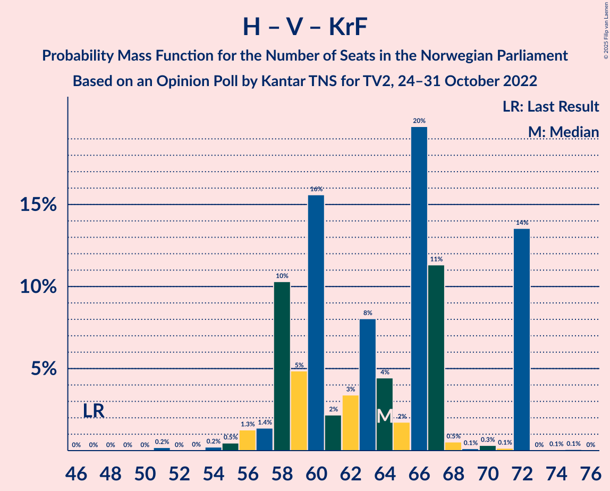

# Opinion Poll by Kantar TNS for TV2, 24–31 October 2022

<a href="#voting-intentions">Voting Intentions</a> | <a href="#seats">Seats</a> | <a href="#coalitions">Coalitions</a> | <a href="#technical-information">Technical Information</a>

## Voting Intentions

### Confidence Intervals

| Party | Last Result | Poll Result | 80% Confidence Interval | 90% Confidence Interval | 95% Confidence Interval | 99% Confidence Interval |
|:-----:|:-----------:|:-----------:|:-----------------------:|:-----------------------:|:-----------------------:|:-----------------------:|
| Høyre | 20.4% | 28.6% | 27.0–30.3% |26.5–30.8% |26.1–31.3% |25.3–32.1% |
| Arbeiderpartiet | 26.2% | 19.1% | 17.7–20.6% |17.3–21.1% |16.9–21.5% |16.3–22.2% |
| Fremskrittspartiet | 11.6% | 12.1% | 10.9–13.4% |10.6–13.7% |10.3–14.1% |9.8–14.7% |
| Sosialistisk Venstreparti | 7.6% | 8.6% | 7.6–9.7% |7.3–10.0% |7.1–10.3% |6.7–10.9% |
| Rødt | 4.7% | 7.9% | 7.0–9.0% |6.7–9.3% |6.5–9.6% |6.1–10.1% |
| Senterpartiet | 13.5% | 6.2% | 5.4–7.2% |5.2–7.5% |5.0–7.7% |4.6–8.2% |
| Venstre | 4.6% | 4.6% | 3.9–5.5% |3.7–5.7% |3.5–5.9% |3.2–6.4% |
| Miljøpartiet De Grønne | 3.9% | 3.8% | 3.2–4.6% |3.0–4.9% |2.9–5.1% |2.6–5.5% |
| Kristelig Folkeparti | 3.8% | 3.7% | 3.1–4.6% |2.9–4.8% |2.8–5.0% |2.5–5.4% |
| Industri- og Næringspartiet | 0.3% | 2.4% | 1.9–3.1% |1.8–3.2% |1.6–3.4% |1.4–3.8% |
| Pensjonistpartiet | 0.6% | 0.7% | 0.5–1.1% |0.4–1.2% |0.3–1.3% |0.3–1.6% |
| Folkets parti | 0.1% | 0.6% | 0.4–1.0% |0.3–1.1% |0.3–1.2% |0.2–1.4% |
| Konservativt | 0.4% | 0.6% | 0.4–1.0% |0.3–1.1% |0.3–1.2% |0.2–1.4% |
| Norgesdemokratene | 1.1% | 0.5% | 0.3–0.9% |0.3–1.0% |0.2–1.1% |0.2–1.3% |

*Note:* The poll result column reflects the actual value used in the calculations. Published results may vary slightly, and in addition be rounded to fewer digits.

## Seats

### Confidence Intervals

| Party | Last Result | Median | 80% Confidence Interval | 90% Confidence Interval | 95% Confidence Interval | 99% Confidence Interval |
|:-----:|:-----------:|:------:|:-----------------------:|:-----------------------:|:-----------------------:|:-----------------------:|
| <a href="#høyre">Høyre</a> | 36 | 50 | 47–55 |47–56 |46–56 |42–62 |
| <a href="#arbeiderpartiet">Arbeiderpartiet</a> | 48 | 38 | 35–44 |34–44 |34–44 |32–44 |
| <a href="#fremskrittspartiet">Fremskrittspartiet</a> | 21 | 20 | 18–23 |18–25 |18–25 |17–27 |
| <a href="#sosialistisk-venstreparti">Sosialistisk Venstreparti</a> | 13 | 15 | 12–17 |12–17 |12–18 |10–20 |
| <a href="#rødt">Rødt</a> | 8 | 14 | 12–16 |12–17 |11–19 |10–19 |
| <a href="#senterpartiet">Senterpartiet</a> | 28 | 11 | 8–13 |8–14 |8–14 |7–15 |
| <a href="#venstre">Venstre</a> | 8 | 8 | 2–10 |2–11 |2–12 |2–12 |
| <a href="#miljøpartiet-de-grønne">Miljøpartiet De Grønne</a> | 3 | 3 | 1–7 |1–8 |1–8 |1–10 |
| <a href="#kristelig-folkeparti">Kristelig Folkeparti</a> | 3 | 7 | 2–10 |2–10 |2–10 |2–10 |
| <a href="#industri--og-næringspartiet">Industri- og Næringspartiet</a> | 0 | 0 | 0–2 |0–3 |0–3 |0–3 |
| <a href="#pensjonistpartiet">Pensjonistpartiet</a> | 0 | 0 | 0 |0 |0 |0 |
| <a href="#folkets-parti">Folkets parti</a> | 0 | 0 | 0 |0 |0 |0 |
| <a href="#konservativt">Konservativt</a> | 0 | 0 | 0 |0 |0 |0 |
| <a href="#norgesdemokratene">Norgesdemokratene</a> | 0 | 0 | 0 |0 |0 |0 |

### Høyre

*For a full overview of the results for this party, see the [Høyre](party-høyre.html) page.*

| Number of Seats | Probability | Accumulated | Special Marks |
|:---------------:|:-----------:|:-----------:|:-------------:|
| 36 | 0% | 100% | Last Result |
| 37 | 0% | 100% |  |
| 38 | 0% | 100% |  |
| 39 | 0% | 100% |  |
| 40 | 0% | 100% |  |
| 41 | 0% | 100% |  |
| 42 | 1.3% | 100% |  |
| 43 | 0% | 98.7% |  |
| 44 | 0.1% | 98.7% |  |
| 45 | 0.3% | 98.6% |  |
| 46 | 1.5% | 98% |  |
| 47 | 16% | 97% |  |
| 48 | 13% | 81% |  |
| 49 | 13% | 68% |  |
| 50 | 18% | 55% | Median |
| 51 | 2% | 36% |  |
| 52 | 2% | 34% |  |
| 53 | 2% | 32% |  |
| 54 | 0.5% | 30% |  |
| 55 | 23% | 29% |  |
| 56 | 5% | 7% |  |
| 57 | 0.4% | 2% |  |
| 58 | 0.2% | 2% |  |
| 59 | 0.1% | 2% |  |
| 60 | 0% | 1.5% |  |
| 61 | 0% | 1.4% |  |
| 62 | 1.4% | 1.4% |  |
| 63 | 0% | 0% |  |

### Arbeiderpartiet

*For a full overview of the results for this party, see the [Arbeiderpartiet](party-arbeiderpartiet.html) page.*

| Number of Seats | Probability | Accumulated | Special Marks |
|:---------------:|:-----------:|:-----------:|:-------------:|
| 31 | 0.4% | 100% |  |
| 32 | 0.6% | 99.6% |  |
| 33 | 1.1% | 99.0% |  |
| 34 | 4% | 98% |  |
| 35 | 4% | 94% |  |
| 36 | 8% | 89% |  |
| 37 | 12% | 81% |  |
| 38 | 32% | 70% | Median |
| 39 | 4% | 38% |  |
| 40 | 4% | 34% |  |
| 41 | 13% | 30% |  |
| 42 | 4% | 17% |  |
| 43 | 0.8% | 13% |  |
| 44 | 12% | 13% |  |
| 45 | 0% | 0.2% |  |
| 46 | 0.1% | 0.2% |  |
| 47 | 0% | 0.1% |  |
| 48 | 0% | 0.1% | Last Result |
| 49 | 0% | 0% |  |

### Fremskrittspartiet

*For a full overview of the results for this party, see the [Fremskrittspartiet](party-fremskrittspartiet.html) page.*

| Number of Seats | Probability | Accumulated | Special Marks |
|:---------------:|:-----------:|:-----------:|:-------------:|
| 17 | 2% | 100% |  |
| 18 | 23% | 98% |  |
| 19 | 7% | 75% |  |
| 20 | 18% | 68% | Median |
| 21 | 7% | 50% | Last Result |
| 22 | 27% | 43% |  |
| 23 | 9% | 16% |  |
| 24 | 2% | 8% |  |
| 25 | 5% | 6% |  |
| 26 | 0.2% | 0.9% |  |
| 27 | 0.5% | 0.7% |  |
| 28 | 0.1% | 0.2% |  |
| 29 | 0% | 0% |  |

### Sosialistisk Venstreparti

*For a full overview of the results for this party, see the [Sosialistisk Venstreparti](party-sosialistiskvenstreparti.html) page.*

| Number of Seats | Probability | Accumulated | Special Marks |
|:---------------:|:-----------:|:-----------:|:-------------:|
| 10 | 0.6% | 100% |  |
| 11 | 1.0% | 99.4% |  |
| 12 | 17% | 98% |  |
| 13 | 8% | 81% | Last Result |
| 14 | 9% | 73% |  |
| 15 | 28% | 64% | Median |
| 16 | 18% | 36% |  |
| 17 | 14% | 18% |  |
| 18 | 1.1% | 3% |  |
| 19 | 0.8% | 2% |  |
| 20 | 1.3% | 1.3% |  |
| 21 | 0% | 0% |  |

### Rødt

*For a full overview of the results for this party, see the [Rødt](party-rødt.html) page.*

| Number of Seats | Probability | Accumulated | Special Marks |
|:---------------:|:-----------:|:-----------:|:-------------:|
| 8 | 0% | 100% | Last Result |
| 9 | 0.1% | 100% |  |
| 10 | 0.6% | 99.9% |  |
| 11 | 3% | 99.4% |  |
| 12 | 13% | 96% |  |
| 13 | 14% | 83% |  |
| 14 | 39% | 69% | Median |
| 15 | 4% | 30% |  |
| 16 | 18% | 26% |  |
| 17 | 4% | 8% |  |
| 18 | 0.3% | 4% |  |
| 19 | 4% | 4% |  |
| 20 | 0.1% | 0.1% |  |
| 21 | 0% | 0% |  |

### Senterpartiet

*For a full overview of the results for this party, see the [Senterpartiet](party-senterpartiet.html) page.*

| Number of Seats | Probability | Accumulated | Special Marks |
|:---------------:|:-----------:|:-----------:|:-------------:|
| 3 | 0% | 100% |  |
| 4 | 0% | 99.9% |  |
| 5 | 0% | 99.9% |  |
| 6 | 0% | 99.9% |  |
| 7 | 2% | 99.9% |  |
| 8 | 15% | 98% |  |
| 9 | 9% | 83% |  |
| 10 | 8% | 75% |  |
| 11 | 40% | 66% | Median |
| 12 | 5% | 26% |  |
| 13 | 12% | 22% |  |
| 14 | 9% | 10% |  |
| 15 | 0.6% | 1.0% |  |
| 16 | 0.3% | 0.3% |  |
| 17 | 0% | 0% |  |
| 18 | 0% | 0% |  |
| 19 | 0% | 0% |  |
| 20 | 0% | 0% |  |
| 21 | 0% | 0% |  |
| 22 | 0% | 0% |  |
| 23 | 0% | 0% |  |
| 24 | 0% | 0% |  |
| 25 | 0% | 0% |  |
| 26 | 0% | 0% |  |
| 27 | 0% | 0% |  |
| 28 | 0% | 0% | Last Result |

### Venstre

*For a full overview of the results for this party, see the [Venstre](party-venstre.html) page.*

| Number of Seats | Probability | Accumulated | Special Marks |
|:---------------:|:-----------:|:-----------:|:-------------:|
| 2 | 12% | 100% |  |
| 3 | 5% | 88% |  |
| 4 | 0% | 83% |  |
| 5 | 0% | 83% |  |
| 6 | 0% | 83% |  |
| 7 | 8% | 83% |  |
| 8 | 27% | 75% | Last Result, Median |
| 9 | 36% | 48% |  |
| 10 | 6% | 12% |  |
| 11 | 3% | 6% |  |
| 12 | 3% | 3% |  |
| 13 | 0.2% | 0.2% |  |
| 14 | 0% | 0% |  |

### Miljøpartiet De Grønne

*For a full overview of the results for this party, see the [Miljøpartiet De Grønne](party-miljøpartietdegrønne.html) page.*

| Number of Seats | Probability | Accumulated | Special Marks |
|:---------------:|:-----------:|:-----------:|:-------------:|
| 1 | 11% | 100% |  |
| 2 | 30% | 89% |  |
| 3 | 13% | 60% | Last Result, Median |
| 4 | 0% | 46% |  |
| 5 | 0% | 46% |  |
| 6 | 0% | 46% |  |
| 7 | 37% | 46% |  |
| 8 | 8% | 10% |  |
| 9 | 1.2% | 2% |  |
| 10 | 0.8% | 0.9% |  |
| 11 | 0.1% | 0.1% |  |
| 12 | 0% | 0% |  |

### Kristelig Folkeparti

*For a full overview of the results for this party, see the [Kristelig Folkeparti](party-kristeligfolkeparti.html) page.*

| Number of Seats | Probability | Accumulated | Special Marks |
|:---------------:|:-----------:|:-----------:|:-------------:|
| 1 | 0.3% | 100% |  |
| 2 | 26% | 99.7% |  |
| 3 | 19% | 74% | Last Result |
| 4 | 0% | 55% |  |
| 5 | 0% | 55% |  |
| 6 | 0.3% | 55% |  |
| 7 | 24% | 55% | Median |
| 8 | 14% | 31% |  |
| 9 | 2% | 17% |  |
| 10 | 15% | 15% |  |
| 11 | 0.1% | 0.1% |  |
| 12 | 0% | 0% |  |

### Industri- og Næringspartiet

*For a full overview of the results for this party, see the [Industri- og Næringspartiet](party-industri-ognæringspartiet.html) page.*

| Number of Seats | Probability | Accumulated | Special Marks |
|:---------------:|:-----------:|:-----------:|:-------------:|
| 0 | 83% | 100% | Last Result, Median |
| 1 | 1.4% | 17% |  |
| 2 | 6% | 16% |  |
| 3 | 10% | 10% |  |
| 4 | 0% | 0% |  |

### Pensjonistpartiet

*For a full overview of the results for this party, see the [Pensjonistpartiet](party-pensjonistpartiet.html) page.*

| Number of Seats | Probability | Accumulated | Special Marks |
|:---------------:|:-----------:|:-----------:|:-------------:|
| 0 | 100% | 100% | Last Result, Median |

### Folkets parti

*For a full overview of the results for this party, see the [Folkets parti](party-folketsparti.html) page.*

| Number of Seats | Probability | Accumulated | Special Marks |
|:---------------:|:-----------:|:-----------:|:-------------:|
| 0 | 99.8% | 100% | Last Result, Median |
| 1 | 0.2% | 0.2% |  |
| 2 | 0% | 0% |  |

### Konservativt

*For a full overview of the results for this party, see the [Konservativt](party-konservativt.html) page.*

| Number of Seats | Probability | Accumulated | Special Marks |
|:---------------:|:-----------:|:-----------:|:-------------:|
| 0 | 100% | 100% | Last Result, Median |

### Norgesdemokratene

*For a full overview of the results for this party, see the [Norgesdemokratene](party-norgesdemokratene.html) page.*

| Number of Seats | Probability | Accumulated | Special Marks |
|:---------------:|:-----------:|:-----------:|:-------------:|
| 0 | 100% | 100% | Last Result, Median |

## Coalitions

### Confidence Intervals

| Coalition | Last Result | Median | Majority? | 80% Confidence Interval | 90% Confidence Interval | 95% Confidence Interval | 99% Confidence Interval |
|:---------:|:-----------:|:------:|:---------:|:-----------------------:|:-----------------------:|:-----------------------:|:-----------------------:|
| Høyre – Fremskrittspartiet – Senterpartiet – Venstre – Kristelig Folkeparti | 96 | 97 | 100% | 87–100 | 87–103 | 87–103 | 87–104 |
| Høyre – Fremskrittspartiet – Venstre – Miljøpartiet De Grønne – Kristelig Folkeparti | 71 | 90 | 87% | 83–93 | 83–94 | 83–95 | 82–97 |
| Arbeiderpartiet – Sosialistisk Venstreparti – Rødt – Senterpartiet – Miljøpartiet De Grønne | 100 | 81 | 34% | 78–92 | 78–92 | 75–92 | 73–92 |
| Høyre – Fremskrittspartiet – Venstre – Kristelig Folkeparti | 68 | 87 | 56% | 76–90 | 76–90 | 76–91 | 76–92 |
| Høyre – Fremskrittspartiet – Venstre | 65 | 78 | 16% | 71–86 | 69–86 | 69–86 | 69–88 |
| Arbeiderpartiet – Sosialistisk Venstreparti – Senterpartiet – Miljøpartiet De Grønne – Kristelig Folkeparti | 95 | 74 | 11% | 69–85 | 66–86 | 63–86 | 63–86 |
| Arbeiderpartiet – Sosialistisk Venstreparti – Rødt – Senterpartiet | 97 | 78 | 11% | 75–85 | 73–85 | 72–85 | 69–85 |
| Høyre – Fremskrittspartiet | 57 | 70 | 0% | 67–77 | 67–79 | 67–81 | 65–81 |
| Arbeiderpartiet – Sosialistisk Venstreparti – Rødt – Miljøpartiet De Grønne | 72 | 70 | 0% | 66–81 | 65–81 | 65–81 | 62–81 |
| Arbeiderpartiet – Sosialistisk Venstreparti – Senterpartiet – Miljøpartiet De Grønne | 92 | 67 | 0% | 64–78 | 62–79 | 61–79 | 61–79 |
| Arbeiderpartiet – Sosialistisk Venstreparti – Senterpartiet | 89 | 64 | 0% | 60–71 | 59–72 | 58–72 | 56–72 |
| Høyre – Venstre – Kristelig Folkeparti | 47 | 64 | 0% | 58–72 | 58–72 | 57–72 | 55–72 |
| Arbeiderpartiet – Senterpartiet – Miljøpartiet De Grønne – Kristelig Folkeparti | 82 | 60 | 0% | 54–69 | 52–69 | 49–69 | 49–69 |
| Arbeiderpartiet – Senterpartiet – Kristelig Folkeparti | 79 | 56 | 0% | 51–62 | 47–62 | 47–62 | 45–62 |
| Arbeiderpartiet – Sosialistisk Venstreparti | 61 | 53 | 0% | 49–61 | 49–61 | 48–61 | 44–61 |
| Arbeiderpartiet – Senterpartiet | 76 | 49 | 0% | 46–55 | 45–55 | 44–55 | 43–55 |
| Senterpartiet – Venstre – Kristelig Folkeparti | 39 | 24 | 0% | 20–30 | 18–30 | 17–30 | 14–31 |

### Høyre – Fremskrittspartiet – Senterpartiet – Venstre – Kristelig Folkeparti

| Number of Seats | Probability | Accumulated | Special Marks |
|:---------------:|:-----------:|:-----------:|:-------------:|
| 85 | 0.3% | 100% | Majority |
| 86 | 0.1% | 99.7% |  |
| 87 | 11% | 99.6% |  |
| 88 | 0% | 88% |  |
| 89 | 3% | 88% |  |
| 90 | 3% | 86% |  |
| 91 | 16% | 83% |  |
| 92 | 0.6% | 67% |  |
| 93 | 1.2% | 67% |  |
| 94 | 2% | 65% |  |
| 95 | 8% | 63% |  |
| 96 | 4% | 55% | Last Result, Median |
| 97 | 1.4% | 51% |  |
| 98 | 18% | 50% |  |
| 99 | 19% | 31% |  |
| 100 | 3% | 12% |  |
| 101 | 0.2% | 10% |  |
| 102 | 0.2% | 10% |  |
| 103 | 9% | 10% |  |
| 104 | 0.5% | 0.7% |  |
| 105 | 0% | 0.2% |  |
| 106 | 0.1% | 0.2% |  |
| 107 | 0.1% | 0.1% |  |
| 108 | 0% | 0% |  |

### Høyre – Fremskrittspartiet – Venstre – Miljøpartiet De Grønne – Kristelig Folkeparti

| Number of Seats | Probability | Accumulated | Special Marks |
|:---------------:|:-----------:|:-----------:|:-------------:|
| 71 | 0% | 100% | Last Result |
| 72 | 0% | 100% |  |
| 73 | 0% | 100% |  |
| 74 | 0% | 100% |  |
| 75 | 0% | 100% |  |
| 76 | 0% | 100% |  |
| 77 | 0% | 100% |  |
| 78 | 0% | 100% |  |
| 79 | 0% | 100% |  |
| 80 | 0.1% | 99.9% |  |
| 81 | 0.1% | 99.9% |  |
| 82 | 1.5% | 99.8% |  |
| 83 | 10% | 98% |  |
| 84 | 0.8% | 88% |  |
| 85 | 0.5% | 87% | Majority |
| 86 | 5% | 87% |  |
| 87 | 15% | 81% |  |
| 88 | 5% | 67% | Median |
| 89 | 10% | 61% |  |
| 90 | 26% | 51% |  |
| 91 | 2% | 25% |  |
| 92 | 2% | 23% |  |
| 93 | 14% | 21% |  |
| 94 | 2% | 6% |  |
| 95 | 2% | 4% |  |
| 96 | 2% | 2% |  |
| 97 | 0.2% | 0.7% |  |
| 98 | 0.1% | 0.5% |  |
| 99 | 0.3% | 0.4% |  |
| 100 | 0% | 0% |  |

### Arbeiderpartiet – Sosialistisk Venstreparti – Rødt – Senterpartiet – Miljøpartiet De Grønne

| Number of Seats | Probability | Accumulated | Special Marks |
|:---------------:|:-----------:|:-----------:|:-------------:|
| 70 | 0.2% | 100% |  |
| 71 | 0% | 99.8% |  |
| 72 | 0% | 99.8% |  |
| 73 | 0.4% | 99.8% |  |
| 74 | 0.1% | 99.4% |  |
| 75 | 2% | 99.3% |  |
| 76 | 1.0% | 97% |  |
| 77 | 0.5% | 96% |  |
| 78 | 13% | 96% |  |
| 79 | 10% | 83% |  |
| 80 | 19% | 73% |  |
| 81 | 6% | 54% | Median |
| 82 | 1.4% | 48% |  |
| 83 | 10% | 46% |  |
| 84 | 2% | 36% |  |
| 85 | 2% | 34% | Majority |
| 86 | 2% | 32% |  |
| 87 | 0.3% | 31% |  |
| 88 | 17% | 30% |  |
| 89 | 2% | 14% |  |
| 90 | 2% | 12% |  |
| 91 | 0.2% | 10% |  |
| 92 | 10% | 10% |  |
| 93 | 0.2% | 0.2% |  |
| 94 | 0.1% | 0.1% |  |
| 95 | 0% | 0% |  |
| 96 | 0% | 0% |  |
| 97 | 0% | 0% |  |
| 98 | 0% | 0% |  |
| 99 | 0% | 0% |  |
| 100 | 0% | 0% | Last Result |

### Høyre – Fremskrittspartiet – Venstre – Kristelig Folkeparti

| Number of Seats | Probability | Accumulated | Special Marks |
|:---------------:|:-----------:|:-----------:|:-------------:|
| 68 | 0% | 100% | Last Result |
| 69 | 0% | 100% |  |
| 70 | 0% | 100% |  |
| 71 | 0% | 100% |  |
| 72 | 0% | 100% |  |
| 73 | 0% | 100% |  |
| 74 | 0.3% | 100% |  |
| 75 | 0% | 99.7% |  |
| 76 | 10% | 99.6% |  |
| 77 | 0.2% | 90% |  |
| 78 | 1.5% | 90% |  |
| 79 | 2% | 88% |  |
| 80 | 19% | 86% |  |
| 81 | 0.6% | 67% |  |
| 82 | 7% | 66% |  |
| 83 | 0.8% | 60% |  |
| 84 | 3% | 59% |  |
| 85 | 4% | 56% | Median, Majority |
| 86 | 2% | 52% |  |
| 87 | 6% | 51% |  |
| 88 | 19% | 45% |  |
| 89 | 9% | 26% |  |
| 90 | 13% | 17% |  |
| 91 | 2% | 3% |  |
| 92 | 0.6% | 1.0% |  |
| 93 | 0.1% | 0.4% |  |
| 94 | 0.1% | 0.3% |  |
| 95 | 0% | 0.2% |  |
| 96 | 0% | 0.2% |  |
| 97 | 0.2% | 0.2% |  |
| 98 | 0% | 0% |  |

### Høyre – Fremskrittspartiet – Venstre

| Number of Seats | Probability | Accumulated | Special Marks |
|:---------------:|:-----------:|:-----------:|:-------------:|
| 65 | 0% | 100% | Last Result |
| 66 | 0% | 100% |  |
| 67 | 0% | 100% |  |
| 68 | 0% | 100% |  |
| 69 | 10% | 100% |  |
| 70 | 0% | 90% |  |
| 71 | 1.2% | 90% |  |
| 72 | 0.4% | 89% |  |
| 73 | 1.4% | 89% |  |
| 74 | 0.2% | 87% |  |
| 75 | 8% | 87% |  |
| 76 | 2% | 79% |  |
| 77 | 3% | 77% |  |
| 78 | 32% | 74% | Median |
| 79 | 1.2% | 42% |  |
| 80 | 3% | 41% |  |
| 81 | 0.9% | 38% |  |
| 82 | 13% | 37% |  |
| 83 | 3% | 24% |  |
| 84 | 5% | 21% |  |
| 85 | 2% | 16% | Majority |
| 86 | 12% | 14% |  |
| 87 | 0.6% | 2% |  |
| 88 | 1.0% | 1.4% |  |
| 89 | 0% | 0.4% |  |
| 90 | 0.1% | 0.3% |  |
| 91 | 0.1% | 0.2% |  |
| 92 | 0% | 0.1% |  |
| 93 | 0% | 0.1% |  |
| 94 | 0.1% | 0.1% |  |
| 95 | 0% | 0% |  |

### Arbeiderpartiet – Sosialistisk Venstreparti – Senterpartiet – Miljøpartiet De Grønne – Kristelig Folkeparti

| Number of Seats | Probability | Accumulated | Special Marks |
|:---------------:|:-----------:|:-----------:|:-------------:|
| 60 | 0.1% | 100% |  |
| 61 | 0% | 99.9% |  |
| 62 | 0.2% | 99.9% |  |
| 63 | 3% | 99.7% |  |
| 64 | 0.3% | 96% |  |
| 65 | 0.2% | 96% |  |
| 66 | 0.9% | 96% |  |
| 67 | 0.9% | 95% |  |
| 68 | 2% | 94% |  |
| 69 | 5% | 92% |  |
| 70 | 10% | 87% |  |
| 71 | 2% | 77% |  |
| 72 | 12% | 75% |  |
| 73 | 4% | 63% |  |
| 74 | 15% | 59% | Median |
| 75 | 0.7% | 44% |  |
| 76 | 25% | 43% |  |
| 77 | 6% | 19% |  |
| 78 | 0.6% | 13% |  |
| 79 | 0.6% | 12% |  |
| 80 | 0.7% | 12% |  |
| 81 | 0.1% | 11% |  |
| 82 | 0% | 11% |  |
| 83 | 0.1% | 11% |  |
| 84 | 0.1% | 11% |  |
| 85 | 1.0% | 11% | Majority |
| 86 | 10% | 10% |  |
| 87 | 0% | 0% |  |
| 88 | 0% | 0% |  |
| 89 | 0% | 0% |  |
| 90 | 0% | 0% |  |
| 91 | 0% | 0% |  |
| 92 | 0% | 0% |  |
| 93 | 0% | 0% |  |
| 94 | 0% | 0% |  |
| 95 | 0% | 0% | Last Result |

### Arbeiderpartiet – Sosialistisk Venstreparti – Rødt – Senterpartiet

| Number of Seats | Probability | Accumulated | Special Marks |
|:---------------:|:-----------:|:-----------:|:-------------:|
| 68 | 0.2% | 100% |  |
| 69 | 0.4% | 99.8% |  |
| 70 | 0.4% | 99.4% |  |
| 71 | 1.0% | 98.9% |  |
| 72 | 2% | 98% |  |
| 73 | 3% | 96% |  |
| 74 | 2% | 93% |  |
| 75 | 13% | 91% |  |
| 76 | 8% | 78% |  |
| 77 | 2% | 70% |  |
| 78 | 28% | 68% | Median |
| 79 | 4% | 40% |  |
| 80 | 4% | 36% |  |
| 81 | 15% | 33% |  |
| 82 | 6% | 18% |  |
| 83 | 1.4% | 12% |  |
| 84 | 0.4% | 11% |  |
| 85 | 10% | 11% | Majority |
| 86 | 0.1% | 0.2% |  |
| 87 | 0% | 0.1% |  |
| 88 | 0.1% | 0.1% |  |
| 89 | 0% | 0% |  |
| 90 | 0% | 0% |  |
| 91 | 0% | 0% |  |
| 92 | 0% | 0% |  |
| 93 | 0% | 0% |  |
| 94 | 0% | 0% |  |
| 95 | 0% | 0% |  |
| 96 | 0% | 0% |  |
| 97 | 0% | 0% | Last Result |

### Høyre – Fremskrittspartiet

| Number of Seats | Probability | Accumulated | Special Marks |
|:---------------:|:-----------:|:-----------:|:-------------:|
| 57 | 0% | 100% | Last Result |
| 58 | 0% | 100% |  |
| 59 | 0% | 100% |  |
| 60 | 0% | 100% |  |
| 61 | 0% | 100% |  |
| 62 | 0% | 100% |  |
| 63 | 0.1% | 100% |  |
| 64 | 0.1% | 99.9% |  |
| 65 | 1.3% | 99.8% |  |
| 66 | 0.2% | 98% |  |
| 67 | 16% | 98% |  |
| 68 | 6% | 82% |  |
| 69 | 16% | 76% |  |
| 70 | 17% | 60% | Median |
| 71 | 4% | 43% |  |
| 72 | 1.2% | 40% |  |
| 73 | 15% | 38% |  |
| 74 | 1.2% | 23% |  |
| 75 | 1.3% | 22% |  |
| 76 | 4% | 20% |  |
| 77 | 9% | 16% |  |
| 78 | 1.0% | 7% |  |
| 79 | 2% | 6% |  |
| 80 | 1.0% | 4% |  |
| 81 | 3% | 3% |  |
| 82 | 0.1% | 0.3% |  |
| 83 | 0.1% | 0.1% |  |
| 84 | 0.1% | 0.1% |  |
| 85 | 0% | 0% | Majority |

### Arbeiderpartiet – Sosialistisk Venstreparti – Rødt – Miljøpartiet De Grønne

| Number of Seats | Probability | Accumulated | Special Marks |
|:---------------:|:-----------:|:-----------:|:-------------:|
| 60 | 0.1% | 100% |  |
| 61 | 0.3% | 99.9% |  |
| 62 | 0.1% | 99.6% |  |
| 63 | 0.9% | 99.5% |  |
| 64 | 0.2% | 98.6% |  |
| 65 | 8% | 98% |  |
| 66 | 0.6% | 90% |  |
| 67 | 2% | 90% |  |
| 68 | 3% | 87% |  |
| 69 | 17% | 85% |  |
| 70 | 25% | 68% | Median |
| 71 | 2% | 43% |  |
| 72 | 5% | 42% | Last Result |
| 73 | 2% | 37% |  |
| 74 | 2% | 35% |  |
| 75 | 0.4% | 33% |  |
| 76 | 2% | 33% |  |
| 77 | 17% | 31% |  |
| 78 | 3% | 14% |  |
| 79 | 0.1% | 12% |  |
| 80 | 0.1% | 12% |  |
| 81 | 11% | 11% |  |
| 82 | 0.2% | 0.3% |  |
| 83 | 0% | 0% |  |

### Arbeiderpartiet – Sosialistisk Venstreparti – Senterpartiet – Miljøpartiet De Grønne

| Number of Seats | Probability | Accumulated | Special Marks |
|:---------------:|:-----------:|:-----------:|:-------------:|
| 57 | 0.2% | 100% |  |
| 58 | 0% | 99.8% |  |
| 59 | 0% | 99.8% |  |
| 60 | 0.2% | 99.7% |  |
| 61 | 4% | 99.5% |  |
| 62 | 2% | 96% |  |
| 63 | 1.0% | 93% |  |
| 64 | 13% | 92% |  |
| 65 | 3% | 79% |  |
| 66 | 18% | 76% |  |
| 67 | 8% | 58% | Median |
| 68 | 4% | 50% |  |
| 69 | 9% | 45% |  |
| 70 | 1.5% | 37% |  |
| 71 | 4% | 35% |  |
| 72 | 15% | 32% |  |
| 73 | 2% | 17% |  |
| 74 | 3% | 15% |  |
| 75 | 0.3% | 12% |  |
| 76 | 0.2% | 11% |  |
| 77 | 0.2% | 11% |  |
| 78 | 1.3% | 11% |  |
| 79 | 10% | 10% |  |
| 80 | 0% | 0% |  |
| 81 | 0% | 0% |  |
| 82 | 0% | 0% |  |
| 83 | 0% | 0% |  |
| 84 | 0% | 0% |  |
| 85 | 0% | 0% | Majority |
| 86 | 0% | 0% |  |
| 87 | 0% | 0% |  |
| 88 | 0% | 0% |  |
| 89 | 0% | 0% |  |
| 90 | 0% | 0% |  |
| 91 | 0% | 0% |  |
| 92 | 0% | 0% | Last Result |

### Arbeiderpartiet – Sosialistisk Venstreparti – Senterpartiet

| Number of Seats | Probability | Accumulated | Special Marks |
|:---------------:|:-----------:|:-----------:|:-------------:|
| 55 | 0.2% | 100% |  |
| 56 | 1.0% | 99.8% |  |
| 57 | 0.3% | 98.8% |  |
| 58 | 3% | 98.5% |  |
| 59 | 4% | 96% |  |
| 60 | 3% | 92% |  |
| 61 | 15% | 89% |  |
| 62 | 7% | 74% |  |
| 63 | 4% | 67% |  |
| 64 | 18% | 63% | Median |
| 65 | 15% | 45% |  |
| 66 | 15% | 30% |  |
| 67 | 0.8% | 16% |  |
| 68 | 0.4% | 15% |  |
| 69 | 0.7% | 14% |  |
| 70 | 4% | 14% |  |
| 71 | 0.1% | 10% |  |
| 72 | 10% | 10% |  |
| 73 | 0% | 0.1% |  |
| 74 | 0% | 0.1% |  |
| 75 | 0% | 0% |  |
| 76 | 0% | 0% |  |
| 77 | 0% | 0% |  |
| 78 | 0% | 0% |  |
| 79 | 0% | 0% |  |
| 80 | 0% | 0% |  |
| 81 | 0% | 0% |  |
| 82 | 0% | 0% |  |
| 83 | 0% | 0% |  |
| 84 | 0% | 0% |  |
| 85 | 0% | 0% | Majority |
| 86 | 0% | 0% |  |
| 87 | 0% | 0% |  |
| 88 | 0% | 0% |  |
| 89 | 0% | 0% | Last Result |

### Høyre – Venstre – Kristelig Folkeparti

| Number of Seats | Probability | Accumulated | Special Marks |
|:---------------:|:-----------:|:-----------:|:-------------:|
| 47 | 0% | 100% | Last Result |
| 48 | 0% | 100% |  |
| 49 | 0% | 100% |  |
| 50 | 0% | 100% |  |
| 51 | 0.2% | 100% |  |
| 52 | 0% | 99.8% |  |
| 53 | 0% | 99.8% |  |
| 54 | 0.2% | 99.8% |  |
| 55 | 0.5% | 99.6% |  |
| 56 | 1.3% | 99.1% |  |
| 57 | 1.4% | 98% |  |
| 58 | 10% | 96% |  |
| 59 | 5% | 86% |  |
| 60 | 16% | 81% |  |
| 61 | 2% | 66% |  |
| 62 | 3% | 64% |  |
| 63 | 8% | 60% |  |
| 64 | 4% | 52% |  |
| 65 | 2% | 48% | Median |
| 66 | 20% | 46% |  |
| 67 | 11% | 26% |  |
| 68 | 0.5% | 15% |  |
| 69 | 0.1% | 14% |  |
| 70 | 0.3% | 14% |  |
| 71 | 0.1% | 14% |  |
| 72 | 14% | 14% |  |
| 73 | 0% | 0.2% |  |
| 74 | 0.1% | 0.1% |  |
| 75 | 0.1% | 0.1% |  |
| 76 | 0% | 0% |  |

### Arbeiderpartiet – Senterpartiet – Miljøpartiet De Grønne – Kristelig Folkeparti

| Number of Seats | Probability | Accumulated | Special Marks |
|:---------------:|:-----------:|:-----------:|:-------------:|
| 46 | 0.1% | 100% |  |
| 47 | 0.4% | 99.9% |  |
| 48 | 0.1% | 99.6% |  |
| 49 | 3% | 99.5% |  |
| 50 | 0.3% | 96% |  |
| 51 | 0.4% | 96% |  |
| 52 | 0.5% | 95% |  |
| 53 | 4% | 95% |  |
| 54 | 2% | 91% |  |
| 55 | 11% | 89% |  |
| 56 | 4% | 77% |  |
| 57 | 0.9% | 73% |  |
| 58 | 16% | 73% |  |
| 59 | 0.6% | 57% | Median |
| 60 | 14% | 56% |  |
| 61 | 17% | 42% |  |
| 62 | 2% | 25% |  |
| 63 | 7% | 23% |  |
| 64 | 2% | 16% |  |
| 65 | 4% | 14% |  |
| 66 | 0.1% | 10% |  |
| 67 | 0.1% | 10% |  |
| 68 | 0% | 10% |  |
| 69 | 10% | 10% |  |
| 70 | 0.1% | 0.1% |  |
| 71 | 0% | 0% |  |
| 72 | 0% | 0% |  |
| 73 | 0% | 0% |  |
| 74 | 0% | 0% |  |
| 75 | 0% | 0% |  |
| 76 | 0% | 0% |  |
| 77 | 0% | 0% |  |
| 78 | 0% | 0% |  |
| 79 | 0% | 0% |  |
| 80 | 0% | 0% |  |
| 81 | 0% | 0% |  |
| 82 | 0% | 0% | Last Result |

### Arbeiderpartiet – Senterpartiet – Kristelig Folkeparti

| Number of Seats | Probability | Accumulated | Special Marks |
|:---------------:|:-----------:|:-----------:|:-------------:|
| 42 | 0% | 100% |  |
| 43 | 0% | 99.9% |  |
| 44 | 0.1% | 99.9% |  |
| 45 | 0.9% | 99.8% |  |
| 46 | 0.2% | 99.0% |  |
| 47 | 5% | 98.8% |  |
| 48 | 1.2% | 94% |  |
| 49 | 0.5% | 93% |  |
| 50 | 2% | 92% |  |
| 51 | 17% | 90% |  |
| 52 | 1.0% | 73% |  |
| 53 | 7% | 72% |  |
| 54 | 9% | 65% |  |
| 55 | 4% | 56% |  |
| 56 | 8% | 52% | Median |
| 57 | 18% | 44% |  |
| 58 | 0.9% | 27% |  |
| 59 | 15% | 26% |  |
| 60 | 0.4% | 11% |  |
| 61 | 0% | 10% |  |
| 62 | 10% | 10% |  |
| 63 | 0.1% | 0.2% |  |
| 64 | 0% | 0.2% |  |
| 65 | 0% | 0.1% |  |
| 66 | 0% | 0.1% |  |
| 67 | 0.1% | 0.1% |  |
| 68 | 0% | 0% |  |
| 69 | 0% | 0% |  |
| 70 | 0% | 0% |  |
| 71 | 0% | 0% |  |
| 72 | 0% | 0% |  |
| 73 | 0% | 0% |  |
| 74 | 0% | 0% |  |
| 75 | 0% | 0% |  |
| 76 | 0% | 0% |  |
| 77 | 0% | 0% |  |
| 78 | 0% | 0% |  |
| 79 | 0% | 0% | Last Result |

### Arbeiderpartiet – Sosialistisk Venstreparti

| Number of Seats | Probability | Accumulated | Special Marks |
|:---------------:|:-----------:|:-----------:|:-------------:|
| 44 | 0.6% | 100% |  |
| 45 | 0.1% | 99.4% |  |
| 46 | 0.7% | 99.3% |  |
| 47 | 0.7% | 98.6% |  |
| 48 | 0.9% | 98% |  |
| 49 | 11% | 97% |  |
| 50 | 3% | 86% |  |
| 51 | 3% | 83% |  |
| 52 | 12% | 80% |  |
| 53 | 28% | 68% | Median |
| 54 | 17% | 40% |  |
| 55 | 4% | 23% |  |
| 56 | 3% | 19% |  |
| 57 | 4% | 15% |  |
| 58 | 0.1% | 12% |  |
| 59 | 0.4% | 11% |  |
| 60 | 0.2% | 11% |  |
| 61 | 11% | 11% | Last Result |
| 62 | 0% | 0.1% |  |
| 63 | 0% | 0% |  |

### Arbeiderpartiet – Senterpartiet

| Number of Seats | Probability | Accumulated | Special Marks |
|:---------------:|:-----------:|:-----------:|:-------------:|
| 39 | 0% | 100% |  |
| 40 | 0% | 99.9% |  |
| 41 | 0% | 99.9% |  |
| 42 | 0.1% | 99.9% |  |
| 43 | 2% | 99.8% |  |
| 44 | 3% | 98% |  |
| 45 | 4% | 95% |  |
| 46 | 6% | 91% |  |
| 47 | 0.8% | 86% |  |
| 48 | 6% | 85% |  |
| 49 | 48% | 79% | Median |
| 50 | 3% | 31% |  |
| 51 | 9% | 28% |  |
| 52 | 0.7% | 19% |  |
| 53 | 3% | 18% |  |
| 54 | 5% | 15% |  |
| 55 | 10% | 10% |  |
| 56 | 0.1% | 0.3% |  |
| 57 | 0% | 0.2% |  |
| 58 | 0.1% | 0.1% |  |
| 59 | 0% | 0% |  |
| 60 | 0% | 0% |  |
| 61 | 0% | 0% |  |
| 62 | 0% | 0% |  |
| 63 | 0% | 0% |  |
| 64 | 0% | 0% |  |
| 65 | 0% | 0% |  |
| 66 | 0% | 0% |  |
| 67 | 0% | 0% |  |
| 68 | 0% | 0% |  |
| 69 | 0% | 0% |  |
| 70 | 0% | 0% |  |
| 71 | 0% | 0% |  |
| 72 | 0% | 0% |  |
| 73 | 0% | 0% |  |
| 74 | 0% | 0% |  |
| 75 | 0% | 0% |  |
| 76 | 0% | 0% | Last Result |

### Senterpartiet – Venstre – Kristelig Folkeparti

| Number of Seats | Probability | Accumulated | Special Marks |
|:---------------:|:-----------:|:-----------:|:-------------:|
| 13 | 0.4% | 100% |  |
| 14 | 0.2% | 99.6% |  |
| 15 | 0.2% | 99.4% |  |
| 16 | 0.3% | 99.2% |  |
| 17 | 2% | 98.9% |  |
| 18 | 3% | 97% |  |
| 19 | 2% | 94% |  |
| 20 | 13% | 92% |  |
| 21 | 16% | 79% |  |
| 22 | 6% | 64% |  |
| 23 | 6% | 58% |  |
| 24 | 3% | 52% |  |
| 25 | 13% | 49% |  |
| 26 | 9% | 35% | Median |
| 27 | 3% | 26% |  |
| 28 | 7% | 23% |  |
| 29 | 1.0% | 17% |  |
| 30 | 15% | 16% |  |
| 31 | 0.2% | 0.6% |  |
| 32 | 0.4% | 0.4% |  |
| 33 | 0% | 0% |  |
| 34 | 0% | 0% |  |
| 35 | 0% | 0% |  |
| 36 | 0% | 0% |  |
| 37 | 0% | 0% |  |
| 38 | 0% | 0% |  |
| 39 | 0% | 0% | Last Result |

## Technical Information

### Opinion Poll

+ **Polling firm:** Kantar TNS
+ **Commissioner(s):** TV2
+ **Fieldwork period:** 24–31 October 2022

### Calculations

+ **Sample size:** 1178
+ **Simulations done:** 1,048,576
+ **Error estimate:** 3.38%

