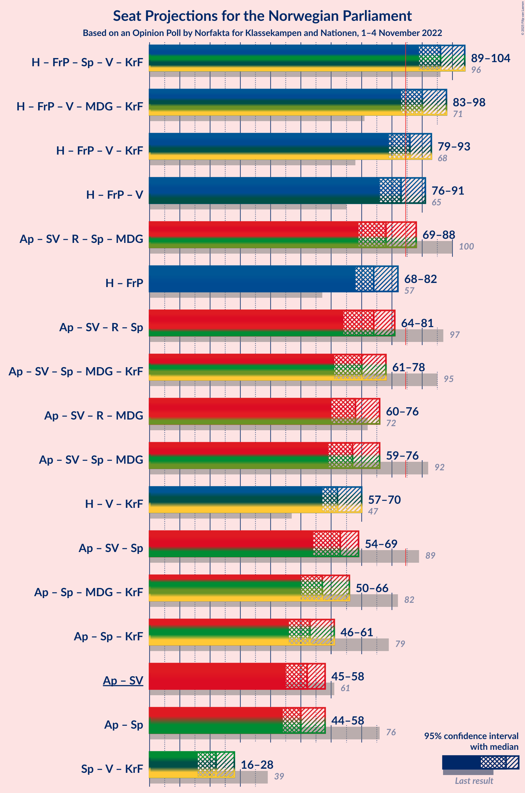

# Opinion Poll by Norfakta for Klassekampen and Nationen, 1–4 November 2022

<a href="#voting-intentions">Voting Intentions</a> | <a href="#seats">Seats</a> | <a href="#coalitions">Coalitions</a> | <a href="#technical-information">Technical Information</a>

## Voting Intentions

### Confidence Intervals

| Party | Last Result | Poll Result | 80% Confidence Interval | 90% Confidence Interval | 95% Confidence Interval | 99% Confidence Interval |
|:-----:|:-----------:|:-----------:|:-----------------------:|:-----------------------:|:-----------------------:|:-----------------------:|
| Høyre | 20.4% | 29.4% | 27.6–31.3% |27.1–31.8% |26.6–32.3% |25.8–33.2% |
| Arbeiderpartiet | 26.2% | 20.5% | 18.9–22.2% |18.5–22.7% |18.1–23.1% |17.4–23.9% |
| Fremskrittspartiet | 11.6% | 13.1% | 11.8–14.5% |11.4–14.9% |11.1–15.3% |10.5–16.0% |
| Sosialistisk Venstreparti | 7.6% | 7.3% | 6.4–8.5% |6.1–8.8% |5.9–9.1% |5.4–9.7% |
| Rødt | 4.7% | 6.9% | 6.0–8.1% |5.7–8.4% |5.5–8.7% |5.1–9.2% |
| Senterpartiet | 13.5% | 6.0% | 5.2–7.1% |4.9–7.4% |4.7–7.7% |4.3–8.2% |
| Venstre | 4.6% | 5.3% | 4.5–6.4% |4.3–6.7% |4.1–6.9% |3.7–7.4% |
| Miljøpartiet De Grønne | 3.9% | 4.0% | 3.3–4.9% |3.1–5.1% |2.9–5.3% |2.6–5.8% |
| Kristelig Folkeparti | 3.8% | 3.3% | 2.7–4.1% |2.5–4.3% |2.3–4.6% |2.1–5.0% |

*Note:* The poll result column reflects the actual value used in the calculations. Published results may vary slightly, and in addition be rounded to fewer digits.

## Seats

### Confidence Intervals

| Party | Last Result | Median | 80% Confidence Interval | 90% Confidence Interval | 95% Confidence Interval | 99% Confidence Interval |
|:-----:|:-----------:|:------:|:-----------------------:|:-----------------------:|:-----------------------:|:-----------------------:|
| <a href="#høyre">Høyre</a> | 36 | 51 | 48–56 |47–58 |47–58 |46–61 |
| <a href="#arbeiderpartiet">Arbeiderpartiet</a> | 48 | 40 | 36–45 |35–45 |34–46 |34–48 |
| <a href="#fremskrittspartiet">Fremskrittspartiet</a> | 21 | 22 | 19–27 |19–28 |18–29 |18–30 |
| <a href="#sosialistisk-venstreparti">Sosialistisk Venstreparti</a> | 13 | 12 | 9–14 |9–15 |8–15 |8–17 |
| <a href="#rødt">Rødt</a> | 8 | 11 | 9–13 |8–13 |8–14 |7–15 |
| <a href="#senterpartiet">Senterpartiet</a> | 28 | 10 | 8–13 |7–13 |7–14 |6–15 |
| <a href="#venstre">Venstre</a> | 8 | 9 | 7–11 |6–11 |6–11 |3–12 |
| <a href="#miljøpartiet-de-grønne">Miljøpartiet De Grønne</a> | 3 | 3 | 2–8 |1–8 |1–8 |1–9 |
| <a href="#kristelig-folkeparti">Kristelig Folkeparti</a> | 3 | 2 | 2–6 |2–6 |1–7 |0–8 |

### Høyre

*For a full overview of the results for this party, see the [Høyre](party-høyre.html) page.*

| Number of Seats | Probability | Accumulated | Special Marks |
|:---------------:|:-----------:|:-----------:|:-------------:|
| 36 | 0% | 100% | Last Result |
| 37 | 0% | 100% |  |
| 38 | 0% | 100% |  |
| 39 | 0% | 100% |  |
| 40 | 0% | 100% |  |
| 41 | 0% | 100% |  |
| 42 | 0% | 100% |  |
| 43 | 0% | 100% |  |
| 44 | 0.1% | 100% |  |
| 45 | 0.3% | 99.9% |  |
| 46 | 1.2% | 99.5% |  |
| 47 | 4% | 98% |  |
| 48 | 12% | 94% |  |
| 49 | 12% | 82% |  |
| 50 | 9% | 70% |  |
| 51 | 15% | 61% | Median |
| 52 | 13% | 46% |  |
| 53 | 10% | 33% |  |
| 54 | 8% | 23% |  |
| 55 | 5% | 15% |  |
| 56 | 4% | 11% |  |
| 57 | 2% | 7% |  |
| 58 | 3% | 5% |  |
| 59 | 0.6% | 2% |  |
| 60 | 0.5% | 1.1% |  |
| 61 | 0.4% | 0.6% |  |
| 62 | 0.1% | 0.2% |  |
| 63 | 0.1% | 0.1% |  |
| 64 | 0% | 0% |  |

### Arbeiderpartiet

*For a full overview of the results for this party, see the [Arbeiderpartiet](party-arbeiderpartiet.html) page.*

| Number of Seats | Probability | Accumulated | Special Marks |
|:---------------:|:-----------:|:-----------:|:-------------:|
| 33 | 0.4% | 100% |  |
| 34 | 4% | 99.6% |  |
| 35 | 3% | 96% |  |
| 36 | 6% | 93% |  |
| 37 | 8% | 86% |  |
| 38 | 9% | 78% |  |
| 39 | 10% | 70% |  |
| 40 | 12% | 60% | Median |
| 41 | 12% | 47% |  |
| 42 | 6% | 36% |  |
| 43 | 9% | 30% |  |
| 44 | 10% | 21% |  |
| 45 | 6% | 10% |  |
| 46 | 2% | 4% |  |
| 47 | 2% | 2% |  |
| 48 | 0.3% | 0.7% | Last Result |
| 49 | 0.3% | 0.3% |  |
| 50 | 0% | 0% |  |

### Fremskrittspartiet

*For a full overview of the results for this party, see the [Fremskrittspartiet](party-fremskrittspartiet.html) page.*

| Number of Seats | Probability | Accumulated | Special Marks |
|:---------------:|:-----------:|:-----------:|:-------------:|
| 17 | 0.2% | 100% |  |
| 18 | 4% | 99.8% |  |
| 19 | 6% | 96% |  |
| 20 | 10% | 89% |  |
| 21 | 11% | 79% | Last Result |
| 22 | 22% | 68% | Median |
| 23 | 11% | 47% |  |
| 24 | 9% | 36% |  |
| 25 | 9% | 27% |  |
| 26 | 7% | 17% |  |
| 27 | 5% | 11% |  |
| 28 | 2% | 6% |  |
| 29 | 2% | 4% |  |
| 30 | 1.0% | 1.4% |  |
| 31 | 0.2% | 0.4% |  |
| 32 | 0.1% | 0.2% |  |
| 33 | 0.1% | 0.1% |  |
| 34 | 0% | 0% |  |

### Sosialistisk Venstreparti

*For a full overview of the results for this party, see the [Sosialistisk Venstreparti](party-sosialistiskvenstreparti.html) page.*

| Number of Seats | Probability | Accumulated | Special Marks |
|:---------------:|:-----------:|:-----------:|:-------------:|
| 7 | 0.2% | 100% |  |
| 8 | 3% | 99.8% |  |
| 9 | 12% | 97% |  |
| 10 | 15% | 85% |  |
| 11 | 16% | 70% |  |
| 12 | 18% | 54% | Median |
| 13 | 18% | 36% | Last Result |
| 14 | 11% | 18% |  |
| 15 | 5% | 8% |  |
| 16 | 2% | 2% |  |
| 17 | 0.5% | 0.6% |  |
| 18 | 0.1% | 0.1% |  |
| 19 | 0% | 0% |  |

### Rødt

*For a full overview of the results for this party, see the [Rødt](party-rødt.html) page.*

| Number of Seats | Probability | Accumulated | Special Marks |
|:---------------:|:-----------:|:-----------:|:-------------:|
| 6 | 0.1% | 100% |  |
| 7 | 1.0% | 99.9% |  |
| 8 | 6% | 98.9% | Last Result |
| 9 | 9% | 93% |  |
| 10 | 25% | 83% |  |
| 11 | 18% | 58% | Median |
| 12 | 22% | 41% |  |
| 13 | 15% | 19% |  |
| 14 | 2% | 4% |  |
| 15 | 2% | 2% |  |
| 16 | 0.3% | 0.4% |  |
| 17 | 0.1% | 0.1% |  |
| 18 | 0% | 0% |  |

### Senterpartiet

*For a full overview of the results for this party, see the [Senterpartiet](party-senterpartiet.html) page.*

| Number of Seats | Probability | Accumulated | Special Marks |
|:---------------:|:-----------:|:-----------:|:-------------:|
| 1 | 0.1% | 100% |  |
| 2 | 0% | 99.9% |  |
| 3 | 0% | 99.9% |  |
| 4 | 0% | 99.9% |  |
| 5 | 0% | 99.9% |  |
| 6 | 2% | 99.9% |  |
| 7 | 7% | 98% |  |
| 8 | 12% | 91% |  |
| 9 | 16% | 79% |  |
| 10 | 17% | 63% | Median |
| 11 | 17% | 46% |  |
| 12 | 13% | 30% |  |
| 13 | 14% | 16% |  |
| 14 | 2% | 3% |  |
| 15 | 0.5% | 0.6% |  |
| 16 | 0.1% | 0.1% |  |
| 17 | 0% | 0% |  |
| 18 | 0% | 0% |  |
| 19 | 0% | 0% |  |
| 20 | 0% | 0% |  |
| 21 | 0% | 0% |  |
| 22 | 0% | 0% |  |
| 23 | 0% | 0% |  |
| 24 | 0% | 0% |  |
| 25 | 0% | 0% |  |
| 26 | 0% | 0% |  |
| 27 | 0% | 0% |  |
| 28 | 0% | 0% | Last Result |

### Venstre

*For a full overview of the results for this party, see the [Venstre](party-venstre.html) page.*

| Number of Seats | Probability | Accumulated | Special Marks |
|:---------------:|:-----------:|:-----------:|:-------------:|
| 2 | 0.2% | 100% |  |
| 3 | 1.2% | 99.8% |  |
| 4 | 0% | 98.6% |  |
| 5 | 0% | 98.6% |  |
| 6 | 5% | 98.6% |  |
| 7 | 14% | 94% |  |
| 8 | 27% | 80% | Last Result |
| 9 | 24% | 53% | Median |
| 10 | 16% | 30% |  |
| 11 | 11% | 13% |  |
| 12 | 2% | 2% |  |
| 13 | 0.2% | 0.3% |  |
| 14 | 0.1% | 0.1% |  |
| 15 | 0% | 0% |  |

### Miljøpartiet De Grønne

*For a full overview of the results for this party, see the [Miljøpartiet De Grønne](party-miljøpartietdegrønne.html) page.*

| Number of Seats | Probability | Accumulated | Special Marks |
|:---------------:|:-----------:|:-----------:|:-------------:|
| 1 | 6% | 100% |  |
| 2 | 26% | 94% |  |
| 3 | 20% | 68% | Last Result, Median |
| 4 | 0% | 48% |  |
| 5 | 0.8% | 48% |  |
| 6 | 18% | 47% |  |
| 7 | 16% | 29% |  |
| 8 | 10% | 13% |  |
| 9 | 2% | 2% |  |
| 10 | 0.1% | 0.2% |  |
| 11 | 0% | 0% |  |

### Kristelig Folkeparti

*For a full overview of the results for this party, see the [Kristelig Folkeparti](party-kristeligfolkeparti.html) page.*

| Number of Seats | Probability | Accumulated | Special Marks |
|:---------------:|:-----------:|:-----------:|:-------------:|
| 0 | 1.4% | 100% |  |
| 1 | 3% | 98.6% |  |
| 2 | 59% | 96% | Median |
| 3 | 23% | 37% | Last Result |
| 4 | 0% | 13% |  |
| 5 | 0.5% | 13% |  |
| 6 | 8% | 13% |  |
| 7 | 3% | 5% |  |
| 8 | 2% | 2% |  |
| 9 | 0% | 0% |  |

## Coalitions

### Confidence Intervals

| Coalition | Last Result | Median | Majority? | 80% Confidence Interval | 90% Confidence Interval | 95% Confidence Interval | 99% Confidence Interval |
|:---------:|:-----------:|:------:|:---------:|:-----------------------:|:-----------------------:|:-----------------------:|:-----------------------:|
| Høyre – Fremskrittspartiet – Senterpartiet – Venstre – Kristelig Folkeparti | 96 | 96 | 100% | 92–101 | 90–103 | 89–104 | 87–106 |
| Høyre – Fremskrittspartiet – Venstre – Miljøpartiet De Grønne – Kristelig Folkeparti | 71 | 90 | 89% | 84–96 | 83–97 | 83–98 | 80–101 |
| Høyre – Fremskrittspartiet – Venstre – Kristelig Folkeparti | 68 | 86 | 60% | 80–91 | 80–92 | 79–93 | 77–95 |
| Høyre – Fremskrittspartiet – Venstre | 65 | 83 | 40% | 78–88 | 77–89 | 76–91 | 75–92 |
| Arbeiderpartiet – Sosialistisk Venstreparti – Rødt – Senterpartiet – Miljøpartiet De Grønne | 100 | 78 | 8% | 71–84 | 70–86 | 69–88 | 66–88 |
| Høyre – Fremskrittspartiet | 57 | 74 | 0.5% | 69–80 | 68–81 | 68–82 | 67–85 |
| Arbeiderpartiet – Sosialistisk Venstreparti – Rødt – Senterpartiet | 97 | 74 | 0.1% | 67–79 | 65–80 | 64–81 | 62–83 |
| Arbeiderpartiet – Sosialistisk Venstreparti – Senterpartiet – Miljøpartiet De Grønne – Kristelig Folkeparti | 95 | 70 | 0% | 64–76 | 62–78 | 61–78 | 59–80 |
| Arbeiderpartiet – Sosialistisk Venstreparti – Rødt – Miljøpartiet De Grønne | 72 | 68 | 0% | 62–73 | 61–76 | 60–76 | 57–77 |
| Arbeiderpartiet – Sosialistisk Venstreparti – Senterpartiet – Miljøpartiet De Grønne | 92 | 67 | 0% | 61–72 | 59–74 | 59–76 | 56–77 |
| Høyre – Venstre – Kristelig Folkeparti | 47 | 62 | 0% | 59–67 | 58–69 | 57–70 | 55–73 |
| Arbeiderpartiet – Sosialistisk Venstreparti – Senterpartiet | 89 | 63 | 0% | 57–67 | 56–68 | 54–69 | 52–70 |
| Arbeiderpartiet – Senterpartiet – Miljøpartiet De Grønne – Kristelig Folkeparti | 82 | 57 | 0% | 53–64 | 51–65 | 50–66 | 48–69 |
| Arbeiderpartiet – Senterpartiet – Kristelig Folkeparti | 79 | 53 | 0% | 48–58 | 47–60 | 46–61 | 45–64 |
| Arbeiderpartiet – Sosialistisk Venstreparti | 61 | 52 | 0% | 47–56 | 46–57 | 45–58 | 43–60 |
| Arbeiderpartiet – Senterpartiet | 76 | 50 | 0% | 46–55 | 45–56 | 44–58 | 42–58 |
| Senterpartiet – Venstre – Kristelig Folkeparti | 39 | 22 | 0% | 18–25 | 17–26 | 16–28 | 14–30 |

### Høyre – Fremskrittspartiet – Senterpartiet – Venstre – Kristelig Folkeparti

| Number of Seats | Probability | Accumulated | Special Marks |
|:---------------:|:-----------:|:-----------:|:-------------:|
| 85 | 0.1% | 100% | Majority |
| 86 | 0.1% | 99.9% |  |
| 87 | 0.3% | 99.7% |  |
| 88 | 0.9% | 99.4% |  |
| 89 | 3% | 98% |  |
| 90 | 1.5% | 96% |  |
| 91 | 3% | 95% |  |
| 92 | 9% | 91% |  |
| 93 | 13% | 82% |  |
| 94 | 8% | 69% | Median |
| 95 | 10% | 61% |  |
| 96 | 8% | 52% | Last Result |
| 97 | 8% | 43% |  |
| 98 | 9% | 36% |  |
| 99 | 6% | 27% |  |
| 100 | 8% | 20% |  |
| 101 | 5% | 12% |  |
| 102 | 2% | 7% |  |
| 103 | 3% | 6% |  |
| 104 | 1.4% | 3% |  |
| 105 | 1.1% | 2% |  |
| 106 | 0.3% | 0.7% |  |
| 107 | 0.2% | 0.3% |  |
| 108 | 0% | 0.1% |  |
| 109 | 0% | 0% |  |

### Høyre – Fremskrittspartiet – Venstre – Miljøpartiet De Grønne – Kristelig Folkeparti

| Number of Seats | Probability | Accumulated | Special Marks |
|:---------------:|:-----------:|:-----------:|:-------------:|
| 71 | 0% | 100% | Last Result |
| 72 | 0% | 100% |  |
| 73 | 0% | 100% |  |
| 74 | 0% | 100% |  |
| 75 | 0% | 100% |  |
| 76 | 0% | 100% |  |
| 77 | 0% | 100% |  |
| 78 | 0.1% | 100% |  |
| 79 | 0.2% | 99.9% |  |
| 80 | 0.2% | 99.7% |  |
| 81 | 0.9% | 99.5% |  |
| 82 | 0.9% | 98.5% |  |
| 83 | 3% | 98% |  |
| 84 | 6% | 95% |  |
| 85 | 3% | 89% | Majority |
| 86 | 7% | 86% |  |
| 87 | 6% | 78% | Median |
| 88 | 7% | 72% |  |
| 89 | 8% | 65% |  |
| 90 | 10% | 58% |  |
| 91 | 9% | 48% |  |
| 92 | 6% | 40% |  |
| 93 | 12% | 33% |  |
| 94 | 5% | 21% |  |
| 95 | 5% | 16% |  |
| 96 | 4% | 12% |  |
| 97 | 4% | 8% |  |
| 98 | 1.4% | 3% |  |
| 99 | 0.8% | 2% |  |
| 100 | 0.6% | 1.2% |  |
| 101 | 0.5% | 0.6% |  |
| 102 | 0.1% | 0.2% |  |
| 103 | 0% | 0.1% |  |
| 104 | 0% | 0% |  |

### Høyre – Fremskrittspartiet – Venstre – Kristelig Folkeparti

| Number of Seats | Probability | Accumulated | Special Marks |
|:---------------:|:-----------:|:-----------:|:-------------:|
| 68 | 0% | 100% | Last Result |
| 69 | 0% | 100% |  |
| 70 | 0% | 100% |  |
| 71 | 0% | 100% |  |
| 72 | 0% | 100% |  |
| 73 | 0% | 100% |  |
| 74 | 0% | 100% |  |
| 75 | 0.1% | 100% |  |
| 76 | 0.2% | 99.9% |  |
| 77 | 0.7% | 99.7% |  |
| 78 | 0.7% | 99.0% |  |
| 79 | 3% | 98% |  |
| 80 | 7% | 96% |  |
| 81 | 4% | 88% |  |
| 82 | 8% | 85% |  |
| 83 | 8% | 76% |  |
| 84 | 9% | 69% | Median |
| 85 | 9% | 60% | Majority |
| 86 | 6% | 51% |  |
| 87 | 15% | 45% |  |
| 88 | 5% | 31% |  |
| 89 | 6% | 26% |  |
| 90 | 5% | 20% |  |
| 91 | 8% | 15% |  |
| 92 | 3% | 7% |  |
| 93 | 2% | 4% |  |
| 94 | 1.1% | 2% |  |
| 95 | 0.9% | 1.4% |  |
| 96 | 0.3% | 0.5% |  |
| 97 | 0.1% | 0.2% |  |
| 98 | 0% | 0.1% |  |
| 99 | 0% | 0% |  |

### Høyre – Fremskrittspartiet – Venstre

| Number of Seats | Probability | Accumulated | Special Marks |
|:---------------:|:-----------:|:-----------:|:-------------:|
| 65 | 0% | 100% | Last Result |
| 66 | 0% | 100% |  |
| 67 | 0% | 100% |  |
| 68 | 0% | 100% |  |
| 69 | 0% | 100% |  |
| 70 | 0% | 100% |  |
| 71 | 0% | 100% |  |
| 72 | 0% | 100% |  |
| 73 | 0% | 99.9% |  |
| 74 | 0.3% | 99.9% |  |
| 75 | 0.8% | 99.6% |  |
| 76 | 2% | 98.8% |  |
| 77 | 4% | 96% |  |
| 78 | 7% | 92% |  |
| 79 | 7% | 85% |  |
| 80 | 9% | 78% |  |
| 81 | 7% | 69% |  |
| 82 | 10% | 62% | Median |
| 83 | 6% | 52% |  |
| 84 | 6% | 46% |  |
| 85 | 14% | 40% | Majority |
| 86 | 6% | 26% |  |
| 87 | 4% | 20% |  |
| 88 | 8% | 16% |  |
| 89 | 3% | 8% |  |
| 90 | 2% | 5% |  |
| 91 | 1.2% | 3% |  |
| 92 | 1.0% | 1.5% |  |
| 93 | 0.2% | 0.5% |  |
| 94 | 0.1% | 0.2% |  |
| 95 | 0.1% | 0.1% |  |
| 96 | 0% | 0% |  |

### Arbeiderpartiet – Sosialistisk Venstreparti – Rødt – Senterpartiet – Miljøpartiet De Grønne

| Number of Seats | Probability | Accumulated | Special Marks |
|:---------------:|:-----------:|:-----------:|:-------------:|
| 65 | 0.1% | 100% |  |
| 66 | 0.5% | 99.9% |  |
| 67 | 0.3% | 99.4% |  |
| 68 | 0.6% | 99.1% |  |
| 69 | 1.4% | 98.5% |  |
| 70 | 3% | 97% |  |
| 71 | 6% | 94% |  |
| 72 | 3% | 88% |  |
| 73 | 3% | 85% |  |
| 74 | 10% | 82% |  |
| 75 | 3% | 72% |  |
| 76 | 6% | 69% | Median |
| 77 | 7% | 63% |  |
| 78 | 11% | 55% |  |
| 79 | 9% | 44% |  |
| 80 | 4% | 35% |  |
| 81 | 10% | 31% |  |
| 82 | 5% | 20% |  |
| 83 | 5% | 15% |  |
| 84 | 2% | 11% |  |
| 85 | 2% | 8% | Majority |
| 86 | 3% | 7% |  |
| 87 | 0.2% | 4% |  |
| 88 | 3% | 4% |  |
| 89 | 0.2% | 0.4% |  |
| 90 | 0.1% | 0.2% |  |
| 91 | 0.1% | 0.1% |  |
| 92 | 0% | 0% |  |
| 93 | 0% | 0% |  |
| 94 | 0% | 0% |  |
| 95 | 0% | 0% |  |
| 96 | 0% | 0% |  |
| 97 | 0% | 0% |  |
| 98 | 0% | 0% |  |
| 99 | 0% | 0% |  |
| 100 | 0% | 0% | Last Result |

### Høyre – Fremskrittspartiet

| Number of Seats | Probability | Accumulated | Special Marks |
|:---------------:|:-----------:|:-----------:|:-------------:|
| 57 | 0% | 100% | Last Result |
| 58 | 0% | 100% |  |
| 59 | 0% | 100% |  |
| 60 | 0% | 100% |  |
| 61 | 0% | 100% |  |
| 62 | 0% | 100% |  |
| 63 | 0% | 100% |  |
| 64 | 0% | 100% |  |
| 65 | 0.1% | 100% |  |
| 66 | 0.4% | 99.9% |  |
| 67 | 0.8% | 99.5% |  |
| 68 | 6% | 98.7% |  |
| 69 | 3% | 92% |  |
| 70 | 9% | 89% |  |
| 71 | 9% | 80% |  |
| 72 | 9% | 71% |  |
| 73 | 7% | 61% | Median |
| 74 | 8% | 54% |  |
| 75 | 7% | 46% |  |
| 76 | 7% | 39% |  |
| 77 | 6% | 32% |  |
| 78 | 9% | 26% |  |
| 79 | 5% | 17% |  |
| 80 | 6% | 12% |  |
| 81 | 3% | 6% |  |
| 82 | 1.1% | 3% |  |
| 83 | 0.9% | 2% |  |
| 84 | 0.3% | 0.9% |  |
| 85 | 0.4% | 0.5% | Majority |
| 86 | 0.1% | 0.2% |  |
| 87 | 0% | 0.1% |  |
| 88 | 0% | 0% |  |

### Arbeiderpartiet – Sosialistisk Venstreparti – Rødt – Senterpartiet

| Number of Seats | Probability | Accumulated | Special Marks |
|:---------------:|:-----------:|:-----------:|:-------------:|
| 60 | 0.4% | 100% |  |
| 61 | 0.1% | 99.6% |  |
| 62 | 0.3% | 99.5% |  |
| 63 | 0.7% | 99.3% |  |
| 64 | 1.1% | 98.6% |  |
| 65 | 4% | 97% |  |
| 66 | 3% | 94% |  |
| 67 | 3% | 91% |  |
| 68 | 8% | 88% |  |
| 69 | 5% | 80% |  |
| 70 | 3% | 75% |  |
| 71 | 5% | 72% |  |
| 72 | 8% | 67% |  |
| 73 | 5% | 59% | Median |
| 74 | 7% | 54% |  |
| 75 | 11% | 47% |  |
| 76 | 6% | 36% |  |
| 77 | 10% | 29% |  |
| 78 | 8% | 20% |  |
| 79 | 3% | 12% |  |
| 80 | 6% | 8% |  |
| 81 | 1.0% | 3% |  |
| 82 | 0.9% | 2% |  |
| 83 | 0.8% | 1.0% |  |
| 84 | 0.2% | 0.2% |  |
| 85 | 0% | 0.1% | Majority |
| 86 | 0% | 0% |  |
| 87 | 0% | 0% |  |
| 88 | 0% | 0% |  |
| 89 | 0% | 0% |  |
| 90 | 0% | 0% |  |
| 91 | 0% | 0% |  |
| 92 | 0% | 0% |  |
| 93 | 0% | 0% |  |
| 94 | 0% | 0% |  |
| 95 | 0% | 0% |  |
| 96 | 0% | 0% |  |
| 97 | 0% | 0% | Last Result |

### Arbeiderpartiet – Sosialistisk Venstreparti – Senterpartiet – Miljøpartiet De Grønne – Kristelig Folkeparti

| Number of Seats | Probability | Accumulated | Special Marks |
|:---------------:|:-----------:|:-----------:|:-------------:|
| 57 | 0.1% | 100% |  |
| 58 | 0.3% | 99.9% |  |
| 59 | 0.2% | 99.6% |  |
| 60 | 0.4% | 99.4% |  |
| 61 | 2% | 99.1% |  |
| 62 | 4% | 97% |  |
| 63 | 1.3% | 93% |  |
| 64 | 4% | 92% |  |
| 65 | 3% | 88% |  |
| 66 | 14% | 85% |  |
| 67 | 8% | 71% | Median |
| 68 | 6% | 63% |  |
| 69 | 5% | 57% |  |
| 70 | 6% | 52% |  |
| 71 | 13% | 46% |  |
| 72 | 9% | 33% |  |
| 73 | 7% | 25% |  |
| 74 | 3% | 18% |  |
| 75 | 4% | 14% |  |
| 76 | 4% | 11% |  |
| 77 | 0.9% | 6% |  |
| 78 | 4% | 5% |  |
| 79 | 0.5% | 2% |  |
| 80 | 0.7% | 1.0% |  |
| 81 | 0.3% | 0.3% |  |
| 82 | 0% | 0% |  |
| 83 | 0% | 0% |  |
| 84 | 0% | 0% |  |
| 85 | 0% | 0% | Majority |
| 86 | 0% | 0% |  |
| 87 | 0% | 0% |  |
| 88 | 0% | 0% |  |
| 89 | 0% | 0% |  |
| 90 | 0% | 0% |  |
| 91 | 0% | 0% |  |
| 92 | 0% | 0% |  |
| 93 | 0% | 0% |  |
| 94 | 0% | 0% |  |
| 95 | 0% | 0% | Last Result |

### Arbeiderpartiet – Sosialistisk Venstreparti – Rødt – Miljøpartiet De Grønne

| Number of Seats | Probability | Accumulated | Special Marks |
|:---------------:|:-----------:|:-----------:|:-------------:|
| 56 | 0.1% | 100% |  |
| 57 | 0.5% | 99.8% |  |
| 58 | 0.7% | 99.3% |  |
| 59 | 1.0% | 98.7% |  |
| 60 | 2% | 98% |  |
| 61 | 3% | 96% |  |
| 62 | 7% | 93% |  |
| 63 | 4% | 86% |  |
| 64 | 6% | 82% |  |
| 65 | 6% | 76% |  |
| 66 | 8% | 70% | Median |
| 67 | 11% | 62% |  |
| 68 | 15% | 51% |  |
| 69 | 7% | 36% |  |
| 70 | 5% | 29% |  |
| 71 | 5% | 24% |  |
| 72 | 7% | 19% | Last Result |
| 73 | 3% | 11% |  |
| 74 | 1.3% | 8% |  |
| 75 | 1.0% | 7% |  |
| 76 | 5% | 6% |  |
| 77 | 0.6% | 1.1% |  |
| 78 | 0.2% | 0.4% |  |
| 79 | 0.1% | 0.3% |  |
| 80 | 0.1% | 0.1% |  |
| 81 | 0% | 0% |  |

### Arbeiderpartiet – Sosialistisk Venstreparti – Senterpartiet – Miljøpartiet De Grønne

| Number of Seats | Probability | Accumulated | Special Marks |
|:---------------:|:-----------:|:-----------:|:-------------:|
| 55 | 0.2% | 100% |  |
| 56 | 0.2% | 99.7% |  |
| 57 | 0.3% | 99.5% |  |
| 58 | 2% | 99.2% |  |
| 59 | 3% | 98% |  |
| 60 | 3% | 95% |  |
| 61 | 3% | 92% |  |
| 62 | 4% | 89% |  |
| 63 | 7% | 85% |  |
| 64 | 12% | 78% |  |
| 65 | 8% | 66% | Median |
| 66 | 6% | 58% |  |
| 67 | 5% | 52% |  |
| 68 | 10% | 47% |  |
| 69 | 7% | 37% |  |
| 70 | 10% | 29% |  |
| 71 | 7% | 20% |  |
| 72 | 3% | 12% |  |
| 73 | 2% | 9% |  |
| 74 | 4% | 8% |  |
| 75 | 0.5% | 4% |  |
| 76 | 3% | 3% |  |
| 77 | 0.5% | 0.6% |  |
| 78 | 0.1% | 0.2% |  |
| 79 | 0% | 0% |  |
| 80 | 0% | 0% |  |
| 81 | 0% | 0% |  |
| 82 | 0% | 0% |  |
| 83 | 0% | 0% |  |
| 84 | 0% | 0% |  |
| 85 | 0% | 0% | Majority |
| 86 | 0% | 0% |  |
| 87 | 0% | 0% |  |
| 88 | 0% | 0% |  |
| 89 | 0% | 0% |  |
| 90 | 0% | 0% |  |
| 91 | 0% | 0% |  |
| 92 | 0% | 0% | Last Result |

### Høyre – Venstre – Kristelig Folkeparti

| Number of Seats | Probability | Accumulated | Special Marks |
|:---------------:|:-----------:|:-----------:|:-------------:|
| 47 | 0% | 100% | Last Result |
| 48 | 0% | 100% |  |
| 49 | 0% | 100% |  |
| 50 | 0% | 100% |  |
| 51 | 0% | 100% |  |
| 52 | 0% | 100% |  |
| 53 | 0% | 100% |  |
| 54 | 0.2% | 99.9% |  |
| 55 | 0.3% | 99.7% |  |
| 56 | 0.8% | 99.5% |  |
| 57 | 2% | 98.6% |  |
| 58 | 5% | 97% |  |
| 59 | 5% | 92% |  |
| 60 | 8% | 87% |  |
| 61 | 17% | 79% |  |
| 62 | 13% | 62% | Median |
| 63 | 10% | 49% |  |
| 64 | 9% | 39% |  |
| 65 | 8% | 31% |  |
| 66 | 8% | 22% |  |
| 67 | 5% | 15% |  |
| 68 | 3% | 10% |  |
| 69 | 4% | 6% |  |
| 70 | 0.9% | 3% |  |
| 71 | 0.8% | 2% |  |
| 72 | 0.5% | 1.0% |  |
| 73 | 0.4% | 0.5% |  |
| 74 | 0.1% | 0.2% |  |
| 75 | 0% | 0.1% |  |
| 76 | 0% | 0.1% |  |
| 77 | 0% | 0% |  |

### Arbeiderpartiet – Sosialistisk Venstreparti – Senterpartiet

| Number of Seats | Probability | Accumulated | Special Marks |
|:---------------:|:-----------:|:-----------:|:-------------:|
| 51 | 0.1% | 100% |  |
| 52 | 0.5% | 99.9% |  |
| 53 | 0.8% | 99.4% |  |
| 54 | 2% | 98.6% |  |
| 55 | 2% | 97% |  |
| 56 | 4% | 96% |  |
| 57 | 8% | 91% |  |
| 58 | 9% | 84% |  |
| 59 | 2% | 74% |  |
| 60 | 4% | 72% |  |
| 61 | 5% | 68% |  |
| 62 | 8% | 63% | Median |
| 63 | 10% | 55% |  |
| 64 | 9% | 45% |  |
| 65 | 11% | 35% |  |
| 66 | 7% | 24% |  |
| 67 | 7% | 17% |  |
| 68 | 6% | 9% |  |
| 69 | 2% | 3% |  |
| 70 | 1.0% | 1.2% |  |
| 71 | 0.1% | 0.2% |  |
| 72 | 0% | 0% |  |
| 73 | 0% | 0% |  |
| 74 | 0% | 0% |  |
| 75 | 0% | 0% |  |
| 76 | 0% | 0% |  |
| 77 | 0% | 0% |  |
| 78 | 0% | 0% |  |
| 79 | 0% | 0% |  |
| 80 | 0% | 0% |  |
| 81 | 0% | 0% |  |
| 82 | 0% | 0% |  |
| 83 | 0% | 0% |  |
| 84 | 0% | 0% |  |
| 85 | 0% | 0% | Majority |
| 86 | 0% | 0% |  |
| 87 | 0% | 0% |  |
| 88 | 0% | 0% |  |
| 89 | 0% | 0% | Last Result |

### Arbeiderpartiet – Senterpartiet – Miljøpartiet De Grønne – Kristelig Folkeparti

| Number of Seats | Probability | Accumulated | Special Marks |
|:---------------:|:-----------:|:-----------:|:-------------:|
| 46 | 0.1% | 100% |  |
| 47 | 0.1% | 99.8% |  |
| 48 | 0.4% | 99.7% |  |
| 49 | 2% | 99.4% |  |
| 50 | 1.1% | 98% |  |
| 51 | 3% | 97% |  |
| 52 | 4% | 94% |  |
| 53 | 5% | 90% |  |
| 54 | 8% | 85% |  |
| 55 | 8% | 77% | Median |
| 56 | 7% | 70% |  |
| 57 | 13% | 62% |  |
| 58 | 7% | 49% |  |
| 59 | 8% | 43% |  |
| 60 | 9% | 35% |  |
| 61 | 6% | 27% |  |
| 62 | 5% | 20% |  |
| 63 | 4% | 15% |  |
| 64 | 4% | 11% |  |
| 65 | 4% | 7% |  |
| 66 | 1.1% | 3% |  |
| 67 | 0.8% | 2% |  |
| 68 | 0.4% | 1.1% |  |
| 69 | 0.3% | 0.7% |  |
| 70 | 0.4% | 0.4% |  |
| 71 | 0% | 0% |  |
| 72 | 0% | 0% |  |
| 73 | 0% | 0% |  |
| 74 | 0% | 0% |  |
| 75 | 0% | 0% |  |
| 76 | 0% | 0% |  |
| 77 | 0% | 0% |  |
| 78 | 0% | 0% |  |
| 79 | 0% | 0% |  |
| 80 | 0% | 0% |  |
| 81 | 0% | 0% |  |
| 82 | 0% | 0% | Last Result |

### Arbeiderpartiet – Senterpartiet – Kristelig Folkeparti

| Number of Seats | Probability | Accumulated | Special Marks |
|:---------------:|:-----------:|:-----------:|:-------------:|
| 43 | 0.1% | 100% |  |
| 44 | 0.3% | 99.9% |  |
| 45 | 0.6% | 99.6% |  |
| 46 | 2% | 99.0% |  |
| 47 | 3% | 97% |  |
| 48 | 5% | 95% |  |
| 49 | 5% | 90% |  |
| 50 | 9% | 85% |  |
| 51 | 10% | 77% |  |
| 52 | 10% | 67% | Median |
| 53 | 10% | 57% |  |
| 54 | 10% | 47% |  |
| 55 | 9% | 37% |  |
| 56 | 7% | 28% |  |
| 57 | 9% | 22% |  |
| 58 | 3% | 13% |  |
| 59 | 3% | 9% |  |
| 60 | 3% | 7% |  |
| 61 | 2% | 4% |  |
| 62 | 0.9% | 2% |  |
| 63 | 0.3% | 0.8% |  |
| 64 | 0.4% | 0.6% |  |
| 65 | 0.1% | 0.2% |  |
| 66 | 0.1% | 0.1% |  |
| 67 | 0% | 0% |  |
| 68 | 0% | 0% |  |
| 69 | 0% | 0% |  |
| 70 | 0% | 0% |  |
| 71 | 0% | 0% |  |
| 72 | 0% | 0% |  |
| 73 | 0% | 0% |  |
| 74 | 0% | 0% |  |
| 75 | 0% | 0% |  |
| 76 | 0% | 0% |  |
| 77 | 0% | 0% |  |
| 78 | 0% | 0% |  |
| 79 | 0% | 0% | Last Result |

### Arbeiderpartiet – Sosialistisk Venstreparti

| Number of Seats | Probability | Accumulated | Special Marks |
|:---------------:|:-----------:|:-----------:|:-------------:|
| 42 | 0.3% | 100% |  |
| 43 | 0.3% | 99.7% |  |
| 44 | 2% | 99.4% |  |
| 45 | 2% | 98% |  |
| 46 | 3% | 96% |  |
| 47 | 5% | 93% |  |
| 48 | 5% | 88% |  |
| 49 | 8% | 84% |  |
| 50 | 12% | 76% |  |
| 51 | 6% | 64% |  |
| 52 | 10% | 58% | Median |
| 53 | 10% | 48% |  |
| 54 | 9% | 38% |  |
| 55 | 9% | 29% |  |
| 56 | 12% | 20% |  |
| 57 | 3% | 8% |  |
| 58 | 3% | 5% |  |
| 59 | 1.0% | 2% |  |
| 60 | 0.8% | 1.1% |  |
| 61 | 0.2% | 0.3% | Last Result |
| 62 | 0% | 0.1% |  |
| 63 | 0% | 0% |  |

### Arbeiderpartiet – Senterpartiet

| Number of Seats | Probability | Accumulated | Special Marks |
|:---------------:|:-----------:|:-----------:|:-------------:|
| 40 | 0.1% | 100% |  |
| 41 | 0.1% | 99.9% |  |
| 42 | 0.9% | 99.9% |  |
| 43 | 1.1% | 99.0% |  |
| 44 | 2% | 98% |  |
| 45 | 3% | 96% |  |
| 46 | 6% | 93% |  |
| 47 | 5% | 87% |  |
| 48 | 13% | 82% |  |
| 49 | 9% | 69% |  |
| 50 | 11% | 60% | Median |
| 51 | 11% | 50% |  |
| 52 | 6% | 39% |  |
| 53 | 8% | 32% |  |
| 54 | 8% | 25% |  |
| 55 | 10% | 17% |  |
| 56 | 2% | 7% |  |
| 57 | 1.1% | 4% |  |
| 58 | 3% | 3% |  |
| 59 | 0.3% | 0.4% |  |
| 60 | 0% | 0% |  |
| 61 | 0% | 0% |  |
| 62 | 0% | 0% |  |
| 63 | 0% | 0% |  |
| 64 | 0% | 0% |  |
| 65 | 0% | 0% |  |
| 66 | 0% | 0% |  |
| 67 | 0% | 0% |  |
| 68 | 0% | 0% |  |
| 69 | 0% | 0% |  |
| 70 | 0% | 0% |  |
| 71 | 0% | 0% |  |
| 72 | 0% | 0% |  |
| 73 | 0% | 0% |  |
| 74 | 0% | 0% |  |
| 75 | 0% | 0% |  |
| 76 | 0% | 0% | Last Result |

### Senterpartiet – Venstre – Kristelig Folkeparti

| Number of Seats | Probability | Accumulated | Special Marks |
|:---------------:|:-----------:|:-----------:|:-------------:|
| 12 | 0.1% | 100% |  |
| 13 | 0.2% | 99.9% |  |
| 14 | 0.8% | 99.7% |  |
| 15 | 0.6% | 98.8% |  |
| 16 | 2% | 98% |  |
| 17 | 5% | 97% |  |
| 18 | 7% | 91% |  |
| 19 | 9% | 84% |  |
| 20 | 7% | 75% |  |
| 21 | 11% | 68% | Median |
| 22 | 16% | 56% |  |
| 23 | 10% | 40% |  |
| 24 | 13% | 30% |  |
| 25 | 10% | 17% |  |
| 26 | 2% | 7% |  |
| 27 | 2% | 5% |  |
| 28 | 2% | 3% |  |
| 29 | 0.3% | 2% |  |
| 30 | 0.9% | 1.2% |  |
| 31 | 0.1% | 0.3% |  |
| 32 | 0.1% | 0.1% |  |
| 33 | 0% | 0% |  |
| 34 | 0% | 0% |  |
| 35 | 0% | 0% |  |
| 36 | 0% | 0% |  |
| 37 | 0% | 0% |  |
| 38 | 0% | 0% |  |
| 39 | 0% | 0% | Last Result |

## Technical Information

### Opinion Poll

+ **Polling firm:** Norfakta
+ **Commissioner(s):** Klassekampen and Nationen
+ **Fieldwork period:** 1–4 November 2022

### Calculations

+ **Sample size:** 1011
+ **Simulations done:** 1,048,576
+ **Error estimate:** 1.36%

