# Opinion Poll by Opinion Perduco for Avisens Nyhetsbyrå, Dagsavisen and FriFagbevegelse, 1–7 November 2022

<a href="#voting-intentions">Voting Intentions</a> | <a href="#seats">Seats</a> | <a href="#coalitions">Coalitions</a> | <a href="#technical-information">Technical Information</a>

## Voting Intentions

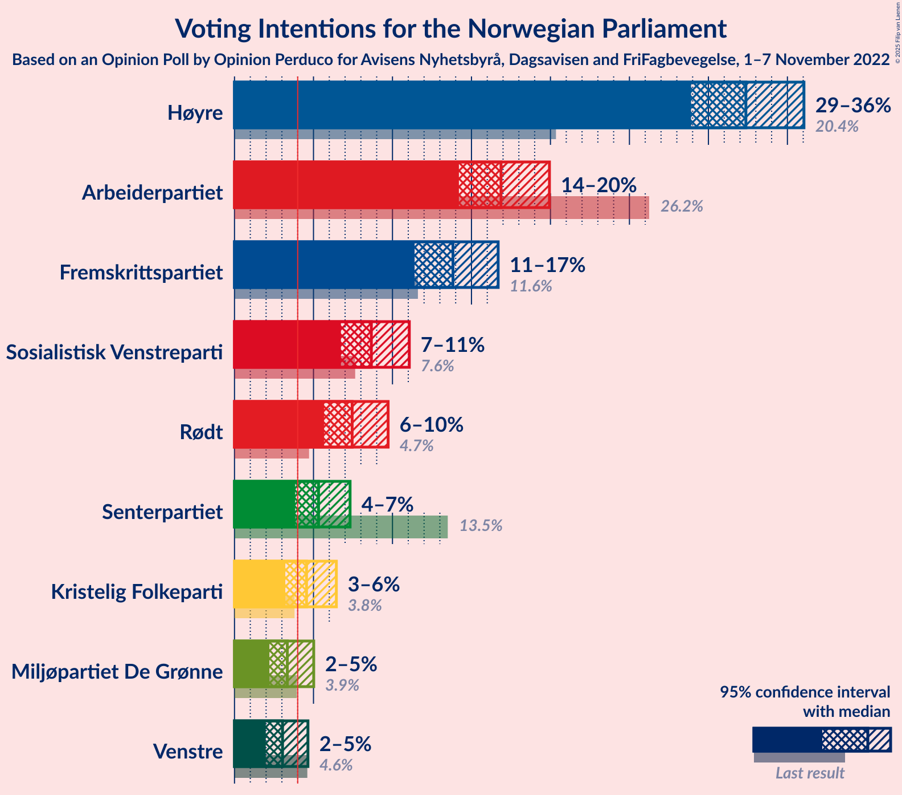

### Confidence Intervals

| Party | Last Result | Poll Result | 80% Confidence Interval | 90% Confidence Interval | 95% Confidence Interval | 99% Confidence Interval |
|:-----:|:-----------:|:-----------:|:-----------------------:|:-----------------------:|:-----------------------:|:-----------------------:|
| Høyre | 20.4% | 32.4% | 30.1–34.8% |29.4–35.5% |28.9–36.0% |27.8–37.2% |
| Arbeiderpartiet | 26.2% | 16.9% | 15.1–18.9% |14.6–19.4% |14.2–19.9% |13.4–20.9% |
| Fremskrittspartiet | 11.6% | 13.8% | 12.2–15.7% |11.8–16.2% |11.4–16.7% |10.7–17.6% |
| Sosialistisk Venstreparti | 7.6% | 8.7% | 7.4–10.2% |7.0–10.7% |6.7–11.1% |6.2–11.9% |
| Rødt | 4.7% | 7.4% | 6.3–8.9% |5.9–9.3% |5.7–9.7% |5.2–10.5% |
| Senterpartiet | 13.5% | 5.3% | 4.3–6.6% |4.1–7.0% |3.8–7.3% |3.4–8.0% |
| Kristelig Folkeparti | 3.8% | 4.6% | 3.7–5.8% |3.4–6.1% |3.2–6.4% |2.8–7.1% |
| Miljøpartiet De Grønne | 3.9% | 3.3% | 2.6–4.4% |2.4–4.7% |2.2–5.0% |1.9–5.6% |
| Venstre | 4.6% | 3.0% | 2.3–4.1% |2.1–4.4% |2.0–4.6% |1.7–5.2% |

*Note:* The poll result column reflects the actual value used in the calculations. Published results may vary slightly, and in addition be rounded to fewer digits.

## Seats

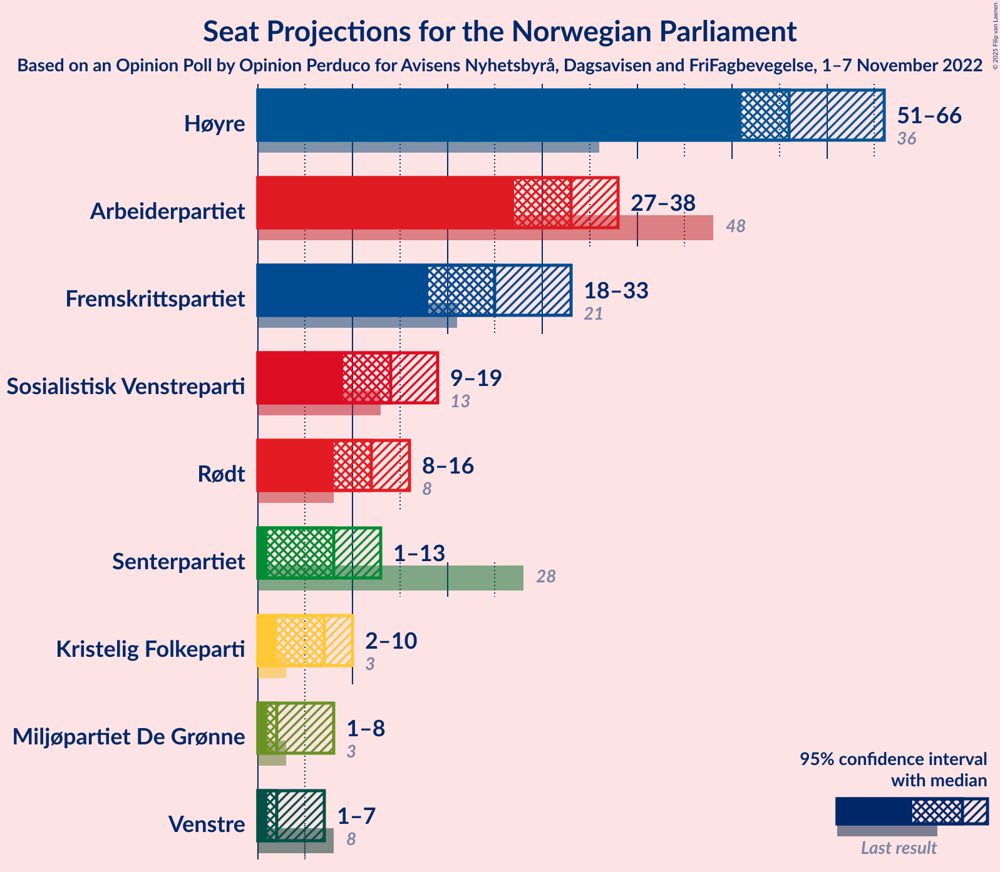

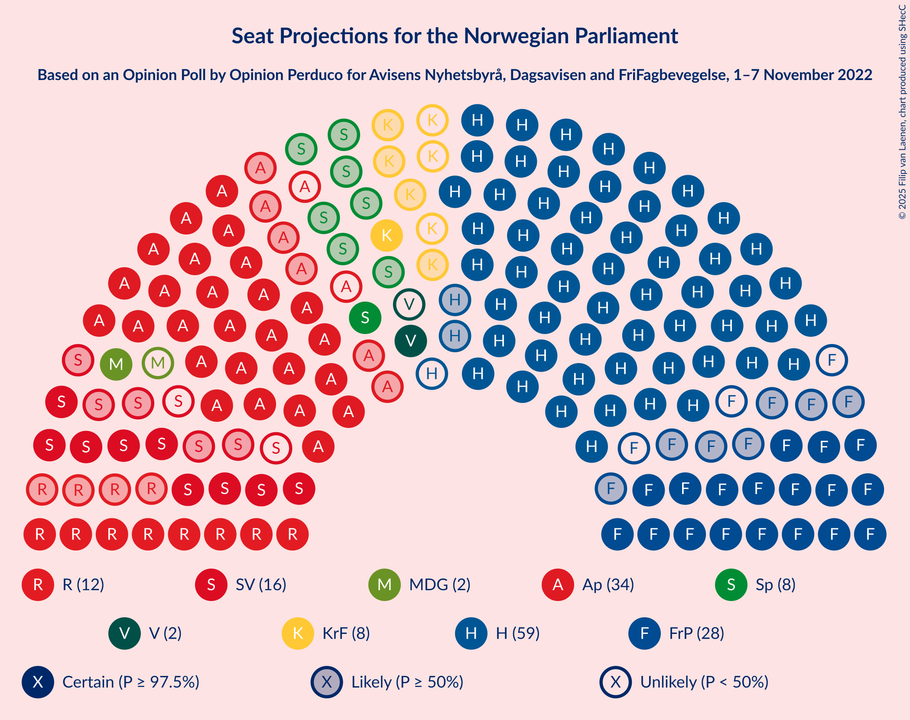

### Confidence Intervals

| Party | Last Result | Median | 80% Confidence Interval | 90% Confidence Interval | 95% Confidence Interval | 99% Confidence Interval |
|:-----:|:-----------:|:------:|:-----------------------:|:-----------------------:|:-----------------------:|:-----------------------:|
| <a href="#høyre">Høyre</a> | 36 | 56 | 52–64 |52–64 |51–66 |49–69 |
| <a href="#arbeiderpartiet">Arbeiderpartiet</a> | 48 | 33 | 30–36 |29–37 |27–38 |25–40 |
| <a href="#fremskrittspartiet">Fremskrittspartiet</a> | 21 | 25 | 20–30 |19–31 |18–33 |17–34 |
| <a href="#sosialistisk-venstreparti">Sosialistisk Venstreparti</a> | 13 | 14 | 11–17 |10–18 |9–19 |9–20 |
| <a href="#rødt">Rødt</a> | 8 | 12 | 10–15 |9–15 |8–16 |8–18 |
| <a href="#senterpartiet">Senterpartiet</a> | 28 | 8 | 7–11 |5–12 |1–13 |0–14 |
| <a href="#kristelig-folkeparti">Kristelig Folkeparti</a> | 3 | 7 | 3–9 |3–10 |2–10 |2–12 |
| <a href="#miljøpartiet-de-grønne">Miljøpartiet De Grønne</a> | 3 | 2 | 1–7 |1–7 |1–8 |1–9 |
| <a href="#venstre">Venstre</a> | 8 | 2 | 2–6 |1–7 |1–7 |1–8 |

### Høyre

*For a full overview of the results for this party, see the [Høyre](party-høyre.html) page.*

| Number of Seats | Probability | Accumulated | Special Marks |
|:---------------:|:-----------:|:-----------:|:-------------:|
| 36 | 0% | 100% | Last Result |
| 37 | 0% | 100% |  |
| 38 | 0% | 100% |  |
| 39 | 0% | 100% |  |
| 40 | 0% | 100% |  |
| 41 | 0% | 100% |  |
| 42 | 0% | 100% |  |
| 43 | 0% | 100% |  |
| 44 | 0% | 100% |  |
| 45 | 0% | 100% |  |
| 46 | 0.1% | 100% |  |
| 47 | 0.2% | 99.9% |  |
| 48 | 0.2% | 99.8% |  |
| 49 | 0.6% | 99.6% |  |
| 50 | 1.0% | 98.9% |  |
| 51 | 3% | 98% |  |
| 52 | 5% | 95% |  |
| 53 | 14% | 90% |  |
| 54 | 12% | 76% |  |
| 55 | 9% | 64% |  |
| 56 | 6% | 56% | Median |
| 57 | 7% | 49% |  |
| 58 | 6% | 42% |  |
| 59 | 12% | 37% |  |
| 60 | 3% | 25% |  |
| 61 | 3% | 22% |  |
| 62 | 4% | 19% |  |
| 63 | 4% | 15% |  |
| 64 | 6% | 11% |  |
| 65 | 1.1% | 5% |  |
| 66 | 2% | 4% |  |
| 67 | 0.5% | 2% |  |
| 68 | 0.7% | 1.4% |  |
| 69 | 0.5% | 0.7% |  |
| 70 | 0% | 0.1% |  |
| 71 | 0.1% | 0.1% |  |
| 72 | 0% | 0% |  |

### Arbeiderpartiet

*For a full overview of the results for this party, see the [Arbeiderpartiet](party-arbeiderpartiet.html) page.*

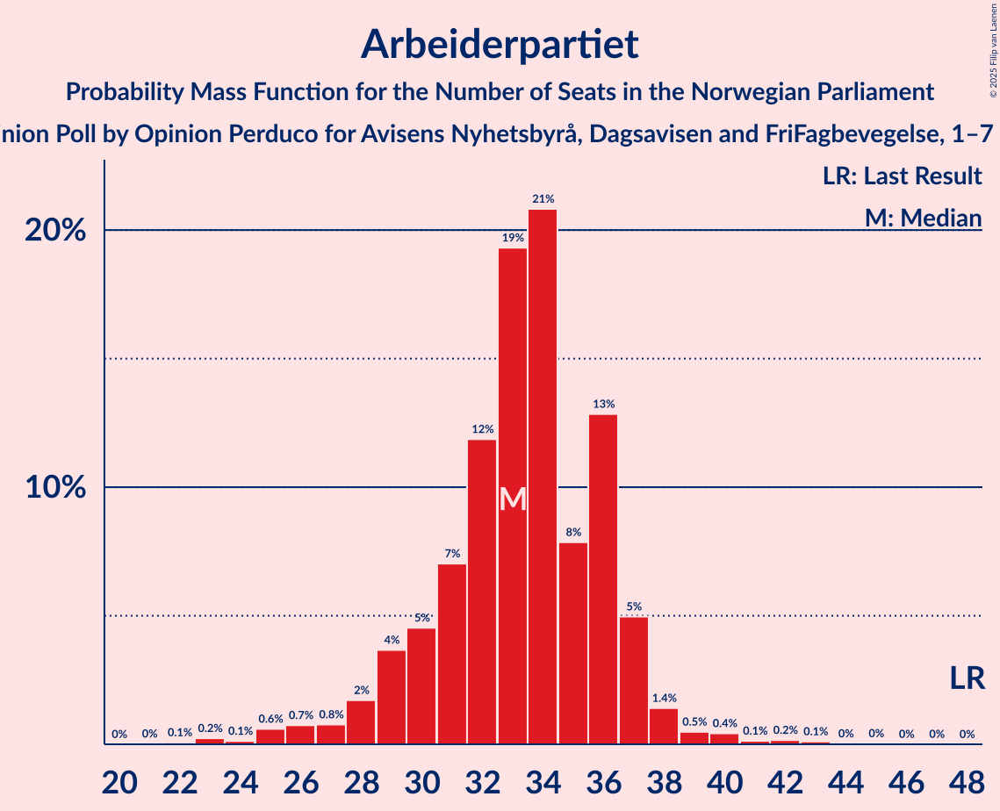

| Number of Seats | Probability | Accumulated | Special Marks |
|:---------------:|:-----------:|:-----------:|:-------------:|
| 22 | 0.1% | 100% |  |
| 23 | 0.2% | 99.9% |  |
| 24 | 0.1% | 99.7% |  |
| 25 | 0.6% | 99.5% |  |
| 26 | 0.7% | 98.9% |  |
| 27 | 0.8% | 98% |  |
| 28 | 2% | 97% |  |
| 29 | 4% | 96% |  |
| 30 | 5% | 92% |  |
| 31 | 7% | 88% |  |
| 32 | 12% | 80% |  |
| 33 | 19% | 69% | Median |
| 34 | 21% | 49% |  |
| 35 | 8% | 28% |  |
| 36 | 13% | 21% |  |
| 37 | 5% | 8% |  |
| 38 | 1.4% | 3% |  |
| 39 | 0.5% | 1.4% |  |
| 40 | 0.4% | 0.9% |  |
| 41 | 0.1% | 0.5% |  |
| 42 | 0.2% | 0.4% |  |
| 43 | 0.1% | 0.2% |  |
| 44 | 0% | 0.1% |  |
| 45 | 0% | 0.1% |  |
| 46 | 0% | 0% |  |
| 47 | 0% | 0% |  |
| 48 | 0% | 0% | Last Result |

### Fremskrittspartiet

*For a full overview of the results for this party, see the [Fremskrittspartiet](party-fremskrittspartiet.html) page.*

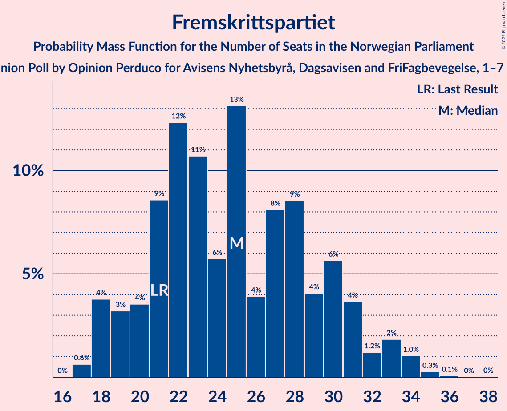

| Number of Seats | Probability | Accumulated | Special Marks |
|:---------------:|:-----------:|:-----------:|:-------------:|
| 17 | 0.6% | 100% |  |
| 18 | 4% | 99.4% |  |
| 19 | 3% | 96% |  |
| 20 | 4% | 92% |  |
| 21 | 9% | 89% | Last Result |
| 22 | 12% | 80% |  |
| 23 | 11% | 68% |  |
| 24 | 6% | 57% |  |
| 25 | 13% | 51% | Median |
| 26 | 4% | 38% |  |
| 27 | 8% | 34% |  |
| 28 | 9% | 26% |  |
| 29 | 4% | 18% |  |
| 30 | 6% | 14% |  |
| 31 | 4% | 8% |  |
| 32 | 1.2% | 4% |  |
| 33 | 2% | 3% |  |
| 34 | 1.0% | 1.4% |  |
| 35 | 0.3% | 0.4% |  |
| 36 | 0.1% | 0.1% |  |
| 37 | 0% | 0% |  |

### Sosialistisk Venstreparti

*For a full overview of the results for this party, see the [Sosialistisk Venstreparti](party-sosialistiskvenstreparti.html) page.*

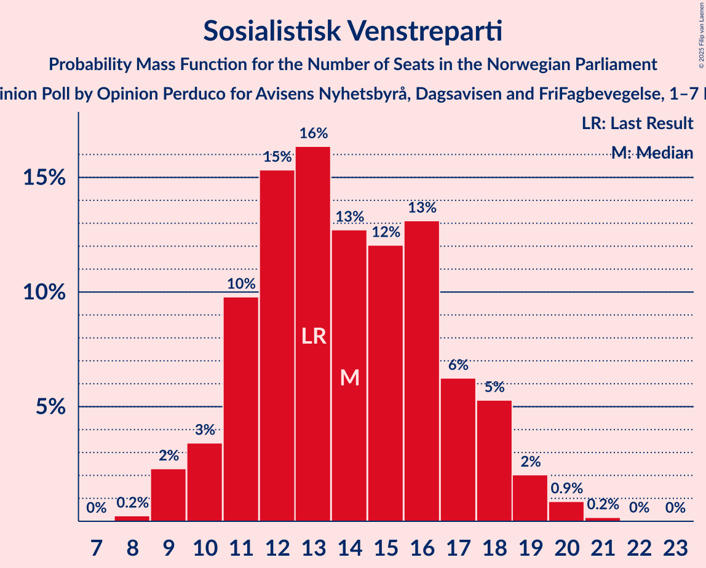

| Number of Seats | Probability | Accumulated | Special Marks |
|:---------------:|:-----------:|:-----------:|:-------------:|
| 8 | 0.2% | 100% |  |
| 9 | 2% | 99.7% |  |
| 10 | 3% | 97% |  |
| 11 | 10% | 94% |  |
| 12 | 15% | 84% |  |
| 13 | 16% | 69% | Last Result |
| 14 | 13% | 53% | Median |
| 15 | 12% | 40% |  |
| 16 | 13% | 28% |  |
| 17 | 6% | 15% |  |
| 18 | 5% | 8% |  |
| 19 | 2% | 3% |  |
| 20 | 0.9% | 1.1% |  |
| 21 | 0.2% | 0.2% |  |
| 22 | 0% | 0.1% |  |
| 23 | 0% | 0% |  |

### Rødt

*For a full overview of the results for this party, see the [Rødt](party-rødt.html) page.*

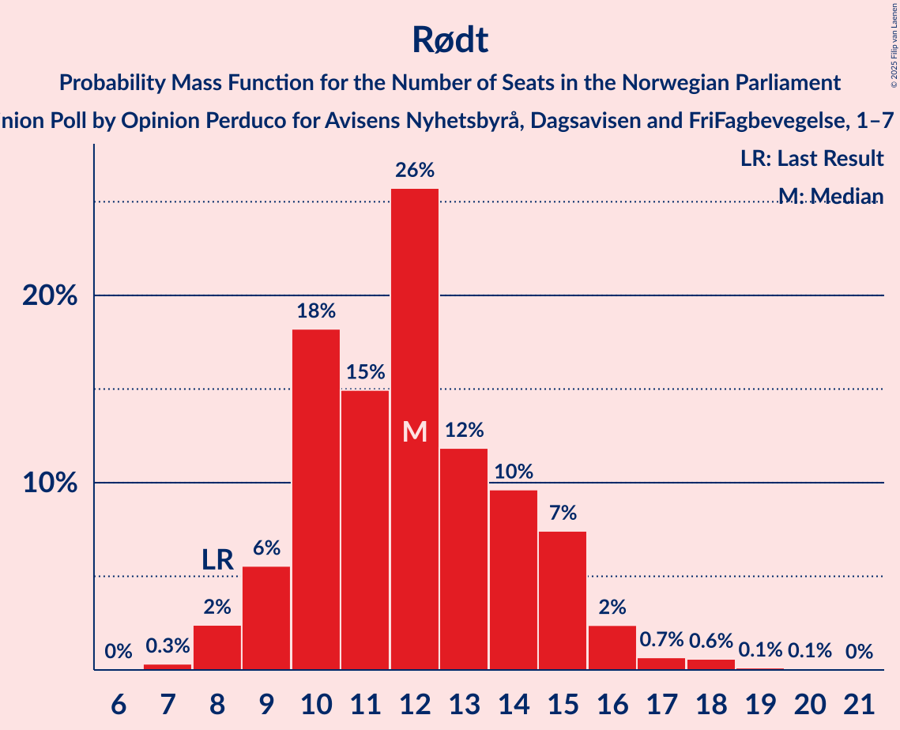

| Number of Seats | Probability | Accumulated | Special Marks |
|:---------------:|:-----------:|:-----------:|:-------------:|
| 7 | 0.3% | 100% |  |
| 8 | 2% | 99.6% | Last Result |
| 9 | 6% | 97% |  |
| 10 | 18% | 92% |  |
| 11 | 15% | 73% |  |
| 12 | 26% | 59% | Median |
| 13 | 12% | 33% |  |
| 14 | 10% | 21% |  |
| 15 | 7% | 11% |  |
| 16 | 2% | 4% |  |
| 17 | 0.7% | 1.5% |  |
| 18 | 0.6% | 0.8% |  |
| 19 | 0.1% | 0.2% |  |
| 20 | 0.1% | 0.1% |  |
| 21 | 0% | 0% |  |

### Senterpartiet

*For a full overview of the results for this party, see the [Senterpartiet](party-senterpartiet.html) page.*

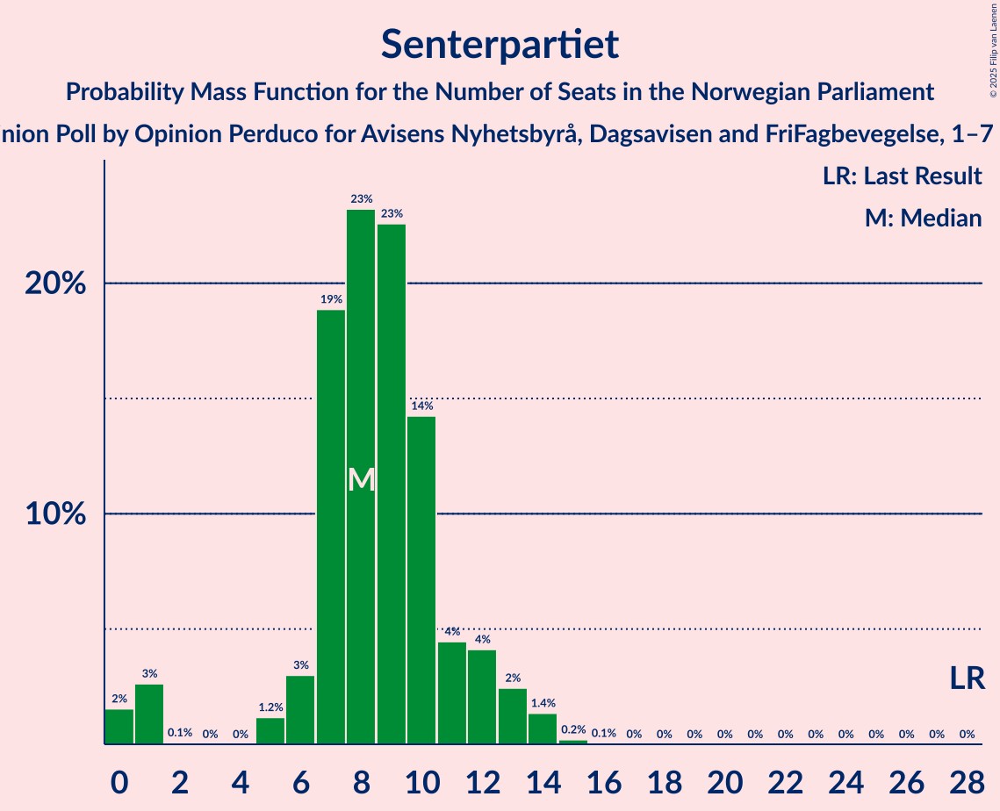

| Number of Seats | Probability | Accumulated | Special Marks |
|:---------------:|:-----------:|:-----------:|:-------------:|
| 0 | 2% | 100% |  |
| 1 | 3% | 98% |  |
| 2 | 0.1% | 96% |  |
| 3 | 0% | 96% |  |
| 4 | 0% | 96% |  |
| 5 | 1.2% | 96% |  |
| 6 | 3% | 95% |  |
| 7 | 19% | 92% |  |
| 8 | 23% | 73% | Median |
| 9 | 23% | 49% |  |
| 10 | 14% | 27% |  |
| 11 | 4% | 13% |  |
| 12 | 4% | 8% |  |
| 13 | 2% | 4% |  |
| 14 | 1.4% | 2% |  |
| 15 | 0.2% | 0.3% |  |
| 16 | 0.1% | 0.1% |  |
| 17 | 0% | 0% |  |
| 18 | 0% | 0% |  |
| 19 | 0% | 0% |  |
| 20 | 0% | 0% |  |
| 21 | 0% | 0% |  |
| 22 | 0% | 0% |  |
| 23 | 0% | 0% |  |
| 24 | 0% | 0% |  |
| 25 | 0% | 0% |  |
| 26 | 0% | 0% |  |
| 27 | 0% | 0% |  |
| 28 | 0% | 0% | Last Result |

### Kristelig Folkeparti

*For a full overview of the results for this party, see the [Kristelig Folkeparti](party-kristeligfolkeparti.html) page.*

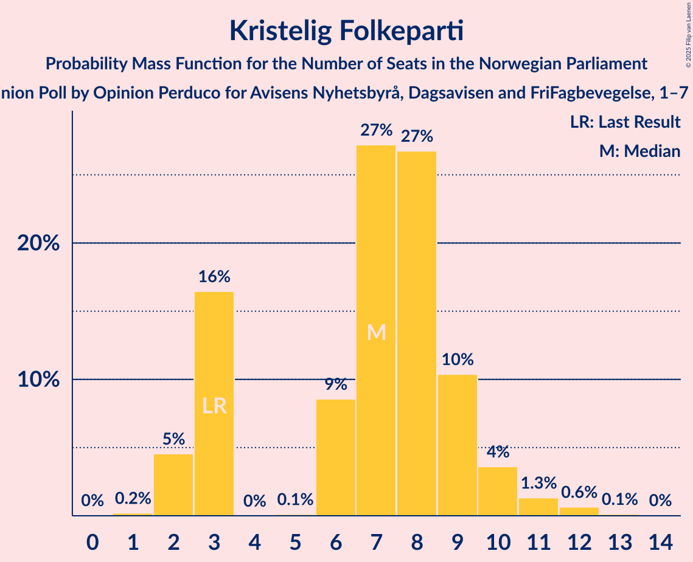

| Number of Seats | Probability | Accumulated | Special Marks |
|:---------------:|:-----------:|:-----------:|:-------------:|
| 1 | 0.2% | 100% |  |
| 2 | 5% | 99.8% |  |
| 3 | 16% | 95% | Last Result |
| 4 | 0% | 79% |  |
| 5 | 0.1% | 79% |  |
| 6 | 9% | 79% |  |
| 7 | 27% | 70% | Median |
| 8 | 27% | 43% |  |
| 9 | 10% | 16% |  |
| 10 | 4% | 6% |  |
| 11 | 1.3% | 2% |  |
| 12 | 0.6% | 0.8% |  |
| 13 | 0.1% | 0.2% |  |
| 14 | 0% | 0% |  |

### Miljøpartiet De Grønne

*For a full overview of the results for this party, see the [Miljøpartiet De Grønne](party-miljøpartietdegrønne.html) page.*

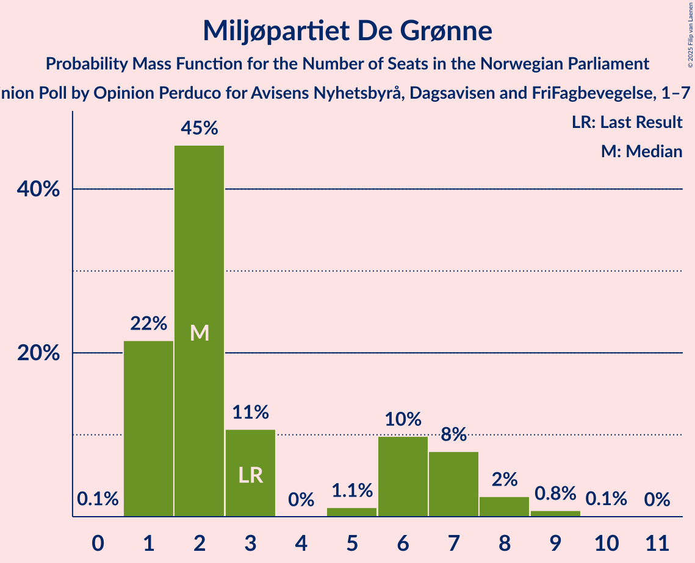

| Number of Seats | Probability | Accumulated | Special Marks |
|:---------------:|:-----------:|:-----------:|:-------------:|
| 0 | 0.1% | 100% |  |
| 1 | 22% | 99.9% |  |
| 2 | 45% | 78% | Median |
| 3 | 11% | 33% | Last Result |
| 4 | 0% | 22% |  |
| 5 | 1.1% | 22% |  |
| 6 | 10% | 21% |  |
| 7 | 8% | 11% |  |
| 8 | 2% | 3% |  |
| 9 | 0.8% | 0.9% |  |
| 10 | 0.1% | 0.1% |  |
| 11 | 0% | 0% |  |

### Venstre

*For a full overview of the results for this party, see the [Venstre](party-venstre.html) page.*

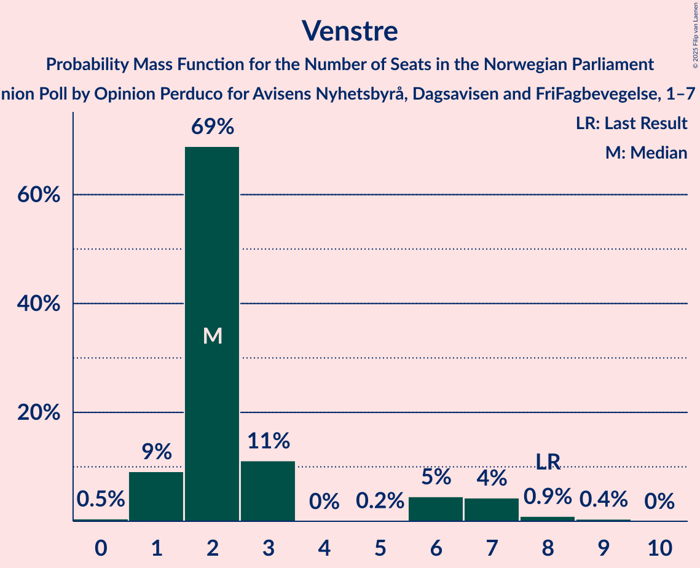

| Number of Seats | Probability | Accumulated | Special Marks |
|:---------------:|:-----------:|:-----------:|:-------------:|
| 0 | 0.5% | 100% |  |
| 1 | 9% | 99.5% |  |
| 2 | 69% | 90% | Median |
| 3 | 11% | 22% |  |
| 4 | 0% | 10% |  |
| 5 | 0.2% | 10% |  |
| 6 | 5% | 10% |  |
| 7 | 4% | 6% |  |
| 8 | 0.9% | 1.4% | Last Result |
| 9 | 0.4% | 0.4% |  |
| 10 | 0% | 0% |  |

## Coalitions

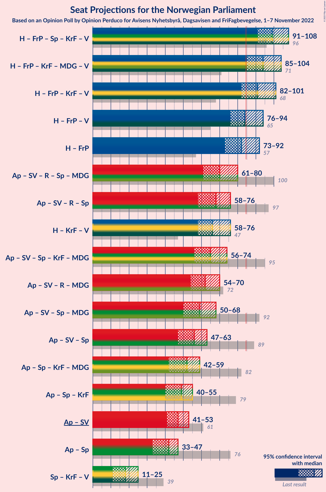

### Confidence Intervals

| Coalition | Last Result | Median | Majority? | 80% Confidence Interval | 90% Confidence Interval | 95% Confidence Interval | 99% Confidence Interval |
|:---------:|:-----------:|:------:|:---------:|:-----------------------:|:-----------------------:|:-----------------------:|:-----------------------:|
| Høyre – Fremskrittspartiet – Senterpartiet – Kristelig Folkeparti – Venstre | 96 | 99 | 100% | 93–105 | 93–106 | 91–108 | 89–111 |
| Høyre – Fremskrittspartiet – Kristelig Folkeparti – Miljøpartiet De Grønne – Venstre | 71 | 94 | 98.6% | 88–100 | 87–102 | 85–104 | 83–107 |
| Høyre – Fremskrittspartiet – Kristelig Folkeparti – Venstre | 68 | 91 | 89% | 84–97 | 83–99 | 82–101 | 80–104 |
| Høyre – Fremskrittspartiet – Venstre | 65 | 84 | 49% | 78–90 | 77–93 | 76–94 | 74–98 |
| Høyre – Fremskrittspartiet | 57 | 82 | 32% | 75–87 | 75–90 | 73–92 | 72–95 |
| Arbeiderpartiet – Sosialistisk Venstreparti – Rødt – Senterpartiet – Miljøpartiet De Grønne | 100 | 70 | 0.1% | 65–76 | 63–78 | 61–80 | 57–83 |
| Arbeiderpartiet – Sosialistisk Venstreparti – Rødt – Senterpartiet | 97 | 68 | 0% | 62–73 | 60–75 | 58–76 | 55–79 |
| Høyre – Kristelig Folkeparti – Venstre | 47 | 66 | 0% | 61–73 | 60–75 | 58–76 | 56–79 |
| Arbeiderpartiet – Sosialistisk Venstreparti – Senterpartiet – Kristelig Folkeparti – Miljøpartiet De Grønne | 95 | 65 | 0% | 59–71 | 57–72 | 56–74 | 53–76 |
| Arbeiderpartiet – Sosialistisk Venstreparti – Rødt – Miljøpartiet De Grønne | 72 | 62 | 0% | 57–67 | 56–69 | 54–70 | 51–73 |
| Arbeiderpartiet – Sosialistisk Venstreparti – Senterpartiet – Miljøpartiet De Grønne | 92 | 59 | 0% | 53–64 | 52–65 | 50–68 | 47–69 |
| Arbeiderpartiet – Sosialistisk Venstreparti – Senterpartiet | 89 | 56 | 0% | 51–60 | 49–62 | 47–63 | 44–65 |
| Arbeiderpartiet – Senterpartiet – Kristelig Folkeparti – Miljøpartiet De Grønne | 82 | 52 | 0% | 46–56 | 44–57 | 42–59 | 39–62 |
| Arbeiderpartiet – Senterpartiet – Kristelig Folkeparti | 79 | 49 | 0% | 43–53 | 41–55 | 40–55 | 36–57 |
| Arbeiderpartiet – Sosialistisk Venstreparti | 61 | 47 | 0% | 44–51 | 42–52 | 41–53 | 37–56 |
| Arbeiderpartiet – Senterpartiet | 76 | 42 | 0% | 38–45 | 35–47 | 33–47 | 32–50 |
| Senterpartiet – Kristelig Folkeparti – Venstre | 39 | 18 | 0% | 13–21 | 12–23 | 11–25 | 6–27 |

### Høyre – Fremskrittspartiet – Senterpartiet – Kristelig Folkeparti – Venstre

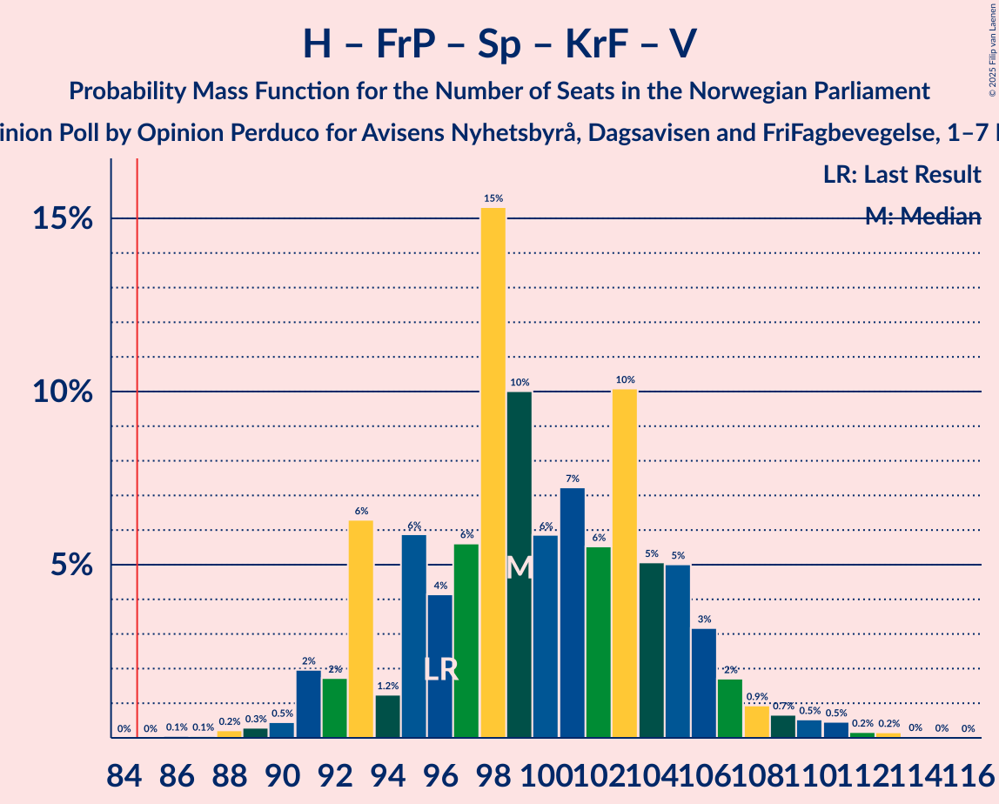

| Number of Seats | Probability | Accumulated | Special Marks |
|:---------------:|:-----------:|:-----------:|:-------------:|
| 86 | 0.1% | 100% |  |
| 87 | 0.1% | 99.9% |  |
| 88 | 0.2% | 99.9% |  |
| 89 | 0.3% | 99.6% |  |
| 90 | 0.5% | 99.4% |  |
| 91 | 2% | 98.9% |  |
| 92 | 2% | 97% |  |
| 93 | 6% | 95% |  |
| 94 | 1.2% | 89% |  |
| 95 | 6% | 88% |  |
| 96 | 4% | 82% | Last Result |
| 97 | 6% | 78% |  |
| 98 | 15% | 72% | Median |
| 99 | 10% | 57% |  |
| 100 | 6% | 47% |  |
| 101 | 7% | 41% |  |
| 102 | 6% | 34% |  |
| 103 | 10% | 28% |  |
| 104 | 5% | 18% |  |
| 105 | 5% | 13% |  |
| 106 | 3% | 8% |  |
| 107 | 2% | 5% |  |
| 108 | 0.9% | 3% |  |
| 109 | 0.7% | 2% |  |
| 110 | 0.5% | 1.4% |  |
| 111 | 0.5% | 0.9% |  |
| 112 | 0.2% | 0.4% |  |
| 113 | 0.2% | 0.3% |  |
| 114 | 0% | 0.1% |  |
| 115 | 0% | 0.1% |  |
| 116 | 0% | 0% |  |

### Høyre – Fremskrittspartiet – Kristelig Folkeparti – Miljøpartiet De Grønne – Venstre

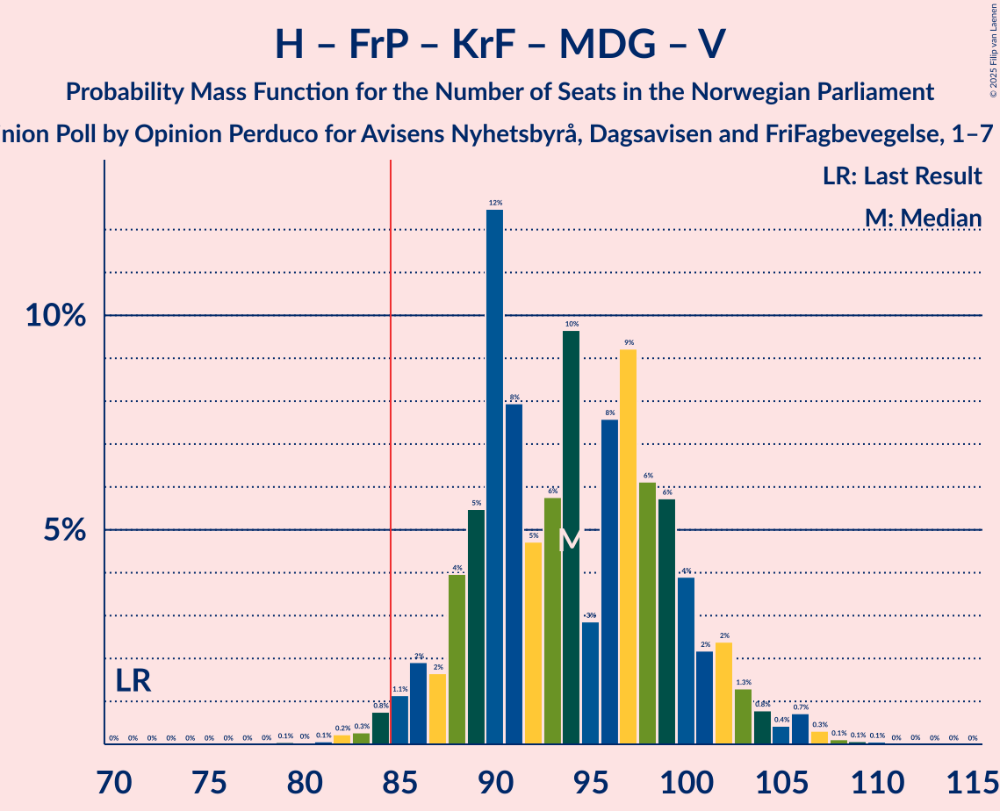

| Number of Seats | Probability | Accumulated | Special Marks |
|:---------------:|:-----------:|:-----------:|:-------------:|
| 71 | 0% | 100% | Last Result |
| 72 | 0% | 100% |  |
| 73 | 0% | 100% |  |
| 74 | 0% | 100% |  |
| 75 | 0% | 100% |  |
| 76 | 0% | 100% |  |
| 77 | 0% | 100% |  |
| 78 | 0% | 100% |  |
| 79 | 0.1% | 100% |  |
| 80 | 0% | 99.9% |  |
| 81 | 0.1% | 99.9% |  |
| 82 | 0.2% | 99.8% |  |
| 83 | 0.3% | 99.6% |  |
| 84 | 0.8% | 99.3% |  |
| 85 | 1.1% | 98.6% | Majority |
| 86 | 2% | 97% |  |
| 87 | 2% | 96% |  |
| 88 | 4% | 94% |  |
| 89 | 5% | 90% |  |
| 90 | 12% | 84% |  |
| 91 | 8% | 72% |  |
| 92 | 5% | 64% | Median |
| 93 | 6% | 59% |  |
| 94 | 10% | 53% |  |
| 95 | 3% | 44% |  |
| 96 | 8% | 41% |  |
| 97 | 9% | 33% |  |
| 98 | 6% | 24% |  |
| 99 | 6% | 18% |  |
| 100 | 4% | 12% |  |
| 101 | 2% | 8% |  |
| 102 | 2% | 6% |  |
| 103 | 1.3% | 4% |  |
| 104 | 0.8% | 3% |  |
| 105 | 0.4% | 2% |  |
| 106 | 0.7% | 1.3% |  |
| 107 | 0.3% | 0.6% |  |
| 108 | 0.1% | 0.3% |  |
| 109 | 0.1% | 0.2% |  |
| 110 | 0.1% | 0.1% |  |
| 111 | 0% | 0% |  |

### Høyre – Fremskrittspartiet – Kristelig Folkeparti – Venstre

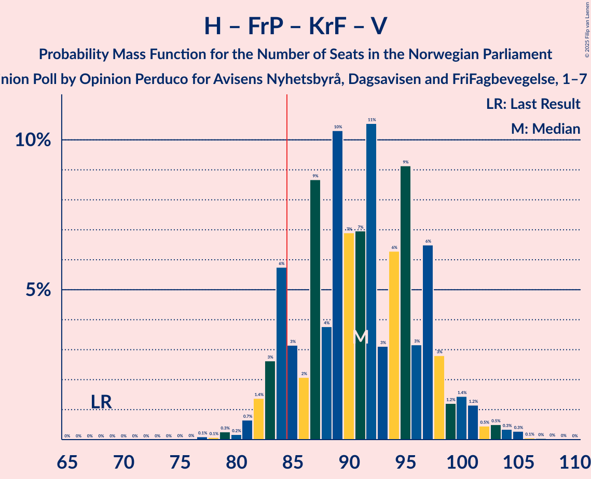

| Number of Seats | Probability | Accumulated | Special Marks |
|:---------------:|:-----------:|:-----------:|:-------------:|
| 68 | 0% | 100% | Last Result |
| 69 | 0% | 100% |  |
| 70 | 0% | 100% |  |
| 71 | 0% | 100% |  |
| 72 | 0% | 100% |  |
| 73 | 0% | 100% |  |
| 74 | 0% | 100% |  |
| 75 | 0% | 100% |  |
| 76 | 0% | 100% |  |
| 77 | 0.1% | 100% |  |
| 78 | 0.1% | 99.9% |  |
| 79 | 0.3% | 99.8% |  |
| 80 | 0.2% | 99.5% |  |
| 81 | 0.7% | 99.4% |  |
| 82 | 1.4% | 98.7% |  |
| 83 | 3% | 97% |  |
| 84 | 6% | 95% |  |
| 85 | 3% | 89% | Majority |
| 86 | 2% | 86% |  |
| 87 | 9% | 84% |  |
| 88 | 4% | 75% |  |
| 89 | 10% | 71% |  |
| 90 | 7% | 61% | Median |
| 91 | 7% | 54% |  |
| 92 | 11% | 47% |  |
| 93 | 3% | 37% |  |
| 94 | 6% | 33% |  |
| 95 | 9% | 27% |  |
| 96 | 3% | 18% |  |
| 97 | 6% | 15% |  |
| 98 | 3% | 8% |  |
| 99 | 1.2% | 6% |  |
| 100 | 1.4% | 4% |  |
| 101 | 1.2% | 3% |  |
| 102 | 0.5% | 2% |  |
| 103 | 0.5% | 1.3% |  |
| 104 | 0.3% | 0.8% |  |
| 105 | 0.3% | 0.4% |  |
| 106 | 0.1% | 0.1% |  |
| 107 | 0% | 0.1% |  |
| 108 | 0% | 0% |  |

### Høyre – Fremskrittspartiet – Venstre

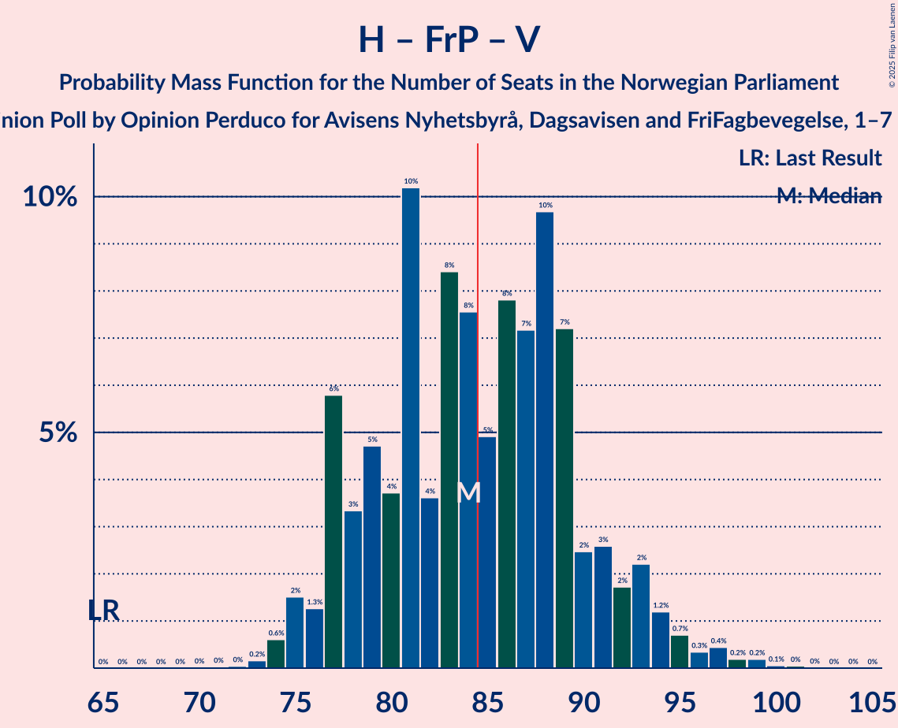

| Number of Seats | Probability | Accumulated | Special Marks |
|:---------------:|:-----------:|:-----------:|:-------------:|
| 65 | 0% | 100% | Last Result |
| 66 | 0% | 100% |  |
| 67 | 0% | 100% |  |
| 68 | 0% | 100% |  |
| 69 | 0% | 100% |  |
| 70 | 0% | 100% |  |
| 71 | 0% | 100% |  |
| 72 | 0% | 100% |  |
| 73 | 0.2% | 99.9% |  |
| 74 | 0.6% | 99.7% |  |
| 75 | 2% | 99.1% |  |
| 76 | 1.3% | 98% |  |
| 77 | 6% | 96% |  |
| 78 | 3% | 91% |  |
| 79 | 5% | 87% |  |
| 80 | 4% | 83% |  |
| 81 | 10% | 79% |  |
| 82 | 4% | 69% |  |
| 83 | 8% | 65% | Median |
| 84 | 8% | 57% |  |
| 85 | 5% | 49% | Majority |
| 86 | 8% | 44% |  |
| 87 | 7% | 36% |  |
| 88 | 10% | 29% |  |
| 89 | 7% | 19% |  |
| 90 | 2% | 12% |  |
| 91 | 3% | 10% |  |
| 92 | 2% | 7% |  |
| 93 | 2% | 5% |  |
| 94 | 1.2% | 3% |  |
| 95 | 0.7% | 2% |  |
| 96 | 0.3% | 1.3% |  |
| 97 | 0.4% | 1.0% |  |
| 98 | 0.2% | 0.5% |  |
| 99 | 0.2% | 0.3% |  |
| 100 | 0.1% | 0.1% |  |
| 101 | 0% | 0.1% |  |
| 102 | 0% | 0% |  |

### Høyre – Fremskrittspartiet

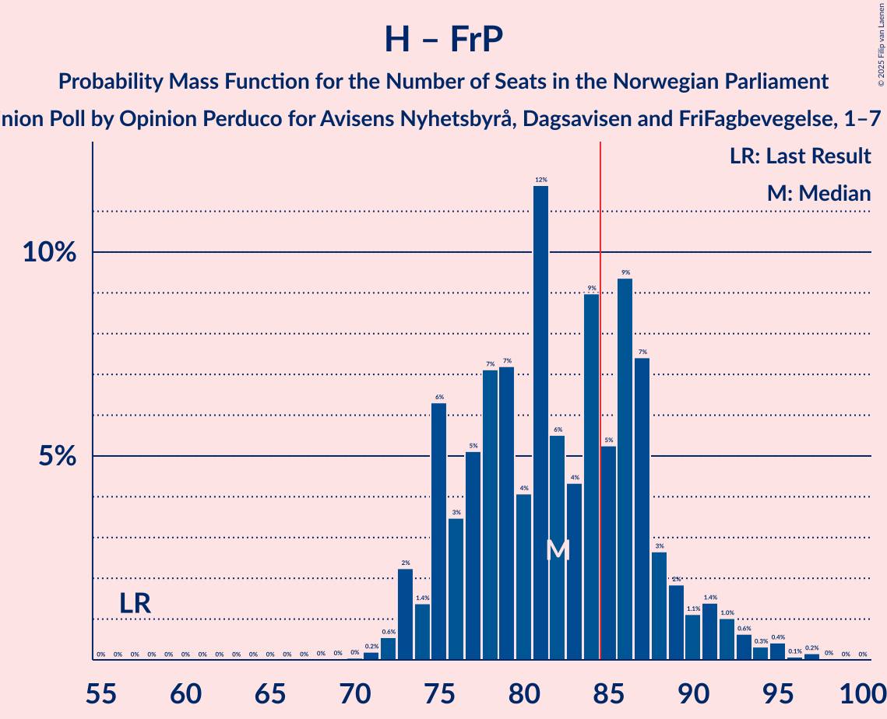

| Number of Seats | Probability | Accumulated | Special Marks |
|:---------------:|:-----------:|:-----------:|:-------------:|
| 57 | 0% | 100% | Last Result |
| 58 | 0% | 100% |  |
| 59 | 0% | 100% |  |
| 60 | 0% | 100% |  |
| 61 | 0% | 100% |  |
| 62 | 0% | 100% |  |
| 63 | 0% | 100% |  |
| 64 | 0% | 100% |  |
| 65 | 0% | 100% |  |
| 66 | 0% | 100% |  |
| 67 | 0% | 100% |  |
| 68 | 0% | 100% |  |
| 69 | 0% | 100% |  |
| 70 | 0% | 99.9% |  |
| 71 | 0.2% | 99.9% |  |
| 72 | 0.6% | 99.7% |  |
| 73 | 2% | 99.1% |  |
| 74 | 1.4% | 97% |  |
| 75 | 6% | 96% |  |
| 76 | 3% | 89% |  |
| 77 | 5% | 86% |  |
| 78 | 7% | 81% |  |
| 79 | 7% | 73% |  |
| 80 | 4% | 66% |  |
| 81 | 12% | 62% | Median |
| 82 | 6% | 51% |  |
| 83 | 4% | 45% |  |
| 84 | 9% | 41% |  |
| 85 | 5% | 32% | Majority |
| 86 | 9% | 26% |  |
| 87 | 7% | 17% |  |
| 88 | 3% | 10% |  |
| 89 | 2% | 7% |  |
| 90 | 1.1% | 5% |  |
| 91 | 1.4% | 4% |  |
| 92 | 1.0% | 3% |  |
| 93 | 0.6% | 2% |  |
| 94 | 0.3% | 1.0% |  |
| 95 | 0.4% | 0.7% |  |
| 96 | 0.1% | 0.3% |  |
| 97 | 0.2% | 0.2% |  |
| 98 | 0% | 0% |  |

### Arbeiderpartiet – Sosialistisk Venstreparti – Rødt – Senterpartiet – Miljøpartiet De Grønne

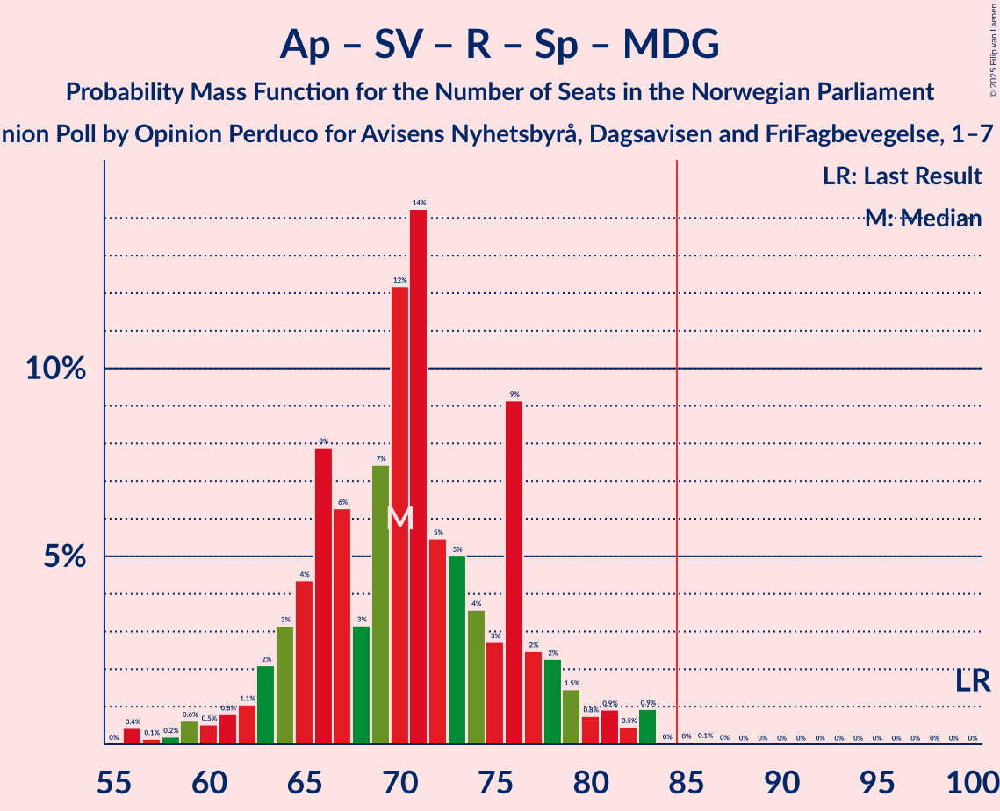

| Number of Seats | Probability | Accumulated | Special Marks |
|:---------------:|:-----------:|:-----------:|:-------------:|
| 55 | 0% | 100% |  |
| 56 | 0.4% | 99.9% |  |
| 57 | 0.1% | 99.5% |  |
| 58 | 0.2% | 99.4% |  |
| 59 | 0.6% | 99.2% |  |
| 60 | 0.5% | 98.5% |  |
| 61 | 0.8% | 98% |  |
| 62 | 1.1% | 97% |  |
| 63 | 2% | 96% |  |
| 64 | 3% | 94% |  |
| 65 | 4% | 91% |  |
| 66 | 8% | 87% |  |
| 67 | 6% | 79% |  |
| 68 | 3% | 72% |  |
| 69 | 7% | 69% | Median |
| 70 | 12% | 62% |  |
| 71 | 14% | 50% |  |
| 72 | 5% | 35% |  |
| 73 | 5% | 30% |  |
| 74 | 4% | 25% |  |
| 75 | 3% | 21% |  |
| 76 | 9% | 19% |  |
| 77 | 2% | 9% |  |
| 78 | 2% | 7% |  |
| 79 | 1.5% | 5% |  |
| 80 | 0.8% | 3% |  |
| 81 | 0.9% | 2% |  |
| 82 | 0.5% | 2% |  |
| 83 | 0.9% | 1.1% |  |
| 84 | 0% | 0.2% |  |
| 85 | 0% | 0.1% | Majority |
| 86 | 0.1% | 0.1% |  |
| 87 | 0% | 0% |  |
| 88 | 0% | 0% |  |
| 89 | 0% | 0% |  |
| 90 | 0% | 0% |  |
| 91 | 0% | 0% |  |
| 92 | 0% | 0% |  |
| 93 | 0% | 0% |  |
| 94 | 0% | 0% |  |
| 95 | 0% | 0% |  |
| 96 | 0% | 0% |  |
| 97 | 0% | 0% |  |
| 98 | 0% | 0% |  |
| 99 | 0% | 0% |  |
| 100 | 0% | 0% | Last Result |

### Arbeiderpartiet – Sosialistisk Venstreparti – Rødt – Senterpartiet

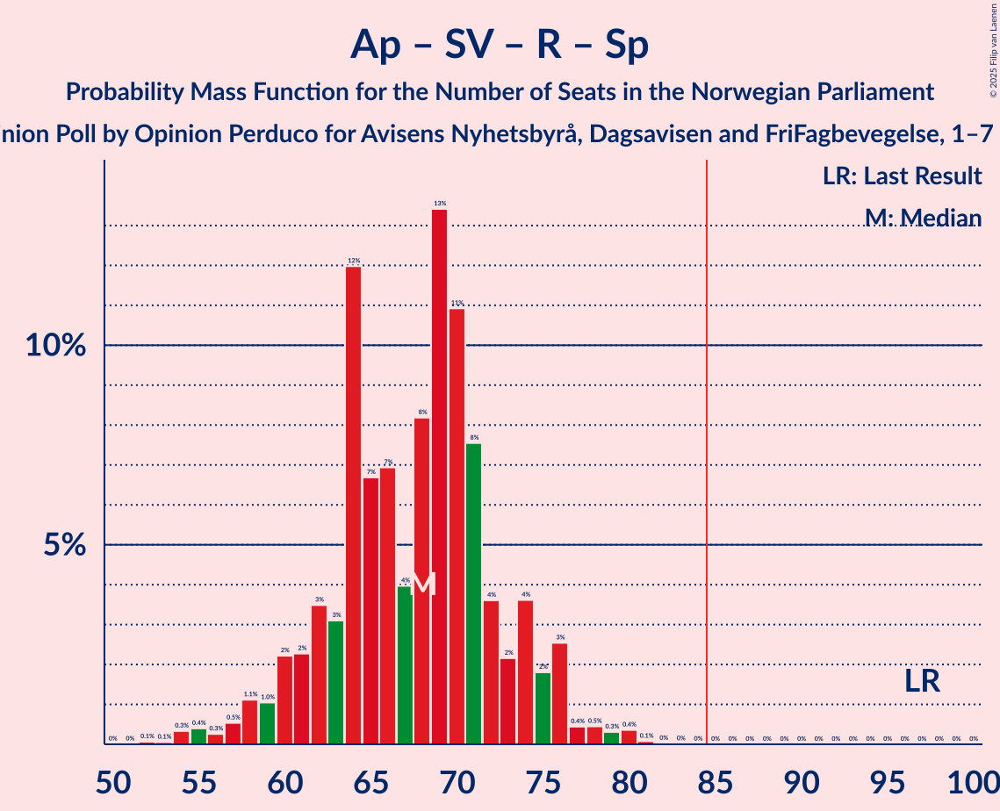

| Number of Seats | Probability | Accumulated | Special Marks |
|:---------------:|:-----------:|:-----------:|:-------------:|
| 52 | 0.1% | 100% |  |
| 53 | 0.1% | 99.9% |  |
| 54 | 0.3% | 99.9% |  |
| 55 | 0.4% | 99.5% |  |
| 56 | 0.3% | 99.1% |  |
| 57 | 0.5% | 98.9% |  |
| 58 | 1.1% | 98% |  |
| 59 | 1.0% | 97% |  |
| 60 | 2% | 96% |  |
| 61 | 2% | 94% |  |
| 62 | 3% | 92% |  |
| 63 | 3% | 88% |  |
| 64 | 12% | 85% |  |
| 65 | 7% | 73% |  |
| 66 | 7% | 66% |  |
| 67 | 4% | 59% | Median |
| 68 | 8% | 56% |  |
| 69 | 13% | 47% |  |
| 70 | 11% | 34% |  |
| 71 | 8% | 23% |  |
| 72 | 4% | 15% |  |
| 73 | 2% | 12% |  |
| 74 | 4% | 10% |  |
| 75 | 2% | 6% |  |
| 76 | 3% | 4% |  |
| 77 | 0.4% | 2% |  |
| 78 | 0.5% | 1.2% |  |
| 79 | 0.3% | 0.8% |  |
| 80 | 0.4% | 0.5% |  |
| 81 | 0.1% | 0.1% |  |
| 82 | 0% | 0% |  |
| 83 | 0% | 0% |  |
| 84 | 0% | 0% |  |
| 85 | 0% | 0% | Majority |
| 86 | 0% | 0% |  |
| 87 | 0% | 0% |  |
| 88 | 0% | 0% |  |
| 89 | 0% | 0% |  |
| 90 | 0% | 0% |  |
| 91 | 0% | 0% |  |
| 92 | 0% | 0% |  |
| 93 | 0% | 0% |  |
| 94 | 0% | 0% |  |
| 95 | 0% | 0% |  |
| 96 | 0% | 0% |  |
| 97 | 0% | 0% | Last Result |

### Høyre – Kristelig Folkeparti – Venstre

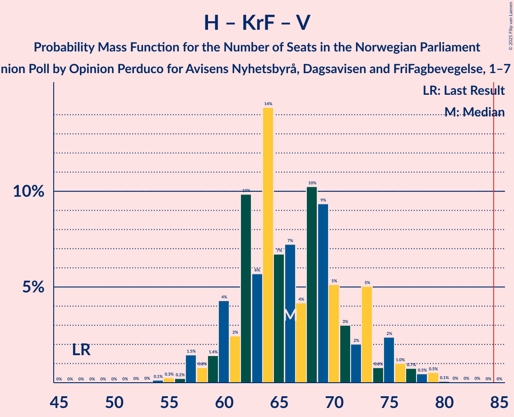

| Number of Seats | Probability | Accumulated | Special Marks |
|:---------------:|:-----------:|:-----------:|:-------------:|
| 47 | 0% | 100% | Last Result |
| 48 | 0% | 100% |  |
| 49 | 0% | 100% |  |
| 50 | 0% | 100% |  |
| 51 | 0% | 100% |  |
| 52 | 0% | 100% |  |
| 53 | 0% | 100% |  |
| 54 | 0.1% | 99.9% |  |
| 55 | 0.3% | 99.8% |  |
| 56 | 0.2% | 99.5% |  |
| 57 | 1.5% | 99.3% |  |
| 58 | 0.8% | 98% |  |
| 59 | 1.4% | 97% |  |
| 60 | 4% | 96% |  |
| 61 | 2% | 91% |  |
| 62 | 10% | 89% |  |
| 63 | 6% | 79% |  |
| 64 | 14% | 73% |  |
| 65 | 7% | 59% | Median |
| 66 | 7% | 52% |  |
| 67 | 4% | 45% |  |
| 68 | 10% | 41% |  |
| 69 | 9% | 31% |  |
| 70 | 5% | 21% |  |
| 71 | 3% | 16% |  |
| 72 | 2% | 13% |  |
| 73 | 5% | 11% |  |
| 74 | 0.8% | 6% |  |
| 75 | 2% | 5% |  |
| 76 | 1.0% | 3% |  |
| 77 | 0.7% | 2% |  |
| 78 | 0.5% | 1.2% |  |
| 79 | 0.5% | 0.7% |  |
| 80 | 0.1% | 0.2% |  |
| 81 | 0% | 0.1% |  |
| 82 | 0% | 0.1% |  |
| 83 | 0% | 0.1% |  |
| 84 | 0% | 0% |  |

### Arbeiderpartiet – Sosialistisk Venstreparti – Senterpartiet – Kristelig Folkeparti – Miljøpartiet De Grønne

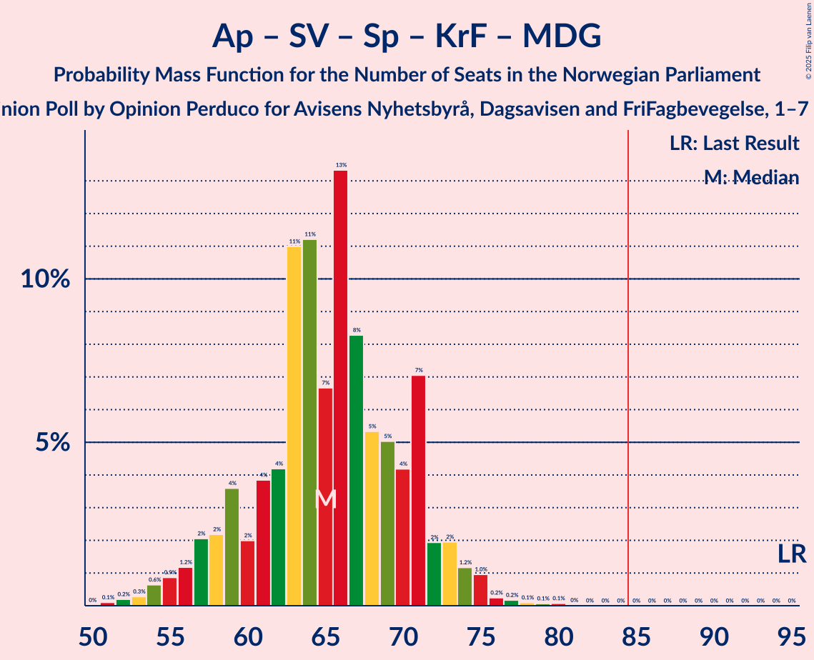

| Number of Seats | Probability | Accumulated | Special Marks |
|:---------------:|:-----------:|:-----------:|:-------------:|
| 50 | 0% | 100% |  |
| 51 | 0.1% | 99.9% |  |
| 52 | 0.2% | 99.8% |  |
| 53 | 0.3% | 99.6% |  |
| 54 | 0.6% | 99.4% |  |
| 55 | 0.9% | 98.7% |  |
| 56 | 1.2% | 98% |  |
| 57 | 2% | 97% |  |
| 58 | 2% | 95% |  |
| 59 | 4% | 92% |  |
| 60 | 2% | 89% |  |
| 61 | 4% | 87% |  |
| 62 | 4% | 83% |  |
| 63 | 11% | 79% |  |
| 64 | 11% | 68% | Median |
| 65 | 7% | 57% |  |
| 66 | 13% | 50% |  |
| 67 | 8% | 37% |  |
| 68 | 5% | 28% |  |
| 69 | 5% | 23% |  |
| 70 | 4% | 18% |  |
| 71 | 7% | 14% |  |
| 72 | 2% | 7% |  |
| 73 | 2% | 5% |  |
| 74 | 1.2% | 3% |  |
| 75 | 1.0% | 2% |  |
| 76 | 0.2% | 0.7% |  |
| 77 | 0.2% | 0.4% |  |
| 78 | 0.1% | 0.3% |  |
| 79 | 0.1% | 0.2% |  |
| 80 | 0.1% | 0.1% |  |
| 81 | 0% | 0% |  |
| 82 | 0% | 0% |  |
| 83 | 0% | 0% |  |
| 84 | 0% | 0% |  |
| 85 | 0% | 0% | Majority |
| 86 | 0% | 0% |  |
| 87 | 0% | 0% |  |
| 88 | 0% | 0% |  |
| 89 | 0% | 0% |  |
| 90 | 0% | 0% |  |
| 91 | 0% | 0% |  |
| 92 | 0% | 0% |  |
| 93 | 0% | 0% |  |
| 94 | 0% | 0% |  |
| 95 | 0% | 0% | Last Result |

### Arbeiderpartiet – Sosialistisk Venstreparti – Rødt – Miljøpartiet De Grønne

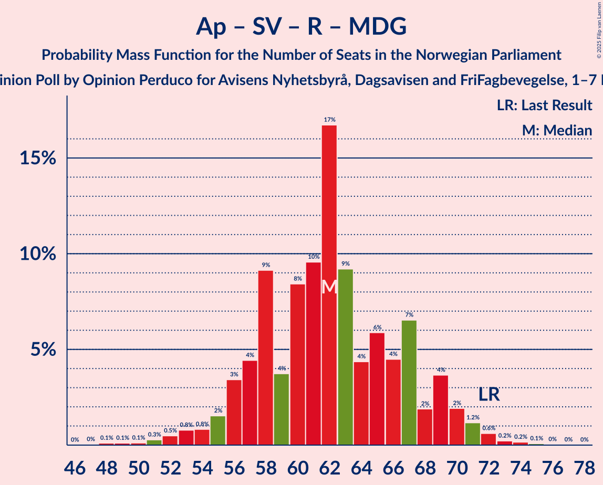

| Number of Seats | Probability | Accumulated | Special Marks |
|:---------------:|:-----------:|:-----------:|:-------------:|
| 48 | 0.1% | 100% |  |
| 49 | 0.1% | 99.8% |  |
| 50 | 0.1% | 99.7% |  |
| 51 | 0.3% | 99.6% |  |
| 52 | 0.5% | 99.3% |  |
| 53 | 0.8% | 98.9% |  |
| 54 | 0.8% | 98% |  |
| 55 | 2% | 97% |  |
| 56 | 3% | 96% |  |
| 57 | 4% | 92% |  |
| 58 | 9% | 88% |  |
| 59 | 4% | 79% |  |
| 60 | 8% | 75% |  |
| 61 | 10% | 67% | Median |
| 62 | 17% | 57% |  |
| 63 | 9% | 40% |  |
| 64 | 4% | 31% |  |
| 65 | 6% | 27% |  |
| 66 | 4% | 21% |  |
| 67 | 7% | 16% |  |
| 68 | 2% | 10% |  |
| 69 | 4% | 8% |  |
| 70 | 2% | 4% |  |
| 71 | 1.2% | 2% |  |
| 72 | 0.6% | 1.1% | Last Result |
| 73 | 0.2% | 0.5% |  |
| 74 | 0.2% | 0.3% |  |
| 75 | 0.1% | 0.2% |  |
| 76 | 0% | 0.1% |  |
| 77 | 0% | 0% |  |

### Arbeiderpartiet – Sosialistisk Venstreparti – Senterpartiet – Miljøpartiet De Grønne

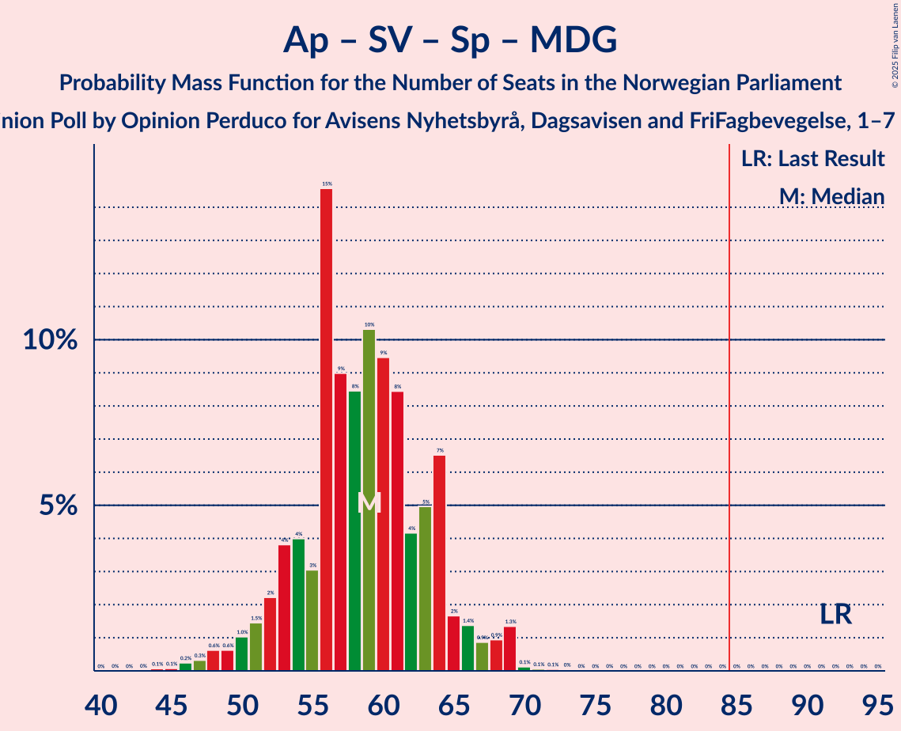

| Number of Seats | Probability | Accumulated | Special Marks |
|:---------------:|:-----------:|:-----------:|:-------------:|
| 44 | 0.1% | 100% |  |
| 45 | 0.1% | 99.9% |  |
| 46 | 0.2% | 99.8% |  |
| 47 | 0.3% | 99.6% |  |
| 48 | 0.6% | 99.3% |  |
| 49 | 0.6% | 98.6% |  |
| 50 | 1.0% | 98% |  |
| 51 | 1.5% | 97% |  |
| 52 | 2% | 96% |  |
| 53 | 4% | 93% |  |
| 54 | 4% | 89% |  |
| 55 | 3% | 85% |  |
| 56 | 15% | 82% |  |
| 57 | 9% | 68% | Median |
| 58 | 8% | 59% |  |
| 59 | 10% | 50% |  |
| 60 | 9% | 40% |  |
| 61 | 8% | 31% |  |
| 62 | 4% | 22% |  |
| 63 | 5% | 18% |  |
| 64 | 7% | 13% |  |
| 65 | 2% | 7% |  |
| 66 | 1.4% | 5% |  |
| 67 | 0.9% | 3% |  |
| 68 | 0.9% | 3% |  |
| 69 | 1.3% | 2% |  |
| 70 | 0.1% | 0.3% |  |
| 71 | 0.1% | 0.2% |  |
| 72 | 0.1% | 0.1% |  |
| 73 | 0% | 0.1% |  |
| 74 | 0% | 0% |  |
| 75 | 0% | 0% |  |
| 76 | 0% | 0% |  |
| 77 | 0% | 0% |  |
| 78 | 0% | 0% |  |
| 79 | 0% | 0% |  |
| 80 | 0% | 0% |  |
| 81 | 0% | 0% |  |
| 82 | 0% | 0% |  |
| 83 | 0% | 0% |  |
| 84 | 0% | 0% |  |
| 85 | 0% | 0% | Majority |
| 86 | 0% | 0% |  |
| 87 | 0% | 0% |  |
| 88 | 0% | 0% |  |
| 89 | 0% | 0% |  |
| 90 | 0% | 0% |  |
| 91 | 0% | 0% |  |
| 92 | 0% | 0% | Last Result |

### Arbeiderpartiet – Sosialistisk Venstreparti – Senterpartiet

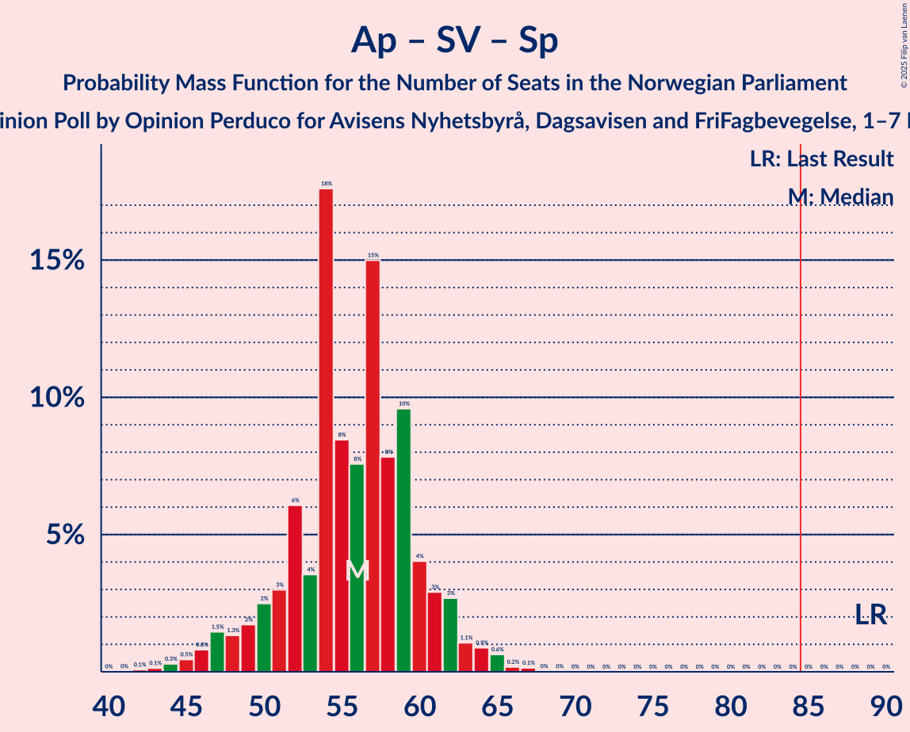

| Number of Seats | Probability | Accumulated | Special Marks |
|:---------------:|:-----------:|:-----------:|:-------------:|
| 42 | 0.1% | 100% |  |
| 43 | 0.1% | 99.9% |  |
| 44 | 0.3% | 99.8% |  |
| 45 | 0.5% | 99.5% |  |
| 46 | 0.8% | 99.0% |  |
| 47 | 1.5% | 98% |  |
| 48 | 1.3% | 97% |  |
| 49 | 2% | 95% |  |
| 50 | 2% | 94% |  |
| 51 | 3% | 91% |  |
| 52 | 6% | 88% |  |
| 53 | 4% | 82% |  |
| 54 | 18% | 79% |  |
| 55 | 8% | 61% | Median |
| 56 | 8% | 53% |  |
| 57 | 15% | 45% |  |
| 58 | 8% | 30% |  |
| 59 | 10% | 22% |  |
| 60 | 4% | 13% |  |
| 61 | 3% | 9% |  |
| 62 | 3% | 6% |  |
| 63 | 1.1% | 3% |  |
| 64 | 0.9% | 2% |  |
| 65 | 0.6% | 1.0% |  |
| 66 | 0.2% | 0.4% |  |
| 67 | 0.1% | 0.2% |  |
| 68 | 0% | 0% |  |
| 69 | 0% | 0% |  |
| 70 | 0% | 0% |  |
| 71 | 0% | 0% |  |
| 72 | 0% | 0% |  |
| 73 | 0% | 0% |  |
| 74 | 0% | 0% |  |
| 75 | 0% | 0% |  |
| 76 | 0% | 0% |  |
| 77 | 0% | 0% |  |
| 78 | 0% | 0% |  |
| 79 | 0% | 0% |  |
| 80 | 0% | 0% |  |
| 81 | 0% | 0% |  |
| 82 | 0% | 0% |  |
| 83 | 0% | 0% |  |
| 84 | 0% | 0% |  |
| 85 | 0% | 0% | Majority |
| 86 | 0% | 0% |  |
| 87 | 0% | 0% |  |
| 88 | 0% | 0% |  |
| 89 | 0% | 0% | Last Result |

### Arbeiderpartiet – Senterpartiet – Kristelig Folkeparti – Miljøpartiet De Grønne

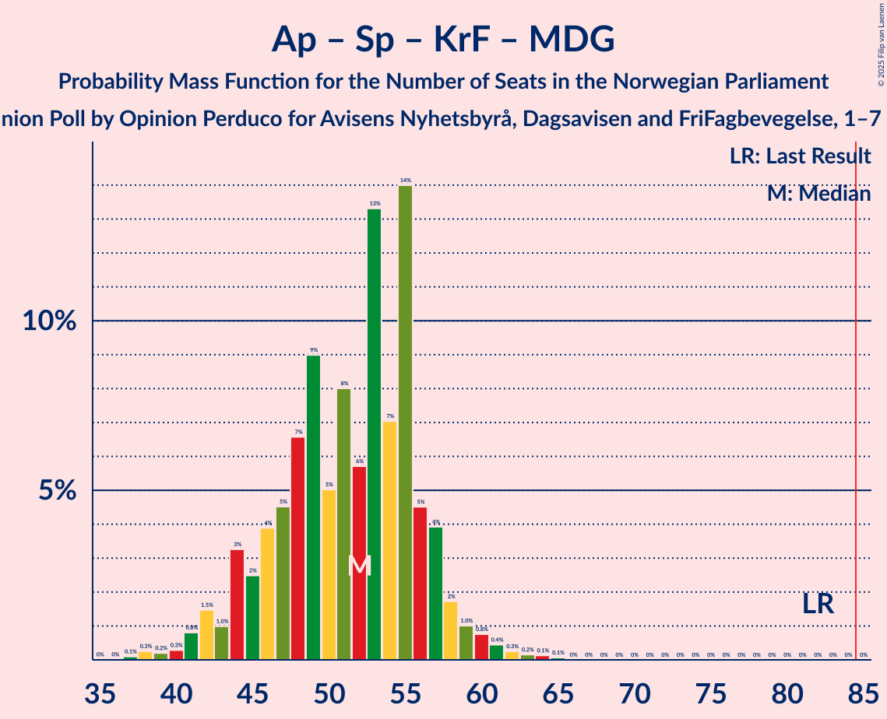

| Number of Seats | Probability | Accumulated | Special Marks |
|:---------------:|:-----------:|:-----------:|:-------------:|
| 36 | 0% | 100% |  |
| 37 | 0.1% | 99.9% |  |
| 38 | 0.3% | 99.8% |  |
| 39 | 0.2% | 99.6% |  |
| 40 | 0.3% | 99.4% |  |
| 41 | 0.8% | 99.1% |  |
| 42 | 1.5% | 98% |  |
| 43 | 1.0% | 97% |  |
| 44 | 3% | 96% |  |
| 45 | 2% | 93% |  |
| 46 | 4% | 90% |  |
| 47 | 5% | 86% |  |
| 48 | 7% | 82% |  |
| 49 | 9% | 75% |  |
| 50 | 5% | 66% | Median |
| 51 | 8% | 61% |  |
| 52 | 6% | 53% |  |
| 53 | 13% | 47% |  |
| 54 | 7% | 34% |  |
| 55 | 14% | 27% |  |
| 56 | 5% | 13% |  |
| 57 | 4% | 8% |  |
| 58 | 2% | 5% |  |
| 59 | 1.0% | 3% |  |
| 60 | 0.8% | 2% |  |
| 61 | 0.4% | 1.1% |  |
| 62 | 0.3% | 0.6% |  |
| 63 | 0.2% | 0.4% |  |
| 64 | 0.1% | 0.2% |  |
| 65 | 0.1% | 0.1% |  |
| 66 | 0% | 0% |  |
| 67 | 0% | 0% |  |
| 68 | 0% | 0% |  |
| 69 | 0% | 0% |  |
| 70 | 0% | 0% |  |
| 71 | 0% | 0% |  |
| 72 | 0% | 0% |  |
| 73 | 0% | 0% |  |
| 74 | 0% | 0% |  |
| 75 | 0% | 0% |  |
| 76 | 0% | 0% |  |
| 77 | 0% | 0% |  |
| 78 | 0% | 0% |  |
| 79 | 0% | 0% |  |
| 80 | 0% | 0% |  |
| 81 | 0% | 0% |  |
| 82 | 0% | 0% | Last Result |

### Arbeiderpartiet – Senterpartiet – Kristelig Folkeparti

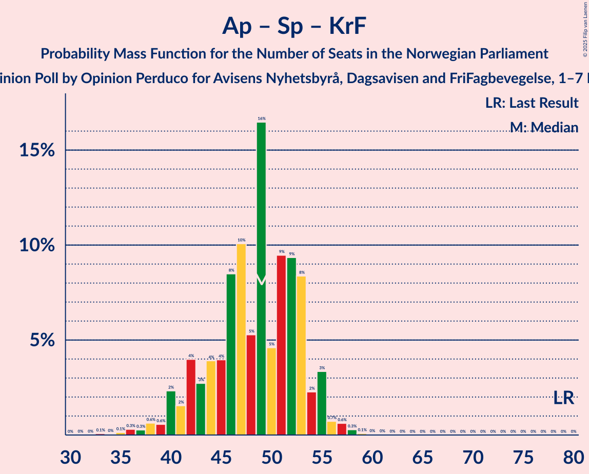

| Number of Seats | Probability | Accumulated | Special Marks |
|:---------------:|:-----------:|:-----------:|:-------------:|
| 33 | 0.1% | 100% |  |
| 34 | 0% | 99.9% |  |
| 35 | 0.1% | 99.9% |  |
| 36 | 0.3% | 99.7% |  |
| 37 | 0.3% | 99.4% |  |
| 38 | 0.6% | 99.2% |  |
| 39 | 0.6% | 98.5% |  |
| 40 | 2% | 98% |  |
| 41 | 2% | 96% |  |
| 42 | 4% | 94% |  |
| 43 | 3% | 90% |  |
| 44 | 4% | 87% |  |
| 45 | 4% | 83% |  |
| 46 | 8% | 80% |  |
| 47 | 10% | 71% |  |
| 48 | 5% | 61% | Median |
| 49 | 16% | 56% |  |
| 50 | 5% | 39% |  |
| 51 | 9% | 35% |  |
| 52 | 9% | 25% |  |
| 53 | 8% | 16% |  |
| 54 | 2% | 7% |  |
| 55 | 3% | 5% |  |
| 56 | 0.7% | 2% |  |
| 57 | 0.6% | 1.1% |  |
| 58 | 0.3% | 0.4% |  |
| 59 | 0.1% | 0.2% |  |
| 60 | 0% | 0.1% |  |
| 61 | 0% | 0% |  |
| 62 | 0% | 0% |  |
| 63 | 0% | 0% |  |
| 64 | 0% | 0% |  |
| 65 | 0% | 0% |  |
| 66 | 0% | 0% |  |
| 67 | 0% | 0% |  |
| 68 | 0% | 0% |  |
| 69 | 0% | 0% |  |
| 70 | 0% | 0% |  |
| 71 | 0% | 0% |  |
| 72 | 0% | 0% |  |
| 73 | 0% | 0% |  |
| 74 | 0% | 0% |  |
| 75 | 0% | 0% |  |
| 76 | 0% | 0% |  |
| 77 | 0% | 0% |  |
| 78 | 0% | 0% |  |
| 79 | 0% | 0% | Last Result |

### Arbeiderpartiet – Sosialistisk Venstreparti

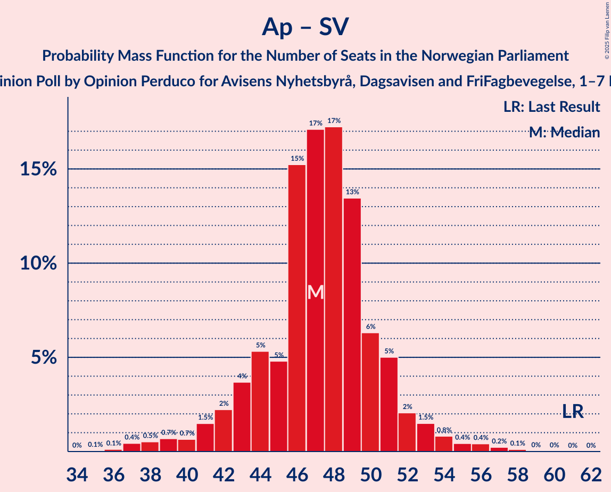

| Number of Seats | Probability | Accumulated | Special Marks |
|:---------------:|:-----------:|:-----------:|:-------------:|
| 35 | 0.1% | 100% |  |
| 36 | 0.1% | 99.9% |  |
| 37 | 0.4% | 99.8% |  |
| 38 | 0.5% | 99.4% |  |
| 39 | 0.7% | 98.8% |  |
| 40 | 0.7% | 98% |  |
| 41 | 1.5% | 98% |  |
| 42 | 2% | 96% |  |
| 43 | 4% | 94% |  |
| 44 | 5% | 90% |  |
| 45 | 5% | 85% |  |
| 46 | 15% | 80% |  |
| 47 | 17% | 65% | Median |
| 48 | 17% | 48% |  |
| 49 | 13% | 30% |  |
| 50 | 6% | 17% |  |
| 51 | 5% | 11% |  |
| 52 | 2% | 6% |  |
| 53 | 1.5% | 4% |  |
| 54 | 0.8% | 2% |  |
| 55 | 0.4% | 1.2% |  |
| 56 | 0.4% | 0.8% |  |
| 57 | 0.2% | 0.4% |  |
| 58 | 0.1% | 0.2% |  |
| 59 | 0% | 0.1% |  |
| 60 | 0% | 0% |  |
| 61 | 0% | 0% | Last Result |

### Arbeiderpartiet – Senterpartiet

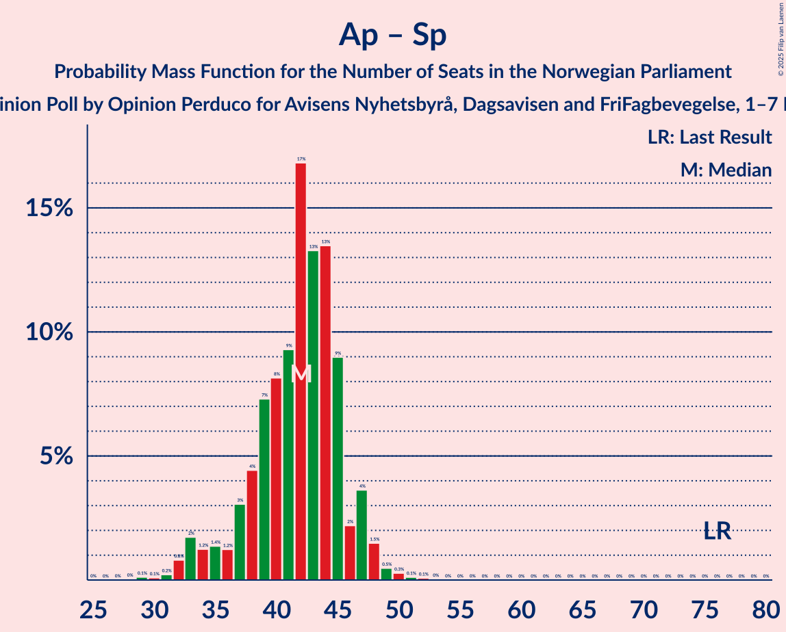

| Number of Seats | Probability | Accumulated | Special Marks |
|:---------------:|:-----------:|:-----------:|:-------------:|
| 28 | 0% | 100% |  |
| 29 | 0.1% | 99.9% |  |
| 30 | 0.1% | 99.8% |  |
| 31 | 0.2% | 99.7% |  |
| 32 | 0.8% | 99.5% |  |
| 33 | 2% | 98.7% |  |
| 34 | 1.2% | 97% |  |
| 35 | 1.4% | 96% |  |
| 36 | 1.2% | 94% |  |
| 37 | 3% | 93% |  |
| 38 | 4% | 90% |  |
| 39 | 7% | 86% |  |
| 40 | 8% | 78% |  |
| 41 | 9% | 70% | Median |
| 42 | 17% | 61% |  |
| 43 | 13% | 44% |  |
| 44 | 13% | 31% |  |
| 45 | 9% | 17% |  |
| 46 | 2% | 8% |  |
| 47 | 4% | 6% |  |
| 48 | 1.5% | 2% |  |
| 49 | 0.5% | 1.0% |  |
| 50 | 0.3% | 0.5% |  |
| 51 | 0.1% | 0.2% |  |
| 52 | 0.1% | 0.1% |  |
| 53 | 0% | 0.1% |  |
| 54 | 0% | 0% |  |
| 55 | 0% | 0% |  |
| 56 | 0% | 0% |  |
| 57 | 0% | 0% |  |
| 58 | 0% | 0% |  |
| 59 | 0% | 0% |  |
| 60 | 0% | 0% |  |
| 61 | 0% | 0% |  |
| 62 | 0% | 0% |  |
| 63 | 0% | 0% |  |
| 64 | 0% | 0% |  |
| 65 | 0% | 0% |  |
| 66 | 0% | 0% |  |
| 67 | 0% | 0% |  |
| 68 | 0% | 0% |  |
| 69 | 0% | 0% |  |
| 70 | 0% | 0% |  |
| 71 | 0% | 0% |  |
| 72 | 0% | 0% |  |
| 73 | 0% | 0% |  |
| 74 | 0% | 0% |  |
| 75 | 0% | 0% |  |
| 76 | 0% | 0% | Last Result |

### Senterpartiet – Kristelig Folkeparti – Venstre

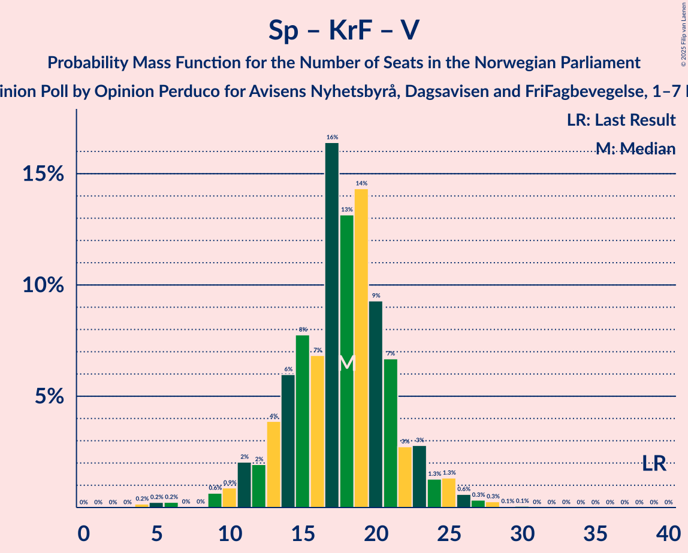

| Number of Seats | Probability | Accumulated | Special Marks |
|:---------------:|:-----------:|:-----------:|:-------------:|
| 4 | 0.2% | 100% |  |
| 5 | 0.2% | 99.8% |  |
| 6 | 0.2% | 99.6% |  |
| 7 | 0% | 99.4% |  |
| 8 | 0% | 99.3% |  |
| 9 | 0.6% | 99.3% |  |
| 10 | 0.9% | 98.7% |  |
| 11 | 2% | 98% |  |
| 12 | 2% | 96% |  |
| 13 | 4% | 94% |  |
| 14 | 6% | 90% |  |
| 15 | 8% | 84% |  |
| 16 | 7% | 76% |  |
| 17 | 16% | 69% | Median |
| 18 | 13% | 53% |  |
| 19 | 14% | 40% |  |
| 20 | 9% | 25% |  |
| 21 | 7% | 16% |  |
| 22 | 3% | 9% |  |
| 23 | 3% | 7% |  |
| 24 | 1.3% | 4% |  |
| 25 | 1.3% | 3% |  |
| 26 | 0.6% | 1.3% |  |
| 27 | 0.3% | 0.7% |  |
| 28 | 0.3% | 0.4% |  |
| 29 | 0.1% | 0.1% |  |
| 30 | 0.1% | 0.1% |  |
| 31 | 0% | 0% |  |
| 32 | 0% | 0% |  |
| 33 | 0% | 0% |  |
| 34 | 0% | 0% |  |
| 35 | 0% | 0% |  |
| 36 | 0% | 0% |  |
| 37 | 0% | 0% |  |
| 38 | 0% | 0% |  |
| 39 | 0% | 0% | Last Result |

## Technical Information

### Opinion Poll

+ **Polling firm:** Opinion Perduco
+ **Commissioner(s):** Avisens Nyhetsbyrå, Dagsavisen and FriFagbevegelse
+ **Fieldwork period:** 1–7 November 2022

### Calculations

+ **Sample size:** 658
+ **Simulations done:** 1,048,576
+ **Error estimate:** 2.23%

