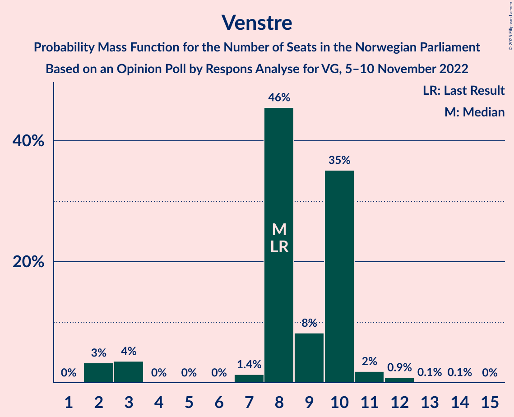
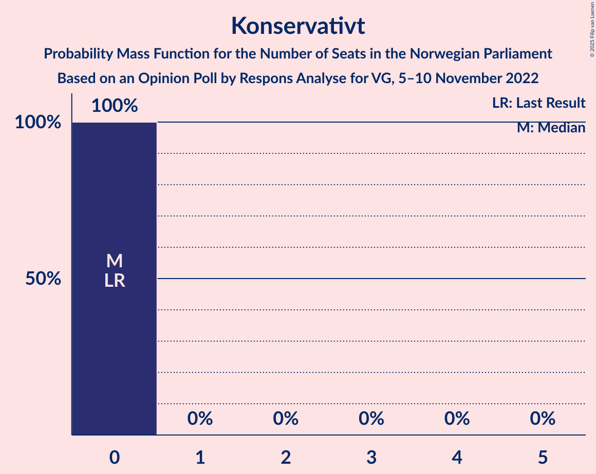

# Opinion Poll by Respons Analyse for VG, 5–10 November 2022

<a href="#voting-intentions">Voting Intentions</a> | <a href="#seats">Seats</a> | <a href="#coalitions">Coalitions</a> | <a href="#technical-information">Technical Information</a>

## Voting Intentions

### Confidence Intervals

| Party | Last Result | Poll Result | 80% Confidence Interval | 90% Confidence Interval | 95% Confidence Interval | 99% Confidence Interval |
|:-----:|:-----------:|:-----------:|:-----------------------:|:-----------------------:|:-----------------------:|:-----------------------:|
| Høyre | 20.4% | 32.0% | 30.1–33.9% |29.6–34.5% |29.2–35.0% |28.3–35.9% |
| Arbeiderpartiet | 26.2% | 18.5% | 17.0–20.1% |16.6–20.6% |16.2–21.0% |15.5–21.8% |
| Fremskrittspartiet | 11.6% | 11.9% | 10.7–13.3% |10.3–13.7% |10.0–14.1% |9.5–14.8% |
| Sosialistisk Venstreparti | 7.6% | 8.5% | 7.5–9.7% |7.2–10.1% |6.9–10.4% |6.4–11.0% |
| Senterpartiet | 13.5% | 6.6% | 5.7–7.7% |5.4–8.0% |5.2–8.3% |4.8–8.9% |
| Rødt | 4.7% | 6.1% | 5.2–7.2% |5.0–7.5% |4.8–7.8% |4.4–8.3% |
| Venstre | 4.6% | 5.0% | 4.2–6.0% |4.0–6.3% |3.8–6.5% |3.5–7.1% |
| Miljøpartiet De Grønne | 3.9% | 3.9% | 3.2–4.8% |3.0–5.1% |2.9–5.3% |2.6–5.8% |
| Kristelig Folkeparti | 3.8% | 3.3% | 2.7–4.1% |2.5–4.4% |2.4–4.6% |2.1–5.0% |
| Norgesdemokratene | 1.1% | 1.6% | 1.2–2.2% |1.1–2.4% |1.0–2.6% |0.8–2.9% |
| Industri- og Næringspartiet | 0.3% | 1.0% | 0.7–1.5% |0.6–1.7% |0.5–1.8% |0.4–2.1% |
| Liberalistene | 0.2% | 0.3% | 0.2–0.7% |0.1–0.8% |0.1–0.9% |0.1–1.1% |
| Folkets parti | 0.1% | 0.2% | 0.1–0.5% |0.1–0.6% |0.1–0.7% |0.0–0.9% |
| Konservativt | 0.4% | 0.2% | 0.1–0.5% |0.1–0.6% |0.1–0.7% |0.0–0.9% |
| Pensjonistpartiet | 0.6% | 0.2% | 0.1–0.5% |0.1–0.6% |0.1–0.7% |0.0–0.9% |
| Helsepartiet | 0.2% | 0.2% | 0.1–0.5% |0.1–0.6% |0.1–0.7% |0.0–0.9% |

*Note:* The poll result column reflects the actual value used in the calculations. Published results may vary slightly, and in addition be rounded to fewer digits.

## Seats

### Confidence Intervals

| Party | Last Result | Median | 80% Confidence Interval | 90% Confidence Interval | 95% Confidence Interval | 99% Confidence Interval |
|:-----:|:-----------:|:------:|:-----------------------:|:-----------------------:|:-----------------------:|:-----------------------:|
| <a href="#høyre">Høyre</a> | 36 | 58 | 52–59 |52–61 |52–63 |49–69 |
| <a href="#arbeiderpartiet">Arbeiderpartiet</a> | 48 | 35 | 34–36 |33–39 |30–43 |28–44 |
| <a href="#fremskrittspartiet">Fremskrittspartiet</a> | 21 | 23 | 19–24 |19–24 |17–25 |15–28 |
| <a href="#sosialistisk-venstreparti">Sosialistisk Venstreparti</a> | 13 | 14 | 13–17 |13–18 |11–18 |11–18 |
| <a href="#senterpartiet">Senterpartiet</a> | 28 | 11 | 10–14 |10–14 |9–16 |8–16 |
| <a href="#rødt">Rødt</a> | 8 | 11 | 8–12 |8–13 |8–13 |8–14 |
| <a href="#venstre">Venstre</a> | 8 | 8 | 8–10 |3–10 |2–11 |2–12 |
| <a href="#miljøpartiet-de-grønne">Miljøpartiet De Grønne</a> | 3 | 8 | 2–9 |2–9 |2–9 |1–9 |
| <a href="#kristelig-folkeparti">Kristelig Folkeparti</a> | 3 | 2 | 2–3 |2–3 |2–8 |0–8 |
| <a href="#norgesdemokratene">Norgesdemokratene</a> | 0 | 0 | 0 |0 |0 |0 |
| <a href="#industri--og-næringspartiet">Industri- og Næringspartiet</a> | 0 | 0 | 0 |0 |0 |0 |
| <a href="#liberalistene">Liberalistene</a> | 0 | 0 | 0 |0 |0 |0 |
| <a href="#folkets-parti">Folkets parti</a> | 0 | 0 | 0 |0 |0 |0 |
| <a href="#konservativt">Konservativt</a> | 0 | 0 | 0 |0 |0 |0 |
| <a href="#pensjonistpartiet">Pensjonistpartiet</a> | 0 | 0 | 0 |0 |0 |0 |
| <a href="#helsepartiet">Helsepartiet</a> | 0 | 0 | 0 |0 |0 |0 |

### Høyre

*For a full overview of the results for this party, see the [Høyre](party-høyre.html) page.*

| Number of Seats | Probability | Accumulated | Special Marks |
|:---------------:|:-----------:|:-----------:|:-------------:|
| 36 | 0% | 100% | Last Result |
| 37 | 0% | 100% |  |
| 38 | 0% | 100% |  |
| 39 | 0% | 100% |  |
| 40 | 0% | 100% |  |
| 41 | 0% | 100% |  |
| 42 | 0% | 100% |  |
| 43 | 0% | 100% |  |
| 44 | 0% | 100% |  |
| 45 | 0% | 100% |  |
| 46 | 0% | 100% |  |
| 47 | 0% | 100% |  |
| 48 | 0% | 100% |  |
| 49 | 2% | 100% |  |
| 50 | 0.2% | 98% |  |
| 51 | 0.2% | 98% |  |
| 52 | 31% | 98% |  |
| 53 | 3% | 67% |  |
| 54 | 0.3% | 64% |  |
| 55 | 2% | 64% |  |
| 56 | 4% | 62% |  |
| 57 | 2% | 59% |  |
| 58 | 44% | 57% | Median |
| 59 | 4% | 13% |  |
| 60 | 0.4% | 9% |  |
| 61 | 5% | 9% |  |
| 62 | 0.4% | 4% |  |
| 63 | 1.4% | 3% |  |
| 64 | 0.4% | 2% |  |
| 65 | 0% | 2% |  |
| 66 | 0% | 2% |  |
| 67 | 0.1% | 2% |  |
| 68 | 0% | 2% |  |
| 69 | 1.5% | 1.5% |  |
| 70 | 0% | 0% |  |

### Arbeiderpartiet

*For a full overview of the results for this party, see the [Arbeiderpartiet](party-arbeiderpartiet.html) page.*

| Number of Seats | Probability | Accumulated | Special Marks |
|:---------------:|:-----------:|:-----------:|:-------------:|
| 28 | 1.5% | 100% |  |
| 29 | 0% | 98.5% |  |
| 30 | 2% | 98.5% |  |
| 31 | 0.3% | 97% |  |
| 32 | 2% | 97% |  |
| 33 | 3% | 95% |  |
| 34 | 38% | 92% |  |
| 35 | 36% | 53% | Median |
| 36 | 10% | 17% |  |
| 37 | 0.5% | 7% |  |
| 38 | 0.2% | 7% |  |
| 39 | 3% | 6% |  |
| 40 | 0% | 4% |  |
| 41 | 0.2% | 4% |  |
| 42 | 0.2% | 3% |  |
| 43 | 2% | 3% |  |
| 44 | 1.2% | 1.2% |  |
| 45 | 0% | 0% |  |
| 46 | 0% | 0% |  |
| 47 | 0% | 0% |  |
| 48 | 0% | 0% | Last Result |

### Fremskrittspartiet

*For a full overview of the results for this party, see the [Fremskrittspartiet](party-fremskrittspartiet.html) page.*

| Number of Seats | Probability | Accumulated | Special Marks |
|:---------------:|:-----------:|:-----------:|:-------------:|
| 15 | 1.2% | 100% |  |
| 16 | 0.1% | 98.8% |  |
| 17 | 2% | 98.7% |  |
| 18 | 1.3% | 97% |  |
| 19 | 6% | 96% |  |
| 20 | 3% | 89% |  |
| 21 | 1.3% | 86% | Last Result |
| 22 | 8% | 85% |  |
| 23 | 39% | 76% | Median |
| 24 | 34% | 38% |  |
| 25 | 2% | 3% |  |
| 26 | 0.1% | 0.7% |  |
| 27 | 0.1% | 0.6% |  |
| 28 | 0% | 0.5% |  |
| 29 | 0.5% | 0.5% |  |
| 30 | 0% | 0% |  |

### Sosialistisk Venstreparti

*For a full overview of the results for this party, see the [Sosialistisk Venstreparti](party-sosialistiskvenstreparti.html) page.*

| Number of Seats | Probability | Accumulated | Special Marks |
|:---------------:|:-----------:|:-----------:|:-------------:|
| 11 | 3% | 100% |  |
| 12 | 2% | 97% |  |
| 13 | 36% | 95% | Last Result |
| 14 | 11% | 59% | Median |
| 15 | 2% | 49% |  |
| 16 | 4% | 47% |  |
| 17 | 33% | 43% |  |
| 18 | 10% | 10% |  |
| 19 | 0.2% | 0.3% |  |
| 20 | 0.1% | 0.1% |  |
| 21 | 0% | 0% |  |

### Senterpartiet

*For a full overview of the results for this party, see the [Senterpartiet](party-senterpartiet.html) page.*

| Number of Seats | Probability | Accumulated | Special Marks |
|:---------------:|:-----------:|:-----------:|:-------------:|
| 7 | 0.2% | 100% |  |
| 8 | 2% | 99.8% |  |
| 9 | 3% | 98% |  |
| 10 | 36% | 95% |  |
| 11 | 32% | 59% | Median |
| 12 | 6% | 27% |  |
| 13 | 6% | 21% |  |
| 14 | 11% | 15% |  |
| 15 | 0.6% | 4% |  |
| 16 | 3% | 4% |  |
| 17 | 0% | 0.2% |  |
| 18 | 0% | 0.2% |  |
| 19 | 0.2% | 0.2% |  |
| 20 | 0% | 0% |  |
| 21 | 0% | 0% |  |
| 22 | 0% | 0% |  |
| 23 | 0% | 0% |  |
| 24 | 0% | 0% |  |
| 25 | 0% | 0% |  |
| 26 | 0% | 0% |  |
| 27 | 0% | 0% |  |
| 28 | 0% | 0% | Last Result |

### Rødt

*For a full overview of the results for this party, see the [Rødt](party-rødt.html) page.*

| Number of Seats | Probability | Accumulated | Special Marks |
|:---------------:|:-----------:|:-----------:|:-------------:|
| 8 | 34% | 100% | Last Result |
| 9 | 2% | 66% |  |
| 10 | 9% | 64% |  |
| 11 | 10% | 56% | Median |
| 12 | 39% | 46% |  |
| 13 | 6% | 7% |  |
| 14 | 0.3% | 0.6% |  |
| 15 | 0% | 0.3% |  |
| 16 | 0.2% | 0.3% |  |
| 17 | 0% | 0% |  |

### Venstre

*For a full overview of the results for this party, see the [Venstre](party-venstre.html) page.*

| Number of Seats | Probability | Accumulated | Special Marks |
|:---------------:|:-----------:|:-----------:|:-------------:|
| 2 | 3% | 100% |  |
| 3 | 4% | 97% |  |
| 4 | 0% | 93% |  |
| 5 | 0% | 93% |  |
| 6 | 0% | 93% |  |
| 7 | 1.4% | 93% |  |
| 8 | 46% | 92% | Last Result, Median |
| 9 | 8% | 46% |  |
| 10 | 35% | 38% |  |
| 11 | 2% | 3% |  |
| 12 | 0.9% | 1.0% |  |
| 13 | 0.1% | 0.2% |  |
| 14 | 0.1% | 0.1% |  |
| 15 | 0% | 0% |  |

### Miljøpartiet De Grønne

*For a full overview of the results for this party, see the [Miljøpartiet De Grønne](party-miljøpartietdegrønne.html) page.*

| Number of Seats | Probability | Accumulated | Special Marks |
|:---------------:|:-----------:|:-----------:|:-------------:|
| 1 | 2% | 100% |  |
| 2 | 14% | 98% |  |
| 3 | 10% | 85% | Last Result |
| 4 | 0% | 75% |  |
| 5 | 0% | 75% |  |
| 6 | 0% | 75% |  |
| 7 | 6% | 75% |  |
| 8 | 33% | 69% | Median |
| 9 | 36% | 36% |  |
| 10 | 0.1% | 0.1% |  |
| 11 | 0% | 0% |  |

### Kristelig Folkeparti

*For a full overview of the results for this party, see the [Kristelig Folkeparti](party-kristeligfolkeparti.html) page.*

| Number of Seats | Probability | Accumulated | Special Marks |
|:---------------:|:-----------:|:-----------:|:-------------:|
| 0 | 0.9% | 100% |  |
| 1 | 1.2% | 99.1% |  |
| 2 | 86% | 98% | Median |
| 3 | 8% | 12% | Last Result |
| 4 | 0% | 4% |  |
| 5 | 0% | 4% |  |
| 6 | 0.2% | 4% |  |
| 7 | 0.5% | 4% |  |
| 8 | 3% | 3% |  |
| 9 | 0.2% | 0.3% |  |
| 10 | 0% | 0% |  |

### Norgesdemokratene

*For a full overview of the results for this party, see the [Norgesdemokratene](party-norgesdemokratene.html) page.*

| Number of Seats | Probability | Accumulated | Special Marks |
|:---------------:|:-----------:|:-----------:|:-------------:|
| 0 | 100% | 100% | Last Result, Median |

### Industri- og Næringspartiet

*For a full overview of the results for this party, see the [Industri- og Næringspartiet](party-industri-ognæringspartiet.html) page.*

| Number of Seats | Probability | Accumulated | Special Marks |
|:---------------:|:-----------:|:-----------:|:-------------:|
| 0 | 99.9% | 100% | Last Result, Median |
| 1 | 0% | 0.1% |  |
| 2 | 0% | 0% |  |

### Liberalistene

*For a full overview of the results for this party, see the [Liberalistene](party-liberalistene.html) page.*

| Number of Seats | Probability | Accumulated | Special Marks |
|:---------------:|:-----------:|:-----------:|:-------------:|
| 0 | 100% | 100% | Last Result, Median |

### Folkets parti

*For a full overview of the results for this party, see the [Folkets parti](party-folketsparti.html) page.*

| Number of Seats | Probability | Accumulated | Special Marks |
|:---------------:|:-----------:|:-----------:|:-------------:|
| 0 | 100% | 100% | Last Result, Median |

### Konservativt

*For a full overview of the results for this party, see the [Konservativt](party-konservativt.html) page.*

| Number of Seats | Probability | Accumulated | Special Marks |
|:---------------:|:-----------:|:-----------:|:-------------:|
| 0 | 100% | 100% | Last Result, Median |

### Pensjonistpartiet

*For a full overview of the results for this party, see the [Pensjonistpartiet](party-pensjonistpartiet.html) page.*

| Number of Seats | Probability | Accumulated | Special Marks |
|:---------------:|:-----------:|:-----------:|:-------------:|
| 0 | 100% | 100% | Last Result, Median |

### Helsepartiet

*For a full overview of the results for this party, see the [Helsepartiet](party-helsepartiet.html) page.*

| Number of Seats | Probability | Accumulated | Special Marks |
|:---------------:|:-----------:|:-----------:|:-------------:|
| 0 | 100% | 100% | Last Result, Median |

## Coalitions

### Confidence Intervals

| Coalition | Last Result | Median | Majority? | 80% Confidence Interval | 90% Confidence Interval | 95% Confidence Interval | 99% Confidence Interval |
|:---------:|:-----------:|:------:|:---------:|:-----------------------:|:-----------------------:|:-----------------------:|:-----------------------:|
| Høyre – Fremskrittspartiet – Senterpartiet – Venstre – Kristelig Folkeparti | 96 | 103 | 100% | 97–104 | 97–106 | 94–107 | 93–109 |
| Høyre – Fremskrittspartiet – Venstre – Miljøpartiet De Grønne – Kristelig Folkeparti | 71 | 94 | 98.7% | 91–102 | 87–102 | 86–102 | 84–103 |
| Høyre – Fremskrittspartiet – Venstre – Kristelig Folkeparti | 68 | 90 | 95% | 86–93 | 84–93 | 83–95 | 82–101 |
| Høyre – Fremskrittspartiet – Venstre | 65 | 88 | 60% | 84–91 | 81–91 | 81–91 | 80–98 |
| Høyre – Fremskrittspartiet | 57 | 80 | 3% | 76–81 | 76–82 | 72–86 | 71–89 |
| Arbeiderpartiet – Sosialistisk Venstreparti – Senterpartiet – Rødt – Miljøpartiet De Grønne | 100 | 78 | 3% | 75–82 | 75–84 | 73–85 | 67–86 |
| Arbeiderpartiet – Sosialistisk Venstreparti – Senterpartiet – Rødt | 97 | 74 | 0% | 66–77 | 66–81 | 66–82 | 65–84 |
| Arbeiderpartiet – Sosialistisk Venstreparti – Senterpartiet – Miljøpartiet De Grønne – Kristelig Folkeparti | 95 | 69 | 0% | 69–72 | 65–75 | 65–76 | 59–77 |
| Arbeiderpartiet – Sosialistisk Venstreparti – Rødt – Miljøpartiet De Grønne | 72 | 65 | 0% | 64–71 | 62–71 | 61–74 | 58–75 |
| Arbeiderpartiet – Sosialistisk Venstreparti – Senterpartiet – Miljøpartiet De Grønne | 92 | 67 | 0% | 65–70 | 63–72 | 61–74 | 56–75 |
| Høyre – Venstre – Kristelig Folkeparti | 47 | 68 | 0% | 62–70 | 62–72 | 61–72 | 60–81 |
| Arbeiderpartiet – Sosialistisk Venstreparti – Senterpartiet | 89 | 62 | 0% | 58–65 | 58–68 | 58–70 | 54–72 |
| Arbeiderpartiet – Senterpartiet – Miljøpartiet De Grønne – Kristelig Folkeparti | 82 | 55 | 0% | 53–56 | 50–60 | 47–62 | 46–62 |
| Arbeiderpartiet – Sosialistisk Venstreparti | 61 | 50 | 0% | 48–52 | 46–53 | 45–60 | 45–61 |
| Arbeiderpartiet – Senterpartiet – Kristelig Folkeparti | 79 | 47 | 0% | 47–52 | 45–55 | 44–55 | 43–58 |
| Arbeiderpartiet – Senterpartiet | 76 | 45 | 0% | 45–50 | 43–51 | 41–52 | 41–56 |
| Senterpartiet – Venstre – Kristelig Folkeparti | 39 | 22 | 0% | 21–24 | 20–27 | 15–29 | 14–29 |

### Høyre – Fremskrittspartiet – Senterpartiet – Venstre – Kristelig Folkeparti

| Number of Seats | Probability | Accumulated | Special Marks |
|:---------------:|:-----------:|:-----------:|:-------------:|
| 89 | 0.1% | 100% |  |
| 90 | 0% | 99.9% |  |
| 91 | 0% | 99.9% |  |
| 92 | 0% | 99.9% |  |
| 93 | 2% | 99.9% |  |
| 94 | 1.3% | 98% |  |
| 95 | 0% | 97% |  |
| 96 | 0.1% | 97% | Last Result |
| 97 | 32% | 96% |  |
| 98 | 0.2% | 64% |  |
| 99 | 1.4% | 64% |  |
| 100 | 0.3% | 63% |  |
| 101 | 8% | 62% |  |
| 102 | 3% | 54% | Median |
| 103 | 34% | 51% |  |
| 104 | 8% | 17% |  |
| 105 | 1.2% | 9% |  |
| 106 | 4% | 8% |  |
| 107 | 2% | 4% |  |
| 108 | 0.1% | 2% |  |
| 109 | 1.5% | 2% |  |
| 110 | 0.5% | 0.5% |  |
| 111 | 0% | 0% |  |

### Høyre – Fremskrittspartiet – Venstre – Miljøpartiet De Grønne – Kristelig Folkeparti

| Number of Seats | Probability | Accumulated | Special Marks |
|:---------------:|:-----------:|:-----------:|:-------------:|
| 71 | 0% | 100% | Last Result |
| 72 | 0% | 100% |  |
| 73 | 0% | 100% |  |
| 74 | 0% | 100% |  |
| 75 | 0% | 100% |  |
| 76 | 0% | 100% |  |
| 77 | 0% | 100% |  |
| 78 | 0% | 100% |  |
| 79 | 0% | 100% |  |
| 80 | 0% | 100% |  |
| 81 | 0% | 100% |  |
| 82 | 0% | 100% |  |
| 83 | 0% | 100% |  |
| 84 | 1.3% | 100% |  |
| 85 | 0.1% | 98.7% | Majority |
| 86 | 2% | 98.6% |  |
| 87 | 3% | 97% |  |
| 88 | 0.1% | 93% |  |
| 89 | 0.1% | 93% |  |
| 90 | 0.6% | 93% |  |
| 91 | 3% | 92% |  |
| 92 | 2% | 90% |  |
| 93 | 8% | 87% |  |
| 94 | 31% | 80% |  |
| 95 | 3% | 48% |  |
| 96 | 2% | 45% |  |
| 97 | 3% | 43% |  |
| 98 | 0.6% | 40% |  |
| 99 | 0.6% | 39% | Median |
| 100 | 3% | 39% |  |
| 101 | 0.4% | 36% |  |
| 102 | 34% | 36% |  |
| 103 | 2% | 2% |  |
| 104 | 0% | 0.3% |  |
| 105 | 0% | 0.2% |  |
| 106 | 0% | 0.2% |  |
| 107 | 0.2% | 0.2% |  |
| 108 | 0% | 0% |  |

### Høyre – Fremskrittspartiet – Venstre – Kristelig Folkeparti

| Number of Seats | Probability | Accumulated | Special Marks |
|:---------------:|:-----------:|:-----------:|:-------------:|
| 68 | 0% | 100% | Last Result |
| 69 | 0% | 100% |  |
| 70 | 0% | 100% |  |
| 71 | 0% | 100% |  |
| 72 | 0% | 100% |  |
| 73 | 0% | 100% |  |
| 74 | 0% | 100% |  |
| 75 | 0% | 100% |  |
| 76 | 0% | 100% |  |
| 77 | 0% | 100% |  |
| 78 | 0% | 100% |  |
| 79 | 0% | 99.9% |  |
| 80 | 0% | 99.9% |  |
| 81 | 0% | 99.9% |  |
| 82 | 1.4% | 99.9% |  |
| 83 | 2% | 98% |  |
| 84 | 2% | 97% |  |
| 85 | 3% | 95% | Majority |
| 86 | 31% | 91% |  |
| 87 | 0.3% | 60% |  |
| 88 | 0.1% | 60% |  |
| 89 | 6% | 60% |  |
| 90 | 10% | 54% |  |
| 91 | 0.6% | 44% | Median |
| 92 | 1.0% | 44% |  |
| 93 | 40% | 43% |  |
| 94 | 0.2% | 3% |  |
| 95 | 0.4% | 3% |  |
| 96 | 0.2% | 2% |  |
| 97 | 0.2% | 2% |  |
| 98 | 0.3% | 2% |  |
| 99 | 0% | 2% |  |
| 100 | 0.2% | 2% |  |
| 101 | 1.4% | 1.4% |  |
| 102 | 0% | 0% |  |

### Høyre – Fremskrittspartiet – Venstre

| Number of Seats | Probability | Accumulated | Special Marks |
|:---------------:|:-----------:|:-----------:|:-------------:|
| 65 | 0% | 100% | Last Result |
| 66 | 0% | 100% |  |
| 67 | 0% | 100% |  |
| 68 | 0% | 100% |  |
| 69 | 0% | 100% |  |
| 70 | 0% | 100% |  |
| 71 | 0% | 100% |  |
| 72 | 0% | 100% |  |
| 73 | 0% | 100% |  |
| 74 | 0% | 100% |  |
| 75 | 0.1% | 100% |  |
| 76 | 0% | 99.9% |  |
| 77 | 0% | 99.9% |  |
| 78 | 0.1% | 99.9% |  |
| 79 | 0% | 99.8% |  |
| 80 | 1.4% | 99.8% |  |
| 81 | 4% | 98% |  |
| 82 | 0.1% | 94% |  |
| 83 | 3% | 94% |  |
| 84 | 31% | 91% |  |
| 85 | 3% | 60% | Majority |
| 86 | 2% | 57% |  |
| 87 | 3% | 55% |  |
| 88 | 10% | 52% |  |
| 89 | 1.4% | 42% | Median |
| 90 | 2% | 40% |  |
| 91 | 36% | 39% |  |
| 92 | 0.1% | 2% |  |
| 93 | 0.2% | 2% |  |
| 94 | 0.3% | 2% |  |
| 95 | 0.4% | 2% |  |
| 96 | 0% | 1.5% |  |
| 97 | 0% | 1.4% |  |
| 98 | 1.4% | 1.4% |  |
| 99 | 0% | 0% |  |

### Høyre – Fremskrittspartiet

| Number of Seats | Probability | Accumulated | Special Marks |
|:---------------:|:-----------:|:-----------:|:-------------:|
| 57 | 0% | 100% | Last Result |
| 58 | 0% | 100% |  |
| 59 | 0% | 100% |  |
| 60 | 0% | 100% |  |
| 61 | 0% | 100% |  |
| 62 | 0% | 100% |  |
| 63 | 0% | 100% |  |
| 64 | 0% | 100% |  |
| 65 | 0% | 100% |  |
| 66 | 0% | 100% |  |
| 67 | 0% | 100% |  |
| 68 | 0% | 100% |  |
| 69 | 0% | 100% |  |
| 70 | 0.1% | 100% |  |
| 71 | 1.3% | 99.8% |  |
| 72 | 2% | 98.6% |  |
| 73 | 0.5% | 97% |  |
| 74 | 0.1% | 96% |  |
| 75 | 0.1% | 96% |  |
| 76 | 31% | 96% |  |
| 77 | 3% | 65% |  |
| 78 | 6% | 62% |  |
| 79 | 2% | 56% |  |
| 80 | 13% | 54% |  |
| 81 | 35% | 41% | Median |
| 82 | 2% | 6% |  |
| 83 | 1.0% | 4% |  |
| 84 | 0.5% | 3% |  |
| 85 | 0% | 3% | Majority |
| 86 | 0.7% | 3% |  |
| 87 | 0.7% | 2% |  |
| 88 | 0.1% | 2% |  |
| 89 | 1.4% | 1.4% |  |
| 90 | 0% | 0% |  |

### Arbeiderpartiet – Sosialistisk Venstreparti – Senterpartiet – Rødt – Miljøpartiet De Grønne

| Number of Seats | Probability | Accumulated | Special Marks |
|:---------------:|:-----------:|:-----------:|:-------------:|
| 67 | 1.4% | 100% |  |
| 68 | 0.2% | 98.6% |  |
| 69 | 0% | 98% |  |
| 70 | 0.3% | 98% |  |
| 71 | 0.1% | 98% |  |
| 72 | 0.2% | 98% |  |
| 73 | 0.4% | 98% |  |
| 74 | 0.2% | 97% |  |
| 75 | 40% | 97% |  |
| 76 | 1.0% | 57% |  |
| 77 | 0.6% | 56% |  |
| 78 | 10% | 56% |  |
| 79 | 6% | 46% | Median |
| 80 | 0.1% | 40% |  |
| 81 | 0.3% | 40% |  |
| 82 | 31% | 40% |  |
| 83 | 3% | 9% |  |
| 84 | 2% | 5% |  |
| 85 | 2% | 3% | Majority |
| 86 | 1.4% | 2% |  |
| 87 | 0% | 0.1% |  |
| 88 | 0% | 0.1% |  |
| 89 | 0% | 0.1% |  |
| 90 | 0% | 0.1% |  |
| 91 | 0% | 0% |  |
| 92 | 0% | 0% |  |
| 93 | 0% | 0% |  |
| 94 | 0% | 0% |  |
| 95 | 0% | 0% |  |
| 96 | 0% | 0% |  |
| 97 | 0% | 0% |  |
| 98 | 0% | 0% |  |
| 99 | 0% | 0% |  |
| 100 | 0% | 0% | Last Result |

### Arbeiderpartiet – Sosialistisk Venstreparti – Senterpartiet – Rødt

| Number of Seats | Probability | Accumulated | Special Marks |
|:---------------:|:-----------:|:-----------:|:-------------:|
| 61 | 0.2% | 100% |  |
| 62 | 0% | 99.8% |  |
| 63 | 0% | 99.8% |  |
| 64 | 0% | 99.8% |  |
| 65 | 2% | 99.7% |  |
| 66 | 34% | 98% |  |
| 67 | 0.4% | 64% |  |
| 68 | 3% | 64% |  |
| 69 | 0.6% | 61% |  |
| 70 | 0.6% | 61% |  |
| 71 | 3% | 60% | Median |
| 72 | 2% | 57% |  |
| 73 | 3% | 55% |  |
| 74 | 31% | 52% |  |
| 75 | 8% | 20% |  |
| 76 | 2% | 13% |  |
| 77 | 3% | 10% |  |
| 78 | 0.6% | 8% |  |
| 79 | 0.1% | 7% |  |
| 80 | 0.1% | 7% |  |
| 81 | 3% | 7% |  |
| 82 | 2% | 3% |  |
| 83 | 0.1% | 1.4% |  |
| 84 | 1.3% | 1.3% |  |
| 85 | 0% | 0% | Majority |
| 86 | 0% | 0% |  |
| 87 | 0% | 0% |  |
| 88 | 0% | 0% |  |
| 89 | 0% | 0% |  |
| 90 | 0% | 0% |  |
| 91 | 0% | 0% |  |
| 92 | 0% | 0% |  |
| 93 | 0% | 0% |  |
| 94 | 0% | 0% |  |
| 95 | 0% | 0% |  |
| 96 | 0% | 0% |  |
| 97 | 0% | 0% | Last Result |

### Arbeiderpartiet – Sosialistisk Venstreparti – Senterpartiet – Miljøpartiet De Grønne – Kristelig Folkeparti

| Number of Seats | Probability | Accumulated | Special Marks |
|:---------------:|:-----------:|:-----------:|:-------------:|
| 59 | 1.4% | 100% |  |
| 60 | 0% | 98.6% |  |
| 61 | 0.1% | 98.5% |  |
| 62 | 0.1% | 98% |  |
| 63 | 0.5% | 98% |  |
| 64 | 0% | 98% |  |
| 65 | 3% | 98% |  |
| 66 | 0.2% | 94% |  |
| 67 | 3% | 94% |  |
| 68 | 0.2% | 91% |  |
| 69 | 44% | 91% |  |
| 70 | 1.4% | 47% | Median |
| 71 | 2% | 46% |  |
| 72 | 36% | 44% |  |
| 73 | 3% | 9% |  |
| 74 | 0.3% | 6% |  |
| 75 | 2% | 5% |  |
| 76 | 1.4% | 3% |  |
| 77 | 2% | 2% |  |
| 78 | 0.1% | 0.3% |  |
| 79 | 0.1% | 0.2% |  |
| 80 | 0.1% | 0.1% |  |
| 81 | 0% | 0% |  |
| 82 | 0% | 0% |  |
| 83 | 0% | 0% |  |
| 84 | 0% | 0% |  |
| 85 | 0% | 0% | Majority |
| 86 | 0% | 0% |  |
| 87 | 0% | 0% |  |
| 88 | 0% | 0% |  |
| 89 | 0% | 0% |  |
| 90 | 0% | 0% |  |
| 91 | 0% | 0% |  |
| 92 | 0% | 0% |  |
| 93 | 0% | 0% |  |
| 94 | 0% | 0% |  |
| 95 | 0% | 0% | Last Result |

### Arbeiderpartiet – Sosialistisk Venstreparti – Rødt – Miljøpartiet De Grønne

| Number of Seats | Probability | Accumulated | Special Marks |
|:---------------:|:-----------:|:-----------:|:-------------:|
| 58 | 0.5% | 100% |  |
| 59 | 1.5% | 99.5% |  |
| 60 | 0% | 98% |  |
| 61 | 2% | 98% |  |
| 62 | 4% | 96% |  |
| 63 | 1.2% | 92% |  |
| 64 | 8% | 91% |  |
| 65 | 34% | 83% |  |
| 66 | 3% | 49% |  |
| 67 | 8% | 46% |  |
| 68 | 0.2% | 38% | Median |
| 69 | 1.4% | 37% |  |
| 70 | 0.2% | 36% |  |
| 71 | 32% | 36% |  |
| 72 | 0.1% | 4% | Last Result |
| 73 | 0% | 3% |  |
| 74 | 1.3% | 3% |  |
| 75 | 2% | 2% |  |
| 76 | 0% | 0.1% |  |
| 77 | 0% | 0.1% |  |
| 78 | 0% | 0.1% |  |
| 79 | 0.1% | 0.1% |  |
| 80 | 0% | 0% |  |

### Arbeiderpartiet – Sosialistisk Venstreparti – Senterpartiet – Miljøpartiet De Grønne

| Number of Seats | Probability | Accumulated | Special Marks |
|:---------------:|:-----------:|:-----------:|:-------------:|
| 56 | 1.4% | 100% |  |
| 57 | 0% | 98.6% |  |
| 58 | 0% | 98.5% |  |
| 59 | 0.2% | 98.5% |  |
| 60 | 0.5% | 98% |  |
| 61 | 0.3% | 98% |  |
| 62 | 1.4% | 97% |  |
| 63 | 2% | 96% |  |
| 64 | 0.6% | 94% |  |
| 65 | 5% | 94% |  |
| 66 | 1.2% | 89% |  |
| 67 | 44% | 88% |  |
| 68 | 0.6% | 43% | Median |
| 69 | 3% | 43% |  |
| 70 | 34% | 40% |  |
| 71 | 0.4% | 6% |  |
| 72 | 2% | 5% |  |
| 73 | 0.1% | 3% |  |
| 74 | 1.2% | 3% |  |
| 75 | 2% | 2% |  |
| 76 | 0% | 0.1% |  |
| 77 | 0.1% | 0.1% |  |
| 78 | 0% | 0% |  |
| 79 | 0% | 0% |  |
| 80 | 0% | 0% |  |
| 81 | 0% | 0% |  |
| 82 | 0% | 0% |  |
| 83 | 0% | 0% |  |
| 84 | 0% | 0% |  |
| 85 | 0% | 0% | Majority |
| 86 | 0% | 0% |  |
| 87 | 0% | 0% |  |
| 88 | 0% | 0% |  |
| 89 | 0% | 0% |  |
| 90 | 0% | 0% |  |
| 91 | 0% | 0% |  |
| 92 | 0% | 0% | Last Result |

### Høyre – Venstre – Kristelig Folkeparti

| Number of Seats | Probability | Accumulated | Special Marks |
|:---------------:|:-----------:|:-----------:|:-------------:|
| 47 | 0% | 100% | Last Result |
| 48 | 0% | 100% |  |
| 49 | 0% | 100% |  |
| 50 | 0% | 100% |  |
| 51 | 0% | 100% |  |
| 52 | 0% | 100% |  |
| 53 | 0% | 100% |  |
| 54 | 0% | 100% |  |
| 55 | 0% | 100% |  |
| 56 | 0% | 100% |  |
| 57 | 0% | 100% |  |
| 58 | 0% | 100% |  |
| 59 | 0% | 99.9% |  |
| 60 | 2% | 99.9% |  |
| 61 | 3% | 98% |  |
| 62 | 31% | 96% |  |
| 63 | 0.3% | 65% |  |
| 64 | 0.3% | 65% |  |
| 65 | 0.2% | 65% |  |
| 66 | 3% | 64% |  |
| 67 | 1.3% | 61% |  |
| 68 | 11% | 60% | Median |
| 69 | 4% | 48% |  |
| 70 | 39% | 44% |  |
| 71 | 0.6% | 6% |  |
| 72 | 3% | 5% |  |
| 73 | 0.1% | 2% |  |
| 74 | 0.1% | 2% |  |
| 75 | 0.1% | 2% |  |
| 76 | 0% | 2% |  |
| 77 | 0% | 2% |  |
| 78 | 0.5% | 2% |  |
| 79 | 0% | 2% |  |
| 80 | 0% | 2% |  |
| 81 | 1.5% | 2% |  |
| 82 | 0% | 0% |  |

### Arbeiderpartiet – Sosialistisk Venstreparti – Senterpartiet

| Number of Seats | Probability | Accumulated | Special Marks |
|:---------------:|:-----------:|:-----------:|:-------------:|
| 53 | 0.2% | 100% |  |
| 54 | 1.4% | 99.8% |  |
| 55 | 0.3% | 98% |  |
| 56 | 0% | 98% |  |
| 57 | 0.3% | 98% |  |
| 58 | 37% | 98% |  |
| 59 | 3% | 60% |  |
| 60 | 0.8% | 58% | Median |
| 61 | 3% | 57% |  |
| 62 | 32% | 53% |  |
| 63 | 1.2% | 21% |  |
| 64 | 8% | 20% |  |
| 65 | 3% | 12% |  |
| 66 | 2% | 9% |  |
| 67 | 0% | 7% |  |
| 68 | 4% | 7% |  |
| 69 | 0% | 3% |  |
| 70 | 2% | 3% |  |
| 71 | 0.1% | 1.4% |  |
| 72 | 1.2% | 1.3% |  |
| 73 | 0.2% | 0.2% |  |
| 74 | 0% | 0% |  |
| 75 | 0% | 0% |  |
| 76 | 0% | 0% |  |
| 77 | 0% | 0% |  |
| 78 | 0% | 0% |  |
| 79 | 0% | 0% |  |
| 80 | 0% | 0% |  |
| 81 | 0% | 0% |  |
| 82 | 0% | 0% |  |
| 83 | 0% | 0% |  |
| 84 | 0% | 0% |  |
| 85 | 0% | 0% | Majority |
| 86 | 0% | 0% |  |
| 87 | 0% | 0% |  |
| 88 | 0% | 0% |  |
| 89 | 0% | 0% | Last Result |

### Arbeiderpartiet – Senterpartiet – Miljøpartiet De Grønne – Kristelig Folkeparti

| Number of Seats | Probability | Accumulated | Special Marks |
|:---------------:|:-----------:|:-----------:|:-------------:|
| 46 | 2% | 100% |  |
| 47 | 1.3% | 98% |  |
| 48 | 0.2% | 97% |  |
| 49 | 0.3% | 97% |  |
| 50 | 2% | 97% |  |
| 51 | 0.7% | 95% |  |
| 52 | 1.1% | 94% |  |
| 53 | 3% | 93% |  |
| 54 | 6% | 90% |  |
| 55 | 41% | 84% |  |
| 56 | 34% | 43% | Median |
| 57 | 2% | 9% |  |
| 58 | 0.1% | 7% |  |
| 59 | 0.2% | 7% |  |
| 60 | 1.3% | 6% |  |
| 61 | 2% | 5% |  |
| 62 | 3% | 3% |  |
| 63 | 0.2% | 0.3% |  |
| 64 | 0% | 0.1% |  |
| 65 | 0.1% | 0.1% |  |
| 66 | 0% | 0.1% |  |
| 67 | 0% | 0% |  |
| 68 | 0% | 0% |  |
| 69 | 0% | 0% |  |
| 70 | 0% | 0% |  |
| 71 | 0% | 0% |  |
| 72 | 0% | 0% |  |
| 73 | 0% | 0% |  |
| 74 | 0% | 0% |  |
| 75 | 0% | 0% |  |
| 76 | 0% | 0% |  |
| 77 | 0% | 0% |  |
| 78 | 0% | 0% |  |
| 79 | 0% | 0% |  |
| 80 | 0% | 0% |  |
| 81 | 0% | 0% |  |
| 82 | 0% | 0% | Last Result |

### Arbeiderpartiet – Sosialistisk Venstreparti

| Number of Seats | Probability | Accumulated | Special Marks |
|:---------------:|:-----------:|:-----------:|:-------------:|
| 43 | 0% | 100% |  |
| 44 | 0.1% | 99.9% |  |
| 45 | 3% | 99.8% |  |
| 46 | 3% | 97% |  |
| 47 | 2% | 93% |  |
| 48 | 36% | 92% |  |
| 49 | 2% | 56% | Median |
| 50 | 8% | 54% |  |
| 51 | 33% | 46% |  |
| 52 | 5% | 13% |  |
| 53 | 4% | 8% |  |
| 54 | 0.3% | 4% |  |
| 55 | 0.2% | 4% |  |
| 56 | 0.3% | 4% |  |
| 57 | 0% | 3% |  |
| 58 | 0.1% | 3% |  |
| 59 | 0.1% | 3% |  |
| 60 | 1.2% | 3% |  |
| 61 | 2% | 2% | Last Result |
| 62 | 0% | 0% |  |

### Arbeiderpartiet – Senterpartiet – Kristelig Folkeparti

| Number of Seats | Probability | Accumulated | Special Marks |
|:---------------:|:-----------:|:-----------:|:-------------:|
| 42 | 0% | 100% |  |
| 43 | 1.1% | 99.9% |  |
| 44 | 3% | 98.9% |  |
| 45 | 0.9% | 96% |  |
| 46 | 3% | 95% |  |
| 47 | 65% | 92% |  |
| 48 | 0.4% | 27% | Median |
| 49 | 0.5% | 26% |  |
| 50 | 1.3% | 26% |  |
| 51 | 2% | 24% |  |
| 52 | 13% | 23% |  |
| 53 | 3% | 10% |  |
| 54 | 0.1% | 7% |  |
| 55 | 5% | 7% |  |
| 56 | 0.1% | 2% |  |
| 57 | 0.3% | 2% |  |
| 58 | 1.2% | 1.5% |  |
| 59 | 0.1% | 0.2% |  |
| 60 | 0.1% | 0.1% |  |
| 61 | 0% | 0.1% |  |
| 62 | 0% | 0% |  |
| 63 | 0% | 0% |  |
| 64 | 0% | 0% |  |
| 65 | 0% | 0% |  |
| 66 | 0% | 0% |  |
| 67 | 0% | 0% |  |
| 68 | 0% | 0% |  |
| 69 | 0% | 0% |  |
| 70 | 0% | 0% |  |
| 71 | 0% | 0% |  |
| 72 | 0% | 0% |  |
| 73 | 0% | 0% |  |
| 74 | 0% | 0% |  |
| 75 | 0% | 0% |  |
| 76 | 0% | 0% |  |
| 77 | 0% | 0% |  |
| 78 | 0% | 0% |  |
| 79 | 0% | 0% | Last Result |

### Arbeiderpartiet – Senterpartiet

| Number of Seats | Probability | Accumulated | Special Marks |
|:---------------:|:-----------:|:-----------:|:-------------:|
| 38 | 0.2% | 100% |  |
| 39 | 0% | 99.7% |  |
| 40 | 0% | 99.7% |  |
| 41 | 3% | 99.7% |  |
| 42 | 1.5% | 97% |  |
| 43 | 2% | 95% |  |
| 44 | 2% | 94% |  |
| 45 | 65% | 91% |  |
| 46 | 0.8% | 26% | Median |
| 47 | 3% | 26% |  |
| 48 | 1.4% | 23% |  |
| 49 | 2% | 21% |  |
| 50 | 13% | 19% |  |
| 51 | 3% | 6% |  |
| 52 | 2% | 4% |  |
| 53 | 0% | 2% |  |
| 54 | 0% | 1.5% |  |
| 55 | 0.2% | 1.5% |  |
| 56 | 1.2% | 1.3% |  |
| 57 | 0% | 0% |  |
| 58 | 0% | 0% |  |
| 59 | 0% | 0% |  |
| 60 | 0% | 0% |  |
| 61 | 0% | 0% |  |
| 62 | 0% | 0% |  |
| 63 | 0% | 0% |  |
| 64 | 0% | 0% |  |
| 65 | 0% | 0% |  |
| 66 | 0% | 0% |  |
| 67 | 0% | 0% |  |
| 68 | 0% | 0% |  |
| 69 | 0% | 0% |  |
| 70 | 0% | 0% |  |
| 71 | 0% | 0% |  |
| 72 | 0% | 0% |  |
| 73 | 0% | 0% |  |
| 74 | 0% | 0% |  |
| 75 | 0% | 0% |  |
| 76 | 0% | 0% | Last Result |

### Senterpartiet – Venstre – Kristelig Folkeparti

| Number of Seats | Probability | Accumulated | Special Marks |
|:---------------:|:-----------:|:-----------:|:-------------:|
| 13 | 0.1% | 100% |  |
| 14 | 2% | 99.9% |  |
| 15 | 1.1% | 98% |  |
| 16 | 0% | 97% |  |
| 17 | 0.2% | 97% |  |
| 18 | 0.1% | 97% |  |
| 19 | 0.3% | 96% |  |
| 20 | 3% | 96% |  |
| 21 | 35% | 93% | Median |
| 22 | 35% | 58% |  |
| 23 | 4% | 24% |  |
| 24 | 11% | 19% |  |
| 25 | 2% | 8% |  |
| 26 | 1.1% | 6% |  |
| 27 | 1.5% | 5% |  |
| 28 | 0.5% | 4% |  |
| 29 | 3% | 3% |  |
| 30 | 0.1% | 0.3% |  |
| 31 | 0.1% | 0.3% |  |
| 32 | 0.1% | 0.1% |  |
| 33 | 0% | 0% |  |
| 34 | 0% | 0% |  |
| 35 | 0% | 0% |  |
| 36 | 0% | 0% |  |
| 37 | 0% | 0% |  |
| 38 | 0% | 0% |  |
| 39 | 0% | 0% | Last Result |

## Technical Information

### Opinion Poll

+ **Polling firm:** Respons Analyse
+ **Commissioner(s):** VG
+ **Fieldwork period:** 5–10 November 2022

### Calculations

+ **Sample size:** 1000
+ **Simulations done:** 1,048,576
+ **Error estimate:** 2.76%

