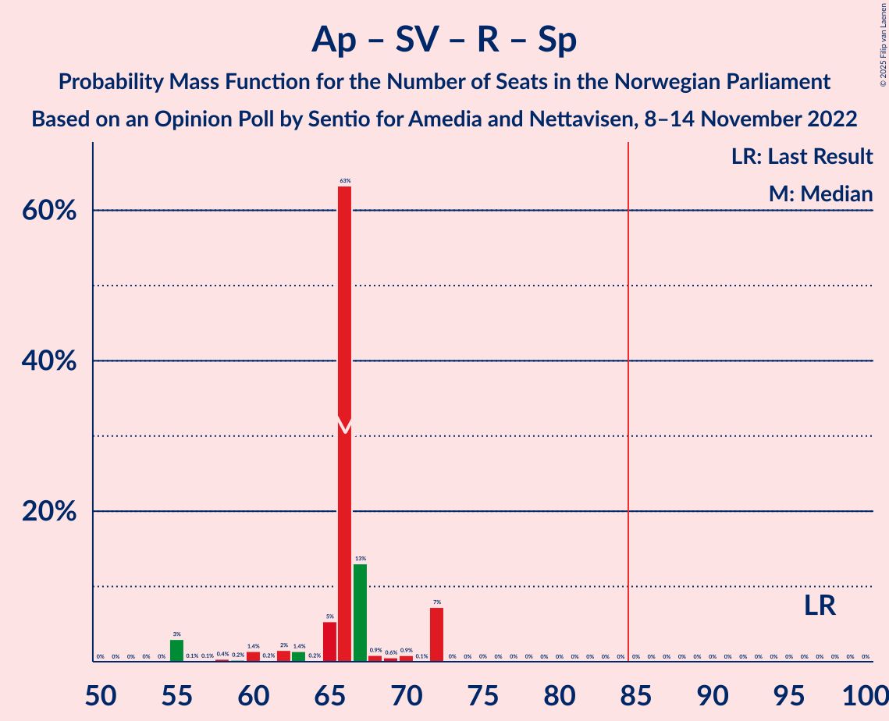

# Opinion Poll by Sentio for Amedia and Nettavisen, 8–14 November 2022

<a href="#voting-intentions">Voting Intentions</a> | <a href="#seats">Seats</a> | <a href="#coalitions">Coalitions</a> | <a href="#technical-information">Technical Information</a>

## Voting Intentions

### Confidence Intervals

| Party | Last Result | Poll Result | 80% Confidence Interval | 90% Confidence Interval | 95% Confidence Interval | 99% Confidence Interval |
|:-----:|:-----------:|:-----------:|:-----------------------:|:-----------------------:|:-----------------------:|:-----------------------:|
| Høyre | 20.4% | 31.6% | 29.8–33.5% |29.2–34.1% |28.8–34.6% |27.9–35.5% |
| Arbeiderpartiet | 26.2% | 16.7% | 15.3–18.3% |14.9–18.7% |14.5–19.1% |13.9–19.9% |
| Fremskrittspartiet | 11.6% | 13.4% | 12.1–14.9% |11.7–15.3% |11.4–15.7% |10.8–16.4% |
| Sosialistisk Venstreparti | 7.6% | 10.0% | 8.9–11.3% |8.6–11.7% |8.3–12.0% |7.8–12.7% |
| Miljøpartiet De Grønne | 3.9% | 4.8% | 4.0–5.8% |3.8–6.1% |3.6–6.3% |3.3–6.8% |
| Rødt | 4.7% | 4.7% | 3.9–5.7% |3.7–6.0% |3.6–6.2% |3.2–6.7% |
| Kristelig Folkeparti | 3.8% | 4.6% | 3.9–5.6% |3.6–5.9% |3.5–6.1% |3.1–6.6% |
| Senterpartiet | 13.5% | 4.5% | 3.8–5.5% |3.6–5.7% |3.4–6.0% |3.0–6.5% |
| Venstre | 4.6% | 4.4% | 3.7–5.3% |3.5–5.6% |3.3–5.9% |3.0–6.4% |
| Industri- og Næringspartiet | 0.3% | 1.7% | 1.3–2.4% |1.2–2.5% |1.1–2.7% |0.9–3.1% |
| Pensjonistpartiet | 0.6% | 1.5% | 1.1–2.1% |1.0–2.3% |0.9–2.5% |0.7–2.8% |
| Norgesdemokratene | 1.1% | 1.0% | 0.7–1.5% |0.6–1.7% |0.5–1.8% |0.4–2.1% |
| Folkets parti | 0.1% | 0.4% | 0.2–0.8% |0.2–0.9% |0.2–1.0% |0.1–1.3% |
| Konservativt | 0.4% | 0.2% | 0.1–0.5% |0.1–0.6% |0.1–0.7% |0.0–0.9% |
| Helsepartiet | 0.2% | 0.2% | 0.1–0.5% |0.1–0.6% |0.1–0.7% |0.0–0.9% |

*Note:* The poll result column reflects the actual value used in the calculations. Published results may vary slightly, and in addition be rounded to fewer digits.

## Seats

### Confidence Intervals

| Party | Last Result | Median | 80% Confidence Interval | 90% Confidence Interval | 95% Confidence Interval | 99% Confidence Interval |
|:-----:|:-----------:|:------:|:-----------------------:|:-----------------------:|:-----------------------:|:-----------------------:|
| <a href="#høyre">Høyre</a> | 36 | 60 | 56–62 |53–63 |52–64 |50–65 |
| <a href="#arbeiderpartiet">Arbeiderpartiet</a> | 48 | 39 | 31–39 |31–39 |31–39 |29–39 |
| <a href="#fremskrittspartiet">Fremskrittspartiet</a> | 21 | 21 | 17–26 |17–29 |17–32 |17–34 |
| <a href="#sosialistisk-venstreparti">Sosialistisk Venstreparti</a> | 13 | 13 | 13–20 |13–20 |13–21 |13–23 |
| <a href="#miljøpartiet-de-grønne">Miljøpartiet De Grønne</a> | 3 | 7 | 7–10 |7–11 |2–11 |2–12 |
| <a href="#rødt">Rødt</a> | 8 | 8 | 8–9 |1–10 |1–11 |1–11 |
| <a href="#kristelig-folkeparti">Kristelig Folkeparti</a> | 3 | 6 | 3–8 |2–8 |2–9 |2–10 |
| <a href="#senterpartiet">Senterpartiet</a> | 28 | 6 | 6–9 |6–10 |1–10 |0–11 |
| <a href="#venstre">Venstre</a> | 8 | 8 | 2–8 |2–9 |2–10 |2–10 |
| <a href="#industri--og-næringspartiet">Industri- og Næringspartiet</a> | 0 | 0 | 0 |0 |0–1 |0–2 |
| <a href="#pensjonistpartiet">Pensjonistpartiet</a> | 0 | 0 | 0 |0 |0–1 |0–1 |
| <a href="#norgesdemokratene">Norgesdemokratene</a> | 0 | 0 | 0 |0 |0 |0 |
| <a href="#folkets-parti">Folkets parti</a> | 0 | 0 | 0 |0 |0 |0 |
| <a href="#konservativt">Konservativt</a> | 0 | 0 | 0 |0 |0 |0 |
| <a href="#helsepartiet">Helsepartiet</a> | 0 | 0 | 0 |0 |0 |0 |

### Høyre

*For a full overview of the results for this party, see the [Høyre](party-høyre.html) page.*

| Number of Seats | Probability | Accumulated | Special Marks |
|:---------------:|:-----------:|:-----------:|:-------------:|
| 36 | 0% | 100% | Last Result |
| 37 | 0% | 100% |  |
| 38 | 0% | 100% |  |
| 39 | 0% | 100% |  |
| 40 | 0% | 100% |  |
| 41 | 0% | 100% |  |
| 42 | 0% | 100% |  |
| 43 | 0% | 100% |  |
| 44 | 0% | 100% |  |
| 45 | 0% | 100% |  |
| 46 | 0% | 100% |  |
| 47 | 0% | 100% |  |
| 48 | 0% | 100% |  |
| 49 | 0.3% | 100% |  |
| 50 | 1.1% | 99.7% |  |
| 51 | 0.5% | 98.6% |  |
| 52 | 0.8% | 98% |  |
| 53 | 4% | 97% |  |
| 54 | 2% | 93% |  |
| 55 | 1.1% | 91% |  |
| 56 | 8% | 90% |  |
| 57 | 5% | 82% |  |
| 58 | 0.6% | 77% |  |
| 59 | 0.1% | 77% |  |
| 60 | 59% | 77% | Median |
| 61 | 0.5% | 18% |  |
| 62 | 10% | 17% |  |
| 63 | 3% | 7% |  |
| 64 | 3% | 4% |  |
| 65 | 0.8% | 1.1% |  |
| 66 | 0% | 0.2% |  |
| 67 | 0.1% | 0.2% |  |
| 68 | 0% | 0.1% |  |
| 69 | 0% | 0.1% |  |
| 70 | 0% | 0% |  |

### Arbeiderpartiet

*For a full overview of the results for this party, see the [Arbeiderpartiet](party-arbeiderpartiet.html) page.*

| Number of Seats | Probability | Accumulated | Special Marks |
|:---------------:|:-----------:|:-----------:|:-------------:|
| 27 | 0.1% | 100% |  |
| 28 | 0.1% | 99.8% |  |
| 29 | 1.0% | 99.8% |  |
| 30 | 1.0% | 98.7% |  |
| 31 | 8% | 98% |  |
| 32 | 2% | 89% |  |
| 33 | 7% | 87% |  |
| 34 | 10% | 80% |  |
| 35 | 10% | 71% |  |
| 36 | 1.0% | 60% |  |
| 37 | 0.5% | 59% |  |
| 38 | 0.1% | 59% |  |
| 39 | 59% | 59% | Median |
| 40 | 0.2% | 0.3% |  |
| 41 | 0% | 0.1% |  |
| 42 | 0% | 0.1% |  |
| 43 | 0% | 0% |  |
| 44 | 0% | 0% |  |
| 45 | 0% | 0% |  |
| 46 | 0% | 0% |  |
| 47 | 0% | 0% |  |
| 48 | 0% | 0% | Last Result |

### Fremskrittspartiet

*For a full overview of the results for this party, see the [Fremskrittspartiet](party-fremskrittspartiet.html) page.*

| Number of Seats | Probability | Accumulated | Special Marks |
|:---------------:|:-----------:|:-----------:|:-------------:|
| 17 | 10% | 100% |  |
| 18 | 0.1% | 90% |  |
| 19 | 3% | 90% |  |
| 20 | 0.4% | 86% |  |
| 21 | 59% | 86% | Last Result, Median |
| 22 | 0.9% | 27% |  |
| 23 | 4% | 26% |  |
| 24 | 6% | 23% |  |
| 25 | 0.2% | 16% |  |
| 26 | 8% | 16% |  |
| 27 | 0.9% | 8% |  |
| 28 | 0.2% | 7% |  |
| 29 | 2% | 7% |  |
| 30 | 0.5% | 5% |  |
| 31 | 0.2% | 4% |  |
| 32 | 3% | 4% |  |
| 33 | 0.3% | 1.0% |  |
| 34 | 0.7% | 0.7% |  |
| 35 | 0% | 0% |  |

### Sosialistisk Venstreparti

*For a full overview of the results for this party, see the [Sosialistisk Venstreparti](party-sosialistiskvenstreparti.html) page.*

| Number of Seats | Probability | Accumulated | Special Marks |
|:---------------:|:-----------:|:-----------:|:-------------:|
| 12 | 0.2% | 100% |  |
| 13 | 59% | 99.8% | Last Result, Median |
| 14 | 2% | 41% |  |
| 15 | 17% | 39% |  |
| 16 | 5% | 22% |  |
| 17 | 5% | 17% |  |
| 18 | 0.6% | 12% |  |
| 19 | 1.5% | 12% |  |
| 20 | 7% | 10% |  |
| 21 | 2% | 3% |  |
| 22 | 0.1% | 1.2% |  |
| 23 | 1.0% | 1.1% |  |
| 24 | 0% | 0.1% |  |
| 25 | 0% | 0.1% |  |
| 26 | 0.1% | 0.1% |  |
| 27 | 0% | 0% |  |

### Miljøpartiet De Grønne

*For a full overview of the results for this party, see the [Miljøpartiet De Grønne](party-miljøpartietdegrønne.html) page.*

| Number of Seats | Probability | Accumulated | Special Marks |
|:---------------:|:-----------:|:-----------:|:-------------:|
| 2 | 4% | 100% |  |
| 3 | 0.8% | 96% | Last Result |
| 4 | 0% | 95% |  |
| 5 | 0% | 95% |  |
| 6 | 0% | 95% |  |
| 7 | 70% | 95% | Median |
| 8 | 7% | 25% |  |
| 9 | 5% | 19% |  |
| 10 | 7% | 14% |  |
| 11 | 6% | 7% |  |
| 12 | 0.5% | 0.5% |  |
| 13 | 0% | 0.1% |  |
| 14 | 0% | 0% |  |

### Rødt

*For a full overview of the results for this party, see the [Rødt](party-rødt.html) page.*

| Number of Seats | Probability | Accumulated | Special Marks |
|:---------------:|:-----------:|:-----------:|:-------------:|
| 1 | 5% | 100% |  |
| 2 | 0% | 95% |  |
| 3 | 0% | 95% |  |
| 4 | 0% | 95% |  |
| 5 | 0% | 95% |  |
| 6 | 0% | 95% |  |
| 7 | 1.4% | 95% |  |
| 8 | 68% | 93% | Last Result, Median |
| 9 | 16% | 26% |  |
| 10 | 5% | 10% |  |
| 11 | 4% | 5% |  |
| 12 | 0.1% | 0.1% |  |
| 13 | 0% | 0% |  |

### Kristelig Folkeparti

*For a full overview of the results for this party, see the [Kristelig Folkeparti](party-kristeligfolkeparti.html) page.*

| Number of Seats | Probability | Accumulated | Special Marks |
|:---------------:|:-----------:|:-----------:|:-------------:|
| 2 | 8% | 100% |  |
| 3 | 2% | 92% | Last Result |
| 4 | 0% | 90% |  |
| 5 | 0% | 90% |  |
| 6 | 59% | 90% | Median |
| 7 | 5% | 31% |  |
| 8 | 22% | 26% |  |
| 9 | 2% | 4% |  |
| 10 | 1.2% | 2% |  |
| 11 | 0.3% | 0.4% |  |
| 12 | 0.1% | 0.1% |  |
| 13 | 0% | 0% |  |

### Senterpartiet

*For a full overview of the results for this party, see the [Senterpartiet](party-senterpartiet.html) page.*

| Number of Seats | Probability | Accumulated | Special Marks |
|:---------------:|:-----------:|:-----------:|:-------------:|
| 0 | 0.5% | 100% |  |
| 1 | 2% | 99.5% |  |
| 2 | 0% | 97% |  |
| 3 | 0% | 97% |  |
| 4 | 0% | 97% |  |
| 5 | 0% | 97% |  |
| 6 | 59% | 97% | Median |
| 7 | 8% | 38% |  |
| 8 | 16% | 31% |  |
| 9 | 6% | 14% |  |
| 10 | 8% | 9% |  |
| 11 | 0.8% | 1.1% |  |
| 12 | 0.3% | 0.3% |  |
| 13 | 0% | 0% |  |
| 14 | 0% | 0% |  |
| 15 | 0% | 0% |  |
| 16 | 0% | 0% |  |
| 17 | 0% | 0% |  |
| 18 | 0% | 0% |  |
| 19 | 0% | 0% |  |
| 20 | 0% | 0% |  |
| 21 | 0% | 0% |  |
| 22 | 0% | 0% |  |
| 23 | 0% | 0% |  |
| 24 | 0% | 0% |  |
| 25 | 0% | 0% |  |
| 26 | 0% | 0% |  |
| 27 | 0% | 0% |  |
| 28 | 0% | 0% | Last Result |

### Venstre

*For a full overview of the results for this party, see the [Venstre](party-venstre.html) page.*

| Number of Seats | Probability | Accumulated | Special Marks |
|:---------------:|:-----------:|:-----------:|:-------------:|
| 2 | 12% | 100% |  |
| 3 | 5% | 88% |  |
| 4 | 0% | 83% |  |
| 5 | 0% | 83% |  |
| 6 | 0% | 83% |  |
| 7 | 16% | 83% |  |
| 8 | 62% | 67% | Last Result, Median |
| 9 | 2% | 5% |  |
| 10 | 3% | 4% |  |
| 11 | 0.2% | 0.2% |  |
| 12 | 0% | 0% |  |

### Industri- og Næringspartiet

*For a full overview of the results for this party, see the [Industri- og Næringspartiet](party-industri-ognæringspartiet.html) page.*

| Number of Seats | Probability | Accumulated | Special Marks |
|:---------------:|:-----------:|:-----------:|:-------------:|
| 0 | 97% | 100% | Last Result, Median |
| 1 | 2% | 3% |  |
| 2 | 1.2% | 1.3% |  |
| 3 | 0% | 0% |  |

### Pensjonistpartiet

*For a full overview of the results for this party, see the [Pensjonistpartiet](party-pensjonistpartiet.html) page.*

| Number of Seats | Probability | Accumulated | Special Marks |
|:---------------:|:-----------:|:-----------:|:-------------:|
| 0 | 96% | 100% | Last Result, Median |
| 1 | 4% | 4% |  |
| 2 | 0% | 0% |  |

### Norgesdemokratene

*For a full overview of the results for this party, see the [Norgesdemokratene](party-norgesdemokratene.html) page.*

| Number of Seats | Probability | Accumulated | Special Marks |
|:---------------:|:-----------:|:-----------:|:-------------:|
| 0 | 100% | 100% | Last Result, Median |

### Folkets parti

*For a full overview of the results for this party, see the [Folkets parti](party-folketsparti.html) page.*

| Number of Seats | Probability | Accumulated | Special Marks |
|:---------------:|:-----------:|:-----------:|:-------------:|
| 0 | 99.9% | 100% | Last Result, Median |
| 1 | 0.1% | 0.1% |  |
| 2 | 0% | 0% |  |

### Konservativt

*For a full overview of the results for this party, see the [Konservativt](party-konservativt.html) page.*

| Number of Seats | Probability | Accumulated | Special Marks |
|:---------------:|:-----------:|:-----------:|:-------------:|
| 0 | 100% | 100% | Last Result, Median |

### Helsepartiet

*For a full overview of the results for this party, see the [Helsepartiet](party-helsepartiet.html) page.*

| Number of Seats | Probability | Accumulated | Special Marks |
|:---------------:|:-----------:|:-----------:|:-------------:|
| 0 | 100% | 100% | Last Result, Median |

## Coalitions

### Confidence Intervals

| Coalition | Last Result | Median | Majority? | 80% Confidence Interval | 90% Confidence Interval | 95% Confidence Interval | 99% Confidence Interval |
|:---------:|:-----------:|:------:|:---------:|:-----------------------:|:-----------------------:|:-----------------------:|:-----------------------:|
| Høyre – Fremskrittspartiet – Miljøpartiet De Grønne – Kristelig Folkeparti – Venstre | 71 | 102 | 100% | 101–103 | 96–106 | 96–112 | 96–112 |
| Høyre – Fremskrittspartiet – Kristelig Folkeparti – Senterpartiet – Venstre | 96 | 101 | 100% | 98–104 | 96–107 | 96–111 | 94–111 |
| Høyre – Fremskrittspartiet – Kristelig Folkeparti – Venstre | 68 | 95 | 99.9% | 92–97 | 86–100 | 86–104 | 86–104 |
| Høyre – Fremskrittspartiet – Venstre | 65 | 89 | 88% | 84–89 | 84–94 | 84–96 | 82–96 |
| Høyre – Fremskrittspartiet | 57 | 81 | 9% | 79–84 | 79–86 | 78–86 | 75–87 |
| Arbeiderpartiet – Sosialistisk Venstreparti – Miljøpartiet De Grønne – Rødt – Senterpartiet | 100 | 73 | 0.1% | 70–76 | 68–82 | 63–82 | 63–82 |
| Høyre – Kristelig Folkeparti – Venstre | 47 | 74 | 0% | 66–77 | 60–77 | 60–81 | 60–81 |
| Arbeiderpartiet – Sosialistisk Venstreparti – Miljøpartiet De Grønne – Kristelig Folkeparti – Senterpartiet | 95 | 71 | 0% | 71–74 | 68–76 | 67–76 | 66–79 |
| Arbeiderpartiet – Sosialistisk Venstreparti – Miljøpartiet De Grønne – Senterpartiet | 92 | 65 | 0% | 64–69 | 60–74 | 59–74 | 58–74 |
| Arbeiderpartiet – Sosialistisk Venstreparti – Miljøpartiet De Grønne – Rødt | 72 | 67 | 0% | 64–69 | 60–72 | 56–72 | 56–73 |
| Arbeiderpartiet – Sosialistisk Venstreparti – Rødt – Senterpartiet | 97 | 66 | 0% | 65–67 | 60–72 | 55–72 | 55–72 |
| Arbeiderpartiet – Sosialistisk Venstreparti – Senterpartiet | 89 | 58 | 0% | 54–60 | 54–64 | 53–64 | 51–65 |
| Arbeiderpartiet – Miljøpartiet De Grønne – Kristelig Folkeparti – Senterpartiet | 82 | 58 | 0% | 54–58 | 52–58 | 50–58 | 49–62 |
| Arbeiderpartiet – Sosialistisk Venstreparti | 61 | 52 | 0% | 48–53 | 46–54 | 46–54 | 43–57 |
| Arbeiderpartiet – Kristelig Folkeparti – Senterpartiet | 79 | 51 | 0% | 46–51 | 45–51 | 43–51 | 41–54 |
| Arbeiderpartiet – Senterpartiet | 76 | 45 | 0% | 39–45 | 38–45 | 37–45 | 34–46 |
| Kristelig Folkeparti – Senterpartiet – Venstre | 39 | 20 | 0% | 17–23 | 14–25 | 14–25 | 11–28 |

### Høyre – Fremskrittspartiet – Miljøpartiet De Grønne – Kristelig Folkeparti – Venstre

| Number of Seats | Probability | Accumulated | Special Marks |
|:---------------:|:-----------:|:-----------:|:-------------:|
| 71 | 0% | 100% | Last Result |
| 72 | 0% | 100% |  |
| 73 | 0% | 100% |  |
| 74 | 0% | 100% |  |
| 75 | 0% | 100% |  |
| 76 | 0% | 100% |  |
| 77 | 0% | 100% |  |
| 78 | 0% | 100% |  |
| 79 | 0% | 100% |  |
| 80 | 0% | 100% |  |
| 81 | 0% | 100% |  |
| 82 | 0% | 100% |  |
| 83 | 0% | 100% |  |
| 84 | 0% | 100% |  |
| 85 | 0% | 100% | Majority |
| 86 | 0% | 100% |  |
| 87 | 0% | 100% |  |
| 88 | 0% | 100% |  |
| 89 | 0% | 100% |  |
| 90 | 0% | 100% |  |
| 91 | 0% | 100% |  |
| 92 | 0% | 99.9% |  |
| 93 | 0% | 99.9% |  |
| 94 | 0% | 99.9% |  |
| 95 | 0.1% | 99.9% |  |
| 96 | 7% | 99.8% |  |
| 97 | 0.1% | 93% |  |
| 98 | 1.2% | 93% |  |
| 99 | 0.2% | 91% |  |
| 100 | 0.8% | 91% |  |
| 101 | 14% | 90% |  |
| 102 | 64% | 77% | Median |
| 103 | 5% | 13% |  |
| 104 | 0.8% | 8% |  |
| 105 | 1.4% | 8% |  |
| 106 | 2% | 6% |  |
| 107 | 0.1% | 5% |  |
| 108 | 0.9% | 5% |  |
| 109 | 0.1% | 4% |  |
| 110 | 0.4% | 4% |  |
| 111 | 0% | 3% |  |
| 112 | 3% | 3% |  |
| 113 | 0% | 0.1% |  |
| 114 | 0% | 0.1% |  |
| 115 | 0% | 0.1% |  |
| 116 | 0% | 0% |  |

### Høyre – Fremskrittspartiet – Kristelig Folkeparti – Senterpartiet – Venstre

| Number of Seats | Probability | Accumulated | Special Marks |
|:---------------:|:-----------:|:-----------:|:-------------:|
| 90 | 0% | 100% |  |
| 91 | 0% | 99.9% |  |
| 92 | 0% | 99.9% |  |
| 93 | 0.1% | 99.9% |  |
| 94 | 0.7% | 99.8% |  |
| 95 | 0.9% | 99.1% |  |
| 96 | 8% | 98% | Last Result |
| 97 | 0.2% | 91% |  |
| 98 | 0.8% | 90% |  |
| 99 | 0.8% | 90% |  |
| 100 | 5% | 89% |  |
| 101 | 63% | 84% | Median |
| 102 | 11% | 21% |  |
| 103 | 0.4% | 11% |  |
| 104 | 0.6% | 10% |  |
| 105 | 0.1% | 10% |  |
| 106 | 1.0% | 10% |  |
| 107 | 4% | 9% |  |
| 108 | 0.1% | 5% |  |
| 109 | 0.8% | 5% |  |
| 110 | 1.0% | 4% |  |
| 111 | 3% | 3% |  |
| 112 | 0% | 0% |  |

### Høyre – Fremskrittspartiet – Kristelig Folkeparti – Venstre

| Number of Seats | Probability | Accumulated | Special Marks |
|:---------------:|:-----------:|:-----------:|:-------------:|
| 68 | 0% | 100% | Last Result |
| 69 | 0% | 100% |  |
| 70 | 0% | 100% |  |
| 71 | 0% | 100% |  |
| 72 | 0% | 100% |  |
| 73 | 0% | 100% |  |
| 74 | 0% | 100% |  |
| 75 | 0% | 100% |  |
| 76 | 0% | 100% |  |
| 77 | 0% | 100% |  |
| 78 | 0% | 100% |  |
| 79 | 0% | 100% |  |
| 80 | 0% | 100% |  |
| 81 | 0% | 100% |  |
| 82 | 0% | 99.9% |  |
| 83 | 0% | 99.9% |  |
| 84 | 0% | 99.9% |  |
| 85 | 0% | 99.9% | Majority |
| 86 | 7% | 99.9% |  |
| 87 | 0.2% | 93% |  |
| 88 | 0% | 93% |  |
| 89 | 0.5% | 93% |  |
| 90 | 1.0% | 92% |  |
| 91 | 0.9% | 91% |  |
| 92 | 7% | 90% |  |
| 93 | 1.0% | 83% |  |
| 94 | 12% | 82% |  |
| 95 | 59% | 70% | Median |
| 96 | 0.5% | 11% |  |
| 97 | 0.7% | 11% |  |
| 98 | 2% | 10% |  |
| 99 | 1.0% | 8% |  |
| 100 | 3% | 7% |  |
| 101 | 0.8% | 4% |  |
| 102 | 0.1% | 3% |  |
| 103 | 0.1% | 3% |  |
| 104 | 3% | 3% |  |
| 105 | 0% | 0.2% |  |
| 106 | 0% | 0.2% |  |
| 107 | 0.1% | 0.1% |  |
| 108 | 0% | 0.1% |  |
| 109 | 0% | 0.1% |  |
| 110 | 0% | 0% |  |

### Høyre – Fremskrittspartiet – Venstre

| Number of Seats | Probability | Accumulated | Special Marks |
|:---------------:|:-----------:|:-----------:|:-------------:|
| 65 | 0% | 100% | Last Result |
| 66 | 0% | 100% |  |
| 67 | 0% | 100% |  |
| 68 | 0% | 100% |  |
| 69 | 0% | 100% |  |
| 70 | 0% | 100% |  |
| 71 | 0% | 100% |  |
| 72 | 0% | 100% |  |
| 73 | 0% | 100% |  |
| 74 | 0% | 100% |  |
| 75 | 0% | 100% |  |
| 76 | 0% | 100% |  |
| 77 | 0% | 100% |  |
| 78 | 0.2% | 100% |  |
| 79 | 0.1% | 99.8% |  |
| 80 | 0.1% | 99.7% |  |
| 81 | 0.1% | 99.6% |  |
| 82 | 0.4% | 99.6% |  |
| 83 | 0.4% | 99.2% |  |
| 84 | 11% | 98.9% |  |
| 85 | 4% | 88% | Majority |
| 86 | 12% | 83% |  |
| 87 | 0.8% | 71% |  |
| 88 | 1.0% | 70% |  |
| 89 | 60% | 69% | Median |
| 90 | 0.2% | 9% |  |
| 91 | 0.4% | 9% |  |
| 92 | 3% | 9% |  |
| 93 | 0.1% | 5% |  |
| 94 | 1.1% | 5% |  |
| 95 | 1.0% | 4% |  |
| 96 | 3% | 3% |  |
| 97 | 0.1% | 0.2% |  |
| 98 | 0.1% | 0.2% |  |
| 99 | 0% | 0.1% |  |
| 100 | 0% | 0% |  |

### Høyre – Fremskrittspartiet

| Number of Seats | Probability | Accumulated | Special Marks |
|:---------------:|:-----------:|:-----------:|:-------------:|
| 57 | 0% | 100% | Last Result |
| 58 | 0% | 100% |  |
| 59 | 0% | 100% |  |
| 60 | 0% | 100% |  |
| 61 | 0% | 100% |  |
| 62 | 0% | 100% |  |
| 63 | 0% | 100% |  |
| 64 | 0% | 100% |  |
| 65 | 0% | 100% |  |
| 66 | 0% | 100% |  |
| 67 | 0% | 100% |  |
| 68 | 0% | 100% |  |
| 69 | 0% | 100% |  |
| 70 | 0% | 100% |  |
| 71 | 0% | 100% |  |
| 72 | 0% | 100% |  |
| 73 | 0% | 100% |  |
| 74 | 0.3% | 99.9% |  |
| 75 | 0.4% | 99.7% |  |
| 76 | 0.2% | 99.2% |  |
| 77 | 0.9% | 99.0% |  |
| 78 | 1.4% | 98% |  |
| 79 | 11% | 97% |  |
| 80 | 0.7% | 86% |  |
| 81 | 64% | 85% | Median |
| 82 | 7% | 21% |  |
| 83 | 3% | 14% |  |
| 84 | 1.2% | 10% |  |
| 85 | 4% | 9% | Majority |
| 86 | 3% | 6% |  |
| 87 | 2% | 2% |  |
| 88 | 0.1% | 0.4% |  |
| 89 | 0.1% | 0.3% |  |
| 90 | 0.1% | 0.2% |  |
| 91 | 0% | 0.1% |  |
| 92 | 0% | 0.1% |  |
| 93 | 0% | 0.1% |  |
| 94 | 0% | 0.1% |  |
| 95 | 0% | 0.1% |  |
| 96 | 0% | 0% |  |

### Arbeiderpartiet – Sosialistisk Venstreparti – Miljøpartiet De Grønne – Rødt – Senterpartiet

| Number of Seats | Probability | Accumulated | Special Marks |
|:---------------:|:-----------:|:-----------:|:-------------:|
| 59 | 0% | 100% |  |
| 60 | 0% | 99.9% |  |
| 61 | 0.1% | 99.9% |  |
| 62 | 0.1% | 99.9% |  |
| 63 | 3% | 99.8% |  |
| 64 | 0.2% | 97% |  |
| 65 | 0% | 97% |  |
| 66 | 0.2% | 97% |  |
| 67 | 1.0% | 96% |  |
| 68 | 3% | 95% |  |
| 69 | 1.4% | 92% |  |
| 70 | 1.5% | 91% |  |
| 71 | 0.1% | 89% |  |
| 72 | 0.5% | 89% |  |
| 73 | 59% | 89% | Median |
| 74 | 13% | 29% |  |
| 75 | 0.2% | 17% |  |
| 76 | 7% | 17% |  |
| 77 | 0.9% | 9% |  |
| 78 | 0.9% | 8% |  |
| 79 | 0.1% | 7% |  |
| 80 | 0% | 7% |  |
| 81 | 0.2% | 7% |  |
| 82 | 7% | 7% |  |
| 83 | 0% | 0.1% |  |
| 84 | 0% | 0.1% |  |
| 85 | 0% | 0.1% | Majority |
| 86 | 0% | 0.1% |  |
| 87 | 0.1% | 0.1% |  |
| 88 | 0% | 0% |  |
| 89 | 0% | 0% |  |
| 90 | 0% | 0% |  |
| 91 | 0% | 0% |  |
| 92 | 0% | 0% |  |
| 93 | 0% | 0% |  |
| 94 | 0% | 0% |  |
| 95 | 0% | 0% |  |
| 96 | 0% | 0% |  |
| 97 | 0% | 0% |  |
| 98 | 0% | 0% |  |
| 99 | 0% | 0% |  |
| 100 | 0% | 0% | Last Result |

### Høyre – Kristelig Folkeparti – Venstre

| Number of Seats | Probability | Accumulated | Special Marks |
|:---------------:|:-----------:|:-----------:|:-------------:|
| 47 | 0% | 100% | Last Result |
| 48 | 0% | 100% |  |
| 49 | 0% | 100% |  |
| 50 | 0% | 100% |  |
| 51 | 0% | 100% |  |
| 52 | 0% | 100% |  |
| 53 | 0% | 100% |  |
| 54 | 0% | 100% |  |
| 55 | 0% | 100% |  |
| 56 | 0% | 100% |  |
| 57 | 0% | 100% |  |
| 58 | 0% | 100% |  |
| 59 | 0.1% | 99.9% |  |
| 60 | 7% | 99.9% |  |
| 61 | 0.6% | 93% |  |
| 62 | 0% | 92% |  |
| 63 | 0.7% | 92% |  |
| 64 | 0.3% | 92% |  |
| 65 | 0.8% | 91% |  |
| 66 | 1.0% | 90% |  |
| 67 | 1.5% | 89% |  |
| 68 | 8% | 88% |  |
| 69 | 0.3% | 80% |  |
| 70 | 2% | 80% |  |
| 71 | 0.3% | 78% |  |
| 72 | 0.6% | 78% |  |
| 73 | 3% | 77% |  |
| 74 | 59% | 74% | Median |
| 75 | 0.1% | 15% |  |
| 76 | 1.4% | 15% |  |
| 77 | 10% | 14% |  |
| 78 | 0.2% | 4% |  |
| 79 | 0% | 3% |  |
| 80 | 0.1% | 3% |  |
| 81 | 3% | 3% |  |
| 82 | 0% | 0.2% |  |
| 83 | 0.1% | 0.2% |  |
| 84 | 0% | 0.1% |  |
| 85 | 0% | 0% | Majority |

### Arbeiderpartiet – Sosialistisk Venstreparti – Miljøpartiet De Grønne – Kristelig Folkeparti – Senterpartiet

| Number of Seats | Probability | Accumulated | Special Marks |
|:---------------:|:-----------:|:-----------:|:-------------:|
| 61 | 0.1% | 100% |  |
| 62 | 0.1% | 99.9% |  |
| 63 | 0% | 99.8% |  |
| 64 | 0% | 99.8% |  |
| 65 | 0% | 99.8% |  |
| 66 | 1.0% | 99.8% |  |
| 67 | 4% | 98.7% |  |
| 68 | 0.8% | 95% |  |
| 69 | 0.1% | 94% |  |
| 70 | 3% | 94% |  |
| 71 | 60% | 91% | Median |
| 72 | 1.5% | 31% |  |
| 73 | 18% | 29% |  |
| 74 | 2% | 11% |  |
| 75 | 0.1% | 9% |  |
| 76 | 8% | 9% |  |
| 77 | 0.1% | 1.3% |  |
| 78 | 0.6% | 1.2% |  |
| 79 | 0.3% | 0.7% |  |
| 80 | 0.1% | 0.3% |  |
| 81 | 0.2% | 0.3% |  |
| 82 | 0% | 0% |  |
| 83 | 0% | 0% |  |
| 84 | 0% | 0% |  |
| 85 | 0% | 0% | Majority |
| 86 | 0% | 0% |  |
| 87 | 0% | 0% |  |
| 88 | 0% | 0% |  |
| 89 | 0% | 0% |  |
| 90 | 0% | 0% |  |
| 91 | 0% | 0% |  |
| 92 | 0% | 0% |  |
| 93 | 0% | 0% |  |
| 94 | 0% | 0% |  |
| 95 | 0% | 0% | Last Result |

### Arbeiderpartiet – Sosialistisk Venstreparti – Miljøpartiet De Grønne – Senterpartiet

| Number of Seats | Probability | Accumulated | Special Marks |
|:---------------:|:-----------:|:-----------:|:-------------:|
| 53 | 0% | 100% |  |
| 54 | 0% | 99.9% |  |
| 55 | 0% | 99.9% |  |
| 56 | 0.1% | 99.9% |  |
| 57 | 0.2% | 99.9% |  |
| 58 | 0.4% | 99.6% |  |
| 59 | 4% | 99.2% |  |
| 60 | 0.8% | 95% |  |
| 61 | 0% | 95% |  |
| 62 | 3% | 95% |  |
| 63 | 0.8% | 91% |  |
| 64 | 1.2% | 91% |  |
| 65 | 75% | 89% | Median |
| 66 | 3% | 15% |  |
| 67 | 0.4% | 12% |  |
| 68 | 1.2% | 11% |  |
| 69 | 2% | 10% |  |
| 70 | 1.1% | 8% |  |
| 71 | 0% | 7% |  |
| 72 | 0.2% | 7% |  |
| 73 | 0% | 7% |  |
| 74 | 7% | 7% |  |
| 75 | 0% | 0.1% |  |
| 76 | 0% | 0.1% |  |
| 77 | 0% | 0.1% |  |
| 78 | 0% | 0.1% |  |
| 79 | 0% | 0% |  |
| 80 | 0% | 0% |  |
| 81 | 0% | 0% |  |
| 82 | 0% | 0% |  |
| 83 | 0% | 0% |  |
| 84 | 0% | 0% |  |
| 85 | 0% | 0% | Majority |
| 86 | 0% | 0% |  |
| 87 | 0% | 0% |  |
| 88 | 0% | 0% |  |
| 89 | 0% | 0% |  |
| 90 | 0% | 0% |  |
| 91 | 0% | 0% |  |
| 92 | 0% | 0% | Last Result |

### Arbeiderpartiet – Sosialistisk Venstreparti – Miljøpartiet De Grønne – Rødt

| Number of Seats | Probability | Accumulated | Special Marks |
|:---------------:|:-----------:|:-----------:|:-------------:|
| 56 | 3% | 100% |  |
| 57 | 0% | 97% |  |
| 58 | 1.3% | 97% |  |
| 59 | 0.5% | 96% |  |
| 60 | 0.2% | 95% |  |
| 61 | 3% | 95% |  |
| 62 | 1.0% | 91% |  |
| 63 | 0.1% | 90% |  |
| 64 | 0.6% | 90% |  |
| 65 | 0.4% | 90% |  |
| 66 | 10% | 89% |  |
| 67 | 63% | 79% | Median |
| 68 | 5% | 16% |  |
| 69 | 0.8% | 10% |  |
| 70 | 0.6% | 10% |  |
| 71 | 0.2% | 9% |  |
| 72 | 8% | 9% | Last Result |
| 73 | 0.9% | 1.1% |  |
| 74 | 0.1% | 0.2% |  |
| 75 | 0% | 0.1% |  |
| 76 | 0% | 0.1% |  |
| 77 | 0% | 0.1% |  |
| 78 | 0% | 0.1% |  |
| 79 | 0% | 0% |  |

### Arbeiderpartiet – Sosialistisk Venstreparti – Rødt – Senterpartiet

| Number of Seats | Probability | Accumulated | Special Marks |
|:---------------:|:-----------:|:-----------:|:-------------:|
| 53 | 0% | 100% |  |
| 54 | 0% | 99.9% |  |
| 55 | 3% | 99.9% |  |
| 56 | 0.1% | 97% |  |
| 57 | 0.1% | 97% |  |
| 58 | 0.4% | 97% |  |
| 59 | 0.2% | 96% |  |
| 60 | 1.4% | 96% |  |
| 61 | 0.2% | 95% |  |
| 62 | 2% | 94% |  |
| 63 | 1.4% | 93% |  |
| 64 | 0.2% | 92% |  |
| 65 | 5% | 91% |  |
| 66 | 63% | 86% | Median |
| 67 | 13% | 23% |  |
| 68 | 0.9% | 10% |  |
| 69 | 0.6% | 9% |  |
| 70 | 0.9% | 8% |  |
| 71 | 0.1% | 7% |  |
| 72 | 7% | 7% |  |
| 73 | 0% | 0.2% |  |
| 74 | 0% | 0.1% |  |
| 75 | 0% | 0.1% |  |
| 76 | 0% | 0.1% |  |
| 77 | 0% | 0.1% |  |
| 78 | 0% | 0% |  |
| 79 | 0% | 0% |  |
| 80 | 0% | 0% |  |
| 81 | 0% | 0% |  |
| 82 | 0% | 0% |  |
| 83 | 0% | 0% |  |
| 84 | 0% | 0% |  |
| 85 | 0% | 0% | Majority |
| 86 | 0% | 0% |  |
| 87 | 0% | 0% |  |
| 88 | 0% | 0% |  |
| 89 | 0% | 0% |  |
| 90 | 0% | 0% |  |
| 91 | 0% | 0% |  |
| 92 | 0% | 0% |  |
| 93 | 0% | 0% |  |
| 94 | 0% | 0% |  |
| 95 | 0% | 0% |  |
| 96 | 0% | 0% |  |
| 97 | 0% | 0% | Last Result |

### Arbeiderpartiet – Sosialistisk Venstreparti – Senterpartiet

| Number of Seats | Probability | Accumulated | Special Marks |
|:---------------:|:-----------:|:-----------:|:-------------:|
| 47 | 0% | 100% |  |
| 48 | 0% | 99.9% |  |
| 49 | 0.1% | 99.9% |  |
| 50 | 0.1% | 99.8% |  |
| 51 | 0.7% | 99.7% |  |
| 52 | 1.4% | 99.0% |  |
| 53 | 0.9% | 98% |  |
| 54 | 7% | 97% |  |
| 55 | 0.6% | 89% |  |
| 56 | 0.8% | 89% |  |
| 57 | 8% | 88% |  |
| 58 | 70% | 80% | Median |
| 59 | 0.6% | 11% |  |
| 60 | 0.4% | 10% |  |
| 61 | 0.9% | 10% |  |
| 62 | 1.0% | 9% |  |
| 63 | 0.2% | 8% |  |
| 64 | 7% | 8% |  |
| 65 | 0.2% | 0.6% |  |
| 66 | 0% | 0.4% |  |
| 67 | 0.3% | 0.4% |  |
| 68 | 0% | 0.1% |  |
| 69 | 0% | 0% |  |
| 70 | 0% | 0% |  |
| 71 | 0% | 0% |  |
| 72 | 0% | 0% |  |
| 73 | 0% | 0% |  |
| 74 | 0% | 0% |  |
| 75 | 0% | 0% |  |
| 76 | 0% | 0% |  |
| 77 | 0% | 0% |  |
| 78 | 0% | 0% |  |
| 79 | 0% | 0% |  |
| 80 | 0% | 0% |  |
| 81 | 0% | 0% |  |
| 82 | 0% | 0% |  |
| 83 | 0% | 0% |  |
| 84 | 0% | 0% |  |
| 85 | 0% | 0% | Majority |
| 86 | 0% | 0% |  |
| 87 | 0% | 0% |  |
| 88 | 0% | 0% |  |
| 89 | 0% | 0% | Last Result |

### Arbeiderpartiet – Miljøpartiet De Grønne – Kristelig Folkeparti – Senterpartiet

| Number of Seats | Probability | Accumulated | Special Marks |
|:---------------:|:-----------:|:-----------:|:-------------:|
| 41 | 0% | 100% |  |
| 42 | 0.1% | 99.9% |  |
| 43 | 0% | 99.9% |  |
| 44 | 0% | 99.9% |  |
| 45 | 0.1% | 99.8% |  |
| 46 | 0.1% | 99.8% |  |
| 47 | 0% | 99.7% |  |
| 48 | 0.1% | 99.6% |  |
| 49 | 0.9% | 99.5% |  |
| 50 | 3% | 98.6% |  |
| 51 | 0.5% | 96% |  |
| 52 | 2% | 95% |  |
| 53 | 0.8% | 93% |  |
| 54 | 4% | 92% |  |
| 55 | 2% | 88% |  |
| 56 | 8% | 86% |  |
| 57 | 0.2% | 78% |  |
| 58 | 76% | 78% | Median |
| 59 | 0.2% | 2% |  |
| 60 | 0.6% | 1.4% |  |
| 61 | 0.1% | 0.8% |  |
| 62 | 0.3% | 0.7% |  |
| 63 | 0.1% | 0.4% |  |
| 64 | 0% | 0.4% |  |
| 65 | 0.3% | 0.3% |  |
| 66 | 0% | 0% |  |
| 67 | 0% | 0% |  |
| 68 | 0% | 0% |  |
| 69 | 0% | 0% |  |
| 70 | 0% | 0% |  |
| 71 | 0% | 0% |  |
| 72 | 0% | 0% |  |
| 73 | 0% | 0% |  |
| 74 | 0% | 0% |  |
| 75 | 0% | 0% |  |
| 76 | 0% | 0% |  |
| 77 | 0% | 0% |  |
| 78 | 0% | 0% |  |
| 79 | 0% | 0% |  |
| 80 | 0% | 0% |  |
| 81 | 0% | 0% |  |
| 82 | 0% | 0% | Last Result |

### Arbeiderpartiet – Sosialistisk Venstreparti

| Number of Seats | Probability | Accumulated | Special Marks |
|:---------------:|:-----------:|:-----------:|:-------------:|
| 43 | 0.7% | 100% |  |
| 44 | 0% | 99.3% |  |
| 45 | 0.3% | 99.3% |  |
| 46 | 5% | 99.0% |  |
| 47 | 4% | 94% |  |
| 48 | 3% | 91% |  |
| 49 | 0.3% | 87% |  |
| 50 | 16% | 87% |  |
| 51 | 1.4% | 71% |  |
| 52 | 59% | 70% | Median |
| 53 | 2% | 10% |  |
| 54 | 7% | 8% |  |
| 55 | 0.2% | 0.9% |  |
| 56 | 0% | 0.7% |  |
| 57 | 0.3% | 0.7% |  |
| 58 | 0.3% | 0.4% |  |
| 59 | 0% | 0.1% |  |
| 60 | 0% | 0.1% |  |
| 61 | 0.1% | 0.1% | Last Result |
| 62 | 0% | 0% |  |

### Arbeiderpartiet – Kristelig Folkeparti – Senterpartiet

| Number of Seats | Probability | Accumulated | Special Marks |
|:---------------:|:-----------:|:-----------:|:-------------:|
| 35 | 0.1% | 100% |  |
| 36 | 0% | 99.8% |  |
| 37 | 0% | 99.8% |  |
| 38 | 0% | 99.8% |  |
| 39 | 0.1% | 99.8% |  |
| 40 | 0.1% | 99.7% |  |
| 41 | 0.9% | 99.6% |  |
| 42 | 0% | 98.7% |  |
| 43 | 1.4% | 98.7% |  |
| 44 | 2% | 97% |  |
| 45 | 1.0% | 95% |  |
| 46 | 10% | 94% |  |
| 47 | 5% | 84% |  |
| 48 | 3% | 78% |  |
| 49 | 4% | 75% |  |
| 50 | 0.9% | 71% |  |
| 51 | 69% | 71% | Median |
| 52 | 0.4% | 2% |  |
| 53 | 0.2% | 1.2% |  |
| 54 | 0.7% | 1.1% |  |
| 55 | 0.1% | 0.4% |  |
| 56 | 0.3% | 0.3% |  |
| 57 | 0% | 0% |  |
| 58 | 0% | 0% |  |
| 59 | 0% | 0% |  |
| 60 | 0% | 0% |  |
| 61 | 0% | 0% |  |
| 62 | 0% | 0% |  |
| 63 | 0% | 0% |  |
| 64 | 0% | 0% |  |
| 65 | 0% | 0% |  |
| 66 | 0% | 0% |  |
| 67 | 0% | 0% |  |
| 68 | 0% | 0% |  |
| 69 | 0% | 0% |  |
| 70 | 0% | 0% |  |
| 71 | 0% | 0% |  |
| 72 | 0% | 0% |  |
| 73 | 0% | 0% |  |
| 74 | 0% | 0% |  |
| 75 | 0% | 0% |  |
| 76 | 0% | 0% |  |
| 77 | 0% | 0% |  |
| 78 | 0% | 0% |  |
| 79 | 0% | 0% | Last Result |

### Arbeiderpartiet – Senterpartiet

| Number of Seats | Probability | Accumulated | Special Marks |
|:---------------:|:-----------:|:-----------:|:-------------:|
| 28 | 0.1% | 100% |  |
| 29 | 0% | 99.9% |  |
| 30 | 0.1% | 99.8% |  |
| 31 | 0% | 99.8% |  |
| 32 | 0% | 99.7% |  |
| 33 | 0.1% | 99.7% |  |
| 34 | 0.1% | 99.6% |  |
| 35 | 1.3% | 99.5% |  |
| 36 | 0% | 98% |  |
| 37 | 1.0% | 98% |  |
| 38 | 6% | 97% |  |
| 39 | 4% | 91% |  |
| 40 | 3% | 87% |  |
| 41 | 3% | 84% |  |
| 42 | 4% | 81% |  |
| 43 | 11% | 78% |  |
| 44 | 8% | 67% |  |
| 45 | 59% | 59% | Median |
| 46 | 0.6% | 0.7% |  |
| 47 | 0% | 0.1% |  |
| 48 | 0% | 0.1% |  |
| 49 | 0% | 0.1% |  |
| 50 | 0% | 0% |  |
| 51 | 0% | 0% |  |
| 52 | 0% | 0% |  |
| 53 | 0% | 0% |  |
| 54 | 0% | 0% |  |
| 55 | 0% | 0% |  |
| 56 | 0% | 0% |  |
| 57 | 0% | 0% |  |
| 58 | 0% | 0% |  |
| 59 | 0% | 0% |  |
| 60 | 0% | 0% |  |
| 61 | 0% | 0% |  |
| 62 | 0% | 0% |  |
| 63 | 0% | 0% |  |
| 64 | 0% | 0% |  |
| 65 | 0% | 0% |  |
| 66 | 0% | 0% |  |
| 67 | 0% | 0% |  |
| 68 | 0% | 0% |  |
| 69 | 0% | 0% |  |
| 70 | 0% | 0% |  |
| 71 | 0% | 0% |  |
| 72 | 0% | 0% |  |
| 73 | 0% | 0% |  |
| 74 | 0% | 0% |  |
| 75 | 0% | 0% |  |
| 76 | 0% | 0% | Last Result |

### Kristelig Folkeparti – Senterpartiet – Venstre

| Number of Seats | Probability | Accumulated | Special Marks |
|:---------------:|:-----------:|:-----------:|:-------------:|
| 9 | 0% | 100% |  |
| 10 | 0% | 99.9% |  |
| 11 | 1.0% | 99.9% |  |
| 12 | 0.2% | 98.9% |  |
| 13 | 0.1% | 98.8% |  |
| 14 | 8% | 98.7% |  |
| 15 | 0% | 91% |  |
| 16 | 0.2% | 91% |  |
| 17 | 2% | 91% |  |
| 18 | 3% | 89% |  |
| 19 | 5% | 86% |  |
| 20 | 59% | 81% | Median |
| 21 | 0.3% | 21% |  |
| 22 | 3% | 21% |  |
| 23 | 12% | 18% |  |
| 24 | 0.3% | 6% |  |
| 25 | 3% | 5% |  |
| 26 | 0.6% | 2% |  |
| 27 | 0.2% | 1.5% |  |
| 28 | 0.9% | 1.3% |  |
| 29 | 0% | 0.3% |  |
| 30 | 0.3% | 0.3% |  |
| 31 | 0% | 0% |  |
| 32 | 0% | 0% |  |
| 33 | 0% | 0% |  |
| 34 | 0% | 0% |  |
| 35 | 0% | 0% |  |
| 36 | 0% | 0% |  |
| 37 | 0% | 0% |  |
| 38 | 0% | 0% |  |
| 39 | 0% | 0% | Last Result |

## Technical Information

### Opinion Poll

+ **Polling firm:** Sentio
+ **Commissioner(s):** Amedia and Nettavisen
+ **Fieldwork period:** 8–14 November 2022

### Calculations

+ **Sample size:** 1000
+ **Simulations done:** 1,048,576
+ **Error estimate:** 2.87%

