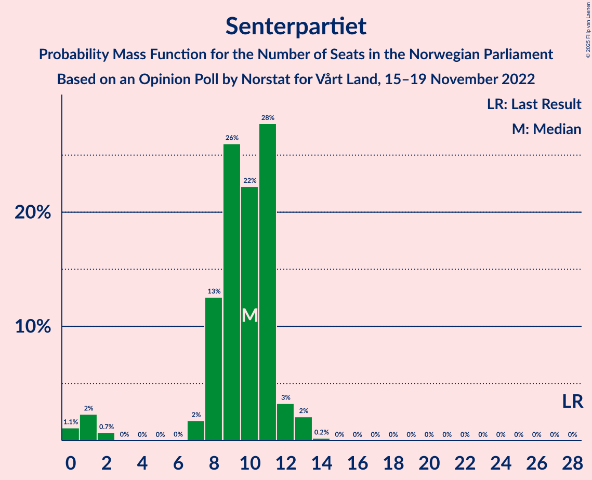

# Opinion Poll by Norstat for Vårt Land, 15–19 November 2022

<a href="#voting-intentions">Voting Intentions</a> | <a href="#seats">Seats</a> | <a href="#coalitions">Coalitions</a> | <a href="#technical-information">Technical Information</a>

## Voting Intentions

### Confidence Intervals

| Party | Last Result | Poll Result | 80% Confidence Interval | 90% Confidence Interval | 95% Confidence Interval | 99% Confidence Interval |
|:-----:|:-----------:|:-----------:|:-----------------------:|:-----------------------:|:-----------------------:|:-----------------------:|
| Høyre | 20.4% | 33.6% | 31.7–35.7% |31.2–36.2% |30.7–36.7% |29.8–37.7% |
| Arbeiderpartiet | 26.2% | 15.4% | 14.0–17.0% |13.6–17.5% |13.2–17.8% |12.6–18.6% |
| Fremskrittspartiet | 11.6% | 12.7% | 11.4–14.2% |11.0–14.6% |10.7–15.0% |10.1–15.7% |
| Sosialistisk Venstreparti | 7.6% | 9.2% | 8.1–10.5% |7.8–10.9% |7.5–11.2% |7.0–11.9% |
| Rødt | 4.7% | 6.3% | 5.4–7.4% |5.1–7.7% |4.9–8.0% |4.5–8.6% |
| Senterpartiet | 13.5% | 5.0% | 4.2–6.1% |4.0–6.4% |3.8–6.6% |3.5–7.1% |
| Venstre | 4.6% | 4.9% | 4.1–5.9% |3.9–6.2% |3.7–6.5% |3.4–7.0% |
| Miljøpartiet De Grønne | 3.9% | 3.2% | 2.6–4.1% |2.4–4.4% |2.3–4.6% |2.0–5.0% |
| Kristelig Folkeparti | 3.8% | 2.8% | 2.2–3.7% |2.1–3.9% |2.0–4.1% |1.7–4.5% |
| Industri- og Næringspartiet | 0.3% | 2.4% | 1.9–3.2% |1.7–3.4% |1.6–3.6% |1.4–4.0% |
| Pensjonistpartiet | 0.6% | 1.5% | 1.1–2.1% |1.0–2.3% |0.9–2.5% |0.7–2.8% |
| Norgesdemokratene | 1.1% | 1.0% | 0.7–1.6% |0.6–1.8% |0.6–1.9% |0.4–2.2% |

*Note:* The poll result column reflects the actual value used in the calculations. Published results may vary slightly, and in addition be rounded to fewer digits.

## Seats

### Confidence Intervals

| Party | Last Result | Median | 80% Confidence Interval | 90% Confidence Interval | 95% Confidence Interval | 99% Confidence Interval |
|:-----:|:-----------:|:------:|:-----------------------:|:-----------------------:|:-----------------------:|:-----------------------:|
| <a href="#høyre">Høyre</a> | 36 | 62 | 59–67 |57–70 |56–71 |54–71 |
| <a href="#arbeiderpartiet">Arbeiderpartiet</a> | 48 | 32 | 28–34 |27–34 |25–36 |23–36 |
| <a href="#fremskrittspartiet">Fremskrittspartiet</a> | 21 | 23 | 20–25 |20–28 |19–29 |18–31 |
| <a href="#sosialistisk-venstreparti">Sosialistisk Venstreparti</a> | 13 | 16 | 15–19 |15–21 |14–21 |12–22 |
| <a href="#rødt">Rødt</a> | 8 | 11 | 9–13 |9–14 |9–14 |8–15 |
| <a href="#senterpartiet">Senterpartiet</a> | 28 | 10 | 8–11 |7–12 |1–12 |0–13 |
| <a href="#venstre">Venstre</a> | 8 | 9 | 7–11 |3–11 |2–12 |2–13 |
| <a href="#miljøpartiet-de-grønne">Miljøpartiet De Grønne</a> | 3 | 2 | 1–3 |1–7 |1–8 |1–8 |
| <a href="#kristelig-folkeparti">Kristelig Folkeparti</a> | 3 | 2 | 0–3 |0–3 |0–3 |0–7 |
| <a href="#industri--og-næringspartiet">Industri- og Næringspartiet</a> | 0 | 1 | 0–2 |0–3 |0–3 |0–3 |
| <a href="#pensjonistpartiet">Pensjonistpartiet</a> | 0 | 0 | 0–1 |0–1 |0–1 |0–1 |
| <a href="#norgesdemokratene">Norgesdemokratene</a> | 0 | 0 | 0 |0 |0 |0 |

### Høyre

*For a full overview of the results for this party, see the [Høyre](party-høyre.html) page.*

| Number of Seats | Probability | Accumulated | Special Marks |
|:---------------:|:-----------:|:-----------:|:-------------:|
| 36 | 0% | 100% | Last Result |
| 37 | 0% | 100% |  |
| 38 | 0% | 100% |  |
| 39 | 0% | 100% |  |
| 40 | 0% | 100% |  |
| 41 | 0% | 100% |  |
| 42 | 0% | 100% |  |
| 43 | 0% | 100% |  |
| 44 | 0% | 100% |  |
| 45 | 0% | 100% |  |
| 46 | 0% | 100% |  |
| 47 | 0% | 100% |  |
| 48 | 0% | 100% |  |
| 49 | 0% | 100% |  |
| 50 | 0% | 100% |  |
| 51 | 0% | 100% |  |
| 52 | 0.1% | 100% |  |
| 53 | 0.1% | 99.9% |  |
| 54 | 0.6% | 99.7% |  |
| 55 | 0.6% | 99.2% |  |
| 56 | 3% | 98.6% |  |
| 57 | 2% | 95% |  |
| 58 | 3% | 93% |  |
| 59 | 7% | 91% |  |
| 60 | 8% | 84% |  |
| 61 | 6% | 76% |  |
| 62 | 25% | 69% | Median |
| 63 | 2% | 44% |  |
| 64 | 2% | 42% |  |
| 65 | 22% | 41% |  |
| 66 | 2% | 19% |  |
| 67 | 8% | 17% |  |
| 68 | 3% | 9% |  |
| 69 | 1.0% | 6% |  |
| 70 | 0.2% | 5% |  |
| 71 | 4% | 5% |  |
| 72 | 0.1% | 0.5% |  |
| 73 | 0.1% | 0.4% |  |
| 74 | 0.3% | 0.3% |  |
| 75 | 0% | 0% |  |

### Arbeiderpartiet

*For a full overview of the results for this party, see the [Arbeiderpartiet](party-arbeiderpartiet.html) page.*

| Number of Seats | Probability | Accumulated | Special Marks |
|:---------------:|:-----------:|:-----------:|:-------------:|
| 22 | 0.2% | 100% |  |
| 23 | 0.4% | 99.8% |  |
| 24 | 1.4% | 99.4% |  |
| 25 | 2% | 98% |  |
| 26 | 1.2% | 96% |  |
| 27 | 3% | 95% |  |
| 28 | 6% | 92% |  |
| 29 | 10% | 87% |  |
| 30 | 4% | 77% |  |
| 31 | 4% | 73% |  |
| 32 | 36% | 69% | Median |
| 33 | 20% | 33% |  |
| 34 | 9% | 13% |  |
| 35 | 1.3% | 4% |  |
| 36 | 3% | 3% |  |
| 37 | 0.2% | 0.3% |  |
| 38 | 0% | 0.1% |  |
| 39 | 0% | 0.1% |  |
| 40 | 0.1% | 0.1% |  |
| 41 | 0% | 0% |  |
| 42 | 0% | 0% |  |
| 43 | 0% | 0% |  |
| 44 | 0% | 0% |  |
| 45 | 0% | 0% |  |
| 46 | 0% | 0% |  |
| 47 | 0% | 0% |  |
| 48 | 0% | 0% | Last Result |

### Fremskrittspartiet

*For a full overview of the results for this party, see the [Fremskrittspartiet](party-fremskrittspartiet.html) page.*

| Number of Seats | Probability | Accumulated | Special Marks |
|:---------------:|:-----------:|:-----------:|:-------------:|
| 17 | 0.4% | 100% |  |
| 18 | 1.5% | 99.6% |  |
| 19 | 1.4% | 98% |  |
| 20 | 12% | 97% |  |
| 21 | 16% | 85% | Last Result |
| 22 | 12% | 69% |  |
| 23 | 28% | 58% | Median |
| 24 | 14% | 30% |  |
| 25 | 6% | 15% |  |
| 26 | 2% | 10% |  |
| 27 | 2% | 7% |  |
| 28 | 1.4% | 6% |  |
| 29 | 3% | 4% |  |
| 30 | 0.2% | 0.9% |  |
| 31 | 0.5% | 0.7% |  |
| 32 | 0.1% | 0.3% |  |
| 33 | 0.2% | 0.2% |  |
| 34 | 0% | 0% |  |

### Sosialistisk Venstreparti

*For a full overview of the results for this party, see the [Sosialistisk Venstreparti](party-sosialistiskvenstreparti.html) page.*

| Number of Seats | Probability | Accumulated | Special Marks |
|:---------------:|:-----------:|:-----------:|:-------------:|
| 11 | 0.1% | 100% |  |
| 12 | 0.4% | 99.9% |  |
| 13 | 0.8% | 99.5% | Last Result |
| 14 | 3% | 98.7% |  |
| 15 | 33% | 96% |  |
| 16 | 15% | 63% | Median |
| 17 | 24% | 48% |  |
| 18 | 10% | 24% |  |
| 19 | 4% | 14% |  |
| 20 | 5% | 10% |  |
| 21 | 5% | 5% |  |
| 22 | 0.2% | 0.6% |  |
| 23 | 0% | 0.4% |  |
| 24 | 0.4% | 0.4% |  |
| 25 | 0% | 0% |  |

### Rødt

*For a full overview of the results for this party, see the [Rødt](party-rødt.html) page.*

| Number of Seats | Probability | Accumulated | Special Marks |
|:---------------:|:-----------:|:-----------:|:-------------:|
| 1 | 0.1% | 100% |  |
| 2 | 0% | 99.9% |  |
| 3 | 0% | 99.9% |  |
| 4 | 0% | 99.9% |  |
| 5 | 0% | 99.9% |  |
| 6 | 0% | 99.9% |  |
| 7 | 0.1% | 99.9% |  |
| 8 | 1.2% | 99.7% | Last Result |
| 9 | 22% | 98.6% |  |
| 10 | 20% | 77% |  |
| 11 | 19% | 57% | Median |
| 12 | 13% | 38% |  |
| 13 | 18% | 25% |  |
| 14 | 5% | 7% |  |
| 15 | 2% | 2% |  |
| 16 | 0.2% | 0.3% |  |
| 17 | 0.1% | 0.1% |  |
| 18 | 0% | 0% |  |

### Senterpartiet

*For a full overview of the results for this party, see the [Senterpartiet](party-senterpartiet.html) page.*

| Number of Seats | Probability | Accumulated | Special Marks |
|:---------------:|:-----------:|:-----------:|:-------------:|
| 0 | 1.1% | 100% |  |
| 1 | 2% | 98.9% |  |
| 2 | 0.7% | 97% |  |
| 3 | 0% | 96% |  |
| 4 | 0% | 96% |  |
| 5 | 0% | 96% |  |
| 6 | 0% | 96% |  |
| 7 | 2% | 96% |  |
| 8 | 13% | 94% |  |
| 9 | 26% | 82% |  |
| 10 | 22% | 56% | Median |
| 11 | 28% | 33% |  |
| 12 | 3% | 6% |  |
| 13 | 2% | 2% |  |
| 14 | 0.2% | 0.2% |  |
| 15 | 0% | 0% |  |
| 16 | 0% | 0% |  |
| 17 | 0% | 0% |  |
| 18 | 0% | 0% |  |
| 19 | 0% | 0% |  |
| 20 | 0% | 0% |  |
| 21 | 0% | 0% |  |
| 22 | 0% | 0% |  |
| 23 | 0% | 0% |  |
| 24 | 0% | 0% |  |
| 25 | 0% | 0% |  |
| 26 | 0% | 0% |  |
| 27 | 0% | 0% |  |
| 28 | 0% | 0% | Last Result |

### Venstre

*For a full overview of the results for this party, see the [Venstre](party-venstre.html) page.*

| Number of Seats | Probability | Accumulated | Special Marks |
|:---------------:|:-----------:|:-----------:|:-------------:|
| 2 | 5% | 100% |  |
| 3 | 5% | 95% |  |
| 4 | 0% | 90% |  |
| 5 | 0% | 90% |  |
| 6 | 0% | 90% |  |
| 7 | 1.2% | 90% |  |
| 8 | 37% | 89% | Last Result |
| 9 | 18% | 51% | Median |
| 10 | 16% | 34% |  |
| 11 | 14% | 17% |  |
| 12 | 2% | 3% |  |
| 13 | 0.6% | 0.6% |  |
| 14 | 0.1% | 0.1% |  |
| 15 | 0% | 0% |  |

### Miljøpartiet De Grønne

*For a full overview of the results for this party, see the [Miljøpartiet De Grønne](party-miljøpartietdegrønne.html) page.*

| Number of Seats | Probability | Accumulated | Special Marks |
|:---------------:|:-----------:|:-----------:|:-------------:|
| 0 | 0.1% | 100% |  |
| 1 | 11% | 99.9% |  |
| 2 | 74% | 89% | Median |
| 3 | 9% | 15% | Last Result |
| 4 | 0% | 6% |  |
| 5 | 0% | 6% |  |
| 6 | 0.2% | 6% |  |
| 7 | 3% | 6% |  |
| 8 | 2% | 3% |  |
| 9 | 0.3% | 0.4% |  |
| 10 | 0.1% | 0.1% |  |
| 11 | 0% | 0% |  |

### Kristelig Folkeparti

*For a full overview of the results for this party, see the [Kristelig Folkeparti](party-kristeligfolkeparti.html) page.*

| Number of Seats | Probability | Accumulated | Special Marks |
|:---------------:|:-----------:|:-----------:|:-------------:|
| 0 | 21% | 100% |  |
| 1 | 6% | 79% |  |
| 2 | 57% | 73% | Median |
| 3 | 14% | 16% | Last Result |
| 4 | 0% | 1.3% |  |
| 5 | 0% | 1.3% |  |
| 6 | 0% | 1.3% |  |
| 7 | 0.8% | 1.2% |  |
| 8 | 0.3% | 0.4% |  |
| 9 | 0.1% | 0.1% |  |
| 10 | 0% | 0% |  |

### Industri- og Næringspartiet

*For a full overview of the results for this party, see the [Industri- og Næringspartiet](party-industri-ognæringspartiet.html) page.*

| Number of Seats | Probability | Accumulated | Special Marks |
|:---------------:|:-----------:|:-----------:|:-------------:|
| 0 | 43% | 100% | Last Result |
| 1 | 18% | 57% | Median |
| 2 | 33% | 39% |  |
| 3 | 6% | 6% |  |
| 4 | 0% | 0.1% |  |
| 5 | 0% | 0.1% |  |
| 6 | 0% | 0.1% |  |
| 7 | 0.1% | 0.1% |  |
| 8 | 0.1% | 0.1% |  |
| 9 | 0% | 0% |  |

### Pensjonistpartiet

*For a full overview of the results for this party, see the [Pensjonistpartiet](party-pensjonistpartiet.html) page.*

| Number of Seats | Probability | Accumulated | Special Marks |
|:---------------:|:-----------:|:-----------:|:-------------:|
| 0 | 83% | 100% | Last Result, Median |
| 1 | 17% | 17% |  |
| 2 | 0% | 0% |  |

### Norgesdemokratene

*For a full overview of the results for this party, see the [Norgesdemokratene](party-norgesdemokratene.html) page.*

| Number of Seats | Probability | Accumulated | Special Marks |
|:---------------:|:-----------:|:-----------:|:-------------:|
| 0 | 100% | 100% | Last Result, Median |

## Coalitions

### Confidence Intervals

| Coalition | Last Result | Median | Majority? | 80% Confidence Interval | 90% Confidence Interval | 95% Confidence Interval | 99% Confidence Interval |
|:---------:|:-----------:|:------:|:---------:|:-----------------------:|:-----------------------:|:-----------------------:|:-----------------------:|
| Høyre – Fremskrittspartiet – Senterpartiet – Venstre – Kristelig Folkeparti | 96 | 106 | 100% | 102–111 | 99–111 | 97–112 | 96–115 |
| Høyre – Fremskrittspartiet – Venstre – Miljøpartiet De Grønne – Kristelig Folkeparti | 71 | 97 | 100% | 95–103 | 94–104 | 93–107 | 90–110 |
| Høyre – Fremskrittspartiet – Venstre – Kristelig Folkeparti | 68 | 95 | 99.9% | 92–101 | 91–102 | 89–104 | 87–107 |
| Høyre – Fremskrittspartiet – Venstre | 65 | 94 | 99.4% | 89–99 | 88–100 | 86–103 | 84–105 |
| Høyre – Fremskrittspartiet | 57 | 86 | 71% | 82–91 | 79–91 | 79–93 | 77–97 |
| Høyre – Venstre – Kristelig Folkeparti | 47 | 73 | 0.1% | 67–78 | 66–81 | 65–82 | 63–82 |
| Arbeiderpartiet – Sosialistisk Venstreparti – Rødt – Senterpartiet – Miljøpartiet De Grønne | 100 | 71 | 0% | 67–75 | 64–76 | 62–77 | 60–79 |
| Arbeiderpartiet – Sosialistisk Venstreparti – Rødt – Senterpartiet | 97 | 69 | 0% | 64–73 | 62–73 | 60–74 | 58–76 |
| Arbeiderpartiet – Sosialistisk Venstreparti – Rødt – Miljøpartiet De Grønne | 72 | 61 | 0% | 57–66 | 56–67 | 56–69 | 53–71 |
| Arbeiderpartiet – Sosialistisk Venstreparti – Senterpartiet – Miljøpartiet De Grønne – Kristelig Folkeparti | 95 | 62 | 0% | 57–66 | 55–69 | 53–69 | 51–70 |
| Arbeiderpartiet – Sosialistisk Venstreparti – Senterpartiet – Miljøpartiet De Grønne | 92 | 60 | 0% | 55–63 | 53–66 | 51–66 | 49–68 |
| Arbeiderpartiet – Sosialistisk Venstreparti – Senterpartiet | 89 | 58 | 0% | 53–61 | 51–62 | 49–63 | 47–63 |
| Arbeiderpartiet – Sosialistisk Venstreparti | 61 | 48 | 0% | 44–52 | 43–53 | 42–53 | 39–55 |
| Arbeiderpartiet – Senterpartiet – Miljøpartiet De Grønne – Kristelig Folkeparti | 82 | 45 | 0% | 40–49 | 38–50 | 37–52 | 34–54 |
| Arbeiderpartiet – Senterpartiet – Kristelig Folkeparti | 79 | 43 | 0% | 38–47 | 36–47 | 34–47 | 32–50 |
| Arbeiderpartiet – Senterpartiet | 76 | 42 | 0% | 36–44 | 34–45 | 32–45 | 31–46 |
| Senterpartiet – Venstre – Kristelig Folkeparti | 39 | 20 | 0% | 16–24 | 14–24 | 13–25 | 9–27 |

### Høyre – Fremskrittspartiet – Senterpartiet – Venstre – Kristelig Folkeparti

| Number of Seats | Probability | Accumulated | Special Marks |
|:---------------:|:-----------:|:-----------:|:-------------:|
| 93 | 0.1% | 100% |  |
| 94 | 0.1% | 99.9% |  |
| 95 | 0.1% | 99.8% |  |
| 96 | 2% | 99.7% | Last Result |
| 97 | 0.9% | 98% |  |
| 98 | 0.9% | 97% |  |
| 99 | 1.3% | 96% |  |
| 100 | 3% | 95% |  |
| 101 | 1.2% | 92% |  |
| 102 | 9% | 91% |  |
| 103 | 14% | 81% |  |
| 104 | 4% | 67% |  |
| 105 | 4% | 63% |  |
| 106 | 30% | 59% | Median |
| 107 | 8% | 30% |  |
| 108 | 3% | 21% |  |
| 109 | 1.4% | 19% |  |
| 110 | 5% | 17% |  |
| 111 | 10% | 12% |  |
| 112 | 0.7% | 3% |  |
| 113 | 0.2% | 2% |  |
| 114 | 0.8% | 2% |  |
| 115 | 0.9% | 1.0% |  |
| 116 | 0% | 0.1% |  |
| 117 | 0% | 0% |  |

### Høyre – Fremskrittspartiet – Venstre – Miljøpartiet De Grønne – Kristelig Folkeparti

| Number of Seats | Probability | Accumulated | Special Marks |
|:---------------:|:-----------:|:-----------:|:-------------:|
| 71 | 0% | 100% | Last Result |
| 72 | 0% | 100% |  |
| 73 | 0% | 100% |  |
| 74 | 0% | 100% |  |
| 75 | 0% | 100% |  |
| 76 | 0% | 100% |  |
| 77 | 0% | 100% |  |
| 78 | 0% | 100% |  |
| 79 | 0% | 100% |  |
| 80 | 0% | 100% |  |
| 81 | 0% | 100% |  |
| 82 | 0% | 100% |  |
| 83 | 0% | 100% |  |
| 84 | 0% | 100% |  |
| 85 | 0% | 100% | Majority |
| 86 | 0% | 100% |  |
| 87 | 0% | 100% |  |
| 88 | 0% | 100% |  |
| 89 | 0.4% | 99.9% |  |
| 90 | 0.4% | 99.6% |  |
| 91 | 0.1% | 99.2% |  |
| 92 | 1.0% | 99.1% |  |
| 93 | 3% | 98% |  |
| 94 | 2% | 95% |  |
| 95 | 12% | 93% |  |
| 96 | 14% | 81% |  |
| 97 | 27% | 67% |  |
| 98 | 4% | 40% | Median |
| 99 | 4% | 36% |  |
| 100 | 10% | 32% |  |
| 101 | 2% | 23% |  |
| 102 | 1.2% | 21% |  |
| 103 | 10% | 20% |  |
| 104 | 5% | 9% |  |
| 105 | 0.9% | 4% |  |
| 106 | 0.7% | 4% |  |
| 107 | 0.3% | 3% |  |
| 108 | 0.6% | 2% |  |
| 109 | 0.9% | 2% |  |
| 110 | 0.9% | 1.0% |  |
| 111 | 0% | 0.1% |  |
| 112 | 0% | 0% |  |

### Høyre – Fremskrittspartiet – Venstre – Kristelig Folkeparti

| Number of Seats | Probability | Accumulated | Special Marks |
|:---------------:|:-----------:|:-----------:|:-------------:|
| 68 | 0% | 100% | Last Result |
| 69 | 0% | 100% |  |
| 70 | 0% | 100% |  |
| 71 | 0% | 100% |  |
| 72 | 0% | 100% |  |
| 73 | 0% | 100% |  |
| 74 | 0% | 100% |  |
| 75 | 0% | 100% |  |
| 76 | 0% | 100% |  |
| 77 | 0% | 100% |  |
| 78 | 0% | 100% |  |
| 79 | 0% | 100% |  |
| 80 | 0% | 100% |  |
| 81 | 0% | 100% |  |
| 82 | 0% | 100% |  |
| 83 | 0% | 100% |  |
| 84 | 0.1% | 100% |  |
| 85 | 0% | 99.9% | Majority |
| 86 | 0.2% | 99.8% |  |
| 87 | 1.3% | 99.7% |  |
| 88 | 0.5% | 98% |  |
| 89 | 1.0% | 98% |  |
| 90 | 2% | 97% |  |
| 91 | 1.5% | 95% |  |
| 92 | 7% | 94% |  |
| 93 | 4% | 87% |  |
| 94 | 17% | 83% |  |
| 95 | 28% | 66% |  |
| 96 | 6% | 38% | Median |
| 97 | 0.8% | 32% |  |
| 98 | 10% | 31% |  |
| 99 | 1.5% | 21% |  |
| 100 | 1.4% | 20% |  |
| 101 | 10% | 18% |  |
| 102 | 4% | 9% |  |
| 103 | 0.9% | 4% |  |
| 104 | 0.9% | 3% |  |
| 105 | 0.1% | 2% |  |
| 106 | 0.4% | 2% |  |
| 107 | 2% | 2% |  |
| 108 | 0% | 0.1% |  |
| 109 | 0% | 0.1% |  |
| 110 | 0% | 0% |  |

### Høyre – Fremskrittspartiet – Venstre

| Number of Seats | Probability | Accumulated | Special Marks |
|:---------------:|:-----------:|:-----------:|:-------------:|
| 65 | 0% | 100% | Last Result |
| 66 | 0% | 100% |  |
| 67 | 0% | 100% |  |
| 68 | 0% | 100% |  |
| 69 | 0% | 100% |  |
| 70 | 0% | 100% |  |
| 71 | 0% | 100% |  |
| 72 | 0% | 100% |  |
| 73 | 0% | 100% |  |
| 74 | 0% | 100% |  |
| 75 | 0% | 100% |  |
| 76 | 0% | 100% |  |
| 77 | 0% | 100% |  |
| 78 | 0% | 100% |  |
| 79 | 0% | 100% |  |
| 80 | 0% | 100% |  |
| 81 | 0% | 100% |  |
| 82 | 0.1% | 100% |  |
| 83 | 0% | 99.9% |  |
| 84 | 0.5% | 99.9% |  |
| 85 | 0.2% | 99.4% | Majority |
| 86 | 2% | 99.2% |  |
| 87 | 2% | 97% |  |
| 88 | 0.6% | 95% |  |
| 89 | 6% | 95% |  |
| 90 | 4% | 88% |  |
| 91 | 2% | 85% |  |
| 92 | 3% | 83% |  |
| 93 | 28% | 80% |  |
| 94 | 19% | 53% | Median |
| 95 | 2% | 34% |  |
| 96 | 10% | 32% |  |
| 97 | 2% | 22% |  |
| 98 | 1.2% | 20% |  |
| 99 | 10% | 19% |  |
| 100 | 5% | 9% |  |
| 101 | 0.9% | 4% |  |
| 102 | 0.8% | 3% |  |
| 103 | 0.4% | 3% |  |
| 104 | 0.1% | 2% |  |
| 105 | 2% | 2% |  |
| 106 | 0.3% | 0.4% |  |
| 107 | 0% | 0.1% |  |
| 108 | 0% | 0% |  |

### Høyre – Fremskrittspartiet

| Number of Seats | Probability | Accumulated | Special Marks |
|:---------------:|:-----------:|:-----------:|:-------------:|
| 57 | 0% | 100% | Last Result |
| 58 | 0% | 100% |  |
| 59 | 0% | 100% |  |
| 60 | 0% | 100% |  |
| 61 | 0% | 100% |  |
| 62 | 0% | 100% |  |
| 63 | 0% | 100% |  |
| 64 | 0% | 100% |  |
| 65 | 0% | 100% |  |
| 66 | 0% | 100% |  |
| 67 | 0% | 100% |  |
| 68 | 0% | 100% |  |
| 69 | 0% | 100% |  |
| 70 | 0% | 100% |  |
| 71 | 0% | 100% |  |
| 72 | 0% | 100% |  |
| 73 | 0% | 100% |  |
| 74 | 0% | 100% |  |
| 75 | 0.1% | 99.9% |  |
| 76 | 0.2% | 99.9% |  |
| 77 | 0.4% | 99.7% |  |
| 78 | 1.5% | 99.3% |  |
| 79 | 3% | 98% |  |
| 80 | 2% | 95% |  |
| 81 | 2% | 93% |  |
| 82 | 9% | 91% |  |
| 83 | 6% | 82% |  |
| 84 | 5% | 76% |  |
| 85 | 21% | 71% | Median, Majority |
| 86 | 15% | 50% |  |
| 87 | 11% | 35% |  |
| 88 | 1.4% | 24% |  |
| 89 | 10% | 23% |  |
| 90 | 1.5% | 13% |  |
| 91 | 7% | 11% |  |
| 92 | 1.0% | 4% |  |
| 93 | 1.3% | 4% |  |
| 94 | 0.6% | 2% |  |
| 95 | 1.0% | 2% |  |
| 96 | 0% | 0.6% |  |
| 97 | 0.2% | 0.6% |  |
| 98 | 0% | 0.4% |  |
| 99 | 0.3% | 0.3% |  |
| 100 | 0% | 0% |  |

### Høyre – Venstre – Kristelig Folkeparti

| Number of Seats | Probability | Accumulated | Special Marks |
|:---------------:|:-----------:|:-----------:|:-------------:|
| 47 | 0% | 100% | Last Result |
| 48 | 0% | 100% |  |
| 49 | 0% | 100% |  |
| 50 | 0% | 100% |  |
| 51 | 0% | 100% |  |
| 52 | 0% | 100% |  |
| 53 | 0% | 100% |  |
| 54 | 0% | 100% |  |
| 55 | 0% | 100% |  |
| 56 | 0% | 100% |  |
| 57 | 0% | 100% |  |
| 58 | 0% | 100% |  |
| 59 | 0% | 100% |  |
| 60 | 0% | 100% |  |
| 61 | 0% | 100% |  |
| 62 | 0% | 100% |  |
| 63 | 0.6% | 99.9% |  |
| 64 | 0.2% | 99.3% |  |
| 65 | 2% | 99.1% |  |
| 66 | 3% | 97% |  |
| 67 | 4% | 93% |  |
| 68 | 2% | 89% |  |
| 69 | 1.4% | 87% |  |
| 70 | 3% | 86% |  |
| 71 | 5% | 83% |  |
| 72 | 27% | 79% |  |
| 73 | 19% | 51% | Median |
| 74 | 4% | 32% |  |
| 75 | 3% | 29% |  |
| 76 | 0.7% | 26% |  |
| 77 | 10% | 25% |  |
| 78 | 8% | 16% |  |
| 79 | 2% | 8% |  |
| 80 | 0.6% | 6% |  |
| 81 | 0.7% | 5% |  |
| 82 | 5% | 5% |  |
| 83 | 0.1% | 0.2% |  |
| 84 | 0% | 0.1% |  |
| 85 | 0% | 0.1% | Majority |
| 86 | 0% | 0% |  |

### Arbeiderpartiet – Sosialistisk Venstreparti – Rødt – Senterpartiet – Miljøpartiet De Grønne

| Number of Seats | Probability | Accumulated | Special Marks |
|:---------------:|:-----------:|:-----------:|:-------------:|
| 58 | 0.1% | 100% |  |
| 59 | 0% | 99.9% |  |
| 60 | 0.5% | 99.9% |  |
| 61 | 2% | 99.4% |  |
| 62 | 0.9% | 98% |  |
| 63 | 0.3% | 97% |  |
| 64 | 4% | 97% |  |
| 65 | 0.9% | 92% |  |
| 66 | 1.0% | 91% |  |
| 67 | 11% | 90% |  |
| 68 | 3% | 80% |  |
| 69 | 1.4% | 76% |  |
| 70 | 11% | 75% |  |
| 71 | 21% | 64% | Median |
| 72 | 14% | 43% |  |
| 73 | 12% | 30% |  |
| 74 | 4% | 17% |  |
| 75 | 4% | 14% |  |
| 76 | 6% | 10% |  |
| 77 | 2% | 4% |  |
| 78 | 1.1% | 2% |  |
| 79 | 0.5% | 0.8% |  |
| 80 | 0.1% | 0.3% |  |
| 81 | 0.1% | 0.2% |  |
| 82 | 0.1% | 0.1% |  |
| 83 | 0% | 0.1% |  |
| 84 | 0% | 0% |  |
| 85 | 0% | 0% | Majority |
| 86 | 0% | 0% |  |
| 87 | 0% | 0% |  |
| 88 | 0% | 0% |  |
| 89 | 0% | 0% |  |
| 90 | 0% | 0% |  |
| 91 | 0% | 0% |  |
| 92 | 0% | 0% |  |
| 93 | 0% | 0% |  |
| 94 | 0% | 0% |  |
| 95 | 0% | 0% |  |
| 96 | 0% | 0% |  |
| 97 | 0% | 0% |  |
| 98 | 0% | 0% |  |
| 99 | 0% | 0% |  |
| 100 | 0% | 0% | Last Result |

### Arbeiderpartiet – Sosialistisk Venstreparti – Rødt – Senterpartiet

| Number of Seats | Probability | Accumulated | Special Marks |
|:---------------:|:-----------:|:-----------:|:-------------:|
| 56 | 0.1% | 100% |  |
| 57 | 0% | 99.9% |  |
| 58 | 1.4% | 99.9% |  |
| 59 | 0.8% | 98% |  |
| 60 | 0.7% | 98% |  |
| 61 | 1.0% | 97% |  |
| 62 | 4% | 96% |  |
| 63 | 0.6% | 92% |  |
| 64 | 1.2% | 91% |  |
| 65 | 12% | 90% |  |
| 66 | 4% | 78% |  |
| 67 | 1.2% | 75% |  |
| 68 | 11% | 73% |  |
| 69 | 23% | 63% | Median |
| 70 | 14% | 40% |  |
| 71 | 8% | 26% |  |
| 72 | 8% | 18% |  |
| 73 | 7% | 10% |  |
| 74 | 2% | 3% |  |
| 75 | 1.2% | 2% |  |
| 76 | 0.1% | 0.6% |  |
| 77 | 0.4% | 0.4% |  |
| 78 | 0% | 0% |  |
| 79 | 0% | 0% |  |
| 80 | 0% | 0% |  |
| 81 | 0% | 0% |  |
| 82 | 0% | 0% |  |
| 83 | 0% | 0% |  |
| 84 | 0% | 0% |  |
| 85 | 0% | 0% | Majority |
| 86 | 0% | 0% |  |
| 87 | 0% | 0% |  |
| 88 | 0% | 0% |  |
| 89 | 0% | 0% |  |
| 90 | 0% | 0% |  |
| 91 | 0% | 0% |  |
| 92 | 0% | 0% |  |
| 93 | 0% | 0% |  |
| 94 | 0% | 0% |  |
| 95 | 0% | 0% |  |
| 96 | 0% | 0% |  |
| 97 | 0% | 0% | Last Result |

### Arbeiderpartiet – Sosialistisk Venstreparti – Rødt – Miljøpartiet De Grønne

| Number of Seats | Probability | Accumulated | Special Marks |
|:---------------:|:-----------:|:-----------:|:-------------:|
| 50 | 0% | 100% |  |
| 51 | 0% | 99.9% |  |
| 52 | 0.3% | 99.9% |  |
| 53 | 0.9% | 99.6% |  |
| 54 | 0.6% | 98.7% |  |
| 55 | 0.5% | 98% |  |
| 56 | 5% | 98% |  |
| 57 | 10% | 93% |  |
| 58 | 2% | 83% |  |
| 59 | 4% | 81% |  |
| 60 | 22% | 77% |  |
| 61 | 8% | 55% | Median |
| 62 | 9% | 46% |  |
| 63 | 15% | 37% |  |
| 64 | 4% | 22% |  |
| 65 | 7% | 18% |  |
| 66 | 6% | 11% |  |
| 67 | 1.2% | 6% |  |
| 68 | 0.9% | 5% |  |
| 69 | 2% | 4% |  |
| 70 | 0.4% | 1.2% |  |
| 71 | 0.4% | 0.8% |  |
| 72 | 0.4% | 0.4% | Last Result |
| 73 | 0.1% | 0.1% |  |
| 74 | 0% | 0% |  |

### Arbeiderpartiet – Sosialistisk Venstreparti – Senterpartiet – Miljøpartiet De Grønne – Kristelig Folkeparti

| Number of Seats | Probability | Accumulated | Special Marks |
|:---------------:|:-----------:|:-----------:|:-------------:|
| 47 | 0% | 100% |  |
| 48 | 0.3% | 99.9% |  |
| 49 | 0% | 99.7% |  |
| 50 | 0% | 99.6% |  |
| 51 | 0.7% | 99.6% |  |
| 52 | 1.3% | 98.9% |  |
| 53 | 0.9% | 98% |  |
| 54 | 0.4% | 97% |  |
| 55 | 4% | 96% |  |
| 56 | 1.4% | 92% |  |
| 57 | 2% | 91% |  |
| 58 | 2% | 89% |  |
| 59 | 23% | 86% |  |
| 60 | 8% | 63% |  |
| 61 | 4% | 55% |  |
| 62 | 5% | 51% | Median |
| 63 | 2% | 46% |  |
| 64 | 30% | 44% |  |
| 65 | 4% | 14% |  |
| 66 | 1.3% | 10% |  |
| 67 | 2% | 9% |  |
| 68 | 0.8% | 7% |  |
| 69 | 6% | 6% |  |
| 70 | 0.3% | 0.7% |  |
| 71 | 0.2% | 0.4% |  |
| 72 | 0.1% | 0.2% |  |
| 73 | 0% | 0.1% |  |
| 74 | 0% | 0% |  |
| 75 | 0% | 0% |  |
| 76 | 0% | 0% |  |
| 77 | 0% | 0% |  |
| 78 | 0% | 0% |  |
| 79 | 0% | 0% |  |
| 80 | 0% | 0% |  |
| 81 | 0% | 0% |  |
| 82 | 0% | 0% |  |
| 83 | 0% | 0% |  |
| 84 | 0% | 0% |  |
| 85 | 0% | 0% | Majority |
| 86 | 0% | 0% |  |
| 87 | 0% | 0% |  |
| 88 | 0% | 0% |  |
| 89 | 0% | 0% |  |
| 90 | 0% | 0% |  |
| 91 | 0% | 0% |  |
| 92 | 0% | 0% |  |
| 93 | 0% | 0% |  |
| 94 | 0% | 0% |  |
| 95 | 0% | 0% | Last Result |

### Arbeiderpartiet – Sosialistisk Venstreparti – Senterpartiet – Miljøpartiet De Grønne

| Number of Seats | Probability | Accumulated | Special Marks |
|:---------------:|:-----------:|:-----------:|:-------------:|
| 47 | 0% | 100% |  |
| 48 | 0.3% | 99.9% |  |
| 49 | 0.7% | 99.6% |  |
| 50 | 1.3% | 98.9% |  |
| 51 | 0.5% | 98% |  |
| 52 | 0.4% | 97% |  |
| 53 | 4% | 97% |  |
| 54 | 0.9% | 92% |  |
| 55 | 2% | 91% |  |
| 56 | 3% | 90% |  |
| 57 | 12% | 87% |  |
| 58 | 9% | 75% |  |
| 59 | 13% | 66% |  |
| 60 | 4% | 53% | Median |
| 61 | 5% | 49% |  |
| 62 | 31% | 44% |  |
| 63 | 4% | 13% |  |
| 64 | 2% | 9% |  |
| 65 | 0.3% | 7% |  |
| 66 | 5% | 7% |  |
| 67 | 0.1% | 2% |  |
| 68 | 1.1% | 1.4% |  |
| 69 | 0.1% | 0.3% |  |
| 70 | 0.1% | 0.1% |  |
| 71 | 0% | 0.1% |  |
| 72 | 0% | 0% |  |
| 73 | 0% | 0% |  |
| 74 | 0% | 0% |  |
| 75 | 0% | 0% |  |
| 76 | 0% | 0% |  |
| 77 | 0% | 0% |  |
| 78 | 0% | 0% |  |
| 79 | 0% | 0% |  |
| 80 | 0% | 0% |  |
| 81 | 0% | 0% |  |
| 82 | 0% | 0% |  |
| 83 | 0% | 0% |  |
| 84 | 0% | 0% |  |
| 85 | 0% | 0% | Majority |
| 86 | 0% | 0% |  |
| 87 | 0% | 0% |  |
| 88 | 0% | 0% |  |
| 89 | 0% | 0% |  |
| 90 | 0% | 0% |  |
| 91 | 0% | 0% |  |
| 92 | 0% | 0% | Last Result |

### Arbeiderpartiet – Sosialistisk Venstreparti – Senterpartiet

| Number of Seats | Probability | Accumulated | Special Marks |
|:---------------:|:-----------:|:-----------:|:-------------:|
| 45 | 0% | 100% |  |
| 46 | 0.4% | 99.9% |  |
| 47 | 2% | 99.6% |  |
| 48 | 0.4% | 98% |  |
| 49 | 0.4% | 98% |  |
| 50 | 1.2% | 97% |  |
| 51 | 4% | 96% |  |
| 52 | 1.1% | 92% |  |
| 53 | 1.5% | 90% |  |
| 54 | 4% | 89% |  |
| 55 | 11% | 85% |  |
| 56 | 9% | 74% |  |
| 57 | 14% | 65% |  |
| 58 | 3% | 51% | Median |
| 59 | 5% | 48% |  |
| 60 | 29% | 43% |  |
| 61 | 7% | 13% |  |
| 62 | 2% | 6% |  |
| 63 | 3% | 4% |  |
| 64 | 0.3% | 0.4% |  |
| 65 | 0% | 0.2% |  |
| 66 | 0.1% | 0.1% |  |
| 67 | 0% | 0% |  |
| 68 | 0% | 0% |  |
| 69 | 0% | 0% |  |
| 70 | 0% | 0% |  |
| 71 | 0% | 0% |  |
| 72 | 0% | 0% |  |
| 73 | 0% | 0% |  |
| 74 | 0% | 0% |  |
| 75 | 0% | 0% |  |
| 76 | 0% | 0% |  |
| 77 | 0% | 0% |  |
| 78 | 0% | 0% |  |
| 79 | 0% | 0% |  |
| 80 | 0% | 0% |  |
| 81 | 0% | 0% |  |
| 82 | 0% | 0% |  |
| 83 | 0% | 0% |  |
| 84 | 0% | 0% |  |
| 85 | 0% | 0% | Majority |
| 86 | 0% | 0% |  |
| 87 | 0% | 0% |  |
| 88 | 0% | 0% |  |
| 89 | 0% | 0% | Last Result |

### Arbeiderpartiet – Sosialistisk Venstreparti

| Number of Seats | Probability | Accumulated | Special Marks |
|:---------------:|:-----------:|:-----------:|:-------------:|
| 39 | 0.9% | 100% |  |
| 40 | 0.5% | 99.0% |  |
| 41 | 0.3% | 98.5% |  |
| 42 | 1.2% | 98% |  |
| 43 | 5% | 97% |  |
| 44 | 2% | 92% |  |
| 45 | 12% | 90% |  |
| 46 | 5% | 77% |  |
| 47 | 9% | 72% |  |
| 48 | 14% | 64% | Median |
| 49 | 26% | 49% |  |
| 50 | 6% | 23% |  |
| 51 | 4% | 17% |  |
| 52 | 4% | 13% |  |
| 53 | 8% | 9% |  |
| 54 | 0.4% | 1.0% |  |
| 55 | 0.2% | 0.6% |  |
| 56 | 0.3% | 0.4% |  |
| 57 | 0% | 0% |  |
| 58 | 0% | 0% |  |
| 59 | 0% | 0% |  |
| 60 | 0% | 0% |  |
| 61 | 0% | 0% | Last Result |

### Arbeiderpartiet – Senterpartiet – Miljøpartiet De Grønne – Kristelig Folkeparti

| Number of Seats | Probability | Accumulated | Special Marks |
|:---------------:|:-----------:|:-----------:|:-------------:|
| 32 | 0.1% | 100% |  |
| 33 | 0.3% | 99.9% |  |
| 34 | 0.2% | 99.6% |  |
| 35 | 0.8% | 99.4% |  |
| 36 | 0.9% | 98.6% |  |
| 37 | 2% | 98% |  |
| 38 | 1.1% | 96% |  |
| 39 | 1.4% | 95% |  |
| 40 | 6% | 93% |  |
| 41 | 1.5% | 87% |  |
| 42 | 4% | 85% |  |
| 43 | 13% | 81% |  |
| 44 | 14% | 68% |  |
| 45 | 8% | 54% |  |
| 46 | 5% | 46% | Median |
| 47 | 23% | 41% |  |
| 48 | 5% | 18% |  |
| 49 | 8% | 14% |  |
| 50 | 1.3% | 6% |  |
| 51 | 1.5% | 5% |  |
| 52 | 1.1% | 3% |  |
| 53 | 0.2% | 2% |  |
| 54 | 2% | 2% |  |
| 55 | 0.1% | 0.2% |  |
| 56 | 0% | 0.1% |  |
| 57 | 0% | 0.1% |  |
| 58 | 0.1% | 0.1% |  |
| 59 | 0% | 0% |  |
| 60 | 0% | 0% |  |
| 61 | 0% | 0% |  |
| 62 | 0% | 0% |  |
| 63 | 0% | 0% |  |
| 64 | 0% | 0% |  |
| 65 | 0% | 0% |  |
| 66 | 0% | 0% |  |
| 67 | 0% | 0% |  |
| 68 | 0% | 0% |  |
| 69 | 0% | 0% |  |
| 70 | 0% | 0% |  |
| 71 | 0% | 0% |  |
| 72 | 0% | 0% |  |
| 73 | 0% | 0% |  |
| 74 | 0% | 0% |  |
| 75 | 0% | 0% |  |
| 76 | 0% | 0% |  |
| 77 | 0% | 0% |  |
| 78 | 0% | 0% |  |
| 79 | 0% | 0% |  |
| 80 | 0% | 0% |  |
| 81 | 0% | 0% |  |
| 82 | 0% | 0% | Last Result |

### Arbeiderpartiet – Senterpartiet – Kristelig Folkeparti

| Number of Seats | Probability | Accumulated | Special Marks |
|:---------------:|:-----------:|:-----------:|:-------------:|
| 30 | 0.1% | 100% |  |
| 31 | 0.4% | 99.9% |  |
| 32 | 0.2% | 99.5% |  |
| 33 | 0.3% | 99.3% |  |
| 34 | 2% | 99.0% |  |
| 35 | 1.0% | 97% |  |
| 36 | 1.5% | 96% |  |
| 37 | 2% | 94% |  |
| 38 | 6% | 92% |  |
| 39 | 1.0% | 86% |  |
| 40 | 2% | 85% |  |
| 41 | 16% | 83% |  |
| 42 | 14% | 67% |  |
| 43 | 11% | 53% |  |
| 44 | 3% | 42% | Median |
| 45 | 25% | 39% |  |
| 46 | 2% | 14% |  |
| 47 | 10% | 12% |  |
| 48 | 0.7% | 2% |  |
| 49 | 1.1% | 2% |  |
| 50 | 0.3% | 0.6% |  |
| 51 | 0.3% | 0.3% |  |
| 52 | 0% | 0% |  |
| 53 | 0% | 0% |  |
| 54 | 0% | 0% |  |
| 55 | 0% | 0% |  |
| 56 | 0% | 0% |  |
| 57 | 0% | 0% |  |
| 58 | 0% | 0% |  |
| 59 | 0% | 0% |  |
| 60 | 0% | 0% |  |
| 61 | 0% | 0% |  |
| 62 | 0% | 0% |  |
| 63 | 0% | 0% |  |
| 64 | 0% | 0% |  |
| 65 | 0% | 0% |  |
| 66 | 0% | 0% |  |
| 67 | 0% | 0% |  |
| 68 | 0% | 0% |  |
| 69 | 0% | 0% |  |
| 70 | 0% | 0% |  |
| 71 | 0% | 0% |  |
| 72 | 0% | 0% |  |
| 73 | 0% | 0% |  |
| 74 | 0% | 0% |  |
| 75 | 0% | 0% |  |
| 76 | 0% | 0% |  |
| 77 | 0% | 0% |  |
| 78 | 0% | 0% |  |
| 79 | 0% | 0% | Last Result |

### Arbeiderpartiet – Senterpartiet

| Number of Seats | Probability | Accumulated | Special Marks |
|:---------------:|:-----------:|:-----------:|:-------------:|
| 28 | 0% | 100% |  |
| 29 | 0.1% | 99.9% |  |
| 30 | 0.2% | 99.9% |  |
| 31 | 0.6% | 99.6% |  |
| 32 | 2% | 99.1% |  |
| 33 | 2% | 97% |  |
| 34 | 0.6% | 95% |  |
| 35 | 3% | 95% |  |
| 36 | 5% | 92% |  |
| 37 | 2% | 87% |  |
| 38 | 1.1% | 85% |  |
| 39 | 12% | 84% |  |
| 40 | 5% | 72% |  |
| 41 | 13% | 67% |  |
| 42 | 20% | 55% | Median |
| 43 | 22% | 35% |  |
| 44 | 3% | 13% |  |
| 45 | 8% | 10% |  |
| 46 | 1.2% | 1.4% |  |
| 47 | 0.1% | 0.2% |  |
| 48 | 0% | 0.1% |  |
| 49 | 0.1% | 0.1% |  |
| 50 | 0% | 0% |  |
| 51 | 0% | 0% |  |
| 52 | 0% | 0% |  |
| 53 | 0% | 0% |  |
| 54 | 0% | 0% |  |
| 55 | 0% | 0% |  |
| 56 | 0% | 0% |  |
| 57 | 0% | 0% |  |
| 58 | 0% | 0% |  |
| 59 | 0% | 0% |  |
| 60 | 0% | 0% |  |
| 61 | 0% | 0% |  |
| 62 | 0% | 0% |  |
| 63 | 0% | 0% |  |
| 64 | 0% | 0% |  |
| 65 | 0% | 0% |  |
| 66 | 0% | 0% |  |
| 67 | 0% | 0% |  |
| 68 | 0% | 0% |  |
| 69 | 0% | 0% |  |
| 70 | 0% | 0% |  |
| 71 | 0% | 0% |  |
| 72 | 0% | 0% |  |
| 73 | 0% | 0% |  |
| 74 | 0% | 0% |  |
| 75 | 0% | 0% |  |
| 76 | 0% | 0% | Last Result |

### Senterpartiet – Venstre – Kristelig Folkeparti

| Number of Seats | Probability | Accumulated | Special Marks |
|:---------------:|:-----------:|:-----------:|:-------------:|
| 5 | 0.4% | 100% |  |
| 6 | 0% | 99.6% |  |
| 7 | 0% | 99.6% |  |
| 8 | 0% | 99.6% |  |
| 9 | 0.1% | 99.6% |  |
| 10 | 0.3% | 99.5% |  |
| 11 | 0.4% | 99.2% |  |
| 12 | 0.4% | 98.8% |  |
| 13 | 2% | 98% |  |
| 14 | 1.0% | 96% |  |
| 15 | 5% | 95% |  |
| 16 | 3% | 90% |  |
| 17 | 14% | 87% |  |
| 18 | 2% | 73% |  |
| 19 | 10% | 71% |  |
| 20 | 13% | 61% |  |
| 21 | 22% | 48% | Median |
| 22 | 13% | 26% |  |
| 23 | 0.8% | 13% |  |
| 24 | 8% | 12% |  |
| 25 | 3% | 4% |  |
| 26 | 0.3% | 1.3% |  |
| 27 | 0.8% | 0.9% |  |
| 28 | 0.1% | 0.2% |  |
| 29 | 0% | 0% |  |
| 30 | 0% | 0% |  |
| 31 | 0% | 0% |  |
| 32 | 0% | 0% |  |
| 33 | 0% | 0% |  |
| 34 | 0% | 0% |  |
| 35 | 0% | 0% |  |
| 36 | 0% | 0% |  |
| 37 | 0% | 0% |  |
| 38 | 0% | 0% |  |
| 39 | 0% | 0% | Last Result |

## Technical Information

### Opinion Poll

+ **Polling firm:** Norstat
+ **Commissioner(s):** Vårt Land
+ **Fieldwork period:** 15–19 November 2022

### Calculations

+ **Sample size:** 954
+ **Simulations done:** 1,048,576
+ **Error estimate:** 1.68%

