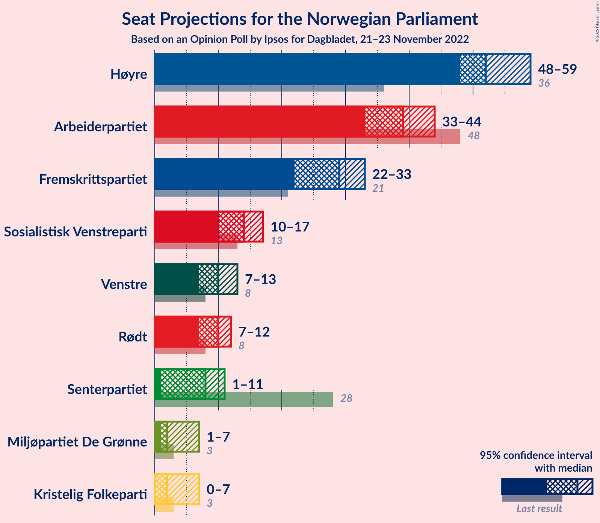
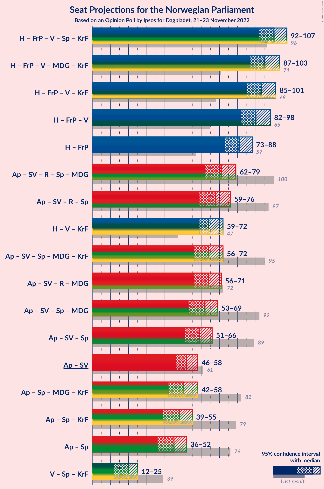
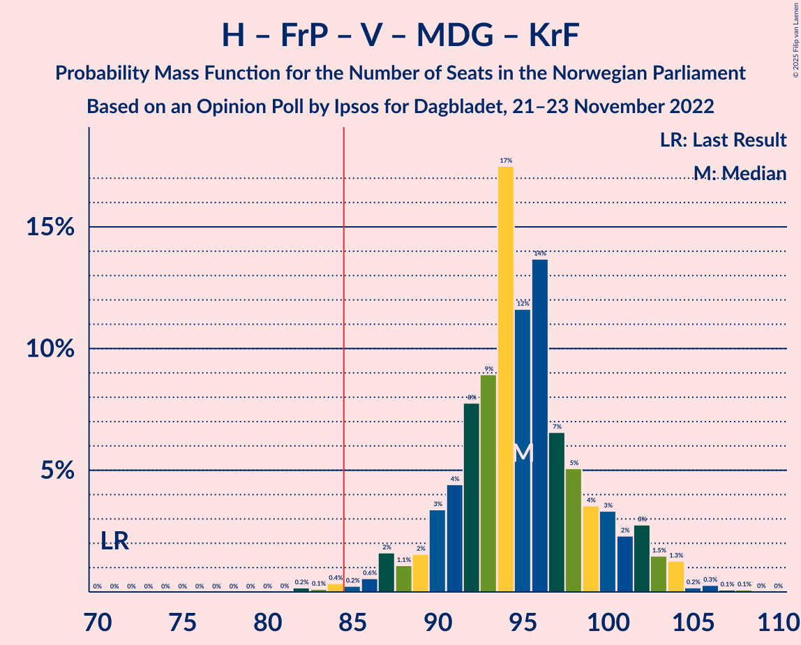
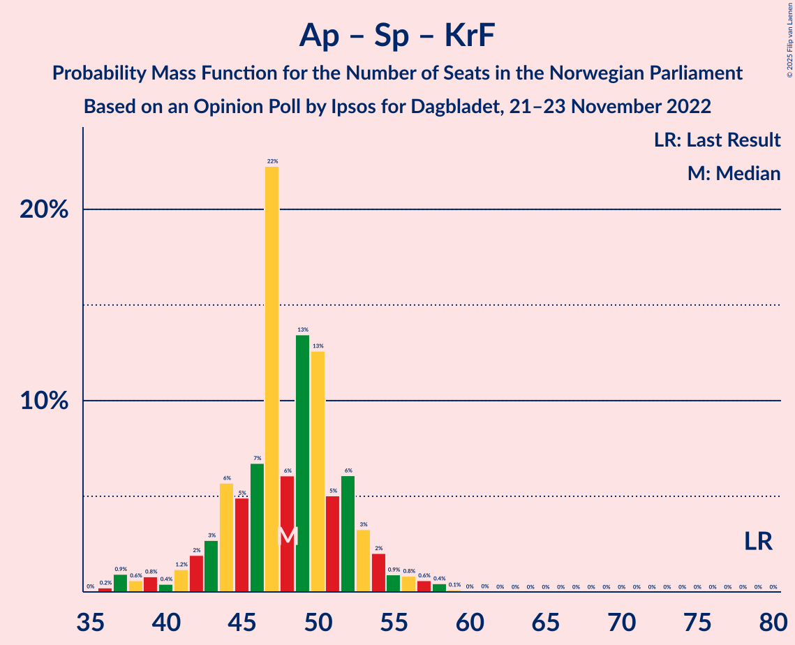

# Opinion Poll by Ipsos for Dagbladet, 21–23 November 2022

<a href="#voting-intentions">Voting Intentions</a> | <a href="#seats">Seats</a> | <a href="#coalitions">Coalitions</a> | <a href="#technical-information">Technical Information</a>

## Voting Intentions

### Confidence Intervals

| Party | Last Result | Poll Result | 80% Confidence Interval | 90% Confidence Interval | 95% Confidence Interval | 99% Confidence Interval |
|:-----:|:-----------:|:-----------:|:-----------------------:|:-----------------------:|:-----------------------:|:-----------------------:|
| Høyre | 20.4% | 29.8% | 28.0–31.8% |27.5–32.4% |27.0–32.8% |26.1–33.8% |
| Arbeiderpartiet | 26.2% | 19.8% | 18.2–21.5% |17.8–22.0% |17.4–22.5% |16.6–23.3% |
| Fremskrittspartiet | 11.6% | 14.7% | 13.3–16.3% |12.9–16.7% |12.6–17.1% |11.9–17.9% |
| Sosialistisk Venstreparti | 7.6% | 8.4% | 7.3–9.6% |7.0–10.0% |6.8–10.3% |6.3–10.9% |
| Venstre | 4.6% | 6.0% | 5.1–7.1% |4.9–7.5% |4.7–7.7% |4.3–8.3% |
| Rødt | 4.7% | 5.9% | 5.0–7.0% |4.8–7.3% |4.6–7.6% |4.2–8.2% |
| Senterpartiet | 13.5% | 4.8% | 4.0–5.8% |3.8–6.1% |3.6–6.3% |3.2–6.8% |
| Miljøpartiet De Grønne | 3.9% | 3.3% | 2.6–4.2% |2.5–4.4% |2.3–4.6% |2.0–5.1% |
| Kristelig Folkeparti | 3.8% | 3.1% | 2.5–3.9% |2.3–4.2% |2.1–4.4% |1.9–4.8% |

*Note:* The poll result column reflects the actual value used in the calculations. Published results may vary slightly, and in addition be rounded to fewer digits.

## Seats

### Confidence Intervals

| Party | Last Result | Median | 80% Confidence Interval | 90% Confidence Interval | 95% Confidence Interval | 99% Confidence Interval |
|:-----:|:-----------:|:------:|:-----------------------:|:-----------------------:|:-----------------------:|:-----------------------:|
| <a href="#høyre">Høyre</a> | 36 | 52 | 49–56 |48–57 |48–59 |46–62 |
| <a href="#arbeiderpartiet">Arbeiderpartiet</a> | 48 | 39 | 35–42 |34–43 |33–44 |33–47 |
| <a href="#fremskrittspartiet">Fremskrittspartiet</a> | 21 | 29 | 24–31 |23–32 |22–33 |20–34 |
| <a href="#sosialistisk-venstreparti">Sosialistisk Venstreparti</a> | 13 | 14 | 11–17 |10–17 |10–17 |9–19 |
| <a href="#venstre">Venstre</a> | 8 | 10 | 8–12 |7–12 |7–13 |6–14 |
| <a href="#rødt">Rødt</a> | 8 | 10 | 8–11 |7–12 |7–12 |6–13 |
| <a href="#senterpartiet">Senterpartiet</a> | 28 | 8 | 6–10 |1–10 |1–11 |0–13 |
| <a href="#miljøpartiet-de-grønne">Miljøpartiet De Grønne</a> | 3 | 2 | 1–3 |1–7 |1–7 |1–8 |
| <a href="#kristelig-folkeparti">Kristelig Folkeparti</a> | 3 | 2 | 2–3 |1–6 |0–7 |0–7 |

### Høyre

*For a full overview of the results for this party, see the [Høyre](party-høyre.html) page.*

| Number of Seats | Probability | Accumulated | Special Marks |
|:---------------:|:-----------:|:-----------:|:-------------:|
| 36 | 0% | 100% | Last Result |
| 37 | 0% | 100% |  |
| 38 | 0% | 100% |  |
| 39 | 0% | 100% |  |
| 40 | 0% | 100% |  |
| 41 | 0% | 100% |  |
| 42 | 0% | 100% |  |
| 43 | 0% | 100% |  |
| 44 | 0% | 100% |  |
| 45 | 0.3% | 99.9% |  |
| 46 | 0.3% | 99.6% |  |
| 47 | 1.5% | 99.4% |  |
| 48 | 4% | 98% |  |
| 49 | 7% | 94% |  |
| 50 | 14% | 87% |  |
| 51 | 10% | 73% |  |
| 52 | 18% | 64% | Median |
| 53 | 9% | 45% |  |
| 54 | 11% | 36% |  |
| 55 | 11% | 25% |  |
| 56 | 6% | 14% |  |
| 57 | 4% | 9% |  |
| 58 | 2% | 5% |  |
| 59 | 0.9% | 3% |  |
| 60 | 0.6% | 2% |  |
| 61 | 0.5% | 1.2% |  |
| 62 | 0.4% | 0.7% |  |
| 63 | 0.2% | 0.3% |  |
| 64 | 0% | 0.1% |  |
| 65 | 0% | 0.1% |  |
| 66 | 0% | 0% |  |

### Arbeiderpartiet

*For a full overview of the results for this party, see the [Arbeiderpartiet](party-arbeiderpartiet.html) page.*

| Number of Seats | Probability | Accumulated | Special Marks |
|:---------------:|:-----------:|:-----------:|:-------------:|
| 31 | 0.1% | 100% |  |
| 32 | 0.4% | 99.9% |  |
| 33 | 4% | 99.5% |  |
| 34 | 4% | 96% |  |
| 35 | 9% | 92% |  |
| 36 | 15% | 83% |  |
| 37 | 7% | 67% |  |
| 38 | 10% | 60% |  |
| 39 | 19% | 51% | Median |
| 40 | 13% | 32% |  |
| 41 | 6% | 19% |  |
| 42 | 5% | 13% |  |
| 43 | 4% | 8% |  |
| 44 | 3% | 4% |  |
| 45 | 0.4% | 1.4% |  |
| 46 | 0.5% | 1.1% |  |
| 47 | 0.2% | 0.5% |  |
| 48 | 0.3% | 0.4% | Last Result |
| 49 | 0.1% | 0.1% |  |
| 50 | 0% | 0% |  |

### Fremskrittspartiet

*For a full overview of the results for this party, see the [Fremskrittspartiet](party-fremskrittspartiet.html) page.*

| Number of Seats | Probability | Accumulated | Special Marks |
|:---------------:|:-----------:|:-----------:|:-------------:|
| 18 | 0.1% | 100% |  |
| 19 | 0.2% | 99.9% |  |
| 20 | 0.6% | 99.7% |  |
| 21 | 1.1% | 99.2% | Last Result |
| 22 | 2% | 98% |  |
| 23 | 4% | 96% |  |
| 24 | 5% | 92% |  |
| 25 | 8% | 87% |  |
| 26 | 11% | 79% |  |
| 27 | 5% | 69% |  |
| 28 | 9% | 64% |  |
| 29 | 14% | 54% | Median |
| 30 | 25% | 40% |  |
| 31 | 10% | 15% |  |
| 32 | 2% | 5% |  |
| 33 | 2% | 3% |  |
| 34 | 0.5% | 0.9% |  |
| 35 | 0.2% | 0.4% |  |
| 36 | 0.1% | 0.1% |  |
| 37 | 0% | 0% |  |

### Sosialistisk Venstreparti

*For a full overview of the results for this party, see the [Sosialistisk Venstreparti](party-sosialistiskvenstreparti.html) page.*

| Number of Seats | Probability | Accumulated | Special Marks |
|:---------------:|:-----------:|:-----------:|:-------------:|
| 8 | 0.3% | 100% |  |
| 9 | 2% | 99.7% |  |
| 10 | 4% | 98% |  |
| 11 | 14% | 94% |  |
| 12 | 15% | 80% |  |
| 13 | 15% | 65% | Last Result |
| 14 | 19% | 50% | Median |
| 15 | 15% | 31% |  |
| 16 | 5% | 16% |  |
| 17 | 9% | 11% |  |
| 18 | 2% | 2% |  |
| 19 | 0.5% | 0.6% |  |
| 20 | 0.1% | 0.1% |  |
| 21 | 0% | 0% |  |

### Venstre

*For a full overview of the results for this party, see the [Venstre](party-venstre.html) page.*

| Number of Seats | Probability | Accumulated | Special Marks |
|:---------------:|:-----------:|:-----------:|:-------------:|
| 3 | 0.1% | 100% |  |
| 4 | 0% | 99.9% |  |
| 5 | 0% | 99.9% |  |
| 6 | 1.0% | 99.9% |  |
| 7 | 4% | 98.9% |  |
| 8 | 14% | 95% | Last Result |
| 9 | 23% | 81% |  |
| 10 | 29% | 58% | Median |
| 11 | 17% | 29% |  |
| 12 | 8% | 12% |  |
| 13 | 3% | 4% |  |
| 14 | 0.9% | 1.0% |  |
| 15 | 0.1% | 0.1% |  |
| 16 | 0% | 0% |  |

### Rødt

*For a full overview of the results for this party, see the [Rødt](party-rødt.html) page.*

| Number of Seats | Probability | Accumulated | Special Marks |
|:---------------:|:-----------:|:-----------:|:-------------:|
| 1 | 0.2% | 100% |  |
| 2 | 0% | 99.8% |  |
| 3 | 0% | 99.8% |  |
| 4 | 0% | 99.8% |  |
| 5 | 0% | 99.8% |  |
| 6 | 1.2% | 99.8% |  |
| 7 | 5% | 98.6% |  |
| 8 | 14% | 94% | Last Result |
| 9 | 25% | 80% |  |
| 10 | 29% | 54% | Median |
| 11 | 18% | 25% |  |
| 12 | 5% | 7% |  |
| 13 | 1.4% | 2% |  |
| 14 | 0.3% | 0.4% |  |
| 15 | 0.1% | 0.1% |  |
| 16 | 0% | 0% |  |

### Senterpartiet

*For a full overview of the results for this party, see the [Senterpartiet](party-senterpartiet.html) page.*

| Number of Seats | Probability | Accumulated | Special Marks |
|:---------------:|:-----------:|:-----------:|:-------------:|
| 0 | 2% | 100% |  |
| 1 | 7% | 98% |  |
| 2 | 0.6% | 91% |  |
| 3 | 0% | 90% |  |
| 4 | 0% | 90% |  |
| 5 | 0.1% | 90% |  |
| 6 | 14% | 90% |  |
| 7 | 24% | 76% |  |
| 8 | 21% | 52% | Median |
| 9 | 19% | 31% |  |
| 10 | 9% | 12% |  |
| 11 | 2% | 4% |  |
| 12 | 0.9% | 1.4% |  |
| 13 | 0.5% | 0.5% |  |
| 14 | 0% | 0% |  |
| 15 | 0% | 0% |  |
| 16 | 0% | 0% |  |
| 17 | 0% | 0% |  |
| 18 | 0% | 0% |  |
| 19 | 0% | 0% |  |
| 20 | 0% | 0% |  |
| 21 | 0% | 0% |  |
| 22 | 0% | 0% |  |
| 23 | 0% | 0% |  |
| 24 | 0% | 0% |  |
| 25 | 0% | 0% |  |
| 26 | 0% | 0% |  |
| 27 | 0% | 0% |  |
| 28 | 0% | 0% | Last Result |

### Miljøpartiet De Grønne

*For a full overview of the results for this party, see the [Miljøpartiet De Grønne](party-miljøpartietdegrønne.html) page.*

| Number of Seats | Probability | Accumulated | Special Marks |
|:---------------:|:-----------:|:-----------:|:-------------:|
| 1 | 30% | 100% |  |
| 2 | 53% | 70% | Median |
| 3 | 7% | 17% | Last Result |
| 4 | 0% | 10% |  |
| 5 | 0.5% | 10% |  |
| 6 | 4% | 9% |  |
| 7 | 5% | 6% |  |
| 8 | 0.7% | 0.8% |  |
| 9 | 0.1% | 0.1% |  |
| 10 | 0% | 0% |  |

### Kristelig Folkeparti

*For a full overview of the results for this party, see the [Kristelig Folkeparti](party-kristeligfolkeparti.html) page.*

| Number of Seats | Probability | Accumulated | Special Marks |
|:---------------:|:-----------:|:-----------:|:-------------:|
| 0 | 3% | 100% |  |
| 1 | 4% | 97% |  |
| 2 | 67% | 92% | Median |
| 3 | 17% | 25% | Last Result |
| 4 | 0% | 8% |  |
| 5 | 0.1% | 8% |  |
| 6 | 4% | 8% |  |
| 7 | 3% | 4% |  |
| 8 | 0.4% | 0.5% |  |
| 9 | 0.1% | 0.1% |  |
| 10 | 0% | 0% |  |

## Coalitions

### Confidence Intervals

| Coalition | Last Result | Median | Majority? | 80% Confidence Interval | 90% Confidence Interval | 95% Confidence Interval | 99% Confidence Interval |
|:---------:|:-----------:|:------:|:---------:|:-----------------------:|:-----------------------:|:-----------------------:|:-----------------------:|
| Høyre – Fremskrittspartiet – Venstre – Senterpartiet – Kristelig Folkeparti | 96 | 100 | 100% | 95–104 | 94–106 | 92–107 | 90–109 |
| Høyre – Fremskrittspartiet – Venstre – Miljøpartiet De Grønne – Kristelig Folkeparti | 71 | 95 | 99.3% | 91–100 | 89–102 | 87–103 | 84–105 |
| Høyre – Fremskrittspartiet – Venstre – Kristelig Folkeparti | 68 | 93 | 98% | 89–97 | 86–99 | 85–101 | 82–103 |
| Høyre – Fremskrittspartiet – Venstre | 65 | 90 | 94% | 86–95 | 84–97 | 82–98 | 80–101 |
| Høyre – Fremskrittspartiet | 57 | 81 | 11% | 76–85 | 74–86 | 73–88 | 70–91 |
| Arbeiderpartiet – Sosialistisk Venstreparti – Rødt – Senterpartiet – Miljøpartiet De Grønne | 100 | 71 | 0.1% | 66–76 | 64–77 | 62–79 | 60–82 |
| Arbeiderpartiet – Sosialistisk Venstreparti – Rødt – Senterpartiet | 97 | 68 | 0% | 64–73 | 61–75 | 59–76 | 57–78 |
| Høyre – Venstre – Kristelig Folkeparti | 47 | 64 | 0% | 61–69 | 60–70 | 59–72 | 58–75 |
| Arbeiderpartiet – Sosialistisk Venstreparti – Senterpartiet – Miljøpartiet De Grønne – Kristelig Folkeparti | 95 | 64 | 0% | 59–68 | 57–70 | 56–72 | 52–74 |
| Arbeiderpartiet – Sosialistisk Venstreparti – Rødt – Miljøpartiet De Grønne | 72 | 64 | 0% | 59–68 | 58–70 | 56–71 | 54–74 |
| Arbeiderpartiet – Sosialistisk Venstreparti – Senterpartiet – Miljøpartiet De Grønne | 92 | 62 | 0% | 56–65 | 55–67 | 53–69 | 50–71 |
| Arbeiderpartiet – Sosialistisk Venstreparti – Senterpartiet | 89 | 59 | 0% | 54–63 | 53–64 | 51–66 | 48–69 |
| Arbeiderpartiet – Sosialistisk Venstreparti | 61 | 52 | 0% | 48–55 | 46–57 | 46–58 | 44–61 |
| Arbeiderpartiet – Senterpartiet – Miljøpartiet De Grønne – Kristelig Folkeparti | 82 | 50 | 0% | 46–54 | 44–56 | 42–58 | 39–61 |
| Arbeiderpartiet – Senterpartiet – Kristelig Folkeparti | 79 | 48 | 0% | 44–52 | 42–54 | 39–55 | 37–58 |
| Arbeiderpartiet – Senterpartiet | 76 | 45 | 0% | 41–49 | 40–51 | 36–52 | 35–55 |
| Venstre – Senterpartiet – Kristelig Folkeparti | 39 | 20 | 0% | 16–23 | 14–24 | 12–25 | 10–27 |

### Høyre – Fremskrittspartiet – Venstre – Senterpartiet – Kristelig Folkeparti

| Number of Seats | Probability | Accumulated | Special Marks |
|:---------------:|:-----------:|:-----------:|:-------------:|
| 86 | 0.1% | 100% |  |
| 87 | 0% | 99.9% |  |
| 88 | 0.1% | 99.9% |  |
| 89 | 0.3% | 99.8% |  |
| 90 | 1.0% | 99.5% |  |
| 91 | 0.9% | 98.6% |  |
| 92 | 1.0% | 98% |  |
| 93 | 1.3% | 97% |  |
| 94 | 3% | 95% |  |
| 95 | 4% | 92% |  |
| 96 | 4% | 88% | Last Result |
| 97 | 5% | 84% |  |
| 98 | 12% | 79% |  |
| 99 | 12% | 67% |  |
| 100 | 9% | 56% |  |
| 101 | 7% | 47% | Median |
| 102 | 10% | 40% |  |
| 103 | 17% | 29% |  |
| 104 | 3% | 12% |  |
| 105 | 3% | 9% |  |
| 106 | 3% | 6% |  |
| 107 | 2% | 4% |  |
| 108 | 0.7% | 1.3% |  |
| 109 | 0.4% | 0.6% |  |
| 110 | 0.1% | 0.2% |  |
| 111 | 0% | 0.1% |  |
| 112 | 0% | 0.1% |  |
| 113 | 0% | 0% |  |

### Høyre – Fremskrittspartiet – Venstre – Miljøpartiet De Grønne – Kristelig Folkeparti

| Number of Seats | Probability | Accumulated | Special Marks |
|:---------------:|:-----------:|:-----------:|:-------------:|
| 71 | 0% | 100% | Last Result |
| 72 | 0% | 100% |  |
| 73 | 0% | 100% |  |
| 74 | 0% | 100% |  |
| 75 | 0% | 100% |  |
| 76 | 0% | 100% |  |
| 77 | 0% | 100% |  |
| 78 | 0% | 100% |  |
| 79 | 0% | 100% |  |
| 80 | 0% | 100% |  |
| 81 | 0% | 100% |  |
| 82 | 0.2% | 100% |  |
| 83 | 0.1% | 99.8% |  |
| 84 | 0.4% | 99.7% |  |
| 85 | 0.2% | 99.3% | Majority |
| 86 | 0.6% | 99.1% |  |
| 87 | 2% | 98.5% |  |
| 88 | 1.1% | 97% |  |
| 89 | 2% | 96% |  |
| 90 | 3% | 94% |  |
| 91 | 4% | 91% |  |
| 92 | 8% | 86% |  |
| 93 | 9% | 79% |  |
| 94 | 17% | 70% |  |
| 95 | 12% | 52% | Median |
| 96 | 14% | 41% |  |
| 97 | 7% | 27% |  |
| 98 | 5% | 20% |  |
| 99 | 4% | 15% |  |
| 100 | 3% | 12% |  |
| 101 | 2% | 8% |  |
| 102 | 3% | 6% |  |
| 103 | 1.5% | 3% |  |
| 104 | 1.3% | 2% |  |
| 105 | 0.2% | 0.7% |  |
| 106 | 0.3% | 0.5% |  |
| 107 | 0.1% | 0.2% |  |
| 108 | 0.1% | 0.1% |  |
| 109 | 0% | 0% |  |

### Høyre – Fremskrittspartiet – Venstre – Kristelig Folkeparti

| Number of Seats | Probability | Accumulated | Special Marks |
|:---------------:|:-----------:|:-----------:|:-------------:|
| 68 | 0% | 100% | Last Result |
| 69 | 0% | 100% |  |
| 70 | 0% | 100% |  |
| 71 | 0% | 100% |  |
| 72 | 0% | 100% |  |
| 73 | 0% | 100% |  |
| 74 | 0% | 100% |  |
| 75 | 0% | 100% |  |
| 76 | 0% | 100% |  |
| 77 | 0% | 100% |  |
| 78 | 0% | 100% |  |
| 79 | 0% | 100% |  |
| 80 | 0.2% | 100% |  |
| 81 | 0.2% | 99.8% |  |
| 82 | 0.6% | 99.6% |  |
| 83 | 0.6% | 99.1% |  |
| 84 | 0.9% | 98.5% |  |
| 85 | 2% | 98% | Majority |
| 86 | 1.0% | 96% |  |
| 87 | 3% | 95% |  |
| 88 | 2% | 92% |  |
| 89 | 6% | 90% |  |
| 90 | 7% | 84% |  |
| 91 | 7% | 77% |  |
| 92 | 20% | 70% |  |
| 93 | 6% | 50% | Median |
| 94 | 18% | 44% |  |
| 95 | 8% | 25% |  |
| 96 | 4% | 17% |  |
| 97 | 3% | 13% |  |
| 98 | 3% | 10% |  |
| 99 | 3% | 7% |  |
| 100 | 2% | 5% |  |
| 101 | 2% | 3% |  |
| 102 | 0.7% | 1.4% |  |
| 103 | 0.5% | 0.7% |  |
| 104 | 0.1% | 0.2% |  |
| 105 | 0% | 0.2% |  |
| 106 | 0.1% | 0.1% |  |
| 107 | 0% | 0% |  |

### Høyre – Fremskrittspartiet – Venstre

| Number of Seats | Probability | Accumulated | Special Marks |
|:---------------:|:-----------:|:-----------:|:-------------:|
| 65 | 0% | 100% | Last Result |
| 66 | 0% | 100% |  |
| 67 | 0% | 100% |  |
| 68 | 0% | 100% |  |
| 69 | 0% | 100% |  |
| 70 | 0% | 100% |  |
| 71 | 0% | 100% |  |
| 72 | 0% | 100% |  |
| 73 | 0% | 100% |  |
| 74 | 0% | 100% |  |
| 75 | 0% | 100% |  |
| 76 | 0% | 100% |  |
| 77 | 0% | 100% |  |
| 78 | 0.2% | 100% |  |
| 79 | 0.2% | 99.8% |  |
| 80 | 0.6% | 99.5% |  |
| 81 | 0.8% | 99.0% |  |
| 82 | 1.1% | 98% |  |
| 83 | 2% | 97% |  |
| 84 | 2% | 95% |  |
| 85 | 3% | 94% | Majority |
| 86 | 2% | 91% |  |
| 87 | 6% | 88% |  |
| 88 | 8% | 83% |  |
| 89 | 10% | 74% |  |
| 90 | 18% | 64% |  |
| 91 | 8% | 47% | Median |
| 92 | 20% | 39% |  |
| 93 | 5% | 20% |  |
| 94 | 4% | 15% |  |
| 95 | 3% | 11% |  |
| 96 | 2% | 7% |  |
| 97 | 3% | 6% |  |
| 98 | 0.8% | 3% |  |
| 99 | 1.0% | 2% |  |
| 100 | 0.3% | 1.2% |  |
| 101 | 0.6% | 0.8% |  |
| 102 | 0.1% | 0.2% |  |
| 103 | 0.1% | 0.1% |  |
| 104 | 0.1% | 0.1% |  |
| 105 | 0% | 0% |  |

### Høyre – Fremskrittspartiet

| Number of Seats | Probability | Accumulated | Special Marks |
|:---------------:|:-----------:|:-----------:|:-------------:|
| 57 | 0% | 100% | Last Result |
| 58 | 0% | 100% |  |
| 59 | 0% | 100% |  |
| 60 | 0% | 100% |  |
| 61 | 0% | 100% |  |
| 62 | 0% | 100% |  |
| 63 | 0% | 100% |  |
| 64 | 0% | 100% |  |
| 65 | 0% | 100% |  |
| 66 | 0% | 100% |  |
| 67 | 0% | 100% |  |
| 68 | 0% | 100% |  |
| 69 | 0.2% | 99.9% |  |
| 70 | 0.5% | 99.7% |  |
| 71 | 0.7% | 99.3% |  |
| 72 | 0.9% | 98.6% |  |
| 73 | 1.3% | 98% |  |
| 74 | 3% | 96% |  |
| 75 | 2% | 94% |  |
| 76 | 2% | 91% |  |
| 77 | 5% | 90% |  |
| 78 | 6% | 85% |  |
| 79 | 10% | 78% |  |
| 80 | 11% | 68% |  |
| 81 | 21% | 58% | Median |
| 82 | 15% | 36% |  |
| 83 | 5% | 21% |  |
| 84 | 4% | 16% |  |
| 85 | 4% | 11% | Majority |
| 86 | 3% | 7% |  |
| 87 | 2% | 4% |  |
| 88 | 1.4% | 3% |  |
| 89 | 0.3% | 1.4% |  |
| 90 | 0.6% | 1.1% |  |
| 91 | 0.2% | 0.6% |  |
| 92 | 0% | 0.4% |  |
| 93 | 0.3% | 0.3% |  |
| 94 | 0% | 0% |  |

### Arbeiderpartiet – Sosialistisk Venstreparti – Rødt – Senterpartiet – Miljøpartiet De Grønne

| Number of Seats | Probability | Accumulated | Special Marks |
|:---------------:|:-----------:|:-----------:|:-------------:|
| 57 | 0.1% | 100% |  |
| 58 | 0.1% | 99.9% |  |
| 59 | 0.1% | 99.9% |  |
| 60 | 1.4% | 99.7% |  |
| 61 | 0.5% | 98% |  |
| 62 | 1.5% | 98% |  |
| 63 | 0.8% | 96% |  |
| 64 | 1.4% | 96% |  |
| 65 | 3% | 94% |  |
| 66 | 4% | 91% |  |
| 67 | 5% | 86% |  |
| 68 | 4% | 82% |  |
| 69 | 19% | 77% |  |
| 70 | 6% | 58% |  |
| 71 | 9% | 52% |  |
| 72 | 5% | 43% |  |
| 73 | 6% | 38% | Median |
| 74 | 17% | 32% |  |
| 75 | 4% | 14% |  |
| 76 | 4% | 10% |  |
| 77 | 2% | 6% |  |
| 78 | 1.1% | 4% |  |
| 79 | 0.7% | 3% |  |
| 80 | 1.0% | 2% |  |
| 81 | 0.5% | 1.1% |  |
| 82 | 0.3% | 0.6% |  |
| 83 | 0.2% | 0.3% |  |
| 84 | 0.1% | 0.1% |  |
| 85 | 0% | 0.1% | Majority |
| 86 | 0% | 0% |  |
| 87 | 0% | 0% |  |
| 88 | 0% | 0% |  |
| 89 | 0% | 0% |  |
| 90 | 0% | 0% |  |
| 91 | 0% | 0% |  |
| 92 | 0% | 0% |  |
| 93 | 0% | 0% |  |
| 94 | 0% | 0% |  |
| 95 | 0% | 0% |  |
| 96 | 0% | 0% |  |
| 97 | 0% | 0% |  |
| 98 | 0% | 0% |  |
| 99 | 0% | 0% |  |
| 100 | 0% | 0% | Last Result |

### Arbeiderpartiet – Sosialistisk Venstreparti – Rødt – Senterpartiet

| Number of Seats | Probability | Accumulated | Special Marks |
|:---------------:|:-----------:|:-----------:|:-------------:|
| 55 | 0.1% | 100% |  |
| 56 | 0.1% | 99.9% |  |
| 57 | 0.7% | 99.8% |  |
| 58 | 1.0% | 99.2% |  |
| 59 | 0.7% | 98% |  |
| 60 | 1.1% | 97% |  |
| 61 | 2% | 96% |  |
| 62 | 2% | 95% |  |
| 63 | 2% | 92% |  |
| 64 | 6% | 91% |  |
| 65 | 4% | 85% |  |
| 66 | 7% | 81% |  |
| 67 | 16% | 74% |  |
| 68 | 9% | 58% |  |
| 69 | 9% | 49% |  |
| 70 | 6% | 41% |  |
| 71 | 5% | 35% | Median |
| 72 | 11% | 30% |  |
| 73 | 10% | 19% |  |
| 74 | 3% | 9% |  |
| 75 | 2% | 6% |  |
| 76 | 1.3% | 3% |  |
| 77 | 0.9% | 2% |  |
| 78 | 0.7% | 1.2% |  |
| 79 | 0.1% | 0.5% |  |
| 80 | 0.1% | 0.4% |  |
| 81 | 0.2% | 0.2% |  |
| 82 | 0% | 0% |  |
| 83 | 0% | 0% |  |
| 84 | 0% | 0% |  |
| 85 | 0% | 0% | Majority |
| 86 | 0% | 0% |  |
| 87 | 0% | 0% |  |
| 88 | 0% | 0% |  |
| 89 | 0% | 0% |  |
| 90 | 0% | 0% |  |
| 91 | 0% | 0% |  |
| 92 | 0% | 0% |  |
| 93 | 0% | 0% |  |
| 94 | 0% | 0% |  |
| 95 | 0% | 0% |  |
| 96 | 0% | 0% |  |
| 97 | 0% | 0% | Last Result |

### Høyre – Venstre – Kristelig Folkeparti

| Number of Seats | Probability | Accumulated | Special Marks |
|:---------------:|:-----------:|:-----------:|:-------------:|
| 47 | 0% | 100% | Last Result |
| 48 | 0% | 100% |  |
| 49 | 0% | 100% |  |
| 50 | 0% | 100% |  |
| 51 | 0% | 100% |  |
| 52 | 0% | 100% |  |
| 53 | 0% | 100% |  |
| 54 | 0% | 100% |  |
| 55 | 0.1% | 100% |  |
| 56 | 0.1% | 99.9% |  |
| 57 | 0.2% | 99.8% |  |
| 58 | 1.3% | 99.6% |  |
| 59 | 3% | 98% |  |
| 60 | 3% | 95% |  |
| 61 | 8% | 92% |  |
| 62 | 10% | 84% |  |
| 63 | 13% | 74% |  |
| 64 | 16% | 61% | Median |
| 65 | 10% | 46% |  |
| 66 | 5% | 36% |  |
| 67 | 6% | 31% |  |
| 68 | 10% | 25% |  |
| 69 | 6% | 15% |  |
| 70 | 5% | 9% |  |
| 71 | 1.4% | 4% |  |
| 72 | 0.9% | 3% |  |
| 73 | 0.5% | 2% |  |
| 74 | 0.5% | 1.2% |  |
| 75 | 0.3% | 0.6% |  |
| 76 | 0.2% | 0.3% |  |
| 77 | 0.1% | 0.1% |  |
| 78 | 0% | 0% |  |

### Arbeiderpartiet – Sosialistisk Venstreparti – Senterpartiet – Miljøpartiet De Grønne – Kristelig Folkeparti

| Number of Seats | Probability | Accumulated | Special Marks |
|:---------------:|:-----------:|:-----------:|:-------------:|
| 50 | 0.1% | 100% |  |
| 51 | 0% | 99.9% |  |
| 52 | 0.5% | 99.9% |  |
| 53 | 0.5% | 99.3% |  |
| 54 | 0.3% | 98.8% |  |
| 55 | 0.7% | 98.5% |  |
| 56 | 1.2% | 98% |  |
| 57 | 2% | 97% |  |
| 58 | 4% | 95% |  |
| 59 | 3% | 91% |  |
| 60 | 4% | 87% |  |
| 61 | 13% | 83% |  |
| 62 | 10% | 71% |  |
| 63 | 5% | 61% |  |
| 64 | 12% | 55% |  |
| 65 | 11% | 43% | Median |
| 66 | 12% | 32% |  |
| 67 | 8% | 20% |  |
| 68 | 4% | 12% |  |
| 69 | 2% | 8% |  |
| 70 | 2% | 6% |  |
| 71 | 2% | 4% |  |
| 72 | 0.9% | 3% |  |
| 73 | 1.0% | 2% |  |
| 74 | 0.2% | 0.7% |  |
| 75 | 0.3% | 0.5% |  |
| 76 | 0.1% | 0.1% |  |
| 77 | 0% | 0.1% |  |
| 78 | 0% | 0% |  |
| 79 | 0% | 0% |  |
| 80 | 0% | 0% |  |
| 81 | 0% | 0% |  |
| 82 | 0% | 0% |  |
| 83 | 0% | 0% |  |
| 84 | 0% | 0% |  |
| 85 | 0% | 0% | Majority |
| 86 | 0% | 0% |  |
| 87 | 0% | 0% |  |
| 88 | 0% | 0% |  |
| 89 | 0% | 0% |  |
| 90 | 0% | 0% |  |
| 91 | 0% | 0% |  |
| 92 | 0% | 0% |  |
| 93 | 0% | 0% |  |
| 94 | 0% | 0% |  |
| 95 | 0% | 0% | Last Result |

### Arbeiderpartiet – Sosialistisk Venstreparti – Rødt – Miljøpartiet De Grønne

| Number of Seats | Probability | Accumulated | Special Marks |
|:---------------:|:-----------:|:-----------:|:-------------:|
| 53 | 0.2% | 100% |  |
| 54 | 0.5% | 99.8% |  |
| 55 | 0.5% | 99.3% |  |
| 56 | 2% | 98.8% |  |
| 57 | 0.9% | 97% |  |
| 58 | 4% | 96% |  |
| 59 | 4% | 92% |  |
| 60 | 5% | 88% |  |
| 61 | 11% | 83% |  |
| 62 | 11% | 73% |  |
| 63 | 11% | 62% |  |
| 64 | 6% | 50% |  |
| 65 | 17% | 44% | Median |
| 66 | 11% | 27% |  |
| 67 | 6% | 16% |  |
| 68 | 2% | 10% |  |
| 69 | 3% | 8% |  |
| 70 | 2% | 5% |  |
| 71 | 2% | 4% |  |
| 72 | 0.5% | 2% | Last Result |
| 73 | 0.4% | 1.2% |  |
| 74 | 0.4% | 0.7% |  |
| 75 | 0.1% | 0.3% |  |
| 76 | 0.1% | 0.2% |  |
| 77 | 0% | 0.1% |  |
| 78 | 0% | 0.1% |  |
| 79 | 0% | 0% |  |

### Arbeiderpartiet – Sosialistisk Venstreparti – Senterpartiet – Miljøpartiet De Grønne

| Number of Seats | Probability | Accumulated | Special Marks |
|:---------------:|:-----------:|:-----------:|:-------------:|
| 48 | 0.1% | 100% |  |
| 49 | 0.1% | 99.9% |  |
| 50 | 0.5% | 99.9% |  |
| 51 | 0.8% | 99.3% |  |
| 52 | 0.7% | 98.6% |  |
| 53 | 1.1% | 98% |  |
| 54 | 0.9% | 97% |  |
| 55 | 2% | 96% |  |
| 56 | 5% | 93% |  |
| 57 | 2% | 88% |  |
| 58 | 6% | 86% |  |
| 59 | 12% | 80% |  |
| 60 | 11% | 69% |  |
| 61 | 7% | 57% |  |
| 62 | 11% | 51% |  |
| 63 | 11% | 40% | Median |
| 64 | 11% | 28% |  |
| 65 | 8% | 17% |  |
| 66 | 3% | 9% |  |
| 67 | 2% | 6% |  |
| 68 | 2% | 4% |  |
| 69 | 1.2% | 3% |  |
| 70 | 0.6% | 2% |  |
| 71 | 0.6% | 1.0% |  |
| 72 | 0.1% | 0.4% |  |
| 73 | 0.2% | 0.3% |  |
| 74 | 0% | 0.1% |  |
| 75 | 0% | 0.1% |  |
| 76 | 0% | 0% |  |
| 77 | 0% | 0% |  |
| 78 | 0% | 0% |  |
| 79 | 0% | 0% |  |
| 80 | 0% | 0% |  |
| 81 | 0% | 0% |  |
| 82 | 0% | 0% |  |
| 83 | 0% | 0% |  |
| 84 | 0% | 0% |  |
| 85 | 0% | 0% | Majority |
| 86 | 0% | 0% |  |
| 87 | 0% | 0% |  |
| 88 | 0% | 0% |  |
| 89 | 0% | 0% |  |
| 90 | 0% | 0% |  |
| 91 | 0% | 0% |  |
| 92 | 0% | 0% | Last Result |

### Arbeiderpartiet – Sosialistisk Venstreparti – Senterpartiet

| Number of Seats | Probability | Accumulated | Special Marks |
|:---------------:|:-----------:|:-----------:|:-------------:|
| 46 | 0.1% | 100% |  |
| 47 | 0.1% | 99.9% |  |
| 48 | 1.3% | 99.8% |  |
| 49 | 0.3% | 98.6% |  |
| 50 | 0.6% | 98% |  |
| 51 | 1.0% | 98% |  |
| 52 | 1.1% | 97% |  |
| 53 | 3% | 95% |  |
| 54 | 5% | 92% |  |
| 55 | 3% | 88% |  |
| 56 | 6% | 85% |  |
| 57 | 11% | 79% |  |
| 58 | 14% | 68% |  |
| 59 | 8% | 54% |  |
| 60 | 9% | 46% |  |
| 61 | 6% | 37% | Median |
| 62 | 17% | 32% |  |
| 63 | 6% | 15% |  |
| 64 | 4% | 8% |  |
| 65 | 1.3% | 5% |  |
| 66 | 2% | 3% |  |
| 67 | 0.6% | 2% |  |
| 68 | 0.3% | 1.0% |  |
| 69 | 0.4% | 0.6% |  |
| 70 | 0.1% | 0.3% |  |
| 71 | 0.1% | 0.2% |  |
| 72 | 0% | 0% |  |
| 73 | 0% | 0% |  |
| 74 | 0% | 0% |  |
| 75 | 0% | 0% |  |
| 76 | 0% | 0% |  |
| 77 | 0% | 0% |  |
| 78 | 0% | 0% |  |
| 79 | 0% | 0% |  |
| 80 | 0% | 0% |  |
| 81 | 0% | 0% |  |
| 82 | 0% | 0% |  |
| 83 | 0% | 0% |  |
| 84 | 0% | 0% |  |
| 85 | 0% | 0% | Majority |
| 86 | 0% | 0% |  |
| 87 | 0% | 0% |  |
| 88 | 0% | 0% |  |
| 89 | 0% | 0% | Last Result |

### Arbeiderpartiet – Sosialistisk Venstreparti

| Number of Seats | Probability | Accumulated | Special Marks |
|:---------------:|:-----------:|:-----------:|:-------------:|
| 42 | 0% | 100% |  |
| 43 | 0.1% | 99.9% |  |
| 44 | 0.5% | 99.8% |  |
| 45 | 1.3% | 99.3% |  |
| 46 | 3% | 98% |  |
| 47 | 4% | 95% |  |
| 48 | 4% | 91% |  |
| 49 | 8% | 86% |  |
| 50 | 9% | 79% |  |
| 51 | 18% | 70% |  |
| 52 | 9% | 52% |  |
| 53 | 18% | 43% | Median |
| 54 | 9% | 24% |  |
| 55 | 6% | 16% |  |
| 56 | 4% | 9% |  |
| 57 | 1.5% | 5% |  |
| 58 | 2% | 4% |  |
| 59 | 1.0% | 2% |  |
| 60 | 0.2% | 0.8% |  |
| 61 | 0.2% | 0.6% | Last Result |
| 62 | 0.3% | 0.4% |  |
| 63 | 0% | 0.1% |  |
| 64 | 0% | 0.1% |  |
| 65 | 0% | 0% |  |

### Arbeiderpartiet – Senterpartiet – Miljøpartiet De Grønne – Kristelig Folkeparti

| Number of Seats | Probability | Accumulated | Special Marks |
|:---------------:|:-----------:|:-----------:|:-------------:|
| 37 | 0% | 100% |  |
| 38 | 0.2% | 99.9% |  |
| 39 | 1.0% | 99.8% |  |
| 40 | 0.6% | 98.7% |  |
| 41 | 0.4% | 98% |  |
| 42 | 0.6% | 98% |  |
| 43 | 1.4% | 97% |  |
| 44 | 1.4% | 96% |  |
| 45 | 2% | 94% |  |
| 46 | 6% | 93% |  |
| 47 | 6% | 86% |  |
| 48 | 6% | 80% |  |
| 49 | 20% | 74% |  |
| 50 | 6% | 54% |  |
| 51 | 19% | 48% | Median |
| 52 | 6% | 29% |  |
| 53 | 6% | 24% |  |
| 54 | 8% | 18% |  |
| 55 | 3% | 10% |  |
| 56 | 2% | 7% |  |
| 57 | 1.2% | 4% |  |
| 58 | 1.3% | 3% |  |
| 59 | 0.8% | 2% |  |
| 60 | 0.6% | 1.1% |  |
| 61 | 0.3% | 0.5% |  |
| 62 | 0.1% | 0.2% |  |
| 63 | 0.1% | 0.1% |  |
| 64 | 0% | 0% |  |
| 65 | 0% | 0% |  |
| 66 | 0% | 0% |  |
| 67 | 0% | 0% |  |
| 68 | 0% | 0% |  |
| 69 | 0% | 0% |  |
| 70 | 0% | 0% |  |
| 71 | 0% | 0% |  |
| 72 | 0% | 0% |  |
| 73 | 0% | 0% |  |
| 74 | 0% | 0% |  |
| 75 | 0% | 0% |  |
| 76 | 0% | 0% |  |
| 77 | 0% | 0% |  |
| 78 | 0% | 0% |  |
| 79 | 0% | 0% |  |
| 80 | 0% | 0% |  |
| 81 | 0% | 0% |  |
| 82 | 0% | 0% | Last Result |

### Arbeiderpartiet – Senterpartiet – Kristelig Folkeparti

| Number of Seats | Probability | Accumulated | Special Marks |
|:---------------:|:-----------:|:-----------:|:-------------:|
| 35 | 0% | 100% |  |
| 36 | 0.2% | 99.9% |  |
| 37 | 0.9% | 99.7% |  |
| 38 | 0.6% | 98.8% |  |
| 39 | 0.8% | 98% |  |
| 40 | 0.4% | 97% |  |
| 41 | 1.2% | 97% |  |
| 42 | 2% | 96% |  |
| 43 | 3% | 94% |  |
| 44 | 6% | 91% |  |
| 45 | 5% | 85% |  |
| 46 | 7% | 81% |  |
| 47 | 22% | 74% |  |
| 48 | 6% | 52% |  |
| 49 | 13% | 45% | Median |
| 50 | 13% | 32% |  |
| 51 | 5% | 19% |  |
| 52 | 6% | 14% |  |
| 53 | 3% | 8% |  |
| 54 | 2% | 5% |  |
| 55 | 0.9% | 3% |  |
| 56 | 0.8% | 2% |  |
| 57 | 0.6% | 1.2% |  |
| 58 | 0.4% | 0.6% |  |
| 59 | 0.1% | 0.2% |  |
| 60 | 0% | 0.1% |  |
| 61 | 0% | 0.1% |  |
| 62 | 0% | 0% |  |
| 63 | 0% | 0% |  |
| 64 | 0% | 0% |  |
| 65 | 0% | 0% |  |
| 66 | 0% | 0% |  |
| 67 | 0% | 0% |  |
| 68 | 0% | 0% |  |
| 69 | 0% | 0% |  |
| 70 | 0% | 0% |  |
| 71 | 0% | 0% |  |
| 72 | 0% | 0% |  |
| 73 | 0% | 0% |  |
| 74 | 0% | 0% |  |
| 75 | 0% | 0% |  |
| 76 | 0% | 0% |  |
| 77 | 0% | 0% |  |
| 78 | 0% | 0% |  |
| 79 | 0% | 0% | Last Result |

### Arbeiderpartiet – Senterpartiet

| Number of Seats | Probability | Accumulated | Special Marks |
|:---------------:|:-----------:|:-----------:|:-------------:|
| 33 | 0% | 100% |  |
| 34 | 0.2% | 99.9% |  |
| 35 | 1.0% | 99.8% |  |
| 36 | 1.4% | 98.8% |  |
| 37 | 0.6% | 97% |  |
| 38 | 0.5% | 97% |  |
| 39 | 1.2% | 96% |  |
| 40 | 2% | 95% |  |
| 41 | 5% | 93% |  |
| 42 | 5% | 89% |  |
| 43 | 5% | 84% |  |
| 44 | 9% | 79% |  |
| 45 | 22% | 70% |  |
| 46 | 7% | 48% |  |
| 47 | 13% | 41% | Median |
| 48 | 12% | 28% |  |
| 49 | 7% | 16% |  |
| 50 | 4% | 9% |  |
| 51 | 2% | 5% |  |
| 52 | 1.1% | 3% |  |
| 53 | 0.6% | 2% |  |
| 54 | 0.4% | 1.1% |  |
| 55 | 0.5% | 0.7% |  |
| 56 | 0.1% | 0.2% |  |
| 57 | 0% | 0% |  |
| 58 | 0% | 0% |  |
| 59 | 0% | 0% |  |
| 60 | 0% | 0% |  |
| 61 | 0% | 0% |  |
| 62 | 0% | 0% |  |
| 63 | 0% | 0% |  |
| 64 | 0% | 0% |  |
| 65 | 0% | 0% |  |
| 66 | 0% | 0% |  |
| 67 | 0% | 0% |  |
| 68 | 0% | 0% |  |
| 69 | 0% | 0% |  |
| 70 | 0% | 0% |  |
| 71 | 0% | 0% |  |
| 72 | 0% | 0% |  |
| 73 | 0% | 0% |  |
| 74 | 0% | 0% |  |
| 75 | 0% | 0% |  |
| 76 | 0% | 0% | Last Result |

### Venstre – Senterpartiet – Kristelig Folkeparti

| Number of Seats | Probability | Accumulated | Special Marks |
|:---------------:|:-----------:|:-----------:|:-------------:|
| 9 | 0.2% | 100% |  |
| 10 | 0.4% | 99.8% |  |
| 11 | 0.4% | 99.4% |  |
| 12 | 2% | 99.0% |  |
| 13 | 2% | 97% |  |
| 14 | 3% | 96% |  |
| 15 | 2% | 93% |  |
| 16 | 4% | 90% |  |
| 17 | 8% | 87% |  |
| 18 | 18% | 79% |  |
| 19 | 8% | 61% |  |
| 20 | 11% | 53% | Median |
| 21 | 19% | 42% |  |
| 22 | 11% | 23% |  |
| 23 | 4% | 12% |  |
| 24 | 3% | 8% |  |
| 25 | 3% | 4% |  |
| 26 | 0.9% | 2% |  |
| 27 | 0.6% | 0.8% |  |
| 28 | 0.1% | 0.2% |  |
| 29 | 0% | 0.1% |  |
| 30 | 0% | 0% |  |
| 31 | 0% | 0% |  |
| 32 | 0% | 0% |  |
| 33 | 0% | 0% |  |
| 34 | 0% | 0% |  |
| 35 | 0% | 0% |  |
| 36 | 0% | 0% |  |
| 37 | 0% | 0% |  |
| 38 | 0% | 0% |  |
| 39 | 0% | 0% | Last Result |

## Technical Information

### Opinion Poll

+ **Polling firm:** Ipsos
+ **Commissioner(s):** Dagbladet
+ **Fieldwork period:** 21–23 November 2022

### Calculations

+ **Sample size:** 945
+ **Simulations done:** 1,048,576
+ **Error estimate:** 1.42%

