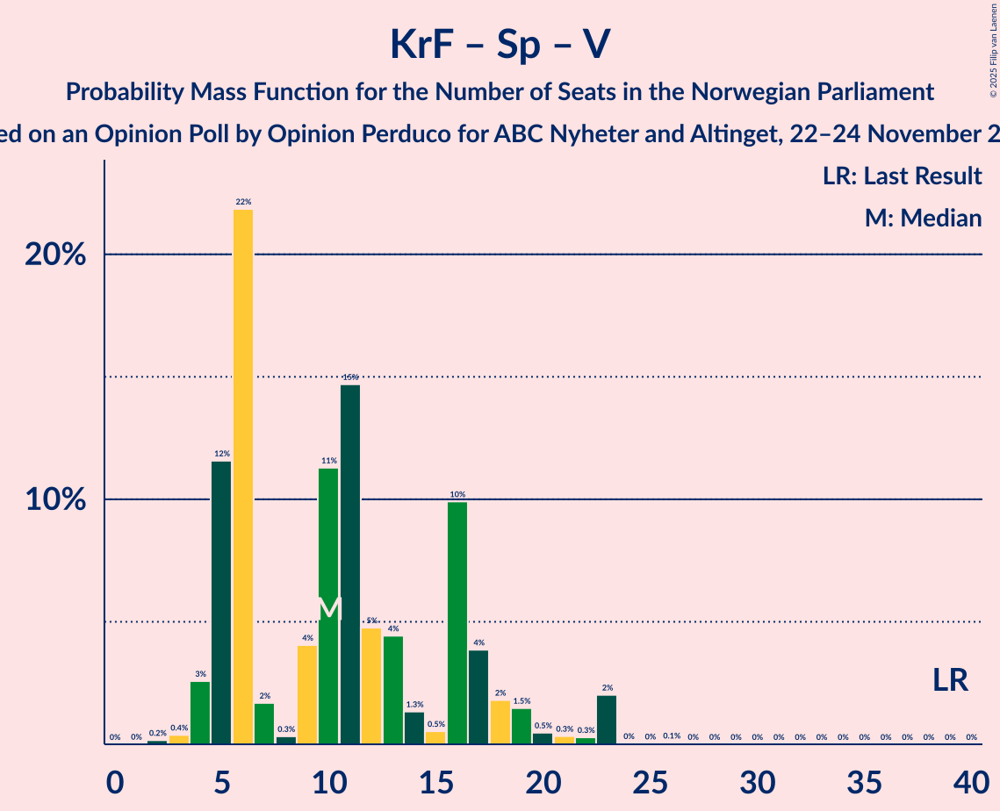

# Opinion Poll by Opinion Perduco for ABC Nyheter and Altinget, 22–24 November 2022

<a href="#voting-intentions">Voting Intentions</a> | <a href="#seats">Seats</a> | <a href="#coalitions">Coalitions</a> | <a href="#technical-information">Technical Information</a>

## Voting Intentions

### Confidence Intervals

| Party | Last Result | Poll Result | 80% Confidence Interval | 90% Confidence Interval | 95% Confidence Interval | 99% Confidence Interval |
|:-----:|:-----------:|:-----------:|:-----------------------:|:-----------------------:|:-----------------------:|:-----------------------:|
| Høyre | 20.4% | 31.6% | 29.3–34.0% |28.6–34.7% |28.1–35.3% |27.0–36.5% |
| Arbeiderpartiet | 26.2% | 17.4% | 15.6–19.5% |15.1–20.1% |14.7–20.6% |13.8–21.6% |
| Fremskrittspartiet | 11.6% | 13.3% | 11.8–15.2% |11.3–15.7% |10.9–16.2% |10.2–17.1% |
| Rødt | 4.7% | 9.4% | 8.1–11.1% |7.7–11.5% |7.4–11.9% |6.8–12.8% |
| Sosialistisk Venstreparti | 7.6% | 8.2% | 6.9–9.7% |6.6–10.2% |6.3–10.6% |5.7–11.4% |
| Miljøpartiet De Grønne | 3.9% | 3.9% | 3.1–5.1% |2.9–5.4% |2.7–5.7% |2.3–6.4% |
| Kristelig Folkeparti | 3.8% | 3.8% | 3.0–4.9% |2.7–5.3% |2.5–5.5% |2.2–6.2% |
| Venstre | 4.6% | 3.5% | 2.7–4.6% |2.5–4.9% |2.3–5.2% |2.0–5.8% |
| Senterpartiet | 13.5% | 3.5% | 2.7–4.6% |2.5–4.9% |2.3–5.2% |2.0–5.8% |
| Industri- og Næringspartiet | 0.3% | 2.4% | 1.7–3.3% |1.6–3.6% |1.4–3.9% |1.2–4.4% |
| Norgesdemokratene | 1.1% | 0.8% | 0.5–1.5% |0.4–1.6% |0.3–1.8% |0.2–2.2% |
| Pensjonistpartiet | 0.6% | 0.5% | 0.3–1.1% |0.2–1.2% |0.2–1.4% |0.1–1.7% |

*Note:* The poll result column reflects the actual value used in the calculations. Published results may vary slightly, and in addition be rounded to fewer digits.

## Seats

### Confidence Intervals

| Party | Last Result | Median | 80% Confidence Interval | 90% Confidence Interval | 95% Confidence Interval | 99% Confidence Interval |
|:-----:|:-----------:|:------:|:-----------------------:|:-----------------------:|:-----------------------:|:-----------------------:|
| <a href="#høyre">Høyre</a> | 36 | 61 | 55–64 |53–64 |53–66 |48–69 |
| <a href="#arbeiderpartiet">Arbeiderpartiet</a> | 48 | 33 | 30–38 |30–39 |29–40 |28–42 |
| <a href="#fremskrittspartiet">Fremskrittspartiet</a> | 21 | 26 | 20–30 |20–30 |20–31 |18–33 |
| <a href="#rødt">Rødt</a> | 8 | 18 | 15–20 |14–21 |12–22 |12–24 |
| <a href="#sosialistisk-venstreparti">Sosialistisk Venstreparti</a> | 13 | 15 | 12–19 |11–19 |11–19 |10–24 |
| <a href="#miljøpartiet-de-grønne">Miljøpartiet De Grønne</a> | 3 | 2 | 1–8 |1–10 |1–10 |1–11 |
| <a href="#kristelig-folkeparti">Kristelig Folkeparti</a> | 3 | 3 | 2–9 |2–9 |1–10 |0–11 |
| <a href="#venstre">Venstre</a> | 8 | 3 | 2–8 |2–9 |1–9 |1–12 |
| <a href="#senterpartiet">Senterpartiet</a> | 28 | 0 | 0–8 |0–10 |0–10 |0–10 |
| <a href="#industri--og-næringspartiet">Industri- og Næringspartiet</a> | 0 | 0 | 0–3 |0–3 |0–3 |0–8 |
| <a href="#norgesdemokratene">Norgesdemokratene</a> | 0 | 0 | 0 |0 |0 |0 |
| <a href="#pensjonistpartiet">Pensjonistpartiet</a> | 0 | 0 | 0 |0 |0 |0 |

### Høyre

*For a full overview of the results for this party, see the [Høyre](party-høyre.html) page.*

| Number of Seats | Probability | Accumulated | Special Marks |
|:---------------:|:-----------:|:-----------:|:-------------:|
| 36 | 0% | 100% | Last Result |
| 37 | 0% | 100% |  |
| 38 | 0% | 100% |  |
| 39 | 0% | 100% |  |
| 40 | 0% | 100% |  |
| 41 | 0% | 100% |  |
| 42 | 0% | 100% |  |
| 43 | 0% | 100% |  |
| 44 | 0% | 100% |  |
| 45 | 0% | 100% |  |
| 46 | 0.2% | 100% |  |
| 47 | 0.2% | 99.8% |  |
| 48 | 0.1% | 99.6% |  |
| 49 | 0.2% | 99.5% |  |
| 50 | 0.5% | 99.3% |  |
| 51 | 0.4% | 98.8% |  |
| 52 | 0.8% | 98% |  |
| 53 | 3% | 98% |  |
| 54 | 2% | 94% |  |
| 55 | 5% | 92% |  |
| 56 | 3% | 87% |  |
| 57 | 7% | 83% |  |
| 58 | 5% | 77% |  |
| 59 | 5% | 72% |  |
| 60 | 8% | 67% |  |
| 61 | 20% | 59% | Median |
| 62 | 24% | 39% |  |
| 63 | 2% | 15% |  |
| 64 | 9% | 12% |  |
| 65 | 0.3% | 3% |  |
| 66 | 2% | 3% |  |
| 67 | 0% | 0.7% |  |
| 68 | 0.1% | 0.7% |  |
| 69 | 0.2% | 0.5% |  |
| 70 | 0.1% | 0.4% |  |
| 71 | 0.1% | 0.3% |  |
| 72 | 0.1% | 0.2% |  |
| 73 | 0.2% | 0.2% |  |
| 74 | 0% | 0% |  |

### Arbeiderpartiet

*For a full overview of the results for this party, see the [Arbeiderpartiet](party-arbeiderpartiet.html) page.*

| Number of Seats | Probability | Accumulated | Special Marks |
|:---------------:|:-----------:|:-----------:|:-------------:|
| 25 | 0.2% | 100% |  |
| 26 | 0.1% | 99.8% |  |
| 27 | 0.2% | 99.7% |  |
| 28 | 0.5% | 99.5% |  |
| 29 | 2% | 99.0% |  |
| 30 | 19% | 97% |  |
| 31 | 4% | 78% |  |
| 32 | 12% | 75% |  |
| 33 | 16% | 63% | Median |
| 34 | 13% | 47% |  |
| 35 | 6% | 33% |  |
| 36 | 5% | 27% |  |
| 37 | 2% | 22% |  |
| 38 | 14% | 20% |  |
| 39 | 1.2% | 6% |  |
| 40 | 4% | 5% |  |
| 41 | 0.1% | 0.7% |  |
| 42 | 0.1% | 0.6% |  |
| 43 | 0.2% | 0.4% |  |
| 44 | 0.2% | 0.3% |  |
| 45 | 0% | 0.1% |  |
| 46 | 0% | 0% |  |
| 47 | 0% | 0% |  |
| 48 | 0% | 0% | Last Result |

### Fremskrittspartiet

*For a full overview of the results for this party, see the [Fremskrittspartiet](party-fremskrittspartiet.html) page.*

| Number of Seats | Probability | Accumulated | Special Marks |
|:---------------:|:-----------:|:-----------:|:-------------:|
| 17 | 0.4% | 100% |  |
| 18 | 0.3% | 99.6% |  |
| 19 | 0.7% | 99.3% |  |
| 20 | 9% | 98.6% |  |
| 21 | 10% | 90% | Last Result |
| 22 | 2% | 79% |  |
| 23 | 2% | 77% |  |
| 24 | 3% | 76% |  |
| 25 | 18% | 73% |  |
| 26 | 5% | 55% | Median |
| 27 | 16% | 49% |  |
| 28 | 0.3% | 33% |  |
| 29 | 5% | 33% |  |
| 30 | 24% | 28% |  |
| 31 | 3% | 4% |  |
| 32 | 0.9% | 1.4% |  |
| 33 | 0.1% | 0.5% |  |
| 34 | 0.1% | 0.4% |  |
| 35 | 0.1% | 0.3% |  |
| 36 | 0% | 0.2% |  |
| 37 | 0% | 0.2% |  |
| 38 | 0.1% | 0.1% |  |
| 39 | 0% | 0% |  |

### Rødt

*For a full overview of the results for this party, see the [Rødt](party-rødt.html) page.*

| Number of Seats | Probability | Accumulated | Special Marks |
|:---------------:|:-----------:|:-----------:|:-------------:|
| 8 | 0% | 100% | Last Result |
| 9 | 0% | 100% |  |
| 10 | 0% | 100% |  |
| 11 | 0.3% | 100% |  |
| 12 | 3% | 99.7% |  |
| 13 | 1.3% | 97% |  |
| 14 | 5% | 96% |  |
| 15 | 4% | 90% |  |
| 16 | 7% | 86% |  |
| 17 | 27% | 79% |  |
| 18 | 9% | 52% | Median |
| 19 | 15% | 43% |  |
| 20 | 18% | 28% |  |
| 21 | 6% | 10% |  |
| 22 | 2% | 4% |  |
| 23 | 0.6% | 2% |  |
| 24 | 2% | 2% |  |
| 25 | 0.1% | 0.1% |  |
| 26 | 0% | 0% |  |

### Sosialistisk Venstreparti

*For a full overview of the results for this party, see the [Sosialistisk Venstreparti](party-sosialistiskvenstreparti.html) page.*

| Number of Seats | Probability | Accumulated | Special Marks |
|:---------------:|:-----------:|:-----------:|:-------------:|
| 9 | 0.3% | 100% |  |
| 10 | 1.2% | 99.7% |  |
| 11 | 8% | 98% |  |
| 12 | 14% | 91% |  |
| 13 | 11% | 77% | Last Result |
| 14 | 2% | 66% |  |
| 15 | 15% | 63% | Median |
| 16 | 9% | 48% |  |
| 17 | 15% | 39% |  |
| 18 | 3% | 24% |  |
| 19 | 18% | 20% |  |
| 20 | 1.2% | 2% |  |
| 21 | 0.1% | 0.9% |  |
| 22 | 0.3% | 0.8% |  |
| 23 | 0% | 0.6% |  |
| 24 | 0.5% | 0.5% |  |
| 25 | 0% | 0% |  |

### Miljøpartiet De Grønne

*For a full overview of the results for this party, see the [Miljøpartiet De Grønne](party-miljøpartietdegrønne.html) page.*

| Number of Seats | Probability | Accumulated | Special Marks |
|:---------------:|:-----------:|:-----------:|:-------------:|
| 1 | 15% | 100% |  |
| 2 | 49% | 85% | Median |
| 3 | 6% | 36% | Last Result |
| 4 | 0% | 30% |  |
| 5 | 0% | 30% |  |
| 6 | 0.2% | 30% |  |
| 7 | 3% | 30% |  |
| 8 | 18% | 27% |  |
| 9 | 4% | 9% |  |
| 10 | 4% | 5% |  |
| 11 | 1.3% | 2% |  |
| 12 | 0.2% | 0.3% |  |
| 13 | 0% | 0.1% |  |
| 14 | 0% | 0% |  |

### Kristelig Folkeparti

*For a full overview of the results for this party, see the [Kristelig Folkeparti](party-kristeligfolkeparti.html) page.*

| Number of Seats | Probability | Accumulated | Special Marks |
|:---------------:|:-----------:|:-----------:|:-------------:|
| 0 | 0.6% | 100% |  |
| 1 | 4% | 99.4% |  |
| 2 | 24% | 95% |  |
| 3 | 31% | 71% | Last Result, Median |
| 4 | 0% | 40% |  |
| 5 | 0% | 40% |  |
| 6 | 0% | 40% |  |
| 7 | 3% | 40% |  |
| 8 | 22% | 37% |  |
| 9 | 12% | 15% |  |
| 10 | 2% | 3% |  |
| 11 | 0.9% | 1.1% |  |
| 12 | 0.1% | 0.2% |  |
| 13 | 0.1% | 0.1% |  |
| 14 | 0% | 0% |  |

### Venstre

*For a full overview of the results for this party, see the [Venstre](party-venstre.html) page.*

| Number of Seats | Probability | Accumulated | Special Marks |
|:---------------:|:-----------:|:-----------:|:-------------:|
| 0 | 0.1% | 100% |  |
| 1 | 3% | 99.9% |  |
| 2 | 41% | 97% |  |
| 3 | 35% | 57% | Median |
| 4 | 0% | 22% |  |
| 5 | 0% | 22% |  |
| 6 | 0.1% | 22% |  |
| 7 | 5% | 22% |  |
| 8 | 11% | 16% | Last Result |
| 9 | 3% | 5% |  |
| 10 | 0.7% | 2% |  |
| 11 | 0.3% | 1.5% |  |
| 12 | 1.1% | 1.1% |  |
| 13 | 0% | 0% |  |

### Senterpartiet

*For a full overview of the results for this party, see the [Senterpartiet](party-senterpartiet.html) page.*

| Number of Seats | Probability | Accumulated | Special Marks |
|:---------------:|:-----------:|:-----------:|:-------------:|
| 0 | 59% | 100% | Median |
| 1 | 23% | 41% |  |
| 2 | 0.5% | 18% |  |
| 3 | 0% | 17% |  |
| 4 | 0% | 17% |  |
| 5 | 0% | 17% |  |
| 6 | 0.1% | 17% |  |
| 7 | 1.5% | 17% |  |
| 8 | 6% | 16% |  |
| 9 | 4% | 9% |  |
| 10 | 5% | 6% |  |
| 11 | 0.3% | 0.4% |  |
| 12 | 0% | 0% |  |
| 13 | 0% | 0% |  |
| 14 | 0% | 0% |  |
| 15 | 0% | 0% |  |
| 16 | 0% | 0% |  |
| 17 | 0% | 0% |  |
| 18 | 0% | 0% |  |
| 19 | 0% | 0% |  |
| 20 | 0% | 0% |  |
| 21 | 0% | 0% |  |
| 22 | 0% | 0% |  |
| 23 | 0% | 0% |  |
| 24 | 0% | 0% |  |
| 25 | 0% | 0% |  |
| 26 | 0% | 0% |  |
| 27 | 0% | 0% |  |
| 28 | 0% | 0% | Last Result |

### Industri- og Næringspartiet

*For a full overview of the results for this party, see the [Industri- og Næringspartiet](party-industri-ognæringspartiet.html) page.*

| Number of Seats | Probability | Accumulated | Special Marks |
|:---------------:|:-----------:|:-----------:|:-------------:|
| 0 | 52% | 100% | Last Result, Median |
| 1 | 7% | 48% |  |
| 2 | 28% | 41% |  |
| 3 | 12% | 13% |  |
| 4 | 0% | 0.9% |  |
| 5 | 0% | 0.9% |  |
| 6 | 0.1% | 0.9% |  |
| 7 | 0.2% | 0.8% |  |
| 8 | 0.5% | 0.6% |  |
| 9 | 0.1% | 0.1% |  |
| 10 | 0% | 0% |  |

### Norgesdemokratene

*For a full overview of the results for this party, see the [Norgesdemokratene](party-norgesdemokratene.html) page.*

| Number of Seats | Probability | Accumulated | Special Marks |
|:---------------:|:-----------:|:-----------:|:-------------:|
| 0 | 100% | 100% | Last Result, Median |

### Pensjonistpartiet

*For a full overview of the results for this party, see the [Pensjonistpartiet](party-pensjonistpartiet.html) page.*

| Number of Seats | Probability | Accumulated | Special Marks |
|:---------------:|:-----------:|:-----------:|:-------------:|
| 0 | 100% | 100% | Last Result, Median |

## Coalitions

### Confidence Intervals

| Coalition | Last Result | Median | Majority? | 80% Confidence Interval | 90% Confidence Interval | 95% Confidence Interval | 99% Confidence Interval |
|:---------:|:-----------:|:------:|:---------:|:-----------------------:|:-----------------------:|:-----------------------:|:-----------------------:|
| Høyre – Fremskrittspartiet – Miljøpartiet De Grønne – Kristelig Folkeparti – Venstre | 71 | 98 | 99.0% | 91–103 | 90–103 | 86–104 | 84–109 |
| Høyre – Fremskrittspartiet – Kristelig Folkeparti – Senterpartiet – Venstre | 96 | 96 | 99.5% | 91–101 | 90–102 | 88–102 | 85–105 |
| Høyre – Fremskrittspartiet – Kristelig Folkeparti – Venstre | 68 | 95 | 95% | 88–100 | 85–100 | 83–101 | 81–103 |
| Høyre – Fremskrittspartiet – Venstre | 65 | 89 | 90% | 85–97 | 80–98 | 79–98 | 76–98 |
| Høyre – Fremskrittspartiet | 57 | 86 | 57% | 79–93 | 78–94 | 77–94 | 73–94 |
| Arbeiderpartiet – Rødt – Sosialistisk Venstreparti – Miljøpartiet De Grønne – Senterpartiet | 100 | 72 | 3% | 68–80 | 67–81 | 66–85 | 64–86 |
| Arbeiderpartiet – Rødt – Sosialistisk Venstreparti – Senterpartiet | 97 | 67 | 0% | 65–76 | 64–78 | 63–80 | 58–83 |
| Arbeiderpartiet – Rødt – Sosialistisk Venstreparti – Miljøpartiet De Grønne | 72 | 70 | 0.2% | 67–76 | 66–78 | 64–79 | 62–82 |
| Høyre – Kristelig Folkeparti – Venstre | 47 | 69 | 0% | 63–74 | 60–75 | 57–78 | 56–79 |
| Arbeiderpartiet – Sosialistisk Venstreparti – Miljøpartiet De Grønne – Kristelig Folkeparti – Senterpartiet | 95 | 60 | 0% | 53–67 | 52–70 | 52–71 | 51–74 |
| Arbeiderpartiet – Sosialistisk Venstreparti – Miljøpartiet De Grønne – Senterpartiet | 92 | 53 | 0% | 50–63 | 49–64 | 49–66 | 48–68 |
| Arbeiderpartiet – Sosialistisk Venstreparti – Senterpartiet | 89 | 50 | 0% | 47–58 | 45–58 | 45–62 | 44–64 |
| Arbeiderpartiet – Miljøpartiet De Grønne – Kristelig Folkeparti – Senterpartiet | 82 | 43 | 0% | 34–53 | 34–56 | 34–57 | 34–59 |
| Arbeiderpartiet – Sosialistisk Venstreparti | 61 | 49 | 0% | 46–51 | 45–54 | 44–56 | 42–59 |
| Arbeiderpartiet – Kristelig Folkeparti – Senterpartiet | 79 | 41 | 0% | 33–48 | 33–49 | 33–50 | 32–54 |
| Arbeiderpartiet – Senterpartiet | 76 | 34 | 0% | 30–42 | 30–43 | 30–45 | 29–48 |
| Kristelig Folkeparti – Senterpartiet – Venstre | 39 | 10 | 0% | 5–17 | 5–18 | 4–21 | 3–23 |

### Høyre – Fremskrittspartiet – Miljøpartiet De Grønne – Kristelig Folkeparti – Venstre

| Number of Seats | Probability | Accumulated | Special Marks |
|:---------------:|:-----------:|:-----------:|:-------------:|
| 71 | 0% | 100% | Last Result |
| 72 | 0% | 100% |  |
| 73 | 0% | 100% |  |
| 74 | 0% | 100% |  |
| 75 | 0% | 100% |  |
| 76 | 0% | 100% |  |
| 77 | 0% | 100% |  |
| 78 | 0% | 100% |  |
| 79 | 0% | 100% |  |
| 80 | 0% | 100% |  |
| 81 | 0% | 100% |  |
| 82 | 0.1% | 100% |  |
| 83 | 0% | 99.9% |  |
| 84 | 0.9% | 99.9% |  |
| 85 | 1.2% | 99.0% | Majority |
| 86 | 0.3% | 98% |  |
| 87 | 0.2% | 97% |  |
| 88 | 0.3% | 97% |  |
| 89 | 0.2% | 97% |  |
| 90 | 6% | 97% |  |
| 91 | 0.6% | 90% |  |
| 92 | 2% | 90% |  |
| 93 | 1.1% | 88% |  |
| 94 | 2% | 87% |  |
| 95 | 1.2% | 85% | Median |
| 96 | 14% | 84% |  |
| 97 | 12% | 70% |  |
| 98 | 10% | 58% |  |
| 99 | 3% | 48% |  |
| 100 | 3% | 45% |  |
| 101 | 7% | 42% |  |
| 102 | 22% | 35% |  |
| 103 | 10% | 13% |  |
| 104 | 0.8% | 3% |  |
| 105 | 1.1% | 2% |  |
| 106 | 0.2% | 1.0% |  |
| 107 | 0.2% | 0.8% |  |
| 108 | 0.1% | 0.6% |  |
| 109 | 0.3% | 0.5% |  |
| 110 | 0.2% | 0.3% |  |
| 111 | 0% | 0.1% |  |
| 112 | 0% | 0% |  |

### Høyre – Fremskrittspartiet – Kristelig Folkeparti – Senterpartiet – Venstre

| Number of Seats | Probability | Accumulated | Special Marks |
|:---------------:|:-----------:|:-----------:|:-------------:|
| 80 | 0% | 100% |  |
| 81 | 0.1% | 99.9% |  |
| 82 | 0.1% | 99.9% |  |
| 83 | 0.1% | 99.7% |  |
| 84 | 0.1% | 99.6% |  |
| 85 | 0.5% | 99.5% | Majority |
| 86 | 0.1% | 99.0% |  |
| 87 | 0.6% | 98.9% |  |
| 88 | 2% | 98% |  |
| 89 | 0.6% | 96% |  |
| 90 | 2% | 95% |  |
| 91 | 4% | 93% |  |
| 92 | 2% | 89% |  |
| 93 | 0.7% | 87% | Median |
| 94 | 8% | 87% |  |
| 95 | 23% | 79% |  |
| 96 | 18% | 56% | Last Result |
| 97 | 2% | 38% |  |
| 98 | 6% | 36% |  |
| 99 | 10% | 30% |  |
| 100 | 9% | 20% |  |
| 101 | 5% | 11% |  |
| 102 | 4% | 5% |  |
| 103 | 0.6% | 2% |  |
| 104 | 0.5% | 1.1% |  |
| 105 | 0.2% | 0.6% |  |
| 106 | 0.2% | 0.3% |  |
| 107 | 0.1% | 0.1% |  |
| 108 | 0% | 0.1% |  |
| 109 | 0% | 0.1% |  |
| 110 | 0% | 0% |  |

### Høyre – Fremskrittspartiet – Kristelig Folkeparti – Venstre

| Number of Seats | Probability | Accumulated | Special Marks |
|:---------------:|:-----------:|:-----------:|:-------------:|
| 68 | 0% | 100% | Last Result |
| 69 | 0% | 100% |  |
| 70 | 0% | 100% |  |
| 71 | 0% | 100% |  |
| 72 | 0% | 100% |  |
| 73 | 0% | 100% |  |
| 74 | 0% | 100% |  |
| 75 | 0% | 100% |  |
| 76 | 0% | 100% |  |
| 77 | 0% | 100% |  |
| 78 | 0.1% | 100% |  |
| 79 | 0.2% | 99.9% |  |
| 80 | 0.2% | 99.7% |  |
| 81 | 1.1% | 99.5% |  |
| 82 | 0.7% | 98% |  |
| 83 | 2% | 98% |  |
| 84 | 0.9% | 96% |  |
| 85 | 1.0% | 95% | Majority |
| 86 | 0.3% | 94% |  |
| 87 | 2% | 94% |  |
| 88 | 7% | 92% |  |
| 89 | 1.4% | 85% |  |
| 90 | 2% | 83% |  |
| 91 | 3% | 81% |  |
| 92 | 0.7% | 78% |  |
| 93 | 2% | 78% | Median |
| 94 | 22% | 76% |  |
| 95 | 9% | 54% |  |
| 96 | 18% | 45% |  |
| 97 | 1.3% | 27% |  |
| 98 | 2% | 26% |  |
| 99 | 8% | 23% |  |
| 100 | 11% | 15% |  |
| 101 | 3% | 4% |  |
| 102 | 0.5% | 1.3% |  |
| 103 | 0.4% | 0.9% |  |
| 104 | 0.4% | 0.5% |  |
| 105 | 0.1% | 0.1% |  |
| 106 | 0% | 0.1% |  |
| 107 | 0% | 0% |  |

### Høyre – Fremskrittspartiet – Venstre

| Number of Seats | Probability | Accumulated | Special Marks |
|:---------------:|:-----------:|:-----------:|:-------------:|
| 65 | 0% | 100% | Last Result |
| 66 | 0% | 100% |  |
| 67 | 0% | 100% |  |
| 68 | 0% | 100% |  |
| 69 | 0% | 100% |  |
| 70 | 0% | 100% |  |
| 71 | 0% | 100% |  |
| 72 | 0% | 100% |  |
| 73 | 0% | 100% |  |
| 74 | 0.2% | 99.9% |  |
| 75 | 0% | 99.8% |  |
| 76 | 0.4% | 99.8% |  |
| 77 | 0.3% | 99.4% |  |
| 78 | 0.6% | 99.1% |  |
| 79 | 2% | 98% |  |
| 80 | 1.3% | 96% |  |
| 81 | 3% | 95% |  |
| 82 | 0.5% | 92% |  |
| 83 | 1.0% | 92% |  |
| 84 | 0.7% | 91% |  |
| 85 | 14% | 90% | Majority |
| 86 | 9% | 76% |  |
| 87 | 4% | 67% |  |
| 88 | 11% | 63% |  |
| 89 | 2% | 52% |  |
| 90 | 0.9% | 50% | Median |
| 91 | 3% | 49% |  |
| 92 | 15% | 46% |  |
| 93 | 11% | 31% |  |
| 94 | 1.0% | 20% |  |
| 95 | 2% | 19% |  |
| 96 | 2% | 17% |  |
| 97 | 10% | 15% |  |
| 98 | 5% | 5% |  |
| 99 | 0.2% | 0.3% |  |
| 100 | 0% | 0.2% |  |
| 101 | 0.1% | 0.1% |  |
| 102 | 0% | 0.1% |  |
| 103 | 0% | 0% |  |

### Høyre – Fremskrittspartiet

| Number of Seats | Probability | Accumulated | Special Marks |
|:---------------:|:-----------:|:-----------:|:-------------:|
| 57 | 0% | 100% | Last Result |
| 58 | 0% | 100% |  |
| 59 | 0% | 100% |  |
| 60 | 0% | 100% |  |
| 61 | 0% | 100% |  |
| 62 | 0% | 100% |  |
| 63 | 0% | 100% |  |
| 64 | 0% | 100% |  |
| 65 | 0% | 100% |  |
| 66 | 0% | 100% |  |
| 67 | 0% | 100% |  |
| 68 | 0% | 100% |  |
| 69 | 0% | 100% |  |
| 70 | 0.1% | 100% |  |
| 71 | 0.1% | 99.9% |  |
| 72 | 0.2% | 99.8% |  |
| 73 | 0.4% | 99.6% |  |
| 74 | 0.5% | 99.2% |  |
| 75 | 0.3% | 98.7% |  |
| 76 | 0.6% | 98% |  |
| 77 | 3% | 98% |  |
| 78 | 5% | 95% |  |
| 79 | 5% | 91% |  |
| 80 | 2% | 85% |  |
| 81 | 1.5% | 83% |  |
| 82 | 8% | 82% |  |
| 83 | 9% | 73% |  |
| 84 | 7% | 64% |  |
| 85 | 1.1% | 57% | Majority |
| 86 | 11% | 56% |  |
| 87 | 2% | 45% | Median |
| 88 | 0.5% | 42% |  |
| 89 | 14% | 42% |  |
| 90 | 4% | 28% |  |
| 91 | 10% | 24% |  |
| 92 | 2% | 13% |  |
| 93 | 2% | 11% |  |
| 94 | 9% | 9% |  |
| 95 | 0.1% | 0.4% |  |
| 96 | 0.1% | 0.3% |  |
| 97 | 0.2% | 0.3% |  |
| 98 | 0% | 0.1% |  |
| 99 | 0% | 0.1% |  |
| 100 | 0% | 0% |  |

### Arbeiderpartiet – Rødt – Sosialistisk Venstreparti – Miljøpartiet De Grønne – Senterpartiet

| Number of Seats | Probability | Accumulated | Special Marks |
|:---------------:|:-----------:|:-----------:|:-------------:|
| 61 | 0% | 100% |  |
| 62 | 0% | 99.9% |  |
| 63 | 0.3% | 99.9% |  |
| 64 | 0.4% | 99.6% |  |
| 65 | 2% | 99.3% |  |
| 66 | 0.4% | 98% |  |
| 67 | 4% | 97% |  |
| 68 | 13% | 93% | Median |
| 69 | 15% | 81% |  |
| 70 | 9% | 65% |  |
| 71 | 2% | 56% |  |
| 72 | 13% | 54% |  |
| 73 | 8% | 41% |  |
| 74 | 10% | 34% |  |
| 75 | 2% | 23% |  |
| 76 | 2% | 21% |  |
| 77 | 0.7% | 19% |  |
| 78 | 3% | 18% |  |
| 79 | 2% | 15% |  |
| 80 | 6% | 13% |  |
| 81 | 2% | 7% |  |
| 82 | 0.6% | 5% |  |
| 83 | 0.9% | 4% |  |
| 84 | 0.1% | 3% |  |
| 85 | 3% | 3% | Majority |
| 86 | 0.2% | 0.5% |  |
| 87 | 0.3% | 0.4% |  |
| 88 | 0% | 0.1% |  |
| 89 | 0% | 0% |  |
| 90 | 0% | 0% |  |
| 91 | 0% | 0% |  |
| 92 | 0% | 0% |  |
| 93 | 0% | 0% |  |
| 94 | 0% | 0% |  |
| 95 | 0% | 0% |  |
| 96 | 0% | 0% |  |
| 97 | 0% | 0% |  |
| 98 | 0% | 0% |  |
| 99 | 0% | 0% |  |
| 100 | 0% | 0% | Last Result |

### Arbeiderpartiet – Rødt – Sosialistisk Venstreparti – Senterpartiet

| Number of Seats | Probability | Accumulated | Special Marks |
|:---------------:|:-----------:|:-----------:|:-------------:|
| 57 | 0.4% | 100% |  |
| 58 | 0.2% | 99.6% |  |
| 59 | 0.2% | 99.4% |  |
| 60 | 0.1% | 99.2% |  |
| 61 | 0.5% | 99.1% |  |
| 62 | 0.9% | 98.5% |  |
| 63 | 2% | 98% |  |
| 64 | 0.9% | 96% |  |
| 65 | 11% | 95% |  |
| 66 | 23% | 84% | Median |
| 67 | 14% | 61% |  |
| 68 | 4% | 47% |  |
| 69 | 11% | 43% |  |
| 70 | 12% | 32% |  |
| 71 | 3% | 20% |  |
| 72 | 3% | 17% |  |
| 73 | 1.1% | 14% |  |
| 74 | 2% | 13% |  |
| 75 | 0.5% | 11% |  |
| 76 | 1.4% | 10% |  |
| 77 | 1.0% | 9% |  |
| 78 | 5% | 8% |  |
| 79 | 0.2% | 3% |  |
| 80 | 0.3% | 3% |  |
| 81 | 0% | 2% |  |
| 82 | 0.9% | 2% |  |
| 83 | 1.3% | 1.3% |  |
| 84 | 0% | 0% |  |
| 85 | 0% | 0% | Majority |
| 86 | 0% | 0% |  |
| 87 | 0% | 0% |  |
| 88 | 0% | 0% |  |
| 89 | 0% | 0% |  |
| 90 | 0% | 0% |  |
| 91 | 0% | 0% |  |
| 92 | 0% | 0% |  |
| 93 | 0% | 0% |  |
| 94 | 0% | 0% |  |
| 95 | 0% | 0% |  |
| 96 | 0% | 0% |  |
| 97 | 0% | 0% | Last Result |

### Arbeiderpartiet – Rødt – Sosialistisk Venstreparti – Miljøpartiet De Grønne

| Number of Seats | Probability | Accumulated | Special Marks |
|:---------------:|:-----------:|:-----------:|:-------------:|
| 59 | 0% | 100% |  |
| 60 | 0.3% | 99.9% |  |
| 61 | 0% | 99.6% |  |
| 62 | 0.2% | 99.6% |  |
| 63 | 0.3% | 99.4% |  |
| 64 | 3% | 99.1% |  |
| 65 | 0.3% | 96% |  |
| 66 | 2% | 96% |  |
| 67 | 7% | 94% |  |
| 68 | 13% | 87% | Median |
| 69 | 13% | 73% |  |
| 70 | 15% | 60% |  |
| 71 | 14% | 45% |  |
| 72 | 0.9% | 31% | Last Result |
| 73 | 10% | 30% |  |
| 74 | 8% | 20% |  |
| 75 | 0.7% | 12% |  |
| 76 | 4% | 11% |  |
| 77 | 2% | 7% |  |
| 78 | 2% | 5% |  |
| 79 | 0.7% | 3% |  |
| 80 | 1.5% | 2% |  |
| 81 | 0.4% | 1.0% |  |
| 82 | 0.1% | 0.6% |  |
| 83 | 0.2% | 0.4% |  |
| 84 | 0% | 0.3% |  |
| 85 | 0.1% | 0.2% | Majority |
| 86 | 0.1% | 0.2% |  |
| 87 | 0% | 0% |  |

### Høyre – Kristelig Folkeparti – Venstre

| Number of Seats | Probability | Accumulated | Special Marks |
|:---------------:|:-----------:|:-----------:|:-------------:|
| 47 | 0% | 100% | Last Result |
| 48 | 0% | 100% |  |
| 49 | 0% | 100% |  |
| 50 | 0% | 100% |  |
| 51 | 0% | 100% |  |
| 52 | 0% | 100% |  |
| 53 | 0% | 100% |  |
| 54 | 0.1% | 100% |  |
| 55 | 0.3% | 99.9% |  |
| 56 | 0.2% | 99.6% |  |
| 57 | 2% | 99.4% |  |
| 58 | 0.5% | 97% |  |
| 59 | 1.3% | 97% |  |
| 60 | 1.4% | 96% |  |
| 61 | 2% | 94% |  |
| 62 | 1.3% | 92% |  |
| 63 | 7% | 91% |  |
| 64 | 3% | 84% |  |
| 65 | 2% | 82% |  |
| 66 | 13% | 80% |  |
| 67 | 12% | 67% | Median |
| 68 | 4% | 55% |  |
| 69 | 5% | 52% |  |
| 70 | 12% | 47% |  |
| 71 | 9% | 35% |  |
| 72 | 5% | 26% |  |
| 73 | 9% | 21% |  |
| 74 | 3% | 12% |  |
| 75 | 4% | 8% |  |
| 76 | 1.3% | 4% |  |
| 77 | 0.4% | 3% |  |
| 78 | 0.3% | 3% |  |
| 79 | 2% | 2% |  |
| 80 | 0.1% | 0.4% |  |
| 81 | 0.1% | 0.3% |  |
| 82 | 0.1% | 0.1% |  |
| 83 | 0% | 0% |  |

### Arbeiderpartiet – Sosialistisk Venstreparti – Miljøpartiet De Grønne – Kristelig Folkeparti – Senterpartiet

| Number of Seats | Probability | Accumulated | Special Marks |
|:---------------:|:-----------:|:-----------:|:-------------:|
| 48 | 0.1% | 100% |  |
| 49 | 0% | 99.9% |  |
| 50 | 0.1% | 99.9% |  |
| 51 | 2% | 99.8% |  |
| 52 | 6% | 98% |  |
| 53 | 9% | 92% | Median |
| 54 | 9% | 83% |  |
| 55 | 14% | 74% |  |
| 56 | 0.4% | 59% |  |
| 57 | 3% | 59% |  |
| 58 | 1.1% | 56% |  |
| 59 | 4% | 55% |  |
| 60 | 14% | 52% |  |
| 61 | 1.3% | 38% |  |
| 62 | 5% | 37% |  |
| 63 | 7% | 31% |  |
| 64 | 2% | 24% |  |
| 65 | 0.8% | 23% |  |
| 66 | 9% | 22% |  |
| 67 | 5% | 13% |  |
| 68 | 1.0% | 9% |  |
| 69 | 2% | 8% |  |
| 70 | 3% | 6% |  |
| 71 | 1.5% | 3% |  |
| 72 | 0.7% | 2% |  |
| 73 | 0.1% | 1.0% |  |
| 74 | 0.6% | 0.9% |  |
| 75 | 0.1% | 0.3% |  |
| 76 | 0.1% | 0.2% |  |
| 77 | 0% | 0.1% |  |
| 78 | 0% | 0% |  |
| 79 | 0% | 0% |  |
| 80 | 0% | 0% |  |
| 81 | 0% | 0% |  |
| 82 | 0% | 0% |  |
| 83 | 0% | 0% |  |
| 84 | 0% | 0% |  |
| 85 | 0% | 0% | Majority |
| 86 | 0% | 0% |  |
| 87 | 0% | 0% |  |
| 88 | 0% | 0% |  |
| 89 | 0% | 0% |  |
| 90 | 0% | 0% |  |
| 91 | 0% | 0% |  |
| 92 | 0% | 0% |  |
| 93 | 0% | 0% |  |
| 94 | 0% | 0% |  |
| 95 | 0% | 0% | Last Result |

### Arbeiderpartiet – Sosialistisk Venstreparti – Miljøpartiet De Grønne – Senterpartiet

| Number of Seats | Probability | Accumulated | Special Marks |
|:---------------:|:-----------:|:-----------:|:-------------:|
| 45 | 0.1% | 100% |  |
| 46 | 0.1% | 99.9% |  |
| 47 | 0.1% | 99.8% |  |
| 48 | 2% | 99.7% |  |
| 49 | 4% | 98% |  |
| 50 | 10% | 94% | Median |
| 51 | 13% | 84% |  |
| 52 | 15% | 70% |  |
| 53 | 17% | 55% |  |
| 54 | 1.2% | 38% |  |
| 55 | 2% | 37% |  |
| 56 | 1.4% | 35% |  |
| 57 | 10% | 33% |  |
| 58 | 0.3% | 24% |  |
| 59 | 4% | 23% |  |
| 60 | 7% | 20% |  |
| 61 | 0.9% | 13% |  |
| 62 | 2% | 12% |  |
| 63 | 4% | 10% |  |
| 64 | 3% | 7% |  |
| 65 | 1.1% | 4% |  |
| 66 | 0.7% | 3% |  |
| 67 | 1.2% | 2% |  |
| 68 | 0.8% | 1.1% |  |
| 69 | 0.1% | 0.3% |  |
| 70 | 0.1% | 0.2% |  |
| 71 | 0% | 0.1% |  |
| 72 | 0% | 0% |  |
| 73 | 0% | 0% |  |
| 74 | 0% | 0% |  |
| 75 | 0% | 0% |  |
| 76 | 0% | 0% |  |
| 77 | 0% | 0% |  |
| 78 | 0% | 0% |  |
| 79 | 0% | 0% |  |
| 80 | 0% | 0% |  |
| 81 | 0% | 0% |  |
| 82 | 0% | 0% |  |
| 83 | 0% | 0% |  |
| 84 | 0% | 0% |  |
| 85 | 0% | 0% | Majority |
| 86 | 0% | 0% |  |
| 87 | 0% | 0% |  |
| 88 | 0% | 0% |  |
| 89 | 0% | 0% |  |
| 90 | 0% | 0% |  |
| 91 | 0% | 0% |  |
| 92 | 0% | 0% | Last Result |

### Arbeiderpartiet – Sosialistisk Venstreparti – Senterpartiet

| Number of Seats | Probability | Accumulated | Special Marks |
|:---------------:|:-----------:|:-----------:|:-------------:|
| 41 | 0% | 100% |  |
| 42 | 0.1% | 99.9% |  |
| 43 | 0.3% | 99.9% |  |
| 44 | 1.0% | 99.6% |  |
| 45 | 5% | 98.6% |  |
| 46 | 0.8% | 94% |  |
| 47 | 7% | 93% |  |
| 48 | 7% | 86% | Median |
| 49 | 25% | 79% |  |
| 50 | 13% | 54% |  |
| 51 | 19% | 41% |  |
| 52 | 2% | 22% |  |
| 53 | 2% | 20% |  |
| 54 | 2% | 19% |  |
| 55 | 3% | 16% |  |
| 56 | 1.5% | 14% |  |
| 57 | 0.7% | 12% |  |
| 58 | 6% | 11% |  |
| 59 | 0.9% | 5% |  |
| 60 | 1.0% | 4% |  |
| 61 | 0.2% | 3% |  |
| 62 | 1.3% | 3% |  |
| 63 | 0.2% | 2% |  |
| 64 | 1.4% | 1.5% |  |
| 65 | 0% | 0.1% |  |
| 66 | 0% | 0.1% |  |
| 67 | 0% | 0% |  |
| 68 | 0% | 0% |  |
| 69 | 0% | 0% |  |
| 70 | 0% | 0% |  |
| 71 | 0% | 0% |  |
| 72 | 0% | 0% |  |
| 73 | 0% | 0% |  |
| 74 | 0% | 0% |  |
| 75 | 0% | 0% |  |
| 76 | 0% | 0% |  |
| 77 | 0% | 0% |  |
| 78 | 0% | 0% |  |
| 79 | 0% | 0% |  |
| 80 | 0% | 0% |  |
| 81 | 0% | 0% |  |
| 82 | 0% | 0% |  |
| 83 | 0% | 0% |  |
| 84 | 0% | 0% |  |
| 85 | 0% | 0% | Majority |
| 86 | 0% | 0% |  |
| 87 | 0% | 0% |  |
| 88 | 0% | 0% |  |
| 89 | 0% | 0% | Last Result |

### Arbeiderpartiet – Miljøpartiet De Grønne – Kristelig Folkeparti – Senterpartiet

| Number of Seats | Probability | Accumulated | Special Marks |
|:---------------:|:-----------:|:-----------:|:-------------:|
| 32 | 0.1% | 100% |  |
| 33 | 0.1% | 99.9% |  |
| 34 | 10% | 99.8% |  |
| 35 | 9% | 90% |  |
| 36 | 0.1% | 81% |  |
| 37 | 3% | 81% |  |
| 38 | 2% | 78% | Median |
| 39 | 5% | 76% |  |
| 40 | 0.9% | 71% |  |
| 41 | 0.8% | 71% |  |
| 42 | 1.3% | 70% |  |
| 43 | 20% | 68% |  |
| 44 | 3% | 48% |  |
| 45 | 6% | 46% |  |
| 46 | 1.2% | 40% |  |
| 47 | 6% | 39% |  |
| 48 | 4% | 32% |  |
| 49 | 6% | 28% |  |
| 50 | 1.4% | 22% |  |
| 51 | 8% | 20% |  |
| 52 | 1.2% | 13% |  |
| 53 | 2% | 11% |  |
| 54 | 0.7% | 9% |  |
| 55 | 1.1% | 8% |  |
| 56 | 4% | 7% |  |
| 57 | 3% | 4% |  |
| 58 | 0.3% | 1.0% |  |
| 59 | 0.3% | 0.7% |  |
| 60 | 0.2% | 0.4% |  |
| 61 | 0.1% | 0.2% |  |
| 62 | 0.1% | 0.1% |  |
| 63 | 0% | 0% |  |
| 64 | 0% | 0% |  |
| 65 | 0% | 0% |  |
| 66 | 0% | 0% |  |
| 67 | 0% | 0% |  |
| 68 | 0% | 0% |  |
| 69 | 0% | 0% |  |
| 70 | 0% | 0% |  |
| 71 | 0% | 0% |  |
| 72 | 0% | 0% |  |
| 73 | 0% | 0% |  |
| 74 | 0% | 0% |  |
| 75 | 0% | 0% |  |
| 76 | 0% | 0% |  |
| 77 | 0% | 0% |  |
| 78 | 0% | 0% |  |
| 79 | 0% | 0% |  |
| 80 | 0% | 0% |  |
| 81 | 0% | 0% |  |
| 82 | 0% | 0% | Last Result |

### Arbeiderpartiet – Sosialistisk Venstreparti

| Number of Seats | Probability | Accumulated | Special Marks |
|:---------------:|:-----------:|:-----------:|:-------------:|
| 39 | 0% | 100% |  |
| 40 | 0.1% | 99.9% |  |
| 41 | 0.1% | 99.8% |  |
| 42 | 0.6% | 99.8% |  |
| 43 | 0.9% | 99.1% |  |
| 44 | 2% | 98% |  |
| 45 | 5% | 96% |  |
| 46 | 6% | 91% |  |
| 47 | 7% | 85% |  |
| 48 | 12% | 78% | Median |
| 49 | 27% | 66% |  |
| 50 | 23% | 39% |  |
| 51 | 7% | 16% |  |
| 52 | 1.5% | 9% |  |
| 53 | 3% | 8% |  |
| 54 | 0.7% | 5% |  |
| 55 | 1.3% | 4% |  |
| 56 | 0.7% | 3% |  |
| 57 | 1.0% | 2% |  |
| 58 | 0.6% | 1.3% |  |
| 59 | 0.5% | 0.8% |  |
| 60 | 0.1% | 0.3% |  |
| 61 | 0.1% | 0.1% | Last Result |
| 62 | 0% | 0.1% |  |
| 63 | 0% | 0% |  |

### Arbeiderpartiet – Kristelig Folkeparti – Senterpartiet

| Number of Seats | Probability | Accumulated | Special Marks |
|:---------------:|:-----------:|:-----------:|:-------------:|
| 29 | 0% | 100% |  |
| 30 | 0.1% | 99.9% |  |
| 31 | 0.3% | 99.8% |  |
| 32 | 0.1% | 99.5% |  |
| 33 | 19% | 99.4% |  |
| 34 | 0.5% | 80% |  |
| 35 | 4% | 80% |  |
| 36 | 7% | 76% | Median |
| 37 | 2% | 69% |  |
| 38 | 2% | 67% |  |
| 39 | 2% | 65% |  |
| 40 | 2% | 63% |  |
| 41 | 23% | 61% |  |
| 42 | 3% | 37% |  |
| 43 | 10% | 34% |  |
| 44 | 3% | 24% |  |
| 45 | 6% | 21% |  |
| 46 | 2% | 15% |  |
| 47 | 2% | 13% |  |
| 48 | 5% | 11% |  |
| 49 | 3% | 6% |  |
| 50 | 2% | 4% |  |
| 51 | 0.2% | 2% |  |
| 52 | 0.9% | 2% |  |
| 53 | 0.1% | 0.9% |  |
| 54 | 0.5% | 0.8% |  |
| 55 | 0.2% | 0.2% |  |
| 56 | 0% | 0.1% |  |
| 57 | 0% | 0% |  |
| 58 | 0% | 0% |  |
| 59 | 0% | 0% |  |
| 60 | 0% | 0% |  |
| 61 | 0% | 0% |  |
| 62 | 0% | 0% |  |
| 63 | 0% | 0% |  |
| 64 | 0% | 0% |  |
| 65 | 0% | 0% |  |
| 66 | 0% | 0% |  |
| 67 | 0% | 0% |  |
| 68 | 0% | 0% |  |
| 69 | 0% | 0% |  |
| 70 | 0% | 0% |  |
| 71 | 0% | 0% |  |
| 72 | 0% | 0% |  |
| 73 | 0% | 0% |  |
| 74 | 0% | 0% |  |
| 75 | 0% | 0% |  |
| 76 | 0% | 0% |  |
| 77 | 0% | 0% |  |
| 78 | 0% | 0% |  |
| 79 | 0% | 0% | Last Result |

### Arbeiderpartiet – Senterpartiet

| Number of Seats | Probability | Accumulated | Special Marks |
|:---------------:|:-----------:|:-----------:|:-------------:|
| 26 | 0% | 100% |  |
| 27 | 0.1% | 99.9% |  |
| 28 | 0.3% | 99.9% |  |
| 29 | 0.2% | 99.5% |  |
| 30 | 19% | 99.4% |  |
| 31 | 2% | 80% |  |
| 32 | 6% | 78% |  |
| 33 | 15% | 72% | Median |
| 34 | 9% | 57% |  |
| 35 | 7% | 48% |  |
| 36 | 5% | 42% |  |
| 37 | 1.1% | 37% |  |
| 38 | 2% | 36% |  |
| 39 | 13% | 34% |  |
| 40 | 6% | 20% |  |
| 41 | 0.9% | 14% |  |
| 42 | 7% | 13% |  |
| 43 | 1.1% | 6% |  |
| 44 | 2% | 5% |  |
| 45 | 0.8% | 3% |  |
| 46 | 0.7% | 2% |  |
| 47 | 0.2% | 1.3% |  |
| 48 | 0.9% | 1.1% |  |
| 49 | 0% | 0.1% |  |
| 50 | 0% | 0.1% |  |
| 51 | 0% | 0% |  |
| 52 | 0% | 0% |  |
| 53 | 0% | 0% |  |
| 54 | 0% | 0% |  |
| 55 | 0% | 0% |  |
| 56 | 0% | 0% |  |
| 57 | 0% | 0% |  |
| 58 | 0% | 0% |  |
| 59 | 0% | 0% |  |
| 60 | 0% | 0% |  |
| 61 | 0% | 0% |  |
| 62 | 0% | 0% |  |
| 63 | 0% | 0% |  |
| 64 | 0% | 0% |  |
| 65 | 0% | 0% |  |
| 66 | 0% | 0% |  |
| 67 | 0% | 0% |  |
| 68 | 0% | 0% |  |
| 69 | 0% | 0% |  |
| 70 | 0% | 0% |  |
| 71 | 0% | 0% |  |
| 72 | 0% | 0% |  |
| 73 | 0% | 0% |  |
| 74 | 0% | 0% |  |
| 75 | 0% | 0% |  |
| 76 | 0% | 0% | Last Result |

### Kristelig Folkeparti – Senterpartiet – Venstre

| Number of Seats | Probability | Accumulated | Special Marks |
|:---------------:|:-----------:|:-----------:|:-------------:|
| 2 | 0.2% | 100% |  |
| 3 | 0.4% | 99.8% |  |
| 4 | 3% | 99.4% |  |
| 5 | 12% | 97% |  |
| 6 | 22% | 85% | Median |
| 7 | 2% | 63% |  |
| 8 | 0.3% | 62% |  |
| 9 | 4% | 61% |  |
| 10 | 11% | 57% |  |
| 11 | 15% | 46% |  |
| 12 | 5% | 31% |  |
| 13 | 4% | 27% |  |
| 14 | 1.3% | 22% |  |
| 15 | 0.5% | 21% |  |
| 16 | 10% | 20% |  |
| 17 | 4% | 10% |  |
| 18 | 2% | 7% |  |
| 19 | 1.5% | 5% |  |
| 20 | 0.5% | 3% |  |
| 21 | 0.3% | 3% |  |
| 22 | 0.3% | 2% |  |
| 23 | 2% | 2% |  |
| 24 | 0% | 0.1% |  |
| 25 | 0% | 0.1% |  |
| 26 | 0.1% | 0.1% |  |
| 27 | 0% | 0% |  |
| 28 | 0% | 0% |  |
| 29 | 0% | 0% |  |
| 30 | 0% | 0% |  |
| 31 | 0% | 0% |  |
| 32 | 0% | 0% |  |
| 33 | 0% | 0% |  |
| 34 | 0% | 0% |  |
| 35 | 0% | 0% |  |
| 36 | 0% | 0% |  |
| 37 | 0% | 0% |  |
| 38 | 0% | 0% |  |
| 39 | 0% | 0% | Last Result |

## Technical Information

### Opinion Poll

+ **Polling firm:** Opinion Perduco
+ **Commissioner(s):** ABC Nyheter and Altinget
+ **Fieldwork period:** 22–24 November 2022

### Calculations

+ **Sample size:** 637
+ **Simulations done:** 1,048,576
+ **Error estimate:** 2.73%

