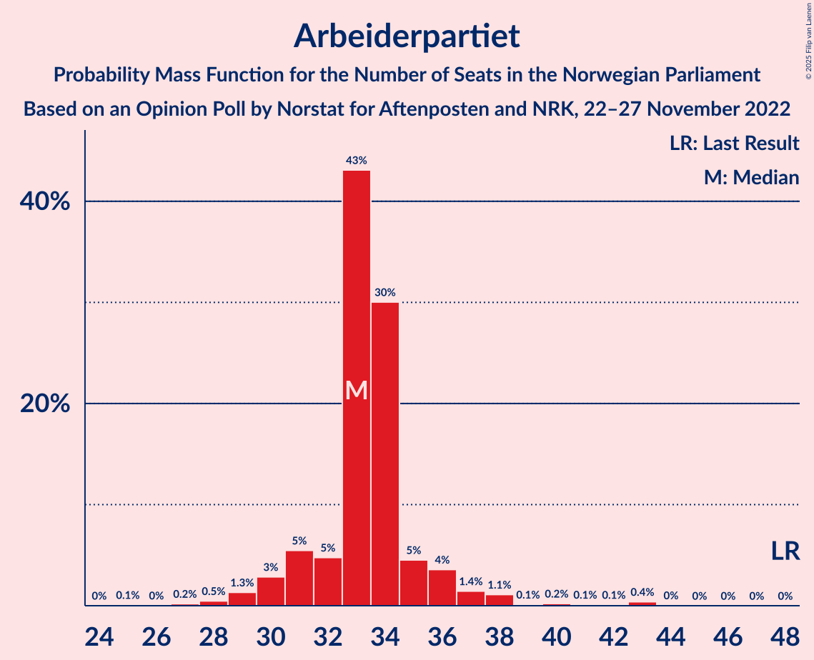
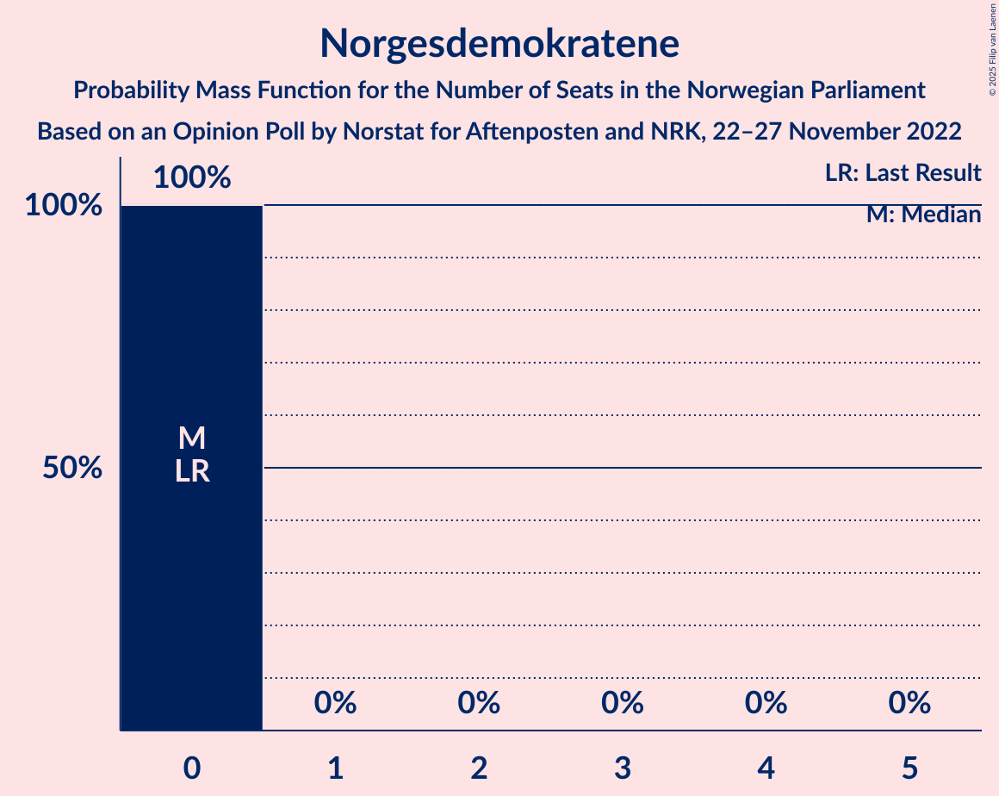
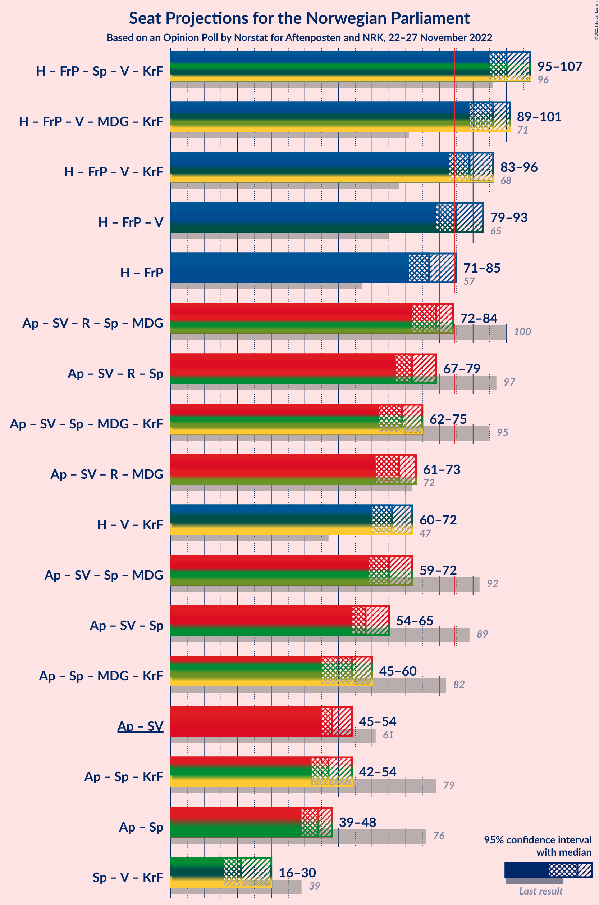

# Opinion Poll by Norstat for Aftenposten and NRK, 22–27 November 2022

<a href="#voting-intentions">Voting Intentions</a> | <a href="#seats">Seats</a> | <a href="#coalitions">Coalitions</a> | <a href="#technical-information">Technical Information</a>

## Voting Intentions

### Confidence Intervals

| Party | Last Result | Poll Result | 80% Confidence Interval | 90% Confidence Interval | 95% Confidence Interval | 99% Confidence Interval |
|:-----:|:-----------:|:-----------:|:-----------------------:|:-----------------------:|:-----------------------:|:-----------------------:|
| Høyre | 20.4% | 30.1% | 28.2–32.0% |27.7–32.6% |27.3–33.1% |26.4–34.0% |
| Arbeiderpartiet | 26.2% | 17.1% | 15.6–18.7% |15.2–19.2% |14.8–19.6% |14.1–20.4% |
| Fremskrittspartiet | 11.6% | 12.8% | 11.5–14.3% |11.1–14.7% |10.8–15.1% |10.2–15.8% |
| Sosialistisk Venstreparti | 7.6% | 8.6% | 7.5–9.9% |7.2–10.2% |7.0–10.5% |6.5–11.2% |
| Rødt | 4.7% | 7.3% | 6.4–8.5% |6.1–8.9% |5.8–9.2% |5.4–9.8% |
| Senterpartiet | 13.5% | 5.9% | 5.0–7.0% |4.8–7.3% |4.5–7.6% |4.2–8.1% |
| Venstre | 4.6% | 4.6% | 3.8–5.6% |3.6–5.9% |3.4–6.1% |3.1–6.7% |
| Miljøpartiet De Grønne | 3.9% | 3.9% | 3.2–4.8% |3.0–5.1% |2.8–5.3% |2.5–5.8% |
| Kristelig Folkeparti | 3.8% | 3.4% | 2.7–4.2% |2.5–4.5% |2.4–4.7% |2.1–5.2% |
| Norgesdemokratene | 1.1% | 1.7% | 1.2–2.3% |1.1–2.5% |1.0–2.7% |0.9–3.1% |
| Industri- og Næringspartiet | 0.3% | 1.7% | 1.2–2.3% |1.1–2.5% |1.0–2.7% |0.9–3.1% |
| Pensjonistpartiet | 0.6% | 1.4% | 1.0–2.0% |0.9–2.2% |0.8–2.3% |0.6–2.7% |

*Note:* The poll result column reflects the actual value used in the calculations. Published results may vary slightly, and in addition be rounded to fewer digits.

## Seats

### Confidence Intervals

| Party | Last Result | Median | 80% Confidence Interval | 90% Confidence Interval | 95% Confidence Interval | 99% Confidence Interval |
|:-----:|:-----------:|:------:|:-----------------------:|:-----------------------:|:-----------------------:|:-----------------------:|
| <a href="#høyre">Høyre</a> | 36 | 52 | 51–57 |50–59 |49–62 |47–64 |
| <a href="#arbeiderpartiet">Arbeiderpartiet</a> | 48 | 33 | 31–35 |30–36 |30–37 |28–42 |
| <a href="#fremskrittspartiet">Fremskrittspartiet</a> | 21 | 26 | 21–28 |19–28 |19–30 |18–33 |
| <a href="#sosialistisk-venstreparti">Sosialistisk Venstreparti</a> | 13 | 14 | 14–18 |13–18 |12–20 |11–20 |
| <a href="#rødt">Rødt</a> | 8 | 14 | 12–15 |11–16 |11–17 |10–18 |
| <a href="#senterpartiet">Senterpartiet</a> | 28 | 11 | 9–12 |8–13 |8–14 |7–15 |
| <a href="#venstre">Venstre</a> | 8 | 8 | 8–9 |3–11 |2–11 |2–12 |
| <a href="#miljøpartiet-de-grønne">Miljøpartiet De Grønne</a> | 3 | 7 | 2–9 |2–9 |2–9 |1–10 |
| <a href="#kristelig-folkeparti">Kristelig Folkeparti</a> | 3 | 3 | 2–7 |2–8 |2–9 |1–9 |
| <a href="#norgesdemokratene">Norgesdemokratene</a> | 0 | 0 | 0 |0 |0 |0 |
| <a href="#industri--og-næringspartiet">Industri- og Næringspartiet</a> | 0 | 0 | 0 |0–1 |0–1 |0–2 |
| <a href="#pensjonistpartiet">Pensjonistpartiet</a> | 0 | 0 | 0 |0 |0 |0–1 |

### Høyre

*For a full overview of the results for this party, see the [Høyre](party-høyre.html) page.*

| Number of Seats | Probability | Accumulated | Special Marks |
|:---------------:|:-----------:|:-----------:|:-------------:|
| 36 | 0% | 100% | Last Result |
| 37 | 0% | 100% |  |
| 38 | 0% | 100% |  |
| 39 | 0% | 100% |  |
| 40 | 0% | 100% |  |
| 41 | 0% | 100% |  |
| 42 | 0% | 100% |  |
| 43 | 0% | 100% |  |
| 44 | 0% | 100% |  |
| 45 | 0% | 100% |  |
| 46 | 0.1% | 100% |  |
| 47 | 0.5% | 99.9% |  |
| 48 | 0.7% | 99.4% |  |
| 49 | 2% | 98.7% |  |
| 50 | 5% | 96% |  |
| 51 | 31% | 91% |  |
| 52 | 20% | 60% | Median |
| 53 | 6% | 40% |  |
| 54 | 2% | 34% |  |
| 55 | 18% | 32% |  |
| 56 | 3% | 14% |  |
| 57 | 1.5% | 11% |  |
| 58 | 3% | 10% |  |
| 59 | 3% | 7% |  |
| 60 | 1.1% | 4% |  |
| 61 | 0.4% | 3% |  |
| 62 | 0.9% | 3% |  |
| 63 | 0.5% | 2% |  |
| 64 | 0.9% | 1.2% |  |
| 65 | 0.1% | 0.3% |  |
| 66 | 0.2% | 0.2% |  |
| 67 | 0% | 0% |  |

### Arbeiderpartiet

*For a full overview of the results for this party, see the [Arbeiderpartiet](party-arbeiderpartiet.html) page.*

| Number of Seats | Probability | Accumulated | Special Marks |
|:---------------:|:-----------:|:-----------:|:-------------:|
| 25 | 0.1% | 100% |  |
| 26 | 0% | 99.9% |  |
| 27 | 0.2% | 99.8% |  |
| 28 | 0.5% | 99.6% |  |
| 29 | 1.3% | 99.2% |  |
| 30 | 3% | 98% |  |
| 31 | 5% | 95% |  |
| 32 | 5% | 90% |  |
| 33 | 43% | 85% | Median |
| 34 | 30% | 42% |  |
| 35 | 5% | 12% |  |
| 36 | 4% | 7% |  |
| 37 | 1.4% | 4% |  |
| 38 | 1.1% | 2% |  |
| 39 | 0.1% | 1.0% |  |
| 40 | 0.2% | 0.9% |  |
| 41 | 0.1% | 0.6% |  |
| 42 | 0.1% | 0.5% |  |
| 43 | 0.4% | 0.4% |  |
| 44 | 0% | 0.1% |  |
| 45 | 0% | 0% |  |
| 46 | 0% | 0% |  |
| 47 | 0% | 0% |  |
| 48 | 0% | 0% | Last Result |

### Fremskrittspartiet

*For a full overview of the results for this party, see the [Fremskrittspartiet](party-fremskrittspartiet.html) page.*

| Number of Seats | Probability | Accumulated | Special Marks |
|:---------------:|:-----------:|:-----------:|:-------------:|
| 17 | 0.3% | 100% |  |
| 18 | 1.0% | 99.7% |  |
| 19 | 4% | 98.7% |  |
| 20 | 1.4% | 95% |  |
| 21 | 10% | 94% | Last Result |
| 22 | 14% | 84% |  |
| 23 | 4% | 70% |  |
| 24 | 3% | 66% |  |
| 25 | 9% | 63% |  |
| 26 | 31% | 54% | Median |
| 27 | 2% | 23% |  |
| 28 | 18% | 22% |  |
| 29 | 0.3% | 4% |  |
| 30 | 1.1% | 3% |  |
| 31 | 0.4% | 2% |  |
| 32 | 0.2% | 2% |  |
| 33 | 1.2% | 2% |  |
| 34 | 0.4% | 0.4% |  |
| 35 | 0% | 0% |  |

### Sosialistisk Venstreparti

*For a full overview of the results for this party, see the [Sosialistisk Venstreparti](party-sosialistiskvenstreparti.html) page.*

| Number of Seats | Probability | Accumulated | Special Marks |
|:---------------:|:-----------:|:-----------:|:-------------:|
| 10 | 0.1% | 100% |  |
| 11 | 0.6% | 99.9% |  |
| 12 | 3% | 99.3% |  |
| 13 | 5% | 96% | Last Result |
| 14 | 48% | 92% | Median |
| 15 | 10% | 43% |  |
| 16 | 10% | 33% |  |
| 17 | 12% | 23% |  |
| 18 | 7% | 12% |  |
| 19 | 2% | 5% |  |
| 20 | 3% | 3% |  |
| 21 | 0.1% | 0.3% |  |
| 22 | 0.1% | 0.1% |  |
| 23 | 0% | 0% |  |

### Rødt

*For a full overview of the results for this party, see the [Rødt](party-rødt.html) page.*

| Number of Seats | Probability | Accumulated | Special Marks |
|:---------------:|:-----------:|:-----------:|:-------------:|
| 8 | 0% | 100% | Last Result |
| 9 | 0.4% | 100% |  |
| 10 | 1.3% | 99.6% |  |
| 11 | 5% | 98% |  |
| 12 | 14% | 94% |  |
| 13 | 12% | 80% |  |
| 14 | 49% | 67% | Median |
| 15 | 12% | 18% |  |
| 16 | 2% | 6% |  |
| 17 | 1.4% | 4% |  |
| 18 | 2% | 2% |  |
| 19 | 0.1% | 0.3% |  |
| 20 | 0.1% | 0.1% |  |
| 21 | 0% | 0% |  |

### Senterpartiet

*For a full overview of the results for this party, see the [Senterpartiet](party-senterpartiet.html) page.*

| Number of Seats | Probability | Accumulated | Special Marks |
|:---------------:|:-----------:|:-----------:|:-------------:|
| 1 | 0.2% | 100% |  |
| 2 | 0% | 99.8% |  |
| 3 | 0% | 99.8% |  |
| 4 | 0% | 99.8% |  |
| 5 | 0% | 99.8% |  |
| 6 | 0.1% | 99.8% |  |
| 7 | 0.4% | 99.7% |  |
| 8 | 9% | 99.3% |  |
| 9 | 21% | 90% |  |
| 10 | 14% | 69% |  |
| 11 | 33% | 55% | Median |
| 12 | 14% | 22% |  |
| 13 | 3% | 7% |  |
| 14 | 3% | 4% |  |
| 15 | 0.7% | 1.0% |  |
| 16 | 0.3% | 0.3% |  |
| 17 | 0% | 0% |  |
| 18 | 0% | 0% |  |
| 19 | 0% | 0% |  |
| 20 | 0% | 0% |  |
| 21 | 0% | 0% |  |
| 22 | 0% | 0% |  |
| 23 | 0% | 0% |  |
| 24 | 0% | 0% |  |
| 25 | 0% | 0% |  |
| 26 | 0% | 0% |  |
| 27 | 0% | 0% |  |
| 28 | 0% | 0% | Last Result |

### Venstre

*For a full overview of the results for this party, see the [Venstre](party-venstre.html) page.*

| Number of Seats | Probability | Accumulated | Special Marks |
|:---------------:|:-----------:|:-----------:|:-------------:|
| 2 | 4% | 100% |  |
| 3 | 5% | 96% |  |
| 4 | 0% | 92% |  |
| 5 | 0% | 92% |  |
| 6 | 0% | 92% |  |
| 7 | 2% | 92% |  |
| 8 | 61% | 90% | Last Result, Median |
| 9 | 20% | 29% |  |
| 10 | 3% | 9% |  |
| 11 | 3% | 5% |  |
| 12 | 2% | 2% |  |
| 13 | 0.1% | 0.2% |  |
| 14 | 0% | 0% |  |

### Miljøpartiet De Grønne

*For a full overview of the results for this party, see the [Miljøpartiet De Grønne](party-miljøpartietdegrønne.html) page.*

| Number of Seats | Probability | Accumulated | Special Marks |
|:---------------:|:-----------:|:-----------:|:-------------:|
| 1 | 2% | 100% |  |
| 2 | 37% | 98% |  |
| 3 | 5% | 61% | Last Result |
| 4 | 0% | 56% |  |
| 5 | 0% | 56% |  |
| 6 | 0% | 56% |  |
| 7 | 9% | 56% | Median |
| 8 | 13% | 47% |  |
| 9 | 33% | 34% |  |
| 10 | 0.8% | 1.1% |  |
| 11 | 0.3% | 0.3% |  |
| 12 | 0% | 0% |  |

### Kristelig Folkeparti

*For a full overview of the results for this party, see the [Kristelig Folkeparti](party-kristeligfolkeparti.html) page.*

| Number of Seats | Probability | Accumulated | Special Marks |
|:---------------:|:-----------:|:-----------:|:-------------:|
| 0 | 0.5% | 100% |  |
| 1 | 2% | 99.5% |  |
| 2 | 40% | 98% |  |
| 3 | 29% | 58% | Last Result, Median |
| 4 | 0% | 29% |  |
| 5 | 0% | 29% |  |
| 6 | 0% | 29% |  |
| 7 | 21% | 29% |  |
| 8 | 5% | 7% |  |
| 9 | 2% | 3% |  |
| 10 | 0.3% | 0.3% |  |
| 11 | 0% | 0% |  |

### Norgesdemokratene

*For a full overview of the results for this party, see the [Norgesdemokratene](party-norgesdemokratene.html) page.*

| Number of Seats | Probability | Accumulated | Special Marks |
|:---------------:|:-----------:|:-----------:|:-------------:|
| 0 | 100% | 100% | Last Result, Median |

### Industri- og Næringspartiet

*For a full overview of the results for this party, see the [Industri- og Næringspartiet](party-industri-ognæringspartiet.html) page.*

| Number of Seats | Probability | Accumulated | Special Marks |
|:---------------:|:-----------:|:-----------:|:-------------:|
| 0 | 93% | 100% | Last Result, Median |
| 1 | 5% | 7% |  |
| 2 | 2% | 2% |  |
| 3 | 0.1% | 0.1% |  |
| 4 | 0% | 0% |  |

### Pensjonistpartiet

*For a full overview of the results for this party, see the [Pensjonistpartiet](party-pensjonistpartiet.html) page.*

| Number of Seats | Probability | Accumulated | Special Marks |
|:---------------:|:-----------:|:-----------:|:-------------:|
| 0 | 98% | 100% | Last Result, Median |
| 1 | 2% | 2% |  |
| 2 | 0% | 0% |  |

## Coalitions

### Confidence Intervals

| Coalition | Last Result | Median | Majority? | 80% Confidence Interval | 90% Confidence Interval | 95% Confidence Interval | 99% Confidence Interval |
|:---------:|:-----------:|:------:|:---------:|:-----------------------:|:-----------------------:|:-----------------------:|:-----------------------:|
| Høyre – Fremskrittspartiet – Senterpartiet – Venstre – Kristelig Folkeparti | 96 | 100 | 100% | 97–104 | 95–105 | 95–107 | 91–110 |
| Høyre – Fremskrittspartiet – Venstre – Miljøpartiet De Grønne – Kristelig Folkeparti | 71 | 96 | 99.8% | 91–97 | 91–99 | 89–101 | 86–105 |
| Høyre – Fremskrittspartiet – Venstre – Kristelig Folkeparti | 68 | 89 | 96% | 87–95 | 85–95 | 83–96 | 80–99 |
| Høyre – Fremskrittspartiet – Venstre | 65 | 85 | 77% | 82–89 | 81–91 | 79–93 | 77–95 |
| Høyre – Fremskrittspartiet | 57 | 77 | 4% | 75–81 | 72–84 | 71–85 | 70–87 |
| Arbeiderpartiet – Sosialistisk Venstreparti – Rødt – Senterpartiet – Miljøpartiet De Grønne | 100 | 79 | 2% | 73–81 | 73–83 | 72–84 | 69–87 |
| Arbeiderpartiet – Sosialistisk Venstreparti – Rødt – Senterpartiet | 97 | 72 | 0% | 71–77 | 69–77 | 67–79 | 63–82 |
| Arbeiderpartiet – Sosialistisk Venstreparti – Senterpartiet – Miljøpartiet De Grønne – Kristelig Folkeparti | 95 | 69 | 0% | 65–72 | 63–74 | 62–75 | 60–78 |
| Arbeiderpartiet – Sosialistisk Venstreparti – Rødt – Miljøpartiet De Grønne | 72 | 68 | 0% | 64–70 | 63–73 | 61–73 | 58–76 |
| Høyre – Venstre – Kristelig Folkeparti | 47 | 66 | 0% | 61–69 | 61–71 | 60–72 | 58–76 |
| Arbeiderpartiet – Sosialistisk Venstreparti – Senterpartiet – Miljøpartiet De Grønne | 92 | 65 | 0% | 59–68 | 59–69 | 59–72 | 57–75 |
| Arbeiderpartiet – Sosialistisk Venstreparti – Senterpartiet | 89 | 58 | 0% | 57–62 | 56–64 | 54–65 | 52–68 |
| Arbeiderpartiet – Senterpartiet – Miljøpartiet De Grønne – Kristelig Folkeparti | 82 | 54 | 0% | 49–57 | 48–59 | 45–60 | 44–63 |
| Arbeiderpartiet – Sosialistisk Venstreparti | 61 | 48 | 0% | 46–51 | 46–52 | 45–54 | 41–56 |
| Arbeiderpartiet – Senterpartiet – Kristelig Folkeparti | 79 | 47 | 0% | 45–51 | 43–53 | 42–54 | 40–57 |
| Arbeiderpartiet – Senterpartiet | 76 | 44 | 0% | 41–46 | 40–47 | 39–48 | 37–52 |
| Senterpartiet – Venstre – Kristelig Folkeparti | 39 | 21 | 0% | 19–26 | 17–27 | 16–30 | 13–32 |

### Høyre – Fremskrittspartiet – Senterpartiet – Venstre – Kristelig Folkeparti

| Number of Seats | Probability | Accumulated | Special Marks |
|:---------------:|:-----------:|:-----------:|:-------------:|
| 89 | 0.1% | 100% |  |
| 90 | 0.1% | 99.9% |  |
| 91 | 0.4% | 99.9% |  |
| 92 | 0.3% | 99.4% |  |
| 93 | 0.8% | 99.1% |  |
| 94 | 0.5% | 98% |  |
| 95 | 3% | 98% |  |
| 96 | 3% | 95% | Last Result |
| 97 | 5% | 92% |  |
| 98 | 34% | 87% |  |
| 99 | 3% | 53% |  |
| 100 | 6% | 51% | Median |
| 101 | 12% | 44% |  |
| 102 | 6% | 32% |  |
| 103 | 2% | 25% |  |
| 104 | 18% | 24% |  |
| 105 | 1.3% | 6% |  |
| 106 | 1.2% | 4% |  |
| 107 | 0.8% | 3% |  |
| 108 | 2% | 2% |  |
| 109 | 0.1% | 0.6% |  |
| 110 | 0.4% | 0.5% |  |
| 111 | 0% | 0.1% |  |
| 112 | 0% | 0.1% |  |
| 113 | 0% | 0% |  |

### Høyre – Fremskrittspartiet – Venstre – Miljøpartiet De Grønne – Kristelig Folkeparti

| Number of Seats | Probability | Accumulated | Special Marks |
|:---------------:|:-----------:|:-----------:|:-------------:|
| 71 | 0% | 100% | Last Result |
| 72 | 0% | 100% |  |
| 73 | 0% | 100% |  |
| 74 | 0% | 100% |  |
| 75 | 0% | 100% |  |
| 76 | 0% | 100% |  |
| 77 | 0% | 100% |  |
| 78 | 0% | 100% |  |
| 79 | 0% | 100% |  |
| 80 | 0% | 100% |  |
| 81 | 0% | 100% |  |
| 82 | 0% | 100% |  |
| 83 | 0% | 100% |  |
| 84 | 0.2% | 100% |  |
| 85 | 0.2% | 99.8% | Majority |
| 86 | 0.2% | 99.6% |  |
| 87 | 0.5% | 99.5% |  |
| 88 | 0.8% | 99.0% |  |
| 89 | 1.3% | 98% |  |
| 90 | 1.2% | 97% |  |
| 91 | 9% | 96% |  |
| 92 | 6% | 86% |  |
| 93 | 4% | 81% |  |
| 94 | 4% | 77% |  |
| 95 | 6% | 73% |  |
| 96 | 32% | 67% | Median |
| 97 | 27% | 35% |  |
| 98 | 1.5% | 8% |  |
| 99 | 3% | 6% |  |
| 100 | 0.4% | 3% |  |
| 101 | 1.5% | 3% |  |
| 102 | 0.4% | 1.2% |  |
| 103 | 0.1% | 0.8% |  |
| 104 | 0.1% | 0.6% |  |
| 105 | 0.2% | 0.5% |  |
| 106 | 0% | 0.3% |  |
| 107 | 0% | 0.3% |  |
| 108 | 0.1% | 0.3% |  |
| 109 | 0.2% | 0.2% |  |
| 110 | 0% | 0% |  |

### Høyre – Fremskrittspartiet – Venstre – Kristelig Folkeparti

| Number of Seats | Probability | Accumulated | Special Marks |
|:---------------:|:-----------:|:-----------:|:-------------:|
| 68 | 0% | 100% | Last Result |
| 69 | 0% | 100% |  |
| 70 | 0% | 100% |  |
| 71 | 0% | 100% |  |
| 72 | 0% | 100% |  |
| 73 | 0% | 100% |  |
| 74 | 0% | 100% |  |
| 75 | 0% | 100% |  |
| 76 | 0% | 100% |  |
| 77 | 0% | 100% |  |
| 78 | 0% | 100% |  |
| 79 | 0.1% | 100% |  |
| 80 | 0.4% | 99.9% |  |
| 81 | 1.0% | 99.5% |  |
| 82 | 0.4% | 98% |  |
| 83 | 0.5% | 98% |  |
| 84 | 2% | 97% |  |
| 85 | 2% | 96% | Majority |
| 86 | 0.8% | 94% |  |
| 87 | 35% | 93% |  |
| 88 | 4% | 58% |  |
| 89 | 11% | 54% | Median |
| 90 | 9% | 42% |  |
| 91 | 5% | 33% |  |
| 92 | 3% | 28% |  |
| 93 | 1.4% | 25% |  |
| 94 | 3% | 24% |  |
| 95 | 17% | 21% |  |
| 96 | 1.2% | 3% |  |
| 97 | 1.0% | 2% |  |
| 98 | 0.4% | 0.9% |  |
| 99 | 0.1% | 0.5% |  |
| 100 | 0% | 0.4% |  |
| 101 | 0.1% | 0.4% |  |
| 102 | 0.2% | 0.3% |  |
| 103 | 0% | 0% |  |

### Høyre – Fremskrittspartiet – Venstre

| Number of Seats | Probability | Accumulated | Special Marks |
|:---------------:|:-----------:|:-----------:|:-------------:|
| 65 | 0% | 100% | Last Result |
| 66 | 0% | 100% |  |
| 67 | 0% | 100% |  |
| 68 | 0% | 100% |  |
| 69 | 0% | 100% |  |
| 70 | 0% | 100% |  |
| 71 | 0% | 100% |  |
| 72 | 0% | 100% |  |
| 73 | 0% | 100% |  |
| 74 | 0% | 100% |  |
| 75 | 0.1% | 99.9% |  |
| 76 | 0.1% | 99.9% |  |
| 77 | 0.3% | 99.7% |  |
| 78 | 0.5% | 99.4% |  |
| 79 | 1.4% | 98.9% |  |
| 80 | 1.3% | 97% |  |
| 81 | 3% | 96% |  |
| 82 | 4% | 94% |  |
| 83 | 4% | 90% |  |
| 84 | 9% | 86% |  |
| 85 | 30% | 77% | Majority |
| 86 | 11% | 46% | Median |
| 87 | 6% | 36% |  |
| 88 | 19% | 30% |  |
| 89 | 2% | 10% |  |
| 90 | 2% | 8% |  |
| 91 | 2% | 7% |  |
| 92 | 2% | 5% |  |
| 93 | 0.9% | 3% |  |
| 94 | 1.4% | 2% |  |
| 95 | 0.5% | 0.8% |  |
| 96 | 0.1% | 0.4% |  |
| 97 | 0.1% | 0.3% |  |
| 98 | 0% | 0.2% |  |
| 99 | 0.2% | 0.2% |  |
| 100 | 0% | 0% |  |

### Høyre – Fremskrittspartiet

| Number of Seats | Probability | Accumulated | Special Marks |
|:---------------:|:-----------:|:-----------:|:-------------:|
| 57 | 0% | 100% | Last Result |
| 58 | 0% | 100% |  |
| 59 | 0% | 100% |  |
| 60 | 0% | 100% |  |
| 61 | 0% | 100% |  |
| 62 | 0% | 100% |  |
| 63 | 0% | 100% |  |
| 64 | 0% | 100% |  |
| 65 | 0% | 100% |  |
| 66 | 0% | 100% |  |
| 67 | 0% | 100% |  |
| 68 | 0.1% | 100% |  |
| 69 | 0% | 99.8% |  |
| 70 | 0.3% | 99.8% |  |
| 71 | 2% | 99.4% |  |
| 72 | 3% | 97% |  |
| 73 | 1.3% | 94% |  |
| 74 | 3% | 93% |  |
| 75 | 2% | 90% |  |
| 76 | 10% | 88% |  |
| 77 | 38% | 77% |  |
| 78 | 6% | 40% | Median |
| 79 | 3% | 34% |  |
| 80 | 19% | 31% |  |
| 81 | 3% | 12% |  |
| 82 | 1.0% | 10% |  |
| 83 | 2% | 9% |  |
| 84 | 3% | 6% |  |
| 85 | 2% | 4% | Majority |
| 86 | 1.2% | 2% |  |
| 87 | 0.6% | 0.9% |  |
| 88 | 0.1% | 0.4% |  |
| 89 | 0.2% | 0.3% |  |
| 90 | 0% | 0.1% |  |
| 91 | 0% | 0.1% |  |
| 92 | 0% | 0% |  |

### Arbeiderpartiet – Sosialistisk Venstreparti – Rødt – Senterpartiet – Miljøpartiet De Grønne

| Number of Seats | Probability | Accumulated | Special Marks |
|:---------------:|:-----------:|:-----------:|:-------------:|
| 66 | 0.2% | 100% |  |
| 67 | 0.1% | 99.7% |  |
| 68 | 0% | 99.6% |  |
| 69 | 0.1% | 99.6% |  |
| 70 | 0.4% | 99.5% |  |
| 71 | 1.0% | 99.1% |  |
| 72 | 1.2% | 98% |  |
| 73 | 18% | 97% |  |
| 74 | 3% | 79% |  |
| 75 | 2% | 76% |  |
| 76 | 4% | 75% |  |
| 77 | 5% | 71% |  |
| 78 | 9% | 66% |  |
| 79 | 11% | 57% | Median |
| 80 | 9% | 46% |  |
| 81 | 30% | 37% |  |
| 82 | 0.9% | 7% |  |
| 83 | 2% | 6% |  |
| 84 | 2% | 4% |  |
| 85 | 0.5% | 2% | Majority |
| 86 | 0.5% | 2% |  |
| 87 | 1.1% | 1.4% |  |
| 88 | 0.2% | 0.3% |  |
| 89 | 0.1% | 0.1% |  |
| 90 | 0% | 0% |  |
| 91 | 0% | 0% |  |
| 92 | 0% | 0% |  |
| 93 | 0% | 0% |  |
| 94 | 0% | 0% |  |
| 95 | 0% | 0% |  |
| 96 | 0% | 0% |  |
| 97 | 0% | 0% |  |
| 98 | 0% | 0% |  |
| 99 | 0% | 0% |  |
| 100 | 0% | 0% | Last Result |

### Arbeiderpartiet – Sosialistisk Venstreparti – Rødt – Senterpartiet

| Number of Seats | Probability | Accumulated | Special Marks |
|:---------------:|:-----------:|:-----------:|:-------------:|
| 59 | 0.2% | 100% |  |
| 60 | 0.1% | 99.8% |  |
| 61 | 0% | 99.7% |  |
| 62 | 0% | 99.7% |  |
| 63 | 0.2% | 99.7% |  |
| 64 | 0.1% | 99.5% |  |
| 65 | 0.2% | 99.3% |  |
| 66 | 0.4% | 99.2% |  |
| 67 | 1.4% | 98.7% |  |
| 68 | 0.9% | 97% |  |
| 69 | 3% | 96% |  |
| 70 | 2% | 94% |  |
| 71 | 27% | 92% |  |
| 72 | 37% | 65% | Median |
| 73 | 2% | 28% |  |
| 74 | 5% | 27% |  |
| 75 | 3% | 22% |  |
| 76 | 6% | 19% |  |
| 77 | 9% | 13% |  |
| 78 | 0.9% | 4% |  |
| 79 | 1.0% | 3% |  |
| 80 | 0.8% | 2% |  |
| 81 | 0.3% | 0.8% |  |
| 82 | 0.1% | 0.5% |  |
| 83 | 0.2% | 0.4% |  |
| 84 | 0.2% | 0.2% |  |
| 85 | 0% | 0% | Majority |
| 86 | 0% | 0% |  |
| 87 | 0% | 0% |  |
| 88 | 0% | 0% |  |
| 89 | 0% | 0% |  |
| 90 | 0% | 0% |  |
| 91 | 0% | 0% |  |
| 92 | 0% | 0% |  |
| 93 | 0% | 0% |  |
| 94 | 0% | 0% |  |
| 95 | 0% | 0% |  |
| 96 | 0% | 0% |  |
| 97 | 0% | 0% | Last Result |

### Arbeiderpartiet – Sosialistisk Venstreparti – Senterpartiet – Miljøpartiet De Grønne – Kristelig Folkeparti

| Number of Seats | Probability | Accumulated | Special Marks |
|:---------------:|:-----------:|:-----------:|:-------------:|
| 56 | 0.1% | 100% |  |
| 57 | 0% | 99.9% |  |
| 58 | 0% | 99.9% |  |
| 59 | 0.2% | 99.8% |  |
| 60 | 0.7% | 99.6% |  |
| 61 | 0.6% | 98.9% |  |
| 62 | 2% | 98% |  |
| 63 | 4% | 97% |  |
| 64 | 2% | 93% |  |
| 65 | 1.2% | 91% |  |
| 66 | 20% | 90% |  |
| 67 | 9% | 69% |  |
| 68 | 4% | 60% | Median |
| 69 | 31% | 56% |  |
| 70 | 3% | 25% |  |
| 71 | 9% | 22% |  |
| 72 | 6% | 13% |  |
| 73 | 1.1% | 7% |  |
| 74 | 1.2% | 6% |  |
| 75 | 2% | 4% |  |
| 76 | 0.6% | 2% |  |
| 77 | 0.8% | 1.5% |  |
| 78 | 0.4% | 0.6% |  |
| 79 | 0.1% | 0.2% |  |
| 80 | 0.1% | 0.1% |  |
| 81 | 0% | 0% |  |
| 82 | 0% | 0% |  |
| 83 | 0% | 0% |  |
| 84 | 0% | 0% |  |
| 85 | 0% | 0% | Majority |
| 86 | 0% | 0% |  |
| 87 | 0% | 0% |  |
| 88 | 0% | 0% |  |
| 89 | 0% | 0% |  |
| 90 | 0% | 0% |  |
| 91 | 0% | 0% |  |
| 92 | 0% | 0% |  |
| 93 | 0% | 0% |  |
| 94 | 0% | 0% |  |
| 95 | 0% | 0% | Last Result |

### Arbeiderpartiet – Sosialistisk Venstreparti – Rødt – Miljøpartiet De Grønne

| Number of Seats | Probability | Accumulated | Special Marks |
|:---------------:|:-----------:|:-----------:|:-------------:|
| 56 | 0% | 100% |  |
| 57 | 0% | 99.9% |  |
| 58 | 0.4% | 99.9% |  |
| 59 | 0.1% | 99.5% |  |
| 60 | 2% | 99.4% |  |
| 61 | 0.8% | 98% |  |
| 62 | 1.4% | 97% |  |
| 63 | 1.4% | 95% |  |
| 64 | 18% | 94% |  |
| 65 | 2% | 76% |  |
| 66 | 6% | 74% |  |
| 67 | 13% | 68% |  |
| 68 | 6% | 54% | Median |
| 69 | 2% | 49% |  |
| 70 | 39% | 47% |  |
| 71 | 0.5% | 8% |  |
| 72 | 2% | 7% | Last Result |
| 73 | 3% | 5% |  |
| 74 | 0.5% | 2% |  |
| 75 | 0.7% | 1.4% |  |
| 76 | 0.3% | 0.8% |  |
| 77 | 0.4% | 0.5% |  |
| 78 | 0.1% | 0.1% |  |
| 79 | 0% | 0% |  |

### Høyre – Venstre – Kristelig Folkeparti

| Number of Seats | Probability | Accumulated | Special Marks |
|:---------------:|:-----------:|:-----------:|:-------------:|
| 47 | 0% | 100% | Last Result |
| 48 | 0% | 100% |  |
| 49 | 0% | 100% |  |
| 50 | 0% | 100% |  |
| 51 | 0% | 100% |  |
| 52 | 0% | 100% |  |
| 53 | 0% | 100% |  |
| 54 | 0% | 100% |  |
| 55 | 0% | 100% |  |
| 56 | 0.2% | 100% |  |
| 57 | 0.2% | 99.7% |  |
| 58 | 0.7% | 99.5% |  |
| 59 | 0.6% | 98.9% |  |
| 60 | 1.2% | 98% |  |
| 61 | 30% | 97% |  |
| 62 | 3% | 67% |  |
| 63 | 4% | 65% | Median |
| 64 | 6% | 61% |  |
| 65 | 5% | 55% |  |
| 66 | 8% | 51% |  |
| 67 | 27% | 43% |  |
| 68 | 5% | 16% |  |
| 69 | 3% | 12% |  |
| 70 | 2% | 8% |  |
| 71 | 3% | 6% |  |
| 72 | 0.8% | 3% |  |
| 73 | 0.3% | 2% |  |
| 74 | 0.3% | 2% |  |
| 75 | 0.6% | 1.3% |  |
| 76 | 0.6% | 0.7% |  |
| 77 | 0% | 0.2% |  |
| 78 | 0.1% | 0.1% |  |
| 79 | 0% | 0.1% |  |
| 80 | 0% | 0% |  |

### Arbeiderpartiet – Sosialistisk Venstreparti – Senterpartiet – Miljøpartiet De Grønne

| Number of Seats | Probability | Accumulated | Special Marks |
|:---------------:|:-----------:|:-----------:|:-------------:|
| 53 | 0% | 100% |  |
| 54 | 0.1% | 99.9% |  |
| 55 | 0% | 99.8% |  |
| 56 | 0.2% | 99.8% |  |
| 57 | 0.3% | 99.5% |  |
| 58 | 0.8% | 99.2% |  |
| 59 | 18% | 98% |  |
| 60 | 3% | 80% |  |
| 61 | 3% | 77% |  |
| 62 | 2% | 73% |  |
| 63 | 3% | 71% |  |
| 64 | 11% | 68% |  |
| 65 | 7% | 56% | Median |
| 66 | 3% | 49% |  |
| 67 | 30% | 46% |  |
| 68 | 10% | 16% |  |
| 69 | 2% | 6% |  |
| 70 | 1.2% | 5% |  |
| 71 | 0.4% | 3% |  |
| 72 | 2% | 3% |  |
| 73 | 0.4% | 1.3% |  |
| 74 | 0.4% | 0.9% |  |
| 75 | 0.1% | 0.5% |  |
| 76 | 0.4% | 0.4% |  |
| 77 | 0% | 0% |  |
| 78 | 0% | 0% |  |
| 79 | 0% | 0% |  |
| 80 | 0% | 0% |  |
| 81 | 0% | 0% |  |
| 82 | 0% | 0% |  |
| 83 | 0% | 0% |  |
| 84 | 0% | 0% |  |
| 85 | 0% | 0% | Majority |
| 86 | 0% | 0% |  |
| 87 | 0% | 0% |  |
| 88 | 0% | 0% |  |
| 89 | 0% | 0% |  |
| 90 | 0% | 0% |  |
| 91 | 0% | 0% |  |
| 92 | 0% | 0% | Last Result |

### Arbeiderpartiet – Sosialistisk Venstreparti – Senterpartiet

| Number of Seats | Probability | Accumulated | Special Marks |
|:---------------:|:-----------:|:-----------:|:-------------:|
| 49 | 0.2% | 100% |  |
| 50 | 0.1% | 99.8% |  |
| 51 | 0.1% | 99.7% |  |
| 52 | 0.5% | 99.5% |  |
| 53 | 0.5% | 99.0% |  |
| 54 | 2% | 98.6% |  |
| 55 | 0.6% | 97% |  |
| 56 | 2% | 96% |  |
| 57 | 19% | 94% |  |
| 58 | 37% | 75% | Median |
| 59 | 8% | 38% |  |
| 60 | 8% | 30% |  |
| 61 | 4% | 23% |  |
| 62 | 11% | 19% |  |
| 63 | 3% | 8% |  |
| 64 | 2% | 5% |  |
| 65 | 0.9% | 3% |  |
| 66 | 1.1% | 2% |  |
| 67 | 0.2% | 0.9% |  |
| 68 | 0.5% | 0.7% |  |
| 69 | 0% | 0.2% |  |
| 70 | 0.1% | 0.1% |  |
| 71 | 0% | 0% |  |
| 72 | 0% | 0% |  |
| 73 | 0% | 0% |  |
| 74 | 0% | 0% |  |
| 75 | 0% | 0% |  |
| 76 | 0% | 0% |  |
| 77 | 0% | 0% |  |
| 78 | 0% | 0% |  |
| 79 | 0% | 0% |  |
| 80 | 0% | 0% |  |
| 81 | 0% | 0% |  |
| 82 | 0% | 0% |  |
| 83 | 0% | 0% |  |
| 84 | 0% | 0% |  |
| 85 | 0% | 0% | Majority |
| 86 | 0% | 0% |  |
| 87 | 0% | 0% |  |
| 88 | 0% | 0% |  |
| 89 | 0% | 0% | Last Result |

### Arbeiderpartiet – Senterpartiet – Miljøpartiet De Grønne – Kristelig Folkeparti

| Number of Seats | Probability | Accumulated | Special Marks |
|:---------------:|:-----------:|:-----------:|:-------------:|
| 39 | 0.1% | 100% |  |
| 40 | 0% | 99.9% |  |
| 41 | 0% | 99.9% |  |
| 42 | 0% | 99.9% |  |
| 43 | 0.3% | 99.8% |  |
| 44 | 0.3% | 99.5% |  |
| 45 | 2% | 99.3% |  |
| 46 | 0.5% | 97% |  |
| 47 | 0.6% | 96% |  |
| 48 | 3% | 96% |  |
| 49 | 3% | 93% |  |
| 50 | 10% | 90% |  |
| 51 | 3% | 80% |  |
| 52 | 19% | 76% |  |
| 53 | 7% | 57% |  |
| 54 | 2% | 50% | Median |
| 55 | 35% | 48% |  |
| 56 | 3% | 13% |  |
| 57 | 3% | 10% |  |
| 58 | 1.5% | 7% |  |
| 59 | 2% | 5% |  |
| 60 | 2% | 4% |  |
| 61 | 0.6% | 2% |  |
| 62 | 0.5% | 2% |  |
| 63 | 0.6% | 1.1% |  |
| 64 | 0.1% | 0.5% |  |
| 65 | 0.4% | 0.4% |  |
| 66 | 0% | 0% |  |
| 67 | 0% | 0% |  |
| 68 | 0% | 0% |  |
| 69 | 0% | 0% |  |
| 70 | 0% | 0% |  |
| 71 | 0% | 0% |  |
| 72 | 0% | 0% |  |
| 73 | 0% | 0% |  |
| 74 | 0% | 0% |  |
| 75 | 0% | 0% |  |
| 76 | 0% | 0% |  |
| 77 | 0% | 0% |  |
| 78 | 0% | 0% |  |
| 79 | 0% | 0% |  |
| 80 | 0% | 0% |  |
| 81 | 0% | 0% |  |
| 82 | 0% | 0% | Last Result |

### Arbeiderpartiet – Sosialistisk Venstreparti

| Number of Seats | Probability | Accumulated | Special Marks |
|:---------------:|:-----------:|:-----------:|:-------------:|
| 40 | 0.2% | 100% |  |
| 41 | 0.3% | 99.8% |  |
| 42 | 0.2% | 99.5% |  |
| 43 | 0.2% | 99.3% |  |
| 44 | 2% | 99.2% |  |
| 45 | 2% | 98% |  |
| 46 | 6% | 96% |  |
| 47 | 31% | 90% | Median |
| 48 | 21% | 58% |  |
| 49 | 3% | 37% |  |
| 50 | 21% | 34% |  |
| 51 | 6% | 13% |  |
| 52 | 3% | 7% |  |
| 53 | 1.2% | 4% |  |
| 54 | 0.5% | 3% |  |
| 55 | 0.7% | 2% |  |
| 56 | 1.3% | 1.5% |  |
| 57 | 0.1% | 0.2% |  |
| 58 | 0.1% | 0.1% |  |
| 59 | 0% | 0% |  |
| 60 | 0% | 0% |  |
| 61 | 0% | 0% | Last Result |

### Arbeiderpartiet – Senterpartiet – Kristelig Folkeparti

| Number of Seats | Probability | Accumulated | Special Marks |
|:---------------:|:-----------:|:-----------:|:-------------:|
| 35 | 0.1% | 100% |  |
| 36 | 0.1% | 99.9% |  |
| 37 | 0% | 99.9% |  |
| 38 | 0.1% | 99.9% |  |
| 39 | 0.1% | 99.8% |  |
| 40 | 0.5% | 99.7% |  |
| 41 | 2% | 99.2% |  |
| 42 | 2% | 98% |  |
| 43 | 3% | 96% |  |
| 44 | 2% | 93% |  |
| 45 | 2% | 91% |  |
| 46 | 35% | 89% |  |
| 47 | 7% | 54% | Median |
| 48 | 12% | 47% |  |
| 49 | 5% | 34% |  |
| 50 | 18% | 30% |  |
| 51 | 4% | 11% |  |
| 52 | 2% | 8% |  |
| 53 | 3% | 6% |  |
| 54 | 0.7% | 3% |  |
| 55 | 1.3% | 2% |  |
| 56 | 0.3% | 1.2% |  |
| 57 | 0.7% | 0.8% |  |
| 58 | 0% | 0.1% |  |
| 59 | 0.1% | 0.1% |  |
| 60 | 0% | 0% |  |
| 61 | 0% | 0% |  |
| 62 | 0% | 0% |  |
| 63 | 0% | 0% |  |
| 64 | 0% | 0% |  |
| 65 | 0% | 0% |  |
| 66 | 0% | 0% |  |
| 67 | 0% | 0% |  |
| 68 | 0% | 0% |  |
| 69 | 0% | 0% |  |
| 70 | 0% | 0% |  |
| 71 | 0% | 0% |  |
| 72 | 0% | 0% |  |
| 73 | 0% | 0% |  |
| 74 | 0% | 0% |  |
| 75 | 0% | 0% |  |
| 76 | 0% | 0% |  |
| 77 | 0% | 0% |  |
| 78 | 0% | 0% |  |
| 79 | 0% | 0% | Last Result |

### Arbeiderpartiet – Senterpartiet

| Number of Seats | Probability | Accumulated | Special Marks |
|:---------------:|:-----------:|:-----------:|:-------------:|
| 33 | 0% | 100% |  |
| 34 | 0.1% | 99.9% |  |
| 35 | 0.1% | 99.9% |  |
| 36 | 0.1% | 99.8% |  |
| 37 | 0.4% | 99.7% |  |
| 38 | 0.4% | 99.4% |  |
| 39 | 3% | 99.0% |  |
| 40 | 3% | 96% |  |
| 41 | 3% | 93% |  |
| 42 | 2% | 90% |  |
| 43 | 24% | 88% |  |
| 44 | 38% | 63% | Median |
| 45 | 12% | 26% |  |
| 46 | 8% | 14% |  |
| 47 | 3% | 6% |  |
| 48 | 1.1% | 3% |  |
| 49 | 0.5% | 2% |  |
| 50 | 0.5% | 1.5% |  |
| 51 | 0.4% | 1.0% |  |
| 52 | 0.1% | 0.6% |  |
| 53 | 0% | 0.5% |  |
| 54 | 0% | 0.4% |  |
| 55 | 0.4% | 0.4% |  |
| 56 | 0% | 0% |  |
| 57 | 0% | 0% |  |
| 58 | 0% | 0% |  |
| 59 | 0% | 0% |  |
| 60 | 0% | 0% |  |
| 61 | 0% | 0% |  |
| 62 | 0% | 0% |  |
| 63 | 0% | 0% |  |
| 64 | 0% | 0% |  |
| 65 | 0% | 0% |  |
| 66 | 0% | 0% |  |
| 67 | 0% | 0% |  |
| 68 | 0% | 0% |  |
| 69 | 0% | 0% |  |
| 70 | 0% | 0% |  |
| 71 | 0% | 0% |  |
| 72 | 0% | 0% |  |
| 73 | 0% | 0% |  |
| 74 | 0% | 0% |  |
| 75 | 0% | 0% |  |
| 76 | 0% | 0% | Last Result |

### Senterpartiet – Venstre – Kristelig Folkeparti

| Number of Seats | Probability | Accumulated | Special Marks |
|:---------------:|:-----------:|:-----------:|:-------------:|
| 12 | 0.2% | 100% |  |
| 13 | 0.3% | 99.7% |  |
| 14 | 0.1% | 99.4% |  |
| 15 | 0.9% | 99.3% |  |
| 16 | 3% | 98% |  |
| 17 | 1.4% | 96% |  |
| 18 | 1.4% | 95% |  |
| 19 | 4% | 93% |  |
| 20 | 7% | 90% |  |
| 21 | 36% | 83% |  |
| 22 | 4% | 46% | Median |
| 23 | 2% | 42% |  |
| 24 | 26% | 40% |  |
| 25 | 2% | 14% |  |
| 26 | 6% | 12% |  |
| 27 | 2% | 7% |  |
| 28 | 1.2% | 4% |  |
| 29 | 0.5% | 3% |  |
| 30 | 2% | 3% |  |
| 31 | 0.3% | 0.9% |  |
| 32 | 0.3% | 0.6% |  |
| 33 | 0.3% | 0.3% |  |
| 34 | 0% | 0% |  |
| 35 | 0% | 0% |  |
| 36 | 0% | 0% |  |
| 37 | 0% | 0% |  |
| 38 | 0% | 0% |  |
| 39 | 0% | 0% | Last Result |

## Technical Information

### Opinion Poll

+ **Polling firm:** Norstat
+ **Commissioner(s):** Aftenposten and NRK
+ **Fieldwork period:** 22–27 November 2022

### Calculations

+ **Sample size:** 954
+ **Simulations done:** 1,048,576
+ **Error estimate:** 3.00%

