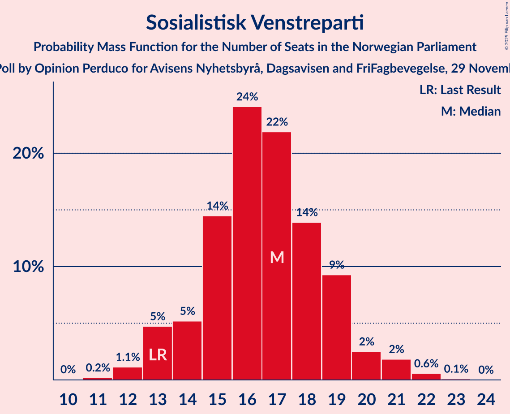
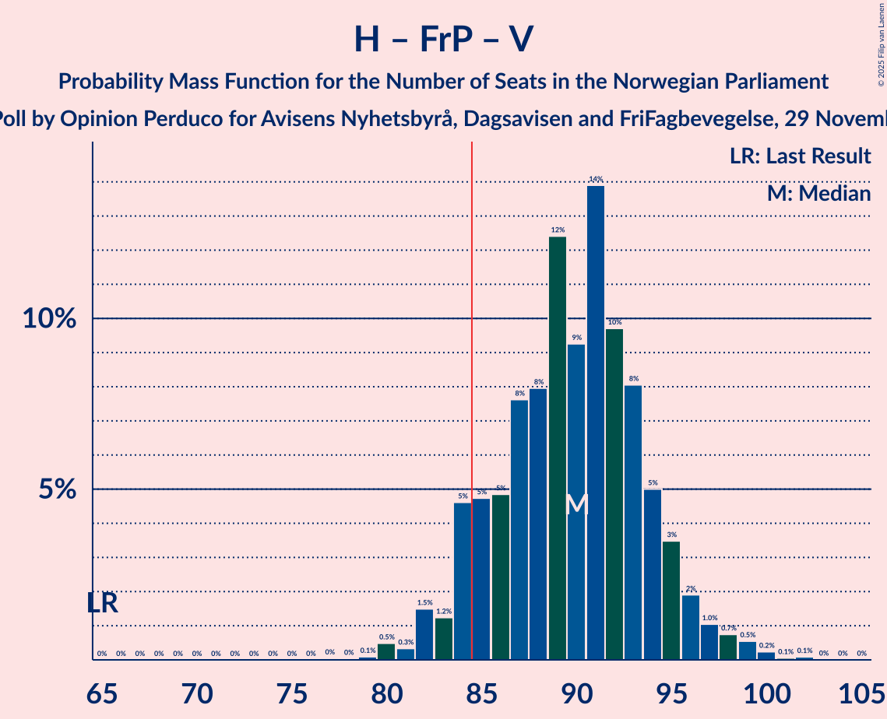
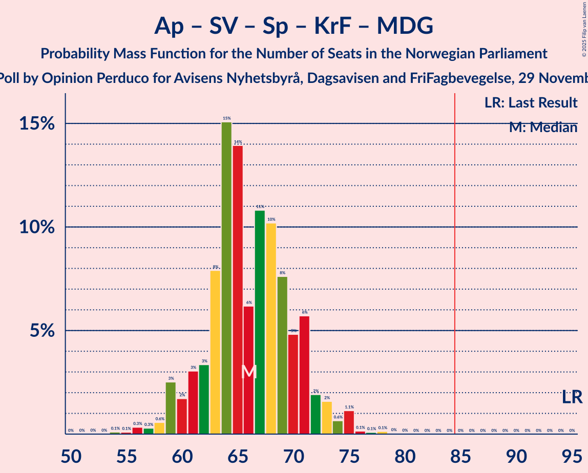

# Opinion Poll by Opinion Perduco for Avisens Nyhetsbyrå, Dagsavisen and FriFagbevegelse, 29 November–5 December 2022

<a href="#voting-intentions">Voting Intentions</a> | <a href="#seats">Seats</a> | <a href="#coalitions">Coalitions</a> | <a href="#technical-information">Technical Information</a>

## Voting Intentions

### Confidence Intervals

| Party | Last Result | Poll Result | 80% Confidence Interval | 90% Confidence Interval | 95% Confidence Interval | 99% Confidence Interval |
|:-----:|:-----------:|:-----------:|:-----------------------:|:-----------------------:|:-----------------------:|:-----------------------:|
| Høyre | 20.4% | 32.7% | 30.8–34.7% |30.3–35.2% |29.8–35.7% |28.9–36.7% |
| Arbeiderpartiet | 26.2% | 18.1% | 16.6–19.8% |16.2–20.2% |15.8–20.7% |15.1–21.5% |
| Fremskrittspartiet | 11.6% | 12.2% | 10.9–13.7% |10.6–14.1% |10.3–14.4% |9.7–15.2% |
| Sosialistisk Venstreparti | 7.6% | 9.5% | 8.4–10.8% |8.1–11.2% |7.8–11.5% |7.3–12.2% |
| Rødt | 4.7% | 6.7% | 5.8–7.9% |5.5–8.2% |5.3–8.5% |4.9–9.1% |
| Venstre | 4.6% | 5.8% | 4.9–6.9% |4.7–7.2% |4.5–7.5% |4.1–8.0% |
| Senterpartiet | 13.5% | 5.4% | 4.5–6.4% |4.3–6.7% |4.1–7.0% |3.7–7.5% |
| Kristelig Folkeparti | 3.8% | 3.4% | 2.8–4.3% |2.6–4.5% |2.4–4.8% |2.2–5.2% |
| Miljøpartiet De Grønne | 3.9% | 3.2% | 2.6–4.1% |2.4–4.3% |2.3–4.5% |2.0–5.0% |

*Note:* The poll result column reflects the actual value used in the calculations. Published results may vary slightly, and in addition be rounded to fewer digits.

## Seats

### Confidence Intervals

| Party | Last Result | Median | 80% Confidence Interval | 90% Confidence Interval | 95% Confidence Interval | 99% Confidence Interval |
|:-----:|:-----------:|:------:|:-----------------------:|:-----------------------:|:-----------------------:|:-----------------------:|
| <a href="#høyre">Høyre</a> | 36 | 58 | 53–62 |53–64 |52–65 |50–68 |
| <a href="#arbeiderpartiet">Arbeiderpartiet</a> | 48 | 34 | 32–38 |32–39 |32–41 |30–42 |
| <a href="#fremskrittspartiet">Fremskrittspartiet</a> | 21 | 21 | 19–24 |18–25 |18–26 |17–29 |
| <a href="#sosialistisk-venstreparti">Sosialistisk Venstreparti</a> | 13 | 17 | 14–19 |13–20 |13–21 |12–22 |
| <a href="#rødt">Rødt</a> | 8 | 12 | 10–14 |9–14 |9–15 |8–16 |
| <a href="#venstre">Venstre</a> | 8 | 10 | 8–12 |8–13 |8–13 |7–14 |
| <a href="#senterpartiet">Senterpartiet</a> | 28 | 9 | 8–11 |7–12 |6–12 |0–13 |
| <a href="#kristelig-folkeparti">Kristelig Folkeparti</a> | 3 | 2 | 2–7 |1–8 |1–8 |0–9 |
| <a href="#miljøpartiet-de-grønne">Miljøpartiet De Grønne</a> | 3 | 2 | 1–7 |1–7 |1–8 |1–8 |

### Høyre

*For a full overview of the results for this party, see the [Høyre](party-høyre.html) page.*

| Number of Seats | Probability | Accumulated | Special Marks |
|:---------------:|:-----------:|:-----------:|:-------------:|
| 36 | 0% | 100% | Last Result |
| 37 | 0% | 100% |  |
| 38 | 0% | 100% |  |
| 39 | 0% | 100% |  |
| 40 | 0% | 100% |  |
| 41 | 0% | 100% |  |
| 42 | 0% | 100% |  |
| 43 | 0% | 100% |  |
| 44 | 0% | 100% |  |
| 45 | 0% | 100% |  |
| 46 | 0% | 100% |  |
| 47 | 0% | 100% |  |
| 48 | 0% | 100% |  |
| 49 | 0.2% | 100% |  |
| 50 | 0.4% | 99.7% |  |
| 51 | 1.0% | 99.3% |  |
| 52 | 3% | 98% |  |
| 53 | 5% | 95% |  |
| 54 | 5% | 90% |  |
| 55 | 5% | 85% |  |
| 56 | 11% | 81% |  |
| 57 | 13% | 70% |  |
| 58 | 11% | 56% | Median |
| 59 | 5% | 46% |  |
| 60 | 13% | 41% |  |
| 61 | 13% | 28% |  |
| 62 | 6% | 15% |  |
| 63 | 2% | 9% |  |
| 64 | 3% | 7% |  |
| 65 | 2% | 4% |  |
| 66 | 1.1% | 2% |  |
| 67 | 0.5% | 1.2% |  |
| 68 | 0.6% | 0.7% |  |
| 69 | 0% | 0.1% |  |
| 70 | 0% | 0% |  |

### Arbeiderpartiet

*For a full overview of the results for this party, see the [Arbeiderpartiet](party-arbeiderpartiet.html) page.*

| Number of Seats | Probability | Accumulated | Special Marks |
|:---------------:|:-----------:|:-----------:|:-------------:|
| 27 | 0% | 100% |  |
| 28 | 0.1% | 99.9% |  |
| 29 | 0.2% | 99.8% |  |
| 30 | 0.4% | 99.6% |  |
| 31 | 2% | 99.1% |  |
| 32 | 9% | 98% |  |
| 33 | 24% | 88% |  |
| 34 | 24% | 65% | Median |
| 35 | 19% | 41% |  |
| 36 | 8% | 22% |  |
| 37 | 4% | 14% |  |
| 38 | 3% | 11% |  |
| 39 | 4% | 7% |  |
| 40 | 1.1% | 4% |  |
| 41 | 1.0% | 3% |  |
| 42 | 1.5% | 2% |  |
| 43 | 0.1% | 0.3% |  |
| 44 | 0.1% | 0.2% |  |
| 45 | 0% | 0.1% |  |
| 46 | 0% | 0% |  |
| 47 | 0% | 0% |  |
| 48 | 0% | 0% | Last Result |

### Fremskrittspartiet

*For a full overview of the results for this party, see the [Fremskrittspartiet](party-fremskrittspartiet.html) page.*

| Number of Seats | Probability | Accumulated | Special Marks |
|:---------------:|:-----------:|:-----------:|:-------------:|
| 16 | 0.1% | 100% |  |
| 17 | 2% | 99.9% |  |
| 18 | 7% | 98% |  |
| 19 | 10% | 91% |  |
| 20 | 19% | 81% |  |
| 21 | 15% | 62% | Last Result, Median |
| 22 | 17% | 47% |  |
| 23 | 13% | 30% |  |
| 24 | 9% | 17% |  |
| 25 | 5% | 8% |  |
| 26 | 2% | 4% |  |
| 27 | 0.8% | 2% |  |
| 28 | 0.6% | 1.4% |  |
| 29 | 0.4% | 0.7% |  |
| 30 | 0.3% | 0.3% |  |
| 31 | 0% | 0% |  |

### Sosialistisk Venstreparti

*For a full overview of the results for this party, see the [Sosialistisk Venstreparti](party-sosialistiskvenstreparti.html) page.*

| Number of Seats | Probability | Accumulated | Special Marks |
|:---------------:|:-----------:|:-----------:|:-------------:|
| 11 | 0.2% | 100% |  |
| 12 | 1.1% | 99.7% |  |
| 13 | 5% | 98.6% | Last Result |
| 14 | 5% | 94% |  |
| 15 | 14% | 89% |  |
| 16 | 24% | 74% |  |
| 17 | 22% | 50% | Median |
| 18 | 14% | 28% |  |
| 19 | 9% | 14% |  |
| 20 | 2% | 5% |  |
| 21 | 2% | 3% |  |
| 22 | 0.6% | 0.7% |  |
| 23 | 0.1% | 0.1% |  |
| 24 | 0% | 0% |  |

### Rødt

*For a full overview of the results for this party, see the [Rødt](party-rødt.html) page.*

| Number of Seats | Probability | Accumulated | Special Marks |
|:---------------:|:-----------:|:-----------:|:-------------:|
| 7 | 0.1% | 100% |  |
| 8 | 0.8% | 99.9% | Last Result |
| 9 | 6% | 99.1% |  |
| 10 | 14% | 94% |  |
| 11 | 21% | 79% |  |
| 12 | 29% | 58% | Median |
| 13 | 14% | 29% |  |
| 14 | 12% | 15% |  |
| 15 | 2% | 3% |  |
| 16 | 0.8% | 0.9% |  |
| 17 | 0.1% | 0.1% |  |
| 18 | 0% | 0% |  |

### Venstre

*For a full overview of the results for this party, see the [Venstre](party-venstre.html) page.*

| Number of Seats | Probability | Accumulated | Special Marks |
|:---------------:|:-----------:|:-----------:|:-------------:|
| 2 | 0.1% | 100% |  |
| 3 | 0.3% | 99.9% |  |
| 4 | 0% | 99.7% |  |
| 5 | 0% | 99.7% |  |
| 6 | 0% | 99.7% |  |
| 7 | 2% | 99.6% |  |
| 8 | 8% | 98% | Last Result |
| 9 | 29% | 90% |  |
| 10 | 29% | 61% | Median |
| 11 | 13% | 32% |  |
| 12 | 13% | 19% |  |
| 13 | 4% | 6% |  |
| 14 | 1.0% | 1.2% |  |
| 15 | 0.1% | 0.2% |  |
| 16 | 0% | 0% |  |

### Senterpartiet

*For a full overview of the results for this party, see the [Senterpartiet](party-senterpartiet.html) page.*

| Number of Seats | Probability | Accumulated | Special Marks |
|:---------------:|:-----------:|:-----------:|:-------------:|
| 0 | 0.8% | 100% |  |
| 1 | 0.6% | 99.2% |  |
| 2 | 0.9% | 98.6% |  |
| 3 | 0% | 98% |  |
| 4 | 0% | 98% |  |
| 5 | 0% | 98% |  |
| 6 | 0.4% | 98% |  |
| 7 | 6% | 97% |  |
| 8 | 19% | 92% |  |
| 9 | 25% | 72% | Median |
| 10 | 25% | 47% |  |
| 11 | 14% | 22% |  |
| 12 | 6% | 9% |  |
| 13 | 2% | 2% |  |
| 14 | 0.4% | 0.4% |  |
| 15 | 0.1% | 0.1% |  |
| 16 | 0% | 0% |  |
| 17 | 0% | 0% |  |
| 18 | 0% | 0% |  |
| 19 | 0% | 0% |  |
| 20 | 0% | 0% |  |
| 21 | 0% | 0% |  |
| 22 | 0% | 0% |  |
| 23 | 0% | 0% |  |
| 24 | 0% | 0% |  |
| 25 | 0% | 0% |  |
| 26 | 0% | 0% |  |
| 27 | 0% | 0% |  |
| 28 | 0% | 0% | Last Result |

### Kristelig Folkeparti

*For a full overview of the results for this party, see the [Kristelig Folkeparti](party-kristeligfolkeparti.html) page.*

| Number of Seats | Probability | Accumulated | Special Marks |
|:---------------:|:-----------:|:-----------:|:-------------:|
| 0 | 1.4% | 100% |  |
| 1 | 6% | 98.6% |  |
| 2 | 45% | 93% | Median |
| 3 | 27% | 48% | Last Result |
| 4 | 0% | 22% |  |
| 5 | 0% | 22% |  |
| 6 | 0.8% | 22% |  |
| 7 | 15% | 21% |  |
| 8 | 5% | 6% |  |
| 9 | 0.7% | 0.8% |  |
| 10 | 0.1% | 0.1% |  |
| 11 | 0% | 0% |  |

### Miljøpartiet De Grønne

*For a full overview of the results for this party, see the [Miljøpartiet De Grønne](party-miljøpartietdegrønne.html) page.*

| Number of Seats | Probability | Accumulated | Special Marks |
|:---------------:|:-----------:|:-----------:|:-------------:|
| 0 | 0.1% | 100% |  |
| 1 | 36% | 99.9% |  |
| 2 | 49% | 64% | Median |
| 3 | 2% | 15% | Last Result |
| 4 | 0% | 13% |  |
| 5 | 0% | 13% |  |
| 6 | 0.6% | 13% |  |
| 7 | 10% | 13% |  |
| 8 | 2% | 3% |  |
| 9 | 0.3% | 0.4% |  |
| 10 | 0% | 0% |  |

## Coalitions

### Confidence Intervals

| Coalition | Last Result | Median | Majority? | 80% Confidence Interval | 90% Confidence Interval | 95% Confidence Interval | 99% Confidence Interval |
|:---------:|:-----------:|:------:|:---------:|:-----------------------:|:-----------------------:|:-----------------------:|:-----------------------:|
| Høyre – Fremskrittspartiet – Venstre – Senterpartiet – Kristelig Folkeparti | 96 | 103 | 100% | 97–106 | 96–107 | 95–109 | 92–110 |
| Høyre – Fremskrittspartiet – Venstre – Kristelig Folkeparti – Miljøpartiet De Grønne | 71 | 96 | 99.9% | 91–100 | 90–101 | 88–102 | 86–105 |
| Høyre – Fremskrittspartiet – Venstre – Kristelig Folkeparti | 68 | 93 | 98.6% | 88–97 | 86–99 | 86–100 | 84–102 |
| Høyre – Fremskrittspartiet – Venstre | 65 | 90 | 92% | 85–94 | 84–95 | 83–97 | 80–99 |
| Høyre – Fremskrittspartiet | 57 | 80 | 7% | 75–84 | 74–85 | 73–87 | 71–89 |
| Arbeiderpartiet – Sosialistisk Venstreparti – Rødt – Senterpartiet – Miljøpartiet De Grønne | 100 | 74 | 0.2% | 70–79 | 69–81 | 68–82 | 65–84 |
| Høyre – Venstre – Kristelig Folkeparti | 47 | 72 | 0% | 67–77 | 65–78 | 65–80 | 63–81 |
| Arbeiderpartiet – Sosialistisk Venstreparti – Rødt – Senterpartiet | 97 | 72 | 0% | 68–76 | 67–78 | 66–79 | 63–81 |
| Arbeiderpartiet – Sosialistisk Venstreparti – Senterpartiet – Kristelig Folkeparti – Miljøpartiet De Grønne | 95 | 66 | 0% | 62–71 | 60–72 | 59–73 | 56–75 |
| Arbeiderpartiet – Sosialistisk Venstreparti – Rødt – Miljøpartiet De Grønne | 72 | 65 | 0% | 61–70 | 60–72 | 59–73 | 57–76 |
| Arbeiderpartiet – Sosialistisk Venstreparti – Senterpartiet – Miljøpartiet De Grønne | 92 | 62 | 0% | 58–68 | 57–69 | 56–70 | 54–73 |
| Arbeiderpartiet – Sosialistisk Venstreparti – Senterpartiet | 89 | 60 | 0% | 56–64 | 55–66 | 54–66 | 52–69 |
| Arbeiderpartiet – Sosialistisk Venstreparti | 61 | 51 | 0% | 48–55 | 47–56 | 46–57 | 45–60 |
| Arbeiderpartiet – Senterpartiet – Kristelig Folkeparti – Miljøpartiet De Grønne | 82 | 49 | 0% | 45–54 | 44–55 | 43–57 | 40–59 |
| Arbeiderpartiet – Senterpartiet – Kristelig Folkeparti | 79 | 47 | 0% | 44–51 | 42–52 | 41–53 | 38–56 |
| Arbeiderpartiet – Senterpartiet | 76 | 44 | 0% | 41–47 | 40–48 | 38–50 | 35–52 |
| Venstre – Senterpartiet – Kristelig Folkeparti | 39 | 23 | 0% | 19–26 | 18–27 | 17–29 | 13–31 |

### Høyre – Fremskrittspartiet – Venstre – Senterpartiet – Kristelig Folkeparti

| Number of Seats | Probability | Accumulated | Special Marks |
|:---------------:|:-----------:|:-----------:|:-------------:|
| 90 | 0.1% | 100% |  |
| 91 | 0.1% | 99.9% |  |
| 92 | 0.8% | 99.8% |  |
| 93 | 0.5% | 99.1% |  |
| 94 | 0.4% | 98.6% |  |
| 95 | 2% | 98% |  |
| 96 | 3% | 96% | Last Result |
| 97 | 4% | 93% |  |
| 98 | 4% | 90% |  |
| 99 | 6% | 86% |  |
| 100 | 7% | 80% | Median |
| 101 | 6% | 74% |  |
| 102 | 11% | 67% |  |
| 103 | 17% | 56% |  |
| 104 | 12% | 39% |  |
| 105 | 11% | 27% |  |
| 106 | 6% | 16% |  |
| 107 | 6% | 10% |  |
| 108 | 2% | 4% |  |
| 109 | 2% | 3% |  |
| 110 | 0.4% | 0.8% |  |
| 111 | 0.2% | 0.4% |  |
| 112 | 0.1% | 0.1% |  |
| 113 | 0% | 0% |  |

### Høyre – Fremskrittspartiet – Venstre – Kristelig Folkeparti – Miljøpartiet De Grønne

| Number of Seats | Probability | Accumulated | Special Marks |
|:---------------:|:-----------:|:-----------:|:-------------:|
| 71 | 0% | 100% | Last Result |
| 72 | 0% | 100% |  |
| 73 | 0% | 100% |  |
| 74 | 0% | 100% |  |
| 75 | 0% | 100% |  |
| 76 | 0% | 100% |  |
| 77 | 0% | 100% |  |
| 78 | 0% | 100% |  |
| 79 | 0% | 100% |  |
| 80 | 0% | 100% |  |
| 81 | 0% | 100% |  |
| 82 | 0% | 100% |  |
| 83 | 0% | 100% |  |
| 84 | 0% | 100% |  |
| 85 | 0.2% | 99.9% | Majority |
| 86 | 0.3% | 99.7% |  |
| 87 | 1.3% | 99.4% |  |
| 88 | 0.8% | 98% |  |
| 89 | 2% | 97% |  |
| 90 | 3% | 96% |  |
| 91 | 4% | 92% |  |
| 92 | 6% | 88% |  |
| 93 | 9% | 83% | Median |
| 94 | 11% | 74% |  |
| 95 | 11% | 62% |  |
| 96 | 15% | 51% |  |
| 97 | 11% | 36% |  |
| 98 | 7% | 25% |  |
| 99 | 8% | 18% |  |
| 100 | 3% | 10% |  |
| 101 | 3% | 7% |  |
| 102 | 2% | 4% |  |
| 103 | 0.5% | 1.5% |  |
| 104 | 0.5% | 1.0% |  |
| 105 | 0.2% | 0.5% |  |
| 106 | 0.1% | 0.3% |  |
| 107 | 0.2% | 0.2% |  |
| 108 | 0% | 0% |  |

### Høyre – Fremskrittspartiet – Venstre – Kristelig Folkeparti

| Number of Seats | Probability | Accumulated | Special Marks |
|:---------------:|:-----------:|:-----------:|:-------------:|
| 68 | 0% | 100% | Last Result |
| 69 | 0% | 100% |  |
| 70 | 0% | 100% |  |
| 71 | 0% | 100% |  |
| 72 | 0% | 100% |  |
| 73 | 0% | 100% |  |
| 74 | 0% | 100% |  |
| 75 | 0% | 100% |  |
| 76 | 0% | 100% |  |
| 77 | 0% | 100% |  |
| 78 | 0% | 100% |  |
| 79 | 0% | 100% |  |
| 80 | 0% | 100% |  |
| 81 | 0% | 100% |  |
| 82 | 0.1% | 100% |  |
| 83 | 0.2% | 99.8% |  |
| 84 | 1.1% | 99.7% |  |
| 85 | 0.7% | 98.6% | Majority |
| 86 | 4% | 98% |  |
| 87 | 2% | 94% |  |
| 88 | 3% | 92% |  |
| 89 | 4% | 88% |  |
| 90 | 5% | 85% |  |
| 91 | 6% | 80% | Median |
| 92 | 14% | 74% |  |
| 93 | 12% | 60% |  |
| 94 | 15% | 47% |  |
| 95 | 10% | 33% |  |
| 96 | 8% | 23% |  |
| 97 | 5% | 15% |  |
| 98 | 4% | 10% |  |
| 99 | 2% | 6% |  |
| 100 | 2% | 4% |  |
| 101 | 0.6% | 1.3% |  |
| 102 | 0.3% | 0.8% |  |
| 103 | 0.2% | 0.4% |  |
| 104 | 0% | 0.2% |  |
| 105 | 0.1% | 0.1% |  |
| 106 | 0% | 0% |  |

### Høyre – Fremskrittspartiet – Venstre

| Number of Seats | Probability | Accumulated | Special Marks |
|:---------------:|:-----------:|:-----------:|:-------------:|
| 65 | 0% | 100% | Last Result |
| 66 | 0% | 100% |  |
| 67 | 0% | 100% |  |
| 68 | 0% | 100% |  |
| 69 | 0% | 100% |  |
| 70 | 0% | 100% |  |
| 71 | 0% | 100% |  |
| 72 | 0% | 100% |  |
| 73 | 0% | 100% |  |
| 74 | 0% | 100% |  |
| 75 | 0% | 100% |  |
| 76 | 0% | 100% |  |
| 77 | 0% | 100% |  |
| 78 | 0% | 99.9% |  |
| 79 | 0.1% | 99.9% |  |
| 80 | 0.5% | 99.8% |  |
| 81 | 0.3% | 99.3% |  |
| 82 | 1.5% | 99.0% |  |
| 83 | 1.2% | 98% |  |
| 84 | 5% | 96% |  |
| 85 | 5% | 92% | Majority |
| 86 | 5% | 87% |  |
| 87 | 8% | 82% |  |
| 88 | 8% | 74% |  |
| 89 | 12% | 66% | Median |
| 90 | 9% | 54% |  |
| 91 | 14% | 45% |  |
| 92 | 10% | 31% |  |
| 93 | 8% | 21% |  |
| 94 | 5% | 13% |  |
| 95 | 3% | 8% |  |
| 96 | 2% | 5% |  |
| 97 | 1.0% | 3% |  |
| 98 | 0.7% | 2% |  |
| 99 | 0.5% | 1.0% |  |
| 100 | 0.2% | 0.4% |  |
| 101 | 0.1% | 0.2% |  |
| 102 | 0.1% | 0.1% |  |
| 103 | 0% | 0% |  |

### Høyre – Fremskrittspartiet

| Number of Seats | Probability | Accumulated | Special Marks |
|:---------------:|:-----------:|:-----------:|:-------------:|
| 57 | 0% | 100% | Last Result |
| 58 | 0% | 100% |  |
| 59 | 0% | 100% |  |
| 60 | 0% | 100% |  |
| 61 | 0% | 100% |  |
| 62 | 0% | 100% |  |
| 63 | 0% | 100% |  |
| 64 | 0% | 100% |  |
| 65 | 0% | 100% |  |
| 66 | 0% | 100% |  |
| 67 | 0% | 100% |  |
| 68 | 0% | 100% |  |
| 69 | 0.1% | 100% |  |
| 70 | 0.3% | 99.8% |  |
| 71 | 0.4% | 99.6% |  |
| 72 | 1.2% | 99.2% |  |
| 73 | 1.5% | 98% |  |
| 74 | 5% | 97% |  |
| 75 | 5% | 92% |  |
| 76 | 4% | 86% |  |
| 77 | 7% | 83% |  |
| 78 | 10% | 76% |  |
| 79 | 13% | 66% | Median |
| 80 | 14% | 53% |  |
| 81 | 7% | 39% |  |
| 82 | 11% | 32% |  |
| 83 | 9% | 21% |  |
| 84 | 6% | 13% |  |
| 85 | 2% | 7% | Majority |
| 86 | 2% | 5% |  |
| 87 | 0.9% | 3% |  |
| 88 | 0.8% | 2% |  |
| 89 | 0.7% | 0.9% |  |
| 90 | 0.1% | 0.2% |  |
| 91 | 0% | 0.1% |  |
| 92 | 0% | 0.1% |  |
| 93 | 0% | 0% |  |

### Arbeiderpartiet – Sosialistisk Venstreparti – Rødt – Senterpartiet – Miljøpartiet De Grønne

| Number of Seats | Probability | Accumulated | Special Marks |
|:---------------:|:-----------:|:-----------:|:-------------:|
| 62 | 0% | 100% |  |
| 63 | 0.2% | 99.9% |  |
| 64 | 0.1% | 99.8% |  |
| 65 | 0.3% | 99.7% |  |
| 66 | 0.6% | 99.3% |  |
| 67 | 0.8% | 98.7% |  |
| 68 | 3% | 98% |  |
| 69 | 2% | 95% |  |
| 70 | 5% | 93% |  |
| 71 | 6% | 88% |  |
| 72 | 8% | 82% |  |
| 73 | 10% | 74% |  |
| 74 | 15% | 64% | Median |
| 75 | 13% | 49% |  |
| 76 | 14% | 36% |  |
| 77 | 5% | 23% |  |
| 78 | 5% | 18% |  |
| 79 | 3% | 13% |  |
| 80 | 3% | 9% |  |
| 81 | 2% | 6% |  |
| 82 | 3% | 4% |  |
| 83 | 0.6% | 2% |  |
| 84 | 0.8% | 0.9% |  |
| 85 | 0.1% | 0.2% | Majority |
| 86 | 0.1% | 0.1% |  |
| 87 | 0% | 0% |  |
| 88 | 0% | 0% |  |
| 89 | 0% | 0% |  |
| 90 | 0% | 0% |  |
| 91 | 0% | 0% |  |
| 92 | 0% | 0% |  |
| 93 | 0% | 0% |  |
| 94 | 0% | 0% |  |
| 95 | 0% | 0% |  |
| 96 | 0% | 0% |  |
| 97 | 0% | 0% |  |
| 98 | 0% | 0% |  |
| 99 | 0% | 0% |  |
| 100 | 0% | 0% | Last Result |

### Høyre – Venstre – Kristelig Folkeparti

| Number of Seats | Probability | Accumulated | Special Marks |
|:---------------:|:-----------:|:-----------:|:-------------:|
| 47 | 0% | 100% | Last Result |
| 48 | 0% | 100% |  |
| 49 | 0% | 100% |  |
| 50 | 0% | 100% |  |
| 51 | 0% | 100% |  |
| 52 | 0% | 100% |  |
| 53 | 0% | 100% |  |
| 54 | 0% | 100% |  |
| 55 | 0% | 100% |  |
| 56 | 0% | 100% |  |
| 57 | 0% | 100% |  |
| 58 | 0% | 100% |  |
| 59 | 0% | 100% |  |
| 60 | 0% | 100% |  |
| 61 | 0.1% | 100% |  |
| 62 | 0.2% | 99.9% |  |
| 63 | 0.6% | 99.7% |  |
| 64 | 1.4% | 99.0% |  |
| 65 | 4% | 98% |  |
| 66 | 3% | 93% |  |
| 67 | 4% | 90% |  |
| 68 | 7% | 86% |  |
| 69 | 8% | 79% |  |
| 70 | 8% | 71% | Median |
| 71 | 10% | 63% |  |
| 72 | 8% | 53% |  |
| 73 | 18% | 44% |  |
| 74 | 4% | 26% |  |
| 75 | 6% | 21% |  |
| 76 | 4% | 16% |  |
| 77 | 5% | 11% |  |
| 78 | 1.2% | 6% |  |
| 79 | 2% | 5% |  |
| 80 | 2% | 3% |  |
| 81 | 0.5% | 1.0% |  |
| 82 | 0.3% | 0.5% |  |
| 83 | 0.1% | 0.2% |  |
| 84 | 0% | 0.1% |  |
| 85 | 0% | 0% | Majority |

### Arbeiderpartiet – Sosialistisk Venstreparti – Rødt – Senterpartiet

| Number of Seats | Probability | Accumulated | Special Marks |
|:---------------:|:-----------:|:-----------:|:-------------:|
| 60 | 0% | 100% |  |
| 61 | 0.2% | 99.9% |  |
| 62 | 0.1% | 99.7% |  |
| 63 | 0.4% | 99.6% |  |
| 64 | 0.7% | 99.2% |  |
| 65 | 0.8% | 98.5% |  |
| 66 | 2% | 98% |  |
| 67 | 3% | 95% |  |
| 68 | 4% | 92% |  |
| 69 | 9% | 88% |  |
| 70 | 7% | 79% |  |
| 71 | 11% | 72% |  |
| 72 | 15% | 61% | Median |
| 73 | 11% | 46% |  |
| 74 | 12% | 34% |  |
| 75 | 9% | 23% |  |
| 76 | 4% | 14% |  |
| 77 | 4% | 9% |  |
| 78 | 3% | 6% |  |
| 79 | 1.4% | 3% |  |
| 80 | 0.6% | 1.4% |  |
| 81 | 0.5% | 0.7% |  |
| 82 | 0.1% | 0.2% |  |
| 83 | 0.1% | 0.1% |  |
| 84 | 0% | 0% |  |
| 85 | 0% | 0% | Majority |
| 86 | 0% | 0% |  |
| 87 | 0% | 0% |  |
| 88 | 0% | 0% |  |
| 89 | 0% | 0% |  |
| 90 | 0% | 0% |  |
| 91 | 0% | 0% |  |
| 92 | 0% | 0% |  |
| 93 | 0% | 0% |  |
| 94 | 0% | 0% |  |
| 95 | 0% | 0% |  |
| 96 | 0% | 0% |  |
| 97 | 0% | 0% | Last Result |

### Arbeiderpartiet – Sosialistisk Venstreparti – Senterpartiet – Kristelig Folkeparti – Miljøpartiet De Grønne

| Number of Seats | Probability | Accumulated | Special Marks |
|:---------------:|:-----------:|:-----------:|:-------------:|
| 54 | 0.1% | 100% |  |
| 55 | 0.1% | 99.9% |  |
| 56 | 0.3% | 99.8% |  |
| 57 | 0.3% | 99.4% |  |
| 58 | 0.6% | 99.1% |  |
| 59 | 3% | 98.6% |  |
| 60 | 2% | 96% |  |
| 61 | 3% | 94% |  |
| 62 | 3% | 91% |  |
| 63 | 8% | 88% |  |
| 64 | 15% | 80% | Median |
| 65 | 14% | 65% |  |
| 66 | 6% | 51% |  |
| 67 | 11% | 45% |  |
| 68 | 10% | 34% |  |
| 69 | 8% | 24% |  |
| 70 | 5% | 16% |  |
| 71 | 6% | 11% |  |
| 72 | 2% | 6% |  |
| 73 | 2% | 4% |  |
| 74 | 0.6% | 2% |  |
| 75 | 1.1% | 2% |  |
| 76 | 0.1% | 0.4% |  |
| 77 | 0.1% | 0.3% |  |
| 78 | 0.1% | 0.2% |  |
| 79 | 0% | 0% |  |
| 80 | 0% | 0% |  |
| 81 | 0% | 0% |  |
| 82 | 0% | 0% |  |
| 83 | 0% | 0% |  |
| 84 | 0% | 0% |  |
| 85 | 0% | 0% | Majority |
| 86 | 0% | 0% |  |
| 87 | 0% | 0% |  |
| 88 | 0% | 0% |  |
| 89 | 0% | 0% |  |
| 90 | 0% | 0% |  |
| 91 | 0% | 0% |  |
| 92 | 0% | 0% |  |
| 93 | 0% | 0% |  |
| 94 | 0% | 0% |  |
| 95 | 0% | 0% | Last Result |

### Arbeiderpartiet – Sosialistisk Venstreparti – Rødt – Miljøpartiet De Grønne

| Number of Seats | Probability | Accumulated | Special Marks |
|:---------------:|:-----------:|:-----------:|:-------------:|
| 55 | 0.1% | 100% |  |
| 56 | 0.2% | 99.9% |  |
| 57 | 0.3% | 99.7% |  |
| 58 | 0.7% | 99.5% |  |
| 59 | 2% | 98.8% |  |
| 60 | 2% | 97% |  |
| 61 | 6% | 95% |  |
| 62 | 7% | 88% |  |
| 63 | 12% | 82% |  |
| 64 | 13% | 70% |  |
| 65 | 17% | 57% | Median |
| 66 | 11% | 40% |  |
| 67 | 6% | 29% |  |
| 68 | 6% | 22% |  |
| 69 | 5% | 16% |  |
| 70 | 3% | 11% |  |
| 71 | 2% | 8% |  |
| 72 | 3% | 5% | Last Result |
| 73 | 1.5% | 3% |  |
| 74 | 0.2% | 1.3% |  |
| 75 | 0.3% | 1.0% |  |
| 76 | 0.7% | 0.8% |  |
| 77 | 0% | 0.1% |  |
| 78 | 0.1% | 0.1% |  |
| 79 | 0% | 0% |  |

### Arbeiderpartiet – Sosialistisk Venstreparti – Senterpartiet – Miljøpartiet De Grønne

| Number of Seats | Probability | Accumulated | Special Marks |
|:---------------:|:-----------:|:-----------:|:-------------:|
| 51 | 0.1% | 100% |  |
| 52 | 0.1% | 99.9% |  |
| 53 | 0.2% | 99.7% |  |
| 54 | 0.4% | 99.6% |  |
| 55 | 0.5% | 99.2% |  |
| 56 | 1.2% | 98.7% |  |
| 57 | 4% | 97% |  |
| 58 | 4% | 94% |  |
| 59 | 3% | 90% |  |
| 60 | 6% | 87% |  |
| 61 | 16% | 81% |  |
| 62 | 19% | 66% | Median |
| 63 | 10% | 46% |  |
| 64 | 11% | 36% |  |
| 65 | 7% | 25% |  |
| 66 | 4% | 18% |  |
| 67 | 4% | 14% |  |
| 68 | 4% | 10% |  |
| 69 | 3% | 6% |  |
| 70 | 1.0% | 3% |  |
| 71 | 0.6% | 2% |  |
| 72 | 0.4% | 1.3% |  |
| 73 | 0.8% | 0.9% |  |
| 74 | 0% | 0.1% |  |
| 75 | 0.1% | 0.1% |  |
| 76 | 0% | 0% |  |
| 77 | 0% | 0% |  |
| 78 | 0% | 0% |  |
| 79 | 0% | 0% |  |
| 80 | 0% | 0% |  |
| 81 | 0% | 0% |  |
| 82 | 0% | 0% |  |
| 83 | 0% | 0% |  |
| 84 | 0% | 0% |  |
| 85 | 0% | 0% | Majority |
| 86 | 0% | 0% |  |
| 87 | 0% | 0% |  |
| 88 | 0% | 0% |  |
| 89 | 0% | 0% |  |
| 90 | 0% | 0% |  |
| 91 | 0% | 0% |  |
| 92 | 0% | 0% | Last Result |

### Arbeiderpartiet – Sosialistisk Venstreparti – Senterpartiet

| Number of Seats | Probability | Accumulated | Special Marks |
|:---------------:|:-----------:|:-----------:|:-------------:|
| 49 | 0.1% | 100% |  |
| 50 | 0.1% | 99.9% |  |
| 51 | 0.2% | 99.8% |  |
| 52 | 0.4% | 99.6% |  |
| 53 | 0.5% | 99.2% |  |
| 54 | 1.3% | 98.7% |  |
| 55 | 3% | 97% |  |
| 56 | 5% | 94% |  |
| 57 | 5% | 89% |  |
| 58 | 6% | 85% |  |
| 59 | 13% | 79% |  |
| 60 | 22% | 66% | Median |
| 61 | 10% | 44% |  |
| 62 | 13% | 34% |  |
| 63 | 7% | 21% |  |
| 64 | 6% | 15% |  |
| 65 | 3% | 8% |  |
| 66 | 3% | 5% |  |
| 67 | 0.9% | 2% |  |
| 68 | 0.7% | 1.3% |  |
| 69 | 0.2% | 0.6% |  |
| 70 | 0.3% | 0.4% |  |
| 71 | 0.1% | 0.1% |  |
| 72 | 0% | 0% |  |
| 73 | 0% | 0% |  |
| 74 | 0% | 0% |  |
| 75 | 0% | 0% |  |
| 76 | 0% | 0% |  |
| 77 | 0% | 0% |  |
| 78 | 0% | 0% |  |
| 79 | 0% | 0% |  |
| 80 | 0% | 0% |  |
| 81 | 0% | 0% |  |
| 82 | 0% | 0% |  |
| 83 | 0% | 0% |  |
| 84 | 0% | 0% |  |
| 85 | 0% | 0% | Majority |
| 86 | 0% | 0% |  |
| 87 | 0% | 0% |  |
| 88 | 0% | 0% |  |
| 89 | 0% | 0% | Last Result |

### Arbeiderpartiet – Sosialistisk Venstreparti

| Number of Seats | Probability | Accumulated | Special Marks |
|:---------------:|:-----------:|:-----------:|:-------------:|
| 43 | 0.1% | 100% |  |
| 44 | 0.2% | 99.9% |  |
| 45 | 0.4% | 99.7% |  |
| 46 | 2% | 99.2% |  |
| 47 | 3% | 97% |  |
| 48 | 10% | 94% |  |
| 49 | 9% | 85% |  |
| 50 | 20% | 75% |  |
| 51 | 16% | 55% | Median |
| 52 | 15% | 40% |  |
| 53 | 9% | 24% |  |
| 54 | 4% | 15% |  |
| 55 | 5% | 10% |  |
| 56 | 2% | 6% |  |
| 57 | 1.4% | 4% |  |
| 58 | 1.2% | 2% |  |
| 59 | 0.6% | 1.2% |  |
| 60 | 0.4% | 0.6% |  |
| 61 | 0.1% | 0.2% | Last Result |
| 62 | 0% | 0.1% |  |
| 63 | 0% | 0% |  |

### Arbeiderpartiet – Senterpartiet – Kristelig Folkeparti – Miljøpartiet De Grønne

| Number of Seats | Probability | Accumulated | Special Marks |
|:---------------:|:-----------:|:-----------:|:-------------:|
| 36 | 0.1% | 100% |  |
| 37 | 0.1% | 99.9% |  |
| 38 | 0.1% | 99.8% |  |
| 39 | 0.1% | 99.7% |  |
| 40 | 0.5% | 99.6% |  |
| 41 | 0.3% | 99.1% |  |
| 42 | 1.0% | 98.7% |  |
| 43 | 1.2% | 98% |  |
| 44 | 2% | 97% |  |
| 45 | 5% | 94% |  |
| 46 | 8% | 90% |  |
| 47 | 11% | 82% | Median |
| 48 | 12% | 71% |  |
| 49 | 13% | 59% |  |
| 50 | 11% | 47% |  |
| 51 | 9% | 36% |  |
| 52 | 6% | 26% |  |
| 53 | 6% | 20% |  |
| 54 | 5% | 14% |  |
| 55 | 4% | 8% |  |
| 56 | 1.4% | 5% |  |
| 57 | 1.0% | 3% |  |
| 58 | 0.8% | 2% |  |
| 59 | 1.0% | 1.4% |  |
| 60 | 0.2% | 0.4% |  |
| 61 | 0.1% | 0.2% |  |
| 62 | 0% | 0.1% |  |
| 63 | 0% | 0% |  |
| 64 | 0% | 0% |  |
| 65 | 0% | 0% |  |
| 66 | 0% | 0% |  |
| 67 | 0% | 0% |  |
| 68 | 0% | 0% |  |
| 69 | 0% | 0% |  |
| 70 | 0% | 0% |  |
| 71 | 0% | 0% |  |
| 72 | 0% | 0% |  |
| 73 | 0% | 0% |  |
| 74 | 0% | 0% |  |
| 75 | 0% | 0% |  |
| 76 | 0% | 0% |  |
| 77 | 0% | 0% |  |
| 78 | 0% | 0% |  |
| 79 | 0% | 0% |  |
| 80 | 0% | 0% |  |
| 81 | 0% | 0% |  |
| 82 | 0% | 0% | Last Result |

### Arbeiderpartiet – Senterpartiet – Kristelig Folkeparti

| Number of Seats | Probability | Accumulated | Special Marks |
|:---------------:|:-----------:|:-----------:|:-------------:|
| 34 | 0.1% | 100% |  |
| 35 | 0% | 99.9% |  |
| 36 | 0.1% | 99.8% |  |
| 37 | 0.1% | 99.7% |  |
| 38 | 0.5% | 99.6% |  |
| 39 | 0.3% | 99.1% |  |
| 40 | 1.1% | 98.8% |  |
| 41 | 1.2% | 98% |  |
| 42 | 2% | 97% |  |
| 43 | 5% | 95% |  |
| 44 | 8% | 90% |  |
| 45 | 15% | 83% | Median |
| 46 | 11% | 68% |  |
| 47 | 15% | 57% |  |
| 48 | 12% | 43% |  |
| 49 | 8% | 31% |  |
| 50 | 8% | 23% |  |
| 51 | 5% | 15% |  |
| 52 | 5% | 10% |  |
| 53 | 2% | 5% |  |
| 54 | 1.1% | 2% |  |
| 55 | 0.4% | 1.4% |  |
| 56 | 0.6% | 0.9% |  |
| 57 | 0.1% | 0.3% |  |
| 58 | 0.1% | 0.2% |  |
| 59 | 0% | 0.1% |  |
| 60 | 0% | 0% |  |
| 61 | 0% | 0% |  |
| 62 | 0% | 0% |  |
| 63 | 0% | 0% |  |
| 64 | 0% | 0% |  |
| 65 | 0% | 0% |  |
| 66 | 0% | 0% |  |
| 67 | 0% | 0% |  |
| 68 | 0% | 0% |  |
| 69 | 0% | 0% |  |
| 70 | 0% | 0% |  |
| 71 | 0% | 0% |  |
| 72 | 0% | 0% |  |
| 73 | 0% | 0% |  |
| 74 | 0% | 0% |  |
| 75 | 0% | 0% |  |
| 76 | 0% | 0% |  |
| 77 | 0% | 0% |  |
| 78 | 0% | 0% |  |
| 79 | 0% | 0% | Last Result |

### Arbeiderpartiet – Senterpartiet

| Number of Seats | Probability | Accumulated | Special Marks |
|:---------------:|:-----------:|:-----------:|:-------------:|
| 31 | 0.1% | 100% |  |
| 32 | 0% | 99.9% |  |
| 33 | 0.2% | 99.9% |  |
| 34 | 0.1% | 99.7% |  |
| 35 | 0.3% | 99.6% |  |
| 36 | 0.4% | 99.2% |  |
| 37 | 0.3% | 98.8% |  |
| 38 | 1.1% | 98.5% |  |
| 39 | 1.2% | 97% |  |
| 40 | 4% | 96% |  |
| 41 | 6% | 92% |  |
| 42 | 15% | 86% |  |
| 43 | 18% | 72% | Median |
| 44 | 17% | 54% |  |
| 45 | 17% | 37% |  |
| 46 | 7% | 21% |  |
| 47 | 5% | 14% |  |
| 48 | 4% | 9% |  |
| 49 | 2% | 5% |  |
| 50 | 2% | 3% |  |
| 51 | 0.6% | 1.3% |  |
| 52 | 0.5% | 0.7% |  |
| 53 | 0.1% | 0.2% |  |
| 54 | 0% | 0.1% |  |
| 55 | 0% | 0% |  |
| 56 | 0% | 0% |  |
| 57 | 0% | 0% |  |
| 58 | 0% | 0% |  |
| 59 | 0% | 0% |  |
| 60 | 0% | 0% |  |
| 61 | 0% | 0% |  |
| 62 | 0% | 0% |  |
| 63 | 0% | 0% |  |
| 64 | 0% | 0% |  |
| 65 | 0% | 0% |  |
| 66 | 0% | 0% |  |
| 67 | 0% | 0% |  |
| 68 | 0% | 0% |  |
| 69 | 0% | 0% |  |
| 70 | 0% | 0% |  |
| 71 | 0% | 0% |  |
| 72 | 0% | 0% |  |
| 73 | 0% | 0% |  |
| 74 | 0% | 0% |  |
| 75 | 0% | 0% |  |
| 76 | 0% | 0% | Last Result |

### Venstre – Senterpartiet – Kristelig Folkeparti

| Number of Seats | Probability | Accumulated | Special Marks |
|:---------------:|:-----------:|:-----------:|:-------------:|
| 10 | 0.1% | 100% |  |
| 11 | 0.1% | 99.9% |  |
| 12 | 0.1% | 99.9% |  |
| 13 | 0.4% | 99.8% |  |
| 14 | 0.4% | 99.4% |  |
| 15 | 1.0% | 99.0% |  |
| 16 | 0.4% | 98% |  |
| 17 | 0.6% | 98% |  |
| 18 | 3% | 97% |  |
| 19 | 4% | 94% |  |
| 20 | 9% | 90% |  |
| 21 | 13% | 80% | Median |
| 22 | 15% | 67% |  |
| 23 | 13% | 52% |  |
| 24 | 12% | 39% |  |
| 25 | 14% | 27% |  |
| 26 | 5% | 12% |  |
| 27 | 3% | 8% |  |
| 28 | 1.3% | 4% |  |
| 29 | 2% | 3% |  |
| 30 | 0.4% | 1.4% |  |
| 31 | 0.9% | 1.1% |  |
| 32 | 0.1% | 0.1% |  |
| 33 | 0% | 0% |  |
| 34 | 0% | 0% |  |
| 35 | 0% | 0% |  |
| 36 | 0% | 0% |  |
| 37 | 0% | 0% |  |
| 38 | 0% | 0% |  |
| 39 | 0% | 0% | Last Result |

## Technical Information

### Opinion Poll

+ **Polling firm:** Opinion Perduco
+ **Commissioner(s):** Avisens Nyhetsbyrå, Dagsavisen and FriFagbevegelse
+ **Fieldwork period:** 29 November–5 December 2022

### Calculations

+ **Sample size:** 967
+ **Simulations done:** 1,048,576
+ **Error estimate:** 2.48%

