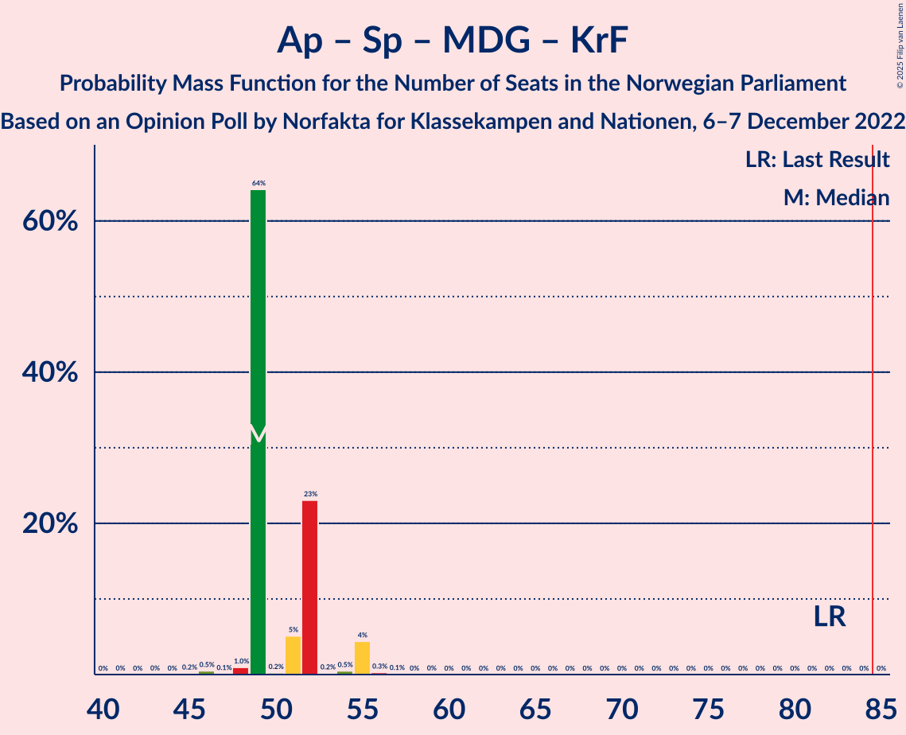

# Opinion Poll by Norfakta for Klassekampen and Nationen, 6–7 December 2022

<a href="#voting-intentions">Voting Intentions</a> | <a href="#seats">Seats</a> | <a href="#coalitions">Coalitions</a> | <a href="#technical-information">Technical Information</a>

## Voting Intentions

### Confidence Intervals

| Party | Last Result | Poll Result | 80% Confidence Interval | 90% Confidence Interval | 95% Confidence Interval | 99% Confidence Interval |
|:-----:|:-----------:|:-----------:|:-----------------------:|:-----------------------:|:-----------------------:|:-----------------------:|
| Høyre | 20.4% | 32.8% | 30.9–34.7% |30.4–35.3% |29.9–35.7% |29.1–36.7% |
| Arbeiderpartiet | 26.2% | 16.3% | 14.9–17.9% |14.5–18.3% |14.1–18.7% |13.5–19.5% |
| Fremskrittspartiet | 11.6% | 11.6% | 10.4–13.0% |10.1–13.4% |9.8–13.7% |9.2–14.4% |
| Sosialistisk Venstreparti | 7.6% | 9.5% | 8.4–10.8% |8.1–11.2% |7.9–11.5% |7.4–12.2% |
| Rødt | 4.7% | 7.2% | 6.3–8.4% |6.0–8.7% |5.8–9.0% |5.4–9.6% |
| Senterpartiet | 13.5% | 7.1% | 6.1–8.2% |5.9–8.5% |5.6–8.8% |5.2–9.4% |
| Venstre | 4.6% | 4.5% | 3.7–5.4% |3.5–5.7% |3.4–5.9% |3.0–6.4% |
| Miljøpartiet De Grønne | 3.9% | 3.6% | 2.9–4.5% |2.7–4.7% |2.6–4.9% |2.3–5.4% |
| Kristelig Folkeparti | 3.8% | 3.3% | 2.7–4.1% |2.5–4.4% |2.3–4.6% |2.1–5.0% |
| Norgesdemokratene | 1.1% | 1.2% | 0.9–1.8% |0.8–1.9% |0.7–2.1% |0.5–2.4% |
| Industri- og Næringspartiet | 0.3% | 1.0% | 0.7–1.5% |0.6–1.7% |0.5–1.8% |0.4–2.1% |
| Konservativt | 0.4% | 0.7% | 0.5–1.2% |0.4–1.3% |0.3–1.4% |0.2–1.7% |
| Liberalistene | 0.2% | 0.6% | 0.4–1.1% |0.3–1.2% |0.3–1.3% |0.2–1.6% |
| Pensjonistpartiet | 0.6% | 0.5% | 0.3–0.9% |0.3–1.1% |0.2–1.2% |0.2–1.4% |

*Note:* The poll result column reflects the actual value used in the calculations. Published results may vary slightly, and in addition be rounded to fewer digits.

## Seats

### Confidence Intervals

| Party | Last Result | Median | 80% Confidence Interval | 90% Confidence Interval | 95% Confidence Interval | 99% Confidence Interval |
|:-----:|:-----------:|:------:|:-----------------------:|:-----------------------:|:-----------------------:|:-----------------------:|
| <a href="#høyre">Høyre</a> | 36 | 58 | 58–61 |56–61 |56–61 |56–63 |
| <a href="#arbeiderpartiet">Arbeiderpartiet</a> | 48 | 34 | 33–34 |31–34 |31–36 |30–36 |
| <a href="#fremskrittspartiet">Fremskrittspartiet</a> | 21 | 21 | 20–21 |19–21 |18–21 |17–23 |
| <a href="#sosialistisk-venstreparti">Sosialistisk Venstreparti</a> | 13 | 18 | 18 |17–19 |17–19 |14–20 |
| <a href="#rødt">Rødt</a> | 8 | 13 | 13–15 |13–15 |12–15 |11–18 |
| <a href="#senterpartiet">Senterpartiet</a> | 28 | 12 | 12–16 |10–16 |9–16 |9–16 |
| <a href="#venstre">Venstre</a> | 8 | 9 | 2–9 |2–9 |2–9 |2–11 |
| <a href="#miljøpartiet-de-grønne">Miljøpartiet De Grønne</a> | 3 | 2 | 1–7 |1–7 |1–7 |1–8 |
| <a href="#kristelig-folkeparti">Kristelig Folkeparti</a> | 3 | 1 | 1–2 |1–3 |1–3 |1–7 |
| <a href="#norgesdemokratene">Norgesdemokratene</a> | 0 | 0 | 0 |0 |0 |0 |
| <a href="#industri--og-næringspartiet">Industri- og Næringspartiet</a> | 0 | 0 | 0 |0 |0 |0 |
| <a href="#konservativt">Konservativt</a> | 0 | 0 | 0 |0 |0 |0 |
| <a href="#liberalistene">Liberalistene</a> | 0 | 0 | 0 |0 |0 |0 |
| <a href="#pensjonistpartiet">Pensjonistpartiet</a> | 0 | 0 | 0 |0 |0 |0 |

### Høyre

*For a full overview of the results for this party, see the [Høyre](party-høyre.html) page.*

| Number of Seats | Probability | Accumulated | Special Marks |
|:---------------:|:-----------:|:-----------:|:-------------:|
| 36 | 0% | 100% | Last Result |
| 37 | 0% | 100% |  |
| 38 | 0% | 100% |  |
| 39 | 0% | 100% |  |
| 40 | 0% | 100% |  |
| 41 | 0% | 100% |  |
| 42 | 0% | 100% |  |
| 43 | 0% | 100% |  |
| 44 | 0% | 100% |  |
| 45 | 0% | 100% |  |
| 46 | 0% | 100% |  |
| 47 | 0% | 100% |  |
| 48 | 0% | 100% |  |
| 49 | 0% | 100% |  |
| 50 | 0% | 100% |  |
| 51 | 0% | 100% |  |
| 52 | 0.1% | 99.9% |  |
| 53 | 0.2% | 99.9% |  |
| 54 | 0% | 99.6% |  |
| 55 | 0.1% | 99.6% |  |
| 56 | 6% | 99.5% |  |
| 57 | 0.4% | 93% |  |
| 58 | 69% | 93% | Median |
| 59 | 0% | 24% |  |
| 60 | 0.3% | 24% |  |
| 61 | 23% | 24% |  |
| 62 | 0.5% | 1.0% |  |
| 63 | 0.2% | 0.6% |  |
| 64 | 0% | 0.3% |  |
| 65 | 0.1% | 0.3% |  |
| 66 | 0% | 0.2% |  |
| 67 | 0.1% | 0.2% |  |
| 68 | 0% | 0.1% |  |
| 69 | 0.1% | 0.1% |  |
| 70 | 0% | 0% |  |

### Arbeiderpartiet

*For a full overview of the results for this party, see the [Arbeiderpartiet](party-arbeiderpartiet.html) page.*

| Number of Seats | Probability | Accumulated | Special Marks |
|:---------------:|:-----------:|:-----------:|:-------------:|
| 25 | 0% | 100% |  |
| 26 | 0% | 99.9% |  |
| 27 | 0.2% | 99.9% |  |
| 28 | 0% | 99.7% |  |
| 29 | 0.1% | 99.7% |  |
| 30 | 0.2% | 99.6% |  |
| 31 | 7% | 99.4% |  |
| 32 | 1.3% | 93% |  |
| 33 | 23% | 91% |  |
| 34 | 64% | 68% | Median |
| 35 | 0.2% | 4% |  |
| 36 | 3% | 3% |  |
| 37 | 0% | 0% |  |
| 38 | 0% | 0% |  |
| 39 | 0% | 0% |  |
| 40 | 0% | 0% |  |
| 41 | 0% | 0% |  |
| 42 | 0% | 0% |  |
| 43 | 0% | 0% |  |
| 44 | 0% | 0% |  |
| 45 | 0% | 0% |  |
| 46 | 0% | 0% |  |
| 47 | 0% | 0% |  |
| 48 | 0% | 0% | Last Result |

### Fremskrittspartiet

*For a full overview of the results for this party, see the [Fremskrittspartiet](party-fremskrittspartiet.html) page.*

| Number of Seats | Probability | Accumulated | Special Marks |
|:---------------:|:-----------:|:-----------:|:-------------:|
| 17 | 1.1% | 100% |  |
| 18 | 3% | 98.9% |  |
| 19 | 2% | 95% |  |
| 20 | 29% | 94% |  |
| 21 | 64% | 65% | Last Result, Median |
| 22 | 0.4% | 0.9% |  |
| 23 | 0.2% | 0.6% |  |
| 24 | 0.2% | 0.4% |  |
| 25 | 0.2% | 0.2% |  |
| 26 | 0% | 0% |  |

### Sosialistisk Venstreparti

*For a full overview of the results for this party, see the [Sosialistisk Venstreparti](party-sosialistiskvenstreparti.html) page.*

| Number of Seats | Probability | Accumulated | Special Marks |
|:---------------:|:-----------:|:-----------:|:-------------:|
| 13 | 0.1% | 100% | Last Result |
| 14 | 1.2% | 99.9% |  |
| 15 | 0.8% | 98.7% |  |
| 16 | 0.2% | 98% |  |
| 17 | 4% | 98% |  |
| 18 | 88% | 94% | Median |
| 19 | 5% | 6% |  |
| 20 | 0.3% | 0.8% |  |
| 21 | 0.5% | 0.5% |  |
| 22 | 0% | 0% |  |

### Rødt

*For a full overview of the results for this party, see the [Rødt](party-rødt.html) page.*

| Number of Seats | Probability | Accumulated | Special Marks |
|:---------------:|:-----------:|:-----------:|:-------------:|
| 8 | 0% | 100% | Last Result |
| 9 | 0.1% | 100% |  |
| 10 | 0.2% | 99.9% |  |
| 11 | 0.2% | 99.6% |  |
| 12 | 4% | 99.5% |  |
| 13 | 71% | 96% | Median |
| 14 | 0.4% | 25% |  |
| 15 | 23% | 25% |  |
| 16 | 0.3% | 2% |  |
| 17 | 0.5% | 1.3% |  |
| 18 | 0.8% | 0.8% |  |
| 19 | 0% | 0% |  |

### Senterpartiet

*For a full overview of the results for this party, see the [Senterpartiet](party-senterpartiet.html) page.*

| Number of Seats | Probability | Accumulated | Special Marks |
|:---------------:|:-----------:|:-----------:|:-------------:|
| 9 | 3% | 100% |  |
| 10 | 5% | 97% |  |
| 11 | 1.2% | 92% |  |
| 12 | 64% | 90% | Median |
| 13 | 1.0% | 26% |  |
| 14 | 0.5% | 25% |  |
| 15 | 1.3% | 24% |  |
| 16 | 23% | 23% |  |
| 17 | 0.1% | 0.1% |  |
| 18 | 0% | 0% |  |
| 19 | 0% | 0% |  |
| 20 | 0% | 0% |  |
| 21 | 0% | 0% |  |
| 22 | 0% | 0% |  |
| 23 | 0% | 0% |  |
| 24 | 0% | 0% |  |
| 25 | 0% | 0% |  |
| 26 | 0% | 0% |  |
| 27 | 0% | 0% |  |
| 28 | 0% | 0% | Last Result |

### Venstre

*For a full overview of the results for this party, see the [Venstre](party-venstre.html) page.*

| Number of Seats | Probability | Accumulated | Special Marks |
|:---------------:|:-----------:|:-----------:|:-------------:|
| 2 | 24% | 100% |  |
| 3 | 0.1% | 76% |  |
| 4 | 0% | 76% |  |
| 5 | 0% | 76% |  |
| 6 | 0% | 76% |  |
| 7 | 0.1% | 76% |  |
| 8 | 4% | 76% | Last Result |
| 9 | 71% | 72% | Median |
| 10 | 0.6% | 2% |  |
| 11 | 1.0% | 1.0% |  |
| 12 | 0% | 0% |  |

### Miljøpartiet De Grønne

*For a full overview of the results for this party, see the [Miljøpartiet De Grønne](party-miljøpartietdegrønne.html) page.*

| Number of Seats | Probability | Accumulated | Special Marks |
|:---------------:|:-----------:|:-----------:|:-------------:|
| 1 | 24% | 100% |  |
| 2 | 65% | 76% | Median |
| 3 | 0.2% | 10% | Last Result |
| 4 | 0% | 10% |  |
| 5 | 0% | 10% |  |
| 6 | 0% | 10% |  |
| 7 | 10% | 10% |  |
| 8 | 0.3% | 0.5% |  |
| 9 | 0.3% | 0.3% |  |
| 10 | 0% | 0% |  |

### Kristelig Folkeparti

*For a full overview of the results for this party, see the [Kristelig Folkeparti](party-kristeligfolkeparti.html) page.*

| Number of Seats | Probability | Accumulated | Special Marks |
|:---------------:|:-----------:|:-----------:|:-------------:|
| 0 | 0.1% | 100% |  |
| 1 | 64% | 99.9% | Median |
| 2 | 27% | 36% |  |
| 3 | 9% | 9% | Last Result |
| 4 | 0% | 0.5% |  |
| 5 | 0% | 0.5% |  |
| 6 | 0% | 0.5% |  |
| 7 | 0.2% | 0.5% |  |
| 8 | 0.2% | 0.3% |  |
| 9 | 0% | 0.1% |  |
| 10 | 0% | 0% |  |

### Norgesdemokratene

*For a full overview of the results for this party, see the [Norgesdemokratene](party-norgesdemokratene.html) page.*

| Number of Seats | Probability | Accumulated | Special Marks |
|:---------------:|:-----------:|:-----------:|:-------------:|
| 0 | 100% | 100% | Last Result, Median |

### Industri- og Næringspartiet

*For a full overview of the results for this party, see the [Industri- og Næringspartiet](party-industri-ognæringspartiet.html) page.*

| Number of Seats | Probability | Accumulated | Special Marks |
|:---------------:|:-----------:|:-----------:|:-------------:|
| 0 | 100% | 100% | Last Result, Median |

### Konservativt

*For a full overview of the results for this party, see the [Konservativt](party-konservativt.html) page.*

| Number of Seats | Probability | Accumulated | Special Marks |
|:---------------:|:-----------:|:-----------:|:-------------:|
| 0 | 100% | 100% | Last Result, Median |

### Liberalistene

*For a full overview of the results for this party, see the [Liberalistene](party-liberalistene.html) page.*

| Number of Seats | Probability | Accumulated | Special Marks |
|:---------------:|:-----------:|:-----------:|:-------------:|
| 0 | 100% | 100% | Last Result, Median |

### Pensjonistpartiet

*For a full overview of the results for this party, see the [Pensjonistpartiet](party-pensjonistpartiet.html) page.*

| Number of Seats | Probability | Accumulated | Special Marks |
|:---------------:|:-----------:|:-----------:|:-------------:|
| 0 | 100% | 100% | Last Result, Median |

## Coalitions

### Confidence Intervals

| Coalition | Last Result | Median | Majority? | 80% Confidence Interval | 90% Confidence Interval | 95% Confidence Interval | 99% Confidence Interval |
|:---------:|:-----------:|:------:|:---------:|:-----------------------:|:-----------------------:|:-----------------------:|:-----------------------:|
| Høyre – Fremskrittspartiet – Senterpartiet – Venstre – Kristelig Folkeparti | 96 | 101 | 100% | 99–101 | 98–101 | 96–103 | 96–107 |
| Høyre – Fremskrittspartiet – Venstre – Miljøpartiet De Grønne – Kristelig Folkeparti | 71 | 91 | 100% | 86–94 | 86–95 | 86–95 | 86–97 |
| Høyre – Fremskrittspartiet – Venstre – Kristelig Folkeparti | 68 | 89 | 99.2% | 85–89 | 85–89 | 85–89 | 82–94 |
| Høyre – Fremskrittspartiet – Venstre | 65 | 88 | 72% | 83–88 | 83–88 | 83–88 | 80–91 |
| Arbeiderpartiet – Sosialistisk Venstreparti – Rødt – Senterpartiet – Miljøpartiet De Grønne | 100 | 79 | 0.8% | 79–83 | 79–83 | 79–83 | 74–86 |
| Arbeiderpartiet – Sosialistisk Venstreparti – Rødt – Senterpartiet | 97 | 77 | 0% | 74–82 | 73–82 | 73–82 | 71–82 |
| Høyre – Fremskrittspartiet | 57 | 79 | 0.3% | 76–81 | 76–81 | 76–81 | 75–83 |
| Arbeiderpartiet – Sosialistisk Venstreparti – Senterpartiet – Miljøpartiet De Grønne – Kristelig Folkeparti | 95 | 67 | 0% | 67–70 | 67–70 | 67–72 | 61–75 |
| Arbeiderpartiet – Sosialistisk Venstreparti – Rødt – Miljøpartiet De Grønne | 72 | 67 | 0% | 67–69 | 67–70 | 65–72 | 61–72 |
| Arbeiderpartiet – Sosialistisk Venstreparti – Senterpartiet – Miljøpartiet De Grønne | 92 | 66 | 0% | 66–68 | 66–68 | 65–69 | 59–73 |
| Høyre – Venstre – Kristelig Folkeparti | 47 | 68 | 0% | 65–68 | 65–69 | 65–69 | 62–74 |
| Arbeiderpartiet – Sosialistisk Venstreparti – Senterpartiet | 89 | 64 | 0% | 62–67 | 60–67 | 60–67 | 57–67 |
| Arbeiderpartiet – Senterpartiet – Miljøpartiet De Grønne – Kristelig Folkeparti | 82 | 49 | 0% | 49–52 | 49–54 | 49–55 | 46–55 |
| Arbeiderpartiet – Sosialistisk Venstreparti | 61 | 52 | 0% | 51–52 | 50–52 | 48–53 | 45–53 |
| Arbeiderpartiet – Senterpartiet – Kristelig Folkeparti | 79 | 47 | 0% | 47–51 | 44–51 | 44–51 | 44–51 |
| Arbeiderpartiet – Senterpartiet | 76 | 46 | 0% | 45–49 | 41–49 | 41–49 | 41–49 |
| Senterpartiet – Venstre – Kristelig Folkeparti | 39 | 22 | 0% | 20–22 | 20–22 | 20–24 | 17–28 |

### Høyre – Fremskrittspartiet – Senterpartiet – Venstre – Kristelig Folkeparti

| Number of Seats | Probability | Accumulated | Special Marks |
|:---------------:|:-----------:|:-----------:|:-------------:|
| 93 | 0.4% | 100% |  |
| 94 | 0.1% | 99.6% |  |
| 95 | 0% | 99.6% |  |
| 96 | 3% | 99.6% | Last Result |
| 97 | 0.1% | 96% |  |
| 98 | 5% | 96% |  |
| 99 | 1.1% | 91% |  |
| 100 | 0.1% | 90% |  |
| 101 | 87% | 90% | Median |
| 102 | 0.1% | 3% |  |
| 103 | 2% | 3% |  |
| 104 | 0.1% | 1.0% |  |
| 105 | 0.1% | 1.0% |  |
| 106 | 0.3% | 0.9% |  |
| 107 | 0.2% | 0.6% |  |
| 108 | 0% | 0.4% |  |
| 109 | 0.2% | 0.4% |  |
| 110 | 0.1% | 0.1% |  |
| 111 | 0% | 0.1% |  |
| 112 | 0% | 0% |  |

### Høyre – Fremskrittspartiet – Venstre – Miljøpartiet De Grønne – Kristelig Folkeparti

| Number of Seats | Probability | Accumulated | Special Marks |
|:---------------:|:-----------:|:-----------:|:-------------:|
| 71 | 0% | 100% | Last Result |
| 72 | 0% | 100% |  |
| 73 | 0% | 100% |  |
| 74 | 0% | 100% |  |
| 75 | 0% | 100% |  |
| 76 | 0% | 100% |  |
| 77 | 0% | 100% |  |
| 78 | 0% | 100% |  |
| 79 | 0% | 100% |  |
| 80 | 0% | 100% |  |
| 81 | 0% | 100% |  |
| 82 | 0% | 100% |  |
| 83 | 0% | 100% |  |
| 84 | 0% | 100% |  |
| 85 | 0% | 100% | Majority |
| 86 | 23% | 100% |  |
| 87 | 0.9% | 77% |  |
| 88 | 0.2% | 76% |  |
| 89 | 0.6% | 76% |  |
| 90 | 0.2% | 75% |  |
| 91 | 64% | 75% | Median |
| 92 | 0.1% | 11% |  |
| 93 | 0.1% | 11% |  |
| 94 | 4% | 11% |  |
| 95 | 6% | 7% |  |
| 96 | 0.1% | 0.7% |  |
| 97 | 0.1% | 0.5% |  |
| 98 | 0.1% | 0.4% |  |
| 99 | 0.1% | 0.4% |  |
| 100 | 0.2% | 0.3% |  |
| 101 | 0% | 0.1% |  |
| 102 | 0% | 0.1% |  |
| 103 | 0% | 0% |  |

### Høyre – Fremskrittspartiet – Venstre – Kristelig Folkeparti

| Number of Seats | Probability | Accumulated | Special Marks |
|:---------------:|:-----------:|:-----------:|:-------------:|
| 68 | 0% | 100% | Last Result |
| 69 | 0% | 100% |  |
| 70 | 0% | 100% |  |
| 71 | 0% | 100% |  |
| 72 | 0% | 100% |  |
| 73 | 0% | 100% |  |
| 74 | 0% | 100% |  |
| 75 | 0% | 100% |  |
| 76 | 0% | 100% |  |
| 77 | 0% | 100% |  |
| 78 | 0% | 100% |  |
| 79 | 0% | 100% |  |
| 80 | 0% | 100% |  |
| 81 | 0.1% | 99.9% |  |
| 82 | 0.5% | 99.9% |  |
| 83 | 0.1% | 99.3% |  |
| 84 | 0% | 99.2% |  |
| 85 | 23% | 99.2% | Majority |
| 86 | 1.0% | 76% |  |
| 87 | 3% | 75% |  |
| 88 | 6% | 72% |  |
| 89 | 64% | 66% | Median |
| 90 | 0.3% | 2% |  |
| 91 | 0.1% | 1.5% |  |
| 92 | 0.5% | 1.3% |  |
| 93 | 0.2% | 0.8% |  |
| 94 | 0.2% | 0.7% |  |
| 95 | 0.1% | 0.5% |  |
| 96 | 0.1% | 0.4% |  |
| 97 | 0% | 0.3% |  |
| 98 | 0.2% | 0.3% |  |
| 99 | 0% | 0.1% |  |
| 100 | 0% | 0% |  |

### Høyre – Fremskrittspartiet – Venstre

| Number of Seats | Probability | Accumulated | Special Marks |
|:---------------:|:-----------:|:-----------:|:-------------:|
| 65 | 0% | 100% | Last Result |
| 66 | 0% | 100% |  |
| 67 | 0% | 100% |  |
| 68 | 0% | 100% |  |
| 69 | 0% | 100% |  |
| 70 | 0% | 100% |  |
| 71 | 0% | 100% |  |
| 72 | 0% | 100% |  |
| 73 | 0% | 100% |  |
| 74 | 0% | 100% |  |
| 75 | 0% | 100% |  |
| 76 | 0% | 100% |  |
| 77 | 0% | 100% |  |
| 78 | 0% | 100% |  |
| 79 | 0.1% | 99.9% |  |
| 80 | 0.5% | 99.8% |  |
| 81 | 0% | 99.3% |  |
| 82 | 0% | 99.2% |  |
| 83 | 23% | 99.2% |  |
| 84 | 4% | 76% |  |
| 85 | 5% | 72% | Majority |
| 86 | 1.2% | 67% |  |
| 87 | 0.3% | 66% |  |
| 88 | 64% | 65% | Median |
| 89 | 0.2% | 1.3% |  |
| 90 | 0.5% | 1.1% |  |
| 91 | 0.3% | 0.6% |  |
| 92 | 0% | 0.3% |  |
| 93 | 0.1% | 0.3% |  |
| 94 | 0.1% | 0.2% |  |
| 95 | 0% | 0.1% |  |
| 96 | 0% | 0.1% |  |
| 97 | 0% | 0% |  |

### Arbeiderpartiet – Sosialistisk Venstreparti – Rødt – Senterpartiet – Miljøpartiet De Grønne

| Number of Seats | Probability | Accumulated | Special Marks |
|:---------------:|:-----------:|:-----------:|:-------------:|
| 69 | 0% | 100% |  |
| 70 | 0.2% | 99.9% |  |
| 71 | 0% | 99.7% |  |
| 72 | 0.1% | 99.7% |  |
| 73 | 0.1% | 99.6% |  |
| 74 | 0.2% | 99.5% |  |
| 75 | 0.2% | 99.3% |  |
| 76 | 0.5% | 99.2% |  |
| 77 | 0.1% | 98.7% |  |
| 78 | 0.3% | 98.5% |  |
| 79 | 64% | 98% | Median |
| 80 | 6% | 34% |  |
| 81 | 3% | 28% |  |
| 82 | 1.0% | 25% |  |
| 83 | 23% | 24% |  |
| 84 | 0% | 0.8% |  |
| 85 | 0.1% | 0.8% | Majority |
| 86 | 0.5% | 0.7% |  |
| 87 | 0.1% | 0.1% |  |
| 88 | 0% | 0.1% |  |
| 89 | 0% | 0% |  |
| 90 | 0% | 0% |  |
| 91 | 0% | 0% |  |
| 92 | 0% | 0% |  |
| 93 | 0% | 0% |  |
| 94 | 0% | 0% |  |
| 95 | 0% | 0% |  |
| 96 | 0% | 0% |  |
| 97 | 0% | 0% |  |
| 98 | 0% | 0% |  |
| 99 | 0% | 0% |  |
| 100 | 0% | 0% | Last Result |

### Arbeiderpartiet – Sosialistisk Venstreparti – Rødt – Senterpartiet

| Number of Seats | Probability | Accumulated | Special Marks |
|:---------------:|:-----------:|:-----------:|:-------------:|
| 66 | 0% | 100% |  |
| 67 | 0% | 99.9% |  |
| 68 | 0.2% | 99.9% |  |
| 69 | 0.1% | 99.7% |  |
| 70 | 0.1% | 99.6% |  |
| 71 | 0.1% | 99.6% |  |
| 72 | 0.1% | 99.5% |  |
| 73 | 6% | 99.3% |  |
| 74 | 4% | 93% |  |
| 75 | 0.1% | 89% |  |
| 76 | 0.1% | 89% |  |
| 77 | 64% | 89% | Median |
| 78 | 0.2% | 25% |  |
| 79 | 0.6% | 25% |  |
| 80 | 0.2% | 24% |  |
| 81 | 0.9% | 24% |  |
| 82 | 23% | 23% |  |
| 83 | 0% | 0% |  |
| 84 | 0% | 0% |  |
| 85 | 0% | 0% | Majority |
| 86 | 0% | 0% |  |
| 87 | 0% | 0% |  |
| 88 | 0% | 0% |  |
| 89 | 0% | 0% |  |
| 90 | 0% | 0% |  |
| 91 | 0% | 0% |  |
| 92 | 0% | 0% |  |
| 93 | 0% | 0% |  |
| 94 | 0% | 0% |  |
| 95 | 0% | 0% |  |
| 96 | 0% | 0% |  |
| 97 | 0% | 0% | Last Result |

### Høyre – Fremskrittspartiet

| Number of Seats | Probability | Accumulated | Special Marks |
|:---------------:|:-----------:|:-----------:|:-------------:|
| 57 | 0% | 100% | Last Result |
| 58 | 0% | 100% |  |
| 59 | 0% | 100% |  |
| 60 | 0% | 100% |  |
| 61 | 0% | 100% |  |
| 62 | 0% | 100% |  |
| 63 | 0% | 100% |  |
| 64 | 0% | 100% |  |
| 65 | 0% | 100% |  |
| 66 | 0% | 100% |  |
| 67 | 0% | 100% |  |
| 68 | 0% | 100% |  |
| 69 | 0% | 100% |  |
| 70 | 0% | 100% |  |
| 71 | 0% | 100% |  |
| 72 | 0% | 100% |  |
| 73 | 0% | 100% |  |
| 74 | 0.3% | 99.9% |  |
| 75 | 2% | 99.7% |  |
| 76 | 8% | 98% |  |
| 77 | 0.1% | 89% |  |
| 78 | 0.8% | 89% |  |
| 79 | 64% | 88% | Median |
| 80 | 0% | 24% |  |
| 81 | 24% | 24% |  |
| 82 | 0.2% | 0.7% |  |
| 83 | 0.2% | 0.6% |  |
| 84 | 0.1% | 0.4% |  |
| 85 | 0% | 0.3% | Majority |
| 86 | 0.1% | 0.3% |  |
| 87 | 0.1% | 0.2% |  |
| 88 | 0% | 0.1% |  |
| 89 | 0% | 0.1% |  |
| 90 | 0% | 0.1% |  |
| 91 | 0% | 0% |  |

### Arbeiderpartiet – Sosialistisk Venstreparti – Senterpartiet – Miljøpartiet De Grønne – Kristelig Folkeparti

| Number of Seats | Probability | Accumulated | Special Marks |
|:---------------:|:-----------:|:-----------:|:-------------:|
| 58 | 0.1% | 100% |  |
| 59 | 0% | 99.9% |  |
| 60 | 0% | 99.9% |  |
| 61 | 0.5% | 99.9% |  |
| 62 | 0.1% | 99.4% |  |
| 63 | 0% | 99.3% |  |
| 64 | 0.2% | 99.3% |  |
| 65 | 0.1% | 99.1% |  |
| 66 | 1.0% | 99.0% |  |
| 67 | 64% | 98% | Median |
| 68 | 0.1% | 34% |  |
| 69 | 2% | 34% |  |
| 70 | 28% | 32% |  |
| 71 | 0.1% | 4% |  |
| 72 | 3% | 4% |  |
| 73 | 0% | 0.8% |  |
| 74 | 0.1% | 0.7% |  |
| 75 | 0.5% | 0.7% |  |
| 76 | 0.1% | 0.2% |  |
| 77 | 0% | 0.1% |  |
| 78 | 0% | 0% |  |
| 79 | 0% | 0% |  |
| 80 | 0% | 0% |  |
| 81 | 0% | 0% |  |
| 82 | 0% | 0% |  |
| 83 | 0% | 0% |  |
| 84 | 0% | 0% |  |
| 85 | 0% | 0% | Majority |
| 86 | 0% | 0% |  |
| 87 | 0% | 0% |  |
| 88 | 0% | 0% |  |
| 89 | 0% | 0% |  |
| 90 | 0% | 0% |  |
| 91 | 0% | 0% |  |
| 92 | 0% | 0% |  |
| 93 | 0% | 0% |  |
| 94 | 0% | 0% |  |
| 95 | 0% | 0% | Last Result |

### Arbeiderpartiet – Sosialistisk Venstreparti – Rødt – Miljøpartiet De Grønne

| Number of Seats | Probability | Accumulated | Special Marks |
|:---------------:|:-----------:|:-----------:|:-------------:|
| 57 | 0% | 100% |  |
| 58 | 0.1% | 99.9% |  |
| 59 | 0.2% | 99.9% |  |
| 60 | 0% | 99.6% |  |
| 61 | 0.2% | 99.6% |  |
| 62 | 0.3% | 99.4% |  |
| 63 | 0.1% | 99.1% |  |
| 64 | 0.1% | 99.0% |  |
| 65 | 2% | 99.0% |  |
| 66 | 0.1% | 97% |  |
| 67 | 87% | 97% | Median |
| 68 | 0.1% | 10% |  |
| 69 | 1.1% | 10% |  |
| 70 | 5% | 9% |  |
| 71 | 0.1% | 4% |  |
| 72 | 3% | 4% | Last Result |
| 73 | 0% | 0.4% |  |
| 74 | 0.1% | 0.4% |  |
| 75 | 0.4% | 0.4% |  |
| 76 | 0% | 0% |  |

### Arbeiderpartiet – Sosialistisk Venstreparti – Senterpartiet – Miljøpartiet De Grønne

| Number of Seats | Probability | Accumulated | Special Marks |
|:---------------:|:-----------:|:-----------:|:-------------:|
| 56 | 0.1% | 100% |  |
| 57 | 0% | 99.9% |  |
| 58 | 0% | 99.9% |  |
| 59 | 0.5% | 99.9% |  |
| 60 | 0.3% | 99.4% |  |
| 61 | 0.2% | 99.1% |  |
| 62 | 0.2% | 99.0% |  |
| 63 | 0.2% | 98.7% |  |
| 64 | 1.0% | 98.5% |  |
| 65 | 0.1% | 98% |  |
| 66 | 64% | 97% | Median |
| 67 | 6% | 33% |  |
| 68 | 23% | 27% |  |
| 69 | 3% | 4% |  |
| 70 | 0.2% | 0.8% |  |
| 71 | 0% | 0.7% |  |
| 72 | 0.1% | 0.7% |  |
| 73 | 0.4% | 0.6% |  |
| 74 | 0.1% | 0.2% |  |
| 75 | 0% | 0% |  |
| 76 | 0% | 0% |  |
| 77 | 0% | 0% |  |
| 78 | 0% | 0% |  |
| 79 | 0% | 0% |  |
| 80 | 0% | 0% |  |
| 81 | 0% | 0% |  |
| 82 | 0% | 0% |  |
| 83 | 0% | 0% |  |
| 84 | 0% | 0% |  |
| 85 | 0% | 0% | Majority |
| 86 | 0% | 0% |  |
| 87 | 0% | 0% |  |
| 88 | 0% | 0% |  |
| 89 | 0% | 0% |  |
| 90 | 0% | 0% |  |
| 91 | 0% | 0% |  |
| 92 | 0% | 0% | Last Result |

### Høyre – Venstre – Kristelig Folkeparti

| Number of Seats | Probability | Accumulated | Special Marks |
|:---------------:|:-----------:|:-----------:|:-------------:|
| 47 | 0% | 100% | Last Result |
| 48 | 0% | 100% |  |
| 49 | 0% | 100% |  |
| 50 | 0% | 100% |  |
| 51 | 0% | 100% |  |
| 52 | 0% | 100% |  |
| 53 | 0% | 100% |  |
| 54 | 0% | 100% |  |
| 55 | 0% | 100% |  |
| 56 | 0% | 100% |  |
| 57 | 0% | 100% |  |
| 58 | 0% | 100% |  |
| 59 | 0% | 100% |  |
| 60 | 0% | 100% |  |
| 61 | 0.3% | 100% |  |
| 62 | 0.4% | 99.7% |  |
| 63 | 0.1% | 99.2% |  |
| 64 | 0.1% | 99.1% |  |
| 65 | 23% | 99.0% |  |
| 66 | 0% | 76% |  |
| 67 | 0.9% | 76% |  |
| 68 | 69% | 75% | Median |
| 69 | 3% | 6% |  |
| 70 | 0.1% | 2% |  |
| 71 | 1.1% | 2% |  |
| 72 | 0.1% | 1.3% |  |
| 73 | 0.6% | 1.1% |  |
| 74 | 0.2% | 0.6% |  |
| 75 | 0% | 0.4% |  |
| 76 | 0.1% | 0.4% |  |
| 77 | 0% | 0.3% |  |
| 78 | 0.2% | 0.3% |  |
| 79 | 0% | 0.1% |  |
| 80 | 0% | 0% |  |

### Arbeiderpartiet – Sosialistisk Venstreparti – Senterpartiet

| Number of Seats | Probability | Accumulated | Special Marks |
|:---------------:|:-----------:|:-----------:|:-------------:|
| 54 | 0.1% | 100% |  |
| 55 | 0% | 99.9% |  |
| 56 | 0% | 99.9% |  |
| 57 | 0.5% | 99.8% |  |
| 58 | 0.2% | 99.3% |  |
| 59 | 0.1% | 99.1% |  |
| 60 | 6% | 99.0% |  |
| 61 | 0.4% | 93% |  |
| 62 | 4% | 93% |  |
| 63 | 0.9% | 89% |  |
| 64 | 64% | 88% | Median |
| 65 | 0.4% | 24% |  |
| 66 | 0.5% | 23% |  |
| 67 | 23% | 23% |  |
| 68 | 0% | 0% |  |
| 69 | 0% | 0% |  |
| 70 | 0% | 0% |  |
| 71 | 0% | 0% |  |
| 72 | 0% | 0% |  |
| 73 | 0% | 0% |  |
| 74 | 0% | 0% |  |
| 75 | 0% | 0% |  |
| 76 | 0% | 0% |  |
| 77 | 0% | 0% |  |
| 78 | 0% | 0% |  |
| 79 | 0% | 0% |  |
| 80 | 0% | 0% |  |
| 81 | 0% | 0% |  |
| 82 | 0% | 0% |  |
| 83 | 0% | 0% |  |
| 84 | 0% | 0% |  |
| 85 | 0% | 0% | Majority |
| 86 | 0% | 0% |  |
| 87 | 0% | 0% |  |
| 88 | 0% | 0% |  |
| 89 | 0% | 0% | Last Result |

### Arbeiderpartiet – Senterpartiet – Miljøpartiet De Grønne – Kristelig Folkeparti

| Number of Seats | Probability | Accumulated | Special Marks |
|:---------------:|:-----------:|:-----------:|:-------------:|
| 41 | 0% | 100% |  |
| 42 | 0% | 99.9% |  |
| 43 | 0% | 99.9% |  |
| 44 | 0% | 99.9% |  |
| 45 | 0.2% | 99.9% |  |
| 46 | 0.5% | 99.7% |  |
| 47 | 0.1% | 99.2% |  |
| 48 | 1.0% | 99.1% |  |
| 49 | 64% | 98% | Median |
| 50 | 0.2% | 34% |  |
| 51 | 5% | 34% |  |
| 52 | 23% | 29% |  |
| 53 | 0.2% | 6% |  |
| 54 | 0.5% | 5% |  |
| 55 | 4% | 5% |  |
| 56 | 0.3% | 0.5% |  |
| 57 | 0.1% | 0.2% |  |
| 58 | 0% | 0.1% |  |
| 59 | 0% | 0.1% |  |
| 60 | 0% | 0% |  |
| 61 | 0% | 0% |  |
| 62 | 0% | 0% |  |
| 63 | 0% | 0% |  |
| 64 | 0% | 0% |  |
| 65 | 0% | 0% |  |
| 66 | 0% | 0% |  |
| 67 | 0% | 0% |  |
| 68 | 0% | 0% |  |
| 69 | 0% | 0% |  |
| 70 | 0% | 0% |  |
| 71 | 0% | 0% |  |
| 72 | 0% | 0% |  |
| 73 | 0% | 0% |  |
| 74 | 0% | 0% |  |
| 75 | 0% | 0% |  |
| 76 | 0% | 0% |  |
| 77 | 0% | 0% |  |
| 78 | 0% | 0% |  |
| 79 | 0% | 0% |  |
| 80 | 0% | 0% |  |
| 81 | 0% | 0% |  |
| 82 | 0% | 0% | Last Result |

### Arbeiderpartiet – Sosialistisk Venstreparti

| Number of Seats | Probability | Accumulated | Special Marks |
|:---------------:|:-----------:|:-----------:|:-------------:|
| 42 | 0.1% | 100% |  |
| 43 | 0% | 99.9% |  |
| 44 | 0.1% | 99.9% |  |
| 45 | 1.0% | 99.8% |  |
| 46 | 0.5% | 98.8% |  |
| 47 | 0.6% | 98% |  |
| 48 | 0.3% | 98% |  |
| 49 | 0.2% | 97% |  |
| 50 | 6% | 97% |  |
| 51 | 23% | 91% |  |
| 52 | 64% | 68% | Median |
| 53 | 3% | 4% |  |
| 54 | 0% | 0.5% |  |
| 55 | 0.4% | 0.5% |  |
| 56 | 0.1% | 0.1% |  |
| 57 | 0% | 0% |  |
| 58 | 0% | 0% |  |
| 59 | 0% | 0% |  |
| 60 | 0% | 0% |  |
| 61 | 0% | 0% | Last Result |

### Arbeiderpartiet – Senterpartiet – Kristelig Folkeparti

| Number of Seats | Probability | Accumulated | Special Marks |
|:---------------:|:-----------:|:-----------:|:-------------:|
| 39 | 0% | 100% |  |
| 40 | 0% | 99.9% |  |
| 41 | 0% | 99.9% |  |
| 42 | 0% | 99.9% |  |
| 43 | 0.1% | 99.9% |  |
| 44 | 6% | 99.7% |  |
| 45 | 0.1% | 94% |  |
| 46 | 0.1% | 94% |  |
| 47 | 66% | 94% | Median |
| 48 | 5% | 28% |  |
| 49 | 0.3% | 24% |  |
| 50 | 0% | 23% |  |
| 51 | 23% | 23% |  |
| 52 | 0% | 0.2% |  |
| 53 | 0% | 0.1% |  |
| 54 | 0% | 0.1% |  |
| 55 | 0% | 0.1% |  |
| 56 | 0% | 0.1% |  |
| 57 | 0% | 0% |  |
| 58 | 0% | 0% |  |
| 59 | 0% | 0% |  |
| 60 | 0% | 0% |  |
| 61 | 0% | 0% |  |
| 62 | 0% | 0% |  |
| 63 | 0% | 0% |  |
| 64 | 0% | 0% |  |
| 65 | 0% | 0% |  |
| 66 | 0% | 0% |  |
| 67 | 0% | 0% |  |
| 68 | 0% | 0% |  |
| 69 | 0% | 0% |  |
| 70 | 0% | 0% |  |
| 71 | 0% | 0% |  |
| 72 | 0% | 0% |  |
| 73 | 0% | 0% |  |
| 74 | 0% | 0% |  |
| 75 | 0% | 0% |  |
| 76 | 0% | 0% |  |
| 77 | 0% | 0% |  |
| 78 | 0% | 0% |  |
| 79 | 0% | 0% | Last Result |

### Arbeiderpartiet – Senterpartiet

| Number of Seats | Probability | Accumulated | Special Marks |
|:---------------:|:-----------:|:-----------:|:-------------:|
| 37 | 0% | 100% |  |
| 38 | 0% | 99.9% |  |
| 39 | 0% | 99.9% |  |
| 40 | 0% | 99.9% |  |
| 41 | 5% | 99.8% |  |
| 42 | 0.7% | 95% |  |
| 43 | 0.2% | 94% |  |
| 44 | 0.5% | 94% |  |
| 45 | 5% | 93% |  |
| 46 | 65% | 89% | Median |
| 47 | 0.3% | 23% |  |
| 48 | 0.2% | 23% |  |
| 49 | 23% | 23% |  |
| 50 | 0% | 0% |  |
| 51 | 0% | 0% |  |
| 52 | 0% | 0% |  |
| 53 | 0% | 0% |  |
| 54 | 0% | 0% |  |
| 55 | 0% | 0% |  |
| 56 | 0% | 0% |  |
| 57 | 0% | 0% |  |
| 58 | 0% | 0% |  |
| 59 | 0% | 0% |  |
| 60 | 0% | 0% |  |
| 61 | 0% | 0% |  |
| 62 | 0% | 0% |  |
| 63 | 0% | 0% |  |
| 64 | 0% | 0% |  |
| 65 | 0% | 0% |  |
| 66 | 0% | 0% |  |
| 67 | 0% | 0% |  |
| 68 | 0% | 0% |  |
| 69 | 0% | 0% |  |
| 70 | 0% | 0% |  |
| 71 | 0% | 0% |  |
| 72 | 0% | 0% |  |
| 73 | 0% | 0% |  |
| 74 | 0% | 0% |  |
| 75 | 0% | 0% |  |
| 76 | 0% | 0% | Last Result |

### Senterpartiet – Venstre – Kristelig Folkeparti

| Number of Seats | Probability | Accumulated | Special Marks |
|:---------------:|:-----------:|:-----------:|:-------------:|
| 15 | 0.4% | 100% |  |
| 16 | 0% | 99.6% |  |
| 17 | 0.1% | 99.6% |  |
| 18 | 0.2% | 99.5% |  |
| 19 | 0.1% | 99.3% |  |
| 20 | 26% | 99.2% |  |
| 21 | 0.2% | 73% |  |
| 22 | 70% | 73% | Median |
| 23 | 0.2% | 3% |  |
| 24 | 0.9% | 3% |  |
| 25 | 0.4% | 2% |  |
| 26 | 0.3% | 2% |  |
| 27 | 0% | 1.3% |  |
| 28 | 1.0% | 1.3% |  |
| 29 | 0% | 0.3% |  |
| 30 | 0.2% | 0.2% |  |
| 31 | 0.1% | 0.1% |  |
| 32 | 0% | 0% |  |
| 33 | 0% | 0% |  |
| 34 | 0% | 0% |  |
| 35 | 0% | 0% |  |
| 36 | 0% | 0% |  |
| 37 | 0% | 0% |  |
| 38 | 0% | 0% |  |
| 39 | 0% | 0% | Last Result |

## Technical Information

### Opinion Poll

+ **Polling firm:** Norfakta
+ **Commissioner(s):** Klassekampen and Nationen
+ **Fieldwork period:** 6–7 December 2022

### Calculations

+ **Sample size:** 1007
+ **Simulations done:** 1,048,576
+ **Error estimate:** 1.80%

