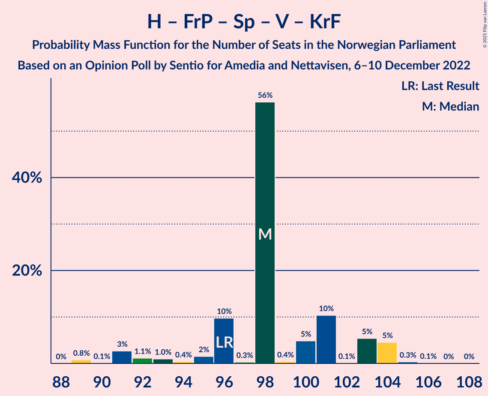
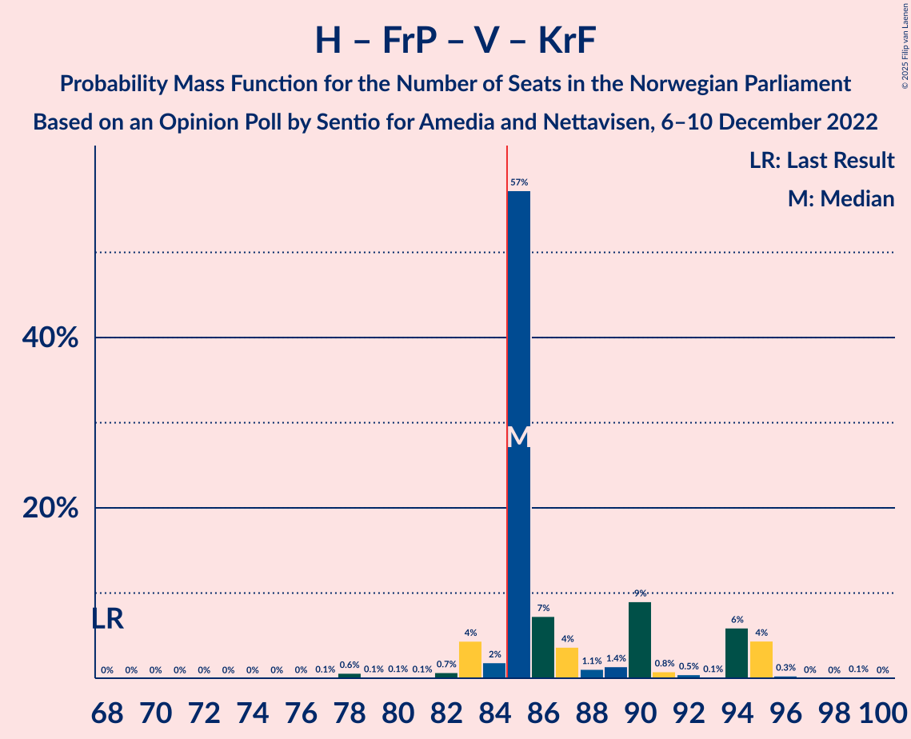

# Opinion Poll by Sentio for Amedia and Nettavisen, 6–10 December 2022

<a href="#voting-intentions">Voting Intentions</a> | <a href="#seats">Seats</a> | <a href="#coalitions">Coalitions</a> | <a href="#technical-information">Technical Information</a>

## Voting Intentions

### Confidence Intervals

| Party | Last Result | Poll Result | 80% Confidence Interval | 90% Confidence Interval | 95% Confidence Interval | 99% Confidence Interval |
|:-----:|:-----------:|:-----------:|:-----------------------:|:-----------------------:|:-----------------------:|:-----------------------:|
| Høyre | 20.4% | 32.8% | 30.9–34.8% |30.4–35.3% |29.9–35.8% |29.1–36.7% |
| Arbeiderpartiet | 26.2% | 17.7% | 16.2–19.3% |15.8–19.8% |15.5–20.2% |14.8–21.0% |
| Fremskrittspartiet | 11.6% | 10.2% | 9.1–11.5% |8.7–11.9% |8.5–12.2% |8.0–12.9% |
| Sosialistisk Venstreparti | 7.6% | 9.3% | 8.2–10.6% |7.9–10.9% |7.7–11.3% |7.2–11.9% |
| Rødt | 4.7% | 7.5% | 6.5–8.7% |6.2–9.0% |6.0–9.3% |5.6–9.9% |
| Senterpartiet | 13.5% | 5.9% | 5.0–7.0% |4.8–7.3% |4.6–7.5% |4.2–8.1% |
| Venstre | 4.6% | 4.6% | 3.9–5.6% |3.6–5.9% |3.5–6.1% |3.1–6.6% |
| Miljøpartiet De Grønne | 3.9% | 4.1% | 3.4–5.0% |3.2–5.3% |3.0–5.5% |2.7–6.0% |
| Kristelig Folkeparti | 3.8% | 2.8% | 2.2–3.6% |2.1–3.8% |1.9–4.0% |1.7–4.4% |
| Industri- og Næringspartiet | 0.3% | 1.7% | 1.3–2.4% |1.2–2.5% |1.1–2.7% |0.9–3.1% |
| Pensjonistpartiet | 0.6% | 1.5% | 1.1–2.1% |1.0–2.3% |0.9–2.5% |0.7–2.8% |
| Norgesdemokratene | 1.1% | 1.0% | 0.7–1.5% |0.6–1.7% |0.5–1.8% |0.4–2.1% |
| Folkets parti | 0.1% | 0.4% | 0.2–0.8% |0.2–0.9% |0.2–1.0% |0.1–1.3% |
| Konservativt | 0.4% | 0.2% | 0.1–0.5% |0.1–0.6% |0.1–0.7% |0.0–0.9% |
| Helsepartiet | 0.2% | 0.2% | 0.1–0.5% |0.1–0.6% |0.1–0.7% |0.0–0.9% |

*Note:* The poll result column reflects the actual value used in the calculations. Published results may vary slightly, and in addition be rounded to fewer digits.

## Seats

### Confidence Intervals

| Party | Last Result | Median | 80% Confidence Interval | 90% Confidence Interval | 95% Confidence Interval | 99% Confidence Interval |
|:-----:|:-----------:|:------:|:-----------------------:|:-----------------------:|:-----------------------:|:-----------------------:|
| <a href="#høyre">Høyre</a> | 36 | 59 | 56–63 |51–65 |51–65 |51–68 |
| <a href="#arbeiderpartiet">Arbeiderpartiet</a> | 48 | 34 | 33–35 |31–36 |31–36 |31–38 |
| <a href="#fremskrittspartiet">Fremskrittspartiet</a> | 21 | 15 | 15–20 |15–22 |15–22 |15–22 |
| <a href="#sosialistisk-venstreparti">Sosialistisk Venstreparti</a> | 13 | 18 | 15–18 |13–19 |13–20 |11–22 |
| <a href="#rødt">Rødt</a> | 8 | 10 | 10–14 |10–16 |10–19 |10–19 |
| <a href="#senterpartiet">Senterpartiet</a> | 28 | 13 | 9–13 |9–13 |8–13 |2–16 |
| <a href="#venstre">Venstre</a> | 8 | 9 | 8–10 |3–11 |3–11 |2–11 |
| <a href="#miljøpartiet-de-grønne">Miljøpartiet De Grønne</a> | 3 | 8 | 2–8 |2–8 |2–9 |1–9 |
| <a href="#kristelig-folkeparti">Kristelig Folkeparti</a> | 3 | 2 | 1–2 |1–2 |0–2 |0–7 |
| <a href="#industri--og-næringspartiet">Industri- og Næringspartiet</a> | 0 | 0 | 0 |0 |0–1 |0–2 |
| <a href="#pensjonistpartiet">Pensjonistpartiet</a> | 0 | 0 | 0 |0 |0–1 |0–1 |
| <a href="#norgesdemokratene">Norgesdemokratene</a> | 0 | 0 | 0 |0 |0 |0 |
| <a href="#folkets-parti">Folkets parti</a> | 0 | 0 | 0 |0 |0 |0 |
| <a href="#konservativt">Konservativt</a> | 0 | 0 | 0 |0 |0 |0 |
| <a href="#helsepartiet">Helsepartiet</a> | 0 | 0 | 0 |0 |0 |0 |

### Høyre

*For a full overview of the results for this party, see the [Høyre](party-høyre.html) page.*

| Number of Seats | Probability | Accumulated | Special Marks |
|:---------------:|:-----------:|:-----------:|:-------------:|
| 36 | 0% | 100% | Last Result |
| 37 | 0% | 100% |  |
| 38 | 0% | 100% |  |
| 39 | 0% | 100% |  |
| 40 | 0% | 100% |  |
| 41 | 0% | 100% |  |
| 42 | 0% | 100% |  |
| 43 | 0% | 100% |  |
| 44 | 0% | 100% |  |
| 45 | 0% | 100% |  |
| 46 | 0% | 100% |  |
| 47 | 0% | 100% |  |
| 48 | 0% | 100% |  |
| 49 | 0% | 100% |  |
| 50 | 0% | 100% |  |
| 51 | 7% | 99.9% |  |
| 52 | 0.2% | 93% |  |
| 53 | 0.2% | 93% |  |
| 54 | 0.5% | 93% |  |
| 55 | 0.2% | 92% |  |
| 56 | 4% | 92% |  |
| 57 | 2% | 88% |  |
| 58 | 4% | 86% |  |
| 59 | 59% | 82% | Median |
| 60 | 0.2% | 23% |  |
| 61 | 1.1% | 23% |  |
| 62 | 8% | 22% |  |
| 63 | 7% | 14% |  |
| 64 | 1.1% | 7% |  |
| 65 | 5% | 6% |  |
| 66 | 0.1% | 0.8% |  |
| 67 | 0% | 0.7% |  |
| 68 | 0.2% | 0.6% |  |
| 69 | 0.3% | 0.4% |  |
| 70 | 0% | 0% |  |

### Arbeiderpartiet

*For a full overview of the results for this party, see the [Arbeiderpartiet](party-arbeiderpartiet.html) page.*

| Number of Seats | Probability | Accumulated | Special Marks |
|:---------------:|:-----------:|:-----------:|:-------------:|
| 24 | 0.1% | 100% |  |
| 25 | 0% | 99.9% |  |
| 26 | 0.1% | 99.9% |  |
| 27 | 0% | 99.8% |  |
| 28 | 0.1% | 99.8% |  |
| 29 | 0% | 99.8% |  |
| 30 | 0.1% | 99.8% |  |
| 31 | 5% | 99.7% |  |
| 32 | 1.2% | 94% |  |
| 33 | 17% | 93% |  |
| 34 | 58% | 76% | Median |
| 35 | 12% | 18% |  |
| 36 | 4% | 5% |  |
| 37 | 1.0% | 2% |  |
| 38 | 0.4% | 0.7% |  |
| 39 | 0.2% | 0.3% |  |
| 40 | 0.1% | 0.1% |  |
| 41 | 0% | 0.1% |  |
| 42 | 0% | 0% |  |
| 43 | 0% | 0% |  |
| 44 | 0% | 0% |  |
| 45 | 0% | 0% |  |
| 46 | 0% | 0% |  |
| 47 | 0% | 0% |  |
| 48 | 0% | 0% | Last Result |

### Fremskrittspartiet

*For a full overview of the results for this party, see the [Fremskrittspartiet](party-fremskrittspartiet.html) page.*

| Number of Seats | Probability | Accumulated | Special Marks |
|:---------------:|:-----------:|:-----------:|:-------------:|
| 13 | 0% | 100% |  |
| 14 | 0.1% | 99.9% |  |
| 15 | 55% | 99.8% | Median |
| 16 | 0.8% | 45% |  |
| 17 | 10% | 44% |  |
| 18 | 7% | 34% |  |
| 19 | 12% | 27% |  |
| 20 | 6% | 15% |  |
| 21 | 2% | 9% | Last Result |
| 22 | 7% | 7% |  |
| 23 | 0.1% | 0.2% |  |
| 24 | 0.1% | 0.2% |  |
| 25 | 0% | 0% |  |

### Sosialistisk Venstreparti

*For a full overview of the results for this party, see the [Sosialistisk Venstreparti](party-sosialistiskvenstreparti.html) page.*

| Number of Seats | Probability | Accumulated | Special Marks |
|:---------------:|:-----------:|:-----------:|:-------------:|
| 11 | 0.8% | 100% |  |
| 12 | 0.5% | 99.2% |  |
| 13 | 5% | 98.6% | Last Result |
| 14 | 2% | 94% |  |
| 15 | 7% | 92% |  |
| 16 | 4% | 85% |  |
| 17 | 1.1% | 82% |  |
| 18 | 73% | 80% | Median |
| 19 | 2% | 7% |  |
| 20 | 4% | 5% |  |
| 21 | 0.3% | 1.3% |  |
| 22 | 0.5% | 1.0% |  |
| 23 | 0.5% | 0.5% |  |
| 24 | 0% | 0% |  |

### Rødt

*For a full overview of the results for this party, see the [Rødt](party-rødt.html) page.*

| Number of Seats | Probability | Accumulated | Special Marks |
|:---------------:|:-----------:|:-----------:|:-------------:|
| 8 | 0% | 100% | Last Result |
| 9 | 0% | 100% |  |
| 10 | 58% | 100% | Median |
| 11 | 1.1% | 42% |  |
| 12 | 19% | 40% |  |
| 13 | 6% | 21% |  |
| 14 | 9% | 16% |  |
| 15 | 2% | 7% |  |
| 16 | 0.4% | 5% |  |
| 17 | 0.8% | 5% |  |
| 18 | 1.3% | 4% |  |
| 19 | 3% | 3% |  |
| 20 | 0% | 0% |  |

### Senterpartiet

*For a full overview of the results for this party, see the [Senterpartiet](party-senterpartiet.html) page.*

| Number of Seats | Probability | Accumulated | Special Marks |
|:---------------:|:-----------:|:-----------:|:-------------:|
| 1 | 0.2% | 100% |  |
| 2 | 0.3% | 99.8% |  |
| 3 | 0% | 99.5% |  |
| 4 | 0% | 99.4% |  |
| 5 | 0% | 99.4% |  |
| 6 | 0% | 99.4% |  |
| 7 | 1.0% | 99.4% |  |
| 8 | 3% | 98% |  |
| 9 | 12% | 96% |  |
| 10 | 10% | 83% |  |
| 11 | 12% | 73% |  |
| 12 | 0.7% | 61% |  |
| 13 | 58% | 60% | Median |
| 14 | 0.3% | 2% |  |
| 15 | 0.1% | 2% |  |
| 16 | 2% | 2% |  |
| 17 | 0% | 0% |  |
| 18 | 0% | 0% |  |
| 19 | 0% | 0% |  |
| 20 | 0% | 0% |  |
| 21 | 0% | 0% |  |
| 22 | 0% | 0% |  |
| 23 | 0% | 0% |  |
| 24 | 0% | 0% |  |
| 25 | 0% | 0% |  |
| 26 | 0% | 0% |  |
| 27 | 0% | 0% |  |
| 28 | 0% | 0% | Last Result |

### Venstre

*For a full overview of the results for this party, see the [Venstre](party-venstre.html) page.*

| Number of Seats | Probability | Accumulated | Special Marks |
|:---------------:|:-----------:|:-----------:|:-------------:|
| 2 | 2% | 100% |  |
| 3 | 3% | 98% |  |
| 4 | 0% | 95% |  |
| 5 | 0% | 95% |  |
| 6 | 0% | 95% |  |
| 7 | 3% | 95% |  |
| 8 | 7% | 92% | Last Result |
| 9 | 63% | 85% | Median |
| 10 | 15% | 22% |  |
| 11 | 7% | 7% |  |
| 12 | 0.1% | 0.1% |  |
| 13 | 0% | 0% |  |

### Miljøpartiet De Grønne

*For a full overview of the results for this party, see the [Miljøpartiet De Grønne](party-miljøpartietdegrønne.html) page.*

| Number of Seats | Probability | Accumulated | Special Marks |
|:---------------:|:-----------:|:-----------:|:-------------:|
| 1 | 1.4% | 100% |  |
| 2 | 17% | 98.6% |  |
| 3 | 0.2% | 82% | Last Result |
| 4 | 0% | 82% |  |
| 5 | 0% | 82% |  |
| 6 | 0% | 82% |  |
| 7 | 14% | 82% |  |
| 8 | 65% | 68% | Median |
| 9 | 2% | 3% |  |
| 10 | 0.4% | 0.5% |  |
| 11 | 0% | 0.1% |  |
| 12 | 0.1% | 0.1% |  |
| 13 | 0% | 0% |  |

### Kristelig Folkeparti

*For a full overview of the results for this party, see the [Kristelig Folkeparti](party-kristeligfolkeparti.html) page.*

| Number of Seats | Probability | Accumulated | Special Marks |
|:---------------:|:-----------:|:-----------:|:-------------:|
| 0 | 5% | 100% |  |
| 1 | 15% | 95% |  |
| 2 | 78% | 80% | Median |
| 3 | 0.8% | 1.4% | Last Result |
| 4 | 0% | 0.6% |  |
| 5 | 0% | 0.6% |  |
| 6 | 0% | 0.6% |  |
| 7 | 0.3% | 0.6% |  |
| 8 | 0.1% | 0.3% |  |
| 9 | 0.2% | 0.2% |  |
| 10 | 0% | 0% |  |

### Industri- og Næringspartiet

*For a full overview of the results for this party, see the [Industri- og Næringspartiet](party-industri-ognæringspartiet.html) page.*

| Number of Seats | Probability | Accumulated | Special Marks |
|:---------------:|:-----------:|:-----------:|:-------------:|
| 0 | 95% | 100% | Last Result, Median |
| 1 | 3% | 5% |  |
| 2 | 1.5% | 2% |  |
| 3 | 0.2% | 0.2% |  |
| 4 | 0% | 0% |  |

### Pensjonistpartiet

*For a full overview of the results for this party, see the [Pensjonistpartiet](party-pensjonistpartiet.html) page.*

| Number of Seats | Probability | Accumulated | Special Marks |
|:---------------:|:-----------:|:-----------:|:-------------:|
| 0 | 96% | 100% | Last Result, Median |
| 1 | 4% | 4% |  |
| 2 | 0% | 0% |  |

### Norgesdemokratene

*For a full overview of the results for this party, see the [Norgesdemokratene](party-norgesdemokratene.html) page.*

| Number of Seats | Probability | Accumulated | Special Marks |
|:---------------:|:-----------:|:-----------:|:-------------:|
| 0 | 100% | 100% | Last Result, Median |

### Folkets parti

*For a full overview of the results for this party, see the [Folkets parti](party-folketsparti.html) page.*

| Number of Seats | Probability | Accumulated | Special Marks |
|:---------------:|:-----------:|:-----------:|:-------------:|
| 0 | 100% | 100% | Last Result, Median |

### Konservativt

*For a full overview of the results for this party, see the [Konservativt](party-konservativt.html) page.*

| Number of Seats | Probability | Accumulated | Special Marks |
|:---------------:|:-----------:|:-----------:|:-------------:|
| 0 | 100% | 100% | Last Result, Median |

### Helsepartiet

*For a full overview of the results for this party, see the [Helsepartiet](party-helsepartiet.html) page.*

| Number of Seats | Probability | Accumulated | Special Marks |
|:---------------:|:-----------:|:-----------:|:-------------:|
| 0 | 100% | 100% | Last Result, Median |

## Coalitions

### Confidence Intervals

| Coalition | Last Result | Median | Majority? | 80% Confidence Interval | 90% Confidence Interval | 95% Confidence Interval | 99% Confidence Interval |
|:---------:|:-----------:|:------:|:---------:|:-----------------------:|:-----------------------:|:-----------------------:|:-----------------------:|
| Høyre – Fremskrittspartiet – Senterpartiet – Venstre – Kristelig Folkeparti | 96 | 98 | 100% | 96–103 | 93–104 | 91–104 | 89–104 |
| Høyre – Fremskrittspartiet – Venstre – Miljøpartiet De Grønne – Kristelig Folkeparti | 71 | 93 | 99.5% | 91–101 | 89–101 | 85–103 | 84–103 |
| Høyre – Fremskrittspartiet – Venstre – Kristelig Folkeparti | 68 | 85 | 92% | 85–94 | 83–94 | 83–95 | 78–95 |
| Høyre – Fremskrittspartiet – Venstre | 65 | 83 | 27% | 83–93 | 81–93 | 81–93 | 78–93 |
| Arbeiderpartiet – Sosialistisk Venstreparti – Rødt – Senterpartiet – Miljøpartiet De Grønne | 100 | 83 | 6% | 74–83 | 74–85 | 73–85 | 73–88 |
| Høyre – Fremskrittspartiet | 57 | 74 | 0.8% | 74–83 | 73–84 | 73–84 | 71–86 |
| Arbeiderpartiet – Sosialistisk Venstreparti – Rødt – Senterpartiet | 97 | 75 | 0% | 67–77 | 67–78 | 65–83 | 65–84 |
| Arbeiderpartiet – Sosialistisk Venstreparti – Rødt – Miljøpartiet De Grønne | 72 | 70 | 0% | 65–72 | 64–75 | 64–77 | 64–77 |
| Høyre – Venstre – Kristelig Folkeparti | 47 | 70 | 0% | 64–74 | 64–76 | 64–76 | 60–77 |
| Arbeiderpartiet – Sosialistisk Venstreparti – Senterpartiet – Miljøpartiet De Grønne – Kristelig Folkeparti | 95 | 75 | 0% | 65–75 | 63–75 | 63–75 | 61–76 |
| Arbeiderpartiet – Sosialistisk Venstreparti – Senterpartiet – Miljøpartiet De Grønne | 92 | 73 | 0% | 63–73 | 62–73 | 62–73 | 60–76 |
| Arbeiderpartiet – Sosialistisk Venstreparti – Senterpartiet | 89 | 65 | 0% | 55–65 | 55–66 | 55–66 | 53–69 |
| Arbeiderpartiet – Senterpartiet – Miljøpartiet De Grønne – Kristelig Folkeparti | 82 | 57 | 0% | 48–57 | 48–57 | 47–57 | 43–59 |
| Arbeiderpartiet – Sosialistisk Venstreparti | 61 | 52 | 0% | 46–53 | 46–53 | 46–56 | 46–56 |
| Arbeiderpartiet – Senterpartiet – Kristelig Folkeparti | 79 | 49 | 0% | 44–49 | 41–49 | 41–50 | 38–52 |
| Arbeiderpartiet – Senterpartiet | 76 | 47 | 0% | 42–47 | 40–48 | 40–48 | 37–49 |
| Senterpartiet – Venstre – Kristelig Folkeparti | 39 | 24 | 0% | 20–24 | 17–24 | 13–24 | 11–24 |

### Høyre – Fremskrittspartiet – Senterpartiet – Venstre – Kristelig Folkeparti

| Number of Seats | Probability | Accumulated | Special Marks |
|:---------------:|:-----------:|:-----------:|:-------------:|
| 88 | 0% | 100% |  |
| 89 | 0.8% | 99.9% |  |
| 90 | 0.1% | 99.2% |  |
| 91 | 3% | 99.1% |  |
| 92 | 1.1% | 96% |  |
| 93 | 1.0% | 95% |  |
| 94 | 0.4% | 94% |  |
| 95 | 2% | 94% |  |
| 96 | 10% | 92% | Last Result |
| 97 | 0.3% | 83% |  |
| 98 | 56% | 82% | Median |
| 99 | 0.4% | 26% |  |
| 100 | 5% | 26% |  |
| 101 | 10% | 21% |  |
| 102 | 0.1% | 10% |  |
| 103 | 5% | 10% |  |
| 104 | 5% | 5% |  |
| 105 | 0.3% | 0.5% |  |
| 106 | 0.1% | 0.1% |  |
| 107 | 0% | 0% |  |

### Høyre – Fremskrittspartiet – Venstre – Miljøpartiet De Grønne – Kristelig Folkeparti

| Number of Seats | Probability | Accumulated | Special Marks |
|:---------------:|:-----------:|:-----------:|:-------------:|
| 71 | 0% | 100% | Last Result |
| 72 | 0% | 100% |  |
| 73 | 0% | 100% |  |
| 74 | 0% | 100% |  |
| 75 | 0% | 100% |  |
| 76 | 0% | 100% |  |
| 77 | 0% | 100% |  |
| 78 | 0% | 100% |  |
| 79 | 0% | 100% |  |
| 80 | 0% | 100% |  |
| 81 | 0% | 100% |  |
| 82 | 0% | 100% |  |
| 83 | 0% | 100% |  |
| 84 | 0.5% | 100% |  |
| 85 | 3% | 99.5% | Majority |
| 86 | 0.2% | 96% |  |
| 87 | 0.9% | 96% |  |
| 88 | 0.1% | 95% |  |
| 89 | 3% | 95% |  |
| 90 | 1.4% | 92% |  |
| 91 | 1.1% | 90% |  |
| 92 | 10% | 89% |  |
| 93 | 64% | 80% | Median |
| 94 | 2% | 15% |  |
| 95 | 0.4% | 14% |  |
| 96 | 2% | 13% |  |
| 97 | 0.9% | 12% |  |
| 98 | 0.4% | 11% |  |
| 99 | 0.2% | 10% |  |
| 100 | 0.1% | 10% |  |
| 101 | 5% | 10% |  |
| 102 | 0% | 5% |  |
| 103 | 5% | 5% |  |
| 104 | 0% | 0.2% |  |
| 105 | 0% | 0.2% |  |
| 106 | 0% | 0.2% |  |
| 107 | 0.1% | 0.1% |  |
| 108 | 0% | 0% |  |

### Høyre – Fremskrittspartiet – Venstre – Kristelig Folkeparti

| Number of Seats | Probability | Accumulated | Special Marks |
|:---------------:|:-----------:|:-----------:|:-------------:|
| 68 | 0% | 100% | Last Result |
| 69 | 0% | 100% |  |
| 70 | 0% | 100% |  |
| 71 | 0% | 100% |  |
| 72 | 0% | 100% |  |
| 73 | 0% | 100% |  |
| 74 | 0% | 100% |  |
| 75 | 0% | 100% |  |
| 76 | 0% | 100% |  |
| 77 | 0.1% | 100% |  |
| 78 | 0.6% | 99.9% |  |
| 79 | 0.1% | 99.3% |  |
| 80 | 0.1% | 99.1% |  |
| 81 | 0.1% | 99.0% |  |
| 82 | 0.7% | 98.9% |  |
| 83 | 4% | 98% |  |
| 84 | 2% | 94% |  |
| 85 | 57% | 92% | Median, Majority |
| 86 | 7% | 35% |  |
| 87 | 4% | 27% |  |
| 88 | 1.1% | 24% |  |
| 89 | 1.4% | 23% |  |
| 90 | 9% | 21% |  |
| 91 | 0.8% | 12% |  |
| 92 | 0.5% | 11% |  |
| 93 | 0.1% | 11% |  |
| 94 | 6% | 11% |  |
| 95 | 4% | 5% |  |
| 96 | 0.3% | 0.5% |  |
| 97 | 0% | 0.2% |  |
| 98 | 0% | 0.1% |  |
| 99 | 0.1% | 0.1% |  |
| 100 | 0% | 0% |  |

### Høyre – Fremskrittspartiet – Venstre

| Number of Seats | Probability | Accumulated | Special Marks |
|:---------------:|:-----------:|:-----------:|:-------------:|
| 65 | 0% | 100% | Last Result |
| 66 | 0% | 100% |  |
| 67 | 0% | 100% |  |
| 68 | 0% | 100% |  |
| 69 | 0% | 100% |  |
| 70 | 0% | 100% |  |
| 71 | 0% | 100% |  |
| 72 | 0% | 100% |  |
| 73 | 0% | 100% |  |
| 74 | 0% | 100% |  |
| 75 | 0.1% | 100% |  |
| 76 | 0% | 99.9% |  |
| 77 | 0.1% | 99.9% |  |
| 78 | 0.8% | 99.7% |  |
| 79 | 0.1% | 99.0% |  |
| 80 | 0.9% | 98.9% |  |
| 81 | 3% | 98% |  |
| 82 | 0.3% | 95% |  |
| 83 | 58% | 94% | Median |
| 84 | 9% | 36% |  |
| 85 | 4% | 27% | Majority |
| 86 | 0.1% | 23% |  |
| 87 | 0.8% | 23% |  |
| 88 | 3% | 22% |  |
| 89 | 8% | 20% |  |
| 90 | 0.2% | 11% |  |
| 91 | 0.4% | 11% |  |
| 92 | 0.1% | 11% |  |
| 93 | 10% | 11% |  |
| 94 | 0% | 0.5% |  |
| 95 | 0% | 0.5% |  |
| 96 | 0.3% | 0.4% |  |
| 97 | 0.1% | 0.1% |  |
| 98 | 0% | 0% |  |

### Arbeiderpartiet – Sosialistisk Venstreparti – Rødt – Senterpartiet – Miljøpartiet De Grønne

| Number of Seats | Probability | Accumulated | Special Marks |
|:---------------:|:-----------:|:-----------:|:-------------:|
| 68 | 0.1% | 100% |  |
| 69 | 0% | 99.9% |  |
| 70 | 0% | 99.9% |  |
| 71 | 0.3% | 99.8% |  |
| 72 | 0% | 99.5% |  |
| 73 | 4% | 99.5% |  |
| 74 | 6% | 95% |  |
| 75 | 0.1% | 89% |  |
| 76 | 0.5% | 89% |  |
| 77 | 1.1% | 89% |  |
| 78 | 9% | 87% |  |
| 79 | 1.4% | 79% |  |
| 80 | 4% | 77% |  |
| 81 | 1.0% | 73% |  |
| 82 | 10% | 72% |  |
| 83 | 54% | 62% | Median |
| 84 | 2% | 8% |  |
| 85 | 4% | 6% | Majority |
| 86 | 0.7% | 2% |  |
| 87 | 0% | 0.9% |  |
| 88 | 0.8% | 0.9% |  |
| 89 | 0% | 0.1% |  |
| 90 | 0.1% | 0.1% |  |
| 91 | 0% | 0% |  |
| 92 | 0% | 0% |  |
| 93 | 0% | 0% |  |
| 94 | 0% | 0% |  |
| 95 | 0% | 0% |  |
| 96 | 0% | 0% |  |
| 97 | 0% | 0% |  |
| 98 | 0% | 0% |  |
| 99 | 0% | 0% |  |
| 100 | 0% | 0% | Last Result |

### Høyre – Fremskrittspartiet

| Number of Seats | Probability | Accumulated | Special Marks |
|:---------------:|:-----------:|:-----------:|:-------------:|
| 57 | 0% | 100% | Last Result |
| 58 | 0% | 100% |  |
| 59 | 0% | 100% |  |
| 60 | 0% | 100% |  |
| 61 | 0% | 100% |  |
| 62 | 0% | 100% |  |
| 63 | 0% | 100% |  |
| 64 | 0% | 100% |  |
| 65 | 0% | 100% |  |
| 66 | 0% | 100% |  |
| 67 | 0% | 100% |  |
| 68 | 0% | 100% |  |
| 69 | 0% | 100% |  |
| 70 | 0.1% | 100% |  |
| 71 | 0.6% | 99.8% |  |
| 72 | 0.4% | 99.2% |  |
| 73 | 7% | 98.9% |  |
| 74 | 58% | 92% | Median |
| 75 | 0.1% | 34% |  |
| 76 | 1.0% | 34% |  |
| 77 | 5% | 33% |  |
| 78 | 4% | 27% |  |
| 79 | 9% | 23% |  |
| 80 | 2% | 14% |  |
| 81 | 0.8% | 13% |  |
| 82 | 1.2% | 12% |  |
| 83 | 5% | 11% |  |
| 84 | 5% | 5% |  |
| 85 | 0% | 0.8% | Majority |
| 86 | 0.5% | 0.7% |  |
| 87 | 0.1% | 0.2% |  |
| 88 | 0.1% | 0.2% |  |
| 89 | 0% | 0% |  |

### Arbeiderpartiet – Sosialistisk Venstreparti – Rødt – Senterpartiet

| Number of Seats | Probability | Accumulated | Special Marks |
|:---------------:|:-----------:|:-----------:|:-------------:|
| 60 | 0.1% | 100% |  |
| 61 | 0% | 99.9% |  |
| 62 | 0% | 99.8% |  |
| 63 | 0% | 99.8% |  |
| 64 | 0% | 99.8% |  |
| 65 | 5% | 99.8% |  |
| 66 | 0% | 95% |  |
| 67 | 5% | 95% |  |
| 68 | 0.1% | 90% |  |
| 69 | 0.4% | 90% |  |
| 70 | 0.1% | 89% |  |
| 71 | 0.9% | 89% |  |
| 72 | 2% | 88% |  |
| 73 | 0.5% | 86% |  |
| 74 | 4% | 86% |  |
| 75 | 62% | 82% | Median |
| 76 | 9% | 20% |  |
| 77 | 1.1% | 11% |  |
| 78 | 5% | 9% |  |
| 79 | 0.8% | 5% |  |
| 80 | 0.1% | 4% |  |
| 81 | 0.2% | 4% |  |
| 82 | 0.2% | 4% |  |
| 83 | 3% | 4% |  |
| 84 | 0.5% | 0.5% |  |
| 85 | 0% | 0% | Majority |
| 86 | 0% | 0% |  |
| 87 | 0% | 0% |  |
| 88 | 0% | 0% |  |
| 89 | 0% | 0% |  |
| 90 | 0% | 0% |  |
| 91 | 0% | 0% |  |
| 92 | 0% | 0% |  |
| 93 | 0% | 0% |  |
| 94 | 0% | 0% |  |
| 95 | 0% | 0% |  |
| 96 | 0% | 0% |  |
| 97 | 0% | 0% | Last Result |

### Arbeiderpartiet – Sosialistisk Venstreparti – Rødt – Miljøpartiet De Grønne

| Number of Seats | Probability | Accumulated | Special Marks |
|:---------------:|:-----------:|:-----------:|:-------------:|
| 61 | 0% | 100% |  |
| 62 | 0.1% | 99.9% |  |
| 63 | 0.3% | 99.9% |  |
| 64 | 5% | 99.5% |  |
| 65 | 5% | 95% |  |
| 66 | 0.1% | 90% |  |
| 67 | 14% | 90% |  |
| 68 | 2% | 76% |  |
| 69 | 0.5% | 74% |  |
| 70 | 56% | 73% | Median |
| 71 | 3% | 17% |  |
| 72 | 7% | 14% | Last Result |
| 73 | 0.9% | 7% |  |
| 74 | 0.4% | 6% |  |
| 75 | 0.9% | 5% |  |
| 76 | 1.1% | 5% |  |
| 77 | 3% | 3% |  |
| 78 | 0.1% | 0.2% |  |
| 79 | 0.1% | 0.1% |  |
| 80 | 0% | 0% |  |

### Høyre – Venstre – Kristelig Folkeparti

| Number of Seats | Probability | Accumulated | Special Marks |
|:---------------:|:-----------:|:-----------:|:-------------:|
| 47 | 0% | 100% | Last Result |
| 48 | 0% | 100% |  |
| 49 | 0% | 100% |  |
| 50 | 0% | 100% |  |
| 51 | 0% | 100% |  |
| 52 | 0% | 100% |  |
| 53 | 0% | 100% |  |
| 54 | 0% | 100% |  |
| 55 | 0% | 100% |  |
| 56 | 0% | 100% |  |
| 57 | 0% | 100% |  |
| 58 | 0% | 100% |  |
| 59 | 0.1% | 100% |  |
| 60 | 0.7% | 99.9% |  |
| 61 | 0.6% | 99.2% |  |
| 62 | 0.4% | 98.6% |  |
| 63 | 0.2% | 98% |  |
| 64 | 10% | 98% |  |
| 65 | 1.2% | 88% |  |
| 66 | 2% | 87% |  |
| 67 | 3% | 85% |  |
| 68 | 3% | 82% |  |
| 69 | 2% | 78% |  |
| 70 | 54% | 76% | Median |
| 71 | 0% | 22% |  |
| 72 | 2% | 22% |  |
| 73 | 8% | 20% |  |
| 74 | 6% | 12% |  |
| 75 | 0.2% | 6% |  |
| 76 | 5% | 5% |  |
| 77 | 0.5% | 0.9% |  |
| 78 | 0% | 0.4% |  |
| 79 | 0.3% | 0.4% |  |
| 80 | 0% | 0.1% |  |
| 81 | 0% | 0% |  |

### Arbeiderpartiet – Sosialistisk Venstreparti – Senterpartiet – Miljøpartiet De Grønne – Kristelig Folkeparti

| Number of Seats | Probability | Accumulated | Special Marks |
|:---------------:|:-----------:|:-----------:|:-------------:|
| 55 | 0.3% | 100% |  |
| 56 | 0% | 99.7% |  |
| 57 | 0% | 99.7% |  |
| 58 | 0% | 99.7% |  |
| 59 | 0.1% | 99.7% |  |
| 60 | 0% | 99.5% |  |
| 61 | 0% | 99.5% |  |
| 62 | 0% | 99.5% |  |
| 63 | 6% | 99.4% |  |
| 64 | 0.3% | 93% |  |
| 65 | 5% | 93% |  |
| 66 | 1.4% | 88% |  |
| 67 | 10% | 86% |  |
| 68 | 4% | 77% |  |
| 69 | 0.6% | 73% |  |
| 70 | 11% | 72% |  |
| 71 | 4% | 61% |  |
| 72 | 0.4% | 57% |  |
| 73 | 0.8% | 56% |  |
| 74 | 0.3% | 56% |  |
| 75 | 54% | 55% | Median |
| 76 | 0.8% | 1.2% |  |
| 77 | 0.2% | 0.3% |  |
| 78 | 0.1% | 0.1% |  |
| 79 | 0% | 0.1% |  |
| 80 | 0% | 0% |  |
| 81 | 0% | 0% |  |
| 82 | 0% | 0% |  |
| 83 | 0% | 0% |  |
| 84 | 0% | 0% |  |
| 85 | 0% | 0% | Majority |
| 86 | 0% | 0% |  |
| 87 | 0% | 0% |  |
| 88 | 0% | 0% |  |
| 89 | 0% | 0% |  |
| 90 | 0% | 0% |  |
| 91 | 0% | 0% |  |
| 92 | 0% | 0% |  |
| 93 | 0% | 0% |  |
| 94 | 0% | 0% |  |
| 95 | 0% | 0% | Last Result |

### Arbeiderpartiet – Sosialistisk Venstreparti – Senterpartiet – Miljøpartiet De Grønne

| Number of Seats | Probability | Accumulated | Special Marks |
|:---------------:|:-----------:|:-----------:|:-------------:|
| 55 | 0.3% | 100% |  |
| 56 | 0% | 99.7% |  |
| 57 | 0.1% | 99.7% |  |
| 58 | 0% | 99.5% |  |
| 59 | 0% | 99.5% |  |
| 60 | 0.4% | 99.5% |  |
| 61 | 0.3% | 99.1% |  |
| 62 | 6% | 98.9% |  |
| 63 | 5% | 93% |  |
| 64 | 2% | 88% |  |
| 65 | 1.5% | 87% |  |
| 66 | 11% | 85% |  |
| 67 | 1.2% | 75% |  |
| 68 | 13% | 73% |  |
| 69 | 3% | 61% |  |
| 70 | 0.3% | 58% |  |
| 71 | 2% | 58% |  |
| 72 | 0.2% | 55% |  |
| 73 | 54% | 55% | Median |
| 74 | 0% | 0.9% |  |
| 75 | 0.2% | 0.9% |  |
| 76 | 0.7% | 0.8% |  |
| 77 | 0% | 0% |  |
| 78 | 0% | 0% |  |
| 79 | 0% | 0% |  |
| 80 | 0% | 0% |  |
| 81 | 0% | 0% |  |
| 82 | 0% | 0% |  |
| 83 | 0% | 0% |  |
| 84 | 0% | 0% |  |
| 85 | 0% | 0% | Majority |
| 86 | 0% | 0% |  |
| 87 | 0% | 0% |  |
| 88 | 0% | 0% |  |
| 89 | 0% | 0% |  |
| 90 | 0% | 0% |  |
| 91 | 0% | 0% |  |
| 92 | 0% | 0% | Last Result |

### Arbeiderpartiet – Sosialistisk Venstreparti – Senterpartiet

| Number of Seats | Probability | Accumulated | Special Marks |
|:---------------:|:-----------:|:-----------:|:-------------:|
| 49 | 0.1% | 100% |  |
| 50 | 0% | 99.8% |  |
| 51 | 0% | 99.8% |  |
| 52 | 0% | 99.8% |  |
| 53 | 0.6% | 99.8% |  |
| 54 | 0.1% | 99.1% |  |
| 55 | 10% | 99.0% |  |
| 56 | 0.9% | 89% |  |
| 57 | 0% | 89% |  |
| 58 | 1.0% | 88% |  |
| 59 | 0.7% | 88% |  |
| 60 | 3% | 87% |  |
| 61 | 10% | 84% |  |
| 62 | 0.3% | 74% |  |
| 63 | 4% | 74% |  |
| 64 | 11% | 70% |  |
| 65 | 54% | 59% | Median |
| 66 | 4% | 5% |  |
| 67 | 0.8% | 1.4% |  |
| 68 | 0.1% | 0.6% |  |
| 69 | 0.5% | 0.6% |  |
| 70 | 0% | 0% |  |
| 71 | 0% | 0% |  |
| 72 | 0% | 0% |  |
| 73 | 0% | 0% |  |
| 74 | 0% | 0% |  |
| 75 | 0% | 0% |  |
| 76 | 0% | 0% |  |
| 77 | 0% | 0% |  |
| 78 | 0% | 0% |  |
| 79 | 0% | 0% |  |
| 80 | 0% | 0% |  |
| 81 | 0% | 0% |  |
| 82 | 0% | 0% |  |
| 83 | 0% | 0% |  |
| 84 | 0% | 0% |  |
| 85 | 0% | 0% | Majority |
| 86 | 0% | 0% |  |
| 87 | 0% | 0% |  |
| 88 | 0% | 0% |  |
| 89 | 0% | 0% | Last Result |

### Arbeiderpartiet – Senterpartiet – Miljøpartiet De Grønne – Kristelig Folkeparti

| Number of Seats | Probability | Accumulated | Special Marks |
|:---------------:|:-----------:|:-----------:|:-------------:|
| 39 | 0.3% | 100% |  |
| 40 | 0% | 99.7% |  |
| 41 | 0% | 99.7% |  |
| 42 | 0% | 99.7% |  |
| 43 | 0.3% | 99.7% |  |
| 44 | 0% | 99.3% |  |
| 45 | 0% | 99.3% |  |
| 46 | 0.1% | 99.3% |  |
| 47 | 2% | 99.2% |  |
| 48 | 8% | 97% |  |
| 49 | 10% | 89% |  |
| 50 | 0.5% | 79% |  |
| 51 | 0.6% | 79% |  |
| 52 | 15% | 78% |  |
| 53 | 1.2% | 63% |  |
| 54 | 0.9% | 62% |  |
| 55 | 3% | 61% |  |
| 56 | 0.2% | 57% |  |
| 57 | 56% | 57% | Median |
| 58 | 0.1% | 0.9% |  |
| 59 | 0.3% | 0.8% |  |
| 60 | 0.1% | 0.4% |  |
| 61 | 0.1% | 0.4% |  |
| 62 | 0% | 0.3% |  |
| 63 | 0.2% | 0.2% |  |
| 64 | 0% | 0% |  |
| 65 | 0% | 0% |  |
| 66 | 0% | 0% |  |
| 67 | 0% | 0% |  |
| 68 | 0% | 0% |  |
| 69 | 0% | 0% |  |
| 70 | 0% | 0% |  |
| 71 | 0% | 0% |  |
| 72 | 0% | 0% |  |
| 73 | 0% | 0% |  |
| 74 | 0% | 0% |  |
| 75 | 0% | 0% |  |
| 76 | 0% | 0% |  |
| 77 | 0% | 0% |  |
| 78 | 0% | 0% |  |
| 79 | 0% | 0% |  |
| 80 | 0% | 0% |  |
| 81 | 0% | 0% |  |
| 82 | 0% | 0% | Last Result |

### Arbeiderpartiet – Sosialistisk Venstreparti

| Number of Seats | Probability | Accumulated | Special Marks |
|:---------------:|:-----------:|:-----------:|:-------------:|
| 41 | 0.1% | 100% |  |
| 42 | 0% | 99.9% |  |
| 43 | 0.1% | 99.9% |  |
| 44 | 0% | 99.9% |  |
| 45 | 0.1% | 99.8% |  |
| 46 | 10% | 99.7% |  |
| 47 | 3% | 89% |  |
| 48 | 0.3% | 87% |  |
| 49 | 1.0% | 87% |  |
| 50 | 5% | 86% |  |
| 51 | 9% | 81% |  |
| 52 | 56% | 73% | Median |
| 53 | 12% | 17% |  |
| 54 | 0.1% | 5% |  |
| 55 | 0.4% | 5% |  |
| 56 | 4% | 4% |  |
| 57 | 0.1% | 0.3% |  |
| 58 | 0.1% | 0.2% |  |
| 59 | 0.1% | 0.1% |  |
| 60 | 0% | 0% |  |
| 61 | 0% | 0% | Last Result |

### Arbeiderpartiet – Senterpartiet – Kristelig Folkeparti

| Number of Seats | Probability | Accumulated | Special Marks |
|:---------------:|:-----------:|:-----------:|:-------------:|
| 35 | 0.2% | 100% |  |
| 36 | 0% | 99.8% |  |
| 37 | 0.3% | 99.8% |  |
| 38 | 0.1% | 99.5% |  |
| 39 | 0% | 99.4% |  |
| 40 | 0.4% | 99.4% |  |
| 41 | 5% | 99.0% |  |
| 42 | 2% | 94% |  |
| 43 | 0.7% | 92% |  |
| 44 | 4% | 91% |  |
| 45 | 10% | 87% |  |
| 46 | 5% | 77% |  |
| 47 | 11% | 73% |  |
| 48 | 2% | 62% |  |
| 49 | 56% | 61% | Median |
| 50 | 4% | 4% |  |
| 51 | 0.3% | 0.8% |  |
| 52 | 0.1% | 0.5% |  |
| 53 | 0% | 0.4% |  |
| 54 | 0.2% | 0.4% |  |
| 55 | 0% | 0.1% |  |
| 56 | 0% | 0.1% |  |
| 57 | 0% | 0.1% |  |
| 58 | 0% | 0% |  |
| 59 | 0% | 0% |  |
| 60 | 0% | 0% |  |
| 61 | 0% | 0% |  |
| 62 | 0% | 0% |  |
| 63 | 0% | 0% |  |
| 64 | 0% | 0% |  |
| 65 | 0% | 0% |  |
| 66 | 0% | 0% |  |
| 67 | 0% | 0% |  |
| 68 | 0% | 0% |  |
| 69 | 0% | 0% |  |
| 70 | 0% | 0% |  |
| 71 | 0% | 0% |  |
| 72 | 0% | 0% |  |
| 73 | 0% | 0% |  |
| 74 | 0% | 0% |  |
| 75 | 0% | 0% |  |
| 76 | 0% | 0% |  |
| 77 | 0% | 0% |  |
| 78 | 0% | 0% |  |
| 79 | 0% | 0% | Last Result |

### Arbeiderpartiet – Senterpartiet

| Number of Seats | Probability | Accumulated | Special Marks |
|:---------------:|:-----------:|:-----------:|:-------------:|
| 33 | 0.1% | 100% |  |
| 34 | 0% | 99.8% |  |
| 35 | 0% | 99.8% |  |
| 36 | 0% | 99.8% |  |
| 37 | 0.4% | 99.8% |  |
| 38 | 0.1% | 99.4% |  |
| 39 | 0.5% | 99.3% |  |
| 40 | 6% | 98.8% |  |
| 41 | 0.3% | 93% |  |
| 42 | 6% | 93% |  |
| 43 | 8% | 87% |  |
| 44 | 4% | 78% |  |
| 45 | 5% | 74% |  |
| 46 | 9% | 70% |  |
| 47 | 55% | 61% | Median |
| 48 | 4% | 6% |  |
| 49 | 2% | 2% |  |
| 50 | 0.1% | 0.2% |  |
| 51 | 0% | 0.1% |  |
| 52 | 0% | 0.1% |  |
| 53 | 0.1% | 0.1% |  |
| 54 | 0% | 0% |  |
| 55 | 0% | 0% |  |
| 56 | 0% | 0% |  |
| 57 | 0% | 0% |  |
| 58 | 0% | 0% |  |
| 59 | 0% | 0% |  |
| 60 | 0% | 0% |  |
| 61 | 0% | 0% |  |
| 62 | 0% | 0% |  |
| 63 | 0% | 0% |  |
| 64 | 0% | 0% |  |
| 65 | 0% | 0% |  |
| 66 | 0% | 0% |  |
| 67 | 0% | 0% |  |
| 68 | 0% | 0% |  |
| 69 | 0% | 0% |  |
| 70 | 0% | 0% |  |
| 71 | 0% | 0% |  |
| 72 | 0% | 0% |  |
| 73 | 0% | 0% |  |
| 74 | 0% | 0% |  |
| 75 | 0% | 0% |  |
| 76 | 0% | 0% | Last Result |

### Senterpartiet – Venstre – Kristelig Folkeparti

| Number of Seats | Probability | Accumulated | Special Marks |
|:---------------:|:-----------:|:-----------:|:-------------:|
| 4 | 0% | 100% |  |
| 5 | 0% | 99.9% |  |
| 6 | 0% | 99.9% |  |
| 7 | 0% | 99.9% |  |
| 8 | 0% | 99.9% |  |
| 9 | 0% | 99.9% |  |
| 10 | 0% | 99.9% |  |
| 11 | 0.5% | 99.9% |  |
| 12 | 0.4% | 99.5% |  |
| 13 | 3% | 99.0% |  |
| 14 | 0.1% | 96% |  |
| 15 | 0.1% | 96% |  |
| 16 | 0.3% | 95% |  |
| 17 | 1.0% | 95% |  |
| 18 | 3% | 94% |  |
| 19 | 0.5% | 91% |  |
| 20 | 11% | 90% |  |
| 21 | 0.2% | 79% |  |
| 22 | 11% | 79% |  |
| 23 | 13% | 68% |  |
| 24 | 54% | 55% | Median |
| 25 | 0.3% | 0.5% |  |
| 26 | 0.1% | 0.2% |  |
| 27 | 0% | 0.1% |  |
| 28 | 0% | 0.1% |  |
| 29 | 0% | 0.1% |  |
| 30 | 0% | 0.1% |  |
| 31 | 0% | 0% |  |
| 32 | 0% | 0% |  |
| 33 | 0% | 0% |  |
| 34 | 0% | 0% |  |
| 35 | 0% | 0% |  |
| 36 | 0% | 0% |  |
| 37 | 0% | 0% |  |
| 38 | 0% | 0% |  |
| 39 | 0% | 0% | Last Result |

## Technical Information

### Opinion Poll

+ **Polling firm:** Sentio
+ **Commissioner(s):** Amedia and Nettavisen
+ **Fieldwork period:** 6–10 December 2022

### Calculations

+ **Sample size:** 1000
+ **Simulations done:** 1,048,576
+ **Error estimate:** 3.75%

