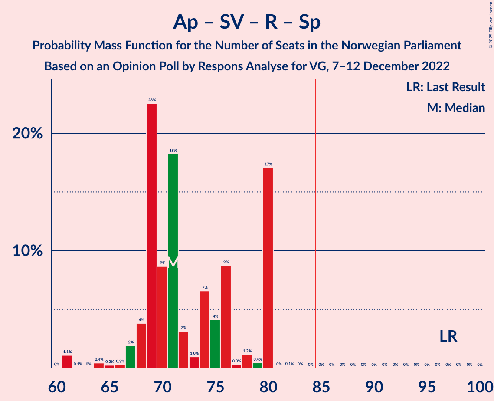

# Opinion Poll by Respons Analyse for VG, 7–12 December 2022

<a href="#voting-intentions">Voting Intentions</a> | <a href="#seats">Seats</a> | <a href="#coalitions">Coalitions</a> | <a href="#technical-information">Technical Information</a>

## Voting Intentions

### Confidence Intervals

| Party | Last Result | Poll Result | 80% Confidence Interval | 90% Confidence Interval | 95% Confidence Interval | 99% Confidence Interval |
|:-----:|:-----------:|:-----------:|:-----------------------:|:-----------------------:|:-----------------------:|:-----------------------:|
| Høyre | 20.4% | 32.8% | 30.9–34.7% |30.4–35.3% |29.9–35.7% |29.1–36.7% |
| Arbeiderpartiet | 26.2% | 18.2% | 16.7–19.8% |16.3–20.3% |15.9–20.7% |15.2–21.5% |
| Fremskrittspartiet | 11.6% | 13.4% | 12.1–14.9% |11.7–15.3% |11.4–15.7% |10.8–16.4% |
| Sosialistisk Venstreparti | 7.6% | 9.3% | 8.2–10.6% |7.9–10.9% |7.6–11.3% |7.1–11.9% |
| Rødt | 4.7% | 7.2% | 6.2–8.4% |6.0–8.7% |5.7–9.0% |5.3–9.6% |
| Senterpartiet | 13.5% | 4.5% | 3.7–5.5% |3.6–5.7% |3.4–6.0% |3.0–6.5% |
| Kristelig Folkeparti | 3.8% | 3.7% | 3.0–4.6% |2.9–4.8% |2.7–5.1% |2.4–5.5% |
| Venstre | 4.6% | 3.6% | 2.9–4.5% |2.8–4.7% |2.6–5.0% |2.3–5.4% |
| Miljøpartiet De Grønne | 3.9% | 2.6% | 2.1–3.4% |1.9–3.6% |1.8–3.8% |1.5–4.2% |
| Norgesdemokratene | 1.1% | 2.0% | 1.5–2.7% |1.4–2.9% |1.3–3.1% |1.1–3.4% |
| Industri- og Næringspartiet | 0.3% | 1.3% | 0.9–1.9% |0.8–2.1% |0.8–2.2% |0.6–2.5% |
| Konservativt | 0.4% | 0.2% | 0.1–0.5% |0.1–0.6% |0.1–0.7% |0.0–0.9% |
| Pensjonistpartiet | 0.6% | 0.2% | 0.1–0.5% |0.1–0.6% |0.1–0.7% |0.0–0.9% |

*Note:* The poll result column reflects the actual value used in the calculations. Published results may vary slightly, and in addition be rounded to fewer digits.

## Seats

### Confidence Intervals

| Party | Last Result | Median | 80% Confidence Interval | 90% Confidence Interval | 95% Confidence Interval | 99% Confidence Interval |
|:-----:|:-----------:|:------:|:-----------------------:|:-----------------------:|:-----------------------:|:-----------------------:|
| <a href="#høyre">Høyre</a> | 36 | 58 | 55–68 |55–68 |55–68 |54–68 |
| <a href="#arbeiderpartiet">Arbeiderpartiet</a> | 48 | 33 | 31–37 |31–38 |31–38 |31–41 |
| <a href="#fremskrittspartiet">Fremskrittspartiet</a> | 21 | 26 | 20–29 |20–29 |20–30 |19–31 |
| <a href="#sosialistisk-venstreparti">Sosialistisk Venstreparti</a> | 13 | 17 | 14–18 |14–20 |13–20 |13–24 |
| <a href="#rødt">Rødt</a> | 8 | 13 | 11–16 |11–16 |11–16 |10–17 |
| <a href="#senterpartiet">Senterpartiet</a> | 28 | 8 | 1–10 |0–10 |0–10 |0–12 |
| <a href="#kristelig-folkeparti">Kristelig Folkeparti</a> | 3 | 3 | 2–8 |1–9 |1–9 |1–9 |
| <a href="#venstre">Venstre</a> | 8 | 3 | 2–8 |2–8 |2–8 |2–9 |
| <a href="#miljøpartiet-de-grønne">Miljøpartiet De Grønne</a> | 3 | 1 | 1–2 |1–2 |1–2 |1–7 |
| <a href="#norgesdemokratene">Norgesdemokratene</a> | 0 | 0 | 0 |0 |0 |0 |
| <a href="#industri--og-næringspartiet">Industri- og Næringspartiet</a> | 0 | 0 | 0 |0 |0 |0 |
| <a href="#konservativt">Konservativt</a> | 0 | 0 | 0 |0 |0 |0 |
| <a href="#pensjonistpartiet">Pensjonistpartiet</a> | 0 | 0 | 0 |0 |0 |0 |

### Høyre

*For a full overview of the results for this party, see the [Høyre](party-høyre.html) page.*

| Number of Seats | Probability | Accumulated | Special Marks |
|:---------------:|:-----------:|:-----------:|:-------------:|
| 36 | 0% | 100% | Last Result |
| 37 | 0% | 100% |  |
| 38 | 0% | 100% |  |
| 39 | 0% | 100% |  |
| 40 | 0% | 100% |  |
| 41 | 0% | 100% |  |
| 42 | 0% | 100% |  |
| 43 | 0% | 100% |  |
| 44 | 0% | 100% |  |
| 45 | 0% | 100% |  |
| 46 | 0% | 100% |  |
| 47 | 0% | 100% |  |
| 48 | 0% | 100% |  |
| 49 | 0% | 100% |  |
| 50 | 0% | 100% |  |
| 51 | 0.1% | 100% |  |
| 52 | 0% | 99.8% |  |
| 53 | 0.1% | 99.8% |  |
| 54 | 0.9% | 99.7% |  |
| 55 | 18% | 98.8% |  |
| 56 | 5% | 81% |  |
| 57 | 1.2% | 76% |  |
| 58 | 27% | 75% | Median |
| 59 | 4% | 48% |  |
| 60 | 2% | 45% |  |
| 61 | 18% | 42% |  |
| 62 | 3% | 24% |  |
| 63 | 0.7% | 21% |  |
| 64 | 0.9% | 20% |  |
| 65 | 3% | 19% |  |
| 66 | 0.1% | 16% |  |
| 67 | 0.4% | 16% |  |
| 68 | 16% | 16% |  |
| 69 | 0.1% | 0.1% |  |
| 70 | 0% | 0.1% |  |
| 71 | 0% | 0% |  |

### Arbeiderpartiet

*For a full overview of the results for this party, see the [Arbeiderpartiet](party-arbeiderpartiet.html) page.*

| Number of Seats | Probability | Accumulated | Special Marks |
|:---------------:|:-----------:|:-----------:|:-------------:|
| 30 | 0.1% | 100% |  |
| 31 | 10% | 99.9% |  |
| 32 | 1.5% | 90% |  |
| 33 | 40% | 88% | Median |
| 34 | 2% | 49% |  |
| 35 | 0.4% | 47% |  |
| 36 | 3% | 47% |  |
| 37 | 36% | 44% |  |
| 38 | 6% | 7% |  |
| 39 | 0.3% | 0.9% |  |
| 40 | 0.1% | 0.6% |  |
| 41 | 0.2% | 0.5% |  |
| 42 | 0.1% | 0.4% |  |
| 43 | 0.1% | 0.2% |  |
| 44 | 0% | 0.1% |  |
| 45 | 0% | 0.1% |  |
| 46 | 0% | 0.1% |  |
| 47 | 0% | 0.1% |  |
| 48 | 0.1% | 0.1% | Last Result |
| 49 | 0% | 0% |  |

### Fremskrittspartiet

*For a full overview of the results for this party, see the [Fremskrittspartiet](party-fremskrittspartiet.html) page.*

| Number of Seats | Probability | Accumulated | Special Marks |
|:---------------:|:-----------:|:-----------:|:-------------:|
| 18 | 0.1% | 100% |  |
| 19 | 0.4% | 99.9% |  |
| 20 | 10% | 99.5% |  |
| 21 | 0.2% | 90% | Last Result |
| 22 | 1.3% | 89% |  |
| 23 | 16% | 88% |  |
| 24 | 11% | 72% |  |
| 25 | 2% | 61% |  |
| 26 | 16% | 59% | Median |
| 27 | 17% | 43% |  |
| 28 | 1.1% | 26% |  |
| 29 | 20% | 25% |  |
| 30 | 3% | 5% |  |
| 31 | 1.4% | 2% |  |
| 32 | 0.1% | 0.2% |  |
| 33 | 0.1% | 0.1% |  |
| 34 | 0% | 0% |  |

### Sosialistisk Venstreparti

*For a full overview of the results for this party, see the [Sosialistisk Venstreparti](party-sosialistiskvenstreparti.html) page.*

| Number of Seats | Probability | Accumulated | Special Marks |
|:---------------:|:-----------:|:-----------:|:-------------:|
| 12 | 0.1% | 100% |  |
| 13 | 4% | 99.8% | Last Result |
| 14 | 9% | 96% |  |
| 15 | 2% | 88% |  |
| 16 | 11% | 86% |  |
| 17 | 26% | 75% | Median |
| 18 | 39% | 49% |  |
| 19 | 3% | 9% |  |
| 20 | 4% | 6% |  |
| 21 | 0.3% | 2% |  |
| 22 | 0.3% | 2% |  |
| 23 | 0.1% | 1.3% |  |
| 24 | 1.2% | 1.2% |  |
| 25 | 0% | 0% |  |

### Rødt

*For a full overview of the results for this party, see the [Rødt](party-rødt.html) page.*

| Number of Seats | Probability | Accumulated | Special Marks |
|:---------------:|:-----------:|:-----------:|:-------------:|
| 8 | 0% | 100% | Last Result |
| 9 | 0.4% | 100% |  |
| 10 | 1.4% | 99.6% |  |
| 11 | 21% | 98% |  |
| 12 | 27% | 77% |  |
| 13 | 14% | 51% | Median |
| 14 | 11% | 37% |  |
| 15 | 6% | 26% |  |
| 16 | 18% | 20% |  |
| 17 | 0.7% | 1.1% |  |
| 18 | 0% | 0.5% |  |
| 19 | 0.4% | 0.4% |  |
| 20 | 0% | 0% |  |

### Senterpartiet

*For a full overview of the results for this party, see the [Senterpartiet](party-senterpartiet.html) page.*

| Number of Seats | Probability | Accumulated | Special Marks |
|:---------------:|:-----------:|:-----------:|:-------------:|
| 0 | 9% | 100% |  |
| 1 | 3% | 91% |  |
| 2 | 0% | 89% |  |
| 3 | 0% | 89% |  |
| 4 | 0% | 89% |  |
| 5 | 0% | 89% |  |
| 6 | 0.1% | 89% |  |
| 7 | 4% | 88% |  |
| 8 | 40% | 84% | Median |
| 9 | 33% | 44% |  |
| 10 | 9% | 11% |  |
| 11 | 1.0% | 2% |  |
| 12 | 0.5% | 0.6% |  |
| 13 | 0.1% | 0.1% |  |
| 14 | 0% | 0% |  |
| 15 | 0% | 0% |  |
| 16 | 0% | 0% |  |
| 17 | 0% | 0% |  |
| 18 | 0% | 0% |  |
| 19 | 0% | 0% |  |
| 20 | 0% | 0% |  |
| 21 | 0% | 0% |  |
| 22 | 0% | 0% |  |
| 23 | 0% | 0% |  |
| 24 | 0% | 0% |  |
| 25 | 0% | 0% |  |
| 26 | 0% | 0% |  |
| 27 | 0% | 0% |  |
| 28 | 0% | 0% | Last Result |

### Kristelig Folkeparti

*For a full overview of the results for this party, see the [Kristelig Folkeparti](party-kristeligfolkeparti.html) page.*

| Number of Seats | Probability | Accumulated | Special Marks |
|:---------------:|:-----------:|:-----------:|:-------------:|
| 1 | 7% | 100% |  |
| 2 | 4% | 93% |  |
| 3 | 48% | 89% | Last Result, Median |
| 4 | 0% | 42% |  |
| 5 | 0% | 42% |  |
| 6 | 0% | 42% |  |
| 7 | 12% | 42% |  |
| 8 | 24% | 30% |  |
| 9 | 6% | 6% |  |
| 10 | 0.1% | 0.1% |  |
| 11 | 0% | 0% |  |

### Venstre

*For a full overview of the results for this party, see the [Venstre](party-venstre.html) page.*

| Number of Seats | Probability | Accumulated | Special Marks |
|:---------------:|:-----------:|:-----------:|:-------------:|
| 1 | 0.2% | 100% |  |
| 2 | 47% | 99.8% |  |
| 3 | 28% | 52% | Median |
| 4 | 0% | 24% |  |
| 5 | 0% | 24% |  |
| 6 | 0% | 24% |  |
| 7 | 2% | 24% |  |
| 8 | 21% | 22% | Last Result |
| 9 | 0.4% | 0.9% |  |
| 10 | 0.5% | 0.5% |  |
| 11 | 0% | 0% |  |

### Miljøpartiet De Grønne

*For a full overview of the results for this party, see the [Miljøpartiet De Grønne](party-miljøpartietdegrønne.html) page.*

| Number of Seats | Probability | Accumulated | Special Marks |
|:---------------:|:-----------:|:-----------:|:-------------:|
| 0 | 0.4% | 100% |  |
| 1 | 85% | 99.6% | Median |
| 2 | 13% | 15% |  |
| 3 | 0.2% | 1.2% | Last Result |
| 4 | 0% | 1.0% |  |
| 5 | 0% | 1.0% |  |
| 6 | 0% | 1.0% |  |
| 7 | 0.7% | 1.0% |  |
| 8 | 0.3% | 0.3% |  |
| 9 | 0% | 0% |  |

### Norgesdemokratene

*For a full overview of the results for this party, see the [Norgesdemokratene](party-norgesdemokratene.html) page.*

| Number of Seats | Probability | Accumulated | Special Marks |
|:---------------:|:-----------:|:-----------:|:-------------:|
| 0 | 99.6% | 100% | Last Result, Median |
| 1 | 0% | 0.4% |  |
| 2 | 0% | 0.3% |  |
| 3 | 0% | 0.3% |  |
| 4 | 0% | 0.3% |  |
| 5 | 0% | 0.3% |  |
| 6 | 0.3% | 0.3% |  |
| 7 | 0% | 0% |  |

### Industri- og Næringspartiet

*For a full overview of the results for this party, see the [Industri- og Næringspartiet](party-industri-ognæringspartiet.html) page.*

| Number of Seats | Probability | Accumulated | Special Marks |
|:---------------:|:-----------:|:-----------:|:-------------:|
| 0 | 99.8% | 100% | Last Result, Median |
| 1 | 0% | 0.2% |  |
| 2 | 0.1% | 0.1% |  |
| 3 | 0% | 0% |  |

### Konservativt

*For a full overview of the results for this party, see the [Konservativt](party-konservativt.html) page.*

| Number of Seats | Probability | Accumulated | Special Marks |
|:---------------:|:-----------:|:-----------:|:-------------:|
| 0 | 100% | 100% | Last Result, Median |

### Pensjonistpartiet

*For a full overview of the results for this party, see the [Pensjonistpartiet](party-pensjonistpartiet.html) page.*

| Number of Seats | Probability | Accumulated | Special Marks |
|:---------------:|:-----------:|:-----------:|:-------------:|
| 0 | 100% | 100% | Last Result, Median |

## Coalitions

### Confidence Intervals

| Coalition | Last Result | Median | Majority? | 80% Confidence Interval | 90% Confidence Interval | 95% Confidence Interval | 99% Confidence Interval |
|:---------:|:-----------:|:------:|:---------:|:-----------------------:|:-----------------------:|:-----------------------:|:-----------------------:|
| Høyre – Fremskrittspartiet – Senterpartiet – Kristelig Folkeparti – Venstre | 96 | 103 | 100% | 96–106 | 96–106 | 96–107 | 92–112 |
| Høyre – Fremskrittspartiet – Kristelig Folkeparti – Venstre – Miljøpartiet De Grønne | 71 | 97 | 100% | 88–99 | 88–100 | 88–101 | 88–107 |
| Høyre – Fremskrittspartiet – Kristelig Folkeparti – Venstre | 68 | 96 | 99.9% | 87–98 | 87–99 | 87–100 | 87–105 |
| Høyre – Fremskrittspartiet – Venstre | 65 | 90 | 79% | 84–95 | 84–96 | 82–96 | 82–97 |
| Høyre – Fremskrittspartiet | 57 | 87 | 68% | 80–91 | 78–91 | 78–94 | 78–94 |
| Arbeiderpartiet – Sosialistisk Venstreparti – Rødt – Senterpartiet – Miljøpartiet De Grønne | 100 | 72 | 0% | 70–81 | 69–81 | 68–81 | 63–81 |
| Arbeiderpartiet – Sosialistisk Venstreparti – Rødt – Senterpartiet | 97 | 71 | 0% | 69–80 | 68–80 | 67–80 | 61–80 |
| Høyre – Kristelig Folkeparti – Venstre | 47 | 69 | 0% | 60–73 | 60–74 | 60–78 | 60–80 |
| Arbeiderpartiet – Sosialistisk Venstreparti – Senterpartiet – Kristelig Folkeparti – Miljøpartiet De Grønne | 95 | 67 | 0% | 60–68 | 59–69 | 58–73 | 57–74 |
| Arbeiderpartiet – Sosialistisk Venstreparti – Rødt – Miljøpartiet De Grønne | 72 | 65 | 0% | 62–72 | 62–72 | 61–72 | 56–76 |
| Arbeiderpartiet – Sosialistisk Venstreparti – Senterpartiet – Miljøpartiet De Grønne | 92 | 60 | 0% | 57–65 | 55–65 | 53–65 | 53–66 |
| Arbeiderpartiet – Sosialistisk Venstreparti – Senterpartiet | 89 | 59 | 0% | 56–64 | 53–64 | 52–64 | 51–65 |
| Arbeiderpartiet – Sosialistisk Venstreparti | 61 | 51 | 0% | 47–55 | 47–56 | 45–56 | 44–58 |
| Arbeiderpartiet – Senterpartiet – Kristelig Folkeparti – Miljøpartiet De Grønne | 82 | 50 | 0% | 44–53 | 41–54 | 41–55 | 37–56 |
| Arbeiderpartiet – Senterpartiet – Kristelig Folkeparti | 79 | 49 | 0% | 42–51 | 40–53 | 39–53 | 36–54 |
| Arbeiderpartiet – Senterpartiet | 76 | 41 | 0% | 37–46 | 37–46 | 35–47 | 33–49 |
| Senterpartiet – Kristelig Folkeparti – Venstre | 39 | 15 | 0% | 12–22 | 5–23 | 5–23 | 4–25 |

### Høyre – Fremskrittspartiet – Senterpartiet – Kristelig Folkeparti – Venstre

| Number of Seats | Probability | Accumulated | Special Marks |
|:---------------:|:-----------:|:-----------:|:-------------:|
| 88 | 0.1% | 100% |  |
| 89 | 0% | 99.9% |  |
| 90 | 0% | 99.9% |  |
| 91 | 0% | 99.9% |  |
| 92 | 0.4% | 99.8% |  |
| 93 | 0.3% | 99.4% |  |
| 94 | 0.1% | 99.1% |  |
| 95 | 0.1% | 99.0% |  |
| 96 | 20% | 98.9% | Last Result |
| 97 | 1.5% | 79% |  |
| 98 | 2% | 77% | Median |
| 99 | 5% | 76% |  |
| 100 | 12% | 70% |  |
| 101 | 7% | 58% |  |
| 102 | 1.1% | 51% |  |
| 103 | 2% | 50% |  |
| 104 | 13% | 48% |  |
| 105 | 5% | 35% |  |
| 106 | 26% | 30% |  |
| 107 | 2% | 4% |  |
| 108 | 0.1% | 1.2% |  |
| 109 | 0% | 1.2% |  |
| 110 | 0.2% | 1.1% |  |
| 111 | 0.1% | 0.9% |  |
| 112 | 0.8% | 0.9% |  |
| 113 | 0% | 0% |  |

### Høyre – Fremskrittspartiet – Kristelig Folkeparti – Venstre – Miljøpartiet De Grønne

| Number of Seats | Probability | Accumulated | Special Marks |
|:---------------:|:-----------:|:-----------:|:-------------:|
| 71 | 0% | 100% | Last Result |
| 72 | 0% | 100% |  |
| 73 | 0% | 100% |  |
| 74 | 0% | 100% |  |
| 75 | 0% | 100% |  |
| 76 | 0% | 100% |  |
| 77 | 0% | 100% |  |
| 78 | 0% | 100% |  |
| 79 | 0% | 100% |  |
| 80 | 0% | 100% |  |
| 81 | 0% | 100% |  |
| 82 | 0% | 100% |  |
| 83 | 0% | 100% |  |
| 84 | 0% | 100% |  |
| 85 | 0% | 100% | Majority |
| 86 | 0.1% | 99.9% |  |
| 87 | 0% | 99.9% |  |
| 88 | 17% | 99.8% |  |
| 89 | 0.4% | 83% |  |
| 90 | 1.2% | 82% |  |
| 91 | 0.3% | 81% | Median |
| 92 | 9% | 81% |  |
| 93 | 4% | 72% |  |
| 94 | 7% | 68% |  |
| 95 | 1.0% | 61% |  |
| 96 | 3% | 60% |  |
| 97 | 18% | 57% |  |
| 98 | 9% | 39% |  |
| 99 | 23% | 30% |  |
| 100 | 4% | 8% |  |
| 101 | 2% | 4% |  |
| 102 | 0.3% | 2% |  |
| 103 | 0.2% | 2% |  |
| 104 | 0.1% | 1.3% |  |
| 105 | 0% | 1.2% |  |
| 106 | 0% | 1.2% |  |
| 107 | 1.1% | 1.1% |  |
| 108 | 0% | 0% |  |

### Høyre – Fremskrittspartiet – Kristelig Folkeparti – Venstre

| Number of Seats | Probability | Accumulated | Special Marks |
|:---------------:|:-----------:|:-----------:|:-------------:|
| 68 | 0% | 100% | Last Result |
| 69 | 0% | 100% |  |
| 70 | 0% | 100% |  |
| 71 | 0% | 100% |  |
| 72 | 0% | 100% |  |
| 73 | 0% | 100% |  |
| 74 | 0% | 100% |  |
| 75 | 0% | 100% |  |
| 76 | 0% | 100% |  |
| 77 | 0% | 100% |  |
| 78 | 0% | 100% |  |
| 79 | 0% | 100% |  |
| 80 | 0% | 100% |  |
| 81 | 0% | 100% |  |
| 82 | 0% | 100% |  |
| 83 | 0% | 100% |  |
| 84 | 0.1% | 100% |  |
| 85 | 0% | 99.9% | Majority |
| 86 | 0% | 99.9% |  |
| 87 | 17% | 99.8% |  |
| 88 | 0.7% | 83% |  |
| 89 | 0.7% | 82% |  |
| 90 | 1.0% | 81% | Median |
| 91 | 12% | 80% |  |
| 92 | 1.2% | 68% |  |
| 93 | 7% | 67% |  |
| 94 | 1.0% | 60% |  |
| 95 | 3% | 59% |  |
| 96 | 25% | 56% |  |
| 97 | 3% | 31% |  |
| 98 | 21% | 29% |  |
| 99 | 4% | 7% |  |
| 100 | 2% | 4% |  |
| 101 | 0.3% | 2% |  |
| 102 | 0.2% | 1.4% |  |
| 103 | 0.1% | 1.2% |  |
| 104 | 0% | 1.1% |  |
| 105 | 1.1% | 1.1% |  |
| 106 | 0% | 0% |  |

### Høyre – Fremskrittspartiet – Venstre

| Number of Seats | Probability | Accumulated | Special Marks |
|:---------------:|:-----------:|:-----------:|:-------------:|
| 65 | 0% | 100% | Last Result |
| 66 | 0% | 100% |  |
| 67 | 0% | 100% |  |
| 68 | 0% | 100% |  |
| 69 | 0% | 100% |  |
| 70 | 0% | 100% |  |
| 71 | 0% | 100% |  |
| 72 | 0% | 100% |  |
| 73 | 0% | 100% |  |
| 74 | 0% | 100% |  |
| 75 | 0% | 100% |  |
| 76 | 0% | 100% |  |
| 77 | 0% | 100% |  |
| 78 | 0% | 100% |  |
| 79 | 0% | 100% |  |
| 80 | 0% | 100% |  |
| 81 | 0.1% | 99.9% |  |
| 82 | 3% | 99.8% |  |
| 83 | 0.7% | 97% |  |
| 84 | 17% | 96% |  |
| 85 | 0.6% | 79% | Majority |
| 86 | 7% | 78% |  |
| 87 | 4% | 71% | Median |
| 88 | 11% | 68% |  |
| 89 | 3% | 57% |  |
| 90 | 21% | 54% |  |
| 91 | 1.0% | 33% |  |
| 92 | 0.7% | 32% |  |
| 93 | 17% | 31% |  |
| 94 | 0.2% | 14% |  |
| 95 | 9% | 14% |  |
| 96 | 4% | 5% |  |
| 97 | 1.2% | 1.3% |  |
| 98 | 0% | 0.2% |  |
| 99 | 0% | 0.2% |  |
| 100 | 0.1% | 0.1% |  |
| 101 | 0% | 0% |  |

### Høyre – Fremskrittspartiet

| Number of Seats | Probability | Accumulated | Special Marks |
|:---------------:|:-----------:|:-----------:|:-------------:|
| 57 | 0% | 100% | Last Result |
| 58 | 0% | 100% |  |
| 59 | 0% | 100% |  |
| 60 | 0% | 100% |  |
| 61 | 0% | 100% |  |
| 62 | 0% | 100% |  |
| 63 | 0% | 100% |  |
| 64 | 0% | 100% |  |
| 65 | 0% | 100% |  |
| 66 | 0% | 100% |  |
| 67 | 0% | 100% |  |
| 68 | 0% | 100% |  |
| 69 | 0% | 100% |  |
| 70 | 0% | 100% |  |
| 71 | 0% | 100% |  |
| 72 | 0% | 100% |  |
| 73 | 0% | 100% |  |
| 74 | 0.1% | 100% |  |
| 75 | 0.1% | 99.9% |  |
| 76 | 0% | 99.8% |  |
| 77 | 0.2% | 99.8% |  |
| 78 | 6% | 99.6% |  |
| 79 | 0.5% | 93% |  |
| 80 | 5% | 93% |  |
| 81 | 0.3% | 88% |  |
| 82 | 18% | 87% |  |
| 83 | 0.9% | 70% |  |
| 84 | 1.1% | 69% | Median |
| 85 | 15% | 68% | Majority |
| 86 | 2% | 53% |  |
| 87 | 31% | 51% |  |
| 88 | 0.9% | 20% |  |
| 89 | 0.9% | 19% |  |
| 90 | 2% | 18% |  |
| 91 | 12% | 17% |  |
| 92 | 0.2% | 5% |  |
| 93 | 0.7% | 5% |  |
| 94 | 4% | 4% |  |
| 95 | 0.1% | 0.1% |  |
| 96 | 0% | 0.1% |  |
| 97 | 0% | 0.1% |  |
| 98 | 0% | 0% |  |

### Arbeiderpartiet – Sosialistisk Venstreparti – Rødt – Senterpartiet – Miljøpartiet De Grønne

| Number of Seats | Probability | Accumulated | Special Marks |
|:---------------:|:-----------:|:-----------:|:-------------:|
| 63 | 1.1% | 100% |  |
| 64 | 0% | 98.9% |  |
| 65 | 0.4% | 98.8% |  |
| 66 | 0.2% | 98% |  |
| 67 | 0.3% | 98% |  |
| 68 | 2% | 98% |  |
| 69 | 4% | 96% |  |
| 70 | 21% | 92% |  |
| 71 | 2% | 71% |  |
| 72 | 25% | 69% | Median |
| 73 | 3% | 44% |  |
| 74 | 1.0% | 40% |  |
| 75 | 7% | 40% |  |
| 76 | 1.1% | 33% |  |
| 77 | 12% | 32% |  |
| 78 | 1.0% | 20% |  |
| 79 | 0.7% | 19% |  |
| 80 | 0.7% | 18% |  |
| 81 | 17% | 17% |  |
| 82 | 0.1% | 0.2% |  |
| 83 | 0% | 0.1% |  |
| 84 | 0.1% | 0.1% |  |
| 85 | 0% | 0% | Majority |
| 86 | 0% | 0% |  |
| 87 | 0% | 0% |  |
| 88 | 0% | 0% |  |
| 89 | 0% | 0% |  |
| 90 | 0% | 0% |  |
| 91 | 0% | 0% |  |
| 92 | 0% | 0% |  |
| 93 | 0% | 0% |  |
| 94 | 0% | 0% |  |
| 95 | 0% | 0% |  |
| 96 | 0% | 0% |  |
| 97 | 0% | 0% |  |
| 98 | 0% | 0% |  |
| 99 | 0% | 0% |  |
| 100 | 0% | 0% | Last Result |

### Arbeiderpartiet – Sosialistisk Venstreparti – Rødt – Senterpartiet

| Number of Seats | Probability | Accumulated | Special Marks |
|:---------------:|:-----------:|:-----------:|:-------------:|
| 61 | 1.1% | 100% |  |
| 62 | 0.1% | 98.9% |  |
| 63 | 0% | 98.8% |  |
| 64 | 0.4% | 98.8% |  |
| 65 | 0.2% | 98% |  |
| 66 | 0.3% | 98% |  |
| 67 | 2% | 98% |  |
| 68 | 4% | 96% |  |
| 69 | 23% | 92% |  |
| 70 | 9% | 70% |  |
| 71 | 18% | 61% | Median |
| 72 | 3% | 43% |  |
| 73 | 1.0% | 40% |  |
| 74 | 7% | 39% |  |
| 75 | 4% | 32% |  |
| 76 | 9% | 28% |  |
| 77 | 0.3% | 19% |  |
| 78 | 1.2% | 19% |  |
| 79 | 0.4% | 18% |  |
| 80 | 17% | 17% |  |
| 81 | 0% | 0.2% |  |
| 82 | 0.1% | 0.1% |  |
| 83 | 0% | 0% |  |
| 84 | 0% | 0% |  |
| 85 | 0% | 0% | Majority |
| 86 | 0% | 0% |  |
| 87 | 0% | 0% |  |
| 88 | 0% | 0% |  |
| 89 | 0% | 0% |  |
| 90 | 0% | 0% |  |
| 91 | 0% | 0% |  |
| 92 | 0% | 0% |  |
| 93 | 0% | 0% |  |
| 94 | 0% | 0% |  |
| 95 | 0% | 0% |  |
| 96 | 0% | 0% |  |
| 97 | 0% | 0% | Last Result |

### Høyre – Kristelig Folkeparti – Venstre

| Number of Seats | Probability | Accumulated | Special Marks |
|:---------------:|:-----------:|:-----------:|:-------------:|
| 47 | 0% | 100% | Last Result |
| 48 | 0% | 100% |  |
| 49 | 0% | 100% |  |
| 50 | 0% | 100% |  |
| 51 | 0% | 100% |  |
| 52 | 0% | 100% |  |
| 53 | 0% | 100% |  |
| 54 | 0% | 100% |  |
| 55 | 0% | 100% |  |
| 56 | 0% | 100% |  |
| 57 | 0% | 100% |  |
| 58 | 0% | 100% |  |
| 59 | 0.3% | 100% |  |
| 60 | 17% | 99.7% |  |
| 61 | 0.4% | 82% |  |
| 62 | 0.6% | 82% |  |
| 63 | 0.2% | 82% |  |
| 64 | 0.3% | 81% | Median |
| 65 | 3% | 81% |  |
| 66 | 1.2% | 78% |  |
| 67 | 12% | 77% |  |
| 68 | 1.4% | 65% |  |
| 69 | 21% | 64% |  |
| 70 | 11% | 43% |  |
| 71 | 0.4% | 33% |  |
| 72 | 2% | 32% |  |
| 73 | 25% | 31% |  |
| 74 | 1.0% | 6% |  |
| 75 | 2% | 5% |  |
| 76 | 0.2% | 3% |  |
| 77 | 0.1% | 3% |  |
| 78 | 0.1% | 3% |  |
| 79 | 0.3% | 2% |  |
| 80 | 2% | 2% |  |
| 81 | 0% | 0.1% |  |
| 82 | 0% | 0.1% |  |
| 83 | 0% | 0.1% |  |
| 84 | 0% | 0% |  |

### Arbeiderpartiet – Sosialistisk Venstreparti – Senterpartiet – Kristelig Folkeparti – Miljøpartiet De Grønne

| Number of Seats | Probability | Accumulated | Special Marks |
|:---------------:|:-----------:|:-----------:|:-------------:|
| 54 | 0% | 100% |  |
| 55 | 0% | 99.9% |  |
| 56 | 0% | 99.9% |  |
| 57 | 2% | 99.8% |  |
| 58 | 3% | 98% |  |
| 59 | 0.5% | 95% |  |
| 60 | 12% | 95% |  |
| 61 | 3% | 83% |  |
| 62 | 0.2% | 80% | Median |
| 63 | 12% | 80% |  |
| 64 | 2% | 67% |  |
| 65 | 2% | 66% |  |
| 66 | 2% | 64% |  |
| 67 | 20% | 62% |  |
| 68 | 33% | 42% |  |
| 69 | 4% | 9% |  |
| 70 | 0.6% | 5% |  |
| 71 | 0.2% | 4% |  |
| 72 | 0.6% | 4% |  |
| 73 | 3% | 3% |  |
| 74 | 0.5% | 0.8% |  |
| 75 | 0.2% | 0.3% |  |
| 76 | 0% | 0.1% |  |
| 77 | 0.1% | 0.1% |  |
| 78 | 0% | 0% |  |
| 79 | 0% | 0% |  |
| 80 | 0% | 0% |  |
| 81 | 0% | 0% |  |
| 82 | 0% | 0% |  |
| 83 | 0% | 0% |  |
| 84 | 0% | 0% |  |
| 85 | 0% | 0% | Majority |
| 86 | 0% | 0% |  |
| 87 | 0% | 0% |  |
| 88 | 0% | 0% |  |
| 89 | 0% | 0% |  |
| 90 | 0% | 0% |  |
| 91 | 0% | 0% |  |
| 92 | 0% | 0% |  |
| 93 | 0% | 0% |  |
| 94 | 0% | 0% |  |
| 95 | 0% | 0% | Last Result |

### Arbeiderpartiet – Sosialistisk Venstreparti – Rødt – Miljøpartiet De Grønne

| Number of Seats | Probability | Accumulated | Special Marks |
|:---------------:|:-----------:|:-----------:|:-------------:|
| 56 | 0.8% | 100% |  |
| 57 | 0.1% | 99.1% |  |
| 58 | 0.2% | 99.1% |  |
| 59 | 0% | 98.9% |  |
| 60 | 0.1% | 98.8% |  |
| 61 | 2% | 98.8% |  |
| 62 | 26% | 96% |  |
| 63 | 5% | 70% |  |
| 64 | 13% | 65% | Median |
| 65 | 2% | 51% |  |
| 66 | 1.0% | 49% |  |
| 67 | 7% | 48% |  |
| 68 | 12% | 41% |  |
| 69 | 5% | 29% |  |
| 70 | 1.2% | 24% |  |
| 71 | 1.5% | 23% |  |
| 72 | 20% | 21% | Last Result |
| 73 | 0.1% | 1.1% |  |
| 74 | 0.1% | 1.0% |  |
| 75 | 0.3% | 0.9% |  |
| 76 | 0.4% | 0.6% |  |
| 77 | 0% | 0.2% |  |
| 78 | 0% | 0.1% |  |
| 79 | 0% | 0.1% |  |
| 80 | 0.1% | 0.1% |  |
| 81 | 0% | 0% |  |

### Arbeiderpartiet – Sosialistisk Venstreparti – Senterpartiet – Miljøpartiet De Grønne

| Number of Seats | Probability | Accumulated | Special Marks |
|:---------------:|:-----------:|:-----------:|:-------------:|
| 50 | 0% | 100% |  |
| 51 | 0.2% | 99.9% |  |
| 52 | 0.2% | 99.7% |  |
| 53 | 3% | 99.5% |  |
| 54 | 1.0% | 96% |  |
| 55 | 4% | 95% |  |
| 56 | 0.8% | 92% |  |
| 57 | 4% | 91% |  |
| 58 | 2% | 87% |  |
| 59 | 27% | 85% | Median |
| 60 | 15% | 58% |  |
| 61 | 8% | 43% |  |
| 62 | 2% | 34% |  |
| 63 | 1.0% | 32% |  |
| 64 | 5% | 31% |  |
| 65 | 25% | 26% |  |
| 66 | 1.0% | 2% |  |
| 67 | 0.1% | 0.5% |  |
| 68 | 0.2% | 0.4% |  |
| 69 | 0.1% | 0.2% |  |
| 70 | 0% | 0.1% |  |
| 71 | 0% | 0.1% |  |
| 72 | 0% | 0.1% |  |
| 73 | 0% | 0% |  |
| 74 | 0% | 0% |  |
| 75 | 0% | 0% |  |
| 76 | 0% | 0% |  |
| 77 | 0% | 0% |  |
| 78 | 0% | 0% |  |
| 79 | 0% | 0% |  |
| 80 | 0% | 0% |  |
| 81 | 0% | 0% |  |
| 82 | 0% | 0% |  |
| 83 | 0% | 0% |  |
| 84 | 0% | 0% |  |
| 85 | 0% | 0% | Majority |
| 86 | 0% | 0% |  |
| 87 | 0% | 0% |  |
| 88 | 0% | 0% |  |
| 89 | 0% | 0% |  |
| 90 | 0% | 0% |  |
| 91 | 0% | 0% |  |
| 92 | 0% | 0% | Last Result |

### Arbeiderpartiet – Sosialistisk Venstreparti – Senterpartiet

| Number of Seats | Probability | Accumulated | Special Marks |
|:---------------:|:-----------:|:-----------:|:-------------:|
| 49 | 0.2% | 100% |  |
| 50 | 0% | 99.7% |  |
| 51 | 1.1% | 99.7% |  |
| 52 | 2% | 98.6% |  |
| 53 | 2% | 96% |  |
| 54 | 3% | 95% |  |
| 55 | 1.3% | 92% |  |
| 56 | 3% | 90% |  |
| 57 | 10% | 87% |  |
| 58 | 20% | 77% | Median |
| 59 | 16% | 58% |  |
| 60 | 8% | 42% |  |
| 61 | 3% | 33% |  |
| 62 | 4% | 31% |  |
| 63 | 2% | 27% |  |
| 64 | 24% | 26% |  |
| 65 | 0.6% | 1.0% |  |
| 66 | 0.1% | 0.4% |  |
| 67 | 0.2% | 0.3% |  |
| 68 | 0.1% | 0.2% |  |
| 69 | 0% | 0.1% |  |
| 70 | 0% | 0.1% |  |
| 71 | 0% | 0% |  |
| 72 | 0% | 0% |  |
| 73 | 0% | 0% |  |
| 74 | 0% | 0% |  |
| 75 | 0% | 0% |  |
| 76 | 0% | 0% |  |
| 77 | 0% | 0% |  |
| 78 | 0% | 0% |  |
| 79 | 0% | 0% |  |
| 80 | 0% | 0% |  |
| 81 | 0% | 0% |  |
| 82 | 0% | 0% |  |
| 83 | 0% | 0% |  |
| 84 | 0% | 0% |  |
| 85 | 0% | 0% | Majority |
| 86 | 0% | 0% |  |
| 87 | 0% | 0% |  |
| 88 | 0% | 0% |  |
| 89 | 0% | 0% | Last Result |

### Arbeiderpartiet – Sosialistisk Venstreparti

| Number of Seats | Probability | Accumulated | Special Marks |
|:---------------:|:-----------:|:-----------:|:-------------:|
| 44 | 0.8% | 100% |  |
| 45 | 2% | 99.1% |  |
| 46 | 0.4% | 97% |  |
| 47 | 8% | 97% |  |
| 48 | 0.3% | 89% |  |
| 49 | 0.8% | 89% |  |
| 50 | 25% | 88% | Median |
| 51 | 14% | 63% |  |
| 52 | 7% | 49% |  |
| 53 | 7% | 42% |  |
| 54 | 5% | 35% |  |
| 55 | 25% | 31% |  |
| 56 | 5% | 6% |  |
| 57 | 0.3% | 0.9% |  |
| 58 | 0.2% | 0.6% |  |
| 59 | 0.2% | 0.5% |  |
| 60 | 0.1% | 0.3% |  |
| 61 | 0% | 0.2% | Last Result |
| 62 | 0% | 0.1% |  |
| 63 | 0% | 0.1% |  |
| 64 | 0% | 0.1% |  |
| 65 | 0% | 0.1% |  |
| 66 | 0.1% | 0.1% |  |
| 67 | 0% | 0% |  |

### Arbeiderpartiet – Senterpartiet – Kristelig Folkeparti – Miljøpartiet De Grønne

| Number of Seats | Probability | Accumulated | Special Marks |
|:---------------:|:-----------:|:-----------:|:-------------:|
| 37 | 2% | 100% |  |
| 38 | 0% | 98% |  |
| 39 | 0% | 98% |  |
| 40 | 0.3% | 98% |  |
| 41 | 6% | 98% |  |
| 42 | 0.3% | 91% |  |
| 43 | 0.5% | 91% |  |
| 44 | 7% | 91% |  |
| 45 | 12% | 83% | Median |
| 46 | 3% | 71% |  |
| 47 | 1.2% | 68% |  |
| 48 | 3% | 67% |  |
| 49 | 1.0% | 64% |  |
| 50 | 45% | 63% |  |
| 51 | 0.5% | 18% |  |
| 52 | 4% | 17% |  |
| 53 | 4% | 13% |  |
| 54 | 6% | 9% |  |
| 55 | 2% | 3% |  |
| 56 | 0.5% | 0.9% |  |
| 57 | 0.1% | 0.4% |  |
| 58 | 0% | 0.4% |  |
| 59 | 0.2% | 0.3% |  |
| 60 | 0% | 0.1% |  |
| 61 | 0.1% | 0.1% |  |
| 62 | 0% | 0% |  |
| 63 | 0% | 0% |  |
| 64 | 0% | 0% |  |
| 65 | 0% | 0% |  |
| 66 | 0% | 0% |  |
| 67 | 0% | 0% |  |
| 68 | 0% | 0% |  |
| 69 | 0% | 0% |  |
| 70 | 0% | 0% |  |
| 71 | 0% | 0% |  |
| 72 | 0% | 0% |  |
| 73 | 0% | 0% |  |
| 74 | 0% | 0% |  |
| 75 | 0% | 0% |  |
| 76 | 0% | 0% |  |
| 77 | 0% | 0% |  |
| 78 | 0% | 0% |  |
| 79 | 0% | 0% |  |
| 80 | 0% | 0% |  |
| 81 | 0% | 0% |  |
| 82 | 0% | 0% | Last Result |

### Arbeiderpartiet – Senterpartiet – Kristelig Folkeparti

| Number of Seats | Probability | Accumulated | Special Marks |
|:---------------:|:-----------:|:-----------:|:-------------:|
| 36 | 2% | 100% |  |
| 37 | 0.1% | 98% |  |
| 38 | 0.1% | 98% |  |
| 39 | 1.1% | 98% |  |
| 40 | 6% | 97% |  |
| 41 | 0.8% | 91% |  |
| 42 | 7% | 90% |  |
| 43 | 0.2% | 83% |  |
| 44 | 12% | 83% | Median |
| 45 | 3% | 71% |  |
| 46 | 2% | 67% |  |
| 47 | 3% | 66% |  |
| 48 | 1.0% | 63% |  |
| 49 | 45% | 62% |  |
| 50 | 0.5% | 17% |  |
| 51 | 7% | 17% |  |
| 52 | 1.2% | 10% |  |
| 53 | 7% | 9% |  |
| 54 | 2% | 2% |  |
| 55 | 0% | 0.4% |  |
| 56 | 0.1% | 0.4% |  |
| 57 | 0% | 0.3% |  |
| 58 | 0.2% | 0.3% |  |
| 59 | 0% | 0.1% |  |
| 60 | 0.1% | 0.1% |  |
| 61 | 0% | 0% |  |
| 62 | 0% | 0% |  |
| 63 | 0% | 0% |  |
| 64 | 0% | 0% |  |
| 65 | 0% | 0% |  |
| 66 | 0% | 0% |  |
| 67 | 0% | 0% |  |
| 68 | 0% | 0% |  |
| 69 | 0% | 0% |  |
| 70 | 0% | 0% |  |
| 71 | 0% | 0% |  |
| 72 | 0% | 0% |  |
| 73 | 0% | 0% |  |
| 74 | 0% | 0% |  |
| 75 | 0% | 0% |  |
| 76 | 0% | 0% |  |
| 77 | 0% | 0% |  |
| 78 | 0% | 0% |  |
| 79 | 0% | 0% | Last Result |

### Arbeiderpartiet – Senterpartiet

| Number of Seats | Probability | Accumulated | Special Marks |
|:---------------:|:-----------:|:-----------:|:-------------:|
| 33 | 2% | 100% |  |
| 34 | 0.1% | 98% |  |
| 35 | 0.1% | 98% |  |
| 36 | 0.2% | 97% |  |
| 37 | 8% | 97% |  |
| 38 | 3% | 90% |  |
| 39 | 0.8% | 86% |  |
| 40 | 0.2% | 86% |  |
| 41 | 39% | 85% | Median |
| 42 | 6% | 47% |  |
| 43 | 1.4% | 40% |  |
| 44 | 1.4% | 39% |  |
| 45 | 4% | 38% |  |
| 46 | 31% | 34% |  |
| 47 | 2% | 3% |  |
| 48 | 0.3% | 0.8% |  |
| 49 | 0.2% | 0.5% |  |
| 50 | 0.1% | 0.4% |  |
| 51 | 0.2% | 0.2% |  |
| 52 | 0% | 0.1% |  |
| 53 | 0% | 0% |  |
| 54 | 0% | 0% |  |
| 55 | 0% | 0% |  |
| 56 | 0% | 0% |  |
| 57 | 0% | 0% |  |
| 58 | 0% | 0% |  |
| 59 | 0% | 0% |  |
| 60 | 0% | 0% |  |
| 61 | 0% | 0% |  |
| 62 | 0% | 0% |  |
| 63 | 0% | 0% |  |
| 64 | 0% | 0% |  |
| 65 | 0% | 0% |  |
| 66 | 0% | 0% |  |
| 67 | 0% | 0% |  |
| 68 | 0% | 0% |  |
| 69 | 0% | 0% |  |
| 70 | 0% | 0% |  |
| 71 | 0% | 0% |  |
| 72 | 0% | 0% |  |
| 73 | 0% | 0% |  |
| 74 | 0% | 0% |  |
| 75 | 0% | 0% |  |
| 76 | 0% | 0% | Last Result |

### Senterpartiet – Kristelig Folkeparti – Venstre

| Number of Seats | Probability | Accumulated | Special Marks |
|:---------------:|:-----------:|:-----------:|:-------------:|
| 4 | 0.7% | 100% |  |
| 5 | 4% | 99.3% |  |
| 6 | 0.7% | 95% |  |
| 7 | 0% | 94% |  |
| 8 | 0% | 94% |  |
| 9 | 0% | 94% |  |
| 10 | 0.9% | 94% |  |
| 11 | 3% | 93% |  |
| 12 | 2% | 91% |  |
| 13 | 14% | 89% |  |
| 14 | 18% | 75% | Median |
| 15 | 8% | 57% |  |
| 16 | 1.3% | 50% |  |
| 17 | 3% | 48% |  |
| 18 | 0.6% | 46% |  |
| 19 | 27% | 45% |  |
| 20 | 6% | 18% |  |
| 21 | 0.6% | 12% |  |
| 22 | 3% | 11% |  |
| 23 | 6% | 9% |  |
| 24 | 0.6% | 2% |  |
| 25 | 2% | 2% |  |
| 26 | 0.1% | 0.1% |  |
| 27 | 0% | 0% |  |
| 28 | 0% | 0% |  |
| 29 | 0% | 0% |  |
| 30 | 0% | 0% |  |
| 31 | 0% | 0% |  |
| 32 | 0% | 0% |  |
| 33 | 0% | 0% |  |
| 34 | 0% | 0% |  |
| 35 | 0% | 0% |  |
| 36 | 0% | 0% |  |
| 37 | 0% | 0% |  |
| 38 | 0% | 0% |  |
| 39 | 0% | 0% | Last Result |

## Technical Information

### Opinion Poll

+ **Polling firm:** Respons Analyse
+ **Commissioner(s):** VG
+ **Fieldwork period:** 7–12 December 2022

### Calculations

+ **Sample size:** 1001
+ **Simulations done:** 1,048,576
+ **Error estimate:** 3.87%

