# Opinion Poll by Ipsos for Dagbladet, 12–14 December 2022

<a href="#voting-intentions">Voting Intentions</a> | <a href="#seats">Seats</a> | <a href="#coalitions">Coalitions</a> | <a href="#technical-information">Technical Information</a>

## Voting Intentions

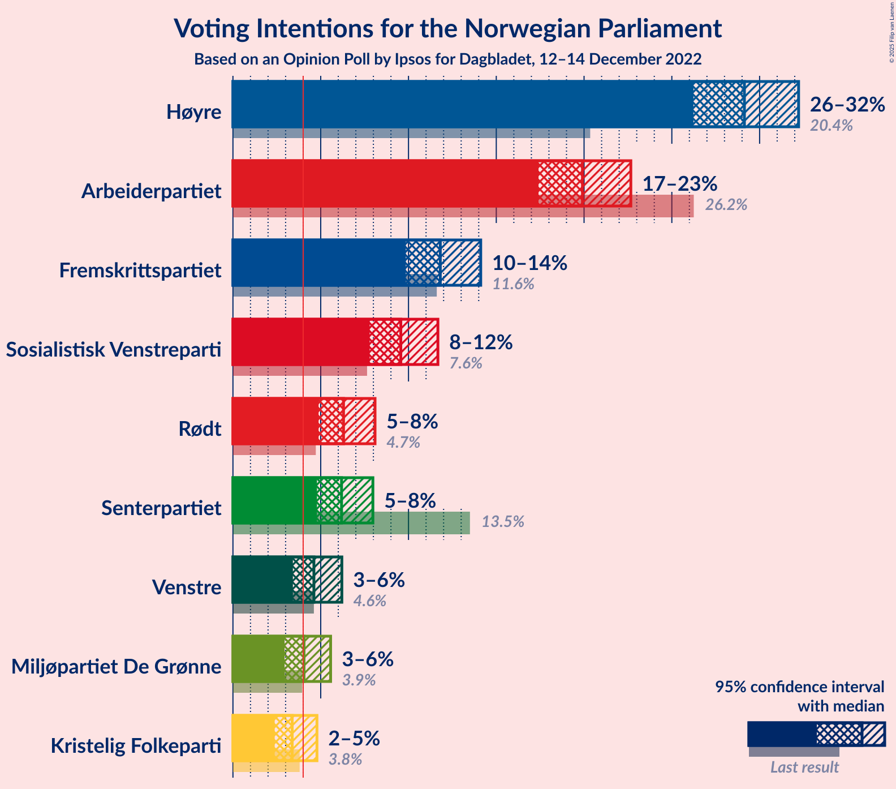

### Confidence Intervals

| Party | Last Result | Poll Result | 80% Confidence Interval | 90% Confidence Interval | 95% Confidence Interval | 99% Confidence Interval |
|:-----:|:-----------:|:-----------:|:-----------------------:|:-----------------------:|:-----------------------:|:-----------------------:|
| Høyre | 20.4% | 29.1% | 27.2–31.2% |26.7–31.7% |26.2–32.2% |25.3–33.2% |
| Arbeiderpartiet | 26.2% | 19.9% | 18.3–21.7% |17.8–22.2% |17.4–22.7% |16.7–23.5% |
| Fremskrittspartiet | 11.6% | 11.8% | 10.5–13.3% |10.2–13.7% |9.8–14.1% |9.3–14.9% |
| Sosialistisk Venstreparti | 7.6% | 9.6% | 8.4–10.9% |8.1–11.3% |7.8–11.7% |7.3–12.4% |
| Rødt | 4.7% | 6.3% | 5.4–7.5% |5.1–7.8% |4.9–8.1% |4.5–8.7% |
| Senterpartiet | 13.5% | 6.2% | 5.3–7.3% |5.0–7.7% |4.8–8.0% |4.4–8.6% |
| Venstre | 4.6% | 4.6% | 3.8–5.7% |3.6–5.9% |3.4–6.2% |3.1–6.7% |
| Miljøpartiet De Grønne | 3.9% | 4.0% | 3.3–5.0% |3.1–5.3% |2.9–5.6% |2.6–6.1% |
| Kristelig Folkeparti | 3.8% | 3.4% | 2.7–4.3% |2.5–4.6% |2.4–4.8% |2.1–5.3% |

*Note:* The poll result column reflects the actual value used in the calculations. Published results may vary slightly, and in addition be rounded to fewer digits.

## Seats

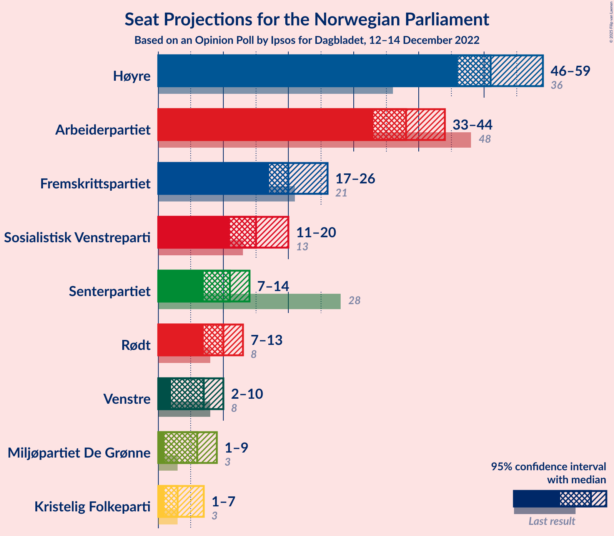

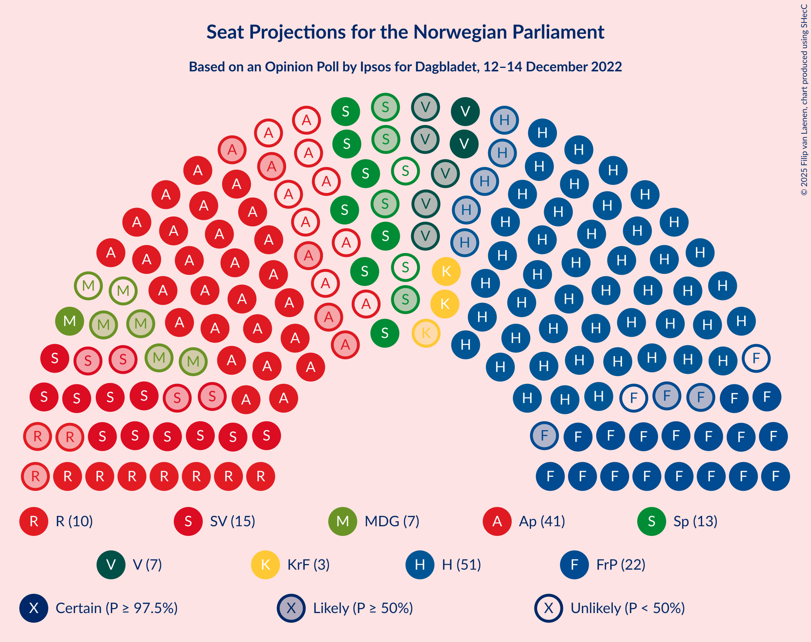

### Confidence Intervals

| Party | Last Result | Median | 80% Confidence Interval | 90% Confidence Interval | 95% Confidence Interval | 99% Confidence Interval |
|:-----:|:-----------:|:------:|:-----------------------:|:-----------------------:|:-----------------------:|:-----------------------:|
| <a href="#høyre">Høyre</a> | 36 | 51 | 48–56 |47–57 |46–59 |44–60 |
| <a href="#arbeiderpartiet">Arbeiderpartiet</a> | 48 | 38 | 34–43 |34–44 |33–44 |33–46 |
| <a href="#fremskrittspartiet">Fremskrittspartiet</a> | 21 | 20 | 18–23 |17–24 |17–26 |17–27 |
| <a href="#sosialistisk-venstreparti">Sosialistisk Venstreparti</a> | 13 | 15 | 13–18 |12–18 |11–20 |10–21 |
| <a href="#rødt">Rødt</a> | 8 | 10 | 8–12 |7–12 |7–13 |6–14 |
| <a href="#senterpartiet">Senterpartiet</a> | 28 | 11 | 8–13 |7–13 |7–14 |6–15 |
| <a href="#venstre">Venstre</a> | 8 | 7 | 3–9 |2–9 |2–10 |2–11 |
| <a href="#miljøpartiet-de-grønne">Miljøpartiet De Grønne</a> | 3 | 6 | 2–8 |2–8 |1–9 |1–9 |
| <a href="#kristelig-folkeparti">Kristelig Folkeparti</a> | 3 | 3 | 2–6 |2–7 |1–7 |0–8 |

### Høyre

*For a full overview of the results for this party, see the [Høyre](party-høyre.html) page.*

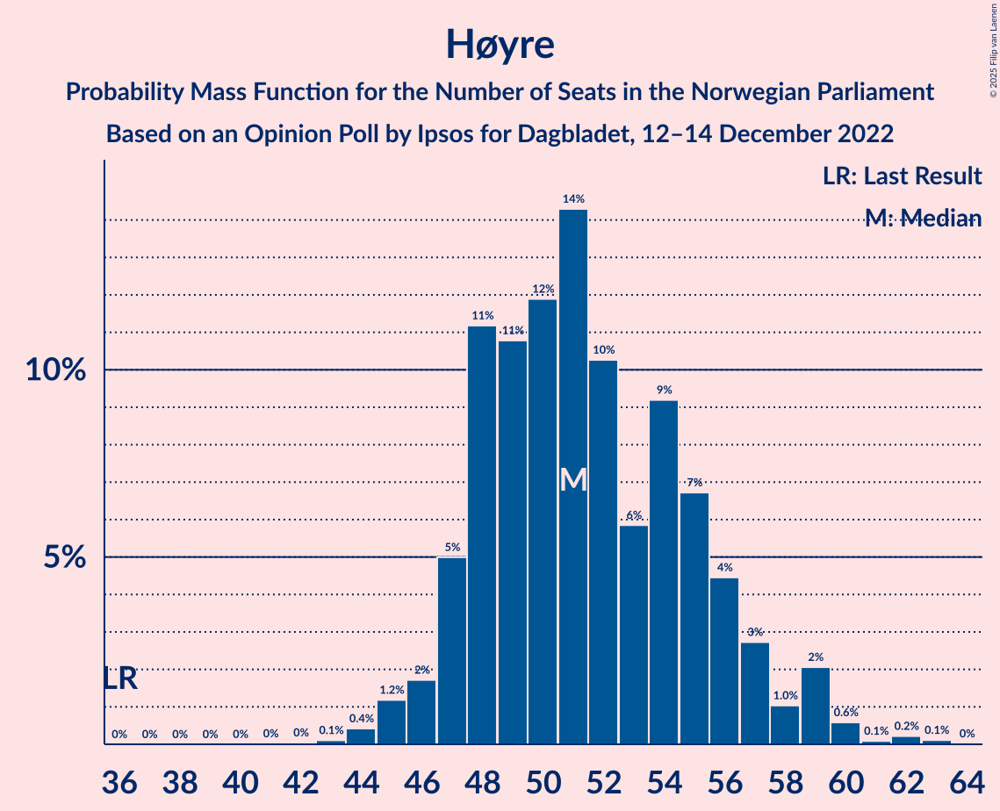

| Number of Seats | Probability | Accumulated | Special Marks |
|:---------------:|:-----------:|:-----------:|:-------------:|
| 36 | 0% | 100% | Last Result |
| 37 | 0% | 100% |  |
| 38 | 0% | 100% |  |
| 39 | 0% | 100% |  |
| 40 | 0% | 100% |  |
| 41 | 0% | 100% |  |
| 42 | 0% | 100% |  |
| 43 | 0.1% | 99.9% |  |
| 44 | 0.4% | 99.8% |  |
| 45 | 1.2% | 99.4% |  |
| 46 | 2% | 98% |  |
| 47 | 5% | 96% |  |
| 48 | 11% | 92% |  |
| 49 | 11% | 80% |  |
| 50 | 12% | 70% |  |
| 51 | 14% | 58% | Median |
| 52 | 10% | 43% |  |
| 53 | 6% | 33% |  |
| 54 | 9% | 27% |  |
| 55 | 7% | 18% |  |
| 56 | 4% | 11% |  |
| 57 | 3% | 7% |  |
| 58 | 1.0% | 4% |  |
| 59 | 2% | 3% |  |
| 60 | 0.6% | 1.0% |  |
| 61 | 0.1% | 0.4% |  |
| 62 | 0.2% | 0.4% |  |
| 63 | 0.1% | 0.1% |  |
| 64 | 0% | 0% |  |

### Arbeiderpartiet

*For a full overview of the results for this party, see the [Arbeiderpartiet](party-arbeiderpartiet.html) page.*

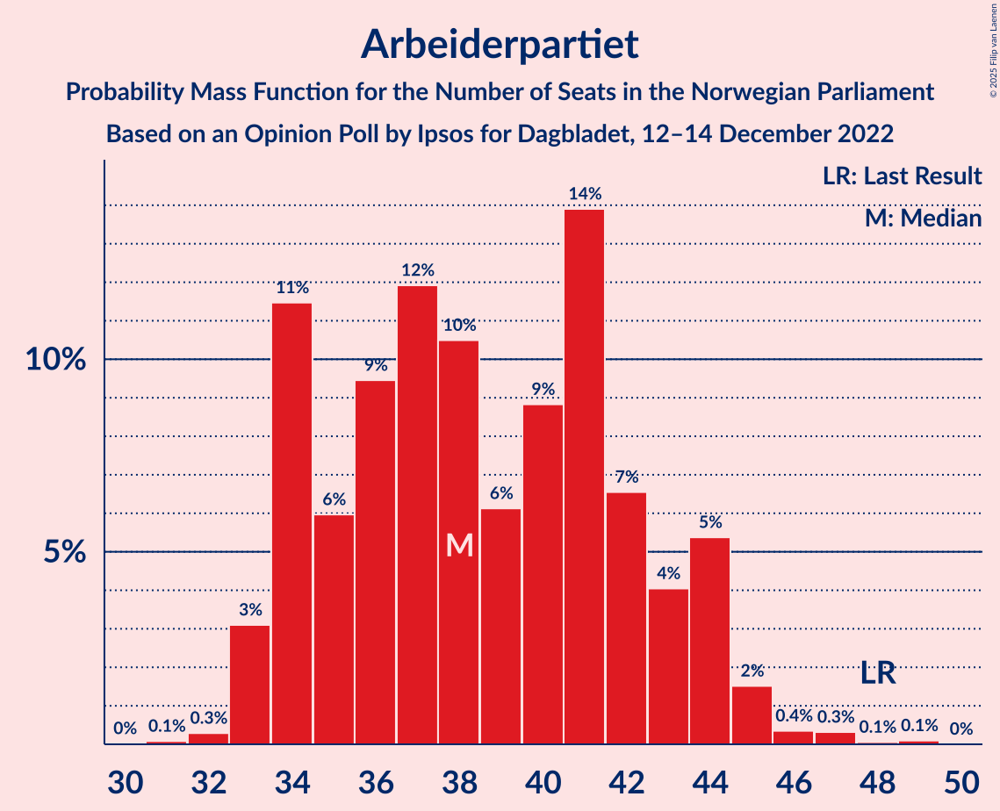

| Number of Seats | Probability | Accumulated | Special Marks |
|:---------------:|:-----------:|:-----------:|:-------------:|
| 31 | 0.1% | 100% |  |
| 32 | 0.3% | 99.9% |  |
| 33 | 3% | 99.6% |  |
| 34 | 11% | 96% |  |
| 35 | 6% | 85% |  |
| 36 | 9% | 79% |  |
| 37 | 12% | 70% |  |
| 38 | 10% | 58% | Median |
| 39 | 6% | 47% |  |
| 40 | 9% | 41% |  |
| 41 | 14% | 32% |  |
| 42 | 7% | 18% |  |
| 43 | 4% | 12% |  |
| 44 | 5% | 8% |  |
| 45 | 2% | 2% |  |
| 46 | 0.4% | 0.8% |  |
| 47 | 0.3% | 0.5% |  |
| 48 | 0.1% | 0.2% | Last Result |
| 49 | 0.1% | 0.1% |  |
| 50 | 0% | 0% |  |

### Fremskrittspartiet

*For a full overview of the results for this party, see the [Fremskrittspartiet](party-fremskrittspartiet.html) page.*

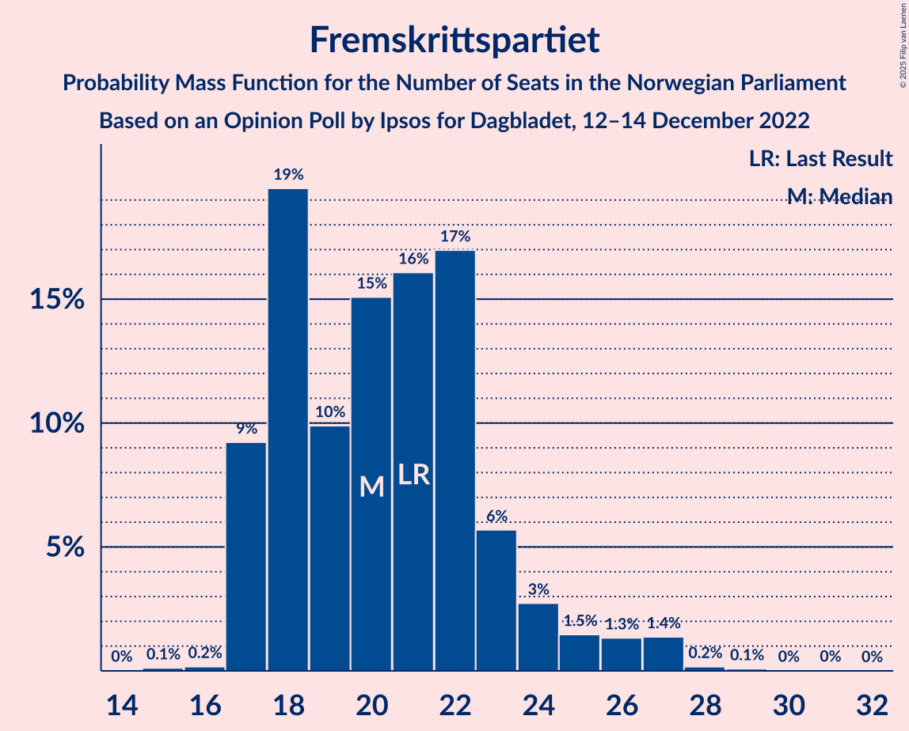

| Number of Seats | Probability | Accumulated | Special Marks |
|:---------------:|:-----------:|:-----------:|:-------------:|
| 15 | 0.1% | 100% |  |
| 16 | 0.2% | 99.8% |  |
| 17 | 9% | 99.7% |  |
| 18 | 19% | 90% |  |
| 19 | 10% | 71% |  |
| 20 | 15% | 61% | Median |
| 21 | 16% | 46% | Last Result |
| 22 | 17% | 30% |  |
| 23 | 6% | 13% |  |
| 24 | 3% | 7% |  |
| 25 | 1.5% | 4% |  |
| 26 | 1.3% | 3% |  |
| 27 | 1.4% | 2% |  |
| 28 | 0.2% | 0.3% |  |
| 29 | 0.1% | 0.2% |  |
| 30 | 0% | 0.1% |  |
| 31 | 0% | 0% |  |

### Sosialistisk Venstreparti

*For a full overview of the results for this party, see the [Sosialistisk Venstreparti](party-sosialistiskvenstreparti.html) page.*

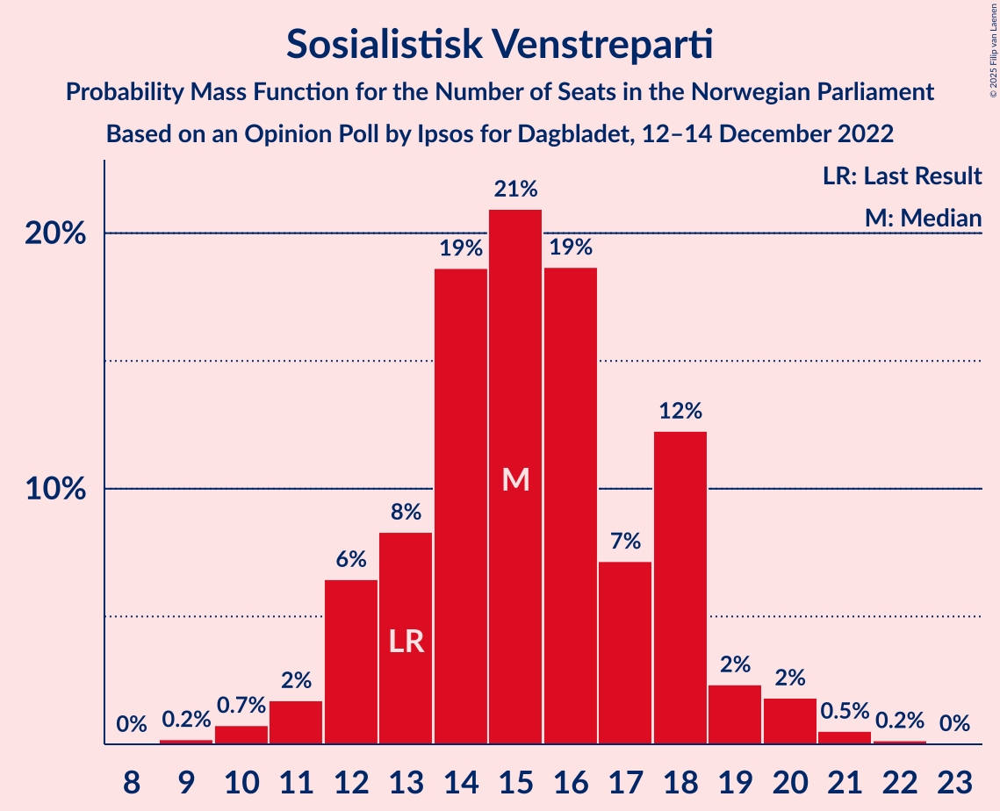

| Number of Seats | Probability | Accumulated | Special Marks |
|:---------------:|:-----------:|:-----------:|:-------------:|
| 9 | 0.2% | 100% |  |
| 10 | 0.7% | 99.8% |  |
| 11 | 2% | 99.1% |  |
| 12 | 6% | 97% |  |
| 13 | 8% | 91% | Last Result |
| 14 | 19% | 83% |  |
| 15 | 21% | 64% | Median |
| 16 | 19% | 43% |  |
| 17 | 7% | 24% |  |
| 18 | 12% | 17% |  |
| 19 | 2% | 5% |  |
| 20 | 2% | 3% |  |
| 21 | 0.5% | 0.7% |  |
| 22 | 0.2% | 0.2% |  |
| 23 | 0% | 0% |  |

### Rødt

*For a full overview of the results for this party, see the [Rødt](party-rødt.html) page.*

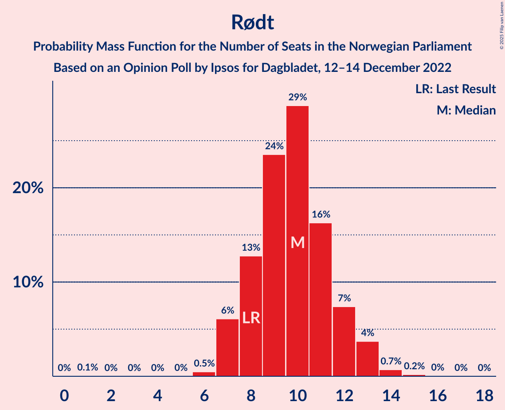

| Number of Seats | Probability | Accumulated | Special Marks |
|:---------------:|:-----------:|:-----------:|:-------------:|
| 1 | 0.1% | 100% |  |
| 2 | 0% | 99.9% |  |
| 3 | 0% | 99.9% |  |
| 4 | 0% | 99.9% |  |
| 5 | 0% | 99.9% |  |
| 6 | 0.5% | 99.9% |  |
| 7 | 6% | 99.5% |  |
| 8 | 13% | 93% | Last Result |
| 9 | 24% | 81% |  |
| 10 | 29% | 57% | Median |
| 11 | 16% | 28% |  |
| 12 | 7% | 12% |  |
| 13 | 4% | 5% |  |
| 14 | 0.7% | 1.0% |  |
| 15 | 0.2% | 0.3% |  |
| 16 | 0% | 0.1% |  |
| 17 | 0% | 0% |  |

### Senterpartiet

*For a full overview of the results for this party, see the [Senterpartiet](party-senterpartiet.html) page.*

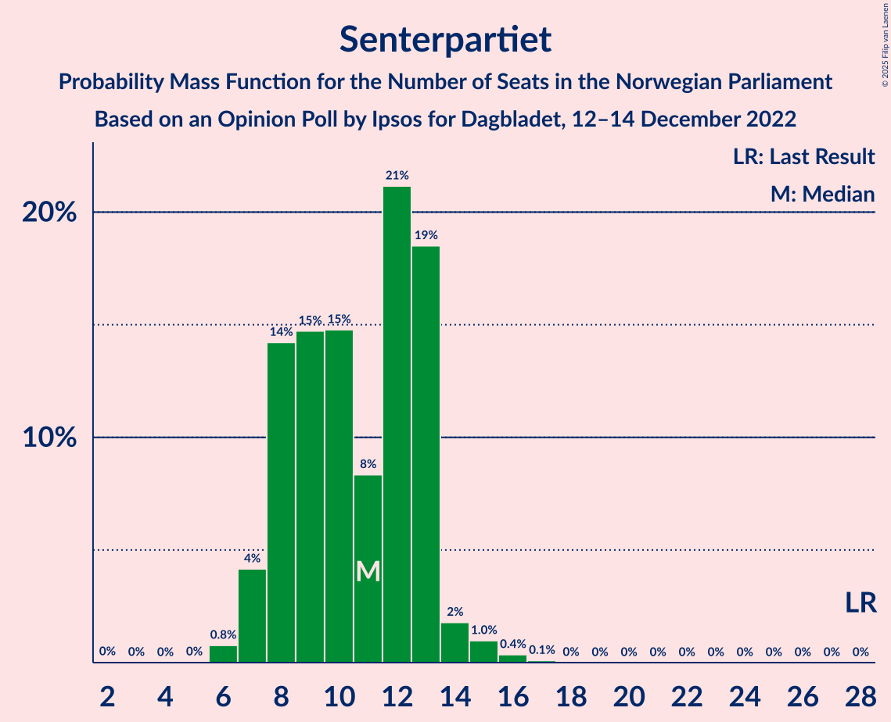

| Number of Seats | Probability | Accumulated | Special Marks |
|:---------------:|:-----------:|:-----------:|:-------------:|
| 2 | 0% | 100% |  |
| 3 | 0% | 99.9% |  |
| 4 | 0% | 99.9% |  |
| 5 | 0% | 99.9% |  |
| 6 | 0.8% | 99.9% |  |
| 7 | 4% | 99.1% |  |
| 8 | 14% | 95% |  |
| 9 | 15% | 81% |  |
| 10 | 15% | 66% |  |
| 11 | 8% | 51% | Median |
| 12 | 21% | 43% |  |
| 13 | 19% | 22% |  |
| 14 | 2% | 3% |  |
| 15 | 1.0% | 1.4% |  |
| 16 | 0.4% | 0.5% |  |
| 17 | 0.1% | 0.1% |  |
| 18 | 0% | 0% |  |
| 19 | 0% | 0% |  |
| 20 | 0% | 0% |  |
| 21 | 0% | 0% |  |
| 22 | 0% | 0% |  |
| 23 | 0% | 0% |  |
| 24 | 0% | 0% |  |
| 25 | 0% | 0% |  |
| 26 | 0% | 0% |  |
| 27 | 0% | 0% |  |
| 28 | 0% | 0% | Last Result |

### Venstre

*For a full overview of the results for this party, see the [Venstre](party-venstre.html) page.*

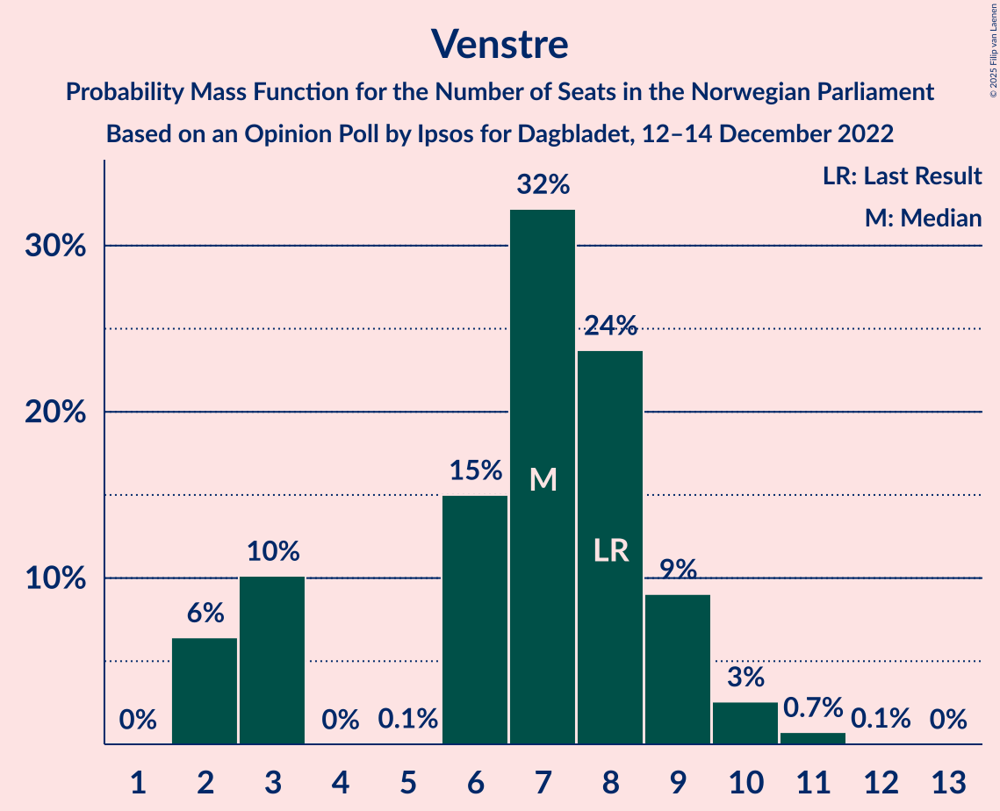

| Number of Seats | Probability | Accumulated | Special Marks |
|:---------------:|:-----------:|:-----------:|:-------------:|
| 2 | 6% | 100% |  |
| 3 | 10% | 94% |  |
| 4 | 0% | 83% |  |
| 5 | 0.1% | 83% |  |
| 6 | 15% | 83% |  |
| 7 | 32% | 68% | Median |
| 8 | 24% | 36% | Last Result |
| 9 | 9% | 12% |  |
| 10 | 3% | 3% |  |
| 11 | 0.7% | 0.8% |  |
| 12 | 0.1% | 0.1% |  |
| 13 | 0% | 0% |  |

### Miljøpartiet De Grønne

*For a full overview of the results for this party, see the [Miljøpartiet De Grønne](party-miljøpartietdegrønne.html) page.*

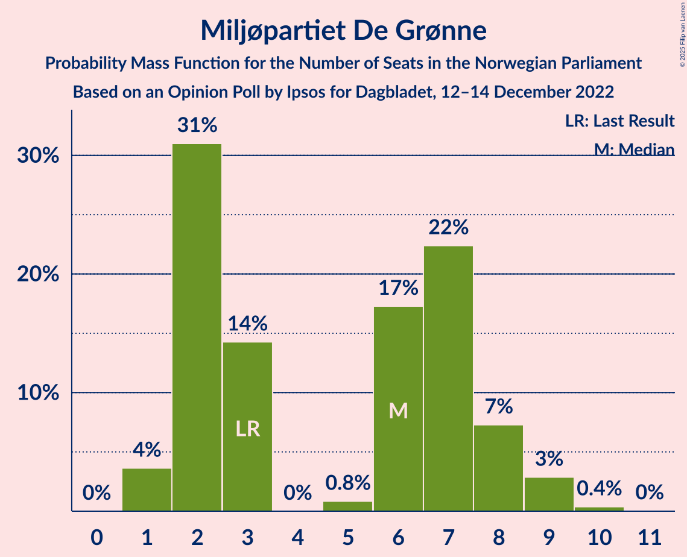

| Number of Seats | Probability | Accumulated | Special Marks |
|:---------------:|:-----------:|:-----------:|:-------------:|
| 1 | 4% | 100% |  |
| 2 | 31% | 96% |  |
| 3 | 14% | 65% | Last Result |
| 4 | 0% | 51% |  |
| 5 | 0.8% | 51% |  |
| 6 | 17% | 50% | Median |
| 7 | 22% | 33% |  |
| 8 | 7% | 11% |  |
| 9 | 3% | 3% |  |
| 10 | 0.4% | 0.4% |  |
| 11 | 0% | 0% |  |

### Kristelig Folkeparti

*For a full overview of the results for this party, see the [Kristelig Folkeparti](party-kristeligfolkeparti.html) page.*

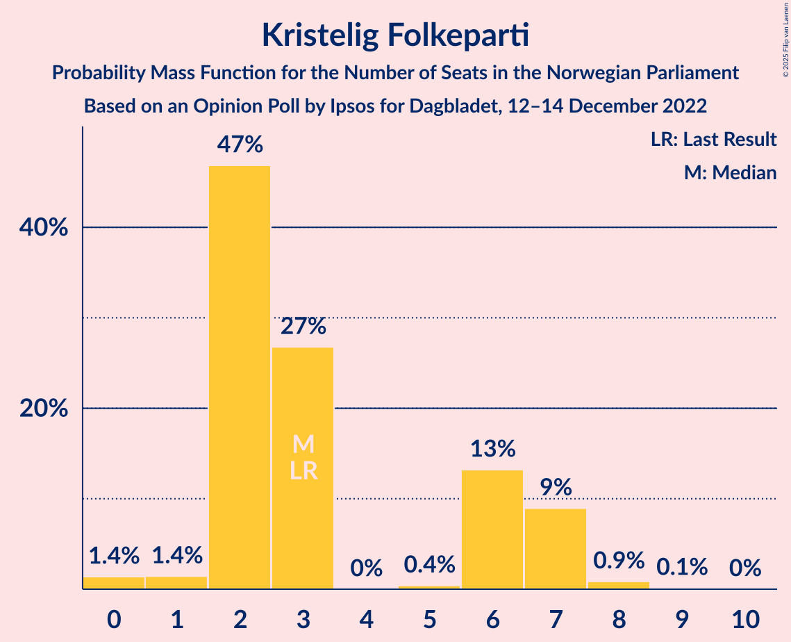

| Number of Seats | Probability | Accumulated | Special Marks |
|:---------------:|:-----------:|:-----------:|:-------------:|
| 0 | 1.4% | 100% |  |
| 1 | 1.4% | 98.6% |  |
| 2 | 47% | 97% |  |
| 3 | 27% | 50% | Last Result, Median |
| 4 | 0% | 24% |  |
| 5 | 0.4% | 24% |  |
| 6 | 13% | 23% |  |
| 7 | 9% | 10% |  |
| 8 | 0.9% | 1.0% |  |
| 9 | 0.1% | 0.2% |  |
| 10 | 0% | 0% |  |

## Coalitions

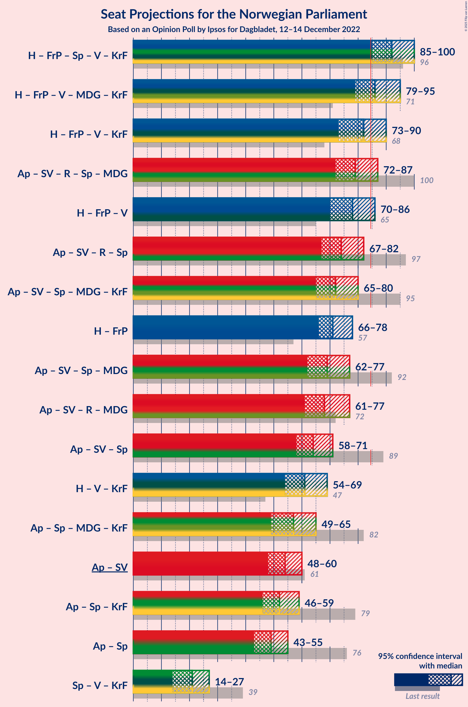

### Confidence Intervals

| Coalition | Last Result | Median | Majority? | 80% Confidence Interval | 90% Confidence Interval | 95% Confidence Interval | 99% Confidence Interval |
|:---------:|:-----------:|:------:|:---------:|:-----------------------:|:-----------------------:|:-----------------------:|:-----------------------:|
| Høyre – Fremskrittspartiet – Senterpartiet – Venstre – Kristelig Folkeparti | 96 | 92 | 98% | 87–98 | 85–99 | 85–100 | 82–103 |
| Høyre – Fremskrittspartiet – Venstre – Miljøpartiet De Grønne – Kristelig Folkeparti | 71 | 86 | 67% | 81–92 | 80–93 | 79–95 | 76–96 |
| Høyre – Fremskrittspartiet – Venstre – Kristelig Folkeparti | 68 | 82 | 24% | 77–86 | 75–88 | 73–90 | 72–91 |
| Arbeiderpartiet – Sosialistisk Venstreparti – Rødt – Senterpartiet – Miljøpartiet De Grønne | 100 | 79 | 8% | 74–84 | 72–86 | 72–87 | 69–91 |
| Høyre – Fremskrittspartiet – Venstre | 65 | 78 | 4% | 74–83 | 72–84 | 70–86 | 69–89 |
| Arbeiderpartiet – Sosialistisk Venstreparti – Rødt – Senterpartiet | 97 | 74 | 0.4% | 69–79 | 68–80 | 67–82 | 65–84 |
| Arbeiderpartiet – Sosialistisk Venstreparti – Senterpartiet – Miljøpartiet De Grønne – Kristelig Folkeparti | 95 | 72 | 0.1% | 67–77 | 66–79 | 65–80 | 63–82 |
| Høyre – Fremskrittspartiet | 57 | 71 | 0% | 68–76 | 67–78 | 66–78 | 64–81 |
| Arbeiderpartiet – Sosialistisk Venstreparti – Senterpartiet – Miljøpartiet De Grønne | 92 | 69 | 0% | 64–74 | 63–75 | 62–77 | 60–79 |
| Arbeiderpartiet – Sosialistisk Venstreparti – Rødt – Miljøpartiet De Grønne | 72 | 68 | 0% | 63–73 | 62–75 | 61–77 | 59–80 |
| Arbeiderpartiet – Sosialistisk Venstreparti – Senterpartiet | 89 | 64 | 0% | 60–69 | 59–70 | 58–71 | 56–73 |
| Høyre – Venstre – Kristelig Folkeparti | 47 | 61 | 0% | 57–67 | 55–68 | 54–69 | 52–71 |
| Arbeiderpartiet – Senterpartiet – Miljøpartiet De Grønne – Kristelig Folkeparti | 82 | 57 | 0% | 52–62 | 51–63 | 49–65 | 47–67 |
| Arbeiderpartiet – Sosialistisk Venstreparti | 61 | 54 | 0% | 49–59 | 48–60 | 48–60 | 46–62 |
| Arbeiderpartiet – Senterpartiet – Kristelig Folkeparti | 79 | 52 | 0% | 48–57 | 47–58 | 46–59 | 44–62 |
| Arbeiderpartiet – Senterpartiet | 76 | 49 | 0% | 45–53 | 44–54 | 43–55 | 41–57 |
| Senterpartiet – Venstre – Kristelig Folkeparti | 39 | 21 | 0% | 16–25 | 15–25 | 14–27 | 12–28 |

### Høyre – Fremskrittspartiet – Senterpartiet – Venstre – Kristelig Folkeparti

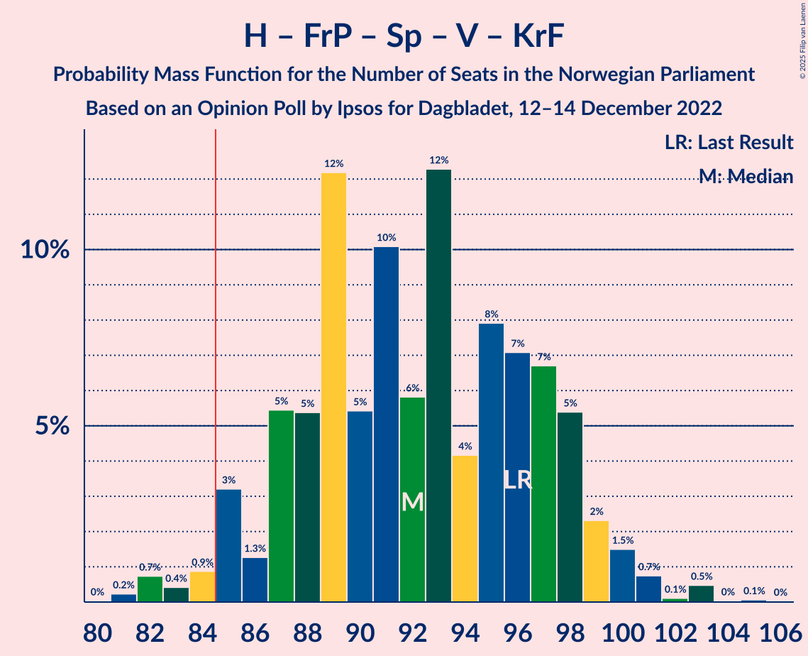

| Number of Seats | Probability | Accumulated | Special Marks |
|:---------------:|:-----------:|:-----------:|:-------------:|
| 80 | 0% | 100% |  |
| 81 | 0.2% | 99.9% |  |
| 82 | 0.7% | 99.7% |  |
| 83 | 0.4% | 99.0% |  |
| 84 | 0.9% | 98.6% |  |
| 85 | 3% | 98% | Majority |
| 86 | 1.3% | 94% |  |
| 87 | 5% | 93% |  |
| 88 | 5% | 88% |  |
| 89 | 12% | 82% |  |
| 90 | 5% | 70% |  |
| 91 | 10% | 65% |  |
| 92 | 6% | 55% | Median |
| 93 | 12% | 49% |  |
| 94 | 4% | 37% |  |
| 95 | 8% | 32% |  |
| 96 | 7% | 24% | Last Result |
| 97 | 7% | 17% |  |
| 98 | 5% | 11% |  |
| 99 | 2% | 5% |  |
| 100 | 1.5% | 3% |  |
| 101 | 0.7% | 1.5% |  |
| 102 | 0.1% | 0.7% |  |
| 103 | 0.5% | 0.6% |  |
| 104 | 0% | 0.1% |  |
| 105 | 0.1% | 0.1% |  |
| 106 | 0% | 0% |  |

### Høyre – Fremskrittspartiet – Venstre – Miljøpartiet De Grønne – Kristelig Folkeparti

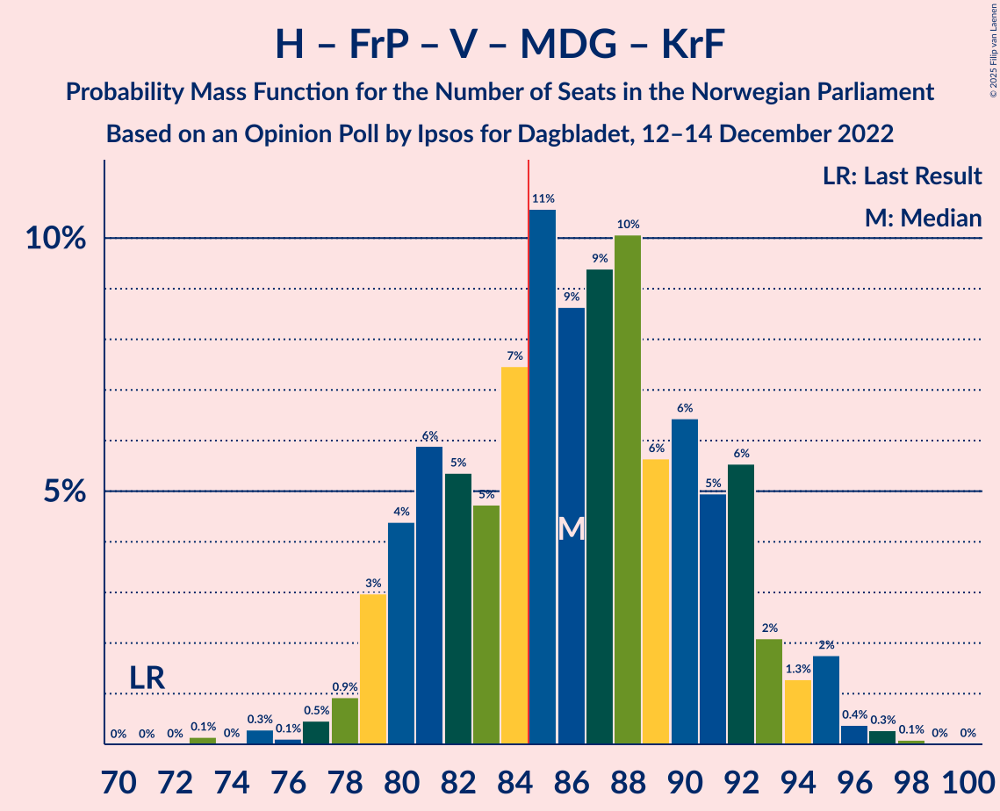

| Number of Seats | Probability | Accumulated | Special Marks |
|:---------------:|:-----------:|:-----------:|:-------------:|
| 71 | 0% | 100% | Last Result |
| 72 | 0% | 100% |  |
| 73 | 0.1% | 100% |  |
| 74 | 0% | 99.8% |  |
| 75 | 0.3% | 99.8% |  |
| 76 | 0.1% | 99.5% |  |
| 77 | 0.5% | 99.4% |  |
| 78 | 0.9% | 99.0% |  |
| 79 | 3% | 98% |  |
| 80 | 4% | 95% |  |
| 81 | 6% | 91% |  |
| 82 | 5% | 85% |  |
| 83 | 5% | 79% |  |
| 84 | 7% | 75% |  |
| 85 | 11% | 67% | Majority |
| 86 | 9% | 57% |  |
| 87 | 9% | 48% | Median |
| 88 | 10% | 39% |  |
| 89 | 6% | 29% |  |
| 90 | 6% | 23% |  |
| 91 | 5% | 16% |  |
| 92 | 6% | 11% |  |
| 93 | 2% | 6% |  |
| 94 | 1.3% | 4% |  |
| 95 | 2% | 3% |  |
| 96 | 0.4% | 0.8% |  |
| 97 | 0.3% | 0.4% |  |
| 98 | 0.1% | 0.2% |  |
| 99 | 0% | 0.1% |  |
| 100 | 0% | 0% |  |

### Høyre – Fremskrittspartiet – Venstre – Kristelig Folkeparti

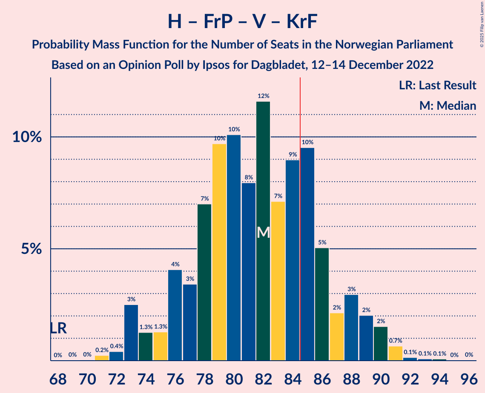

| Number of Seats | Probability | Accumulated | Special Marks |
|:---------------:|:-----------:|:-----------:|:-------------:|
| 68 | 0% | 100% | Last Result |
| 69 | 0% | 100% |  |
| 70 | 0% | 100% |  |
| 71 | 0.2% | 99.9% |  |
| 72 | 0.4% | 99.7% |  |
| 73 | 3% | 99.3% |  |
| 74 | 1.3% | 97% |  |
| 75 | 1.3% | 95% |  |
| 76 | 4% | 94% |  |
| 77 | 3% | 90% |  |
| 78 | 7% | 87% |  |
| 79 | 10% | 80% |  |
| 80 | 10% | 70% |  |
| 81 | 8% | 60% | Median |
| 82 | 12% | 52% |  |
| 83 | 7% | 40% |  |
| 84 | 9% | 33% |  |
| 85 | 10% | 24% | Majority |
| 86 | 5% | 15% |  |
| 87 | 2% | 10% |  |
| 88 | 3% | 8% |  |
| 89 | 2% | 5% |  |
| 90 | 2% | 3% |  |
| 91 | 0.7% | 1.0% |  |
| 92 | 0.1% | 0.4% |  |
| 93 | 0.1% | 0.2% |  |
| 94 | 0.1% | 0.1% |  |
| 95 | 0% | 0.1% |  |
| 96 | 0% | 0% |  |

### Arbeiderpartiet – Sosialistisk Venstreparti – Rødt – Senterpartiet – Miljøpartiet De Grønne

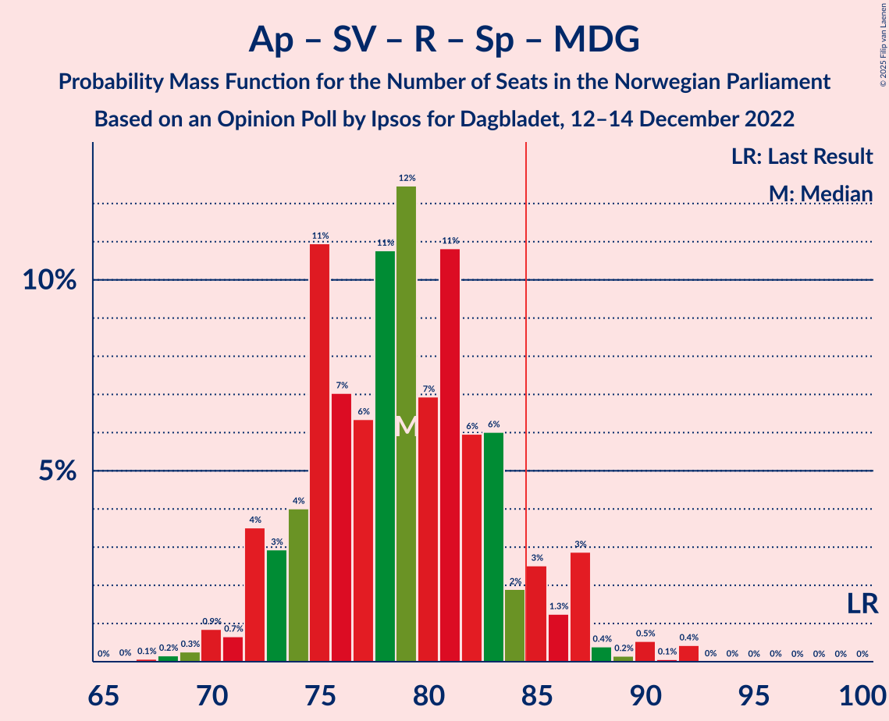

| Number of Seats | Probability | Accumulated | Special Marks |
|:---------------:|:-----------:|:-----------:|:-------------:|
| 67 | 0.1% | 100% |  |
| 68 | 0.2% | 99.9% |  |
| 69 | 0.3% | 99.7% |  |
| 70 | 0.9% | 99.5% |  |
| 71 | 0.7% | 98.6% |  |
| 72 | 4% | 98% |  |
| 73 | 3% | 94% |  |
| 74 | 4% | 91% |  |
| 75 | 11% | 87% |  |
| 76 | 7% | 77% |  |
| 77 | 6% | 69% |  |
| 78 | 11% | 63% |  |
| 79 | 12% | 52% |  |
| 80 | 7% | 40% | Median |
| 81 | 11% | 33% |  |
| 82 | 6% | 22% |  |
| 83 | 6% | 16% |  |
| 84 | 2% | 10% |  |
| 85 | 3% | 8% | Majority |
| 86 | 1.3% | 6% |  |
| 87 | 3% | 4% |  |
| 88 | 0.4% | 2% |  |
| 89 | 0.2% | 1.2% |  |
| 90 | 0.5% | 1.1% |  |
| 91 | 0.1% | 0.5% |  |
| 92 | 0.4% | 0.5% |  |
| 93 | 0% | 0% |  |
| 94 | 0% | 0% |  |
| 95 | 0% | 0% |  |
| 96 | 0% | 0% |  |
| 97 | 0% | 0% |  |
| 98 | 0% | 0% |  |
| 99 | 0% | 0% |  |
| 100 | 0% | 0% | Last Result |

### Høyre – Fremskrittspartiet – Venstre

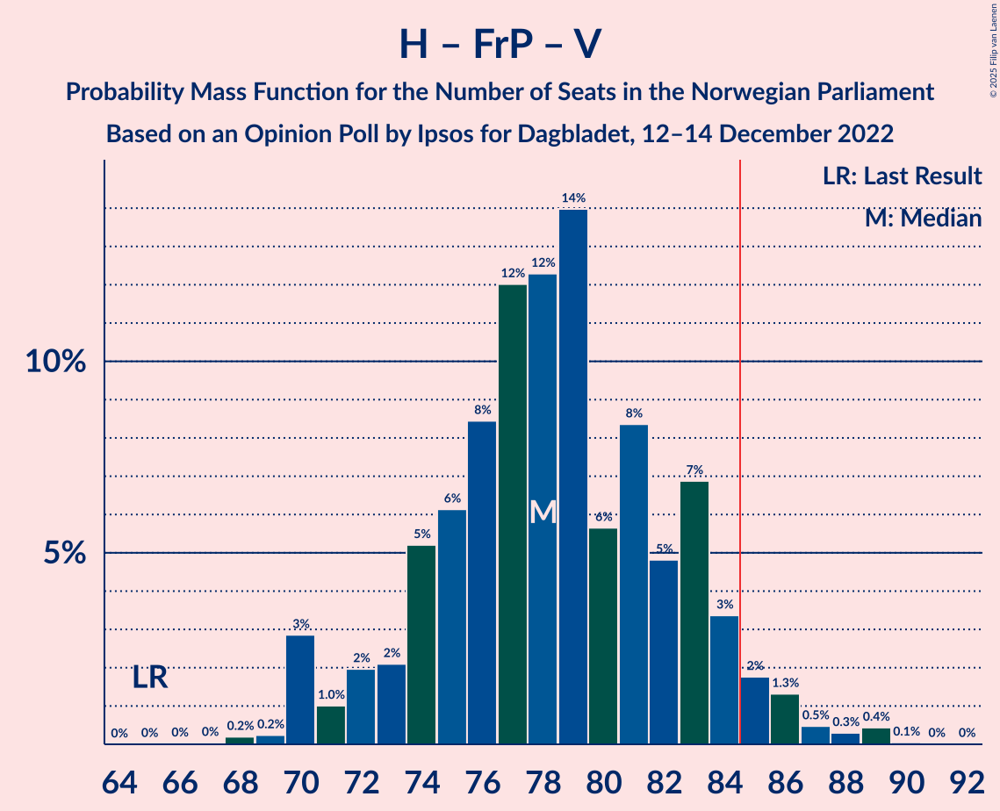

| Number of Seats | Probability | Accumulated | Special Marks |
|:---------------:|:-----------:|:-----------:|:-------------:|
| 65 | 0% | 100% | Last Result |
| 66 | 0% | 100% |  |
| 67 | 0% | 100% |  |
| 68 | 0.2% | 99.9% |  |
| 69 | 0.2% | 99.7% |  |
| 70 | 3% | 99.5% |  |
| 71 | 1.0% | 97% |  |
| 72 | 2% | 96% |  |
| 73 | 2% | 94% |  |
| 74 | 5% | 92% |  |
| 75 | 6% | 86% |  |
| 76 | 8% | 80% |  |
| 77 | 12% | 72% |  |
| 78 | 12% | 60% | Median |
| 79 | 14% | 47% |  |
| 80 | 6% | 33% |  |
| 81 | 8% | 28% |  |
| 82 | 5% | 19% |  |
| 83 | 7% | 15% |  |
| 84 | 3% | 8% |  |
| 85 | 2% | 4% | Majority |
| 86 | 1.3% | 3% |  |
| 87 | 0.5% | 1.3% |  |
| 88 | 0.3% | 0.8% |  |
| 89 | 0.4% | 0.5% |  |
| 90 | 0.1% | 0.1% |  |
| 91 | 0% | 0% |  |

### Arbeiderpartiet – Sosialistisk Venstreparti – Rødt – Senterpartiet

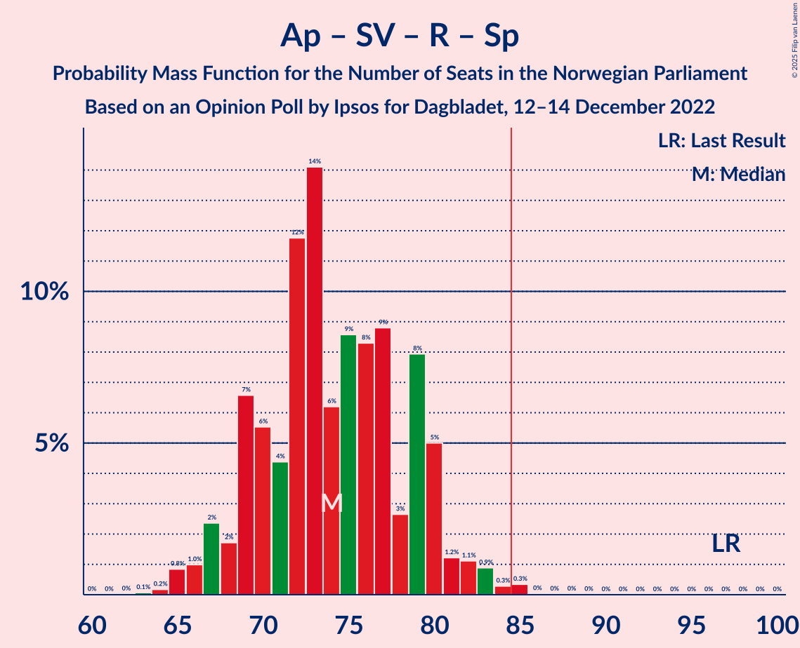

| Number of Seats | Probability | Accumulated | Special Marks |
|:---------------:|:-----------:|:-----------:|:-------------:|
| 63 | 0.1% | 100% |  |
| 64 | 0.2% | 99.9% |  |
| 65 | 0.8% | 99.7% |  |
| 66 | 1.0% | 98.9% |  |
| 67 | 2% | 98% |  |
| 68 | 2% | 96% |  |
| 69 | 7% | 94% |  |
| 70 | 6% | 87% |  |
| 71 | 4% | 82% |  |
| 72 | 12% | 77% |  |
| 73 | 14% | 66% |  |
| 74 | 6% | 51% | Median |
| 75 | 9% | 45% |  |
| 76 | 8% | 37% |  |
| 77 | 9% | 28% |  |
| 78 | 3% | 20% |  |
| 79 | 8% | 17% |  |
| 80 | 5% | 9% |  |
| 81 | 1.2% | 4% |  |
| 82 | 1.1% | 3% |  |
| 83 | 0.9% | 2% |  |
| 84 | 0.3% | 0.7% |  |
| 85 | 0.3% | 0.4% | Majority |
| 86 | 0% | 0.1% |  |
| 87 | 0% | 0.1% |  |
| 88 | 0% | 0% |  |
| 89 | 0% | 0% |  |
| 90 | 0% | 0% |  |
| 91 | 0% | 0% |  |
| 92 | 0% | 0% |  |
| 93 | 0% | 0% |  |
| 94 | 0% | 0% |  |
| 95 | 0% | 0% |  |
| 96 | 0% | 0% |  |
| 97 | 0% | 0% | Last Result |

### Arbeiderpartiet – Sosialistisk Venstreparti – Senterpartiet – Miljøpartiet De Grønne – Kristelig Folkeparti

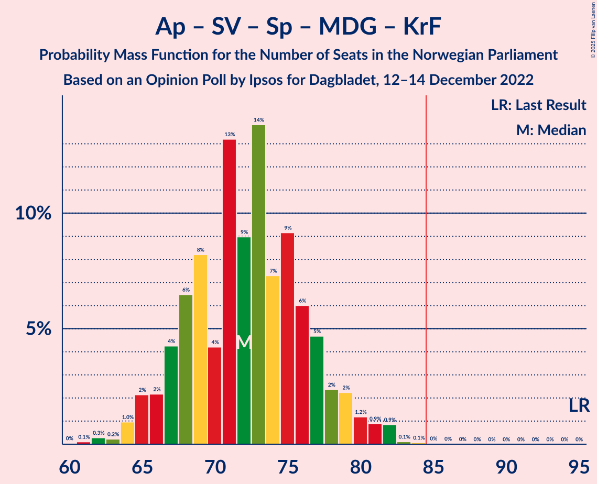

| Number of Seats | Probability | Accumulated | Special Marks |
|:---------------:|:-----------:|:-----------:|:-------------:|
| 60 | 0% | 100% |  |
| 61 | 0.1% | 99.9% |  |
| 62 | 0.3% | 99.8% |  |
| 63 | 0.2% | 99.6% |  |
| 64 | 1.0% | 99.3% |  |
| 65 | 2% | 98% |  |
| 66 | 2% | 96% |  |
| 67 | 4% | 94% |  |
| 68 | 6% | 90% |  |
| 69 | 8% | 83% |  |
| 70 | 4% | 75% |  |
| 71 | 13% | 71% |  |
| 72 | 9% | 58% |  |
| 73 | 14% | 49% | Median |
| 74 | 7% | 35% |  |
| 75 | 9% | 28% |  |
| 76 | 6% | 18% |  |
| 77 | 5% | 12% |  |
| 78 | 2% | 8% |  |
| 79 | 2% | 5% |  |
| 80 | 1.2% | 3% |  |
| 81 | 0.9% | 2% |  |
| 82 | 0.9% | 1.1% |  |
| 83 | 0.1% | 0.3% |  |
| 84 | 0.1% | 0.1% |  |
| 85 | 0% | 0.1% | Majority |
| 86 | 0% | 0% |  |
| 87 | 0% | 0% |  |
| 88 | 0% | 0% |  |
| 89 | 0% | 0% |  |
| 90 | 0% | 0% |  |
| 91 | 0% | 0% |  |
| 92 | 0% | 0% |  |
| 93 | 0% | 0% |  |
| 94 | 0% | 0% |  |
| 95 | 0% | 0% | Last Result |

### Høyre – Fremskrittspartiet

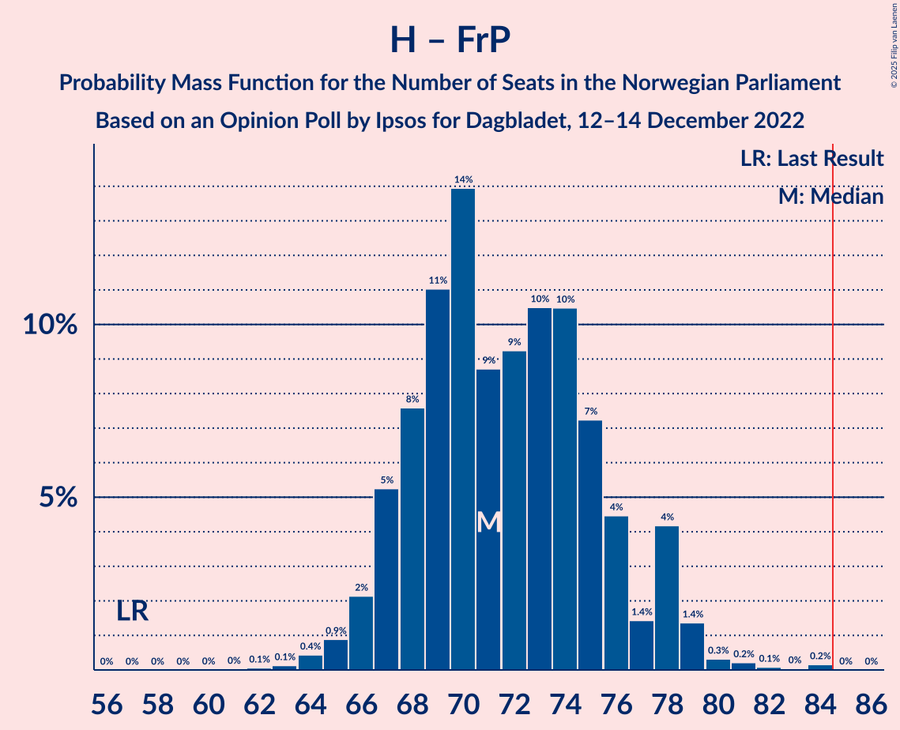

| Number of Seats | Probability | Accumulated | Special Marks |
|:---------------:|:-----------:|:-----------:|:-------------:|
| 57 | 0% | 100% | Last Result |
| 58 | 0% | 100% |  |
| 59 | 0% | 100% |  |
| 60 | 0% | 100% |  |
| 61 | 0% | 100% |  |
| 62 | 0.1% | 100% |  |
| 63 | 0.1% | 99.9% |  |
| 64 | 0.4% | 99.8% |  |
| 65 | 0.9% | 99.3% |  |
| 66 | 2% | 98% |  |
| 67 | 5% | 96% |  |
| 68 | 8% | 91% |  |
| 69 | 11% | 83% |  |
| 70 | 14% | 72% |  |
| 71 | 9% | 58% | Median |
| 72 | 9% | 50% |  |
| 73 | 10% | 41% |  |
| 74 | 10% | 30% |  |
| 75 | 7% | 20% |  |
| 76 | 4% | 12% |  |
| 77 | 1.4% | 8% |  |
| 78 | 4% | 6% |  |
| 79 | 1.4% | 2% |  |
| 80 | 0.3% | 0.8% |  |
| 81 | 0.2% | 0.5% |  |
| 82 | 0.1% | 0.3% |  |
| 83 | 0% | 0.2% |  |
| 84 | 0.2% | 0.2% |  |
| 85 | 0% | 0% | Majority |

### Arbeiderpartiet – Sosialistisk Venstreparti – Senterpartiet – Miljøpartiet De Grønne

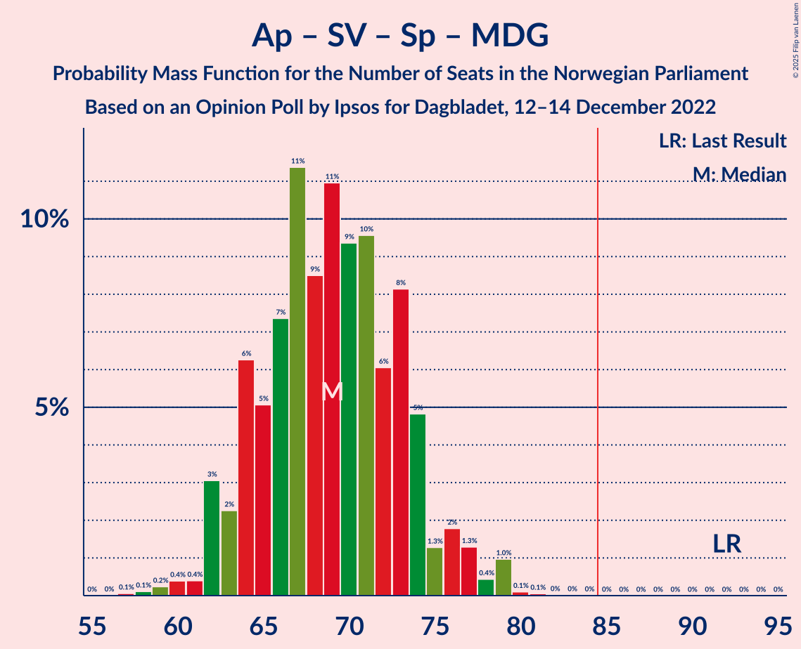

| Number of Seats | Probability | Accumulated | Special Marks |
|:---------------:|:-----------:|:-----------:|:-------------:|
| 57 | 0.1% | 100% |  |
| 58 | 0.1% | 99.9% |  |
| 59 | 0.2% | 99.8% |  |
| 60 | 0.4% | 99.6% |  |
| 61 | 0.4% | 99.2% |  |
| 62 | 3% | 98.8% |  |
| 63 | 2% | 96% |  |
| 64 | 6% | 93% |  |
| 65 | 5% | 87% |  |
| 66 | 7% | 82% |  |
| 67 | 11% | 75% |  |
| 68 | 9% | 63% |  |
| 69 | 11% | 55% |  |
| 70 | 9% | 44% | Median |
| 71 | 10% | 35% |  |
| 72 | 6% | 25% |  |
| 73 | 8% | 19% |  |
| 74 | 5% | 11% |  |
| 75 | 1.3% | 6% |  |
| 76 | 2% | 5% |  |
| 77 | 1.3% | 3% |  |
| 78 | 0.4% | 2% |  |
| 79 | 1.0% | 1.2% |  |
| 80 | 0.1% | 0.2% |  |
| 81 | 0.1% | 0.1% |  |
| 82 | 0% | 0.1% |  |
| 83 | 0% | 0% |  |
| 84 | 0% | 0% |  |
| 85 | 0% | 0% | Majority |
| 86 | 0% | 0% |  |
| 87 | 0% | 0% |  |
| 88 | 0% | 0% |  |
| 89 | 0% | 0% |  |
| 90 | 0% | 0% |  |
| 91 | 0% | 0% |  |
| 92 | 0% | 0% | Last Result |

### Arbeiderpartiet – Sosialistisk Venstreparti – Rødt – Miljøpartiet De Grønne

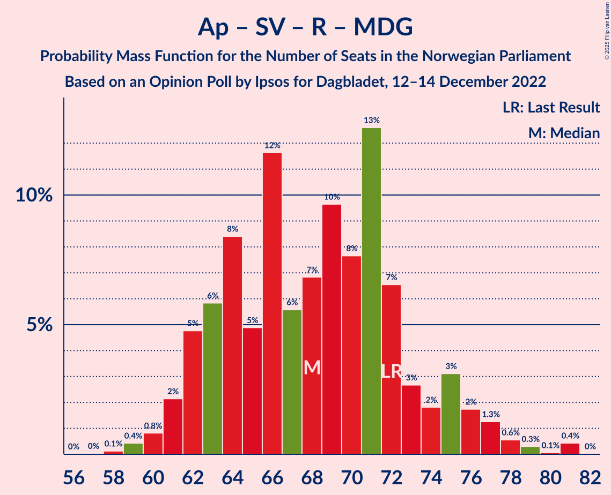

| Number of Seats | Probability | Accumulated | Special Marks |
|:---------------:|:-----------:|:-----------:|:-------------:|
| 57 | 0% | 100% |  |
| 58 | 0.1% | 99.9% |  |
| 59 | 0.4% | 99.8% |  |
| 60 | 0.8% | 99.4% |  |
| 61 | 2% | 98.6% |  |
| 62 | 5% | 96% |  |
| 63 | 6% | 92% |  |
| 64 | 8% | 86% |  |
| 65 | 5% | 77% |  |
| 66 | 12% | 73% |  |
| 67 | 6% | 61% |  |
| 68 | 7% | 55% |  |
| 69 | 10% | 48% | Median |
| 70 | 8% | 39% |  |
| 71 | 13% | 31% |  |
| 72 | 7% | 19% | Last Result |
| 73 | 3% | 12% |  |
| 74 | 2% | 9% |  |
| 75 | 3% | 8% |  |
| 76 | 2% | 4% |  |
| 77 | 1.3% | 3% |  |
| 78 | 0.6% | 1.4% |  |
| 79 | 0.3% | 0.8% |  |
| 80 | 0.1% | 0.5% |  |
| 81 | 0.4% | 0.5% |  |
| 82 | 0% | 0% |  |

### Arbeiderpartiet – Sosialistisk Venstreparti – Senterpartiet

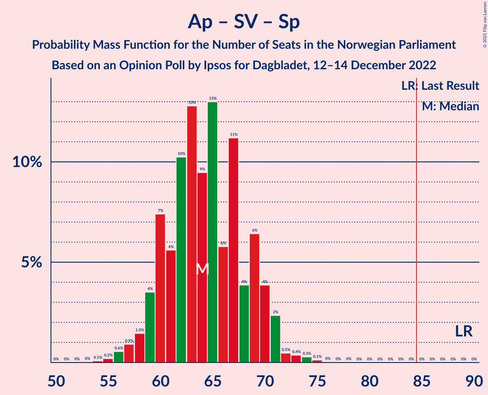

| Number of Seats | Probability | Accumulated | Special Marks |
|:---------------:|:-----------:|:-----------:|:-------------:|
| 54 | 0.1% | 100% |  |
| 55 | 0.2% | 99.9% |  |
| 56 | 0.6% | 99.7% |  |
| 57 | 0.9% | 99.1% |  |
| 58 | 1.5% | 98% |  |
| 59 | 4% | 97% |  |
| 60 | 7% | 93% |  |
| 61 | 6% | 86% |  |
| 62 | 10% | 80% |  |
| 63 | 13% | 70% |  |
| 64 | 9% | 57% | Median |
| 65 | 13% | 48% |  |
| 66 | 6% | 35% |  |
| 67 | 11% | 29% |  |
| 68 | 4% | 18% |  |
| 69 | 6% | 14% |  |
| 70 | 4% | 8% |  |
| 71 | 2% | 4% |  |
| 72 | 0.5% | 1.3% |  |
| 73 | 0.4% | 0.8% |  |
| 74 | 0.3% | 0.5% |  |
| 75 | 0.1% | 0.2% |  |
| 76 | 0% | 0.1% |  |
| 77 | 0% | 0% |  |
| 78 | 0% | 0% |  |
| 79 | 0% | 0% |  |
| 80 | 0% | 0% |  |
| 81 | 0% | 0% |  |
| 82 | 0% | 0% |  |
| 83 | 0% | 0% |  |
| 84 | 0% | 0% |  |
| 85 | 0% | 0% | Majority |
| 86 | 0% | 0% |  |
| 87 | 0% | 0% |  |
| 88 | 0% | 0% |  |
| 89 | 0% | 0% | Last Result |

### Høyre – Venstre – Kristelig Folkeparti

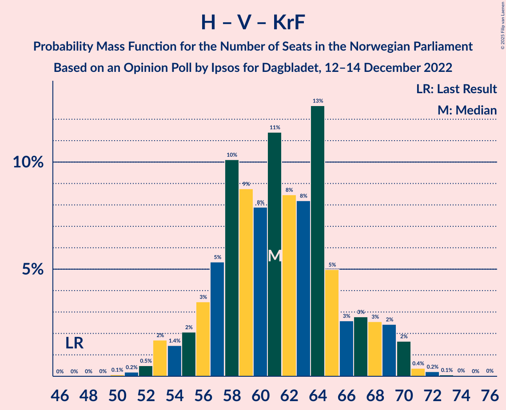

| Number of Seats | Probability | Accumulated | Special Marks |
|:---------------:|:-----------:|:-----------:|:-------------:|
| 47 | 0% | 100% | Last Result |
| 48 | 0% | 100% |  |
| 49 | 0% | 100% |  |
| 50 | 0.1% | 100% |  |
| 51 | 0.2% | 99.9% |  |
| 52 | 0.5% | 99.7% |  |
| 53 | 2% | 99.2% |  |
| 54 | 1.4% | 98% |  |
| 55 | 2% | 96% |  |
| 56 | 3% | 94% |  |
| 57 | 5% | 91% |  |
| 58 | 10% | 85% |  |
| 59 | 9% | 75% |  |
| 60 | 8% | 66% |  |
| 61 | 11% | 58% | Median |
| 62 | 8% | 47% |  |
| 63 | 8% | 39% |  |
| 64 | 13% | 30% |  |
| 65 | 5% | 18% |  |
| 66 | 3% | 13% |  |
| 67 | 3% | 10% |  |
| 68 | 3% | 7% |  |
| 69 | 2% | 5% |  |
| 70 | 2% | 2% |  |
| 71 | 0.4% | 0.8% |  |
| 72 | 0.2% | 0.4% |  |
| 73 | 0.1% | 0.2% |  |
| 74 | 0% | 0.1% |  |
| 75 | 0% | 0.1% |  |
| 76 | 0% | 0% |  |

### Arbeiderpartiet – Senterpartiet – Miljøpartiet De Grønne – Kristelig Folkeparti

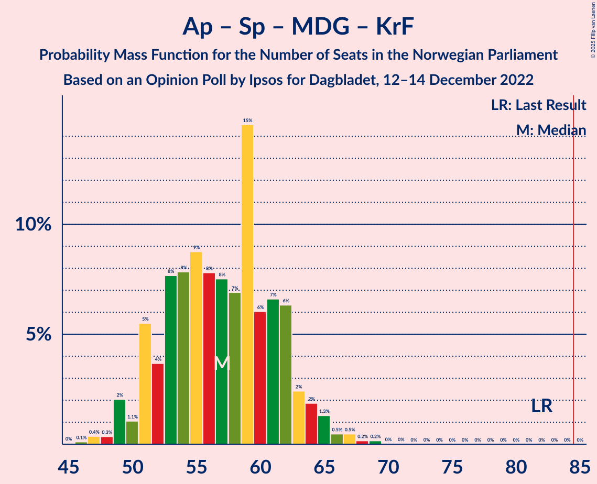

| Number of Seats | Probability | Accumulated | Special Marks |
|:---------------:|:-----------:|:-----------:|:-------------:|
| 45 | 0% | 100% |  |
| 46 | 0.1% | 99.9% |  |
| 47 | 0.4% | 99.8% |  |
| 48 | 0.3% | 99.5% |  |
| 49 | 2% | 99.1% |  |
| 50 | 1.1% | 97% |  |
| 51 | 5% | 96% |  |
| 52 | 4% | 91% |  |
| 53 | 8% | 87% |  |
| 54 | 8% | 79% |  |
| 55 | 9% | 71% |  |
| 56 | 8% | 63% |  |
| 57 | 8% | 55% |  |
| 58 | 7% | 47% | Median |
| 59 | 15% | 40% |  |
| 60 | 6% | 26% |  |
| 61 | 7% | 20% |  |
| 62 | 6% | 13% |  |
| 63 | 2% | 7% |  |
| 64 | 2% | 4% |  |
| 65 | 1.3% | 3% |  |
| 66 | 0.5% | 1.3% |  |
| 67 | 0.5% | 0.8% |  |
| 68 | 0.2% | 0.4% |  |
| 69 | 0.2% | 0.2% |  |
| 70 | 0% | 0% |  |
| 71 | 0% | 0% |  |
| 72 | 0% | 0% |  |
| 73 | 0% | 0% |  |
| 74 | 0% | 0% |  |
| 75 | 0% | 0% |  |
| 76 | 0% | 0% |  |
| 77 | 0% | 0% |  |
| 78 | 0% | 0% |  |
| 79 | 0% | 0% |  |
| 80 | 0% | 0% |  |
| 81 | 0% | 0% |  |
| 82 | 0% | 0% | Last Result |

### Arbeiderpartiet – Sosialistisk Venstreparti

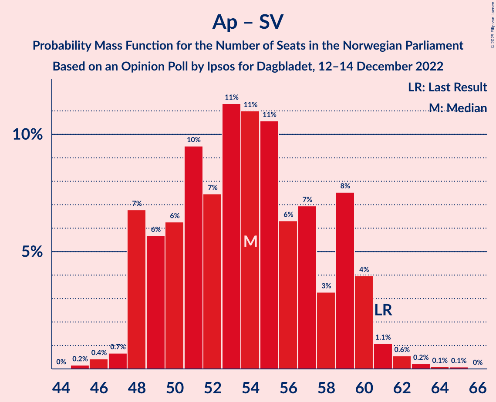

| Number of Seats | Probability | Accumulated | Special Marks |
|:---------------:|:-----------:|:-----------:|:-------------:|
| 45 | 0.2% | 100% |  |
| 46 | 0.4% | 99.8% |  |
| 47 | 0.7% | 99.4% |  |
| 48 | 7% | 98.7% |  |
| 49 | 6% | 92% |  |
| 50 | 6% | 86% |  |
| 51 | 10% | 80% |  |
| 52 | 7% | 70% |  |
| 53 | 11% | 63% | Median |
| 54 | 11% | 52% |  |
| 55 | 11% | 41% |  |
| 56 | 6% | 30% |  |
| 57 | 7% | 24% |  |
| 58 | 3% | 17% |  |
| 59 | 8% | 14% |  |
| 60 | 4% | 6% |  |
| 61 | 1.1% | 2% | Last Result |
| 62 | 0.6% | 1.0% |  |
| 63 | 0.2% | 0.4% |  |
| 64 | 0.1% | 0.2% |  |
| 65 | 0.1% | 0.1% |  |
| 66 | 0% | 0% |  |

### Arbeiderpartiet – Senterpartiet – Kristelig Folkeparti

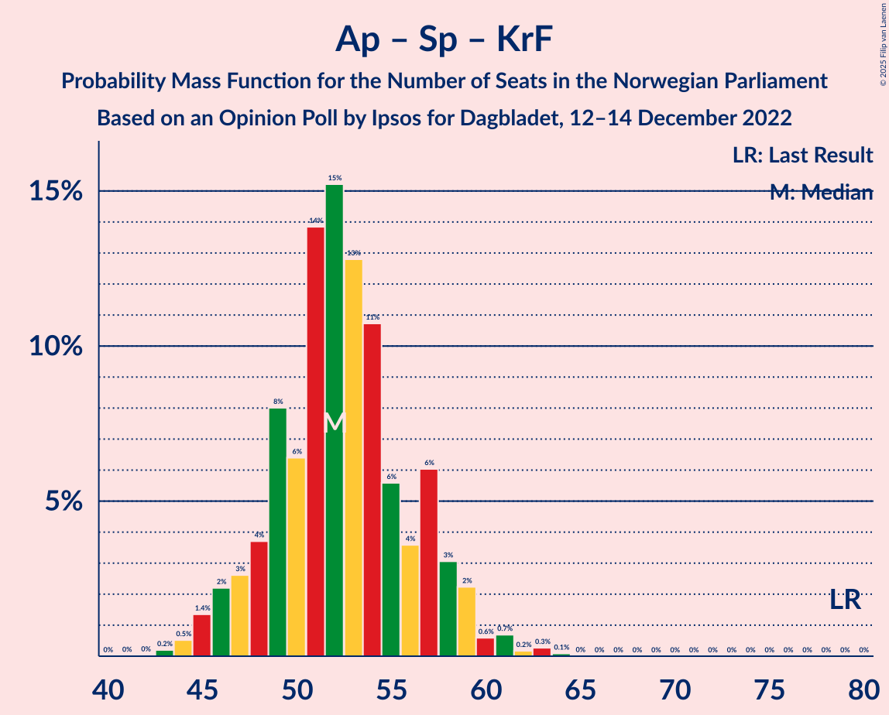

| Number of Seats | Probability | Accumulated | Special Marks |
|:---------------:|:-----------:|:-----------:|:-------------:|
| 42 | 0% | 100% |  |
| 43 | 0.2% | 99.9% |  |
| 44 | 0.5% | 99.7% |  |
| 45 | 1.4% | 99.2% |  |
| 46 | 2% | 98% |  |
| 47 | 3% | 96% |  |
| 48 | 4% | 93% |  |
| 49 | 8% | 89% |  |
| 50 | 6% | 81% |  |
| 51 | 14% | 75% |  |
| 52 | 15% | 61% | Median |
| 53 | 13% | 46% |  |
| 54 | 11% | 33% |  |
| 55 | 6% | 22% |  |
| 56 | 4% | 17% |  |
| 57 | 6% | 13% |  |
| 58 | 3% | 7% |  |
| 59 | 2% | 4% |  |
| 60 | 0.6% | 2% |  |
| 61 | 0.7% | 1.2% |  |
| 62 | 0.2% | 0.5% |  |
| 63 | 0.3% | 0.4% |  |
| 64 | 0.1% | 0.1% |  |
| 65 | 0% | 0% |  |
| 66 | 0% | 0% |  |
| 67 | 0% | 0% |  |
| 68 | 0% | 0% |  |
| 69 | 0% | 0% |  |
| 70 | 0% | 0% |  |
| 71 | 0% | 0% |  |
| 72 | 0% | 0% |  |
| 73 | 0% | 0% |  |
| 74 | 0% | 0% |  |
| 75 | 0% | 0% |  |
| 76 | 0% | 0% |  |
| 77 | 0% | 0% |  |
| 78 | 0% | 0% |  |
| 79 | 0% | 0% | Last Result |

### Arbeiderpartiet – Senterpartiet

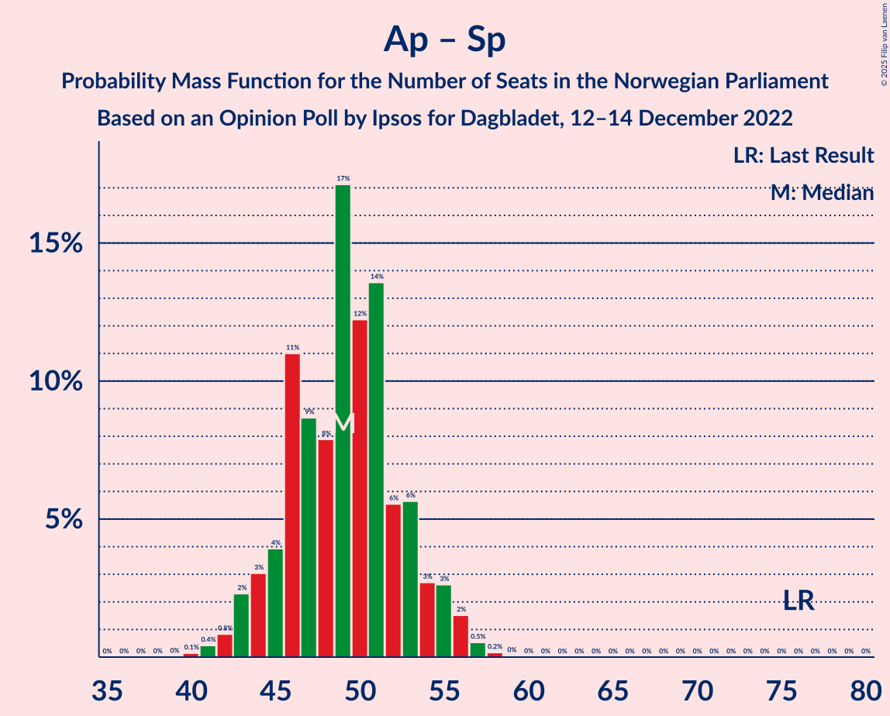

| Number of Seats | Probability | Accumulated | Special Marks |
|:---------------:|:-----------:|:-----------:|:-------------:|
| 40 | 0.1% | 100% |  |
| 41 | 0.4% | 99.8% |  |
| 42 | 0.8% | 99.4% |  |
| 43 | 2% | 98.6% |  |
| 44 | 3% | 96% |  |
| 45 | 4% | 93% |  |
| 46 | 11% | 89% |  |
| 47 | 9% | 78% |  |
| 48 | 8% | 70% |  |
| 49 | 17% | 62% | Median |
| 50 | 12% | 45% |  |
| 51 | 14% | 32% |  |
| 52 | 6% | 19% |  |
| 53 | 6% | 13% |  |
| 54 | 3% | 8% |  |
| 55 | 3% | 5% |  |
| 56 | 2% | 2% |  |
| 57 | 0.5% | 0.8% |  |
| 58 | 0.2% | 0.2% |  |
| 59 | 0% | 0.1% |  |
| 60 | 0% | 0% |  |
| 61 | 0% | 0% |  |
| 62 | 0% | 0% |  |
| 63 | 0% | 0% |  |
| 64 | 0% | 0% |  |
| 65 | 0% | 0% |  |
| 66 | 0% | 0% |  |
| 67 | 0% | 0% |  |
| 68 | 0% | 0% |  |
| 69 | 0% | 0% |  |
| 70 | 0% | 0% |  |
| 71 | 0% | 0% |  |
| 72 | 0% | 0% |  |
| 73 | 0% | 0% |  |
| 74 | 0% | 0% |  |
| 75 | 0% | 0% |  |
| 76 | 0% | 0% | Last Result |

### Senterpartiet – Venstre – Kristelig Folkeparti

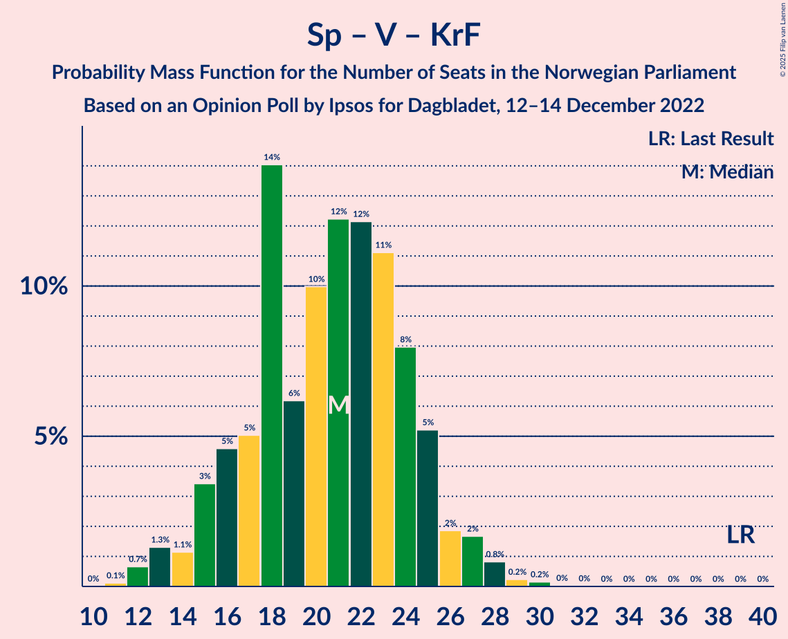

| Number of Seats | Probability | Accumulated | Special Marks |
|:---------------:|:-----------:|:-----------:|:-------------:|
| 11 | 0.1% | 100% |  |
| 12 | 0.7% | 99.9% |  |
| 13 | 1.3% | 99.2% |  |
| 14 | 1.1% | 98% |  |
| 15 | 3% | 97% |  |
| 16 | 5% | 93% |  |
| 17 | 5% | 89% |  |
| 18 | 14% | 84% |  |
| 19 | 6% | 70% |  |
| 20 | 10% | 63% |  |
| 21 | 12% | 53% | Median |
| 22 | 12% | 41% |  |
| 23 | 11% | 29% |  |
| 24 | 8% | 18% |  |
| 25 | 5% | 10% |  |
| 26 | 2% | 5% |  |
| 27 | 2% | 3% |  |
| 28 | 0.8% | 1.3% |  |
| 29 | 0.2% | 0.4% |  |
| 30 | 0.2% | 0.2% |  |
| 31 | 0% | 0.1% |  |
| 32 | 0% | 0% |  |
| 33 | 0% | 0% |  |
| 34 | 0% | 0% |  |
| 35 | 0% | 0% |  |
| 36 | 0% | 0% |  |
| 37 | 0% | 0% |  |
| 38 | 0% | 0% |  |
| 39 | 0% | 0% | Last Result |

## Technical Information

### Opinion Poll

+ **Polling firm:** Ipsos
+ **Commissioner(s):** Dagbladet
+ **Fieldwork period:** 12–14 December 2022

### Calculations

+ **Sample size:** 889
+ **Simulations done:** 1,048,576
+ **Error estimate:** 1.95%

