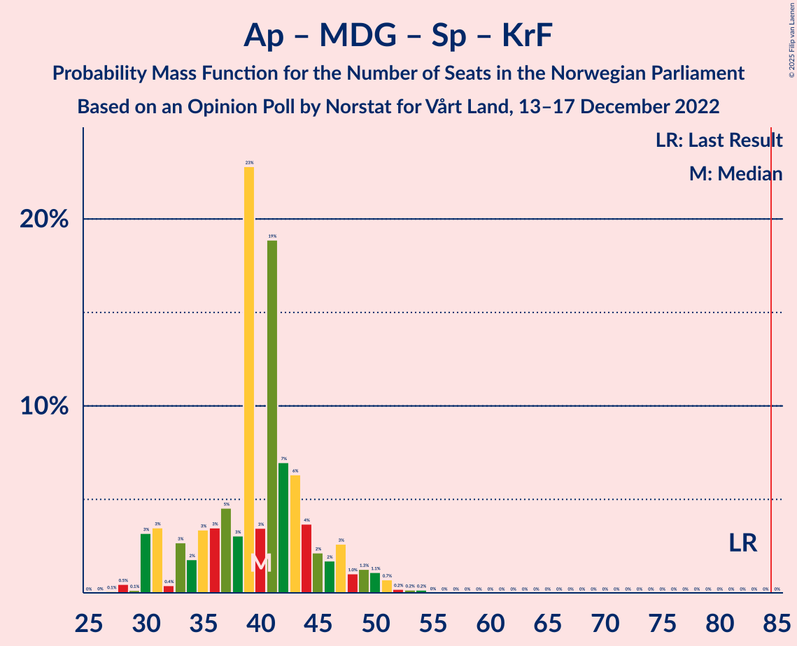

# Opinion Poll by Norstat for Vårt Land, 13–17 December 2022

<a href="#voting-intentions">Voting Intentions</a> | <a href="#seats">Seats</a> | <a href="#coalitions">Coalitions</a> | <a href="#technical-information">Technical Information</a>

## Voting Intentions

### Confidence Intervals

| Party | Last Result | Poll Result | 80% Confidence Interval | 90% Confidence Interval | 95% Confidence Interval | 99% Confidence Interval |
|:-----:|:-----------:|:-----------:|:-----------------------:|:-----------------------:|:-----------------------:|:-----------------------:|
| Høyre | 20.4% | 35.6% | 33.6–37.6% |33.1–38.2% |32.6–38.7% |31.7–39.7% |
| Arbeiderpartiet | 26.2% | 14.6% | 13.2–16.1% |12.8–16.6% |12.5–17.0% |11.8–17.7% |
| Fremskrittspartiet | 11.6% | 14.1% | 12.8–15.7% |12.4–16.1% |12.1–16.5% |11.4–17.3% |
| Sosialistisk Venstreparti | 7.6% | 8.8% | 7.7–10.1% |7.4–10.4% |7.1–10.7% |6.6–11.4% |
| Rødt | 4.7% | 7.7% | 6.7–8.9% |6.4–9.3% |6.2–9.6% |5.7–10.2% |
| Venstre | 4.6% | 4.2% | 3.5–5.2% |3.3–5.5% |3.1–5.7% |2.8–6.2% |
| Miljøpartiet De Grønne | 3.9% | 4.1% | 3.4–5.1% |3.2–5.3% |3.0–5.6% |2.7–6.1% |
| Senterpartiet | 13.5% | 3.8% | 3.1–4.7% |2.9–5.0% |2.8–5.2% |2.5–5.7% |
| Kristelig Folkeparti | 3.8% | 3.1% | 2.5–3.9% |2.3–4.2% |2.1–4.4% |1.9–4.8% |
| Industri- og Næringspartiet | 0.3% | 1.9% | 1.4–2.6% |1.3–2.8% |1.2–3.0% |1.0–3.4% |

*Note:* The poll result column reflects the actual value used in the calculations. Published results may vary slightly, and in addition be rounded to fewer digits.

## Seats

### Confidence Intervals

| Party | Last Result | Median | 80% Confidence Interval | 90% Confidence Interval | 95% Confidence Interval | 99% Confidence Interval |
|:-----:|:-----------:|:------:|:-----------------------:|:-----------------------:|:-----------------------:|:-----------------------:|
| <a href="#høyre">Høyre</a> | 36 | 65 | 61–71 |59–72 |58–73 |54–74 |
| <a href="#arbeiderpartiet">Arbeiderpartiet</a> | 48 | 29 | 26–32 |24–32 |23–33 |21–34 |
| <a href="#fremskrittspartiet">Fremskrittspartiet</a> | 21 | 27 | 23–30 |22–31 |21–32 |20–34 |
| <a href="#sosialistisk-venstreparti">Sosialistisk Venstreparti</a> | 13 | 16 | 13–18 |12–19 |12–20 |11–21 |
| <a href="#rødt">Rødt</a> | 8 | 14 | 11–16 |11–17 |11–18 |9–19 |
| <a href="#venstre">Venstre</a> | 8 | 7 | 2–9 |2–10 |2–10 |2–11 |
| <a href="#miljøpartiet-de-grønne">Miljøpartiet De Grønne</a> | 3 | 7 | 2–9 |2–9 |1–10 |1–11 |
| <a href="#senterpartiet">Senterpartiet</a> | 28 | 1 | 0–9 |0–9 |0–9 |0–10 |
| <a href="#kristelig-folkeparti">Kristelig Folkeparti</a> | 3 | 2 | 0–3 |0–7 |0–7 |0–8 |
| <a href="#industri--og-næringspartiet">Industri- og Næringspartiet</a> | 0 | 0 | 0 |0–1 |0–2 |0–3 |

### Høyre

*For a full overview of the results for this party, see the [Høyre](party-høyre.html) page.*

| Number of Seats | Probability | Accumulated | Special Marks |
|:---------------:|:-----------:|:-----------:|:-------------:|
| 36 | 0% | 100% | Last Result |
| 37 | 0% | 100% |  |
| 38 | 0% | 100% |  |
| 39 | 0% | 100% |  |
| 40 | 0% | 100% |  |
| 41 | 0% | 100% |  |
| 42 | 0% | 100% |  |
| 43 | 0% | 100% |  |
| 44 | 0% | 100% |  |
| 45 | 0% | 100% |  |
| 46 | 0% | 100% |  |
| 47 | 0% | 100% |  |
| 48 | 0% | 100% |  |
| 49 | 0% | 100% |  |
| 50 | 0% | 100% |  |
| 51 | 0% | 100% |  |
| 52 | 0% | 100% |  |
| 53 | 0.5% | 100% |  |
| 54 | 0.1% | 99.5% |  |
| 55 | 0.4% | 99.4% |  |
| 56 | 0.3% | 99.1% |  |
| 57 | 0.5% | 98.8% |  |
| 58 | 1.4% | 98% |  |
| 59 | 2% | 97% |  |
| 60 | 2% | 95% |  |
| 61 | 5% | 93% |  |
| 62 | 4% | 87% |  |
| 63 | 3% | 84% |  |
| 64 | 15% | 81% |  |
| 65 | 23% | 66% | Median |
| 66 | 10% | 43% |  |
| 67 | 5% | 32% |  |
| 68 | 3% | 28% |  |
| 69 | 8% | 25% |  |
| 70 | 5% | 17% |  |
| 71 | 5% | 13% |  |
| 72 | 3% | 7% |  |
| 73 | 3% | 4% |  |
| 74 | 0.4% | 0.9% |  |
| 75 | 0.3% | 0.4% |  |
| 76 | 0.1% | 0.1% |  |
| 77 | 0% | 0% |  |

### Arbeiderpartiet

*For a full overview of the results for this party, see the [Arbeiderpartiet](party-arbeiderpartiet.html) page.*

| Number of Seats | Probability | Accumulated | Special Marks |
|:---------------:|:-----------:|:-----------:|:-------------:|
| 20 | 0.1% | 100% |  |
| 21 | 0.8% | 99.9% |  |
| 22 | 1.1% | 99.1% |  |
| 23 | 2% | 98% |  |
| 24 | 3% | 96% |  |
| 25 | 3% | 94% |  |
| 26 | 4% | 90% |  |
| 27 | 8% | 86% |  |
| 28 | 21% | 79% |  |
| 29 | 15% | 58% | Median |
| 30 | 11% | 42% |  |
| 31 | 14% | 32% |  |
| 32 | 14% | 18% |  |
| 33 | 3% | 4% |  |
| 34 | 0.8% | 1.3% |  |
| 35 | 0.3% | 0.5% |  |
| 36 | 0.1% | 0.1% |  |
| 37 | 0% | 0.1% |  |
| 38 | 0% | 0% |  |
| 39 | 0% | 0% |  |
| 40 | 0% | 0% |  |
| 41 | 0% | 0% |  |
| 42 | 0% | 0% |  |
| 43 | 0% | 0% |  |
| 44 | 0% | 0% |  |
| 45 | 0% | 0% |  |
| 46 | 0% | 0% |  |
| 47 | 0% | 0% |  |
| 48 | 0% | 0% | Last Result |

### Fremskrittspartiet

*For a full overview of the results for this party, see the [Fremskrittspartiet](party-fremskrittspartiet.html) page.*

| Number of Seats | Probability | Accumulated | Special Marks |
|:---------------:|:-----------:|:-----------:|:-------------:|
| 18 | 0.1% | 100% |  |
| 19 | 0.2% | 99.9% |  |
| 20 | 1.1% | 99.7% |  |
| 21 | 3% | 98.6% | Last Result |
| 22 | 3% | 96% |  |
| 23 | 5% | 93% |  |
| 24 | 15% | 88% |  |
| 25 | 9% | 73% |  |
| 26 | 11% | 63% |  |
| 27 | 10% | 53% | Median |
| 28 | 23% | 42% |  |
| 29 | 7% | 20% |  |
| 30 | 4% | 12% |  |
| 31 | 4% | 8% |  |
| 32 | 2% | 3% |  |
| 33 | 0.9% | 1.4% |  |
| 34 | 0.4% | 0.5% |  |
| 35 | 0.1% | 0.1% |  |
| 36 | 0% | 0% |  |

### Sosialistisk Venstreparti

*For a full overview of the results for this party, see the [Sosialistisk Venstreparti](party-sosialistiskvenstreparti.html) page.*

| Number of Seats | Probability | Accumulated | Special Marks |
|:---------------:|:-----------:|:-----------:|:-------------:|
| 10 | 0.3% | 100% |  |
| 11 | 2% | 99.6% |  |
| 12 | 4% | 98% |  |
| 13 | 5% | 94% | Last Result |
| 14 | 24% | 89% |  |
| 15 | 11% | 65% |  |
| 16 | 15% | 54% | Median |
| 17 | 22% | 40% |  |
| 18 | 8% | 17% |  |
| 19 | 6% | 9% |  |
| 20 | 3% | 4% |  |
| 21 | 0.7% | 1.1% |  |
| 22 | 0.4% | 0.4% |  |
| 23 | 0% | 0.1% |  |
| 24 | 0% | 0% |  |

### Rødt

*For a full overview of the results for this party, see the [Rødt](party-rødt.html) page.*

| Number of Seats | Probability | Accumulated | Special Marks |
|:---------------:|:-----------:|:-----------:|:-------------:|
| 8 | 0% | 100% | Last Result |
| 9 | 0.5% | 100% |  |
| 10 | 2% | 99.5% |  |
| 11 | 8% | 98% |  |
| 12 | 7% | 90% |  |
| 13 | 22% | 82% |  |
| 14 | 24% | 60% | Median |
| 15 | 23% | 37% |  |
| 16 | 6% | 14% |  |
| 17 | 3% | 7% |  |
| 18 | 4% | 4% |  |
| 19 | 0.2% | 0.5% |  |
| 20 | 0.3% | 0.3% |  |
| 21 | 0% | 0% |  |

### Venstre

*For a full overview of the results for this party, see the [Venstre](party-venstre.html) page.*

| Number of Seats | Probability | Accumulated | Special Marks |
|:---------------:|:-----------:|:-----------:|:-------------:|
| 2 | 20% | 100% |  |
| 3 | 8% | 80% |  |
| 4 | 0% | 72% |  |
| 5 | 0% | 72% |  |
| 6 | 2% | 72% |  |
| 7 | 25% | 70% | Median |
| 8 | 28% | 44% | Last Result |
| 9 | 10% | 16% |  |
| 10 | 5% | 6% |  |
| 11 | 0.9% | 1.0% |  |
| 12 | 0.1% | 0.1% |  |
| 13 | 0% | 0% |  |

### Miljøpartiet De Grønne

*For a full overview of the results for this party, see the [Miljøpartiet De Grønne](party-miljøpartietdegrønne.html) page.*

| Number of Seats | Probability | Accumulated | Special Marks |
|:---------------:|:-----------:|:-----------:|:-------------:|
| 1 | 4% | 100% |  |
| 2 | 35% | 96% |  |
| 3 | 4% | 61% | Last Result |
| 4 | 0% | 58% |  |
| 5 | 0% | 58% |  |
| 6 | 1.2% | 58% |  |
| 7 | 10% | 56% | Median |
| 8 | 33% | 46% |  |
| 9 | 9% | 13% |  |
| 10 | 3% | 4% |  |
| 11 | 0.9% | 1.1% |  |
| 12 | 0.1% | 0.2% |  |
| 13 | 0% | 0% |  |

### Senterpartiet

*For a full overview of the results for this party, see the [Senterpartiet](party-senterpartiet.html) page.*

| Number of Seats | Probability | Accumulated | Special Marks |
|:---------------:|:-----------:|:-----------:|:-------------:|
| 0 | 39% | 100% |  |
| 1 | 24% | 61% | Median |
| 2 | 0.8% | 37% |  |
| 3 | 0% | 36% |  |
| 4 | 0% | 36% |  |
| 5 | 0% | 36% |  |
| 6 | 2% | 36% |  |
| 7 | 9% | 34% |  |
| 8 | 13% | 26% |  |
| 9 | 11% | 13% |  |
| 10 | 1.4% | 2% |  |
| 11 | 0.2% | 0.2% |  |
| 12 | 0% | 0% |  |
| 13 | 0% | 0% |  |
| 14 | 0% | 0% |  |
| 15 | 0% | 0% |  |
| 16 | 0% | 0% |  |
| 17 | 0% | 0% |  |
| 18 | 0% | 0% |  |
| 19 | 0% | 0% |  |
| 20 | 0% | 0% |  |
| 21 | 0% | 0% |  |
| 22 | 0% | 0% |  |
| 23 | 0% | 0% |  |
| 24 | 0% | 0% |  |
| 25 | 0% | 0% |  |
| 26 | 0% | 0% |  |
| 27 | 0% | 0% |  |
| 28 | 0% | 0% | Last Result |

### Kristelig Folkeparti

*For a full overview of the results for this party, see the [Kristelig Folkeparti](party-kristeligfolkeparti.html) page.*

| Number of Seats | Probability | Accumulated | Special Marks |
|:---------------:|:-----------:|:-----------:|:-------------:|
| 0 | 13% | 100% |  |
| 1 | 23% | 87% |  |
| 2 | 41% | 65% | Median |
| 3 | 16% | 24% | Last Result |
| 4 | 0% | 8% |  |
| 5 | 0% | 8% |  |
| 6 | 0.2% | 8% |  |
| 7 | 6% | 7% |  |
| 8 | 2% | 2% |  |
| 9 | 0.2% | 0.2% |  |
| 10 | 0% | 0% |  |

### Industri- og Næringspartiet

*For a full overview of the results for this party, see the [Industri- og Næringspartiet](party-industri-ognæringspartiet.html) page.*

| Number of Seats | Probability | Accumulated | Special Marks |
|:---------------:|:-----------:|:-----------:|:-------------:|
| 0 | 91% | 100% | Last Result, Median |
| 1 | 5% | 9% |  |
| 2 | 3% | 4% |  |
| 3 | 0.7% | 0.8% |  |
| 4 | 0% | 0% |  |

## Coalitions

### Confidence Intervals

| Coalition | Last Result | Median | Majority? | 80% Confidence Interval | 90% Confidence Interval | 95% Confidence Interval | 99% Confidence Interval |
|:---------:|:-----------:|:------:|:---------:|:-----------------------:|:-----------------------:|:-----------------------:|:-----------------------:|
| Høyre – Fremskrittspartiet – Venstre – Miljøpartiet De Grønne – Kristelig Folkeparti | 71 | 107 | 100% | 99–110 | 99–112 | 98–115 | 96–116 |
| Høyre – Fremskrittspartiet – Venstre – Senterpartiet – Kristelig Folkeparti | 96 | 103 | 100% | 99–109 | 97–111 | 96–113 | 93–115 |
| Høyre – Fremskrittspartiet – Venstre – Kristelig Folkeparti | 68 | 101 | 100% | 96–106 | 94–108 | 92–108 | 90–111 |
| Høyre – Fremskrittspartiet – Venstre | 65 | 99 | 100% | 94–103 | 92–105 | 90–106 | 87–108 |
| Høyre – Fremskrittspartiet | 57 | 93 | 98% | 88–97 | 86–99 | 85–101 | 82–102 |
| Høyre – Venstre – Kristelig Folkeparti | 47 | 74 | 1.0% | 69–79 | 67–81 | 65–82 | 63–87 |
| Arbeiderpartiet – Sosialistisk Venstreparti – Rødt – Miljøpartiet De Grønne – Senterpartiet | 100 | 67 | 0% | 62–72 | 60–74 | 60–76 | 57–78 |
| Arbeiderpartiet – Sosialistisk Venstreparti – Rødt – Miljøpartiet De Grønne | 72 | 65 | 0% | 59–69 | 57–71 | 56–72 | 53–74 |
| Arbeiderpartiet – Sosialistisk Venstreparti – Rødt – Senterpartiet | 97 | 61 | 0% | 58–69 | 56–69 | 54–69 | 52–71 |
| Arbeiderpartiet – Sosialistisk Venstreparti – Miljøpartiet De Grønne – Senterpartiet – Kristelig Folkeparti | 95 | 55 | 0% | 50–60 | 48–62 | 47–65 | 46–67 |
| Arbeiderpartiet – Sosialistisk Venstreparti – Miljøpartiet De Grønne – Senterpartiet | 92 | 53 | 0% | 48–59 | 46–60 | 45–63 | 44–65 |
| Arbeiderpartiet – Sosialistisk Venstreparti – Senterpartiet | 89 | 47 | 0% | 43–55 | 42–55 | 42–56 | 40–58 |
| Arbeiderpartiet – Sosialistisk Venstreparti | 61 | 45 | 0% | 41–49 | 39–50 | 38–51 | 36–52 |
| Arbeiderpartiet – Miljøpartiet De Grønne – Senterpartiet – Kristelig Folkeparti | 82 | 40 | 0% | 33–45 | 31–47 | 30–49 | 28–52 |
| Arbeiderpartiet – Senterpartiet – Kristelig Folkeparti | 79 | 33 | 0% | 29–40 | 28–42 | 28–42 | 26–45 |
| Arbeiderpartiet – Senterpartiet | 76 | 31 | 0% | 27–39 | 26–40 | 25–40 | 23–41 |
| Venstre – Senterpartiet – Kristelig Folkeparti | 39 | 11 | 0% | 5–18 | 4–19 | 3–20 | 2–22 |

### Høyre – Fremskrittspartiet – Venstre – Miljøpartiet De Grønne – Kristelig Folkeparti

| Number of Seats | Probability | Accumulated | Special Marks |
|:---------------:|:-----------:|:-----------:|:-------------:|
| 71 | 0% | 100% | Last Result |
| 72 | 0% | 100% |  |
| 73 | 0% | 100% |  |
| 74 | 0% | 100% |  |
| 75 | 0% | 100% |  |
| 76 | 0% | 100% |  |
| 77 | 0% | 100% |  |
| 78 | 0% | 100% |  |
| 79 | 0% | 100% |  |
| 80 | 0% | 100% |  |
| 81 | 0% | 100% |  |
| 82 | 0% | 100% |  |
| 83 | 0% | 100% |  |
| 84 | 0% | 100% |  |
| 85 | 0% | 100% | Majority |
| 86 | 0% | 100% |  |
| 87 | 0% | 100% |  |
| 88 | 0% | 100% |  |
| 89 | 0% | 100% |  |
| 90 | 0% | 100% |  |
| 91 | 0% | 100% |  |
| 92 | 0% | 100% |  |
| 93 | 0.1% | 100% |  |
| 94 | 0.1% | 99.9% |  |
| 95 | 0.1% | 99.8% |  |
| 96 | 0.2% | 99.7% |  |
| 97 | 0.4% | 99.5% |  |
| 98 | 2% | 99.1% |  |
| 99 | 13% | 97% |  |
| 100 | 2% | 84% |  |
| 101 | 2% | 82% |  |
| 102 | 4% | 79% |  |
| 103 | 4% | 76% |  |
| 104 | 5% | 72% |  |
| 105 | 6% | 67% |  |
| 106 | 6% | 62% |  |
| 107 | 7% | 56% |  |
| 108 | 13% | 49% | Median |
| 109 | 7% | 36% |  |
| 110 | 21% | 29% |  |
| 111 | 3% | 8% |  |
| 112 | 1.2% | 5% |  |
| 113 | 1.3% | 4% |  |
| 114 | 0.5% | 3% |  |
| 115 | 2% | 3% |  |
| 116 | 0.5% | 0.9% |  |
| 117 | 0.4% | 0.5% |  |
| 118 | 0% | 0.1% |  |
| 119 | 0% | 0% |  |

### Høyre – Fremskrittspartiet – Venstre – Senterpartiet – Kristelig Folkeparti

| Number of Seats | Probability | Accumulated | Special Marks |
|:---------------:|:-----------:|:-----------:|:-------------:|
| 91 | 0% | 100% |  |
| 92 | 0.1% | 99.9% |  |
| 93 | 0.4% | 99.8% |  |
| 94 | 0.8% | 99.4% |  |
| 95 | 1.0% | 98.6% |  |
| 96 | 1.2% | 98% | Last Result |
| 97 | 2% | 96% |  |
| 98 | 2% | 94% |  |
| 99 | 7% | 92% |  |
| 100 | 8% | 85% |  |
| 101 | 5% | 77% |  |
| 102 | 6% | 72% | Median |
| 103 | 20% | 66% |  |
| 104 | 4% | 46% |  |
| 105 | 8% | 42% |  |
| 106 | 14% | 34% |  |
| 107 | 3% | 20% |  |
| 108 | 6% | 17% |  |
| 109 | 2% | 12% |  |
| 110 | 2% | 9% |  |
| 111 | 4% | 7% |  |
| 112 | 0.5% | 3% |  |
| 113 | 1.0% | 3% |  |
| 114 | 0.6% | 2% |  |
| 115 | 0.5% | 1.0% |  |
| 116 | 0.1% | 0.5% |  |
| 117 | 0.3% | 0.4% |  |
| 118 | 0% | 0.1% |  |
| 119 | 0% | 0.1% |  |
| 120 | 0% | 0% |  |

### Høyre – Fremskrittspartiet – Venstre – Kristelig Folkeparti

| Number of Seats | Probability | Accumulated | Special Marks |
|:---------------:|:-----------:|:-----------:|:-------------:|
| 68 | 0% | 100% | Last Result |
| 69 | 0% | 100% |  |
| 70 | 0% | 100% |  |
| 71 | 0% | 100% |  |
| 72 | 0% | 100% |  |
| 73 | 0% | 100% |  |
| 74 | 0% | 100% |  |
| 75 | 0% | 100% |  |
| 76 | 0% | 100% |  |
| 77 | 0% | 100% |  |
| 78 | 0% | 100% |  |
| 79 | 0% | 100% |  |
| 80 | 0% | 100% |  |
| 81 | 0% | 100% |  |
| 82 | 0% | 100% |  |
| 83 | 0% | 100% |  |
| 84 | 0% | 100% |  |
| 85 | 0% | 100% | Majority |
| 86 | 0% | 100% |  |
| 87 | 0% | 100% |  |
| 88 | 0.1% | 99.9% |  |
| 89 | 0% | 99.9% |  |
| 90 | 0.8% | 99.8% |  |
| 91 | 0.5% | 99.0% |  |
| 92 | 1.3% | 98.5% |  |
| 93 | 2% | 97% |  |
| 94 | 2% | 96% |  |
| 95 | 3% | 93% |  |
| 96 | 3% | 91% |  |
| 97 | 15% | 87% |  |
| 98 | 2% | 72% |  |
| 99 | 7% | 70% |  |
| 100 | 10% | 63% |  |
| 101 | 5% | 53% | Median |
| 102 | 24% | 48% |  |
| 103 | 3% | 24% |  |
| 104 | 6% | 21% |  |
| 105 | 2% | 15% |  |
| 106 | 5% | 13% |  |
| 107 | 2% | 8% |  |
| 108 | 4% | 6% |  |
| 109 | 0.6% | 2% |  |
| 110 | 0.6% | 1.3% |  |
| 111 | 0.4% | 0.7% |  |
| 112 | 0.1% | 0.3% |  |
| 113 | 0.1% | 0.2% |  |
| 114 | 0.1% | 0.2% |  |
| 115 | 0% | 0% |  |

### Høyre – Fremskrittspartiet – Venstre

| Number of Seats | Probability | Accumulated | Special Marks |
|:---------------:|:-----------:|:-----------:|:-------------:|
| 65 | 0% | 100% | Last Result |
| 66 | 0% | 100% |  |
| 67 | 0% | 100% |  |
| 68 | 0% | 100% |  |
| 69 | 0% | 100% |  |
| 70 | 0% | 100% |  |
| 71 | 0% | 100% |  |
| 72 | 0% | 100% |  |
| 73 | 0% | 100% |  |
| 74 | 0% | 100% |  |
| 75 | 0% | 100% |  |
| 76 | 0% | 100% |  |
| 77 | 0% | 100% |  |
| 78 | 0% | 100% |  |
| 79 | 0% | 100% |  |
| 80 | 0% | 100% |  |
| 81 | 0% | 100% |  |
| 82 | 0% | 100% |  |
| 83 | 0% | 100% |  |
| 84 | 0% | 100% |  |
| 85 | 0.2% | 100% | Majority |
| 86 | 0.1% | 99.8% |  |
| 87 | 0.2% | 99.7% |  |
| 88 | 0.7% | 99.4% |  |
| 89 | 0.8% | 98.8% |  |
| 90 | 1.4% | 98% |  |
| 91 | 1.2% | 97% |  |
| 92 | 2% | 95% |  |
| 93 | 3% | 93% |  |
| 94 | 3% | 91% |  |
| 95 | 6% | 88% |  |
| 96 | 18% | 82% |  |
| 97 | 4% | 64% |  |
| 98 | 6% | 60% |  |
| 99 | 7% | 54% | Median |
| 100 | 24% | 47% |  |
| 101 | 4% | 23% |  |
| 102 | 5% | 20% |  |
| 103 | 5% | 15% |  |
| 104 | 4% | 10% |  |
| 105 | 1.5% | 6% |  |
| 106 | 2% | 4% |  |
| 107 | 0.3% | 2% |  |
| 108 | 2% | 2% |  |
| 109 | 0.2% | 0.4% |  |
| 110 | 0.1% | 0.1% |  |
| 111 | 0% | 0.1% |  |
| 112 | 0% | 0% |  |

### Høyre – Fremskrittspartiet

| Number of Seats | Probability | Accumulated | Special Marks |
|:---------------:|:-----------:|:-----------:|:-------------:|
| 57 | 0% | 100% | Last Result |
| 58 | 0% | 100% |  |
| 59 | 0% | 100% |  |
| 60 | 0% | 100% |  |
| 61 | 0% | 100% |  |
| 62 | 0% | 100% |  |
| 63 | 0% | 100% |  |
| 64 | 0% | 100% |  |
| 65 | 0% | 100% |  |
| 66 | 0% | 100% |  |
| 67 | 0% | 100% |  |
| 68 | 0% | 100% |  |
| 69 | 0% | 100% |  |
| 70 | 0% | 100% |  |
| 71 | 0% | 100% |  |
| 72 | 0% | 100% |  |
| 73 | 0% | 100% |  |
| 74 | 0% | 100% |  |
| 75 | 0% | 100% |  |
| 76 | 0% | 100% |  |
| 77 | 0% | 100% |  |
| 78 | 0% | 100% |  |
| 79 | 0.1% | 100% |  |
| 80 | 0% | 99.9% |  |
| 81 | 0.3% | 99.9% |  |
| 82 | 0.4% | 99.6% |  |
| 83 | 0.9% | 99.1% |  |
| 84 | 0.4% | 98% |  |
| 85 | 1.4% | 98% | Majority |
| 86 | 3% | 96% |  |
| 87 | 3% | 93% |  |
| 88 | 11% | 90% |  |
| 89 | 6% | 79% |  |
| 90 | 6% | 73% |  |
| 91 | 4% | 67% |  |
| 92 | 10% | 63% | Median |
| 93 | 23% | 53% |  |
| 94 | 8% | 31% |  |
| 95 | 3% | 22% |  |
| 96 | 6% | 19% |  |
| 97 | 4% | 13% |  |
| 98 | 1.4% | 9% |  |
| 99 | 3% | 7% |  |
| 100 | 1.2% | 4% |  |
| 101 | 2% | 3% |  |
| 102 | 0.3% | 0.6% |  |
| 103 | 0.1% | 0.3% |  |
| 104 | 0% | 0.1% |  |
| 105 | 0% | 0.1% |  |
| 106 | 0.1% | 0.1% |  |
| 107 | 0% | 0% |  |

### Høyre – Venstre – Kristelig Folkeparti

| Number of Seats | Probability | Accumulated | Special Marks |
|:---------------:|:-----------:|:-----------:|:-------------:|
| 47 | 0% | 100% | Last Result |
| 48 | 0% | 100% |  |
| 49 | 0% | 100% |  |
| 50 | 0% | 100% |  |
| 51 | 0% | 100% |  |
| 52 | 0% | 100% |  |
| 53 | 0% | 100% |  |
| 54 | 0% | 100% |  |
| 55 | 0% | 100% |  |
| 56 | 0% | 100% |  |
| 57 | 0% | 100% |  |
| 58 | 0% | 100% |  |
| 59 | 0% | 100% |  |
| 60 | 0% | 100% |  |
| 61 | 0.1% | 99.9% |  |
| 62 | 0.4% | 99.9% |  |
| 63 | 0.2% | 99.5% |  |
| 64 | 1.4% | 99.3% |  |
| 65 | 2% | 98% |  |
| 66 | 0.9% | 96% |  |
| 67 | 0.7% | 95% |  |
| 68 | 3% | 95% |  |
| 69 | 3% | 92% |  |
| 70 | 2% | 89% |  |
| 71 | 5% | 87% |  |
| 72 | 5% | 82% |  |
| 73 | 21% | 76% |  |
| 74 | 21% | 56% | Median |
| 75 | 4% | 35% |  |
| 76 | 10% | 31% |  |
| 77 | 5% | 21% |  |
| 78 | 3% | 16% |  |
| 79 | 4% | 13% |  |
| 80 | 1.0% | 9% |  |
| 81 | 5% | 8% |  |
| 82 | 0.7% | 3% |  |
| 83 | 0.8% | 2% |  |
| 84 | 0.6% | 2% |  |
| 85 | 0.3% | 1.0% | Majority |
| 86 | 0% | 0.7% |  |
| 87 | 0.5% | 0.7% |  |
| 88 | 0.1% | 0.1% |  |
| 89 | 0% | 0% |  |

### Arbeiderpartiet – Sosialistisk Venstreparti – Rødt – Miljøpartiet De Grønne – Senterpartiet

| Number of Seats | Probability | Accumulated | Special Marks |
|:---------------:|:-----------:|:-----------:|:-------------:|
| 55 | 0.2% | 100% |  |
| 56 | 0.1% | 99.8% |  |
| 57 | 0.3% | 99.7% |  |
| 58 | 0.7% | 99.3% |  |
| 59 | 0.5% | 98.6% |  |
| 60 | 4% | 98% |  |
| 61 | 2% | 94% |  |
| 62 | 6% | 92% |  |
| 63 | 2% | 86% |  |
| 64 | 5% | 84% |  |
| 65 | 3% | 78% |  |
| 66 | 23% | 75% |  |
| 67 | 6% | 52% | Median |
| 68 | 11% | 46% |  |
| 69 | 6% | 35% |  |
| 70 | 3% | 29% |  |
| 71 | 14% | 26% |  |
| 72 | 4% | 12% |  |
| 73 | 2% | 8% |  |
| 74 | 2% | 6% |  |
| 75 | 2% | 4% |  |
| 76 | 1.3% | 3% |  |
| 77 | 0.6% | 1.4% |  |
| 78 | 0.6% | 0.8% |  |
| 79 | 0.1% | 0.2% |  |
| 80 | 0.1% | 0.1% |  |
| 81 | 0% | 0.1% |  |
| 82 | 0% | 0% |  |
| 83 | 0% | 0% |  |
| 84 | 0% | 0% |  |
| 85 | 0% | 0% | Majority |
| 86 | 0% | 0% |  |
| 87 | 0% | 0% |  |
| 88 | 0% | 0% |  |
| 89 | 0% | 0% |  |
| 90 | 0% | 0% |  |
| 91 | 0% | 0% |  |
| 92 | 0% | 0% |  |
| 93 | 0% | 0% |  |
| 94 | 0% | 0% |  |
| 95 | 0% | 0% |  |
| 96 | 0% | 0% |  |
| 97 | 0% | 0% |  |
| 98 | 0% | 0% |  |
| 99 | 0% | 0% |  |
| 100 | 0% | 0% | Last Result |

### Arbeiderpartiet – Sosialistisk Venstreparti – Rødt – Miljøpartiet De Grønne

| Number of Seats | Probability | Accumulated | Special Marks |
|:---------------:|:-----------:|:-----------:|:-------------:|
| 50 | 0% | 100% |  |
| 51 | 0.4% | 99.9% |  |
| 52 | 0% | 99.6% |  |
| 53 | 0.5% | 99.5% |  |
| 54 | 0.6% | 99.0% |  |
| 55 | 0.7% | 98% |  |
| 56 | 1.0% | 98% |  |
| 57 | 4% | 97% |  |
| 58 | 2% | 93% |  |
| 59 | 3% | 90% |  |
| 60 | 6% | 88% |  |
| 61 | 3% | 82% |  |
| 62 | 16% | 79% |  |
| 63 | 8% | 64% |  |
| 64 | 3% | 56% |  |
| 65 | 20% | 53% |  |
| 66 | 6% | 34% | Median |
| 67 | 6% | 28% |  |
| 68 | 10% | 22% |  |
| 69 | 5% | 12% |  |
| 70 | 1.5% | 7% |  |
| 71 | 2% | 5% |  |
| 72 | 1.1% | 3% | Last Result |
| 73 | 0.9% | 2% |  |
| 74 | 0.8% | 1.2% |  |
| 75 | 0.4% | 0.5% |  |
| 76 | 0.1% | 0.1% |  |
| 77 | 0% | 0.1% |  |
| 78 | 0% | 0% |  |

### Arbeiderpartiet – Sosialistisk Venstreparti – Rødt – Senterpartiet

| Number of Seats | Probability | Accumulated | Special Marks |
|:---------------:|:-----------:|:-----------:|:-------------:|
| 50 | 0% | 100% |  |
| 51 | 0.4% | 99.9% |  |
| 52 | 0.3% | 99.5% |  |
| 53 | 2% | 99.3% |  |
| 54 | 0.9% | 98% |  |
| 55 | 0.9% | 97% |  |
| 56 | 2% | 96% |  |
| 57 | 2% | 94% |  |
| 58 | 21% | 92% |  |
| 59 | 10% | 71% |  |
| 60 | 10% | 61% | Median |
| 61 | 7% | 51% |  |
| 62 | 6% | 43% |  |
| 63 | 5% | 37% |  |
| 64 | 5% | 32% |  |
| 65 | 4% | 27% |  |
| 66 | 3% | 23% |  |
| 67 | 2% | 20% |  |
| 68 | 3% | 18% |  |
| 69 | 13% | 15% |  |
| 70 | 1.4% | 2% |  |
| 71 | 0.4% | 0.8% |  |
| 72 | 0.1% | 0.4% |  |
| 73 | 0.1% | 0.3% |  |
| 74 | 0.1% | 0.2% |  |
| 75 | 0.1% | 0.1% |  |
| 76 | 0% | 0% |  |
| 77 | 0% | 0% |  |
| 78 | 0% | 0% |  |
| 79 | 0% | 0% |  |
| 80 | 0% | 0% |  |
| 81 | 0% | 0% |  |
| 82 | 0% | 0% |  |
| 83 | 0% | 0% |  |
| 84 | 0% | 0% |  |
| 85 | 0% | 0% | Majority |
| 86 | 0% | 0% |  |
| 87 | 0% | 0% |  |
| 88 | 0% | 0% |  |
| 89 | 0% | 0% |  |
| 90 | 0% | 0% |  |
| 91 | 0% | 0% |  |
| 92 | 0% | 0% |  |
| 93 | 0% | 0% |  |
| 94 | 0% | 0% |  |
| 95 | 0% | 0% |  |
| 96 | 0% | 0% |  |
| 97 | 0% | 0% | Last Result |

### Arbeiderpartiet – Sosialistisk Venstreparti – Miljøpartiet De Grønne – Senterpartiet – Kristelig Folkeparti

| Number of Seats | Probability | Accumulated | Special Marks |
|:---------------:|:-----------:|:-----------:|:-------------:|
| 44 | 0% | 100% |  |
| 45 | 0.1% | 99.9% |  |
| 46 | 0.7% | 99.8% |  |
| 47 | 3% | 99.1% |  |
| 48 | 1.1% | 96% |  |
| 49 | 2% | 95% |  |
| 50 | 4% | 92% |  |
| 51 | 3% | 88% |  |
| 52 | 4% | 85% |  |
| 53 | 18% | 81% |  |
| 54 | 5% | 63% |  |
| 55 | 10% | 58% | Median |
| 56 | 7% | 48% |  |
| 57 | 6% | 42% |  |
| 58 | 17% | 35% |  |
| 59 | 5% | 18% |  |
| 60 | 4% | 13% |  |
| 61 | 3% | 9% |  |
| 62 | 2% | 6% |  |
| 63 | 0.7% | 5% |  |
| 64 | 0.9% | 4% |  |
| 65 | 2% | 3% |  |
| 66 | 0.4% | 1.4% |  |
| 67 | 0.7% | 1.0% |  |
| 68 | 0.1% | 0.3% |  |
| 69 | 0.2% | 0.2% |  |
| 70 | 0% | 0% |  |
| 71 | 0% | 0% |  |
| 72 | 0% | 0% |  |
| 73 | 0% | 0% |  |
| 74 | 0% | 0% |  |
| 75 | 0% | 0% |  |
| 76 | 0% | 0% |  |
| 77 | 0% | 0% |  |
| 78 | 0% | 0% |  |
| 79 | 0% | 0% |  |
| 80 | 0% | 0% |  |
| 81 | 0% | 0% |  |
| 82 | 0% | 0% |  |
| 83 | 0% | 0% |  |
| 84 | 0% | 0% |  |
| 85 | 0% | 0% | Majority |
| 86 | 0% | 0% |  |
| 87 | 0% | 0% |  |
| 88 | 0% | 0% |  |
| 89 | 0% | 0% |  |
| 90 | 0% | 0% |  |
| 91 | 0% | 0% |  |
| 92 | 0% | 0% |  |
| 93 | 0% | 0% |  |
| 94 | 0% | 0% |  |
| 95 | 0% | 0% | Last Result |

### Arbeiderpartiet – Sosialistisk Venstreparti – Miljøpartiet De Grønne – Senterpartiet

| Number of Seats | Probability | Accumulated | Special Marks |
|:---------------:|:-----------:|:-----------:|:-------------:|
| 42 | 0.2% | 100% |  |
| 43 | 0.2% | 99.8% |  |
| 44 | 1.1% | 99.6% |  |
| 45 | 2% | 98% |  |
| 46 | 3% | 96% |  |
| 47 | 2% | 93% |  |
| 48 | 4% | 91% |  |
| 49 | 3% | 87% |  |
| 50 | 4% | 84% |  |
| 51 | 17% | 80% |  |
| 52 | 6% | 62% |  |
| 53 | 10% | 56% | Median |
| 54 | 3% | 46% |  |
| 55 | 12% | 43% |  |
| 56 | 5% | 31% |  |
| 57 | 13% | 27% |  |
| 58 | 4% | 14% |  |
| 59 | 4% | 10% |  |
| 60 | 2% | 6% |  |
| 61 | 0.6% | 4% |  |
| 62 | 0.7% | 3% |  |
| 63 | 1.5% | 3% |  |
| 64 | 0.5% | 1.2% |  |
| 65 | 0.3% | 0.7% |  |
| 66 | 0.4% | 0.4% |  |
| 67 | 0% | 0.1% |  |
| 68 | 0% | 0% |  |
| 69 | 0% | 0% |  |
| 70 | 0% | 0% |  |
| 71 | 0% | 0% |  |
| 72 | 0% | 0% |  |
| 73 | 0% | 0% |  |
| 74 | 0% | 0% |  |
| 75 | 0% | 0% |  |
| 76 | 0% | 0% |  |
| 77 | 0% | 0% |  |
| 78 | 0% | 0% |  |
| 79 | 0% | 0% |  |
| 80 | 0% | 0% |  |
| 81 | 0% | 0% |  |
| 82 | 0% | 0% |  |
| 83 | 0% | 0% |  |
| 84 | 0% | 0% |  |
| 85 | 0% | 0% | Majority |
| 86 | 0% | 0% |  |
| 87 | 0% | 0% |  |
| 88 | 0% | 0% |  |
| 89 | 0% | 0% |  |
| 90 | 0% | 0% |  |
| 91 | 0% | 0% |  |
| 92 | 0% | 0% | Last Result |

### Arbeiderpartiet – Sosialistisk Venstreparti – Senterpartiet

| Number of Seats | Probability | Accumulated | Special Marks |
|:---------------:|:-----------:|:-----------:|:-------------:|
| 37 | 0% | 100% |  |
| 38 | 0.1% | 99.9% |  |
| 39 | 0.1% | 99.8% |  |
| 40 | 0.5% | 99.7% |  |
| 41 | 0.9% | 99.1% |  |
| 42 | 6% | 98% |  |
| 43 | 18% | 93% |  |
| 44 | 3% | 75% |  |
| 45 | 9% | 71% |  |
| 46 | 10% | 62% | Median |
| 47 | 8% | 52% |  |
| 48 | 5% | 44% |  |
| 49 | 4% | 38% |  |
| 50 | 4% | 35% |  |
| 51 | 7% | 31% |  |
| 52 | 2% | 23% |  |
| 53 | 3% | 22% |  |
| 54 | 2% | 19% |  |
| 55 | 12% | 17% |  |
| 56 | 2% | 5% |  |
| 57 | 2% | 2% |  |
| 58 | 0.6% | 0.8% |  |
| 59 | 0% | 0.2% |  |
| 60 | 0.1% | 0.2% |  |
| 61 | 0% | 0% |  |
| 62 | 0% | 0% |  |
| 63 | 0% | 0% |  |
| 64 | 0% | 0% |  |
| 65 | 0% | 0% |  |
| 66 | 0% | 0% |  |
| 67 | 0% | 0% |  |
| 68 | 0% | 0% |  |
| 69 | 0% | 0% |  |
| 70 | 0% | 0% |  |
| 71 | 0% | 0% |  |
| 72 | 0% | 0% |  |
| 73 | 0% | 0% |  |
| 74 | 0% | 0% |  |
| 75 | 0% | 0% |  |
| 76 | 0% | 0% |  |
| 77 | 0% | 0% |  |
| 78 | 0% | 0% |  |
| 79 | 0% | 0% |  |
| 80 | 0% | 0% |  |
| 81 | 0% | 0% |  |
| 82 | 0% | 0% |  |
| 83 | 0% | 0% |  |
| 84 | 0% | 0% |  |
| 85 | 0% | 0% | Majority |
| 86 | 0% | 0% |  |
| 87 | 0% | 0% |  |
| 88 | 0% | 0% |  |
| 89 | 0% | 0% | Last Result |

### Arbeiderpartiet – Sosialistisk Venstreparti

| Number of Seats | Probability | Accumulated | Special Marks |
|:---------------:|:-----------:|:-----------:|:-------------:|
| 34 | 0% | 100% |  |
| 35 | 0.2% | 99.9% |  |
| 36 | 0.7% | 99.7% |  |
| 37 | 0.8% | 99.0% |  |
| 38 | 2% | 98% |  |
| 39 | 1.4% | 96% |  |
| 40 | 3% | 95% |  |
| 41 | 3% | 92% |  |
| 42 | 21% | 89% |  |
| 43 | 4% | 68% |  |
| 44 | 9% | 64% |  |
| 45 | 9% | 55% | Median |
| 46 | 19% | 46% |  |
| 47 | 12% | 27% |  |
| 48 | 5% | 15% |  |
| 49 | 3% | 11% |  |
| 50 | 4% | 8% |  |
| 51 | 4% | 4% |  |
| 52 | 0.3% | 0.6% |  |
| 53 | 0.2% | 0.3% |  |
| 54 | 0% | 0% |  |
| 55 | 0% | 0% |  |
| 56 | 0% | 0% |  |
| 57 | 0% | 0% |  |
| 58 | 0% | 0% |  |
| 59 | 0% | 0% |  |
| 60 | 0% | 0% |  |
| 61 | 0% | 0% | Last Result |

### Arbeiderpartiet – Miljøpartiet De Grønne – Senterpartiet – Kristelig Folkeparti

| Number of Seats | Probability | Accumulated | Special Marks |
|:---------------:|:-----------:|:-----------:|:-------------:|
| 27 | 0.1% | 100% |  |
| 28 | 0.5% | 99.9% |  |
| 29 | 0.1% | 99.4% |  |
| 30 | 3% | 99.3% |  |
| 31 | 3% | 96% |  |
| 32 | 0.4% | 93% |  |
| 33 | 3% | 92% |  |
| 34 | 2% | 90% |  |
| 35 | 3% | 88% |  |
| 36 | 3% | 84% |  |
| 37 | 5% | 81% |  |
| 38 | 3% | 76% |  |
| 39 | 23% | 73% | Median |
| 40 | 3% | 50% |  |
| 41 | 19% | 47% |  |
| 42 | 7% | 28% |  |
| 43 | 6% | 21% |  |
| 44 | 4% | 15% |  |
| 45 | 2% | 11% |  |
| 46 | 2% | 9% |  |
| 47 | 3% | 7% |  |
| 48 | 1.0% | 5% |  |
| 49 | 1.3% | 4% |  |
| 50 | 1.1% | 2% |  |
| 51 | 0.7% | 1.3% |  |
| 52 | 0.2% | 0.5% |  |
| 53 | 0.2% | 0.3% |  |
| 54 | 0.2% | 0.2% |  |
| 55 | 0% | 0% |  |
| 56 | 0% | 0% |  |
| 57 | 0% | 0% |  |
| 58 | 0% | 0% |  |
| 59 | 0% | 0% |  |
| 60 | 0% | 0% |  |
| 61 | 0% | 0% |  |
| 62 | 0% | 0% |  |
| 63 | 0% | 0% |  |
| 64 | 0% | 0% |  |
| 65 | 0% | 0% |  |
| 66 | 0% | 0% |  |
| 67 | 0% | 0% |  |
| 68 | 0% | 0% |  |
| 69 | 0% | 0% |  |
| 70 | 0% | 0% |  |
| 71 | 0% | 0% |  |
| 72 | 0% | 0% |  |
| 73 | 0% | 0% |  |
| 74 | 0% | 0% |  |
| 75 | 0% | 0% |  |
| 76 | 0% | 0% |  |
| 77 | 0% | 0% |  |
| 78 | 0% | 0% |  |
| 79 | 0% | 0% |  |
| 80 | 0% | 0% |  |
| 81 | 0% | 0% |  |
| 82 | 0% | 0% | Last Result |

### Arbeiderpartiet – Senterpartiet – Kristelig Folkeparti

| Number of Seats | Probability | Accumulated | Special Marks |
|:---------------:|:-----------:|:-----------:|:-------------:|
| 23 | 0.1% | 100% |  |
| 24 | 0% | 99.9% |  |
| 25 | 0.3% | 99.9% |  |
| 26 | 0.6% | 99.6% |  |
| 27 | 0.8% | 99.0% |  |
| 28 | 6% | 98% |  |
| 29 | 4% | 93% |  |
| 30 | 5% | 89% |  |
| 31 | 24% | 84% |  |
| 32 | 6% | 60% | Median |
| 33 | 5% | 54% |  |
| 34 | 7% | 48% |  |
| 35 | 7% | 42% |  |
| 36 | 3% | 35% |  |
| 37 | 1.1% | 32% |  |
| 38 | 3% | 31% |  |
| 39 | 16% | 28% |  |
| 40 | 3% | 12% |  |
| 41 | 3% | 9% |  |
| 42 | 4% | 6% |  |
| 43 | 0.7% | 2% |  |
| 44 | 0.6% | 1.1% |  |
| 45 | 0.1% | 0.5% |  |
| 46 | 0.4% | 0.4% |  |
| 47 | 0% | 0.1% |  |
| 48 | 0% | 0% |  |
| 49 | 0% | 0% |  |
| 50 | 0% | 0% |  |
| 51 | 0% | 0% |  |
| 52 | 0% | 0% |  |
| 53 | 0% | 0% |  |
| 54 | 0% | 0% |  |
| 55 | 0% | 0% |  |
| 56 | 0% | 0% |  |
| 57 | 0% | 0% |  |
| 58 | 0% | 0% |  |
| 59 | 0% | 0% |  |
| 60 | 0% | 0% |  |
| 61 | 0% | 0% |  |
| 62 | 0% | 0% |  |
| 63 | 0% | 0% |  |
| 64 | 0% | 0% |  |
| 65 | 0% | 0% |  |
| 66 | 0% | 0% |  |
| 67 | 0% | 0% |  |
| 68 | 0% | 0% |  |
| 69 | 0% | 0% |  |
| 70 | 0% | 0% |  |
| 71 | 0% | 0% |  |
| 72 | 0% | 0% |  |
| 73 | 0% | 0% |  |
| 74 | 0% | 0% |  |
| 75 | 0% | 0% |  |
| 76 | 0% | 0% |  |
| 77 | 0% | 0% |  |
| 78 | 0% | 0% |  |
| 79 | 0% | 0% | Last Result |

### Arbeiderpartiet – Senterpartiet

| Number of Seats | Probability | Accumulated | Special Marks |
|:---------------:|:-----------:|:-----------:|:-------------:|
| 21 | 0.1% | 100% |  |
| 22 | 0% | 99.9% |  |
| 23 | 0.4% | 99.9% |  |
| 24 | 0.8% | 99.5% |  |
| 25 | 2% | 98.7% |  |
| 26 | 3% | 97% |  |
| 27 | 6% | 94% |  |
| 28 | 5% | 88% |  |
| 29 | 22% | 83% |  |
| 30 | 2% | 60% | Median |
| 31 | 12% | 58% |  |
| 32 | 9% | 46% |  |
| 33 | 5% | 36% |  |
| 34 | 2% | 31% |  |
| 35 | 2% | 29% |  |
| 36 | 1.0% | 27% |  |
| 37 | 4% | 26% |  |
| 38 | 12% | 23% |  |
| 39 | 5% | 11% |  |
| 40 | 4% | 6% |  |
| 41 | 1.4% | 2% |  |
| 42 | 0.3% | 0.4% |  |
| 43 | 0% | 0.1% |  |
| 44 | 0% | 0% |  |
| 45 | 0% | 0% |  |
| 46 | 0% | 0% |  |
| 47 | 0% | 0% |  |
| 48 | 0% | 0% |  |
| 49 | 0% | 0% |  |
| 50 | 0% | 0% |  |
| 51 | 0% | 0% |  |
| 52 | 0% | 0% |  |
| 53 | 0% | 0% |  |
| 54 | 0% | 0% |  |
| 55 | 0% | 0% |  |
| 56 | 0% | 0% |  |
| 57 | 0% | 0% |  |
| 58 | 0% | 0% |  |
| 59 | 0% | 0% |  |
| 60 | 0% | 0% |  |
| 61 | 0% | 0% |  |
| 62 | 0% | 0% |  |
| 63 | 0% | 0% |  |
| 64 | 0% | 0% |  |
| 65 | 0% | 0% |  |
| 66 | 0% | 0% |  |
| 67 | 0% | 0% |  |
| 68 | 0% | 0% |  |
| 69 | 0% | 0% |  |
| 70 | 0% | 0% |  |
| 71 | 0% | 0% |  |
| 72 | 0% | 0% |  |
| 73 | 0% | 0% |  |
| 74 | 0% | 0% |  |
| 75 | 0% | 0% |  |
| 76 | 0% | 0% | Last Result |

### Venstre – Senterpartiet – Kristelig Folkeparti

| Number of Seats | Probability | Accumulated | Special Marks |
|:---------------:|:-----------:|:-----------:|:-------------:|
| 2 | 1.0% | 100% |  |
| 3 | 3% | 99.0% |  |
| 4 | 3% | 96% |  |
| 5 | 5% | 93% |  |
| 6 | 3% | 88% |  |
| 7 | 0.8% | 84% |  |
| 8 | 5% | 84% |  |
| 9 | 5% | 79% |  |
| 10 | 24% | 74% | Median |
| 11 | 9% | 50% |  |
| 12 | 9% | 41% |  |
| 13 | 3% | 33% |  |
| 14 | 3% | 30% |  |
| 15 | 2% | 27% |  |
| 16 | 3% | 25% |  |
| 17 | 5% | 22% |  |
| 18 | 10% | 17% |  |
| 19 | 3% | 7% |  |
| 20 | 2% | 4% |  |
| 21 | 2% | 2% |  |
| 22 | 0.2% | 0.7% |  |
| 23 | 0.1% | 0.5% |  |
| 24 | 0.3% | 0.3% |  |
| 25 | 0% | 0% |  |
| 26 | 0% | 0% |  |
| 27 | 0% | 0% |  |
| 28 | 0% | 0% |  |
| 29 | 0% | 0% |  |
| 30 | 0% | 0% |  |
| 31 | 0% | 0% |  |
| 32 | 0% | 0% |  |
| 33 | 0% | 0% |  |
| 34 | 0% | 0% |  |
| 35 | 0% | 0% |  |
| 36 | 0% | 0% |  |
| 37 | 0% | 0% |  |
| 38 | 0% | 0% |  |
| 39 | 0% | 0% | Last Result |

## Technical Information

### Opinion Poll

+ **Polling firm:** Norstat
+ **Commissioner(s):** Vårt Land
+ **Fieldwork period:** 13–17 December 2022

### Calculations

+ **Sample size:** 947
+ **Simulations done:** 1,048,576
+ **Error estimate:** 1.27%

