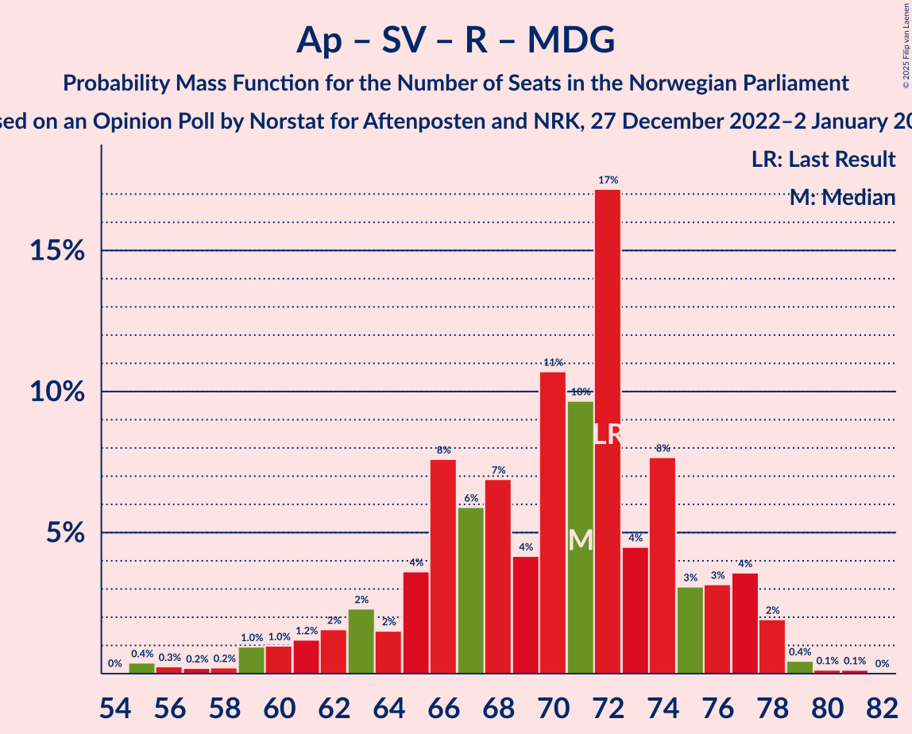
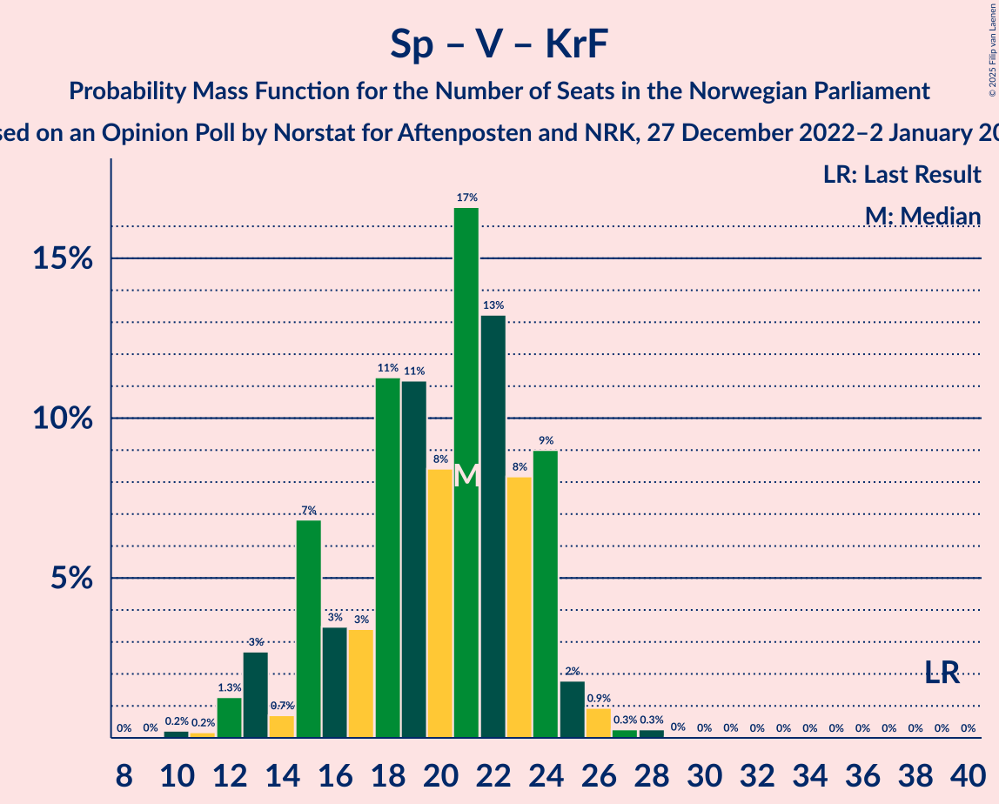

# Opinion Poll by Norstat for Aftenposten and NRK, 27 December 2022–2 January 2023

<a href="#voting-intentions">Voting Intentions</a> | <a href="#seats">Seats</a> | <a href="#coalitions">Coalitions</a> | <a href="#technical-information">Technical Information</a>

## Voting Intentions

### Confidence Intervals

| Party | Last Result | Poll Result | 80% Confidence Interval | 90% Confidence Interval | 95% Confidence Interval | 99% Confidence Interval |
|:-----:|:-----------:|:-----------:|:-----------------------:|:-----------------------:|:-----------------------:|:-----------------------:|
| Høyre | 20.4% | 30.9% | 29.0–32.9% |28.5–33.4% |28.0–33.9% |27.2–34.9% |
| Arbeiderpartiet | 26.2% | 19.4% | 17.8–21.1% |17.4–21.6% |17.0–22.0% |16.3–22.8% |
| Fremskrittspartiet | 11.6% | 11.9% | 10.7–13.4% |10.3–13.8% |10.0–14.2% |9.4–14.9% |
| Sosialistisk Venstreparti | 7.6% | 8.4% | 7.3–9.6% |7.0–10.0% |6.8–10.3% |6.3–10.9% |
| Senterpartiet | 13.5% | 5.9% | 5.0–7.0% |4.7–7.3% |4.5–7.5% |4.2–8.1% |
| Rødt | 4.7% | 5.4% | 4.6–6.5% |4.4–6.8% |4.2–7.1% |3.8–7.6% |
| Venstre | 4.6% | 5.1% | 4.3–6.2% |4.1–6.5% |3.9–6.7% |3.5–7.3% |
| Miljøpartiet De Grønne | 3.9% | 4.0% | 3.3–4.9% |3.1–5.2% |2.9–5.4% |2.6–5.9% |
| Kristelig Folkeparti | 3.8% | 2.6% | 2.1–3.4% |1.9–3.6% |1.8–3.8% |1.5–4.3% |
| Norgesdemokratene | 1.1% | 1.6% | 1.2–2.2% |1.1–2.4% |0.9–2.6% |0.8–2.9% |
| Industri- og Næringspartiet | 0.3% | 1.2% | 0.8–1.7% |0.7–1.9% |0.6–2.1% |0.5–2.4% |

*Note:* The poll result column reflects the actual value used in the calculations. Published results may vary slightly, and in addition be rounded to fewer digits.

## Seats

### Confidence Intervals

| Party | Last Result | Median | 80% Confidence Interval | 90% Confidence Interval | 95% Confidence Interval | 99% Confidence Interval |
|:-----:|:-----------:|:------:|:-----------------------:|:-----------------------:|:-----------------------:|:-----------------------:|
| <a href="#høyre">Høyre</a> | 36 | 52 | 50–60 |49–61 |49–63 |48–64 |
| <a href="#arbeiderpartiet">Arbeiderpartiet</a> | 48 | 39 | 34–42 |34–43 |33–44 |33–47 |
| <a href="#fremskrittspartiet">Fremskrittspartiet</a> | 21 | 22 | 18–25 |18–26 |17–27 |17–29 |
| <a href="#sosialistisk-venstreparti">Sosialistisk Venstreparti</a> | 13 | 17 | 14–18 |12–19 |11–19 |9–20 |
| <a href="#senterpartiet">Senterpartiet</a> | 28 | 9 | 8–12 |7–13 |6–13 |1–15 |
| <a href="#rødt">Rødt</a> | 8 | 10 | 8–12 |8–13 |7–13 |1–14 |
| <a href="#venstre">Venstre</a> | 8 | 9 | 7–11 |3–12 |3–12 |2–13 |
| <a href="#miljøpartiet-de-grønne">Miljøpartiet De Grønne</a> | 3 | 7 | 2–8 |2–9 |1–10 |1–10 |
| <a href="#kristelig-folkeparti">Kristelig Folkeparti</a> | 3 | 2 | 0–3 |0–3 |0–7 |0–7 |
| <a href="#norgesdemokratene">Norgesdemokratene</a> | 0 | 0 | 0 |0 |0 |0 |
| <a href="#industri--og-næringspartiet">Industri- og Næringspartiet</a> | 0 | 0 | 0 |0 |0 |0 |

### Høyre

*For a full overview of the results for this party, see the [Høyre](party-høyre.html) page.*

| Number of Seats | Probability | Accumulated | Special Marks |
|:---------------:|:-----------:|:-----------:|:-------------:|
| 36 | 0% | 100% | Last Result |
| 37 | 0% | 100% |  |
| 38 | 0% | 100% |  |
| 39 | 0% | 100% |  |
| 40 | 0% | 100% |  |
| 41 | 0% | 100% |  |
| 42 | 0% | 100% |  |
| 43 | 0% | 100% |  |
| 44 | 0% | 100% |  |
| 45 | 0% | 100% |  |
| 46 | 0.1% | 99.9% |  |
| 47 | 0.2% | 99.9% |  |
| 48 | 0.1% | 99.6% |  |
| 49 | 5% | 99.5% |  |
| 50 | 16% | 94% |  |
| 51 | 13% | 78% |  |
| 52 | 19% | 65% | Median |
| 53 | 6% | 46% |  |
| 54 | 9% | 40% |  |
| 55 | 5% | 31% |  |
| 56 | 2% | 26% |  |
| 57 | 4% | 24% |  |
| 58 | 2% | 20% |  |
| 59 | 2% | 18% |  |
| 60 | 6% | 15% |  |
| 61 | 5% | 9% |  |
| 62 | 1.1% | 4% |  |
| 63 | 2% | 3% |  |
| 64 | 0.6% | 1.0% |  |
| 65 | 0.3% | 0.4% |  |
| 66 | 0% | 0.1% |  |
| 67 | 0% | 0.1% |  |
| 68 | 0% | 0% |  |

### Arbeiderpartiet

*For a full overview of the results for this party, see the [Arbeiderpartiet](party-arbeiderpartiet.html) page.*

| Number of Seats | Probability | Accumulated | Special Marks |
|:---------------:|:-----------:|:-----------:|:-------------:|
| 32 | 0.4% | 100% |  |
| 33 | 3% | 99.6% |  |
| 34 | 10% | 97% |  |
| 35 | 8% | 87% |  |
| 36 | 10% | 79% |  |
| 37 | 6% | 68% |  |
| 38 | 10% | 62% |  |
| 39 | 12% | 52% | Median |
| 40 | 11% | 40% |  |
| 41 | 5% | 29% |  |
| 42 | 19% | 24% |  |
| 43 | 2% | 5% |  |
| 44 | 1.4% | 3% |  |
| 45 | 0.8% | 2% |  |
| 46 | 0.2% | 1.0% |  |
| 47 | 0.6% | 0.8% |  |
| 48 | 0.1% | 0.2% | Last Result |
| 49 | 0.1% | 0.1% |  |
| 50 | 0% | 0% |  |

### Fremskrittspartiet

*For a full overview of the results for this party, see the [Fremskrittspartiet](party-fremskrittspartiet.html) page.*

| Number of Seats | Probability | Accumulated | Special Marks |
|:---------------:|:-----------:|:-----------:|:-------------:|
| 16 | 0.1% | 100% |  |
| 17 | 3% | 99.9% |  |
| 18 | 11% | 97% |  |
| 19 | 8% | 85% |  |
| 20 | 9% | 77% |  |
| 21 | 15% | 69% | Last Result |
| 22 | 11% | 54% | Median |
| 23 | 15% | 42% |  |
| 24 | 8% | 28% |  |
| 25 | 13% | 19% |  |
| 26 | 3% | 6% |  |
| 27 | 1.2% | 3% |  |
| 28 | 0.8% | 2% |  |
| 29 | 0.4% | 0.8% |  |
| 30 | 0.4% | 0.4% |  |
| 31 | 0% | 0.1% |  |
| 32 | 0% | 0% |  |

### Sosialistisk Venstreparti

*For a full overview of the results for this party, see the [Sosialistisk Venstreparti](party-sosialistiskvenstreparti.html) page.*

| Number of Seats | Probability | Accumulated | Special Marks |
|:---------------:|:-----------:|:-----------:|:-------------:|
| 8 | 0.1% | 100% |  |
| 9 | 0.6% | 99.8% |  |
| 10 | 2% | 99.2% |  |
| 11 | 2% | 98% |  |
| 12 | 3% | 96% |  |
| 13 | 0.8% | 92% | Last Result |
| 14 | 3% | 92% |  |
| 15 | 17% | 89% |  |
| 16 | 17% | 72% |  |
| 17 | 40% | 55% | Median |
| 18 | 8% | 15% |  |
| 19 | 5% | 8% |  |
| 20 | 2% | 2% |  |
| 21 | 0.1% | 0.1% |  |
| 22 | 0% | 0% |  |

### Senterpartiet

*For a full overview of the results for this party, see the [Senterpartiet](party-senterpartiet.html) page.*

| Number of Seats | Probability | Accumulated | Special Marks |
|:---------------:|:-----------:|:-----------:|:-------------:|
| 0 | 0.2% | 100% |  |
| 1 | 0.5% | 99.8% |  |
| 2 | 0.4% | 99.3% |  |
| 3 | 0% | 98.9% |  |
| 4 | 0% | 98.9% |  |
| 5 | 0% | 98.9% |  |
| 6 | 3% | 98.9% |  |
| 7 | 5% | 96% |  |
| 8 | 23% | 92% |  |
| 9 | 24% | 69% | Median |
| 10 | 20% | 45% |  |
| 11 | 15% | 26% |  |
| 12 | 2% | 11% |  |
| 13 | 7% | 9% |  |
| 14 | 0.4% | 1.1% |  |
| 15 | 0.4% | 0.7% |  |
| 16 | 0.2% | 0.3% |  |
| 17 | 0.1% | 0.1% |  |
| 18 | 0% | 0% |  |
| 19 | 0% | 0% |  |
| 20 | 0% | 0% |  |
| 21 | 0% | 0% |  |
| 22 | 0% | 0% |  |
| 23 | 0% | 0% |  |
| 24 | 0% | 0% |  |
| 25 | 0% | 0% |  |
| 26 | 0% | 0% |  |
| 27 | 0% | 0% |  |
| 28 | 0% | 0% | Last Result |

### Rødt

*For a full overview of the results for this party, see the [Rødt](party-rødt.html) page.*

| Number of Seats | Probability | Accumulated | Special Marks |
|:---------------:|:-----------:|:-----------:|:-------------:|
| 1 | 1.4% | 100% |  |
| 2 | 0% | 98.6% |  |
| 3 | 0% | 98.6% |  |
| 4 | 0% | 98.6% |  |
| 5 | 0% | 98.6% |  |
| 6 | 0.1% | 98.6% |  |
| 7 | 2% | 98% |  |
| 8 | 11% | 97% | Last Result |
| 9 | 30% | 86% |  |
| 10 | 22% | 56% | Median |
| 11 | 15% | 34% |  |
| 12 | 10% | 19% |  |
| 13 | 8% | 9% |  |
| 14 | 0.9% | 1.1% |  |
| 15 | 0.1% | 0.1% |  |
| 16 | 0% | 0% |  |

### Venstre

*For a full overview of the results for this party, see the [Venstre](party-venstre.html) page.*

| Number of Seats | Probability | Accumulated | Special Marks |
|:---------------:|:-----------:|:-----------:|:-------------:|
| 2 | 1.3% | 100% |  |
| 3 | 6% | 98.7% |  |
| 4 | 0% | 92% |  |
| 5 | 0% | 92% |  |
| 6 | 2% | 92% |  |
| 7 | 6% | 91% |  |
| 8 | 26% | 84% | Last Result |
| 9 | 23% | 58% | Median |
| 10 | 24% | 35% |  |
| 11 | 3% | 11% |  |
| 12 | 7% | 8% |  |
| 13 | 1.0% | 1.1% |  |
| 14 | 0.1% | 0.2% |  |
| 15 | 0.1% | 0.1% |  |
| 16 | 0% | 0% |  |

### Miljøpartiet De Grønne

*For a full overview of the results for this party, see the [Miljøpartiet De Grønne](party-miljøpartietdegrønne.html) page.*

| Number of Seats | Probability | Accumulated | Special Marks |
|:---------------:|:-----------:|:-----------:|:-------------:|
| 1 | 4% | 100% |  |
| 2 | 20% | 96% |  |
| 3 | 17% | 76% | Last Result |
| 4 | 0% | 60% |  |
| 5 | 0% | 60% |  |
| 6 | 7% | 60% |  |
| 7 | 30% | 53% | Median |
| 8 | 14% | 23% |  |
| 9 | 5% | 9% |  |
| 10 | 3% | 4% |  |
| 11 | 0.2% | 0.2% |  |
| 12 | 0% | 0% |  |

### Kristelig Folkeparti

*For a full overview of the results for this party, see the [Kristelig Folkeparti](party-kristeligfolkeparti.html) page.*

| Number of Seats | Probability | Accumulated | Special Marks |
|:---------------:|:-----------:|:-----------:|:-------------:|
| 0 | 15% | 100% |  |
| 1 | 14% | 85% |  |
| 2 | 59% | 71% | Median |
| 3 | 9% | 12% | Last Result |
| 4 | 0% | 4% |  |
| 5 | 0% | 4% |  |
| 6 | 0.3% | 4% |  |
| 7 | 3% | 4% |  |
| 8 | 0.2% | 0.3% |  |
| 9 | 0% | 0% |  |

### Norgesdemokratene

*For a full overview of the results for this party, see the [Norgesdemokratene](party-norgesdemokratene.html) page.*

| Number of Seats | Probability | Accumulated | Special Marks |
|:---------------:|:-----------:|:-----------:|:-------------:|
| 0 | 100% | 100% | Last Result, Median |

### Industri- og Næringspartiet

*For a full overview of the results for this party, see the [Industri- og Næringspartiet](party-industri-ognæringspartiet.html) page.*

| Number of Seats | Probability | Accumulated | Special Marks |
|:---------------:|:-----------:|:-----------:|:-------------:|
| 0 | 99.7% | 100% | Last Result, Median |
| 1 | 0.1% | 0.3% |  |
| 2 | 0.2% | 0.2% |  |
| 3 | 0% | 0% |  |

## Coalitions

### Confidence Intervals

| Coalition | Last Result | Median | Majority? | 80% Confidence Interval | 90% Confidence Interval | 95% Confidence Interval | 99% Confidence Interval |
|:---------:|:-----------:|:------:|:---------:|:-----------------------:|:-----------------------:|:-----------------------:|:-----------------------:|
| Høyre – Fremskrittspartiet – Senterpartiet – Venstre – Kristelig Folkeparti | 96 | 96 | 99.9% | 90–102 | 89–103 | 88–105 | 86–107 |
| Høyre – Fremskrittspartiet – Venstre – Miljøpartiet De Grønne – Kristelig Folkeparti | 71 | 92 | 98.5% | 86–96 | 86–97 | 85–99 | 82–102 |
| Høyre – Fremskrittspartiet – Venstre – Kristelig Folkeparti | 68 | 86 | 63% | 81–91 | 80–93 | 79–94 | 77–98 |
| Høyre – Fremskrittspartiet – Venstre | 65 | 85 | 53% | 79–89 | 78–92 | 78–93 | 75–97 |
| Arbeiderpartiet – Sosialistisk Venstreparti – Senterpartiet – Rødt – Miljøpartiet De Grønne | 100 | 80 | 12% | 74–85 | 72–86 | 70–87 | 67–89 |
| Høyre – Fremskrittspartiet | 57 | 75 | 6% | 70–81 | 70–85 | 70–86 | 68–87 |
| Arbeiderpartiet – Sosialistisk Venstreparti – Senterpartiet – Rødt | 97 | 74 | 0.1% | 69–79 | 66–81 | 65–82 | 64–83 |
| Arbeiderpartiet – Sosialistisk Venstreparti – Senterpartiet – Miljøpartiet De Grønne – Kristelig Folkeparti | 95 | 71 | 0% | 66–78 | 65–78 | 62–80 | 59–81 |
| Arbeiderpartiet – Sosialistisk Venstreparti – Rødt – Miljøpartiet De Grønne | 72 | 71 | 0% | 65–75 | 62–77 | 60–78 | 56–79 |
| Arbeiderpartiet – Sosialistisk Venstreparti – Senterpartiet – Miljøpartiet De Grønne | 92 | 69 | 0% | 64–76 | 63–76 | 61–76 | 58–78 |
| Høyre – Venstre – Kristelig Folkeparti | 47 | 64 | 0% | 60–70 | 59–71 | 58–73 | 56–75 |
| Arbeiderpartiet – Sosialistisk Venstreparti – Senterpartiet | 89 | 65 | 0% | 59–69 | 57–70 | 56–71 | 54–72 |
| Arbeiderpartiet – Senterpartiet – Miljøpartiet De Grønne – Kristelig Folkeparti | 82 | 55 | 0% | 49–61 | 48–63 | 48–65 | 44–65 |
| Arbeiderpartiet – Sosialistisk Venstreparti | 61 | 56 | 0% | 51–59 | 48–59 | 47–60 | 44–63 |
| Arbeiderpartiet – Senterpartiet – Kristelig Folkeparti | 79 | 50 | 0% | 46–53 | 44–56 | 43–58 | 41–58 |
| Arbeiderpartiet – Senterpartiet | 76 | 48 | 0% | 44–52 | 42–52 | 42–54 | 40–56 |
| Senterpartiet – Venstre – Kristelig Folkeparti | 39 | 21 | 0% | 15–24 | 14–24 | 13–25 | 12–27 |

### Høyre – Fremskrittspartiet – Senterpartiet – Venstre – Kristelig Folkeparti

| Number of Seats | Probability | Accumulated | Special Marks |
|:---------------:|:-----------:|:-----------:|:-------------:|
| 84 | 0.1% | 100% |  |
| 85 | 0.1% | 99.9% | Majority |
| 86 | 0.5% | 99.8% |  |
| 87 | 2% | 99.3% |  |
| 88 | 1.3% | 98% |  |
| 89 | 6% | 96% |  |
| 90 | 3% | 90% |  |
| 91 | 12% | 87% |  |
| 92 | 4% | 75% |  |
| 93 | 3% | 71% |  |
| 94 | 9% | 68% | Median |
| 95 | 8% | 59% |  |
| 96 | 12% | 51% | Last Result |
| 97 | 10% | 39% |  |
| 98 | 4% | 29% |  |
| 99 | 5% | 26% |  |
| 100 | 6% | 21% |  |
| 101 | 5% | 15% |  |
| 102 | 4% | 10% |  |
| 103 | 3% | 6% |  |
| 104 | 0.7% | 4% |  |
| 105 | 1.5% | 3% |  |
| 106 | 0.7% | 1.3% |  |
| 107 | 0.4% | 0.6% |  |
| 108 | 0% | 0.2% |  |
| 109 | 0.1% | 0.2% |  |
| 110 | 0% | 0.1% |  |
| 111 | 0% | 0.1% |  |
| 112 | 0% | 0.1% |  |
| 113 | 0% | 0% |  |

### Høyre – Fremskrittspartiet – Venstre – Miljøpartiet De Grønne – Kristelig Folkeparti

| Number of Seats | Probability | Accumulated | Special Marks |
|:---------------:|:-----------:|:-----------:|:-------------:|
| 71 | 0% | 100% | Last Result |
| 72 | 0% | 100% |  |
| 73 | 0% | 100% |  |
| 74 | 0% | 100% |  |
| 75 | 0% | 100% |  |
| 76 | 0% | 100% |  |
| 77 | 0% | 100% |  |
| 78 | 0% | 100% |  |
| 79 | 0% | 100% |  |
| 80 | 0.2% | 100% |  |
| 81 | 0.2% | 99.8% |  |
| 82 | 0.2% | 99.6% |  |
| 83 | 0.3% | 99.4% |  |
| 84 | 0.6% | 99.1% |  |
| 85 | 2% | 98.5% | Majority |
| 86 | 9% | 97% |  |
| 87 | 12% | 88% |  |
| 88 | 5% | 75% |  |
| 89 | 5% | 70% |  |
| 90 | 4% | 65% |  |
| 91 | 4% | 61% |  |
| 92 | 13% | 57% | Median |
| 93 | 8% | 44% |  |
| 94 | 15% | 36% |  |
| 95 | 8% | 21% |  |
| 96 | 4% | 13% |  |
| 97 | 4% | 9% |  |
| 98 | 1.0% | 4% |  |
| 99 | 1.2% | 3% |  |
| 100 | 1.0% | 2% |  |
| 101 | 0.4% | 1.3% |  |
| 102 | 0.5% | 0.9% |  |
| 103 | 0.2% | 0.4% |  |
| 104 | 0.1% | 0.2% |  |
| 105 | 0% | 0.1% |  |
| 106 | 0% | 0.1% |  |
| 107 | 0% | 0% |  |

### Høyre – Fremskrittspartiet – Venstre – Kristelig Folkeparti

| Number of Seats | Probability | Accumulated | Special Marks |
|:---------------:|:-----------:|:-----------:|:-------------:|
| 68 | 0% | 100% | Last Result |
| 69 | 0% | 100% |  |
| 70 | 0% | 100% |  |
| 71 | 0% | 100% |  |
| 72 | 0% | 100% |  |
| 73 | 0% | 100% |  |
| 74 | 0% | 100% |  |
| 75 | 0% | 100% |  |
| 76 | 0.1% | 100% |  |
| 77 | 0.4% | 99.9% |  |
| 78 | 0.8% | 99.4% |  |
| 79 | 1.5% | 98.7% |  |
| 80 | 4% | 97% |  |
| 81 | 10% | 94% |  |
| 82 | 4% | 83% |  |
| 83 | 10% | 79% |  |
| 84 | 6% | 68% |  |
| 85 | 6% | 63% | Median, Majority |
| 86 | 7% | 56% |  |
| 87 | 19% | 50% |  |
| 88 | 3% | 31% |  |
| 89 | 5% | 28% |  |
| 90 | 9% | 23% |  |
| 91 | 7% | 14% |  |
| 92 | 2% | 7% |  |
| 93 | 1.2% | 5% |  |
| 94 | 2% | 4% |  |
| 95 | 0.8% | 2% |  |
| 96 | 0.2% | 1.1% |  |
| 97 | 0.2% | 0.9% |  |
| 98 | 0.4% | 0.7% |  |
| 99 | 0.1% | 0.3% |  |
| 100 | 0.2% | 0.2% |  |
| 101 | 0% | 0.1% |  |
| 102 | 0% | 0% |  |

### Høyre – Fremskrittspartiet – Venstre

| Number of Seats | Probability | Accumulated | Special Marks |
|:---------------:|:-----------:|:-----------:|:-------------:|
| 65 | 0% | 100% | Last Result |
| 66 | 0% | 100% |  |
| 67 | 0% | 100% |  |
| 68 | 0% | 100% |  |
| 69 | 0% | 100% |  |
| 70 | 0% | 100% |  |
| 71 | 0% | 100% |  |
| 72 | 0% | 100% |  |
| 73 | 0% | 100% |  |
| 74 | 0.4% | 100% |  |
| 75 | 0.1% | 99.6% |  |
| 76 | 0.9% | 99.5% |  |
| 77 | 1.1% | 98.6% |  |
| 78 | 6% | 98% |  |
| 79 | 9% | 92% |  |
| 80 | 4% | 83% |  |
| 81 | 9% | 79% |  |
| 82 | 10% | 70% |  |
| 83 | 3% | 60% | Median |
| 84 | 4% | 58% |  |
| 85 | 18% | 53% | Majority |
| 86 | 7% | 35% |  |
| 87 | 5% | 28% |  |
| 88 | 8% | 23% |  |
| 89 | 6% | 15% |  |
| 90 | 3% | 9% |  |
| 91 | 1.1% | 6% |  |
| 92 | 2% | 5% |  |
| 93 | 2% | 3% |  |
| 94 | 0.4% | 1.4% |  |
| 95 | 0.2% | 1.0% |  |
| 96 | 0.2% | 0.7% |  |
| 97 | 0.1% | 0.5% |  |
| 98 | 0.3% | 0.5% |  |
| 99 | 0% | 0.2% |  |
| 100 | 0.1% | 0.2% |  |
| 101 | 0% | 0% |  |

### Arbeiderpartiet – Sosialistisk Venstreparti – Senterpartiet – Rødt – Miljøpartiet De Grønne

| Number of Seats | Probability | Accumulated | Special Marks |
|:---------------:|:-----------:|:-----------:|:-------------:|
| 64 | 0.1% | 100% |  |
| 65 | 0.1% | 99.9% |  |
| 66 | 0.1% | 99.8% |  |
| 67 | 0.9% | 99.7% |  |
| 68 | 0.3% | 98.8% |  |
| 69 | 0.5% | 98.6% |  |
| 70 | 1.1% | 98% |  |
| 71 | 0.8% | 97% |  |
| 72 | 3% | 96% |  |
| 73 | 2% | 93% |  |
| 74 | 3% | 90% |  |
| 75 | 4% | 87% |  |
| 76 | 3% | 83% |  |
| 77 | 7% | 80% |  |
| 78 | 15% | 73% |  |
| 79 | 2% | 58% |  |
| 80 | 9% | 56% |  |
| 81 | 21% | 47% |  |
| 82 | 4% | 26% | Median |
| 83 | 5% | 22% |  |
| 84 | 6% | 17% |  |
| 85 | 4% | 12% | Majority |
| 86 | 3% | 7% |  |
| 87 | 3% | 4% |  |
| 88 | 0.2% | 0.8% |  |
| 89 | 0.4% | 0.6% |  |
| 90 | 0.1% | 0.2% |  |
| 91 | 0.1% | 0.1% |  |
| 92 | 0.1% | 0.1% |  |
| 93 | 0% | 0% |  |
| 94 | 0% | 0% |  |
| 95 | 0% | 0% |  |
| 96 | 0% | 0% |  |
| 97 | 0% | 0% |  |
| 98 | 0% | 0% |  |
| 99 | 0% | 0% |  |
| 100 | 0% | 0% | Last Result |

### Høyre – Fremskrittspartiet

| Number of Seats | Probability | Accumulated | Special Marks |
|:---------------:|:-----------:|:-----------:|:-------------:|
| 57 | 0% | 100% | Last Result |
| 58 | 0% | 100% |  |
| 59 | 0% | 100% |  |
| 60 | 0% | 100% |  |
| 61 | 0% | 100% |  |
| 62 | 0% | 100% |  |
| 63 | 0% | 100% |  |
| 64 | 0% | 100% |  |
| 65 | 0% | 100% |  |
| 66 | 0.1% | 100% |  |
| 67 | 0.1% | 99.9% |  |
| 68 | 0.7% | 99.8% |  |
| 69 | 0.9% | 99.1% |  |
| 70 | 15% | 98% |  |
| 71 | 1.0% | 83% |  |
| 72 | 3% | 82% |  |
| 73 | 17% | 79% |  |
| 74 | 5% | 62% | Median |
| 75 | 16% | 57% |  |
| 76 | 4% | 40% |  |
| 77 | 5% | 37% |  |
| 78 | 9% | 32% |  |
| 79 | 3% | 23% |  |
| 80 | 8% | 20% |  |
| 81 | 2% | 12% |  |
| 82 | 2% | 9% |  |
| 83 | 1.4% | 8% |  |
| 84 | 0.7% | 6% |  |
| 85 | 2% | 6% | Majority |
| 86 | 3% | 4% |  |
| 87 | 0.2% | 0.6% |  |
| 88 | 0.2% | 0.4% |  |
| 89 | 0.2% | 0.2% |  |
| 90 | 0% | 0% |  |

### Arbeiderpartiet – Sosialistisk Venstreparti – Senterpartiet – Rødt

| Number of Seats | Probability | Accumulated | Special Marks |
|:---------------:|:-----------:|:-----------:|:-------------:|
| 59 | 0% | 100% |  |
| 60 | 0.1% | 99.9% |  |
| 61 | 0% | 99.9% |  |
| 62 | 0.2% | 99.8% |  |
| 63 | 0.1% | 99.6% |  |
| 64 | 0.7% | 99.5% |  |
| 65 | 4% | 98.8% |  |
| 66 | 2% | 95% |  |
| 67 | 1.1% | 94% |  |
| 68 | 2% | 92% |  |
| 69 | 3% | 90% |  |
| 70 | 2% | 87% |  |
| 71 | 6% | 85% |  |
| 72 | 2% | 80% |  |
| 73 | 10% | 78% |  |
| 74 | 24% | 68% |  |
| 75 | 13% | 44% | Median |
| 76 | 12% | 31% |  |
| 77 | 3% | 19% |  |
| 78 | 3% | 15% |  |
| 79 | 4% | 12% |  |
| 80 | 2% | 8% |  |
| 81 | 3% | 6% |  |
| 82 | 3% | 3% |  |
| 83 | 0.4% | 0.6% |  |
| 84 | 0.1% | 0.2% |  |
| 85 | 0% | 0.1% | Majority |
| 86 | 0.1% | 0.1% |  |
| 87 | 0% | 0% |  |
| 88 | 0% | 0% |  |
| 89 | 0% | 0% |  |
| 90 | 0% | 0% |  |
| 91 | 0% | 0% |  |
| 92 | 0% | 0% |  |
| 93 | 0% | 0% |  |
| 94 | 0% | 0% |  |
| 95 | 0% | 0% |  |
| 96 | 0% | 0% |  |
| 97 | 0% | 0% | Last Result |

### Arbeiderpartiet – Sosialistisk Venstreparti – Senterpartiet – Miljøpartiet De Grønne – Kristelig Folkeparti

| Number of Seats | Probability | Accumulated | Special Marks |
|:---------------:|:-----------:|:-----------:|:-------------:|
| 55 | 0.1% | 100% |  |
| 56 | 0% | 99.8% |  |
| 57 | 0.1% | 99.8% |  |
| 58 | 0% | 99.7% |  |
| 59 | 0.5% | 99.7% |  |
| 60 | 0.3% | 99.2% |  |
| 61 | 0.7% | 99.0% |  |
| 62 | 0.8% | 98% |  |
| 63 | 0.8% | 97% |  |
| 64 | 1.1% | 97% |  |
| 65 | 3% | 96% |  |
| 66 | 8% | 93% |  |
| 67 | 6% | 85% |  |
| 68 | 6% | 79% |  |
| 69 | 6% | 73% |  |
| 70 | 10% | 67% |  |
| 71 | 10% | 57% |  |
| 72 | 2% | 47% |  |
| 73 | 10% | 45% |  |
| 74 | 15% | 35% | Median |
| 75 | 3% | 20% |  |
| 76 | 6% | 17% |  |
| 77 | 2% | 12% |  |
| 78 | 5% | 10% |  |
| 79 | 0.9% | 5% |  |
| 80 | 3% | 4% |  |
| 81 | 0.3% | 0.6% |  |
| 82 | 0.1% | 0.3% |  |
| 83 | 0.1% | 0.1% |  |
| 84 | 0% | 0% |  |
| 85 | 0% | 0% | Majority |
| 86 | 0% | 0% |  |
| 87 | 0% | 0% |  |
| 88 | 0% | 0% |  |
| 89 | 0% | 0% |  |
| 90 | 0% | 0% |  |
| 91 | 0% | 0% |  |
| 92 | 0% | 0% |  |
| 93 | 0% | 0% |  |
| 94 | 0% | 0% |  |
| 95 | 0% | 0% | Last Result |

### Arbeiderpartiet – Sosialistisk Venstreparti – Rødt – Miljøpartiet De Grønne

| Number of Seats | Probability | Accumulated | Special Marks |
|:---------------:|:-----------:|:-----------:|:-------------:|
| 54 | 0% | 100% |  |
| 55 | 0.4% | 99.9% |  |
| 56 | 0.3% | 99.6% |  |
| 57 | 0.2% | 99.3% |  |
| 58 | 0.2% | 99.1% |  |
| 59 | 1.0% | 98.9% |  |
| 60 | 1.0% | 98% |  |
| 61 | 1.2% | 97% |  |
| 62 | 2% | 96% |  |
| 63 | 2% | 94% |  |
| 64 | 2% | 92% |  |
| 65 | 4% | 90% |  |
| 66 | 8% | 87% |  |
| 67 | 6% | 79% |  |
| 68 | 7% | 73% |  |
| 69 | 4% | 66% |  |
| 70 | 11% | 62% |  |
| 71 | 10% | 51% |  |
| 72 | 17% | 42% | Last Result |
| 73 | 4% | 25% | Median |
| 74 | 8% | 20% |  |
| 75 | 3% | 12% |  |
| 76 | 3% | 9% |  |
| 77 | 4% | 6% |  |
| 78 | 2% | 3% |  |
| 79 | 0.4% | 0.7% |  |
| 80 | 0.1% | 0.3% |  |
| 81 | 0.1% | 0.2% |  |
| 82 | 0% | 0% |  |

### Arbeiderpartiet – Sosialistisk Venstreparti – Senterpartiet – Miljøpartiet De Grønne

| Number of Seats | Probability | Accumulated | Special Marks |
|:---------------:|:-----------:|:-----------:|:-------------:|
| 55 | 0.2% | 100% |  |
| 56 | 0% | 99.7% |  |
| 57 | 0.1% | 99.7% |  |
| 58 | 0.6% | 99.6% |  |
| 59 | 0.6% | 99.1% |  |
| 60 | 0.7% | 98% |  |
| 61 | 1.1% | 98% |  |
| 62 | 1.1% | 97% |  |
| 63 | 2% | 96% |  |
| 64 | 5% | 94% |  |
| 65 | 4% | 89% |  |
| 66 | 10% | 85% |  |
| 67 | 7% | 75% |  |
| 68 | 10% | 68% |  |
| 69 | 9% | 57% |  |
| 70 | 2% | 49% |  |
| 71 | 10% | 47% |  |
| 72 | 15% | 37% | Median |
| 73 | 6% | 22% |  |
| 74 | 4% | 15% |  |
| 75 | 1.2% | 11% |  |
| 76 | 8% | 10% |  |
| 77 | 0.2% | 2% |  |
| 78 | 1.2% | 2% |  |
| 79 | 0.1% | 0.4% |  |
| 80 | 0.2% | 0.3% |  |
| 81 | 0.1% | 0.1% |  |
| 82 | 0% | 0% |  |
| 83 | 0% | 0% |  |
| 84 | 0% | 0% |  |
| 85 | 0% | 0% | Majority |
| 86 | 0% | 0% |  |
| 87 | 0% | 0% |  |
| 88 | 0% | 0% |  |
| 89 | 0% | 0% |  |
| 90 | 0% | 0% |  |
| 91 | 0% | 0% |  |
| 92 | 0% | 0% | Last Result |

### Høyre – Venstre – Kristelig Folkeparti

| Number of Seats | Probability | Accumulated | Special Marks |
|:---------------:|:-----------:|:-----------:|:-------------:|
| 47 | 0% | 100% | Last Result |
| 48 | 0% | 100% |  |
| 49 | 0% | 100% |  |
| 50 | 0% | 100% |  |
| 51 | 0% | 100% |  |
| 52 | 0% | 100% |  |
| 53 | 0% | 100% |  |
| 54 | 0% | 100% |  |
| 55 | 0.3% | 99.9% |  |
| 56 | 0.4% | 99.6% |  |
| 57 | 0.2% | 99.2% |  |
| 58 | 3% | 99.0% |  |
| 59 | 3% | 96% |  |
| 60 | 5% | 93% |  |
| 61 | 12% | 88% |  |
| 62 | 13% | 76% |  |
| 63 | 13% | 63% | Median |
| 64 | 10% | 50% |  |
| 65 | 6% | 40% |  |
| 66 | 9% | 34% |  |
| 67 | 8% | 25% |  |
| 68 | 4% | 17% |  |
| 69 | 3% | 13% |  |
| 70 | 5% | 10% |  |
| 71 | 0.8% | 5% |  |
| 72 | 1.2% | 5% |  |
| 73 | 0.8% | 3% |  |
| 74 | 2% | 2% |  |
| 75 | 0.4% | 0.9% |  |
| 76 | 0.2% | 0.5% |  |
| 77 | 0.2% | 0.3% |  |
| 78 | 0.1% | 0.1% |  |
| 79 | 0% | 0% |  |

### Arbeiderpartiet – Sosialistisk Venstreparti – Senterpartiet

| Number of Seats | Probability | Accumulated | Special Marks |
|:---------------:|:-----------:|:-----------:|:-------------:|
| 52 | 0.1% | 100% |  |
| 53 | 0.3% | 99.9% |  |
| 54 | 0.2% | 99.5% |  |
| 55 | 0.4% | 99.4% |  |
| 56 | 2% | 98.9% |  |
| 57 | 3% | 97% |  |
| 58 | 1.4% | 94% |  |
| 59 | 2% | 92% |  |
| 60 | 3% | 90% |  |
| 61 | 9% | 87% |  |
| 62 | 4% | 77% |  |
| 63 | 8% | 73% |  |
| 64 | 9% | 65% |  |
| 65 | 28% | 55% | Median |
| 66 | 8% | 27% |  |
| 67 | 3% | 19% |  |
| 68 | 5% | 16% |  |
| 69 | 6% | 11% |  |
| 70 | 1.0% | 5% |  |
| 71 | 4% | 4% |  |
| 72 | 0.5% | 0.7% |  |
| 73 | 0.2% | 0.2% |  |
| 74 | 0% | 0.1% |  |
| 75 | 0% | 0% |  |
| 76 | 0% | 0% |  |
| 77 | 0% | 0% |  |
| 78 | 0% | 0% |  |
| 79 | 0% | 0% |  |
| 80 | 0% | 0% |  |
| 81 | 0% | 0% |  |
| 82 | 0% | 0% |  |
| 83 | 0% | 0% |  |
| 84 | 0% | 0% |  |
| 85 | 0% | 0% | Majority |
| 86 | 0% | 0% |  |
| 87 | 0% | 0% |  |
| 88 | 0% | 0% |  |
| 89 | 0% | 0% | Last Result |

### Arbeiderpartiet – Senterpartiet – Miljøpartiet De Grønne – Kristelig Folkeparti

| Number of Seats | Probability | Accumulated | Special Marks |
|:---------------:|:-----------:|:-----------:|:-------------:|
| 39 | 0.1% | 100% |  |
| 40 | 0% | 99.9% |  |
| 41 | 0% | 99.9% |  |
| 42 | 0.1% | 99.8% |  |
| 43 | 0% | 99.7% |  |
| 44 | 0.5% | 99.7% |  |
| 45 | 0.3% | 99.2% |  |
| 46 | 0.5% | 98.9% |  |
| 47 | 0.6% | 98% |  |
| 48 | 3% | 98% |  |
| 49 | 6% | 95% |  |
| 50 | 4% | 89% |  |
| 51 | 6% | 84% |  |
| 52 | 6% | 79% |  |
| 53 | 10% | 72% |  |
| 54 | 7% | 63% |  |
| 55 | 6% | 55% |  |
| 56 | 8% | 50% |  |
| 57 | 11% | 42% | Median |
| 58 | 11% | 30% |  |
| 59 | 5% | 19% |  |
| 60 | 2% | 14% |  |
| 61 | 3% | 11% |  |
| 62 | 2% | 9% |  |
| 63 | 3% | 6% |  |
| 64 | 0.3% | 4% |  |
| 65 | 3% | 3% |  |
| 66 | 0.2% | 0.4% |  |
| 67 | 0.1% | 0.2% |  |
| 68 | 0.1% | 0.1% |  |
| 69 | 0% | 0% |  |
| 70 | 0% | 0% |  |
| 71 | 0% | 0% |  |
| 72 | 0% | 0% |  |
| 73 | 0% | 0% |  |
| 74 | 0% | 0% |  |
| 75 | 0% | 0% |  |
| 76 | 0% | 0% |  |
| 77 | 0% | 0% |  |
| 78 | 0% | 0% |  |
| 79 | 0% | 0% |  |
| 80 | 0% | 0% |  |
| 81 | 0% | 0% |  |
| 82 | 0% | 0% | Last Result |

### Arbeiderpartiet – Sosialistisk Venstreparti

| Number of Seats | Probability | Accumulated | Special Marks |
|:---------------:|:-----------:|:-----------:|:-------------:|
| 43 | 0.1% | 100% |  |
| 44 | 0.6% | 99.9% |  |
| 45 | 0.6% | 99.2% |  |
| 46 | 0.9% | 98.6% |  |
| 47 | 1.0% | 98% |  |
| 48 | 3% | 97% |  |
| 49 | 1.2% | 93% |  |
| 50 | 2% | 92% |  |
| 51 | 12% | 90% |  |
| 52 | 8% | 79% |  |
| 53 | 5% | 70% |  |
| 54 | 9% | 66% |  |
| 55 | 4% | 57% |  |
| 56 | 15% | 53% | Median |
| 57 | 19% | 37% |  |
| 58 | 7% | 18% |  |
| 59 | 8% | 11% |  |
| 60 | 1.2% | 3% |  |
| 61 | 0.8% | 2% | Last Result |
| 62 | 0.5% | 1.1% |  |
| 63 | 0.5% | 0.5% |  |
| 64 | 0% | 0.1% |  |
| 65 | 0% | 0% |  |

### Arbeiderpartiet – Senterpartiet – Kristelig Folkeparti

| Number of Seats | Probability | Accumulated | Special Marks |
|:---------------:|:-----------:|:-----------:|:-------------:|
| 37 | 0.2% | 100% |  |
| 38 | 0% | 99.8% |  |
| 39 | 0% | 99.8% |  |
| 40 | 0.1% | 99.8% |  |
| 41 | 0.2% | 99.7% |  |
| 42 | 0.7% | 99.5% |  |
| 43 | 3% | 98.8% |  |
| 44 | 3% | 96% |  |
| 45 | 3% | 93% |  |
| 46 | 10% | 91% |  |
| 47 | 6% | 80% |  |
| 48 | 8% | 74% |  |
| 49 | 8% | 66% |  |
| 50 | 19% | 58% | Median |
| 51 | 7% | 39% |  |
| 52 | 14% | 33% |  |
| 53 | 8% | 18% |  |
| 54 | 3% | 10% |  |
| 55 | 1.1% | 7% |  |
| 56 | 1.3% | 6% |  |
| 57 | 0.8% | 4% |  |
| 58 | 3% | 4% |  |
| 59 | 0.2% | 0.5% |  |
| 60 | 0.1% | 0.3% |  |
| 61 | 0.2% | 0.2% |  |
| 62 | 0% | 0% |  |
| 63 | 0% | 0% |  |
| 64 | 0% | 0% |  |
| 65 | 0% | 0% |  |
| 66 | 0% | 0% |  |
| 67 | 0% | 0% |  |
| 68 | 0% | 0% |  |
| 69 | 0% | 0% |  |
| 70 | 0% | 0% |  |
| 71 | 0% | 0% |  |
| 72 | 0% | 0% |  |
| 73 | 0% | 0% |  |
| 74 | 0% | 0% |  |
| 75 | 0% | 0% |  |
| 76 | 0% | 0% |  |
| 77 | 0% | 0% |  |
| 78 | 0% | 0% |  |
| 79 | 0% | 0% | Last Result |

### Arbeiderpartiet – Senterpartiet

| Number of Seats | Probability | Accumulated | Special Marks |
|:---------------:|:-----------:|:-----------:|:-------------:|
| 36 | 0% | 100% |  |
| 37 | 0.2% | 99.9% |  |
| 38 | 0.1% | 99.8% |  |
| 39 | 0.2% | 99.7% |  |
| 40 | 0.6% | 99.5% |  |
| 41 | 0.5% | 99.0% |  |
| 42 | 4% | 98% |  |
| 43 | 3% | 94% |  |
| 44 | 8% | 91% |  |
| 45 | 3% | 83% |  |
| 46 | 13% | 80% |  |
| 47 | 6% | 67% |  |
| 48 | 21% | 61% | Median |
| 49 | 6% | 40% |  |
| 50 | 11% | 34% |  |
| 51 | 11% | 23% |  |
| 52 | 7% | 12% |  |
| 53 | 1.2% | 5% |  |
| 54 | 2% | 3% |  |
| 55 | 0.9% | 2% |  |
| 56 | 0.3% | 0.7% |  |
| 57 | 0.3% | 0.4% |  |
| 58 | 0.1% | 0.2% |  |
| 59 | 0.1% | 0.1% |  |
| 60 | 0% | 0% |  |
| 61 | 0% | 0% |  |
| 62 | 0% | 0% |  |
| 63 | 0% | 0% |  |
| 64 | 0% | 0% |  |
| 65 | 0% | 0% |  |
| 66 | 0% | 0% |  |
| 67 | 0% | 0% |  |
| 68 | 0% | 0% |  |
| 69 | 0% | 0% |  |
| 70 | 0% | 0% |  |
| 71 | 0% | 0% |  |
| 72 | 0% | 0% |  |
| 73 | 0% | 0% |  |
| 74 | 0% | 0% |  |
| 75 | 0% | 0% |  |
| 76 | 0% | 0% | Last Result |

### Senterpartiet – Venstre – Kristelig Folkeparti

| Number of Seats | Probability | Accumulated | Special Marks |
|:---------------:|:-----------:|:-----------:|:-------------:|
| 10 | 0.2% | 100% |  |
| 11 | 0.2% | 99.7% |  |
| 12 | 1.3% | 99.6% |  |
| 13 | 3% | 98% |  |
| 14 | 0.7% | 96% |  |
| 15 | 7% | 95% |  |
| 16 | 3% | 88% |  |
| 17 | 3% | 85% |  |
| 18 | 11% | 81% |  |
| 19 | 11% | 70% |  |
| 20 | 8% | 59% | Median |
| 21 | 17% | 50% |  |
| 22 | 13% | 34% |  |
| 23 | 8% | 20% |  |
| 24 | 9% | 12% |  |
| 25 | 2% | 3% |  |
| 26 | 0.9% | 2% |  |
| 27 | 0.3% | 0.6% |  |
| 28 | 0.3% | 0.3% |  |
| 29 | 0% | 0.1% |  |
| 30 | 0% | 0% |  |
| 31 | 0% | 0% |  |
| 32 | 0% | 0% |  |
| 33 | 0% | 0% |  |
| 34 | 0% | 0% |  |
| 35 | 0% | 0% |  |
| 36 | 0% | 0% |  |
| 37 | 0% | 0% |  |
| 38 | 0% | 0% |  |
| 39 | 0% | 0% | Last Result |

## Technical Information

### Opinion Poll

+ **Polling firm:** Norstat
+ **Commissioner(s):** Aftenposten and NRK
+ **Fieldwork period:** 27 December 2022–2 January 2023

### Calculations

+ **Sample size:** 955
+ **Simulations done:** 1,048,576
+ **Error estimate:** 1.31%

