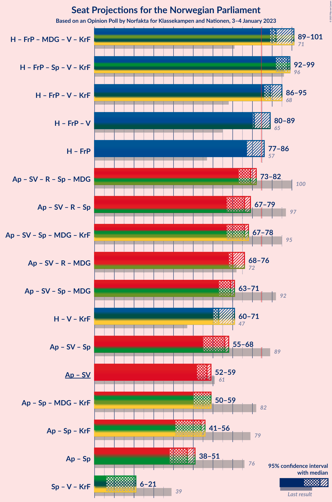
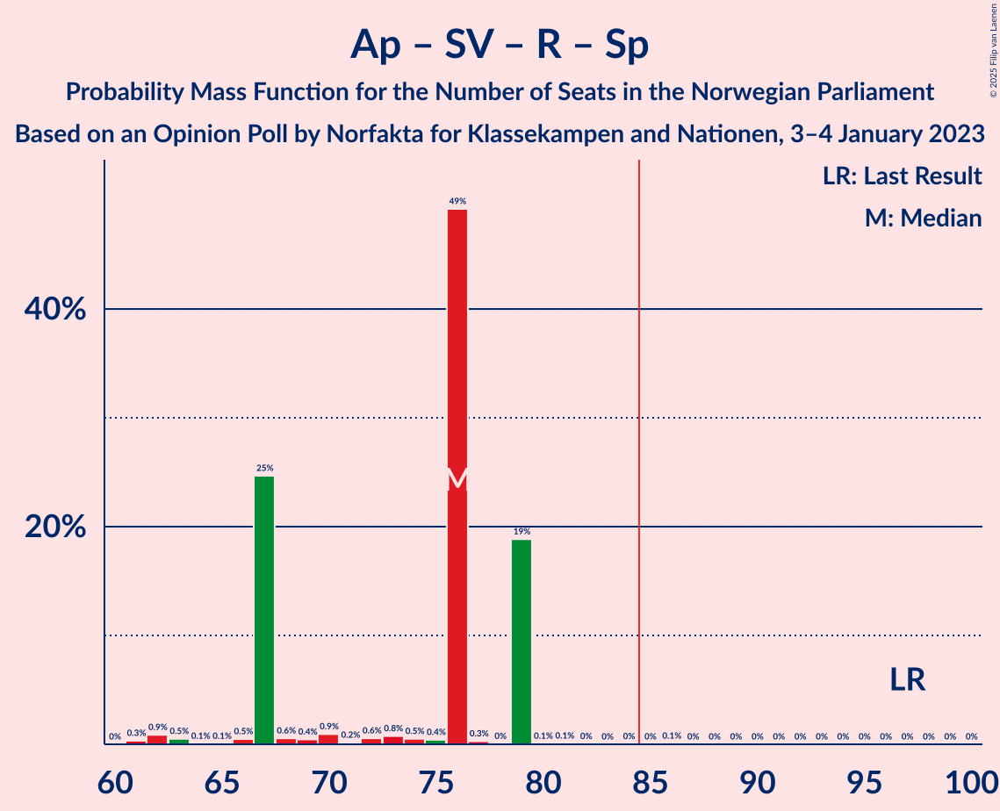

# Opinion Poll by Norfakta for Klassekampen and Nationen, 3–4 January 2023

<a href="#voting-intentions">Voting Intentions</a> | <a href="#seats">Seats</a> | <a href="#coalitions">Coalitions</a> | <a href="#technical-information">Technical Information</a>

## Voting Intentions

### Confidence Intervals

| Party | Last Result | Poll Result | 80% Confidence Interval | 90% Confidence Interval | 95% Confidence Interval | 99% Confidence Interval |
|:-----:|:-----------:|:-----------:|:-----------------------:|:-----------------------:|:-----------------------:|:-----------------------:|
| Høyre | 20.4% | 31.3% | 29.5–33.2% |29.0–33.8% |28.5–34.2% |27.6–35.2% |
| Arbeiderpartiet | 26.2% | 19.1% | 17.6–20.8% |17.1–21.2% |16.8–21.6% |16.1–22.5% |
| Fremskrittspartiet | 11.6% | 12.5% | 11.3–14.0% |10.9–14.4% |10.6–14.7% |10.0–15.4% |
| Sosialistisk Venstreparti | 7.6% | 9.4% | 8.4–10.7% |8.0–11.1% |7.8–11.4% |7.3–12.1% |
| Rødt | 4.7% | 6.5% | 5.6–7.6% |5.3–7.9% |5.1–8.2% |4.7–8.7% |
| Senterpartiet | 13.5% | 4.5% | 3.7–5.4% |3.5–5.7% |3.4–5.9% |3.0–6.4% |
| Miljøpartiet De Grønne | 3.9% | 4.2% | 3.5–5.1% |3.3–5.4% |3.1–5.6% |2.8–6.1% |
| Venstre | 4.6% | 4.0% | 3.3–4.9% |3.1–5.2% |2.9–5.4% |2.6–5.9% |
| Kristelig Folkeparti | 3.8% | 3.9% | 3.2–4.8% |3.0–5.0% |2.9–5.3% |2.5–5.7% |
| Industri- og Næringspartiet | 0.3% | 1.5% | 1.1–2.1% |1.0–2.3% |0.9–2.5% |0.7–2.8% |
| Norgesdemokratene | 1.1% | 0.9% | 0.6–1.4% |0.5–1.6% |0.5–1.7% |0.4–2.0% |
| Konservativt | 0.4% | 0.2% | 0.1–0.5% |0.1–0.6% |0.1–0.7% |0.0–0.9% |
| Helsepartiet | 0.2% | 0.2% | 0.1–0.5% |0.1–0.6% |0.1–0.7% |0.0–0.9% |
| Pensjonistpartiet | 0.6% | 0.1% | 0.0–0.4% |0.0–0.5% |0.0–0.6% |0.0–0.7% |

*Note:* The poll result column reflects the actual value used in the calculations. Published results may vary slightly, and in addition be rounded to fewer digits.

## Seats

### Confidence Intervals

| Party | Last Result | Median | 80% Confidence Interval | 90% Confidence Interval | 95% Confidence Interval | 99% Confidence Interval |
|:-----:|:-----------:|:------:|:-----------------------:|:-----------------------:|:-----------------------:|:-----------------------:|
| <a href="#høyre">Høyre</a> | 36 | 52 | 51–62 |51–62 |51–62 |51–65 |
| <a href="#arbeiderpartiet">Arbeiderpartiet</a> | 48 | 38 | 38–42 |37–42 |35–42 |32–42 |
| <a href="#fremskrittspartiet">Fremskrittspartiet</a> | 21 | 26 | 24–26 |24–26 |22–26 |19–30 |
| <a href="#sosialistisk-venstreparti">Sosialistisk Venstreparti</a> | 13 | 19 | 17–19 |17–19 |16–19 |13–23 |
| <a href="#rødt">Rødt</a> | 8 | 10 | 10–12 |10–12 |10–12 |9–13 |
| <a href="#senterpartiet">Senterpartiet</a> | 28 | 9 | 0–9 |0–9 |0–9 |0–9 |
| <a href="#miljøpartiet-de-grønne">Miljøpartiet De Grønne</a> | 3 | 3 | 3–9 |3–9 |3–9 |1–10 |
| <a href="#venstre">Venstre</a> | 8 | 3 | 2–3 |2–3 |2–7 |2–10 |
| <a href="#kristelig-folkeparti">Kristelig Folkeparti</a> | 3 | 9 | 3–9 |3–9 |3–9 |2–9 |
| <a href="#industri--og-næringspartiet">Industri- og Næringspartiet</a> | 0 | 0 | 0 |0 |0 |0–2 |
| <a href="#norgesdemokratene">Norgesdemokratene</a> | 0 | 0 | 0 |0 |0 |0 |
| <a href="#konservativt">Konservativt</a> | 0 | 0 | 0 |0 |0 |0 |
| <a href="#helsepartiet">Helsepartiet</a> | 0 | 0 | 0 |0 |0 |0 |
| <a href="#pensjonistpartiet">Pensjonistpartiet</a> | 0 | 0 | 0 |0 |0 |0 |

### Høyre

*For a full overview of the results for this party, see the [Høyre](party-høyre.html) page.*

| Number of Seats | Probability | Accumulated | Special Marks |
|:---------------:|:-----------:|:-----------:|:-------------:|
| 36 | 0% | 100% | Last Result |
| 37 | 0% | 100% |  |
| 38 | 0% | 100% |  |
| 39 | 0% | 100% |  |
| 40 | 0% | 100% |  |
| 41 | 0% | 100% |  |
| 42 | 0% | 100% |  |
| 43 | 0% | 100% |  |
| 44 | 0% | 100% |  |
| 45 | 0% | 100% |  |
| 46 | 0% | 100% |  |
| 47 | 0% | 100% |  |
| 48 | 0% | 100% |  |
| 49 | 0% | 100% |  |
| 50 | 0.2% | 100% |  |
| 51 | 49% | 99.8% |  |
| 52 | 1.0% | 50% | Median |
| 53 | 0.9% | 49% |  |
| 54 | 0.3% | 48% |  |
| 55 | 19% | 48% |  |
| 56 | 0.2% | 29% |  |
| 57 | 0.2% | 29% |  |
| 58 | 0.4% | 29% |  |
| 59 | 0.4% | 28% |  |
| 60 | 1.4% | 28% |  |
| 61 | 0.2% | 27% |  |
| 62 | 25% | 26% |  |
| 63 | 0.8% | 2% |  |
| 64 | 0.4% | 0.9% |  |
| 65 | 0.5% | 0.5% |  |
| 66 | 0% | 0.1% |  |
| 67 | 0% | 0% |  |

### Arbeiderpartiet

*For a full overview of the results for this party, see the [Arbeiderpartiet](party-arbeiderpartiet.html) page.*

| Number of Seats | Probability | Accumulated | Special Marks |
|:---------------:|:-----------:|:-----------:|:-------------:|
| 32 | 1.2% | 100% |  |
| 33 | 0.2% | 98.8% |  |
| 34 | 0.8% | 98.6% |  |
| 35 | 1.0% | 98% |  |
| 36 | 0.7% | 97% |  |
| 37 | 2% | 96% |  |
| 38 | 74% | 94% | Median |
| 39 | 0.3% | 21% |  |
| 40 | 0.2% | 20% |  |
| 41 | 0.3% | 20% |  |
| 42 | 19% | 20% |  |
| 43 | 0.1% | 0.5% |  |
| 44 | 0% | 0.4% |  |
| 45 | 0% | 0.3% |  |
| 46 | 0% | 0.3% |  |
| 47 | 0% | 0.3% |  |
| 48 | 0% | 0.3% | Last Result |
| 49 | 0.2% | 0.2% |  |
| 50 | 0% | 0% |  |

### Fremskrittspartiet

*For a full overview of the results for this party, see the [Fremskrittspartiet](party-fremskrittspartiet.html) page.*

| Number of Seats | Probability | Accumulated | Special Marks |
|:---------------:|:-----------:|:-----------:|:-------------:|
| 18 | 0.4% | 100% |  |
| 19 | 0.4% | 99.6% |  |
| 20 | 0.7% | 99.2% |  |
| 21 | 1.0% | 98.5% | Last Result |
| 22 | 0.6% | 98% |  |
| 23 | 0.1% | 97% |  |
| 24 | 26% | 97% |  |
| 25 | 0.2% | 71% |  |
| 26 | 69% | 71% | Median |
| 27 | 1.4% | 2% |  |
| 28 | 0.2% | 1.0% |  |
| 29 | 0% | 0.8% |  |
| 30 | 0.6% | 0.7% |  |
| 31 | 0.1% | 0.1% |  |
| 32 | 0% | 0% |  |

### Sosialistisk Venstreparti

*For a full overview of the results for this party, see the [Sosialistisk Venstreparti](party-sosialistiskvenstreparti.html) page.*

| Number of Seats | Probability | Accumulated | Special Marks |
|:---------------:|:-----------:|:-----------:|:-------------:|
| 12 | 0.1% | 100% |  |
| 13 | 1.0% | 99.9% | Last Result |
| 14 | 1.2% | 98.9% |  |
| 15 | 0.2% | 98% |  |
| 16 | 0.8% | 98% |  |
| 17 | 44% | 97% |  |
| 18 | 2% | 53% |  |
| 19 | 50% | 51% | Median |
| 20 | 0.3% | 1.4% |  |
| 21 | 0.3% | 1.0% |  |
| 22 | 0.1% | 0.8% |  |
| 23 | 0.6% | 0.7% |  |
| 24 | 0% | 0.1% |  |
| 25 | 0.1% | 0.1% |  |
| 26 | 0% | 0% |  |

### Rødt

*For a full overview of the results for this party, see the [Rødt](party-rødt.html) page.*

| Number of Seats | Probability | Accumulated | Special Marks |
|:---------------:|:-----------:|:-----------:|:-------------:|
| 8 | 0.2% | 100% | Last Result |
| 9 | 0.5% | 99.8% |  |
| 10 | 52% | 99.4% | Median |
| 11 | 20% | 48% |  |
| 12 | 27% | 28% |  |
| 13 | 0.4% | 0.9% |  |
| 14 | 0.1% | 0.5% |  |
| 15 | 0.2% | 0.3% |  |
| 16 | 0.1% | 0.2% |  |
| 17 | 0.1% | 0.1% |  |
| 18 | 0% | 0% |  |

### Senterpartiet

*For a full overview of the results for this party, see the [Senterpartiet](party-senterpartiet.html) page.*

| Number of Seats | Probability | Accumulated | Special Marks |
|:---------------:|:-----------:|:-----------:|:-------------:|
| 0 | 26% | 100% |  |
| 1 | 0.9% | 74% |  |
| 2 | 0.8% | 73% |  |
| 3 | 0% | 72% |  |
| 4 | 0% | 72% |  |
| 5 | 0% | 72% |  |
| 6 | 0% | 72% |  |
| 7 | 1.4% | 72% |  |
| 8 | 1.2% | 71% |  |
| 9 | 69% | 69% | Median |
| 10 | 0.3% | 0.5% |  |
| 11 | 0.1% | 0.1% |  |
| 12 | 0% | 0% |  |
| 13 | 0% | 0% |  |
| 14 | 0% | 0% |  |
| 15 | 0% | 0% |  |
| 16 | 0% | 0% |  |
| 17 | 0% | 0% |  |
| 18 | 0% | 0% |  |
| 19 | 0% | 0% |  |
| 20 | 0% | 0% |  |
| 21 | 0% | 0% |  |
| 22 | 0% | 0% |  |
| 23 | 0% | 0% |  |
| 24 | 0% | 0% |  |
| 25 | 0% | 0% |  |
| 26 | 0% | 0% |  |
| 27 | 0% | 0% |  |
| 28 | 0% | 0% | Last Result |

### Miljøpartiet De Grønne

*For a full overview of the results for this party, see the [Miljøpartiet De Grønne](party-miljøpartietdegrønne.html) page.*

| Number of Seats | Probability | Accumulated | Special Marks |
|:---------------:|:-----------:|:-----------:|:-------------:|
| 1 | 0.7% | 100% |  |
| 2 | 1.2% | 99.3% |  |
| 3 | 69% | 98% | Last Result, Median |
| 4 | 0% | 29% |  |
| 5 | 0% | 29% |  |
| 6 | 0% | 29% |  |
| 7 | 1.3% | 29% |  |
| 8 | 1.4% | 28% |  |
| 9 | 26% | 26% |  |
| 10 | 0.6% | 0.7% |  |
| 11 | 0.1% | 0.1% |  |
| 12 | 0% | 0% |  |

### Venstre

*For a full overview of the results for this party, see the [Venstre](party-venstre.html) page.*

| Number of Seats | Probability | Accumulated | Special Marks |
|:---------------:|:-----------:|:-----------:|:-------------:|
| 2 | 22% | 100% |  |
| 3 | 74% | 78% | Median |
| 4 | 0% | 4% |  |
| 5 | 0% | 4% |  |
| 6 | 0.9% | 4% |  |
| 7 | 1.0% | 3% |  |
| 8 | 1.0% | 2% | Last Result |
| 9 | 0.5% | 1.2% |  |
| 10 | 0.6% | 0.7% |  |
| 11 | 0% | 0.1% |  |
| 12 | 0% | 0% |  |

### Kristelig Folkeparti

*For a full overview of the results for this party, see the [Kristelig Folkeparti](party-kristeligfolkeparti.html) page.*

| Number of Seats | Probability | Accumulated | Special Marks |
|:---------------:|:-----------:|:-----------:|:-------------:|
| 2 | 2% | 100% |  |
| 3 | 45% | 98% | Last Result |
| 4 | 0% | 53% |  |
| 5 | 0% | 53% |  |
| 6 | 0% | 53% |  |
| 7 | 0.4% | 53% |  |
| 8 | 1.5% | 53% |  |
| 9 | 51% | 51% | Median |
| 10 | 0.3% | 0.4% |  |
| 11 | 0.1% | 0.1% |  |
| 12 | 0% | 0% |  |

### Industri- og Næringspartiet

*For a full overview of the results for this party, see the [Industri- og Næringspartiet](party-industri-ognæringspartiet.html) page.*

| Number of Seats | Probability | Accumulated | Special Marks |
|:---------------:|:-----------:|:-----------:|:-------------:|
| 0 | 99.2% | 100% | Last Result, Median |
| 1 | 0.3% | 0.8% |  |
| 2 | 0.6% | 0.6% |  |
| 3 | 0% | 0% |  |

### Norgesdemokratene

*For a full overview of the results for this party, see the [Norgesdemokratene](party-norgesdemokratene.html) page.*

| Number of Seats | Probability | Accumulated | Special Marks |
|:---------------:|:-----------:|:-----------:|:-------------:|
| 0 | 100% | 100% | Last Result, Median |

### Konservativt

*For a full overview of the results for this party, see the [Konservativt](party-konservativt.html) page.*

| Number of Seats | Probability | Accumulated | Special Marks |
|:---------------:|:-----------:|:-----------:|:-------------:|
| 0 | 100% | 100% | Last Result, Median |

### Helsepartiet

*For a full overview of the results for this party, see the [Helsepartiet](party-helsepartiet.html) page.*

| Number of Seats | Probability | Accumulated | Special Marks |
|:---------------:|:-----------:|:-----------:|:-------------:|
| 0 | 100% | 100% | Last Result, Median |

### Pensjonistpartiet

*For a full overview of the results for this party, see the [Pensjonistpartiet](party-pensjonistpartiet.html) page.*

| Number of Seats | Probability | Accumulated | Special Marks |
|:---------------:|:-----------:|:-----------:|:-------------:|
| 0 | 100% | 100% | Last Result, Median |

## Coalitions

### Confidence Intervals

| Coalition | Last Result | Median | Majority? | 80% Confidence Interval | 90% Confidence Interval | 95% Confidence Interval | 99% Confidence Interval |
|:---------:|:-----------:|:------:|:---------:|:-----------------------:|:-----------------------:|:-----------------------:|:-----------------------:|
| Høyre – Fremskrittspartiet – Miljøpartiet De Grønne – Venstre – Kristelig Folkeparti | 71 | 92 | 99.9% | 89–101 | 89–101 | 89–101 | 89–106 |
| Høyre – Fremskrittspartiet – Senterpartiet – Venstre – Kristelig Folkeparti | 96 | 98 | 100% | 92–98 | 92–98 | 92–99 | 89–106 |
| Høyre – Fremskrittspartiet – Venstre – Kristelig Folkeparti | 68 | 89 | 99.5% | 86–92 | 86–92 | 86–95 | 85–99 |
| Høyre – Fremskrittspartiet – Venstre | 65 | 81 | 30% | 80–89 | 80–89 | 80–89 | 79–94 |
| Høyre – Fremskrittspartiet | 57 | 77 | 27% | 77–86 | 77–86 | 77–86 | 71–90 |
| Arbeiderpartiet – Sosialistisk Venstreparti – Rødt – Senterpartiet – Miljøpartiet De Grønne | 100 | 79 | 0.4% | 76–82 | 76–82 | 73–82 | 69–83 |
| Arbeiderpartiet – Sosialistisk Venstreparti – Rødt – Senterpartiet | 97 | 76 | 0.1% | 67–79 | 67–79 | 67–79 | 62–79 |
| Arbeiderpartiet – Sosialistisk Venstreparti – Senterpartiet – Miljøpartiet De Grønne – Kristelig Folkeparti | 95 | 76 | 0% | 67–78 | 67–78 | 67–78 | 60–78 |
| Arbeiderpartiet – Sosialistisk Venstreparti – Rødt – Miljøpartiet De Grønne | 72 | 70 | 0% | 70–76 | 70–76 | 68–76 | 62–79 |
| Arbeiderpartiet – Sosialistisk Venstreparti – Senterpartiet – Miljøpartiet De Grønne | 92 | 69 | 0% | 64–71 | 64–71 | 63–71 | 57–72 |
| Høyre – Venstre – Kristelig Folkeparti | 47 | 63 | 0% | 60–68 | 60–68 | 60–71 | 60–78 |
| Arbeiderpartiet – Sosialistisk Venstreparti – Senterpartiet | 89 | 66 | 0% | 55–68 | 55–68 | 55–68 | 52–68 |
| Arbeiderpartiet – Sosialistisk Venstreparti | 61 | 57 | 0% | 55–59 | 55–59 | 52–59 | 45–61 |
| Arbeiderpartiet – Senterpartiet – Miljøpartiet De Grønne – Kristelig Folkeparti | 82 | 59 | 0% | 50–59 | 50–59 | 50–59 | 44–62 |
| Arbeiderpartiet – Senterpartiet – Kristelig Folkeparti | 79 | 54 | 0% | 41–56 | 41–56 | 41–56 | 37–58 |
| Arbeiderpartiet – Senterpartiet | 76 | 47 | 0% | 38–51 | 38–51 | 38–51 | 35–51 |
| Senterpartiet – Venstre – Kristelig Folkeparti | 39 | 21 | 0% | 6–21 | 6–21 | 6–21 | 4–22 |

### Høyre – Fremskrittspartiet – Miljøpartiet De Grønne – Venstre – Kristelig Folkeparti

| Number of Seats | Probability | Accumulated | Special Marks |
|:---------------:|:-----------:|:-----------:|:-------------:|
| 71 | 0% | 100% | Last Result |
| 72 | 0% | 100% |  |
| 73 | 0% | 100% |  |
| 74 | 0% | 100% |  |
| 75 | 0% | 100% |  |
| 76 | 0% | 100% |  |
| 77 | 0% | 100% |  |
| 78 | 0% | 100% |  |
| 79 | 0% | 100% |  |
| 80 | 0% | 100% |  |
| 81 | 0% | 100% |  |
| 82 | 0.1% | 100% |  |
| 83 | 0% | 99.9% |  |
| 84 | 0% | 99.9% |  |
| 85 | 0% | 99.9% | Majority |
| 86 | 0% | 99.9% |  |
| 87 | 0.1% | 99.8% |  |
| 88 | 0.1% | 99.8% |  |
| 89 | 19% | 99.7% |  |
| 90 | 0% | 81% |  |
| 91 | 0.3% | 81% |  |
| 92 | 49% | 81% |  |
| 93 | 0.4% | 31% | Median |
| 94 | 0.5% | 31% |  |
| 95 | 0.8% | 30% |  |
| 96 | 0.6% | 30% |  |
| 97 | 0.1% | 29% |  |
| 98 | 1.2% | 29% |  |
| 99 | 0.2% | 28% |  |
| 100 | 1.0% | 28% |  |
| 101 | 25% | 27% |  |
| 102 | 0% | 2% |  |
| 103 | 0.1% | 2% |  |
| 104 | 0.1% | 2% |  |
| 105 | 0.5% | 2% |  |
| 106 | 0.9% | 1.2% |  |
| 107 | 0.3% | 0.3% |  |
| 108 | 0% | 0% |  |

### Høyre – Fremskrittspartiet – Senterpartiet – Venstre – Kristelig Folkeparti

| Number of Seats | Probability | Accumulated | Special Marks |
|:---------------:|:-----------:|:-----------:|:-------------:|
| 88 | 0.4% | 100% |  |
| 89 | 0.1% | 99.5% |  |
| 90 | 0.7% | 99.5% |  |
| 91 | 0.1% | 98.7% |  |
| 92 | 25% | 98.6% |  |
| 93 | 0.2% | 73% |  |
| 94 | 0.1% | 73% |  |
| 95 | 19% | 73% |  |
| 96 | 0.6% | 54% | Last Result |
| 97 | 0.7% | 54% |  |
| 98 | 50% | 53% |  |
| 99 | 0.5% | 3% | Median |
| 100 | 0.2% | 2% |  |
| 101 | 0.1% | 2% |  |
| 102 | 0.1% | 2% |  |
| 103 | 0.9% | 2% |  |
| 104 | 0.1% | 1.0% |  |
| 105 | 0% | 1.0% |  |
| 106 | 0.9% | 1.0% |  |
| 107 | 0% | 0% |  |

### Høyre – Fremskrittspartiet – Venstre – Kristelig Folkeparti

| Number of Seats | Probability | Accumulated | Special Marks |
|:---------------:|:-----------:|:-----------:|:-------------:|
| 68 | 0% | 100% | Last Result |
| 69 | 0% | 100% |  |
| 70 | 0% | 100% |  |
| 71 | 0% | 100% |  |
| 72 | 0% | 100% |  |
| 73 | 0% | 100% |  |
| 74 | 0% | 100% |  |
| 75 | 0% | 100% |  |
| 76 | 0% | 100% |  |
| 77 | 0% | 100% |  |
| 78 | 0% | 100% |  |
| 79 | 0.1% | 100% |  |
| 80 | 0.1% | 99.9% |  |
| 81 | 0% | 99.8% |  |
| 82 | 0.2% | 99.8% |  |
| 83 | 0% | 99.6% |  |
| 84 | 0.1% | 99.6% |  |
| 85 | 0.1% | 99.5% | Majority |
| 86 | 19% | 99.4% |  |
| 87 | 0.1% | 80% |  |
| 88 | 0.2% | 80% |  |
| 89 | 50% | 80% |  |
| 90 | 0.9% | 30% | Median |
| 91 | 0.8% | 29% |  |
| 92 | 25% | 29% |  |
| 93 | 0.2% | 4% |  |
| 94 | 0.7% | 4% |  |
| 95 | 1.0% | 3% |  |
| 96 | 0.1% | 2% |  |
| 97 | 0.5% | 2% |  |
| 98 | 0.3% | 1.3% |  |
| 99 | 0.9% | 1.0% |  |
| 100 | 0% | 0.1% |  |
| 101 | 0% | 0.1% |  |
| 102 | 0% | 0% |  |

### Høyre – Fremskrittspartiet – Venstre

| Number of Seats | Probability | Accumulated | Special Marks |
|:---------------:|:-----------:|:-----------:|:-------------:|
| 65 | 0% | 100% | Last Result |
| 66 | 0% | 100% |  |
| 67 | 0% | 100% |  |
| 68 | 0% | 100% |  |
| 69 | 0% | 100% |  |
| 70 | 0% | 100% |  |
| 71 | 0.1% | 100% |  |
| 72 | 0% | 99.9% |  |
| 73 | 0% | 99.9% |  |
| 74 | 0.1% | 99.9% |  |
| 75 | 0% | 99.8% |  |
| 76 | 0% | 99.7% |  |
| 77 | 0.1% | 99.7% |  |
| 78 | 0.1% | 99.6% |  |
| 79 | 0.4% | 99.5% |  |
| 80 | 49% | 99.2% |  |
| 81 | 0.4% | 50% | Median |
| 82 | 0.1% | 50% |  |
| 83 | 19% | 50% |  |
| 84 | 0.2% | 31% |  |
| 85 | 0.9% | 30% | Majority |
| 86 | 0.5% | 29% |  |
| 87 | 0.8% | 29% |  |
| 88 | 1.1% | 28% |  |
| 89 | 25% | 27% |  |
| 90 | 0.9% | 2% |  |
| 91 | 0.1% | 1.3% |  |
| 92 | 0.1% | 1.2% |  |
| 93 | 0.2% | 1.2% |  |
| 94 | 0.5% | 0.9% |  |
| 95 | 0.1% | 0.4% |  |
| 96 | 0.4% | 0.4% |  |
| 97 | 0% | 0% |  |

### Høyre – Fremskrittspartiet

| Number of Seats | Probability | Accumulated | Special Marks |
|:---------------:|:-----------:|:-----------:|:-------------:|
| 57 | 0% | 100% | Last Result |
| 58 | 0% | 100% |  |
| 59 | 0% | 100% |  |
| 60 | 0% | 100% |  |
| 61 | 0% | 100% |  |
| 62 | 0% | 100% |  |
| 63 | 0% | 100% |  |
| 64 | 0% | 100% |  |
| 65 | 0% | 100% |  |
| 66 | 0% | 100% |  |
| 67 | 0% | 100% |  |
| 68 | 0% | 100% |  |
| 69 | 0.3% | 100% |  |
| 70 | 0.1% | 99.7% |  |
| 71 | 0.2% | 99.6% |  |
| 72 | 0.2% | 99.4% |  |
| 73 | 0% | 99.3% |  |
| 74 | 0% | 99.2% |  |
| 75 | 0.1% | 99.2% |  |
| 76 | 0.1% | 99.0% |  |
| 77 | 49% | 98.9% |  |
| 78 | 0.4% | 50% | Median |
| 79 | 0.9% | 49% |  |
| 80 | 0.7% | 48% |  |
| 81 | 19% | 48% |  |
| 82 | 0.3% | 29% |  |
| 83 | 1.1% | 29% |  |
| 84 | 0.9% | 27% |  |
| 85 | 0.3% | 27% | Majority |
| 86 | 25% | 26% |  |
| 87 | 0% | 0.9% |  |
| 88 | 0.3% | 0.9% |  |
| 89 | 0% | 0.5% |  |
| 90 | 0% | 0.5% |  |
| 91 | 0% | 0.5% |  |
| 92 | 0.5% | 0.5% |  |
| 93 | 0% | 0% |  |

### Arbeiderpartiet – Sosialistisk Venstreparti – Rødt – Senterpartiet – Miljøpartiet De Grønne

| Number of Seats | Probability | Accumulated | Special Marks |
|:---------------:|:-----------:|:-----------:|:-------------:|
| 67 | 0% | 100% |  |
| 68 | 0% | 99.9% |  |
| 69 | 1.4% | 99.9% |  |
| 70 | 0.3% | 98.5% |  |
| 71 | 0% | 98% |  |
| 72 | 0.3% | 98% |  |
| 73 | 0.8% | 98% |  |
| 74 | 0.7% | 97% |  |
| 75 | 0.1% | 96% |  |
| 76 | 25% | 96% |  |
| 77 | 0.8% | 71% |  |
| 78 | 0.8% | 70% |  |
| 79 | 50% | 70% | Median |
| 80 | 0.2% | 20% |  |
| 81 | 0.1% | 20% |  |
| 82 | 19% | 20% |  |
| 83 | 0.1% | 0.6% |  |
| 84 | 0.1% | 0.5% |  |
| 85 | 0% | 0.4% | Majority |
| 86 | 0.2% | 0.4% |  |
| 87 | 0% | 0.2% |  |
| 88 | 0.1% | 0.2% |  |
| 89 | 0.1% | 0.1% |  |
| 90 | 0% | 0% |  |
| 91 | 0% | 0% |  |
| 92 | 0% | 0% |  |
| 93 | 0% | 0% |  |
| 94 | 0% | 0% |  |
| 95 | 0% | 0% |  |
| 96 | 0% | 0% |  |
| 97 | 0% | 0% |  |
| 98 | 0% | 0% |  |
| 99 | 0% | 0% |  |
| 100 | 0% | 0% | Last Result |

### Arbeiderpartiet – Sosialistisk Venstreparti – Rødt – Senterpartiet

| Number of Seats | Probability | Accumulated | Special Marks |
|:---------------:|:-----------:|:-----------:|:-------------:|
| 61 | 0.3% | 100% |  |
| 62 | 0.9% | 99.7% |  |
| 63 | 0.5% | 98.8% |  |
| 64 | 0.1% | 98% |  |
| 65 | 0.1% | 98% |  |
| 66 | 0.5% | 98% |  |
| 67 | 25% | 98% |  |
| 68 | 0.6% | 73% |  |
| 69 | 0.4% | 72% |  |
| 70 | 0.9% | 72% |  |
| 71 | 0.2% | 71% |  |
| 72 | 0.6% | 71% |  |
| 73 | 0.8% | 70% |  |
| 74 | 0.5% | 70% |  |
| 75 | 0.4% | 69% |  |
| 76 | 49% | 69% | Median |
| 77 | 0.3% | 19% |  |
| 78 | 0% | 19% |  |
| 79 | 19% | 19% |  |
| 80 | 0.1% | 0.3% |  |
| 81 | 0.1% | 0.2% |  |
| 82 | 0% | 0.1% |  |
| 83 | 0% | 0.1% |  |
| 84 | 0% | 0.1% |  |
| 85 | 0% | 0.1% | Majority |
| 86 | 0.1% | 0.1% |  |
| 87 | 0% | 0% |  |
| 88 | 0% | 0% |  |
| 89 | 0% | 0% |  |
| 90 | 0% | 0% |  |
| 91 | 0% | 0% |  |
| 92 | 0% | 0% |  |
| 93 | 0% | 0% |  |
| 94 | 0% | 0% |  |
| 95 | 0% | 0% |  |
| 96 | 0% | 0% |  |
| 97 | 0% | 0% | Last Result |

### Arbeiderpartiet – Sosialistisk Venstreparti – Senterpartiet – Miljøpartiet De Grønne – Kristelig Folkeparti

| Number of Seats | Probability | Accumulated | Special Marks |
|:---------------:|:-----------:|:-----------:|:-------------:|
| 60 | 0.8% | 100% |  |
| 61 | 0% | 99.2% |  |
| 62 | 0% | 99.2% |  |
| 63 | 0% | 99.1% |  |
| 64 | 0% | 99.1% |  |
| 65 | 0.3% | 99.1% |  |
| 66 | 0.2% | 98.8% |  |
| 67 | 25% | 98.6% |  |
| 68 | 2% | 74% |  |
| 69 | 0.2% | 72% |  |
| 70 | 0.1% | 71% |  |
| 71 | 0.6% | 71% |  |
| 72 | 0.5% | 71% |  |
| 73 | 0.8% | 70% |  |
| 74 | 19% | 69% |  |
| 75 | 0.2% | 51% |  |
| 76 | 0.3% | 50% |  |
| 77 | 0.3% | 50% |  |
| 78 | 49% | 50% | Median |
| 79 | 0.1% | 0.4% |  |
| 80 | 0.1% | 0.3% |  |
| 81 | 0% | 0.2% |  |
| 82 | 0.1% | 0.2% |  |
| 83 | 0% | 0.1% |  |
| 84 | 0.1% | 0.1% |  |
| 85 | 0% | 0% | Majority |
| 86 | 0% | 0% |  |
| 87 | 0% | 0% |  |
| 88 | 0% | 0% |  |
| 89 | 0% | 0% |  |
| 90 | 0% | 0% |  |
| 91 | 0% | 0% |  |
| 92 | 0% | 0% |  |
| 93 | 0% | 0% |  |
| 94 | 0% | 0% |  |
| 95 | 0% | 0% | Last Result |

### Arbeiderpartiet – Sosialistisk Venstreparti – Rødt – Miljøpartiet De Grønne

| Number of Seats | Probability | Accumulated | Special Marks |
|:---------------:|:-----------:|:-----------:|:-------------:|
| 62 | 0.9% | 100% |  |
| 63 | 0% | 99.0% |  |
| 64 | 0.3% | 99.0% |  |
| 65 | 0.7% | 98.7% |  |
| 66 | 0.1% | 98% |  |
| 67 | 0.1% | 98% |  |
| 68 | 0.7% | 98% |  |
| 69 | 0.5% | 97% |  |
| 70 | 50% | 97% | Median |
| 71 | 0.7% | 47% |  |
| 72 | 0.6% | 46% | Last Result |
| 73 | 19% | 46% |  |
| 74 | 0.1% | 27% |  |
| 75 | 0.2% | 27% |  |
| 76 | 25% | 27% |  |
| 77 | 0.1% | 1.3% |  |
| 78 | 0.7% | 1.3% |  |
| 79 | 0.1% | 0.5% |  |
| 80 | 0.4% | 0.5% |  |
| 81 | 0% | 0% |  |

### Arbeiderpartiet – Sosialistisk Venstreparti – Senterpartiet – Miljøpartiet De Grønne

| Number of Seats | Probability | Accumulated | Special Marks |
|:---------------:|:-----------:|:-----------:|:-------------:|
| 55 | 0% | 100% |  |
| 56 | 0% | 99.9% |  |
| 57 | 0.5% | 99.9% |  |
| 58 | 0.3% | 99.5% |  |
| 59 | 1.0% | 99.1% |  |
| 60 | 0.3% | 98% |  |
| 61 | 0.1% | 98% |  |
| 62 | 0% | 98% |  |
| 63 | 0.9% | 98% |  |
| 64 | 25% | 97% |  |
| 65 | 0.7% | 72% |  |
| 66 | 1.2% | 71% |  |
| 67 | 0.2% | 70% |  |
| 68 | 0.1% | 70% |  |
| 69 | 50% | 69% | Median |
| 70 | 0.1% | 20% |  |
| 71 | 19% | 20% |  |
| 72 | 0.2% | 0.6% |  |
| 73 | 0.1% | 0.4% |  |
| 74 | 0.1% | 0.3% |  |
| 75 | 0% | 0.2% |  |
| 76 | 0.1% | 0.2% |  |
| 77 | 0% | 0% |  |
| 78 | 0% | 0% |  |
| 79 | 0% | 0% |  |
| 80 | 0% | 0% |  |
| 81 | 0% | 0% |  |
| 82 | 0% | 0% |  |
| 83 | 0% | 0% |  |
| 84 | 0% | 0% |  |
| 85 | 0% | 0% | Majority |
| 86 | 0% | 0% |  |
| 87 | 0% | 0% |  |
| 88 | 0% | 0% |  |
| 89 | 0% | 0% |  |
| 90 | 0% | 0% |  |
| 91 | 0% | 0% |  |
| 92 | 0% | 0% | Last Result |

### Høyre – Venstre – Kristelig Folkeparti

| Number of Seats | Probability | Accumulated | Special Marks |
|:---------------:|:-----------:|:-----------:|:-------------:|
| 47 | 0% | 100% | Last Result |
| 48 | 0% | 100% |  |
| 49 | 0% | 100% |  |
| 50 | 0% | 100% |  |
| 51 | 0% | 100% |  |
| 52 | 0% | 100% |  |
| 53 | 0% | 100% |  |
| 54 | 0% | 100% |  |
| 55 | 0% | 100% |  |
| 56 | 0% | 100% |  |
| 57 | 0% | 100% |  |
| 58 | 0.1% | 100% |  |
| 59 | 0% | 99.8% |  |
| 60 | 19% | 99.8% |  |
| 61 | 0.1% | 81% |  |
| 62 | 0.4% | 81% |  |
| 63 | 49% | 80% |  |
| 64 | 2% | 31% | Median |
| 65 | 0.1% | 29% |  |
| 66 | 0.2% | 29% |  |
| 67 | 0.4% | 29% |  |
| 68 | 25% | 28% |  |
| 69 | 0.1% | 3% |  |
| 70 | 0.6% | 3% |  |
| 71 | 0.5% | 3% |  |
| 72 | 0.1% | 2% |  |
| 73 | 0.1% | 2% |  |
| 74 | 0.4% | 2% |  |
| 75 | 0.6% | 2% |  |
| 76 | 0% | 0.9% |  |
| 77 | 0.1% | 0.9% |  |
| 78 | 0.8% | 0.8% |  |
| 79 | 0% | 0% |  |

### Arbeiderpartiet – Sosialistisk Venstreparti – Senterpartiet

| Number of Seats | Probability | Accumulated | Special Marks |
|:---------------:|:-----------:|:-----------:|:-------------:|
| 49 | 0.3% | 100% |  |
| 50 | 0% | 99.7% |  |
| 51 | 0% | 99.7% |  |
| 52 | 0.9% | 99.6% |  |
| 53 | 0.5% | 98.8% |  |
| 54 | 0.5% | 98% |  |
| 55 | 25% | 98% |  |
| 56 | 0.5% | 73% |  |
| 57 | 0.5% | 73% |  |
| 58 | 0.8% | 72% |  |
| 59 | 0.1% | 71% |  |
| 60 | 0.4% | 71% |  |
| 61 | 0.2% | 71% |  |
| 62 | 0.6% | 71% |  |
| 63 | 1.2% | 70% |  |
| 64 | 0.3% | 69% |  |
| 65 | 0.2% | 69% |  |
| 66 | 49% | 68% | Median |
| 67 | 0.2% | 19% |  |
| 68 | 19% | 19% |  |
| 69 | 0% | 0.2% |  |
| 70 | 0.1% | 0.2% |  |
| 71 | 0% | 0% |  |
| 72 | 0% | 0% |  |
| 73 | 0% | 0% |  |
| 74 | 0% | 0% |  |
| 75 | 0% | 0% |  |
| 76 | 0% | 0% |  |
| 77 | 0% | 0% |  |
| 78 | 0% | 0% |  |
| 79 | 0% | 0% |  |
| 80 | 0% | 0% |  |
| 81 | 0% | 0% |  |
| 82 | 0% | 0% |  |
| 83 | 0% | 0% |  |
| 84 | 0% | 0% |  |
| 85 | 0% | 0% | Majority |
| 86 | 0% | 0% |  |
| 87 | 0% | 0% |  |
| 88 | 0% | 0% |  |
| 89 | 0% | 0% | Last Result |

### Arbeiderpartiet – Sosialistisk Venstreparti

| Number of Seats | Probability | Accumulated | Special Marks |
|:---------------:|:-----------:|:-----------:|:-------------:|
| 45 | 0.8% | 100% |  |
| 46 | 0% | 99.2% |  |
| 47 | 0.1% | 99.1% |  |
| 48 | 0.4% | 99.1% |  |
| 49 | 0.3% | 98.7% |  |
| 50 | 0.1% | 98% |  |
| 51 | 0.7% | 98% |  |
| 52 | 0.5% | 98% |  |
| 53 | 0.6% | 97% |  |
| 54 | 0.7% | 96% |  |
| 55 | 25% | 96% |  |
| 56 | 0.2% | 70% |  |
| 57 | 50% | 70% | Median |
| 58 | 0.7% | 21% |  |
| 59 | 19% | 20% |  |
| 60 | 0.1% | 0.9% |  |
| 61 | 0.4% | 0.8% | Last Result |
| 62 | 0% | 0.4% |  |
| 63 | 0.3% | 0.4% |  |
| 64 | 0% | 0.1% |  |
| 65 | 0% | 0% |  |

### Arbeiderpartiet – Senterpartiet – Miljøpartiet De Grønne – Kristelig Folkeparti

| Number of Seats | Probability | Accumulated | Special Marks |
|:---------------:|:-----------:|:-----------:|:-------------:|
| 43 | 0.3% | 100% |  |
| 44 | 0.5% | 99.6% |  |
| 45 | 0.7% | 99.1% |  |
| 46 | 0.1% | 98% |  |
| 47 | 0.4% | 98% |  |
| 48 | 0.2% | 98% |  |
| 49 | 0.1% | 98% |  |
| 50 | 25% | 98% |  |
| 51 | 0.1% | 73% |  |
| 52 | 0.2% | 73% |  |
| 53 | 0.2% | 73% |  |
| 54 | 0.9% | 72% |  |
| 55 | 2% | 72% |  |
| 56 | 0.2% | 70% |  |
| 57 | 19% | 70% |  |
| 58 | 0.1% | 50% |  |
| 59 | 49% | 50% | Median |
| 60 | 0.1% | 0.9% |  |
| 61 | 0.2% | 0.8% |  |
| 62 | 0.3% | 0.7% |  |
| 63 | 0% | 0.4% |  |
| 64 | 0.1% | 0.4% |  |
| 65 | 0% | 0.3% |  |
| 66 | 0.1% | 0.2% |  |
| 67 | 0.1% | 0.1% |  |
| 68 | 0% | 0% |  |
| 69 | 0% | 0% |  |
| 70 | 0% | 0% |  |
| 71 | 0% | 0% |  |
| 72 | 0% | 0% |  |
| 73 | 0% | 0% |  |
| 74 | 0% | 0% |  |
| 75 | 0% | 0% |  |
| 76 | 0% | 0% |  |
| 77 | 0% | 0% |  |
| 78 | 0% | 0% |  |
| 79 | 0% | 0% |  |
| 80 | 0% | 0% |  |
| 81 | 0% | 0% |  |
| 82 | 0% | 0% | Last Result |

### Arbeiderpartiet – Senterpartiet – Kristelig Folkeparti

| Number of Seats | Probability | Accumulated | Special Marks |
|:---------------:|:-----------:|:-----------:|:-------------:|
| 34 | 0.3% | 100% |  |
| 35 | 0% | 99.7% |  |
| 36 | 0.1% | 99.7% |  |
| 37 | 0.6% | 99.6% |  |
| 38 | 0% | 99.0% |  |
| 39 | 0% | 99.0% |  |
| 40 | 0% | 98.9% |  |
| 41 | 25% | 98.9% |  |
| 42 | 0% | 74% |  |
| 43 | 0.1% | 74% |  |
| 44 | 0.4% | 74% |  |
| 45 | 0.6% | 73% |  |
| 46 | 0.2% | 73% |  |
| 47 | 1.2% | 72% |  |
| 48 | 0.9% | 71% |  |
| 49 | 0.2% | 70% |  |
| 50 | 0.1% | 70% |  |
| 51 | 0.4% | 70% |  |
| 52 | 0.1% | 70% |  |
| 53 | 0.2% | 70% |  |
| 54 | 20% | 69% |  |
| 55 | 0.1% | 50% |  |
| 56 | 49% | 50% | Median |
| 57 | 0.1% | 0.7% |  |
| 58 | 0.3% | 0.6% |  |
| 59 | 0% | 0.3% |  |
| 60 | 0.2% | 0.3% |  |
| 61 | 0% | 0% |  |
| 62 | 0% | 0% |  |
| 63 | 0% | 0% |  |
| 64 | 0% | 0% |  |
| 65 | 0% | 0% |  |
| 66 | 0% | 0% |  |
| 67 | 0% | 0% |  |
| 68 | 0% | 0% |  |
| 69 | 0% | 0% |  |
| 70 | 0% | 0% |  |
| 71 | 0% | 0% |  |
| 72 | 0% | 0% |  |
| 73 | 0% | 0% |  |
| 74 | 0% | 0% |  |
| 75 | 0% | 0% |  |
| 76 | 0% | 0% |  |
| 77 | 0% | 0% |  |
| 78 | 0% | 0% |  |
| 79 | 0% | 0% | Last Result |

### Arbeiderpartiet – Senterpartiet

| Number of Seats | Probability | Accumulated | Special Marks |
|:---------------:|:-----------:|:-----------:|:-------------:|
| 32 | 0.3% | 100% |  |
| 33 | 0.1% | 99.7% |  |
| 34 | 0% | 99.6% |  |
| 35 | 0.7% | 99.6% |  |
| 36 | 0.1% | 98.9% |  |
| 37 | 0.2% | 98.8% |  |
| 38 | 25% | 98.6% |  |
| 39 | 2% | 74% |  |
| 40 | 0% | 72% |  |
| 41 | 0.2% | 72% |  |
| 42 | 0.7% | 72% |  |
| 43 | 0.3% | 71% |  |
| 44 | 0.9% | 71% |  |
| 45 | 0.6% | 70% |  |
| 46 | 0.1% | 69% |  |
| 47 | 49% | 69% | Median |
| 48 | 0.1% | 20% |  |
| 49 | 0.1% | 20% |  |
| 50 | 0.6% | 20% |  |
| 51 | 19% | 19% |  |
| 52 | 0.1% | 0.1% |  |
| 53 | 0% | 0.1% |  |
| 54 | 0% | 0% |  |
| 55 | 0% | 0% |  |
| 56 | 0% | 0% |  |
| 57 | 0% | 0% |  |
| 58 | 0% | 0% |  |
| 59 | 0% | 0% |  |
| 60 | 0% | 0% |  |
| 61 | 0% | 0% |  |
| 62 | 0% | 0% |  |
| 63 | 0% | 0% |  |
| 64 | 0% | 0% |  |
| 65 | 0% | 0% |  |
| 66 | 0% | 0% |  |
| 67 | 0% | 0% |  |
| 68 | 0% | 0% |  |
| 69 | 0% | 0% |  |
| 70 | 0% | 0% |  |
| 71 | 0% | 0% |  |
| 72 | 0% | 0% |  |
| 73 | 0% | 0% |  |
| 74 | 0% | 0% |  |
| 75 | 0% | 0% |  |
| 76 | 0% | 0% | Last Result |

### Senterpartiet – Venstre – Kristelig Folkeparti

| Number of Seats | Probability | Accumulated | Special Marks |
|:---------------:|:-----------:|:-----------:|:-------------:|
| 4 | 0.6% | 100% |  |
| 5 | 0.1% | 99.4% |  |
| 6 | 25% | 99.2% |  |
| 7 | 0% | 74% |  |
| 8 | 0% | 74% |  |
| 9 | 0% | 74% |  |
| 10 | 0.8% | 74% |  |
| 11 | 0.2% | 73% |  |
| 12 | 0.2% | 73% |  |
| 13 | 0.1% | 73% |  |
| 14 | 19% | 73% |  |
| 15 | 0% | 54% |  |
| 16 | 0.1% | 54% |  |
| 17 | 1.0% | 54% |  |
| 18 | 0.1% | 53% |  |
| 19 | 0.6% | 53% |  |
| 20 | 1.4% | 52% |  |
| 21 | 49% | 51% | Median |
| 22 | 0.9% | 1.2% |  |
| 23 | 0% | 0.3% |  |
| 24 | 0.1% | 0.3% |  |
| 25 | 0% | 0.2% |  |
| 26 | 0% | 0.1% |  |
| 27 | 0.1% | 0.1% |  |
| 28 | 0% | 0% |  |
| 29 | 0% | 0% |  |
| 30 | 0% | 0% |  |
| 31 | 0% | 0% |  |
| 32 | 0% | 0% |  |
| 33 | 0% | 0% |  |
| 34 | 0% | 0% |  |
| 35 | 0% | 0% |  |
| 36 | 0% | 0% |  |
| 37 | 0% | 0% |  |
| 38 | 0% | 0% |  |
| 39 | 0% | 0% | Last Result |

## Technical Information

### Opinion Poll

+ **Polling firm:** Norfakta
+ **Commissioner(s):** Klassekampen and Nationen
+ **Fieldwork period:** 3–4 January 2023

### Calculations

+ **Sample size:** 1006
+ **Simulations done:** 1,048,576
+ **Error estimate:** 1.46%

