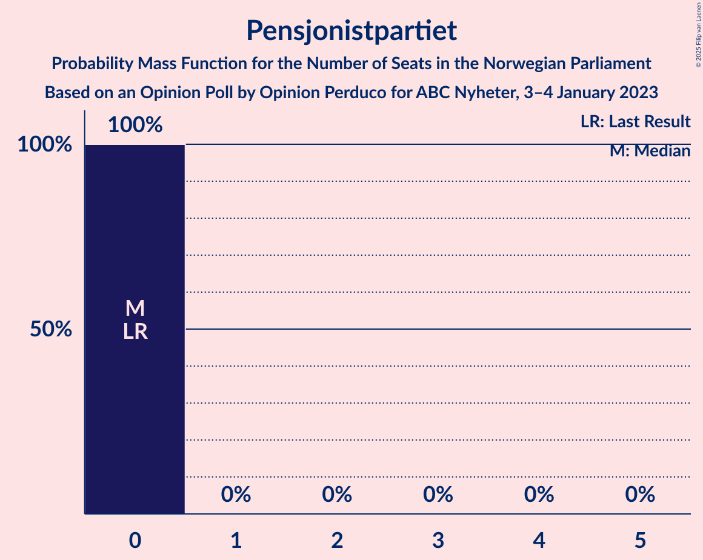
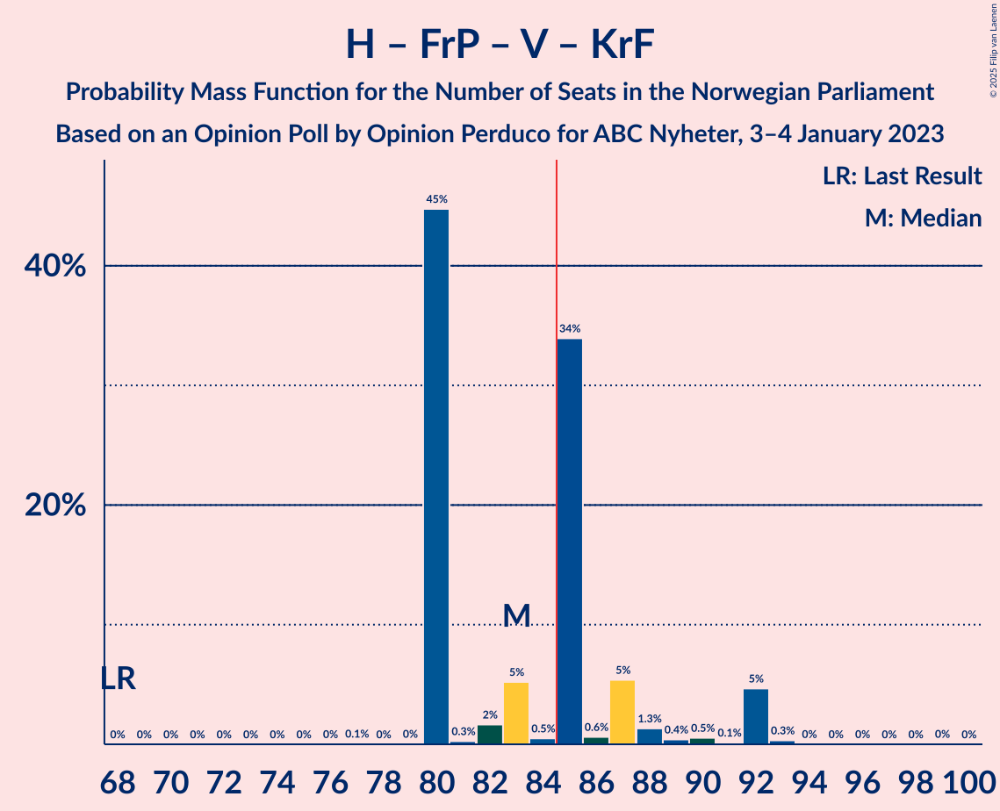
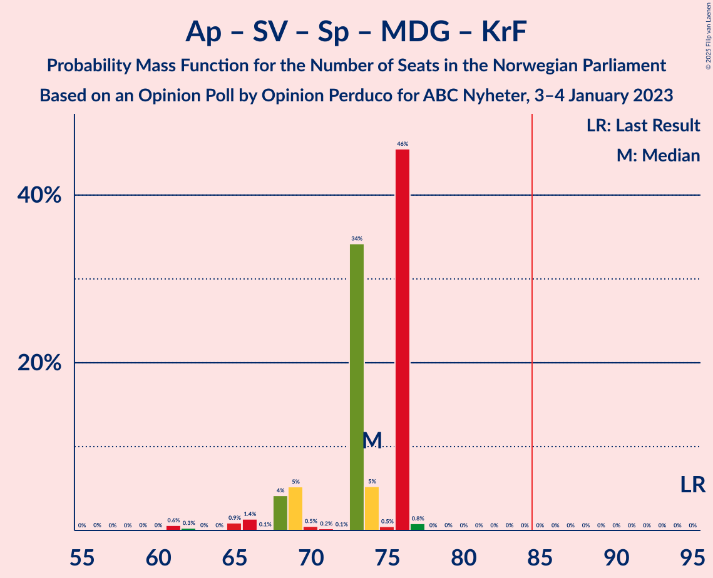

# Opinion Poll by Opinion Perduco for ABC Nyheter, 3–4 January 2023

<a href="#voting-intentions">Voting Intentions</a> | <a href="#seats">Seats</a> | <a href="#coalitions">Coalitions</a> | <a href="#technical-information">Technical Information</a>

## Voting Intentions

### Confidence Intervals

| Party | Last Result | Poll Result | 80% Confidence Interval | 90% Confidence Interval | 95% Confidence Interval | 99% Confidence Interval |
|:-----:|:-----------:|:-----------:|:-----------------------:|:-----------------------:|:-----------------------:|:-----------------------:|
| Høyre | 20.4% | 31.0% | 29.2–33.0% |28.6–33.5% |28.2–34.0% |27.3–35.0% |
| Arbeiderpartiet | 26.2% | 17.7% | 16.2–19.3% |15.8–19.8% |15.4–20.2% |14.7–21.0% |
| Fremskrittspartiet | 11.6% | 13.2% | 11.9–14.7% |11.6–15.2% |11.2–15.5% |10.6–16.3% |
| Sosialistisk Venstreparti | 7.6% | 9.5% | 8.4–10.8% |8.1–11.2% |7.8–11.5% |7.3–12.2% |
| Rødt | 4.7% | 6.9% | 6.0–8.1% |5.7–8.4% |5.5–8.7% |5.1–9.3% |
| Senterpartiet | 13.5% | 6.3% | 5.4–7.4% |5.2–7.7% |4.9–8.0% |4.5–8.6% |
| Miljøpartiet De Grønne | 3.9% | 4.1% | 3.4–5.1% |3.2–5.3% |3.0–5.6% |2.7–6.1% |
| Venstre | 4.6% | 4.0% | 3.3–5.0% |3.1–5.2% |3.0–5.5% |2.7–6.0% |
| Kristelig Folkeparti | 3.8% | 2.4% | 1.9–3.1% |1.7–3.4% |1.6–3.6% |1.4–3.9% |
| Industri- og Næringspartiet | 0.3% | 1.4% | 1.1–2.1% |0.9–2.3% |0.9–2.4% |0.7–2.8% |
| Liberalistene | 0.2% | 0.3% | 0.2–0.7% |0.1–0.8% |0.1–0.9% |0.1–1.1% |
| Konservativt | 0.4% | 0.3% | 0.2–0.7% |0.1–0.8% |0.1–0.9% |0.1–1.1% |
| Pensjonistpartiet | 0.6% | 0.3% | 0.2–0.7% |0.1–0.8% |0.1–0.9% |0.1–1.1% |
| Helsepartiet | 0.2% | 0.3% | 0.2–0.7% |0.1–0.8% |0.1–0.9% |0.1–1.1% |
| Folkets parti | 0.1% | 0.2% | 0.1–0.6% |0.1–0.7% |0.1–0.7% |0.0–1.0% |

*Note:* The poll result column reflects the actual value used in the calculations. Published results may vary slightly, and in addition be rounded to fewer digits.

## Seats

### Confidence Intervals

| Party | Last Result | Median | 80% Confidence Interval | 90% Confidence Interval | 95% Confidence Interval | 99% Confidence Interval |
|:-----:|:-----------:|:------:|:-----------------------:|:-----------------------:|:-----------------------:|:-----------------------:|
| <a href="#høyre">Høyre</a> | 36 | 54 | 53–60 |53–60 |53–60 |46–62 |
| <a href="#arbeiderpartiet">Arbeiderpartiet</a> | 48 | 34 | 33–34 |33–38 |33–38 |29–38 |
| <a href="#fremskrittspartiet">Fremskrittspartiet</a> | 21 | 24 | 22–25 |20–27 |20–27 |20–27 |
| <a href="#sosialistisk-venstreparti">Sosialistisk Venstreparti</a> | 13 | 18 | 18–20 |18–20 |16–20 |14–21 |
| <a href="#rødt">Rødt</a> | 8 | 12 | 11–13 |11–13 |11–14 |10–17 |
| <a href="#senterpartiet">Senterpartiet</a> | 28 | 13 | 11–14 |9–14 |9–14 |9–14 |
| <a href="#miljøpartiet-de-grønne">Miljøpartiet De Grønne</a> | 3 | 8 | 2–9 |2–9 |2–9 |1–10 |
| <a href="#venstre">Venstre</a> | 8 | 2 | 2–8 |2–10 |2–10 |2–10 |
| <a href="#kristelig-folkeparti">Kristelig Folkeparti</a> | 3 | 1 | 0–1 |0–3 |0–3 |0–7 |
| <a href="#industri--og-næringspartiet">Industri- og Næringspartiet</a> | 0 | 0 | 0 |0 |0 |0–1 |
| <a href="#liberalistene">Liberalistene</a> | 0 | 0 | 0 |0 |0 |0 |
| <a href="#konservativt">Konservativt</a> | 0 | 0 | 0 |0 |0 |0 |
| <a href="#pensjonistpartiet">Pensjonistpartiet</a> | 0 | 0 | 0 |0 |0 |0 |
| <a href="#helsepartiet">Helsepartiet</a> | 0 | 0 | 0 |0 |0 |0 |
| <a href="#folkets-parti">Folkets parti</a> | 0 | 0 | 0 |0 |0 |0 |

### Høyre

*For a full overview of the results for this party, see the [Høyre](party-høyre.html) page.*

| Number of Seats | Probability | Accumulated | Special Marks |
|:---------------:|:-----------:|:-----------:|:-------------:|
| 36 | 0% | 100% | Last Result |
| 37 | 0% | 100% |  |
| 38 | 0% | 100% |  |
| 39 | 0% | 100% |  |
| 40 | 0% | 100% |  |
| 41 | 0% | 100% |  |
| 42 | 0% | 100% |  |
| 43 | 0% | 100% |  |
| 44 | 0% | 100% |  |
| 45 | 0% | 100% |  |
| 46 | 0.8% | 100% |  |
| 47 | 0.3% | 99.2% |  |
| 48 | 0.1% | 98.9% |  |
| 49 | 0.1% | 98.9% |  |
| 50 | 0.1% | 98.7% |  |
| 51 | 0.1% | 98.7% |  |
| 52 | 0.3% | 98.6% |  |
| 53 | 46% | 98% |  |
| 54 | 6% | 53% | Median |
| 55 | 6% | 47% |  |
| 56 | 0.1% | 41% |  |
| 57 | 5% | 41% |  |
| 58 | 0.2% | 36% |  |
| 59 | 0.6% | 36% |  |
| 60 | 34% | 35% |  |
| 61 | 0.4% | 1.3% |  |
| 62 | 0.7% | 0.9% |  |
| 63 | 0% | 0.2% |  |
| 64 | 0% | 0.1% |  |
| 65 | 0.1% | 0.1% |  |
| 66 | 0% | 0% |  |

### Arbeiderpartiet

*For a full overview of the results for this party, see the [Arbeiderpartiet](party-arbeiderpartiet.html) page.*

| Number of Seats | Probability | Accumulated | Special Marks |
|:---------------:|:-----------:|:-----------:|:-------------:|
| 28 | 0% | 100% |  |
| 29 | 0.7% | 99.9% |  |
| 30 | 0.1% | 99.3% |  |
| 31 | 0.7% | 99.2% |  |
| 32 | 0.7% | 98.5% |  |
| 33 | 40% | 98% |  |
| 34 | 50% | 58% | Median |
| 35 | 0.4% | 8% |  |
| 36 | 1.4% | 7% |  |
| 37 | 0.2% | 6% |  |
| 38 | 5% | 6% |  |
| 39 | 0.1% | 0.4% |  |
| 40 | 0.2% | 0.3% |  |
| 41 | 0.1% | 0.1% |  |
| 42 | 0% | 0% |  |
| 43 | 0% | 0% |  |
| 44 | 0% | 0% |  |
| 45 | 0% | 0% |  |
| 46 | 0% | 0% |  |
| 47 | 0% | 0% |  |
| 48 | 0% | 0% | Last Result |

### Fremskrittspartiet

*For a full overview of the results for this party, see the [Fremskrittspartiet](party-fremskrittspartiet.html) page.*

| Number of Seats | Probability | Accumulated | Special Marks |
|:---------------:|:-----------:|:-----------:|:-------------:|
| 18 | 0.1% | 100% |  |
| 19 | 0.3% | 99.9% |  |
| 20 | 5% | 99.6% |  |
| 21 | 0.6% | 95% | Last Result |
| 22 | 35% | 94% |  |
| 23 | 2% | 59% |  |
| 24 | 46% | 57% | Median |
| 25 | 5% | 11% |  |
| 26 | 0.7% | 6% |  |
| 27 | 5% | 6% |  |
| 28 | 0% | 0.4% |  |
| 29 | 0% | 0.4% |  |
| 30 | 0% | 0.3% |  |
| 31 | 0.3% | 0.3% |  |
| 32 | 0% | 0% |  |

### Sosialistisk Venstreparti

*For a full overview of the results for this party, see the [Sosialistisk Venstreparti](party-sosialistiskvenstreparti.html) page.*

| Number of Seats | Probability | Accumulated | Special Marks |
|:---------------:|:-----------:|:-----------:|:-------------:|
| 13 | 0.1% | 100% | Last Result |
| 14 | 0.5% | 99.8% |  |
| 15 | 1.5% | 99.3% |  |
| 16 | 0.9% | 98% |  |
| 17 | 0.5% | 97% |  |
| 18 | 50% | 96% | Median |
| 19 | 5% | 47% |  |
| 20 | 40% | 41% |  |
| 21 | 1.1% | 1.3% |  |
| 22 | 0.2% | 0.2% |  |
| 23 | 0% | 0% |  |

### Rødt

*For a full overview of the results for this party, see the [Rødt](party-rødt.html) page.*

| Number of Seats | Probability | Accumulated | Special Marks |
|:---------------:|:-----------:|:-----------:|:-------------:|
| 8 | 0.1% | 100% | Last Result |
| 9 | 0.1% | 99.9% |  |
| 10 | 0.4% | 99.8% |  |
| 11 | 44% | 99.4% |  |
| 12 | 6% | 56% | Median |
| 13 | 45% | 49% |  |
| 14 | 2% | 4% |  |
| 15 | 0.7% | 2% |  |
| 16 | 0.8% | 1.4% |  |
| 17 | 0.6% | 0.6% |  |
| 18 | 0.1% | 0.1% |  |
| 19 | 0% | 0% |  |

### Senterpartiet

*For a full overview of the results for this party, see the [Senterpartiet](party-senterpartiet.html) page.*

| Number of Seats | Probability | Accumulated | Special Marks |
|:---------------:|:-----------:|:-----------:|:-------------:|
| 8 | 0.1% | 100% |  |
| 9 | 5% | 99.8% |  |
| 10 | 0.5% | 94% |  |
| 11 | 40% | 94% |  |
| 12 | 2% | 54% |  |
| 13 | 3% | 52% | Median |
| 14 | 49% | 50% |  |
| 15 | 0.3% | 0.4% |  |
| 16 | 0% | 0.1% |  |
| 17 | 0% | 0% |  |
| 18 | 0% | 0% |  |
| 19 | 0% | 0% |  |
| 20 | 0% | 0% |  |
| 21 | 0% | 0% |  |
| 22 | 0% | 0% |  |
| 23 | 0% | 0% |  |
| 24 | 0% | 0% |  |
| 25 | 0% | 0% |  |
| 26 | 0% | 0% |  |
| 27 | 0% | 0% |  |
| 28 | 0% | 0% | Last Result |

### Miljøpartiet De Grønne

*For a full overview of the results for this party, see the [Miljøpartiet De Grønne](party-miljøpartietdegrønne.html) page.*

| Number of Seats | Probability | Accumulated | Special Marks |
|:---------------:|:-----------:|:-----------:|:-------------:|
| 1 | 1.0% | 100% |  |
| 2 | 12% | 99.0% |  |
| 3 | 0.5% | 87% | Last Result |
| 4 | 0% | 87% |  |
| 5 | 0% | 87% |  |
| 6 | 0% | 87% |  |
| 7 | 0.2% | 87% |  |
| 8 | 40% | 87% | Median |
| 9 | 46% | 46% |  |
| 10 | 0.3% | 0.6% |  |
| 11 | 0.3% | 0.3% |  |
| 12 | 0% | 0% |  |

### Venstre

*For a full overview of the results for this party, see the [Venstre](party-venstre.html) page.*

| Number of Seats | Probability | Accumulated | Special Marks |
|:---------------:|:-----------:|:-----------:|:-------------:|
| 2 | 81% | 100% | Median |
| 3 | 5% | 19% |  |
| 4 | 0% | 14% |  |
| 5 | 0% | 14% |  |
| 6 | 0% | 14% |  |
| 7 | 2% | 14% |  |
| 8 | 6% | 13% | Last Result |
| 9 | 0.8% | 6% |  |
| 10 | 5% | 6% |  |
| 11 | 0.2% | 0.2% |  |
| 12 | 0% | 0% |  |

### Kristelig Folkeparti

*For a full overview of the results for this party, see the [Kristelig Folkeparti](party-kristeligfolkeparti.html) page.*

| Number of Seats | Probability | Accumulated | Special Marks |
|:---------------:|:-----------:|:-----------:|:-------------:|
| 0 | 14% | 100% |  |
| 1 | 79% | 86% | Median |
| 2 | 2% | 8% |  |
| 3 | 4% | 5% | Last Result |
| 4 | 0% | 0.8% |  |
| 5 | 0% | 0.8% |  |
| 6 | 0% | 0.8% |  |
| 7 | 0.7% | 0.8% |  |
| 8 | 0% | 0% |  |

### Industri- og Næringspartiet

*For a full overview of the results for this party, see the [Industri- og Næringspartiet](party-industri-ognæringspartiet.html) page.*

| Number of Seats | Probability | Accumulated | Special Marks |
|:---------------:|:-----------:|:-----------:|:-------------:|
| 0 | 99.5% | 100% | Last Result, Median |
| 1 | 0.1% | 0.5% |  |
| 2 | 0.4% | 0.4% |  |
| 3 | 0% | 0% |  |

### Liberalistene

*For a full overview of the results for this party, see the [Liberalistene](party-liberalistene.html) page.*

| Number of Seats | Probability | Accumulated | Special Marks |
|:---------------:|:-----------:|:-----------:|:-------------:|
| 0 | 100% | 100% | Last Result, Median |

### Konservativt

*For a full overview of the results for this party, see the [Konservativt](party-konservativt.html) page.*

| Number of Seats | Probability | Accumulated | Special Marks |
|:---------------:|:-----------:|:-----------:|:-------------:|
| 0 | 100% | 100% | Last Result, Median |

### Pensjonistpartiet

*For a full overview of the results for this party, see the [Pensjonistpartiet](party-pensjonistpartiet.html) page.*

| Number of Seats | Probability | Accumulated | Special Marks |
|:---------------:|:-----------:|:-----------:|:-------------:|
| 0 | 100% | 100% | Last Result, Median |

### Helsepartiet

*For a full overview of the results for this party, see the [Helsepartiet](party-helsepartiet.html) page.*

| Number of Seats | Probability | Accumulated | Special Marks |
|:---------------:|:-----------:|:-----------:|:-------------:|
| 0 | 100% | 100% | Last Result, Median |

### Folkets parti

*For a full overview of the results for this party, see the [Folkets parti](party-folketsparti.html) page.*

| Number of Seats | Probability | Accumulated | Special Marks |
|:---------------:|:-----------:|:-----------:|:-------------:|
| 0 | 100% | 100% | Last Result, Median |

## Coalitions

### Confidence Intervals

| Coalition | Last Result | Median | Majority? | 80% Confidence Interval | 90% Confidence Interval | 95% Confidence Interval | 99% Confidence Interval |
|:---------:|:-----------:|:------:|:---------:|:-----------------------:|:-----------------------:|:-----------------------:|:-----------------------:|
| Høyre – Fremskrittspartiet – Senterpartiet – Venstre – Kristelig Folkeparti | 96 | 96 | 100% | 94–97 | 94–103 | 94–103 | 93–104 |
| Høyre – Fremskrittspartiet – Miljøpartiet De Grønne – Venstre – Kristelig Folkeparti | 71 | 89 | 99.9% | 89–93 | 89–94 | 89–94 | 87–95 |
| Høyre – Fremskrittspartiet – Venstre – Kristelig Folkeparti | 68 | 83 | 47% | 80–87 | 80–92 | 80–92 | 80–92 |
| Høyre – Fremskrittspartiet – Venstre | 65 | 83 | 13% | 79–87 | 79–89 | 79–89 | 75–92 |
| Arbeiderpartiet – Sosialistisk Venstreparti – Rødt – Senterpartiet – Miljøpartiet De Grønne | 100 | 85 | 52% | 81–88 | 76–88 | 76–88 | 76–88 |
| Høyre – Fremskrittspartiet | 57 | 77 | 1.1% | 77–82 | 75–84 | 75–84 | 68–85 |
| Arbeiderpartiet – Sosialistisk Venstreparti – Rødt – Senterpartiet | 97 | 79 | 0% | 75–79 | 74–79 | 74–79 | 73–81 |
| Arbeiderpartiet – Sosialistisk Venstreparti – Senterpartiet – Miljøpartiet De Grønne – Kristelig Folkeparti | 95 | 74 | 0% | 69–76 | 68–76 | 66–76 | 61–77 |
| Arbeiderpartiet – Sosialistisk Venstreparti – Senterpartiet – Miljøpartiet De Grønne | 92 | 74 | 0% | 69–75 | 65–75 | 65–75 | 61–75 |
| Arbeiderpartiet – Sosialistisk Venstreparti – Rødt – Miljøpartiet De Grønne | 72 | 72 | 0% | 71–74 | 65–74 | 65–74 | 64–75 |
| Arbeiderpartiet – Sosialistisk Venstreparti – Senterpartiet | 89 | 66 | 0% | 64–66 | 63–67 | 62–67 | 59–67 |
| Høyre – Venstre – Kristelig Folkeparti | 47 | 60 | 0% | 56–63 | 56–67 | 56–67 | 56–69 |
| Arbeiderpartiet – Sosialistisk Venstreparti | 61 | 52 | 0% | 52–53 | 52–58 | 51–58 | 46–58 |
| Arbeiderpartiet – Senterpartiet – Miljøpartiet De Grønne – Kristelig Folkeparti | 82 | 55 | 0% | 50–58 | 49–58 | 49–58 | 43–61 |
| Arbeiderpartiet – Senterpartiet – Kristelig Folkeparti | 79 | 48 | 0% | 45–49 | 45–49 | 45–49 | 41–53 |
| Arbeiderpartiet – Senterpartiet | 76 | 47 | 0% | 44–48 | 44–48 | 44–48 | 41–49 |
| Senterpartiet – Venstre – Kristelig Folkeparti | 39 | 17 | 0% | 14–22 | 12–24 | 12–24 | 12–27 |

### Høyre – Fremskrittspartiet – Senterpartiet – Venstre – Kristelig Folkeparti

| Number of Seats | Probability | Accumulated | Special Marks |
|:---------------:|:-----------:|:-----------:|:-------------:|
| 88 | 0% | 100% |  |
| 89 | 0% | 99.9% |  |
| 90 | 0.2% | 99.9% |  |
| 91 | 0.1% | 99.7% |  |
| 92 | 0.1% | 99.7% |  |
| 93 | 1.2% | 99.5% |  |
| 94 | 45% | 98% | Median |
| 95 | 0.9% | 53% |  |
| 96 | 39% | 53% | Last Result |
| 97 | 5% | 13% |  |
| 98 | 0.5% | 8% |  |
| 99 | 0.1% | 8% |  |
| 100 | 0.5% | 8% |  |
| 101 | 2% | 7% |  |
| 102 | 0.1% | 5% |  |
| 103 | 4% | 5% |  |
| 104 | 0.7% | 1.2% |  |
| 105 | 0.1% | 0.4% |  |
| 106 | 0% | 0.4% |  |
| 107 | 0% | 0.4% |  |
| 108 | 0.3% | 0.3% |  |
| 109 | 0% | 0.1% |  |
| 110 | 0% | 0% |  |

### Høyre – Fremskrittspartiet – Miljøpartiet De Grønne – Venstre – Kristelig Folkeparti

| Number of Seats | Probability | Accumulated | Special Marks |
|:---------------:|:-----------:|:-----------:|:-------------:|
| 71 | 0% | 100% | Last Result |
| 72 | 0% | 100% |  |
| 73 | 0% | 100% |  |
| 74 | 0% | 100% |  |
| 75 | 0% | 100% |  |
| 76 | 0% | 100% |  |
| 77 | 0% | 100% |  |
| 78 | 0% | 100% |  |
| 79 | 0% | 100% |  |
| 80 | 0% | 100% |  |
| 81 | 0% | 100% |  |
| 82 | 0% | 100% |  |
| 83 | 0% | 100% |  |
| 84 | 0% | 100% |  |
| 85 | 0% | 99.9% | Majority |
| 86 | 0.1% | 99.9% |  |
| 87 | 0.5% | 99.8% |  |
| 88 | 0.2% | 99.3% |  |
| 89 | 50% | 99.1% | Median |
| 90 | 3% | 49% |  |
| 91 | 5% | 46% |  |
| 92 | 0.7% | 41% |  |
| 93 | 34% | 40% |  |
| 94 | 5% | 6% |  |
| 95 | 0.5% | 0.9% |  |
| 96 | 0.1% | 0.4% |  |
| 97 | 0% | 0.3% |  |
| 98 | 0% | 0.3% |  |
| 99 | 0.1% | 0.2% |  |
| 100 | 0.1% | 0.2% |  |
| 101 | 0% | 0.1% |  |
| 102 | 0% | 0.1% |  |
| 103 | 0% | 0.1% |  |
| 104 | 0% | 0% |  |

### Høyre – Fremskrittspartiet – Venstre – Kristelig Folkeparti

| Number of Seats | Probability | Accumulated | Special Marks |
|:---------------:|:-----------:|:-----------:|:-------------:|
| 68 | 0% | 100% | Last Result |
| 69 | 0% | 100% |  |
| 70 | 0% | 100% |  |
| 71 | 0% | 100% |  |
| 72 | 0% | 100% |  |
| 73 | 0% | 100% |  |
| 74 | 0% | 100% |  |
| 75 | 0% | 100% |  |
| 76 | 0% | 100% |  |
| 77 | 0.1% | 100% |  |
| 78 | 0% | 99.9% |  |
| 79 | 0% | 99.9% |  |
| 80 | 45% | 99.9% |  |
| 81 | 0.3% | 55% | Median |
| 82 | 2% | 55% |  |
| 83 | 5% | 53% |  |
| 84 | 0.5% | 48% |  |
| 85 | 34% | 47% | Majority |
| 86 | 0.6% | 14% |  |
| 87 | 5% | 13% |  |
| 88 | 1.3% | 8% |  |
| 89 | 0.4% | 6% |  |
| 90 | 0.5% | 6% |  |
| 91 | 0.1% | 5% |  |
| 92 | 5% | 5% |  |
| 93 | 0.3% | 0.5% |  |
| 94 | 0% | 0.1% |  |
| 95 | 0% | 0.1% |  |
| 96 | 0% | 0.1% |  |
| 97 | 0% | 0.1% |  |
| 98 | 0% | 0.1% |  |
| 99 | 0% | 0.1% |  |
| 100 | 0% | 0% |  |

### Høyre – Fremskrittspartiet – Venstre

| Number of Seats | Probability | Accumulated | Special Marks |
|:---------------:|:-----------:|:-----------:|:-------------:|
| 65 | 0% | 100% | Last Result |
| 66 | 0% | 100% |  |
| 67 | 0% | 100% |  |
| 68 | 0% | 100% |  |
| 69 | 0% | 100% |  |
| 70 | 0% | 100% |  |
| 71 | 0% | 100% |  |
| 72 | 0% | 100% |  |
| 73 | 0% | 100% |  |
| 74 | 0% | 100% |  |
| 75 | 0.8% | 100% |  |
| 76 | 0% | 99.2% |  |
| 77 | 0.1% | 99.2% |  |
| 78 | 0% | 99.1% |  |
| 79 | 45% | 99.1% |  |
| 80 | 1.1% | 55% | Median |
| 81 | 0.7% | 53% |  |
| 82 | 0.2% | 53% |  |
| 83 | 5% | 52% |  |
| 84 | 34% | 48% |  |
| 85 | 0.3% | 13% | Majority |
| 86 | 0.6% | 13% |  |
| 87 | 6% | 13% |  |
| 88 | 1.4% | 7% |  |
| 89 | 4% | 6% |  |
| 90 | 0.1% | 1.2% |  |
| 91 | 0% | 1.1% |  |
| 92 | 0.7% | 1.1% |  |
| 93 | 0.3% | 0.4% |  |
| 94 | 0% | 0.1% |  |
| 95 | 0% | 0.1% |  |
| 96 | 0% | 0.1% |  |
| 97 | 0% | 0.1% |  |
| 98 | 0% | 0% |  |

### Arbeiderpartiet – Sosialistisk Venstreparti – Rødt – Senterpartiet – Miljøpartiet De Grønne

| Number of Seats | Probability | Accumulated | Special Marks |
|:---------------:|:-----------:|:-----------:|:-------------:|
| 69 | 0% | 100% |  |
| 70 | 0% | 99.9% |  |
| 71 | 0% | 99.9% |  |
| 72 | 0% | 99.9% |  |
| 73 | 0% | 99.9% |  |
| 74 | 0% | 99.9% |  |
| 75 | 0.3% | 99.9% |  |
| 76 | 5% | 99.5% |  |
| 77 | 0.2% | 95% |  |
| 78 | 0.5% | 95% |  |
| 79 | 0.4% | 94% |  |
| 80 | 1.4% | 94% |  |
| 81 | 5% | 92% |  |
| 82 | 0.6% | 87% |  |
| 83 | 34% | 86% |  |
| 84 | 0.5% | 52% |  |
| 85 | 5% | 52% | Median, Majority |
| 86 | 2% | 47% |  |
| 87 | 0.3% | 45% |  |
| 88 | 44% | 45% |  |
| 89 | 0% | 0.1% |  |
| 90 | 0% | 0.1% |  |
| 91 | 0.1% | 0.1% |  |
| 92 | 0% | 0% |  |
| 93 | 0% | 0% |  |
| 94 | 0% | 0% |  |
| 95 | 0% | 0% |  |
| 96 | 0% | 0% |  |
| 97 | 0% | 0% |  |
| 98 | 0% | 0% |  |
| 99 | 0% | 0% |  |
| 100 | 0% | 0% | Last Result |

### Høyre – Fremskrittspartiet

| Number of Seats | Probability | Accumulated | Special Marks |
|:---------------:|:-----------:|:-----------:|:-------------:|
| 57 | 0% | 100% | Last Result |
| 58 | 0% | 100% |  |
| 59 | 0% | 100% |  |
| 60 | 0% | 100% |  |
| 61 | 0% | 100% |  |
| 62 | 0% | 100% |  |
| 63 | 0% | 100% |  |
| 64 | 0% | 100% |  |
| 65 | 0% | 100% |  |
| 66 | 0% | 100% |  |
| 67 | 0% | 100% |  |
| 68 | 0.8% | 100% |  |
| 69 | 0% | 99.2% |  |
| 70 | 0% | 99.2% |  |
| 71 | 0% | 99.2% |  |
| 72 | 0.2% | 99.2% |  |
| 73 | 0.4% | 99.0% |  |
| 74 | 0.3% | 98.6% |  |
| 75 | 5% | 98% |  |
| 76 | 0.2% | 93% |  |
| 77 | 44% | 93% |  |
| 78 | 3% | 49% | Median |
| 79 | 5% | 46% |  |
| 80 | 0.6% | 42% |  |
| 81 | 0.1% | 41% |  |
| 82 | 34% | 41% |  |
| 83 | 0.1% | 7% |  |
| 84 | 6% | 7% |  |
| 85 | 0.9% | 1.1% | Majority |
| 86 | 0.1% | 0.2% |  |
| 87 | 0% | 0.1% |  |
| 88 | 0% | 0.1% |  |
| 89 | 0% | 0.1% |  |
| 90 | 0% | 0.1% |  |
| 91 | 0% | 0% |  |

### Arbeiderpartiet – Sosialistisk Venstreparti – Rødt – Senterpartiet

| Number of Seats | Probability | Accumulated | Special Marks |
|:---------------:|:-----------:|:-----------:|:-------------:|
| 65 | 0% | 100% |  |
| 66 | 0% | 99.9% |  |
| 67 | 0% | 99.9% |  |
| 68 | 0.1% | 99.9% |  |
| 69 | 0% | 99.8% |  |
| 70 | 0% | 99.8% |  |
| 71 | 0.1% | 99.7% |  |
| 72 | 0.1% | 99.7% |  |
| 73 | 0.4% | 99.6% |  |
| 74 | 5% | 99.1% |  |
| 75 | 34% | 94% |  |
| 76 | 0.7% | 60% |  |
| 77 | 6% | 59% | Median |
| 78 | 3% | 53% |  |
| 79 | 50% | 50% |  |
| 80 | 0.2% | 0.9% |  |
| 81 | 0.5% | 0.7% |  |
| 82 | 0.1% | 0.2% |  |
| 83 | 0% | 0.1% |  |
| 84 | 0% | 0.1% |  |
| 85 | 0% | 0% | Majority |
| 86 | 0% | 0% |  |
| 87 | 0% | 0% |  |
| 88 | 0% | 0% |  |
| 89 | 0% | 0% |  |
| 90 | 0% | 0% |  |
| 91 | 0% | 0% |  |
| 92 | 0% | 0% |  |
| 93 | 0% | 0% |  |
| 94 | 0% | 0% |  |
| 95 | 0% | 0% |  |
| 96 | 0% | 0% |  |
| 97 | 0% | 0% | Last Result |

### Arbeiderpartiet – Sosialistisk Venstreparti – Senterpartiet – Miljøpartiet De Grønne – Kristelig Folkeparti

| Number of Seats | Probability | Accumulated | Special Marks |
|:---------------:|:-----------:|:-----------:|:-------------:|
| 56 | 0% | 100% |  |
| 57 | 0% | 99.9% |  |
| 58 | 0% | 99.9% |  |
| 59 | 0% | 99.9% |  |
| 60 | 0% | 99.9% |  |
| 61 | 0.6% | 99.9% |  |
| 62 | 0.3% | 99.3% |  |
| 63 | 0% | 99.0% |  |
| 64 | 0% | 99.0% |  |
| 65 | 0.9% | 99.0% |  |
| 66 | 1.4% | 98% |  |
| 67 | 0.1% | 97% |  |
| 68 | 4% | 97% |  |
| 69 | 5% | 92% |  |
| 70 | 0.5% | 87% |  |
| 71 | 0.2% | 87% |  |
| 72 | 0.1% | 86% |  |
| 73 | 34% | 86% |  |
| 74 | 5% | 52% | Median |
| 75 | 0.5% | 47% |  |
| 76 | 46% | 46% |  |
| 77 | 0.8% | 0.9% |  |
| 78 | 0% | 0.1% |  |
| 79 | 0% | 0% |  |
| 80 | 0% | 0% |  |
| 81 | 0% | 0% |  |
| 82 | 0% | 0% |  |
| 83 | 0% | 0% |  |
| 84 | 0% | 0% |  |
| 85 | 0% | 0% | Majority |
| 86 | 0% | 0% |  |
| 87 | 0% | 0% |  |
| 88 | 0% | 0% |  |
| 89 | 0% | 0% |  |
| 90 | 0% | 0% |  |
| 91 | 0% | 0% |  |
| 92 | 0% | 0% |  |
| 93 | 0% | 0% |  |
| 94 | 0% | 0% |  |
| 95 | 0% | 0% | Last Result |

### Arbeiderpartiet – Sosialistisk Venstreparti – Senterpartiet – Miljøpartiet De Grønne

| Number of Seats | Probability | Accumulated | Special Marks |
|:---------------:|:-----------:|:-----------:|:-------------:|
| 54 | 0% | 100% |  |
| 55 | 0% | 99.9% |  |
| 56 | 0% | 99.9% |  |
| 57 | 0% | 99.9% |  |
| 58 | 0% | 99.9% |  |
| 59 | 0% | 99.9% |  |
| 60 | 0% | 99.9% |  |
| 61 | 0.6% | 99.9% |  |
| 62 | 0.3% | 99.3% |  |
| 63 | 0.1% | 99.0% |  |
| 64 | 0.5% | 98.9% |  |
| 65 | 5% | 98% |  |
| 66 | 1.5% | 94% |  |
| 67 | 0.1% | 92% |  |
| 68 | 0.5% | 92% |  |
| 69 | 5% | 92% |  |
| 70 | 0.8% | 87% |  |
| 71 | 0.5% | 86% |  |
| 72 | 34% | 85% |  |
| 73 | 0.3% | 51% | Median |
| 74 | 6% | 51% |  |
| 75 | 45% | 45% |  |
| 76 | 0.1% | 0.1% |  |
| 77 | 0% | 0.1% |  |
| 78 | 0% | 0% |  |
| 79 | 0% | 0% |  |
| 80 | 0% | 0% |  |
| 81 | 0% | 0% |  |
| 82 | 0% | 0% |  |
| 83 | 0% | 0% |  |
| 84 | 0% | 0% |  |
| 85 | 0% | 0% | Majority |
| 86 | 0% | 0% |  |
| 87 | 0% | 0% |  |
| 88 | 0% | 0% |  |
| 89 | 0% | 0% |  |
| 90 | 0% | 0% |  |
| 91 | 0% | 0% |  |
| 92 | 0% | 0% | Last Result |

### Arbeiderpartiet – Sosialistisk Venstreparti – Rødt – Miljøpartiet De Grønne

| Number of Seats | Probability | Accumulated | Special Marks |
|:---------------:|:-----------:|:-----------:|:-------------:|
| 59 | 0% | 100% |  |
| 60 | 0.3% | 99.9% |  |
| 61 | 0% | 99.7% |  |
| 62 | 0.1% | 99.6% |  |
| 63 | 0% | 99.6% |  |
| 64 | 0.7% | 99.5% |  |
| 65 | 4% | 98.8% |  |
| 66 | 0% | 95% |  |
| 67 | 2% | 95% |  |
| 68 | 0.5% | 93% |  |
| 69 | 0.1% | 92% |  |
| 70 | 0.6% | 92% |  |
| 71 | 5% | 92% |  |
| 72 | 39% | 87% | Last Result, Median |
| 73 | 1.2% | 47% |  |
| 74 | 45% | 46% |  |
| 75 | 0.9% | 1.3% |  |
| 76 | 0.1% | 0.5% |  |
| 77 | 0.1% | 0.3% |  |
| 78 | 0.2% | 0.3% |  |
| 79 | 0% | 0.1% |  |
| 80 | 0% | 0.1% |  |
| 81 | 0% | 0% |  |

### Arbeiderpartiet – Sosialistisk Venstreparti – Senterpartiet

| Number of Seats | Probability | Accumulated | Special Marks |
|:---------------:|:-----------:|:-----------:|:-------------:|
| 53 | 0% | 100% |  |
| 54 | 0% | 99.9% |  |
| 55 | 0% | 99.9% |  |
| 56 | 0% | 99.9% |  |
| 57 | 0.1% | 99.8% |  |
| 58 | 0.1% | 99.8% |  |
| 59 | 0.6% | 99.7% |  |
| 60 | 0.3% | 99.0% |  |
| 61 | 0.1% | 98.7% |  |
| 62 | 1.3% | 98.5% |  |
| 63 | 5% | 97% |  |
| 64 | 36% | 92% |  |
| 65 | 0.5% | 56% | Median |
| 66 | 50% | 56% |  |
| 67 | 5% | 6% |  |
| 68 | 0.1% | 0.3% |  |
| 69 | 0% | 0.2% |  |
| 70 | 0.1% | 0.2% |  |
| 71 | 0% | 0.1% |  |
| 72 | 0% | 0.1% |  |
| 73 | 0% | 0% |  |
| 74 | 0% | 0% |  |
| 75 | 0% | 0% |  |
| 76 | 0% | 0% |  |
| 77 | 0% | 0% |  |
| 78 | 0% | 0% |  |
| 79 | 0% | 0% |  |
| 80 | 0% | 0% |  |
| 81 | 0% | 0% |  |
| 82 | 0% | 0% |  |
| 83 | 0% | 0% |  |
| 84 | 0% | 0% |  |
| 85 | 0% | 0% | Majority |
| 86 | 0% | 0% |  |
| 87 | 0% | 0% |  |
| 88 | 0% | 0% |  |
| 89 | 0% | 0% | Last Result |

### Høyre – Venstre – Kristelig Folkeparti

| Number of Seats | Probability | Accumulated | Special Marks |
|:---------------:|:-----------:|:-----------:|:-------------:|
| 47 | 0% | 100% | Last Result |
| 48 | 0% | 100% |  |
| 49 | 0% | 100% |  |
| 50 | 0% | 100% |  |
| 51 | 0% | 100% |  |
| 52 | 0% | 100% |  |
| 53 | 0% | 99.9% |  |
| 54 | 0% | 99.9% |  |
| 55 | 0% | 99.9% |  |
| 56 | 44% | 99.9% |  |
| 57 | 1.4% | 56% | Median |
| 58 | 0.4% | 54% |  |
| 59 | 0% | 54% |  |
| 60 | 6% | 54% |  |
| 61 | 0.5% | 48% |  |
| 62 | 0.6% | 47% |  |
| 63 | 39% | 47% |  |
| 64 | 2% | 8% |  |
| 65 | 0.4% | 6% |  |
| 66 | 0.1% | 6% |  |
| 67 | 4% | 6% |  |
| 68 | 0% | 1.4% |  |
| 69 | 1.1% | 1.4% |  |
| 70 | 0.2% | 0.3% |  |
| 71 | 0% | 0.1% |  |
| 72 | 0% | 0.1% |  |
| 73 | 0% | 0.1% |  |
| 74 | 0% | 0.1% |  |
| 75 | 0% | 0% |  |

### Arbeiderpartiet – Sosialistisk Venstreparti

| Number of Seats | Probability | Accumulated | Special Marks |
|:---------------:|:-----------:|:-----------:|:-------------:|
| 43 | 0% | 100% |  |
| 44 | 0% | 99.9% |  |
| 45 | 0.3% | 99.9% |  |
| 46 | 0.1% | 99.6% |  |
| 47 | 0.6% | 99.5% |  |
| 48 | 0.1% | 98.8% |  |
| 49 | 1.1% | 98.8% |  |
| 50 | 0.2% | 98% |  |
| 51 | 2% | 98% |  |
| 52 | 55% | 96% | Median |
| 53 | 34% | 41% |  |
| 54 | 0.5% | 7% |  |
| 55 | 1.0% | 6% |  |
| 56 | 0% | 5% |  |
| 57 | 0% | 5% |  |
| 58 | 5% | 5% |  |
| 59 | 0.1% | 0.2% |  |
| 60 | 0% | 0.1% |  |
| 61 | 0% | 0.1% | Last Result |
| 62 | 0% | 0% |  |

### Arbeiderpartiet – Senterpartiet – Miljøpartiet De Grønne – Kristelig Folkeparti

| Number of Seats | Probability | Accumulated | Special Marks |
|:---------------:|:-----------:|:-----------:|:-------------:|
| 41 | 0% | 100% |  |
| 42 | 0% | 99.9% |  |
| 43 | 0.6% | 99.9% |  |
| 44 | 0% | 99.3% |  |
| 45 | 0.4% | 99.3% |  |
| 46 | 0% | 98.9% |  |
| 47 | 0.6% | 98.8% |  |
| 48 | 0.4% | 98% |  |
| 49 | 5% | 98% |  |
| 50 | 4% | 93% |  |
| 51 | 2% | 88% |  |
| 52 | 0.2% | 87% |  |
| 53 | 34% | 87% |  |
| 54 | 0.1% | 53% |  |
| 55 | 6% | 53% |  |
| 56 | 0.5% | 46% | Median |
| 57 | 0.1% | 46% |  |
| 58 | 44% | 46% |  |
| 59 | 0.1% | 1.2% |  |
| 60 | 0.2% | 1.1% |  |
| 61 | 0.9% | 0.9% |  |
| 62 | 0% | 0% |  |
| 63 | 0% | 0% |  |
| 64 | 0% | 0% |  |
| 65 | 0% | 0% |  |
| 66 | 0% | 0% |  |
| 67 | 0% | 0% |  |
| 68 | 0% | 0% |  |
| 69 | 0% | 0% |  |
| 70 | 0% | 0% |  |
| 71 | 0% | 0% |  |
| 72 | 0% | 0% |  |
| 73 | 0% | 0% |  |
| 74 | 0% | 0% |  |
| 75 | 0% | 0% |  |
| 76 | 0% | 0% |  |
| 77 | 0% | 0% |  |
| 78 | 0% | 0% |  |
| 79 | 0% | 0% |  |
| 80 | 0% | 0% |  |
| 81 | 0% | 0% |  |
| 82 | 0% | 0% | Last Result |

### Arbeiderpartiet – Senterpartiet – Kristelig Folkeparti

| Number of Seats | Probability | Accumulated | Special Marks |
|:---------------:|:-----------:|:-----------:|:-------------:|
| 38 | 0% | 100% |  |
| 39 | 0% | 99.9% |  |
| 40 | 0% | 99.9% |  |
| 41 | 0.7% | 99.9% |  |
| 42 | 0% | 99.2% |  |
| 43 | 0.2% | 99.2% |  |
| 44 | 0.6% | 99.0% |  |
| 45 | 34% | 98% |  |
| 46 | 2% | 64% |  |
| 47 | 11% | 63% |  |
| 48 | 5% | 52% | Median |
| 49 | 46% | 47% |  |
| 50 | 0.1% | 1.3% |  |
| 51 | 0.3% | 1.2% |  |
| 52 | 0.1% | 1.0% |  |
| 53 | 0.8% | 0.8% |  |
| 54 | 0% | 0.1% |  |
| 55 | 0% | 0% |  |
| 56 | 0% | 0% |  |
| 57 | 0% | 0% |  |
| 58 | 0% | 0% |  |
| 59 | 0% | 0% |  |
| 60 | 0% | 0% |  |
| 61 | 0% | 0% |  |
| 62 | 0% | 0% |  |
| 63 | 0% | 0% |  |
| 64 | 0% | 0% |  |
| 65 | 0% | 0% |  |
| 66 | 0% | 0% |  |
| 67 | 0% | 0% |  |
| 68 | 0% | 0% |  |
| 69 | 0% | 0% |  |
| 70 | 0% | 0% |  |
| 71 | 0% | 0% |  |
| 72 | 0% | 0% |  |
| 73 | 0% | 0% |  |
| 74 | 0% | 0% |  |
| 75 | 0% | 0% |  |
| 76 | 0% | 0% |  |
| 77 | 0% | 0% |  |
| 78 | 0% | 0% |  |
| 79 | 0% | 0% | Last Result |

### Arbeiderpartiet – Senterpartiet

| Number of Seats | Probability | Accumulated | Special Marks |
|:---------------:|:-----------:|:-----------:|:-------------:|
| 38 | 0% | 100% |  |
| 39 | 0.1% | 99.9% |  |
| 40 | 0% | 99.9% |  |
| 41 | 0.7% | 99.8% |  |
| 42 | 0.1% | 99.1% |  |
| 43 | 0.5% | 99.0% |  |
| 44 | 35% | 98.5% |  |
| 45 | 6% | 64% |  |
| 46 | 2% | 58% |  |
| 47 | 10% | 56% | Median |
| 48 | 44% | 46% |  |
| 49 | 2% | 2% |  |
| 50 | 0.1% | 0.3% |  |
| 51 | 0% | 0.1% |  |
| 52 | 0% | 0.1% |  |
| 53 | 0% | 0% |  |
| 54 | 0% | 0% |  |
| 55 | 0% | 0% |  |
| 56 | 0% | 0% |  |
| 57 | 0% | 0% |  |
| 58 | 0% | 0% |  |
| 59 | 0% | 0% |  |
| 60 | 0% | 0% |  |
| 61 | 0% | 0% |  |
| 62 | 0% | 0% |  |
| 63 | 0% | 0% |  |
| 64 | 0% | 0% |  |
| 65 | 0% | 0% |  |
| 66 | 0% | 0% |  |
| 67 | 0% | 0% |  |
| 68 | 0% | 0% |  |
| 69 | 0% | 0% |  |
| 70 | 0% | 0% |  |
| 71 | 0% | 0% |  |
| 72 | 0% | 0% |  |
| 73 | 0% | 0% |  |
| 74 | 0% | 0% |  |
| 75 | 0% | 0% |  |
| 76 | 0% | 0% | Last Result |

### Senterpartiet – Venstre – Kristelig Folkeparti

| Number of Seats | Probability | Accumulated | Special Marks |
|:---------------:|:-----------:|:-----------:|:-------------:|
| 11 | 0.1% | 100% |  |
| 12 | 5% | 99.9% |  |
| 13 | 0.1% | 95% |  |
| 14 | 34% | 95% |  |
| 15 | 1.2% | 60% |  |
| 16 | 0.1% | 59% | Median |
| 17 | 45% | 59% |  |
| 18 | 0.5% | 14% |  |
| 19 | 0.8% | 14% |  |
| 20 | 0.3% | 13% |  |
| 21 | 1.1% | 13% |  |
| 22 | 5% | 12% |  |
| 23 | 2% | 7% |  |
| 24 | 4% | 5% |  |
| 25 | 0.2% | 1.0% |  |
| 26 | 0% | 0.8% |  |
| 27 | 0.8% | 0.8% |  |
| 28 | 0% | 0% |  |
| 29 | 0% | 0% |  |
| 30 | 0% | 0% |  |
| 31 | 0% | 0% |  |
| 32 | 0% | 0% |  |
| 33 | 0% | 0% |  |
| 34 | 0% | 0% |  |
| 35 | 0% | 0% |  |
| 36 | 0% | 0% |  |
| 37 | 0% | 0% |  |
| 38 | 0% | 0% |  |
| 39 | 0% | 0% | Last Result |

## Technical Information

### Opinion Poll

+ **Polling firm:** Opinion Perduco
+ **Commissioner(s):** ABC Nyheter
+ **Fieldwork period:** 3–4 January 2023

### Calculations

+ **Sample size:** 967
+ **Simulations done:** 1,048,576
+ **Error estimate:** 3.12%

