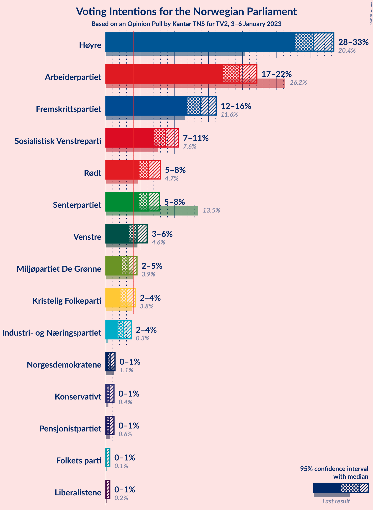
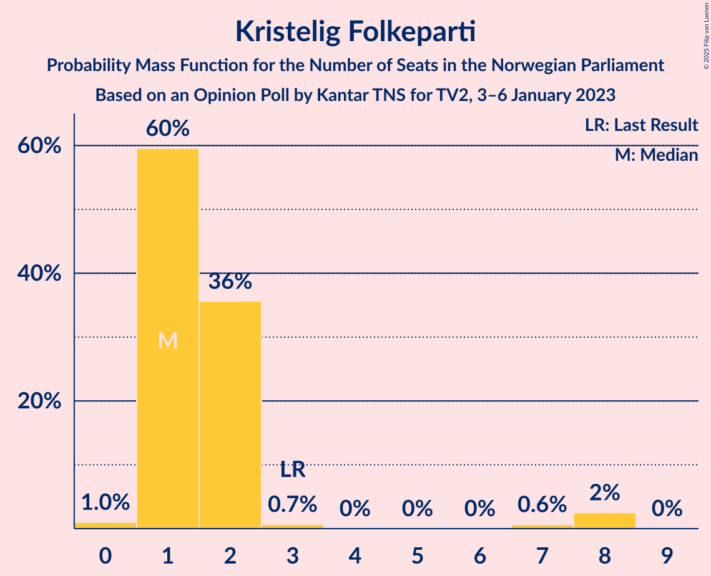
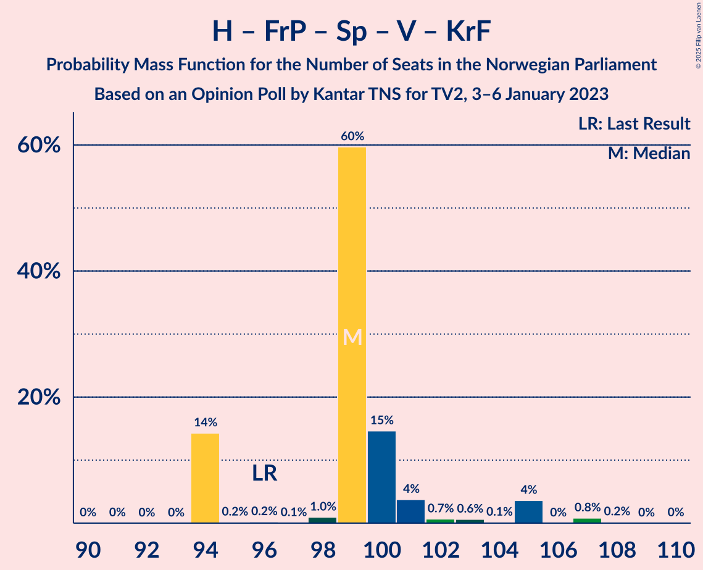

# Opinion Poll by Kantar TNS for TV2, 3–6 January 2023

<a href="#voting-intentions">Voting Intentions</a> | <a href="#seats">Seats</a> | <a href="#coalitions">Coalitions</a> | <a href="#technical-information">Technical Information</a>

## Voting Intentions

### Confidence Intervals

| Party | Last Result | Poll Result | 80% Confidence Interval | 90% Confidence Interval | 95% Confidence Interval | 99% Confidence Interval |
|:-----:|:-----------:|:-----------:|:-----------------------:|:-----------------------:|:-----------------------:|:-----------------------:|
| Høyre | 20.4% | 30.4% | 28.6–32.3% |28.1–32.9% |27.6–33.3% |26.7–34.3% |
| Arbeiderpartiet | 26.2% | 19.5% | 18.0–21.2% |17.5–21.7% |17.1–22.1% |16.4–22.9% |
| Fremskrittspartiet | 11.6% | 13.8% | 12.5–15.3% |12.1–15.8% |11.8–16.1% |11.2–16.9% |
| Sosialistisk Venstreparti | 7.6% | 8.7% | 7.6–9.9% |7.3–10.3% |7.1–10.6% |6.6–11.2% |
| Rødt | 4.7% | 6.3% | 5.4–7.4% |5.1–7.7% |4.9–8.0% |4.5–8.5% |
| Senterpartiet | 13.5% | 6.2% | 5.3–7.3% |5.0–7.6% |4.8–7.8% |4.4–8.4% |
| Venstre | 4.6% | 4.5% | 3.8–5.5% |3.6–5.8% |3.4–6.0% |3.1–6.5% |
| Miljøpartiet De Grønne | 3.9% | 3.2% | 2.6–4.1% |2.4–4.3% |2.3–4.5% |2.0–5.0% |
| Kristelig Folkeparti | 3.8% | 3.0% | 2.4–3.9% |2.3–4.1% |2.1–4.3% |1.9–4.7% |
| Industri- og Næringspartiet | 0.3% | 2.5% | 2.0–3.3% |1.8–3.5% |1.7–3.7% |1.5–4.1% |
| Norgesdemokratene | 1.1% | 0.6% | 0.4–1.1% |0.3–1.2% |0.3–1.3% |0.2–1.6% |
| Konservativt | 0.4% | 0.5% | 0.3–0.9% |0.3–1.1% |0.2–1.2% |0.2–1.4% |
| Pensjonistpartiet | 0.6% | 0.5% | 0.3–0.9% |0.3–1.1% |0.2–1.2% |0.2–1.4% |
| Folkets parti | 0.1% | 0.1% | 0.0–0.4% |0.0–0.5% |0.0–0.6% |0.0–0.8% |
| Liberalistene | 0.2% | 0.1% | 0.0–0.4% |0.0–0.5% |0.0–0.6% |0.0–0.8% |

*Note:* The poll result column reflects the actual value used in the calculations. Published results may vary slightly, and in addition be rounded to fewer digits.

## Seats

### Confidence Intervals

| Party | Last Result | Median | 80% Confidence Interval | 90% Confidence Interval | 95% Confidence Interval | 99% Confidence Interval |
|:-----:|:-----------:|:------:|:-----------------------:|:-----------------------:|:-----------------------:|:-----------------------:|
| <a href="#høyre">Høyre</a> | 36 | 58 | 55–58 |53–58 |51–58 |49–60 |
| <a href="#arbeiderpartiet">Arbeiderpartiet</a> | 48 | 38 | 37–40 |35–40 |34–40 |33–42 |
| <a href="#fremskrittspartiet">Fremskrittspartiet</a> | 21 | 25 | 20–26 |20–30 |20–30 |18–30 |
| <a href="#sosialistisk-venstreparti">Sosialistisk Venstreparti</a> | 13 | 13 | 13–19 |13–19 |13–19 |12–20 |
| <a href="#rødt">Rødt</a> | 8 | 10 | 10–12 |9–12 |8–12 |8–13 |
| <a href="#senterpartiet">Senterpartiet</a> | 28 | 7 | 7–13 |7–13 |7–15 |1–15 |
| <a href="#venstre">Venstre</a> | 8 | 8 | 3–10 |3–10 |3–10 |3–10 |
| <a href="#miljøpartiet-de-grønne">Miljøpartiet De Grønne</a> | 3 | 7 | 1–7 |1–7 |1–7 |1–7 |
| <a href="#kristelig-folkeparti">Kristelig Folkeparti</a> | 3 | 1 | 1–2 |1–2 |1–8 |0–8 |
| <a href="#industri--og-næringspartiet">Industri- og Næringspartiet</a> | 0 | 1 | 1–2 |0–2 |0–2 |0–7 |
| <a href="#norgesdemokratene">Norgesdemokratene</a> | 0 | 0 | 0 |0 |0 |0 |
| <a href="#konservativt">Konservativt</a> | 0 | 0 | 0 |0 |0 |0 |
| <a href="#pensjonistpartiet">Pensjonistpartiet</a> | 0 | 0 | 0 |0 |0 |0 |
| <a href="#folkets-parti">Folkets parti</a> | 0 | 0 | 0 |0 |0 |0 |
| <a href="#liberalistene">Liberalistene</a> | 0 | 0 | 0 |0 |0 |0 |

### Høyre

*For a full overview of the results for this party, see the [Høyre](party-høyre.html) page.*

| Number of Seats | Probability | Accumulated | Special Marks |
|:---------------:|:-----------:|:-----------:|:-------------:|
| 36 | 0% | 100% | Last Result |
| 37 | 0% | 100% |  |
| 38 | 0% | 100% |  |
| 39 | 0% | 100% |  |
| 40 | 0% | 100% |  |
| 41 | 0% | 100% |  |
| 42 | 0% | 100% |  |
| 43 | 0% | 100% |  |
| 44 | 0% | 100% |  |
| 45 | 0% | 100% |  |
| 46 | 0% | 100% |  |
| 47 | 0% | 100% |  |
| 48 | 0.1% | 100% |  |
| 49 | 2% | 99.9% |  |
| 50 | 0.1% | 98% |  |
| 51 | 0.9% | 98% |  |
| 52 | 2% | 97% |  |
| 53 | 3% | 95% |  |
| 54 | 0.2% | 92% |  |
| 55 | 17% | 92% |  |
| 56 | 14% | 75% |  |
| 57 | 0.1% | 61% |  |
| 58 | 60% | 60% | Median |
| 59 | 0.1% | 0.9% |  |
| 60 | 0.6% | 0.9% |  |
| 61 | 0% | 0.2% |  |
| 62 | 0.2% | 0.2% |  |
| 63 | 0% | 0.1% |  |
| 64 | 0% | 0% |  |

### Arbeiderpartiet

*For a full overview of the results for this party, see the [Arbeiderpartiet](party-arbeiderpartiet.html) page.*

| Number of Seats | Probability | Accumulated | Special Marks |
|:---------------:|:-----------:|:-----------:|:-------------:|
| 32 | 0.1% | 100% |  |
| 33 | 0.6% | 99.8% |  |
| 34 | 2% | 99.2% |  |
| 35 | 3% | 97% |  |
| 36 | 0.1% | 95% |  |
| 37 | 15% | 95% |  |
| 38 | 60% | 80% | Median |
| 39 | 4% | 20% |  |
| 40 | 16% | 17% |  |
| 41 | 0% | 1.1% |  |
| 42 | 0.8% | 1.0% |  |
| 43 | 0.1% | 0.3% |  |
| 44 | 0% | 0.1% |  |
| 45 | 0% | 0.1% |  |
| 46 | 0.1% | 0.1% |  |
| 47 | 0% | 0% |  |
| 48 | 0% | 0% | Last Result |

### Fremskrittspartiet

*For a full overview of the results for this party, see the [Fremskrittspartiet](party-fremskrittspartiet.html) page.*

| Number of Seats | Probability | Accumulated | Special Marks |
|:---------------:|:-----------:|:-----------:|:-------------:|
| 18 | 0.8% | 100% |  |
| 19 | 0.6% | 99.2% |  |
| 20 | 14% | 98.6% |  |
| 21 | 0% | 85% | Last Result |
| 22 | 1.1% | 85% |  |
| 23 | 0.2% | 84% |  |
| 24 | 14% | 83% |  |
| 25 | 60% | 70% | Median |
| 26 | 0.6% | 10% |  |
| 27 | 2% | 9% |  |
| 28 | 2% | 7% |  |
| 29 | 0.1% | 6% |  |
| 30 | 5% | 6% |  |
| 31 | 0.1% | 0.1% |  |
| 32 | 0% | 0.1% |  |
| 33 | 0% | 0% |  |

### Sosialistisk Venstreparti

*For a full overview of the results for this party, see the [Sosialistisk Venstreparti](party-sosialistiskvenstreparti.html) page.*

| Number of Seats | Probability | Accumulated | Special Marks |
|:---------------:|:-----------:|:-----------:|:-------------:|
| 12 | 0.7% | 100% |  |
| 13 | 65% | 99.3% | Last Result, Median |
| 14 | 2% | 34% |  |
| 15 | 0.4% | 32% |  |
| 16 | 1.1% | 32% |  |
| 17 | 15% | 31% |  |
| 18 | 0.2% | 16% |  |
| 19 | 15% | 16% |  |
| 20 | 0.6% | 0.6% |  |
| 21 | 0% | 0% |  |

### Rødt

*For a full overview of the results for this party, see the [Rødt](party-rødt.html) page.*

| Number of Seats | Probability | Accumulated | Special Marks |
|:---------------:|:-----------:|:-----------:|:-------------:|
| 8 | 4% | 100% | Last Result |
| 9 | 2% | 96% |  |
| 10 | 62% | 95% | Median |
| 11 | 16% | 32% |  |
| 12 | 16% | 17% |  |
| 13 | 0.2% | 0.7% |  |
| 14 | 0.1% | 0.5% |  |
| 15 | 0.3% | 0.4% |  |
| 16 | 0% | 0.1% |  |
| 17 | 0.1% | 0.1% |  |
| 18 | 0% | 0% |  |

### Senterpartiet

*For a full overview of the results for this party, see the [Senterpartiet](party-senterpartiet.html) page.*

| Number of Seats | Probability | Accumulated | Special Marks |
|:---------------:|:-----------:|:-----------:|:-------------:|
| 1 | 2% | 100% |  |
| 2 | 0% | 98% |  |
| 3 | 0% | 98% |  |
| 4 | 0% | 98% |  |
| 5 | 0% | 98% |  |
| 6 | 0% | 98% |  |
| 7 | 59% | 98% | Median |
| 8 | 0.6% | 39% |  |
| 9 | 15% | 38% |  |
| 10 | 5% | 23% |  |
| 11 | 0.2% | 19% |  |
| 12 | 0.4% | 18% |  |
| 13 | 14% | 18% |  |
| 14 | 0.9% | 4% |  |
| 15 | 3% | 3% |  |
| 16 | 0% | 0% |  |
| 17 | 0% | 0% |  |
| 18 | 0% | 0% |  |
| 19 | 0% | 0% |  |
| 20 | 0% | 0% |  |
| 21 | 0% | 0% |  |
| 22 | 0% | 0% |  |
| 23 | 0% | 0% |  |
| 24 | 0% | 0% |  |
| 25 | 0% | 0% |  |
| 26 | 0% | 0% |  |
| 27 | 0% | 0% |  |
| 28 | 0% | 0% | Last Result |

### Venstre

*For a full overview of the results for this party, see the [Venstre](party-venstre.html) page.*

| Number of Seats | Probability | Accumulated | Special Marks |
|:---------------:|:-----------:|:-----------:|:-------------:|
| 2 | 0.4% | 100% |  |
| 3 | 14% | 99.5% |  |
| 4 | 0% | 86% |  |
| 5 | 0% | 86% |  |
| 6 | 0% | 86% |  |
| 7 | 0.2% | 86% |  |
| 8 | 67% | 86% | Last Result, Median |
| 9 | 4% | 19% |  |
| 10 | 15% | 15% |  |
| 11 | 0.2% | 0.3% |  |
| 12 | 0% | 0.1% |  |
| 13 | 0% | 0.1% |  |
| 14 | 0.1% | 0.1% |  |
| 15 | 0% | 0% |  |

### Miljøpartiet De Grønne

*For a full overview of the results for this party, see the [Miljøpartiet De Grønne](party-miljøpartietdegrønne.html) page.*

| Number of Seats | Probability | Accumulated | Special Marks |
|:---------------:|:-----------:|:-----------:|:-------------:|
| 1 | 34% | 100% |  |
| 2 | 5% | 66% |  |
| 3 | 0.8% | 61% | Last Result |
| 4 | 0% | 60% |  |
| 5 | 0% | 60% |  |
| 6 | 0% | 60% |  |
| 7 | 60% | 60% | Median |
| 8 | 0.1% | 0.3% |  |
| 9 | 0.1% | 0.1% |  |
| 10 | 0.1% | 0.1% |  |
| 11 | 0% | 0% |  |

### Kristelig Folkeparti

*For a full overview of the results for this party, see the [Kristelig Folkeparti](party-kristeligfolkeparti.html) page.*

| Number of Seats | Probability | Accumulated | Special Marks |
|:---------------:|:-----------:|:-----------:|:-------------:|
| 0 | 1.0% | 100% |  |
| 1 | 60% | 99.0% | Median |
| 2 | 36% | 39% |  |
| 3 | 0.7% | 4% | Last Result |
| 4 | 0% | 3% |  |
| 5 | 0% | 3% |  |
| 6 | 0% | 3% |  |
| 7 | 0.6% | 3% |  |
| 8 | 2% | 3% |  |
| 9 | 0% | 0% |  |

### Industri- og Næringspartiet

*For a full overview of the results for this party, see the [Industri- og Næringspartiet](party-industri-ognæringspartiet.html) page.*

| Number of Seats | Probability | Accumulated | Special Marks |
|:---------------:|:-----------:|:-----------:|:-------------:|
| 0 | 6% | 100% | Last Result |
| 1 | 60% | 94% | Median |
| 2 | 32% | 34% |  |
| 3 | 0.1% | 2% |  |
| 4 | 0% | 2% |  |
| 5 | 0% | 2% |  |
| 6 | 0% | 2% |  |
| 7 | 2% | 2% |  |
| 8 | 0% | 0.1% |  |
| 9 | 0% | 0% |  |

### Norgesdemokratene

*For a full overview of the results for this party, see the [Norgesdemokratene](party-norgesdemokratene.html) page.*

| Number of Seats | Probability | Accumulated | Special Marks |
|:---------------:|:-----------:|:-----------:|:-------------:|
| 0 | 100% | 100% | Last Result, Median |

### Konservativt

*For a full overview of the results for this party, see the [Konservativt](party-konservativt.html) page.*

| Number of Seats | Probability | Accumulated | Special Marks |
|:---------------:|:-----------:|:-----------:|:-------------:|
| 0 | 100% | 100% | Last Result, Median |

### Pensjonistpartiet

*For a full overview of the results for this party, see the [Pensjonistpartiet](party-pensjonistpartiet.html) page.*

| Number of Seats | Probability | Accumulated | Special Marks |
|:---------------:|:-----------:|:-----------:|:-------------:|
| 0 | 100% | 100% | Last Result, Median |

### Folkets parti

*For a full overview of the results for this party, see the [Folkets parti](party-folketsparti.html) page.*

| Number of Seats | Probability | Accumulated | Special Marks |
|:---------------:|:-----------:|:-----------:|:-------------:|
| 0 | 100% | 100% | Last Result, Median |

### Liberalistene

*For a full overview of the results for this party, see the [Liberalistene](party-liberalistene.html) page.*

| Number of Seats | Probability | Accumulated | Special Marks |
|:---------------:|:-----------:|:-----------:|:-------------:|
| 0 | 100% | 100% | Last Result, Median |

## Coalitions

### Confidence Intervals

| Coalition | Last Result | Median | Majority? | 80% Confidence Interval | 90% Confidence Interval | 95% Confidence Interval | 99% Confidence Interval |
|:---------:|:-----------:|:------:|:---------:|:-----------------------:|:-----------------------:|:-----------------------:|:-----------------------:|
| Høyre – Fremskrittspartiet – Senterpartiet – Venstre – Kristelig Folkeparti | 96 | 99 | 100% | 94–100 | 94–103 | 94–105 | 94–107 |
| Høyre – Fremskrittspartiet – Venstre – Miljøpartiet De Grønne – Kristelig Folkeparti | 71 | 99 | 99.9% | 86–99 | 86–99 | 86–99 | 86–102 |
| Høyre – Fremskrittspartiet – Venstre – Kristelig Folkeparti | 68 | 92 | 98.8% | 85–92 | 85–95 | 85–95 | 80–100 |
| Høyre – Fremskrittspartiet – Venstre | 65 | 91 | 82% | 83–91 | 83–92 | 83–93 | 78–93 |
| Høyre – Fremskrittspartiet | 57 | 83 | 4% | 75–83 | 75–83 | 75–85 | 70–85 |
| Arbeiderpartiet – Sosialistisk Venstreparti – Rødt – Senterpartiet – Miljøpartiet De Grønne | 100 | 75 | 1.0% | 75–81 | 71–81 | 71–81 | 68–88 |
| Arbeiderpartiet – Sosialistisk Venstreparti – Rødt – Senterpartiet | 97 | 68 | 0.1% | 68–80 | 68–80 | 68–80 | 66–81 |
| Arbeiderpartiet – Sosialistisk Venstreparti – Rødt – Miljøpartiet De Grønne | 72 | 68 | 0% | 66–72 | 61–72 | 61–72 | 60–74 |
| Arbeiderpartiet – Sosialistisk Venstreparti – Senterpartiet – Miljøpartiet De Grønne – Kristelig Folkeparti | 95 | 66 | 0% | 66–71 | 65–71 | 65–71 | 64–79 |
| Arbeiderpartiet – Sosialistisk Venstreparti – Senterpartiet – Miljøpartiet De Grønne | 92 | 65 | 0% | 65–69 | 63–69 | 63–69 | 56–77 |
| Høyre – Venstre – Kristelig Folkeparti | 47 | 67 | 0% | 61–67 | 61–67 | 61–68 | 59–75 |
| Arbeiderpartiet – Sosialistisk Venstreparti – Senterpartiet | 89 | 58 | 0% | 58–68 | 58–68 | 58–68 | 54–70 |
| Arbeiderpartiet – Sosialistisk Venstreparti | 61 | 51 | 0% | 51–59 | 51–59 | 50–59 | 48–59 |
| Arbeiderpartiet – Senterpartiet – Miljøpartiet De Grønne – Kristelig Folkeparti | 82 | 53 | 0% | 52–53 | 52–54 | 49–58 | 45–65 |
| Arbeiderpartiet – Senterpartiet – Kristelig Folkeparti | 79 | 46 | 0% | 46–52 | 46–52 | 46–55 | 43–58 |
| Arbeiderpartiet – Senterpartiet | 76 | 45 | 0% | 45–50 | 45–50 | 44–50 | 35–56 |
| Senterpartiet – Venstre – Kristelig Folkeparti | 39 | 16 | 0% | 14–25 | 14–25 | 14–25 | 14–27 |

### Høyre – Fremskrittspartiet – Senterpartiet – Venstre – Kristelig Folkeparti

| Number of Seats | Probability | Accumulated | Special Marks |
|:---------------:|:-----------:|:-----------:|:-------------:|
| 91 | 0% | 100% |  |
| 92 | 0% | 99.9% |  |
| 93 | 0% | 99.9% |  |
| 94 | 14% | 99.9% |  |
| 95 | 0.2% | 86% |  |
| 96 | 0.2% | 85% | Last Result |
| 97 | 0.1% | 85% |  |
| 98 | 1.0% | 85% |  |
| 99 | 60% | 84% | Median |
| 100 | 15% | 25% |  |
| 101 | 4% | 10% |  |
| 102 | 0.7% | 6% |  |
| 103 | 0.6% | 5% |  |
| 104 | 0.1% | 5% |  |
| 105 | 4% | 5% |  |
| 106 | 0% | 1.1% |  |
| 107 | 0.8% | 1.1% |  |
| 108 | 0.2% | 0.2% |  |
| 109 | 0% | 0.1% |  |
| 110 | 0% | 0% |  |

### Høyre – Fremskrittspartiet – Venstre – Miljøpartiet De Grønne – Kristelig Folkeparti

| Number of Seats | Probability | Accumulated | Special Marks |
|:---------------:|:-----------:|:-----------:|:-------------:|
| 71 | 0% | 100% | Last Result |
| 72 | 0% | 100% |  |
| 73 | 0% | 100% |  |
| 74 | 0% | 100% |  |
| 75 | 0% | 100% |  |
| 76 | 0% | 100% |  |
| 77 | 0% | 100% |  |
| 78 | 0% | 100% |  |
| 79 | 0% | 100% |  |
| 80 | 0% | 100% |  |
| 81 | 0% | 100% |  |
| 82 | 0% | 100% |  |
| 83 | 0% | 100% |  |
| 84 | 0% | 99.9% |  |
| 85 | 0.1% | 99.9% | Majority |
| 86 | 14% | 99.9% |  |
| 87 | 0.9% | 86% |  |
| 88 | 16% | 85% |  |
| 89 | 0.2% | 69% |  |
| 90 | 0.9% | 69% |  |
| 91 | 0.9% | 68% |  |
| 92 | 0.2% | 67% |  |
| 93 | 1.0% | 67% |  |
| 94 | 0.1% | 66% |  |
| 95 | 0% | 66% |  |
| 96 | 4% | 66% |  |
| 97 | 0.7% | 62% |  |
| 98 | 0% | 61% |  |
| 99 | 59% | 61% | Median |
| 100 | 0.2% | 2% |  |
| 101 | 0% | 2% |  |
| 102 | 2% | 2% |  |
| 103 | 0% | 0.1% |  |
| 104 | 0% | 0% |  |

### Høyre – Fremskrittspartiet – Venstre – Kristelig Folkeparti

| Number of Seats | Probability | Accumulated | Special Marks |
|:---------------:|:-----------:|:-----------:|:-------------:|
| 68 | 0% | 100% | Last Result |
| 69 | 0% | 100% |  |
| 70 | 0% | 100% |  |
| 71 | 0% | 100% |  |
| 72 | 0% | 100% |  |
| 73 | 0% | 100% |  |
| 74 | 0% | 100% |  |
| 75 | 0% | 100% |  |
| 76 | 0% | 100% |  |
| 77 | 0% | 100% |  |
| 78 | 0% | 100% |  |
| 79 | 0% | 100% |  |
| 80 | 0.7% | 99.9% |  |
| 81 | 0.1% | 99.2% |  |
| 82 | 0% | 99.1% |  |
| 83 | 0.2% | 99.0% |  |
| 84 | 0.1% | 98.9% |  |
| 85 | 14% | 98.8% | Majority |
| 86 | 2% | 85% |  |
| 87 | 14% | 83% |  |
| 88 | 0.1% | 69% |  |
| 89 | 0.9% | 69% |  |
| 90 | 0.9% | 68% |  |
| 91 | 0.1% | 67% |  |
| 92 | 60% | 67% | Median |
| 93 | 0.1% | 7% |  |
| 94 | 1.1% | 7% |  |
| 95 | 4% | 6% |  |
| 96 | 0.1% | 2% |  |
| 97 | 0% | 2% |  |
| 98 | 0.2% | 2% |  |
| 99 | 0% | 2% |  |
| 100 | 2% | 2% |  |
| 101 | 0% | 0.1% |  |
| 102 | 0% | 0% |  |

### Høyre – Fremskrittspartiet – Venstre

| Number of Seats | Probability | Accumulated | Special Marks |
|:---------------:|:-----------:|:-----------:|:-------------:|
| 65 | 0% | 100% | Last Result |
| 66 | 0% | 100% |  |
| 67 | 0% | 100% |  |
| 68 | 0% | 100% |  |
| 69 | 0% | 100% |  |
| 70 | 0% | 100% |  |
| 71 | 0% | 100% |  |
| 72 | 0% | 100% |  |
| 73 | 0% | 100% |  |
| 74 | 0% | 100% |  |
| 75 | 0% | 100% |  |
| 76 | 0.1% | 100% |  |
| 77 | 0% | 99.9% |  |
| 78 | 0.7% | 99.9% |  |
| 79 | 0.1% | 99.2% |  |
| 80 | 0% | 99.1% |  |
| 81 | 0.1% | 99.1% |  |
| 82 | 0.8% | 99.0% |  |
| 83 | 14% | 98% |  |
| 84 | 2% | 84% |  |
| 85 | 14% | 82% | Majority |
| 86 | 0.1% | 68% |  |
| 87 | 0.6% | 68% |  |
| 88 | 0.2% | 68% |  |
| 89 | 1.0% | 67% |  |
| 90 | 1.0% | 66% |  |
| 91 | 59% | 65% | Median |
| 92 | 2% | 6% |  |
| 93 | 4% | 4% |  |
| 94 | 0% | 0.2% |  |
| 95 | 0.2% | 0.2% |  |
| 96 | 0% | 0% |  |

### Høyre – Fremskrittspartiet

| Number of Seats | Probability | Accumulated | Special Marks |
|:---------------:|:-----------:|:-----------:|:-------------:|
| 57 | 0% | 100% | Last Result |
| 58 | 0% | 100% |  |
| 59 | 0% | 100% |  |
| 60 | 0% | 100% |  |
| 61 | 0% | 100% |  |
| 62 | 0% | 100% |  |
| 63 | 0% | 100% |  |
| 64 | 0% | 100% |  |
| 65 | 0% | 100% |  |
| 66 | 0% | 100% |  |
| 67 | 0% | 100% |  |
| 68 | 0% | 100% |  |
| 69 | 0.1% | 99.9% |  |
| 70 | 0.7% | 99.8% |  |
| 71 | 0% | 99.1% |  |
| 72 | 0% | 99.1% |  |
| 73 | 0.8% | 99.1% |  |
| 74 | 0.2% | 98% |  |
| 75 | 14% | 98% |  |
| 76 | 2% | 84% |  |
| 77 | 0% | 82% |  |
| 78 | 0.1% | 82% |  |
| 79 | 0.7% | 82% |  |
| 80 | 14% | 81% |  |
| 81 | 1.1% | 67% |  |
| 82 | 0.7% | 66% |  |
| 83 | 61% | 65% | Median |
| 84 | 0% | 4% |  |
| 85 | 4% | 4% | Majority |
| 86 | 0.2% | 0.4% |  |
| 87 | 0% | 0.2% |  |
| 88 | 0% | 0.2% |  |
| 89 | 0% | 0.2% |  |
| 90 | 0% | 0.2% |  |
| 91 | 0% | 0.2% |  |
| 92 | 0.2% | 0.2% |  |
| 93 | 0% | 0% |  |

### Arbeiderpartiet – Sosialistisk Venstreparti – Rødt – Senterpartiet – Miljøpartiet De Grønne

| Number of Seats | Probability | Accumulated | Special Marks |
|:---------------:|:-----------:|:-----------:|:-------------:|
| 65 | 0% | 100% |  |
| 66 | 0% | 99.9% |  |
| 67 | 0% | 99.9% |  |
| 68 | 2% | 99.9% |  |
| 69 | 0% | 98% |  |
| 70 | 0.1% | 98% |  |
| 71 | 4% | 98% |  |
| 72 | 0.6% | 94% |  |
| 73 | 0.1% | 94% |  |
| 74 | 0.6% | 94% |  |
| 75 | 62% | 93% | Median |
| 76 | 0.9% | 32% |  |
| 77 | 0.2% | 31% |  |
| 78 | 1.0% | 31% |  |
| 79 | 15% | 30% |  |
| 80 | 0.1% | 15% |  |
| 81 | 14% | 15% |  |
| 82 | 0% | 1.3% |  |
| 83 | 0.3% | 1.3% |  |
| 84 | 0% | 1.0% |  |
| 85 | 0.1% | 1.0% | Majority |
| 86 | 0% | 0.9% |  |
| 87 | 0.1% | 0.9% |  |
| 88 | 0.7% | 0.8% |  |
| 89 | 0.1% | 0.1% |  |
| 90 | 0% | 0% |  |
| 91 | 0% | 0% |  |
| 92 | 0% | 0% |  |
| 93 | 0% | 0% |  |
| 94 | 0% | 0% |  |
| 95 | 0% | 0% |  |
| 96 | 0% | 0% |  |
| 97 | 0% | 0% |  |
| 98 | 0% | 0% |  |
| 99 | 0% | 0% |  |
| 100 | 0% | 0% | Last Result |

### Arbeiderpartiet – Sosialistisk Venstreparti – Rødt – Senterpartiet

| Number of Seats | Probability | Accumulated | Special Marks |
|:---------------:|:-----------:|:-----------:|:-------------:|
| 63 | 0% | 100% |  |
| 64 | 0% | 99.9% |  |
| 65 | 0% | 99.9% |  |
| 66 | 2% | 99.9% |  |
| 67 | 0% | 98% |  |
| 68 | 59% | 98% | Median |
| 69 | 0.1% | 39% |  |
| 70 | 4% | 39% |  |
| 71 | 0.6% | 34% |  |
| 72 | 0.1% | 34% |  |
| 73 | 2% | 34% |  |
| 74 | 0.1% | 32% |  |
| 75 | 1.0% | 32% |  |
| 76 | 0.3% | 31% |  |
| 77 | 0.9% | 30% |  |
| 78 | 15% | 29% |  |
| 79 | 0.1% | 15% |  |
| 80 | 14% | 15% |  |
| 81 | 0.8% | 0.9% |  |
| 82 | 0.1% | 0.2% |  |
| 83 | 0% | 0.1% |  |
| 84 | 0% | 0.1% |  |
| 85 | 0% | 0.1% | Majority |
| 86 | 0% | 0% |  |
| 87 | 0% | 0% |  |
| 88 | 0% | 0% |  |
| 89 | 0% | 0% |  |
| 90 | 0% | 0% |  |
| 91 | 0% | 0% |  |
| 92 | 0% | 0% |  |
| 93 | 0% | 0% |  |
| 94 | 0% | 0% |  |
| 95 | 0% | 0% |  |
| 96 | 0% | 0% |  |
| 97 | 0% | 0% | Last Result |

### Arbeiderpartiet – Sosialistisk Venstreparti – Rødt – Miljøpartiet De Grønne

| Number of Seats | Probability | Accumulated | Special Marks |
|:---------------:|:-----------:|:-----------:|:-------------:|
| 56 | 0% | 100% |  |
| 57 | 0% | 99.9% |  |
| 58 | 0.1% | 99.9% |  |
| 59 | 0% | 99.9% |  |
| 60 | 2% | 99.8% |  |
| 61 | 4% | 98% |  |
| 62 | 0.1% | 93% |  |
| 63 | 0.2% | 93% |  |
| 64 | 0.5% | 93% |  |
| 65 | 0.6% | 92% |  |
| 66 | 14% | 92% |  |
| 67 | 2% | 78% |  |
| 68 | 60% | 76% | Median |
| 69 | 0.2% | 16% |  |
| 70 | 1.0% | 16% |  |
| 71 | 0.2% | 15% |  |
| 72 | 14% | 15% | Last Result |
| 73 | 0.1% | 1.0% |  |
| 74 | 0.8% | 0.9% |  |
| 75 | 0% | 0% |  |

### Arbeiderpartiet – Sosialistisk Venstreparti – Senterpartiet – Miljøpartiet De Grønne – Kristelig Folkeparti

| Number of Seats | Probability | Accumulated | Special Marks |
|:---------------:|:-----------:|:-----------:|:-------------:|
| 56 | 0.2% | 100% |  |
| 57 | 0% | 99.8% |  |
| 58 | 0% | 99.8% |  |
| 59 | 0% | 99.8% |  |
| 60 | 0% | 99.8% |  |
| 61 | 0% | 99.8% |  |
| 62 | 0% | 99.8% |  |
| 63 | 0.1% | 99.8% |  |
| 64 | 2% | 99.7% |  |
| 65 | 4% | 98% |  |
| 66 | 60% | 94% | Median |
| 67 | 3% | 34% |  |
| 68 | 0.2% | 31% |  |
| 69 | 0.9% | 31% |  |
| 70 | 14% | 30% |  |
| 71 | 14% | 16% |  |
| 72 | 0.1% | 2% |  |
| 73 | 0% | 2% |  |
| 74 | 0.1% | 2% |  |
| 75 | 0.9% | 2% |  |
| 76 | 0.1% | 1.1% |  |
| 77 | 0% | 1.0% |  |
| 78 | 0.1% | 1.0% |  |
| 79 | 0.7% | 0.9% |  |
| 80 | 0.1% | 0.1% |  |
| 81 | 0% | 0% |  |
| 82 | 0% | 0% |  |
| 83 | 0% | 0% |  |
| 84 | 0% | 0% |  |
| 85 | 0% | 0% | Majority |
| 86 | 0% | 0% |  |
| 87 | 0% | 0% |  |
| 88 | 0% | 0% |  |
| 89 | 0% | 0% |  |
| 90 | 0% | 0% |  |
| 91 | 0% | 0% |  |
| 92 | 0% | 0% |  |
| 93 | 0% | 0% |  |
| 94 | 0% | 0% |  |
| 95 | 0% | 0% | Last Result |

### Arbeiderpartiet – Sosialistisk Venstreparti – Senterpartiet – Miljøpartiet De Grønne

| Number of Seats | Probability | Accumulated | Special Marks |
|:---------------:|:-----------:|:-----------:|:-------------:|
| 53 | 0.2% | 100% |  |
| 54 | 0% | 99.8% |  |
| 55 | 0.1% | 99.8% |  |
| 56 | 2% | 99.8% |  |
| 57 | 0% | 98% |  |
| 58 | 0% | 98% |  |
| 59 | 0% | 98% |  |
| 60 | 0% | 98% |  |
| 61 | 0.1% | 98% |  |
| 62 | 0% | 98% |  |
| 63 | 4% | 98% |  |
| 64 | 0.7% | 94% |  |
| 65 | 62% | 93% | Median |
| 66 | 0.1% | 31% |  |
| 67 | 2% | 31% |  |
| 68 | 14% | 29% |  |
| 69 | 13% | 15% |  |
| 70 | 0.1% | 1.4% |  |
| 71 | 0% | 1.3% |  |
| 72 | 0% | 1.3% |  |
| 73 | 0.1% | 1.2% |  |
| 74 | 0.1% | 1.1% |  |
| 75 | 0.1% | 1.0% |  |
| 76 | 0% | 0.9% |  |
| 77 | 0.7% | 0.9% |  |
| 78 | 0.1% | 0.1% |  |
| 79 | 0% | 0% |  |
| 80 | 0% | 0% |  |
| 81 | 0% | 0% |  |
| 82 | 0% | 0% |  |
| 83 | 0% | 0% |  |
| 84 | 0% | 0% |  |
| 85 | 0% | 0% | Majority |
| 86 | 0% | 0% |  |
| 87 | 0% | 0% |  |
| 88 | 0% | 0% |  |
| 89 | 0% | 0% |  |
| 90 | 0% | 0% |  |
| 91 | 0% | 0% |  |
| 92 | 0% | 0% | Last Result |

### Høyre – Venstre – Kristelig Folkeparti

| Number of Seats | Probability | Accumulated | Special Marks |
|:---------------:|:-----------:|:-----------:|:-------------:|
| 47 | 0% | 100% | Last Result |
| 48 | 0% | 100% |  |
| 49 | 0% | 100% |  |
| 50 | 0% | 100% |  |
| 51 | 0% | 100% |  |
| 52 | 0% | 100% |  |
| 53 | 0% | 100% |  |
| 54 | 0% | 100% |  |
| 55 | 0.1% | 100% |  |
| 56 | 0% | 99.9% |  |
| 57 | 0.1% | 99.9% |  |
| 58 | 0.1% | 99.9% |  |
| 59 | 2% | 99.8% |  |
| 60 | 0.1% | 98% |  |
| 61 | 15% | 98% |  |
| 62 | 0.8% | 83% |  |
| 63 | 0.2% | 82% |  |
| 64 | 0.9% | 82% |  |
| 65 | 4% | 81% |  |
| 66 | 0.1% | 77% |  |
| 67 | 73% | 77% | Median |
| 68 | 1.5% | 4% |  |
| 69 | 0.1% | 2% |  |
| 70 | 2% | 2% |  |
| 71 | 0.1% | 0.7% |  |
| 72 | 0% | 0.6% |  |
| 73 | 0% | 0.6% |  |
| 74 | 0% | 0.6% |  |
| 75 | 0.5% | 0.6% |  |
| 76 | 0% | 0% |  |

### Arbeiderpartiet – Sosialistisk Venstreparti – Senterpartiet

| Number of Seats | Probability | Accumulated | Special Marks |
|:---------------:|:-----------:|:-----------:|:-------------:|
| 51 | 0.2% | 100% |  |
| 52 | 0% | 99.8% |  |
| 53 | 0.1% | 99.8% |  |
| 54 | 2% | 99.8% |  |
| 55 | 0% | 98% |  |
| 56 | 0% | 98% |  |
| 57 | 0.1% | 98% |  |
| 58 | 59% | 98% | Median |
| 59 | 0.1% | 39% |  |
| 60 | 0.2% | 39% |  |
| 61 | 1.1% | 38% |  |
| 62 | 4% | 37% |  |
| 63 | 2% | 34% |  |
| 64 | 0.1% | 31% |  |
| 65 | 0.1% | 31% |  |
| 66 | 3% | 31% |  |
| 67 | 14% | 29% |  |
| 68 | 14% | 15% |  |
| 69 | 0% | 1.2% |  |
| 70 | 0.9% | 1.1% |  |
| 71 | 0% | 0.2% |  |
| 72 | 0% | 0.2% |  |
| 73 | 0% | 0.2% |  |
| 74 | 0.1% | 0.2% |  |
| 75 | 0% | 0% |  |
| 76 | 0% | 0% |  |
| 77 | 0% | 0% |  |
| 78 | 0% | 0% |  |
| 79 | 0% | 0% |  |
| 80 | 0% | 0% |  |
| 81 | 0% | 0% |  |
| 82 | 0% | 0% |  |
| 83 | 0% | 0% |  |
| 84 | 0% | 0% |  |
| 85 | 0% | 0% | Majority |
| 86 | 0% | 0% |  |
| 87 | 0% | 0% |  |
| 88 | 0% | 0% |  |
| 89 | 0% | 0% | Last Result |

### Arbeiderpartiet – Sosialistisk Venstreparti

| Number of Seats | Probability | Accumulated | Special Marks |
|:---------------:|:-----------:|:-----------:|:-------------:|
| 44 | 0.1% | 100% |  |
| 45 | 0% | 99.9% |  |
| 46 | 0.1% | 99.9% |  |
| 47 | 0.1% | 99.9% |  |
| 48 | 2% | 99.8% |  |
| 49 | 0.1% | 98% |  |
| 50 | 0.3% | 98% |  |
| 51 | 60% | 97% | Median |
| 52 | 4% | 37% |  |
| 53 | 2% | 33% |  |
| 54 | 14% | 30% |  |
| 55 | 0.1% | 16% |  |
| 56 | 2% | 16% |  |
| 57 | 0.8% | 15% |  |
| 58 | 0% | 14% |  |
| 59 | 13% | 14% |  |
| 60 | 0% | 0.2% |  |
| 61 | 0.1% | 0.2% | Last Result |
| 62 | 0.1% | 0.1% |  |
| 63 | 0% | 0% |  |

### Arbeiderpartiet – Senterpartiet – Miljøpartiet De Grønne – Kristelig Folkeparti

| Number of Seats | Probability | Accumulated | Special Marks |
|:---------------:|:-----------:|:-----------:|:-------------:|
| 41 | 0.2% | 100% |  |
| 42 | 0% | 99.8% |  |
| 43 | 0% | 99.8% |  |
| 44 | 0% | 99.8% |  |
| 45 | 2% | 99.8% |  |
| 46 | 0% | 98% |  |
| 47 | 0.1% | 98% |  |
| 48 | 0% | 98% |  |
| 49 | 0.2% | 98% |  |
| 50 | 0.9% | 97% |  |
| 51 | 0.2% | 96% |  |
| 52 | 17% | 96% |  |
| 53 | 73% | 79% | Median |
| 54 | 2% | 6% |  |
| 55 | 0.9% | 4% |  |
| 56 | 0% | 3% |  |
| 57 | 0% | 3% |  |
| 58 | 0.2% | 3% |  |
| 59 | 1.5% | 2% |  |
| 60 | 0% | 1.0% |  |
| 61 | 0% | 1.0% |  |
| 62 | 0.1% | 1.0% |  |
| 63 | 0% | 0.9% |  |
| 64 | 0% | 0.8% |  |
| 65 | 0.7% | 0.8% |  |
| 66 | 0% | 0.1% |  |
| 67 | 0.1% | 0.1% |  |
| 68 | 0% | 0% |  |
| 69 | 0% | 0% |  |
| 70 | 0% | 0% |  |
| 71 | 0% | 0% |  |
| 72 | 0% | 0% |  |
| 73 | 0% | 0% |  |
| 74 | 0% | 0% |  |
| 75 | 0% | 0% |  |
| 76 | 0% | 0% |  |
| 77 | 0% | 0% |  |
| 78 | 0% | 0% |  |
| 79 | 0% | 0% |  |
| 80 | 0% | 0% |  |
| 81 | 0% | 0% |  |
| 82 | 0% | 0% | Last Result |

### Arbeiderpartiet – Senterpartiet – Kristelig Folkeparti

| Number of Seats | Probability | Accumulated | Special Marks |
|:---------------:|:-----------:|:-----------:|:-------------:|
| 39 | 0.2% | 100% |  |
| 40 | 0% | 99.8% |  |
| 41 | 0% | 99.8% |  |
| 42 | 0% | 99.8% |  |
| 43 | 2% | 99.8% |  |
| 44 | 0% | 98% |  |
| 45 | 0% | 98% |  |
| 46 | 59% | 98% | Median |
| 47 | 0.1% | 38% |  |
| 48 | 0.2% | 38% |  |
| 49 | 1.0% | 38% |  |
| 50 | 0.5% | 37% |  |
| 51 | 17% | 36% |  |
| 52 | 16% | 19% |  |
| 53 | 0% | 3% |  |
| 54 | 0.9% | 3% |  |
| 55 | 0.1% | 3% |  |
| 56 | 0.6% | 2% |  |
| 57 | 0% | 2% |  |
| 58 | 2% | 2% |  |
| 59 | 0.1% | 0.3% |  |
| 60 | 0% | 0.2% |  |
| 61 | 0.2% | 0.2% |  |
| 62 | 0% | 0% |  |
| 63 | 0% | 0% |  |
| 64 | 0% | 0% |  |
| 65 | 0% | 0% |  |
| 66 | 0% | 0% |  |
| 67 | 0% | 0% |  |
| 68 | 0% | 0% |  |
| 69 | 0% | 0% |  |
| 70 | 0% | 0% |  |
| 71 | 0% | 0% |  |
| 72 | 0% | 0% |  |
| 73 | 0% | 0% |  |
| 74 | 0% | 0% |  |
| 75 | 0% | 0% |  |
| 76 | 0% | 0% |  |
| 77 | 0% | 0% |  |
| 78 | 0% | 0% |  |
| 79 | 0% | 0% | Last Result |

### Arbeiderpartiet – Senterpartiet

| Number of Seats | Probability | Accumulated | Special Marks |
|:---------------:|:-----------:|:-----------:|:-------------:|
| 35 | 2% | 100% |  |
| 36 | 0.2% | 98% |  |
| 37 | 0% | 98% |  |
| 38 | 0% | 98% |  |
| 39 | 0% | 98% |  |
| 40 | 0% | 98% |  |
| 41 | 0.6% | 98% |  |
| 42 | 0% | 98% |  |
| 43 | 0% | 98% |  |
| 44 | 0.1% | 98% |  |
| 45 | 59% | 97% | Median |
| 46 | 0.2% | 38% |  |
| 47 | 0.3% | 38% |  |
| 48 | 0.2% | 38% |  |
| 49 | 18% | 37% |  |
| 50 | 17% | 19% |  |
| 51 | 0% | 2% |  |
| 52 | 0.8% | 2% |  |
| 53 | 0.1% | 1.1% |  |
| 54 | 0% | 1.0% |  |
| 55 | 0% | 1.0% |  |
| 56 | 0.7% | 1.0% |  |
| 57 | 0.1% | 0.2% |  |
| 58 | 0.1% | 0.1% |  |
| 59 | 0% | 0% |  |
| 60 | 0% | 0% |  |
| 61 | 0% | 0% |  |
| 62 | 0% | 0% |  |
| 63 | 0% | 0% |  |
| 64 | 0% | 0% |  |
| 65 | 0% | 0% |  |
| 66 | 0% | 0% |  |
| 67 | 0% | 0% |  |
| 68 | 0% | 0% |  |
| 69 | 0% | 0% |  |
| 70 | 0% | 0% |  |
| 71 | 0% | 0% |  |
| 72 | 0% | 0% |  |
| 73 | 0% | 0% |  |
| 74 | 0% | 0% |  |
| 75 | 0% | 0% |  |
| 76 | 0% | 0% | Last Result |

### Senterpartiet – Venstre – Kristelig Folkeparti

| Number of Seats | Probability | Accumulated | Special Marks |
|:---------------:|:-----------:|:-----------:|:-------------:|
| 7 | 0.2% | 100% |  |
| 8 | 0% | 99.8% |  |
| 9 | 0% | 99.8% |  |
| 10 | 0% | 99.8% |  |
| 11 | 0% | 99.8% |  |
| 12 | 0% | 99.8% |  |
| 13 | 0.1% | 99.8% |  |
| 14 | 14% | 99.8% |  |
| 15 | 0.1% | 86% |  |
| 16 | 60% | 86% | Median |
| 17 | 0.1% | 27% |  |
| 18 | 2% | 26% |  |
| 19 | 0% | 24% |  |
| 20 | 4% | 24% |  |
| 21 | 0.1% | 20% |  |
| 22 | 0.1% | 20% |  |
| 23 | 0.1% | 20% |  |
| 24 | 2% | 20% |  |
| 25 | 16% | 18% |  |
| 26 | 1.0% | 2% |  |
| 27 | 0.9% | 1.0% |  |
| 28 | 0% | 0.1% |  |
| 29 | 0.1% | 0.1% |  |
| 30 | 0% | 0% |  |
| 31 | 0% | 0% |  |
| 32 | 0% | 0% |  |
| 33 | 0% | 0% |  |
| 34 | 0% | 0% |  |
| 35 | 0% | 0% |  |
| 36 | 0% | 0% |  |
| 37 | 0% | 0% |  |
| 38 | 0% | 0% |  |
| 39 | 0% | 0% | Last Result |

## Technical Information

### Opinion Poll

+ **Polling firm:** Kantar TNS
+ **Commissioner(s):** TV2
+ **Fieldwork period:** 3–6 January 2023

### Calculations

+ **Sample size:** 990
+ **Simulations done:** 1,048,576
+ **Error estimate:** 2.62%

