# Opinion Poll by Opinion Perduco for Avisens Nyhetsbyrå, Dagsavisen and FriFagbevegelse, 3–9 January 2023

<a href="#voting-intentions">Voting Intentions</a> | <a href="#seats">Seats</a> | <a href="#coalitions">Coalitions</a> | <a href="#technical-information">Technical Information</a>

## Voting Intentions

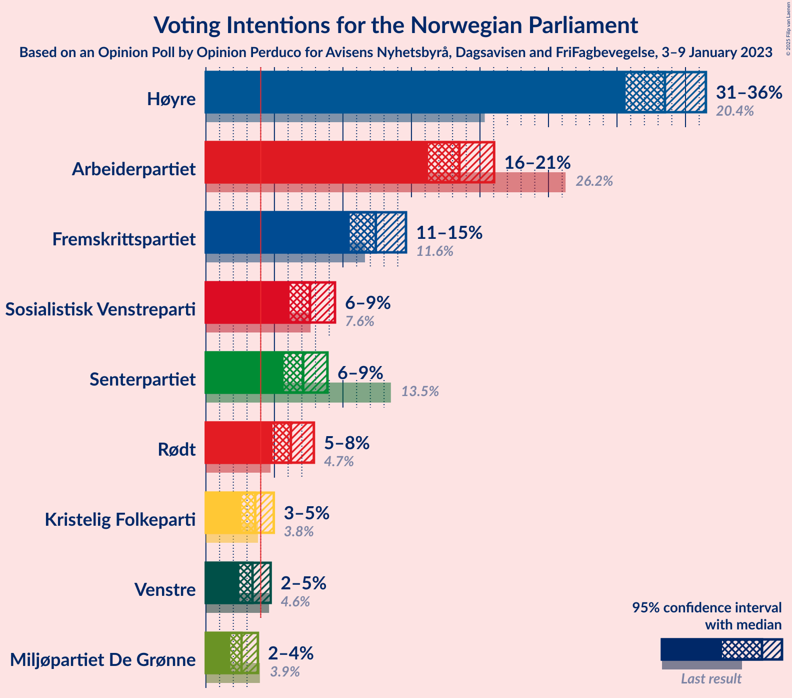

### Confidence Intervals

| Party | Last Result | Poll Result | 80% Confidence Interval | 90% Confidence Interval | 95% Confidence Interval | 99% Confidence Interval |
|:-----:|:-----------:|:-----------:|:-----------------------:|:-----------------------:|:-----------------------:|:-----------------------:|
| Høyre | 20.4% | 33.5% | 31.6–35.5% |31.1–36.0% |30.6–36.5% |29.8–37.4% |
| Arbeiderpartiet | 26.2% | 18.5% | 17.0–20.1% |16.6–20.6% |16.2–21.0% |15.5–21.8% |
| Fremskrittspartiet | 11.6% | 12.4% | 11.1–13.8% |10.8–14.2% |10.5–14.6% |9.9–15.3% |
| Sosialistisk Venstreparti | 7.6% | 7.6% | 6.6–8.8% |6.3–9.1% |6.1–9.4% |5.7–10.0% |
| Senterpartiet | 13.5% | 7.1% | 6.2–8.3% |5.9–8.6% |5.7–8.9% |5.2–9.4% |
| Rødt | 4.7% | 6.2% | 5.3–7.3% |5.1–7.6% |4.9–7.9% |4.5–8.4% |
| Kristelig Folkeparti | 3.8% | 3.6% | 2.9–4.5% |2.8–4.7% |2.6–5.0% |2.3–5.4% |
| Venstre | 4.6% | 3.4% | 2.8–4.3% |2.6–4.5% |2.4–4.7% |2.2–5.2% |
| Miljøpartiet De Grønne | 3.9% | 2.6% | 2.1–3.4% |1.9–3.6% |1.8–3.8% |1.6–4.2% |

*Note:* The poll result column reflects the actual value used in the calculations. Published results may vary slightly, and in addition be rounded to fewer digits.

## Seats

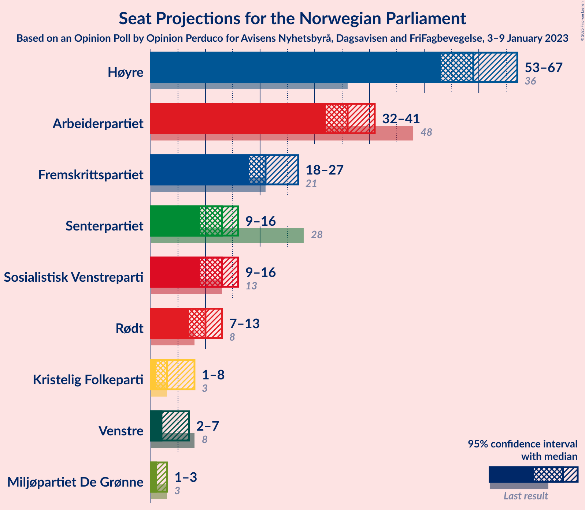

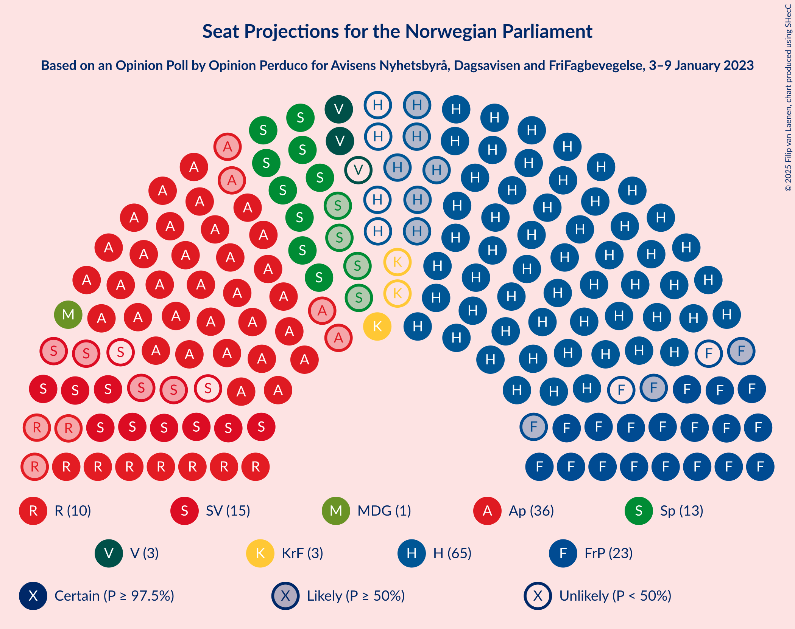

### Confidence Intervals

| Party | Last Result | Median | 80% Confidence Interval | 90% Confidence Interval | 95% Confidence Interval | 99% Confidence Interval |
|:-----:|:-----------:|:------:|:-----------------------:|:-----------------------:|:-----------------------:|:-----------------------:|
| <a href="#høyre">Høyre</a> | 36 | 59 | 56–64 |54–65 |53–67 |52–68 |
| <a href="#arbeiderpartiet">Arbeiderpartiet</a> | 48 | 36 | 33–38 |32–39 |32–41 |30–43 |
| <a href="#fremskrittspartiet">Fremskrittspartiet</a> | 21 | 21 | 18–24 |18–26 |18–27 |17–28 |
| <a href="#sosialistisk-venstreparti">Sosialistisk Venstreparti</a> | 13 | 13 | 10–15 |10–16 |9–16 |9–17 |
| <a href="#senterpartiet">Senterpartiet</a> | 28 | 13 | 11–15 |10–15 |9–16 |8–17 |
| <a href="#rødt">Rødt</a> | 8 | 10 | 8–12 |8–13 |7–13 |7–14 |
| <a href="#kristelig-folkeparti">Kristelig Folkeparti</a> | 3 | 3 | 2–7 |1–7 |1–8 |0–9 |
| <a href="#venstre">Venstre</a> | 8 | 2 | 2–7 |2–7 |2–7 |1–8 |
| <a href="#miljøpartiet-de-grønne">Miljøpartiet De Grønne</a> | 3 | 1 | 1–2 |1–2 |1–3 |0–7 |

### Høyre

*For a full overview of the results for this party, see the [Høyre](party-høyre.html) page.*

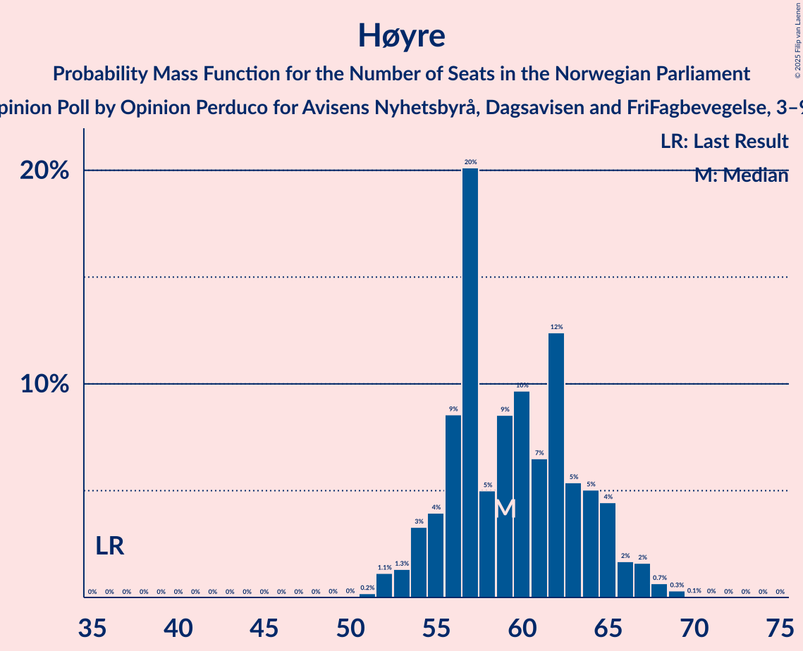

| Number of Seats | Probability | Accumulated | Special Marks |
|:---------------:|:-----------:|:-----------:|:-------------:|
| 36 | 0% | 100% | Last Result |
| 37 | 0% | 100% |  |
| 38 | 0% | 100% |  |
| 39 | 0% | 100% |  |
| 40 | 0% | 100% |  |
| 41 | 0% | 100% |  |
| 42 | 0% | 100% |  |
| 43 | 0% | 100% |  |
| 44 | 0% | 100% |  |
| 45 | 0% | 100% |  |
| 46 | 0% | 100% |  |
| 47 | 0% | 100% |  |
| 48 | 0% | 100% |  |
| 49 | 0% | 100% |  |
| 50 | 0% | 100% |  |
| 51 | 0.2% | 99.9% |  |
| 52 | 1.1% | 99.7% |  |
| 53 | 1.3% | 98.6% |  |
| 54 | 3% | 97% |  |
| 55 | 4% | 94% |  |
| 56 | 9% | 90% |  |
| 57 | 20% | 81% |  |
| 58 | 5% | 61% |  |
| 59 | 9% | 56% | Median |
| 60 | 10% | 48% |  |
| 61 | 7% | 38% |  |
| 62 | 12% | 32% |  |
| 63 | 5% | 19% |  |
| 64 | 5% | 14% |  |
| 65 | 4% | 9% |  |
| 66 | 2% | 4% |  |
| 67 | 2% | 3% |  |
| 68 | 0.7% | 1.1% |  |
| 69 | 0.3% | 0.4% |  |
| 70 | 0.1% | 0.1% |  |
| 71 | 0% | 0% |  |

### Arbeiderpartiet

*For a full overview of the results for this party, see the [Arbeiderpartiet](party-arbeiderpartiet.html) page.*

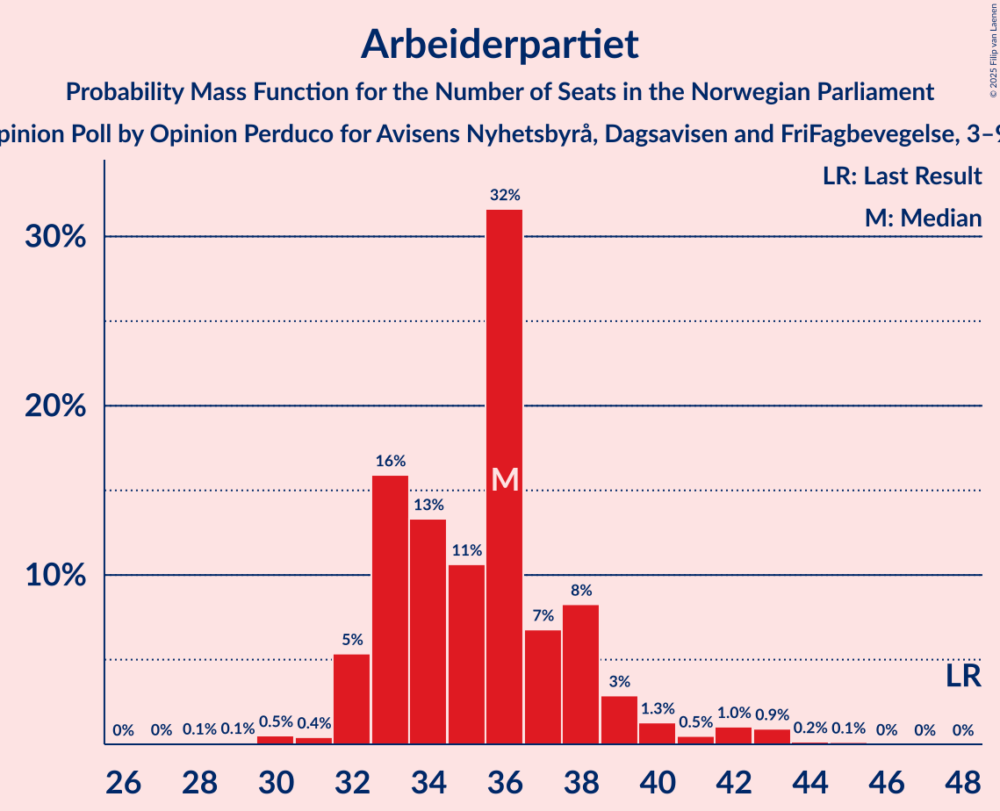

| Number of Seats | Probability | Accumulated | Special Marks |
|:---------------:|:-----------:|:-----------:|:-------------:|
| 28 | 0.1% | 100% |  |
| 29 | 0.1% | 99.9% |  |
| 30 | 0.5% | 99.8% |  |
| 31 | 0.4% | 99.3% |  |
| 32 | 5% | 98.9% |  |
| 33 | 16% | 93% |  |
| 34 | 13% | 78% |  |
| 35 | 11% | 64% |  |
| 36 | 32% | 54% | Median |
| 37 | 7% | 22% |  |
| 38 | 8% | 15% |  |
| 39 | 3% | 7% |  |
| 40 | 1.3% | 4% |  |
| 41 | 0.5% | 3% |  |
| 42 | 1.0% | 2% |  |
| 43 | 0.9% | 1.2% |  |
| 44 | 0.2% | 0.3% |  |
| 45 | 0.1% | 0.2% |  |
| 46 | 0% | 0% |  |
| 47 | 0% | 0% |  |
| 48 | 0% | 0% | Last Result |

### Fremskrittspartiet

*For a full overview of the results for this party, see the [Fremskrittspartiet](party-fremskrittspartiet.html) page.*

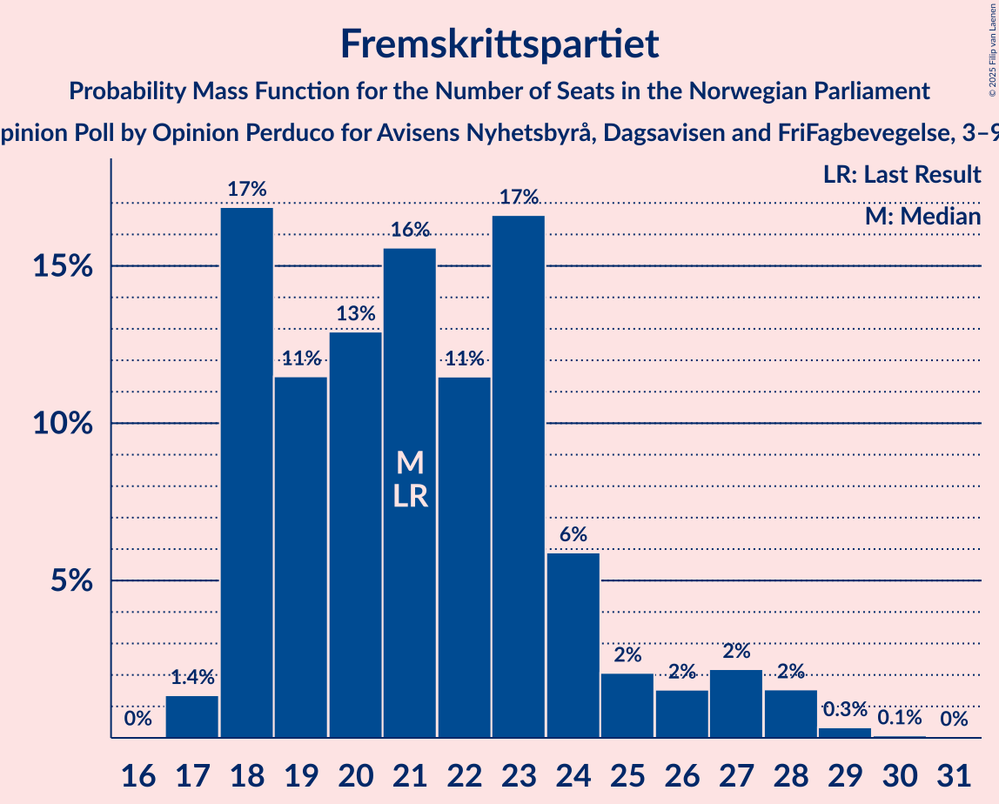

| Number of Seats | Probability | Accumulated | Special Marks |
|:---------------:|:-----------:|:-----------:|:-------------:|
| 17 | 1.4% | 100% |  |
| 18 | 17% | 98.6% |  |
| 19 | 11% | 82% |  |
| 20 | 13% | 70% |  |
| 21 | 16% | 57% | Last Result, Median |
| 22 | 11% | 42% |  |
| 23 | 17% | 30% |  |
| 24 | 6% | 14% |  |
| 25 | 2% | 8% |  |
| 26 | 2% | 6% |  |
| 27 | 2% | 4% |  |
| 28 | 2% | 2% |  |
| 29 | 0.3% | 0.4% |  |
| 30 | 0.1% | 0.1% |  |
| 31 | 0% | 0% |  |

### Sosialistisk Venstreparti

*For a full overview of the results for this party, see the [Sosialistisk Venstreparti](party-sosialistiskvenstreparti.html) page.*

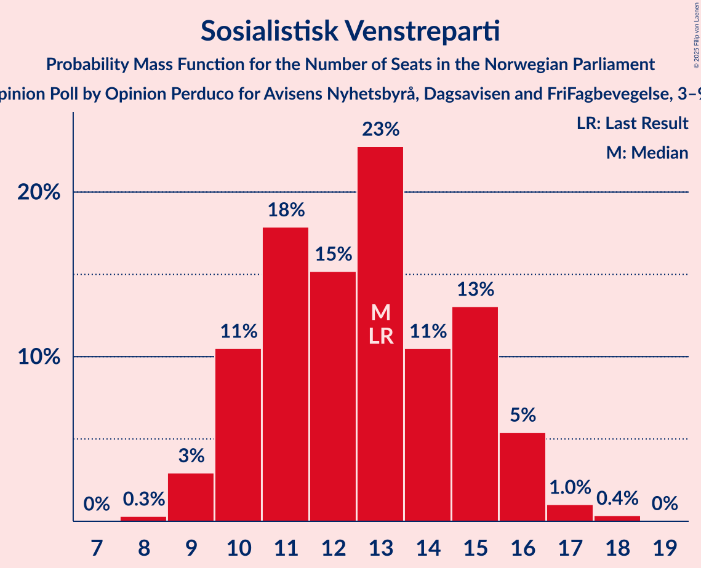

| Number of Seats | Probability | Accumulated | Special Marks |
|:---------------:|:-----------:|:-----------:|:-------------:|
| 8 | 0.3% | 100% |  |
| 9 | 3% | 99.7% |  |
| 10 | 11% | 97% |  |
| 11 | 18% | 86% |  |
| 12 | 15% | 68% |  |
| 13 | 23% | 53% | Last Result, Median |
| 14 | 11% | 30% |  |
| 15 | 13% | 20% |  |
| 16 | 5% | 7% |  |
| 17 | 1.0% | 1.4% |  |
| 18 | 0.4% | 0.4% |  |
| 19 | 0% | 0% |  |

### Senterpartiet

*For a full overview of the results for this party, see the [Senterpartiet](party-senterpartiet.html) page.*

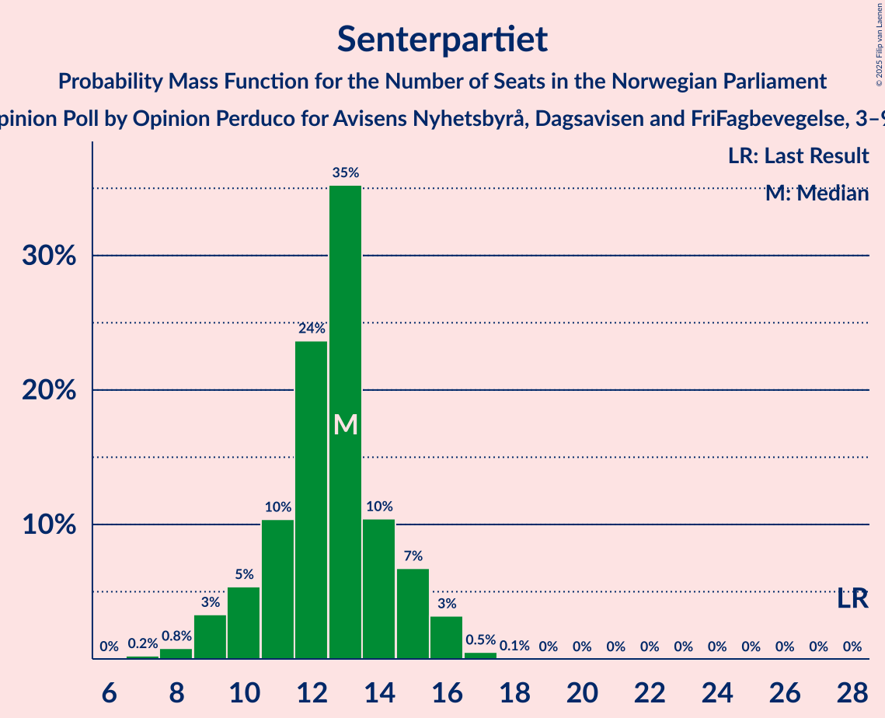

| Number of Seats | Probability | Accumulated | Special Marks |
|:---------------:|:-----------:|:-----------:|:-------------:|
| 7 | 0.2% | 100% |  |
| 8 | 0.8% | 99.7% |  |
| 9 | 3% | 99.0% |  |
| 10 | 5% | 96% |  |
| 11 | 10% | 90% |  |
| 12 | 24% | 80% |  |
| 13 | 35% | 56% | Median |
| 14 | 10% | 21% |  |
| 15 | 7% | 11% |  |
| 16 | 3% | 4% |  |
| 17 | 0.5% | 0.6% |  |
| 18 | 0.1% | 0.1% |  |
| 19 | 0% | 0% |  |
| 20 | 0% | 0% |  |
| 21 | 0% | 0% |  |
| 22 | 0% | 0% |  |
| 23 | 0% | 0% |  |
| 24 | 0% | 0% |  |
| 25 | 0% | 0% |  |
| 26 | 0% | 0% |  |
| 27 | 0% | 0% |  |
| 28 | 0% | 0% | Last Result |

### Rødt

*For a full overview of the results for this party, see the [Rødt](party-rødt.html) page.*

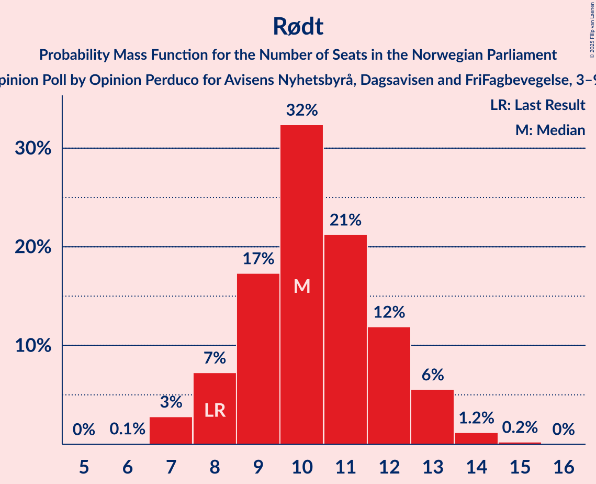

| Number of Seats | Probability | Accumulated | Special Marks |
|:---------------:|:-----------:|:-----------:|:-------------:|
| 6 | 0.1% | 100% |  |
| 7 | 3% | 99.9% |  |
| 8 | 7% | 97% | Last Result |
| 9 | 17% | 90% |  |
| 10 | 32% | 73% | Median |
| 11 | 21% | 40% |  |
| 12 | 12% | 19% |  |
| 13 | 6% | 7% |  |
| 14 | 1.2% | 1.4% |  |
| 15 | 0.2% | 0.3% |  |
| 16 | 0% | 0% |  |

### Kristelig Folkeparti

*For a full overview of the results for this party, see the [Kristelig Folkeparti](party-kristeligfolkeparti.html) page.*

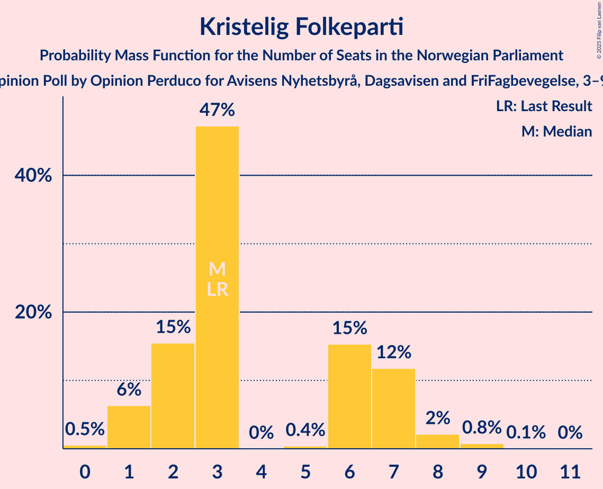

| Number of Seats | Probability | Accumulated | Special Marks |
|:---------------:|:-----------:|:-----------:|:-------------:|
| 0 | 0.5% | 100% |  |
| 1 | 6% | 99.5% |  |
| 2 | 15% | 93% |  |
| 3 | 47% | 78% | Last Result, Median |
| 4 | 0% | 30% |  |
| 5 | 0.4% | 30% |  |
| 6 | 15% | 30% |  |
| 7 | 12% | 15% |  |
| 8 | 2% | 3% |  |
| 9 | 0.8% | 0.8% |  |
| 10 | 0.1% | 0.1% |  |
| 11 | 0% | 0% |  |

### Venstre

*For a full overview of the results for this party, see the [Venstre](party-venstre.html) page.*

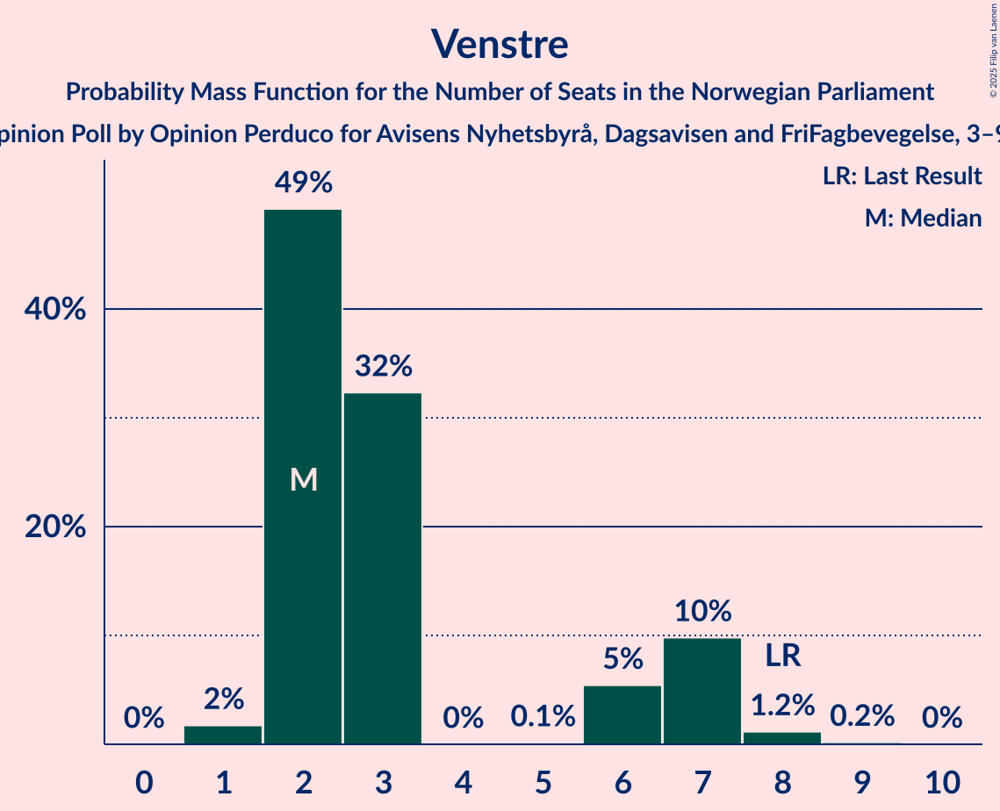

| Number of Seats | Probability | Accumulated | Special Marks |
|:---------------:|:-----------:|:-----------:|:-------------:|
| 1 | 2% | 100% |  |
| 2 | 49% | 98% | Median |
| 3 | 32% | 49% |  |
| 4 | 0% | 17% |  |
| 5 | 0.1% | 17% |  |
| 6 | 5% | 17% |  |
| 7 | 10% | 11% |  |
| 8 | 1.2% | 1.4% | Last Result |
| 9 | 0.2% | 0.2% |  |
| 10 | 0% | 0% |  |

### Miljøpartiet De Grønne

*For a full overview of the results for this party, see the [Miljøpartiet De Grønne](party-miljøpartietdegrønne.html) page.*

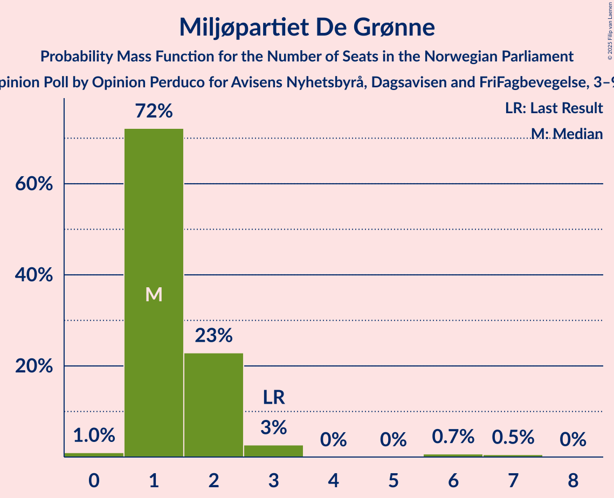

| Number of Seats | Probability | Accumulated | Special Marks |
|:---------------:|:-----------:|:-----------:|:-------------:|
| 0 | 1.0% | 100% |  |
| 1 | 72% | 99.0% | Median |
| 2 | 23% | 27% |  |
| 3 | 3% | 4% | Last Result |
| 4 | 0% | 1.3% |  |
| 5 | 0% | 1.3% |  |
| 6 | 0.7% | 1.3% |  |
| 7 | 0.5% | 0.6% |  |
| 8 | 0% | 0% |  |

## Coalitions

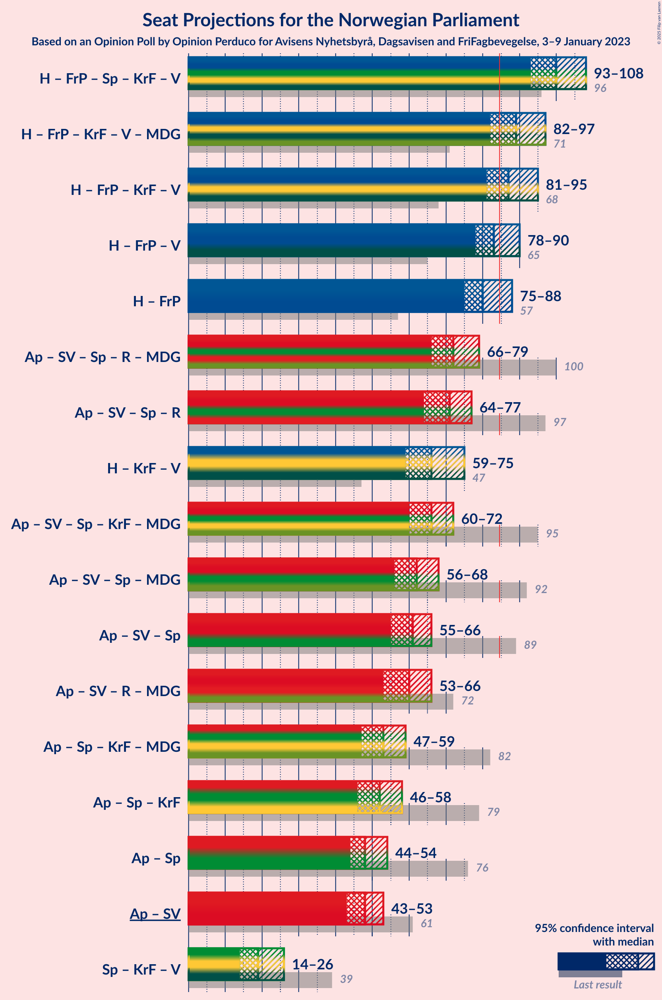

### Confidence Intervals

| Coalition | Last Result | Median | Majority? | 80% Confidence Interval | 90% Confidence Interval | 95% Confidence Interval | 99% Confidence Interval |
|:---------:|:-----------:|:------:|:---------:|:-----------------------:|:-----------------------:|:-----------------------:|:-----------------------:|
| Høyre – Fremskrittspartiet – Senterpartiet – Kristelig Folkeparti – Venstre | 96 | 100 | 100% | 96–105 | 95–107 | 93–108 | 91–110 |
| Høyre – Fremskrittspartiet – Kristelig Folkeparti – Venstre – Miljøpartiet De Grønne | 71 | 89 | 92% | 85–94 | 83–95 | 82–97 | 80–98 |
| Høyre – Fremskrittspartiet – Kristelig Folkeparti – Venstre | 68 | 87 | 77% | 84–93 | 82–94 | 81–95 | 79–97 |
| Høyre – Fremskrittspartiet – Venstre | 65 | 83 | 38% | 80–89 | 79–90 | 78–90 | 75–94 |
| Høyre – Fremskrittspartiet | 57 | 80 | 11% | 77–85 | 75–86 | 75–88 | 73–90 |
| Arbeiderpartiet – Sosialistisk Venstreparti – Senterpartiet – Rødt – Miljøpartiet De Grønne | 100 | 72 | 0% | 68–76 | 66–78 | 66–79 | 64–81 |
| Arbeiderpartiet – Sosialistisk Venstreparti – Senterpartiet – Rødt | 97 | 71 | 0% | 66–75 | 65–76 | 64–77 | 63–80 |
| Høyre – Kristelig Folkeparti – Venstre | 47 | 66 | 0% | 61–72 | 60–74 | 59–75 | 57–77 |
| Arbeiderpartiet – Sosialistisk Venstreparti – Senterpartiet – Kristelig Folkeparti – Miljøpartiet De Grønne | 95 | 66 | 0% | 62–69 | 60–71 | 60–72 | 58–74 |
| Arbeiderpartiet – Sosialistisk Venstreparti – Senterpartiet – Miljøpartiet De Grønne | 92 | 62 | 0% | 58–65 | 57–67 | 56–68 | 54–70 |
| Arbeiderpartiet – Sosialistisk Venstreparti – Senterpartiet | 89 | 61 | 0% | 56–64 | 55–65 | 55–66 | 53–69 |
| Arbeiderpartiet – Sosialistisk Venstreparti – Rødt – Miljøpartiet De Grønne | 72 | 60 | 0% | 56–64 | 54–64 | 53–66 | 52–68 |
| Arbeiderpartiet – Senterpartiet – Kristelig Folkeparti – Miljøpartiet De Grønne | 82 | 53 | 0% | 49–57 | 48–59 | 47–59 | 46–62 |
| Arbeiderpartiet – Senterpartiet – Kristelig Folkeparti | 79 | 52 | 0% | 48–56 | 47–57 | 46–58 | 44–61 |
| Arbeiderpartiet – Senterpartiet | 76 | 48 | 0% | 45–50 | 44–52 | 44–54 | 42–56 |
| Arbeiderpartiet – Sosialistisk Venstreparti | 61 | 48 | 0% | 44–51 | 44–52 | 43–53 | 41–56 |
| Senterpartiet – Kristelig Folkeparti – Venstre | 39 | 19 | 0% | 16–23 | 15–24 | 14–26 | 13–28 |

### Høyre – Fremskrittspartiet – Senterpartiet – Kristelig Folkeparti – Venstre

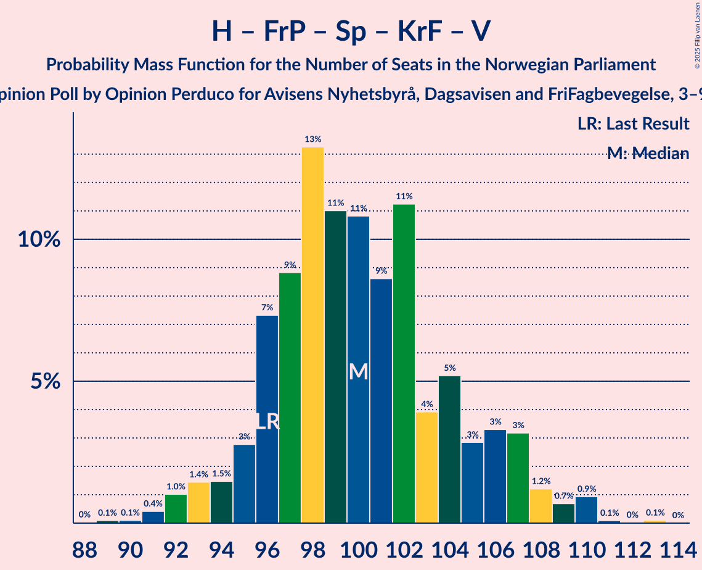

| Number of Seats | Probability | Accumulated | Special Marks |
|:---------------:|:-----------:|:-----------:|:-------------:|
| 89 | 0.1% | 100% |  |
| 90 | 0.1% | 99.9% |  |
| 91 | 0.4% | 99.8% |  |
| 92 | 1.0% | 99.3% |  |
| 93 | 1.4% | 98% |  |
| 94 | 1.5% | 97% |  |
| 95 | 3% | 95% |  |
| 96 | 7% | 93% | Last Result |
| 97 | 9% | 85% |  |
| 98 | 13% | 76% | Median |
| 99 | 11% | 63% |  |
| 100 | 11% | 52% |  |
| 101 | 9% | 41% |  |
| 102 | 11% | 33% |  |
| 103 | 4% | 22% |  |
| 104 | 5% | 18% |  |
| 105 | 3% | 12% |  |
| 106 | 3% | 10% |  |
| 107 | 3% | 6% |  |
| 108 | 1.2% | 3% |  |
| 109 | 0.7% | 2% |  |
| 110 | 0.9% | 1.2% |  |
| 111 | 0.1% | 0.2% |  |
| 112 | 0% | 0.1% |  |
| 113 | 0.1% | 0.1% |  |
| 114 | 0% | 0% |  |

### Høyre – Fremskrittspartiet – Kristelig Folkeparti – Venstre – Miljøpartiet De Grønne

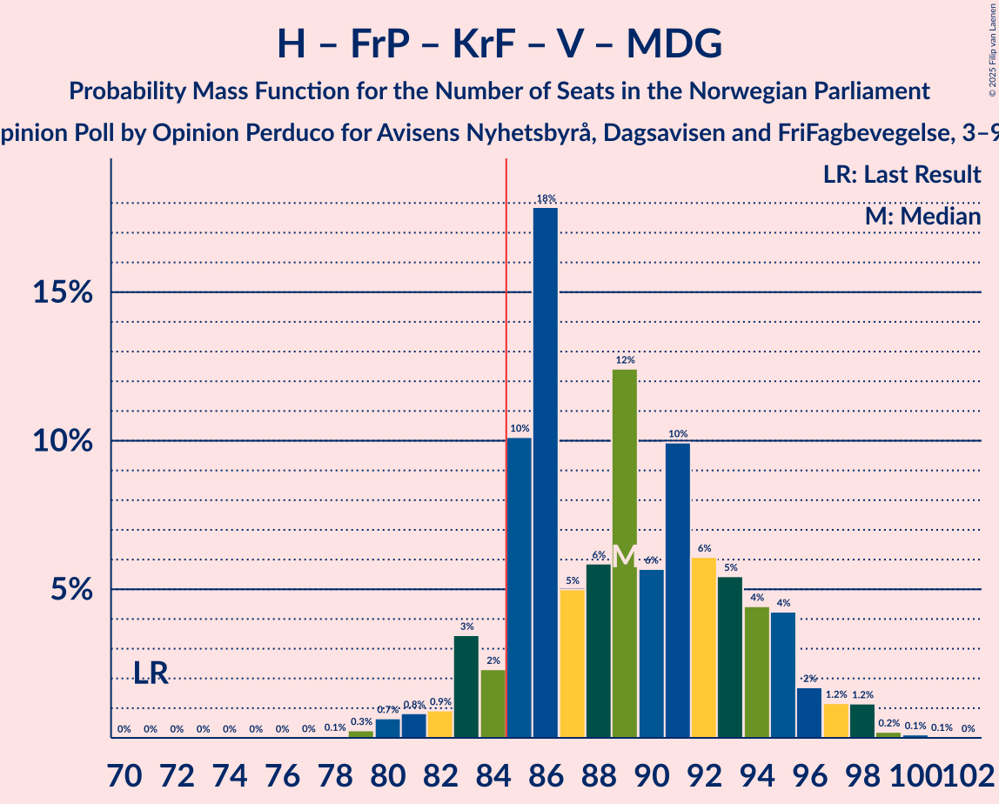

| Number of Seats | Probability | Accumulated | Special Marks |
|:---------------:|:-----------:|:-----------:|:-------------:|
| 71 | 0% | 100% | Last Result |
| 72 | 0% | 100% |  |
| 73 | 0% | 100% |  |
| 74 | 0% | 100% |  |
| 75 | 0% | 100% |  |
| 76 | 0% | 100% |  |
| 77 | 0% | 100% |  |
| 78 | 0.1% | 100% |  |
| 79 | 0.3% | 99.9% |  |
| 80 | 0.7% | 99.7% |  |
| 81 | 0.8% | 99.0% |  |
| 82 | 0.9% | 98% |  |
| 83 | 3% | 97% |  |
| 84 | 2% | 94% |  |
| 85 | 10% | 92% | Majority |
| 86 | 18% | 81% | Median |
| 87 | 5% | 64% |  |
| 88 | 6% | 59% |  |
| 89 | 12% | 53% |  |
| 90 | 6% | 40% |  |
| 91 | 10% | 35% |  |
| 92 | 6% | 25% |  |
| 93 | 5% | 19% |  |
| 94 | 4% | 13% |  |
| 95 | 4% | 9% |  |
| 96 | 2% | 4% |  |
| 97 | 1.2% | 3% |  |
| 98 | 1.2% | 2% |  |
| 99 | 0.2% | 0.4% |  |
| 100 | 0.1% | 0.2% |  |
| 101 | 0.1% | 0.1% |  |
| 102 | 0% | 0% |  |

### Høyre – Fremskrittspartiet – Kristelig Folkeparti – Venstre

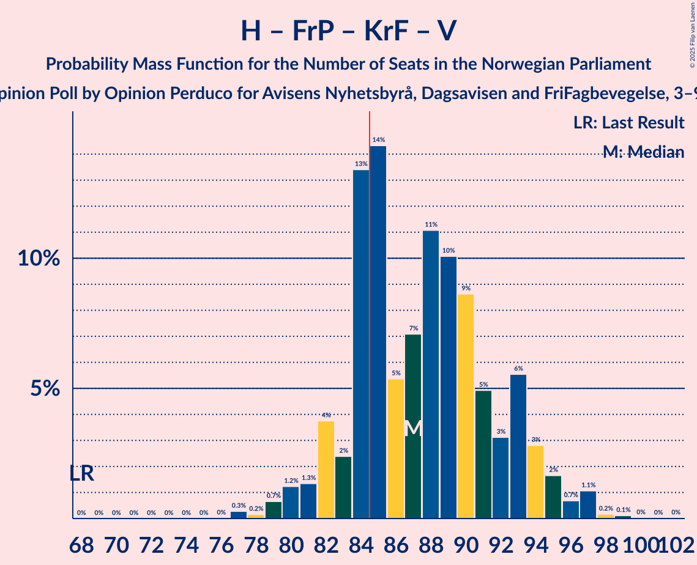

| Number of Seats | Probability | Accumulated | Special Marks |
|:---------------:|:-----------:|:-----------:|:-------------:|
| 68 | 0% | 100% | Last Result |
| 69 | 0% | 100% |  |
| 70 | 0% | 100% |  |
| 71 | 0% | 100% |  |
| 72 | 0% | 100% |  |
| 73 | 0% | 100% |  |
| 74 | 0% | 100% |  |
| 75 | 0% | 100% |  |
| 76 | 0% | 100% |  |
| 77 | 0.3% | 100% |  |
| 78 | 0.2% | 99.7% |  |
| 79 | 0.7% | 99.5% |  |
| 80 | 1.2% | 98.9% |  |
| 81 | 1.3% | 98% |  |
| 82 | 4% | 96% |  |
| 83 | 2% | 93% |  |
| 84 | 13% | 90% |  |
| 85 | 14% | 77% | Median, Majority |
| 86 | 5% | 62% |  |
| 87 | 7% | 57% |  |
| 88 | 11% | 50% |  |
| 89 | 10% | 39% |  |
| 90 | 9% | 29% |  |
| 91 | 5% | 20% |  |
| 92 | 3% | 15% |  |
| 93 | 6% | 12% |  |
| 94 | 3% | 7% |  |
| 95 | 2% | 4% |  |
| 96 | 0.7% | 2% |  |
| 97 | 1.1% | 1.4% |  |
| 98 | 0.2% | 0.4% |  |
| 99 | 0.1% | 0.2% |  |
| 100 | 0% | 0.1% |  |
| 101 | 0% | 0% |  |

### Høyre – Fremskrittspartiet – Venstre

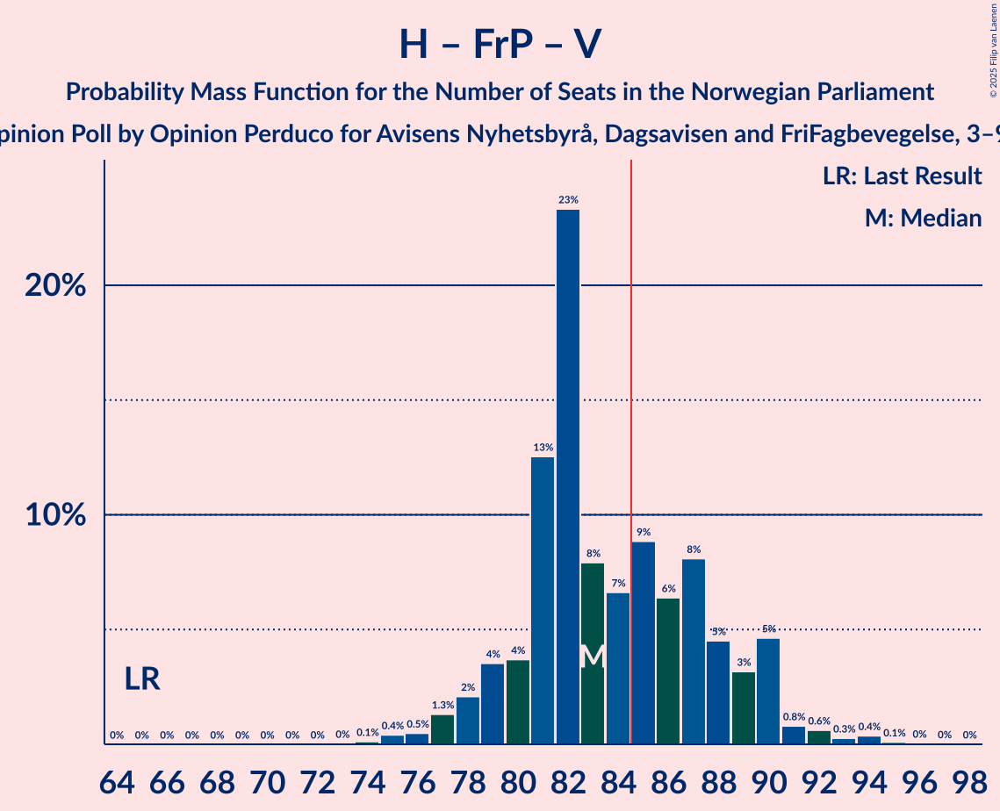

| Number of Seats | Probability | Accumulated | Special Marks |
|:---------------:|:-----------:|:-----------:|:-------------:|
| 65 | 0% | 100% | Last Result |
| 66 | 0% | 100% |  |
| 67 | 0% | 100% |  |
| 68 | 0% | 100% |  |
| 69 | 0% | 100% |  |
| 70 | 0% | 100% |  |
| 71 | 0% | 100% |  |
| 72 | 0% | 100% |  |
| 73 | 0% | 100% |  |
| 74 | 0.1% | 100% |  |
| 75 | 0.4% | 99.8% |  |
| 76 | 0.5% | 99.4% |  |
| 77 | 1.3% | 98.9% |  |
| 78 | 2% | 98% |  |
| 79 | 4% | 96% |  |
| 80 | 4% | 92% |  |
| 81 | 13% | 88% |  |
| 82 | 23% | 76% | Median |
| 83 | 8% | 52% |  |
| 84 | 7% | 45% |  |
| 85 | 9% | 38% | Majority |
| 86 | 6% | 29% |  |
| 87 | 8% | 23% |  |
| 88 | 5% | 15% |  |
| 89 | 3% | 10% |  |
| 90 | 5% | 7% |  |
| 91 | 0.8% | 2% |  |
| 92 | 0.6% | 1.4% |  |
| 93 | 0.3% | 0.8% |  |
| 94 | 0.4% | 0.5% |  |
| 95 | 0.1% | 0.2% |  |
| 96 | 0% | 0.1% |  |
| 97 | 0% | 0% |  |

### Høyre – Fremskrittspartiet

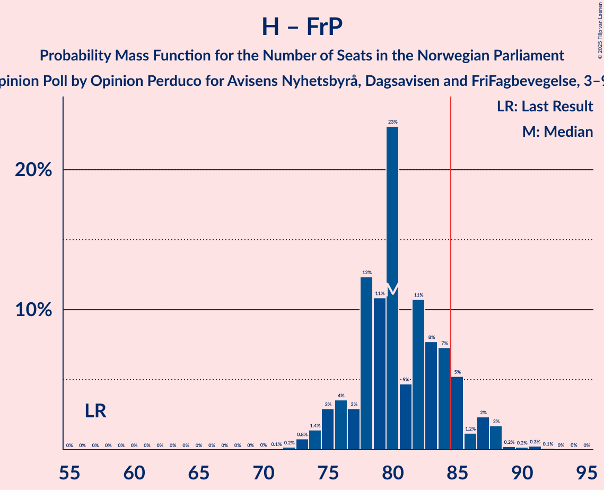

| Number of Seats | Probability | Accumulated | Special Marks |
|:---------------:|:-----------:|:-----------:|:-------------:|
| 57 | 0% | 100% | Last Result |
| 58 | 0% | 100% |  |
| 59 | 0% | 100% |  |
| 60 | 0% | 100% |  |
| 61 | 0% | 100% |  |
| 62 | 0% | 100% |  |
| 63 | 0% | 100% |  |
| 64 | 0% | 100% |  |
| 65 | 0% | 100% |  |
| 66 | 0% | 100% |  |
| 67 | 0% | 100% |  |
| 68 | 0% | 100% |  |
| 69 | 0% | 100% |  |
| 70 | 0% | 100% |  |
| 71 | 0.1% | 100% |  |
| 72 | 0.2% | 99.9% |  |
| 73 | 0.8% | 99.7% |  |
| 74 | 1.4% | 98.9% |  |
| 75 | 3% | 98% |  |
| 76 | 4% | 95% |  |
| 77 | 3% | 91% |  |
| 78 | 12% | 88% |  |
| 79 | 11% | 76% |  |
| 80 | 23% | 65% | Median |
| 81 | 5% | 42% |  |
| 82 | 11% | 37% |  |
| 83 | 8% | 26% |  |
| 84 | 7% | 19% |  |
| 85 | 5% | 11% | Majority |
| 86 | 1.2% | 6% |  |
| 87 | 2% | 5% |  |
| 88 | 2% | 3% |  |
| 89 | 0.2% | 0.8% |  |
| 90 | 0.2% | 0.6% |  |
| 91 | 0.3% | 0.4% |  |
| 92 | 0.1% | 0.1% |  |
| 93 | 0% | 0% |  |

### Arbeiderpartiet – Sosialistisk Venstreparti – Senterpartiet – Rødt – Miljøpartiet De Grønne

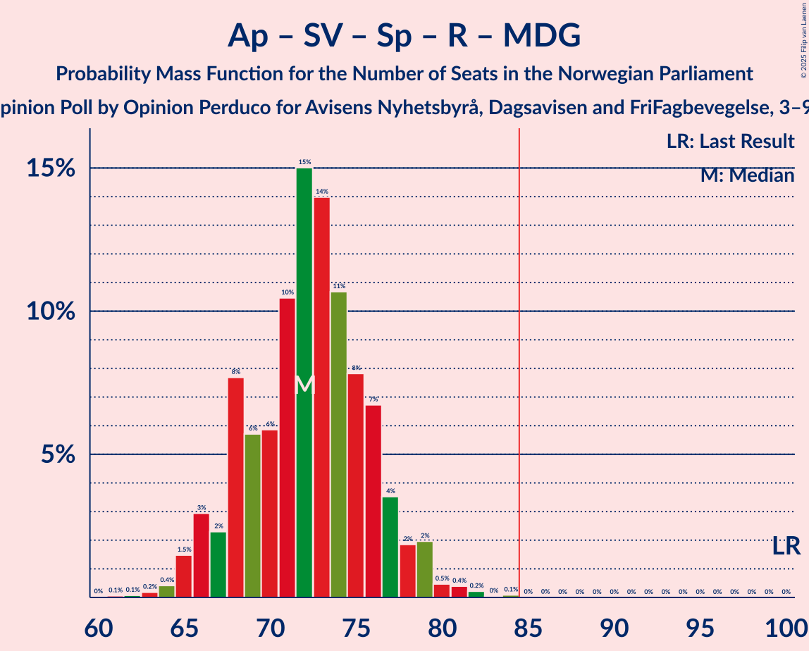

| Number of Seats | Probability | Accumulated | Special Marks |
|:---------------:|:-----------:|:-----------:|:-------------:|
| 61 | 0.1% | 100% |  |
| 62 | 0.1% | 99.9% |  |
| 63 | 0.2% | 99.8% |  |
| 64 | 0.4% | 99.6% |  |
| 65 | 1.5% | 99.2% |  |
| 66 | 3% | 98% |  |
| 67 | 2% | 95% |  |
| 68 | 8% | 93% |  |
| 69 | 6% | 85% |  |
| 70 | 6% | 79% |  |
| 71 | 10% | 73% |  |
| 72 | 15% | 63% |  |
| 73 | 14% | 48% | Median |
| 74 | 11% | 34% |  |
| 75 | 8% | 23% |  |
| 76 | 7% | 15% |  |
| 77 | 4% | 9% |  |
| 78 | 2% | 5% |  |
| 79 | 2% | 3% |  |
| 80 | 0.5% | 1.2% |  |
| 81 | 0.4% | 0.8% |  |
| 82 | 0.2% | 0.4% |  |
| 83 | 0% | 0.1% |  |
| 84 | 0.1% | 0.1% |  |
| 85 | 0% | 0% | Majority |
| 86 | 0% | 0% |  |
| 87 | 0% | 0% |  |
| 88 | 0% | 0% |  |
| 89 | 0% | 0% |  |
| 90 | 0% | 0% |  |
| 91 | 0% | 0% |  |
| 92 | 0% | 0% |  |
| 93 | 0% | 0% |  |
| 94 | 0% | 0% |  |
| 95 | 0% | 0% |  |
| 96 | 0% | 0% |  |
| 97 | 0% | 0% |  |
| 98 | 0% | 0% |  |
| 99 | 0% | 0% |  |
| 100 | 0% | 0% | Last Result |

### Arbeiderpartiet – Sosialistisk Venstreparti – Senterpartiet – Rødt

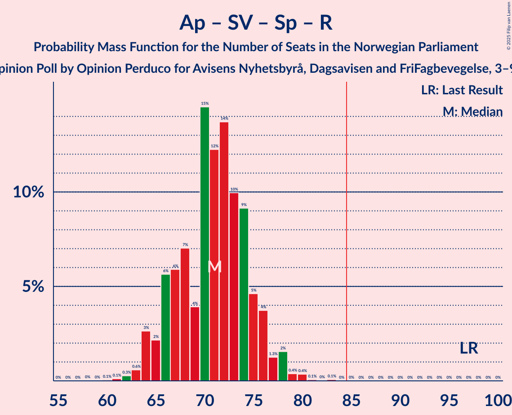

| Number of Seats | Probability | Accumulated | Special Marks |
|:---------------:|:-----------:|:-----------:|:-------------:|
| 59 | 0% | 100% |  |
| 60 | 0.1% | 99.9% |  |
| 61 | 0.1% | 99.9% |  |
| 62 | 0.3% | 99.8% |  |
| 63 | 0.6% | 99.5% |  |
| 64 | 3% | 98.9% |  |
| 65 | 2% | 96% |  |
| 66 | 6% | 94% |  |
| 67 | 6% | 88% |  |
| 68 | 7% | 83% |  |
| 69 | 4% | 76% |  |
| 70 | 15% | 72% |  |
| 71 | 12% | 57% |  |
| 72 | 14% | 45% | Median |
| 73 | 10% | 31% |  |
| 74 | 9% | 21% |  |
| 75 | 5% | 12% |  |
| 76 | 4% | 7% |  |
| 77 | 1.3% | 4% |  |
| 78 | 2% | 2% |  |
| 79 | 0.4% | 0.9% |  |
| 80 | 0.4% | 0.5% |  |
| 81 | 0.1% | 0.2% |  |
| 82 | 0% | 0.1% |  |
| 83 | 0.1% | 0.1% |  |
| 84 | 0% | 0% |  |
| 85 | 0% | 0% | Majority |
| 86 | 0% | 0% |  |
| 87 | 0% | 0% |  |
| 88 | 0% | 0% |  |
| 89 | 0% | 0% |  |
| 90 | 0% | 0% |  |
| 91 | 0% | 0% |  |
| 92 | 0% | 0% |  |
| 93 | 0% | 0% |  |
| 94 | 0% | 0% |  |
| 95 | 0% | 0% |  |
| 96 | 0% | 0% |  |
| 97 | 0% | 0% | Last Result |

### Høyre – Kristelig Folkeparti – Venstre

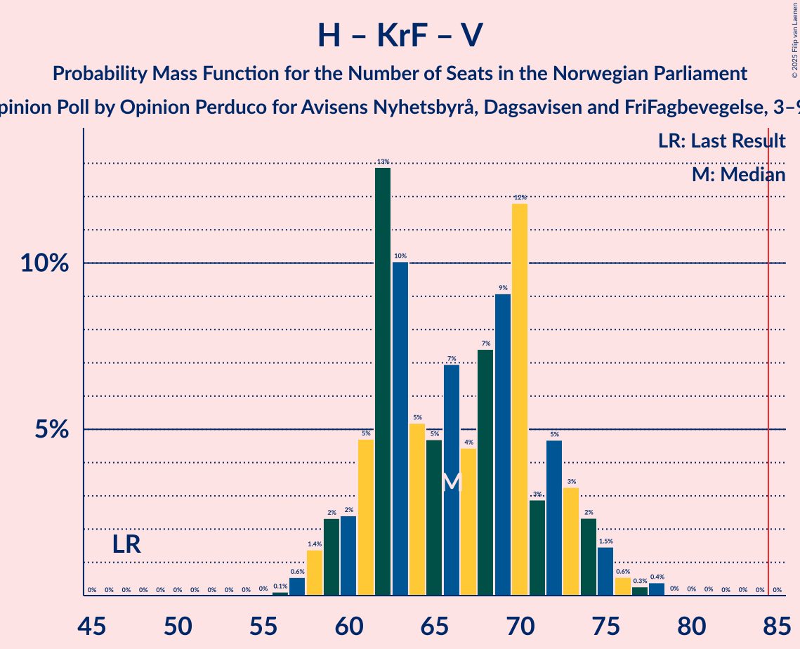

| Number of Seats | Probability | Accumulated | Special Marks |
|:---------------:|:-----------:|:-----------:|:-------------:|
| 47 | 0% | 100% | Last Result |
| 48 | 0% | 100% |  |
| 49 | 0% | 100% |  |
| 50 | 0% | 100% |  |
| 51 | 0% | 100% |  |
| 52 | 0% | 100% |  |
| 53 | 0% | 100% |  |
| 54 | 0% | 100% |  |
| 55 | 0% | 100% |  |
| 56 | 0.1% | 100% |  |
| 57 | 0.6% | 99.8% |  |
| 58 | 1.4% | 99.3% |  |
| 59 | 2% | 98% |  |
| 60 | 2% | 96% |  |
| 61 | 5% | 93% |  |
| 62 | 13% | 88% |  |
| 63 | 10% | 76% |  |
| 64 | 5% | 66% | Median |
| 65 | 5% | 60% |  |
| 66 | 7% | 56% |  |
| 67 | 4% | 49% |  |
| 68 | 7% | 44% |  |
| 69 | 9% | 37% |  |
| 70 | 12% | 28% |  |
| 71 | 3% | 16% |  |
| 72 | 5% | 13% |  |
| 73 | 3% | 8% |  |
| 74 | 2% | 5% |  |
| 75 | 1.5% | 3% |  |
| 76 | 0.6% | 1.3% |  |
| 77 | 0.3% | 0.8% |  |
| 78 | 0.4% | 0.5% |  |
| 79 | 0% | 0.1% |  |
| 80 | 0% | 0.1% |  |
| 81 | 0% | 0% |  |

### Arbeiderpartiet – Sosialistisk Venstreparti – Senterpartiet – Kristelig Folkeparti – Miljøpartiet De Grønne

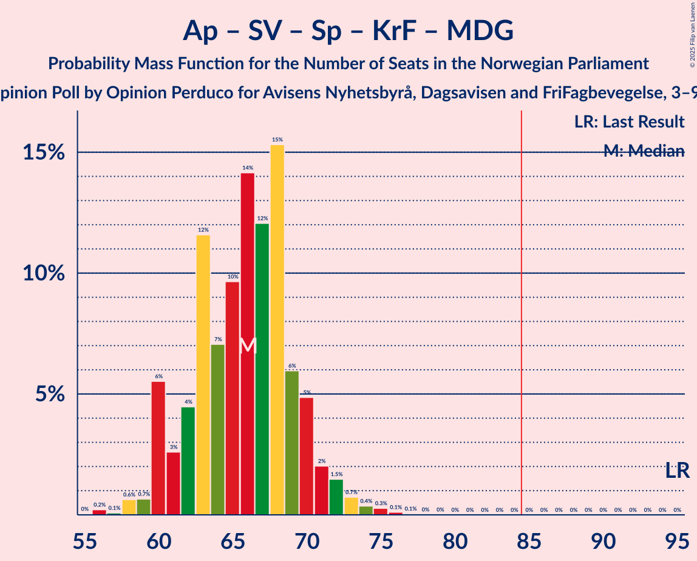

| Number of Seats | Probability | Accumulated | Special Marks |
|:---------------:|:-----------:|:-----------:|:-------------:|
| 55 | 0% | 100% |  |
| 56 | 0.2% | 99.9% |  |
| 57 | 0.1% | 99.7% |  |
| 58 | 0.6% | 99.6% |  |
| 59 | 0.7% | 99.0% |  |
| 60 | 6% | 98% |  |
| 61 | 3% | 93% |  |
| 62 | 4% | 90% |  |
| 63 | 12% | 86% |  |
| 64 | 7% | 74% |  |
| 65 | 10% | 67% |  |
| 66 | 14% | 57% | Median |
| 67 | 12% | 43% |  |
| 68 | 15% | 31% |  |
| 69 | 6% | 16% |  |
| 70 | 5% | 10% |  |
| 71 | 2% | 5% |  |
| 72 | 1.5% | 3% |  |
| 73 | 0.7% | 2% |  |
| 74 | 0.4% | 0.8% |  |
| 75 | 0.3% | 0.5% |  |
| 76 | 0.1% | 0.2% |  |
| 77 | 0.1% | 0.1% |  |
| 78 | 0% | 0% |  |
| 79 | 0% | 0% |  |
| 80 | 0% | 0% |  |
| 81 | 0% | 0% |  |
| 82 | 0% | 0% |  |
| 83 | 0% | 0% |  |
| 84 | 0% | 0% |  |
| 85 | 0% | 0% | Majority |
| 86 | 0% | 0% |  |
| 87 | 0% | 0% |  |
| 88 | 0% | 0% |  |
| 89 | 0% | 0% |  |
| 90 | 0% | 0% |  |
| 91 | 0% | 0% |  |
| 92 | 0% | 0% |  |
| 93 | 0% | 0% |  |
| 94 | 0% | 0% |  |
| 95 | 0% | 0% | Last Result |

### Arbeiderpartiet – Sosialistisk Venstreparti – Senterpartiet – Miljøpartiet De Grønne

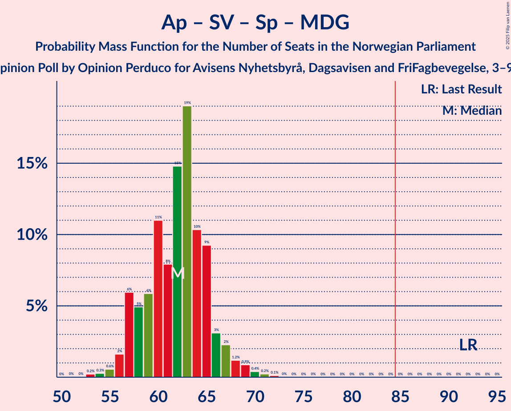

| Number of Seats | Probability | Accumulated | Special Marks |
|:---------------:|:-----------:|:-----------:|:-------------:|
| 52 | 0% | 100% |  |
| 53 | 0.2% | 99.9% |  |
| 54 | 0.3% | 99.7% |  |
| 55 | 0.6% | 99.5% |  |
| 56 | 2% | 98.9% |  |
| 57 | 6% | 97% |  |
| 58 | 5% | 91% |  |
| 59 | 6% | 86% |  |
| 60 | 11% | 81% |  |
| 61 | 8% | 70% |  |
| 62 | 15% | 62% |  |
| 63 | 19% | 47% | Median |
| 64 | 10% | 28% |  |
| 65 | 9% | 17% |  |
| 66 | 3% | 8% |  |
| 67 | 2% | 5% |  |
| 68 | 1.2% | 3% |  |
| 69 | 0.9% | 2% |  |
| 70 | 0.4% | 0.8% |  |
| 71 | 0.2% | 0.4% |  |
| 72 | 0.1% | 0.1% |  |
| 73 | 0% | 0% |  |
| 74 | 0% | 0% |  |
| 75 | 0% | 0% |  |
| 76 | 0% | 0% |  |
| 77 | 0% | 0% |  |
| 78 | 0% | 0% |  |
| 79 | 0% | 0% |  |
| 80 | 0% | 0% |  |
| 81 | 0% | 0% |  |
| 82 | 0% | 0% |  |
| 83 | 0% | 0% |  |
| 84 | 0% | 0% |  |
| 85 | 0% | 0% | Majority |
| 86 | 0% | 0% |  |
| 87 | 0% | 0% |  |
| 88 | 0% | 0% |  |
| 89 | 0% | 0% |  |
| 90 | 0% | 0% |  |
| 91 | 0% | 0% |  |
| 92 | 0% | 0% | Last Result |

### Arbeiderpartiet – Sosialistisk Venstreparti – Senterpartiet

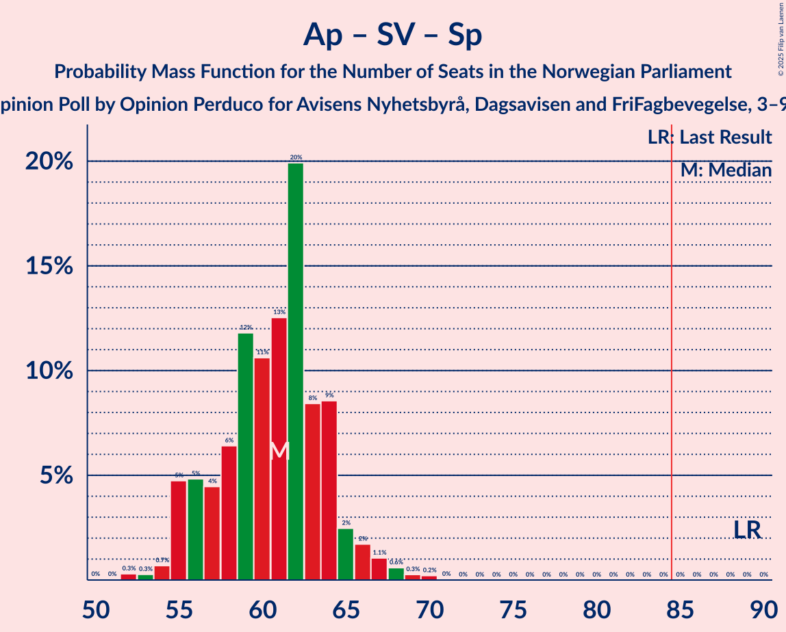

| Number of Seats | Probability | Accumulated | Special Marks |
|:---------------:|:-----------:|:-----------:|:-------------:|
| 51 | 0% | 100% |  |
| 52 | 0.3% | 99.9% |  |
| 53 | 0.3% | 99.6% |  |
| 54 | 0.7% | 99.4% |  |
| 55 | 5% | 98.7% |  |
| 56 | 5% | 94% |  |
| 57 | 4% | 89% |  |
| 58 | 6% | 85% |  |
| 59 | 12% | 78% |  |
| 60 | 11% | 66% |  |
| 61 | 13% | 56% |  |
| 62 | 20% | 43% | Median |
| 63 | 8% | 23% |  |
| 64 | 9% | 15% |  |
| 65 | 2% | 6% |  |
| 66 | 2% | 4% |  |
| 67 | 1.1% | 2% |  |
| 68 | 0.6% | 1.1% |  |
| 69 | 0.3% | 0.5% |  |
| 70 | 0.2% | 0.3% |  |
| 71 | 0% | 0.1% |  |
| 72 | 0% | 0% |  |
| 73 | 0% | 0% |  |
| 74 | 0% | 0% |  |
| 75 | 0% | 0% |  |
| 76 | 0% | 0% |  |
| 77 | 0% | 0% |  |
| 78 | 0% | 0% |  |
| 79 | 0% | 0% |  |
| 80 | 0% | 0% |  |
| 81 | 0% | 0% |  |
| 82 | 0% | 0% |  |
| 83 | 0% | 0% |  |
| 84 | 0% | 0% |  |
| 85 | 0% | 0% | Majority |
| 86 | 0% | 0% |  |
| 87 | 0% | 0% |  |
| 88 | 0% | 0% |  |
| 89 | 0% | 0% | Last Result |

### Arbeiderpartiet – Sosialistisk Venstreparti – Rødt – Miljøpartiet De Grønne

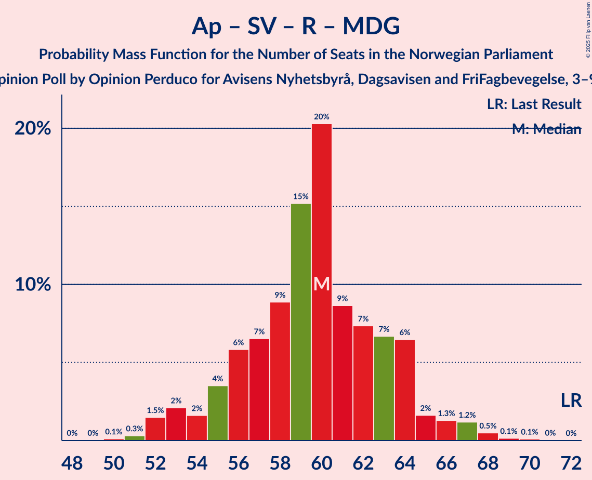

| Number of Seats | Probability | Accumulated | Special Marks |
|:---------------:|:-----------:|:-----------:|:-------------:|
| 49 | 0% | 100% |  |
| 50 | 0.1% | 99.9% |  |
| 51 | 0.3% | 99.8% |  |
| 52 | 1.5% | 99.5% |  |
| 53 | 2% | 98% |  |
| 54 | 2% | 96% |  |
| 55 | 4% | 94% |  |
| 56 | 6% | 91% |  |
| 57 | 7% | 85% |  |
| 58 | 9% | 78% |  |
| 59 | 15% | 70% |  |
| 60 | 20% | 54% | Median |
| 61 | 9% | 34% |  |
| 62 | 7% | 25% |  |
| 63 | 7% | 18% |  |
| 64 | 6% | 11% |  |
| 65 | 2% | 5% |  |
| 66 | 1.3% | 3% |  |
| 67 | 1.2% | 2% |  |
| 68 | 0.5% | 0.8% |  |
| 69 | 0.1% | 0.3% |  |
| 70 | 0.1% | 0.2% |  |
| 71 | 0% | 0.1% |  |
| 72 | 0% | 0% | Last Result |

### Arbeiderpartiet – Senterpartiet – Kristelig Folkeparti – Miljøpartiet De Grønne

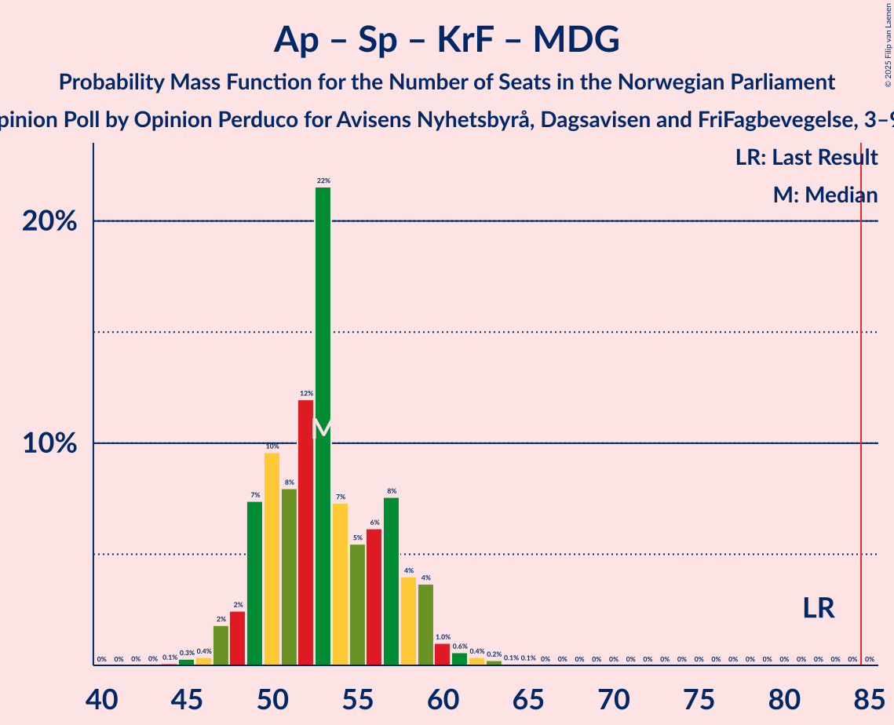

| Number of Seats | Probability | Accumulated | Special Marks |
|:---------------:|:-----------:|:-----------:|:-------------:|
| 44 | 0.1% | 100% |  |
| 45 | 0.3% | 99.9% |  |
| 46 | 0.4% | 99.6% |  |
| 47 | 2% | 99.2% |  |
| 48 | 2% | 97% |  |
| 49 | 7% | 95% |  |
| 50 | 10% | 88% |  |
| 51 | 8% | 78% |  |
| 52 | 12% | 70% |  |
| 53 | 22% | 58% | Median |
| 54 | 7% | 36% |  |
| 55 | 5% | 29% |  |
| 56 | 6% | 24% |  |
| 57 | 8% | 18% |  |
| 58 | 4% | 10% |  |
| 59 | 4% | 6% |  |
| 60 | 1.0% | 2% |  |
| 61 | 0.6% | 1.3% |  |
| 62 | 0.4% | 0.7% |  |
| 63 | 0.2% | 0.4% |  |
| 64 | 0.1% | 0.1% |  |
| 65 | 0.1% | 0.1% |  |
| 66 | 0% | 0% |  |
| 67 | 0% | 0% |  |
| 68 | 0% | 0% |  |
| 69 | 0% | 0% |  |
| 70 | 0% | 0% |  |
| 71 | 0% | 0% |  |
| 72 | 0% | 0% |  |
| 73 | 0% | 0% |  |
| 74 | 0% | 0% |  |
| 75 | 0% | 0% |  |
| 76 | 0% | 0% |  |
| 77 | 0% | 0% |  |
| 78 | 0% | 0% |  |
| 79 | 0% | 0% |  |
| 80 | 0% | 0% |  |
| 81 | 0% | 0% |  |
| 82 | 0% | 0% | Last Result |

### Arbeiderpartiet – Senterpartiet – Kristelig Folkeparti

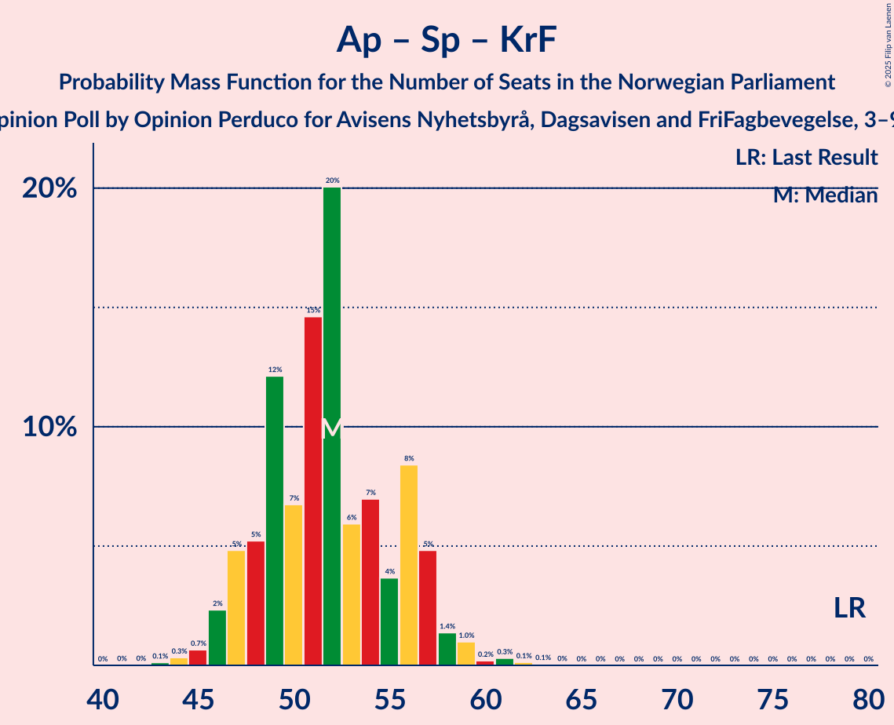

| Number of Seats | Probability | Accumulated | Special Marks |
|:---------------:|:-----------:|:-----------:|:-------------:|
| 42 | 0% | 100% |  |
| 43 | 0.1% | 99.9% |  |
| 44 | 0.3% | 99.8% |  |
| 45 | 0.7% | 99.5% |  |
| 46 | 2% | 98.8% |  |
| 47 | 5% | 97% |  |
| 48 | 5% | 92% |  |
| 49 | 12% | 86% |  |
| 50 | 7% | 74% |  |
| 51 | 15% | 68% |  |
| 52 | 20% | 53% | Median |
| 53 | 6% | 33% |  |
| 54 | 7% | 27% |  |
| 55 | 4% | 20% |  |
| 56 | 8% | 16% |  |
| 57 | 5% | 8% |  |
| 58 | 1.4% | 3% |  |
| 59 | 1.0% | 2% |  |
| 60 | 0.2% | 0.7% |  |
| 61 | 0.3% | 0.5% |  |
| 62 | 0.1% | 0.2% |  |
| 63 | 0.1% | 0.1% |  |
| 64 | 0% | 0% |  |
| 65 | 0% | 0% |  |
| 66 | 0% | 0% |  |
| 67 | 0% | 0% |  |
| 68 | 0% | 0% |  |
| 69 | 0% | 0% |  |
| 70 | 0% | 0% |  |
| 71 | 0% | 0% |  |
| 72 | 0% | 0% |  |
| 73 | 0% | 0% |  |
| 74 | 0% | 0% |  |
| 75 | 0% | 0% |  |
| 76 | 0% | 0% |  |
| 77 | 0% | 0% |  |
| 78 | 0% | 0% |  |
| 79 | 0% | 0% | Last Result |

### Arbeiderpartiet – Senterpartiet

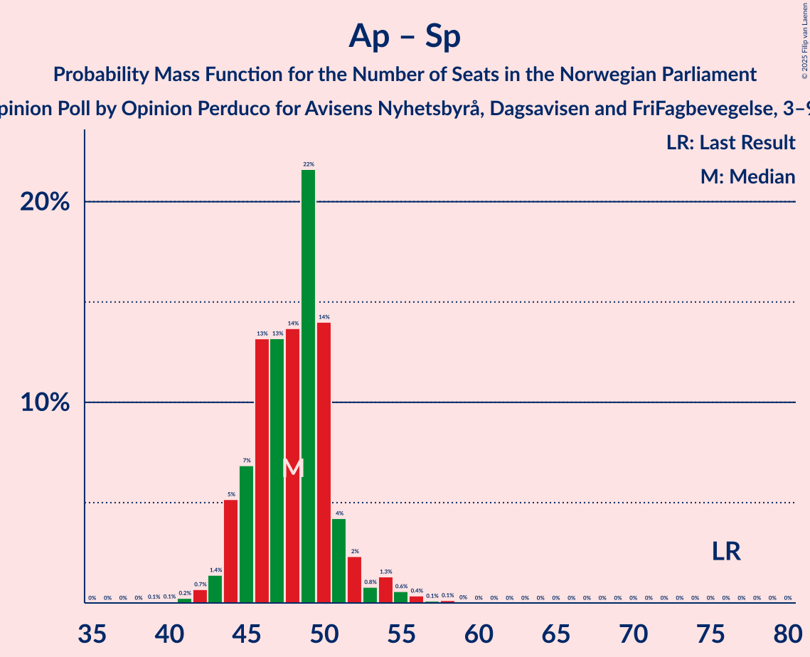

| Number of Seats | Probability | Accumulated | Special Marks |
|:---------------:|:-----------:|:-----------:|:-------------:|
| 39 | 0.1% | 100% |  |
| 40 | 0.1% | 99.9% |  |
| 41 | 0.2% | 99.9% |  |
| 42 | 0.7% | 99.6% |  |
| 43 | 1.4% | 98.9% |  |
| 44 | 5% | 98% |  |
| 45 | 7% | 92% |  |
| 46 | 13% | 86% |  |
| 47 | 13% | 72% |  |
| 48 | 14% | 59% |  |
| 49 | 22% | 45% | Median |
| 50 | 14% | 24% |  |
| 51 | 4% | 10% |  |
| 52 | 2% | 6% |  |
| 53 | 0.8% | 3% |  |
| 54 | 1.3% | 3% |  |
| 55 | 0.6% | 1.2% |  |
| 56 | 0.4% | 0.6% |  |
| 57 | 0.1% | 0.3% |  |
| 58 | 0.1% | 0.2% |  |
| 59 | 0% | 0% |  |
| 60 | 0% | 0% |  |
| 61 | 0% | 0% |  |
| 62 | 0% | 0% |  |
| 63 | 0% | 0% |  |
| 64 | 0% | 0% |  |
| 65 | 0% | 0% |  |
| 66 | 0% | 0% |  |
| 67 | 0% | 0% |  |
| 68 | 0% | 0% |  |
| 69 | 0% | 0% |  |
| 70 | 0% | 0% |  |
| 71 | 0% | 0% |  |
| 72 | 0% | 0% |  |
| 73 | 0% | 0% |  |
| 74 | 0% | 0% |  |
| 75 | 0% | 0% |  |
| 76 | 0% | 0% | Last Result |

### Arbeiderpartiet – Sosialistisk Venstreparti

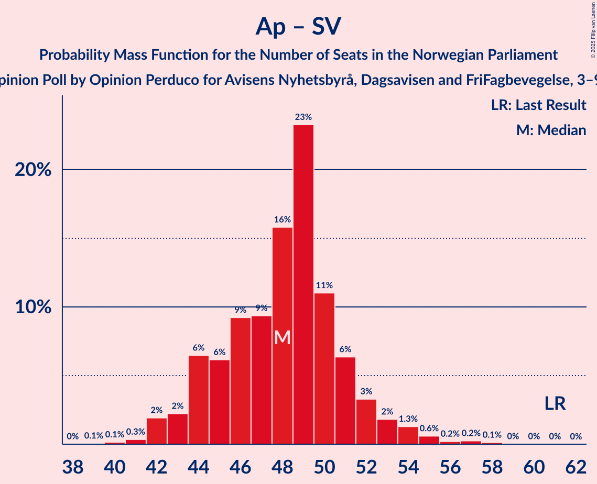

| Number of Seats | Probability | Accumulated | Special Marks |
|:---------------:|:-----------:|:-----------:|:-------------:|
| 39 | 0.1% | 100% |  |
| 40 | 0.1% | 99.9% |  |
| 41 | 0.3% | 99.8% |  |
| 42 | 2% | 99.4% |  |
| 43 | 2% | 98% |  |
| 44 | 6% | 95% |  |
| 45 | 6% | 89% |  |
| 46 | 9% | 83% |  |
| 47 | 9% | 73% |  |
| 48 | 16% | 64% |  |
| 49 | 23% | 48% | Median |
| 50 | 11% | 25% |  |
| 51 | 6% | 14% |  |
| 52 | 3% | 8% |  |
| 53 | 2% | 4% |  |
| 54 | 1.3% | 2% |  |
| 55 | 0.6% | 1.2% |  |
| 56 | 0.2% | 0.6% |  |
| 57 | 0.2% | 0.4% |  |
| 58 | 0.1% | 0.2% |  |
| 59 | 0% | 0% |  |
| 60 | 0% | 0% |  |
| 61 | 0% | 0% | Last Result |

### Senterpartiet – Kristelig Folkeparti – Venstre

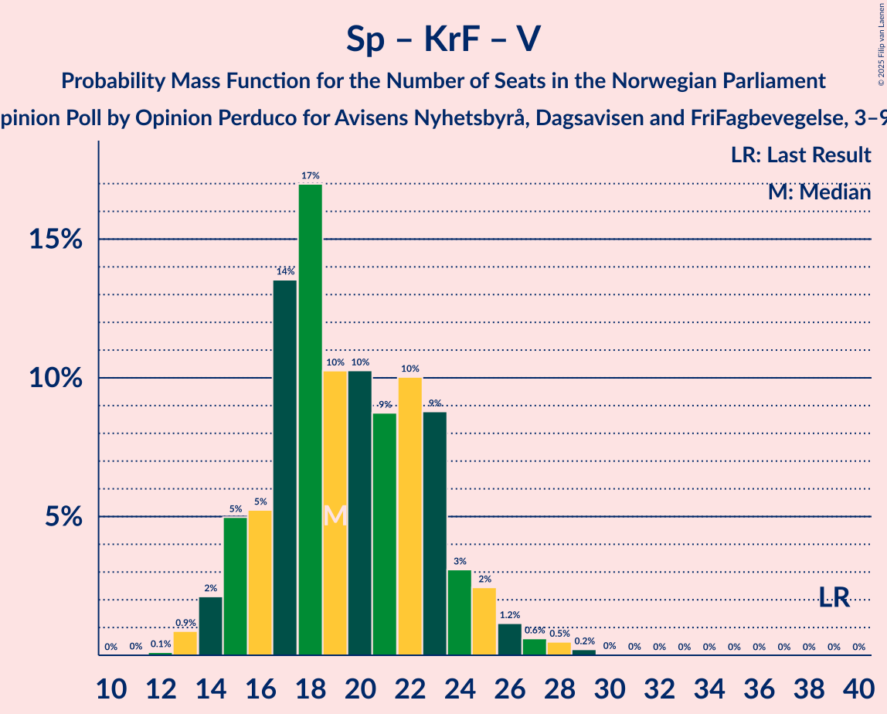

| Number of Seats | Probability | Accumulated | Special Marks |
|:---------------:|:-----------:|:-----------:|:-------------:|
| 12 | 0.1% | 100% |  |
| 13 | 0.9% | 99.9% |  |
| 14 | 2% | 99.0% |  |
| 15 | 5% | 97% |  |
| 16 | 5% | 92% |  |
| 17 | 14% | 87% |  |
| 18 | 17% | 73% | Median |
| 19 | 10% | 56% |  |
| 20 | 10% | 46% |  |
| 21 | 9% | 36% |  |
| 22 | 10% | 27% |  |
| 23 | 9% | 17% |  |
| 24 | 3% | 8% |  |
| 25 | 2% | 5% |  |
| 26 | 1.2% | 3% |  |
| 27 | 0.6% | 1.4% |  |
| 28 | 0.5% | 0.8% |  |
| 29 | 0.2% | 0.3% |  |
| 30 | 0% | 0.1% |  |
| 31 | 0% | 0% |  |
| 32 | 0% | 0% |  |
| 33 | 0% | 0% |  |
| 34 | 0% | 0% |  |
| 35 | 0% | 0% |  |
| 36 | 0% | 0% |  |
| 37 | 0% | 0% |  |
| 38 | 0% | 0% |  |
| 39 | 0% | 0% | Last Result |

## Technical Information

### Opinion Poll

+ **Polling firm:** Opinion Perduco
+ **Commissioner(s):** Avisens Nyhetsbyrå, Dagsavisen and FriFagbevegelse
+ **Fieldwork period:** 3–9 January 2023

### Calculations

+ **Sample size:** 1000
+ **Simulations done:** 1,048,576
+ **Error estimate:** 1.77%

