# Opinion Poll by Respons Analyse for VG, 4–9 January 2023

<a href="#voting-intentions">Voting Intentions</a> | <a href="#seats">Seats</a> | <a href="#coalitions">Coalitions</a> | <a href="#technical-information">Technical Information</a>

## Voting Intentions

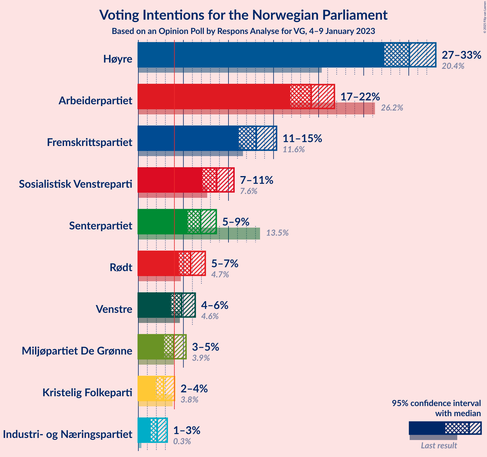

### Confidence Intervals

| Party | Last Result | Poll Result | 80% Confidence Interval | 90% Confidence Interval | 95% Confidence Interval | 99% Confidence Interval |
|:-----:|:-----------:|:-----------:|:-----------------------:|:-----------------------:|:-----------------------:|:-----------------------:|
| Høyre | 20.4% | 30.1% | 28.3–32.0% |27.7–32.5% |27.3–33.0% |26.4–33.9% |
| Arbeiderpartiet | 26.2% | 19.2% | 17.6–20.9% |17.2–21.3% |16.9–21.7% |16.2–22.6% |
| Fremskrittspartiet | 11.6% | 13.1% | 11.8–14.6% |11.4–15.0% |11.1–15.3% |10.5–16.0% |
| Sosialistisk Venstreparti | 7.6% | 8.7% | 7.6–9.9% |7.3–10.3% |7.1–10.6% |6.6–11.2% |
| Senterpartiet | 13.5% | 6.9% | 6.0–8.0% |5.7–8.4% |5.5–8.6% |5.1–9.2% |
| Rødt | 4.7% | 5.8% | 4.9–6.9% |4.7–7.2% |4.5–7.4% |4.1–8.0% |
| Venstre | 4.6% | 4.8% | 4.0–5.8% |3.8–6.1% |3.6–6.3% |3.3–6.8% |
| Miljøpartiet De Grønne | 3.9% | 3.9% | 3.2–4.8% |3.0–5.1% |2.9–5.3% |2.6–5.8% |
| Kristelig Folkeparti | 3.8% | 2.8% | 2.2–3.6% |2.1–3.8% |1.9–4.0% |1.7–4.4% |
| Industri- og Næringspartiet | 0.3% | 2.1% | 1.6–2.8% |1.5–3.0% |1.4–3.2% |1.2–3.6% |

*Note:* The poll result column reflects the actual value used in the calculations. Published results may vary slightly, and in addition be rounded to fewer digits.

## Seats

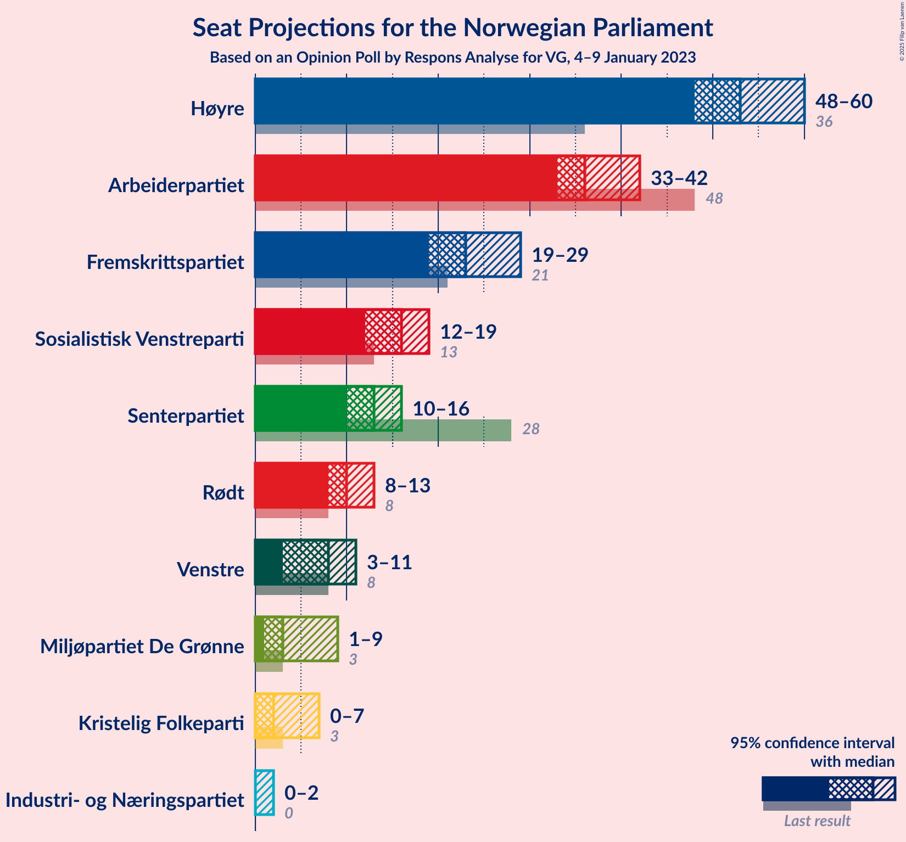

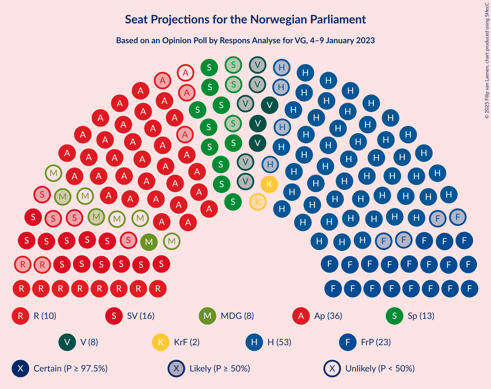

### Confidence Intervals

| Party | Last Result | Median | 80% Confidence Interval | 90% Confidence Interval | 95% Confidence Interval | 99% Confidence Interval |
|:-----:|:-----------:|:------:|:-----------------------:|:-----------------------:|:-----------------------:|:-----------------------:|
| <a href="#høyre">Høyre</a> | 36 | 53 | 50–58 |49–60 |48–60 |47–63 |
| <a href="#arbeiderpartiet">Arbeiderpartiet</a> | 48 | 36 | 34–41 |33–42 |33–42 |32–44 |
| <a href="#fremskrittspartiet">Fremskrittspartiet</a> | 21 | 23 | 20–27 |20–28 |19–29 |18–30 |
| <a href="#sosialistisk-venstreparti">Sosialistisk Venstreparti</a> | 13 | 16 | 13–18 |12–19 |12–19 |11–20 |
| <a href="#senterpartiet">Senterpartiet</a> | 28 | 13 | 11–14 |10–15 |10–16 |9–17 |
| <a href="#rødt">Rødt</a> | 8 | 10 | 9–12 |8–13 |8–13 |7–14 |
| <a href="#venstre">Venstre</a> | 8 | 8 | 7–10 |3–11 |3–11 |2–13 |
| <a href="#miljøpartiet-de-grønne">Miljøpartiet De Grønne</a> | 3 | 3 | 1–8 |1–9 |1–9 |1–10 |
| <a href="#kristelig-folkeparti">Kristelig Folkeparti</a> | 3 | 2 | 0–3 |0–3 |0–7 |0–8 |
| <a href="#industri--og-næringspartiet">Industri- og Næringspartiet</a> | 0 | 0 | 0–2 |0–2 |0–2 |0–3 |

### Høyre

*For a full overview of the results for this party, see the [Høyre](party-høyre.html) page.*

| Number of Seats | Probability | Accumulated | Special Marks |
|:---------------:|:-----------:|:-----------:|:-------------:|
| 36 | 0% | 100% | Last Result |
| 37 | 0% | 100% |  |
| 38 | 0% | 100% |  |
| 39 | 0% | 100% |  |
| 40 | 0% | 100% |  |
| 41 | 0% | 100% |  |
| 42 | 0% | 100% |  |
| 43 | 0% | 100% |  |
| 44 | 0% | 100% |  |
| 45 | 0.1% | 100% |  |
| 46 | 0.1% | 99.8% |  |
| 47 | 1.1% | 99.7% |  |
| 48 | 3% | 98.6% |  |
| 49 | 4% | 96% |  |
| 50 | 11% | 92% |  |
| 51 | 11% | 81% |  |
| 52 | 11% | 70% |  |
| 53 | 9% | 59% | Median |
| 54 | 11% | 50% |  |
| 55 | 7% | 39% |  |
| 56 | 7% | 31% |  |
| 57 | 7% | 24% |  |
| 58 | 9% | 17% |  |
| 59 | 3% | 8% |  |
| 60 | 3% | 5% |  |
| 61 | 0.5% | 2% |  |
| 62 | 0.3% | 2% |  |
| 63 | 1.0% | 1.2% |  |
| 64 | 0.2% | 0.2% |  |
| 65 | 0% | 0.1% |  |
| 66 | 0% | 0% |  |

### Arbeiderpartiet

*For a full overview of the results for this party, see the [Arbeiderpartiet](party-arbeiderpartiet.html) page.*

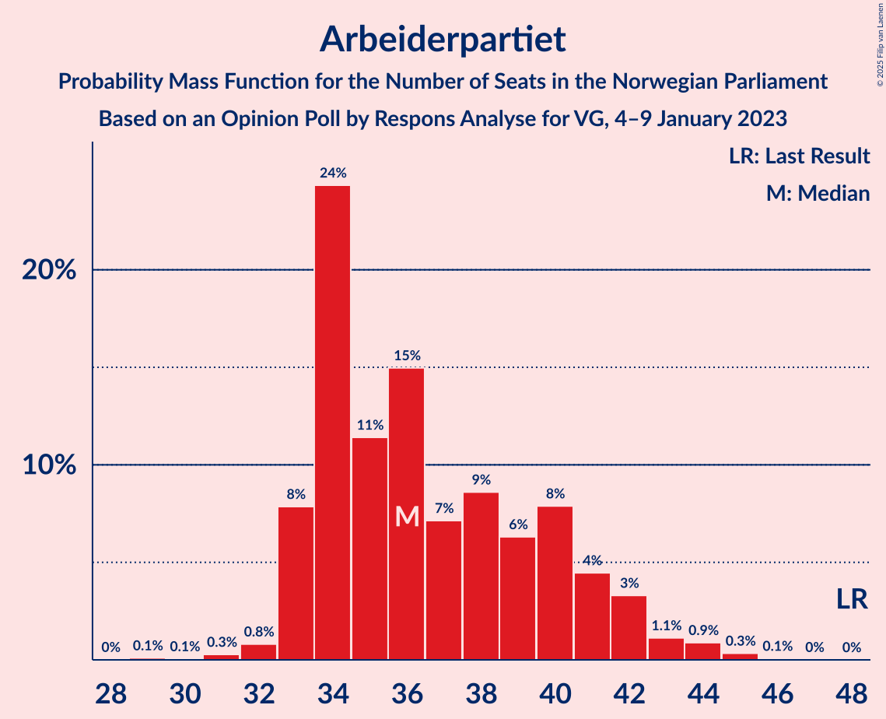

| Number of Seats | Probability | Accumulated | Special Marks |
|:---------------:|:-----------:|:-----------:|:-------------:|
| 29 | 0.1% | 100% |  |
| 30 | 0.1% | 99.9% |  |
| 31 | 0.3% | 99.8% |  |
| 32 | 0.8% | 99.5% |  |
| 33 | 8% | 98.7% |  |
| 34 | 24% | 91% |  |
| 35 | 11% | 67% |  |
| 36 | 15% | 55% | Median |
| 37 | 7% | 40% |  |
| 38 | 9% | 33% |  |
| 39 | 6% | 24% |  |
| 40 | 8% | 18% |  |
| 41 | 4% | 10% |  |
| 42 | 3% | 6% |  |
| 43 | 1.1% | 2% |  |
| 44 | 0.9% | 1.3% |  |
| 45 | 0.3% | 0.4% |  |
| 46 | 0.1% | 0.1% |  |
| 47 | 0% | 0% |  |
| 48 | 0% | 0% | Last Result |

### Fremskrittspartiet

*For a full overview of the results for this party, see the [Fremskrittspartiet](party-fremskrittspartiet.html) page.*

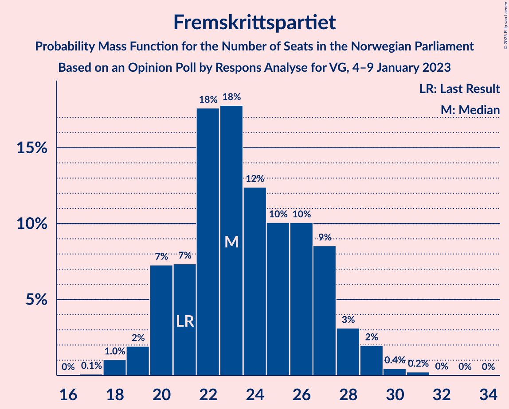

| Number of Seats | Probability | Accumulated | Special Marks |
|:---------------:|:-----------:|:-----------:|:-------------:|
| 17 | 0.1% | 100% |  |
| 18 | 1.0% | 99.9% |  |
| 19 | 2% | 98.9% |  |
| 20 | 7% | 97% |  |
| 21 | 7% | 90% | Last Result |
| 22 | 18% | 82% |  |
| 23 | 18% | 65% | Median |
| 24 | 12% | 47% |  |
| 25 | 10% | 35% |  |
| 26 | 10% | 24% |  |
| 27 | 9% | 14% |  |
| 28 | 3% | 6% |  |
| 29 | 2% | 3% |  |
| 30 | 0.4% | 0.7% |  |
| 31 | 0.2% | 0.3% |  |
| 32 | 0% | 0.1% |  |
| 33 | 0% | 0% |  |

### Sosialistisk Venstreparti

*For a full overview of the results for this party, see the [Sosialistisk Venstreparti](party-sosialistiskvenstreparti.html) page.*

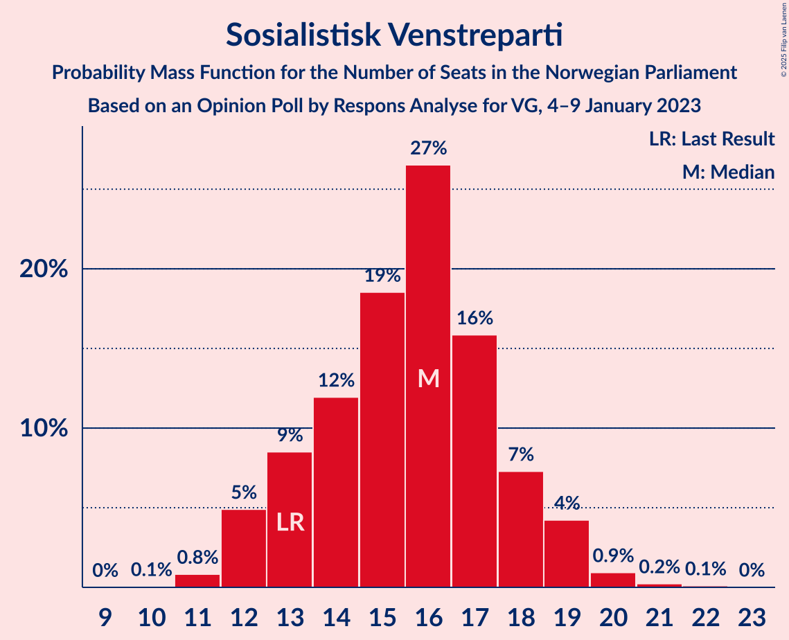

| Number of Seats | Probability | Accumulated | Special Marks |
|:---------------:|:-----------:|:-----------:|:-------------:|
| 10 | 0.1% | 100% |  |
| 11 | 0.8% | 99.9% |  |
| 12 | 5% | 99.1% |  |
| 13 | 9% | 94% | Last Result |
| 14 | 12% | 86% |  |
| 15 | 19% | 74% |  |
| 16 | 27% | 55% | Median |
| 17 | 16% | 29% |  |
| 18 | 7% | 13% |  |
| 19 | 4% | 6% |  |
| 20 | 0.9% | 1.3% |  |
| 21 | 0.2% | 0.4% |  |
| 22 | 0.1% | 0.1% |  |
| 23 | 0% | 0% |  |

### Senterpartiet

*For a full overview of the results for this party, see the [Senterpartiet](party-senterpartiet.html) page.*

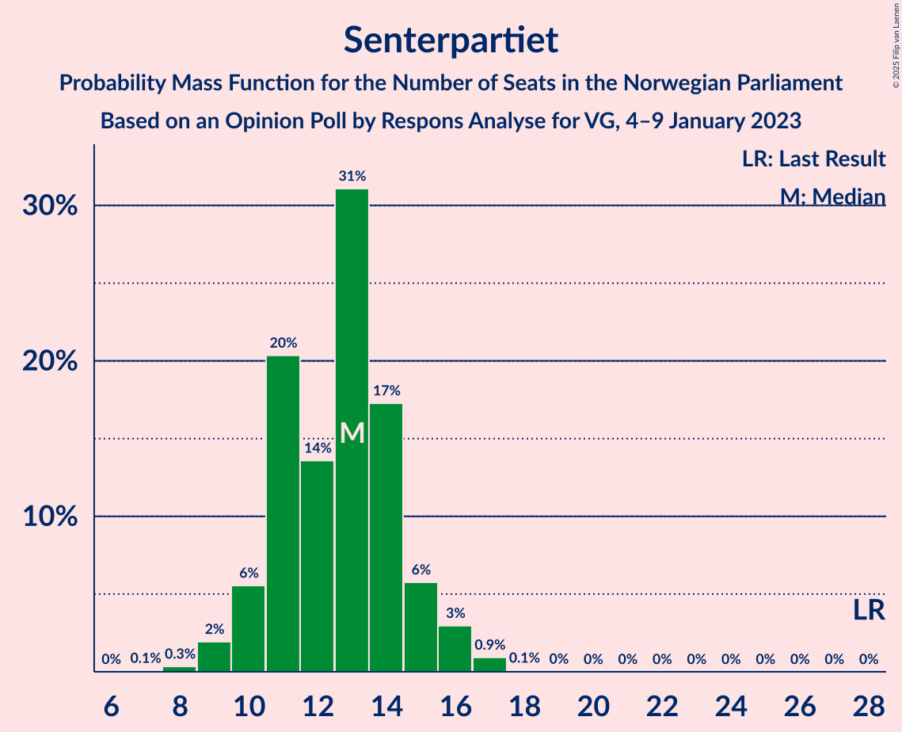

| Number of Seats | Probability | Accumulated | Special Marks |
|:---------------:|:-----------:|:-----------:|:-------------:|
| 7 | 0.1% | 100% |  |
| 8 | 0.3% | 99.9% |  |
| 9 | 2% | 99.6% |  |
| 10 | 6% | 98% |  |
| 11 | 20% | 92% |  |
| 12 | 14% | 72% |  |
| 13 | 31% | 58% | Median |
| 14 | 17% | 27% |  |
| 15 | 6% | 10% |  |
| 16 | 3% | 4% |  |
| 17 | 0.9% | 1.0% |  |
| 18 | 0.1% | 0.1% |  |
| 19 | 0% | 0% |  |
| 20 | 0% | 0% |  |
| 21 | 0% | 0% |  |
| 22 | 0% | 0% |  |
| 23 | 0% | 0% |  |
| 24 | 0% | 0% |  |
| 25 | 0% | 0% |  |
| 26 | 0% | 0% |  |
| 27 | 0% | 0% |  |
| 28 | 0% | 0% | Last Result |

### Rødt

*For a full overview of the results for this party, see the [Rødt](party-rødt.html) page.*

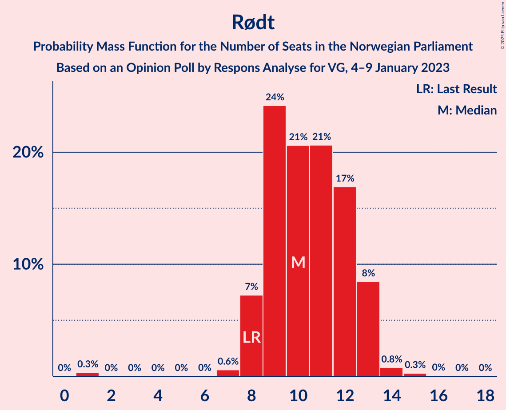

| Number of Seats | Probability | Accumulated | Special Marks |
|:---------------:|:-----------:|:-----------:|:-------------:|
| 1 | 0.3% | 100% |  |
| 2 | 0% | 99.7% |  |
| 3 | 0% | 99.7% |  |
| 4 | 0% | 99.7% |  |
| 5 | 0% | 99.7% |  |
| 6 | 0% | 99.7% |  |
| 7 | 0.6% | 99.7% |  |
| 8 | 7% | 99.1% | Last Result |
| 9 | 24% | 92% |  |
| 10 | 21% | 68% | Median |
| 11 | 21% | 47% |  |
| 12 | 17% | 26% |  |
| 13 | 8% | 10% |  |
| 14 | 0.8% | 1.1% |  |
| 15 | 0.3% | 0.3% |  |
| 16 | 0% | 0.1% |  |
| 17 | 0% | 0% |  |

### Venstre

*For a full overview of the results for this party, see the [Venstre](party-venstre.html) page.*

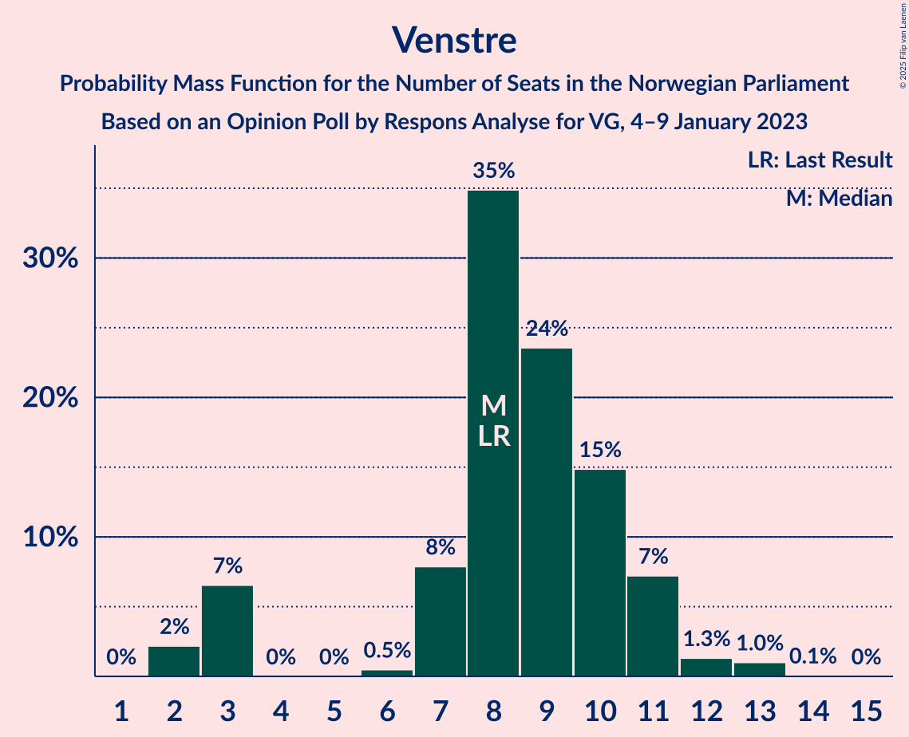

| Number of Seats | Probability | Accumulated | Special Marks |
|:---------------:|:-----------:|:-----------:|:-------------:|
| 2 | 2% | 100% |  |
| 3 | 7% | 98% |  |
| 4 | 0% | 91% |  |
| 5 | 0% | 91% |  |
| 6 | 0.5% | 91% |  |
| 7 | 8% | 91% |  |
| 8 | 35% | 83% | Last Result, Median |
| 9 | 24% | 48% |  |
| 10 | 15% | 24% |  |
| 11 | 7% | 10% |  |
| 12 | 1.3% | 2% |  |
| 13 | 1.0% | 1.1% |  |
| 14 | 0.1% | 0.1% |  |
| 15 | 0% | 0% |  |

### Miljøpartiet De Grønne

*For a full overview of the results for this party, see the [Miljøpartiet De Grønne](party-miljøpartietdegrønne.html) page.*

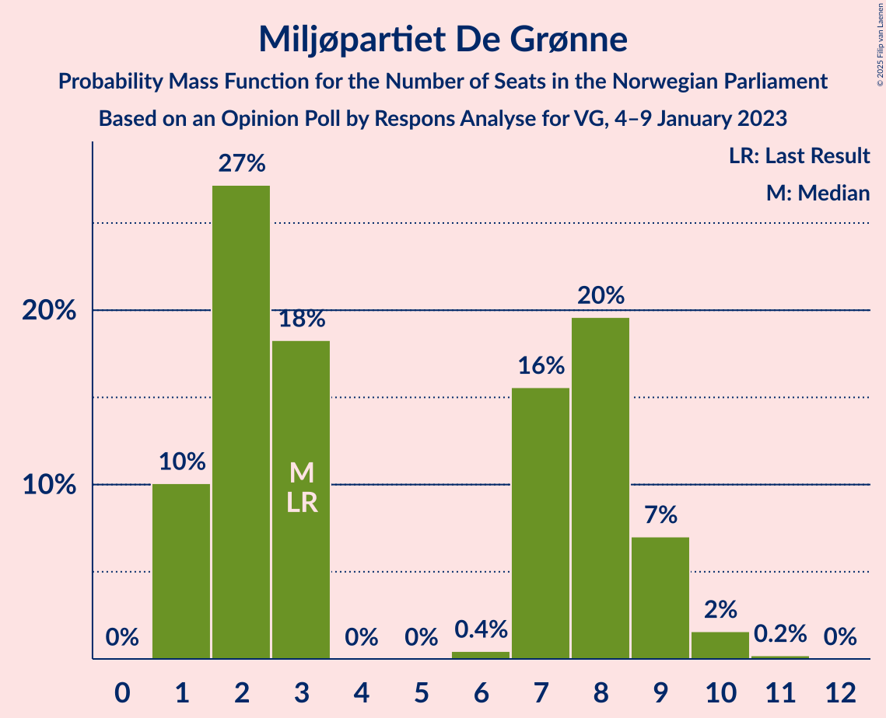

| Number of Seats | Probability | Accumulated | Special Marks |
|:---------------:|:-----------:|:-----------:|:-------------:|
| 1 | 10% | 100% |  |
| 2 | 27% | 90% |  |
| 3 | 18% | 63% | Last Result, Median |
| 4 | 0% | 44% |  |
| 5 | 0% | 44% |  |
| 6 | 0.4% | 44% |  |
| 7 | 16% | 44% |  |
| 8 | 20% | 28% |  |
| 9 | 7% | 9% |  |
| 10 | 2% | 2% |  |
| 11 | 0.2% | 0.2% |  |
| 12 | 0% | 0% |  |

### Kristelig Folkeparti

*For a full overview of the results for this party, see the [Kristelig Folkeparti](party-kristeligfolkeparti.html) page.*

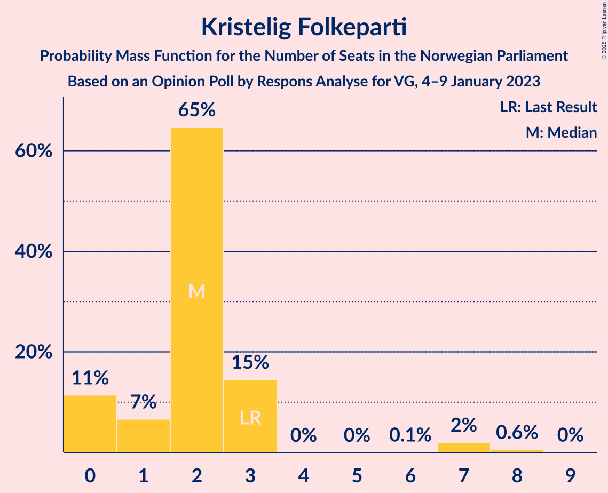

| Number of Seats | Probability | Accumulated | Special Marks |
|:---------------:|:-----------:|:-----------:|:-------------:|
| 0 | 11% | 100% |  |
| 1 | 7% | 89% |  |
| 2 | 65% | 82% | Median |
| 3 | 15% | 17% | Last Result |
| 4 | 0% | 3% |  |
| 5 | 0% | 3% |  |
| 6 | 0.1% | 3% |  |
| 7 | 2% | 3% |  |
| 8 | 0.6% | 0.6% |  |
| 9 | 0% | 0% |  |

### Industri- og Næringspartiet

*For a full overview of the results for this party, see the [Industri- og Næringspartiet](party-industri-ognæringspartiet.html) page.*

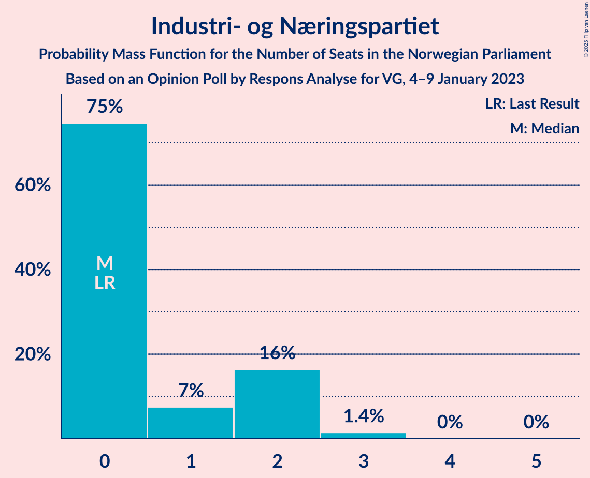

| Number of Seats | Probability | Accumulated | Special Marks |
|:---------------:|:-----------:|:-----------:|:-------------:|
| 0 | 75% | 100% | Last Result, Median |
| 1 | 7% | 25% |  |
| 2 | 16% | 18% |  |
| 3 | 1.4% | 1.5% |  |
| 4 | 0% | 0% |  |

## Coalitions

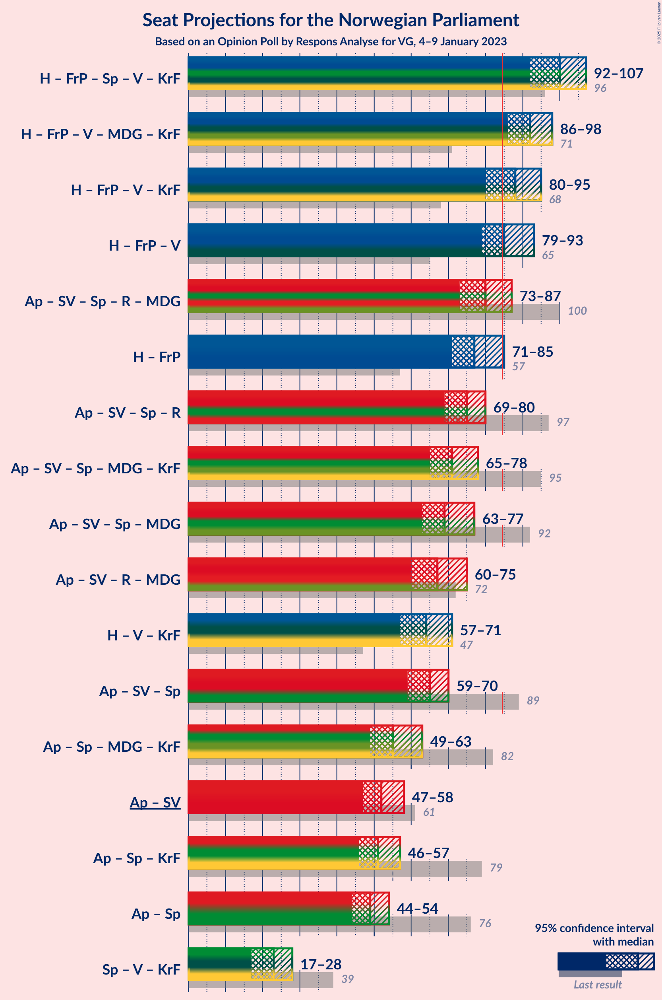

### Confidence Intervals

| Coalition | Last Result | Median | Majority? | 80% Confidence Interval | 90% Confidence Interval | 95% Confidence Interval | 99% Confidence Interval |
|:---------:|:-----------:|:------:|:---------:|:-----------------------:|:-----------------------:|:-----------------------:|:-----------------------:|
| Høyre – Fremskrittspartiet – Senterpartiet – Venstre – Kristelig Folkeparti | 96 | 100 | 100% | 95–106 | 94–106 | 92–107 | 90–109 |
| Høyre – Fremskrittspartiet – Venstre – Miljøpartiet De Grønne – Kristelig Folkeparti | 71 | 92 | 99.3% | 89–96 | 88–97 | 86–98 | 84–101 |
| Høyre – Fremskrittspartiet – Venstre – Kristelig Folkeparti | 68 | 88 | 79% | 83–93 | 81–93 | 80–95 | 79–96 |
| Høyre – Fremskrittspartiet – Venstre | 65 | 85 | 60% | 81–91 | 80–91 | 79–93 | 77–94 |
| Arbeiderpartiet – Sosialistisk Venstreparti – Senterpartiet – Rødt – Miljøpartiet De Grønne | 100 | 80 | 8% | 75–84 | 74–86 | 73–87 | 71–89 |
| Høyre – Fremskrittspartiet | 57 | 77 | 3% | 73–82 | 72–83 | 71–85 | 69–86 |
| Arbeiderpartiet – Sosialistisk Venstreparti – Senterpartiet – Rødt | 97 | 75 | 0.2% | 72–79 | 70–80 | 69–80 | 67–83 |
| Arbeiderpartiet – Sosialistisk Venstreparti – Senterpartiet – Miljøpartiet De Grønne – Kristelig Folkeparti | 95 | 71 | 0% | 67–76 | 65–78 | 65–78 | 63–81 |
| Arbeiderpartiet – Sosialistisk Venstreparti – Senterpartiet – Miljøpartiet De Grønne | 92 | 69 | 0% | 65–74 | 64–76 | 63–77 | 61–78 |
| Arbeiderpartiet – Sosialistisk Venstreparti – Rødt – Miljøpartiet De Grønne | 72 | 67 | 0% | 62–73 | 61–74 | 60–75 | 59–77 |
| Høyre – Venstre – Kristelig Folkeparti | 47 | 64 | 0% | 60–69 | 58–69 | 57–71 | 55–73 |
| Arbeiderpartiet – Sosialistisk Venstreparti – Senterpartiet | 89 | 65 | 0% | 61–68 | 60–69 | 59–70 | 57–72 |
| Arbeiderpartiet – Senterpartiet – Miljøpartiet De Grønne – Kristelig Folkeparti | 82 | 55 | 0% | 51–62 | 50–63 | 49–63 | 47–66 |
| Arbeiderpartiet – Sosialistisk Venstreparti | 61 | 52 | 0% | 49–56 | 48–58 | 47–58 | 46–59 |
| Arbeiderpartiet – Senterpartiet – Kristelig Folkeparti | 79 | 51 | 0% | 48–55 | 47–56 | 46–57 | 44–60 |
| Arbeiderpartiet – Senterpartiet | 76 | 49 | 0% | 46–53 | 45–54 | 44–54 | 43–57 |
| Senterpartiet – Venstre – Kristelig Folkeparti | 39 | 23 | 0% | 19–26 | 18–27 | 17–28 | 15–29 |

### Høyre – Fremskrittspartiet – Senterpartiet – Venstre – Kristelig Folkeparti

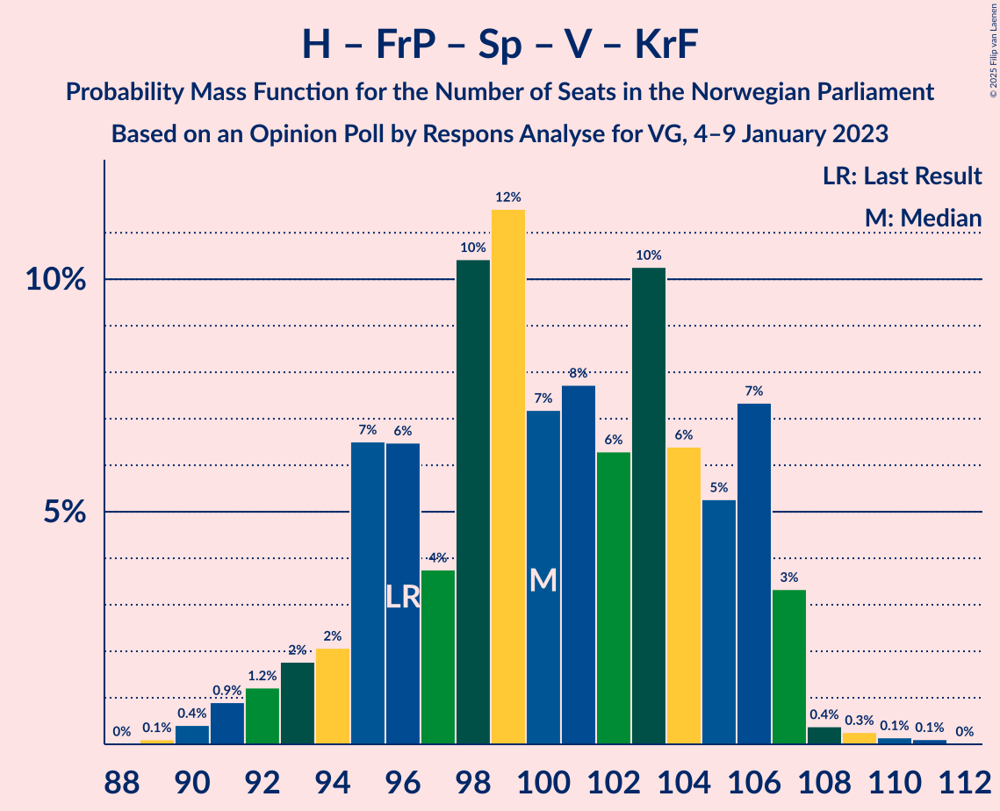

| Number of Seats | Probability | Accumulated | Special Marks |
|:---------------:|:-----------:|:-----------:|:-------------:|
| 89 | 0.1% | 100% |  |
| 90 | 0.4% | 99.8% |  |
| 91 | 0.9% | 99.4% |  |
| 92 | 1.2% | 98.5% |  |
| 93 | 2% | 97% |  |
| 94 | 2% | 96% |  |
| 95 | 7% | 93% |  |
| 96 | 6% | 87% | Last Result |
| 97 | 4% | 80% |  |
| 98 | 10% | 77% |  |
| 99 | 12% | 66% | Median |
| 100 | 7% | 55% |  |
| 101 | 8% | 48% |  |
| 102 | 6% | 40% |  |
| 103 | 10% | 34% |  |
| 104 | 6% | 23% |  |
| 105 | 5% | 17% |  |
| 106 | 7% | 12% |  |
| 107 | 3% | 4% |  |
| 108 | 0.4% | 0.9% |  |
| 109 | 0.3% | 0.6% |  |
| 110 | 0.1% | 0.3% |  |
| 111 | 0.1% | 0.1% |  |
| 112 | 0% | 0% |  |

### Høyre – Fremskrittspartiet – Venstre – Miljøpartiet De Grønne – Kristelig Folkeparti

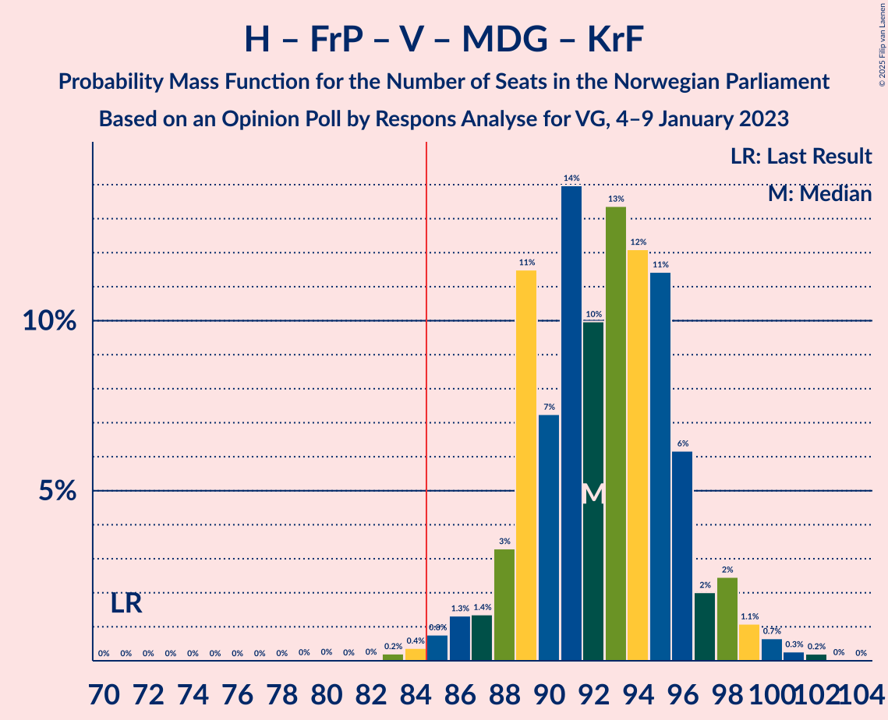

| Number of Seats | Probability | Accumulated | Special Marks |
|:---------------:|:-----------:|:-----------:|:-------------:|
| 71 | 0% | 100% | Last Result |
| 72 | 0% | 100% |  |
| 73 | 0% | 100% |  |
| 74 | 0% | 100% |  |
| 75 | 0% | 100% |  |
| 76 | 0% | 100% |  |
| 77 | 0% | 100% |  |
| 78 | 0% | 100% |  |
| 79 | 0% | 100% |  |
| 80 | 0% | 100% |  |
| 81 | 0% | 99.9% |  |
| 82 | 0% | 99.9% |  |
| 83 | 0.2% | 99.9% |  |
| 84 | 0.4% | 99.6% |  |
| 85 | 0.8% | 99.3% | Majority |
| 86 | 1.3% | 98.5% |  |
| 87 | 1.4% | 97% |  |
| 88 | 3% | 96% |  |
| 89 | 11% | 93% | Median |
| 90 | 7% | 81% |  |
| 91 | 14% | 74% |  |
| 92 | 10% | 60% |  |
| 93 | 13% | 50% |  |
| 94 | 12% | 36% |  |
| 95 | 11% | 24% |  |
| 96 | 6% | 13% |  |
| 97 | 2% | 7% |  |
| 98 | 2% | 5% |  |
| 99 | 1.1% | 2% |  |
| 100 | 0.7% | 1.2% |  |
| 101 | 0.3% | 0.5% |  |
| 102 | 0.2% | 0.3% |  |
| 103 | 0% | 0.1% |  |
| 104 | 0% | 0% |  |

### Høyre – Fremskrittspartiet – Venstre – Kristelig Folkeparti

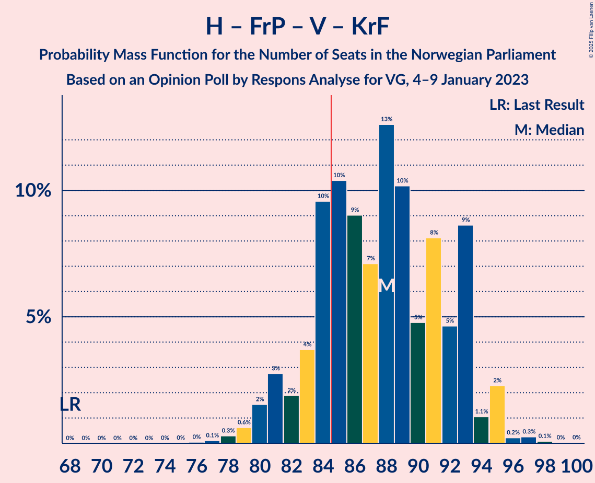

| Number of Seats | Probability | Accumulated | Special Marks |
|:---------------:|:-----------:|:-----------:|:-------------:|
| 68 | 0% | 100% | Last Result |
| 69 | 0% | 100% |  |
| 70 | 0% | 100% |  |
| 71 | 0% | 100% |  |
| 72 | 0% | 100% |  |
| 73 | 0% | 100% |  |
| 74 | 0% | 100% |  |
| 75 | 0% | 100% |  |
| 76 | 0% | 100% |  |
| 77 | 0.1% | 99.9% |  |
| 78 | 0.3% | 99.8% |  |
| 79 | 0.6% | 99.5% |  |
| 80 | 2% | 98.9% |  |
| 81 | 3% | 97% |  |
| 82 | 2% | 95% |  |
| 83 | 4% | 93% |  |
| 84 | 10% | 89% |  |
| 85 | 10% | 79% | Majority |
| 86 | 9% | 69% | Median |
| 87 | 7% | 60% |  |
| 88 | 13% | 53% |  |
| 89 | 10% | 40% |  |
| 90 | 5% | 30% |  |
| 91 | 8% | 25% |  |
| 92 | 5% | 17% |  |
| 93 | 9% | 13% |  |
| 94 | 1.1% | 4% |  |
| 95 | 2% | 3% |  |
| 96 | 0.2% | 0.6% |  |
| 97 | 0.3% | 0.4% |  |
| 98 | 0.1% | 0.2% |  |
| 99 | 0% | 0.1% |  |
| 100 | 0% | 0% |  |

### Høyre – Fremskrittspartiet – Venstre

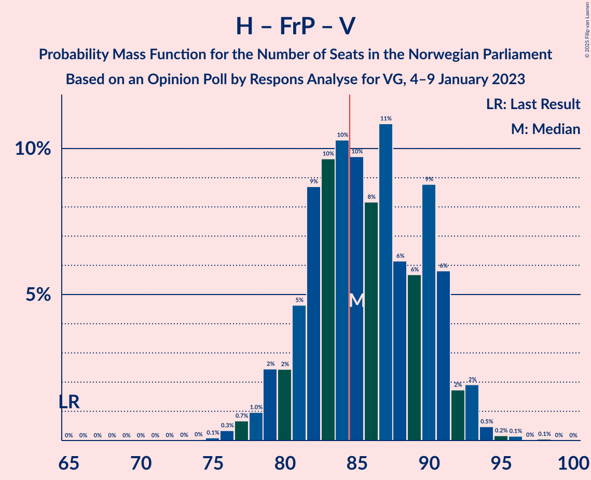

| Number of Seats | Probability | Accumulated | Special Marks |
|:---------------:|:-----------:|:-----------:|:-------------:|
| 65 | 0% | 100% | Last Result |
| 66 | 0% | 100% |  |
| 67 | 0% | 100% |  |
| 68 | 0% | 100% |  |
| 69 | 0% | 100% |  |
| 70 | 0% | 100% |  |
| 71 | 0% | 100% |  |
| 72 | 0% | 100% |  |
| 73 | 0% | 100% |  |
| 74 | 0% | 100% |  |
| 75 | 0.1% | 99.9% |  |
| 76 | 0.3% | 99.8% |  |
| 77 | 0.7% | 99.5% |  |
| 78 | 1.0% | 98.8% |  |
| 79 | 2% | 98% |  |
| 80 | 2% | 95% |  |
| 81 | 5% | 93% |  |
| 82 | 9% | 88% |  |
| 83 | 10% | 80% |  |
| 84 | 10% | 70% | Median |
| 85 | 10% | 60% | Majority |
| 86 | 8% | 50% |  |
| 87 | 11% | 42% |  |
| 88 | 6% | 31% |  |
| 89 | 6% | 25% |  |
| 90 | 9% | 19% |  |
| 91 | 6% | 10% |  |
| 92 | 2% | 5% |  |
| 93 | 2% | 3% |  |
| 94 | 0.5% | 0.9% |  |
| 95 | 0.2% | 0.4% |  |
| 96 | 0.1% | 0.2% |  |
| 97 | 0% | 0.1% |  |
| 98 | 0.1% | 0.1% |  |
| 99 | 0% | 0% |  |

### Arbeiderpartiet – Sosialistisk Venstreparti – Senterpartiet – Rødt – Miljøpartiet De Grønne

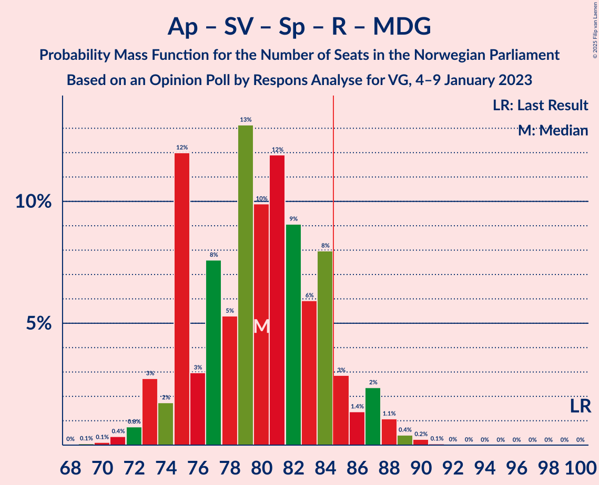

| Number of Seats | Probability | Accumulated | Special Marks |
|:---------------:|:-----------:|:-----------:|:-------------:|
| 68 | 0% | 100% |  |
| 69 | 0.1% | 99.9% |  |
| 70 | 0.1% | 99.9% |  |
| 71 | 0.4% | 99.8% |  |
| 72 | 0.8% | 99.4% |  |
| 73 | 3% | 98.7% |  |
| 74 | 2% | 96% |  |
| 75 | 12% | 94% |  |
| 76 | 3% | 82% |  |
| 77 | 8% | 79% |  |
| 78 | 5% | 72% | Median |
| 79 | 13% | 66% |  |
| 80 | 10% | 53% |  |
| 81 | 12% | 43% |  |
| 82 | 9% | 31% |  |
| 83 | 6% | 22% |  |
| 84 | 8% | 16% |  |
| 85 | 3% | 8% | Majority |
| 86 | 1.4% | 6% |  |
| 87 | 2% | 4% |  |
| 88 | 1.1% | 2% |  |
| 89 | 0.4% | 0.7% |  |
| 90 | 0.2% | 0.3% |  |
| 91 | 0.1% | 0.1% |  |
| 92 | 0% | 0% |  |
| 93 | 0% | 0% |  |
| 94 | 0% | 0% |  |
| 95 | 0% | 0% |  |
| 96 | 0% | 0% |  |
| 97 | 0% | 0% |  |
| 98 | 0% | 0% |  |
| 99 | 0% | 0% |  |
| 100 | 0% | 0% | Last Result |

### Høyre – Fremskrittspartiet

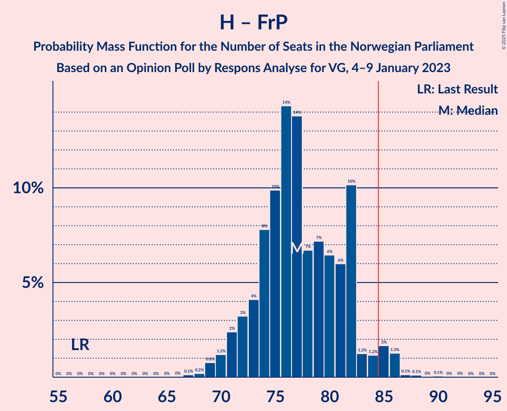

| Number of Seats | Probability | Accumulated | Special Marks |
|:---------------:|:-----------:|:-----------:|:-------------:|
| 57 | 0% | 100% | Last Result |
| 58 | 0% | 100% |  |
| 59 | 0% | 100% |  |
| 60 | 0% | 100% |  |
| 61 | 0% | 100% |  |
| 62 | 0% | 100% |  |
| 63 | 0% | 100% |  |
| 64 | 0% | 100% |  |
| 65 | 0% | 100% |  |
| 66 | 0% | 100% |  |
| 67 | 0.1% | 100% |  |
| 68 | 0.2% | 99.8% |  |
| 69 | 0.8% | 99.6% |  |
| 70 | 1.2% | 98.9% |  |
| 71 | 2% | 98% |  |
| 72 | 3% | 95% |  |
| 73 | 4% | 92% |  |
| 74 | 8% | 88% |  |
| 75 | 10% | 80% |  |
| 76 | 14% | 70% | Median |
| 77 | 14% | 56% |  |
| 78 | 7% | 42% |  |
| 79 | 7% | 35% |  |
| 80 | 6% | 28% |  |
| 81 | 6% | 22% |  |
| 82 | 10% | 16% |  |
| 83 | 1.2% | 6% |  |
| 84 | 1.2% | 4% |  |
| 85 | 2% | 3% | Majority |
| 86 | 1.3% | 2% |  |
| 87 | 0.1% | 0.3% |  |
| 88 | 0.1% | 0.2% |  |
| 89 | 0% | 0.1% |  |
| 90 | 0.1% | 0.1% |  |
| 91 | 0% | 0% |  |

### Arbeiderpartiet – Sosialistisk Venstreparti – Senterpartiet – Rødt

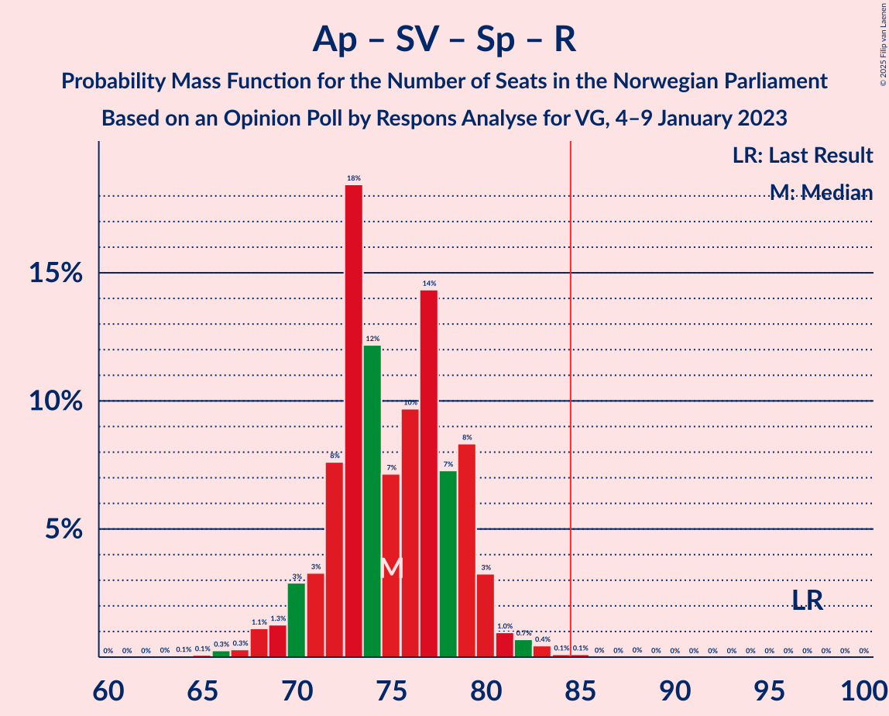

| Number of Seats | Probability | Accumulated | Special Marks |
|:---------------:|:-----------:|:-----------:|:-------------:|
| 64 | 0.1% | 100% |  |
| 65 | 0.1% | 99.9% |  |
| 66 | 0.3% | 99.8% |  |
| 67 | 0.3% | 99.6% |  |
| 68 | 1.1% | 99.3% |  |
| 69 | 1.3% | 98% |  |
| 70 | 3% | 97% |  |
| 71 | 3% | 94% |  |
| 72 | 8% | 91% |  |
| 73 | 18% | 83% |  |
| 74 | 12% | 65% |  |
| 75 | 7% | 52% | Median |
| 76 | 10% | 45% |  |
| 77 | 14% | 36% |  |
| 78 | 7% | 21% |  |
| 79 | 8% | 14% |  |
| 80 | 3% | 6% |  |
| 81 | 1.0% | 2% |  |
| 82 | 0.7% | 1.4% |  |
| 83 | 0.4% | 0.7% |  |
| 84 | 0.1% | 0.3% |  |
| 85 | 0.1% | 0.2% | Majority |
| 86 | 0% | 0.1% |  |
| 87 | 0% | 0.1% |  |
| 88 | 0% | 0% |  |
| 89 | 0% | 0% |  |
| 90 | 0% | 0% |  |
| 91 | 0% | 0% |  |
| 92 | 0% | 0% |  |
| 93 | 0% | 0% |  |
| 94 | 0% | 0% |  |
| 95 | 0% | 0% |  |
| 96 | 0% | 0% |  |
| 97 | 0% | 0% | Last Result |

### Arbeiderpartiet – Sosialistisk Venstreparti – Senterpartiet – Miljøpartiet De Grønne – Kristelig Folkeparti

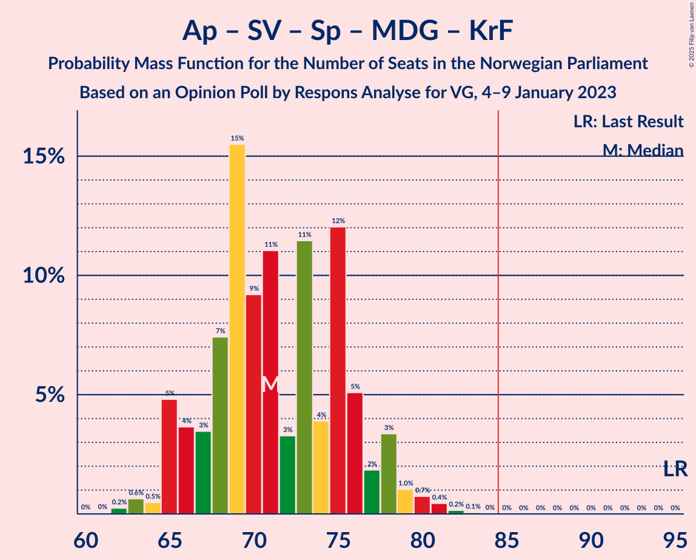

| Number of Seats | Probability | Accumulated | Special Marks |
|:---------------:|:-----------:|:-----------:|:-------------:|
| 60 | 0% | 100% |  |
| 61 | 0% | 99.9% |  |
| 62 | 0.2% | 99.9% |  |
| 63 | 0.6% | 99.6% |  |
| 64 | 0.5% | 99.0% |  |
| 65 | 5% | 98.5% |  |
| 66 | 4% | 94% |  |
| 67 | 3% | 90% |  |
| 68 | 7% | 87% |  |
| 69 | 15% | 79% |  |
| 70 | 9% | 64% | Median |
| 71 | 11% | 54% |  |
| 72 | 3% | 43% |  |
| 73 | 11% | 40% |  |
| 74 | 4% | 29% |  |
| 75 | 12% | 25% |  |
| 76 | 5% | 13% |  |
| 77 | 2% | 8% |  |
| 78 | 3% | 6% |  |
| 79 | 1.0% | 2% |  |
| 80 | 0.7% | 1.4% |  |
| 81 | 0.4% | 0.7% |  |
| 82 | 0.2% | 0.2% |  |
| 83 | 0.1% | 0.1% |  |
| 84 | 0% | 0% |  |
| 85 | 0% | 0% | Majority |
| 86 | 0% | 0% |  |
| 87 | 0% | 0% |  |
| 88 | 0% | 0% |  |
| 89 | 0% | 0% |  |
| 90 | 0% | 0% |  |
| 91 | 0% | 0% |  |
| 92 | 0% | 0% |  |
| 93 | 0% | 0% |  |
| 94 | 0% | 0% |  |
| 95 | 0% | 0% | Last Result |

### Arbeiderpartiet – Sosialistisk Venstreparti – Senterpartiet – Miljøpartiet De Grønne

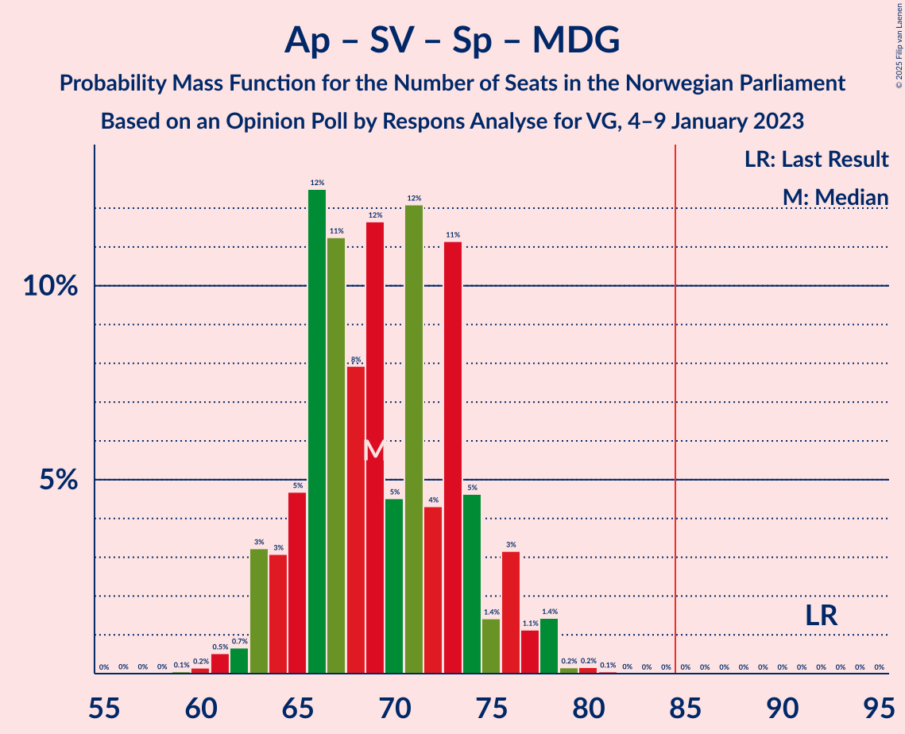

| Number of Seats | Probability | Accumulated | Special Marks |
|:---------------:|:-----------:|:-----------:|:-------------:|
| 59 | 0.1% | 100% |  |
| 60 | 0.2% | 99.9% |  |
| 61 | 0.5% | 99.8% |  |
| 62 | 0.7% | 99.2% |  |
| 63 | 3% | 98.6% |  |
| 64 | 3% | 95% |  |
| 65 | 5% | 92% |  |
| 66 | 12% | 88% |  |
| 67 | 11% | 75% |  |
| 68 | 8% | 64% | Median |
| 69 | 12% | 56% |  |
| 70 | 5% | 44% |  |
| 71 | 12% | 40% |  |
| 72 | 4% | 28% |  |
| 73 | 11% | 23% |  |
| 74 | 5% | 12% |  |
| 75 | 1.4% | 8% |  |
| 76 | 3% | 6% |  |
| 77 | 1.1% | 3% |  |
| 78 | 1.4% | 2% |  |
| 79 | 0.2% | 0.4% |  |
| 80 | 0.2% | 0.2% |  |
| 81 | 0.1% | 0.1% |  |
| 82 | 0% | 0% |  |
| 83 | 0% | 0% |  |
| 84 | 0% | 0% |  |
| 85 | 0% | 0% | Majority |
| 86 | 0% | 0% |  |
| 87 | 0% | 0% |  |
| 88 | 0% | 0% |  |
| 89 | 0% | 0% |  |
| 90 | 0% | 0% |  |
| 91 | 0% | 0% |  |
| 92 | 0% | 0% | Last Result |

### Arbeiderpartiet – Sosialistisk Venstreparti – Rødt – Miljøpartiet De Grønne

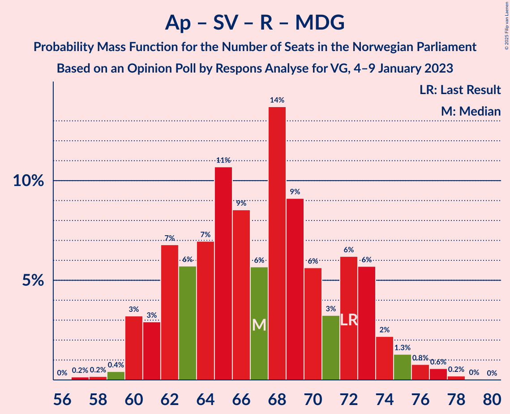

| Number of Seats | Probability | Accumulated | Special Marks |
|:---------------:|:-----------:|:-----------:|:-------------:|
| 56 | 0% | 100% |  |
| 57 | 0.2% | 99.9% |  |
| 58 | 0.2% | 99.8% |  |
| 59 | 0.4% | 99.6% |  |
| 60 | 3% | 99.2% |  |
| 61 | 3% | 96% |  |
| 62 | 7% | 93% |  |
| 63 | 6% | 86% |  |
| 64 | 7% | 81% |  |
| 65 | 11% | 74% | Median |
| 66 | 9% | 63% |  |
| 67 | 6% | 54% |  |
| 68 | 14% | 49% |  |
| 69 | 9% | 35% |  |
| 70 | 6% | 26% |  |
| 71 | 3% | 20% |  |
| 72 | 6% | 17% | Last Result |
| 73 | 6% | 11% |  |
| 74 | 2% | 5% |  |
| 75 | 1.3% | 3% |  |
| 76 | 0.8% | 2% |  |
| 77 | 0.6% | 0.8% |  |
| 78 | 0.2% | 0.3% |  |
| 79 | 0% | 0.1% |  |
| 80 | 0% | 0% |  |

### Høyre – Venstre – Kristelig Folkeparti

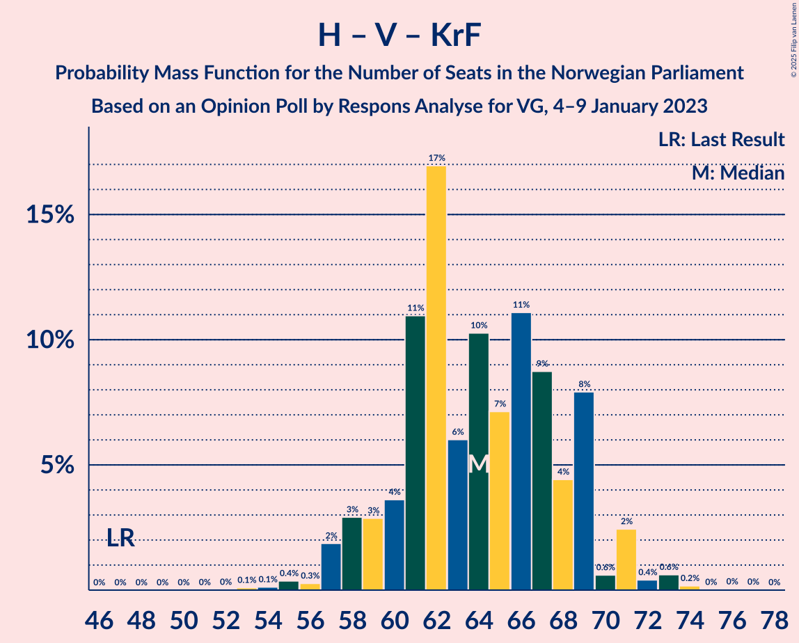

| Number of Seats | Probability | Accumulated | Special Marks |
|:---------------:|:-----------:|:-----------:|:-------------:|
| 47 | 0% | 100% | Last Result |
| 48 | 0% | 100% |  |
| 49 | 0% | 100% |  |
| 50 | 0% | 100% |  |
| 51 | 0% | 100% |  |
| 52 | 0% | 100% |  |
| 53 | 0.1% | 100% |  |
| 54 | 0.1% | 99.9% |  |
| 55 | 0.4% | 99.7% |  |
| 56 | 0.3% | 99.4% |  |
| 57 | 2% | 99.1% |  |
| 58 | 3% | 97% |  |
| 59 | 3% | 94% |  |
| 60 | 4% | 91% |  |
| 61 | 11% | 88% |  |
| 62 | 17% | 77% |  |
| 63 | 6% | 60% | Median |
| 64 | 10% | 54% |  |
| 65 | 7% | 44% |  |
| 66 | 11% | 37% |  |
| 67 | 9% | 25% |  |
| 68 | 4% | 17% |  |
| 69 | 8% | 12% |  |
| 70 | 0.6% | 4% |  |
| 71 | 2% | 4% |  |
| 72 | 0.4% | 1.3% |  |
| 73 | 0.6% | 0.9% |  |
| 74 | 0.2% | 0.3% |  |
| 75 | 0% | 0.1% |  |
| 76 | 0% | 0.1% |  |
| 77 | 0% | 0% |  |

### Arbeiderpartiet – Sosialistisk Venstreparti – Senterpartiet

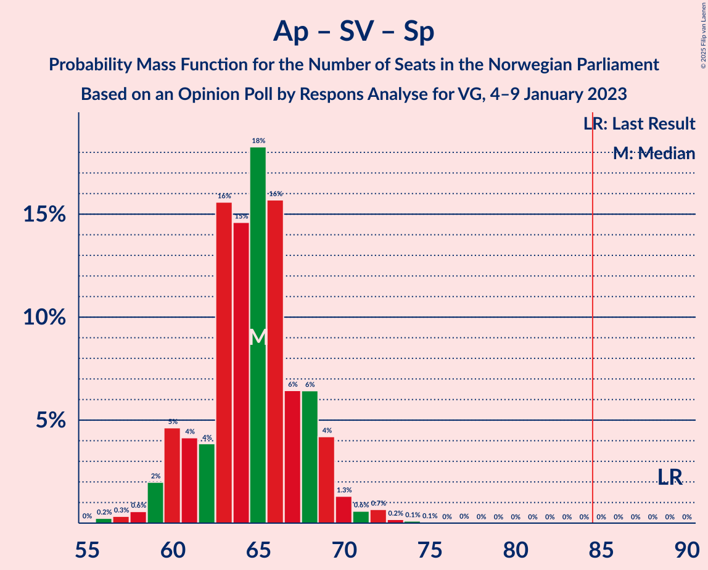

| Number of Seats | Probability | Accumulated | Special Marks |
|:---------------:|:-----------:|:-----------:|:-------------:|
| 55 | 0% | 100% |  |
| 56 | 0.2% | 99.9% |  |
| 57 | 0.3% | 99.7% |  |
| 58 | 0.6% | 99.4% |  |
| 59 | 2% | 98.8% |  |
| 60 | 5% | 97% |  |
| 61 | 4% | 92% |  |
| 62 | 4% | 88% |  |
| 63 | 16% | 84% |  |
| 64 | 15% | 69% |  |
| 65 | 18% | 54% | Median |
| 66 | 16% | 36% |  |
| 67 | 6% | 20% |  |
| 68 | 6% | 14% |  |
| 69 | 4% | 7% |  |
| 70 | 1.3% | 3% |  |
| 71 | 0.6% | 2% |  |
| 72 | 0.7% | 1.1% |  |
| 73 | 0.2% | 0.4% |  |
| 74 | 0.1% | 0.2% |  |
| 75 | 0.1% | 0.1% |  |
| 76 | 0% | 0.1% |  |
| 77 | 0% | 0% |  |
| 78 | 0% | 0% |  |
| 79 | 0% | 0% |  |
| 80 | 0% | 0% |  |
| 81 | 0% | 0% |  |
| 82 | 0% | 0% |  |
| 83 | 0% | 0% |  |
| 84 | 0% | 0% |  |
| 85 | 0% | 0% | Majority |
| 86 | 0% | 0% |  |
| 87 | 0% | 0% |  |
| 88 | 0% | 0% |  |
| 89 | 0% | 0% | Last Result |

### Arbeiderpartiet – Senterpartiet – Miljøpartiet De Grønne – Kristelig Folkeparti

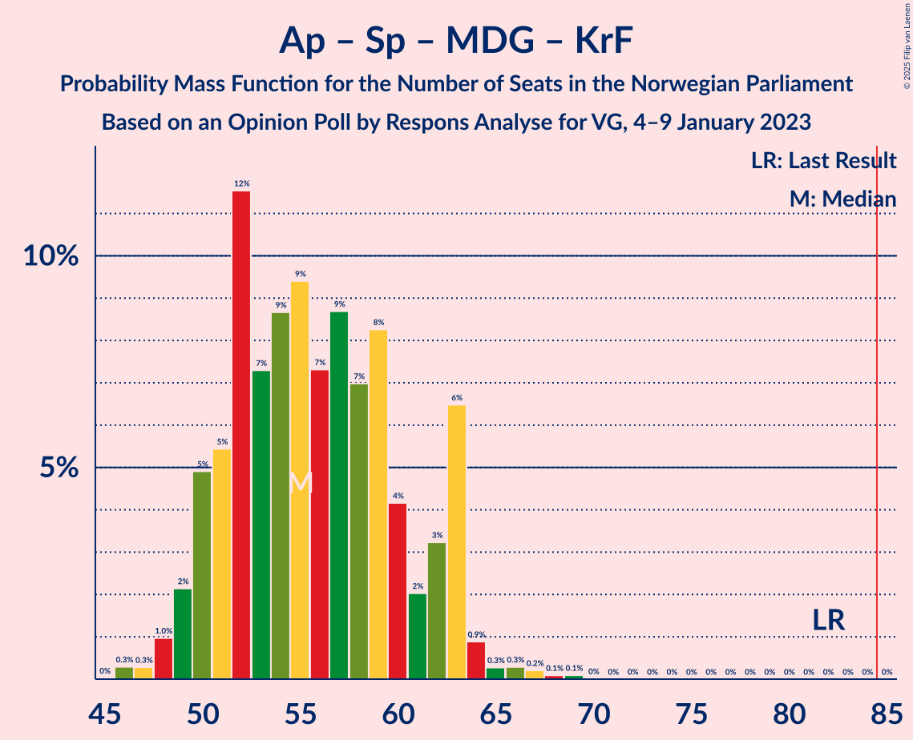

| Number of Seats | Probability | Accumulated | Special Marks |
|:---------------:|:-----------:|:-----------:|:-------------:|
| 46 | 0.3% | 100% |  |
| 47 | 0.3% | 99.7% |  |
| 48 | 1.0% | 99.4% |  |
| 49 | 2% | 98% |  |
| 50 | 5% | 96% |  |
| 51 | 5% | 91% |  |
| 52 | 12% | 86% |  |
| 53 | 7% | 74% |  |
| 54 | 9% | 67% | Median |
| 55 | 9% | 58% |  |
| 56 | 7% | 49% |  |
| 57 | 9% | 42% |  |
| 58 | 7% | 33% |  |
| 59 | 8% | 26% |  |
| 60 | 4% | 18% |  |
| 61 | 2% | 14% |  |
| 62 | 3% | 12% |  |
| 63 | 6% | 8% |  |
| 64 | 0.9% | 2% |  |
| 65 | 0.3% | 1.0% |  |
| 66 | 0.3% | 0.7% |  |
| 67 | 0.2% | 0.4% |  |
| 68 | 0.1% | 0.2% |  |
| 69 | 0.1% | 0.1% |  |
| 70 | 0% | 0% |  |
| 71 | 0% | 0% |  |
| 72 | 0% | 0% |  |
| 73 | 0% | 0% |  |
| 74 | 0% | 0% |  |
| 75 | 0% | 0% |  |
| 76 | 0% | 0% |  |
| 77 | 0% | 0% |  |
| 78 | 0% | 0% |  |
| 79 | 0% | 0% |  |
| 80 | 0% | 0% |  |
| 81 | 0% | 0% |  |
| 82 | 0% | 0% | Last Result |

### Arbeiderpartiet – Sosialistisk Venstreparti

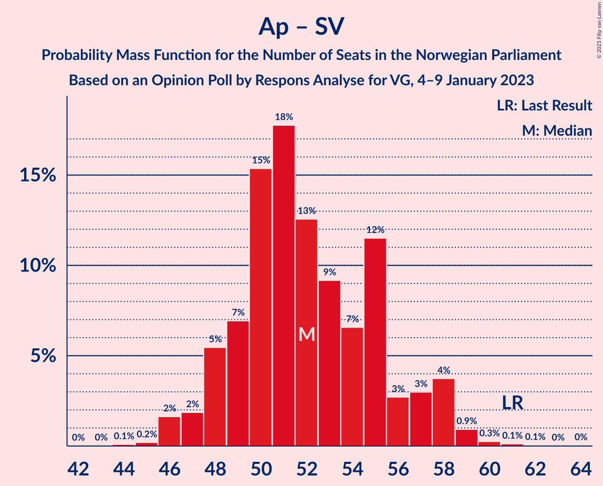

| Number of Seats | Probability | Accumulated | Special Marks |
|:---------------:|:-----------:|:-----------:|:-------------:|
| 44 | 0.1% | 100% |  |
| 45 | 0.2% | 99.9% |  |
| 46 | 2% | 99.7% |  |
| 47 | 2% | 98% |  |
| 48 | 5% | 96% |  |
| 49 | 7% | 91% |  |
| 50 | 15% | 84% |  |
| 51 | 18% | 68% |  |
| 52 | 13% | 51% | Median |
| 53 | 9% | 38% |  |
| 54 | 7% | 29% |  |
| 55 | 12% | 22% |  |
| 56 | 3% | 11% |  |
| 57 | 3% | 8% |  |
| 58 | 4% | 5% |  |
| 59 | 0.9% | 1.4% |  |
| 60 | 0.3% | 0.5% |  |
| 61 | 0.1% | 0.2% | Last Result |
| 62 | 0.1% | 0.1% |  |
| 63 | 0% | 0.1% |  |
| 64 | 0% | 0% |  |

### Arbeiderpartiet – Senterpartiet – Kristelig Folkeparti

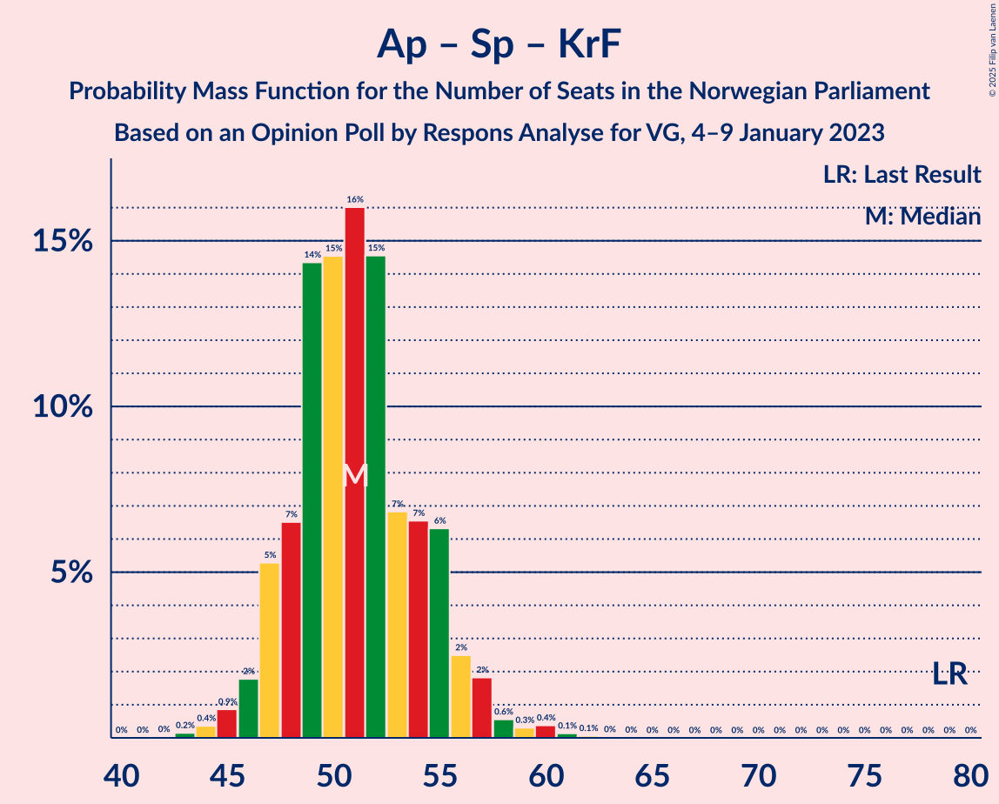

| Number of Seats | Probability | Accumulated | Special Marks |
|:---------------:|:-----------:|:-----------:|:-------------:|
| 43 | 0.2% | 100% |  |
| 44 | 0.4% | 99.8% |  |
| 45 | 0.9% | 99.4% |  |
| 46 | 2% | 98.6% |  |
| 47 | 5% | 97% |  |
| 48 | 7% | 92% |  |
| 49 | 14% | 85% |  |
| 50 | 15% | 71% |  |
| 51 | 16% | 56% | Median |
| 52 | 15% | 40% |  |
| 53 | 7% | 26% |  |
| 54 | 7% | 19% |  |
| 55 | 6% | 12% |  |
| 56 | 2% | 6% |  |
| 57 | 2% | 3% |  |
| 58 | 0.6% | 1.5% |  |
| 59 | 0.3% | 0.9% |  |
| 60 | 0.4% | 0.6% |  |
| 61 | 0.1% | 0.2% |  |
| 62 | 0.1% | 0.1% |  |
| 63 | 0% | 0% |  |
| 64 | 0% | 0% |  |
| 65 | 0% | 0% |  |
| 66 | 0% | 0% |  |
| 67 | 0% | 0% |  |
| 68 | 0% | 0% |  |
| 69 | 0% | 0% |  |
| 70 | 0% | 0% |  |
| 71 | 0% | 0% |  |
| 72 | 0% | 0% |  |
| 73 | 0% | 0% |  |
| 74 | 0% | 0% |  |
| 75 | 0% | 0% |  |
| 76 | 0% | 0% |  |
| 77 | 0% | 0% |  |
| 78 | 0% | 0% |  |
| 79 | 0% | 0% | Last Result |

### Arbeiderpartiet – Senterpartiet

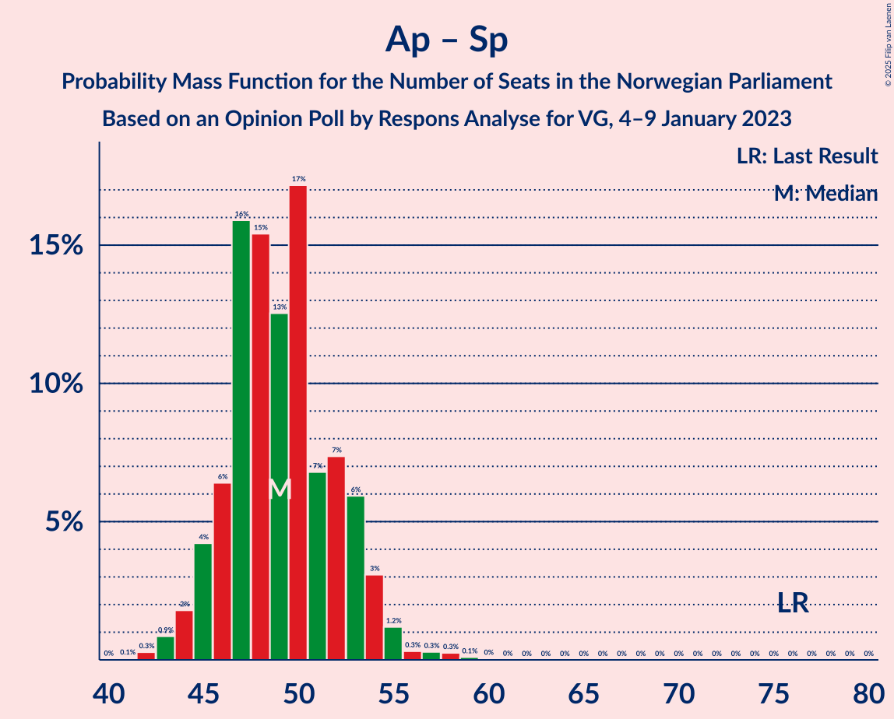

| Number of Seats | Probability | Accumulated | Special Marks |
|:---------------:|:-----------:|:-----------:|:-------------:|
| 41 | 0.1% | 100% |  |
| 42 | 0.3% | 99.9% |  |
| 43 | 0.9% | 99.7% |  |
| 44 | 2% | 98.8% |  |
| 45 | 4% | 97% |  |
| 46 | 6% | 93% |  |
| 47 | 16% | 86% |  |
| 48 | 15% | 70% |  |
| 49 | 13% | 55% | Median |
| 50 | 17% | 43% |  |
| 51 | 7% | 25% |  |
| 52 | 7% | 19% |  |
| 53 | 6% | 11% |  |
| 54 | 3% | 5% |  |
| 55 | 1.2% | 2% |  |
| 56 | 0.3% | 1.0% |  |
| 57 | 0.3% | 0.7% |  |
| 58 | 0.3% | 0.4% |  |
| 59 | 0.1% | 0.2% |  |
| 60 | 0% | 0.1% |  |
| 61 | 0% | 0% |  |
| 62 | 0% | 0% |  |
| 63 | 0% | 0% |  |
| 64 | 0% | 0% |  |
| 65 | 0% | 0% |  |
| 66 | 0% | 0% |  |
| 67 | 0% | 0% |  |
| 68 | 0% | 0% |  |
| 69 | 0% | 0% |  |
| 70 | 0% | 0% |  |
| 71 | 0% | 0% |  |
| 72 | 0% | 0% |  |
| 73 | 0% | 0% |  |
| 74 | 0% | 0% |  |
| 75 | 0% | 0% |  |
| 76 | 0% | 0% | Last Result |

### Senterpartiet – Venstre – Kristelig Folkeparti

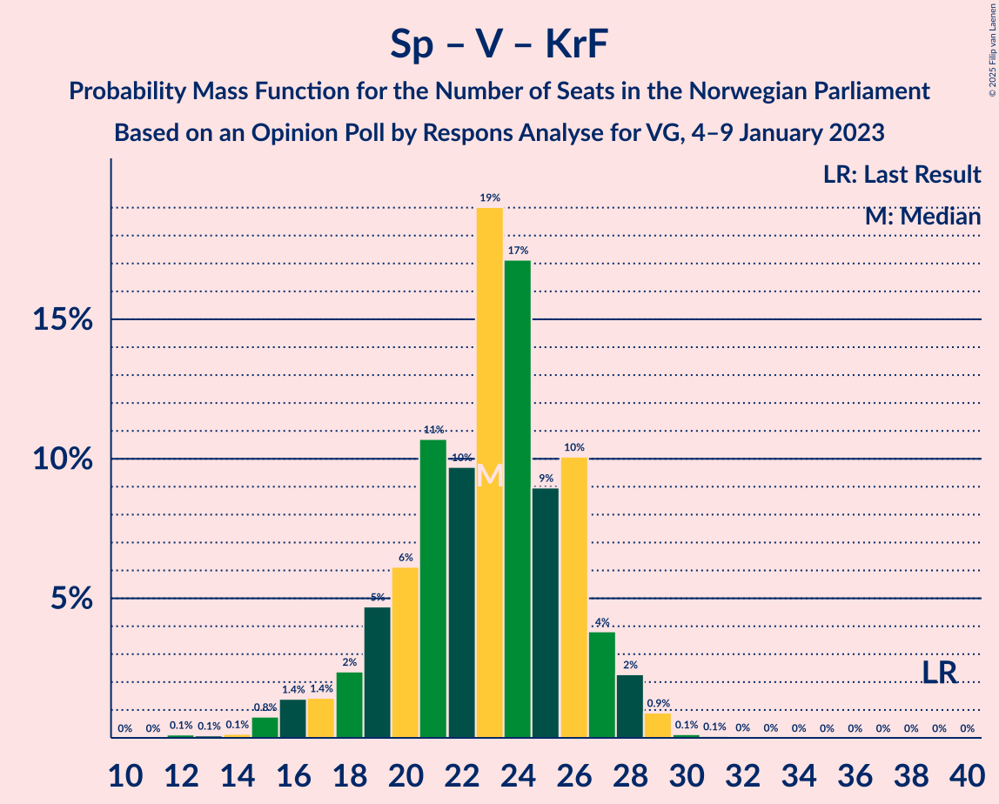

| Number of Seats | Probability | Accumulated | Special Marks |
|:---------------:|:-----------:|:-----------:|:-------------:|
| 12 | 0.1% | 100% |  |
| 13 | 0.1% | 99.9% |  |
| 14 | 0.1% | 99.8% |  |
| 15 | 0.8% | 99.7% |  |
| 16 | 1.4% | 98.9% |  |
| 17 | 1.4% | 98% |  |
| 18 | 2% | 96% |  |
| 19 | 5% | 94% |  |
| 20 | 6% | 89% |  |
| 21 | 11% | 83% |  |
| 22 | 10% | 72% |  |
| 23 | 19% | 62% | Median |
| 24 | 17% | 43% |  |
| 25 | 9% | 26% |  |
| 26 | 10% | 17% |  |
| 27 | 4% | 7% |  |
| 28 | 2% | 3% |  |
| 29 | 0.9% | 1.2% |  |
| 30 | 0.1% | 0.3% |  |
| 31 | 0.1% | 0.1% |  |
| 32 | 0% | 0.1% |  |
| 33 | 0% | 0% |  |
| 34 | 0% | 0% |  |
| 35 | 0% | 0% |  |
| 36 | 0% | 0% |  |
| 37 | 0% | 0% |  |
| 38 | 0% | 0% |  |
| 39 | 0% | 0% | Last Result |

## Technical Information

### Opinion Poll

+ **Polling firm:** Respons Analyse
+ **Commissioner(s):** VG
+ **Fieldwork period:** 4–9 January 2023

### Calculations

+ **Sample size:** 1001
+ **Simulations done:** 1,048,576
+ **Error estimate:** 1.68%

