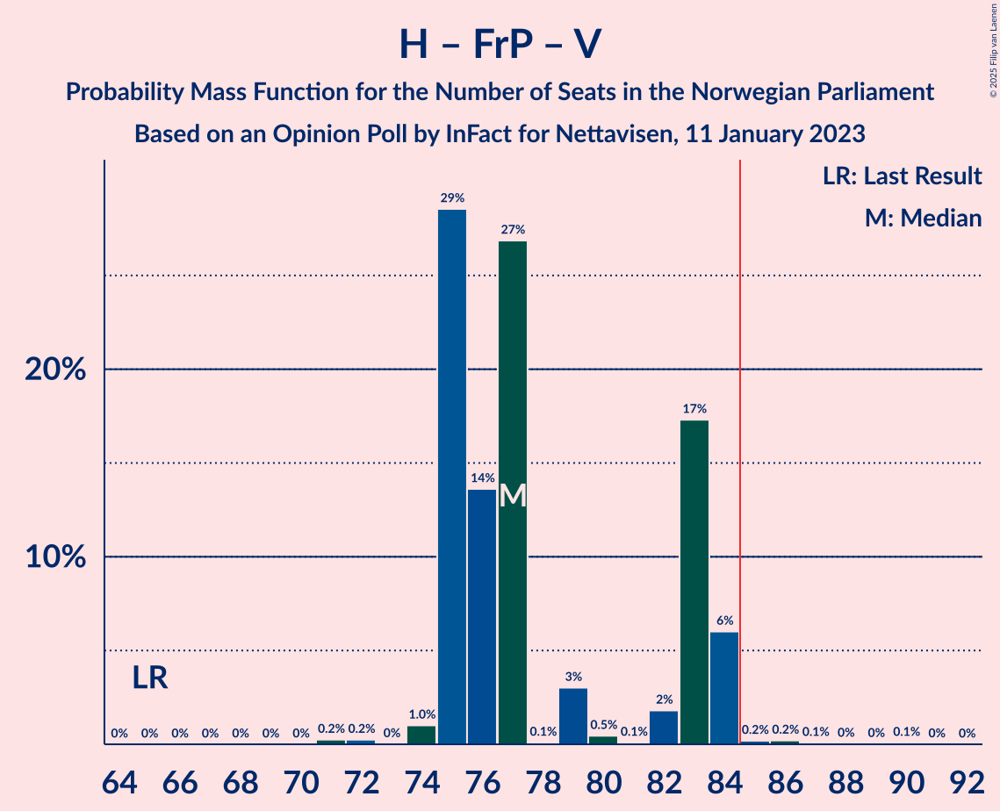

# Opinion Poll by InFact for Nettavisen, 11 January 2023

<a href="#voting-intentions">Voting Intentions</a> | <a href="#seats">Seats</a> | <a href="#coalitions">Coalitions</a> | <a href="#technical-information">Technical Information</a>

## Voting Intentions

### Confidence Intervals

| Party | Last Result | Poll Result | 80% Confidence Interval | 90% Confidence Interval | 95% Confidence Interval | 99% Confidence Interval |
|:-----:|:-----------:|:-----------:|:-----------------------:|:-----------------------:|:-----------------------:|:-----------------------:|
| Høyre | 20.4% | 29.1% | 27.4–31.0% |26.9–31.5% |26.4–32.0% |25.6–32.9% |
| Arbeiderpartiet | 26.2% | 20.5% | 19.0–22.2% |18.5–22.6% |18.2–23.1% |17.4–23.9% |
| Fremskrittspartiet | 11.6% | 13.1% | 11.9–14.6% |11.5–15.0% |11.2–15.3% |10.6–16.0% |
| Sosialistisk Venstreparti | 7.6% | 7.8% | 6.8–8.9% |6.5–9.3% |6.3–9.6% |5.9–10.1% |
| Rødt | 4.7% | 6.8% | 5.9–7.9% |5.6–8.2% |5.4–8.5% |5.0–9.1% |
| Senterpartiet | 13.5% | 6.0% | 5.2–7.1% |4.9–7.4% |4.7–7.7% |4.4–8.2% |
| Kristelig Folkeparti | 3.8% | 4.2% | 3.5–5.1% |3.3–5.4% |3.2–5.6% |2.9–6.1% |
| Venstre | 4.6% | 3.9% | 3.2–4.8% |3.1–5.1% |2.9–5.3% |2.6–5.7% |
| Miljøpartiet De Grønne | 3.9% | 3.4% | 2.7–4.2% |2.6–4.4% |2.4–4.6% |2.1–5.1% |
| Industri- og Næringspartiet | 0.3% | 2.0% | 1.6–2.7% |1.4–2.9% |1.3–3.1% |1.1–3.4% |
| Norgesdemokratene | 1.1% | 1.1% | 0.7–1.6% |0.7–1.7% |0.6–1.9% |0.5–2.2% |
| Folkets parti | 0.1% | 0.4% | 0.2–0.8% |0.2–0.9% |0.2–1.0% |0.1–1.2% |
| Liberalistene | 0.2% | 0.4% | 0.2–0.8% |0.2–0.9% |0.2–1.0% |0.1–1.2% |
| Konservativt | 0.4% | 0.4% | 0.2–0.8% |0.2–0.9% |0.2–1.0% |0.1–1.2% |
| Pensjonistpartiet | 0.6% | 0.2% | 0.1–0.5% |0.1–0.6% |0.0–0.7% |0.0–0.9% |
| Helsepartiet | 0.2% | 0.2% | 0.1–0.5% |0.1–0.6% |0.0–0.7% |0.0–0.9% |

*Note:* The poll result column reflects the actual value used in the calculations. Published results may vary slightly, and in addition be rounded to fewer digits.

## Seats

### Confidence Intervals

| Party | Last Result | Median | 80% Confidence Interval | 90% Confidence Interval | 95% Confidence Interval | 99% Confidence Interval |
|:-----:|:-----------:|:------:|:-----------------------:|:-----------------------:|:-----------------------:|:-----------------------:|
| <a href="#høyre">Høyre</a> | 36 | 49 | 48–55 |48–57 |48–57 |46–57 |
| <a href="#arbeiderpartiet">Arbeiderpartiet</a> | 48 | 46 | 38–46 |37–46 |37–46 |36–48 |
| <a href="#fremskrittspartiet">Fremskrittspartiet</a> | 21 | 21 | 20–25 |20–29 |19–29 |19–30 |
| <a href="#sosialistisk-venstreparti">Sosialistisk Venstreparti</a> | 13 | 13 | 12–15 |11–17 |10–17 |10–17 |
| <a href="#rødt">Rødt</a> | 8 | 12 | 8–15 |8–15 |8–15 |8–16 |
| <a href="#senterpartiet">Senterpartiet</a> | 28 | 11 | 9–12 |9–13 |8–13 |8–14 |
| <a href="#kristelig-folkeparti">Kristelig Folkeparti</a> | 3 | 9 | 3–9 |3–9 |3–10 |3–10 |
| <a href="#venstre">Venstre</a> | 8 | 7 | 3–9 |2–11 |2–11 |2–11 |
| <a href="#miljøpartiet-de-grønne">Miljøpartiet De Grønne</a> | 3 | 2 | 1–7 |1–7 |1–7 |1–9 |
| <a href="#industri--og-næringspartiet">Industri- og Næringspartiet</a> | 0 | 0 | 0 |0 |0 |0–2 |
| <a href="#norgesdemokratene">Norgesdemokratene</a> | 0 | 0 | 0 |0 |0 |0 |
| <a href="#folkets-parti">Folkets parti</a> | 0 | 0 | 0 |0 |0 |0 |
| <a href="#liberalistene">Liberalistene</a> | 0 | 0 | 0 |0 |0 |0 |
| <a href="#konservativt">Konservativt</a> | 0 | 0 | 0 |0 |0 |0 |
| <a href="#pensjonistpartiet">Pensjonistpartiet</a> | 0 | 0 | 0 |0 |0 |0 |
| <a href="#helsepartiet">Helsepartiet</a> | 0 | 0 | 0 |0 |0 |0 |

### Høyre

*For a full overview of the results for this party, see the [Høyre](party-høyre.html) page.*

| Number of Seats | Probability | Accumulated | Special Marks |
|:---------------:|:-----------:|:-----------:|:-------------:|
| 36 | 0% | 100% | Last Result |
| 37 | 0% | 100% |  |
| 38 | 0% | 100% |  |
| 39 | 0% | 100% |  |
| 40 | 0% | 100% |  |
| 41 | 0% | 100% |  |
| 42 | 0.2% | 100% |  |
| 43 | 0% | 99.8% |  |
| 44 | 0% | 99.8% |  |
| 45 | 0% | 99.8% |  |
| 46 | 0.7% | 99.8% |  |
| 47 | 1.1% | 99.1% |  |
| 48 | 28% | 98% |  |
| 49 | 40% | 70% | Median |
| 50 | 4% | 30% |  |
| 51 | 13% | 26% |  |
| 52 | 0.5% | 13% |  |
| 53 | 0.3% | 13% |  |
| 54 | 0% | 12% |  |
| 55 | 5% | 12% |  |
| 56 | 0% | 7% |  |
| 57 | 7% | 7% |  |
| 58 | 0% | 0.1% |  |
| 59 | 0.1% | 0.1% |  |
| 60 | 0% | 0% |  |

### Arbeiderpartiet

*For a full overview of the results for this party, see the [Arbeiderpartiet](party-arbeiderpartiet.html) page.*

| Number of Seats | Probability | Accumulated | Special Marks |
|:---------------:|:-----------:|:-----------:|:-------------:|
| 33 | 0.1% | 100% |  |
| 34 | 0% | 99.9% |  |
| 35 | 0.1% | 99.9% |  |
| 36 | 0.5% | 99.9% |  |
| 37 | 6% | 99.4% |  |
| 38 | 10% | 94% |  |
| 39 | 1.0% | 83% |  |
| 40 | 3% | 82% |  |
| 41 | 5% | 79% |  |
| 42 | 1.1% | 74% |  |
| 43 | 4% | 73% |  |
| 44 | 0.3% | 69% |  |
| 45 | 13% | 69% |  |
| 46 | 54% | 55% | Median |
| 47 | 0% | 1.0% |  |
| 48 | 1.0% | 1.0% | Last Result |
| 49 | 0% | 0% |  |

### Fremskrittspartiet

*For a full overview of the results for this party, see the [Fremskrittspartiet](party-fremskrittspartiet.html) page.*

| Number of Seats | Probability | Accumulated | Special Marks |
|:---------------:|:-----------:|:-----------:|:-------------:|
| 17 | 0.1% | 100% |  |
| 18 | 0% | 99.9% |  |
| 19 | 5% | 99.9% |  |
| 20 | 42% | 95% |  |
| 21 | 37% | 53% | Last Result, Median |
| 22 | 0.4% | 17% |  |
| 23 | 3% | 16% |  |
| 24 | 0.4% | 13% |  |
| 25 | 6% | 12% |  |
| 26 | 0.3% | 7% |  |
| 27 | 0.1% | 6% |  |
| 28 | 0.1% | 6% |  |
| 29 | 5% | 6% |  |
| 30 | 0.6% | 0.9% |  |
| 31 | 0.2% | 0.3% |  |
| 32 | 0.1% | 0.1% |  |
| 33 | 0% | 0% |  |

### Sosialistisk Venstreparti

*For a full overview of the results for this party, see the [Sosialistisk Venstreparti](party-sosialistiskvenstreparti.html) page.*

| Number of Seats | Probability | Accumulated | Special Marks |
|:---------------:|:-----------:|:-----------:|:-------------:|
| 10 | 5% | 100% |  |
| 11 | 1.0% | 95% |  |
| 12 | 32% | 94% |  |
| 13 | 14% | 62% | Last Result, Median |
| 14 | 29% | 48% |  |
| 15 | 10% | 19% |  |
| 16 | 3% | 9% |  |
| 17 | 6% | 6% |  |
| 18 | 0.2% | 0.3% |  |
| 19 | 0.1% | 0.1% |  |
| 20 | 0% | 0% |  |

### Rødt

*For a full overview of the results for this party, see the [Rødt](party-rødt.html) page.*

| Number of Seats | Probability | Accumulated | Special Marks |
|:---------------:|:-----------:|:-----------:|:-------------:|
| 8 | 28% | 100% | Last Result |
| 9 | 0.1% | 72% |  |
| 10 | 12% | 72% |  |
| 11 | 6% | 60% |  |
| 12 | 14% | 54% | Median |
| 13 | 9% | 40% |  |
| 14 | 1.3% | 31% |  |
| 15 | 29% | 30% |  |
| 16 | 0.8% | 0.8% |  |
| 17 | 0% | 0% |  |

### Senterpartiet

*For a full overview of the results for this party, see the [Senterpartiet](party-senterpartiet.html) page.*

| Number of Seats | Probability | Accumulated | Special Marks |
|:---------------:|:-----------:|:-----------:|:-------------:|
| 7 | 0.2% | 100% |  |
| 8 | 4% | 99.8% |  |
| 9 | 9% | 96% |  |
| 10 | 1.1% | 86% |  |
| 11 | 56% | 85% | Median |
| 12 | 22% | 29% |  |
| 13 | 6% | 7% |  |
| 14 | 0.4% | 0.8% |  |
| 15 | 0.3% | 0.4% |  |
| 16 | 0% | 0% |  |
| 17 | 0% | 0% |  |
| 18 | 0% | 0% |  |
| 19 | 0% | 0% |  |
| 20 | 0% | 0% |  |
| 21 | 0% | 0% |  |
| 22 | 0% | 0% |  |
| 23 | 0% | 0% |  |
| 24 | 0% | 0% |  |
| 25 | 0% | 0% |  |
| 26 | 0% | 0% |  |
| 27 | 0% | 0% |  |
| 28 | 0% | 0% | Last Result |

### Kristelig Folkeparti

*For a full overview of the results for this party, see the [Kristelig Folkeparti](party-kristeligfolkeparti.html) page.*

| Number of Seats | Probability | Accumulated | Special Marks |
|:---------------:|:-----------:|:-----------:|:-------------:|
| 2 | 0.4% | 100% |  |
| 3 | 35% | 99.6% | Last Result |
| 4 | 0% | 65% |  |
| 5 | 0% | 65% |  |
| 6 | 0% | 65% |  |
| 7 | 5% | 65% |  |
| 8 | 3% | 59% |  |
| 9 | 52% | 56% | Median |
| 10 | 4% | 4% |  |
| 11 | 0% | 0% |  |

### Venstre

*For a full overview of the results for this party, see the [Venstre](party-venstre.html) page.*

| Number of Seats | Probability | Accumulated | Special Marks |
|:---------------:|:-----------:|:-----------:|:-------------:|
| 2 | 9% | 100% |  |
| 3 | 6% | 91% |  |
| 4 | 0% | 85% |  |
| 5 | 0% | 85% |  |
| 6 | 0% | 85% |  |
| 7 | 69% | 85% | Median |
| 8 | 3% | 15% | Last Result |
| 9 | 5% | 12% |  |
| 10 | 0.1% | 8% |  |
| 11 | 7% | 8% |  |
| 12 | 0% | 0% |  |

### Miljøpartiet De Grønne

*For a full overview of the results for this party, see the [Miljøpartiet De Grønne](party-miljøpartietdegrønne.html) page.*

| Number of Seats | Probability | Accumulated | Special Marks |
|:---------------:|:-----------:|:-----------:|:-------------:|
| 1 | 28% | 100% |  |
| 2 | 31% | 72% | Median |
| 3 | 7% | 41% | Last Result |
| 4 | 0% | 34% |  |
| 5 | 0% | 34% |  |
| 6 | 0% | 34% |  |
| 7 | 32% | 34% |  |
| 8 | 0.1% | 1.1% |  |
| 9 | 1.0% | 1.0% |  |
| 10 | 0% | 0% |  |

### Industri- og Næringspartiet

*For a full overview of the results for this party, see the [Industri- og Næringspartiet](party-industri-ognæringspartiet.html) page.*

| Number of Seats | Probability | Accumulated | Special Marks |
|:---------------:|:-----------:|:-----------:|:-------------:|
| 0 | 98% | 100% | Last Result, Median |
| 1 | 0.2% | 2% |  |
| 2 | 2% | 2% |  |
| 3 | 0.1% | 0.1% |  |
| 4 | 0% | 0% |  |

### Norgesdemokratene

*For a full overview of the results for this party, see the [Norgesdemokratene](party-norgesdemokratene.html) page.*

| Number of Seats | Probability | Accumulated | Special Marks |
|:---------------:|:-----------:|:-----------:|:-------------:|
| 0 | 100% | 100% | Last Result, Median |

### Folkets parti

*For a full overview of the results for this party, see the [Folkets parti](party-folketsparti.html) page.*

| Number of Seats | Probability | Accumulated | Special Marks |
|:---------------:|:-----------:|:-----------:|:-------------:|
| 0 | 99.9% | 100% | Last Result, Median |
| 1 | 0.1% | 0.1% |  |
| 2 | 0% | 0% |  |

### Liberalistene

*For a full overview of the results for this party, see the [Liberalistene](party-liberalistene.html) page.*

| Number of Seats | Probability | Accumulated | Special Marks |
|:---------------:|:-----------:|:-----------:|:-------------:|
| 0 | 100% | 100% | Last Result, Median |

### Konservativt

*For a full overview of the results for this party, see the [Konservativt](party-konservativt.html) page.*

| Number of Seats | Probability | Accumulated | Special Marks |
|:---------------:|:-----------:|:-----------:|:-------------:|
| 0 | 100% | 100% | Last Result, Median |

### Pensjonistpartiet

*For a full overview of the results for this party, see the [Pensjonistpartiet](party-pensjonistpartiet.html) page.*

| Number of Seats | Probability | Accumulated | Special Marks |
|:---------------:|:-----------:|:-----------:|:-------------:|
| 0 | 100% | 100% | Last Result, Median |

### Helsepartiet

*For a full overview of the results for this party, see the [Helsepartiet](party-helsepartiet.html) page.*

| Number of Seats | Probability | Accumulated | Special Marks |
|:---------------:|:-----------:|:-----------:|:-------------:|
| 0 | 100% | 100% | Last Result, Median |

## Coalitions

### Confidence Intervals

| Coalition | Last Result | Median | Majority? | 80% Confidence Interval | 90% Confidence Interval | 95% Confidence Interval | 99% Confidence Interval |
|:---------:|:-----------:|:------:|:---------:|:-----------------------:|:-----------------------:|:-----------------------:|:-----------------------:|
| Høyre – Fremskrittspartiet – Senterpartiet – Kristelig Folkeparti – Venstre | 96 | 95 | 100% | 91–100 | 91–104 | 91–104 | 86–104 |
| Høyre – Fremskrittspartiet – Kristelig Folkeparti – Venstre – Miljøpartiet De Grønne | 71 | 88 | 73% | 82–93 | 82–96 | 82–97 | 82–97 |
| Høyre – Fremskrittspartiet – Kristelig Folkeparti – Venstre | 68 | 84 | 44% | 80–92 | 80–92 | 80–92 | 77–92 |
| Arbeiderpartiet – Sosialistisk Venstreparti – Rødt – Senterpartiet – Miljøpartiet De Grønne | 100 | 84 | 28% | 76–88 | 76–88 | 76–88 | 75–91 |
| Arbeiderpartiet – Sosialistisk Venstreparti – Rødt – Senterpartiet | 97 | 80 | 27% | 74–86 | 72–86 | 71–86 | 71–86 |
| Arbeiderpartiet – Sosialistisk Venstreparti – Senterpartiet – Kristelig Folkeparti – Miljøpartiet De Grønne | 95 | 76 | 27% | 74–85 | 71–85 | 71–85 | 69–85 |
| Høyre – Fremskrittspartiet – Venstre | 65 | 77 | 0.6% | 75–83 | 75–84 | 75–84 | 72–85 |
| Høyre – Fremskrittspartiet | 57 | 70 | 0.1% | 68–80 | 68–82 | 68–82 | 67–82 |
| Arbeiderpartiet – Sosialistisk Venstreparti – Rødt – Miljøpartiet De Grønne | 72 | 73 | 0% | 68–77 | 64–77 | 64–77 | 64–82 |
| Arbeiderpartiet – Sosialistisk Venstreparti – Senterpartiet – Miljøpartiet De Grønne | 92 | 73 | 0% | 66–76 | 66–76 | 66–76 | 64–80 |
| Høyre – Kristelig Folkeparti – Venstre | 47 | 64 | 0% | 59–71 | 59–71 | 59–73 | 57–73 |
| Arbeiderpartiet – Senterpartiet – Kristelig Folkeparti – Miljøpartiet De Grønne | 82 | 63 | 0% | 60–73 | 54–73 | 54–73 | 54–73 |
| Arbeiderpartiet – Sosialistisk Venstreparti – Senterpartiet | 89 | 69 | 0% | 63–71 | 60–71 | 60–71 | 60–72 |
| Arbeiderpartiet – Senterpartiet – Kristelig Folkeparti | 79 | 60 | 0% | 57–66 | 53–66 | 53–66 | 52–66 |
| Arbeiderpartiet – Sosialistisk Venstreparti | 61 | 58 | 0% | 53–60 | 51–60 | 51–60 | 51–62 |
| Arbeiderpartiet – Senterpartiet | 76 | 57 | 0% | 50–57 | 49–57 | 49–57 | 48–57 |
| Senterpartiet – Kristelig Folkeparti – Venstre | 39 | 27 | 0% | 19–28 | 18–32 | 18–32 | 16–32 |

### Høyre – Fremskrittspartiet – Senterpartiet – Kristelig Folkeparti – Venstre

| Number of Seats | Probability | Accumulated | Special Marks |
|:---------------:|:-----------:|:-----------:|:-------------:|
| 86 | 1.0% | 100% |  |
| 87 | 0% | 99.0% |  |
| 88 | 0% | 99.0% |  |
| 89 | 0.3% | 99.0% |  |
| 90 | 0% | 98.7% |  |
| 91 | 26% | 98.7% |  |
| 92 | 0% | 72% |  |
| 93 | 0.1% | 72% |  |
| 94 | 0.3% | 72% |  |
| 95 | 28% | 72% |  |
| 96 | 2% | 44% | Last Result |
| 97 | 15% | 42% | Median |
| 98 | 3% | 27% |  |
| 99 | 5% | 24% |  |
| 100 | 10% | 19% |  |
| 101 | 1.0% | 9% |  |
| 102 | 0.3% | 8% |  |
| 103 | 0.1% | 8% |  |
| 104 | 8% | 8% |  |
| 105 | 0.2% | 0.3% |  |
| 106 | 0% | 0% |  |

### Høyre – Fremskrittspartiet – Kristelig Folkeparti – Venstre – Miljøpartiet De Grønne

| Number of Seats | Probability | Accumulated | Special Marks |
|:---------------:|:-----------:|:-----------:|:-------------:|
| 71 | 0% | 100% | Last Result |
| 72 | 0% | 100% |  |
| 73 | 0% | 100% |  |
| 74 | 0% | 100% |  |
| 75 | 0% | 100% |  |
| 76 | 0% | 100% |  |
| 77 | 0% | 100% |  |
| 78 | 0% | 100% |  |
| 79 | 0% | 100% |  |
| 80 | 0% | 100% |  |
| 81 | 0.4% | 100% |  |
| 82 | 26% | 99.6% |  |
| 83 | 0.1% | 73% |  |
| 84 | 0% | 73% |  |
| 85 | 0.1% | 73% | Majority |
| 86 | 15% | 73% |  |
| 87 | 0.5% | 58% |  |
| 88 | 8% | 58% | Median |
| 89 | 0.6% | 50% |  |
| 90 | 0.7% | 49% |  |
| 91 | 30% | 48% |  |
| 92 | 0.8% | 18% |  |
| 93 | 8% | 18% |  |
| 94 | 0.1% | 9% |  |
| 95 | 4% | 9% |  |
| 96 | 0.2% | 5% |  |
| 97 | 5% | 5% |  |
| 98 | 0.1% | 0.1% |  |
| 99 | 0% | 0% |  |

### Høyre – Fremskrittspartiet – Kristelig Folkeparti – Venstre

| Number of Seats | Probability | Accumulated | Special Marks |
|:---------------:|:-----------:|:-----------:|:-------------:|
| 68 | 0% | 100% | Last Result |
| 69 | 0% | 100% |  |
| 70 | 0% | 100% |  |
| 71 | 0% | 100% |  |
| 72 | 0% | 100% |  |
| 73 | 0% | 100% |  |
| 74 | 0% | 100% |  |
| 75 | 0% | 100% |  |
| 76 | 0% | 100% |  |
| 77 | 1.0% | 100% |  |
| 78 | 0% | 99.0% |  |
| 79 | 0.3% | 99.0% |  |
| 80 | 27% | 98.7% |  |
| 81 | 0% | 72% |  |
| 82 | 0.1% | 72% |  |
| 83 | 0% | 72% |  |
| 84 | 28% | 72% |  |
| 85 | 16% | 44% | Majority |
| 86 | 0.8% | 28% | Median |
| 87 | 6% | 27% |  |
| 88 | 0.6% | 21% |  |
| 89 | 3% | 21% |  |
| 90 | 5% | 18% |  |
| 91 | 2% | 13% |  |
| 92 | 11% | 12% |  |
| 93 | 0.1% | 0.4% |  |
| 94 | 0.2% | 0.3% |  |
| 95 | 0% | 0.1% |  |
| 96 | 0.1% | 0.1% |  |
| 97 | 0% | 0% |  |

### Arbeiderpartiet – Sosialistisk Venstreparti – Rødt – Senterpartiet – Miljøpartiet De Grønne

| Number of Seats | Probability | Accumulated | Special Marks |
|:---------------:|:-----------:|:-----------:|:-------------:|
| 71 | 0.1% | 100% |  |
| 72 | 0% | 99.9% |  |
| 73 | 0% | 99.9% |  |
| 74 | 0.2% | 99.9% |  |
| 75 | 0.7% | 99.7% |  |
| 76 | 12% | 99.0% |  |
| 77 | 0.8% | 87% |  |
| 78 | 5% | 87% |  |
| 79 | 3% | 82% |  |
| 80 | 1.0% | 79% |  |
| 81 | 6% | 78% |  |
| 82 | 0.3% | 72% |  |
| 83 | 16% | 72% |  |
| 84 | 28% | 56% | Median |
| 85 | 0% | 28% | Majority |
| 86 | 0.1% | 28% |  |
| 87 | 0% | 28% |  |
| 88 | 27% | 28% |  |
| 89 | 0.3% | 1.3% |  |
| 90 | 0% | 1.0% |  |
| 91 | 1.0% | 1.0% |  |
| 92 | 0% | 0% |  |
| 93 | 0% | 0% |  |
| 94 | 0% | 0% |  |
| 95 | 0% | 0% |  |
| 96 | 0% | 0% |  |
| 97 | 0% | 0% |  |
| 98 | 0% | 0% |  |
| 99 | 0% | 0% |  |
| 100 | 0% | 0% | Last Result |

### Arbeiderpartiet – Sosialistisk Venstreparti – Rødt – Senterpartiet

| Number of Seats | Probability | Accumulated | Special Marks |
|:---------------:|:-----------:|:-----------:|:-------------:|
| 69 | 0.1% | 100% |  |
| 70 | 0% | 99.9% |  |
| 71 | 5% | 99.9% |  |
| 72 | 0.3% | 95% |  |
| 73 | 5% | 95% |  |
| 74 | 0.2% | 90% |  |
| 75 | 8% | 90% |  |
| 76 | 0.8% | 82% |  |
| 77 | 30% | 82% |  |
| 78 | 0.9% | 51% |  |
| 79 | 0.1% | 50% |  |
| 80 | 8% | 50% |  |
| 81 | 0.5% | 42% |  |
| 82 | 14% | 41% | Median |
| 83 | 0.1% | 27% |  |
| 84 | 0% | 27% |  |
| 85 | 0.1% | 27% | Majority |
| 86 | 26% | 27% |  |
| 87 | 0.4% | 0.4% |  |
| 88 | 0% | 0% |  |
| 89 | 0% | 0% |  |
| 90 | 0% | 0% |  |
| 91 | 0% | 0% |  |
| 92 | 0% | 0% |  |
| 93 | 0% | 0% |  |
| 94 | 0% | 0% |  |
| 95 | 0% | 0% |  |
| 96 | 0% | 0% |  |
| 97 | 0% | 0% | Last Result |

### Arbeiderpartiet – Sosialistisk Venstreparti – Senterpartiet – Kristelig Folkeparti – Miljøpartiet De Grønne

| Number of Seats | Probability | Accumulated | Special Marks |
|:---------------:|:-----------:|:-----------:|:-------------:|
| 66 | 0.1% | 100% |  |
| 67 | 0% | 99.9% |  |
| 68 | 0.3% | 99.8% |  |
| 69 | 0.2% | 99.6% |  |
| 70 | 0.1% | 99.3% |  |
| 71 | 7% | 99.3% |  |
| 72 | 0.9% | 92% |  |
| 73 | 0.7% | 91% |  |
| 74 | 5% | 90% |  |
| 75 | 11% | 85% |  |
| 76 | 29% | 73% |  |
| 77 | 1.4% | 45% |  |
| 78 | 0.4% | 43% |  |
| 79 | 0.2% | 43% |  |
| 80 | 13% | 43% |  |
| 81 | 0.2% | 29% | Median |
| 82 | 0.7% | 29% |  |
| 83 | 1.0% | 28% |  |
| 84 | 0% | 27% |  |
| 85 | 27% | 27% | Majority |
| 86 | 0% | 0% |  |
| 87 | 0% | 0% |  |
| 88 | 0% | 0% |  |
| 89 | 0% | 0% |  |
| 90 | 0% | 0% |  |
| 91 | 0% | 0% |  |
| 92 | 0% | 0% |  |
| 93 | 0% | 0% |  |
| 94 | 0% | 0% |  |
| 95 | 0% | 0% | Last Result |

### Høyre – Fremskrittspartiet – Venstre

| Number of Seats | Probability | Accumulated | Special Marks |
|:---------------:|:-----------:|:-----------:|:-------------:|
| 65 | 0% | 100% | Last Result |
| 66 | 0% | 100% |  |
| 67 | 0% | 100% |  |
| 68 | 0% | 100% |  |
| 69 | 0% | 100% |  |
| 70 | 0% | 100% |  |
| 71 | 0.2% | 100% |  |
| 72 | 0.2% | 99.7% |  |
| 73 | 0% | 99.5% |  |
| 74 | 1.0% | 99.5% |  |
| 75 | 29% | 98% |  |
| 76 | 14% | 70% |  |
| 77 | 27% | 56% | Median |
| 78 | 0.1% | 29% |  |
| 79 | 3% | 29% |  |
| 80 | 0.5% | 26% |  |
| 81 | 0.1% | 26% |  |
| 82 | 2% | 26% |  |
| 83 | 17% | 24% |  |
| 84 | 6% | 7% |  |
| 85 | 0.2% | 0.6% | Majority |
| 86 | 0.2% | 0.5% |  |
| 87 | 0.1% | 0.3% |  |
| 88 | 0% | 0.2% |  |
| 89 | 0% | 0.1% |  |
| 90 | 0.1% | 0.1% |  |
| 91 | 0% | 0% |  |

### Høyre – Fremskrittspartiet

| Number of Seats | Probability | Accumulated | Special Marks |
|:---------------:|:-----------:|:-----------:|:-------------:|
| 57 | 0% | 100% | Last Result |
| 58 | 0% | 100% |  |
| 59 | 0% | 100% |  |
| 60 | 0% | 100% |  |
| 61 | 0% | 100% |  |
| 62 | 0% | 100% |  |
| 63 | 0% | 100% |  |
| 64 | 0% | 100% |  |
| 65 | 0% | 100% |  |
| 66 | 0% | 100% |  |
| 67 | 1.0% | 100% |  |
| 68 | 28% | 99.0% |  |
| 69 | 14% | 71% |  |
| 70 | 27% | 58% | Median |
| 71 | 3% | 31% |  |
| 72 | 8% | 29% |  |
| 73 | 2% | 21% |  |
| 74 | 5% | 19% |  |
| 75 | 0.2% | 14% |  |
| 76 | 0.9% | 14% |  |
| 77 | 0.3% | 13% |  |
| 78 | 0.2% | 13% |  |
| 79 | 0% | 13% |  |
| 80 | 7% | 13% |  |
| 81 | 0.2% | 6% |  |
| 82 | 6% | 6% |  |
| 83 | 0% | 0.3% |  |
| 84 | 0.2% | 0.3% |  |
| 85 | 0% | 0.1% | Majority |
| 86 | 0% | 0.1% |  |
| 87 | 0.1% | 0.1% |  |
| 88 | 0% | 0% |  |

### Arbeiderpartiet – Sosialistisk Venstreparti – Rødt – Miljøpartiet De Grønne

| Number of Seats | Probability | Accumulated | Special Marks |
|:---------------:|:-----------:|:-----------:|:-------------:|
| 62 | 0% | 100% |  |
| 63 | 0.3% | 99.9% |  |
| 64 | 8% | 99.7% |  |
| 65 | 0.1% | 92% |  |
| 66 | 1.0% | 92% |  |
| 67 | 1.0% | 91% |  |
| 68 | 10% | 90% |  |
| 69 | 5% | 80% |  |
| 70 | 3% | 75% |  |
| 71 | 15% | 72% |  |
| 72 | 2% | 57% | Last Result |
| 73 | 28% | 55% | Median |
| 74 | 0.2% | 28% |  |
| 75 | 0.1% | 28% |  |
| 76 | 0% | 28% |  |
| 77 | 26% | 28% |  |
| 78 | 0% | 1.3% |  |
| 79 | 0.2% | 1.3% |  |
| 80 | 0% | 1.0% |  |
| 81 | 0% | 1.0% |  |
| 82 | 1.0% | 1.0% |  |
| 83 | 0% | 0% |  |

### Arbeiderpartiet – Sosialistisk Venstreparti – Senterpartiet – Miljøpartiet De Grønne

| Number of Seats | Probability | Accumulated | Special Marks |
|:---------------:|:-----------:|:-----------:|:-------------:|
| 59 | 0.1% | 100% |  |
| 60 | 0% | 99.9% |  |
| 61 | 0.1% | 99.9% |  |
| 62 | 0.2% | 99.9% |  |
| 63 | 0.1% | 99.7% |  |
| 64 | 1.1% | 99.5% |  |
| 65 | 0.7% | 98% |  |
| 66 | 14% | 98% |  |
| 67 | 6% | 84% |  |
| 68 | 7% | 77% |  |
| 69 | 0.2% | 70% |  |
| 70 | 0.5% | 70% |  |
| 71 | 13% | 69% |  |
| 72 | 0.1% | 56% | Median |
| 73 | 27% | 56% |  |
| 74 | 0.5% | 29% |  |
| 75 | 0% | 29% |  |
| 76 | 27% | 29% |  |
| 77 | 0% | 1.0% |  |
| 78 | 0% | 1.0% |  |
| 79 | 0% | 1.0% |  |
| 80 | 1.0% | 1.0% |  |
| 81 | 0% | 0% |  |
| 82 | 0% | 0% |  |
| 83 | 0% | 0% |  |
| 84 | 0% | 0% |  |
| 85 | 0% | 0% | Majority |
| 86 | 0% | 0% |  |
| 87 | 0% | 0% |  |
| 88 | 0% | 0% |  |
| 89 | 0% | 0% |  |
| 90 | 0% | 0% |  |
| 91 | 0% | 0% |  |
| 92 | 0% | 0% | Last Result |

### Høyre – Kristelig Folkeparti – Venstre

| Number of Seats | Probability | Accumulated | Special Marks |
|:---------------:|:-----------:|:-----------:|:-------------:|
| 47 | 0% | 100% | Last Result |
| 48 | 0% | 100% |  |
| 49 | 0% | 100% |  |
| 50 | 0% | 100% |  |
| 51 | 0% | 100% |  |
| 52 | 0% | 100% |  |
| 53 | 0% | 100% |  |
| 54 | 0% | 100% |  |
| 55 | 0% | 99.9% |  |
| 56 | 0% | 99.9% |  |
| 57 | 1.0% | 99.9% |  |
| 58 | 0.1% | 98.9% |  |
| 59 | 27% | 98.8% |  |
| 60 | 0.7% | 72% |  |
| 61 | 6% | 71% |  |
| 62 | 9% | 66% |  |
| 63 | 0.2% | 57% |  |
| 64 | 28% | 57% |  |
| 65 | 14% | 29% | Median |
| 66 | 0.2% | 15% |  |
| 67 | 0.1% | 15% |  |
| 68 | 2% | 15% |  |
| 69 | 0.1% | 12% |  |
| 70 | 0.1% | 12% |  |
| 71 | 8% | 12% |  |
| 72 | 0.7% | 4% |  |
| 73 | 4% | 4% |  |
| 74 | 0% | 0% |  |

### Arbeiderpartiet – Senterpartiet – Kristelig Folkeparti – Miljøpartiet De Grønne

| Number of Seats | Probability | Accumulated | Special Marks |
|:---------------:|:-----------:|:-----------:|:-------------:|
| 50 | 0% | 100% |  |
| 51 | 0% | 99.9% |  |
| 52 | 0.1% | 99.9% |  |
| 53 | 0% | 99.9% |  |
| 54 | 6% | 99.8% |  |
| 55 | 2% | 94% |  |
| 56 | 0% | 92% |  |
| 57 | 0.3% | 92% |  |
| 58 | 0.8% | 92% |  |
| 59 | 0.8% | 91% |  |
| 60 | 8% | 90% |  |
| 61 | 3% | 83% |  |
| 62 | 27% | 79% |  |
| 63 | 5% | 53% |  |
| 64 | 5% | 48% |  |
| 65 | 0.1% | 43% |  |
| 66 | 0.7% | 43% |  |
| 67 | 13% | 42% |  |
| 68 | 0.2% | 29% | Median |
| 69 | 1.0% | 29% |  |
| 70 | 0% | 28% |  |
| 71 | 0% | 27% |  |
| 72 | 0% | 27% |  |
| 73 | 27% | 27% |  |
| 74 | 0% | 0% |  |
| 75 | 0% | 0% |  |
| 76 | 0% | 0% |  |
| 77 | 0% | 0% |  |
| 78 | 0% | 0% |  |
| 79 | 0% | 0% |  |
| 80 | 0% | 0% |  |
| 81 | 0% | 0% |  |
| 82 | 0% | 0% | Last Result |

### Arbeiderpartiet – Sosialistisk Venstreparti – Senterpartiet

| Number of Seats | Probability | Accumulated | Special Marks |
|:---------------:|:-----------:|:-----------:|:-------------:|
| 57 | 0.1% | 100% |  |
| 58 | 0% | 99.9% |  |
| 59 | 0% | 99.9% |  |
| 60 | 5% | 99.8% |  |
| 61 | 0.2% | 95% |  |
| 62 | 0.3% | 95% |  |
| 63 | 5% | 94% |  |
| 64 | 4% | 89% |  |
| 65 | 9% | 85% |  |
| 66 | 0.4% | 76% |  |
| 67 | 6% | 75% |  |
| 68 | 0.3% | 70% |  |
| 69 | 28% | 69% |  |
| 70 | 13% | 41% | Median |
| 71 | 28% | 28% |  |
| 72 | 0.4% | 0.6% |  |
| 73 | 0.2% | 0.2% |  |
| 74 | 0% | 0% |  |
| 75 | 0% | 0% |  |
| 76 | 0% | 0% |  |
| 77 | 0% | 0% |  |
| 78 | 0% | 0% |  |
| 79 | 0% | 0% |  |
| 80 | 0% | 0% |  |
| 81 | 0% | 0% |  |
| 82 | 0% | 0% |  |
| 83 | 0% | 0% |  |
| 84 | 0% | 0% |  |
| 85 | 0% | 0% | Majority |
| 86 | 0% | 0% |  |
| 87 | 0% | 0% |  |
| 88 | 0% | 0% |  |
| 89 | 0% | 0% | Last Result |

### Arbeiderpartiet – Senterpartiet – Kristelig Folkeparti

| Number of Seats | Probability | Accumulated | Special Marks |
|:---------------:|:-----------:|:-----------:|:-------------:|
| 47 | 0% | 100% |  |
| 48 | 0% | 99.9% |  |
| 49 | 0% | 99.9% |  |
| 50 | 0.1% | 99.9% |  |
| 51 | 0% | 99.8% |  |
| 52 | 2% | 99.8% |  |
| 53 | 6% | 98% |  |
| 54 | 0.1% | 92% |  |
| 55 | 0.5% | 92% |  |
| 56 | 0.7% | 92% |  |
| 57 | 5% | 91% |  |
| 58 | 0.3% | 86% |  |
| 59 | 10% | 85% |  |
| 60 | 33% | 75% |  |
| 61 | 0.4% | 42% |  |
| 62 | 0.2% | 42% |  |
| 63 | 0.2% | 42% |  |
| 64 | 0.3% | 42% |  |
| 65 | 0.4% | 41% |  |
| 66 | 41% | 41% | Median |
| 67 | 0% | 0% |  |
| 68 | 0% | 0% |  |
| 69 | 0% | 0% |  |
| 70 | 0% | 0% |  |
| 71 | 0% | 0% |  |
| 72 | 0% | 0% |  |
| 73 | 0% | 0% |  |
| 74 | 0% | 0% |  |
| 75 | 0% | 0% |  |
| 76 | 0% | 0% |  |
| 77 | 0% | 0% |  |
| 78 | 0% | 0% |  |
| 79 | 0% | 0% | Last Result |

### Arbeiderpartiet – Sosialistisk Venstreparti

| Number of Seats | Probability | Accumulated | Special Marks |
|:---------------:|:-----------:|:-----------:|:-------------:|
| 47 | 0% | 100% |  |
| 48 | 0.2% | 99.9% |  |
| 49 | 0.1% | 99.8% |  |
| 50 | 0.1% | 99.6% |  |
| 51 | 5% | 99.5% |  |
| 52 | 1.0% | 94% |  |
| 53 | 9% | 93% |  |
| 54 | 8% | 85% |  |
| 55 | 7% | 77% |  |
| 56 | 0.5% | 70% |  |
| 57 | 0.3% | 69% |  |
| 58 | 41% | 69% |  |
| 59 | 0.4% | 28% | Median |
| 60 | 26% | 28% |  |
| 61 | 0% | 1.3% | Last Result |
| 62 | 1.2% | 1.3% |  |
| 63 | 0% | 0% |  |

### Arbeiderpartiet – Senterpartiet

| Number of Seats | Probability | Accumulated | Special Marks |
|:---------------:|:-----------:|:-----------:|:-------------:|
| 44 | 0% | 100% |  |
| 45 | 0% | 99.9% |  |
| 46 | 0.1% | 99.9% |  |
| 47 | 0.1% | 99.8% |  |
| 48 | 1.1% | 99.7% |  |
| 49 | 5% | 98.6% |  |
| 50 | 19% | 94% |  |
| 51 | 4% | 75% |  |
| 52 | 0.8% | 70% |  |
| 53 | 0.3% | 70% |  |
| 54 | 0.1% | 69% |  |
| 55 | 0.3% | 69% |  |
| 56 | 0.4% | 69% |  |
| 57 | 68% | 69% | Median |
| 58 | 0.2% | 0.2% |  |
| 59 | 0% | 0% |  |
| 60 | 0% | 0% |  |
| 61 | 0% | 0% |  |
| 62 | 0% | 0% |  |
| 63 | 0% | 0% |  |
| 64 | 0% | 0% |  |
| 65 | 0% | 0% |  |
| 66 | 0% | 0% |  |
| 67 | 0% | 0% |  |
| 68 | 0% | 0% |  |
| 69 | 0% | 0% |  |
| 70 | 0% | 0% |  |
| 71 | 0% | 0% |  |
| 72 | 0% | 0% |  |
| 73 | 0% | 0% |  |
| 74 | 0% | 0% |  |
| 75 | 0% | 0% |  |
| 76 | 0% | 0% | Last Result |

### Senterpartiet – Kristelig Folkeparti – Venstre

| Number of Seats | Probability | Accumulated | Special Marks |
|:---------------:|:-----------:|:-----------:|:-------------:|
| 16 | 2% | 100% |  |
| 17 | 0.2% | 98% |  |
| 18 | 6% | 98% |  |
| 19 | 6% | 92% |  |
| 20 | 0.3% | 86% |  |
| 21 | 27% | 86% |  |
| 22 | 0.1% | 59% |  |
| 23 | 0.6% | 59% |  |
| 24 | 2% | 59% |  |
| 25 | 0.1% | 56% |  |
| 26 | 4% | 56% |  |
| 27 | 31% | 52% | Median |
| 28 | 14% | 21% |  |
| 29 | 0% | 8% |  |
| 30 | 0.1% | 8% |  |
| 31 | 0% | 8% |  |
| 32 | 8% | 8% |  |
| 33 | 0% | 0% |  |
| 34 | 0% | 0% |  |
| 35 | 0% | 0% |  |
| 36 | 0% | 0% |  |
| 37 | 0% | 0% |  |
| 38 | 0% | 0% |  |
| 39 | 0% | 0% | Last Result |

## Technical Information

### Opinion Poll

+ **Polling firm:** InFact
+ **Commissioner(s):** Nettavisen
+ **Fieldwork period:** 11 January 2023

### Calculations

+ **Sample size:** 1044
+ **Simulations done:** 1,048,576
+ **Error estimate:** 2.65%

