# Opinion Poll by Opinion Perduco for ABC Nyheter and Altinget, 24–27 January 2023

<a href="#voting-intentions">Voting Intentions</a> | <a href="#seats">Seats</a> | <a href="#coalitions">Coalitions</a> | <a href="#technical-information">Technical Information</a>

## Voting Intentions

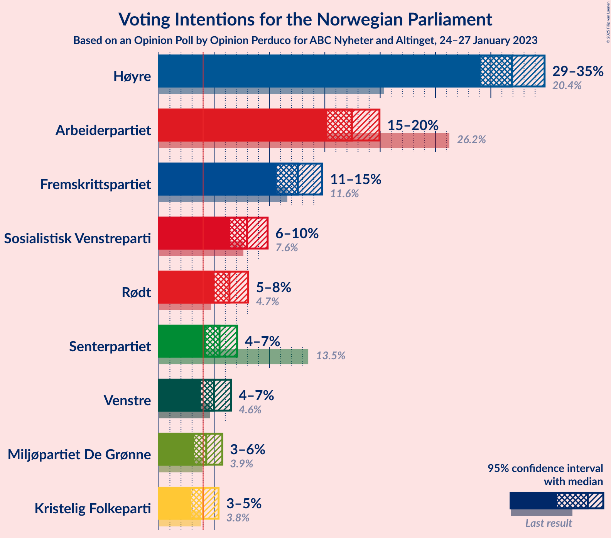

### Confidence Intervals

| Party | Last Result | Poll Result | 80% Confidence Interval | 90% Confidence Interval | 95% Confidence Interval | 99% Confidence Interval |
|:-----:|:-----------:|:-----------:|:-----------------------:|:-----------------------:|:-----------------------:|:-----------------------:|
| Høyre | 20.4% | 31.9% | 30.1–33.8% |29.5–34.4% |29.1–34.9% |28.2–35.8% |
| Arbeiderpartiet | 26.2% | 17.4% | 16.0–19.1% |15.6–19.5% |15.2–19.9% |14.5–20.7% |
| Fremskrittspartiet | 11.6% | 12.6% | 11.3–14.0% |10.9–14.4% |10.7–14.8% |10.1–15.5% |
| Sosialistisk Venstreparti | 7.6% | 8.0% | 7.0–9.2% |6.7–9.5% |6.4–9.8% |6.0–10.4% |
| Rødt | 4.7% | 6.4% | 5.5–7.5% |5.2–7.8% |5.0–8.1% |4.6–8.6% |
| Senterpartiet | 13.5% | 5.5% | 4.7–6.5% |4.4–6.8% |4.2–7.1% |3.9–7.6% |
| Venstre | 4.6% | 5.0% | 4.2–6.0% |4.0–6.3% |3.8–6.5% |3.5–7.0% |
| Miljøpartiet De Grønne | 3.9% | 4.3% | 3.6–5.2% |3.4–5.5% |3.2–5.7% |2.9–6.2% |
| Kristelig Folkeparti | 3.8% | 4.0% | 3.3–4.9% |3.1–5.2% |2.9–5.4% |2.6–5.9% |

*Note:* The poll result column reflects the actual value used in the calculations. Published results may vary slightly, and in addition be rounded to fewer digits.

## Seats

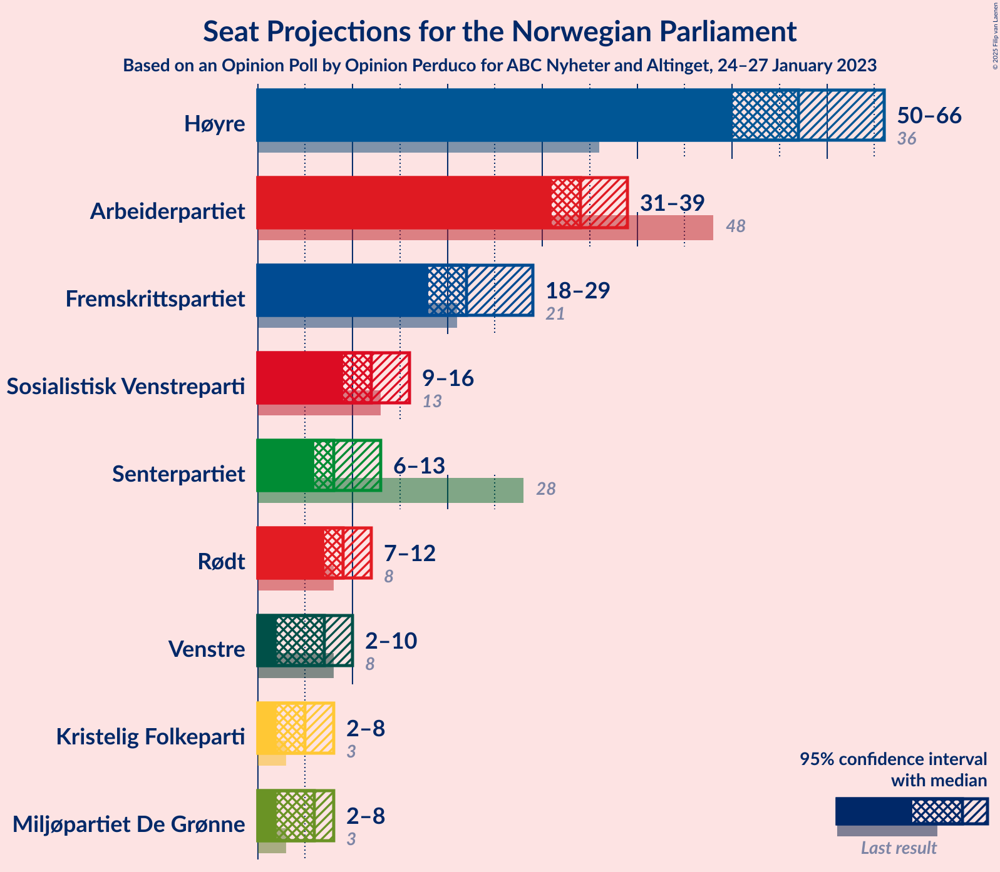

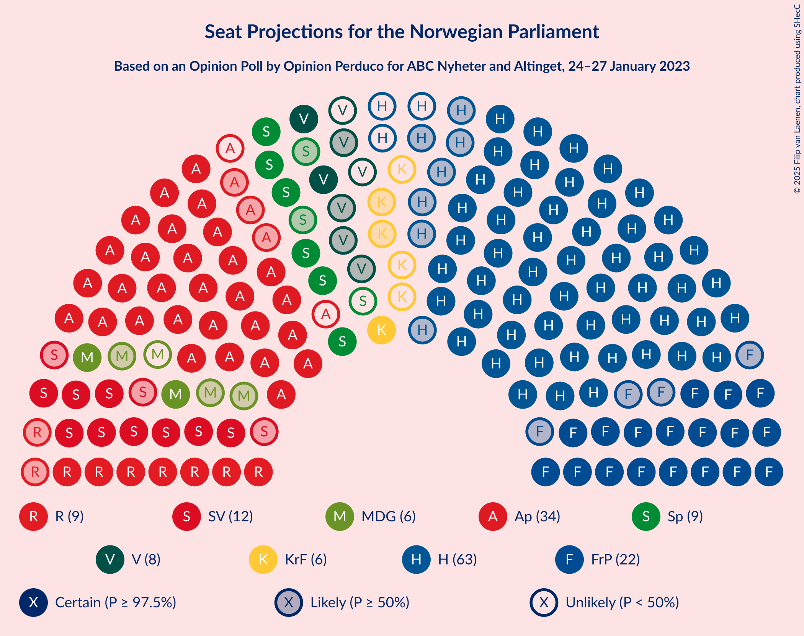

### Confidence Intervals

| Party | Last Result | Median | 80% Confidence Interval | 90% Confidence Interval | 95% Confidence Interval | 99% Confidence Interval |
|:-----:|:-----------:|:------:|:-----------------------:|:-----------------------:|:-----------------------:|:-----------------------:|
| <a href="#høyre">Høyre</a> | 36 | 57 | 53–63 |51–64 |50–66 |49–67 |
| <a href="#arbeiderpartiet">Arbeiderpartiet</a> | 48 | 34 | 33–37 |32–38 |31–39 |29–41 |
| <a href="#fremskrittspartiet">Fremskrittspartiet</a> | 21 | 22 | 18–25 |18–28 |18–29 |17–30 |
| <a href="#sosialistisk-venstreparti">Sosialistisk Venstreparti</a> | 13 | 12 | 10–15 |9–15 |9–16 |8–17 |
| <a href="#rødt">Rødt</a> | 8 | 9 | 8–11 |7–12 |7–12 |6–14 |
| <a href="#senterpartiet">Senterpartiet</a> | 28 | 8 | 7–11 |6–12 |6–13 |1–14 |
| <a href="#venstre">Venstre</a> | 8 | 7 | 6–9 |3–9 |2–10 |2–11 |
| <a href="#miljøpartiet-de-grønne">Miljøpartiet De Grønne</a> | 3 | 6 | 2–8 |2–8 |2–8 |1–9 |
| <a href="#kristelig-folkeparti">Kristelig Folkeparti</a> | 3 | 5 | 2–7 |2–7 |2–8 |2–9 |

### Høyre

*For a full overview of the results for this party, see the [Høyre](party-høyre.html) page.*

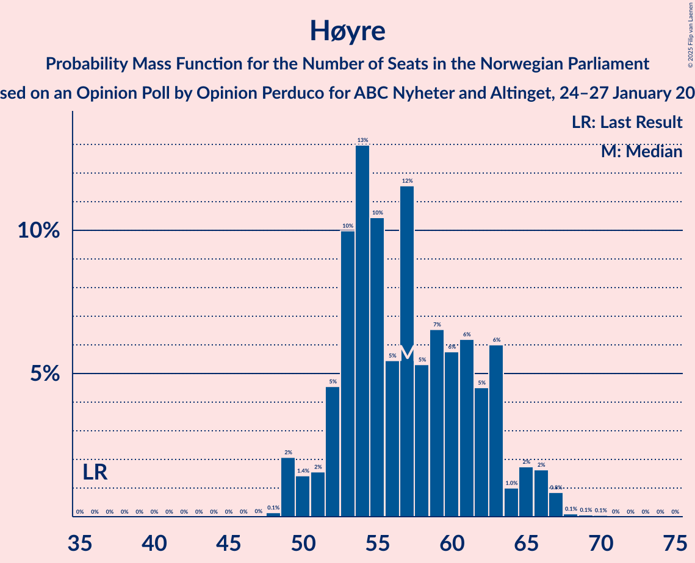

| Number of Seats | Probability | Accumulated | Special Marks |
|:---------------:|:-----------:|:-----------:|:-------------:|
| 36 | 0% | 100% | Last Result |
| 37 | 0% | 100% |  |
| 38 | 0% | 100% |  |
| 39 | 0% | 100% |  |
| 40 | 0% | 100% |  |
| 41 | 0% | 100% |  |
| 42 | 0% | 100% |  |
| 43 | 0% | 100% |  |
| 44 | 0% | 100% |  |
| 45 | 0% | 100% |  |
| 46 | 0% | 100% |  |
| 47 | 0% | 100% |  |
| 48 | 0.1% | 100% |  |
| 49 | 2% | 99.8% |  |
| 50 | 1.4% | 98% |  |
| 51 | 2% | 96% |  |
| 52 | 5% | 95% |  |
| 53 | 10% | 90% |  |
| 54 | 13% | 80% |  |
| 55 | 10% | 67% |  |
| 56 | 5% | 57% |  |
| 57 | 12% | 51% | Median |
| 58 | 5% | 40% |  |
| 59 | 7% | 34% |  |
| 60 | 6% | 28% |  |
| 61 | 6% | 22% |  |
| 62 | 5% | 16% |  |
| 63 | 6% | 11% |  |
| 64 | 1.0% | 5% |  |
| 65 | 2% | 4% |  |
| 66 | 2% | 3% |  |
| 67 | 0.8% | 1.1% |  |
| 68 | 0.1% | 0.2% |  |
| 69 | 0.1% | 0.1% |  |
| 70 | 0.1% | 0.1% |  |
| 71 | 0% | 0% |  |

### Arbeiderpartiet

*For a full overview of the results for this party, see the [Arbeiderpartiet](party-arbeiderpartiet.html) page.*

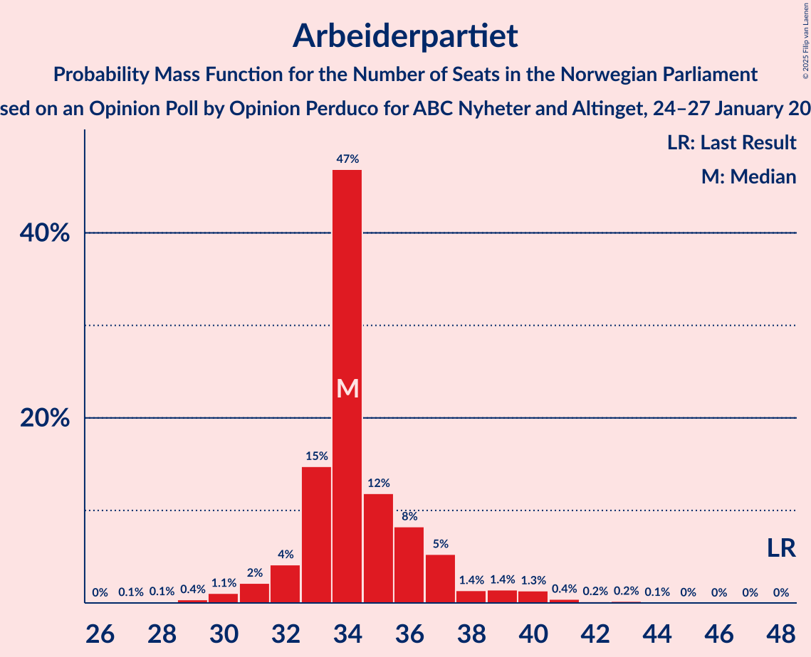

| Number of Seats | Probability | Accumulated | Special Marks |
|:---------------:|:-----------:|:-----------:|:-------------:|
| 27 | 0.1% | 100% |  |
| 28 | 0.1% | 99.9% |  |
| 29 | 0.4% | 99.8% |  |
| 30 | 1.1% | 99.4% |  |
| 31 | 2% | 98% |  |
| 32 | 4% | 96% |  |
| 33 | 15% | 92% |  |
| 34 | 47% | 77% | Median |
| 35 | 12% | 30% |  |
| 36 | 8% | 19% |  |
| 37 | 5% | 10% |  |
| 38 | 1.4% | 5% |  |
| 39 | 1.4% | 4% |  |
| 40 | 1.3% | 2% |  |
| 41 | 0.4% | 0.9% |  |
| 42 | 0.2% | 0.5% |  |
| 43 | 0.2% | 0.3% |  |
| 44 | 0.1% | 0.1% |  |
| 45 | 0% | 0% |  |
| 46 | 0% | 0% |  |
| 47 | 0% | 0% |  |
| 48 | 0% | 0% | Last Result |

### Fremskrittspartiet

*For a full overview of the results for this party, see the [Fremskrittspartiet](party-fremskrittspartiet.html) page.*

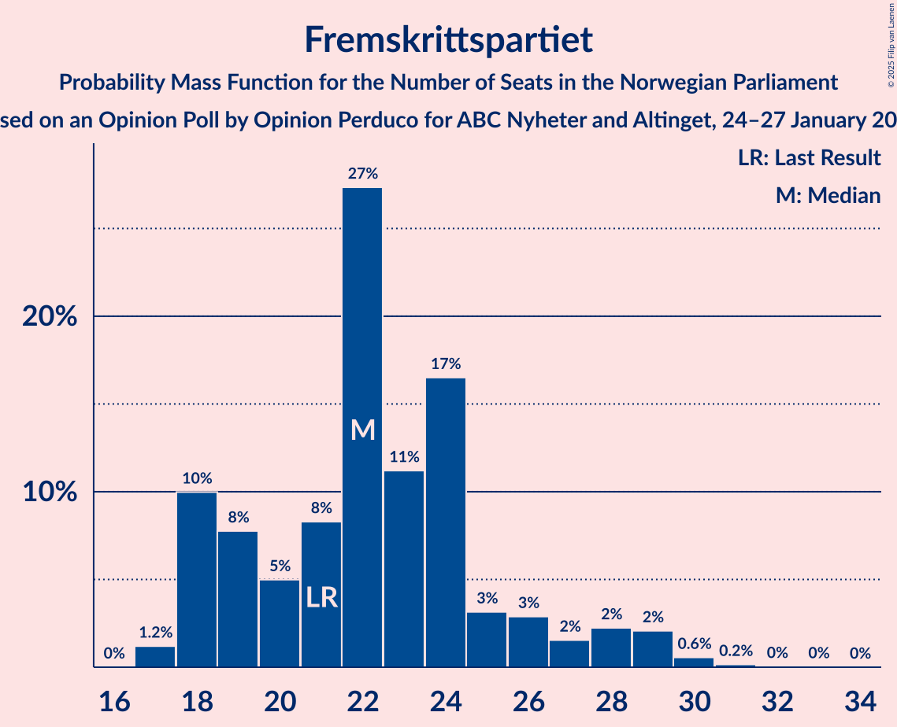

| Number of Seats | Probability | Accumulated | Special Marks |
|:---------------:|:-----------:|:-----------:|:-------------:|
| 17 | 1.2% | 100% |  |
| 18 | 10% | 98.8% |  |
| 19 | 8% | 89% |  |
| 20 | 5% | 81% |  |
| 21 | 8% | 76% | Last Result |
| 22 | 27% | 68% | Median |
| 23 | 11% | 40% |  |
| 24 | 17% | 29% |  |
| 25 | 3% | 13% |  |
| 26 | 3% | 10% |  |
| 27 | 2% | 7% |  |
| 28 | 2% | 5% |  |
| 29 | 2% | 3% |  |
| 30 | 0.6% | 0.8% |  |
| 31 | 0.2% | 0.2% |  |
| 32 | 0% | 0.1% |  |
| 33 | 0% | 0% |  |

### Sosialistisk Venstreparti

*For a full overview of the results for this party, see the [Sosialistisk Venstreparti](party-sosialistiskvenstreparti.html) page.*

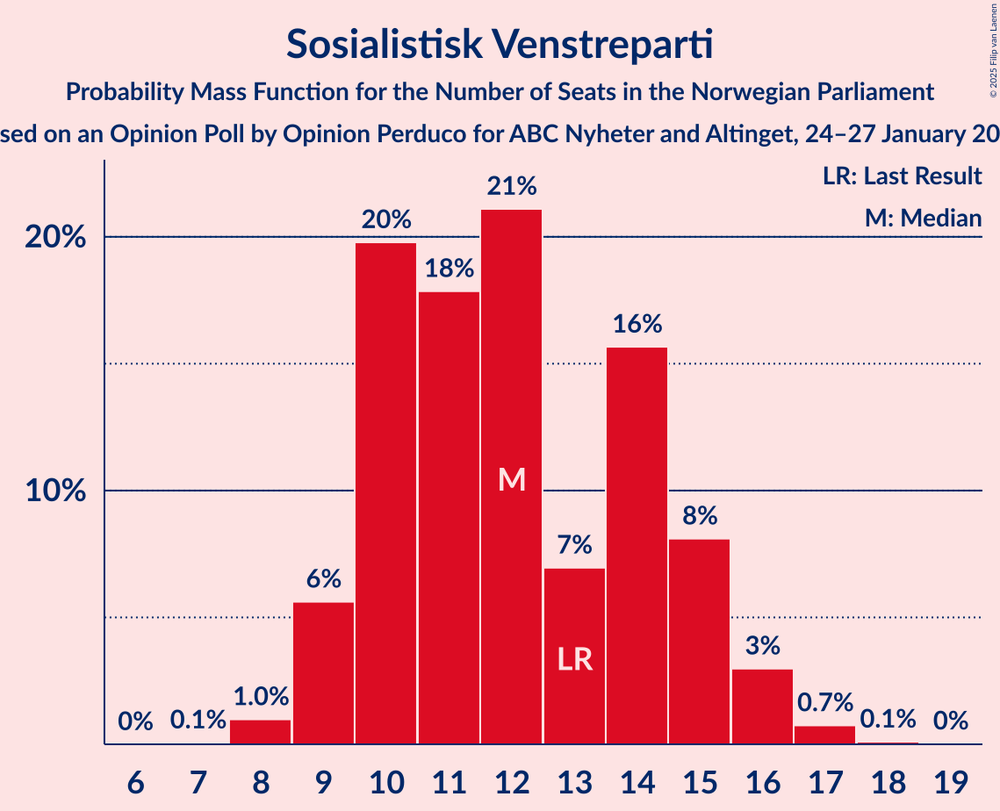

| Number of Seats | Probability | Accumulated | Special Marks |
|:---------------:|:-----------:|:-----------:|:-------------:|
| 7 | 0.1% | 100% |  |
| 8 | 1.0% | 99.9% |  |
| 9 | 6% | 98.9% |  |
| 10 | 20% | 93% |  |
| 11 | 18% | 74% |  |
| 12 | 21% | 56% | Median |
| 13 | 7% | 35% | Last Result |
| 14 | 16% | 28% |  |
| 15 | 8% | 12% |  |
| 16 | 3% | 4% |  |
| 17 | 0.7% | 0.9% |  |
| 18 | 0.1% | 0.1% |  |
| 19 | 0% | 0% |  |

### Rødt

*For a full overview of the results for this party, see the [Rødt](party-rødt.html) page.*

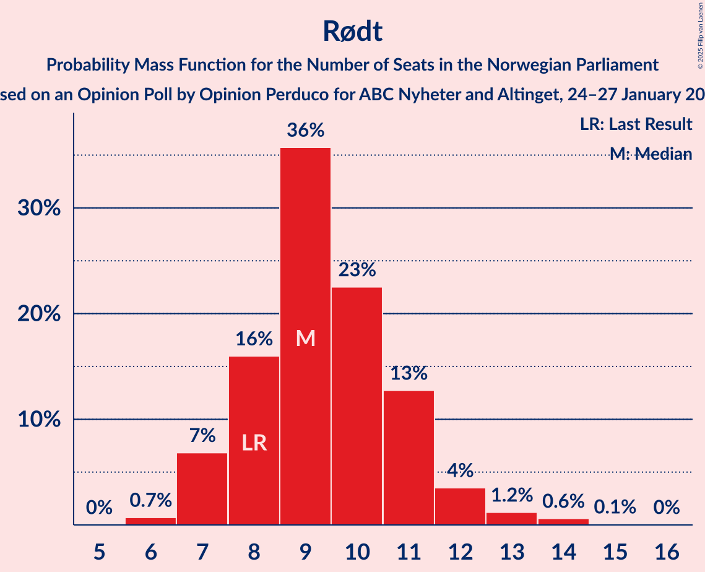

| Number of Seats | Probability | Accumulated | Special Marks |
|:---------------:|:-----------:|:-----------:|:-------------:|
| 6 | 0.7% | 100% |  |
| 7 | 7% | 99.3% |  |
| 8 | 16% | 92% | Last Result |
| 9 | 36% | 76% | Median |
| 10 | 23% | 41% |  |
| 11 | 13% | 18% |  |
| 12 | 4% | 5% |  |
| 13 | 1.2% | 2% |  |
| 14 | 0.6% | 0.7% |  |
| 15 | 0.1% | 0.1% |  |
| 16 | 0% | 0% |  |

### Senterpartiet

*For a full overview of the results for this party, see the [Senterpartiet](party-senterpartiet.html) page.*

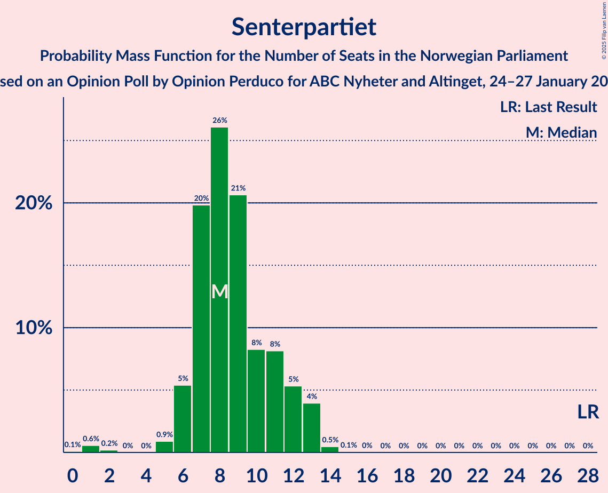

| Number of Seats | Probability | Accumulated | Special Marks |
|:---------------:|:-----------:|:-----------:|:-------------:|
| 0 | 0.1% | 100% |  |
| 1 | 0.6% | 99.9% |  |
| 2 | 0.2% | 99.3% |  |
| 3 | 0% | 99.1% |  |
| 4 | 0% | 99.1% |  |
| 5 | 0.9% | 99.1% |  |
| 6 | 5% | 98% |  |
| 7 | 20% | 93% |  |
| 8 | 26% | 73% | Median |
| 9 | 21% | 47% |  |
| 10 | 8% | 26% |  |
| 11 | 8% | 18% |  |
| 12 | 5% | 10% |  |
| 13 | 4% | 5% |  |
| 14 | 0.5% | 0.6% |  |
| 15 | 0.1% | 0.1% |  |
| 16 | 0% | 0% |  |
| 17 | 0% | 0% |  |
| 18 | 0% | 0% |  |
| 19 | 0% | 0% |  |
| 20 | 0% | 0% |  |
| 21 | 0% | 0% |  |
| 22 | 0% | 0% |  |
| 23 | 0% | 0% |  |
| 24 | 0% | 0% |  |
| 25 | 0% | 0% |  |
| 26 | 0% | 0% |  |
| 27 | 0% | 0% |  |
| 28 | 0% | 0% | Last Result |

### Venstre

*For a full overview of the results for this party, see the [Venstre](party-venstre.html) page.*

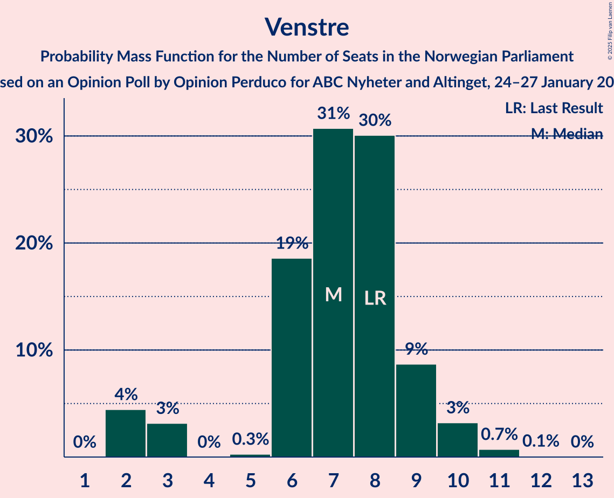

| Number of Seats | Probability | Accumulated | Special Marks |
|:---------------:|:-----------:|:-----------:|:-------------:|
| 2 | 4% | 100% |  |
| 3 | 3% | 96% |  |
| 4 | 0% | 92% |  |
| 5 | 0.3% | 92% |  |
| 6 | 19% | 92% |  |
| 7 | 31% | 74% | Median |
| 8 | 30% | 43% | Last Result |
| 9 | 9% | 13% |  |
| 10 | 3% | 4% |  |
| 11 | 0.7% | 0.8% |  |
| 12 | 0.1% | 0.1% |  |
| 13 | 0% | 0% |  |

### Miljøpartiet De Grønne

*For a full overview of the results for this party, see the [Miljøpartiet De Grønne](party-miljøpartietdegrønne.html) page.*

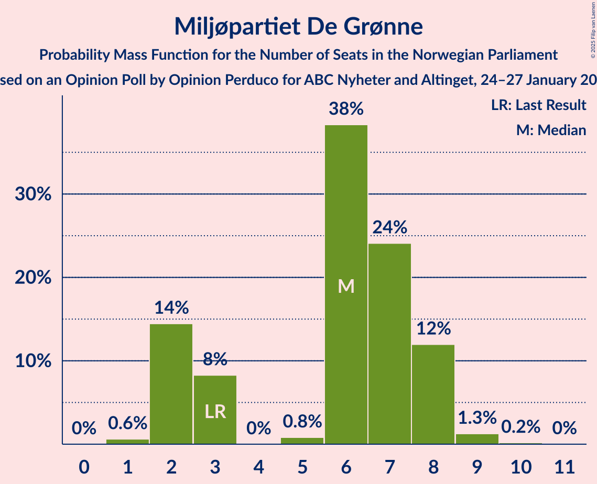

| Number of Seats | Probability | Accumulated | Special Marks |
|:---------------:|:-----------:|:-----------:|:-------------:|
| 1 | 0.6% | 100% |  |
| 2 | 14% | 99.4% |  |
| 3 | 8% | 85% | Last Result |
| 4 | 0% | 77% |  |
| 5 | 0.8% | 77% |  |
| 6 | 38% | 76% | Median |
| 7 | 24% | 38% |  |
| 8 | 12% | 13% |  |
| 9 | 1.3% | 1.5% |  |
| 10 | 0.2% | 0.2% |  |
| 11 | 0% | 0% |  |

### Kristelig Folkeparti

*For a full overview of the results for this party, see the [Kristelig Folkeparti](party-kristeligfolkeparti.html) page.*

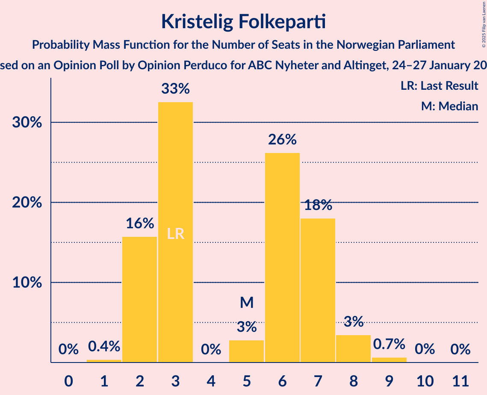

| Number of Seats | Probability | Accumulated | Special Marks |
|:---------------:|:-----------:|:-----------:|:-------------:|
| 1 | 0.4% | 100% |  |
| 2 | 16% | 99.6% |  |
| 3 | 33% | 84% | Last Result |
| 4 | 0% | 51% |  |
| 5 | 3% | 51% | Median |
| 6 | 26% | 48% |  |
| 7 | 18% | 22% |  |
| 8 | 3% | 4% |  |
| 9 | 0.7% | 0.7% |  |
| 10 | 0% | 0.1% |  |
| 11 | 0% | 0% |  |

## Coalitions

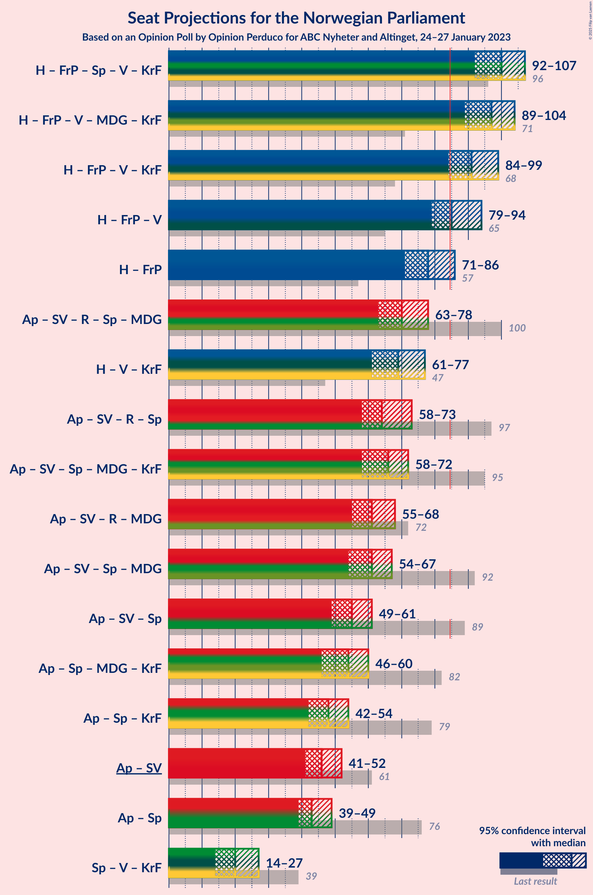

### Confidence Intervals

| Coalition | Last Result | Median | Majority? | 80% Confidence Interval | 90% Confidence Interval | 95% Confidence Interval | 99% Confidence Interval |
|:---------:|:-----------:|:------:|:---------:|:-----------------------:|:-----------------------:|:-----------------------:|:-----------------------:|
| Høyre – Fremskrittspartiet – Senterpartiet – Venstre – Kristelig Folkeparti | 96 | 100 | 100% | 95–104 | 94–105 | 92–107 | 89–108 |
| Høyre – Fremskrittspartiet – Venstre – Miljøpartiet De Grønne – Kristelig Folkeparti | 71 | 97 | 99.9% | 92–102 | 90–102 | 89–104 | 86–106 |
| Høyre – Fremskrittspartiet – Venstre – Kristelig Folkeparti | 68 | 91 | 95% | 86–96 | 84–97 | 84–99 | 80–101 |
| Høyre – Fremskrittspartiet – Venstre | 65 | 85 | 64% | 82–92 | 80–93 | 79–94 | 77–97 |
| Høyre – Fremskrittspartiet | 57 | 78 | 10% | 75–85 | 73–85 | 71–86 | 71–90 |
| Arbeiderpartiet – Sosialistisk Venstreparti – Rødt – Senterpartiet – Miljøpartiet De Grønne | 100 | 70 | 0% | 65–75 | 64–77 | 63–78 | 60–81 |
| Høyre – Venstre – Kristelig Folkeparti | 47 | 69 | 0% | 63–74 | 62–77 | 61–77 | 58–80 |
| Arbeiderpartiet – Sosialistisk Venstreparti – Rødt – Senterpartiet | 97 | 64 | 0% | 59–69 | 59–71 | 58–73 | 56–74 |
| Arbeiderpartiet – Sosialistisk Venstreparti – Senterpartiet – Miljøpartiet De Grønne – Kristelig Folkeparti | 95 | 66 | 0% | 59–70 | 59–71 | 58–72 | 56–74 |
| Arbeiderpartiet – Sosialistisk Venstreparti – Rødt – Miljøpartiet De Grønne | 72 | 61 | 0% | 57–66 | 56–67 | 55–68 | 53–70 |
| Arbeiderpartiet – Sosialistisk Venstreparti – Senterpartiet – Miljøpartiet De Grønne | 92 | 61 | 0% | 56–66 | 55–66 | 54–67 | 51–69 |
| Arbeiderpartiet – Sosialistisk Venstreparti – Senterpartiet | 89 | 55 | 0% | 50–59 | 50–60 | 49–61 | 47–63 |
| Arbeiderpartiet – Senterpartiet – Miljøpartiet De Grønne – Kristelig Folkeparti | 82 | 54 | 0% | 49–58 | 48–59 | 46–60 | 44–62 |
| Arbeiderpartiet – Senterpartiet – Kristelig Folkeparti | 79 | 48 | 0% | 43–52 | 43–53 | 42–54 | 39–56 |
| Arbeiderpartiet – Sosialistisk Venstreparti | 61 | 46 | 0% | 43–50 | 42–51 | 41–52 | 40–54 |
| Arbeiderpartiet – Senterpartiet | 76 | 43 | 0% | 40–46 | 39–47 | 39–49 | 36–51 |
| Senterpartiet – Venstre – Kristelig Folkeparti | 39 | 20 | 0% | 17–24 | 16–26 | 14–27 | 12–29 |

### Høyre – Fremskrittspartiet – Senterpartiet – Venstre – Kristelig Folkeparti

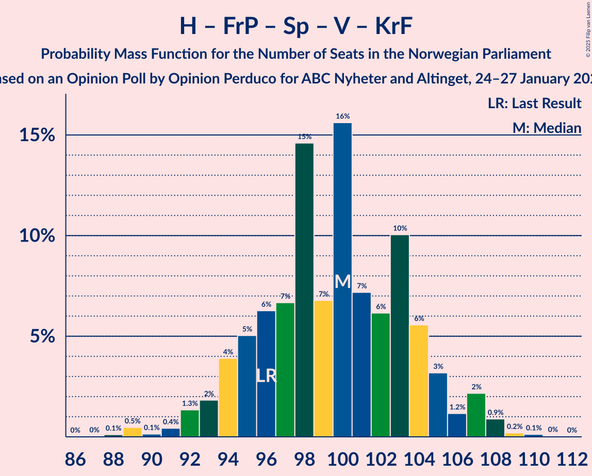

| Number of Seats | Probability | Accumulated | Special Marks |
|:---------------:|:-----------:|:-----------:|:-------------:|
| 88 | 0.1% | 100% |  |
| 89 | 0.5% | 99.8% |  |
| 90 | 0.1% | 99.4% |  |
| 91 | 0.4% | 99.2% |  |
| 92 | 1.3% | 98.8% |  |
| 93 | 2% | 97% |  |
| 94 | 4% | 96% |  |
| 95 | 5% | 92% |  |
| 96 | 6% | 87% | Last Result |
| 97 | 7% | 80% |  |
| 98 | 15% | 74% |  |
| 99 | 7% | 59% | Median |
| 100 | 16% | 52% |  |
| 101 | 7% | 37% |  |
| 102 | 6% | 30% |  |
| 103 | 10% | 23% |  |
| 104 | 6% | 13% |  |
| 105 | 3% | 8% |  |
| 106 | 1.2% | 5% |  |
| 107 | 2% | 3% |  |
| 108 | 0.9% | 1.3% |  |
| 109 | 0.2% | 0.4% |  |
| 110 | 0.1% | 0.2% |  |
| 111 | 0% | 0.1% |  |
| 112 | 0% | 0% |  |

### Høyre – Fremskrittspartiet – Venstre – Miljøpartiet De Grønne – Kristelig Folkeparti

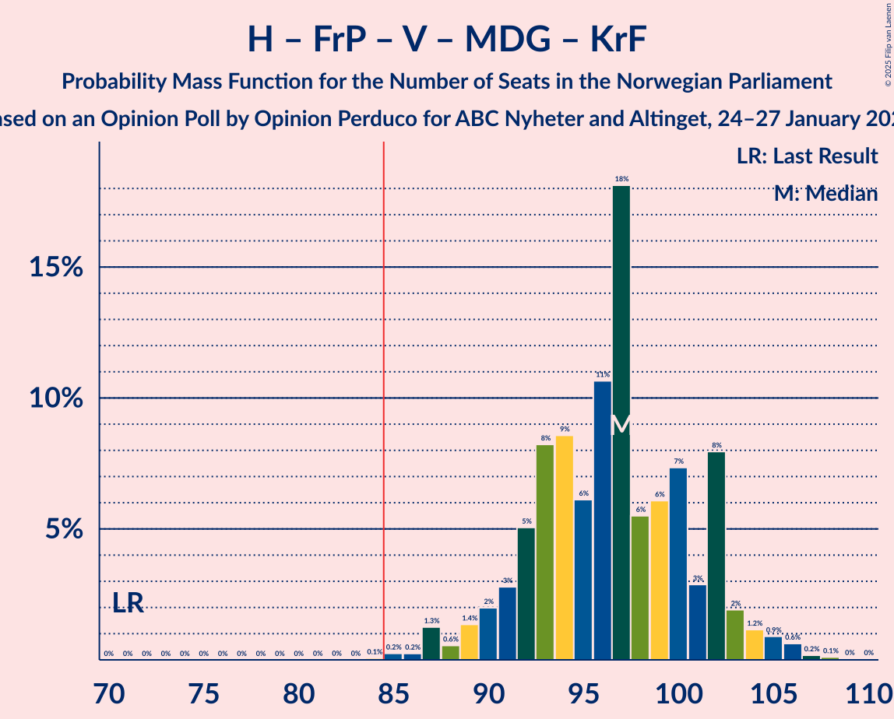

| Number of Seats | Probability | Accumulated | Special Marks |
|:---------------:|:-----------:|:-----------:|:-------------:|
| 71 | 0% | 100% | Last Result |
| 72 | 0% | 100% |  |
| 73 | 0% | 100% |  |
| 74 | 0% | 100% |  |
| 75 | 0% | 100% |  |
| 76 | 0% | 100% |  |
| 77 | 0% | 100% |  |
| 78 | 0% | 100% |  |
| 79 | 0% | 100% |  |
| 80 | 0% | 100% |  |
| 81 | 0% | 100% |  |
| 82 | 0% | 100% |  |
| 83 | 0% | 100% |  |
| 84 | 0.1% | 100% |  |
| 85 | 0.2% | 99.9% | Majority |
| 86 | 0.2% | 99.7% |  |
| 87 | 1.3% | 99.4% |  |
| 88 | 0.6% | 98% |  |
| 89 | 1.4% | 98% |  |
| 90 | 2% | 96% |  |
| 91 | 3% | 94% |  |
| 92 | 5% | 91% |  |
| 93 | 8% | 86% |  |
| 94 | 9% | 78% |  |
| 95 | 6% | 70% |  |
| 96 | 11% | 64% |  |
| 97 | 18% | 53% | Median |
| 98 | 6% | 35% |  |
| 99 | 6% | 29% |  |
| 100 | 7% | 23% |  |
| 101 | 3% | 16% |  |
| 102 | 8% | 13% |  |
| 103 | 2% | 5% |  |
| 104 | 1.2% | 3% |  |
| 105 | 0.9% | 2% |  |
| 106 | 0.6% | 1.0% |  |
| 107 | 0.2% | 0.4% |  |
| 108 | 0.1% | 0.2% |  |
| 109 | 0% | 0.1% |  |
| 110 | 0% | 0% |  |

### Høyre – Fremskrittspartiet – Venstre – Kristelig Folkeparti

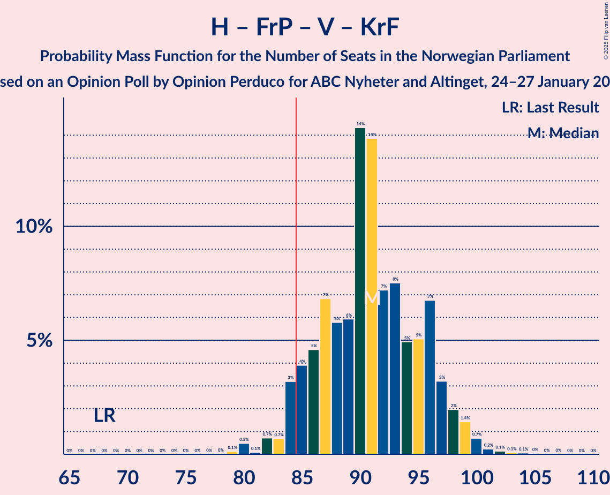

| Number of Seats | Probability | Accumulated | Special Marks |
|:---------------:|:-----------:|:-----------:|:-------------:|
| 68 | 0% | 100% | Last Result |
| 69 | 0% | 100% |  |
| 70 | 0% | 100% |  |
| 71 | 0% | 100% |  |
| 72 | 0% | 100% |  |
| 73 | 0% | 100% |  |
| 74 | 0% | 100% |  |
| 75 | 0% | 100% |  |
| 76 | 0% | 100% |  |
| 77 | 0% | 100% |  |
| 78 | 0% | 100% |  |
| 79 | 0.1% | 100% |  |
| 80 | 0.5% | 99.8% |  |
| 81 | 0.1% | 99.4% |  |
| 82 | 0.7% | 99.3% |  |
| 83 | 0.7% | 98.6% |  |
| 84 | 3% | 98% |  |
| 85 | 4% | 95% | Majority |
| 86 | 5% | 91% |  |
| 87 | 7% | 86% |  |
| 88 | 6% | 79% |  |
| 89 | 6% | 74% |  |
| 90 | 14% | 68% |  |
| 91 | 14% | 53% | Median |
| 92 | 7% | 39% |  |
| 93 | 8% | 32% |  |
| 94 | 5% | 25% |  |
| 95 | 5% | 20% |  |
| 96 | 7% | 15% |  |
| 97 | 3% | 8% |  |
| 98 | 2% | 5% |  |
| 99 | 1.4% | 3% |  |
| 100 | 0.7% | 1.3% |  |
| 101 | 0.2% | 0.6% |  |
| 102 | 0.1% | 0.3% |  |
| 103 | 0.1% | 0.2% |  |
| 104 | 0.1% | 0.1% |  |
| 105 | 0% | 0.1% |  |
| 106 | 0% | 0% |  |

### Høyre – Fremskrittspartiet – Venstre

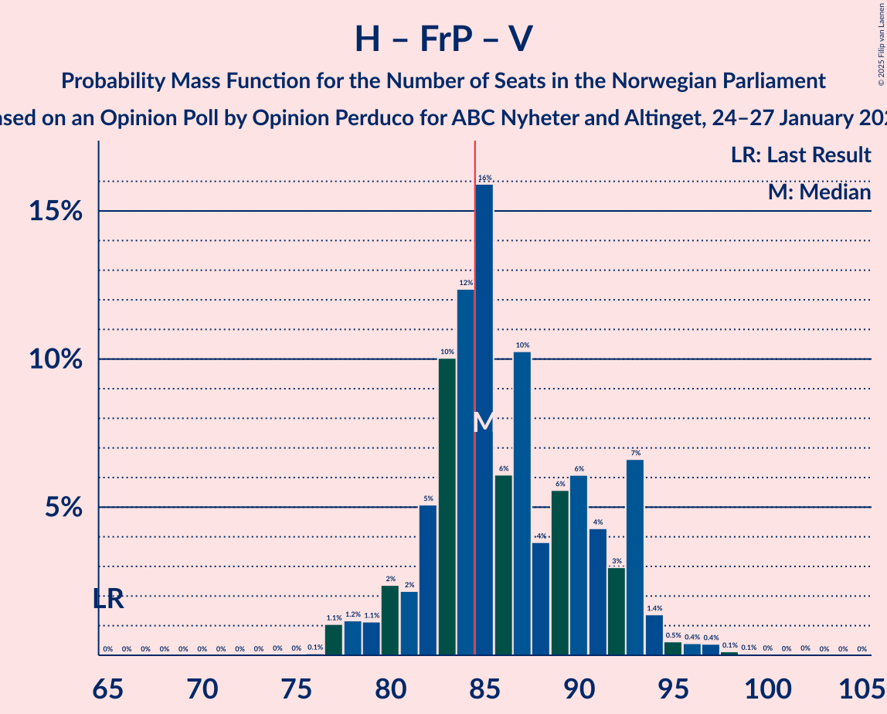

| Number of Seats | Probability | Accumulated | Special Marks |
|:---------------:|:-----------:|:-----------:|:-------------:|
| 65 | 0% | 100% | Last Result |
| 66 | 0% | 100% |  |
| 67 | 0% | 100% |  |
| 68 | 0% | 100% |  |
| 69 | 0% | 100% |  |
| 70 | 0% | 100% |  |
| 71 | 0% | 100% |  |
| 72 | 0% | 100% |  |
| 73 | 0% | 100% |  |
| 74 | 0% | 100% |  |
| 75 | 0% | 100% |  |
| 76 | 0.1% | 99.9% |  |
| 77 | 1.1% | 99.9% |  |
| 78 | 1.2% | 98.8% |  |
| 79 | 1.1% | 98% |  |
| 80 | 2% | 97% |  |
| 81 | 2% | 94% |  |
| 82 | 5% | 92% |  |
| 83 | 10% | 87% |  |
| 84 | 12% | 77% |  |
| 85 | 16% | 64% | Majority |
| 86 | 6% | 49% | Median |
| 87 | 10% | 42% |  |
| 88 | 4% | 32% |  |
| 89 | 6% | 28% |  |
| 90 | 6% | 23% |  |
| 91 | 4% | 17% |  |
| 92 | 3% | 12% |  |
| 93 | 7% | 9% |  |
| 94 | 1.4% | 3% |  |
| 95 | 0.5% | 2% |  |
| 96 | 0.4% | 1.0% |  |
| 97 | 0.4% | 0.6% |  |
| 98 | 0.1% | 0.3% |  |
| 99 | 0.1% | 0.1% |  |
| 100 | 0% | 0.1% |  |
| 101 | 0% | 0% |  |

### Høyre – Fremskrittspartiet

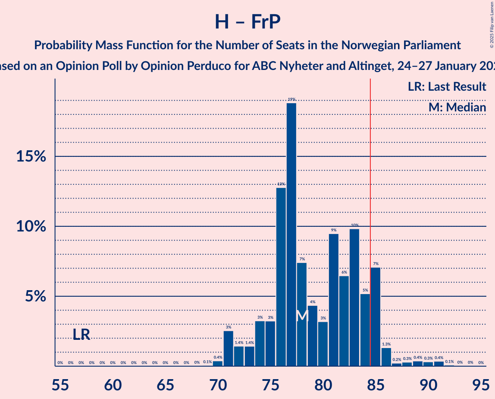

| Number of Seats | Probability | Accumulated | Special Marks |
|:---------------:|:-----------:|:-----------:|:-------------:|
| 57 | 0% | 100% | Last Result |
| 58 | 0% | 100% |  |
| 59 | 0% | 100% |  |
| 60 | 0% | 100% |  |
| 61 | 0% | 100% |  |
| 62 | 0% | 100% |  |
| 63 | 0% | 100% |  |
| 64 | 0% | 100% |  |
| 65 | 0% | 100% |  |
| 66 | 0% | 100% |  |
| 67 | 0% | 100% |  |
| 68 | 0% | 100% |  |
| 69 | 0.1% | 100% |  |
| 70 | 0.4% | 99.9% |  |
| 71 | 3% | 99.5% |  |
| 72 | 1.4% | 97% |  |
| 73 | 1.4% | 96% |  |
| 74 | 3% | 94% |  |
| 75 | 3% | 91% |  |
| 76 | 13% | 88% |  |
| 77 | 19% | 75% |  |
| 78 | 7% | 56% |  |
| 79 | 4% | 49% | Median |
| 80 | 3% | 44% |  |
| 81 | 9% | 41% |  |
| 82 | 6% | 32% |  |
| 83 | 10% | 25% |  |
| 84 | 5% | 15% |  |
| 85 | 7% | 10% | Majority |
| 86 | 1.3% | 3% |  |
| 87 | 0.2% | 2% |  |
| 88 | 0.3% | 1.5% |  |
| 89 | 0.4% | 1.2% |  |
| 90 | 0.3% | 0.8% |  |
| 91 | 0.4% | 0.5% |  |
| 92 | 0.1% | 0.1% |  |
| 93 | 0% | 0.1% |  |
| 94 | 0% | 0% |  |

### Arbeiderpartiet – Sosialistisk Venstreparti – Rødt – Senterpartiet – Miljøpartiet De Grønne

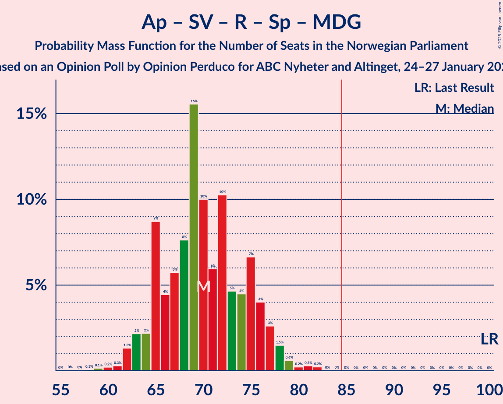

| Number of Seats | Probability | Accumulated | Special Marks |
|:---------------:|:-----------:|:-----------:|:-------------:|
| 56 | 0% | 100% |  |
| 57 | 0% | 99.9% |  |
| 58 | 0.1% | 99.9% |  |
| 59 | 0.1% | 99.8% |  |
| 60 | 0.2% | 99.7% |  |
| 61 | 0.3% | 99.5% |  |
| 62 | 1.3% | 99.2% |  |
| 63 | 2% | 98% |  |
| 64 | 2% | 96% |  |
| 65 | 9% | 94% |  |
| 66 | 4% | 85% |  |
| 67 | 6% | 80% |  |
| 68 | 8% | 75% |  |
| 69 | 16% | 67% | Median |
| 70 | 10% | 51% |  |
| 71 | 6% | 41% |  |
| 72 | 10% | 36% |  |
| 73 | 5% | 25% |  |
| 74 | 4% | 21% |  |
| 75 | 7% | 16% |  |
| 76 | 4% | 9% |  |
| 77 | 3% | 5% |  |
| 78 | 1.5% | 3% |  |
| 79 | 0.6% | 1.4% |  |
| 80 | 0.2% | 0.8% |  |
| 81 | 0.3% | 0.6% |  |
| 82 | 0.2% | 0.3% |  |
| 83 | 0% | 0% |  |
| 84 | 0% | 0% |  |
| 85 | 0% | 0% | Majority |
| 86 | 0% | 0% |  |
| 87 | 0% | 0% |  |
| 88 | 0% | 0% |  |
| 89 | 0% | 0% |  |
| 90 | 0% | 0% |  |
| 91 | 0% | 0% |  |
| 92 | 0% | 0% |  |
| 93 | 0% | 0% |  |
| 94 | 0% | 0% |  |
| 95 | 0% | 0% |  |
| 96 | 0% | 0% |  |
| 97 | 0% | 0% |  |
| 98 | 0% | 0% |  |
| 99 | 0% | 0% |  |
| 100 | 0% | 0% | Last Result |

### Høyre – Venstre – Kristelig Folkeparti

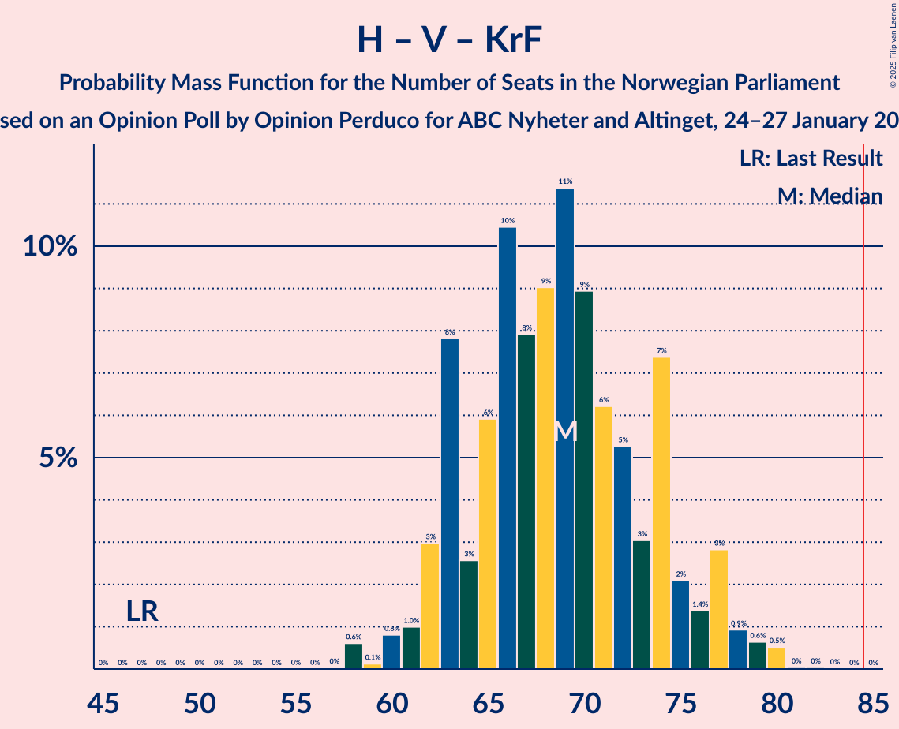

| Number of Seats | Probability | Accumulated | Special Marks |
|:---------------:|:-----------:|:-----------:|:-------------:|
| 47 | 0% | 100% | Last Result |
| 48 | 0% | 100% |  |
| 49 | 0% | 100% |  |
| 50 | 0% | 100% |  |
| 51 | 0% | 100% |  |
| 52 | 0% | 100% |  |
| 53 | 0% | 100% |  |
| 54 | 0% | 100% |  |
| 55 | 0% | 100% |  |
| 56 | 0% | 100% |  |
| 57 | 0% | 100% |  |
| 58 | 0.6% | 99.9% |  |
| 59 | 0.1% | 99.3% |  |
| 60 | 0.8% | 99.2% |  |
| 61 | 1.0% | 98% |  |
| 62 | 3% | 97% |  |
| 63 | 8% | 94% |  |
| 64 | 3% | 87% |  |
| 65 | 6% | 84% |  |
| 66 | 10% | 78% |  |
| 67 | 8% | 68% |  |
| 68 | 9% | 60% |  |
| 69 | 11% | 51% | Median |
| 70 | 9% | 39% |  |
| 71 | 6% | 30% |  |
| 72 | 5% | 24% |  |
| 73 | 3% | 19% |  |
| 74 | 7% | 16% |  |
| 75 | 2% | 8% |  |
| 76 | 1.4% | 6% |  |
| 77 | 3% | 5% |  |
| 78 | 0.9% | 2% |  |
| 79 | 0.6% | 1.3% |  |
| 80 | 0.5% | 0.6% |  |
| 81 | 0% | 0.1% |  |
| 82 | 0% | 0.1% |  |
| 83 | 0% | 0% |  |

### Arbeiderpartiet – Sosialistisk Venstreparti – Rødt – Senterpartiet

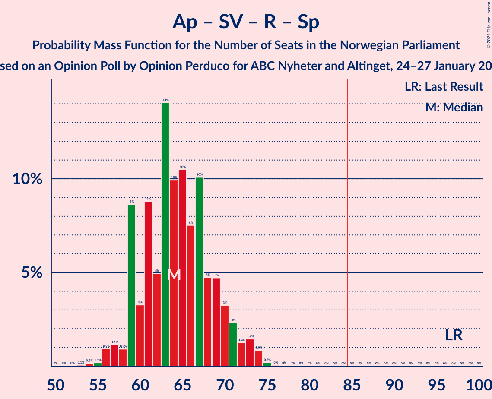

| Number of Seats | Probability | Accumulated | Special Marks |
|:---------------:|:-----------:|:-----------:|:-------------:|
| 53 | 0.1% | 100% |  |
| 54 | 0.2% | 99.9% |  |
| 55 | 0.2% | 99.7% |  |
| 56 | 0.9% | 99.6% |  |
| 57 | 1.1% | 98.6% |  |
| 58 | 0.9% | 98% |  |
| 59 | 9% | 97% |  |
| 60 | 3% | 88% |  |
| 61 | 9% | 85% |  |
| 62 | 5% | 76% |  |
| 63 | 14% | 71% | Median |
| 64 | 10% | 57% |  |
| 65 | 10% | 47% |  |
| 66 | 8% | 36% |  |
| 67 | 10% | 29% |  |
| 68 | 5% | 19% |  |
| 69 | 5% | 14% |  |
| 70 | 3% | 9% |  |
| 71 | 2% | 6% |  |
| 72 | 1.3% | 4% |  |
| 73 | 1.4% | 3% |  |
| 74 | 0.8% | 1.1% |  |
| 75 | 0.2% | 0.3% |  |
| 76 | 0% | 0.1% |  |
| 77 | 0% | 0.1% |  |
| 78 | 0% | 0% |  |
| 79 | 0% | 0% |  |
| 80 | 0% | 0% |  |
| 81 | 0% | 0% |  |
| 82 | 0% | 0% |  |
| 83 | 0% | 0% |  |
| 84 | 0% | 0% |  |
| 85 | 0% | 0% | Majority |
| 86 | 0% | 0% |  |
| 87 | 0% | 0% |  |
| 88 | 0% | 0% |  |
| 89 | 0% | 0% |  |
| 90 | 0% | 0% |  |
| 91 | 0% | 0% |  |
| 92 | 0% | 0% |  |
| 93 | 0% | 0% |  |
| 94 | 0% | 0% |  |
| 95 | 0% | 0% |  |
| 96 | 0% | 0% |  |
| 97 | 0% | 0% | Last Result |

### Arbeiderpartiet – Sosialistisk Venstreparti – Senterpartiet – Miljøpartiet De Grønne – Kristelig Folkeparti

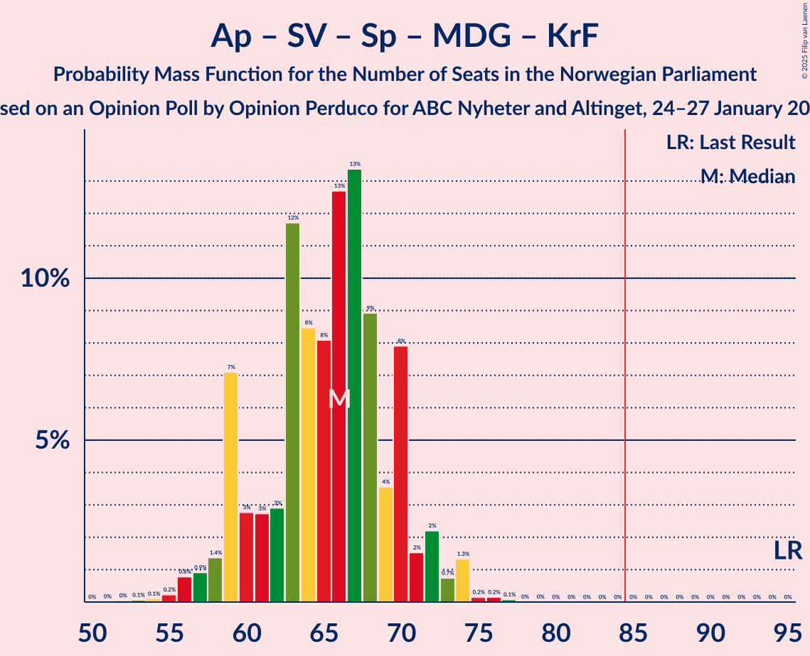

| Number of Seats | Probability | Accumulated | Special Marks |
|:---------------:|:-----------:|:-----------:|:-------------:|
| 52 | 0% | 100% |  |
| 53 | 0.1% | 99.9% |  |
| 54 | 0.1% | 99.9% |  |
| 55 | 0.2% | 99.8% |  |
| 56 | 0.8% | 99.5% |  |
| 57 | 0.9% | 98.7% |  |
| 58 | 1.4% | 98% |  |
| 59 | 7% | 96% |  |
| 60 | 3% | 89% |  |
| 61 | 3% | 87% |  |
| 62 | 3% | 84% |  |
| 63 | 12% | 81% |  |
| 64 | 8% | 69% |  |
| 65 | 8% | 61% | Median |
| 66 | 13% | 53% |  |
| 67 | 13% | 40% |  |
| 68 | 9% | 27% |  |
| 69 | 4% | 18% |  |
| 70 | 8% | 14% |  |
| 71 | 2% | 6% |  |
| 72 | 2% | 5% |  |
| 73 | 0.7% | 2% |  |
| 74 | 1.3% | 2% |  |
| 75 | 0.2% | 0.4% |  |
| 76 | 0.2% | 0.3% |  |
| 77 | 0.1% | 0.1% |  |
| 78 | 0% | 0% |  |
| 79 | 0% | 0% |  |
| 80 | 0% | 0% |  |
| 81 | 0% | 0% |  |
| 82 | 0% | 0% |  |
| 83 | 0% | 0% |  |
| 84 | 0% | 0% |  |
| 85 | 0% | 0% | Majority |
| 86 | 0% | 0% |  |
| 87 | 0% | 0% |  |
| 88 | 0% | 0% |  |
| 89 | 0% | 0% |  |
| 90 | 0% | 0% |  |
| 91 | 0% | 0% |  |
| 92 | 0% | 0% |  |
| 93 | 0% | 0% |  |
| 94 | 0% | 0% |  |
| 95 | 0% | 0% | Last Result |

### Arbeiderpartiet – Sosialistisk Venstreparti – Rødt – Miljøpartiet De Grønne

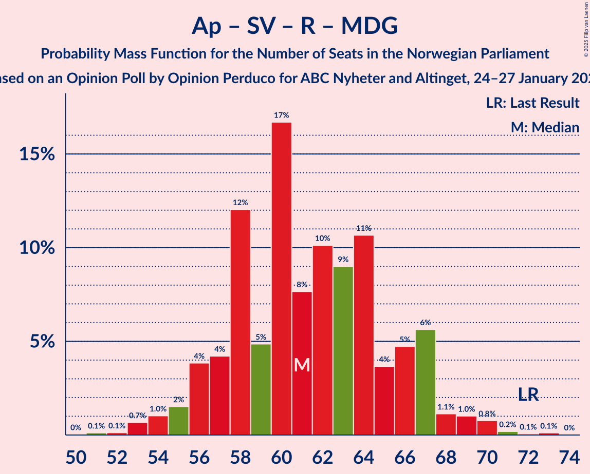

| Number of Seats | Probability | Accumulated | Special Marks |
|:---------------:|:-----------:|:-----------:|:-------------:|
| 50 | 0% | 100% |  |
| 51 | 0.1% | 99.9% |  |
| 52 | 0.1% | 99.8% |  |
| 53 | 0.7% | 99.7% |  |
| 54 | 1.0% | 99.0% |  |
| 55 | 2% | 98% |  |
| 56 | 4% | 96% |  |
| 57 | 4% | 93% |  |
| 58 | 12% | 88% |  |
| 59 | 5% | 76% |  |
| 60 | 17% | 72% |  |
| 61 | 8% | 55% | Median |
| 62 | 10% | 47% |  |
| 63 | 9% | 37% |  |
| 64 | 11% | 28% |  |
| 65 | 4% | 17% |  |
| 66 | 5% | 14% |  |
| 67 | 6% | 9% |  |
| 68 | 1.1% | 3% |  |
| 69 | 1.0% | 2% |  |
| 70 | 0.8% | 1.2% |  |
| 71 | 0.2% | 0.4% |  |
| 72 | 0.1% | 0.2% | Last Result |
| 73 | 0.1% | 0.2% |  |
| 74 | 0% | 0% |  |

### Arbeiderpartiet – Sosialistisk Venstreparti – Senterpartiet – Miljøpartiet De Grønne

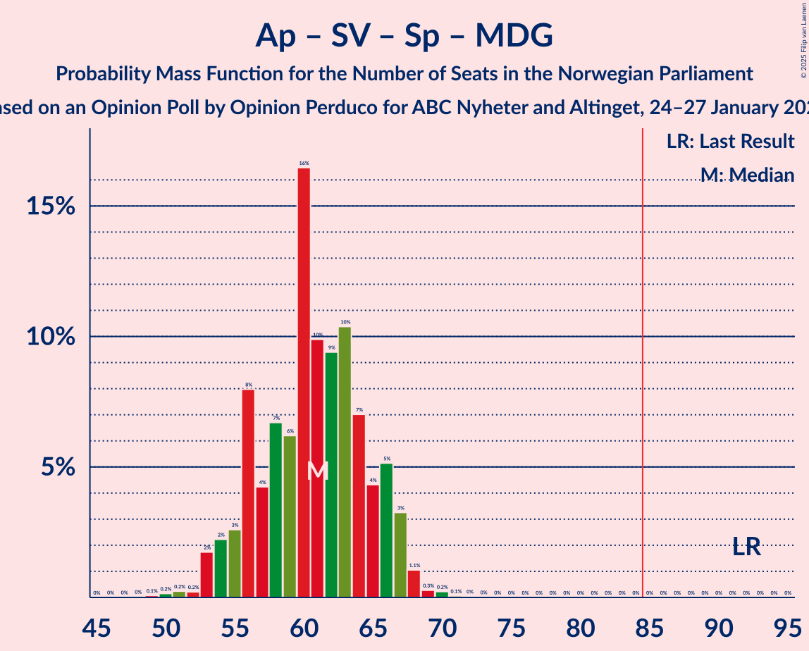

| Number of Seats | Probability | Accumulated | Special Marks |
|:---------------:|:-----------:|:-----------:|:-------------:|
| 48 | 0% | 100% |  |
| 49 | 0.1% | 99.9% |  |
| 50 | 0.2% | 99.9% |  |
| 51 | 0.2% | 99.7% |  |
| 52 | 0.2% | 99.5% |  |
| 53 | 2% | 99.3% |  |
| 54 | 2% | 98% |  |
| 55 | 3% | 95% |  |
| 56 | 8% | 93% |  |
| 57 | 4% | 85% |  |
| 58 | 7% | 80% |  |
| 59 | 6% | 74% |  |
| 60 | 16% | 68% | Median |
| 61 | 10% | 51% |  |
| 62 | 9% | 41% |  |
| 63 | 10% | 32% |  |
| 64 | 7% | 21% |  |
| 65 | 4% | 14% |  |
| 66 | 5% | 10% |  |
| 67 | 3% | 5% |  |
| 68 | 1.1% | 2% |  |
| 69 | 0.3% | 0.6% |  |
| 70 | 0.2% | 0.4% |  |
| 71 | 0.1% | 0.1% |  |
| 72 | 0% | 0.1% |  |
| 73 | 0% | 0% |  |
| 74 | 0% | 0% |  |
| 75 | 0% | 0% |  |
| 76 | 0% | 0% |  |
| 77 | 0% | 0% |  |
| 78 | 0% | 0% |  |
| 79 | 0% | 0% |  |
| 80 | 0% | 0% |  |
| 81 | 0% | 0% |  |
| 82 | 0% | 0% |  |
| 83 | 0% | 0% |  |
| 84 | 0% | 0% |  |
| 85 | 0% | 0% | Majority |
| 86 | 0% | 0% |  |
| 87 | 0% | 0% |  |
| 88 | 0% | 0% |  |
| 89 | 0% | 0% |  |
| 90 | 0% | 0% |  |
| 91 | 0% | 0% |  |
| 92 | 0% | 0% | Last Result |

### Arbeiderpartiet – Sosialistisk Venstreparti – Senterpartiet

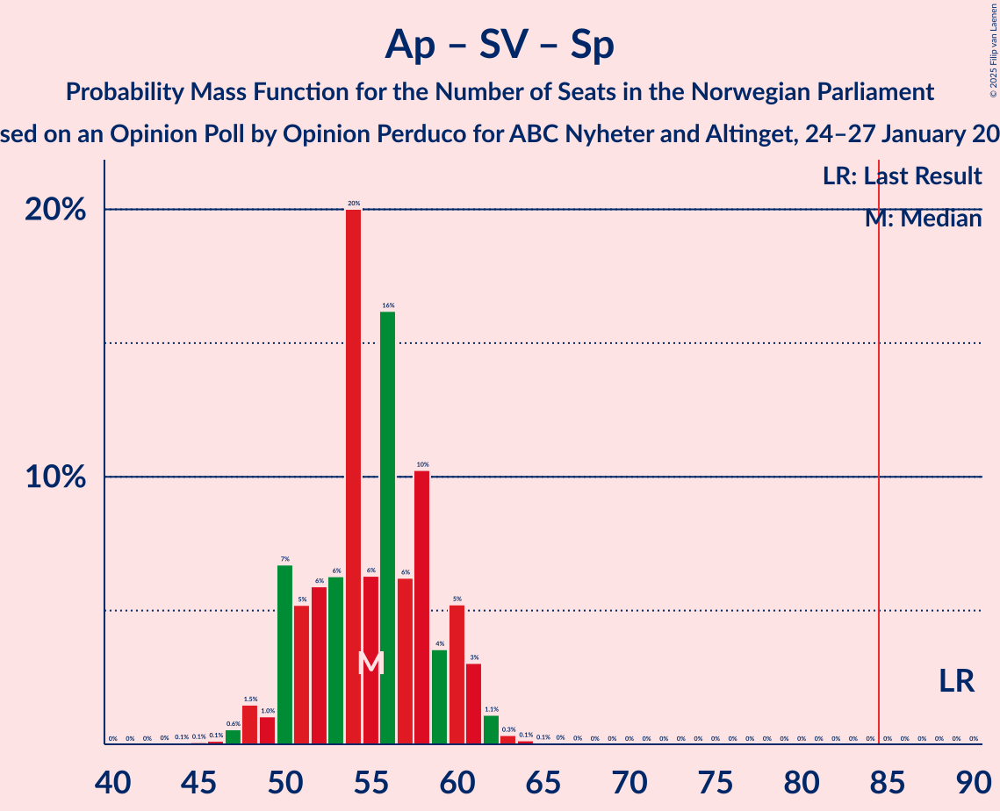

| Number of Seats | Probability | Accumulated | Special Marks |
|:---------------:|:-----------:|:-----------:|:-------------:|
| 44 | 0.1% | 100% |  |
| 45 | 0.1% | 99.9% |  |
| 46 | 0.1% | 99.8% |  |
| 47 | 0.6% | 99.7% |  |
| 48 | 1.5% | 99.1% |  |
| 49 | 1.0% | 98% |  |
| 50 | 7% | 97% |  |
| 51 | 5% | 90% |  |
| 52 | 6% | 85% |  |
| 53 | 6% | 79% |  |
| 54 | 20% | 73% | Median |
| 55 | 6% | 52% |  |
| 56 | 16% | 46% |  |
| 57 | 6% | 30% |  |
| 58 | 10% | 24% |  |
| 59 | 4% | 14% |  |
| 60 | 5% | 10% |  |
| 61 | 3% | 5% |  |
| 62 | 1.1% | 2% |  |
| 63 | 0.3% | 0.6% |  |
| 64 | 0.1% | 0.3% |  |
| 65 | 0.1% | 0.1% |  |
| 66 | 0% | 0.1% |  |
| 67 | 0% | 0% |  |
| 68 | 0% | 0% |  |
| 69 | 0% | 0% |  |
| 70 | 0% | 0% |  |
| 71 | 0% | 0% |  |
| 72 | 0% | 0% |  |
| 73 | 0% | 0% |  |
| 74 | 0% | 0% |  |
| 75 | 0% | 0% |  |
| 76 | 0% | 0% |  |
| 77 | 0% | 0% |  |
| 78 | 0% | 0% |  |
| 79 | 0% | 0% |  |
| 80 | 0% | 0% |  |
| 81 | 0% | 0% |  |
| 82 | 0% | 0% |  |
| 83 | 0% | 0% |  |
| 84 | 0% | 0% |  |
| 85 | 0% | 0% | Majority |
| 86 | 0% | 0% |  |
| 87 | 0% | 0% |  |
| 88 | 0% | 0% |  |
| 89 | 0% | 0% | Last Result |

### Arbeiderpartiet – Senterpartiet – Miljøpartiet De Grønne – Kristelig Folkeparti

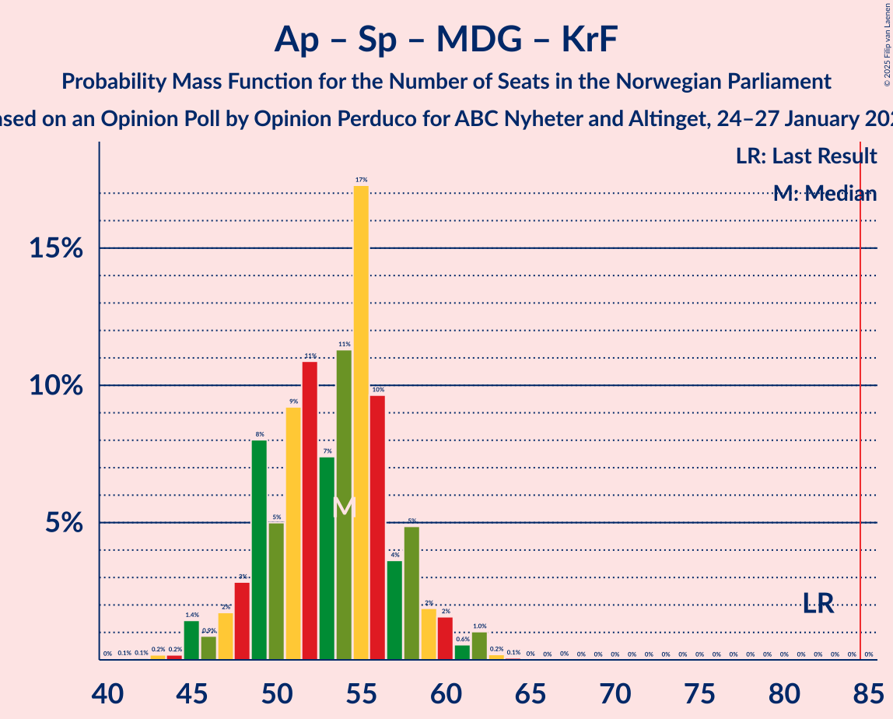

| Number of Seats | Probability | Accumulated | Special Marks |
|:---------------:|:-----------:|:-----------:|:-------------:|
| 41 | 0.1% | 100% |  |
| 42 | 0.1% | 99.9% |  |
| 43 | 0.2% | 99.8% |  |
| 44 | 0.2% | 99.7% |  |
| 45 | 1.4% | 99.5% |  |
| 46 | 0.9% | 98% |  |
| 47 | 2% | 97% |  |
| 48 | 3% | 95% |  |
| 49 | 8% | 93% |  |
| 50 | 5% | 85% |  |
| 51 | 9% | 80% |  |
| 52 | 11% | 70% |  |
| 53 | 7% | 59% | Median |
| 54 | 11% | 52% |  |
| 55 | 17% | 41% |  |
| 56 | 10% | 23% |  |
| 57 | 4% | 14% |  |
| 58 | 5% | 10% |  |
| 59 | 2% | 5% |  |
| 60 | 2% | 3% |  |
| 61 | 0.6% | 2% |  |
| 62 | 1.0% | 1.4% |  |
| 63 | 0.2% | 0.3% |  |
| 64 | 0.1% | 0.1% |  |
| 65 | 0% | 0.1% |  |
| 66 | 0% | 0% |  |
| 67 | 0% | 0% |  |
| 68 | 0% | 0% |  |
| 69 | 0% | 0% |  |
| 70 | 0% | 0% |  |
| 71 | 0% | 0% |  |
| 72 | 0% | 0% |  |
| 73 | 0% | 0% |  |
| 74 | 0% | 0% |  |
| 75 | 0% | 0% |  |
| 76 | 0% | 0% |  |
| 77 | 0% | 0% |  |
| 78 | 0% | 0% |  |
| 79 | 0% | 0% |  |
| 80 | 0% | 0% |  |
| 81 | 0% | 0% |  |
| 82 | 0% | 0% | Last Result |

### Arbeiderpartiet – Senterpartiet – Kristelig Folkeparti

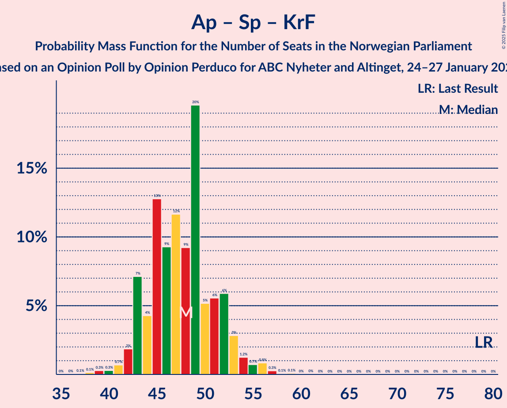

| Number of Seats | Probability | Accumulated | Special Marks |
|:---------------:|:-----------:|:-----------:|:-------------:|
| 36 | 0% | 100% |  |
| 37 | 0.1% | 99.9% |  |
| 38 | 0.1% | 99.9% |  |
| 39 | 0.3% | 99.7% |  |
| 40 | 0.3% | 99.5% |  |
| 41 | 0.7% | 99.2% |  |
| 42 | 2% | 98% |  |
| 43 | 7% | 97% |  |
| 44 | 4% | 90% |  |
| 45 | 13% | 85% |  |
| 46 | 9% | 72% |  |
| 47 | 12% | 63% | Median |
| 48 | 9% | 52% |  |
| 49 | 20% | 42% |  |
| 50 | 5% | 23% |  |
| 51 | 6% | 18% |  |
| 52 | 6% | 12% |  |
| 53 | 3% | 6% |  |
| 54 | 1.2% | 3% |  |
| 55 | 0.7% | 2% |  |
| 56 | 0.8% | 1.3% |  |
| 57 | 0.3% | 0.5% |  |
| 58 | 0.1% | 0.2% |  |
| 59 | 0.1% | 0.1% |  |
| 60 | 0% | 0.1% |  |
| 61 | 0% | 0% |  |
| 62 | 0% | 0% |  |
| 63 | 0% | 0% |  |
| 64 | 0% | 0% |  |
| 65 | 0% | 0% |  |
| 66 | 0% | 0% |  |
| 67 | 0% | 0% |  |
| 68 | 0% | 0% |  |
| 69 | 0% | 0% |  |
| 70 | 0% | 0% |  |
| 71 | 0% | 0% |  |
| 72 | 0% | 0% |  |
| 73 | 0% | 0% |  |
| 74 | 0% | 0% |  |
| 75 | 0% | 0% |  |
| 76 | 0% | 0% |  |
| 77 | 0% | 0% |  |
| 78 | 0% | 0% |  |
| 79 | 0% | 0% | Last Result |

### Arbeiderpartiet – Sosialistisk Venstreparti

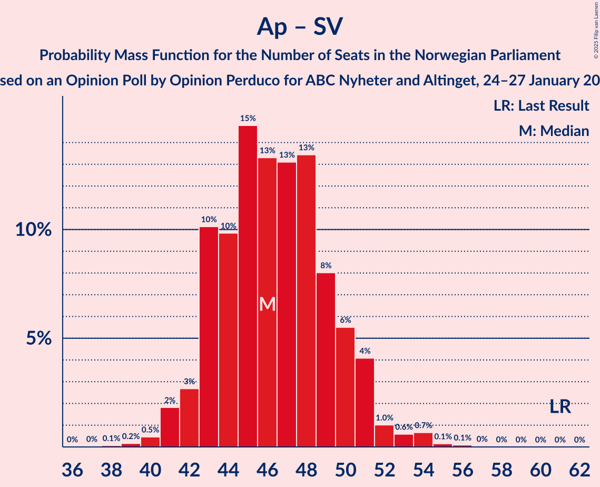

| Number of Seats | Probability | Accumulated | Special Marks |
|:---------------:|:-----------:|:-----------:|:-------------:|
| 38 | 0.1% | 100% |  |
| 39 | 0.2% | 99.9% |  |
| 40 | 0.5% | 99.7% |  |
| 41 | 2% | 99.3% |  |
| 42 | 3% | 97% |  |
| 43 | 10% | 95% |  |
| 44 | 10% | 85% |  |
| 45 | 15% | 75% |  |
| 46 | 13% | 60% | Median |
| 47 | 13% | 47% |  |
| 48 | 13% | 34% |  |
| 49 | 8% | 20% |  |
| 50 | 6% | 12% |  |
| 51 | 4% | 7% |  |
| 52 | 1.0% | 3% |  |
| 53 | 0.6% | 2% |  |
| 54 | 0.7% | 1.0% |  |
| 55 | 0.1% | 0.3% |  |
| 56 | 0.1% | 0.1% |  |
| 57 | 0% | 0% |  |
| 58 | 0% | 0% |  |
| 59 | 0% | 0% |  |
| 60 | 0% | 0% |  |
| 61 | 0% | 0% | Last Result |

### Arbeiderpartiet – Senterpartiet

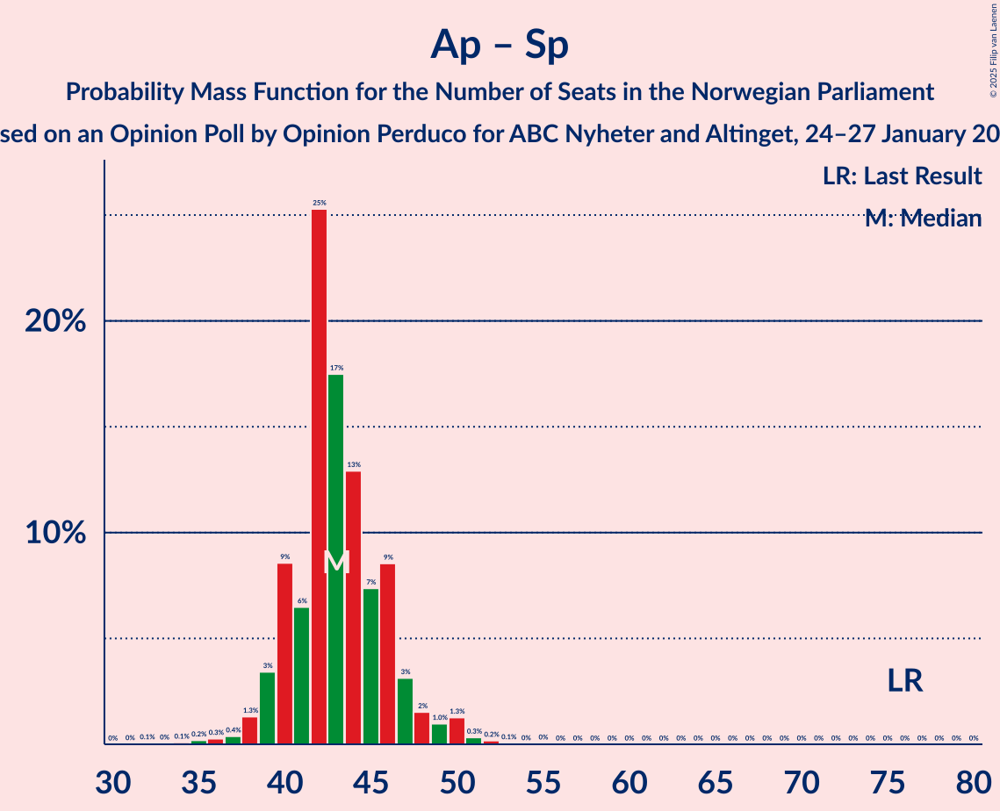

| Number of Seats | Probability | Accumulated | Special Marks |
|:---------------:|:-----------:|:-----------:|:-------------:|
| 32 | 0.1% | 100% |  |
| 33 | 0% | 99.9% |  |
| 34 | 0.1% | 99.9% |  |
| 35 | 0.2% | 99.8% |  |
| 36 | 0.3% | 99.6% |  |
| 37 | 0.4% | 99.3% |  |
| 38 | 1.3% | 98.9% |  |
| 39 | 3% | 98% |  |
| 40 | 9% | 94% |  |
| 41 | 6% | 86% |  |
| 42 | 25% | 79% | Median |
| 43 | 17% | 54% |  |
| 44 | 13% | 36% |  |
| 45 | 7% | 23% |  |
| 46 | 9% | 16% |  |
| 47 | 3% | 8% |  |
| 48 | 2% | 4% |  |
| 49 | 1.0% | 3% |  |
| 50 | 1.3% | 2% |  |
| 51 | 0.3% | 0.6% |  |
| 52 | 0.2% | 0.3% |  |
| 53 | 0.1% | 0.1% |  |
| 54 | 0% | 0.1% |  |
| 55 | 0% | 0.1% |  |
| 56 | 0% | 0% |  |
| 57 | 0% | 0% |  |
| 58 | 0% | 0% |  |
| 59 | 0% | 0% |  |
| 60 | 0% | 0% |  |
| 61 | 0% | 0% |  |
| 62 | 0% | 0% |  |
| 63 | 0% | 0% |  |
| 64 | 0% | 0% |  |
| 65 | 0% | 0% |  |
| 66 | 0% | 0% |  |
| 67 | 0% | 0% |  |
| 68 | 0% | 0% |  |
| 69 | 0% | 0% |  |
| 70 | 0% | 0% |  |
| 71 | 0% | 0% |  |
| 72 | 0% | 0% |  |
| 73 | 0% | 0% |  |
| 74 | 0% | 0% |  |
| 75 | 0% | 0% |  |
| 76 | 0% | 0% | Last Result |

### Senterpartiet – Venstre – Kristelig Folkeparti

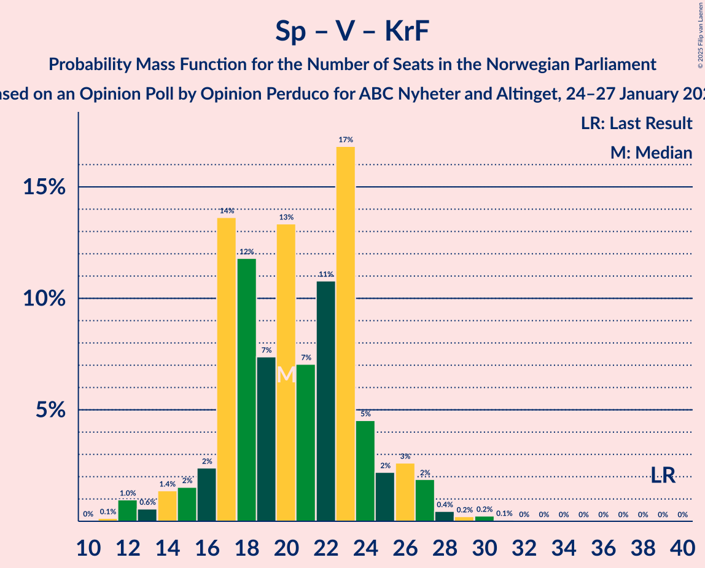

| Number of Seats | Probability | Accumulated | Special Marks |
|:---------------:|:-----------:|:-----------:|:-------------:|
| 11 | 0.1% | 100% |  |
| 12 | 1.0% | 99.8% |  |
| 13 | 0.6% | 98.9% |  |
| 14 | 1.4% | 98% |  |
| 15 | 2% | 97% |  |
| 16 | 2% | 95% |  |
| 17 | 14% | 93% |  |
| 18 | 12% | 79% |  |
| 19 | 7% | 68% |  |
| 20 | 13% | 60% | Median |
| 21 | 7% | 47% |  |
| 22 | 11% | 40% |  |
| 23 | 17% | 29% |  |
| 24 | 5% | 12% |  |
| 25 | 2% | 8% |  |
| 26 | 3% | 5% |  |
| 27 | 2% | 3% |  |
| 28 | 0.4% | 1.0% |  |
| 29 | 0.2% | 0.5% |  |
| 30 | 0.2% | 0.3% |  |
| 31 | 0.1% | 0.1% |  |
| 32 | 0% | 0% |  |
| 33 | 0% | 0% |  |
| 34 | 0% | 0% |  |
| 35 | 0% | 0% |  |
| 36 | 0% | 0% |  |
| 37 | 0% | 0% |  |
| 38 | 0% | 0% |  |
| 39 | 0% | 0% | Last Result |

## Technical Information

### Opinion Poll

+ **Polling firm:** Opinion Perduco
+ **Commissioner(s):** ABC Nyheter and Altinget
+ **Fieldwork period:** 24–27 January 2023

### Calculations

+ **Sample size:** 1003
+ **Simulations done:** 1,048,576
+ **Error estimate:** 2.15%

