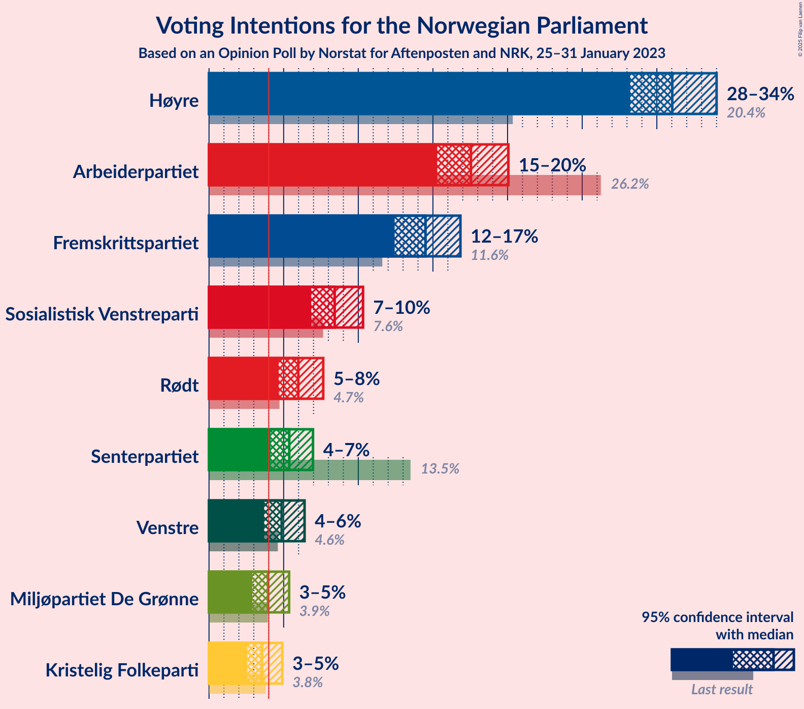
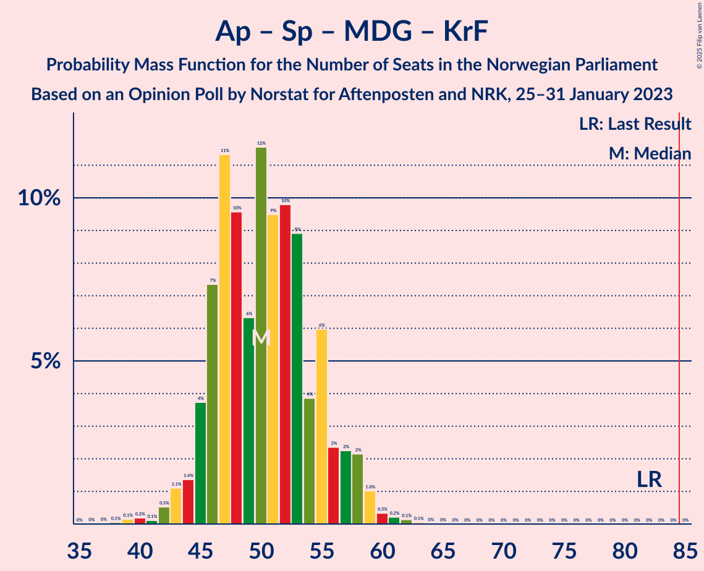
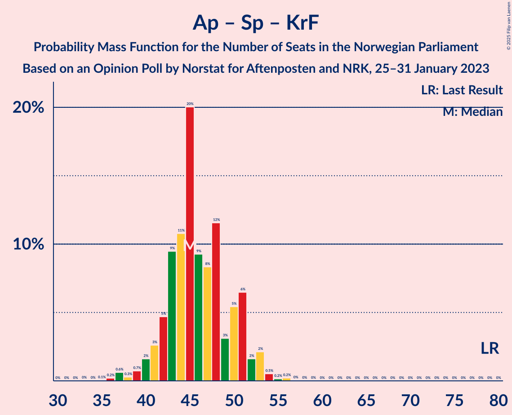

# Opinion Poll by Norstat for Aftenposten and NRK, 25–31 January 2023

<a href="#voting-intentions">Voting Intentions</a> | <a href="#seats">Seats</a> | <a href="#coalitions">Coalitions</a> | <a href="#technical-information">Technical Information</a>

## Voting Intentions

### Confidence Intervals

| Party | Last Result | Poll Result | 80% Confidence Interval | 90% Confidence Interval | 95% Confidence Interval | 99% Confidence Interval |
|:-----:|:-----------:|:-----------:|:-----------------------:|:-----------------------:|:-----------------------:|:-----------------------:|
| Høyre | 20.4% | 31.0% | 29.2–33.0% |28.7–33.5% |28.2–34.0% |27.3–34.9% |
| Arbeiderpartiet | 26.2% | 17.5% | 16.1–19.2% |15.7–19.6% |15.3–20.1% |14.6–20.9% |
| Fremskrittspartiet | 11.6% | 14.5% | 13.1–16.0% |12.8–16.5% |12.4–16.8% |11.8–17.6% |
| Sosialistisk Venstreparti | 7.6% | 8.4% | 7.4–9.7% |7.1–10.0% |6.8–10.3% |6.4–10.9% |
| Rødt | 4.7% | 6.0% | 5.1–7.1% |4.9–7.4% |4.7–7.7% |4.3–8.2% |
| Senterpartiet | 13.5% | 5.4% | 4.6–6.4% |4.3–6.7% |4.1–7.0% |3.8–7.5% |
| Venstre | 4.6% | 4.9% | 4.1–5.9% |3.9–6.2% |3.7–6.4% |3.4–6.9% |
| Miljøpartiet De Grønne | 3.9% | 4.0% | 3.3–4.9% |3.1–5.1% |2.9–5.4% |2.6–5.8% |
| Kristelig Folkeparti | 3.8% | 3.5% | 2.9–4.4% |2.7–4.7% |2.6–4.9% |2.3–5.4% |

*Note:* The poll result column reflects the actual value used in the calculations. Published results may vary slightly, and in addition be rounded to fewer digits.

## Seats

### Confidence Intervals

| Party | Last Result | Median | 80% Confidence Interval | 90% Confidence Interval | 95% Confidence Interval | 99% Confidence Interval |
|:-----:|:-----------:|:------:|:-----------------------:|:-----------------------:|:-----------------------:|:-----------------------:|
| <a href="#høyre">Høyre</a> | 36 | 54 | 51–59 |50–60 |49–61 |48–65 |
| <a href="#arbeiderpartiet">Arbeiderpartiet</a> | 48 | 34 | 32–37 |31–38 |30–39 |29–41 |
| <a href="#fremskrittspartiet">Fremskrittspartiet</a> | 21 | 27 | 23–31 |22–32 |21–33 |19–35 |
| <a href="#sosialistisk-venstreparti">Sosialistisk Venstreparti</a> | 13 | 13 | 10–16 |10–17 |10–17 |9–18 |
| <a href="#rødt">Rødt</a> | 8 | 9 | 7–11 |7–11 |7–12 |6–13 |
| <a href="#senterpartiet">Senterpartiet</a> | 28 | 8 | 6–11 |6–12 |5–13 |1–14 |
| <a href="#venstre">Venstre</a> | 8 | 7 | 6–9 |2–9 |2–10 |2–11 |
| <a href="#miljøpartiet-de-grønne">Miljøpartiet De Grønne</a> | 3 | 3 | 2–7 |2–8 |1–8 |1–9 |
| <a href="#kristelig-folkeparti">Kristelig Folkeparti</a> | 3 | 3 | 2–6 |2–7 |2–7 |1–8 |

### Høyre

*For a full overview of the results for this party, see the [Høyre](party-høyre.html) page.*

| Number of Seats | Probability | Accumulated | Special Marks |
|:---------------:|:-----------:|:-----------:|:-------------:|
| 36 | 0% | 100% | Last Result |
| 37 | 0% | 100% |  |
| 38 | 0% | 100% |  |
| 39 | 0% | 100% |  |
| 40 | 0% | 100% |  |
| 41 | 0% | 100% |  |
| 42 | 0% | 100% |  |
| 43 | 0% | 100% |  |
| 44 | 0% | 100% |  |
| 45 | 0% | 100% |  |
| 46 | 0% | 100% |  |
| 47 | 0.1% | 100% |  |
| 48 | 0.9% | 99.9% |  |
| 49 | 3% | 99.0% |  |
| 50 | 5% | 96% |  |
| 51 | 6% | 91% |  |
| 52 | 16% | 85% |  |
| 53 | 13% | 69% |  |
| 54 | 20% | 56% | Median |
| 55 | 7% | 37% |  |
| 56 | 8% | 30% |  |
| 57 | 6% | 22% |  |
| 58 | 5% | 16% |  |
| 59 | 3% | 12% |  |
| 60 | 4% | 8% |  |
| 61 | 2% | 5% |  |
| 62 | 1.1% | 2% |  |
| 63 | 0.4% | 1.3% |  |
| 64 | 0.4% | 0.9% |  |
| 65 | 0.2% | 0.5% |  |
| 66 | 0.2% | 0.3% |  |
| 67 | 0.1% | 0.1% |  |
| 68 | 0% | 0% |  |

### Arbeiderpartiet

*For a full overview of the results for this party, see the [Arbeiderpartiet](party-arbeiderpartiet.html) page.*

| Number of Seats | Probability | Accumulated | Special Marks |
|:---------------:|:-----------:|:-----------:|:-------------:|
| 27 | 0.1% | 100% |  |
| 28 | 0.2% | 99.9% |  |
| 29 | 0.8% | 99.7% |  |
| 30 | 3% | 98.9% |  |
| 31 | 5% | 95% |  |
| 32 | 7% | 91% |  |
| 33 | 21% | 84% |  |
| 34 | 28% | 62% | Median |
| 35 | 13% | 35% |  |
| 36 | 10% | 22% |  |
| 37 | 4% | 12% |  |
| 38 | 4% | 8% |  |
| 39 | 2% | 4% |  |
| 40 | 0.6% | 2% |  |
| 41 | 1.2% | 2% |  |
| 42 | 0.3% | 0.4% |  |
| 43 | 0.1% | 0.1% |  |
| 44 | 0% | 0% |  |
| 45 | 0% | 0% |  |
| 46 | 0% | 0% |  |
| 47 | 0% | 0% |  |
| 48 | 0% | 0% | Last Result |

### Fremskrittspartiet

*For a full overview of the results for this party, see the [Fremskrittspartiet](party-fremskrittspartiet.html) page.*

| Number of Seats | Probability | Accumulated | Special Marks |
|:---------------:|:-----------:|:-----------:|:-------------:|
| 18 | 0.3% | 100% |  |
| 19 | 0.3% | 99.7% |  |
| 20 | 0.5% | 99.4% |  |
| 21 | 2% | 98.8% | Last Result |
| 22 | 5% | 97% |  |
| 23 | 8% | 92% |  |
| 24 | 9% | 84% |  |
| 25 | 9% | 75% |  |
| 26 | 8% | 66% |  |
| 27 | 9% | 59% | Median |
| 28 | 15% | 50% |  |
| 29 | 10% | 35% |  |
| 30 | 9% | 26% |  |
| 31 | 6% | 16% |  |
| 32 | 6% | 10% |  |
| 33 | 2% | 4% |  |
| 34 | 1.0% | 2% |  |
| 35 | 0.5% | 0.8% |  |
| 36 | 0.3% | 0.3% |  |
| 37 | 0.1% | 0.1% |  |
| 38 | 0% | 0% |  |

### Sosialistisk Venstreparti

*For a full overview of the results for this party, see the [Sosialistisk Venstreparti](party-sosialistiskvenstreparti.html) page.*

| Number of Seats | Probability | Accumulated | Special Marks |
|:---------------:|:-----------:|:-----------:|:-------------:|
| 8 | 0.3% | 100% |  |
| 9 | 2% | 99.7% |  |
| 10 | 10% | 98% |  |
| 11 | 12% | 88% |  |
| 12 | 17% | 76% |  |
| 13 | 13% | 60% | Last Result, Median |
| 14 | 23% | 47% |  |
| 15 | 10% | 24% |  |
| 16 | 8% | 14% |  |
| 17 | 4% | 5% |  |
| 18 | 1.1% | 1.4% |  |
| 19 | 0.1% | 0.2% |  |
| 20 | 0.1% | 0.1% |  |
| 21 | 0% | 0% |  |

### Rødt

*For a full overview of the results for this party, see the [Rødt](party-rødt.html) page.*

| Number of Seats | Probability | Accumulated | Special Marks |
|:---------------:|:-----------:|:-----------:|:-------------:|
| 1 | 0.1% | 100% |  |
| 2 | 0% | 99.9% |  |
| 3 | 0% | 99.9% |  |
| 4 | 0% | 99.9% |  |
| 5 | 0.1% | 99.9% |  |
| 6 | 1.1% | 99.8% |  |
| 7 | 9% | 98.7% |  |
| 8 | 19% | 90% | Last Result |
| 9 | 27% | 71% | Median |
| 10 | 27% | 44% |  |
| 11 | 13% | 17% |  |
| 12 | 3% | 4% |  |
| 13 | 1.0% | 1.2% |  |
| 14 | 0.2% | 0.2% |  |
| 15 | 0% | 0% |  |

### Senterpartiet

*For a full overview of the results for this party, see the [Senterpartiet](party-senterpartiet.html) page.*

| Number of Seats | Probability | Accumulated | Special Marks |
|:---------------:|:-----------:|:-----------:|:-------------:|
| 0 | 0.4% | 100% |  |
| 1 | 1.2% | 99.6% |  |
| 2 | 0% | 98% |  |
| 3 | 0% | 98% |  |
| 4 | 0% | 98% |  |
| 5 | 1.2% | 98% |  |
| 6 | 8% | 97% |  |
| 7 | 22% | 89% |  |
| 8 | 29% | 67% | Median |
| 9 | 11% | 38% |  |
| 10 | 13% | 27% |  |
| 11 | 5% | 14% |  |
| 12 | 5% | 9% |  |
| 13 | 3% | 3% |  |
| 14 | 0.6% | 0.6% |  |
| 15 | 0.1% | 0.1% |  |
| 16 | 0% | 0% |  |
| 17 | 0% | 0% |  |
| 18 | 0% | 0% |  |
| 19 | 0% | 0% |  |
| 20 | 0% | 0% |  |
| 21 | 0% | 0% |  |
| 22 | 0% | 0% |  |
| 23 | 0% | 0% |  |
| 24 | 0% | 0% |  |
| 25 | 0% | 0% |  |
| 26 | 0% | 0% |  |
| 27 | 0% | 0% |  |
| 28 | 0% | 0% | Last Result |

### Venstre

*For a full overview of the results for this party, see the [Venstre](party-venstre.html) page.*

| Number of Seats | Probability | Accumulated | Special Marks |
|:---------------:|:-----------:|:-----------:|:-------------:|
| 2 | 5% | 100% |  |
| 3 | 3% | 95% |  |
| 4 | 0% | 92% |  |
| 5 | 0.2% | 92% |  |
| 6 | 13% | 92% |  |
| 7 | 33% | 79% | Median |
| 8 | 31% | 46% | Last Result |
| 9 | 10% | 15% |  |
| 10 | 3% | 4% |  |
| 11 | 0.7% | 0.9% |  |
| 12 | 0.2% | 0.2% |  |
| 13 | 0% | 0% |  |

### Miljøpartiet De Grønne

*For a full overview of the results for this party, see the [Miljøpartiet De Grønne](party-miljøpartietdegrønne.html) page.*

| Number of Seats | Probability | Accumulated | Special Marks |
|:---------------:|:-----------:|:-----------:|:-------------:|
| 1 | 4% | 100% |  |
| 2 | 35% | 96% |  |
| 3 | 12% | 61% | Last Result, Median |
| 4 | 0% | 48% |  |
| 5 | 3% | 48% |  |
| 6 | 20% | 45% |  |
| 7 | 19% | 26% |  |
| 8 | 6% | 7% |  |
| 9 | 0.7% | 0.8% |  |
| 10 | 0.1% | 0.1% |  |
| 11 | 0% | 0% |  |

### Kristelig Folkeparti

*For a full overview of the results for this party, see the [Kristelig Folkeparti](party-kristeligfolkeparti.html) page.*

| Number of Seats | Probability | Accumulated | Special Marks |
|:---------------:|:-----------:|:-----------:|:-------------:|
| 0 | 0.4% | 100% |  |
| 1 | 1.2% | 99.6% |  |
| 2 | 33% | 98% |  |
| 3 | 41% | 66% | Last Result, Median |
| 4 | 0% | 25% |  |
| 5 | 3% | 25% |  |
| 6 | 13% | 22% |  |
| 7 | 8% | 9% |  |
| 8 | 1.0% | 1.2% |  |
| 9 | 0.2% | 0.2% |  |
| 10 | 0% | 0% |  |

## Coalitions

### Confidence Intervals

| Coalition | Last Result | Median | Majority? | 80% Confidence Interval | 90% Confidence Interval | 95% Confidence Interval | 99% Confidence Interval |
|:---------:|:-----------:|:------:|:---------:|:-----------------------:|:-----------------------:|:-----------------------:|:-----------------------:|
| Høyre – Fremskrittspartiet – Senterpartiet – Venstre – Kristelig Folkeparti | 96 | 100 | 100% | 96–105 | 94–107 | 94–108 | 92–110 |
| Høyre – Fremskrittspartiet – Venstre – Miljøpartiet De Grønne – Kristelig Folkeparti | 71 | 96 | 100% | 91–102 | 89–103 | 88–105 | 86–108 |
| Høyre – Fremskrittspartiet – Venstre – Kristelig Folkeparti | 68 | 92 | 97% | 86–97 | 86–99 | 84–100 | 82–103 |
| Høyre – Fremskrittspartiet – Venstre | 65 | 89 | 80% | 83–94 | 83–95 | 81–97 | 79–99 |
| Høyre – Fremskrittspartiet | 57 | 81 | 23% | 76–86 | 76–88 | 75–89 | 72–92 |
| Arbeiderpartiet – Sosialistisk Venstreparti – Rødt – Senterpartiet – Miljøpartiet De Grønne | 100 | 69 | 0% | 64–75 | 63–76 | 61–78 | 58–80 |
| Høyre – Venstre – Kristelig Folkeparti | 47 | 65 | 0% | 60–70 | 59–72 | 58–74 | 57–76 |
| Arbeiderpartiet – Sosialistisk Venstreparti – Rødt – Senterpartiet | 97 | 65 | 0% | 59–71 | 58–72 | 57–72 | 55–76 |
| Arbeiderpartiet – Sosialistisk Venstreparti – Senterpartiet – Miljøpartiet De Grønne – Kristelig Folkeparti | 95 | 63 | 0% | 58–69 | 57–70 | 56–72 | 53–75 |
| Arbeiderpartiet – Sosialistisk Venstreparti – Rødt – Miljøpartiet De Grønne | 72 | 61 | 0% | 56–66 | 54–67 | 54–68 | 52–71 |
| Arbeiderpartiet – Sosialistisk Venstreparti – Senterpartiet – Miljøpartiet De Grønne | 92 | 60 | 0% | 55–65 | 54–66 | 53–67 | 50–70 |
| Arbeiderpartiet – Sosialistisk Venstreparti – Senterpartiet | 89 | 56 | 0% | 51–61 | 50–61 | 49–62 | 46–64 |
| Arbeiderpartiet – Senterpartiet – Miljøpartiet De Grønne – Kristelig Folkeparti | 82 | 50 | 0% | 46–55 | 45–57 | 44–58 | 41–60 |
| Arbeiderpartiet – Sosialistisk Venstreparti | 61 | 47 | 0% | 44–51 | 43–52 | 42–54 | 40–55 |
| Arbeiderpartiet – Senterpartiet – Kristelig Folkeparti | 79 | 45 | 0% | 42–51 | 41–51 | 40–53 | 37–54 |
| Arbeiderpartiet – Senterpartiet | 76 | 42 | 0% | 40–46 | 39–47 | 37–48 | 34–50 |
| Senterpartiet – Venstre – Kristelig Folkeparti | 39 | 19 | 0% | 15–23 | 14–24 | 13–26 | 10–27 |

### Høyre – Fremskrittspartiet – Senterpartiet – Venstre – Kristelig Folkeparti

| Number of Seats | Probability | Accumulated | Special Marks |
|:---------------:|:-----------:|:-----------:|:-------------:|
| 88 | 0% | 100% |  |
| 89 | 0.1% | 99.9% |  |
| 90 | 0.2% | 99.9% |  |
| 91 | 0.1% | 99.6% |  |
| 92 | 0.4% | 99.5% |  |
| 93 | 1.2% | 99.1% |  |
| 94 | 5% | 98% |  |
| 95 | 3% | 93% |  |
| 96 | 8% | 90% | Last Result |
| 97 | 8% | 82% |  |
| 98 | 8% | 75% |  |
| 99 | 8% | 67% | Median |
| 100 | 10% | 59% |  |
| 101 | 11% | 48% |  |
| 102 | 7% | 38% |  |
| 103 | 7% | 31% |  |
| 104 | 6% | 24% |  |
| 105 | 9% | 18% |  |
| 106 | 1.5% | 9% |  |
| 107 | 4% | 8% |  |
| 108 | 1.4% | 4% |  |
| 109 | 2% | 2% |  |
| 110 | 0.6% | 0.9% |  |
| 111 | 0.2% | 0.3% |  |
| 112 | 0.1% | 0.1% |  |
| 113 | 0% | 0% |  |

### Høyre – Fremskrittspartiet – Venstre – Miljøpartiet De Grønne – Kristelig Folkeparti

| Number of Seats | Probability | Accumulated | Special Marks |
|:---------------:|:-----------:|:-----------:|:-------------:|
| 71 | 0% | 100% | Last Result |
| 72 | 0% | 100% |  |
| 73 | 0% | 100% |  |
| 74 | 0% | 100% |  |
| 75 | 0% | 100% |  |
| 76 | 0% | 100% |  |
| 77 | 0% | 100% |  |
| 78 | 0% | 100% |  |
| 79 | 0% | 100% |  |
| 80 | 0% | 100% |  |
| 81 | 0% | 100% |  |
| 82 | 0% | 100% |  |
| 83 | 0% | 100% |  |
| 84 | 0% | 100% |  |
| 85 | 0.2% | 100% | Majority |
| 86 | 0.3% | 99.7% |  |
| 87 | 0.6% | 99.5% |  |
| 88 | 4% | 98.9% |  |
| 89 | 2% | 95% |  |
| 90 | 3% | 93% |  |
| 91 | 3% | 91% |  |
| 92 | 3% | 88% |  |
| 93 | 9% | 85% |  |
| 94 | 9% | 76% | Median |
| 95 | 9% | 67% |  |
| 96 | 8% | 57% |  |
| 97 | 8% | 50% |  |
| 98 | 10% | 42% |  |
| 99 | 10% | 31% |  |
| 100 | 4% | 21% |  |
| 101 | 4% | 17% |  |
| 102 | 6% | 13% |  |
| 103 | 2% | 6% |  |
| 104 | 1.0% | 4% |  |
| 105 | 2% | 3% |  |
| 106 | 0.4% | 1.4% |  |
| 107 | 0.3% | 1.0% |  |
| 108 | 0.2% | 0.7% |  |
| 109 | 0.3% | 0.4% |  |
| 110 | 0.2% | 0.2% |  |
| 111 | 0% | 0% |  |

### Høyre – Fremskrittspartiet – Venstre – Kristelig Folkeparti

| Number of Seats | Probability | Accumulated | Special Marks |
|:---------------:|:-----------:|:-----------:|:-------------:|
| 68 | 0% | 100% | Last Result |
| 69 | 0% | 100% |  |
| 70 | 0% | 100% |  |
| 71 | 0% | 100% |  |
| 72 | 0% | 100% |  |
| 73 | 0% | 100% |  |
| 74 | 0% | 100% |  |
| 75 | 0% | 100% |  |
| 76 | 0% | 100% |  |
| 77 | 0% | 100% |  |
| 78 | 0% | 100% |  |
| 79 | 0% | 100% |  |
| 80 | 0.1% | 99.9% |  |
| 81 | 0.1% | 99.8% |  |
| 82 | 0.6% | 99.7% |  |
| 83 | 0.6% | 99.2% |  |
| 84 | 1.5% | 98.6% |  |
| 85 | 1.4% | 97% | Majority |
| 86 | 6% | 96% |  |
| 87 | 8% | 89% |  |
| 88 | 4% | 82% |  |
| 89 | 6% | 78% |  |
| 90 | 5% | 72% |  |
| 91 | 10% | 67% | Median |
| 92 | 11% | 57% |  |
| 93 | 11% | 45% |  |
| 94 | 5% | 34% |  |
| 95 | 8% | 29% |  |
| 96 | 4% | 21% |  |
| 97 | 8% | 18% |  |
| 98 | 3% | 10% |  |
| 99 | 3% | 7% |  |
| 100 | 1.3% | 4% |  |
| 101 | 1.1% | 2% |  |
| 102 | 0.6% | 1.3% |  |
| 103 | 0.3% | 0.6% |  |
| 104 | 0.2% | 0.3% |  |
| 105 | 0.1% | 0.1% |  |
| 106 | 0% | 0.1% |  |
| 107 | 0% | 0% |  |

### Høyre – Fremskrittspartiet – Venstre

| Number of Seats | Probability | Accumulated | Special Marks |
|:---------------:|:-----------:|:-----------:|:-------------:|
| 65 | 0% | 100% | Last Result |
| 66 | 0% | 100% |  |
| 67 | 0% | 100% |  |
| 68 | 0% | 100% |  |
| 69 | 0% | 100% |  |
| 70 | 0% | 100% |  |
| 71 | 0% | 100% |  |
| 72 | 0% | 100% |  |
| 73 | 0% | 100% |  |
| 74 | 0% | 100% |  |
| 75 | 0% | 100% |  |
| 76 | 0% | 100% |  |
| 77 | 0.1% | 99.9% |  |
| 78 | 0.1% | 99.8% |  |
| 79 | 0.4% | 99.7% |  |
| 80 | 1.0% | 99.4% |  |
| 81 | 1.1% | 98% |  |
| 82 | 2% | 97% |  |
| 83 | 9% | 95% |  |
| 84 | 6% | 86% |  |
| 85 | 5% | 80% | Majority |
| 86 | 7% | 75% |  |
| 87 | 6% | 68% |  |
| 88 | 8% | 62% | Median |
| 89 | 13% | 54% |  |
| 90 | 8% | 41% |  |
| 91 | 7% | 33% |  |
| 92 | 7% | 26% |  |
| 93 | 4% | 19% |  |
| 94 | 9% | 15% |  |
| 95 | 3% | 6% |  |
| 96 | 0.7% | 3% |  |
| 97 | 0.4% | 3% |  |
| 98 | 1.4% | 2% |  |
| 99 | 0.4% | 0.8% |  |
| 100 | 0.3% | 0.4% |  |
| 101 | 0% | 0.1% |  |
| 102 | 0.1% | 0.1% |  |
| 103 | 0% | 0% |  |

### Høyre – Fremskrittspartiet

| Number of Seats | Probability | Accumulated | Special Marks |
|:---------------:|:-----------:|:-----------:|:-------------:|
| 57 | 0% | 100% | Last Result |
| 58 | 0% | 100% |  |
| 59 | 0% | 100% |  |
| 60 | 0% | 100% |  |
| 61 | 0% | 100% |  |
| 62 | 0% | 100% |  |
| 63 | 0% | 100% |  |
| 64 | 0% | 100% |  |
| 65 | 0% | 100% |  |
| 66 | 0% | 100% |  |
| 67 | 0% | 100% |  |
| 68 | 0% | 100% |  |
| 69 | 0% | 100% |  |
| 70 | 0% | 100% |  |
| 71 | 0.3% | 99.9% |  |
| 72 | 0.6% | 99.7% |  |
| 73 | 0.4% | 99.1% |  |
| 74 | 1.1% | 98.6% |  |
| 75 | 2% | 98% |  |
| 76 | 10% | 95% |  |
| 77 | 5% | 86% |  |
| 78 | 5% | 81% |  |
| 79 | 8% | 75% |  |
| 80 | 3% | 67% |  |
| 81 | 14% | 64% | Median |
| 82 | 11% | 49% |  |
| 83 | 8% | 38% |  |
| 84 | 7% | 30% |  |
| 85 | 5% | 23% | Majority |
| 86 | 11% | 19% |  |
| 87 | 2% | 8% |  |
| 88 | 2% | 6% |  |
| 89 | 1.4% | 4% |  |
| 90 | 0.5% | 2% |  |
| 91 | 0.4% | 2% |  |
| 92 | 1.1% | 1.4% |  |
| 93 | 0.1% | 0.3% |  |
| 94 | 0.1% | 0.2% |  |
| 95 | 0% | 0.1% |  |
| 96 | 0% | 0% |  |

### Arbeiderpartiet – Sosialistisk Venstreparti – Rødt – Senterpartiet – Miljøpartiet De Grønne

| Number of Seats | Probability | Accumulated | Special Marks |
|:---------------:|:-----------:|:-----------:|:-------------:|
| 57 | 0.2% | 100% |  |
| 58 | 0.3% | 99.8% |  |
| 59 | 0.2% | 99.5% |  |
| 60 | 1.4% | 99.2% |  |
| 61 | 0.5% | 98% |  |
| 62 | 2% | 97% |  |
| 63 | 4% | 95% |  |
| 64 | 8% | 91% |  |
| 65 | 5% | 84% |  |
| 66 | 5% | 79% |  |
| 67 | 10% | 74% | Median |
| 68 | 5% | 63% |  |
| 69 | 13% | 58% |  |
| 70 | 8% | 45% |  |
| 71 | 7% | 37% |  |
| 72 | 4% | 31% |  |
| 73 | 5% | 27% |  |
| 74 | 10% | 22% |  |
| 75 | 6% | 11% |  |
| 76 | 1.5% | 5% |  |
| 77 | 1.3% | 4% |  |
| 78 | 1.2% | 3% |  |
| 79 | 0.8% | 1.5% |  |
| 80 | 0.2% | 0.7% |  |
| 81 | 0.2% | 0.4% |  |
| 82 | 0.2% | 0.2% |  |
| 83 | 0% | 0.1% |  |
| 84 | 0% | 0.1% |  |
| 85 | 0% | 0% | Majority |
| 86 | 0% | 0% |  |
| 87 | 0% | 0% |  |
| 88 | 0% | 0% |  |
| 89 | 0% | 0% |  |
| 90 | 0% | 0% |  |
| 91 | 0% | 0% |  |
| 92 | 0% | 0% |  |
| 93 | 0% | 0% |  |
| 94 | 0% | 0% |  |
| 95 | 0% | 0% |  |
| 96 | 0% | 0% |  |
| 97 | 0% | 0% |  |
| 98 | 0% | 0% |  |
| 99 | 0% | 0% |  |
| 100 | 0% | 0% | Last Result |

### Høyre – Venstre – Kristelig Folkeparti

| Number of Seats | Probability | Accumulated | Special Marks |
|:---------------:|:-----------:|:-----------:|:-------------:|
| 47 | 0% | 100% | Last Result |
| 48 | 0% | 100% |  |
| 49 | 0% | 100% |  |
| 50 | 0% | 100% |  |
| 51 | 0% | 100% |  |
| 52 | 0% | 100% |  |
| 53 | 0% | 100% |  |
| 54 | 0.1% | 100% |  |
| 55 | 0.1% | 99.9% |  |
| 56 | 0.3% | 99.8% |  |
| 57 | 0.8% | 99.5% |  |
| 58 | 3% | 98.7% |  |
| 59 | 3% | 95% |  |
| 60 | 3% | 93% |  |
| 61 | 4% | 90% |  |
| 62 | 10% | 85% |  |
| 63 | 14% | 75% |  |
| 64 | 9% | 61% | Median |
| 65 | 14% | 52% |  |
| 66 | 6% | 38% |  |
| 67 | 9% | 32% |  |
| 68 | 4% | 23% |  |
| 69 | 8% | 19% |  |
| 70 | 3% | 10% |  |
| 71 | 2% | 8% |  |
| 72 | 2% | 6% |  |
| 73 | 2% | 4% |  |
| 74 | 2% | 3% |  |
| 75 | 0.3% | 0.8% |  |
| 76 | 0.2% | 0.5% |  |
| 77 | 0.2% | 0.4% |  |
| 78 | 0.1% | 0.2% |  |
| 79 | 0% | 0.1% |  |
| 80 | 0.1% | 0.1% |  |
| 81 | 0% | 0% |  |

### Arbeiderpartiet – Sosialistisk Venstreparti – Rødt – Senterpartiet

| Number of Seats | Probability | Accumulated | Special Marks |
|:---------------:|:-----------:|:-----------:|:-------------:|
| 53 | 0.1% | 100% |  |
| 54 | 0.2% | 99.9% |  |
| 55 | 0.4% | 99.6% |  |
| 56 | 0.6% | 99.3% |  |
| 57 | 2% | 98.7% |  |
| 58 | 2% | 96% |  |
| 59 | 6% | 95% |  |
| 60 | 5% | 89% |  |
| 61 | 4% | 85% |  |
| 62 | 8% | 81% |  |
| 63 | 10% | 73% |  |
| 64 | 7% | 63% | Median |
| 65 | 11% | 55% |  |
| 66 | 9% | 44% |  |
| 67 | 10% | 35% |  |
| 68 | 8% | 25% |  |
| 69 | 3% | 17% |  |
| 70 | 2% | 14% |  |
| 71 | 4% | 11% |  |
| 72 | 5% | 8% |  |
| 73 | 0.9% | 2% |  |
| 74 | 0.6% | 2% |  |
| 75 | 0.2% | 1.0% |  |
| 76 | 0.3% | 0.8% |  |
| 77 | 0.4% | 0.5% |  |
| 78 | 0% | 0.1% |  |
| 79 | 0% | 0% |  |
| 80 | 0% | 0% |  |
| 81 | 0% | 0% |  |
| 82 | 0% | 0% |  |
| 83 | 0% | 0% |  |
| 84 | 0% | 0% |  |
| 85 | 0% | 0% | Majority |
| 86 | 0% | 0% |  |
| 87 | 0% | 0% |  |
| 88 | 0% | 0% |  |
| 89 | 0% | 0% |  |
| 90 | 0% | 0% |  |
| 91 | 0% | 0% |  |
| 92 | 0% | 0% |  |
| 93 | 0% | 0% |  |
| 94 | 0% | 0% |  |
| 95 | 0% | 0% |  |
| 96 | 0% | 0% |  |
| 97 | 0% | 0% | Last Result |

### Arbeiderpartiet – Sosialistisk Venstreparti – Senterpartiet – Miljøpartiet De Grønne – Kristelig Folkeparti

| Number of Seats | Probability | Accumulated | Special Marks |
|:---------------:|:-----------:|:-----------:|:-------------:|
| 50 | 0% | 100% |  |
| 51 | 0.1% | 99.9% |  |
| 52 | 0.1% | 99.8% |  |
| 53 | 0.3% | 99.8% |  |
| 54 | 0.4% | 99.5% |  |
| 55 | 1.4% | 99.1% |  |
| 56 | 1.2% | 98% |  |
| 57 | 2% | 97% |  |
| 58 | 6% | 95% |  |
| 59 | 4% | 89% |  |
| 60 | 7% | 84% |  |
| 61 | 15% | 78% | Median |
| 62 | 7% | 63% |  |
| 63 | 9% | 56% |  |
| 64 | 6% | 48% |  |
| 65 | 9% | 42% |  |
| 66 | 10% | 32% |  |
| 67 | 6% | 22% |  |
| 68 | 4% | 16% |  |
| 69 | 5% | 12% |  |
| 70 | 3% | 7% |  |
| 71 | 1.3% | 4% |  |
| 72 | 2% | 3% |  |
| 73 | 0.6% | 1.3% |  |
| 74 | 0.2% | 0.7% |  |
| 75 | 0.2% | 0.5% |  |
| 76 | 0.2% | 0.3% |  |
| 77 | 0.1% | 0.1% |  |
| 78 | 0% | 0% |  |
| 79 | 0% | 0% |  |
| 80 | 0% | 0% |  |
| 81 | 0% | 0% |  |
| 82 | 0% | 0% |  |
| 83 | 0% | 0% |  |
| 84 | 0% | 0% |  |
| 85 | 0% | 0% | Majority |
| 86 | 0% | 0% |  |
| 87 | 0% | 0% |  |
| 88 | 0% | 0% |  |
| 89 | 0% | 0% |  |
| 90 | 0% | 0% |  |
| 91 | 0% | 0% |  |
| 92 | 0% | 0% |  |
| 93 | 0% | 0% |  |
| 94 | 0% | 0% |  |
| 95 | 0% | 0% | Last Result |

### Arbeiderpartiet – Sosialistisk Venstreparti – Rødt – Miljøpartiet De Grønne

| Number of Seats | Probability | Accumulated | Special Marks |
|:---------------:|:-----------:|:-----------:|:-------------:|
| 49 | 0% | 100% |  |
| 50 | 0.1% | 99.9% |  |
| 51 | 0.3% | 99.9% |  |
| 52 | 1.1% | 99.6% |  |
| 53 | 0.7% | 98.6% |  |
| 54 | 3% | 98% |  |
| 55 | 2% | 95% |  |
| 56 | 7% | 93% |  |
| 57 | 7% | 86% |  |
| 58 | 7% | 79% |  |
| 59 | 10% | 72% | Median |
| 60 | 10% | 62% |  |
| 61 | 4% | 52% |  |
| 62 | 13% | 48% |  |
| 63 | 7% | 34% |  |
| 64 | 10% | 28% |  |
| 65 | 5% | 17% |  |
| 66 | 5% | 12% |  |
| 67 | 5% | 8% |  |
| 68 | 1.3% | 3% |  |
| 69 | 0.8% | 2% |  |
| 70 | 0.3% | 0.9% |  |
| 71 | 0.3% | 0.6% |  |
| 72 | 0.2% | 0.3% | Last Result |
| 73 | 0% | 0.1% |  |
| 74 | 0% | 0.1% |  |
| 75 | 0% | 0% |  |

### Arbeiderpartiet – Sosialistisk Venstreparti – Senterpartiet – Miljøpartiet De Grønne

| Number of Seats | Probability | Accumulated | Special Marks |
|:---------------:|:-----------:|:-----------:|:-------------:|
| 48 | 0.1% | 100% |  |
| 49 | 0.1% | 99.8% |  |
| 50 | 0.3% | 99.7% |  |
| 51 | 0.3% | 99.4% |  |
| 52 | 1.5% | 99.1% |  |
| 53 | 1.0% | 98% |  |
| 54 | 4% | 97% |  |
| 55 | 7% | 93% |  |
| 56 | 4% | 86% |  |
| 57 | 8% | 82% |  |
| 58 | 12% | 74% | Median |
| 59 | 10% | 62% |  |
| 60 | 9% | 52% |  |
| 61 | 7% | 43% |  |
| 62 | 4% | 36% |  |
| 63 | 11% | 32% |  |
| 64 | 8% | 21% |  |
| 65 | 5% | 12% |  |
| 66 | 3% | 7% |  |
| 67 | 2% | 4% |  |
| 68 | 0.9% | 2% |  |
| 69 | 0.8% | 1.3% |  |
| 70 | 0.3% | 0.5% |  |
| 71 | 0.1% | 0.2% |  |
| 72 | 0.1% | 0.2% |  |
| 73 | 0% | 0.1% |  |
| 74 | 0% | 0% |  |
| 75 | 0% | 0% |  |
| 76 | 0% | 0% |  |
| 77 | 0% | 0% |  |
| 78 | 0% | 0% |  |
| 79 | 0% | 0% |  |
| 80 | 0% | 0% |  |
| 81 | 0% | 0% |  |
| 82 | 0% | 0% |  |
| 83 | 0% | 0% |  |
| 84 | 0% | 0% |  |
| 85 | 0% | 0% | Majority |
| 86 | 0% | 0% |  |
| 87 | 0% | 0% |  |
| 88 | 0% | 0% |  |
| 89 | 0% | 0% |  |
| 90 | 0% | 0% |  |
| 91 | 0% | 0% |  |
| 92 | 0% | 0% | Last Result |

### Arbeiderpartiet – Sosialistisk Venstreparti – Senterpartiet

| Number of Seats | Probability | Accumulated | Special Marks |
|:---------------:|:-----------:|:-----------:|:-------------:|
| 45 | 0.1% | 100% |  |
| 46 | 0.5% | 99.9% |  |
| 47 | 0.5% | 99.4% |  |
| 48 | 0.6% | 98.9% |  |
| 49 | 1.1% | 98% |  |
| 50 | 5% | 97% |  |
| 51 | 5% | 92% |  |
| 52 | 6% | 87% |  |
| 53 | 7% | 81% |  |
| 54 | 11% | 74% |  |
| 55 | 11% | 64% | Median |
| 56 | 12% | 52% |  |
| 57 | 12% | 41% |  |
| 58 | 9% | 28% |  |
| 59 | 5% | 20% |  |
| 60 | 3% | 15% |  |
| 61 | 8% | 12% |  |
| 62 | 2% | 4% |  |
| 63 | 0.8% | 2% |  |
| 64 | 1.3% | 2% |  |
| 65 | 0.1% | 0.3% |  |
| 66 | 0.1% | 0.2% |  |
| 67 | 0.1% | 0.1% |  |
| 68 | 0% | 0% |  |
| 69 | 0% | 0% |  |
| 70 | 0% | 0% |  |
| 71 | 0% | 0% |  |
| 72 | 0% | 0% |  |
| 73 | 0% | 0% |  |
| 74 | 0% | 0% |  |
| 75 | 0% | 0% |  |
| 76 | 0% | 0% |  |
| 77 | 0% | 0% |  |
| 78 | 0% | 0% |  |
| 79 | 0% | 0% |  |
| 80 | 0% | 0% |  |
| 81 | 0% | 0% |  |
| 82 | 0% | 0% |  |
| 83 | 0% | 0% |  |
| 84 | 0% | 0% |  |
| 85 | 0% | 0% | Majority |
| 86 | 0% | 0% |  |
| 87 | 0% | 0% |  |
| 88 | 0% | 0% |  |
| 89 | 0% | 0% | Last Result |

### Arbeiderpartiet – Senterpartiet – Miljøpartiet De Grønne – Kristelig Folkeparti

| Number of Seats | Probability | Accumulated | Special Marks |
|:---------------:|:-----------:|:-----------:|:-------------:|
| 38 | 0.1% | 100% |  |
| 39 | 0.1% | 99.9% |  |
| 40 | 0.2% | 99.8% |  |
| 41 | 0.1% | 99.6% |  |
| 42 | 0.5% | 99.5% |  |
| 43 | 1.1% | 98.9% |  |
| 44 | 1.4% | 98% |  |
| 45 | 4% | 96% |  |
| 46 | 7% | 93% |  |
| 47 | 11% | 85% |  |
| 48 | 10% | 74% | Median |
| 49 | 6% | 64% |  |
| 50 | 12% | 58% |  |
| 51 | 9% | 47% |  |
| 52 | 10% | 37% |  |
| 53 | 9% | 27% |  |
| 54 | 4% | 18% |  |
| 55 | 6% | 15% |  |
| 56 | 2% | 9% |  |
| 57 | 2% | 6% |  |
| 58 | 2% | 4% |  |
| 59 | 1.0% | 2% |  |
| 60 | 0.3% | 0.8% |  |
| 61 | 0.2% | 0.4% |  |
| 62 | 0.1% | 0.2% |  |
| 63 | 0.1% | 0.1% |  |
| 64 | 0% | 0% |  |
| 65 | 0% | 0% |  |
| 66 | 0% | 0% |  |
| 67 | 0% | 0% |  |
| 68 | 0% | 0% |  |
| 69 | 0% | 0% |  |
| 70 | 0% | 0% |  |
| 71 | 0% | 0% |  |
| 72 | 0% | 0% |  |
| 73 | 0% | 0% |  |
| 74 | 0% | 0% |  |
| 75 | 0% | 0% |  |
| 76 | 0% | 0% |  |
| 77 | 0% | 0% |  |
| 78 | 0% | 0% |  |
| 79 | 0% | 0% |  |
| 80 | 0% | 0% |  |
| 81 | 0% | 0% |  |
| 82 | 0% | 0% | Last Result |

### Arbeiderpartiet – Sosialistisk Venstreparti

| Number of Seats | Probability | Accumulated | Special Marks |
|:---------------:|:-----------:|:-----------:|:-------------:|
| 38 | 0.1% | 100% |  |
| 39 | 0.2% | 99.9% |  |
| 40 | 0.3% | 99.7% |  |
| 41 | 0.9% | 99.4% |  |
| 42 | 2% | 98% |  |
| 43 | 6% | 96% |  |
| 44 | 8% | 91% |  |
| 45 | 12% | 83% |  |
| 46 | 12% | 71% |  |
| 47 | 9% | 59% | Median |
| 48 | 17% | 50% |  |
| 49 | 10% | 33% |  |
| 50 | 10% | 23% |  |
| 51 | 6% | 13% |  |
| 52 | 3% | 7% |  |
| 53 | 1.3% | 4% |  |
| 54 | 2% | 3% |  |
| 55 | 0.7% | 1.0% |  |
| 56 | 0.2% | 0.3% |  |
| 57 | 0.1% | 0.1% |  |
| 58 | 0% | 0% |  |
| 59 | 0% | 0% |  |
| 60 | 0% | 0% |  |
| 61 | 0% | 0% | Last Result |

### Arbeiderpartiet – Senterpartiet – Kristelig Folkeparti

| Number of Seats | Probability | Accumulated | Special Marks |
|:---------------:|:-----------:|:-----------:|:-------------:|
| 35 | 0.1% | 100% |  |
| 36 | 0.2% | 99.9% |  |
| 37 | 0.6% | 99.7% |  |
| 38 | 0.3% | 99.1% |  |
| 39 | 0.7% | 98.8% |  |
| 40 | 2% | 98% |  |
| 41 | 3% | 96% |  |
| 42 | 5% | 94% |  |
| 43 | 9% | 89% |  |
| 44 | 11% | 80% |  |
| 45 | 20% | 69% | Median |
| 46 | 9% | 49% |  |
| 47 | 8% | 40% |  |
| 48 | 12% | 31% |  |
| 49 | 3% | 20% |  |
| 50 | 5% | 17% |  |
| 51 | 6% | 11% |  |
| 52 | 2% | 5% |  |
| 53 | 2% | 3% |  |
| 54 | 0.5% | 1.0% |  |
| 55 | 0.2% | 0.4% |  |
| 56 | 0.2% | 0.3% |  |
| 57 | 0% | 0.1% |  |
| 58 | 0% | 0% |  |
| 59 | 0% | 0% |  |
| 60 | 0% | 0% |  |
| 61 | 0% | 0% |  |
| 62 | 0% | 0% |  |
| 63 | 0% | 0% |  |
| 64 | 0% | 0% |  |
| 65 | 0% | 0% |  |
| 66 | 0% | 0% |  |
| 67 | 0% | 0% |  |
| 68 | 0% | 0% |  |
| 69 | 0% | 0% |  |
| 70 | 0% | 0% |  |
| 71 | 0% | 0% |  |
| 72 | 0% | 0% |  |
| 73 | 0% | 0% |  |
| 74 | 0% | 0% |  |
| 75 | 0% | 0% |  |
| 76 | 0% | 0% |  |
| 77 | 0% | 0% |  |
| 78 | 0% | 0% |  |
| 79 | 0% | 0% | Last Result |

### Arbeiderpartiet – Senterpartiet

| Number of Seats | Probability | Accumulated | Special Marks |
|:---------------:|:-----------:|:-----------:|:-------------:|
| 32 | 0% | 100% |  |
| 33 | 0.1% | 99.9% |  |
| 34 | 0.6% | 99.8% |  |
| 35 | 0.4% | 99.3% |  |
| 36 | 0.5% | 98.8% |  |
| 37 | 1.3% | 98% |  |
| 38 | 2% | 97% |  |
| 39 | 4% | 95% |  |
| 40 | 11% | 91% |  |
| 41 | 14% | 80% |  |
| 42 | 21% | 66% | Median |
| 43 | 11% | 46% |  |
| 44 | 12% | 34% |  |
| 45 | 10% | 22% |  |
| 46 | 4% | 12% |  |
| 47 | 4% | 8% |  |
| 48 | 3% | 4% |  |
| 49 | 0.9% | 2% |  |
| 50 | 0.6% | 0.9% |  |
| 51 | 0.1% | 0.2% |  |
| 52 | 0% | 0.1% |  |
| 53 | 0% | 0% |  |
| 54 | 0% | 0% |  |
| 55 | 0% | 0% |  |
| 56 | 0% | 0% |  |
| 57 | 0% | 0% |  |
| 58 | 0% | 0% |  |
| 59 | 0% | 0% |  |
| 60 | 0% | 0% |  |
| 61 | 0% | 0% |  |
| 62 | 0% | 0% |  |
| 63 | 0% | 0% |  |
| 64 | 0% | 0% |  |
| 65 | 0% | 0% |  |
| 66 | 0% | 0% |  |
| 67 | 0% | 0% |  |
| 68 | 0% | 0% |  |
| 69 | 0% | 0% |  |
| 70 | 0% | 0% |  |
| 71 | 0% | 0% |  |
| 72 | 0% | 0% |  |
| 73 | 0% | 0% |  |
| 74 | 0% | 0% |  |
| 75 | 0% | 0% |  |
| 76 | 0% | 0% | Last Result |

### Senterpartiet – Venstre – Kristelig Folkeparti

| Number of Seats | Probability | Accumulated | Special Marks |
|:---------------:|:-----------:|:-----------:|:-------------:|
| 4 | 0.1% | 100% |  |
| 5 | 0% | 99.9% |  |
| 6 | 0% | 99.9% |  |
| 7 | 0% | 99.8% |  |
| 8 | 0% | 99.8% |  |
| 9 | 0.2% | 99.8% |  |
| 10 | 0.2% | 99.7% |  |
| 11 | 0.3% | 99.5% |  |
| 12 | 0.7% | 99.2% |  |
| 13 | 3% | 98.5% |  |
| 14 | 1.1% | 95% |  |
| 15 | 5% | 94% |  |
| 16 | 10% | 89% |  |
| 17 | 11% | 80% |  |
| 18 | 11% | 69% | Median |
| 19 | 18% | 58% |  |
| 20 | 10% | 40% |  |
| 21 | 9% | 30% |  |
| 22 | 10% | 20% |  |
| 23 | 3% | 11% |  |
| 24 | 3% | 7% |  |
| 25 | 1.2% | 4% |  |
| 26 | 2% | 3% |  |
| 27 | 1.1% | 2% |  |
| 28 | 0.3% | 0.4% |  |
| 29 | 0.1% | 0.1% |  |
| 30 | 0% | 0% |  |
| 31 | 0% | 0% |  |
| 32 | 0% | 0% |  |
| 33 | 0% | 0% |  |
| 34 | 0% | 0% |  |
| 35 | 0% | 0% |  |
| 36 | 0% | 0% |  |
| 37 | 0% | 0% |  |
| 38 | 0% | 0% |  |
| 39 | 0% | 0% | Last Result |

## Technical Information

### Opinion Poll

+ **Polling firm:** Norstat
+ **Commissioner(s):** Aftenposten and NRK
+ **Fieldwork period:** 25–31 January 2023

### Calculations

+ **Sample size:** 986
+ **Simulations done:** 1,048,576
+ **Error estimate:** 0.98%

