# Opinion Poll by Kantar TNS for TV2, 5 February 2023

<a href="#voting-intentions">Voting Intentions</a> | <a href="#seats">Seats</a> | <a href="#coalitions">Coalitions</a> | <a href="#technical-information">Technical Information</a>

## Voting Intentions

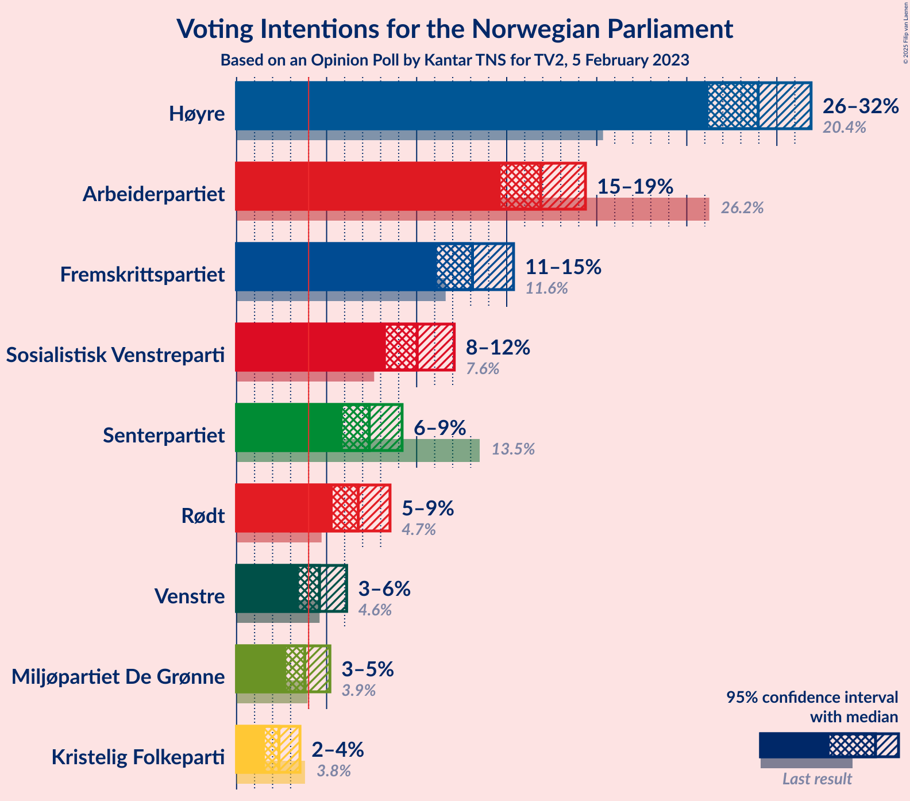

### Confidence Intervals

| Party | Last Result | Poll Result | 80% Confidence Interval | 90% Confidence Interval | 95% Confidence Interval | 99% Confidence Interval |
|:-----:|:-----------:|:-----------:|:-----------------------:|:-----------------------:|:-----------------------:|:-----------------------:|
| Høyre | 20.4% | 29.0% | 27.2–30.9% |26.6–31.4% |26.2–31.9% |25.3–32.8% |
| Arbeiderpartiet | 26.2% | 16.9% | 15.4–18.5% |15.0–19.0% |14.7–19.4% |14.0–20.2% |
| Fremskrittspartiet | 11.6% | 13.1% | 11.8–14.6% |11.4–15.0% |11.1–15.4% |10.5–16.1% |
| Sosialistisk Venstreparti | 7.6% | 10.0% | 8.9–11.4% |8.6–11.8% |8.3–12.1% |7.8–12.8% |
| Senterpartiet | 13.5% | 7.4% | 6.4–8.6% |6.1–8.9% |5.9–9.2% |5.5–9.8% |
| Rødt | 4.7% | 6.8% | 5.8–7.9% |5.6–8.2% |5.3–8.5% |4.9–9.1% |
| Venstre | 4.6% | 4.6% | 3.8–5.6% |3.6–5.9% |3.5–6.1% |3.1–6.6% |
| Miljøpartiet De Grønne | 3.9% | 3.8% | 3.1–4.7% |2.9–5.0% |2.8–5.2% |2.5–5.7% |
| Kristelig Folkeparti | 3.8% | 2.4% | 1.8–3.1% |1.7–3.3% |1.6–3.5% |1.4–3.9% |

*Note:* The poll result column reflects the actual value used in the calculations. Published results may vary slightly, and in addition be rounded to fewer digits.

## Seats

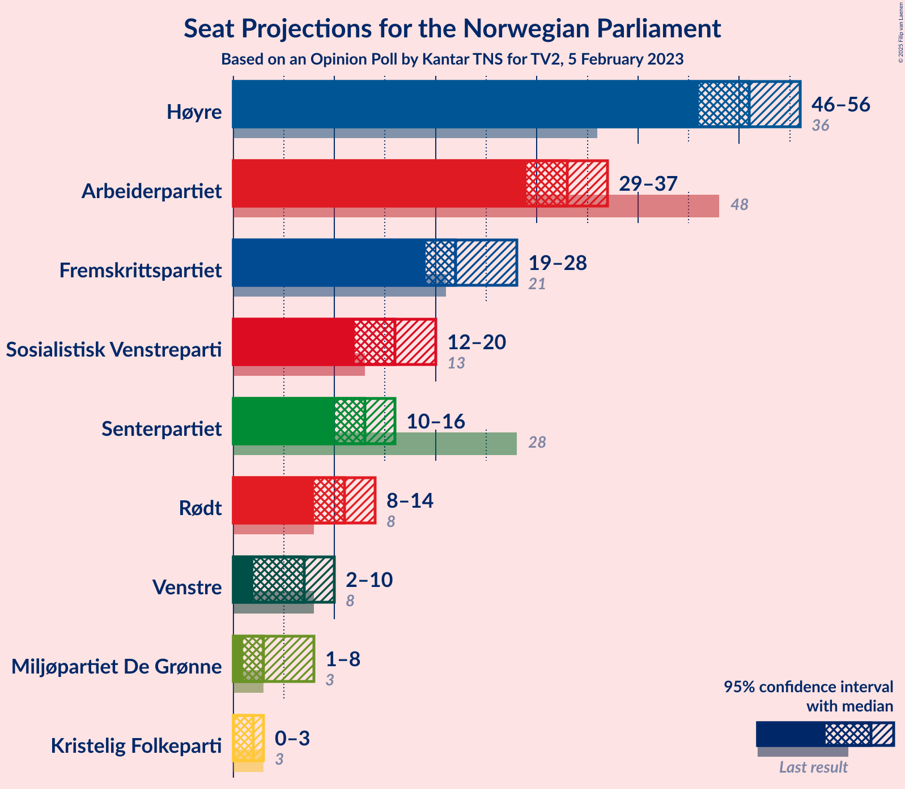

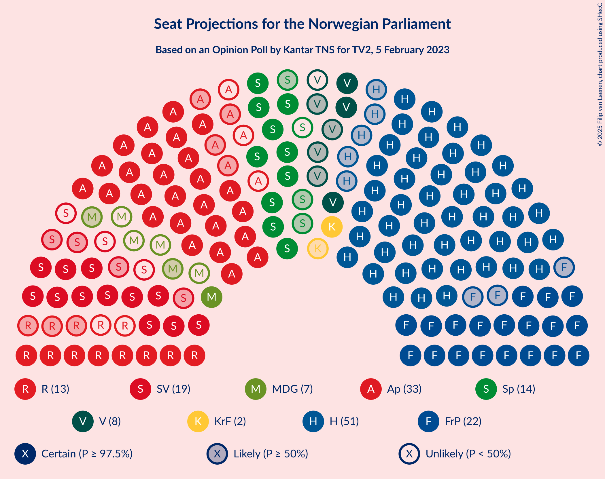

### Confidence Intervals

| Party | Last Result | Median | 80% Confidence Interval | 90% Confidence Interval | 95% Confidence Interval | 99% Confidence Interval |
|:-----:|:-----------:|:------:|:-----------------------:|:-----------------------:|:-----------------------:|:-----------------------:|
| <a href="#høyre">Høyre</a> | 36 | 51 | 48–54 |47–55 |46–56 |43–58 |
| <a href="#arbeiderpartiet">Arbeiderpartiet</a> | 48 | 33 | 30–35 |30–36 |29–37 |27–39 |
| <a href="#fremskrittspartiet">Fremskrittspartiet</a> | 21 | 22 | 21–25 |20–27 |19–28 |17–30 |
| <a href="#sosialistisk-venstreparti">Sosialistisk Venstreparti</a> | 13 | 16 | 14–19 |13–20 |12–20 |11–22 |
| <a href="#senterpartiet">Senterpartiet</a> | 28 | 13 | 11–14 |10–15 |10–16 |8–17 |
| <a href="#rødt">Rødt</a> | 8 | 11 | 9–13 |9–13 |8–14 |7–15 |
| <a href="#venstre">Venstre</a> | 8 | 7 | 3–9 |3–9 |2–10 |2–10 |
| <a href="#miljøpartiet-de-grønne">Miljøpartiet De Grønne</a> | 3 | 3 | 2–7 |1–7 |1–8 |1–9 |
| <a href="#kristelig-folkeparti">Kristelig Folkeparti</a> | 3 | 2 | 0–2 |0–2 |0–3 |0–3 |

### Høyre

*For a full overview of the results for this party, see the [Høyre](party-høyre.html) page.*

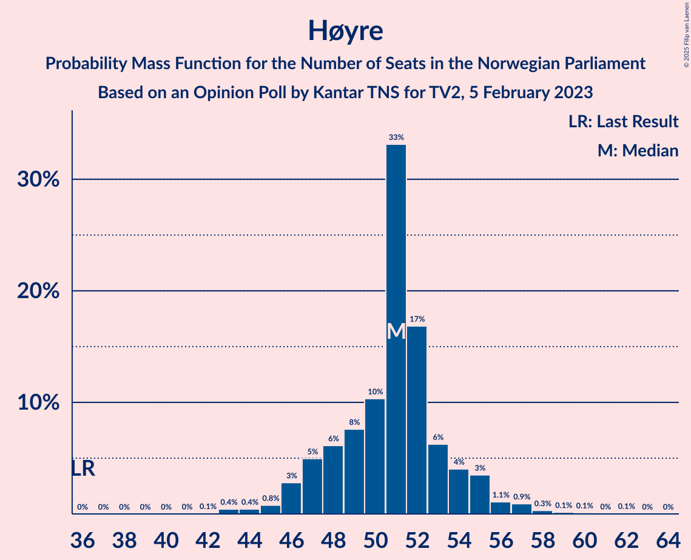

| Number of Seats | Probability | Accumulated | Special Marks |
|:---------------:|:-----------:|:-----------:|:-------------:|
| 36 | 0% | 100% | Last Result |
| 37 | 0% | 100% |  |
| 38 | 0% | 100% |  |
| 39 | 0% | 100% |  |
| 40 | 0% | 100% |  |
| 41 | 0% | 100% |  |
| 42 | 0.1% | 100% |  |
| 43 | 0.4% | 99.9% |  |
| 44 | 0.4% | 99.5% |  |
| 45 | 0.8% | 99.1% |  |
| 46 | 3% | 98% |  |
| 47 | 5% | 95% |  |
| 48 | 6% | 91% |  |
| 49 | 8% | 84% |  |
| 50 | 10% | 77% |  |
| 51 | 33% | 66% | Median |
| 52 | 17% | 33% |  |
| 53 | 6% | 16% |  |
| 54 | 4% | 10% |  |
| 55 | 3% | 6% |  |
| 56 | 1.1% | 3% |  |
| 57 | 0.9% | 2% |  |
| 58 | 0.3% | 0.7% |  |
| 59 | 0.1% | 0.4% |  |
| 60 | 0.1% | 0.2% |  |
| 61 | 0% | 0.1% |  |
| 62 | 0.1% | 0.1% |  |
| 63 | 0% | 0% |  |

### Arbeiderpartiet

*For a full overview of the results for this party, see the [Arbeiderpartiet](party-arbeiderpartiet.html) page.*

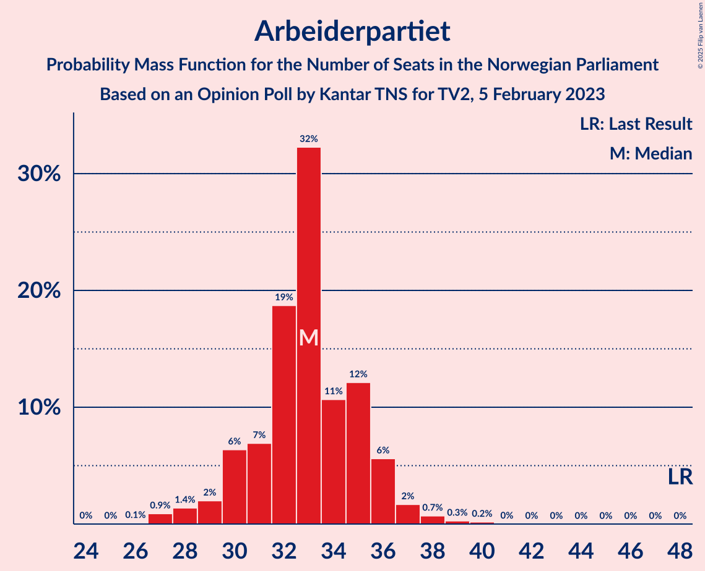

| Number of Seats | Probability | Accumulated | Special Marks |
|:---------------:|:-----------:|:-----------:|:-------------:|
| 24 | 0% | 100% |  |
| 25 | 0% | 99.9% |  |
| 26 | 0.1% | 99.9% |  |
| 27 | 0.9% | 99.8% |  |
| 28 | 1.4% | 98.9% |  |
| 29 | 2% | 98% |  |
| 30 | 6% | 96% |  |
| 31 | 7% | 89% |  |
| 32 | 19% | 82% |  |
| 33 | 32% | 64% | Median |
| 34 | 11% | 31% |  |
| 35 | 12% | 21% |  |
| 36 | 6% | 8% |  |
| 37 | 2% | 3% |  |
| 38 | 0.7% | 1.2% |  |
| 39 | 0.3% | 0.5% |  |
| 40 | 0.2% | 0.2% |  |
| 41 | 0% | 0% |  |
| 42 | 0% | 0% |  |
| 43 | 0% | 0% |  |
| 44 | 0% | 0% |  |
| 45 | 0% | 0% |  |
| 46 | 0% | 0% |  |
| 47 | 0% | 0% |  |
| 48 | 0% | 0% | Last Result |

### Fremskrittspartiet

*For a full overview of the results for this party, see the [Fremskrittspartiet](party-fremskrittspartiet.html) page.*

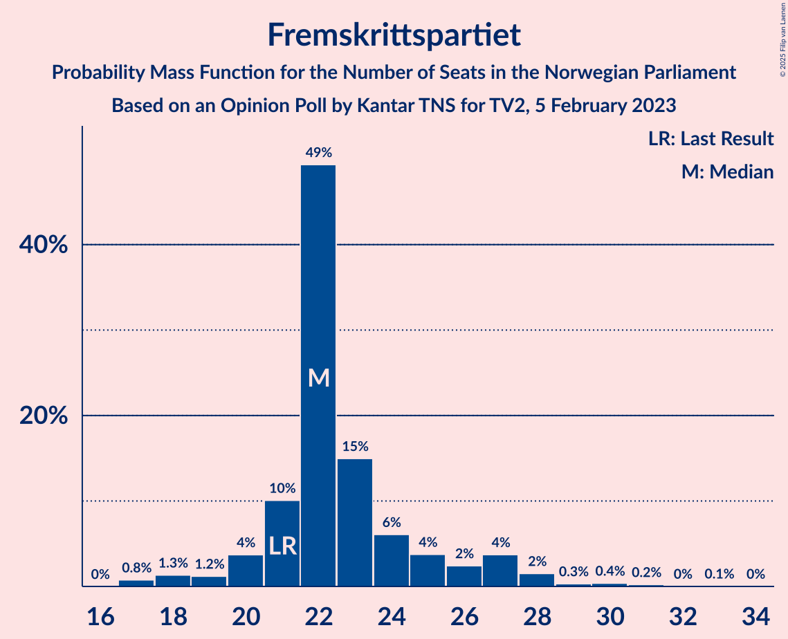

| Number of Seats | Probability | Accumulated | Special Marks |
|:---------------:|:-----------:|:-----------:|:-------------:|
| 17 | 0.8% | 100% |  |
| 18 | 1.3% | 99.2% |  |
| 19 | 1.2% | 98% |  |
| 20 | 4% | 97% |  |
| 21 | 10% | 93% | Last Result |
| 22 | 49% | 83% | Median |
| 23 | 15% | 34% |  |
| 24 | 6% | 19% |  |
| 25 | 4% | 12% |  |
| 26 | 2% | 9% |  |
| 27 | 4% | 6% |  |
| 28 | 2% | 3% |  |
| 29 | 0.3% | 1.1% |  |
| 30 | 0.4% | 0.7% |  |
| 31 | 0.2% | 0.3% |  |
| 32 | 0% | 0.1% |  |
| 33 | 0.1% | 0.1% |  |
| 34 | 0% | 0% |  |

### Sosialistisk Venstreparti

*For a full overview of the results for this party, see the [Sosialistisk Venstreparti](party-sosialistiskvenstreparti.html) page.*

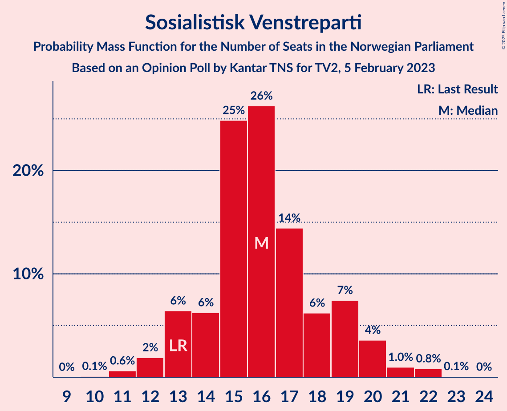

| Number of Seats | Probability | Accumulated | Special Marks |
|:---------------:|:-----------:|:-----------:|:-------------:|
| 10 | 0.1% | 100% |  |
| 11 | 0.6% | 99.9% |  |
| 12 | 2% | 99.3% |  |
| 13 | 6% | 97% | Last Result |
| 14 | 6% | 91% |  |
| 15 | 25% | 85% |  |
| 16 | 26% | 60% | Median |
| 17 | 14% | 34% |  |
| 18 | 6% | 19% |  |
| 19 | 7% | 13% |  |
| 20 | 4% | 5% |  |
| 21 | 1.0% | 2% |  |
| 22 | 0.8% | 0.9% |  |
| 23 | 0.1% | 0.1% |  |
| 24 | 0% | 0% |  |

### Senterpartiet

*For a full overview of the results for this party, see the [Senterpartiet](party-senterpartiet.html) page.*

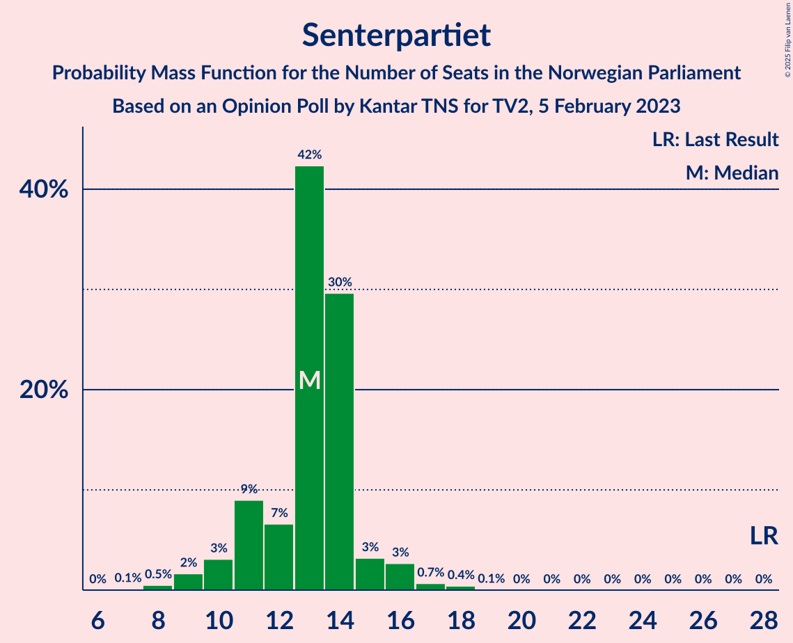

| Number of Seats | Probability | Accumulated | Special Marks |
|:---------------:|:-----------:|:-----------:|:-------------:|
| 7 | 0.1% | 100% |  |
| 8 | 0.5% | 99.9% |  |
| 9 | 2% | 99.4% |  |
| 10 | 3% | 98% |  |
| 11 | 9% | 95% |  |
| 12 | 7% | 86% |  |
| 13 | 42% | 79% | Median |
| 14 | 30% | 37% |  |
| 15 | 3% | 7% |  |
| 16 | 3% | 4% |  |
| 17 | 0.7% | 1.2% |  |
| 18 | 0.4% | 0.5% |  |
| 19 | 0.1% | 0.1% |  |
| 20 | 0% | 0% |  |
| 21 | 0% | 0% |  |
| 22 | 0% | 0% |  |
| 23 | 0% | 0% |  |
| 24 | 0% | 0% |  |
| 25 | 0% | 0% |  |
| 26 | 0% | 0% |  |
| 27 | 0% | 0% |  |
| 28 | 0% | 0% | Last Result |

### Rødt

*For a full overview of the results for this party, see the [Rødt](party-rødt.html) page.*

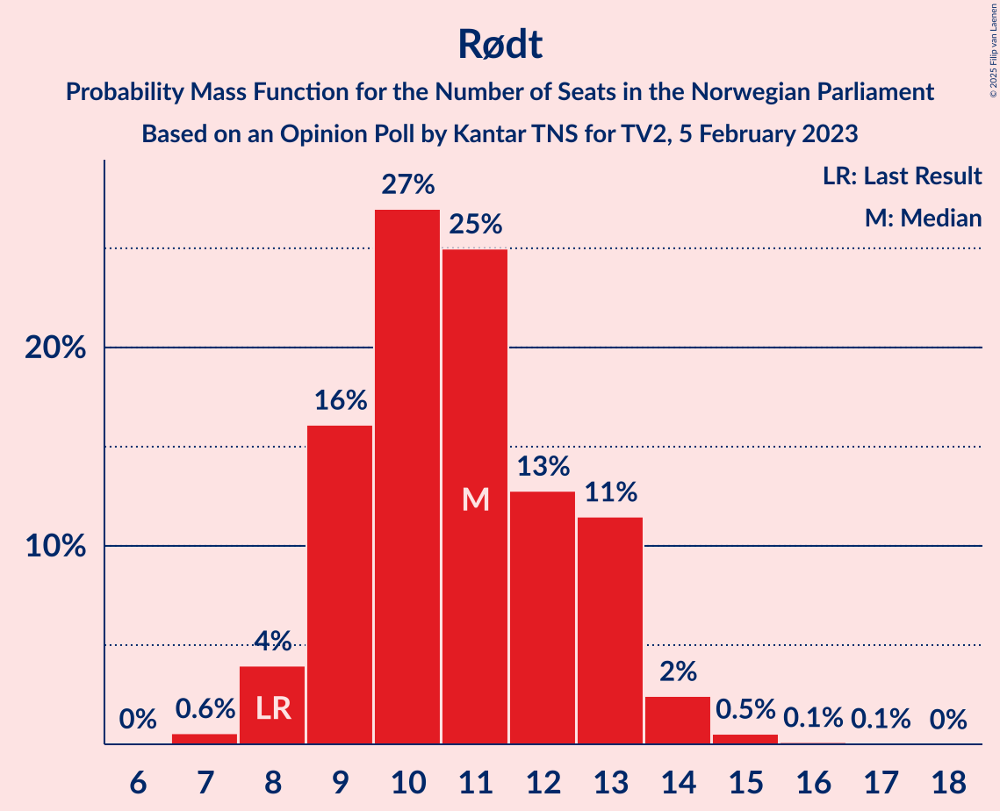

| Number of Seats | Probability | Accumulated | Special Marks |
|:---------------:|:-----------:|:-----------:|:-------------:|
| 7 | 0.6% | 100% |  |
| 8 | 4% | 99.4% | Last Result |
| 9 | 16% | 95% |  |
| 10 | 27% | 79% |  |
| 11 | 25% | 52% | Median |
| 12 | 13% | 27% |  |
| 13 | 11% | 15% |  |
| 14 | 2% | 3% |  |
| 15 | 0.5% | 0.7% |  |
| 16 | 0.1% | 0.2% |  |
| 17 | 0.1% | 0.1% |  |
| 18 | 0% | 0% |  |

### Venstre

*For a full overview of the results for this party, see the [Venstre](party-venstre.html) page.*

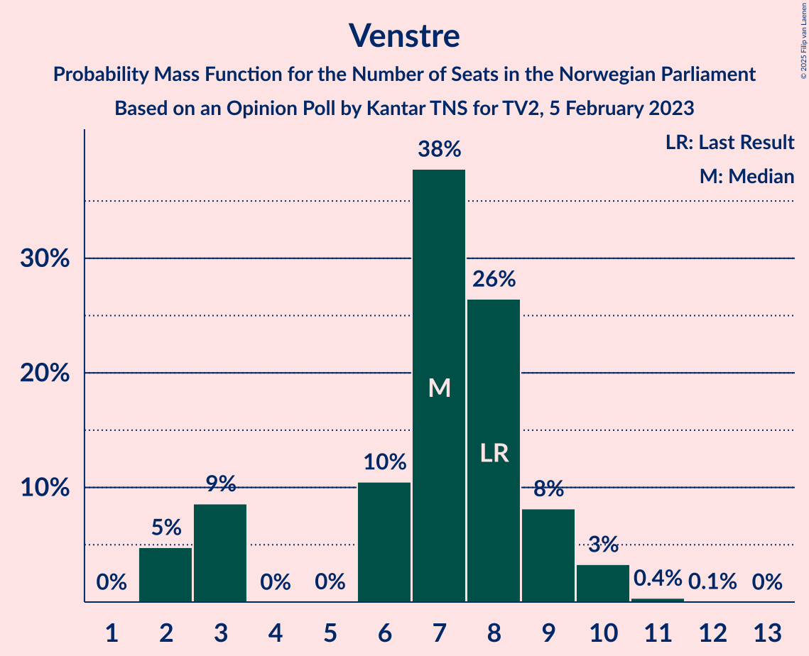

| Number of Seats | Probability | Accumulated | Special Marks |
|:---------------:|:-----------:|:-----------:|:-------------:|
| 2 | 5% | 100% |  |
| 3 | 9% | 95% |  |
| 4 | 0% | 87% |  |
| 5 | 0% | 87% |  |
| 6 | 10% | 87% |  |
| 7 | 38% | 76% | Median |
| 8 | 26% | 38% | Last Result |
| 9 | 8% | 12% |  |
| 10 | 3% | 4% |  |
| 11 | 0.4% | 0.4% |  |
| 12 | 0.1% | 0.1% |  |
| 13 | 0% | 0% |  |

### Miljøpartiet De Grønne

*For a full overview of the results for this party, see the [Miljøpartiet De Grønne](party-miljøpartietdegrønne.html) page.*

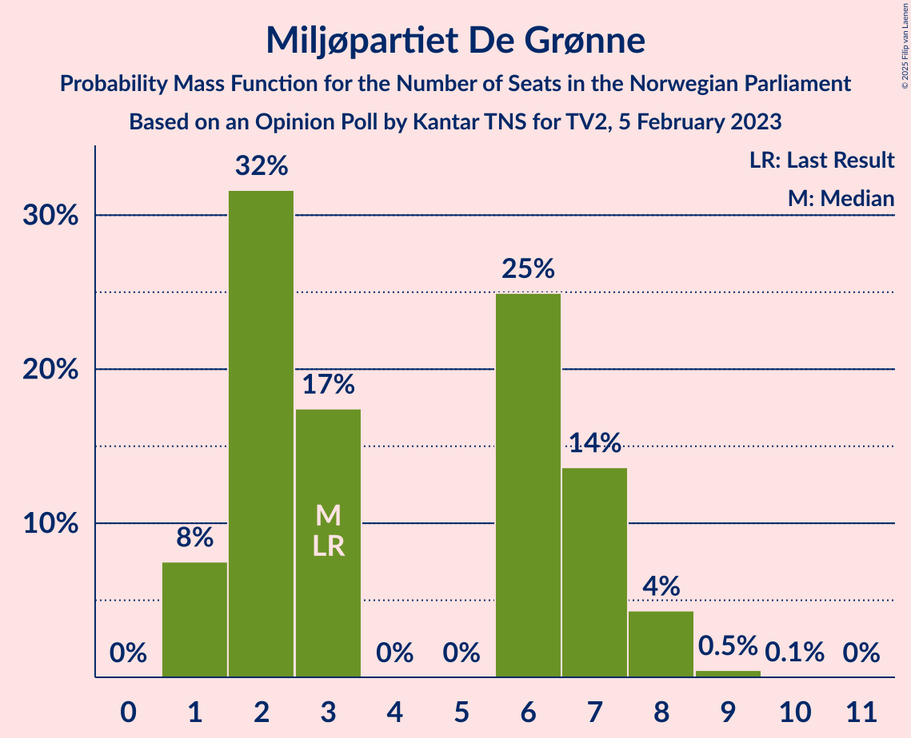

| Number of Seats | Probability | Accumulated | Special Marks |
|:---------------:|:-----------:|:-----------:|:-------------:|
| 1 | 8% | 100% |  |
| 2 | 32% | 92% |  |
| 3 | 17% | 61% | Last Result, Median |
| 4 | 0% | 43% |  |
| 5 | 0% | 43% |  |
| 6 | 25% | 43% |  |
| 7 | 14% | 18% |  |
| 8 | 4% | 5% |  |
| 9 | 0.5% | 0.5% |  |
| 10 | 0.1% | 0.1% |  |
| 11 | 0% | 0% |  |

### Kristelig Folkeparti

*For a full overview of the results for this party, see the [Kristelig Folkeparti](party-kristeligfolkeparti.html) page.*

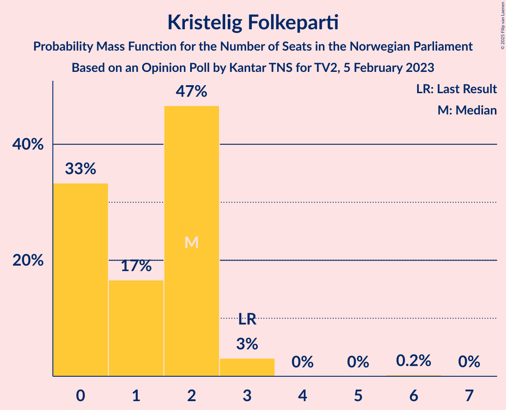

| Number of Seats | Probability | Accumulated | Special Marks |
|:---------------:|:-----------:|:-----------:|:-------------:|
| 0 | 33% | 100% |  |
| 1 | 17% | 67% |  |
| 2 | 47% | 50% | Median |
| 3 | 3% | 3% | Last Result |
| 4 | 0% | 0.3% |  |
| 5 | 0% | 0.3% |  |
| 6 | 0.2% | 0.3% |  |
| 7 | 0% | 0% |  |

## Coalitions

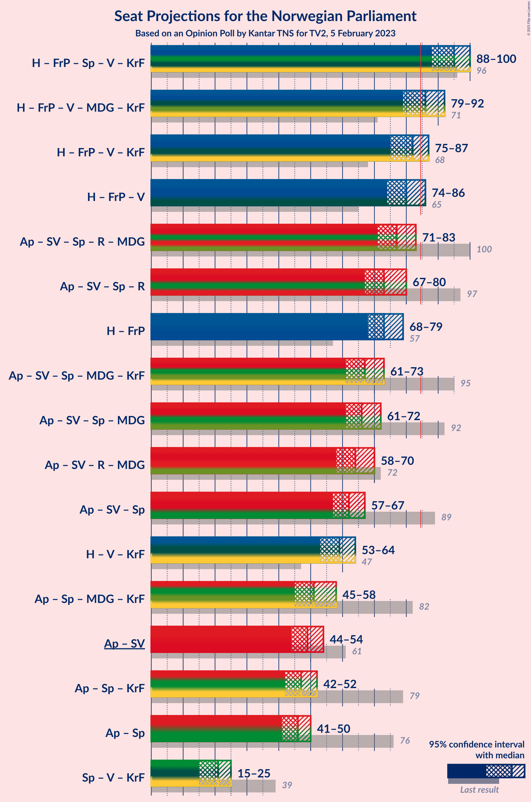

### Confidence Intervals

| Coalition | Last Result | Median | Majority? | 80% Confidence Interval | 90% Confidence Interval | 95% Confidence Interval | 99% Confidence Interval |
|:---------:|:-----------:|:------:|:---------:|:-----------------------:|:-----------------------:|:-----------------------:|:-----------------------:|
| Høyre – Fremskrittspartiet – Senterpartiet – Venstre – Kristelig Folkeparti | 96 | 95 | 99.9% | 91–97 | 90–99 | 88–100 | 86–103 |
| Høyre – Fremskrittspartiet – Venstre – Miljøpartiet De Grønne – Kristelig Folkeparti | 71 | 86 | 65% | 82–89 | 80–90 | 79–92 | 76–94 |
| Høyre – Fremskrittspartiet – Venstre – Kristelig Folkeparti | 68 | 82 | 12% | 78–85 | 76–86 | 75–87 | 73–90 |
| Høyre – Fremskrittspartiet – Venstre | 65 | 80 | 6% | 76–84 | 75–85 | 74–86 | 71–89 |
| Arbeiderpartiet – Sosialistisk Venstreparti – Senterpartiet – Rødt – Miljøpartiet De Grønne | 100 | 77 | 0.8% | 73–80 | 72–82 | 71–83 | 68–85 |
| Arbeiderpartiet – Sosialistisk Venstreparti – Senterpartiet – Rødt | 97 | 73 | 0% | 69–76 | 68–78 | 67–80 | 65–81 |
| Høyre – Fremskrittspartiet | 57 | 73 | 0.1% | 70–76 | 69–78 | 68–79 | 66–82 |
| Arbeiderpartiet – Sosialistisk Venstreparti – Senterpartiet – Miljøpartiet De Grønne – Kristelig Folkeparti | 95 | 67 | 0% | 64–71 | 63–72 | 61–73 | 58–76 |
| Arbeiderpartiet – Sosialistisk Venstreparti – Senterpartiet – Miljøpartiet De Grønne | 92 | 66 | 0% | 63–69 | 62–71 | 61–72 | 57–74 |
| Arbeiderpartiet – Sosialistisk Venstreparti – Rødt – Miljøpartiet De Grønne | 72 | 64 | 0% | 61–67 | 59–69 | 58–70 | 55–72 |
| Arbeiderpartiet – Sosialistisk Venstreparti – Senterpartiet | 89 | 62 | 0% | 59–65 | 58–66 | 57–67 | 54–69 |
| Høyre – Venstre – Kristelig Folkeparti | 47 | 59 | 0% | 55–62 | 54–63 | 53–64 | 50–66 |
| Arbeiderpartiet – Senterpartiet – Miljøpartiet De Grønne – Kristelig Folkeparti | 82 | 51 | 0% | 47–55 | 47–56 | 45–58 | 43–59 |
| Arbeiderpartiet – Sosialistisk Venstreparti | 61 | 49 | 0% | 46–52 | 45–53 | 44–54 | 42–56 |
| Arbeiderpartiet – Senterpartiet – Kristelig Folkeparti | 79 | 47 | 0% | 44–50 | 43–51 | 42–52 | 39–53 |
| Arbeiderpartiet – Senterpartiet | 76 | 46 | 0% | 43–49 | 42–49 | 41–50 | 38–52 |
| Senterpartiet – Venstre – Kristelig Folkeparti | 39 | 21 | 0% | 18–24 | 16–25 | 15–25 | 13–27 |

### Høyre – Fremskrittspartiet – Senterpartiet – Venstre – Kristelig Folkeparti

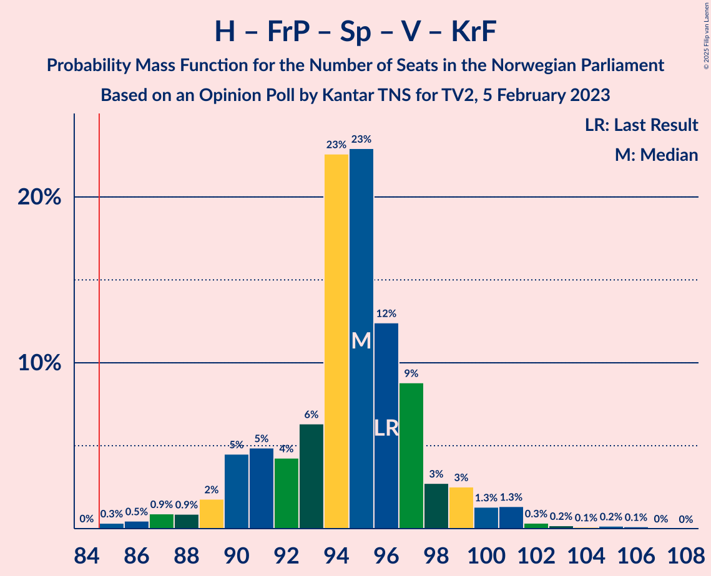

| Number of Seats | Probability | Accumulated | Special Marks |
|:---------------:|:-----------:|:-----------:|:-------------:|
| 84 | 0% | 100% |  |
| 85 | 0.3% | 99.9% | Majority |
| 86 | 0.5% | 99.6% |  |
| 87 | 0.9% | 99.1% |  |
| 88 | 0.9% | 98% |  |
| 89 | 2% | 97% |  |
| 90 | 5% | 96% |  |
| 91 | 5% | 91% |  |
| 92 | 4% | 86% |  |
| 93 | 6% | 82% |  |
| 94 | 23% | 76% |  |
| 95 | 23% | 53% | Median |
| 96 | 12% | 30% | Last Result |
| 97 | 9% | 18% |  |
| 98 | 3% | 9% |  |
| 99 | 3% | 6% |  |
| 100 | 1.3% | 4% |  |
| 101 | 1.3% | 2% |  |
| 102 | 0.3% | 0.9% |  |
| 103 | 0.2% | 0.6% |  |
| 104 | 0.1% | 0.4% |  |
| 105 | 0.2% | 0.3% |  |
| 106 | 0.1% | 0.2% |  |
| 107 | 0% | 0% |  |

### Høyre – Fremskrittspartiet – Venstre – Miljøpartiet De Grønne – Kristelig Folkeparti

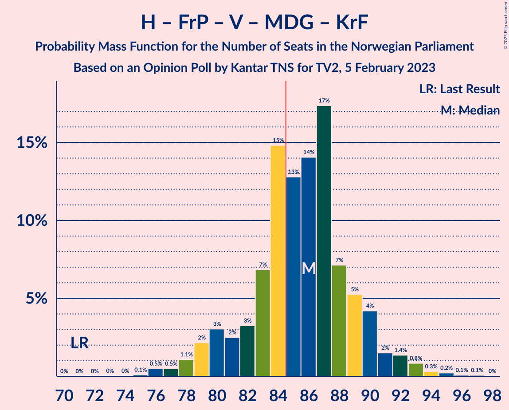

| Number of Seats | Probability | Accumulated | Special Marks |
|:---------------:|:-----------:|:-----------:|:-------------:|
| 71 | 0% | 100% | Last Result |
| 72 | 0% | 100% |  |
| 73 | 0% | 100% |  |
| 74 | 0% | 100% |  |
| 75 | 0.1% | 99.9% |  |
| 76 | 0.5% | 99.9% |  |
| 77 | 0.5% | 99.4% |  |
| 78 | 1.1% | 98.9% |  |
| 79 | 2% | 98% |  |
| 80 | 3% | 96% |  |
| 81 | 2% | 93% |  |
| 82 | 3% | 90% |  |
| 83 | 7% | 87% |  |
| 84 | 15% | 80% |  |
| 85 | 13% | 65% | Median, Majority |
| 86 | 14% | 52% |  |
| 87 | 17% | 38% |  |
| 88 | 7% | 21% |  |
| 89 | 5% | 14% |  |
| 90 | 4% | 9% |  |
| 91 | 2% | 4% |  |
| 92 | 1.4% | 3% |  |
| 93 | 0.8% | 2% |  |
| 94 | 0.3% | 0.7% |  |
| 95 | 0.2% | 0.4% |  |
| 96 | 0.1% | 0.2% |  |
| 97 | 0.1% | 0.1% |  |
| 98 | 0% | 0% |  |

### Høyre – Fremskrittspartiet – Venstre – Kristelig Folkeparti

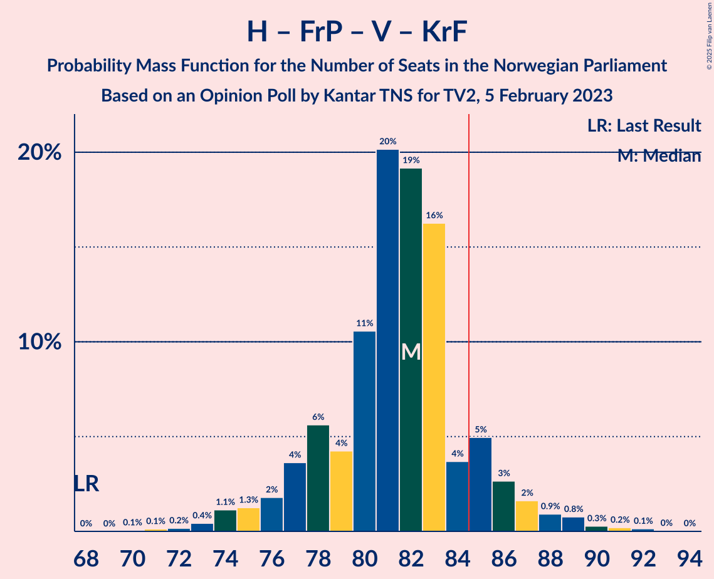

| Number of Seats | Probability | Accumulated | Special Marks |
|:---------------:|:-----------:|:-----------:|:-------------:|
| 68 | 0% | 100% | Last Result |
| 69 | 0% | 100% |  |
| 70 | 0.1% | 100% |  |
| 71 | 0.1% | 99.9% |  |
| 72 | 0.2% | 99.8% |  |
| 73 | 0.4% | 99.6% |  |
| 74 | 1.1% | 99.2% |  |
| 75 | 1.3% | 98% |  |
| 76 | 2% | 97% |  |
| 77 | 4% | 95% |  |
| 78 | 6% | 91% |  |
| 79 | 4% | 86% |  |
| 80 | 11% | 81% |  |
| 81 | 20% | 71% |  |
| 82 | 19% | 51% | Median |
| 83 | 16% | 32% |  |
| 84 | 4% | 15% |  |
| 85 | 5% | 12% | Majority |
| 86 | 3% | 7% |  |
| 87 | 2% | 4% |  |
| 88 | 0.9% | 2% |  |
| 89 | 0.8% | 1.5% |  |
| 90 | 0.3% | 0.7% |  |
| 91 | 0.2% | 0.4% |  |
| 92 | 0.1% | 0.2% |  |
| 93 | 0% | 0.1% |  |
| 94 | 0% | 0% |  |

### Høyre – Fremskrittspartiet – Venstre

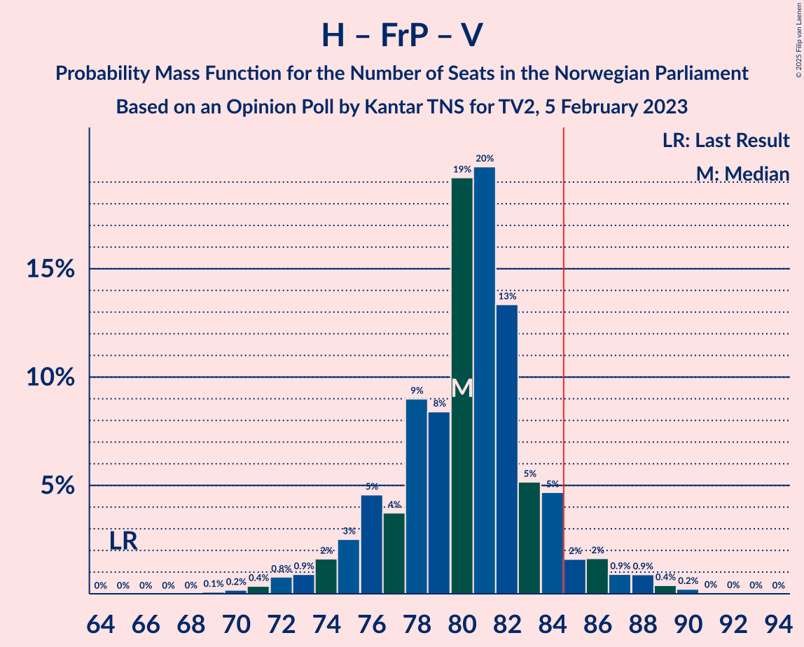

| Number of Seats | Probability | Accumulated | Special Marks |
|:---------------:|:-----------:|:-----------:|:-------------:|
| 65 | 0% | 100% | Last Result |
| 66 | 0% | 100% |  |
| 67 | 0% | 100% |  |
| 68 | 0% | 100% |  |
| 69 | 0.1% | 100% |  |
| 70 | 0.2% | 99.9% |  |
| 71 | 0.4% | 99.7% |  |
| 72 | 0.8% | 99.4% |  |
| 73 | 0.9% | 98.6% |  |
| 74 | 2% | 98% |  |
| 75 | 3% | 96% |  |
| 76 | 5% | 94% |  |
| 77 | 4% | 89% |  |
| 78 | 9% | 85% |  |
| 79 | 8% | 76% |  |
| 80 | 19% | 68% | Median |
| 81 | 20% | 49% |  |
| 82 | 13% | 29% |  |
| 83 | 5% | 16% |  |
| 84 | 5% | 10% |  |
| 85 | 2% | 6% | Majority |
| 86 | 2% | 4% |  |
| 87 | 0.9% | 2% |  |
| 88 | 0.9% | 2% |  |
| 89 | 0.4% | 0.7% |  |
| 90 | 0.2% | 0.3% |  |
| 91 | 0% | 0.1% |  |
| 92 | 0% | 0.1% |  |
| 93 | 0% | 0% |  |

### Arbeiderpartiet – Sosialistisk Venstreparti – Senterpartiet – Rødt – Miljøpartiet De Grønne

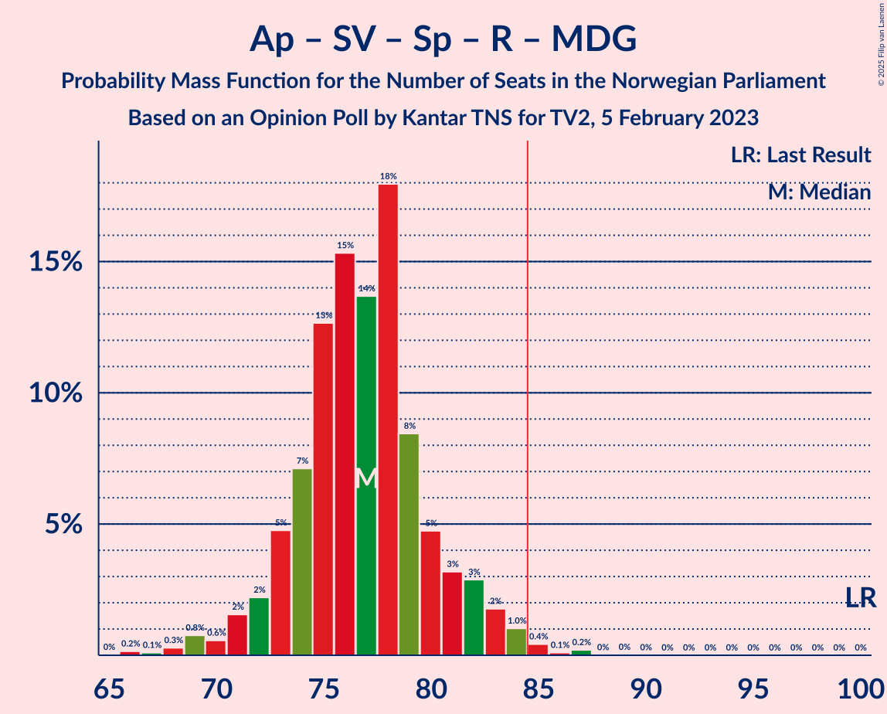

| Number of Seats | Probability | Accumulated | Special Marks |
|:---------------:|:-----------:|:-----------:|:-------------:|
| 66 | 0.2% | 100% |  |
| 67 | 0.1% | 99.8% |  |
| 68 | 0.3% | 99.7% |  |
| 69 | 0.8% | 99.4% |  |
| 70 | 0.6% | 98.7% |  |
| 71 | 2% | 98% |  |
| 72 | 2% | 97% |  |
| 73 | 5% | 94% |  |
| 74 | 7% | 90% |  |
| 75 | 13% | 82% |  |
| 76 | 15% | 70% | Median |
| 77 | 14% | 54% |  |
| 78 | 18% | 41% |  |
| 79 | 8% | 23% |  |
| 80 | 5% | 14% |  |
| 81 | 3% | 10% |  |
| 82 | 3% | 6% |  |
| 83 | 2% | 4% |  |
| 84 | 1.0% | 2% |  |
| 85 | 0.4% | 0.8% | Majority |
| 86 | 0.1% | 0.4% |  |
| 87 | 0.2% | 0.3% |  |
| 88 | 0% | 0% |  |
| 89 | 0% | 0% |  |
| 90 | 0% | 0% |  |
| 91 | 0% | 0% |  |
| 92 | 0% | 0% |  |
| 93 | 0% | 0% |  |
| 94 | 0% | 0% |  |
| 95 | 0% | 0% |  |
| 96 | 0% | 0% |  |
| 97 | 0% | 0% |  |
| 98 | 0% | 0% |  |
| 99 | 0% | 0% |  |
| 100 | 0% | 0% | Last Result |

### Arbeiderpartiet – Sosialistisk Venstreparti – Senterpartiet – Rødt

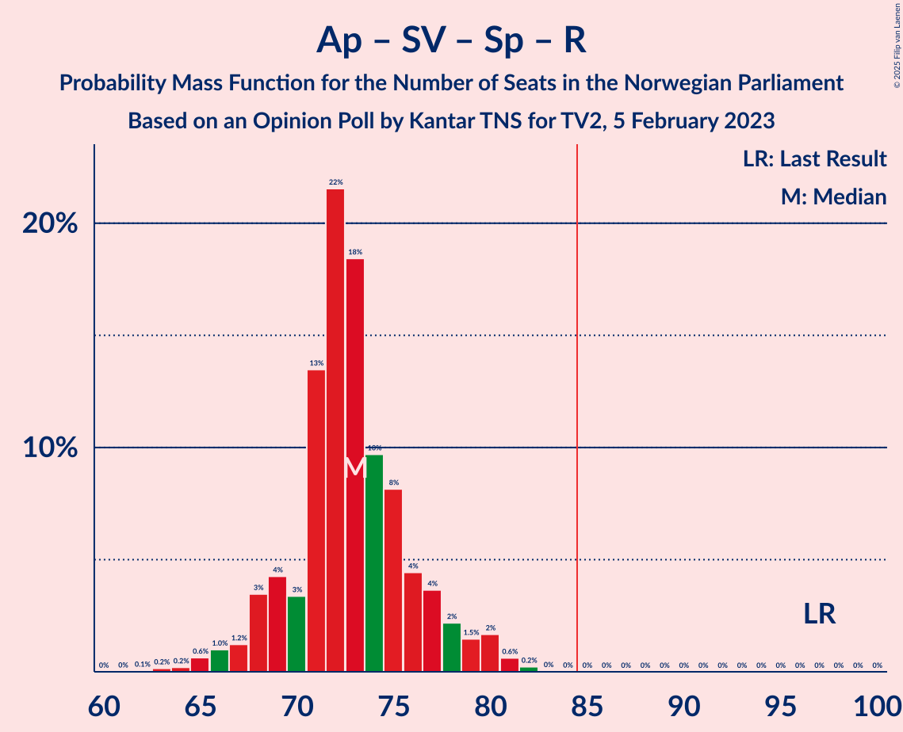

| Number of Seats | Probability | Accumulated | Special Marks |
|:---------------:|:-----------:|:-----------:|:-------------:|
| 62 | 0.1% | 100% |  |
| 63 | 0.2% | 99.9% |  |
| 64 | 0.2% | 99.8% |  |
| 65 | 0.6% | 99.6% |  |
| 66 | 1.0% | 98.9% |  |
| 67 | 1.2% | 98% |  |
| 68 | 3% | 97% |  |
| 69 | 4% | 93% |  |
| 70 | 3% | 89% |  |
| 71 | 13% | 86% |  |
| 72 | 22% | 72% |  |
| 73 | 18% | 51% | Median |
| 74 | 10% | 32% |  |
| 75 | 8% | 22% |  |
| 76 | 4% | 14% |  |
| 77 | 4% | 10% |  |
| 78 | 2% | 6% |  |
| 79 | 1.5% | 4% |  |
| 80 | 2% | 3% |  |
| 81 | 0.6% | 0.9% |  |
| 82 | 0.2% | 0.3% |  |
| 83 | 0% | 0.1% |  |
| 84 | 0% | 0% |  |
| 85 | 0% | 0% | Majority |
| 86 | 0% | 0% |  |
| 87 | 0% | 0% |  |
| 88 | 0% | 0% |  |
| 89 | 0% | 0% |  |
| 90 | 0% | 0% |  |
| 91 | 0% | 0% |  |
| 92 | 0% | 0% |  |
| 93 | 0% | 0% |  |
| 94 | 0% | 0% |  |
| 95 | 0% | 0% |  |
| 96 | 0% | 0% |  |
| 97 | 0% | 0% | Last Result |

### Høyre – Fremskrittspartiet

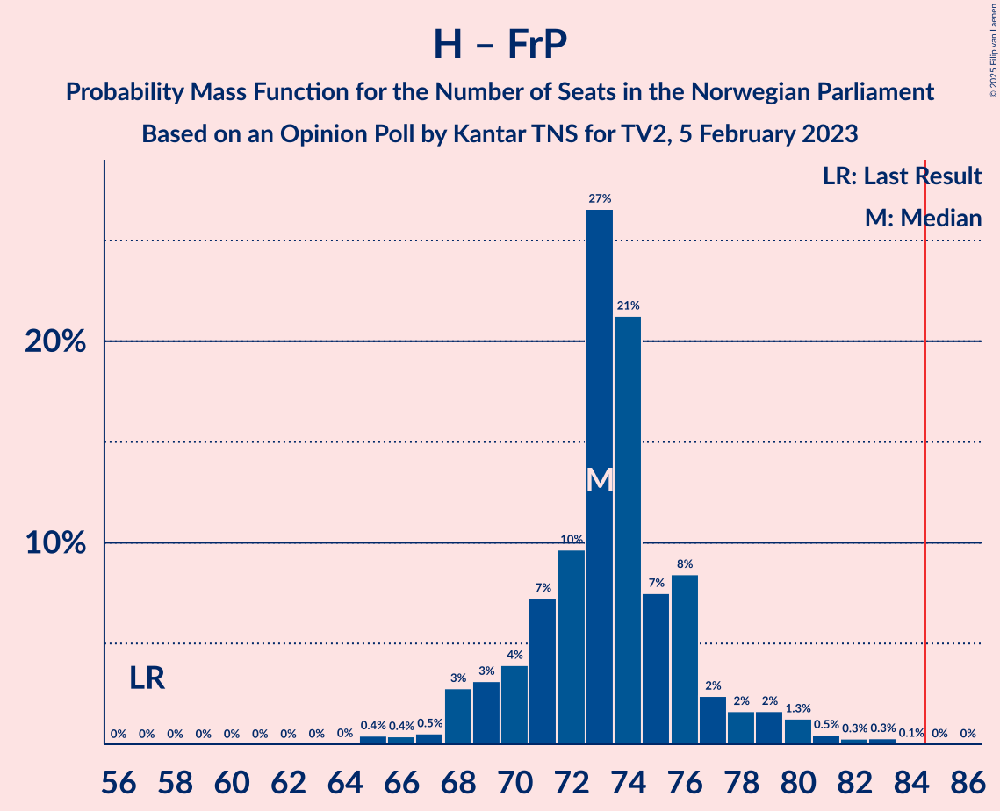

| Number of Seats | Probability | Accumulated | Special Marks |
|:---------------:|:-----------:|:-----------:|:-------------:|
| 57 | 0% | 100% | Last Result |
| 58 | 0% | 100% |  |
| 59 | 0% | 100% |  |
| 60 | 0% | 100% |  |
| 61 | 0% | 100% |  |
| 62 | 0% | 100% |  |
| 63 | 0% | 100% |  |
| 64 | 0% | 100% |  |
| 65 | 0.4% | 99.9% |  |
| 66 | 0.4% | 99.5% |  |
| 67 | 0.5% | 99.1% |  |
| 68 | 3% | 98.6% |  |
| 69 | 3% | 96% |  |
| 70 | 4% | 93% |  |
| 71 | 7% | 89% |  |
| 72 | 10% | 82% |  |
| 73 | 27% | 72% | Median |
| 74 | 21% | 45% |  |
| 75 | 7% | 24% |  |
| 76 | 8% | 17% |  |
| 77 | 2% | 8% |  |
| 78 | 2% | 6% |  |
| 79 | 2% | 4% |  |
| 80 | 1.3% | 2% |  |
| 81 | 0.5% | 1.2% |  |
| 82 | 0.3% | 0.7% |  |
| 83 | 0.3% | 0.4% |  |
| 84 | 0.1% | 0.1% |  |
| 85 | 0% | 0.1% | Majority |
| 86 | 0% | 0% |  |

### Arbeiderpartiet – Sosialistisk Venstreparti – Senterpartiet – Miljøpartiet De Grønne – Kristelig Folkeparti

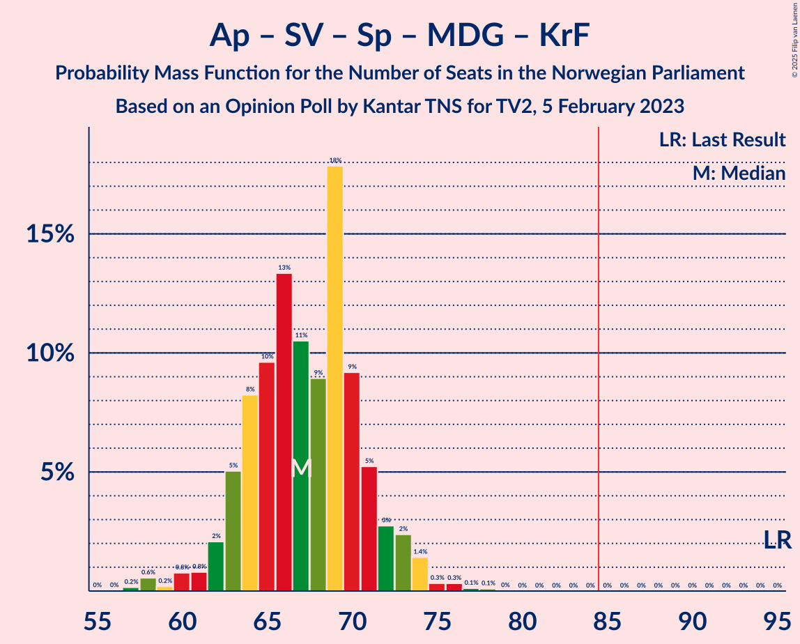

| Number of Seats | Probability | Accumulated | Special Marks |
|:---------------:|:-----------:|:-----------:|:-------------:|
| 56 | 0% | 100% |  |
| 57 | 0.2% | 99.9% |  |
| 58 | 0.6% | 99.8% |  |
| 59 | 0.2% | 99.2% |  |
| 60 | 0.8% | 99.0% |  |
| 61 | 0.8% | 98% |  |
| 62 | 2% | 97% |  |
| 63 | 5% | 95% |  |
| 64 | 8% | 90% |  |
| 65 | 10% | 82% |  |
| 66 | 13% | 73% |  |
| 67 | 11% | 59% | Median |
| 68 | 9% | 49% |  |
| 69 | 18% | 40% |  |
| 70 | 9% | 22% |  |
| 71 | 5% | 13% |  |
| 72 | 3% | 7% |  |
| 73 | 2% | 5% |  |
| 74 | 1.4% | 2% |  |
| 75 | 0.3% | 0.9% |  |
| 76 | 0.3% | 0.6% |  |
| 77 | 0.1% | 0.2% |  |
| 78 | 0.1% | 0.1% |  |
| 79 | 0% | 0% |  |
| 80 | 0% | 0% |  |
| 81 | 0% | 0% |  |
| 82 | 0% | 0% |  |
| 83 | 0% | 0% |  |
| 84 | 0% | 0% |  |
| 85 | 0% | 0% | Majority |
| 86 | 0% | 0% |  |
| 87 | 0% | 0% |  |
| 88 | 0% | 0% |  |
| 89 | 0% | 0% |  |
| 90 | 0% | 0% |  |
| 91 | 0% | 0% |  |
| 92 | 0% | 0% |  |
| 93 | 0% | 0% |  |
| 94 | 0% | 0% |  |
| 95 | 0% | 0% | Last Result |

### Arbeiderpartiet – Sosialistisk Venstreparti – Senterpartiet – Miljøpartiet De Grønne

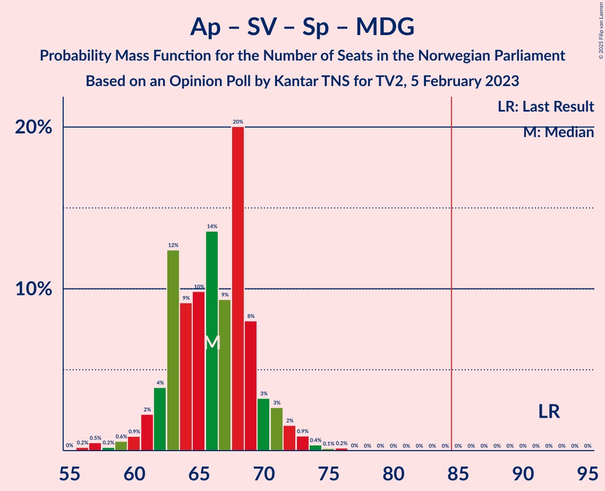

| Number of Seats | Probability | Accumulated | Special Marks |
|:---------------:|:-----------:|:-----------:|:-------------:|
| 55 | 0% | 100% |  |
| 56 | 0.2% | 99.9% |  |
| 57 | 0.5% | 99.7% |  |
| 58 | 0.2% | 99.2% |  |
| 59 | 0.6% | 99.0% |  |
| 60 | 0.9% | 98% |  |
| 61 | 2% | 98% |  |
| 62 | 4% | 95% |  |
| 63 | 12% | 91% |  |
| 64 | 9% | 79% |  |
| 65 | 10% | 70% | Median |
| 66 | 14% | 60% |  |
| 67 | 9% | 46% |  |
| 68 | 20% | 37% |  |
| 69 | 8% | 17% |  |
| 70 | 3% | 9% |  |
| 71 | 3% | 6% |  |
| 72 | 2% | 3% |  |
| 73 | 0.9% | 2% |  |
| 74 | 0.4% | 0.7% |  |
| 75 | 0.1% | 0.3% |  |
| 76 | 0.2% | 0.2% |  |
| 77 | 0% | 0% |  |
| 78 | 0% | 0% |  |
| 79 | 0% | 0% |  |
| 80 | 0% | 0% |  |
| 81 | 0% | 0% |  |
| 82 | 0% | 0% |  |
| 83 | 0% | 0% |  |
| 84 | 0% | 0% |  |
| 85 | 0% | 0% | Majority |
| 86 | 0% | 0% |  |
| 87 | 0% | 0% |  |
| 88 | 0% | 0% |  |
| 89 | 0% | 0% |  |
| 90 | 0% | 0% |  |
| 91 | 0% | 0% |  |
| 92 | 0% | 0% | Last Result |

### Arbeiderpartiet – Sosialistisk Venstreparti – Rødt – Miljøpartiet De Grønne

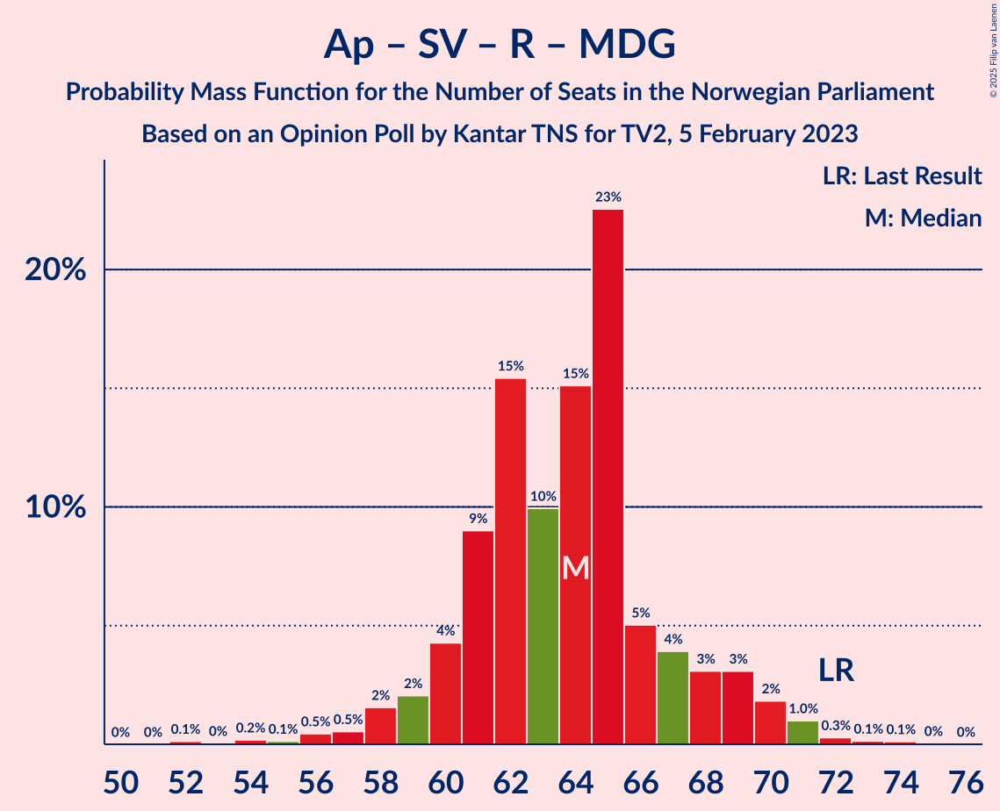

| Number of Seats | Probability | Accumulated | Special Marks |
|:---------------:|:-----------:|:-----------:|:-------------:|
| 52 | 0.1% | 100% |  |
| 53 | 0% | 99.9% |  |
| 54 | 0.2% | 99.8% |  |
| 55 | 0.1% | 99.6% |  |
| 56 | 0.5% | 99.5% |  |
| 57 | 0.5% | 99.0% |  |
| 58 | 2% | 98.5% |  |
| 59 | 2% | 97% |  |
| 60 | 4% | 95% |  |
| 61 | 9% | 91% |  |
| 62 | 15% | 82% |  |
| 63 | 10% | 66% | Median |
| 64 | 15% | 56% |  |
| 65 | 23% | 41% |  |
| 66 | 5% | 19% |  |
| 67 | 4% | 14% |  |
| 68 | 3% | 10% |  |
| 69 | 3% | 7% |  |
| 70 | 2% | 3% |  |
| 71 | 1.0% | 2% |  |
| 72 | 0.3% | 0.6% | Last Result |
| 73 | 0.1% | 0.3% |  |
| 74 | 0.1% | 0.2% |  |
| 75 | 0% | 0.1% |  |
| 76 | 0% | 0% |  |

### Arbeiderpartiet – Sosialistisk Venstreparti – Senterpartiet

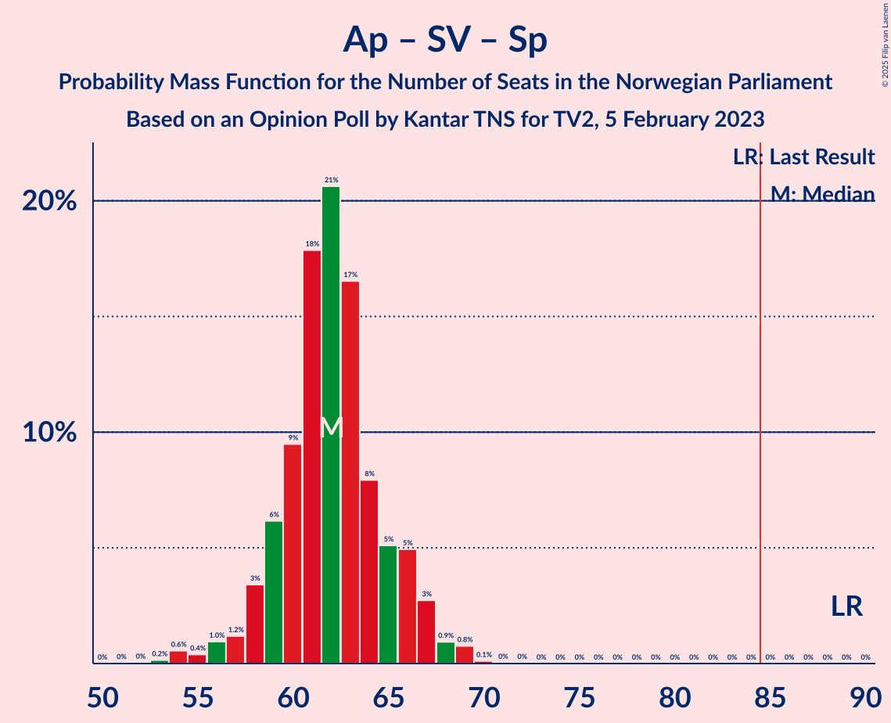

| Number of Seats | Probability | Accumulated | Special Marks |
|:---------------:|:-----------:|:-----------:|:-------------:|
| 52 | 0% | 100% |  |
| 53 | 0.2% | 99.9% |  |
| 54 | 0.6% | 99.8% |  |
| 55 | 0.4% | 99.2% |  |
| 56 | 1.0% | 98.8% |  |
| 57 | 1.2% | 98% |  |
| 58 | 3% | 97% |  |
| 59 | 6% | 93% |  |
| 60 | 9% | 87% |  |
| 61 | 18% | 78% |  |
| 62 | 21% | 60% | Median |
| 63 | 17% | 39% |  |
| 64 | 8% | 23% |  |
| 65 | 5% | 15% |  |
| 66 | 5% | 10% |  |
| 67 | 3% | 5% |  |
| 68 | 0.9% | 2% |  |
| 69 | 0.8% | 0.9% |  |
| 70 | 0.1% | 0.2% |  |
| 71 | 0% | 0.1% |  |
| 72 | 0% | 0% |  |
| 73 | 0% | 0% |  |
| 74 | 0% | 0% |  |
| 75 | 0% | 0% |  |
| 76 | 0% | 0% |  |
| 77 | 0% | 0% |  |
| 78 | 0% | 0% |  |
| 79 | 0% | 0% |  |
| 80 | 0% | 0% |  |
| 81 | 0% | 0% |  |
| 82 | 0% | 0% |  |
| 83 | 0% | 0% |  |
| 84 | 0% | 0% |  |
| 85 | 0% | 0% | Majority |
| 86 | 0% | 0% |  |
| 87 | 0% | 0% |  |
| 88 | 0% | 0% |  |
| 89 | 0% | 0% | Last Result |

### Høyre – Venstre – Kristelig Folkeparti

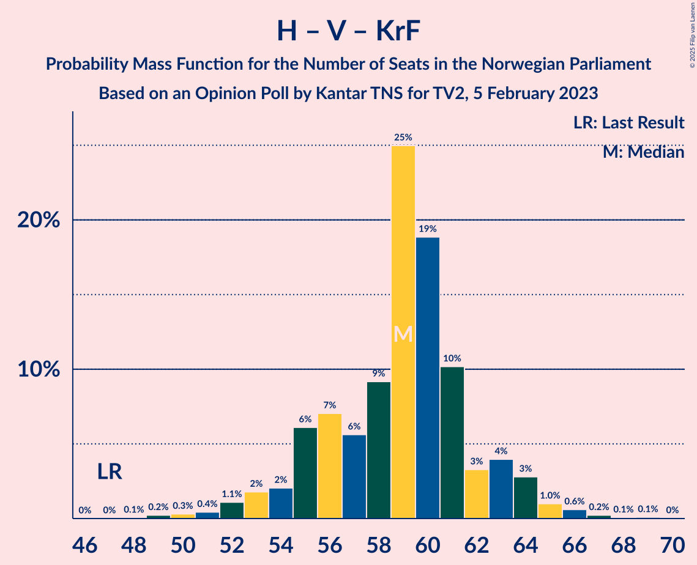

| Number of Seats | Probability | Accumulated | Special Marks |
|:---------------:|:-----------:|:-----------:|:-------------:|
| 47 | 0% | 100% | Last Result |
| 48 | 0.1% | 100% |  |
| 49 | 0.2% | 99.9% |  |
| 50 | 0.3% | 99.7% |  |
| 51 | 0.4% | 99.4% |  |
| 52 | 1.1% | 99.0% |  |
| 53 | 2% | 98% |  |
| 54 | 2% | 96% |  |
| 55 | 6% | 94% |  |
| 56 | 7% | 88% |  |
| 57 | 6% | 81% |  |
| 58 | 9% | 75% |  |
| 59 | 25% | 66% |  |
| 60 | 19% | 41% | Median |
| 61 | 10% | 22% |  |
| 62 | 3% | 12% |  |
| 63 | 4% | 9% |  |
| 64 | 3% | 5% |  |
| 65 | 1.0% | 2% |  |
| 66 | 0.6% | 1.0% |  |
| 67 | 0.2% | 0.4% |  |
| 68 | 0.1% | 0.2% |  |
| 69 | 0.1% | 0.1% |  |
| 70 | 0% | 0% |  |

### Arbeiderpartiet – Senterpartiet – Miljøpartiet De Grønne – Kristelig Folkeparti

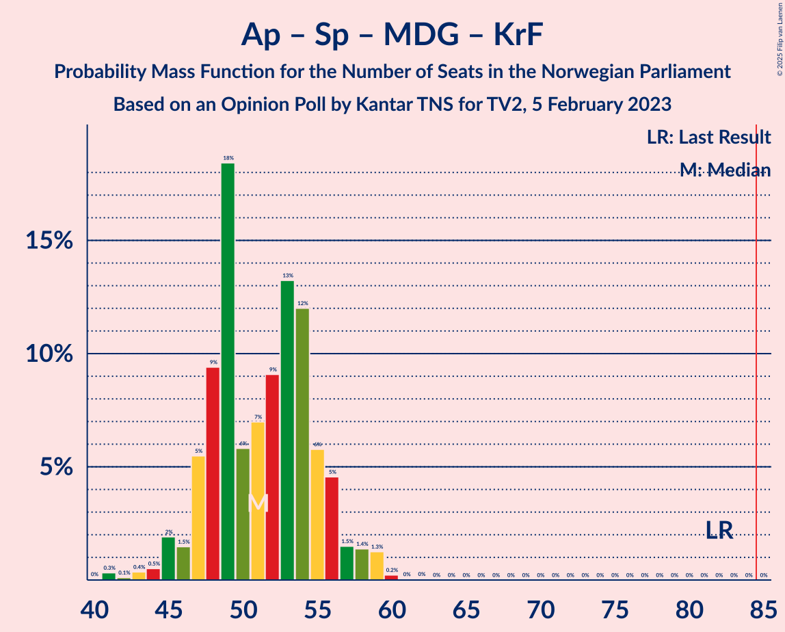

| Number of Seats | Probability | Accumulated | Special Marks |
|:---------------:|:-----------:|:-----------:|:-------------:|
| 40 | 0% | 100% |  |
| 41 | 0.3% | 99.9% |  |
| 42 | 0.1% | 99.6% |  |
| 43 | 0.4% | 99.5% |  |
| 44 | 0.5% | 99.1% |  |
| 45 | 2% | 98.6% |  |
| 46 | 1.5% | 97% |  |
| 47 | 5% | 95% |  |
| 48 | 9% | 90% |  |
| 49 | 18% | 80% |  |
| 50 | 6% | 62% |  |
| 51 | 7% | 56% | Median |
| 52 | 9% | 49% |  |
| 53 | 13% | 40% |  |
| 54 | 12% | 27% |  |
| 55 | 6% | 15% |  |
| 56 | 5% | 9% |  |
| 57 | 1.5% | 4% |  |
| 58 | 1.4% | 3% |  |
| 59 | 1.3% | 2% |  |
| 60 | 0.2% | 0.3% |  |
| 61 | 0% | 0.1% |  |
| 62 | 0% | 0.1% |  |
| 63 | 0% | 0% |  |
| 64 | 0% | 0% |  |
| 65 | 0% | 0% |  |
| 66 | 0% | 0% |  |
| 67 | 0% | 0% |  |
| 68 | 0% | 0% |  |
| 69 | 0% | 0% |  |
| 70 | 0% | 0% |  |
| 71 | 0% | 0% |  |
| 72 | 0% | 0% |  |
| 73 | 0% | 0% |  |
| 74 | 0% | 0% |  |
| 75 | 0% | 0% |  |
| 76 | 0% | 0% |  |
| 77 | 0% | 0% |  |
| 78 | 0% | 0% |  |
| 79 | 0% | 0% |  |
| 80 | 0% | 0% |  |
| 81 | 0% | 0% |  |
| 82 | 0% | 0% | Last Result |

### Arbeiderpartiet – Sosialistisk Venstreparti

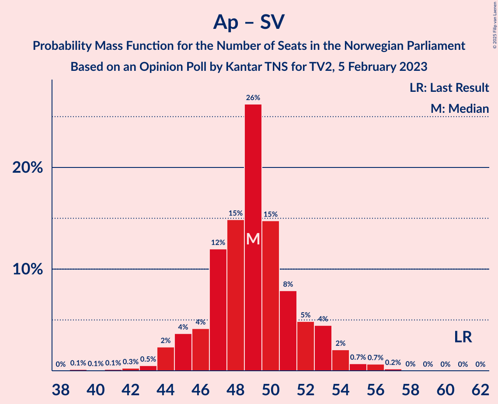

| Number of Seats | Probability | Accumulated | Special Marks |
|:---------------:|:-----------:|:-----------:|:-------------:|
| 39 | 0.1% | 100% |  |
| 40 | 0.1% | 99.8% |  |
| 41 | 0.1% | 99.8% |  |
| 42 | 0.3% | 99.6% |  |
| 43 | 0.5% | 99.4% |  |
| 44 | 2% | 98.9% |  |
| 45 | 4% | 97% |  |
| 46 | 4% | 93% |  |
| 47 | 12% | 89% |  |
| 48 | 15% | 77% |  |
| 49 | 26% | 62% | Median |
| 50 | 15% | 36% |  |
| 51 | 8% | 21% |  |
| 52 | 5% | 13% |  |
| 53 | 4% | 8% |  |
| 54 | 2% | 4% |  |
| 55 | 0.7% | 2% |  |
| 56 | 0.7% | 0.9% |  |
| 57 | 0.2% | 0.2% |  |
| 58 | 0% | 0.1% |  |
| 59 | 0% | 0% |  |
| 60 | 0% | 0% |  |
| 61 | 0% | 0% | Last Result |

### Arbeiderpartiet – Senterpartiet – Kristelig Folkeparti

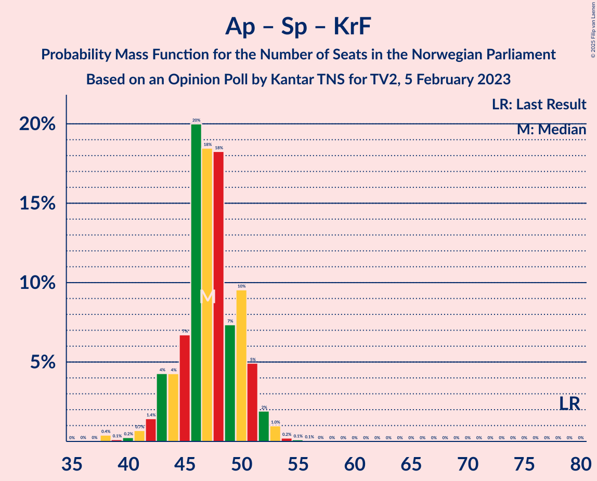

| Number of Seats | Probability | Accumulated | Special Marks |
|:---------------:|:-----------:|:-----------:|:-------------:|
| 38 | 0.4% | 100% |  |
| 39 | 0.1% | 99.6% |  |
| 40 | 0.2% | 99.5% |  |
| 41 | 0.7% | 99.2% |  |
| 42 | 1.4% | 98.5% |  |
| 43 | 4% | 97% |  |
| 44 | 4% | 93% |  |
| 45 | 7% | 89% |  |
| 46 | 20% | 82% |  |
| 47 | 18% | 62% |  |
| 48 | 18% | 43% | Median |
| 49 | 7% | 25% |  |
| 50 | 10% | 18% |  |
| 51 | 5% | 8% |  |
| 52 | 2% | 3% |  |
| 53 | 1.0% | 1.4% |  |
| 54 | 0.2% | 0.4% |  |
| 55 | 0.1% | 0.2% |  |
| 56 | 0.1% | 0.1% |  |
| 57 | 0% | 0% |  |
| 58 | 0% | 0% |  |
| 59 | 0% | 0% |  |
| 60 | 0% | 0% |  |
| 61 | 0% | 0% |  |
| 62 | 0% | 0% |  |
| 63 | 0% | 0% |  |
| 64 | 0% | 0% |  |
| 65 | 0% | 0% |  |
| 66 | 0% | 0% |  |
| 67 | 0% | 0% |  |
| 68 | 0% | 0% |  |
| 69 | 0% | 0% |  |
| 70 | 0% | 0% |  |
| 71 | 0% | 0% |  |
| 72 | 0% | 0% |  |
| 73 | 0% | 0% |  |
| 74 | 0% | 0% |  |
| 75 | 0% | 0% |  |
| 76 | 0% | 0% |  |
| 77 | 0% | 0% |  |
| 78 | 0% | 0% |  |
| 79 | 0% | 0% | Last Result |

### Arbeiderpartiet – Senterpartiet

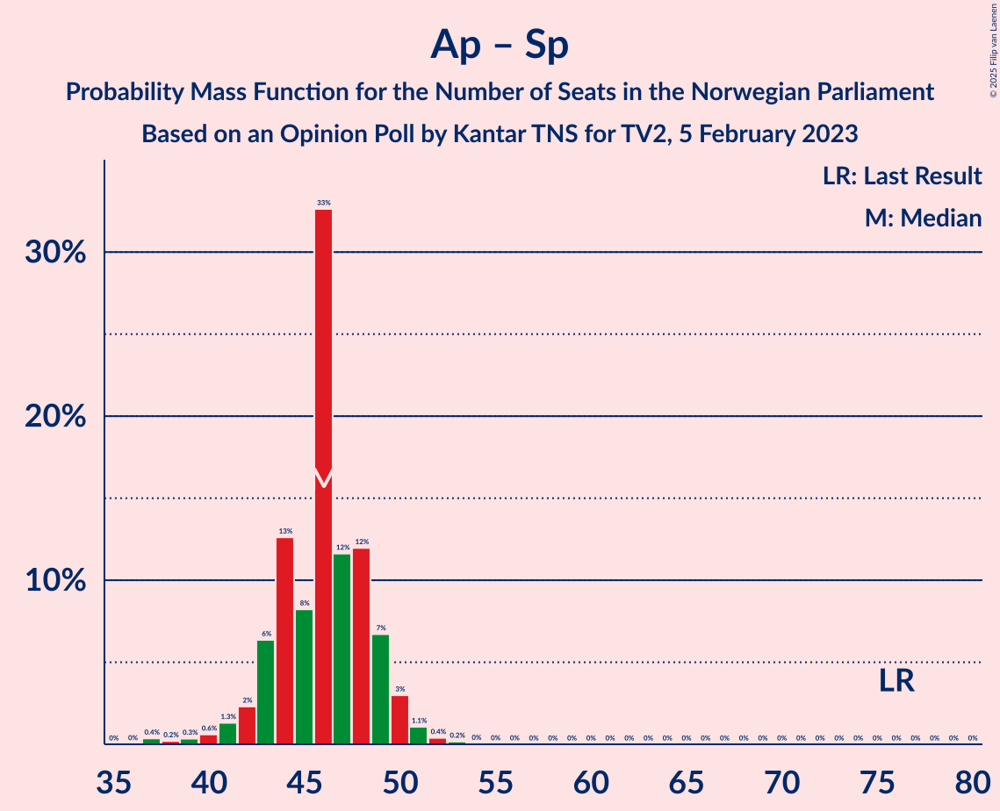

| Number of Seats | Probability | Accumulated | Special Marks |
|:---------------:|:-----------:|:-----------:|:-------------:|
| 37 | 0.4% | 100% |  |
| 38 | 0.2% | 99.6% |  |
| 39 | 0.3% | 99.4% |  |
| 40 | 0.6% | 99.1% |  |
| 41 | 1.3% | 98% |  |
| 42 | 2% | 97% |  |
| 43 | 6% | 95% |  |
| 44 | 13% | 88% |  |
| 45 | 8% | 76% |  |
| 46 | 33% | 68% | Median |
| 47 | 12% | 35% |  |
| 48 | 12% | 23% |  |
| 49 | 7% | 11% |  |
| 50 | 3% | 5% |  |
| 51 | 1.1% | 2% |  |
| 52 | 0.4% | 0.6% |  |
| 53 | 0.2% | 0.2% |  |
| 54 | 0% | 0.1% |  |
| 55 | 0% | 0% |  |
| 56 | 0% | 0% |  |
| 57 | 0% | 0% |  |
| 58 | 0% | 0% |  |
| 59 | 0% | 0% |  |
| 60 | 0% | 0% |  |
| 61 | 0% | 0% |  |
| 62 | 0% | 0% |  |
| 63 | 0% | 0% |  |
| 64 | 0% | 0% |  |
| 65 | 0% | 0% |  |
| 66 | 0% | 0% |  |
| 67 | 0% | 0% |  |
| 68 | 0% | 0% |  |
| 69 | 0% | 0% |  |
| 70 | 0% | 0% |  |
| 71 | 0% | 0% |  |
| 72 | 0% | 0% |  |
| 73 | 0% | 0% |  |
| 74 | 0% | 0% |  |
| 75 | 0% | 0% |  |
| 76 | 0% | 0% | Last Result |

### Senterpartiet – Venstre – Kristelig Folkeparti

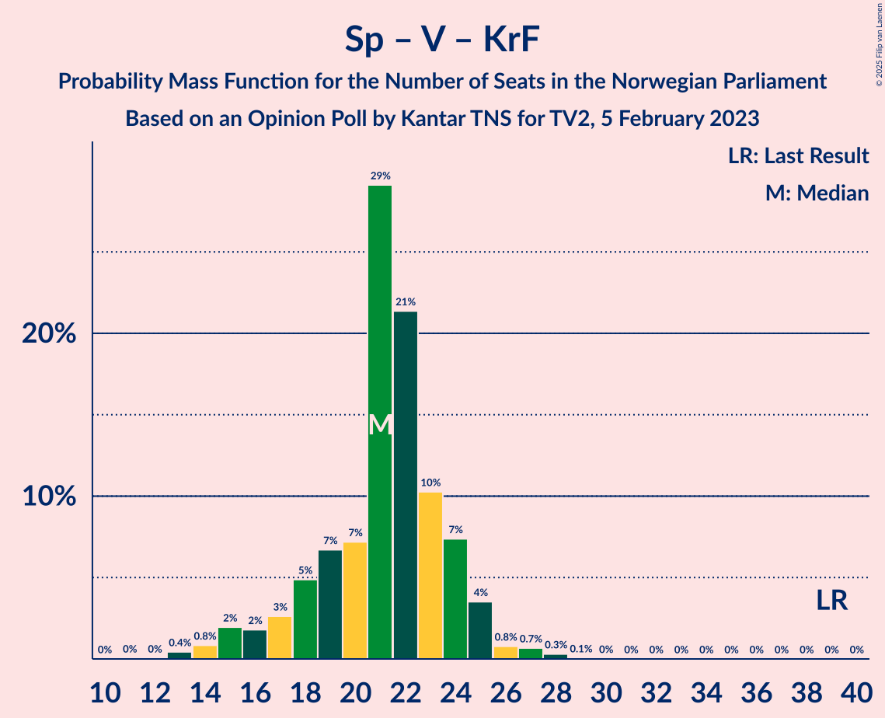

| Number of Seats | Probability | Accumulated | Special Marks |
|:---------------:|:-----------:|:-----------:|:-------------:|
| 11 | 0% | 100% |  |
| 12 | 0% | 99.9% |  |
| 13 | 0.4% | 99.9% |  |
| 14 | 0.8% | 99.5% |  |
| 15 | 2% | 98.6% |  |
| 16 | 2% | 97% |  |
| 17 | 3% | 95% |  |
| 18 | 5% | 92% |  |
| 19 | 7% | 87% |  |
| 20 | 7% | 81% |  |
| 21 | 29% | 73% |  |
| 22 | 21% | 44% | Median |
| 23 | 10% | 23% |  |
| 24 | 7% | 13% |  |
| 25 | 4% | 5% |  |
| 26 | 0.8% | 2% |  |
| 27 | 0.7% | 1.1% |  |
| 28 | 0.3% | 0.4% |  |
| 29 | 0.1% | 0.1% |  |
| 30 | 0% | 0% |  |
| 31 | 0% | 0% |  |
| 32 | 0% | 0% |  |
| 33 | 0% | 0% |  |
| 34 | 0% | 0% |  |
| 35 | 0% | 0% |  |
| 36 | 0% | 0% |  |
| 37 | 0% | 0% |  |
| 38 | 0% | 0% |  |
| 39 | 0% | 0% | Last Result |

## Technical Information

### Opinion Poll

+ **Polling firm:** Kantar TNS
+ **Commissioner(s):** TV2
+ **Fieldwork period:** 5 February 2023

### Calculations

+ **Sample size:** 977
+ **Simulations done:** 1,048,576
+ **Error estimate:** 1.42%

