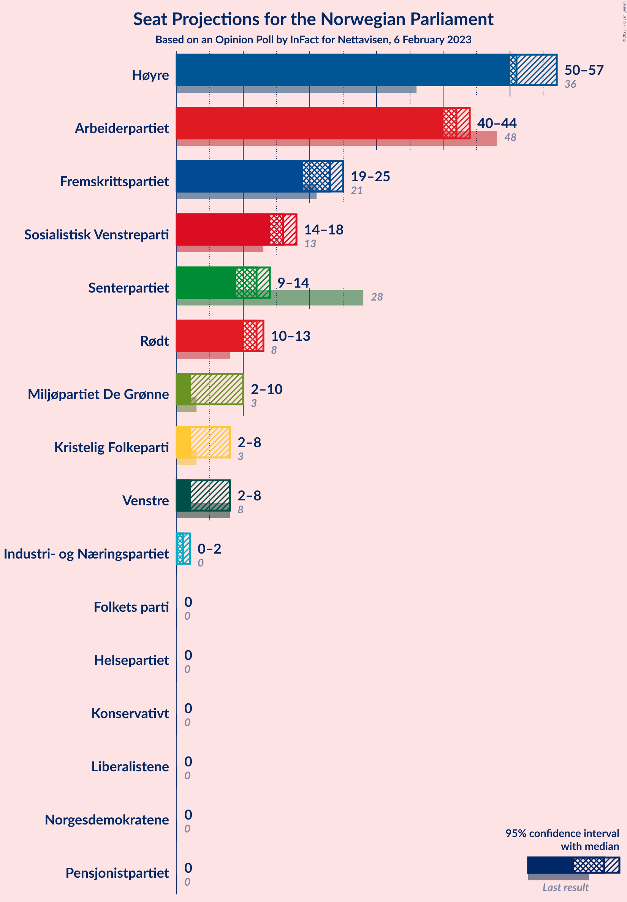
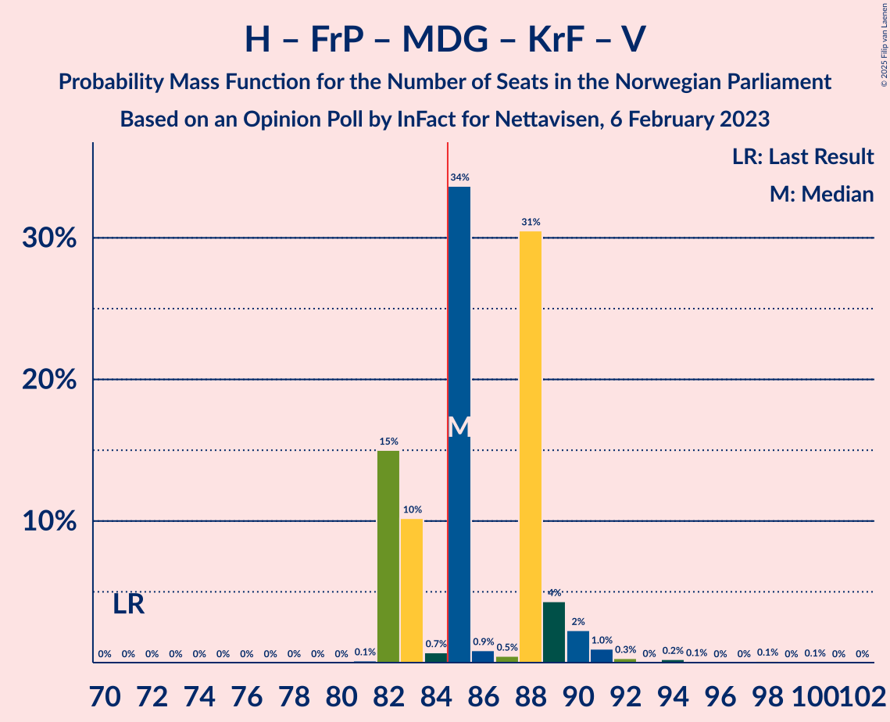

# Opinion Poll by InFact for Nettavisen, 6 February 2023

<a href="#voting-intentions">Voting Intentions</a> | <a href="#seats">Seats</a> | <a href="#coalitions">Coalitions</a> | <a href="#technical-information">Technical Information</a>

## Voting Intentions

### Confidence Intervals

| Party | Last Result | Poll Result | 80% Confidence Interval | 90% Confidence Interval | 95% Confidence Interval | 99% Confidence Interval |
|:-----:|:-----------:|:-----------:|:-----------------------:|:-----------------------:|:-----------------------:|:-----------------------:|
| Høyre | 20.4% | 30.8% | 29.0–32.7% |28.5–33.2% |28.1–33.7% |27.2–34.6% |
| Arbeiderpartiet | 26.2% | 21.2% | 19.6–22.9% |19.2–23.4% |18.8–23.8% |18.1–24.7% |
| Fremskrittspartiet | 11.6% | 12.3% | 11.1–13.7% |10.7–14.1% |10.4–14.5% |9.9–15.2% |
| Sosialistisk Venstreparti | 7.6% | 8.2% | 7.2–9.4% |7.0–9.8% |6.7–10.1% |6.2–10.7% |
| Rødt | 4.7% | 6.9% | 6.0–8.0% |5.7–8.3% |5.5–8.6% |5.1–9.2% |
| Senterpartiet | 13.5% | 5.6% | 4.8–6.7% |4.6–7.0% |4.4–7.2% |4.0–7.7% |
| Miljøpartiet De Grønne | 3.9% | 3.5% | 2.9–4.3% |2.7–4.6% |2.5–4.8% |2.3–5.2% |
| Kristelig Folkeparti | 3.8% | 3.3% | 2.7–4.1% |2.5–4.4% |2.4–4.6% |2.1–5.0% |
| Venstre | 4.6% | 3.1% | 2.5–3.9% |2.3–4.1% |2.2–4.4% |2.0–4.8% |
| Industri- og Næringspartiet | 0.3% | 2.1% | 1.6–2.8% |1.5–3.0% |1.4–3.2% |1.2–3.6% |
| Norgesdemokratene | 1.1% | 0.7% | 0.4–1.1% |0.4–1.3% |0.3–1.4% |0.2–1.7% |
| Pensjonistpartiet | 0.6% | 0.5% | 0.3–0.9% |0.2–1.0% |0.2–1.1% |0.1–1.4% |
| Konservativt | 0.4% | 0.4% | 0.2–0.8% |0.2–0.9% |0.2–1.0% |0.1–1.2% |
| Helsepartiet | 0.2% | 0.4% | 0.2–0.8% |0.2–0.9% |0.2–1.0% |0.1–1.2% |
| Liberalistene | 0.2% | 0.2% | 0.1–0.5% |0.1–0.6% |0.0–0.7% |0.0–0.9% |
| Folkets parti | 0.1% | 0.1% | 0.0–0.4% |0.0–0.5% |0.0–0.5% |0.0–0.7% |

*Note:* The poll result column reflects the actual value used in the calculations. Published results may vary slightly, and in addition be rounded to fewer digits.

## Seats

### Confidence Intervals

| Party | Last Result | Median | 80% Confidence Interval | 90% Confidence Interval | 95% Confidence Interval | 99% Confidence Interval |
|:-----:|:-----------:|:------:|:-----------------------:|:-----------------------:|:-----------------------:|:-----------------------:|
| <a href="#høyre">Høyre</a> | 36 | 51 | 50–53 |50–57 |50–57 |50–60 |
| <a href="#arbeiderpartiet">Arbeiderpartiet</a> | 48 | 42 | 41–44 |41–44 |40–44 |36–48 |
| <a href="#fremskrittspartiet">Fremskrittspartiet</a> | 21 | 23 | 23 |20–23 |19–25 |19–25 |
| <a href="#sosialistisk-venstreparti">Sosialistisk Venstreparti</a> | 13 | 16 | 14–18 |14–18 |14–18 |12–19 |
| <a href="#rødt">Rødt</a> | 8 | 12 | 10–12 |10–12 |10–13 |10–18 |
| <a href="#senterpartiet">Senterpartiet</a> | 28 | 12 | 10–14 |9–14 |9–14 |8–14 |
| <a href="#miljøpartiet-de-grønne">Miljøpartiet De Grønne</a> | 3 | 2 | 2–10 |2–10 |2–10 |1–10 |
| <a href="#kristelig-folkeparti">Kristelig Folkeparti</a> | 3 | 2 | 2 |2–3 |2–8 |1–9 |
| <a href="#venstre">Venstre</a> | 8 | 2 | 2–8 |2–8 |2–8 |1–8 |
| <a href="#industri--og-næringspartiet">Industri- og Næringspartiet</a> | 0 | 1 | 0–2 |0–2 |0–2 |0–2 |
| <a href="#norgesdemokratene">Norgesdemokratene</a> | 0 | 0 | 0 |0 |0 |0 |
| <a href="#pensjonistpartiet">Pensjonistpartiet</a> | 0 | 0 | 0 |0 |0 |0 |
| <a href="#konservativt">Konservativt</a> | 0 | 0 | 0 |0 |0 |0 |
| <a href="#helsepartiet">Helsepartiet</a> | 0 | 0 | 0 |0 |0 |0 |
| <a href="#liberalistene">Liberalistene</a> | 0 | 0 | 0 |0 |0 |0 |
| <a href="#folkets-parti">Folkets parti</a> | 0 | 0 | 0 |0 |0 |0 |

### Høyre

*For a full overview of the results for this party, see the [Høyre](party-høyre.html) page.*

| Number of Seats | Probability | Accumulated | Special Marks |
|:---------------:|:-----------:|:-----------:|:-------------:|
| 36 | 0% | 100% | Last Result |
| 37 | 0% | 100% |  |
| 38 | 0% | 100% |  |
| 39 | 0% | 100% |  |
| 40 | 0% | 100% |  |
| 41 | 0% | 100% |  |
| 42 | 0% | 100% |  |
| 43 | 0% | 100% |  |
| 44 | 0% | 100% |  |
| 45 | 0% | 100% |  |
| 46 | 0% | 100% |  |
| 47 | 0% | 100% |  |
| 48 | 0% | 100% |  |
| 49 | 0% | 100% |  |
| 50 | 34% | 99.9% |  |
| 51 | 32% | 66% | Median |
| 52 | 0.3% | 35% |  |
| 53 | 25% | 34% |  |
| 54 | 1.3% | 9% |  |
| 55 | 0.9% | 8% |  |
| 56 | 0.4% | 7% |  |
| 57 | 5% | 7% |  |
| 58 | 0.2% | 2% |  |
| 59 | 1.3% | 2% |  |
| 60 | 0.2% | 0.6% |  |
| 61 | 0.3% | 0.4% |  |
| 62 | 0% | 0.1% |  |
| 63 | 0% | 0% |  |

### Arbeiderpartiet

*For a full overview of the results for this party, see the [Arbeiderpartiet](party-arbeiderpartiet.html) page.*

| Number of Seats | Probability | Accumulated | Special Marks |
|:---------------:|:-----------:|:-----------:|:-------------:|
| 33 | 0.1% | 100% |  |
| 34 | 0% | 99.9% |  |
| 35 | 0.2% | 99.9% |  |
| 36 | 1.0% | 99.6% |  |
| 37 | 0% | 98.7% |  |
| 38 | 0.5% | 98.6% |  |
| 39 | 0.5% | 98% |  |
| 40 | 1.0% | 98% |  |
| 41 | 35% | 97% |  |
| 42 | 20% | 62% | Median |
| 43 | 0.1% | 42% |  |
| 44 | 41% | 42% |  |
| 45 | 0.5% | 1.3% |  |
| 46 | 0% | 0.8% |  |
| 47 | 0% | 0.8% |  |
| 48 | 0.4% | 0.7% | Last Result |
| 49 | 0% | 0.3% |  |
| 50 | 0.3% | 0.3% |  |
| 51 | 0% | 0% |  |

### Fremskrittspartiet

*For a full overview of the results for this party, see the [Fremskrittspartiet](party-fremskrittspartiet.html) page.*

| Number of Seats | Probability | Accumulated | Special Marks |
|:---------------:|:-----------:|:-----------:|:-------------:|
| 18 | 0.1% | 100% |  |
| 19 | 5% | 99.8% |  |
| 20 | 0.6% | 95% |  |
| 21 | 0.4% | 95% | Last Result |
| 22 | 0.7% | 94% |  |
| 23 | 89% | 94% | Median |
| 24 | 0.3% | 4% |  |
| 25 | 3% | 4% |  |
| 26 | 0.2% | 0.4% |  |
| 27 | 0% | 0.2% |  |
| 28 | 0% | 0.1% |  |
| 29 | 0.1% | 0.1% |  |
| 30 | 0% | 0% |  |

### Sosialistisk Venstreparti

*For a full overview of the results for this party, see the [Sosialistisk Venstreparti](party-sosialistiskvenstreparti.html) page.*

| Number of Seats | Probability | Accumulated | Special Marks |
|:---------------:|:-----------:|:-----------:|:-------------:|
| 12 | 0.5% | 100% |  |
| 13 | 1.1% | 99.5% | Last Result |
| 14 | 34% | 98% |  |
| 15 | 0.2% | 64% |  |
| 16 | 33% | 64% | Median |
| 17 | 1.3% | 32% |  |
| 18 | 29% | 30% |  |
| 19 | 0.5% | 0.8% |  |
| 20 | 0.1% | 0.3% |  |
| 21 | 0% | 0.2% |  |
| 22 | 0.2% | 0.2% |  |
| 23 | 0% | 0% |  |

### Rødt

*For a full overview of the results for this party, see the [Rødt](party-rødt.html) page.*

| Number of Seats | Probability | Accumulated | Special Marks |
|:---------------:|:-----------:|:-----------:|:-------------:|
| 8 | 0.3% | 100% | Last Result |
| 9 | 0% | 99.7% |  |
| 10 | 48% | 99.7% |  |
| 11 | 0.4% | 52% |  |
| 12 | 49% | 51% | Median |
| 13 | 0.6% | 3% |  |
| 14 | 0.5% | 2% |  |
| 15 | 0.5% | 2% |  |
| 16 | 0.1% | 1.1% |  |
| 17 | 0% | 1.1% |  |
| 18 | 0.9% | 1.0% |  |
| 19 | 0.1% | 0.1% |  |
| 20 | 0% | 0% |  |

### Senterpartiet

*For a full overview of the results for this party, see the [Senterpartiet](party-senterpartiet.html) page.*

| Number of Seats | Probability | Accumulated | Special Marks |
|:---------------:|:-----------:|:-----------:|:-------------:|
| 7 | 0% | 100% |  |
| 8 | 1.2% | 99.9% |  |
| 9 | 6% | 98.7% |  |
| 10 | 31% | 93% |  |
| 11 | 3% | 62% |  |
| 12 | 15% | 59% | Median |
| 13 | 10% | 44% |  |
| 14 | 34% | 34% |  |
| 15 | 0% | 0% |  |
| 16 | 0% | 0% |  |
| 17 | 0% | 0% |  |
| 18 | 0% | 0% |  |
| 19 | 0% | 0% |  |
| 20 | 0% | 0% |  |
| 21 | 0% | 0% |  |
| 22 | 0% | 0% |  |
| 23 | 0% | 0% |  |
| 24 | 0% | 0% |  |
| 25 | 0% | 0% |  |
| 26 | 0% | 0% |  |
| 27 | 0% | 0% |  |
| 28 | 0% | 0% | Last Result |

### Miljøpartiet De Grønne

*For a full overview of the results for this party, see the [Miljøpartiet De Grønne](party-miljøpartietdegrønne.html) page.*

| Number of Seats | Probability | Accumulated | Special Marks |
|:---------------:|:-----------:|:-----------:|:-------------:|
| 1 | 0.7% | 100% |  |
| 2 | 52% | 99.3% | Median |
| 3 | 12% | 47% | Last Result |
| 4 | 0% | 35% |  |
| 5 | 0% | 35% |  |
| 6 | 0% | 35% |  |
| 7 | 0.1% | 35% |  |
| 8 | 4% | 35% |  |
| 9 | 0.4% | 31% |  |
| 10 | 30% | 30% |  |
| 11 | 0% | 0% |  |

### Kristelig Folkeparti

*For a full overview of the results for this party, see the [Kristelig Folkeparti](party-kristeligfolkeparti.html) page.*

| Number of Seats | Probability | Accumulated | Special Marks |
|:---------------:|:-----------:|:-----------:|:-------------:|
| 0 | 0.5% | 100% |  |
| 1 | 0.1% | 99.5% |  |
| 2 | 90% | 99.4% | Median |
| 3 | 6% | 9% | Last Result |
| 4 | 0% | 3% |  |
| 5 | 0% | 3% |  |
| 6 | 0% | 3% |  |
| 7 | 0.5% | 3% |  |
| 8 | 1.4% | 3% |  |
| 9 | 1.3% | 1.3% |  |
| 10 | 0% | 0% |  |

### Venstre

*For a full overview of the results for this party, see the [Venstre](party-venstre.html) page.*

| Number of Seats | Probability | Accumulated | Special Marks |
|:---------------:|:-----------:|:-----------:|:-------------:|
| 0 | 0.1% | 100% |  |
| 1 | 1.3% | 99.9% |  |
| 2 | 64% | 98.7% | Median |
| 3 | 0.8% | 35% |  |
| 4 | 0% | 34% |  |
| 5 | 0% | 34% |  |
| 6 | 0% | 34% |  |
| 7 | 0% | 34% |  |
| 8 | 34% | 34% | Last Result |
| 9 | 0.1% | 0.1% |  |
| 10 | 0% | 0% |  |

### Industri- og Næringspartiet

*For a full overview of the results for this party, see the [Industri- og Næringspartiet](party-industri-ognæringspartiet.html) page.*

| Number of Seats | Probability | Accumulated | Special Marks |
|:---------------:|:-----------:|:-----------:|:-------------:|
| 0 | 49% | 100% | Last Result |
| 1 | 1.0% | 51% | Median |
| 2 | 49% | 50% |  |
| 3 | 0.2% | 0.3% |  |
| 4 | 0% | 0.1% |  |
| 5 | 0% | 0.1% |  |
| 6 | 0% | 0.1% |  |
| 7 | 0% | 0.1% |  |
| 8 | 0.1% | 0.1% |  |
| 9 | 0% | 0% |  |

### Norgesdemokratene

*For a full overview of the results for this party, see the [Norgesdemokratene](party-norgesdemokratene.html) page.*

| Number of Seats | Probability | Accumulated | Special Marks |
|:---------------:|:-----------:|:-----------:|:-------------:|
| 0 | 100% | 100% | Last Result, Median |

### Pensjonistpartiet

*For a full overview of the results for this party, see the [Pensjonistpartiet](party-pensjonistpartiet.html) page.*

| Number of Seats | Probability | Accumulated | Special Marks |
|:---------------:|:-----------:|:-----------:|:-------------:|
| 0 | 100% | 100% | Last Result, Median |

### Konservativt

*For a full overview of the results for this party, see the [Konservativt](party-konservativt.html) page.*

| Number of Seats | Probability | Accumulated | Special Marks |
|:---------------:|:-----------:|:-----------:|:-------------:|
| 0 | 100% | 100% | Last Result, Median |

### Helsepartiet

*For a full overview of the results for this party, see the [Helsepartiet](party-helsepartiet.html) page.*

| Number of Seats | Probability | Accumulated | Special Marks |
|:---------------:|:-----------:|:-----------:|:-------------:|
| 0 | 100% | 100% | Last Result, Median |

### Liberalistene

*For a full overview of the results for this party, see the [Liberalistene](party-liberalistene.html) page.*

| Number of Seats | Probability | Accumulated | Special Marks |
|:---------------:|:-----------:|:-----------:|:-------------:|
| 0 | 100% | 100% | Last Result, Median |

### Folkets parti

*For a full overview of the results for this party, see the [Folkets parti](party-folketsparti.html) page.*

| Number of Seats | Probability | Accumulated | Special Marks |
|:---------------:|:-----------:|:-----------:|:-------------:|
| 0 | 100% | 100% | Last Result, Median |

## Coalitions

### Confidence Intervals

| Coalition | Last Result | Median | Majority? | 80% Confidence Interval | 90% Confidence Interval | 95% Confidence Interval | 99% Confidence Interval |
|:---------:|:-----------:|:------:|:---------:|:-----------------------:|:-----------------------:|:-----------------------:|:-----------------------:|
| Høyre – Fremskrittspartiet – Senterpartiet – Kristelig Folkeparti – Venstre | 96 | 92 | 100% | 88–97 | 88–97 | 88–98 | 88–100 |
| Høyre – Fremskrittspartiet – Miljøpartiet De Grønne – Kristelig Folkeparti – Venstre | 71 | 85 | 74% | 82–88 | 82–89 | 82–90 | 82–94 |
| Arbeiderpartiet – Sosialistisk Venstreparti – Rødt – Senterpartiet – Miljøpartiet De Grønne | 100 | 86 | 61% | 83–90 | 83–90 | 80–90 | 77–90 |
| Høyre – Fremskrittspartiet – Kristelig Folkeparti – Venstre | 68 | 80 | 4% | 78–83 | 78–83 | 78–88 | 78–90 |
| Arbeiderpartiet – Sosialistisk Venstreparti – Rødt – Senterpartiet | 97 | 81 | 10% | 80–85 | 79–85 | 78–85 | 74–85 |
| Arbeiderpartiet – Sosialistisk Venstreparti – Senterpartiet – Miljøpartiet De Grønne – Kristelig Folkeparti | 95 | 76 | 0% | 73–82 | 73–82 | 73–82 | 65–82 |
| Høyre – Fremskrittspartiet – Venstre | 65 | 78 | 2% | 76–81 | 76–81 | 76–81 | 76–86 |
| Arbeiderpartiet – Sosialistisk Venstreparti – Rødt – Miljøpartiet De Grønne | 72 | 74 | 0% | 69–80 | 69–80 | 69–80 | 66–80 |
| Arbeiderpartiet – Sosialistisk Venstreparti – Senterpartiet – Miljøpartiet De Grønne | 92 | 74 | 0% | 71–80 | 71–80 | 68–80 | 62–80 |
| Høyre – Fremskrittspartiet | 57 | 74 | 0.2% | 73–76 | 73–76 | 73–79 | 73–84 |
| Arbeiderpartiet – Sosialistisk Venstreparti – Senterpartiet | 89 | 70 | 0% | 69–75 | 68–75 | 66–75 | 60–75 |
| Arbeiderpartiet – Senterpartiet – Miljøpartiet De Grønne – Kristelig Folkeparti | 82 | 59 | 0% | 58–66 | 58–66 | 56–66 | 51–66 |
| Høyre – Kristelig Folkeparti – Venstre | 47 | 57 | 0% | 55–60 | 55–62 | 55–63 | 55–65 |
| Arbeiderpartiet – Sosialistisk Venstreparti | 61 | 60 | 0% | 55–62 | 55–62 | 55–62 | 49–64 |
| Arbeiderpartiet – Senterpartiet – Kristelig Folkeparti | 79 | 56 | 0% | 56–59 | 54–59 | 54–59 | 49–61 |
| Arbeiderpartiet – Senterpartiet | 76 | 54 | 0% | 53–57 | 51–57 | 49–57 | 47–57 |
| Senterpartiet – Kristelig Folkeparti – Venstre | 39 | 16 | 0% | 14–24 | 14–24 | 14–24 | 12–24 |

### Høyre – Fremskrittspartiet – Senterpartiet – Kristelig Folkeparti – Venstre

| Number of Seats | Probability | Accumulated | Special Marks |
|:---------------:|:-----------:|:-----------:|:-------------:|
| 86 | 0.3% | 100% |  |
| 87 | 0% | 99.7% |  |
| 88 | 31% | 99.7% |  |
| 89 | 0.2% | 69% |  |
| 90 | 4% | 69% | Median |
| 91 | 0.4% | 65% |  |
| 92 | 16% | 64% |  |
| 93 | 10% | 49% |  |
| 94 | 0.3% | 38% |  |
| 95 | 0.3% | 38% |  |
| 96 | 0% | 38% | Last Result |
| 97 | 34% | 38% |  |
| 98 | 2% | 4% |  |
| 99 | 1.0% | 2% |  |
| 100 | 0.2% | 0.7% |  |
| 101 | 0% | 0.5% |  |
| 102 | 0.2% | 0.4% |  |
| 103 | 0.2% | 0.3% |  |
| 104 | 0% | 0% |  |

### Høyre – Fremskrittspartiet – Miljøpartiet De Grønne – Kristelig Folkeparti – Venstre

| Number of Seats | Probability | Accumulated | Special Marks |
|:---------------:|:-----------:|:-----------:|:-------------:|
| 71 | 0% | 100% | Last Result |
| 72 | 0% | 100% |  |
| 73 | 0% | 100% |  |
| 74 | 0% | 100% |  |
| 75 | 0% | 100% |  |
| 76 | 0% | 100% |  |
| 77 | 0% | 100% |  |
| 78 | 0% | 100% |  |
| 79 | 0% | 100% |  |
| 80 | 0% | 100% | Median |
| 81 | 0.1% | 100% |  |
| 82 | 15% | 99.8% |  |
| 83 | 10% | 85% |  |
| 84 | 0.7% | 75% |  |
| 85 | 34% | 74% | Majority |
| 86 | 0.9% | 40% |  |
| 87 | 0.5% | 39% |  |
| 88 | 31% | 39% |  |
| 89 | 4% | 8% |  |
| 90 | 2% | 4% |  |
| 91 | 1.0% | 2% |  |
| 92 | 0.3% | 0.8% |  |
| 93 | 0% | 0.5% |  |
| 94 | 0.2% | 0.5% |  |
| 95 | 0.1% | 0.3% |  |
| 96 | 0% | 0.2% |  |
| 97 | 0% | 0.2% |  |
| 98 | 0.1% | 0.2% |  |
| 99 | 0% | 0.1% |  |
| 100 | 0.1% | 0.1% |  |
| 101 | 0% | 0% |  |

### Arbeiderpartiet – Sosialistisk Venstreparti – Rødt – Senterpartiet – Miljøpartiet De Grønne

| Number of Seats | Probability | Accumulated | Special Marks |
|:---------------:|:-----------:|:-----------:|:-------------:|
| 74 | 0% | 100% |  |
| 75 | 0.2% | 99.9% |  |
| 76 | 0% | 99.7% |  |
| 77 | 0.2% | 99.7% |  |
| 78 | 1.1% | 99.5% |  |
| 79 | 0% | 98% |  |
| 80 | 1.1% | 98% |  |
| 81 | 1.5% | 97% |  |
| 82 | 0.1% | 96% |  |
| 83 | 34% | 96% |  |
| 84 | 1.0% | 62% | Median |
| 85 | 0.8% | 61% | Majority |
| 86 | 15% | 60% |  |
| 87 | 4% | 45% |  |
| 88 | 10% | 41% |  |
| 89 | 0% | 31% |  |
| 90 | 31% | 31% |  |
| 91 | 0% | 0% |  |
| 92 | 0% | 0% |  |
| 93 | 0% | 0% |  |
| 94 | 0% | 0% |  |
| 95 | 0% | 0% |  |
| 96 | 0% | 0% |  |
| 97 | 0% | 0% |  |
| 98 | 0% | 0% |  |
| 99 | 0% | 0% |  |
| 100 | 0% | 0% | Last Result |

### Høyre – Fremskrittspartiet – Kristelig Folkeparti – Venstre

| Number of Seats | Probability | Accumulated | Special Marks |
|:---------------:|:-----------:|:-----------:|:-------------:|
| 68 | 0% | 100% | Last Result |
| 69 | 0% | 100% |  |
| 70 | 0% | 100% |  |
| 71 | 0% | 100% |  |
| 72 | 0% | 100% |  |
| 73 | 0% | 100% |  |
| 74 | 0% | 100% |  |
| 75 | 0% | 100% |  |
| 76 | 0% | 100% |  |
| 77 | 0% | 100% |  |
| 78 | 31% | 100% | Median |
| 79 | 0.3% | 69% |  |
| 80 | 25% | 69% |  |
| 81 | 4% | 44% |  |
| 82 | 0.4% | 40% |  |
| 83 | 34% | 39% |  |
| 84 | 0.5% | 5% |  |
| 85 | 0.2% | 4% | Majority |
| 86 | 0.2% | 4% |  |
| 87 | 1.4% | 4% |  |
| 88 | 0.9% | 3% |  |
| 89 | 1.0% | 2% |  |
| 90 | 0.2% | 0.6% |  |
| 91 | 0.2% | 0.5% |  |
| 92 | 0% | 0.3% |  |
| 93 | 0.2% | 0.3% |  |
| 94 | 0% | 0% |  |

### Arbeiderpartiet – Sosialistisk Venstreparti – Rødt – Senterpartiet

| Number of Seats | Probability | Accumulated | Special Marks |
|:---------------:|:-----------:|:-----------:|:-------------:|
| 68 | 0.1% | 100% |  |
| 69 | 0% | 99.9% |  |
| 70 | 0.1% | 99.9% |  |
| 71 | 0% | 99.8% |  |
| 72 | 0% | 99.8% |  |
| 73 | 0.1% | 99.8% |  |
| 74 | 0.2% | 99.7% |  |
| 75 | 0% | 99.5% |  |
| 76 | 1.3% | 99.4% |  |
| 77 | 0.1% | 98% |  |
| 78 | 2% | 98% |  |
| 79 | 4% | 96% |  |
| 80 | 31% | 91% |  |
| 81 | 34% | 61% |  |
| 82 | 1.3% | 27% | Median |
| 83 | 0.3% | 26% |  |
| 84 | 15% | 25% |  |
| 85 | 10% | 10% | Majority |
| 86 | 0.1% | 0.1% |  |
| 87 | 0% | 0% |  |
| 88 | 0% | 0% |  |
| 89 | 0% | 0% |  |
| 90 | 0% | 0% |  |
| 91 | 0% | 0% |  |
| 92 | 0% | 0% |  |
| 93 | 0% | 0% |  |
| 94 | 0% | 0% |  |
| 95 | 0% | 0% |  |
| 96 | 0% | 0% |  |
| 97 | 0% | 0% | Last Result |

### Arbeiderpartiet – Sosialistisk Venstreparti – Senterpartiet – Miljøpartiet De Grønne – Kristelig Folkeparti

| Number of Seats | Probability | Accumulated | Special Marks |
|:---------------:|:-----------:|:-----------:|:-------------:|
| 64 | 0.1% | 100% |  |
| 65 | 0.9% | 99.9% |  |
| 66 | 0% | 99.0% |  |
| 67 | 0.2% | 99.0% |  |
| 68 | 0% | 98.8% |  |
| 69 | 0.1% | 98.8% |  |
| 70 | 0.2% | 98.6% |  |
| 71 | 0.3% | 98% |  |
| 72 | 0.4% | 98% |  |
| 73 | 34% | 98% |  |
| 74 | 0.6% | 64% | Median |
| 75 | 0.2% | 63% |  |
| 76 | 16% | 63% |  |
| 77 | 0% | 47% |  |
| 78 | 0.5% | 47% |  |
| 79 | 0% | 47% |  |
| 80 | 16% | 47% |  |
| 81 | 0.3% | 31% |  |
| 82 | 31% | 31% |  |
| 83 | 0% | 0% |  |
| 84 | 0% | 0% |  |
| 85 | 0% | 0% | Majority |
| 86 | 0% | 0% |  |
| 87 | 0% | 0% |  |
| 88 | 0% | 0% |  |
| 89 | 0% | 0% |  |
| 90 | 0% | 0% |  |
| 91 | 0% | 0% |  |
| 92 | 0% | 0% |  |
| 93 | 0% | 0% |  |
| 94 | 0% | 0% |  |
| 95 | 0% | 0% | Last Result |

### Høyre – Fremskrittspartiet – Venstre

| Number of Seats | Probability | Accumulated | Special Marks |
|:---------------:|:-----------:|:-----------:|:-------------:|
| 65 | 0% | 100% | Last Result |
| 66 | 0% | 100% |  |
| 67 | 0% | 100% |  |
| 68 | 0% | 100% |  |
| 69 | 0% | 100% |  |
| 70 | 0% | 100% |  |
| 71 | 0% | 100% |  |
| 72 | 0% | 100% |  |
| 73 | 0% | 100% |  |
| 74 | 0% | 100% |  |
| 75 | 0% | 100% |  |
| 76 | 31% | 100% | Median |
| 77 | 0.3% | 69% |  |
| 78 | 30% | 68% |  |
| 79 | 0.3% | 38% |  |
| 80 | 0.7% | 38% |  |
| 81 | 35% | 37% |  |
| 82 | 0.1% | 2% |  |
| 83 | 0.1% | 2% |  |
| 84 | 0.3% | 2% |  |
| 85 | 1.1% | 2% | Majority |
| 86 | 0.3% | 0.5% |  |
| 87 | 0% | 0.2% |  |
| 88 | 0.2% | 0.2% |  |
| 89 | 0% | 0.1% |  |
| 90 | 0% | 0% |  |

### Arbeiderpartiet – Sosialistisk Venstreparti – Rødt – Miljøpartiet De Grønne

| Number of Seats | Probability | Accumulated | Special Marks |
|:---------------:|:-----------:|:-----------:|:-------------:|
| 65 | 0.2% | 100% |  |
| 66 | 0.2% | 99.7% |  |
| 67 | 0% | 99.5% |  |
| 68 | 0.2% | 99.5% |  |
| 69 | 36% | 99.3% |  |
| 70 | 1.3% | 64% |  |
| 71 | 0.1% | 62% |  |
| 72 | 0.3% | 62% | Last Result, Median |
| 73 | 0.5% | 62% |  |
| 74 | 15% | 61% |  |
| 75 | 10% | 46% |  |
| 76 | 0.7% | 36% |  |
| 77 | 0.4% | 36% |  |
| 78 | 4% | 35% |  |
| 79 | 0% | 31% |  |
| 80 | 30% | 31% |  |
| 81 | 0% | 0.3% |  |
| 82 | 0.3% | 0.3% |  |
| 83 | 0% | 0% |  |

### Arbeiderpartiet – Sosialistisk Venstreparti – Senterpartiet – Miljøpartiet De Grønne

| Number of Seats | Probability | Accumulated | Special Marks |
|:---------------:|:-----------:|:-----------:|:-------------:|
| 61 | 0% | 100% |  |
| 62 | 0.9% | 99.9% |  |
| 63 | 0% | 99.0% |  |
| 64 | 0% | 99.0% |  |
| 65 | 0% | 98.9% |  |
| 66 | 0.1% | 98.9% |  |
| 67 | 0.6% | 98.9% |  |
| 68 | 1.1% | 98% |  |
| 69 | 0.3% | 97% |  |
| 70 | 0.5% | 97% |  |
| 71 | 35% | 96% |  |
| 72 | 0.2% | 61% | Median |
| 73 | 0.1% | 61% |  |
| 74 | 15% | 61% |  |
| 75 | 0.5% | 46% |  |
| 76 | 0% | 45% |  |
| 77 | 4% | 45% |  |
| 78 | 10% | 41% |  |
| 79 | 0.3% | 31% |  |
| 80 | 30% | 30% |  |
| 81 | 0% | 0% |  |
| 82 | 0% | 0% |  |
| 83 | 0% | 0% |  |
| 84 | 0% | 0% |  |
| 85 | 0% | 0% | Majority |
| 86 | 0% | 0% |  |
| 87 | 0% | 0% |  |
| 88 | 0% | 0% |  |
| 89 | 0% | 0% |  |
| 90 | 0% | 0% |  |
| 91 | 0% | 0% |  |
| 92 | 0% | 0% | Last Result |

### Høyre – Fremskrittspartiet

| Number of Seats | Probability | Accumulated | Special Marks |
|:---------------:|:-----------:|:-----------:|:-------------:|
| 57 | 0% | 100% | Last Result |
| 58 | 0% | 100% |  |
| 59 | 0% | 100% |  |
| 60 | 0% | 100% |  |
| 61 | 0% | 100% |  |
| 62 | 0% | 100% |  |
| 63 | 0% | 100% |  |
| 64 | 0% | 100% |  |
| 65 | 0% | 100% |  |
| 66 | 0% | 100% |  |
| 67 | 0% | 100% |  |
| 68 | 0% | 100% |  |
| 69 | 0% | 100% |  |
| 70 | 0% | 100% |  |
| 71 | 0% | 99.9% |  |
| 72 | 0.1% | 99.9% |  |
| 73 | 34% | 99.9% |  |
| 74 | 31% | 66% | Median |
| 75 | 0.2% | 35% |  |
| 76 | 30% | 35% |  |
| 77 | 0.2% | 4% |  |
| 78 | 0.7% | 4% |  |
| 79 | 1.4% | 4% |  |
| 80 | 0.2% | 2% |  |
| 81 | 0.1% | 2% |  |
| 82 | 0.4% | 2% |  |
| 83 | 0.3% | 1.4% |  |
| 84 | 0.9% | 1.1% |  |
| 85 | 0% | 0.2% | Majority |
| 86 | 0% | 0.2% |  |
| 87 | 0.2% | 0.2% |  |
| 88 | 0% | 0% |  |

### Arbeiderpartiet – Sosialistisk Venstreparti – Senterpartiet

| Number of Seats | Probability | Accumulated | Special Marks |
|:---------------:|:-----------:|:-----------:|:-------------:|
| 59 | 0% | 100% |  |
| 60 | 1.1% | 99.9% |  |
| 61 | 0% | 98.8% |  |
| 62 | 0.1% | 98.8% |  |
| 63 | 0.1% | 98.7% |  |
| 64 | 0.2% | 98.6% |  |
| 65 | 0.2% | 98% |  |
| 66 | 1.3% | 98% |  |
| 67 | 0.2% | 97% |  |
| 68 | 2% | 97% |  |
| 69 | 38% | 95% |  |
| 70 | 31% | 57% | Median |
| 71 | 0.1% | 26% |  |
| 72 | 16% | 26% |  |
| 73 | 0.1% | 10% |  |
| 74 | 0% | 10% |  |
| 75 | 10% | 10% |  |
| 76 | 0% | 0% |  |
| 77 | 0% | 0% |  |
| 78 | 0% | 0% |  |
| 79 | 0% | 0% |  |
| 80 | 0% | 0% |  |
| 81 | 0% | 0% |  |
| 82 | 0% | 0% |  |
| 83 | 0% | 0% |  |
| 84 | 0% | 0% |  |
| 85 | 0% | 0% | Majority |
| 86 | 0% | 0% |  |
| 87 | 0% | 0% |  |
| 88 | 0% | 0% |  |
| 89 | 0% | 0% | Last Result |

### Arbeiderpartiet – Senterpartiet – Miljøpartiet De Grønne – Kristelig Folkeparti

| Number of Seats | Probability | Accumulated | Special Marks |
|:---------------:|:-----------:|:-----------:|:-------------:|
| 48 | 0% | 100% |  |
| 49 | 0.2% | 99.9% |  |
| 50 | 0.2% | 99.8% |  |
| 51 | 0.1% | 99.5% |  |
| 52 | 0.9% | 99.5% |  |
| 53 | 0% | 98.6% |  |
| 54 | 0.5% | 98.6% |  |
| 55 | 0.2% | 98% |  |
| 56 | 0.5% | 98% |  |
| 57 | 0.2% | 97% |  |
| 58 | 15% | 97% | Median |
| 59 | 35% | 82% |  |
| 60 | 0.3% | 47% |  |
| 61 | 0.1% | 47% |  |
| 62 | 14% | 47% |  |
| 63 | 0.1% | 33% |  |
| 64 | 1.3% | 32% |  |
| 65 | 0% | 31% |  |
| 66 | 31% | 31% |  |
| 67 | 0% | 0.3% |  |
| 68 | 0% | 0.3% |  |
| 69 | 0.3% | 0.3% |  |
| 70 | 0% | 0% |  |
| 71 | 0% | 0% |  |
| 72 | 0% | 0% |  |
| 73 | 0% | 0% |  |
| 74 | 0% | 0% |  |
| 75 | 0% | 0% |  |
| 76 | 0% | 0% |  |
| 77 | 0% | 0% |  |
| 78 | 0% | 0% |  |
| 79 | 0% | 0% |  |
| 80 | 0% | 0% |  |
| 81 | 0% | 0% |  |
| 82 | 0% | 0% | Last Result |

### Høyre – Kristelig Folkeparti – Venstre

| Number of Seats | Probability | Accumulated | Special Marks |
|:---------------:|:-----------:|:-----------:|:-------------:|
| 47 | 0% | 100% | Last Result |
| 48 | 0% | 100% |  |
| 49 | 0% | 100% |  |
| 50 | 0% | 100% |  |
| 51 | 0% | 100% |  |
| 52 | 0% | 100% |  |
| 53 | 0% | 100% |  |
| 54 | 0% | 100% |  |
| 55 | 30% | 100% | Median |
| 56 | 0.2% | 70% |  |
| 57 | 25% | 69% |  |
| 58 | 0.4% | 44% |  |
| 59 | 0% | 44% |  |
| 60 | 34% | 44% |  |
| 61 | 0.4% | 10% |  |
| 62 | 6% | 9% |  |
| 63 | 1.2% | 3% |  |
| 64 | 1.5% | 2% |  |
| 65 | 0.4% | 0.8% |  |
| 66 | 0% | 0.4% |  |
| 67 | 0% | 0.3% |  |
| 68 | 0% | 0.3% |  |
| 69 | 0.3% | 0.3% |  |
| 70 | 0% | 0% |  |

### Arbeiderpartiet – Sosialistisk Venstreparti

| Number of Seats | Probability | Accumulated | Special Marks |
|:---------------:|:-----------:|:-----------:|:-------------:|
| 46 | 0.1% | 100% |  |
| 47 | 0% | 99.9% |  |
| 48 | 0% | 99.9% |  |
| 49 | 0.9% | 99.9% |  |
| 50 | 0% | 99.0% |  |
| 51 | 0.1% | 98.9% |  |
| 52 | 0.1% | 98.8% |  |
| 53 | 0.3% | 98.7% |  |
| 54 | 0.2% | 98% |  |
| 55 | 34% | 98% |  |
| 56 | 0.6% | 65% |  |
| 57 | 3% | 64% |  |
| 58 | 0.3% | 61% | Median |
| 59 | 0.2% | 61% |  |
| 60 | 50% | 61% |  |
| 61 | 0.1% | 11% | Last Result |
| 62 | 10% | 11% |  |
| 63 | 0% | 0.9% |  |
| 64 | 0.9% | 0.9% |  |
| 65 | 0% | 0% |  |

### Arbeiderpartiet – Senterpartiet – Kristelig Folkeparti

| Number of Seats | Probability | Accumulated | Special Marks |
|:---------------:|:-----------:|:-----------:|:-------------:|
| 47 | 0.2% | 100% |  |
| 48 | 0% | 99.8% |  |
| 49 | 0.3% | 99.7% |  |
| 50 | 0.9% | 99.5% |  |
| 51 | 0.2% | 98.5% |  |
| 52 | 0.4% | 98% |  |
| 53 | 0.1% | 98% |  |
| 54 | 5% | 98% |  |
| 55 | 0.2% | 93% |  |
| 56 | 46% | 93% | Median |
| 57 | 35% | 47% |  |
| 58 | 0% | 12% |  |
| 59 | 10% | 12% |  |
| 60 | 0.3% | 2% |  |
| 61 | 1.3% | 2% |  |
| 62 | 0% | 0.4% |  |
| 63 | 0% | 0.4% |  |
| 64 | 0.4% | 0.4% |  |
| 65 | 0% | 0% |  |
| 66 | 0% | 0% |  |
| 67 | 0% | 0% |  |
| 68 | 0% | 0% |  |
| 69 | 0% | 0% |  |
| 70 | 0% | 0% |  |
| 71 | 0% | 0% |  |
| 72 | 0% | 0% |  |
| 73 | 0% | 0% |  |
| 74 | 0% | 0% |  |
| 75 | 0% | 0% |  |
| 76 | 0% | 0% |  |
| 77 | 0% | 0% |  |
| 78 | 0% | 0% |  |
| 79 | 0% | 0% | Last Result |

### Arbeiderpartiet – Senterpartiet

| Number of Seats | Probability | Accumulated | Special Marks |
|:---------------:|:-----------:|:-----------:|:-------------:|
| 45 | 0% | 100% |  |
| 46 | 0.1% | 99.9% |  |
| 47 | 1.4% | 99.9% |  |
| 48 | 0.3% | 98% |  |
| 49 | 1.1% | 98% |  |
| 50 | 0.3% | 97% |  |
| 51 | 4% | 97% |  |
| 52 | 2% | 92% |  |
| 53 | 0.6% | 90% |  |
| 54 | 45% | 90% | Median |
| 55 | 34% | 44% |  |
| 56 | 0.5% | 11% |  |
| 57 | 10% | 10% |  |
| 58 | 0.3% | 0.4% |  |
| 59 | 0% | 0% |  |
| 60 | 0% | 0% |  |
| 61 | 0% | 0% |  |
| 62 | 0% | 0% |  |
| 63 | 0% | 0% |  |
| 64 | 0% | 0% |  |
| 65 | 0% | 0% |  |
| 66 | 0% | 0% |  |
| 67 | 0% | 0% |  |
| 68 | 0% | 0% |  |
| 69 | 0% | 0% |  |
| 70 | 0% | 0% |  |
| 71 | 0% | 0% |  |
| 72 | 0% | 0% |  |
| 73 | 0% | 0% |  |
| 74 | 0% | 0% |  |
| 75 | 0% | 0% |  |
| 76 | 0% | 0% | Last Result |

### Senterpartiet – Kristelig Folkeparti – Venstre

| Number of Seats | Probability | Accumulated | Special Marks |
|:---------------:|:-----------:|:-----------:|:-------------:|
| 11 | 0.2% | 100% |  |
| 12 | 0.5% | 99.8% |  |
| 13 | 0.6% | 99.3% |  |
| 14 | 35% | 98.7% |  |
| 15 | 1.2% | 63% |  |
| 16 | 15% | 62% | Median |
| 17 | 10% | 47% |  |
| 18 | 0.7% | 37% |  |
| 19 | 1.0% | 36% |  |
| 20 | 0.3% | 35% |  |
| 21 | 0% | 35% |  |
| 22 | 1.3% | 35% |  |
| 23 | 0.1% | 34% |  |
| 24 | 34% | 34% |  |
| 25 | 0% | 0% |  |
| 26 | 0% | 0% |  |
| 27 | 0% | 0% |  |
| 28 | 0% | 0% |  |
| 29 | 0% | 0% |  |
| 30 | 0% | 0% |  |
| 31 | 0% | 0% |  |
| 32 | 0% | 0% |  |
| 33 | 0% | 0% |  |
| 34 | 0% | 0% |  |
| 35 | 0% | 0% |  |
| 36 | 0% | 0% |  |
| 37 | 0% | 0% |  |
| 38 | 0% | 0% |  |
| 39 | 0% | 0% | Last Result |

## Technical Information

### Opinion Poll

+ **Polling firm:** InFact
+ **Commissioner(s):** Nettavisen
+ **Fieldwork period:** 6 February 2023

### Calculations

+ **Sample size:** 1032
+ **Simulations done:** 1,048,576
+ **Error estimate:** 2.42%

