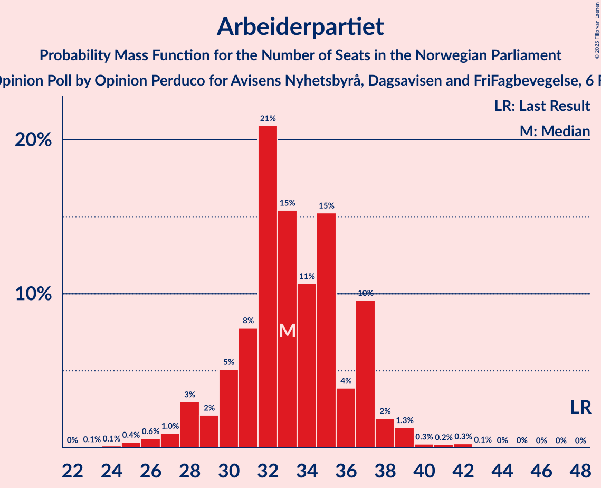
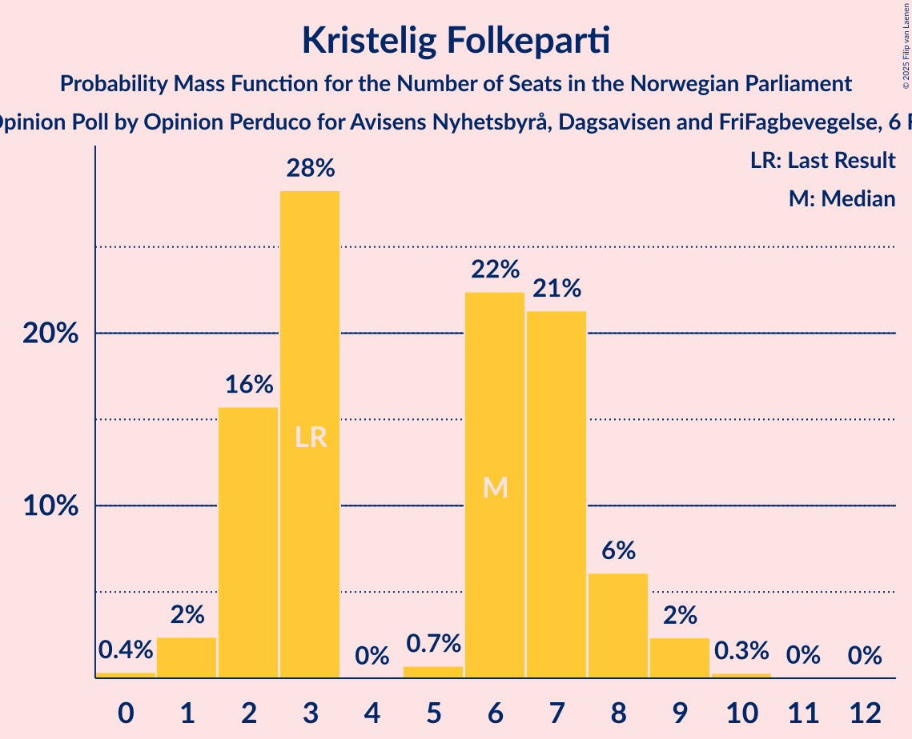
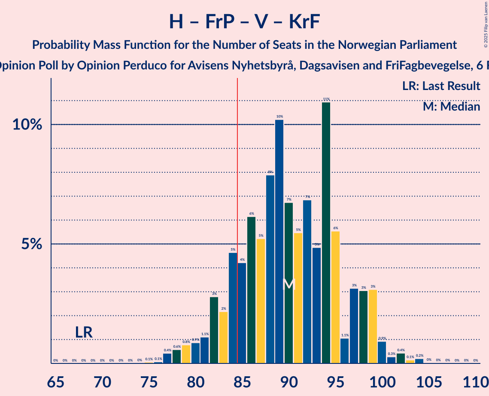

# Opinion Poll by Opinion Perduco for Avisens Nyhetsbyrå, Dagsavisen and FriFagbevegelse, 6 February 2023

<a href="#voting-intentions">Voting Intentions</a> | <a href="#seats">Seats</a> | <a href="#coalitions">Coalitions</a> | <a href="#technical-information">Technical Information</a>

## Voting Intentions

### Confidence Intervals

| Party | Last Result | Poll Result | 80% Confidence Interval | 90% Confidence Interval | 95% Confidence Interval | 99% Confidence Interval |
|:-----:|:-----------:|:-----------:|:-----------------------:|:-----------------------:|:-----------------------:|:-----------------------:|
| Høyre | 20.4% | 31.9% | 29.6–34.2% |29.0–34.9% |28.4–35.5% |27.4–36.6% |
| Arbeiderpartiet | 26.2% | 16.7% | 15.0–18.7% |14.5–19.3% |14.1–19.8% |13.3–20.7% |
| Fremskrittspartiet | 11.6% | 12.7% | 11.2–14.5% |10.8–15.0% |10.4–15.5% |9.7–16.4% |
| Sosialistisk Venstreparti | 7.6% | 8.7% | 7.5–10.3% |7.1–10.7% |6.8–11.1% |6.3–11.9% |
| Rødt | 4.7% | 7.9% | 6.7–9.3% |6.3–9.8% |6.1–10.1% |5.5–10.9% |
| Senterpartiet | 13.5% | 5.0% | 4.1–6.3% |3.8–6.6% |3.6–7.0% |3.2–7.6% |
| Venstre | 4.6% | 4.1% | 3.3–5.3% |3.1–5.6% |2.9–5.9% |2.5–6.5% |
| Kristelig Folkeparti | 3.8% | 3.9% | 3.0–5.0% |2.8–5.3% |2.6–5.6% |2.3–6.2% |
| Miljøpartiet De Grønne | 3.9% | 3.6% | 2.8–4.6% |2.6–5.0% |2.4–5.2% |2.1–5.8% |

*Note:* The poll result column reflects the actual value used in the calculations. Published results may vary slightly, and in addition be rounded to fewer digits.

## Seats

### Confidence Intervals

| Party | Last Result | Median | 80% Confidence Interval | 90% Confidence Interval | 95% Confidence Interval | 99% Confidence Interval |
|:-----:|:-----------:|:------:|:-----------------------:|:-----------------------:|:-----------------------:|:-----------------------:|
| <a href="#høyre">Høyre</a> | 36 | 57 | 52–64 |51–65 |50–66 |48–69 |
| <a href="#arbeiderpartiet">Arbeiderpartiet</a> | 48 | 33 | 30–37 |28–37 |28–38 |25–41 |
| <a href="#fremskrittspartiet">Fremskrittspartiet</a> | 21 | 23 | 18–29 |18–29 |17–30 |17–32 |
| <a href="#sosialistisk-venstreparti">Sosialistisk Venstreparti</a> | 13 | 14 | 10–17 |10–18 |9–18 |8–20 |
| <a href="#rødt">Rødt</a> | 8 | 12 | 10–15 |9–16 |8–17 |8–19 |
| <a href="#senterpartiet">Senterpartiet</a> | 28 | 7 | 6–10 |2–12 |1–13 |0–14 |
| <a href="#venstre">Venstre</a> | 8 | 6 | 2–8 |2–8 |2–9 |2–10 |
| <a href="#kristelig-folkeparti">Kristelig Folkeparti</a> | 3 | 6 | 2–7 |2–8 |1–9 |1–9 |
| <a href="#miljøpartiet-de-grønne">Miljøpartiet De Grønne</a> | 3 | 2 | 1–7 |1–7 |1–8 |1–9 |

### Høyre

*For a full overview of the results for this party, see the [Høyre](party-høyre.html) page.*

| Number of Seats | Probability | Accumulated | Special Marks |
|:---------------:|:-----------:|:-----------:|:-------------:|
| 36 | 0% | 100% | Last Result |
| 37 | 0% | 100% |  |
| 38 | 0% | 100% |  |
| 39 | 0% | 100% |  |
| 40 | 0% | 100% |  |
| 41 | 0% | 100% |  |
| 42 | 0% | 100% |  |
| 43 | 0% | 100% |  |
| 44 | 0% | 100% |  |
| 45 | 0% | 100% |  |
| 46 | 0.1% | 100% |  |
| 47 | 0.2% | 99.9% |  |
| 48 | 0.5% | 99.7% |  |
| 49 | 1.0% | 99.2% |  |
| 50 | 2% | 98% |  |
| 51 | 4% | 97% |  |
| 52 | 6% | 92% |  |
| 53 | 9% | 86% |  |
| 54 | 9% | 77% |  |
| 55 | 4% | 67% |  |
| 56 | 3% | 64% |  |
| 57 | 15% | 60% | Median |
| 58 | 6% | 45% |  |
| 59 | 10% | 39% |  |
| 60 | 8% | 29% |  |
| 61 | 4% | 20% |  |
| 62 | 2% | 16% |  |
| 63 | 3% | 14% |  |
| 64 | 5% | 11% |  |
| 65 | 2% | 7% |  |
| 66 | 3% | 5% |  |
| 67 | 0.9% | 2% |  |
| 68 | 0.4% | 1.1% |  |
| 69 | 0.3% | 0.7% |  |
| 70 | 0.2% | 0.4% |  |
| 71 | 0.1% | 0.2% |  |
| 72 | 0% | 0% |  |

### Arbeiderpartiet

*For a full overview of the results for this party, see the [Arbeiderpartiet](party-arbeiderpartiet.html) page.*

| Number of Seats | Probability | Accumulated | Special Marks |
|:---------------:|:-----------:|:-----------:|:-------------:|
| 22 | 0% | 100% |  |
| 23 | 0.1% | 99.9% |  |
| 24 | 0.1% | 99.9% |  |
| 25 | 0.4% | 99.7% |  |
| 26 | 0.6% | 99.4% |  |
| 27 | 1.0% | 98.8% |  |
| 28 | 3% | 98% |  |
| 29 | 2% | 95% |  |
| 30 | 5% | 93% |  |
| 31 | 8% | 88% |  |
| 32 | 21% | 80% |  |
| 33 | 15% | 59% | Median |
| 34 | 11% | 43% |  |
| 35 | 15% | 33% |  |
| 36 | 4% | 18% |  |
| 37 | 10% | 14% |  |
| 38 | 2% | 4% |  |
| 39 | 1.3% | 2% |  |
| 40 | 0.3% | 0.9% |  |
| 41 | 0.2% | 0.6% |  |
| 42 | 0.3% | 0.4% |  |
| 43 | 0.1% | 0.1% |  |
| 44 | 0% | 0.1% |  |
| 45 | 0% | 0% |  |
| 46 | 0% | 0% |  |
| 47 | 0% | 0% |  |
| 48 | 0% | 0% | Last Result |

### Fremskrittspartiet

*For a full overview of the results for this party, see the [Fremskrittspartiet](party-fremskrittspartiet.html) page.*

| Number of Seats | Probability | Accumulated | Special Marks |
|:---------------:|:-----------:|:-----------:|:-------------:|
| 16 | 0.1% | 100% |  |
| 17 | 4% | 99.9% |  |
| 18 | 10% | 96% |  |
| 19 | 7% | 86% |  |
| 20 | 7% | 79% |  |
| 21 | 11% | 72% | Last Result |
| 22 | 11% | 61% |  |
| 23 | 13% | 50% | Median |
| 24 | 6% | 37% |  |
| 25 | 9% | 31% |  |
| 26 | 4% | 22% |  |
| 27 | 3% | 18% |  |
| 28 | 5% | 15% |  |
| 29 | 6% | 10% |  |
| 30 | 3% | 4% |  |
| 31 | 0.9% | 2% |  |
| 32 | 0.5% | 0.9% |  |
| 33 | 0.2% | 0.4% |  |
| 34 | 0.1% | 0.2% |  |
| 35 | 0.1% | 0.1% |  |
| 36 | 0% | 0% |  |

### Sosialistisk Venstreparti

*For a full overview of the results for this party, see the [Sosialistisk Venstreparti](party-sosialistiskvenstreparti.html) page.*

| Number of Seats | Probability | Accumulated | Special Marks |
|:---------------:|:-----------:|:-----------:|:-------------:|
| 8 | 0.8% | 100% |  |
| 9 | 3% | 99.2% |  |
| 10 | 9% | 96% |  |
| 11 | 7% | 86% |  |
| 12 | 19% | 80% |  |
| 13 | 11% | 61% | Last Result |
| 14 | 13% | 50% | Median |
| 15 | 13% | 38% |  |
| 16 | 10% | 24% |  |
| 17 | 8% | 14% |  |
| 18 | 4% | 6% |  |
| 19 | 1.0% | 2% |  |
| 20 | 0.9% | 1.1% |  |
| 21 | 0.1% | 0.2% |  |
| 22 | 0% | 0.1% |  |
| 23 | 0% | 0% |  |

### Rødt

*For a full overview of the results for this party, see the [Rødt](party-rødt.html) page.*

| Number of Seats | Probability | Accumulated | Special Marks |
|:---------------:|:-----------:|:-----------:|:-------------:|
| 7 | 0.2% | 100% |  |
| 8 | 3% | 99.8% | Last Result |
| 9 | 6% | 97% |  |
| 10 | 12% | 91% |  |
| 11 | 18% | 79% |  |
| 12 | 25% | 61% | Median |
| 13 | 15% | 36% |  |
| 14 | 8% | 21% |  |
| 15 | 7% | 13% |  |
| 16 | 2% | 6% |  |
| 17 | 3% | 4% |  |
| 18 | 0.8% | 1.4% |  |
| 19 | 0.4% | 0.6% |  |
| 20 | 0.2% | 0.3% |  |
| 21 | 0.1% | 0.1% |  |
| 22 | 0% | 0% |  |

### Senterpartiet

*For a full overview of the results for this party, see the [Senterpartiet](party-senterpartiet.html) page.*

| Number of Seats | Probability | Accumulated | Special Marks |
|:---------------:|:-----------:|:-----------:|:-------------:|
| 0 | 2% | 100% |  |
| 1 | 3% | 98% |  |
| 2 | 0.8% | 95% |  |
| 3 | 0% | 94% |  |
| 4 | 0% | 94% |  |
| 5 | 0.9% | 94% |  |
| 6 | 20% | 93% |  |
| 7 | 25% | 73% | Median |
| 8 | 20% | 48% |  |
| 9 | 14% | 28% |  |
| 10 | 5% | 14% |  |
| 11 | 4% | 9% |  |
| 12 | 2% | 5% |  |
| 13 | 2% | 3% |  |
| 14 | 0.9% | 1.0% |  |
| 15 | 0.1% | 0.1% |  |
| 16 | 0% | 0.1% |  |
| 17 | 0% | 0% |  |
| 18 | 0% | 0% |  |
| 19 | 0% | 0% |  |
| 20 | 0% | 0% |  |
| 21 | 0% | 0% |  |
| 22 | 0% | 0% |  |
| 23 | 0% | 0% |  |
| 24 | 0% | 0% |  |
| 25 | 0% | 0% |  |
| 26 | 0% | 0% |  |
| 27 | 0% | 0% |  |
| 28 | 0% | 0% | Last Result |

### Venstre

*For a full overview of the results for this party, see the [Venstre](party-venstre.html) page.*

| Number of Seats | Probability | Accumulated | Special Marks |
|:---------------:|:-----------:|:-----------:|:-------------:|
| 1 | 0.2% | 100% |  |
| 2 | 25% | 99.8% |  |
| 3 | 13% | 75% |  |
| 4 | 0% | 62% |  |
| 5 | 2% | 62% |  |
| 6 | 21% | 60% | Median |
| 7 | 22% | 39% |  |
| 8 | 13% | 17% | Last Result |
| 9 | 3% | 4% |  |
| 10 | 0.9% | 1.1% |  |
| 11 | 0.3% | 0.3% |  |
| 12 | 0% | 0% |  |

### Kristelig Folkeparti

*For a full overview of the results for this party, see the [Kristelig Folkeparti](party-kristeligfolkeparti.html) page.*

| Number of Seats | Probability | Accumulated | Special Marks |
|:---------------:|:-----------:|:-----------:|:-------------:|
| 0 | 0.4% | 100% |  |
| 1 | 2% | 99.6% |  |
| 2 | 16% | 97% |  |
| 3 | 28% | 82% | Last Result |
| 4 | 0% | 53% |  |
| 5 | 0.7% | 53% |  |
| 6 | 22% | 53% | Median |
| 7 | 21% | 30% |  |
| 8 | 6% | 9% |  |
| 9 | 2% | 3% |  |
| 10 | 0.3% | 0.4% |  |
| 11 | 0% | 0.1% |  |
| 12 | 0% | 0% |  |

### Miljøpartiet De Grønne

*For a full overview of the results for this party, see the [Miljøpartiet De Grønne](party-miljøpartietdegrønne.html) page.*

| Number of Seats | Probability | Accumulated | Special Marks |
|:---------------:|:-----------:|:-----------:|:-------------:|
| 1 | 13% | 100% |  |
| 2 | 47% | 87% | Median |
| 3 | 12% | 40% | Last Result |
| 4 | 0.1% | 28% |  |
| 5 | 1.1% | 27% |  |
| 6 | 13% | 26% |  |
| 7 | 9% | 13% |  |
| 8 | 4% | 4% |  |
| 9 | 0.5% | 0.6% |  |
| 10 | 0.1% | 0.1% |  |
| 11 | 0% | 0% |  |

## Coalitions

### Confidence Intervals

| Coalition | Last Result | Median | Majority? | 80% Confidence Interval | 90% Confidence Interval | 95% Confidence Interval | 99% Confidence Interval |
|:---------:|:-----------:|:------:|:---------:|:-----------------------:|:-----------------------:|:-----------------------:|:-----------------------:|
| Høyre – Fremskrittspartiet – Senterpartiet – Venstre – Kristelig Folkeparti | 96 | 97 | 99.9% | 92–103 | 91–105 | 89–106 | 86–109 |
| Høyre – Fremskrittspartiet – Venstre – Kristelig Folkeparti – Miljøpartiet De Grønne | 71 | 94 | 96% | 86–100 | 85–101 | 84–102 | 80–105 |
| Høyre – Fremskrittspartiet – Venstre – Kristelig Folkeparti | 68 | 90 | 86% | 84–97 | 82–99 | 80–99 | 77–102 |
| Høyre – Fremskrittspartiet – Venstre | 65 | 86 | 59% | 79–92 | 77–93 | 75–95 | 74–98 |
| Høyre – Fremskrittspartiet | 57 | 80 | 17% | 74–86 | 73–87 | 72–89 | 70–92 |
| Arbeiderpartiet – Sosialistisk Venstreparti – Rødt – Senterpartiet – Miljøpartiet De Grønne | 100 | 70 | 0% | 63–76 | 62–78 | 61–79 | 58–82 |
| Høyre – Venstre – Kristelig Folkeparti | 47 | 68 | 0% | 61–73 | 59–75 | 58–77 | 55–79 |
| Arbeiderpartiet – Sosialistisk Venstreparti – Rødt – Senterpartiet | 97 | 66 | 0% | 61–72 | 59–74 | 58–76 | 55–79 |
| Arbeiderpartiet – Sosialistisk Venstreparti – Rødt – Miljøpartiet De Grønne | 72 | 62 | 0% | 57–67 | 56–69 | 54–71 | 51–74 |
| Arbeiderpartiet – Sosialistisk Venstreparti – Senterpartiet – Kristelig Folkeparti – Miljøpartiet De Grønne | 95 | 62 | 0% | 56–68 | 55–70 | 53–71 | 51–73 |
| Arbeiderpartiet – Sosialistisk Venstreparti – Senterpartiet – Miljøpartiet De Grønne | 92 | 58 | 0% | 52–63 | 50–64 | 50–66 | 47–69 |
| Arbeiderpartiet – Sosialistisk Venstreparti – Senterpartiet | 89 | 54 | 0% | 50–59 | 48–61 | 47–62 | 44–65 |
| Arbeiderpartiet – Senterpartiet – Kristelig Folkeparti – Miljøpartiet De Grønne | 82 | 49 | 0% | 43–55 | 42–55 | 40–56 | 38–60 |
| Arbeiderpartiet – Sosialistisk Venstreparti | 61 | 47 | 0% | 43–51 | 41–52 | 41–54 | 38–55 |
| Arbeiderpartiet – Senterpartiet – Kristelig Folkeparti | 79 | 46 | 0% | 40–50 | 39–52 | 37–53 | 34–56 |
| Arbeiderpartiet – Senterpartiet | 76 | 41 | 0% | 37–45 | 35–46 | 34–47 | 31–50 |
| Senterpartiet – Venstre – Kristelig Folkeparti | 39 | 18 | 0% | 13–21 | 11–23 | 10–24 | 6–27 |

### Høyre – Fremskrittspartiet – Senterpartiet – Venstre – Kristelig Folkeparti

| Number of Seats | Probability | Accumulated | Special Marks |
|:---------------:|:-----------:|:-----------:|:-------------:|
| 83 | 0% | 100% |  |
| 84 | 0.1% | 99.9% |  |
| 85 | 0.2% | 99.9% | Majority |
| 86 | 0.2% | 99.6% |  |
| 87 | 0.5% | 99.5% |  |
| 88 | 1.1% | 99.0% |  |
| 89 | 1.4% | 98% |  |
| 90 | 1.4% | 96% |  |
| 91 | 3% | 95% |  |
| 92 | 3% | 92% |  |
| 93 | 7% | 89% |  |
| 94 | 5% | 83% |  |
| 95 | 9% | 78% |  |
| 96 | 10% | 68% | Last Result |
| 97 | 10% | 58% |  |
| 98 | 9% | 48% |  |
| 99 | 4% | 40% | Median |
| 100 | 6% | 36% |  |
| 101 | 11% | 30% |  |
| 102 | 3% | 18% |  |
| 103 | 6% | 15% |  |
| 104 | 2% | 10% |  |
| 105 | 4% | 7% |  |
| 106 | 2% | 3% |  |
| 107 | 0.6% | 2% |  |
| 108 | 0.5% | 1.1% |  |
| 109 | 0.2% | 0.6% |  |
| 110 | 0.1% | 0.3% |  |
| 111 | 0.2% | 0.2% |  |
| 112 | 0% | 0.1% |  |
| 113 | 0% | 0% |  |

### Høyre – Fremskrittspartiet – Venstre – Kristelig Folkeparti – Miljøpartiet De Grønne

| Number of Seats | Probability | Accumulated | Special Marks |
|:---------------:|:-----------:|:-----------:|:-------------:|
| 71 | 0% | 100% | Last Result |
| 72 | 0% | 100% |  |
| 73 | 0% | 100% |  |
| 74 | 0% | 100% |  |
| 75 | 0% | 100% |  |
| 76 | 0% | 100% |  |
| 77 | 0% | 100% |  |
| 78 | 0.2% | 100% |  |
| 79 | 0.1% | 99.8% |  |
| 80 | 0.5% | 99.7% |  |
| 81 | 0.2% | 99.3% |  |
| 82 | 0.4% | 99.1% |  |
| 83 | 1.2% | 98.7% |  |
| 84 | 2% | 98% |  |
| 85 | 2% | 96% | Majority |
| 86 | 4% | 94% |  |
| 87 | 3% | 90% |  |
| 88 | 2% | 86% |  |
| 89 | 4% | 84% |  |
| 90 | 7% | 80% |  |
| 91 | 9% | 73% |  |
| 92 | 6% | 64% |  |
| 93 | 7% | 59% |  |
| 94 | 6% | 51% | Median |
| 95 | 9% | 45% |  |
| 96 | 11% | 36% |  |
| 97 | 7% | 26% |  |
| 98 | 4% | 19% |  |
| 99 | 4% | 15% |  |
| 100 | 3% | 11% |  |
| 101 | 5% | 8% |  |
| 102 | 1.3% | 4% |  |
| 103 | 1.0% | 2% |  |
| 104 | 0.2% | 1.1% |  |
| 105 | 0.5% | 0.9% |  |
| 106 | 0.3% | 0.5% |  |
| 107 | 0.1% | 0.2% |  |
| 108 | 0% | 0.1% |  |
| 109 | 0% | 0% |  |

### Høyre – Fremskrittspartiet – Venstre – Kristelig Folkeparti

| Number of Seats | Probability | Accumulated | Special Marks |
|:---------------:|:-----------:|:-----------:|:-------------:|
| 68 | 0% | 100% | Last Result |
| 69 | 0% | 100% |  |
| 70 | 0% | 100% |  |
| 71 | 0% | 100% |  |
| 72 | 0% | 100% |  |
| 73 | 0% | 100% |  |
| 74 | 0% | 100% |  |
| 75 | 0.1% | 100% |  |
| 76 | 0.1% | 99.9% |  |
| 77 | 0.4% | 99.9% |  |
| 78 | 0.6% | 99.4% |  |
| 79 | 0.8% | 98.8% |  |
| 80 | 0.9% | 98% |  |
| 81 | 1.1% | 97% |  |
| 82 | 3% | 96% |  |
| 83 | 2% | 93% |  |
| 84 | 5% | 91% |  |
| 85 | 4% | 86% | Majority |
| 86 | 6% | 82% |  |
| 87 | 5% | 76% |  |
| 88 | 8% | 71% |  |
| 89 | 10% | 63% |  |
| 90 | 7% | 53% |  |
| 91 | 5% | 46% |  |
| 92 | 7% | 41% | Median |
| 93 | 5% | 34% |  |
| 94 | 11% | 29% |  |
| 95 | 6% | 18% |  |
| 96 | 1.1% | 12% |  |
| 97 | 3% | 11% |  |
| 98 | 3% | 8% |  |
| 99 | 3% | 5% |  |
| 100 | 0.9% | 2% |  |
| 101 | 0.3% | 1.1% |  |
| 102 | 0.4% | 0.8% |  |
| 103 | 0.1% | 0.4% |  |
| 104 | 0.2% | 0.3% |  |
| 105 | 0% | 0.1% |  |
| 106 | 0% | 0% |  |

### Høyre – Fremskrittspartiet – Venstre

| Number of Seats | Probability | Accumulated | Special Marks |
|:---------------:|:-----------:|:-----------:|:-------------:|
| 65 | 0% | 100% | Last Result |
| 66 | 0% | 100% |  |
| 67 | 0% | 100% |  |
| 68 | 0% | 100% |  |
| 69 | 0% | 100% |  |
| 70 | 0% | 100% |  |
| 71 | 0% | 100% |  |
| 72 | 0.1% | 100% |  |
| 73 | 0.1% | 99.9% |  |
| 74 | 0.6% | 99.7% |  |
| 75 | 2% | 99.2% |  |
| 76 | 1.3% | 97% |  |
| 77 | 1.3% | 96% |  |
| 78 | 2% | 95% |  |
| 79 | 3% | 92% |  |
| 80 | 7% | 89% |  |
| 81 | 4% | 82% |  |
| 82 | 7% | 78% |  |
| 83 | 4% | 71% |  |
| 84 | 8% | 67% |  |
| 85 | 7% | 59% | Majority |
| 86 | 10% | 51% | Median |
| 87 | 11% | 41% |  |
| 88 | 6% | 30% |  |
| 89 | 6% | 24% |  |
| 90 | 2% | 18% |  |
| 91 | 5% | 16% |  |
| 92 | 3% | 11% |  |
| 93 | 3% | 8% |  |
| 94 | 2% | 4% |  |
| 95 | 0.9% | 3% |  |
| 96 | 0.6% | 2% |  |
| 97 | 0.5% | 1.1% |  |
| 98 | 0.3% | 0.6% |  |
| 99 | 0.2% | 0.3% |  |
| 100 | 0.1% | 0.1% |  |
| 101 | 0% | 0% |  |

### Høyre – Fremskrittspartiet

| Number of Seats | Probability | Accumulated | Special Marks |
|:---------------:|:-----------:|:-----------:|:-------------:|
| 57 | 0% | 100% | Last Result |
| 58 | 0% | 100% |  |
| 59 | 0% | 100% |  |
| 60 | 0% | 100% |  |
| 61 | 0% | 100% |  |
| 62 | 0% | 100% |  |
| 63 | 0% | 100% |  |
| 64 | 0% | 100% |  |
| 65 | 0% | 100% |  |
| 66 | 0% | 100% |  |
| 67 | 0% | 100% |  |
| 68 | 0.1% | 100% |  |
| 69 | 0.2% | 99.9% |  |
| 70 | 0.6% | 99.7% |  |
| 71 | 0.6% | 99.1% |  |
| 72 | 3% | 98.5% |  |
| 73 | 3% | 96% |  |
| 74 | 5% | 93% |  |
| 75 | 4% | 88% |  |
| 76 | 4% | 84% |  |
| 77 | 7% | 80% |  |
| 78 | 11% | 73% |  |
| 79 | 8% | 62% |  |
| 80 | 11% | 54% | Median |
| 81 | 4% | 43% |  |
| 82 | 8% | 39% |  |
| 83 | 7% | 31% |  |
| 84 | 6% | 23% |  |
| 85 | 4% | 17% | Majority |
| 86 | 3% | 13% |  |
| 87 | 5% | 10% |  |
| 88 | 2% | 5% |  |
| 89 | 0.8% | 3% |  |
| 90 | 0.8% | 2% |  |
| 91 | 0.3% | 1.4% |  |
| 92 | 0.7% | 1.1% |  |
| 93 | 0.2% | 0.4% |  |
| 94 | 0.2% | 0.2% |  |
| 95 | 0% | 0.1% |  |
| 96 | 0% | 0% |  |

### Arbeiderpartiet – Sosialistisk Venstreparti – Rødt – Senterpartiet – Miljøpartiet De Grønne

| Number of Seats | Probability | Accumulated | Special Marks |
|:---------------:|:-----------:|:-----------:|:-------------:|
| 55 | 0.1% | 100% |  |
| 56 | 0.1% | 99.9% |  |
| 57 | 0.1% | 99.8% |  |
| 58 | 0.4% | 99.7% |  |
| 59 | 0.5% | 99.3% |  |
| 60 | 1.2% | 98.8% |  |
| 61 | 0.9% | 98% |  |
| 62 | 4% | 97% |  |
| 63 | 4% | 93% |  |
| 64 | 3% | 89% |  |
| 65 | 4% | 86% |  |
| 66 | 10% | 82% |  |
| 67 | 5% | 72% |  |
| 68 | 8% | 67% | Median |
| 69 | 5% | 59% |  |
| 70 | 8% | 54% |  |
| 71 | 10% | 46% |  |
| 72 | 7% | 36% |  |
| 73 | 9% | 29% |  |
| 74 | 6% | 20% |  |
| 75 | 3% | 14% |  |
| 76 | 4% | 11% |  |
| 77 | 1.4% | 7% |  |
| 78 | 2% | 5% |  |
| 79 | 1.0% | 4% |  |
| 80 | 1.1% | 2% |  |
| 81 | 0.6% | 1.4% |  |
| 82 | 0.3% | 0.8% |  |
| 83 | 0.3% | 0.5% |  |
| 84 | 0.1% | 0.2% |  |
| 85 | 0% | 0% | Majority |
| 86 | 0% | 0% |  |
| 87 | 0% | 0% |  |
| 88 | 0% | 0% |  |
| 89 | 0% | 0% |  |
| 90 | 0% | 0% |  |
| 91 | 0% | 0% |  |
| 92 | 0% | 0% |  |
| 93 | 0% | 0% |  |
| 94 | 0% | 0% |  |
| 95 | 0% | 0% |  |
| 96 | 0% | 0% |  |
| 97 | 0% | 0% |  |
| 98 | 0% | 0% |  |
| 99 | 0% | 0% |  |
| 100 | 0% | 0% | Last Result |

### Høyre – Venstre – Kristelig Folkeparti

| Number of Seats | Probability | Accumulated | Special Marks |
|:---------------:|:-----------:|:-----------:|:-------------:|
| 47 | 0% | 100% | Last Result |
| 48 | 0% | 100% |  |
| 49 | 0% | 100% |  |
| 50 | 0% | 100% |  |
| 51 | 0% | 100% |  |
| 52 | 0% | 100% |  |
| 53 | 0.1% | 100% |  |
| 54 | 0.1% | 99.9% |  |
| 55 | 0.3% | 99.8% |  |
| 56 | 0.9% | 99.5% |  |
| 57 | 0.7% | 98.5% |  |
| 58 | 3% | 98% |  |
| 59 | 3% | 95% |  |
| 60 | 2% | 92% |  |
| 61 | 4% | 91% |  |
| 62 | 6% | 87% |  |
| 63 | 6% | 81% |  |
| 64 | 5% | 75% |  |
| 65 | 5% | 70% |  |
| 66 | 7% | 65% |  |
| 67 | 7% | 58% |  |
| 68 | 6% | 51% |  |
| 69 | 7% | 46% | Median |
| 70 | 11% | 39% |  |
| 71 | 10% | 28% |  |
| 72 | 5% | 18% |  |
| 73 | 5% | 13% |  |
| 74 | 2% | 8% |  |
| 75 | 2% | 6% |  |
| 76 | 1.1% | 4% |  |
| 77 | 1.0% | 3% |  |
| 78 | 0.4% | 2% |  |
| 79 | 1.3% | 2% |  |
| 80 | 0.1% | 0.4% |  |
| 81 | 0.1% | 0.2% |  |
| 82 | 0.1% | 0.2% |  |
| 83 | 0% | 0.1% |  |
| 84 | 0% | 0% |  |

### Arbeiderpartiet – Sosialistisk Venstreparti – Rødt – Senterpartiet

| Number of Seats | Probability | Accumulated | Special Marks |
|:---------------:|:-----------:|:-----------:|:-------------:|
| 52 | 0% | 100% |  |
| 53 | 0.1% | 99.9% |  |
| 54 | 0.1% | 99.8% |  |
| 55 | 0.3% | 99.7% |  |
| 56 | 0.6% | 99.4% |  |
| 57 | 0.7% | 98.8% |  |
| 58 | 2% | 98% |  |
| 59 | 2% | 96% |  |
| 60 | 4% | 95% |  |
| 61 | 5% | 90% |  |
| 62 | 5% | 86% |  |
| 63 | 5% | 80% |  |
| 64 | 8% | 75% |  |
| 65 | 13% | 67% |  |
| 66 | 5% | 54% | Median |
| 67 | 9% | 49% |  |
| 68 | 9% | 40% |  |
| 69 | 7% | 32% |  |
| 70 | 7% | 24% |  |
| 71 | 5% | 18% |  |
| 72 | 3% | 13% |  |
| 73 | 3% | 10% |  |
| 74 | 2% | 7% |  |
| 75 | 1.0% | 5% |  |
| 76 | 2% | 4% |  |
| 77 | 0.9% | 2% |  |
| 78 | 0.4% | 1.0% |  |
| 79 | 0.3% | 0.6% |  |
| 80 | 0.2% | 0.2% |  |
| 81 | 0% | 0.1% |  |
| 82 | 0% | 0% |  |
| 83 | 0% | 0% |  |
| 84 | 0% | 0% |  |
| 85 | 0% | 0% | Majority |
| 86 | 0% | 0% |  |
| 87 | 0% | 0% |  |
| 88 | 0% | 0% |  |
| 89 | 0% | 0% |  |
| 90 | 0% | 0% |  |
| 91 | 0% | 0% |  |
| 92 | 0% | 0% |  |
| 93 | 0% | 0% |  |
| 94 | 0% | 0% |  |
| 95 | 0% | 0% |  |
| 96 | 0% | 0% |  |
| 97 | 0% | 0% | Last Result |

### Arbeiderpartiet – Sosialistisk Venstreparti – Rødt – Miljøpartiet De Grønne

| Number of Seats | Probability | Accumulated | Special Marks |
|:---------------:|:-----------:|:-----------:|:-------------:|
| 49 | 0% | 100% |  |
| 50 | 0.1% | 99.9% |  |
| 51 | 0.3% | 99.8% |  |
| 52 | 0.3% | 99.5% |  |
| 53 | 0.6% | 99.2% |  |
| 54 | 2% | 98.6% |  |
| 55 | 1.0% | 97% |  |
| 56 | 4% | 96% |  |
| 57 | 7% | 91% |  |
| 58 | 3% | 85% |  |
| 59 | 10% | 82% |  |
| 60 | 6% | 72% |  |
| 61 | 8% | 66% | Median |
| 62 | 9% | 58% |  |
| 63 | 10% | 49% |  |
| 64 | 11% | 39% |  |
| 65 | 8% | 29% |  |
| 66 | 9% | 20% |  |
| 67 | 3% | 12% |  |
| 68 | 3% | 9% |  |
| 69 | 2% | 6% |  |
| 70 | 1.1% | 4% |  |
| 71 | 1.3% | 3% |  |
| 72 | 0.9% | 2% | Last Result |
| 73 | 0.1% | 0.6% |  |
| 74 | 0.1% | 0.5% |  |
| 75 | 0.3% | 0.4% |  |
| 76 | 0.1% | 0.1% |  |
| 77 | 0% | 0.1% |  |
| 78 | 0% | 0% |  |

### Arbeiderpartiet – Sosialistisk Venstreparti – Senterpartiet – Kristelig Folkeparti – Miljøpartiet De Grønne

| Number of Seats | Probability | Accumulated | Special Marks |
|:---------------:|:-----------:|:-----------:|:-------------:|
| 48 | 0% | 100% |  |
| 49 | 0.1% | 99.9% |  |
| 50 | 0.2% | 99.9% |  |
| 51 | 0.3% | 99.7% |  |
| 52 | 0.5% | 99.4% |  |
| 53 | 2% | 98.9% |  |
| 54 | 1.3% | 97% |  |
| 55 | 2% | 95% |  |
| 56 | 4% | 94% |  |
| 57 | 2% | 89% |  |
| 58 | 5% | 87% |  |
| 59 | 5% | 81% |  |
| 60 | 13% | 76% |  |
| 61 | 5% | 64% |  |
| 62 | 10% | 58% | Median |
| 63 | 8% | 48% |  |
| 64 | 6% | 40% |  |
| 65 | 9% | 34% |  |
| 66 | 8% | 25% |  |
| 67 | 4% | 17% |  |
| 68 | 4% | 13% |  |
| 69 | 3% | 10% |  |
| 70 | 2% | 6% |  |
| 71 | 3% | 4% |  |
| 72 | 0.5% | 1.4% |  |
| 73 | 0.5% | 1.0% |  |
| 74 | 0.2% | 0.5% |  |
| 75 | 0.1% | 0.2% |  |
| 76 | 0.1% | 0.2% |  |
| 77 | 0% | 0% |  |
| 78 | 0% | 0% |  |
| 79 | 0% | 0% |  |
| 80 | 0% | 0% |  |
| 81 | 0% | 0% |  |
| 82 | 0% | 0% |  |
| 83 | 0% | 0% |  |
| 84 | 0% | 0% |  |
| 85 | 0% | 0% | Majority |
| 86 | 0% | 0% |  |
| 87 | 0% | 0% |  |
| 88 | 0% | 0% |  |
| 89 | 0% | 0% |  |
| 90 | 0% | 0% |  |
| 91 | 0% | 0% |  |
| 92 | 0% | 0% |  |
| 93 | 0% | 0% |  |
| 94 | 0% | 0% |  |
| 95 | 0% | 0% | Last Result |

### Arbeiderpartiet – Sosialistisk Venstreparti – Senterpartiet – Miljøpartiet De Grønne

| Number of Seats | Probability | Accumulated | Special Marks |
|:---------------:|:-----------:|:-----------:|:-------------:|
| 44 | 0% | 100% |  |
| 45 | 0.1% | 99.9% |  |
| 46 | 0.2% | 99.9% |  |
| 47 | 0.6% | 99.7% |  |
| 48 | 0.5% | 99.1% |  |
| 49 | 0.9% | 98.6% |  |
| 50 | 3% | 98% |  |
| 51 | 1.2% | 94% |  |
| 52 | 5% | 93% |  |
| 53 | 11% | 88% |  |
| 54 | 3% | 77% |  |
| 55 | 6% | 74% |  |
| 56 | 6% | 68% | Median |
| 57 | 8% | 61% |  |
| 58 | 8% | 53% |  |
| 59 | 10% | 45% |  |
| 60 | 9% | 35% |  |
| 61 | 7% | 25% |  |
| 62 | 6% | 19% |  |
| 63 | 6% | 13% |  |
| 64 | 2% | 7% |  |
| 65 | 1.1% | 5% |  |
| 66 | 1.3% | 4% |  |
| 67 | 0.8% | 2% |  |
| 68 | 0.7% | 1.5% |  |
| 69 | 0.3% | 0.7% |  |
| 70 | 0.3% | 0.4% |  |
| 71 | 0% | 0.1% |  |
| 72 | 0% | 0.1% |  |
| 73 | 0% | 0% |  |
| 74 | 0% | 0% |  |
| 75 | 0% | 0% |  |
| 76 | 0% | 0% |  |
| 77 | 0% | 0% |  |
| 78 | 0% | 0% |  |
| 79 | 0% | 0% |  |
| 80 | 0% | 0% |  |
| 81 | 0% | 0% |  |
| 82 | 0% | 0% |  |
| 83 | 0% | 0% |  |
| 84 | 0% | 0% |  |
| 85 | 0% | 0% | Majority |
| 86 | 0% | 0% |  |
| 87 | 0% | 0% |  |
| 88 | 0% | 0% |  |
| 89 | 0% | 0% |  |
| 90 | 0% | 0% |  |
| 91 | 0% | 0% |  |
| 92 | 0% | 0% | Last Result |

### Arbeiderpartiet – Sosialistisk Venstreparti – Senterpartiet

| Number of Seats | Probability | Accumulated | Special Marks |
|:---------------:|:-----------:|:-----------:|:-------------:|
| 41 | 0% | 100% |  |
| 42 | 0.1% | 99.9% |  |
| 43 | 0.1% | 99.9% |  |
| 44 | 0.4% | 99.8% |  |
| 45 | 0.7% | 99.4% |  |
| 46 | 0.9% | 98.7% |  |
| 47 | 1.2% | 98% |  |
| 48 | 3% | 97% |  |
| 49 | 3% | 93% |  |
| 50 | 5% | 90% |  |
| 51 | 14% | 85% |  |
| 52 | 2% | 71% |  |
| 53 | 14% | 68% |  |
| 54 | 6% | 54% | Median |
| 55 | 7% | 49% |  |
| 56 | 9% | 41% |  |
| 57 | 11% | 32% |  |
| 58 | 7% | 21% |  |
| 59 | 6% | 15% |  |
| 60 | 3% | 9% |  |
| 61 | 2% | 6% |  |
| 62 | 2% | 4% |  |
| 63 | 0.8% | 2% |  |
| 64 | 0.5% | 1.2% |  |
| 65 | 0.3% | 0.7% |  |
| 66 | 0.3% | 0.4% |  |
| 67 | 0.1% | 0.1% |  |
| 68 | 0% | 0% |  |
| 69 | 0% | 0% |  |
| 70 | 0% | 0% |  |
| 71 | 0% | 0% |  |
| 72 | 0% | 0% |  |
| 73 | 0% | 0% |  |
| 74 | 0% | 0% |  |
| 75 | 0% | 0% |  |
| 76 | 0% | 0% |  |
| 77 | 0% | 0% |  |
| 78 | 0% | 0% |  |
| 79 | 0% | 0% |  |
| 80 | 0% | 0% |  |
| 81 | 0% | 0% |  |
| 82 | 0% | 0% |  |
| 83 | 0% | 0% |  |
| 84 | 0% | 0% |  |
| 85 | 0% | 0% | Majority |
| 86 | 0% | 0% |  |
| 87 | 0% | 0% |  |
| 88 | 0% | 0% |  |
| 89 | 0% | 0% | Last Result |

### Arbeiderpartiet – Senterpartiet – Kristelig Folkeparti – Miljøpartiet De Grønne

| Number of Seats | Probability | Accumulated | Special Marks |
|:---------------:|:-----------:|:-----------:|:-------------:|
| 33 | 0% | 100% |  |
| 34 | 0% | 99.9% |  |
| 35 | 0.1% | 99.9% |  |
| 36 | 0.1% | 99.8% |  |
| 37 | 0.2% | 99.7% |  |
| 38 | 0.4% | 99.5% |  |
| 39 | 1.4% | 99.1% |  |
| 40 | 0.7% | 98% |  |
| 41 | 2% | 97% |  |
| 42 | 2% | 95% |  |
| 43 | 4% | 93% |  |
| 44 | 4% | 89% |  |
| 45 | 7% | 85% |  |
| 46 | 6% | 78% |  |
| 47 | 6% | 72% |  |
| 48 | 15% | 66% | Median |
| 49 | 11% | 51% |  |
| 50 | 7% | 40% |  |
| 51 | 5% | 33% |  |
| 52 | 7% | 28% |  |
| 53 | 4% | 21% |  |
| 54 | 6% | 16% |  |
| 55 | 6% | 10% |  |
| 56 | 2% | 5% |  |
| 57 | 0.5% | 2% |  |
| 58 | 0.9% | 2% |  |
| 59 | 0.3% | 0.9% |  |
| 60 | 0.3% | 0.6% |  |
| 61 | 0.2% | 0.3% |  |
| 62 | 0.1% | 0.1% |  |
| 63 | 0.1% | 0.1% |  |
| 64 | 0% | 0% |  |
| 65 | 0% | 0% |  |
| 66 | 0% | 0% |  |
| 67 | 0% | 0% |  |
| 68 | 0% | 0% |  |
| 69 | 0% | 0% |  |
| 70 | 0% | 0% |  |
| 71 | 0% | 0% |  |
| 72 | 0% | 0% |  |
| 73 | 0% | 0% |  |
| 74 | 0% | 0% |  |
| 75 | 0% | 0% |  |
| 76 | 0% | 0% |  |
| 77 | 0% | 0% |  |
| 78 | 0% | 0% |  |
| 79 | 0% | 0% |  |
| 80 | 0% | 0% |  |
| 81 | 0% | 0% |  |
| 82 | 0% | 0% | Last Result |

### Arbeiderpartiet – Sosialistisk Venstreparti

| Number of Seats | Probability | Accumulated | Special Marks |
|:---------------:|:-----------:|:-----------:|:-------------:|
| 36 | 0.1% | 100% |  |
| 37 | 0.2% | 99.9% |  |
| 38 | 0.6% | 99.7% |  |
| 39 | 0.6% | 99.1% |  |
| 40 | 0.9% | 98% |  |
| 41 | 3% | 98% |  |
| 42 | 4% | 95% |  |
| 43 | 5% | 91% |  |
| 44 | 11% | 86% |  |
| 45 | 9% | 75% |  |
| 46 | 12% | 66% |  |
| 47 | 13% | 54% | Median |
| 48 | 10% | 41% |  |
| 49 | 10% | 31% |  |
| 50 | 9% | 21% |  |
| 51 | 4% | 12% |  |
| 52 | 4% | 8% |  |
| 53 | 2% | 4% |  |
| 54 | 1.4% | 3% |  |
| 55 | 0.7% | 1.2% |  |
| 56 | 0.3% | 0.5% |  |
| 57 | 0.1% | 0.2% |  |
| 58 | 0.1% | 0.1% |  |
| 59 | 0% | 0% |  |
| 60 | 0% | 0% |  |
| 61 | 0% | 0% | Last Result |

### Arbeiderpartiet – Senterpartiet – Kristelig Folkeparti

| Number of Seats | Probability | Accumulated | Special Marks |
|:---------------:|:-----------:|:-----------:|:-------------:|
| 31 | 0.1% | 100% |  |
| 32 | 0% | 99.9% |  |
| 33 | 0.2% | 99.8% |  |
| 34 | 0.3% | 99.6% |  |
| 35 | 0.3% | 99.4% |  |
| 36 | 0.4% | 99.1% |  |
| 37 | 2% | 98.7% |  |
| 38 | 1.0% | 97% |  |
| 39 | 2% | 96% |  |
| 40 | 4% | 94% |  |
| 41 | 3% | 90% |  |
| 42 | 8% | 87% |  |
| 43 | 6% | 80% |  |
| 44 | 10% | 73% |  |
| 45 | 7% | 64% |  |
| 46 | 16% | 57% | Median |
| 47 | 14% | 41% |  |
| 48 | 6% | 27% |  |
| 49 | 9% | 21% |  |
| 50 | 4% | 12% |  |
| 51 | 3% | 8% |  |
| 52 | 2% | 6% |  |
| 53 | 2% | 4% |  |
| 54 | 1.2% | 2% |  |
| 55 | 0.3% | 0.9% |  |
| 56 | 0.5% | 0.6% |  |
| 57 | 0.1% | 0.2% |  |
| 58 | 0.1% | 0.1% |  |
| 59 | 0% | 0% |  |
| 60 | 0% | 0% |  |
| 61 | 0% | 0% |  |
| 62 | 0% | 0% |  |
| 63 | 0% | 0% |  |
| 64 | 0% | 0% |  |
| 65 | 0% | 0% |  |
| 66 | 0% | 0% |  |
| 67 | 0% | 0% |  |
| 68 | 0% | 0% |  |
| 69 | 0% | 0% |  |
| 70 | 0% | 0% |  |
| 71 | 0% | 0% |  |
| 72 | 0% | 0% |  |
| 73 | 0% | 0% |  |
| 74 | 0% | 0% |  |
| 75 | 0% | 0% |  |
| 76 | 0% | 0% |  |
| 77 | 0% | 0% |  |
| 78 | 0% | 0% |  |
| 79 | 0% | 0% | Last Result |

### Arbeiderpartiet – Senterpartiet

| Number of Seats | Probability | Accumulated | Special Marks |
|:---------------:|:-----------:|:-----------:|:-------------:|
| 28 | 0.1% | 100% |  |
| 29 | 0.1% | 99.9% |  |
| 30 | 0.3% | 99.8% |  |
| 31 | 0.5% | 99.5% |  |
| 32 | 0.5% | 99.0% |  |
| 33 | 1.0% | 98.5% |  |
| 34 | 2% | 98% |  |
| 35 | 1.4% | 96% |  |
| 36 | 2% | 94% |  |
| 37 | 5% | 93% |  |
| 38 | 5% | 87% |  |
| 39 | 17% | 82% |  |
| 40 | 9% | 65% | Median |
| 41 | 20% | 56% |  |
| 42 | 7% | 36% |  |
| 43 | 10% | 29% |  |
| 44 | 8% | 19% |  |
| 45 | 4% | 11% |  |
| 46 | 2% | 7% |  |
| 47 | 2% | 5% |  |
| 48 | 1.0% | 2% |  |
| 49 | 0.9% | 1.4% |  |
| 50 | 0.2% | 0.5% |  |
| 51 | 0.1% | 0.3% |  |
| 52 | 0.2% | 0.2% |  |
| 53 | 0% | 0% |  |
| 54 | 0% | 0% |  |
| 55 | 0% | 0% |  |
| 56 | 0% | 0% |  |
| 57 | 0% | 0% |  |
| 58 | 0% | 0% |  |
| 59 | 0% | 0% |  |
| 60 | 0% | 0% |  |
| 61 | 0% | 0% |  |
| 62 | 0% | 0% |  |
| 63 | 0% | 0% |  |
| 64 | 0% | 0% |  |
| 65 | 0% | 0% |  |
| 66 | 0% | 0% |  |
| 67 | 0% | 0% |  |
| 68 | 0% | 0% |  |
| 69 | 0% | 0% |  |
| 70 | 0% | 0% |  |
| 71 | 0% | 0% |  |
| 72 | 0% | 0% |  |
| 73 | 0% | 0% |  |
| 74 | 0% | 0% |  |
| 75 | 0% | 0% |  |
| 76 | 0% | 0% | Last Result |

### Senterpartiet – Venstre – Kristelig Folkeparti

| Number of Seats | Probability | Accumulated | Special Marks |
|:---------------:|:-----------:|:-----------:|:-------------:|
| 4 | 0.1% | 100% |  |
| 5 | 0.3% | 99.9% |  |
| 6 | 0.3% | 99.6% |  |
| 7 | 0.8% | 99.3% |  |
| 8 | 0.1% | 98% |  |
| 9 | 0.4% | 98% |  |
| 10 | 0.9% | 98% |  |
| 11 | 2% | 97% |  |
| 12 | 5% | 95% |  |
| 13 | 2% | 90% |  |
| 14 | 8% | 88% |  |
| 15 | 9% | 80% |  |
| 16 | 7% | 70% |  |
| 17 | 9% | 64% |  |
| 18 | 10% | 55% |  |
| 19 | 17% | 45% | Median |
| 20 | 7% | 28% |  |
| 21 | 11% | 21% |  |
| 22 | 3% | 10% |  |
| 23 | 2% | 7% |  |
| 24 | 2% | 4% |  |
| 25 | 1.0% | 2% |  |
| 26 | 0.8% | 1.5% |  |
| 27 | 0.5% | 0.7% |  |
| 28 | 0.1% | 0.2% |  |
| 29 | 0% | 0.1% |  |
| 30 | 0% | 0% |  |
| 31 | 0% | 0% |  |
| 32 | 0% | 0% |  |
| 33 | 0% | 0% |  |
| 34 | 0% | 0% |  |
| 35 | 0% | 0% |  |
| 36 | 0% | 0% |  |
| 37 | 0% | 0% |  |
| 38 | 0% | 0% |  |
| 39 | 0% | 0% | Last Result |

## Technical Information

### Opinion Poll

+ **Polling firm:** Opinion Perduco
+ **Commissioner(s):** Avisens Nyhetsbyrå, Dagsavisen and FriFagbevegelse
+ **Fieldwork period:** 6 February 2023

### Calculations

+ **Sample size:** 675
+ **Simulations done:** 1,048,576
+ **Error estimate:** 0.98%

