# Opinion Poll by Norfakta for Klassekampen and Nationen, 7–8 February 2023

<a href="#voting-intentions">Voting Intentions</a> | <a href="#seats">Seats</a> | <a href="#coalitions">Coalitions</a> | <a href="#technical-information">Technical Information</a>

## Voting Intentions

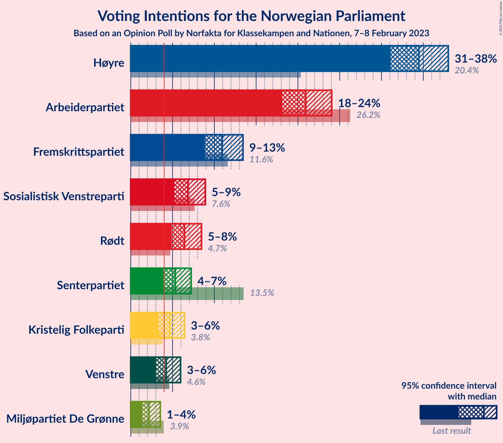

### Confidence Intervals

| Party | Last Result | Poll Result | 80% Confidence Interval | 90% Confidence Interval | 95% Confidence Interval | 99% Confidence Interval |
|:-----:|:-----------:|:-----------:|:-----------------------:|:-----------------------:|:-----------------------:|:-----------------------:|
| Høyre | 20.4% | 34.5% | 32.3–36.8% |31.6–37.4% |31.1–38.0% |30.1–39.1% |
| Arbeiderpartiet | 26.2% | 20.9% | 19.1–23.0% |18.6–23.5% |18.1–24.0% |17.3–25.0% |
| Fremskrittspartiet | 11.6% | 10.9% | 9.6–12.6% |9.2–13.0% |8.9–13.4% |8.3–14.2% |
| Sosialistisk Venstreparti | 7.6% | 6.8% | 5.8–8.2% |5.5–8.6% |5.2–8.9% |4.8–9.6% |
| Rødt | 4.7% | 6.4% | 5.4–7.7% |5.1–8.1% |4.9–8.5% |4.4–9.1% |
| Senterpartiet | 13.5% | 5.3% | 4.4–6.6% |4.1–6.9% |3.9–7.2% |3.5–7.8% |
| Kristelig Folkeparti | 3.8% | 4.7% | 3.8–5.8% |3.6–6.1% |3.3–6.4% |3.0–7.0% |
| Venstre | 4.6% | 4.2% | 3.4–5.4% |3.2–5.7% |3.0–6.0% |2.7–6.5% |
| Miljøpartiet De Grønne | 3.9% | 2.2% | 1.6–3.1% |1.5–3.3% |1.4–3.5% |1.1–4.0% |

*Note:* The poll result column reflects the actual value used in the calculations. Published results may vary slightly, and in addition be rounded to fewer digits.

## Seats

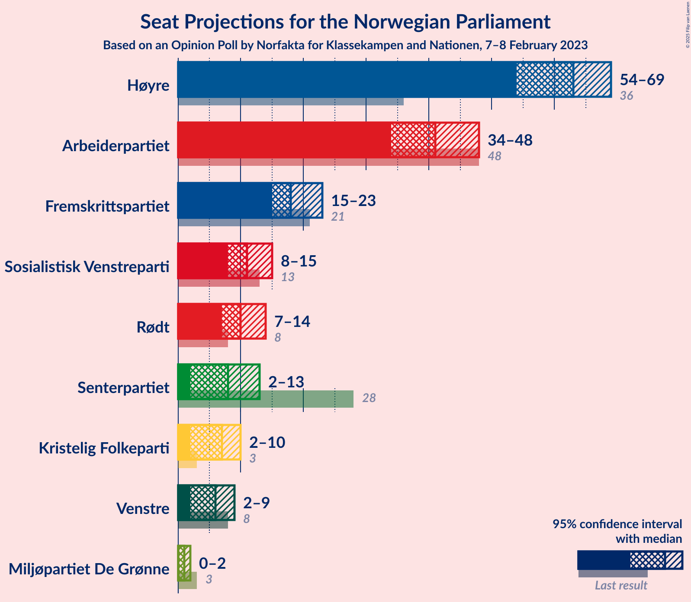

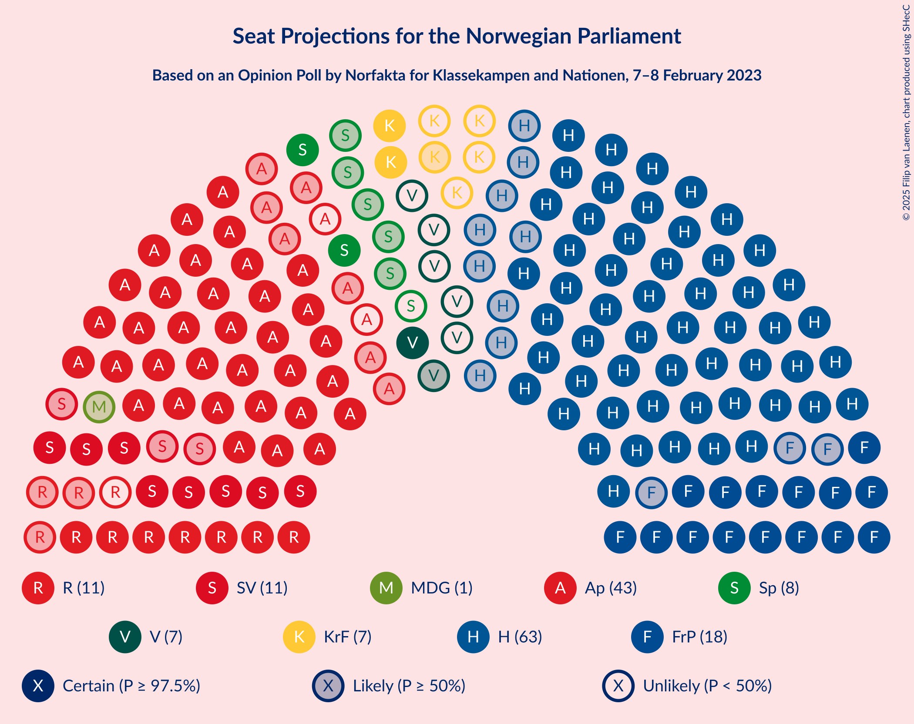

### Confidence Intervals

| Party | Last Result | Median | 80% Confidence Interval | 90% Confidence Interval | 95% Confidence Interval | 99% Confidence Interval |
|:-----:|:-----------:|:------:|:-----------------------:|:-----------------------:|:-----------------------:|:-----------------------:|
| <a href="#høyre">Høyre</a> | 36 | 63 | 57–67 |56–67 |54–69 |52–71 |
| <a href="#arbeiderpartiet">Arbeiderpartiet</a> | 48 | 41 | 36–45 |36–47 |34–48 |33–49 |
| <a href="#fremskrittspartiet">Fremskrittspartiet</a> | 21 | 18 | 17–21 |16–22 |15–23 |13–26 |
| <a href="#sosialistisk-venstreparti">Sosialistisk Venstreparti</a> | 13 | 11 | 9–13 |8–14 |8–15 |7–16 |
| <a href="#rødt">Rødt</a> | 8 | 10 | 8–12 |7–13 |7–14 |7–15 |
| <a href="#senterpartiet">Senterpartiet</a> | 28 | 8 | 6–12 |6–12 |2–13 |0–14 |
| <a href="#kristelig-folkeparti">Kristelig Folkeparti</a> | 3 | 7 | 3–9 |3–10 |2–10 |2–11 |
| <a href="#venstre">Venstre</a> | 8 | 6 | 2–8 |2–9 |2–9 |2–10 |
| <a href="#miljøpartiet-de-grønne">Miljøpartiet De Grønne</a> | 3 | 1 | 0–2 |0–2 |0–2 |0–3 |

### Høyre

*For a full overview of the results for this party, see the [Høyre](party-høyre.html) page.*

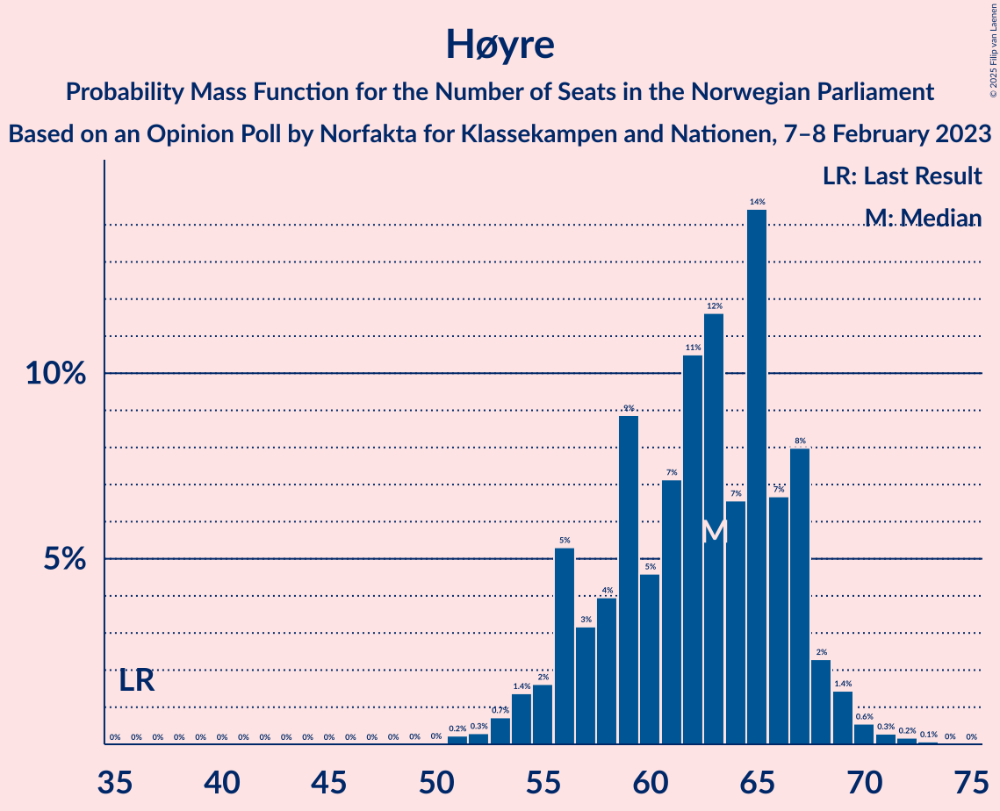

| Number of Seats | Probability | Accumulated | Special Marks |
|:---------------:|:-----------:|:-----------:|:-------------:|
| 36 | 0% | 100% | Last Result |
| 37 | 0% | 100% |  |
| 38 | 0% | 100% |  |
| 39 | 0% | 100% |  |
| 40 | 0% | 100% |  |
| 41 | 0% | 100% |  |
| 42 | 0% | 100% |  |
| 43 | 0% | 100% |  |
| 44 | 0% | 100% |  |
| 45 | 0% | 100% |  |
| 46 | 0% | 100% |  |
| 47 | 0% | 100% |  |
| 48 | 0% | 100% |  |
| 49 | 0% | 100% |  |
| 50 | 0% | 100% |  |
| 51 | 0.2% | 100% |  |
| 52 | 0.3% | 99.7% |  |
| 53 | 0.7% | 99.4% |  |
| 54 | 1.4% | 98.7% |  |
| 55 | 2% | 97% |  |
| 56 | 5% | 96% |  |
| 57 | 3% | 90% |  |
| 58 | 4% | 87% |  |
| 59 | 9% | 83% |  |
| 60 | 5% | 74% |  |
| 61 | 7% | 70% |  |
| 62 | 11% | 63% |  |
| 63 | 12% | 52% | Median |
| 64 | 7% | 41% |  |
| 65 | 14% | 34% |  |
| 66 | 7% | 20% |  |
| 67 | 8% | 13% |  |
| 68 | 2% | 5% |  |
| 69 | 1.4% | 3% |  |
| 70 | 0.6% | 1.1% |  |
| 71 | 0.3% | 0.6% |  |
| 72 | 0.2% | 0.3% |  |
| 73 | 0.1% | 0.1% |  |
| 74 | 0% | 0% |  |

### Arbeiderpartiet

*For a full overview of the results for this party, see the [Arbeiderpartiet](party-arbeiderpartiet.html) page.*

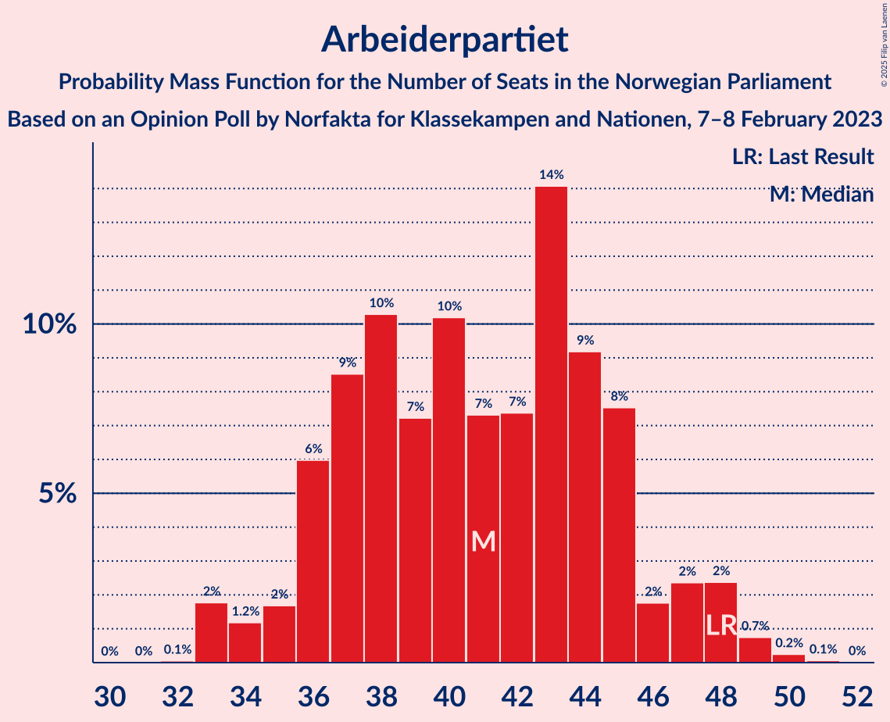

| Number of Seats | Probability | Accumulated | Special Marks |
|:---------------:|:-----------:|:-----------:|:-------------:|
| 32 | 0.1% | 100% |  |
| 33 | 2% | 99.9% |  |
| 34 | 1.2% | 98% |  |
| 35 | 2% | 97% |  |
| 36 | 6% | 95% |  |
| 37 | 9% | 89% |  |
| 38 | 10% | 81% |  |
| 39 | 7% | 70% |  |
| 40 | 10% | 63% |  |
| 41 | 7% | 53% | Median |
| 42 | 7% | 46% |  |
| 43 | 14% | 38% |  |
| 44 | 9% | 24% |  |
| 45 | 8% | 15% |  |
| 46 | 2% | 8% |  |
| 47 | 2% | 6% |  |
| 48 | 2% | 3% | Last Result |
| 49 | 0.7% | 1.1% |  |
| 50 | 0.2% | 0.3% |  |
| 51 | 0.1% | 0.1% |  |
| 52 | 0% | 0% |  |

### Fremskrittspartiet

*For a full overview of the results for this party, see the [Fremskrittspartiet](party-fremskrittspartiet.html) page.*

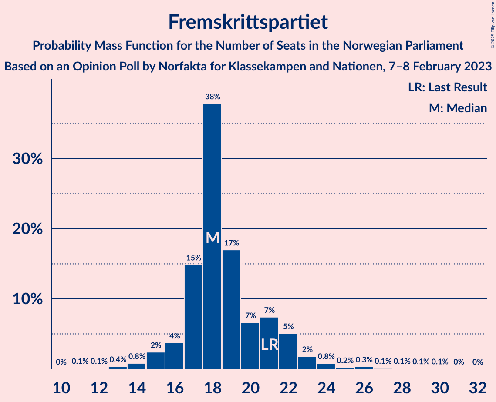

| Number of Seats | Probability | Accumulated | Special Marks |
|:---------------:|:-----------:|:-----------:|:-------------:|
| 11 | 0.1% | 100% |  |
| 12 | 0.1% | 99.9% |  |
| 13 | 0.4% | 99.7% |  |
| 14 | 0.8% | 99.4% |  |
| 15 | 2% | 98.6% |  |
| 16 | 4% | 96% |  |
| 17 | 15% | 92% |  |
| 18 | 38% | 78% | Median |
| 19 | 17% | 40% |  |
| 20 | 7% | 23% |  |
| 21 | 7% | 16% | Last Result |
| 22 | 5% | 9% |  |
| 23 | 2% | 4% |  |
| 24 | 0.8% | 2% |  |
| 25 | 0.2% | 1.0% |  |
| 26 | 0.3% | 0.7% |  |
| 27 | 0.1% | 0.4% |  |
| 28 | 0.1% | 0.3% |  |
| 29 | 0.1% | 0.1% |  |
| 30 | 0.1% | 0.1% |  |
| 31 | 0% | 0% |  |

### Sosialistisk Venstreparti

*For a full overview of the results for this party, see the [Sosialistisk Venstreparti](party-sosialistiskvenstreparti.html) page.*

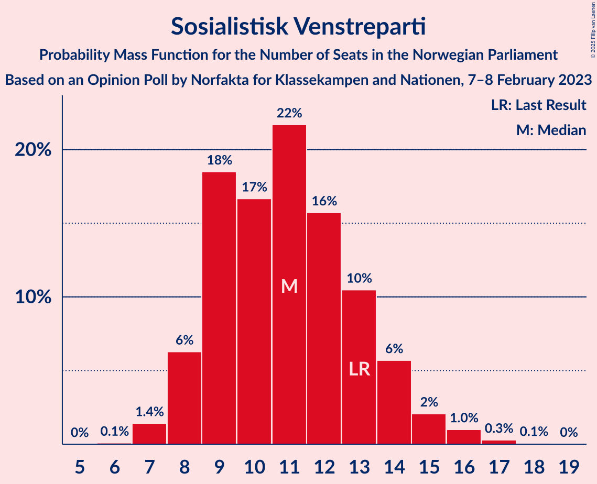

| Number of Seats | Probability | Accumulated | Special Marks |
|:---------------:|:-----------:|:-----------:|:-------------:|
| 6 | 0.1% | 100% |  |
| 7 | 1.4% | 99.9% |  |
| 8 | 6% | 98% |  |
| 9 | 18% | 92% |  |
| 10 | 17% | 74% |  |
| 11 | 22% | 57% | Median |
| 12 | 16% | 35% |  |
| 13 | 10% | 20% | Last Result |
| 14 | 6% | 9% |  |
| 15 | 2% | 3% |  |
| 16 | 1.0% | 1.4% |  |
| 17 | 0.3% | 0.4% |  |
| 18 | 0.1% | 0.1% |  |
| 19 | 0% | 0% |  |

### Rødt

*For a full overview of the results for this party, see the [Rødt](party-rødt.html) page.*

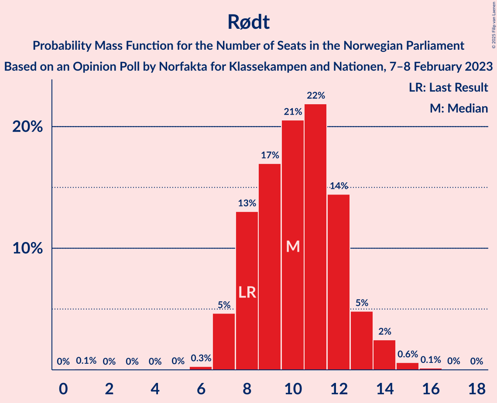

| Number of Seats | Probability | Accumulated | Special Marks |
|:---------------:|:-----------:|:-----------:|:-------------:|
| 1 | 0.1% | 100% |  |
| 2 | 0% | 99.9% |  |
| 3 | 0% | 99.9% |  |
| 4 | 0% | 99.9% |  |
| 5 | 0% | 99.9% |  |
| 6 | 0.3% | 99.9% |  |
| 7 | 5% | 99.6% |  |
| 8 | 13% | 95% | Last Result |
| 9 | 17% | 82% |  |
| 10 | 21% | 65% | Median |
| 11 | 22% | 44% |  |
| 12 | 14% | 23% |  |
| 13 | 5% | 8% |  |
| 14 | 2% | 3% |  |
| 15 | 0.6% | 0.8% |  |
| 16 | 0.1% | 0.2% |  |
| 17 | 0% | 0.1% |  |
| 18 | 0% | 0% |  |

### Senterpartiet

*For a full overview of the results for this party, see the [Senterpartiet](party-senterpartiet.html) page.*

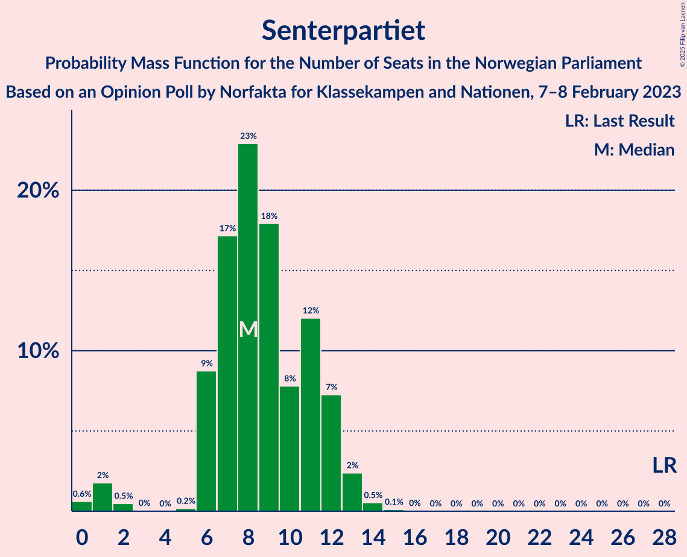

| Number of Seats | Probability | Accumulated | Special Marks |
|:---------------:|:-----------:|:-----------:|:-------------:|
| 0 | 0.6% | 100% |  |
| 1 | 2% | 99.4% |  |
| 2 | 0.5% | 98% |  |
| 3 | 0% | 97% |  |
| 4 | 0% | 97% |  |
| 5 | 0.2% | 97% |  |
| 6 | 9% | 97% |  |
| 7 | 17% | 88% |  |
| 8 | 23% | 71% | Median |
| 9 | 18% | 48% |  |
| 10 | 8% | 30% |  |
| 11 | 12% | 22% |  |
| 12 | 7% | 10% |  |
| 13 | 2% | 3% |  |
| 14 | 0.5% | 0.7% |  |
| 15 | 0.1% | 0.2% |  |
| 16 | 0% | 0% |  |
| 17 | 0% | 0% |  |
| 18 | 0% | 0% |  |
| 19 | 0% | 0% |  |
| 20 | 0% | 0% |  |
| 21 | 0% | 0% |  |
| 22 | 0% | 0% |  |
| 23 | 0% | 0% |  |
| 24 | 0% | 0% |  |
| 25 | 0% | 0% |  |
| 26 | 0% | 0% |  |
| 27 | 0% | 0% |  |
| 28 | 0% | 0% | Last Result |

### Kristelig Folkeparti

*For a full overview of the results for this party, see the [Kristelig Folkeparti](party-kristeligfolkeparti.html) page.*

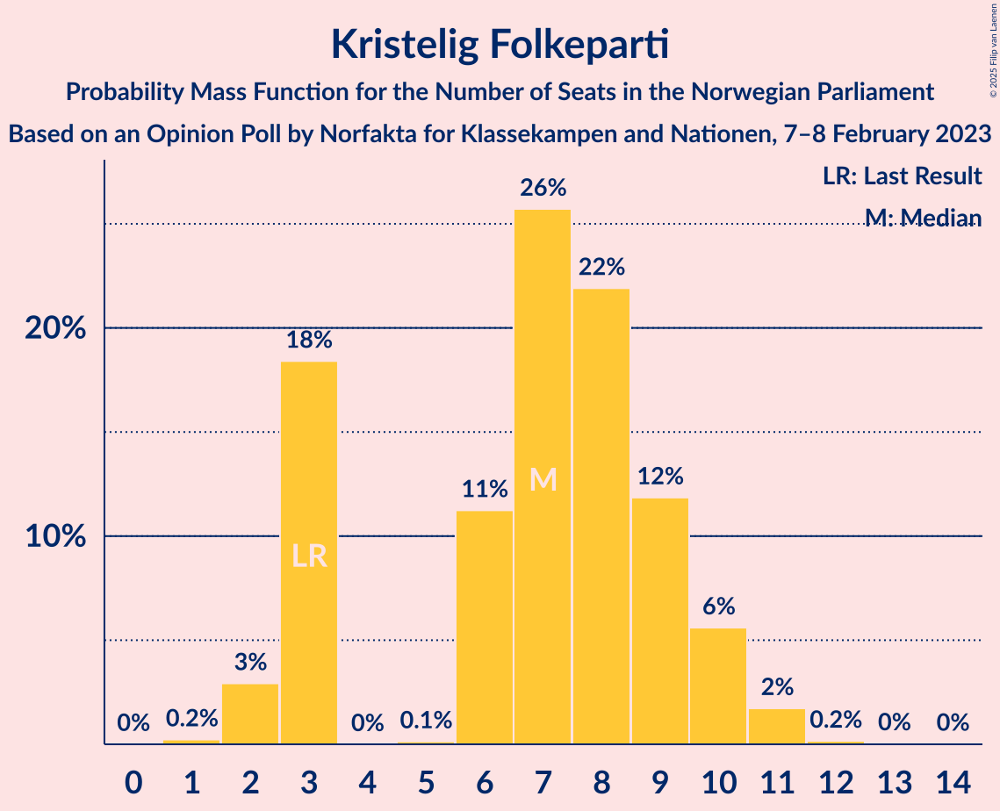

| Number of Seats | Probability | Accumulated | Special Marks |
|:---------------:|:-----------:|:-----------:|:-------------:|
| 1 | 0.2% | 100% |  |
| 2 | 3% | 99.8% |  |
| 3 | 18% | 97% | Last Result |
| 4 | 0% | 78% |  |
| 5 | 0.1% | 78% |  |
| 6 | 11% | 78% |  |
| 7 | 26% | 67% | Median |
| 8 | 22% | 41% |  |
| 9 | 12% | 19% |  |
| 10 | 6% | 8% |  |
| 11 | 2% | 2% |  |
| 12 | 0.2% | 0.2% |  |
| 13 | 0% | 0.1% |  |
| 14 | 0% | 0% |  |

### Venstre

*For a full overview of the results for this party, see the [Venstre](party-venstre.html) page.*

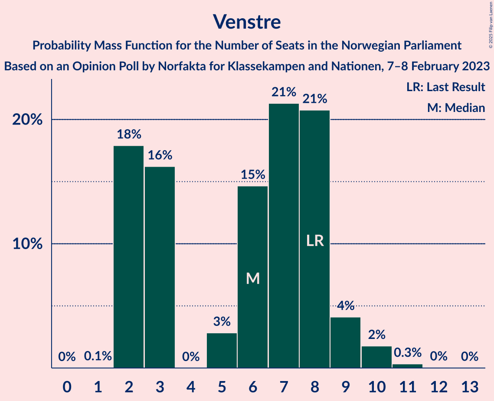

| Number of Seats | Probability | Accumulated | Special Marks |
|:---------------:|:-----------:|:-----------:|:-------------:|
| 1 | 0.1% | 100% |  |
| 2 | 18% | 99.9% |  |
| 3 | 16% | 82% |  |
| 4 | 0% | 66% |  |
| 5 | 3% | 66% |  |
| 6 | 15% | 63% | Median |
| 7 | 21% | 48% |  |
| 8 | 21% | 27% | Last Result |
| 9 | 4% | 6% |  |
| 10 | 2% | 2% |  |
| 11 | 0.3% | 0.4% |  |
| 12 | 0% | 0.1% |  |
| 13 | 0% | 0% |  |

### Miljøpartiet De Grønne

*For a full overview of the results for this party, see the [Miljøpartiet De Grønne](party-miljøpartietdegrønne.html) page.*

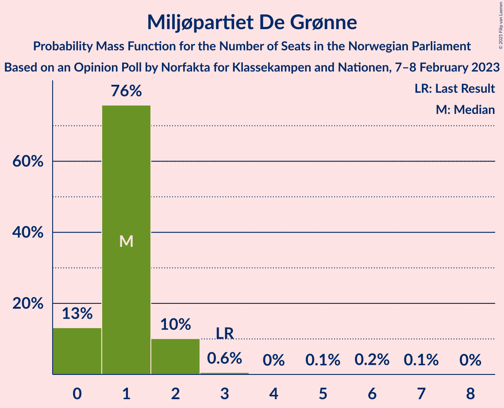

| Number of Seats | Probability | Accumulated | Special Marks |
|:---------------:|:-----------:|:-----------:|:-------------:|
| 0 | 13% | 100% |  |
| 1 | 76% | 87% | Median |
| 2 | 10% | 11% |  |
| 3 | 0.6% | 0.9% | Last Result |
| 4 | 0% | 0.4% |  |
| 5 | 0.1% | 0.4% |  |
| 6 | 0.2% | 0.3% |  |
| 7 | 0.1% | 0.1% |  |
| 8 | 0% | 0% |  |

## Coalitions

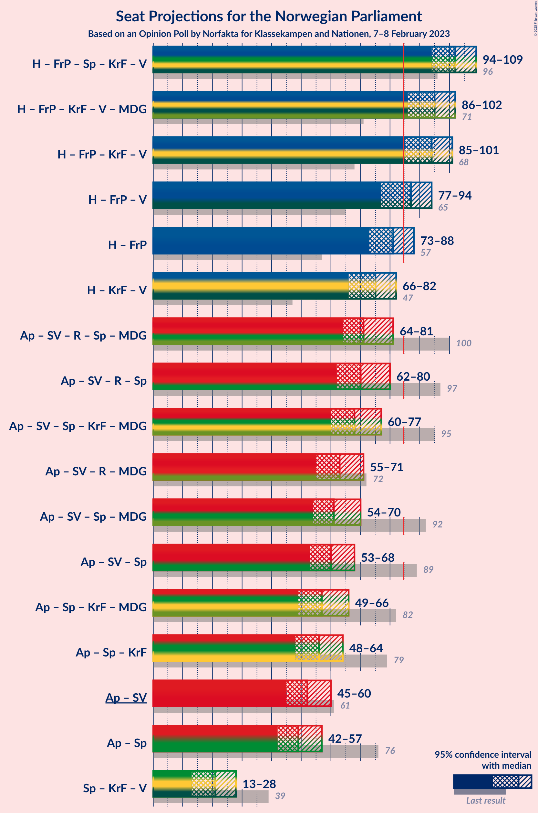

### Confidence Intervals

| Coalition | Last Result | Median | Majority? | 80% Confidence Interval | 90% Confidence Interval | 95% Confidence Interval | 99% Confidence Interval |
|:---------:|:-----------:|:------:|:---------:|:-----------------------:|:-----------------------:|:-----------------------:|:-----------------------:|
| Høyre – Fremskrittspartiet – Senterpartiet – Kristelig Folkeparti – Venstre | 96 | 102 | 100% | 95–108 | 94–109 | 94–109 | 90–113 |
| Høyre – Fremskrittspartiet – Kristelig Folkeparti – Venstre – Miljøpartiet De Grønne | 71 | 95 | 99.3% | 87–100 | 87–101 | 86–102 | 84–105 |
| Høyre – Fremskrittspartiet – Kristelig Folkeparti – Venstre | 68 | 94 | 98% | 86–99 | 86–100 | 85–101 | 83–104 |
| Høyre – Fremskrittspartiet – Venstre | 65 | 87 | 67% | 81–91 | 79–93 | 77–94 | 76–96 |
| Høyre – Fremskrittspartiet | 57 | 81 | 17% | 76–85 | 74–86 | 73–88 | 71–90 |
| Høyre – Kristelig Folkeparti – Venstre | 47 | 75 | 0.6% | 68–80 | 68–81 | 66–82 | 64–85 |
| Arbeiderpartiet – Sosialistisk Venstreparti – Rødt – Senterpartiet – Miljøpartiet De Grønne | 100 | 71 | 0.1% | 65–78 | 65–79 | 64–81 | 61–82 |
| Arbeiderpartiet – Sosialistisk Venstreparti – Rødt – Senterpartiet | 97 | 70 | 0% | 64–77 | 64–78 | 62–80 | 60–81 |
| Arbeiderpartiet – Sosialistisk Venstreparti – Senterpartiet – Kristelig Folkeparti – Miljøpartiet De Grønne | 95 | 68 | 0% | 62–74 | 61–76 | 60–77 | 57–81 |
| Arbeiderpartiet – Sosialistisk Venstreparti – Rødt – Miljøpartiet De Grønne | 72 | 63 | 0% | 58–68 | 57–70 | 55–71 | 53–74 |
| Arbeiderpartiet – Sosialistisk Venstreparti – Senterpartiet – Miljøpartiet De Grønne | 92 | 61 | 0% | 56–67 | 55–68 | 54–70 | 51–71 |
| Arbeiderpartiet – Sosialistisk Venstreparti – Senterpartiet | 89 | 60 | 0% | 55–66 | 54–67 | 53–68 | 50–70 |
| Arbeiderpartiet – Senterpartiet – Kristelig Folkeparti – Miljøpartiet De Grønne | 82 | 57 | 0% | 52–63 | 50–65 | 49–66 | 47–67 |
| Arbeiderpartiet – Senterpartiet – Kristelig Folkeparti | 79 | 56 | 0% | 51–62 | 49–64 | 48–64 | 46–66 |
| Arbeiderpartiet – Sosialistisk Venstreparti | 61 | 52 | 0% | 48–57 | 46–59 | 45–60 | 43–61 |
| Arbeiderpartiet – Senterpartiet | 76 | 49 | 0% | 45–55 | 44–56 | 42–57 | 39–58 |
| Senterpartiet – Kristelig Folkeparti – Venstre | 39 | 21 | 0% | 15–26 | 13–28 | 13–28 | 11–30 |

### Høyre – Fremskrittspartiet – Senterpartiet – Kristelig Folkeparti – Venstre

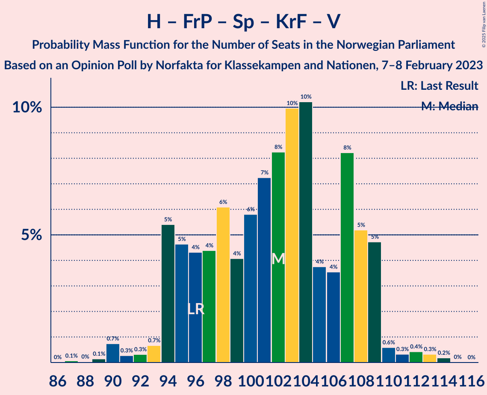

| Number of Seats | Probability | Accumulated | Special Marks |
|:---------------:|:-----------:|:-----------:|:-------------:|
| 87 | 0.1% | 100% |  |
| 88 | 0% | 99.9% |  |
| 89 | 0.1% | 99.9% |  |
| 90 | 0.7% | 99.7% |  |
| 91 | 0.3% | 99.0% |  |
| 92 | 0.3% | 98.7% |  |
| 93 | 0.7% | 98% |  |
| 94 | 5% | 98% |  |
| 95 | 5% | 92% |  |
| 96 | 4% | 88% | Last Result |
| 97 | 4% | 83% |  |
| 98 | 6% | 79% |  |
| 99 | 4% | 73% |  |
| 100 | 6% | 69% |  |
| 101 | 7% | 63% |  |
| 102 | 8% | 56% | Median |
| 103 | 10% | 48% |  |
| 104 | 10% | 38% |  |
| 105 | 4% | 27% |  |
| 106 | 4% | 24% |  |
| 107 | 8% | 20% |  |
| 108 | 5% | 12% |  |
| 109 | 5% | 7% |  |
| 110 | 0.6% | 2% |  |
| 111 | 0.3% | 1.3% |  |
| 112 | 0.4% | 1.0% |  |
| 113 | 0.3% | 0.5% |  |
| 114 | 0.2% | 0.2% |  |
| 115 | 0% | 0% |  |

### Høyre – Fremskrittspartiet – Kristelig Folkeparti – Venstre – Miljøpartiet De Grønne

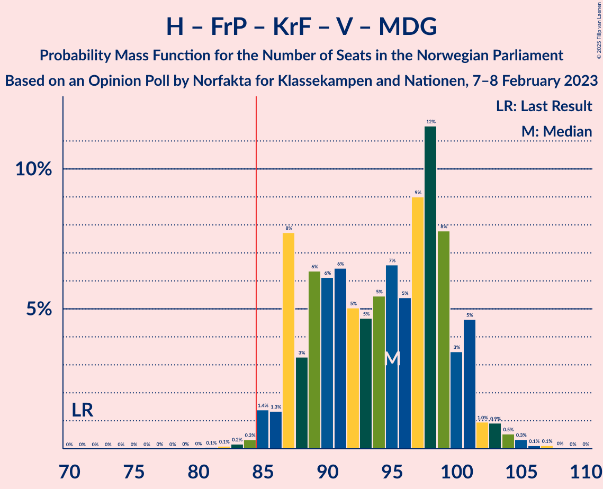

| Number of Seats | Probability | Accumulated | Special Marks |
|:---------------:|:-----------:|:-----------:|:-------------:|
| 71 | 0% | 100% | Last Result |
| 72 | 0% | 100% |  |
| 73 | 0% | 100% |  |
| 74 | 0% | 100% |  |
| 75 | 0% | 100% |  |
| 76 | 0% | 100% |  |
| 77 | 0% | 100% |  |
| 78 | 0% | 100% |  |
| 79 | 0% | 100% |  |
| 80 | 0% | 100% |  |
| 81 | 0.1% | 99.9% |  |
| 82 | 0.1% | 99.9% |  |
| 83 | 0.2% | 99.8% |  |
| 84 | 0.3% | 99.6% |  |
| 85 | 1.4% | 99.3% | Majority |
| 86 | 1.3% | 98% |  |
| 87 | 8% | 97% |  |
| 88 | 3% | 89% |  |
| 89 | 6% | 86% |  |
| 90 | 6% | 79% |  |
| 91 | 6% | 73% |  |
| 92 | 5% | 67% |  |
| 93 | 5% | 62% |  |
| 94 | 5% | 57% |  |
| 95 | 7% | 51% | Median |
| 96 | 5% | 45% |  |
| 97 | 9% | 39% |  |
| 98 | 12% | 30% |  |
| 99 | 8% | 19% |  |
| 100 | 3% | 11% |  |
| 101 | 5% | 8% |  |
| 102 | 1.0% | 3% |  |
| 103 | 0.9% | 2% |  |
| 104 | 0.5% | 1.2% |  |
| 105 | 0.3% | 0.6% |  |
| 106 | 0.1% | 0.3% |  |
| 107 | 0.1% | 0.2% |  |
| 108 | 0% | 0.1% |  |
| 109 | 0% | 0% |  |

### Høyre – Fremskrittspartiet – Kristelig Folkeparti – Venstre

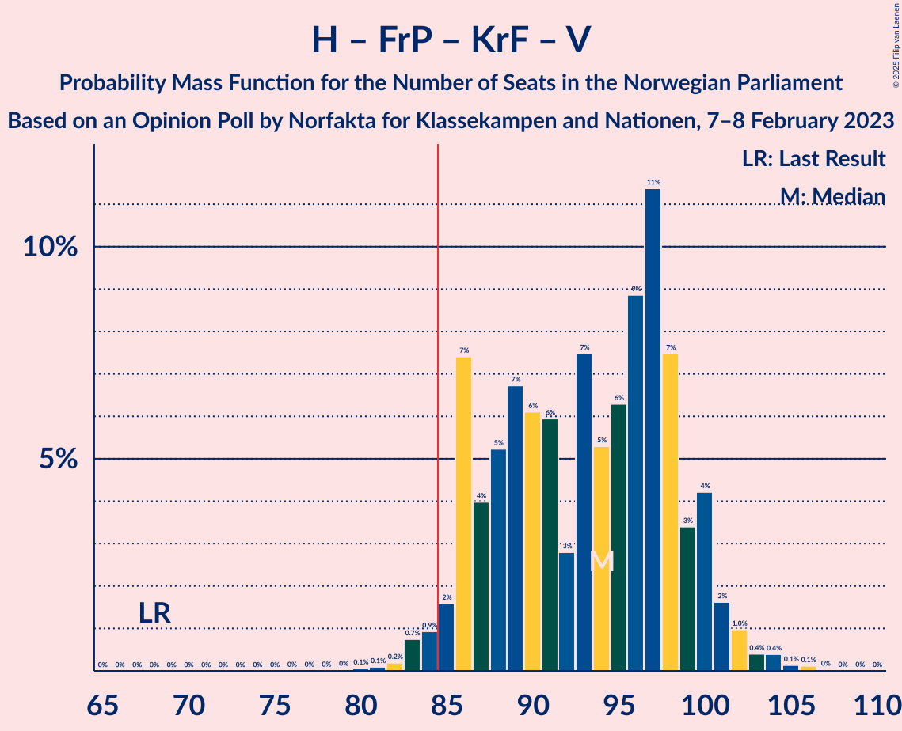

| Number of Seats | Probability | Accumulated | Special Marks |
|:---------------:|:-----------:|:-----------:|:-------------:|
| 68 | 0% | 100% | Last Result |
| 69 | 0% | 100% |  |
| 70 | 0% | 100% |  |
| 71 | 0% | 100% |  |
| 72 | 0% | 100% |  |
| 73 | 0% | 100% |  |
| 74 | 0% | 100% |  |
| 75 | 0% | 100% |  |
| 76 | 0% | 100% |  |
| 77 | 0% | 100% |  |
| 78 | 0% | 100% |  |
| 79 | 0% | 100% |  |
| 80 | 0.1% | 99.9% |  |
| 81 | 0.1% | 99.9% |  |
| 82 | 0.2% | 99.8% |  |
| 83 | 0.7% | 99.6% |  |
| 84 | 0.9% | 98.8% |  |
| 85 | 2% | 98% | Majority |
| 86 | 7% | 96% |  |
| 87 | 4% | 89% |  |
| 88 | 5% | 85% |  |
| 89 | 7% | 80% |  |
| 90 | 6% | 73% |  |
| 91 | 6% | 67% |  |
| 92 | 3% | 61% |  |
| 93 | 7% | 58% |  |
| 94 | 5% | 51% | Median |
| 95 | 6% | 45% |  |
| 96 | 9% | 39% |  |
| 97 | 11% | 30% |  |
| 98 | 7% | 19% |  |
| 99 | 3% | 11% |  |
| 100 | 4% | 8% |  |
| 101 | 2% | 4% |  |
| 102 | 1.0% | 2% |  |
| 103 | 0.4% | 1.1% |  |
| 104 | 0.4% | 0.7% |  |
| 105 | 0.1% | 0.3% |  |
| 106 | 0.1% | 0.2% |  |
| 107 | 0% | 0.1% |  |
| 108 | 0% | 0% |  |

### Høyre – Fremskrittspartiet – Venstre

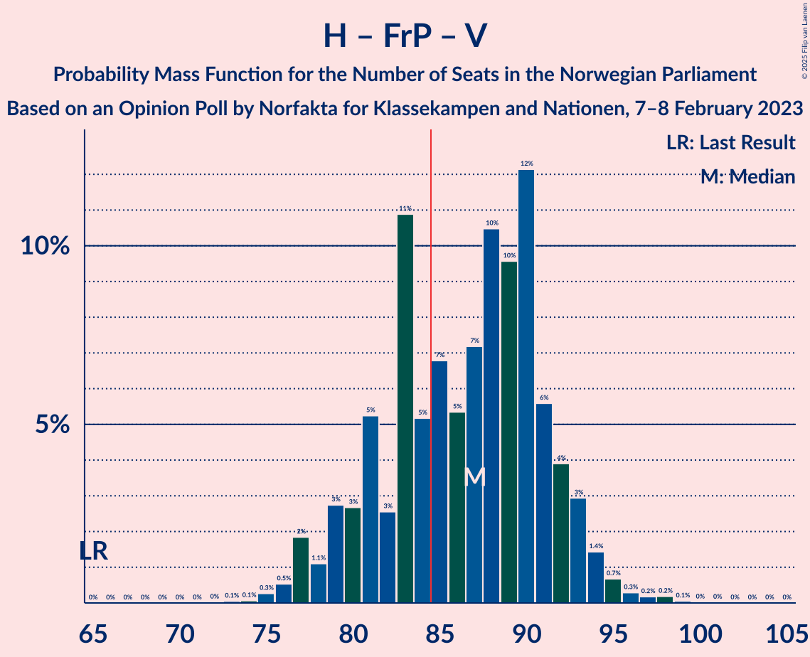

| Number of Seats | Probability | Accumulated | Special Marks |
|:---------------:|:-----------:|:-----------:|:-------------:|
| 65 | 0% | 100% | Last Result |
| 66 | 0% | 100% |  |
| 67 | 0% | 100% |  |
| 68 | 0% | 100% |  |
| 69 | 0% | 100% |  |
| 70 | 0% | 100% |  |
| 71 | 0% | 100% |  |
| 72 | 0% | 100% |  |
| 73 | 0.1% | 100% |  |
| 74 | 0.1% | 99.9% |  |
| 75 | 0.3% | 99.9% |  |
| 76 | 0.5% | 99.6% |  |
| 77 | 2% | 99.1% |  |
| 78 | 1.1% | 97% |  |
| 79 | 3% | 96% |  |
| 80 | 3% | 93% |  |
| 81 | 5% | 91% |  |
| 82 | 3% | 85% |  |
| 83 | 11% | 83% |  |
| 84 | 5% | 72% |  |
| 85 | 7% | 67% | Majority |
| 86 | 5% | 60% |  |
| 87 | 7% | 55% | Median |
| 88 | 10% | 48% |  |
| 89 | 10% | 37% |  |
| 90 | 12% | 27% |  |
| 91 | 6% | 15% |  |
| 92 | 4% | 10% |  |
| 93 | 3% | 6% |  |
| 94 | 1.4% | 3% |  |
| 95 | 0.7% | 1.4% |  |
| 96 | 0.3% | 0.8% |  |
| 97 | 0.2% | 0.5% |  |
| 98 | 0.2% | 0.3% |  |
| 99 | 0.1% | 0.1% |  |
| 100 | 0% | 0.1% |  |
| 101 | 0% | 0% |  |

### Høyre – Fremskrittspartiet

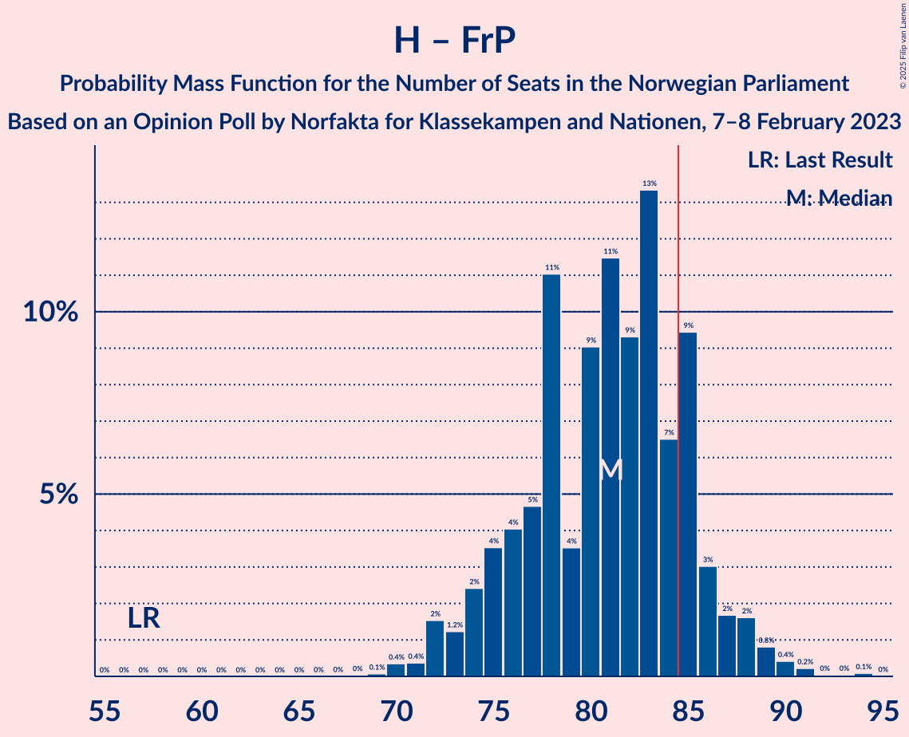

| Number of Seats | Probability | Accumulated | Special Marks |
|:---------------:|:-----------:|:-----------:|:-------------:|
| 57 | 0% | 100% | Last Result |
| 58 | 0% | 100% |  |
| 59 | 0% | 100% |  |
| 60 | 0% | 100% |  |
| 61 | 0% | 100% |  |
| 62 | 0% | 100% |  |
| 63 | 0% | 100% |  |
| 64 | 0% | 100% |  |
| 65 | 0% | 100% |  |
| 66 | 0% | 100% |  |
| 67 | 0% | 100% |  |
| 68 | 0% | 100% |  |
| 69 | 0.1% | 99.9% |  |
| 70 | 0.4% | 99.9% |  |
| 71 | 0.4% | 99.5% |  |
| 72 | 2% | 99.1% |  |
| 73 | 1.2% | 98% |  |
| 74 | 2% | 96% |  |
| 75 | 4% | 94% |  |
| 76 | 4% | 90% |  |
| 77 | 5% | 86% |  |
| 78 | 11% | 82% |  |
| 79 | 4% | 71% |  |
| 80 | 9% | 67% |  |
| 81 | 11% | 58% | Median |
| 82 | 9% | 47% |  |
| 83 | 13% | 37% |  |
| 84 | 7% | 24% |  |
| 85 | 9% | 17% | Majority |
| 86 | 3% | 8% |  |
| 87 | 2% | 5% |  |
| 88 | 2% | 3% |  |
| 89 | 0.8% | 2% |  |
| 90 | 0.4% | 0.8% |  |
| 91 | 0.2% | 0.4% |  |
| 92 | 0% | 0.2% |  |
| 93 | 0% | 0.2% |  |
| 94 | 0.1% | 0.1% |  |
| 95 | 0% | 0% |  |

### Høyre – Kristelig Folkeparti – Venstre

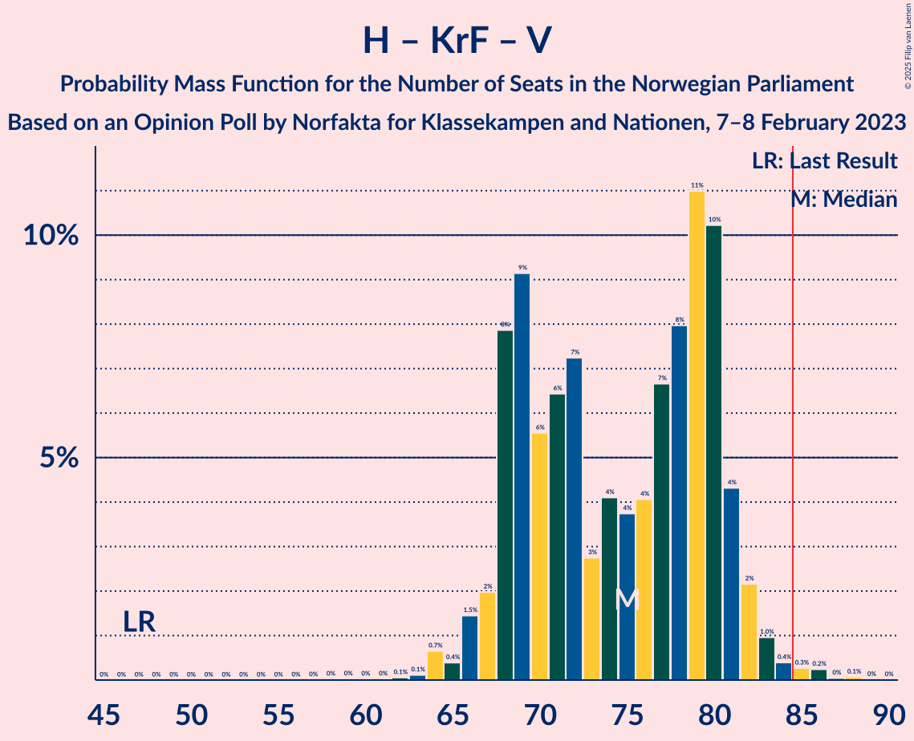

| Number of Seats | Probability | Accumulated | Special Marks |
|:---------------:|:-----------:|:-----------:|:-------------:|
| 47 | 0% | 100% | Last Result |
| 48 | 0% | 100% |  |
| 49 | 0% | 100% |  |
| 50 | 0% | 100% |  |
| 51 | 0% | 100% |  |
| 52 | 0% | 100% |  |
| 53 | 0% | 100% |  |
| 54 | 0% | 100% |  |
| 55 | 0% | 100% |  |
| 56 | 0% | 100% |  |
| 57 | 0% | 100% |  |
| 58 | 0% | 100% |  |
| 59 | 0% | 100% |  |
| 60 | 0% | 99.9% |  |
| 61 | 0% | 99.9% |  |
| 62 | 0.1% | 99.9% |  |
| 63 | 0.1% | 99.8% |  |
| 64 | 0.7% | 99.7% |  |
| 65 | 0.4% | 99.1% |  |
| 66 | 1.5% | 98.7% |  |
| 67 | 2% | 97% |  |
| 68 | 8% | 95% |  |
| 69 | 9% | 87% |  |
| 70 | 6% | 78% |  |
| 71 | 6% | 73% |  |
| 72 | 7% | 66% |  |
| 73 | 3% | 59% |  |
| 74 | 4% | 56% |  |
| 75 | 4% | 52% |  |
| 76 | 4% | 48% | Median |
| 77 | 7% | 44% |  |
| 78 | 8% | 38% |  |
| 79 | 11% | 30% |  |
| 80 | 10% | 19% |  |
| 81 | 4% | 8% |  |
| 82 | 2% | 4% |  |
| 83 | 1.0% | 2% |  |
| 84 | 0.4% | 1.0% |  |
| 85 | 0.3% | 0.6% | Majority |
| 86 | 0.2% | 0.4% |  |
| 87 | 0% | 0.1% |  |
| 88 | 0.1% | 0.1% |  |
| 89 | 0% | 0% |  |

### Arbeiderpartiet – Sosialistisk Venstreparti – Rødt – Senterpartiet – Miljøpartiet De Grønne

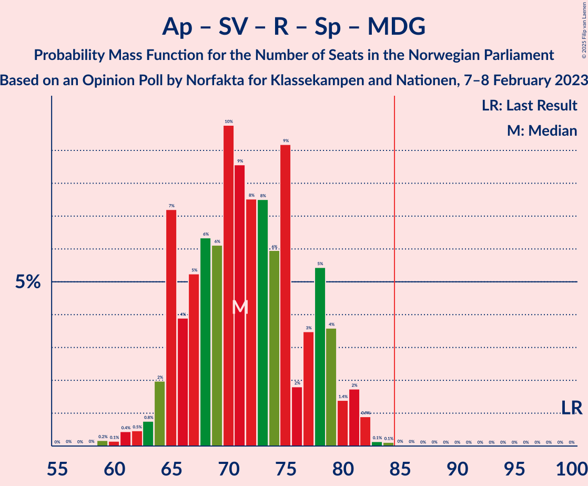

| Number of Seats | Probability | Accumulated | Special Marks |
|:---------------:|:-----------:|:-----------:|:-------------:|
| 57 | 0% | 100% |  |
| 58 | 0% | 99.9% |  |
| 59 | 0.2% | 99.9% |  |
| 60 | 0.1% | 99.8% |  |
| 61 | 0.4% | 99.6% |  |
| 62 | 0.5% | 99.2% |  |
| 63 | 0.8% | 98.7% |  |
| 64 | 2% | 98% |  |
| 65 | 7% | 96% |  |
| 66 | 4% | 89% |  |
| 67 | 5% | 85% |  |
| 68 | 6% | 80% |  |
| 69 | 6% | 73% |  |
| 70 | 10% | 67% |  |
| 71 | 9% | 57% | Median |
| 72 | 8% | 49% |  |
| 73 | 8% | 41% |  |
| 74 | 6% | 34% |  |
| 75 | 9% | 28% |  |
| 76 | 2% | 19% |  |
| 77 | 3% | 17% |  |
| 78 | 5% | 13% |  |
| 79 | 4% | 8% |  |
| 80 | 1.4% | 4% |  |
| 81 | 2% | 3% |  |
| 82 | 0.9% | 1.2% |  |
| 83 | 0.1% | 0.3% |  |
| 84 | 0.1% | 0.2% |  |
| 85 | 0% | 0.1% | Majority |
| 86 | 0% | 0% |  |
| 87 | 0% | 0% |  |
| 88 | 0% | 0% |  |
| 89 | 0% | 0% |  |
| 90 | 0% | 0% |  |
| 91 | 0% | 0% |  |
| 92 | 0% | 0% |  |
| 93 | 0% | 0% |  |
| 94 | 0% | 0% |  |
| 95 | 0% | 0% |  |
| 96 | 0% | 0% |  |
| 97 | 0% | 0% |  |
| 98 | 0% | 0% |  |
| 99 | 0% | 0% |  |
| 100 | 0% | 0% | Last Result |

### Arbeiderpartiet – Sosialistisk Venstreparti – Rødt – Senterpartiet

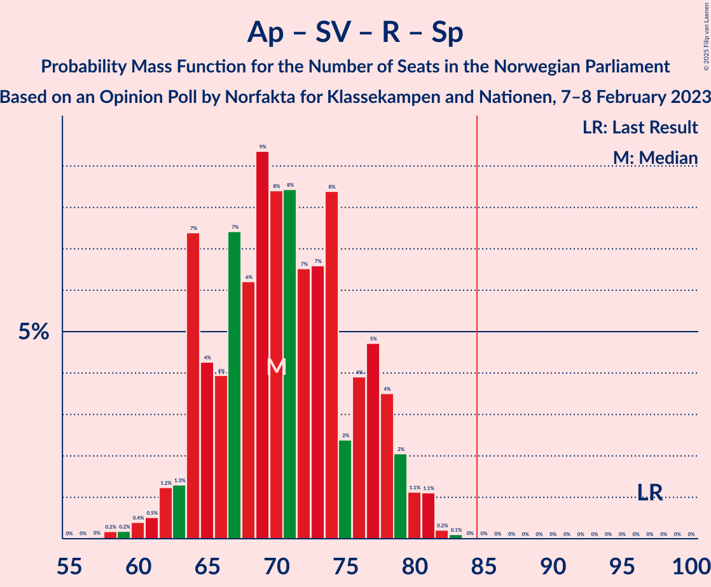

| Number of Seats | Probability | Accumulated | Special Marks |
|:---------------:|:-----------:|:-----------:|:-------------:|
| 57 | 0% | 100% |  |
| 58 | 0.2% | 99.9% |  |
| 59 | 0.2% | 99.7% |  |
| 60 | 0.4% | 99.6% |  |
| 61 | 0.5% | 99.2% |  |
| 62 | 1.2% | 98.7% |  |
| 63 | 1.3% | 97% |  |
| 64 | 7% | 96% |  |
| 65 | 4% | 89% |  |
| 66 | 4% | 84% |  |
| 67 | 7% | 81% |  |
| 68 | 6% | 73% |  |
| 69 | 9% | 67% |  |
| 70 | 8% | 58% | Median |
| 71 | 8% | 49% |  |
| 72 | 7% | 41% |  |
| 73 | 7% | 34% |  |
| 74 | 8% | 28% |  |
| 75 | 2% | 19% |  |
| 76 | 4% | 17% |  |
| 77 | 5% | 13% |  |
| 78 | 4% | 8% |  |
| 79 | 2% | 5% |  |
| 80 | 1.1% | 3% |  |
| 81 | 1.1% | 1.5% |  |
| 82 | 0.2% | 0.4% |  |
| 83 | 0.1% | 0.2% |  |
| 84 | 0% | 0.1% |  |
| 85 | 0% | 0% | Majority |
| 86 | 0% | 0% |  |
| 87 | 0% | 0% |  |
| 88 | 0% | 0% |  |
| 89 | 0% | 0% |  |
| 90 | 0% | 0% |  |
| 91 | 0% | 0% |  |
| 92 | 0% | 0% |  |
| 93 | 0% | 0% |  |
| 94 | 0% | 0% |  |
| 95 | 0% | 0% |  |
| 96 | 0% | 0% |  |
| 97 | 0% | 0% | Last Result |

### Arbeiderpartiet – Sosialistisk Venstreparti – Senterpartiet – Kristelig Folkeparti – Miljøpartiet De Grønne

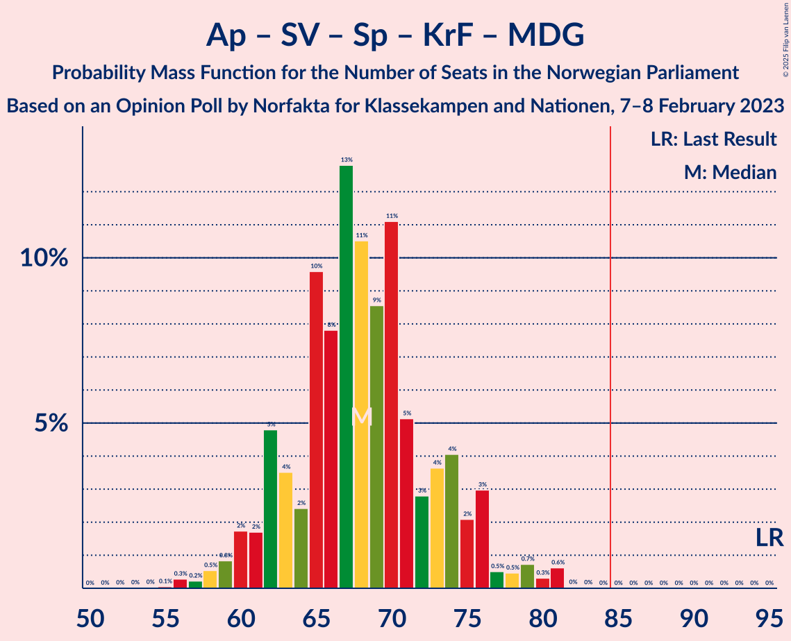

| Number of Seats | Probability | Accumulated | Special Marks |
|:---------------:|:-----------:|:-----------:|:-------------:|
| 54 | 0% | 100% |  |
| 55 | 0.1% | 99.9% |  |
| 56 | 0.3% | 99.9% |  |
| 57 | 0.2% | 99.6% |  |
| 58 | 0.5% | 99.4% |  |
| 59 | 0.8% | 98.8% |  |
| 60 | 2% | 98% |  |
| 61 | 2% | 96% |  |
| 62 | 5% | 95% |  |
| 63 | 4% | 90% |  |
| 64 | 2% | 86% |  |
| 65 | 10% | 84% |  |
| 66 | 8% | 74% |  |
| 67 | 13% | 66% |  |
| 68 | 11% | 54% | Median |
| 69 | 9% | 43% |  |
| 70 | 11% | 35% |  |
| 71 | 5% | 23% |  |
| 72 | 3% | 18% |  |
| 73 | 4% | 15% |  |
| 74 | 4% | 12% |  |
| 75 | 2% | 8% |  |
| 76 | 3% | 6% |  |
| 77 | 0.5% | 3% |  |
| 78 | 0.5% | 2% |  |
| 79 | 0.7% | 2% |  |
| 80 | 0.3% | 1.0% |  |
| 81 | 0.6% | 0.7% |  |
| 82 | 0% | 0.1% |  |
| 83 | 0% | 0% |  |
| 84 | 0% | 0% |  |
| 85 | 0% | 0% | Majority |
| 86 | 0% | 0% |  |
| 87 | 0% | 0% |  |
| 88 | 0% | 0% |  |
| 89 | 0% | 0% |  |
| 90 | 0% | 0% |  |
| 91 | 0% | 0% |  |
| 92 | 0% | 0% |  |
| 93 | 0% | 0% |  |
| 94 | 0% | 0% |  |
| 95 | 0% | 0% | Last Result |

### Arbeiderpartiet – Sosialistisk Venstreparti – Rødt – Miljøpartiet De Grønne

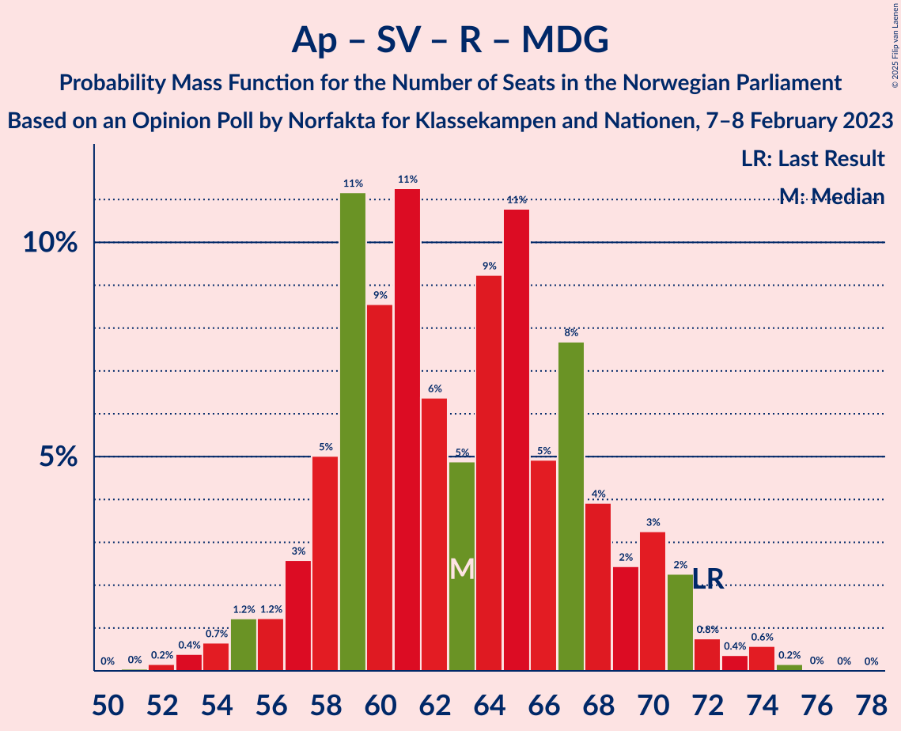

| Number of Seats | Probability | Accumulated | Special Marks |
|:---------------:|:-----------:|:-----------:|:-------------:|
| 51 | 0% | 100% |  |
| 52 | 0.2% | 99.9% |  |
| 53 | 0.4% | 99.8% |  |
| 54 | 0.7% | 99.4% |  |
| 55 | 1.2% | 98.7% |  |
| 56 | 1.2% | 97% |  |
| 57 | 3% | 96% |  |
| 58 | 5% | 94% |  |
| 59 | 11% | 89% |  |
| 60 | 9% | 78% |  |
| 61 | 11% | 69% |  |
| 62 | 6% | 58% |  |
| 63 | 5% | 51% | Median |
| 64 | 9% | 46% |  |
| 65 | 11% | 37% |  |
| 66 | 5% | 26% |  |
| 67 | 8% | 21% |  |
| 68 | 4% | 14% |  |
| 69 | 2% | 10% |  |
| 70 | 3% | 7% |  |
| 71 | 2% | 4% |  |
| 72 | 0.8% | 2% | Last Result |
| 73 | 0.4% | 1.2% |  |
| 74 | 0.6% | 0.8% |  |
| 75 | 0.2% | 0.2% |  |
| 76 | 0% | 0.1% |  |
| 77 | 0% | 0% |  |

### Arbeiderpartiet – Sosialistisk Venstreparti – Senterpartiet – Miljøpartiet De Grønne

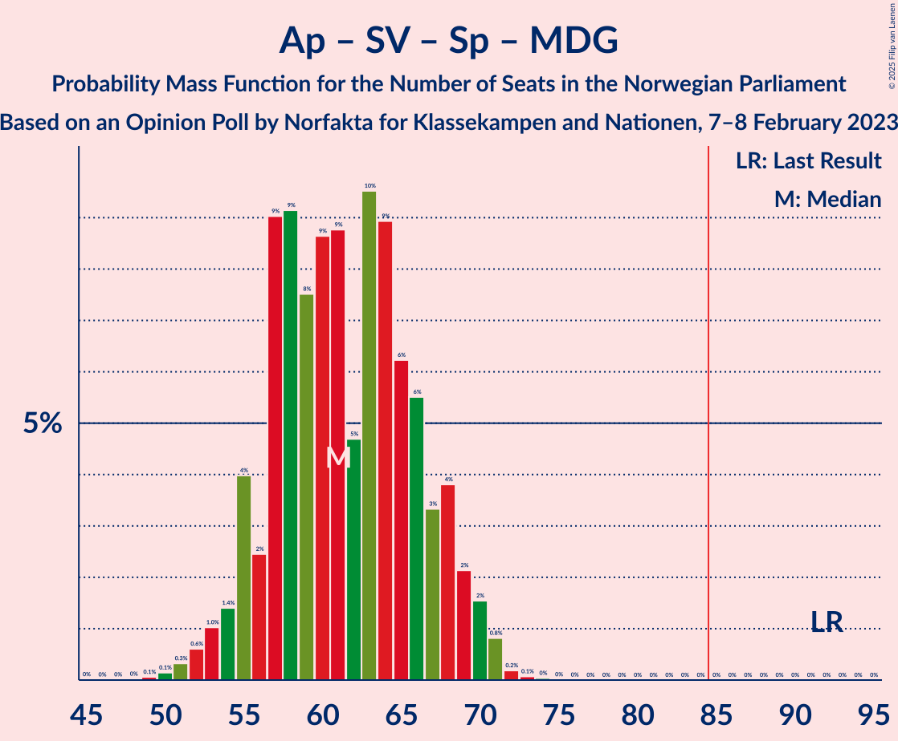

| Number of Seats | Probability | Accumulated | Special Marks |
|:---------------:|:-----------:|:-----------:|:-------------:|
| 48 | 0% | 100% |  |
| 49 | 0.1% | 99.9% |  |
| 50 | 0.1% | 99.9% |  |
| 51 | 0.3% | 99.7% |  |
| 52 | 0.6% | 99.4% |  |
| 53 | 1.0% | 98.8% |  |
| 54 | 1.4% | 98% |  |
| 55 | 4% | 96% |  |
| 56 | 2% | 92% |  |
| 57 | 9% | 90% |  |
| 58 | 9% | 81% |  |
| 59 | 8% | 72% |  |
| 60 | 9% | 64% |  |
| 61 | 9% | 56% | Median |
| 62 | 5% | 47% |  |
| 63 | 10% | 42% |  |
| 64 | 9% | 33% |  |
| 65 | 6% | 24% |  |
| 66 | 6% | 17% |  |
| 67 | 3% | 12% |  |
| 68 | 4% | 9% |  |
| 69 | 2% | 5% |  |
| 70 | 2% | 3% |  |
| 71 | 0.8% | 1.1% |  |
| 72 | 0.2% | 0.3% |  |
| 73 | 0.1% | 0.1% |  |
| 74 | 0% | 0.1% |  |
| 75 | 0% | 0% |  |
| 76 | 0% | 0% |  |
| 77 | 0% | 0% |  |
| 78 | 0% | 0% |  |
| 79 | 0% | 0% |  |
| 80 | 0% | 0% |  |
| 81 | 0% | 0% |  |
| 82 | 0% | 0% |  |
| 83 | 0% | 0% |  |
| 84 | 0% | 0% |  |
| 85 | 0% | 0% | Majority |
| 86 | 0% | 0% |  |
| 87 | 0% | 0% |  |
| 88 | 0% | 0% |  |
| 89 | 0% | 0% |  |
| 90 | 0% | 0% |  |
| 91 | 0% | 0% |  |
| 92 | 0% | 0% | Last Result |

### Arbeiderpartiet – Sosialistisk Venstreparti – Senterpartiet

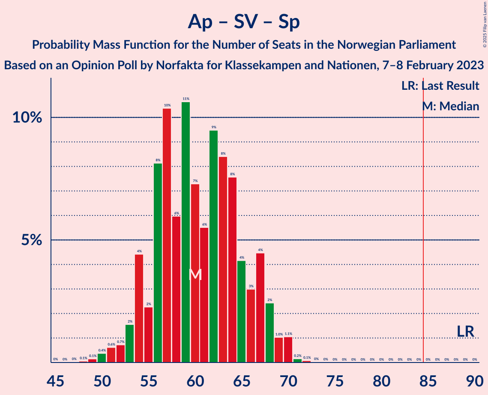

| Number of Seats | Probability | Accumulated | Special Marks |
|:---------------:|:-----------:|:-----------:|:-------------:|
| 47 | 0% | 100% |  |
| 48 | 0.1% | 99.9% |  |
| 49 | 0.1% | 99.9% |  |
| 50 | 0.4% | 99.7% |  |
| 51 | 0.6% | 99.4% |  |
| 52 | 0.7% | 98.7% |  |
| 53 | 2% | 98% |  |
| 54 | 4% | 96% |  |
| 55 | 2% | 92% |  |
| 56 | 8% | 90% |  |
| 57 | 10% | 82% |  |
| 58 | 6% | 71% |  |
| 59 | 11% | 65% |  |
| 60 | 7% | 55% | Median |
| 61 | 6% | 47% |  |
| 62 | 9% | 42% |  |
| 63 | 8% | 32% |  |
| 64 | 8% | 24% |  |
| 65 | 4% | 16% |  |
| 66 | 3% | 12% |  |
| 67 | 4% | 9% |  |
| 68 | 2% | 5% |  |
| 69 | 1.0% | 2% |  |
| 70 | 1.1% | 1.3% |  |
| 71 | 0.2% | 0.3% |  |
| 72 | 0.1% | 0.1% |  |
| 73 | 0% | 0% |  |
| 74 | 0% | 0% |  |
| 75 | 0% | 0% |  |
| 76 | 0% | 0% |  |
| 77 | 0% | 0% |  |
| 78 | 0% | 0% |  |
| 79 | 0% | 0% |  |
| 80 | 0% | 0% |  |
| 81 | 0% | 0% |  |
| 82 | 0% | 0% |  |
| 83 | 0% | 0% |  |
| 84 | 0% | 0% |  |
| 85 | 0% | 0% | Majority |
| 86 | 0% | 0% |  |
| 87 | 0% | 0% |  |
| 88 | 0% | 0% |  |
| 89 | 0% | 0% | Last Result |

### Arbeiderpartiet – Senterpartiet – Kristelig Folkeparti – Miljøpartiet De Grønne

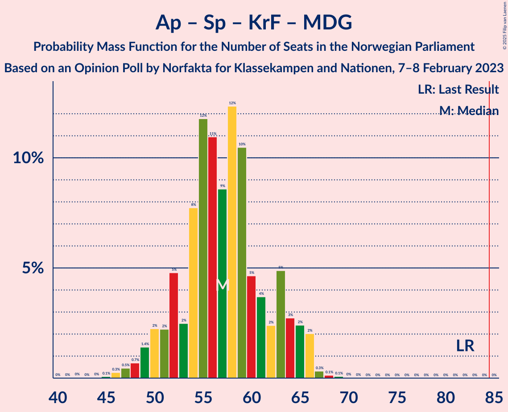

| Number of Seats | Probability | Accumulated | Special Marks |
|:---------------:|:-----------:|:-----------:|:-------------:|
| 42 | 0% | 100% |  |
| 43 | 0% | 99.9% |  |
| 44 | 0% | 99.9% |  |
| 45 | 0.1% | 99.9% |  |
| 46 | 0.3% | 99.8% |  |
| 47 | 0.5% | 99.5% |  |
| 48 | 0.7% | 99.1% |  |
| 49 | 1.4% | 98% |  |
| 50 | 2% | 97% |  |
| 51 | 2% | 95% |  |
| 52 | 5% | 93% |  |
| 53 | 2% | 88% |  |
| 54 | 8% | 85% |  |
| 55 | 12% | 78% |  |
| 56 | 11% | 66% |  |
| 57 | 9% | 55% | Median |
| 58 | 12% | 46% |  |
| 59 | 10% | 34% |  |
| 60 | 5% | 23% |  |
| 61 | 4% | 19% |  |
| 62 | 2% | 15% |  |
| 63 | 5% | 13% |  |
| 64 | 3% | 8% |  |
| 65 | 2% | 5% |  |
| 66 | 2% | 3% |  |
| 67 | 0.3% | 0.6% |  |
| 68 | 0.1% | 0.3% |  |
| 69 | 0.1% | 0.1% |  |
| 70 | 0% | 0.1% |  |
| 71 | 0% | 0% |  |
| 72 | 0% | 0% |  |
| 73 | 0% | 0% |  |
| 74 | 0% | 0% |  |
| 75 | 0% | 0% |  |
| 76 | 0% | 0% |  |
| 77 | 0% | 0% |  |
| 78 | 0% | 0% |  |
| 79 | 0% | 0% |  |
| 80 | 0% | 0% |  |
| 81 | 0% | 0% |  |
| 82 | 0% | 0% | Last Result |

### Arbeiderpartiet – Senterpartiet – Kristelig Folkeparti

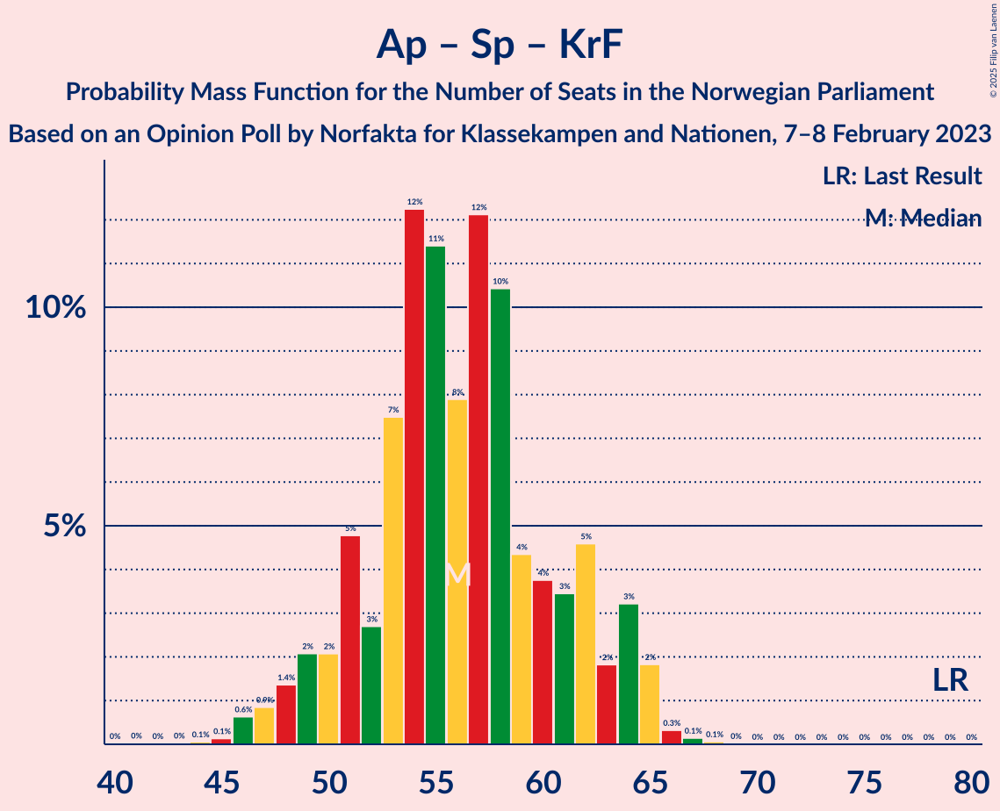

| Number of Seats | Probability | Accumulated | Special Marks |
|:---------------:|:-----------:|:-----------:|:-------------:|
| 41 | 0% | 100% |  |
| 42 | 0% | 99.9% |  |
| 43 | 0% | 99.9% |  |
| 44 | 0.1% | 99.9% |  |
| 45 | 0.1% | 99.8% |  |
| 46 | 0.6% | 99.7% |  |
| 47 | 0.9% | 99.1% |  |
| 48 | 1.4% | 98% |  |
| 49 | 2% | 97% |  |
| 50 | 2% | 95% |  |
| 51 | 5% | 93% |  |
| 52 | 3% | 88% |  |
| 53 | 7% | 85% |  |
| 54 | 12% | 78% |  |
| 55 | 11% | 65% |  |
| 56 | 8% | 54% | Median |
| 57 | 12% | 46% |  |
| 58 | 10% | 34% |  |
| 59 | 4% | 24% |  |
| 60 | 4% | 19% |  |
| 61 | 3% | 15% |  |
| 62 | 5% | 12% |  |
| 63 | 2% | 7% |  |
| 64 | 3% | 6% |  |
| 65 | 2% | 2% |  |
| 66 | 0.3% | 0.6% |  |
| 67 | 0.1% | 0.2% |  |
| 68 | 0.1% | 0.1% |  |
| 69 | 0% | 0% |  |
| 70 | 0% | 0% |  |
| 71 | 0% | 0% |  |
| 72 | 0% | 0% |  |
| 73 | 0% | 0% |  |
| 74 | 0% | 0% |  |
| 75 | 0% | 0% |  |
| 76 | 0% | 0% |  |
| 77 | 0% | 0% |  |
| 78 | 0% | 0% |  |
| 79 | 0% | 0% | Last Result |

### Arbeiderpartiet – Sosialistisk Venstreparti

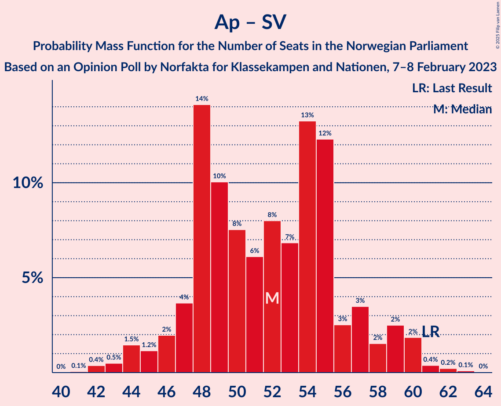

| Number of Seats | Probability | Accumulated | Special Marks |
|:---------------:|:-----------:|:-----------:|:-------------:|
| 41 | 0.1% | 100% |  |
| 42 | 0.4% | 99.9% |  |
| 43 | 0.5% | 99.6% |  |
| 44 | 1.5% | 99.1% |  |
| 45 | 1.2% | 98% |  |
| 46 | 2% | 96% |  |
| 47 | 4% | 94% |  |
| 48 | 14% | 91% |  |
| 49 | 10% | 77% |  |
| 50 | 8% | 67% |  |
| 51 | 6% | 59% |  |
| 52 | 8% | 53% | Median |
| 53 | 7% | 45% |  |
| 54 | 13% | 38% |  |
| 55 | 12% | 25% |  |
| 56 | 3% | 13% |  |
| 57 | 3% | 10% |  |
| 58 | 2% | 7% |  |
| 59 | 2% | 5% |  |
| 60 | 2% | 3% |  |
| 61 | 0.4% | 0.7% | Last Result |
| 62 | 0.2% | 0.4% |  |
| 63 | 0.1% | 0.1% |  |
| 64 | 0% | 0% |  |

### Arbeiderpartiet – Senterpartiet

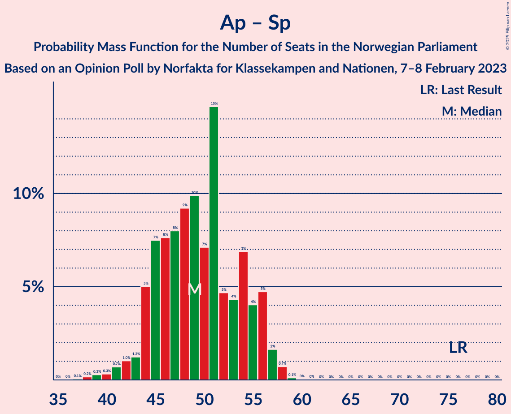

| Number of Seats | Probability | Accumulated | Special Marks |
|:---------------:|:-----------:|:-----------:|:-------------:|
| 36 | 0% | 100% |  |
| 37 | 0.1% | 99.9% |  |
| 38 | 0.2% | 99.9% |  |
| 39 | 0.3% | 99.7% |  |
| 40 | 0.3% | 99.4% |  |
| 41 | 0.7% | 99.1% |  |
| 42 | 1.0% | 98% |  |
| 43 | 1.2% | 97% |  |
| 44 | 5% | 96% |  |
| 45 | 7% | 91% |  |
| 46 | 8% | 84% |  |
| 47 | 8% | 76% |  |
| 48 | 9% | 68% |  |
| 49 | 10% | 59% | Median |
| 50 | 7% | 49% |  |
| 51 | 15% | 42% |  |
| 52 | 5% | 27% |  |
| 53 | 4% | 22% |  |
| 54 | 7% | 18% |  |
| 55 | 4% | 11% |  |
| 56 | 5% | 7% |  |
| 57 | 2% | 3% |  |
| 58 | 0.7% | 0.9% |  |
| 59 | 0.1% | 0.2% |  |
| 60 | 0% | 0.1% |  |
| 61 | 0% | 0% |  |
| 62 | 0% | 0% |  |
| 63 | 0% | 0% |  |
| 64 | 0% | 0% |  |
| 65 | 0% | 0% |  |
| 66 | 0% | 0% |  |
| 67 | 0% | 0% |  |
| 68 | 0% | 0% |  |
| 69 | 0% | 0% |  |
| 70 | 0% | 0% |  |
| 71 | 0% | 0% |  |
| 72 | 0% | 0% |  |
| 73 | 0% | 0% |  |
| 74 | 0% | 0% |  |
| 75 | 0% | 0% |  |
| 76 | 0% | 0% | Last Result |

### Senterpartiet – Kristelig Folkeparti – Venstre

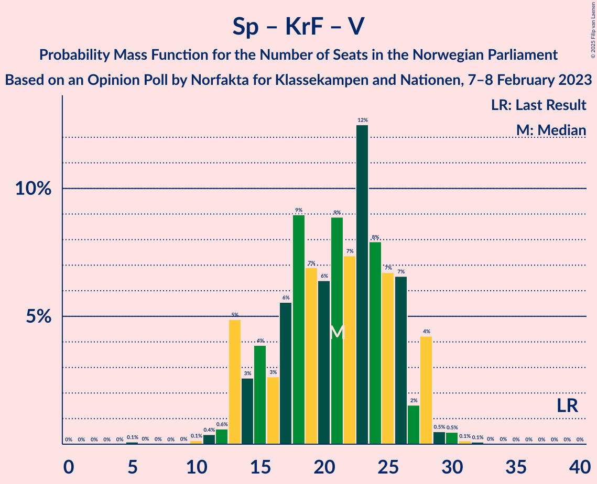

| Number of Seats | Probability | Accumulated | Special Marks |
|:---------------:|:-----------:|:-----------:|:-------------:|
| 5 | 0.1% | 100% |  |
| 6 | 0% | 99.9% |  |
| 7 | 0% | 99.9% |  |
| 8 | 0% | 99.9% |  |
| 9 | 0% | 99.9% |  |
| 10 | 0.1% | 99.8% |  |
| 11 | 0.4% | 99.7% |  |
| 12 | 0.6% | 99.3% |  |
| 13 | 5% | 98.7% |  |
| 14 | 3% | 94% |  |
| 15 | 4% | 91% |  |
| 16 | 3% | 87% |  |
| 17 | 6% | 85% |  |
| 18 | 9% | 79% |  |
| 19 | 7% | 70% |  |
| 20 | 6% | 63% |  |
| 21 | 9% | 57% | Median |
| 22 | 7% | 48% |  |
| 23 | 12% | 41% |  |
| 24 | 8% | 28% |  |
| 25 | 7% | 20% |  |
| 26 | 7% | 14% |  |
| 27 | 2% | 7% |  |
| 28 | 4% | 5% |  |
| 29 | 0.5% | 1.2% |  |
| 30 | 0.5% | 0.7% |  |
| 31 | 0.1% | 0.3% |  |
| 32 | 0.1% | 0.1% |  |
| 33 | 0% | 0% |  |
| 34 | 0% | 0% |  |
| 35 | 0% | 0% |  |
| 36 | 0% | 0% |  |
| 37 | 0% | 0% |  |
| 38 | 0% | 0% |  |
| 39 | 0% | 0% | Last Result |

## Technical Information

### Opinion Poll

+ **Polling firm:** Norfakta
+ **Commissioner(s):** Klassekampen and Nationen
+ **Fieldwork period:** 7–8 February 2023

### Calculations

+ **Sample size:** 731
+ **Simulations done:** 1,048,576
+ **Error estimate:** 2.21%

