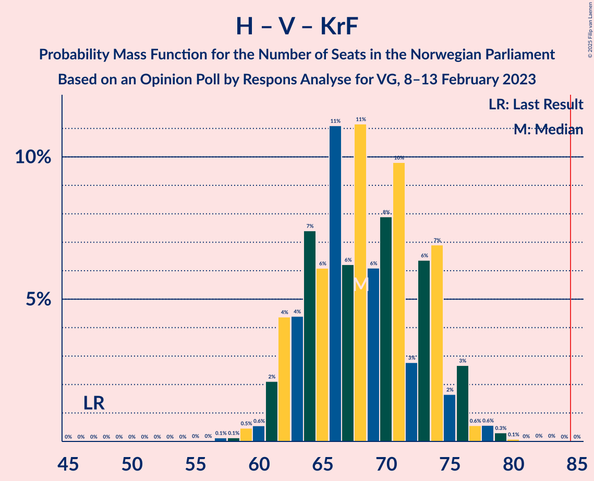

# Opinion Poll by Respons Analyse for VG, 8–13 February 2023

<a href="#voting-intentions">Voting Intentions</a> | <a href="#seats">Seats</a> | <a href="#coalitions">Coalitions</a> | <a href="#technical-information">Technical Information</a>

## Voting Intentions

### Confidence Intervals

| Party | Last Result | Poll Result | 80% Confidence Interval | 90% Confidence Interval | 95% Confidence Interval | 99% Confidence Interval |
|:-----:|:-----------:|:-----------:|:-----------------------:|:-----------------------:|:-----------------------:|:-----------------------:|
| Høyre | 20.4% | 32.4% | 30.5–34.3% |30.0–34.9% |29.6–35.4% |28.7–36.3% |
| Arbeiderpartiet | 26.2% | 18.6% | 17.1–20.3% |16.7–20.7% |16.3–21.1% |15.6–21.9% |
| Fremskrittspartiet | 11.6% | 12.8% | 11.5–14.3% |11.2–14.7% |10.9–15.0% |10.3–15.7% |
| Sosialistisk Venstreparti | 7.6% | 9.5% | 8.4–10.8% |8.1–11.2% |7.8–11.5% |7.3–12.1% |
| Rødt | 4.7% | 6.3% | 5.4–7.4% |5.2–7.7% |5.0–8.0% |4.6–8.6% |
| Senterpartiet | 13.5% | 5.3% | 4.5–6.3% |4.3–6.6% |4.1–6.9% |3.7–7.4% |
| Venstre | 4.6% | 4.8% | 4.0–5.8% |3.8–6.1% |3.6–6.3% |3.3–6.8% |
| Kristelig Folkeparti | 3.8% | 3.5% | 2.9–4.4% |2.7–4.6% |2.5–4.8% |2.2–5.3% |
| Miljøpartiet De Grønne | 3.9% | 2.3% | 1.8–3.0% |1.6–3.2% |1.5–3.4% |1.3–3.8% |

*Note:* The poll result column reflects the actual value used in the calculations. Published results may vary slightly, and in addition be rounded to fewer digits.

## Seats

### Confidence Intervals

| Party | Last Result | Median | 80% Confidence Interval | 90% Confidence Interval | 95% Confidence Interval | 99% Confidence Interval |
|:-----:|:-----------:|:------:|:-----------------------:|:-----------------------:|:-----------------------:|:-----------------------:|
| <a href="#høyre">Høyre</a> | 36 | 57 | 53–62 |52–64 |52–65 |50–67 |
| <a href="#arbeiderpartiet">Arbeiderpartiet</a> | 48 | 36 | 33–39 |33–40 |32–42 |31–43 |
| <a href="#fremskrittspartiet">Fremskrittspartiet</a> | 21 | 22 | 18–26 |18–28 |18–29 |17–30 |
| <a href="#sosialistisk-venstreparti">Sosialistisk Venstreparti</a> | 13 | 16 | 13–18 |12–19 |12–19 |11–21 |
| <a href="#rødt">Rødt</a> | 8 | 10 | 8–12 |8–13 |8–13 |7–14 |
| <a href="#senterpartiet">Senterpartiet</a> | 28 | 9 | 7–11 |6–12 |6–12 |0–13 |
| <a href="#venstre">Venstre</a> | 8 | 8 | 3–9 |3–10 |2–10 |2–11 |
| <a href="#kristelig-folkeparti">Kristelig Folkeparti</a> | 3 | 3 | 2–6 |2–7 |1–8 |0–8 |
| <a href="#miljøpartiet-de-grønne">Miljøpartiet De Grønne</a> | 3 | 1 | 1 |0–2 |0–2 |0–2 |

### Høyre

*For a full overview of the results for this party, see the [Høyre](party-høyre.html) page.*

| Number of Seats | Probability | Accumulated | Special Marks |
|:---------------:|:-----------:|:-----------:|:-------------:|
| 36 | 0% | 100% | Last Result |
| 37 | 0% | 100% |  |
| 38 | 0% | 100% |  |
| 39 | 0% | 100% |  |
| 40 | 0% | 100% |  |
| 41 | 0% | 100% |  |
| 42 | 0% | 100% |  |
| 43 | 0% | 100% |  |
| 44 | 0% | 100% |  |
| 45 | 0% | 100% |  |
| 46 | 0% | 100% |  |
| 47 | 0% | 100% |  |
| 48 | 0.1% | 100% |  |
| 49 | 0.2% | 99.9% |  |
| 50 | 0.6% | 99.7% |  |
| 51 | 1.5% | 99.1% |  |
| 52 | 5% | 98% |  |
| 53 | 9% | 92% |  |
| 54 | 8% | 84% |  |
| 55 | 7% | 76% |  |
| 56 | 12% | 68% |  |
| 57 | 8% | 56% | Median |
| 58 | 8% | 48% |  |
| 59 | 10% | 40% |  |
| 60 | 12% | 30% |  |
| 61 | 4% | 18% |  |
| 62 | 5% | 14% |  |
| 63 | 3% | 8% |  |
| 64 | 2% | 5% |  |
| 65 | 2% | 4% |  |
| 66 | 0.7% | 2% |  |
| 67 | 0.6% | 1.0% |  |
| 68 | 0.2% | 0.4% |  |
| 69 | 0.1% | 0.2% |  |
| 70 | 0.1% | 0.1% |  |
| 71 | 0% | 0% |  |

### Arbeiderpartiet

*For a full overview of the results for this party, see the [Arbeiderpartiet](party-arbeiderpartiet.html) page.*

| Number of Seats | Probability | Accumulated | Special Marks |
|:---------------:|:-----------:|:-----------:|:-------------:|
| 28 | 0% | 100% |  |
| 29 | 0.1% | 99.9% |  |
| 30 | 0.2% | 99.8% |  |
| 31 | 0.8% | 99.7% |  |
| 32 | 2% | 98.8% |  |
| 33 | 13% | 97% |  |
| 34 | 9% | 84% |  |
| 35 | 23% | 76% |  |
| 36 | 17% | 53% | Median |
| 37 | 18% | 36% |  |
| 38 | 4% | 18% |  |
| 39 | 5% | 14% |  |
| 40 | 5% | 9% |  |
| 41 | 2% | 4% |  |
| 42 | 1.0% | 3% |  |
| 43 | 1.1% | 2% |  |
| 44 | 0.3% | 0.4% |  |
| 45 | 0.1% | 0.2% |  |
| 46 | 0% | 0.1% |  |
| 47 | 0% | 0% |  |
| 48 | 0% | 0% | Last Result |

### Fremskrittspartiet

*For a full overview of the results for this party, see the [Fremskrittspartiet](party-fremskrittspartiet.html) page.*

| Number of Seats | Probability | Accumulated | Special Marks |
|:---------------:|:-----------:|:-----------:|:-------------:|
| 17 | 1.3% | 100% |  |
| 18 | 14% | 98.7% |  |
| 19 | 12% | 85% |  |
| 20 | 7% | 73% |  |
| 21 | 7% | 67% | Last Result |
| 22 | 12% | 60% | Median |
| 23 | 25% | 48% |  |
| 24 | 5% | 23% |  |
| 25 | 5% | 18% |  |
| 26 | 4% | 13% |  |
| 27 | 3% | 9% |  |
| 28 | 3% | 6% |  |
| 29 | 2% | 4% |  |
| 30 | 2% | 2% |  |
| 31 | 0.2% | 0.3% |  |
| 32 | 0% | 0.1% |  |
| 33 | 0% | 0% |  |

### Sosialistisk Venstreparti

*For a full overview of the results for this party, see the [Sosialistisk Venstreparti](party-sosialistiskvenstreparti.html) page.*

| Number of Seats | Probability | Accumulated | Special Marks |
|:---------------:|:-----------:|:-----------:|:-------------:|
| 10 | 0.3% | 100% |  |
| 11 | 1.1% | 99.6% |  |
| 12 | 4% | 98.5% |  |
| 13 | 7% | 94% | Last Result |
| 14 | 18% | 88% |  |
| 15 | 13% | 70% |  |
| 16 | 22% | 57% | Median |
| 17 | 11% | 35% |  |
| 18 | 18% | 24% |  |
| 19 | 4% | 6% |  |
| 20 | 2% | 2% |  |
| 21 | 0.5% | 0.8% |  |
| 22 | 0.2% | 0.3% |  |
| 23 | 0% | 0% |  |

### Rødt

*For a full overview of the results for this party, see the [Rødt](party-rødt.html) page.*

| Number of Seats | Probability | Accumulated | Special Marks |
|:---------------:|:-----------:|:-----------:|:-------------:|
| 6 | 0.2% | 100% |  |
| 7 | 2% | 99.8% |  |
| 8 | 8% | 98% | Last Result |
| 9 | 20% | 90% |  |
| 10 | 28% | 70% | Median |
| 11 | 21% | 41% |  |
| 12 | 14% | 20% |  |
| 13 | 5% | 6% |  |
| 14 | 0.9% | 1.2% |  |
| 15 | 0.2% | 0.3% |  |
| 16 | 0% | 0.1% |  |
| 17 | 0% | 0% |  |

### Senterpartiet

*For a full overview of the results for this party, see the [Senterpartiet](party-senterpartiet.html) page.*

| Number of Seats | Probability | Accumulated | Special Marks |
|:---------------:|:-----------:|:-----------:|:-------------:|
| 0 | 0.5% | 100% |  |
| 1 | 1.2% | 99.5% |  |
| 2 | 0.2% | 98% |  |
| 3 | 0% | 98% |  |
| 4 | 0% | 98% |  |
| 5 | 0% | 98% |  |
| 6 | 5% | 98% |  |
| 7 | 14% | 93% |  |
| 8 | 24% | 80% |  |
| 9 | 27% | 55% | Median |
| 10 | 12% | 28% |  |
| 11 | 10% | 16% |  |
| 12 | 4% | 6% |  |
| 13 | 2% | 2% |  |
| 14 | 0.1% | 0.2% |  |
| 15 | 0% | 0% |  |
| 16 | 0% | 0% |  |
| 17 | 0% | 0% |  |
| 18 | 0% | 0% |  |
| 19 | 0% | 0% |  |
| 20 | 0% | 0% |  |
| 21 | 0% | 0% |  |
| 22 | 0% | 0% |  |
| 23 | 0% | 0% |  |
| 24 | 0% | 0% |  |
| 25 | 0% | 0% |  |
| 26 | 0% | 0% |  |
| 27 | 0% | 0% |  |
| 28 | 0% | 0% | Last Result |

### Venstre

*For a full overview of the results for this party, see the [Venstre](party-venstre.html) page.*

| Number of Seats | Probability | Accumulated | Special Marks |
|:---------------:|:-----------:|:-----------:|:-------------:|
| 2 | 3% | 100% |  |
| 3 | 7% | 97% |  |
| 4 | 0% | 90% |  |
| 5 | 0% | 90% |  |
| 6 | 3% | 90% |  |
| 7 | 21% | 87% |  |
| 8 | 30% | 65% | Last Result, Median |
| 9 | 28% | 35% |  |
| 10 | 6% | 8% |  |
| 11 | 2% | 2% |  |
| 12 | 0.3% | 0.4% |  |
| 13 | 0.1% | 0.1% |  |
| 14 | 0% | 0% |  |

### Kristelig Folkeparti

*For a full overview of the results for this party, see the [Kristelig Folkeparti](party-kristeligfolkeparti.html) page.*

| Number of Seats | Probability | Accumulated | Special Marks |
|:---------------:|:-----------:|:-----------:|:-------------:|
| 0 | 0.9% | 100% |  |
| 1 | 3% | 99.1% |  |
| 2 | 41% | 96% |  |
| 3 | 33% | 55% | Last Result, Median |
| 4 | 0% | 21% |  |
| 5 | 0.2% | 21% |  |
| 6 | 12% | 21% |  |
| 7 | 7% | 10% |  |
| 8 | 2% | 3% |  |
| 9 | 0.4% | 0.4% |  |
| 10 | 0% | 0% |  |

### Miljøpartiet De Grønne

*For a full overview of the results for this party, see the [Miljøpartiet De Grønne](party-miljøpartietdegrønne.html) page.*

| Number of Seats | Probability | Accumulated | Special Marks |
|:---------------:|:-----------:|:-----------:|:-------------:|
| 0 | 6% | 100% |  |
| 1 | 85% | 94% | Median |
| 2 | 9% | 10% |  |
| 3 | 0.2% | 0.4% | Last Result |
| 4 | 0% | 0.2% |  |
| 5 | 0% | 0.2% |  |
| 6 | 0.1% | 0.2% |  |
| 7 | 0.1% | 0.1% |  |
| 8 | 0% | 0% |  |

## Coalitions

### Confidence Intervals

| Coalition | Last Result | Median | Majority? | 80% Confidence Interval | 90% Confidence Interval | 95% Confidence Interval | 99% Confidence Interval |
|:---------:|:-----------:|:------:|:---------:|:-----------------------:|:-----------------------:|:-----------------------:|:-----------------------:|
| Høyre – Fremskrittspartiet – Senterpartiet – Venstre – Kristelig Folkeparti | 96 | 99 | 100% | 95–104 | 93–105 | 92–107 | 90–108 |
| Høyre – Fremskrittspartiet – Venstre – Kristelig Folkeparti – Miljøpartiet De Grønne | 71 | 91 | 97% | 86–96 | 85–98 | 84–99 | 83–102 |
| Høyre – Fremskrittspartiet – Venstre – Kristelig Folkeparti | 68 | 90 | 93% | 85–95 | 84–97 | 83–98 | 81–101 |
| Høyre – Fremskrittspartiet – Venstre | 65 | 87 | 76% | 82–92 | 81–93 | 80–95 | 78–98 |
| Høyre – Fremskrittspartiet | 57 | 79 | 11% | 75–85 | 74–86 | 73–87 | 71–90 |
| Arbeiderpartiet – Sosialistisk Venstreparti – Rødt – Senterpartiet – Miljøpartiet De Grønne | 100 | 72 | 0% | 67–77 | 65–78 | 64–79 | 61–81 |
| Arbeiderpartiet – Sosialistisk Venstreparti – Rødt – Senterpartiet | 97 | 71 | 0% | 66–76 | 64–77 | 63–78 | 60–80 |
| Høyre – Venstre – Kristelig Folkeparti | 47 | 68 | 0% | 63–74 | 62–75 | 61–76 | 59–78 |
| Arbeiderpartiet – Sosialistisk Venstreparti – Senterpartiet – Kristelig Folkeparti – Miljøpartiet De Grønne | 95 | 65 | 0% | 60–69 | 59–71 | 58–72 | 56–74 |
| Arbeiderpartiet – Sosialistisk Venstreparti – Rødt – Miljøpartiet De Grønne | 72 | 63 | 0% | 59–67 | 58–69 | 57–70 | 54–72 |
| Arbeiderpartiet – Sosialistisk Venstreparti – Senterpartiet – Miljøpartiet De Grønne | 92 | 61 | 0% | 57–66 | 56–67 | 55–68 | 52–70 |
| Arbeiderpartiet – Sosialistisk Venstreparti – Senterpartiet | 89 | 60 | 0% | 56–64 | 55–66 | 53–67 | 51–69 |
| Arbeiderpartiet – Sosialistisk Venstreparti | 61 | 52 | 0% | 48–55 | 47–57 | 46–58 | 44–60 |
| Arbeiderpartiet – Senterpartiet – Kristelig Folkeparti – Miljøpartiet De Grønne | 82 | 49 | 0% | 45–53 | 45–54 | 43–56 | 40–58 |
| Arbeiderpartiet – Senterpartiet – Kristelig Folkeparti | 79 | 48 | 0% | 44–52 | 43–53 | 42–55 | 39–57 |
| Arbeiderpartiet – Senterpartiet | 76 | 45 | 0% | 42–48 | 41–49 | 39–50 | 36–52 |
| Senterpartiet – Venstre – Kristelig Folkeparti | 39 | 20 | 0% | 15–23 | 14–24 | 13–25 | 11–28 |

### Høyre – Fremskrittspartiet – Senterpartiet – Venstre – Kristelig Folkeparti

| Number of Seats | Probability | Accumulated | Special Marks |
|:---------------:|:-----------:|:-----------:|:-------------:|
| 88 | 0.1% | 100% |  |
| 89 | 0.2% | 99.9% |  |
| 90 | 0.3% | 99.6% |  |
| 91 | 1.1% | 99.3% |  |
| 92 | 1.2% | 98% |  |
| 93 | 3% | 97% |  |
| 94 | 3% | 94% |  |
| 95 | 6% | 91% |  |
| 96 | 10% | 85% | Last Result |
| 97 | 10% | 75% |  |
| 98 | 11% | 65% |  |
| 99 | 8% | 54% | Median |
| 100 | 14% | 47% |  |
| 101 | 5% | 33% |  |
| 102 | 7% | 27% |  |
| 103 | 10% | 20% |  |
| 104 | 5% | 11% |  |
| 105 | 3% | 6% |  |
| 106 | 1.0% | 4% |  |
| 107 | 2% | 3% |  |
| 108 | 0.8% | 1.2% |  |
| 109 | 0.2% | 0.4% |  |
| 110 | 0.2% | 0.2% |  |
| 111 | 0% | 0.1% |  |
| 112 | 0% | 0% |  |

### Høyre – Fremskrittspartiet – Venstre – Kristelig Folkeparti – Miljøpartiet De Grønne

| Number of Seats | Probability | Accumulated | Special Marks |
|:---------------:|:-----------:|:-----------:|:-------------:|
| 71 | 0% | 100% | Last Result |
| 72 | 0% | 100% |  |
| 73 | 0% | 100% |  |
| 74 | 0% | 100% |  |
| 75 | 0% | 100% |  |
| 76 | 0% | 100% |  |
| 77 | 0% | 100% |  |
| 78 | 0% | 100% |  |
| 79 | 0% | 100% |  |
| 80 | 0.1% | 100% |  |
| 81 | 0.1% | 99.9% |  |
| 82 | 0.3% | 99.8% |  |
| 83 | 0.8% | 99.5% |  |
| 84 | 2% | 98.7% |  |
| 85 | 3% | 97% | Majority |
| 86 | 4% | 94% |  |
| 87 | 2% | 90% |  |
| 88 | 14% | 88% |  |
| 89 | 7% | 74% |  |
| 90 | 12% | 67% |  |
| 91 | 6% | 55% | Median |
| 92 | 8% | 50% |  |
| 93 | 12% | 41% |  |
| 94 | 5% | 29% |  |
| 95 | 10% | 24% |  |
| 96 | 4% | 14% |  |
| 97 | 4% | 10% |  |
| 98 | 2% | 6% |  |
| 99 | 2% | 4% |  |
| 100 | 1.0% | 2% |  |
| 101 | 0.6% | 1.2% |  |
| 102 | 0.4% | 0.6% |  |
| 103 | 0.1% | 0.3% |  |
| 104 | 0.1% | 0.2% |  |
| 105 | 0% | 0.1% |  |
| 106 | 0% | 0% |  |

### Høyre – Fremskrittspartiet – Venstre – Kristelig Folkeparti

| Number of Seats | Probability | Accumulated | Special Marks |
|:---------------:|:-----------:|:-----------:|:-------------:|
| 68 | 0% | 100% | Last Result |
| 69 | 0% | 100% |  |
| 70 | 0% | 100% |  |
| 71 | 0% | 100% |  |
| 72 | 0% | 100% |  |
| 73 | 0% | 100% |  |
| 74 | 0% | 100% |  |
| 75 | 0% | 100% |  |
| 76 | 0% | 100% |  |
| 77 | 0% | 100% |  |
| 78 | 0% | 100% |  |
| 79 | 0.1% | 100% |  |
| 80 | 0.1% | 99.9% |  |
| 81 | 0.3% | 99.8% |  |
| 82 | 0.7% | 99.4% |  |
| 83 | 1.5% | 98.7% |  |
| 84 | 5% | 97% |  |
| 85 | 3% | 93% | Majority |
| 86 | 2% | 90% |  |
| 87 | 13% | 87% |  |
| 88 | 6% | 74% |  |
| 89 | 12% | 67% |  |
| 90 | 6% | 55% | Median |
| 91 | 8% | 49% |  |
| 92 | 11% | 41% |  |
| 93 | 5% | 29% |  |
| 94 | 11% | 25% |  |
| 95 | 4% | 14% |  |
| 96 | 4% | 9% |  |
| 97 | 2% | 6% |  |
| 98 | 2% | 4% |  |
| 99 | 0.8% | 2% |  |
| 100 | 0.7% | 1.3% |  |
| 101 | 0.3% | 0.6% |  |
| 102 | 0.1% | 0.3% |  |
| 103 | 0.1% | 0.1% |  |
| 104 | 0% | 0.1% |  |
| 105 | 0% | 0% |  |

### Høyre – Fremskrittspartiet – Venstre

| Number of Seats | Probability | Accumulated | Special Marks |
|:---------------:|:-----------:|:-----------:|:-------------:|
| 65 | 0% | 100% | Last Result |
| 66 | 0% | 100% |  |
| 67 | 0% | 100% |  |
| 68 | 0% | 100% |  |
| 69 | 0% | 100% |  |
| 70 | 0% | 100% |  |
| 71 | 0% | 100% |  |
| 72 | 0% | 100% |  |
| 73 | 0% | 100% |  |
| 74 | 0% | 100% |  |
| 75 | 0% | 100% |  |
| 76 | 0.1% | 99.9% |  |
| 77 | 0.2% | 99.8% |  |
| 78 | 0.3% | 99.6% |  |
| 79 | 0.9% | 99.3% |  |
| 80 | 1.4% | 98% |  |
| 81 | 3% | 97% |  |
| 82 | 4% | 94% |  |
| 83 | 4% | 89% |  |
| 84 | 10% | 86% |  |
| 85 | 8% | 76% | Majority |
| 86 | 15% | 68% |  |
| 87 | 12% | 53% | Median |
| 88 | 7% | 41% |  |
| 89 | 5% | 34% |  |
| 90 | 8% | 29% |  |
| 91 | 8% | 21% |  |
| 92 | 5% | 13% |  |
| 93 | 3% | 8% |  |
| 94 | 2% | 4% |  |
| 95 | 1.3% | 3% |  |
| 96 | 0.4% | 1.3% |  |
| 97 | 0.5% | 1.0% |  |
| 98 | 0.3% | 0.5% |  |
| 99 | 0.1% | 0.2% |  |
| 100 | 0% | 0.1% |  |
| 101 | 0% | 0% |  |

### Høyre – Fremskrittspartiet

| Number of Seats | Probability | Accumulated | Special Marks |
|:---------------:|:-----------:|:-----------:|:-------------:|
| 57 | 0% | 100% | Last Result |
| 58 | 0% | 100% |  |
| 59 | 0% | 100% |  |
| 60 | 0% | 100% |  |
| 61 | 0% | 100% |  |
| 62 | 0% | 100% |  |
| 63 | 0% | 100% |  |
| 64 | 0% | 100% |  |
| 65 | 0% | 100% |  |
| 66 | 0% | 100% |  |
| 67 | 0% | 100% |  |
| 68 | 0% | 100% |  |
| 69 | 0.1% | 100% |  |
| 70 | 0.1% | 99.9% |  |
| 71 | 0.9% | 99.8% |  |
| 72 | 0.8% | 98.9% |  |
| 73 | 2% | 98% |  |
| 74 | 4% | 97% |  |
| 75 | 8% | 93% |  |
| 76 | 9% | 85% |  |
| 77 | 5% | 76% |  |
| 78 | 14% | 71% |  |
| 79 | 8% | 57% | Median |
| 80 | 10% | 48% |  |
| 81 | 5% | 38% |  |
| 82 | 14% | 33% |  |
| 83 | 7% | 20% |  |
| 84 | 2% | 12% |  |
| 85 | 6% | 11% | Majority |
| 86 | 2% | 5% |  |
| 87 | 1.0% | 3% |  |
| 88 | 1.3% | 2% |  |
| 89 | 0.4% | 1.0% |  |
| 90 | 0.3% | 0.6% |  |
| 91 | 0.1% | 0.2% |  |
| 92 | 0.1% | 0.1% |  |
| 93 | 0% | 0.1% |  |
| 94 | 0% | 0% |  |

### Arbeiderpartiet – Sosialistisk Venstreparti – Rødt – Senterpartiet – Miljøpartiet De Grønne

| Number of Seats | Probability | Accumulated | Special Marks |
|:---------------:|:-----------:|:-----------:|:-------------:|
| 58 | 0% | 100% |  |
| 59 | 0.1% | 99.9% |  |
| 60 | 0.1% | 99.8% |  |
| 61 | 0.5% | 99.7% |  |
| 62 | 0.2% | 99.3% |  |
| 63 | 1.3% | 99.0% |  |
| 64 | 1.1% | 98% |  |
| 65 | 3% | 97% |  |
| 66 | 3% | 94% |  |
| 67 | 4% | 91% |  |
| 68 | 5% | 87% |  |
| 69 | 11% | 81% |  |
| 70 | 7% | 71% |  |
| 71 | 8% | 64% |  |
| 72 | 14% | 56% | Median |
| 73 | 6% | 42% |  |
| 74 | 15% | 36% |  |
| 75 | 6% | 21% |  |
| 76 | 5% | 15% |  |
| 77 | 4% | 10% |  |
| 78 | 3% | 6% |  |
| 79 | 2% | 3% |  |
| 80 | 0.5% | 1.2% |  |
| 81 | 0.3% | 0.7% |  |
| 82 | 0.3% | 0.4% |  |
| 83 | 0.1% | 0.1% |  |
| 84 | 0% | 0% |  |
| 85 | 0% | 0% | Majority |
| 86 | 0% | 0% |  |
| 87 | 0% | 0% |  |
| 88 | 0% | 0% |  |
| 89 | 0% | 0% |  |
| 90 | 0% | 0% |  |
| 91 | 0% | 0% |  |
| 92 | 0% | 0% |  |
| 93 | 0% | 0% |  |
| 94 | 0% | 0% |  |
| 95 | 0% | 0% |  |
| 96 | 0% | 0% |  |
| 97 | 0% | 0% |  |
| 98 | 0% | 0% |  |
| 99 | 0% | 0% |  |
| 100 | 0% | 0% | Last Result |

### Arbeiderpartiet – Sosialistisk Venstreparti – Rødt – Senterpartiet

| Number of Seats | Probability | Accumulated | Special Marks |
|:---------------:|:-----------:|:-----------:|:-------------:|
| 57 | 0% | 100% |  |
| 58 | 0.1% | 99.9% |  |
| 59 | 0.1% | 99.8% |  |
| 60 | 0.4% | 99.7% |  |
| 61 | 0.3% | 99.3% |  |
| 62 | 1.4% | 98.9% |  |
| 63 | 1.0% | 98% |  |
| 64 | 2% | 97% |  |
| 65 | 4% | 94% |  |
| 66 | 4% | 90% |  |
| 67 | 6% | 87% |  |
| 68 | 10% | 81% |  |
| 69 | 7% | 70% |  |
| 70 | 8% | 63% |  |
| 71 | 14% | 55% | Median |
| 72 | 6% | 42% |  |
| 73 | 14% | 36% |  |
| 74 | 8% | 21% |  |
| 75 | 3% | 14% |  |
| 76 | 4% | 11% |  |
| 77 | 3% | 6% |  |
| 78 | 2% | 3% |  |
| 79 | 0.5% | 1.1% |  |
| 80 | 0.3% | 0.6% |  |
| 81 | 0.2% | 0.3% |  |
| 82 | 0.1% | 0.1% |  |
| 83 | 0% | 0% |  |
| 84 | 0% | 0% |  |
| 85 | 0% | 0% | Majority |
| 86 | 0% | 0% |  |
| 87 | 0% | 0% |  |
| 88 | 0% | 0% |  |
| 89 | 0% | 0% |  |
| 90 | 0% | 0% |  |
| 91 | 0% | 0% |  |
| 92 | 0% | 0% |  |
| 93 | 0% | 0% |  |
| 94 | 0% | 0% |  |
| 95 | 0% | 0% |  |
| 96 | 0% | 0% |  |
| 97 | 0% | 0% | Last Result |

### Høyre – Venstre – Kristelig Folkeparti

| Number of Seats | Probability | Accumulated | Special Marks |
|:---------------:|:-----------:|:-----------:|:-------------:|
| 47 | 0% | 100% | Last Result |
| 48 | 0% | 100% |  |
| 49 | 0% | 100% |  |
| 50 | 0% | 100% |  |
| 51 | 0% | 100% |  |
| 52 | 0% | 100% |  |
| 53 | 0% | 100% |  |
| 54 | 0% | 100% |  |
| 55 | 0% | 100% |  |
| 56 | 0% | 100% |  |
| 57 | 0.1% | 99.9% |  |
| 58 | 0.1% | 99.8% |  |
| 59 | 0.5% | 99.7% |  |
| 60 | 0.6% | 99.2% |  |
| 61 | 2% | 98.7% |  |
| 62 | 4% | 97% |  |
| 63 | 4% | 92% |  |
| 64 | 7% | 88% |  |
| 65 | 6% | 80% |  |
| 66 | 11% | 74% |  |
| 67 | 6% | 63% |  |
| 68 | 11% | 57% | Median |
| 69 | 6% | 46% |  |
| 70 | 8% | 40% |  |
| 71 | 10% | 32% |  |
| 72 | 3% | 22% |  |
| 73 | 6% | 19% |  |
| 74 | 7% | 13% |  |
| 75 | 2% | 6% |  |
| 76 | 3% | 4% |  |
| 77 | 0.6% | 2% |  |
| 78 | 0.6% | 1.0% |  |
| 79 | 0.3% | 0.5% |  |
| 80 | 0.1% | 0.2% |  |
| 81 | 0% | 0.1% |  |
| 82 | 0% | 0.1% |  |
| 83 | 0% | 0% |  |

### Arbeiderpartiet – Sosialistisk Venstreparti – Senterpartiet – Kristelig Folkeparti – Miljøpartiet De Grønne

| Number of Seats | Probability | Accumulated | Special Marks |
|:---------------:|:-----------:|:-----------:|:-------------:|
| 52 | 0.1% | 100% |  |
| 53 | 0.1% | 99.9% |  |
| 54 | 0.1% | 99.8% |  |
| 55 | 0.2% | 99.7% |  |
| 56 | 0.4% | 99.6% |  |
| 57 | 0.8% | 99.1% |  |
| 58 | 2% | 98% |  |
| 59 | 4% | 97% |  |
| 60 | 4% | 93% |  |
| 61 | 4% | 89% |  |
| 62 | 7% | 85% |  |
| 63 | 11% | 78% |  |
| 64 | 16% | 67% |  |
| 65 | 8% | 51% | Median |
| 66 | 17% | 44% |  |
| 67 | 9% | 26% |  |
| 68 | 7% | 17% |  |
| 69 | 4% | 10% |  |
| 70 | 1.4% | 7% |  |
| 71 | 3% | 5% |  |
| 72 | 1.2% | 3% |  |
| 73 | 0.6% | 1.4% |  |
| 74 | 0.4% | 0.8% |  |
| 75 | 0.1% | 0.4% |  |
| 76 | 0.1% | 0.2% |  |
| 77 | 0% | 0.1% |  |
| 78 | 0.1% | 0.1% |  |
| 79 | 0% | 0% |  |
| 80 | 0% | 0% |  |
| 81 | 0% | 0% |  |
| 82 | 0% | 0% |  |
| 83 | 0% | 0% |  |
| 84 | 0% | 0% |  |
| 85 | 0% | 0% | Majority |
| 86 | 0% | 0% |  |
| 87 | 0% | 0% |  |
| 88 | 0% | 0% |  |
| 89 | 0% | 0% |  |
| 90 | 0% | 0% |  |
| 91 | 0% | 0% |  |
| 92 | 0% | 0% |  |
| 93 | 0% | 0% |  |
| 94 | 0% | 0% |  |
| 95 | 0% | 0% | Last Result |

### Arbeiderpartiet – Sosialistisk Venstreparti – Rødt – Miljøpartiet De Grønne

| Number of Seats | Probability | Accumulated | Special Marks |
|:---------------:|:-----------:|:-----------:|:-------------:|
| 52 | 0.1% | 100% |  |
| 53 | 0.3% | 99.9% |  |
| 54 | 0.1% | 99.6% |  |
| 55 | 0.8% | 99.5% |  |
| 56 | 0.8% | 98.7% |  |
| 57 | 2% | 98% |  |
| 58 | 5% | 96% |  |
| 59 | 6% | 91% |  |
| 60 | 6% | 85% |  |
| 61 | 13% | 79% |  |
| 62 | 7% | 66% |  |
| 63 | 16% | 59% | Median |
| 64 | 13% | 43% |  |
| 65 | 10% | 30% |  |
| 66 | 5% | 20% |  |
| 67 | 6% | 15% |  |
| 68 | 4% | 9% |  |
| 69 | 2% | 5% |  |
| 70 | 2% | 3% |  |
| 71 | 0.4% | 1.1% |  |
| 72 | 0.5% | 0.7% | Last Result |
| 73 | 0.2% | 0.2% |  |
| 74 | 0% | 0.1% |  |
| 75 | 0% | 0% |  |

### Arbeiderpartiet – Sosialistisk Venstreparti – Senterpartiet – Miljøpartiet De Grønne

| Number of Seats | Probability | Accumulated | Special Marks |
|:---------------:|:-----------:|:-----------:|:-------------:|
| 49 | 0% | 100% |  |
| 50 | 0.2% | 99.9% |  |
| 51 | 0.1% | 99.8% |  |
| 52 | 0.3% | 99.6% |  |
| 53 | 0.5% | 99.3% |  |
| 54 | 1.1% | 98.8% |  |
| 55 | 2% | 98% |  |
| 56 | 3% | 96% |  |
| 57 | 6% | 93% |  |
| 58 | 4% | 87% |  |
| 59 | 7% | 83% |  |
| 60 | 14% | 76% |  |
| 61 | 13% | 62% |  |
| 62 | 11% | 49% | Median |
| 63 | 8% | 38% |  |
| 64 | 14% | 30% |  |
| 65 | 5% | 16% |  |
| 66 | 4% | 10% |  |
| 67 | 2% | 6% |  |
| 68 | 2% | 4% |  |
| 69 | 0.9% | 2% |  |
| 70 | 0.3% | 0.6% |  |
| 71 | 0.2% | 0.3% |  |
| 72 | 0% | 0.1% |  |
| 73 | 0% | 0% |  |
| 74 | 0% | 0% |  |
| 75 | 0% | 0% |  |
| 76 | 0% | 0% |  |
| 77 | 0% | 0% |  |
| 78 | 0% | 0% |  |
| 79 | 0% | 0% |  |
| 80 | 0% | 0% |  |
| 81 | 0% | 0% |  |
| 82 | 0% | 0% |  |
| 83 | 0% | 0% |  |
| 84 | 0% | 0% |  |
| 85 | 0% | 0% | Majority |
| 86 | 0% | 0% |  |
| 87 | 0% | 0% |  |
| 88 | 0% | 0% |  |
| 89 | 0% | 0% |  |
| 90 | 0% | 0% |  |
| 91 | 0% | 0% |  |
| 92 | 0% | 0% | Last Result |

### Arbeiderpartiet – Sosialistisk Venstreparti – Senterpartiet

| Number of Seats | Probability | Accumulated | Special Marks |
|:---------------:|:-----------:|:-----------:|:-------------:|
| 48 | 0% | 100% |  |
| 49 | 0.2% | 99.9% |  |
| 50 | 0.1% | 99.7% |  |
| 51 | 0.3% | 99.6% |  |
| 52 | 0.4% | 99.3% |  |
| 53 | 2% | 98.9% |  |
| 54 | 1.2% | 97% |  |
| 55 | 3% | 96% |  |
| 56 | 6% | 93% |  |
| 57 | 5% | 87% |  |
| 58 | 6% | 81% |  |
| 59 | 15% | 76% |  |
| 60 | 13% | 61% |  |
| 61 | 11% | 48% | Median |
| 62 | 8% | 37% |  |
| 63 | 14% | 29% |  |
| 64 | 6% | 15% |  |
| 65 | 3% | 9% |  |
| 66 | 2% | 6% |  |
| 67 | 2% | 4% |  |
| 68 | 1.0% | 1.5% |  |
| 69 | 0.2% | 0.5% |  |
| 70 | 0.2% | 0.3% |  |
| 71 | 0% | 0.1% |  |
| 72 | 0% | 0% |  |
| 73 | 0% | 0% |  |
| 74 | 0% | 0% |  |
| 75 | 0% | 0% |  |
| 76 | 0% | 0% |  |
| 77 | 0% | 0% |  |
| 78 | 0% | 0% |  |
| 79 | 0% | 0% |  |
| 80 | 0% | 0% |  |
| 81 | 0% | 0% |  |
| 82 | 0% | 0% |  |
| 83 | 0% | 0% |  |
| 84 | 0% | 0% |  |
| 85 | 0% | 0% | Majority |
| 86 | 0% | 0% |  |
| 87 | 0% | 0% |  |
| 88 | 0% | 0% |  |
| 89 | 0% | 0% | Last Result |

### Arbeiderpartiet – Sosialistisk Venstreparti

| Number of Seats | Probability | Accumulated | Special Marks |
|:---------------:|:-----------:|:-----------:|:-------------:|
| 42 | 0% | 100% |  |
| 43 | 0.4% | 99.9% |  |
| 44 | 0.3% | 99.6% |  |
| 45 | 0.7% | 99.3% |  |
| 46 | 1.2% | 98.7% |  |
| 47 | 4% | 97% |  |
| 48 | 7% | 94% |  |
| 49 | 8% | 87% |  |
| 50 | 7% | 79% |  |
| 51 | 21% | 71% |  |
| 52 | 15% | 50% | Median |
| 53 | 10% | 35% |  |
| 54 | 12% | 25% |  |
| 55 | 6% | 13% |  |
| 56 | 1.5% | 8% |  |
| 57 | 3% | 6% |  |
| 58 | 1.3% | 3% |  |
| 59 | 2% | 2% |  |
| 60 | 0.4% | 0.6% |  |
| 61 | 0.1% | 0.1% | Last Result |
| 62 | 0% | 0.1% |  |
| 63 | 0% | 0% |  |

### Arbeiderpartiet – Senterpartiet – Kristelig Folkeparti – Miljøpartiet De Grønne

| Number of Seats | Probability | Accumulated | Special Marks |
|:---------------:|:-----------:|:-----------:|:-------------:|
| 36 | 0% | 100% |  |
| 37 | 0.1% | 99.9% |  |
| 38 | 0% | 99.8% |  |
| 39 | 0.3% | 99.8% |  |
| 40 | 0.5% | 99.5% |  |
| 41 | 0.2% | 99.1% |  |
| 42 | 0.7% | 98.9% |  |
| 43 | 0.8% | 98% |  |
| 44 | 2% | 97% |  |
| 45 | 7% | 95% |  |
| 46 | 8% | 88% |  |
| 47 | 8% | 80% |  |
| 48 | 21% | 72% |  |
| 49 | 12% | 51% | Median |
| 50 | 13% | 40% |  |
| 51 | 6% | 27% |  |
| 52 | 10% | 21% |  |
| 53 | 4% | 11% |  |
| 54 | 3% | 7% |  |
| 55 | 1.1% | 4% |  |
| 56 | 1.0% | 3% |  |
| 57 | 0.6% | 2% |  |
| 58 | 0.5% | 1.0% |  |
| 59 | 0.3% | 0.5% |  |
| 60 | 0.1% | 0.1% |  |
| 61 | 0% | 0.1% |  |
| 62 | 0% | 0% |  |
| 63 | 0% | 0% |  |
| 64 | 0% | 0% |  |
| 65 | 0% | 0% |  |
| 66 | 0% | 0% |  |
| 67 | 0% | 0% |  |
| 68 | 0% | 0% |  |
| 69 | 0% | 0% |  |
| 70 | 0% | 0% |  |
| 71 | 0% | 0% |  |
| 72 | 0% | 0% |  |
| 73 | 0% | 0% |  |
| 74 | 0% | 0% |  |
| 75 | 0% | 0% |  |
| 76 | 0% | 0% |  |
| 77 | 0% | 0% |  |
| 78 | 0% | 0% |  |
| 79 | 0% | 0% |  |
| 80 | 0% | 0% |  |
| 81 | 0% | 0% |  |
| 82 | 0% | 0% | Last Result |

### Arbeiderpartiet – Senterpartiet – Kristelig Folkeparti

| Number of Seats | Probability | Accumulated | Special Marks |
|:---------------:|:-----------:|:-----------:|:-------------:|
| 35 | 0% | 100% |  |
| 36 | 0.1% | 99.9% |  |
| 37 | 0.1% | 99.8% |  |
| 38 | 0.1% | 99.7% |  |
| 39 | 0.5% | 99.6% |  |
| 40 | 0.2% | 99.1% |  |
| 41 | 0.7% | 98.9% |  |
| 42 | 1.1% | 98% |  |
| 43 | 2% | 97% |  |
| 44 | 7% | 95% |  |
| 45 | 8% | 88% |  |
| 46 | 9% | 80% |  |
| 47 | 20% | 71% |  |
| 48 | 12% | 51% | Median |
| 49 | 12% | 39% |  |
| 50 | 5% | 26% |  |
| 51 | 11% | 21% |  |
| 52 | 5% | 10% |  |
| 53 | 2% | 6% |  |
| 54 | 1.1% | 4% |  |
| 55 | 1.0% | 3% |  |
| 56 | 0.6% | 2% |  |
| 57 | 0.5% | 1.0% |  |
| 58 | 0.3% | 0.5% |  |
| 59 | 0.1% | 0.1% |  |
| 60 | 0% | 0.1% |  |
| 61 | 0% | 0% |  |
| 62 | 0% | 0% |  |
| 63 | 0% | 0% |  |
| 64 | 0% | 0% |  |
| 65 | 0% | 0% |  |
| 66 | 0% | 0% |  |
| 67 | 0% | 0% |  |
| 68 | 0% | 0% |  |
| 69 | 0% | 0% |  |
| 70 | 0% | 0% |  |
| 71 | 0% | 0% |  |
| 72 | 0% | 0% |  |
| 73 | 0% | 0% |  |
| 74 | 0% | 0% |  |
| 75 | 0% | 0% |  |
| 76 | 0% | 0% |  |
| 77 | 0% | 0% |  |
| 78 | 0% | 0% |  |
| 79 | 0% | 0% | Last Result |

### Arbeiderpartiet – Senterpartiet

| Number of Seats | Probability | Accumulated | Special Marks |
|:---------------:|:-----------:|:-----------:|:-------------:|
| 33 | 0.1% | 100% |  |
| 34 | 0.2% | 99.9% |  |
| 35 | 0.1% | 99.7% |  |
| 36 | 0.4% | 99.6% |  |
| 37 | 0.4% | 99.2% |  |
| 38 | 0.8% | 98.8% |  |
| 39 | 1.2% | 98% |  |
| 40 | 2% | 97% |  |
| 41 | 5% | 95% |  |
| 42 | 10% | 91% |  |
| 43 | 10% | 81% |  |
| 44 | 16% | 71% |  |
| 45 | 26% | 55% | Median |
| 46 | 10% | 29% |  |
| 47 | 6% | 19% |  |
| 48 | 5% | 13% |  |
| 49 | 3% | 8% |  |
| 50 | 3% | 5% |  |
| 51 | 0.9% | 2% |  |
| 52 | 0.4% | 0.8% |  |
| 53 | 0.3% | 0.4% |  |
| 54 | 0.1% | 0.1% |  |
| 55 | 0% | 0.1% |  |
| 56 | 0% | 0% |  |
| 57 | 0% | 0% |  |
| 58 | 0% | 0% |  |
| 59 | 0% | 0% |  |
| 60 | 0% | 0% |  |
| 61 | 0% | 0% |  |
| 62 | 0% | 0% |  |
| 63 | 0% | 0% |  |
| 64 | 0% | 0% |  |
| 65 | 0% | 0% |  |
| 66 | 0% | 0% |  |
| 67 | 0% | 0% |  |
| 68 | 0% | 0% |  |
| 69 | 0% | 0% |  |
| 70 | 0% | 0% |  |
| 71 | 0% | 0% |  |
| 72 | 0% | 0% |  |
| 73 | 0% | 0% |  |
| 74 | 0% | 0% |  |
| 75 | 0% | 0% |  |
| 76 | 0% | 0% | Last Result |

### Senterpartiet – Venstre – Kristelig Folkeparti

| Number of Seats | Probability | Accumulated | Special Marks |
|:---------------:|:-----------:|:-----------:|:-------------:|
| 6 | 0% | 100% |  |
| 7 | 0% | 99.9% |  |
| 8 | 0% | 99.9% |  |
| 9 | 0% | 99.9% |  |
| 10 | 0.1% | 99.9% |  |
| 11 | 0.6% | 99.8% |  |
| 12 | 0.9% | 99.1% |  |
| 13 | 2% | 98% |  |
| 14 | 3% | 96% |  |
| 15 | 3% | 93% |  |
| 16 | 5% | 90% |  |
| 17 | 5% | 85% |  |
| 18 | 12% | 80% |  |
| 19 | 13% | 69% |  |
| 20 | 10% | 56% | Median |
| 21 | 22% | 46% |  |
| 22 | 11% | 24% |  |
| 23 | 5% | 12% |  |
| 24 | 4% | 7% |  |
| 25 | 2% | 4% |  |
| 26 | 0.9% | 2% |  |
| 27 | 0.5% | 1.0% |  |
| 28 | 0.4% | 0.5% |  |
| 29 | 0.1% | 0.1% |  |
| 30 | 0% | 0.1% |  |
| 31 | 0% | 0% |  |
| 32 | 0% | 0% |  |
| 33 | 0% | 0% |  |
| 34 | 0% | 0% |  |
| 35 | 0% | 0% |  |
| 36 | 0% | 0% |  |
| 37 | 0% | 0% |  |
| 38 | 0% | 0% |  |
| 39 | 0% | 0% | Last Result |

## Technical Information

### Opinion Poll

+ **Polling firm:** Respons Analyse
+ **Commissioner(s):** VG
+ **Fieldwork period:** 8–13 February 2023

### Calculations

+ **Sample size:** 1000
+ **Simulations done:** 1,048,576
+ **Error estimate:** 1.68%

