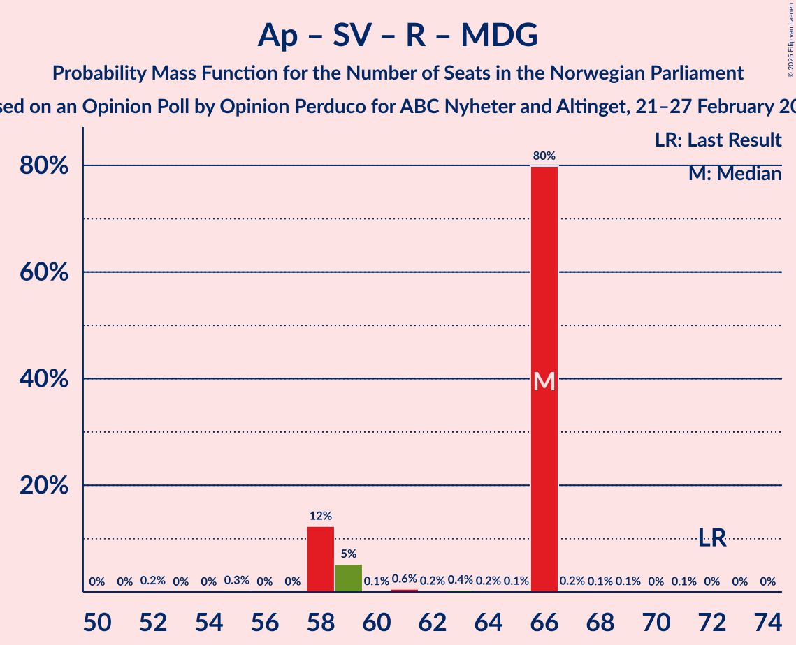

# Opinion Poll by Opinion Perduco for ABC Nyheter and Altinget, 21–27 February 2023

<a href="#voting-intentions">Voting Intentions</a> | <a href="#seats">Seats</a> | <a href="#coalitions">Coalitions</a> | <a href="#technical-information">Technical Information</a>

## Voting Intentions

### Confidence Intervals

| Party | Last Result | Poll Result | 80% Confidence Interval | 90% Confidence Interval | 95% Confidence Interval | 99% Confidence Interval |
|:-----:|:-----------:|:-----------:|:-----------------------:|:-----------------------:|:-----------------------:|:-----------------------:|
| Høyre | 20.4% | 32.6% | 30.4–34.8% |29.8–35.5% |29.3–36.0% |28.3–37.1% |
| Arbeiderpartiet | 26.2% | 16.0% | 14.4–17.9% |13.9–18.4% |13.5–18.8% |12.8–19.8% |
| Fremskrittspartiet | 11.6% | 13.6% | 12.1–15.3% |11.6–15.8% |11.3–16.2% |10.6–17.1% |
| Sosialistisk Venstreparti | 7.6% | 9.2% | 8.0–10.7% |7.6–11.2% |7.3–11.5% |6.8–12.3% |
| Rødt | 4.7% | 6.9% | 5.9–8.3% |5.5–8.7% |5.3–9.0% |4.8–9.7% |
| Senterpartiet | 13.5% | 6.0% | 5.0–7.2% |4.7–7.6% |4.5–7.9% |4.0–8.6% |
| Venstre | 4.6% | 3.9% | 3.2–5.0% |2.9–5.3% |2.8–5.6% |2.4–6.2% |
| Miljøpartiet De Grønne | 3.9% | 3.4% | 2.7–4.4% |2.5–4.7% |2.3–5.0% |2.0–5.5% |
| Kristelig Folkeparti | 3.8% | 3.4% | 2.7–4.4% |2.5–4.7% |2.3–5.0% |2.0–5.5% |
| Industri- og Næringspartiet | 0.3% | 2.0% | 1.5–2.9% |1.4–3.1% |1.2–3.3% |1.0–3.8% |
| Norgesdemokratene | 1.1% | 1.4% | 0.9–2.1% |0.8–2.3% |0.7–2.5% |0.6–2.9% |
| Pensjonistpartiet | 0.6% | 0.5% | 0.3–1.1% |0.3–1.2% |0.2–1.4% |0.1–1.7% |
| Konservativt | 0.4% | 0.3% | 0.1–0.7% |0.1–0.9% |0.1–1.0% |0.0–1.3% |
| Liberalistene | 0.2% | 0.1% | 0.1–0.5% |0.0–0.7% |0.0–0.8% |0.0–1.0% |

*Note:* The poll result column reflects the actual value used in the calculations. Published results may vary slightly, and in addition be rounded to fewer digits.

## Seats

### Confidence Intervals

| Party | Last Result | Median | 80% Confidence Interval | 90% Confidence Interval | 95% Confidence Interval | 99% Confidence Interval |
|:-----:|:-----------:|:------:|:-----------------------:|:-----------------------:|:-----------------------:|:-----------------------:|
| <a href="#høyre">Høyre</a> | 36 | 60 | 60–62 |57–62 |57–62 |54–62 |
| <a href="#arbeiderpartiet">Arbeiderpartiet</a> | 48 | 34 | 28–34 |28–34 |28–34 |24–34 |
| <a href="#fremskrittspartiet">Fremskrittspartiet</a> | 21 | 24 | 24–25 |24–25 |24–25 |22–31 |
| <a href="#sosialistisk-venstreparti">Sosialistisk Venstreparti</a> | 13 | 16 | 15–16 |14–16 |14–16 |13–20 |
| <a href="#rødt">Rødt</a> | 8 | 14 | 14 |12–14 |12–14 |10–16 |
| <a href="#senterpartiet">Senterpartiet</a> | 28 | 12 | 12–14 |11–14 |11–14 |9–14 |
| <a href="#venstre">Venstre</a> | 8 | 3 | 3–8 |3–8 |3–8 |2–9 |
| <a href="#miljøpartiet-de-grønne">Miljøpartiet De Grønne</a> | 3 | 2 | 1–2 |1–3 |1–3 |1–7 |
| <a href="#kristelig-folkeparti">Kristelig Folkeparti</a> | 3 | 3 | 1–3 |1–3 |1–3 |1–7 |
| <a href="#industri--og-næringspartiet">Industri- og Næringspartiet</a> | 0 | 0 | 0 |0–2 |0–7 |0–7 |
| <a href="#norgesdemokratene">Norgesdemokratene</a> | 0 | 0 | 0 |0 |0 |0 |
| <a href="#pensjonistpartiet">Pensjonistpartiet</a> | 0 | 0 | 0 |0 |0 |0 |
| <a href="#konservativt">Konservativt</a> | 0 | 0 | 0 |0 |0 |0 |
| <a href="#liberalistene">Liberalistene</a> | 0 | 0 | 0 |0 |0 |0 |

### Høyre

*For a full overview of the results for this party, see the [Høyre](party-høyre.html) page.*

| Number of Seats | Probability | Accumulated | Special Marks |
|:---------------:|:-----------:|:-----------:|:-------------:|
| 36 | 0% | 100% | Last Result |
| 37 | 0% | 100% |  |
| 38 | 0% | 100% |  |
| 39 | 0% | 100% |  |
| 40 | 0% | 100% |  |
| 41 | 0% | 100% |  |
| 42 | 0% | 100% |  |
| 43 | 0% | 100% |  |
| 44 | 0% | 100% |  |
| 45 | 0% | 100% |  |
| 46 | 0% | 100% |  |
| 47 | 0% | 100% |  |
| 48 | 0% | 99.9% |  |
| 49 | 0% | 99.9% |  |
| 50 | 0.1% | 99.9% |  |
| 51 | 0.1% | 99.9% |  |
| 52 | 0% | 99.8% |  |
| 53 | 0.1% | 99.8% |  |
| 54 | 0.2% | 99.7% |  |
| 55 | 0.2% | 99.5% |  |
| 56 | 0.6% | 99.3% |  |
| 57 | 5% | 98.8% |  |
| 58 | 0.6% | 94% |  |
| 59 | 0.1% | 93% |  |
| 60 | 80% | 93% | Median |
| 61 | 0.5% | 14% |  |
| 62 | 13% | 13% |  |
| 63 | 0% | 0.5% |  |
| 64 | 0.3% | 0.4% |  |
| 65 | 0% | 0.1% |  |
| 66 | 0% | 0.1% |  |
| 67 | 0.1% | 0.1% |  |
| 68 | 0% | 0% |  |

### Arbeiderpartiet

*For a full overview of the results for this party, see the [Arbeiderpartiet](party-arbeiderpartiet.html) page.*

| Number of Seats | Probability | Accumulated | Special Marks |
|:---------------:|:-----------:|:-----------:|:-------------:|
| 22 | 0.2% | 100% |  |
| 23 | 0% | 99.8% |  |
| 24 | 0.6% | 99.8% |  |
| 25 | 0.4% | 99.2% |  |
| 26 | 0% | 98.8% |  |
| 27 | 0.1% | 98.7% |  |
| 28 | 12% | 98.6% |  |
| 29 | 0.1% | 86% |  |
| 30 | 5% | 86% |  |
| 31 | 0.5% | 81% |  |
| 32 | 0.3% | 81% |  |
| 33 | 0.2% | 80% |  |
| 34 | 80% | 80% | Median |
| 35 | 0.1% | 0.3% |  |
| 36 | 0.1% | 0.1% |  |
| 37 | 0% | 0.1% |  |
| 38 | 0.1% | 0.1% |  |
| 39 | 0% | 0% |  |
| 40 | 0% | 0% |  |
| 41 | 0% | 0% |  |
| 42 | 0% | 0% |  |
| 43 | 0% | 0% |  |
| 44 | 0% | 0% |  |
| 45 | 0% | 0% |  |
| 46 | 0% | 0% |  |
| 47 | 0% | 0% |  |
| 48 | 0% | 0% | Last Result |

### Fremskrittspartiet

*For a full overview of the results for this party, see the [Fremskrittspartiet](party-fremskrittspartiet.html) page.*

| Number of Seats | Probability | Accumulated | Special Marks |
|:---------------:|:-----------:|:-----------:|:-------------:|
| 19 | 0.1% | 100% |  |
| 20 | 0.1% | 99.9% |  |
| 21 | 0.1% | 99.8% | Last Result |
| 22 | 0.3% | 99.7% |  |
| 23 | 0.1% | 99.5% |  |
| 24 | 85% | 99.3% | Median |
| 25 | 13% | 15% |  |
| 26 | 0.2% | 2% |  |
| 27 | 0.3% | 2% |  |
| 28 | 0% | 2% |  |
| 29 | 0.2% | 2% |  |
| 30 | 0.1% | 1.3% |  |
| 31 | 1.1% | 1.2% |  |
| 32 | 0% | 0.2% |  |
| 33 | 0% | 0.2% |  |
| 34 | 0.1% | 0.1% |  |
| 35 | 0% | 0% |  |

### Sosialistisk Venstreparti

*For a full overview of the results for this party, see the [Sosialistisk Venstreparti](party-sosialistiskvenstreparti.html) page.*

| Number of Seats | Probability | Accumulated | Special Marks |
|:---------------:|:-----------:|:-----------:|:-------------:|
| 11 | 0.1% | 100% |  |
| 12 | 0.4% | 99.9% |  |
| 13 | 0.3% | 99.5% | Last Result |
| 14 | 5% | 99.3% |  |
| 15 | 12% | 94% |  |
| 16 | 80% | 82% | Median |
| 17 | 0.5% | 2% |  |
| 18 | 0.6% | 2% |  |
| 19 | 0.7% | 1.3% |  |
| 20 | 0.1% | 0.6% |  |
| 21 | 0.4% | 0.5% |  |
| 22 | 0% | 0.1% |  |
| 23 | 0% | 0% |  |

### Rødt

*For a full overview of the results for this party, see the [Rødt](party-rødt.html) page.*

| Number of Seats | Probability | Accumulated | Special Marks |
|:---------------:|:-----------:|:-----------:|:-------------:|
| 8 | 0.1% | 100% | Last Result |
| 9 | 0.3% | 99.9% |  |
| 10 | 0.7% | 99.6% |  |
| 11 | 0.4% | 98.9% |  |
| 12 | 5% | 98% |  |
| 13 | 0.3% | 94% |  |
| 14 | 92% | 93% | Median |
| 15 | 0.4% | 1.0% |  |
| 16 | 0.1% | 0.6% |  |
| 17 | 0.5% | 0.5% |  |
| 18 | 0% | 0% |  |

### Senterpartiet

*For a full overview of the results for this party, see the [Senterpartiet](party-senterpartiet.html) page.*

| Number of Seats | Probability | Accumulated | Special Marks |
|:---------------:|:-----------:|:-----------:|:-------------:|
| 2 | 0% | 100% |  |
| 3 | 0% | 99.9% |  |
| 4 | 0% | 99.9% |  |
| 5 | 0% | 99.9% |  |
| 6 | 0% | 99.9% |  |
| 7 | 0% | 99.9% |  |
| 8 | 0.1% | 99.9% |  |
| 9 | 0.4% | 99.8% |  |
| 10 | 0.3% | 99.4% |  |
| 11 | 6% | 99.1% |  |
| 12 | 80% | 93% | Median |
| 13 | 0.2% | 13% |  |
| 14 | 13% | 13% |  |
| 15 | 0.1% | 0.1% |  |
| 16 | 0% | 0% |  |
| 17 | 0% | 0% |  |
| 18 | 0% | 0% |  |
| 19 | 0% | 0% |  |
| 20 | 0% | 0% |  |
| 21 | 0% | 0% |  |
| 22 | 0% | 0% |  |
| 23 | 0% | 0% |  |
| 24 | 0% | 0% |  |
| 25 | 0% | 0% |  |
| 26 | 0% | 0% |  |
| 27 | 0% | 0% |  |
| 28 | 0% | 0% | Last Result |

### Venstre

*For a full overview of the results for this party, see the [Venstre](party-venstre.html) page.*

| Number of Seats | Probability | Accumulated | Special Marks |
|:---------------:|:-----------:|:-----------:|:-------------:|
| 2 | 0.8% | 100% |  |
| 3 | 80% | 99.2% | Median |
| 4 | 0% | 19% |  |
| 5 | 0% | 19% |  |
| 6 | 0% | 19% |  |
| 7 | 5% | 19% |  |
| 8 | 13% | 14% | Last Result |
| 9 | 0.5% | 0.7% |  |
| 10 | 0.1% | 0.2% |  |
| 11 | 0.1% | 0.1% |  |
| 12 | 0% | 0% |  |

### Miljøpartiet De Grønne

*For a full overview of the results for this party, see the [Miljøpartiet De Grønne](party-miljøpartietdegrønne.html) page.*

| Number of Seats | Probability | Accumulated | Special Marks |
|:---------------:|:-----------:|:-----------:|:-------------:|
| 1 | 13% | 100% |  |
| 2 | 81% | 87% | Median |
| 3 | 5% | 5% | Last Result |
| 4 | 0% | 0.5% |  |
| 5 | 0% | 0.5% |  |
| 6 | 0% | 0.5% |  |
| 7 | 0.1% | 0.5% |  |
| 8 | 0.2% | 0.4% |  |
| 9 | 0.2% | 0.2% |  |
| 10 | 0% | 0% |  |

### Kristelig Folkeparti

*For a full overview of the results for this party, see the [Kristelig Folkeparti](party-kristeligfolkeparti.html) page.*

| Number of Seats | Probability | Accumulated | Special Marks |
|:---------------:|:-----------:|:-----------:|:-------------:|
| 0 | 0.3% | 100% |  |
| 1 | 12% | 99.7% |  |
| 2 | 1.1% | 87% |  |
| 3 | 86% | 86% | Last Result, Median |
| 4 | 0% | 0.7% |  |
| 5 | 0% | 0.7% |  |
| 6 | 0% | 0.7% |  |
| 7 | 0.3% | 0.7% |  |
| 8 | 0.3% | 0.4% |  |
| 9 | 0.1% | 0.1% |  |
| 10 | 0% | 0% |  |

### Industri- og Næringspartiet

*For a full overview of the results for this party, see the [Industri- og Næringspartiet](party-industri-ognæringspartiet.html) page.*

| Number of Seats | Probability | Accumulated | Special Marks |
|:---------------:|:-----------:|:-----------:|:-------------:|
| 0 | 95% | 100% | Last Result, Median |
| 1 | 0.1% | 5% |  |
| 2 | 0.5% | 5% |  |
| 3 | 0.2% | 5% |  |
| 4 | 0% | 5% |  |
| 5 | 0% | 5% |  |
| 6 | 0% | 5% |  |
| 7 | 5% | 5% |  |
| 8 | 0% | 0% |  |

### Norgesdemokratene

*For a full overview of the results for this party, see the [Norgesdemokratene](party-norgesdemokratene.html) page.*

| Number of Seats | Probability | Accumulated | Special Marks |
|:---------------:|:-----------:|:-----------:|:-------------:|
| 0 | 100% | 100% | Last Result, Median |

### Pensjonistpartiet

*For a full overview of the results for this party, see the [Pensjonistpartiet](party-pensjonistpartiet.html) page.*

| Number of Seats | Probability | Accumulated | Special Marks |
|:---------------:|:-----------:|:-----------:|:-------------:|
| 0 | 100% | 100% | Last Result, Median |

### Konservativt

*For a full overview of the results for this party, see the [Konservativt](party-konservativt.html) page.*

| Number of Seats | Probability | Accumulated | Special Marks |
|:---------------:|:-----------:|:-----------:|:-------------:|
| 0 | 100% | 100% | Last Result, Median |

### Liberalistene

*For a full overview of the results for this party, see the [Liberalistene](party-liberalistene.html) page.*

| Number of Seats | Probability | Accumulated | Special Marks |
|:---------------:|:-----------:|:-----------:|:-------------:|
| 0 | 100% | 100% | Last Result, Median |

## Coalitions

### Confidence Intervals

| Coalition | Last Result | Median | Majority? | 80% Confidence Interval | 90% Confidence Interval | 95% Confidence Interval | 99% Confidence Interval |
|:---------:|:-----------:|:------:|:---------:|:-----------------------:|:-----------------------:|:-----------------------:|:-----------------------:|
| Høyre – Fremskrittspartiet – Senterpartiet – Venstre – Kristelig Folkeparti | 96 | 102 | 100% | 102–110 | 102–110 | 102–110 | 100–113 |
| Høyre – Fremskrittspartiet – Venstre – Kristelig Folkeparti – Miljøpartiet De Grønne | 71 | 92 | 100% | 92–97 | 92–97 | 92–97 | 91–106 |
| Høyre – Fremskrittspartiet – Venstre – Kristelig Folkeparti | 68 | 90 | 99.9% | 90–96 | 90–96 | 90–96 | 89–104 |
| Høyre – Fremskrittspartiet – Venstre | 65 | 87 | 99.7% | 87–95 | 87–95 | 87–95 | 86–97 |
| Høyre – Fremskrittspartiet | 57 | 84 | 14% | 84–87 | 81–87 | 81–87 | 81–92 |
| Arbeiderpartiet – Sosialistisk Venstreparti – Rødt – Senterpartiet – Miljøpartiet De Grønne | 100 | 78 | 0% | 72–78 | 70–78 | 70–78 | 64–78 |
| Arbeiderpartiet – Sosialistisk Venstreparti – Rødt – Senterpartiet | 97 | 76 | 0% | 71–76 | 67–76 | 67–76 | 62–76 |
| Høyre – Venstre – Kristelig Folkeparti | 47 | 66 | 0% | 66–71 | 66–71 | 66–71 | 64–73 |
| Arbeiderpartiet – Sosialistisk Venstreparti – Senterpartiet – Kristelig Folkeparti – Miljøpartiet De Grønne | 95 | 67 | 0% | 59–67 | 59–67 | 59–67 | 59–68 |
| Arbeiderpartiet – Sosialistisk Venstreparti – Rødt – Miljøpartiet De Grønne | 72 | 66 | 0% | 58–66 | 58–66 | 58–66 | 55–66 |
| Arbeiderpartiet – Sosialistisk Venstreparti – Senterpartiet – Miljøpartiet De Grønne | 92 | 64 | 0% | 58–64 | 58–64 | 58–64 | 54–67 |
| Arbeiderpartiet – Sosialistisk Venstreparti – Senterpartiet | 89 | 62 | 0% | 57–62 | 55–62 | 55–62 | 52–64 |
| Arbeiderpartiet – Senterpartiet – Kristelig Folkeparti – Miljøpartiet De Grønne | 82 | 51 | 0% | 44–51 | 44–51 | 44–51 | 40–52 |
| Arbeiderpartiet – Sosialistisk Venstreparti | 61 | 50 | 0% | 43–50 | 43–50 | 43–50 | 43–53 |
| Arbeiderpartiet – Senterpartiet – Kristelig Folkeparti | 79 | 49 | 0% | 43–49 | 43–49 | 43–49 | 38–49 |
| Arbeiderpartiet – Senterpartiet | 76 | 46 | 0% | 42–46 | 41–46 | 41–46 | 35–46 |
| Senterpartiet – Venstre – Kristelig Folkeparti | 39 | 18 | 0% | 18–23 | 18–23 | 18–23 | 15–24 |

### Høyre – Fremskrittspartiet – Senterpartiet – Venstre – Kristelig Folkeparti

| Number of Seats | Probability | Accumulated | Special Marks |
|:---------------:|:-----------:|:-----------:|:-------------:|
| 96 | 0.1% | 100% | Last Result |
| 97 | 0.1% | 99.9% |  |
| 98 | 0% | 99.8% |  |
| 99 | 0% | 99.8% |  |
| 100 | 0.3% | 99.7% |  |
| 101 | 0.2% | 99.4% |  |
| 102 | 84% | 99.2% | Median |
| 103 | 0.2% | 15% |  |
| 104 | 0.2% | 15% |  |
| 105 | 0.3% | 14% |  |
| 106 | 0.1% | 14% |  |
| 107 | 0.5% | 14% |  |
| 108 | 0.1% | 14% |  |
| 109 | 0.5% | 13% |  |
| 110 | 12% | 13% |  |
| 111 | 0% | 0.6% |  |
| 112 | 0% | 0.5% |  |
| 113 | 0.3% | 0.5% |  |
| 114 | 0% | 0.2% |  |
| 115 | 0% | 0.2% |  |
| 116 | 0.2% | 0.2% |  |
| 117 | 0% | 0% |  |

### Høyre – Fremskrittspartiet – Venstre – Kristelig Folkeparti – Miljøpartiet De Grønne

| Number of Seats | Probability | Accumulated | Special Marks |
|:---------------:|:-----------:|:-----------:|:-------------:|
| 71 | 0% | 100% | Last Result |
| 72 | 0% | 100% |  |
| 73 | 0% | 100% |  |
| 74 | 0% | 100% |  |
| 75 | 0% | 100% |  |
| 76 | 0% | 100% |  |
| 77 | 0% | 100% |  |
| 78 | 0% | 100% |  |
| 79 | 0% | 100% |  |
| 80 | 0% | 100% |  |
| 81 | 0% | 100% |  |
| 82 | 0% | 100% |  |
| 83 | 0% | 100% |  |
| 84 | 0% | 100% |  |
| 85 | 0% | 100% | Majority |
| 86 | 0% | 100% |  |
| 87 | 0.1% | 99.9% |  |
| 88 | 0.1% | 99.8% |  |
| 89 | 0% | 99.8% |  |
| 90 | 0.1% | 99.7% |  |
| 91 | 0.3% | 99.6% |  |
| 92 | 80% | 99.4% | Median |
| 93 | 0.2% | 20% |  |
| 94 | 5% | 19% |  |
| 95 | 0.2% | 14% |  |
| 96 | 0% | 14% |  |
| 97 | 12% | 14% |  |
| 98 | 0.1% | 2% |  |
| 99 | 0.2% | 2% |  |
| 100 | 0.6% | 1.5% |  |
| 101 | 0% | 0.9% |  |
| 102 | 0.2% | 0.8% |  |
| 103 | 0% | 0.7% |  |
| 104 | 0% | 0.7% |  |
| 105 | 0% | 0.6% |  |
| 106 | 0.3% | 0.6% |  |
| 107 | 0.2% | 0.3% |  |
| 108 | 0% | 0% |  |

### Høyre – Fremskrittspartiet – Venstre – Kristelig Folkeparti

| Number of Seats | Probability | Accumulated | Special Marks |
|:---------------:|:-----------:|:-----------:|:-------------:|
| 68 | 0% | 100% | Last Result |
| 69 | 0% | 100% |  |
| 70 | 0% | 100% |  |
| 71 | 0% | 100% |  |
| 72 | 0% | 100% |  |
| 73 | 0% | 100% |  |
| 74 | 0% | 100% |  |
| 75 | 0% | 100% |  |
| 76 | 0% | 100% |  |
| 77 | 0% | 100% |  |
| 78 | 0% | 100% |  |
| 79 | 0% | 100% |  |
| 80 | 0% | 100% |  |
| 81 | 0% | 100% |  |
| 82 | 0% | 100% |  |
| 83 | 0.1% | 100% |  |
| 84 | 0.1% | 99.9% |  |
| 85 | 0.1% | 99.9% | Majority |
| 86 | 0.1% | 99.8% |  |
| 87 | 0% | 99.7% |  |
| 88 | 0.1% | 99.7% |  |
| 89 | 0.3% | 99.6% |  |
| 90 | 80% | 99.3% | Median |
| 91 | 5% | 20% |  |
| 92 | 0.1% | 15% |  |
| 93 | 0.6% | 15% |  |
| 94 | 0.2% | 14% |  |
| 95 | 0.1% | 14% |  |
| 96 | 12% | 14% |  |
| 97 | 0.2% | 1.4% |  |
| 98 | 0.6% | 1.2% |  |
| 99 | 0% | 0.6% |  |
| 100 | 0% | 0.6% |  |
| 101 | 0% | 0.6% |  |
| 102 | 0% | 0.6% |  |
| 103 | 0% | 0.5% |  |
| 104 | 0.3% | 0.5% |  |
| 105 | 0.2% | 0.2% |  |
| 106 | 0% | 0% |  |

### Høyre – Fremskrittspartiet – Venstre

| Number of Seats | Probability | Accumulated | Special Marks |
|:---------------:|:-----------:|:-----------:|:-------------:|
| 65 | 0% | 100% | Last Result |
| 66 | 0% | 100% |  |
| 67 | 0% | 100% |  |
| 68 | 0% | 100% |  |
| 69 | 0% | 100% |  |
| 70 | 0% | 100% |  |
| 71 | 0% | 100% |  |
| 72 | 0% | 100% |  |
| 73 | 0% | 100% |  |
| 74 | 0% | 100% |  |
| 75 | 0% | 100% |  |
| 76 | 0% | 100% |  |
| 77 | 0% | 100% |  |
| 78 | 0% | 100% |  |
| 79 | 0% | 100% |  |
| 80 | 0% | 99.9% |  |
| 81 | 0% | 99.9% |  |
| 82 | 0% | 99.9% |  |
| 83 | 0.1% | 99.8% |  |
| 84 | 0.1% | 99.7% |  |
| 85 | 0% | 99.7% | Majority |
| 86 | 0.2% | 99.6% |  |
| 87 | 80% | 99.5% | Median |
| 88 | 5% | 20% |  |
| 89 | 0.4% | 15% |  |
| 90 | 0.2% | 14% |  |
| 91 | 0.6% | 14% |  |
| 92 | 0.1% | 14% |  |
| 93 | 0% | 14% |  |
| 94 | 0.2% | 14% |  |
| 95 | 13% | 13% |  |
| 96 | 0% | 0.6% |  |
| 97 | 0.2% | 0.6% |  |
| 98 | 0% | 0.3% |  |
| 99 | 0% | 0.3% |  |
| 100 | 0% | 0.3% |  |
| 101 | 0.3% | 0.3% |  |
| 102 | 0% | 0% |  |

### Høyre – Fremskrittspartiet

| Number of Seats | Probability | Accumulated | Special Marks |
|:---------------:|:-----------:|:-----------:|:-------------:|
| 57 | 0% | 100% | Last Result |
| 58 | 0% | 100% |  |
| 59 | 0% | 100% |  |
| 60 | 0% | 100% |  |
| 61 | 0% | 100% |  |
| 62 | 0% | 100% |  |
| 63 | 0% | 100% |  |
| 64 | 0% | 100% |  |
| 65 | 0% | 100% |  |
| 66 | 0% | 100% |  |
| 67 | 0% | 100% |  |
| 68 | 0% | 100% |  |
| 69 | 0% | 100% |  |
| 70 | 0% | 100% |  |
| 71 | 0% | 100% |  |
| 72 | 0% | 100% |  |
| 73 | 0% | 100% |  |
| 74 | 0% | 99.9% |  |
| 75 | 0% | 99.9% |  |
| 76 | 0% | 99.9% |  |
| 77 | 0.1% | 99.8% |  |
| 78 | 0% | 99.8% |  |
| 79 | 0% | 99.8% |  |
| 80 | 0.2% | 99.7% |  |
| 81 | 5% | 99.5% |  |
| 82 | 0.1% | 95% |  |
| 83 | 0.6% | 95% |  |
| 84 | 80% | 94% | Median |
| 85 | 0.3% | 14% | Majority |
| 86 | 0.2% | 14% |  |
| 87 | 13% | 14% |  |
| 88 | 0.2% | 0.9% |  |
| 89 | 0% | 0.7% |  |
| 90 | 0% | 0.7% |  |
| 91 | 0% | 0.7% |  |
| 92 | 0.3% | 0.6% |  |
| 93 | 0% | 0.3% |  |
| 94 | 0% | 0.3% |  |
| 95 | 0.2% | 0.3% |  |
| 96 | 0% | 0% |  |

### Arbeiderpartiet – Sosialistisk Venstreparti – Rødt – Senterpartiet – Miljøpartiet De Grønne

| Number of Seats | Probability | Accumulated | Special Marks |
|:---------------:|:-----------:|:-----------:|:-------------:|
| 63 | 0.2% | 100% |  |
| 64 | 0.3% | 99.8% |  |
| 65 | 0% | 99.5% |  |
| 66 | 0% | 99.4% |  |
| 67 | 0% | 99.4% |  |
| 68 | 0% | 99.4% |  |
| 69 | 0% | 99.4% |  |
| 70 | 5% | 99.3% |  |
| 71 | 0.2% | 94% |  |
| 72 | 12% | 94% |  |
| 73 | 0.1% | 82% |  |
| 74 | 0.2% | 81% |  |
| 75 | 0.6% | 81% |  |
| 76 | 0.2% | 81% |  |
| 77 | 0.4% | 80% |  |
| 78 | 80% | 80% | Median |
| 79 | 0% | 0.4% |  |
| 80 | 0.1% | 0.4% |  |
| 81 | 0.1% | 0.3% |  |
| 82 | 0.1% | 0.2% |  |
| 83 | 0% | 0.1% |  |
| 84 | 0% | 0.1% |  |
| 85 | 0% | 0% | Majority |
| 86 | 0% | 0% |  |
| 87 | 0% | 0% |  |
| 88 | 0% | 0% |  |
| 89 | 0% | 0% |  |
| 90 | 0% | 0% |  |
| 91 | 0% | 0% |  |
| 92 | 0% | 0% |  |
| 93 | 0% | 0% |  |
| 94 | 0% | 0% |  |
| 95 | 0% | 0% |  |
| 96 | 0% | 0% |  |
| 97 | 0% | 0% |  |
| 98 | 0% | 0% |  |
| 99 | 0% | 0% |  |
| 100 | 0% | 0% | Last Result |

### Arbeiderpartiet – Sosialistisk Venstreparti – Rødt – Senterpartiet

| Number of Seats | Probability | Accumulated | Special Marks |
|:---------------:|:-----------:|:-----------:|:-------------:|
| 60 | 0% | 100% |  |
| 61 | 0.2% | 99.9% |  |
| 62 | 0.3% | 99.7% |  |
| 63 | 0% | 99.4% |  |
| 64 | 0.1% | 99.4% |  |
| 65 | 0% | 99.3% |  |
| 66 | 0.2% | 99.3% |  |
| 67 | 5% | 99.1% |  |
| 68 | 0.6% | 94% |  |
| 69 | 0.2% | 94% |  |
| 70 | 0.1% | 94% |  |
| 71 | 12% | 94% |  |
| 72 | 0% | 81% |  |
| 73 | 0.3% | 81% |  |
| 74 | 0.5% | 81% |  |
| 75 | 0.4% | 80% |  |
| 76 | 80% | 80% | Median |
| 77 | 0% | 0.3% |  |
| 78 | 0% | 0.3% |  |
| 79 | 0.1% | 0.2% |  |
| 80 | 0% | 0.1% |  |
| 81 | 0.1% | 0.1% |  |
| 82 | 0% | 0% |  |
| 83 | 0% | 0% |  |
| 84 | 0% | 0% |  |
| 85 | 0% | 0% | Majority |
| 86 | 0% | 0% |  |
| 87 | 0% | 0% |  |
| 88 | 0% | 0% |  |
| 89 | 0% | 0% |  |
| 90 | 0% | 0% |  |
| 91 | 0% | 0% |  |
| 92 | 0% | 0% |  |
| 93 | 0% | 0% |  |
| 94 | 0% | 0% |  |
| 95 | 0% | 0% |  |
| 96 | 0% | 0% |  |
| 97 | 0% | 0% | Last Result |

### Høyre – Venstre – Kristelig Folkeparti

| Number of Seats | Probability | Accumulated | Special Marks |
|:---------------:|:-----------:|:-----------:|:-------------:|
| 47 | 0% | 100% | Last Result |
| 48 | 0% | 100% |  |
| 49 | 0% | 100% |  |
| 50 | 0% | 100% |  |
| 51 | 0% | 100% |  |
| 52 | 0% | 100% |  |
| 53 | 0% | 100% |  |
| 54 | 0% | 100% |  |
| 55 | 0% | 100% |  |
| 56 | 0% | 100% |  |
| 57 | 0% | 100% |  |
| 58 | 0% | 100% |  |
| 59 | 0% | 100% |  |
| 60 | 0.1% | 99.9% |  |
| 61 | 0% | 99.8% |  |
| 62 | 0.1% | 99.8% |  |
| 63 | 0.2% | 99.7% |  |
| 64 | 0.1% | 99.5% |  |
| 65 | 0.3% | 99.4% |  |
| 66 | 80% | 99.0% | Median |
| 67 | 6% | 19% |  |
| 68 | 0.5% | 14% |  |
| 69 | 0.1% | 13% |  |
| 70 | 0.1% | 13% |  |
| 71 | 12% | 13% |  |
| 72 | 0% | 0.8% |  |
| 73 | 0.4% | 0.8% |  |
| 74 | 0.3% | 0.4% |  |
| 75 | 0% | 0.1% |  |
| 76 | 0% | 0.1% |  |
| 77 | 0% | 0% |  |

### Arbeiderpartiet – Sosialistisk Venstreparti – Senterpartiet – Kristelig Folkeparti – Miljøpartiet De Grønne

| Number of Seats | Probability | Accumulated | Special Marks |
|:---------------:|:-----------:|:-----------:|:-------------:|
| 57 | 0.3% | 100% |  |
| 58 | 0% | 99.7% |  |
| 59 | 13% | 99.6% |  |
| 60 | 0.6% | 87% |  |
| 61 | 5% | 86% |  |
| 62 | 0% | 82% |  |
| 63 | 0.2% | 81% |  |
| 64 | 0.2% | 81% |  |
| 65 | 0.1% | 81% |  |
| 66 | 0.3% | 81% |  |
| 67 | 80% | 81% | Median |
| 68 | 0.5% | 0.9% |  |
| 69 | 0.2% | 0.4% |  |
| 70 | 0% | 0.3% |  |
| 71 | 0% | 0.2% |  |
| 72 | 0.1% | 0.2% |  |
| 73 | 0% | 0.1% |  |
| 74 | 0% | 0.1% |  |
| 75 | 0% | 0% |  |
| 76 | 0% | 0% |  |
| 77 | 0% | 0% |  |
| 78 | 0% | 0% |  |
| 79 | 0% | 0% |  |
| 80 | 0% | 0% |  |
| 81 | 0% | 0% |  |
| 82 | 0% | 0% |  |
| 83 | 0% | 0% |  |
| 84 | 0% | 0% |  |
| 85 | 0% | 0% | Majority |
| 86 | 0% | 0% |  |
| 87 | 0% | 0% |  |
| 88 | 0% | 0% |  |
| 89 | 0% | 0% |  |
| 90 | 0% | 0% |  |
| 91 | 0% | 0% |  |
| 92 | 0% | 0% |  |
| 93 | 0% | 0% |  |
| 94 | 0% | 0% |  |
| 95 | 0% | 0% | Last Result |

### Arbeiderpartiet – Sosialistisk Venstreparti – Rødt – Miljøpartiet De Grønne

| Number of Seats | Probability | Accumulated | Special Marks |
|:---------------:|:-----------:|:-----------:|:-------------:|
| 52 | 0.2% | 100% |  |
| 53 | 0% | 99.8% |  |
| 54 | 0% | 99.8% |  |
| 55 | 0.3% | 99.8% |  |
| 56 | 0% | 99.5% |  |
| 57 | 0% | 99.5% |  |
| 58 | 12% | 99.4% |  |
| 59 | 5% | 87% |  |
| 60 | 0.1% | 82% |  |
| 61 | 0.6% | 82% |  |
| 62 | 0.2% | 81% |  |
| 63 | 0.4% | 81% |  |
| 64 | 0.2% | 81% |  |
| 65 | 0.1% | 80% |  |
| 66 | 80% | 80% | Median |
| 67 | 0.2% | 0.5% |  |
| 68 | 0.1% | 0.3% |  |
| 69 | 0.1% | 0.2% |  |
| 70 | 0% | 0.1% |  |
| 71 | 0.1% | 0.1% |  |
| 72 | 0% | 0.1% | Last Result |
| 73 | 0% | 0% |  |

### Arbeiderpartiet – Sosialistisk Venstreparti – Senterpartiet – Miljøpartiet De Grønne

| Number of Seats | Probability | Accumulated | Special Marks |
|:---------------:|:-----------:|:-----------:|:-------------:|
| 52 | 0.2% | 100% |  |
| 53 | 0% | 99.7% |  |
| 54 | 0.3% | 99.7% |  |
| 55 | 0% | 99.4% |  |
| 56 | 0.5% | 99.4% |  |
| 57 | 0% | 98.8% |  |
| 58 | 17% | 98.8% |  |
| 59 | 0.2% | 81% |  |
| 60 | 0.2% | 81% |  |
| 61 | 0.2% | 81% |  |
| 62 | 0.1% | 81% |  |
| 63 | 0.1% | 81% |  |
| 64 | 80% | 81% | Median |
| 65 | 0.3% | 1.0% |  |
| 66 | 0.2% | 0.7% |  |
| 67 | 0.1% | 0.5% |  |
| 68 | 0.3% | 0.4% |  |
| 69 | 0.1% | 0.1% |  |
| 70 | 0% | 0.1% |  |
| 71 | 0% | 0.1% |  |
| 72 | 0% | 0% |  |
| 73 | 0% | 0% |  |
| 74 | 0% | 0% |  |
| 75 | 0% | 0% |  |
| 76 | 0% | 0% |  |
| 77 | 0% | 0% |  |
| 78 | 0% | 0% |  |
| 79 | 0% | 0% |  |
| 80 | 0% | 0% |  |
| 81 | 0% | 0% |  |
| 82 | 0% | 0% |  |
| 83 | 0% | 0% |  |
| 84 | 0% | 0% |  |
| 85 | 0% | 0% | Majority |
| 86 | 0% | 0% |  |
| 87 | 0% | 0% |  |
| 88 | 0% | 0% |  |
| 89 | 0% | 0% |  |
| 90 | 0% | 0% |  |
| 91 | 0% | 0% |  |
| 92 | 0% | 0% | Last Result |

### Arbeiderpartiet – Sosialistisk Venstreparti – Senterpartiet

| Number of Seats | Probability | Accumulated | Special Marks |
|:---------------:|:-----------:|:-----------:|:-------------:|
| 49 | 0% | 100% |  |
| 50 | 0.2% | 99.9% |  |
| 51 | 0.1% | 99.7% |  |
| 52 | 0.3% | 99.6% |  |
| 53 | 0.1% | 99.3% |  |
| 54 | 0.5% | 99.2% |  |
| 55 | 5% | 98.7% |  |
| 56 | 0.2% | 94% |  |
| 57 | 13% | 94% |  |
| 58 | 0.2% | 81% |  |
| 59 | 0.2% | 81% |  |
| 60 | 0% | 81% |  |
| 61 | 0.2% | 81% |  |
| 62 | 80% | 80% | Median |
| 63 | 0.2% | 0.8% |  |
| 64 | 0.1% | 0.6% |  |
| 65 | 0.1% | 0.5% |  |
| 66 | 0.4% | 0.4% |  |
| 67 | 0% | 0% |  |
| 68 | 0% | 0% |  |
| 69 | 0% | 0% |  |
| 70 | 0% | 0% |  |
| 71 | 0% | 0% |  |
| 72 | 0% | 0% |  |
| 73 | 0% | 0% |  |
| 74 | 0% | 0% |  |
| 75 | 0% | 0% |  |
| 76 | 0% | 0% |  |
| 77 | 0% | 0% |  |
| 78 | 0% | 0% |  |
| 79 | 0% | 0% |  |
| 80 | 0% | 0% |  |
| 81 | 0% | 0% |  |
| 82 | 0% | 0% |  |
| 83 | 0% | 0% |  |
| 84 | 0% | 0% |  |
| 85 | 0% | 0% | Majority |
| 86 | 0% | 0% |  |
| 87 | 0% | 0% |  |
| 88 | 0% | 0% |  |
| 89 | 0% | 0% | Last Result |

### Arbeiderpartiet – Senterpartiet – Kristelig Folkeparti – Miljøpartiet De Grønne

| Number of Seats | Probability | Accumulated | Special Marks |
|:---------------:|:-----------:|:-----------:|:-------------:|
| 40 | 0.5% | 100% |  |
| 41 | 0% | 99.4% |  |
| 42 | 0.4% | 99.4% |  |
| 43 | 0.3% | 99.0% |  |
| 44 | 12% | 98.7% |  |
| 45 | 0.4% | 86% |  |
| 46 | 0.1% | 86% |  |
| 47 | 5% | 86% |  |
| 48 | 0.2% | 81% |  |
| 49 | 0.1% | 81% |  |
| 50 | 0.2% | 81% |  |
| 51 | 80% | 80% | Median |
| 52 | 0.2% | 0.6% |  |
| 53 | 0.1% | 0.4% |  |
| 54 | 0.1% | 0.3% |  |
| 55 | 0.1% | 0.2% |  |
| 56 | 0% | 0.1% |  |
| 57 | 0% | 0.1% |  |
| 58 | 0% | 0.1% |  |
| 59 | 0% | 0% |  |
| 60 | 0% | 0% |  |
| 61 | 0% | 0% |  |
| 62 | 0% | 0% |  |
| 63 | 0% | 0% |  |
| 64 | 0% | 0% |  |
| 65 | 0% | 0% |  |
| 66 | 0% | 0% |  |
| 67 | 0% | 0% |  |
| 68 | 0% | 0% |  |
| 69 | 0% | 0% |  |
| 70 | 0% | 0% |  |
| 71 | 0% | 0% |  |
| 72 | 0% | 0% |  |
| 73 | 0% | 0% |  |
| 74 | 0% | 0% |  |
| 75 | 0% | 0% |  |
| 76 | 0% | 0% |  |
| 77 | 0% | 0% |  |
| 78 | 0% | 0% |  |
| 79 | 0% | 0% |  |
| 80 | 0% | 0% |  |
| 81 | 0% | 0% |  |
| 82 | 0% | 0% | Last Result |

### Arbeiderpartiet – Sosialistisk Venstreparti

| Number of Seats | Probability | Accumulated | Special Marks |
|:---------------:|:-----------:|:-----------:|:-------------:|
| 39 | 0.2% | 100% |  |
| 40 | 0% | 99.7% |  |
| 41 | 0% | 99.7% |  |
| 42 | 0.1% | 99.7% |  |
| 43 | 13% | 99.6% |  |
| 44 | 5% | 86% |  |
| 45 | 0.1% | 81% |  |
| 46 | 0.1% | 81% |  |
| 47 | 0.4% | 81% |  |
| 48 | 0.1% | 81% |  |
| 49 | 0.2% | 81% |  |
| 50 | 80% | 80% | Median |
| 51 | 0.2% | 0.8% |  |
| 52 | 0.1% | 0.6% |  |
| 53 | 0.1% | 0.5% |  |
| 54 | 0% | 0.4% |  |
| 55 | 0.3% | 0.4% |  |
| 56 | 0.1% | 0.1% |  |
| 57 | 0% | 0% |  |
| 58 | 0% | 0% |  |
| 59 | 0% | 0% |  |
| 60 | 0% | 0% |  |
| 61 | 0% | 0% | Last Result |

### Arbeiderpartiet – Senterpartiet – Kristelig Folkeparti

| Number of Seats | Probability | Accumulated | Special Marks |
|:---------------:|:-----------:|:-----------:|:-------------:|
| 34 | 0% | 100% |  |
| 35 | 0% | 99.9% |  |
| 36 | 0% | 99.9% |  |
| 37 | 0% | 99.9% |  |
| 38 | 0.5% | 99.9% |  |
| 39 | 0% | 99.4% |  |
| 40 | 0.1% | 99.4% |  |
| 41 | 0.7% | 99.3% |  |
| 42 | 0% | 98.6% |  |
| 43 | 13% | 98.5% |  |
| 44 | 5% | 86% |  |
| 45 | 0.3% | 81% |  |
| 46 | 0.1% | 81% |  |
| 47 | 0.2% | 81% |  |
| 48 | 0.1% | 80% |  |
| 49 | 80% | 80% | Median |
| 50 | 0.1% | 0.4% |  |
| 51 | 0% | 0.3% |  |
| 52 | 0.1% | 0.3% |  |
| 53 | 0.1% | 0.2% |  |
| 54 | 0% | 0.1% |  |
| 55 | 0% | 0% |  |
| 56 | 0% | 0% |  |
| 57 | 0% | 0% |  |
| 58 | 0% | 0% |  |
| 59 | 0% | 0% |  |
| 60 | 0% | 0% |  |
| 61 | 0% | 0% |  |
| 62 | 0% | 0% |  |
| 63 | 0% | 0% |  |
| 64 | 0% | 0% |  |
| 65 | 0% | 0% |  |
| 66 | 0% | 0% |  |
| 67 | 0% | 0% |  |
| 68 | 0% | 0% |  |
| 69 | 0% | 0% |  |
| 70 | 0% | 0% |  |
| 71 | 0% | 0% |  |
| 72 | 0% | 0% |  |
| 73 | 0% | 0% |  |
| 74 | 0% | 0% |  |
| 75 | 0% | 0% |  |
| 76 | 0% | 0% |  |
| 77 | 0% | 0% |  |
| 78 | 0% | 0% |  |
| 79 | 0% | 0% | Last Result |

### Arbeiderpartiet – Senterpartiet

| Number of Seats | Probability | Accumulated | Special Marks |
|:---------------:|:-----------:|:-----------:|:-------------:|
| 32 | 0% | 100% |  |
| 33 | 0.2% | 99.9% |  |
| 34 | 0% | 99.7% |  |
| 35 | 0.5% | 99.7% |  |
| 36 | 0% | 99.2% |  |
| 37 | 0% | 99.2% |  |
| 38 | 0% | 99.1% |  |
| 39 | 0.6% | 99.1% |  |
| 40 | 0.5% | 98.5% |  |
| 41 | 5% | 98% |  |
| 42 | 12% | 93% |  |
| 43 | 0.1% | 81% |  |
| 44 | 0.1% | 81% |  |
| 45 | 0.5% | 81% |  |
| 46 | 80% | 80% | Median |
| 47 | 0.1% | 0.3% |  |
| 48 | 0.1% | 0.1% |  |
| 49 | 0% | 0.1% |  |
| 50 | 0.1% | 0.1% |  |
| 51 | 0% | 0% |  |
| 52 | 0% | 0% |  |
| 53 | 0% | 0% |  |
| 54 | 0% | 0% |  |
| 55 | 0% | 0% |  |
| 56 | 0% | 0% |  |
| 57 | 0% | 0% |  |
| 58 | 0% | 0% |  |
| 59 | 0% | 0% |  |
| 60 | 0% | 0% |  |
| 61 | 0% | 0% |  |
| 62 | 0% | 0% |  |
| 63 | 0% | 0% |  |
| 64 | 0% | 0% |  |
| 65 | 0% | 0% |  |
| 66 | 0% | 0% |  |
| 67 | 0% | 0% |  |
| 68 | 0% | 0% |  |
| 69 | 0% | 0% |  |
| 70 | 0% | 0% |  |
| 71 | 0% | 0% |  |
| 72 | 0% | 0% |  |
| 73 | 0% | 0% |  |
| 74 | 0% | 0% |  |
| 75 | 0% | 0% |  |
| 76 | 0% | 0% | Last Result |

### Senterpartiet – Venstre – Kristelig Folkeparti

| Number of Seats | Probability | Accumulated | Special Marks |
|:---------------:|:-----------:|:-----------:|:-------------:|
| 12 | 0% | 100% |  |
| 13 | 0% | 99.9% |  |
| 14 | 0.3% | 99.9% |  |
| 15 | 0.1% | 99.6% |  |
| 16 | 0% | 99.5% |  |
| 17 | 0.2% | 99.4% |  |
| 18 | 80% | 99.3% | Median |
| 19 | 0.1% | 20% |  |
| 20 | 0.3% | 19% |  |
| 21 | 5% | 19% |  |
| 22 | 0.8% | 14% |  |
| 23 | 12% | 13% |  |
| 24 | 0.5% | 0.8% |  |
| 25 | 0% | 0.2% |  |
| 26 | 0.1% | 0.2% |  |
| 27 | 0.1% | 0.1% |  |
| 28 | 0% | 0% |  |
| 29 | 0% | 0% |  |
| 30 | 0% | 0% |  |
| 31 | 0% | 0% |  |
| 32 | 0% | 0% |  |
| 33 | 0% | 0% |  |
| 34 | 0% | 0% |  |
| 35 | 0% | 0% |  |
| 36 | 0% | 0% |  |
| 37 | 0% | 0% |  |
| 38 | 0% | 0% |  |
| 39 | 0% | 0% | Last Result |

## Technical Information

### Opinion Poll

+ **Polling firm:** Opinion Perduco
+ **Commissioner(s):** ABC Nyheter and Altinget
+ **Fieldwork period:** 21–27 February 2023

### Calculations

+ **Sample size:** 737
+ **Simulations done:** 1,048,576
+ **Error estimate:** 2.59%

