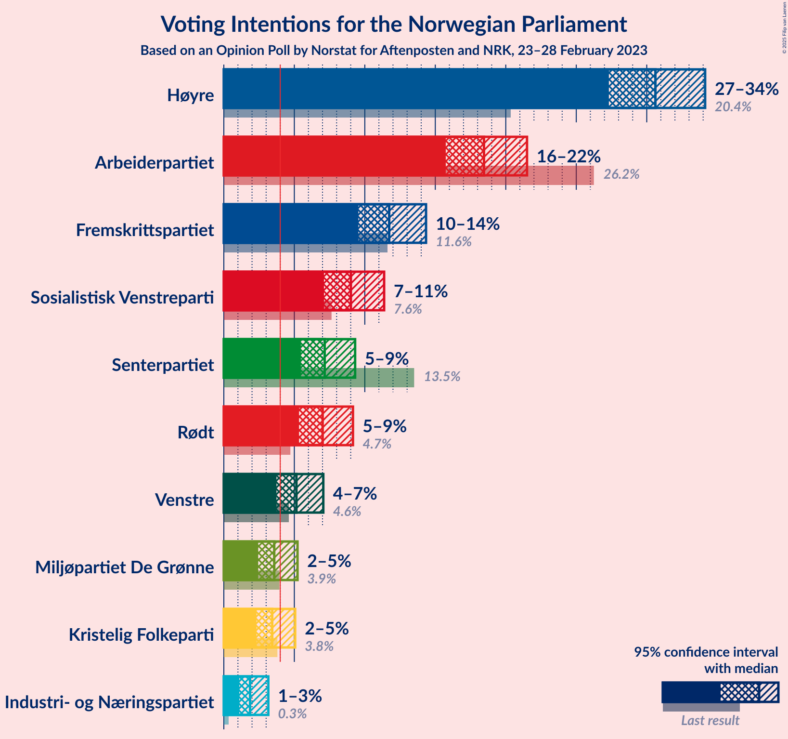
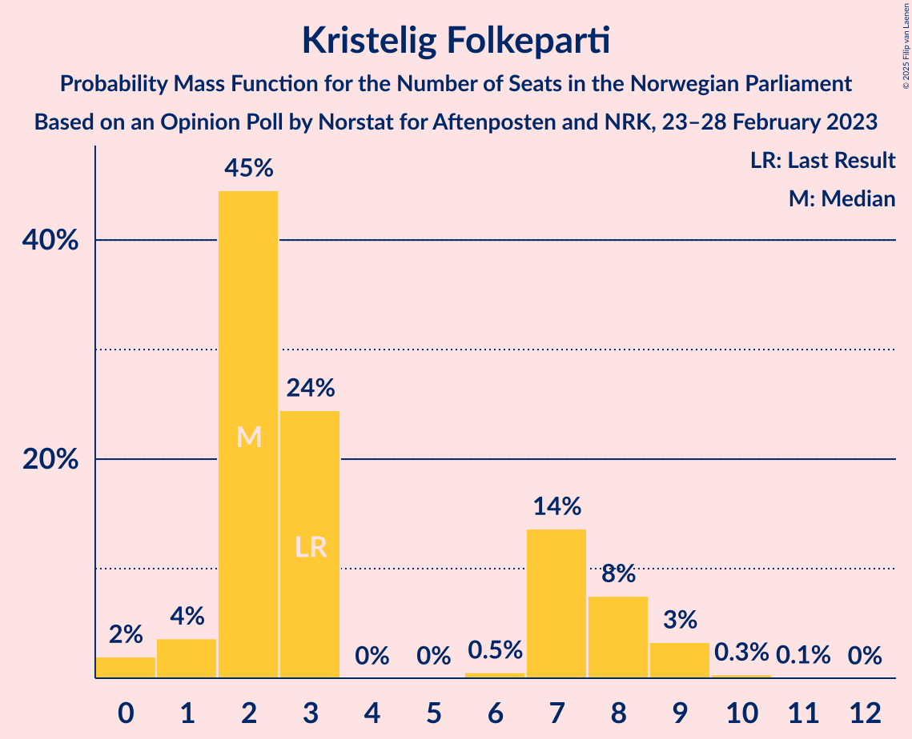
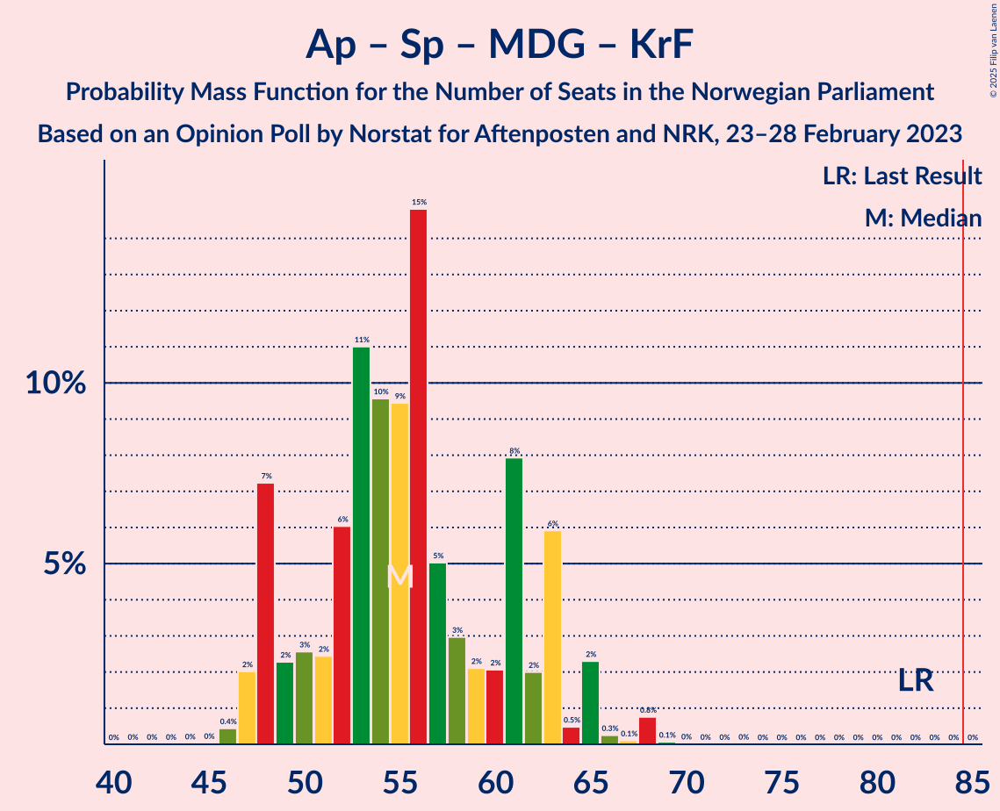

# Opinion Poll by Norstat for Aftenposten and NRK, 23–28 February 2023

<a href="#voting-intentions">Voting Intentions</a> | <a href="#seats">Seats</a> | <a href="#coalitions">Coalitions</a> | <a href="#technical-information">Technical Information</a>

## Voting Intentions

### Confidence Intervals

| Party | Last Result | Poll Result | 80% Confidence Interval | 90% Confidence Interval | 95% Confidence Interval | 99% Confidence Interval |
|:-----:|:-----------:|:-----------:|:-----------------------:|:-----------------------:|:-----------------------:|:-----------------------:|
| Høyre | 20.4% | 30.6% | 28.4–32.9% |27.8–33.6% |27.3–34.1% |26.3–35.3% |
| Arbeiderpartiet | 26.2% | 18.5% | 16.7–20.5% |16.2–21.0% |15.7–21.5% |14.9–22.5% |
| Fremskrittspartiet | 11.6% | 11.7% | 10.3–13.4% |9.9–13.9% |9.5–14.3% |8.9–15.2% |
| Sosialistisk Venstreparti | 7.6% | 9.0% | 7.8–10.5% |7.4–11.0% |7.1–11.4% |6.5–12.1% |
| Senterpartiet | 13.5% | 7.2% | 6.0–8.6% |5.7–9.0% |5.5–9.3% |5.0–10.0% |
| Rødt | 4.7% | 7.0% | 5.9–8.4% |5.6–8.8% |5.3–9.2% |4.9–9.9% |
| Venstre | 4.6% | 5.2% | 4.2–6.4% |4.0–6.7% |3.7–7.1% |3.3–7.7% |
| Miljøpartiet De Grønne | 3.9% | 3.6% | 2.8–4.6% |2.6–5.0% |2.4–5.2% |2.1–5.8% |
| Kristelig Folkeparti | 3.8% | 3.4% | 2.7–4.5% |2.5–4.8% |2.3–5.1% |2.0–5.6% |
| Industri- og Næringspartiet | 0.3% | 1.9% | 1.3–2.7% |1.2–2.9% |1.1–3.2% |0.9–3.6% |

*Note:* The poll result column reflects the actual value used in the calculations. Published results may vary slightly, and in addition be rounded to fewer digits.

## Seats

### Confidence Intervals

| Party | Last Result | Median | 80% Confidence Interval | 90% Confidence Interval | 95% Confidence Interval | 99% Confidence Interval |
|:-----:|:-----------:|:------:|:-----------------------:|:-----------------------:|:-----------------------:|:-----------------------:|
| <a href="#høyre">Høyre</a> | 36 | 54 | 50–59 |49–60 |48–62 |46–64 |
| <a href="#arbeiderpartiet">Arbeiderpartiet</a> | 48 | 35 | 32–39 |32–40 |31–42 |30–44 |
| <a href="#fremskrittspartiet">Fremskrittspartiet</a> | 21 | 21 | 18–24 |17–25 |17–26 |15–27 |
| <a href="#sosialistisk-venstreparti">Sosialistisk Venstreparti</a> | 13 | 16 | 13–19 |13–19 |12–20 |11–22 |
| <a href="#senterpartiet">Senterpartiet</a> | 28 | 13 | 11–16 |10–16 |9–16 |8–18 |
| <a href="#rødt">Rødt</a> | 8 | 13 | 10–15 |10–16 |9–17 |8–17 |
| <a href="#venstre">Venstre</a> | 8 | 9 | 3–12 |3–12 |3–12 |2–14 |
| <a href="#miljøpartiet-de-grønne">Miljøpartiet De Grønne</a> | 3 | 2 | 1–8 |1–9 |1–9 |1–10 |
| <a href="#kristelig-folkeparti">Kristelig Folkeparti</a> | 3 | 2 | 2–8 |1–8 |1–9 |0–9 |
| <a href="#industri--og-næringspartiet">Industri- og Næringspartiet</a> | 0 | 0 | 0–2 |0–2 |0–2 |0–3 |

### Høyre

*For a full overview of the results for this party, see the [Høyre](party-høyre.html) page.*

| Number of Seats | Probability | Accumulated | Special Marks |
|:---------------:|:-----------:|:-----------:|:-------------:|
| 36 | 0% | 100% | Last Result |
| 37 | 0% | 100% |  |
| 38 | 0% | 100% |  |
| 39 | 0% | 100% |  |
| 40 | 0% | 100% |  |
| 41 | 0% | 100% |  |
| 42 | 0% | 100% |  |
| 43 | 0% | 100% |  |
| 44 | 0.1% | 100% |  |
| 45 | 0.2% | 99.9% |  |
| 46 | 0.5% | 99.6% |  |
| 47 | 1.2% | 99.1% |  |
| 48 | 2% | 98% |  |
| 49 | 4% | 96% |  |
| 50 | 4% | 92% |  |
| 51 | 8% | 88% |  |
| 52 | 13% | 80% |  |
| 53 | 14% | 67% |  |
| 54 | 6% | 53% | Median |
| 55 | 17% | 47% |  |
| 56 | 8% | 30% |  |
| 57 | 7% | 22% |  |
| 58 | 6% | 16% |  |
| 59 | 4% | 10% |  |
| 60 | 2% | 7% |  |
| 61 | 1.0% | 4% |  |
| 62 | 1.0% | 3% |  |
| 63 | 1.3% | 2% |  |
| 64 | 0.3% | 0.8% |  |
| 65 | 0.4% | 0.5% |  |
| 66 | 0% | 0.1% |  |
| 67 | 0% | 0% |  |

### Arbeiderpartiet

*For a full overview of the results for this party, see the [Arbeiderpartiet](party-arbeiderpartiet.html) page.*

| Number of Seats | Probability | Accumulated | Special Marks |
|:---------------:|:-----------:|:-----------:|:-------------:|
| 27 | 0.1% | 100% |  |
| 28 | 0% | 99.9% |  |
| 29 | 0.2% | 99.9% |  |
| 30 | 0.6% | 99.7% |  |
| 31 | 4% | 99.0% |  |
| 32 | 8% | 95% |  |
| 33 | 18% | 87% |  |
| 34 | 16% | 69% |  |
| 35 | 8% | 53% | Median |
| 36 | 10% | 45% |  |
| 37 | 4% | 35% |  |
| 38 | 21% | 31% |  |
| 39 | 3% | 10% |  |
| 40 | 4% | 8% |  |
| 41 | 1.2% | 4% |  |
| 42 | 1.2% | 3% |  |
| 43 | 1.2% | 2% |  |
| 44 | 0.3% | 0.5% |  |
| 45 | 0.1% | 0.2% |  |
| 46 | 0.1% | 0.1% |  |
| 47 | 0% | 0% |  |
| 48 | 0% | 0% | Last Result |

### Fremskrittspartiet

*For a full overview of the results for this party, see the [Fremskrittspartiet](party-fremskrittspartiet.html) page.*

| Number of Seats | Probability | Accumulated | Special Marks |
|:---------------:|:-----------:|:-----------:|:-------------:|
| 14 | 0.1% | 100% |  |
| 15 | 0.5% | 99.9% |  |
| 16 | 0.8% | 99.4% |  |
| 17 | 4% | 98.7% |  |
| 18 | 9% | 94% |  |
| 19 | 15% | 85% |  |
| 20 | 10% | 70% |  |
| 21 | 23% | 60% | Last Result, Median |
| 22 | 17% | 37% |  |
| 23 | 9% | 20% |  |
| 24 | 5% | 11% |  |
| 25 | 3% | 6% |  |
| 26 | 1.4% | 3% |  |
| 27 | 2% | 2% |  |
| 28 | 0.1% | 0.4% |  |
| 29 | 0.1% | 0.3% |  |
| 30 | 0% | 0.1% |  |
| 31 | 0.1% | 0.1% |  |
| 32 | 0.1% | 0.1% |  |
| 33 | 0% | 0% |  |

### Sosialistisk Venstreparti

*For a full overview of the results for this party, see the [Sosialistisk Venstreparti](party-sosialistiskvenstreparti.html) page.*

| Number of Seats | Probability | Accumulated | Special Marks |
|:---------------:|:-----------:|:-----------:|:-------------:|
| 10 | 0.3% | 100% |  |
| 11 | 2% | 99.7% |  |
| 12 | 2% | 98% |  |
| 13 | 9% | 96% | Last Result |
| 14 | 9% | 86% |  |
| 15 | 21% | 77% |  |
| 16 | 15% | 56% | Median |
| 17 | 23% | 41% |  |
| 18 | 7% | 19% |  |
| 19 | 9% | 12% |  |
| 20 | 2% | 3% |  |
| 21 | 1.0% | 2% |  |
| 22 | 0.5% | 0.7% |  |
| 23 | 0.2% | 0.2% |  |
| 24 | 0% | 0% |  |

### Senterpartiet

*For a full overview of the results for this party, see the [Senterpartiet](party-senterpartiet.html) page.*

| Number of Seats | Probability | Accumulated | Special Marks |
|:---------------:|:-----------:|:-----------:|:-------------:|
| 7 | 0.1% | 100% |  |
| 8 | 0.5% | 99.9% |  |
| 9 | 3% | 99.4% |  |
| 10 | 4% | 97% |  |
| 11 | 21% | 93% |  |
| 12 | 10% | 72% |  |
| 13 | 30% | 63% | Median |
| 14 | 16% | 33% |  |
| 15 | 6% | 16% |  |
| 16 | 8% | 10% |  |
| 17 | 2% | 2% |  |
| 18 | 0.6% | 0.8% |  |
| 19 | 0.1% | 0.2% |  |
| 20 | 0.1% | 0.1% |  |
| 21 | 0% | 0% |  |
| 22 | 0% | 0% |  |
| 23 | 0% | 0% |  |
| 24 | 0% | 0% |  |
| 25 | 0% | 0% |  |
| 26 | 0% | 0% |  |
| 27 | 0% | 0% |  |
| 28 | 0% | 0% | Last Result |

### Rødt

*For a full overview of the results for this party, see the [Rødt](party-rødt.html) page.*

| Number of Seats | Probability | Accumulated | Special Marks |
|:---------------:|:-----------:|:-----------:|:-------------:|
| 7 | 0% | 100% |  |
| 8 | 0.8% | 99.9% | Last Result |
| 9 | 4% | 99.1% |  |
| 10 | 8% | 95% |  |
| 11 | 19% | 88% |  |
| 12 | 18% | 69% |  |
| 13 | 19% | 51% | Median |
| 14 | 20% | 32% |  |
| 15 | 6% | 13% |  |
| 16 | 3% | 7% |  |
| 17 | 4% | 4% |  |
| 18 | 0.2% | 0.3% |  |
| 19 | 0.1% | 0.1% |  |
| 20 | 0% | 0% |  |

### Venstre

*For a full overview of the results for this party, see the [Venstre](party-venstre.html) page.*

| Number of Seats | Probability | Accumulated | Special Marks |
|:---------------:|:-----------:|:-----------:|:-------------:|
| 2 | 1.3% | 100% |  |
| 3 | 10% | 98.7% |  |
| 4 | 0% | 89% |  |
| 5 | 0% | 89% |  |
| 6 | 0.8% | 89% |  |
| 7 | 5% | 88% |  |
| 8 | 16% | 83% | Last Result |
| 9 | 32% | 68% | Median |
| 10 | 18% | 35% |  |
| 11 | 7% | 17% |  |
| 12 | 8% | 10% |  |
| 13 | 1.3% | 2% |  |
| 14 | 0.7% | 0.7% |  |
| 15 | 0% | 0.1% |  |
| 16 | 0% | 0% |  |

### Miljøpartiet De Grønne

*For a full overview of the results for this party, see the [Miljøpartiet De Grønne](party-miljøpartietdegrønne.html) page.*

| Number of Seats | Probability | Accumulated | Special Marks |
|:---------------:|:-----------:|:-----------:|:-------------:|
| 1 | 18% | 100% |  |
| 2 | 41% | 82% | Median |
| 3 | 11% | 41% | Last Result |
| 4 | 0% | 29% |  |
| 5 | 0% | 29% |  |
| 6 | 0.4% | 29% |  |
| 7 | 16% | 29% |  |
| 8 | 8% | 13% |  |
| 9 | 4% | 5% |  |
| 10 | 0.4% | 0.6% |  |
| 11 | 0.2% | 0.2% |  |
| 12 | 0% | 0% |  |

### Kristelig Folkeparti

*For a full overview of the results for this party, see the [Kristelig Folkeparti](party-kristeligfolkeparti.html) page.*

| Number of Seats | Probability | Accumulated | Special Marks |
|:---------------:|:-----------:|:-----------:|:-------------:|
| 0 | 2% | 100% |  |
| 1 | 4% | 98% |  |
| 2 | 45% | 94% | Median |
| 3 | 24% | 50% | Last Result |
| 4 | 0% | 25% |  |
| 5 | 0% | 25% |  |
| 6 | 0.5% | 25% |  |
| 7 | 14% | 25% |  |
| 8 | 8% | 11% |  |
| 9 | 3% | 4% |  |
| 10 | 0.3% | 0.4% |  |
| 11 | 0.1% | 0.1% |  |
| 12 | 0% | 0% |  |

### Industri- og Næringspartiet

*For a full overview of the results for this party, see the [Industri- og Næringspartiet](party-industri-ognæringspartiet.html) page.*

| Number of Seats | Probability | Accumulated | Special Marks |
|:---------------:|:-----------:|:-----------:|:-------------:|
| 0 | 86% | 100% | Last Result, Median |
| 1 | 3% | 14% |  |
| 2 | 10% | 11% |  |
| 3 | 1.1% | 1.2% |  |
| 4 | 0% | 0.1% |  |
| 5 | 0% | 0.1% |  |
| 6 | 0% | 0.1% |  |
| 7 | 0.1% | 0.1% |  |
| 8 | 0% | 0% |  |

## Coalitions

### Confidence Intervals

| Coalition | Last Result | Median | Majority? | 80% Confidence Interval | 90% Confidence Interval | 95% Confidence Interval | 99% Confidence Interval |
|:---------:|:-----------:|:------:|:---------:|:-----------------------:|:-----------------------:|:-----------------------:|:-----------------------:|
| Høyre – Fremskrittspartiet – Senterpartiet – Venstre – Kristelig Folkeparti | 96 | 100 | 100% | 95–105 | 93–106 | 93–107 | 90–110 |
| Høyre – Fremskrittspartiet – Venstre – Miljøpartiet De Grønne – Kristelig Folkeparti | 71 | 91 | 97% | 87–96 | 86–97 | 84–99 | 81–101 |
| Høyre – Fremskrittspartiet – Venstre – Kristelig Folkeparti | 68 | 87 | 81% | 82–92 | 82–95 | 81–96 | 78–97 |
| Høyre – Fremskrittspartiet – Venstre | 65 | 83 | 41% | 78–88 | 75–90 | 75–93 | 74–94 |
| Arbeiderpartiet – Sosialistisk Venstreparti – Senterpartiet – Rødt – Miljøpartiet De Grønne | 100 | 81 | 13% | 76–86 | 73–86 | 72–87 | 70–90 |
| Høyre – Fremskrittspartiet | 57 | 75 | 0.8% | 71–80 | 69–82 | 68–84 | 66–85 |
| Arbeiderpartiet – Sosialistisk Venstreparti – Senterpartiet – Rødt | 97 | 77 | 1.3% | 72–80 | 71–82 | 69–83 | 66–87 |
| Arbeiderpartiet – Sosialistisk Venstreparti – Senterpartiet – Miljøpartiet De Grønne – Kristelig Folkeparti | 95 | 71 | 0.1% | 66–78 | 64–80 | 64–80 | 62–83 |
| Arbeiderpartiet – Sosialistisk Venstreparti – Senterpartiet – Miljøpartiet De Grønne | 92 | 68 | 0% | 62–73 | 62–73 | 61–76 | 59–78 |
| Arbeiderpartiet – Sosialistisk Venstreparti – Rødt – Miljøpartiet De Grønne | 72 | 68 | 0% | 63–73 | 62–75 | 61–75 | 57–77 |
| Høyre – Venstre – Kristelig Folkeparti | 47 | 66 | 0% | 62–71 | 60–74 | 59–75 | 57–78 |
| Arbeiderpartiet – Sosialistisk Venstreparti – Senterpartiet | 89 | 64 | 0% | 60–68 | 59–69 | 58–70 | 55–72 |
| Arbeiderpartiet – Senterpartiet – Miljøpartiet De Grønne – Kristelig Folkeparti | 82 | 55 | 0% | 49–62 | 48–63 | 47–65 | 46–68 |
| Arbeiderpartiet – Senterpartiet – Kristelig Folkeparti | 79 | 52 | 0% | 46–56 | 46–59 | 46–60 | 44–63 |
| Arbeiderpartiet – Sosialistisk Venstreparti | 61 | 51 | 0% | 48–55 | 46–56 | 46–57 | 44–60 |
| Arbeiderpartiet – Senterpartiet | 76 | 49 | 0% | 44–52 | 44–53 | 43–53 | 42–55 |
| Senterpartiet – Venstre – Kristelig Folkeparti | 39 | 25 | 0% | 21–29 | 21–31 | 20–32 | 16–35 |

### Høyre – Fremskrittspartiet – Senterpartiet – Venstre – Kristelig Folkeparti

| Number of Seats | Probability | Accumulated | Special Marks |
|:---------------:|:-----------:|:-----------:|:-------------:|
| 88 | 0% | 100% |  |
| 89 | 0.2% | 99.9% |  |
| 90 | 0.2% | 99.7% |  |
| 91 | 0.4% | 99.5% |  |
| 92 | 0.8% | 99.1% |  |
| 93 | 5% | 98% |  |
| 94 | 1.4% | 93% |  |
| 95 | 4% | 92% |  |
| 96 | 4% | 88% | Last Result |
| 97 | 7% | 84% |  |
| 98 | 7% | 78% |  |
| 99 | 12% | 70% | Median |
| 100 | 15% | 58% |  |
| 101 | 5% | 43% |  |
| 102 | 5% | 38% |  |
| 103 | 15% | 33% |  |
| 104 | 6% | 18% |  |
| 105 | 4% | 12% |  |
| 106 | 4% | 8% |  |
| 107 | 2% | 4% |  |
| 108 | 0.4% | 2% |  |
| 109 | 0.9% | 2% |  |
| 110 | 0.3% | 0.8% |  |
| 111 | 0.4% | 0.5% |  |
| 112 | 0% | 0.1% |  |
| 113 | 0% | 0% |  |

### Høyre – Fremskrittspartiet – Venstre – Miljøpartiet De Grønne – Kristelig Folkeparti

| Number of Seats | Probability | Accumulated | Special Marks |
|:---------------:|:-----------:|:-----------:|:-------------:|
| 71 | 0% | 100% | Last Result |
| 72 | 0% | 100% |  |
| 73 | 0% | 100% |  |
| 74 | 0% | 100% |  |
| 75 | 0% | 100% |  |
| 76 | 0% | 100% |  |
| 77 | 0% | 100% |  |
| 78 | 0% | 100% |  |
| 79 | 0% | 100% |  |
| 80 | 0.1% | 99.9% |  |
| 81 | 0.5% | 99.9% |  |
| 82 | 0.5% | 99.4% |  |
| 83 | 0.7% | 98.9% |  |
| 84 | 0.7% | 98% |  |
| 85 | 2% | 97% | Majority |
| 86 | 3% | 95% |  |
| 87 | 3% | 92% |  |
| 88 | 13% | 89% | Median |
| 89 | 9% | 76% |  |
| 90 | 10% | 67% |  |
| 91 | 20% | 56% |  |
| 92 | 10% | 36% |  |
| 93 | 7% | 27% |  |
| 94 | 5% | 19% |  |
| 95 | 4% | 14% |  |
| 96 | 2% | 10% |  |
| 97 | 3% | 8% |  |
| 98 | 2% | 5% |  |
| 99 | 1.3% | 3% |  |
| 100 | 0.9% | 1.5% |  |
| 101 | 0.1% | 0.6% |  |
| 102 | 0.1% | 0.5% |  |
| 103 | 0.3% | 0.3% |  |
| 104 | 0% | 0.1% |  |
| 105 | 0% | 0% |  |

### Høyre – Fremskrittspartiet – Venstre – Kristelig Folkeparti

| Number of Seats | Probability | Accumulated | Special Marks |
|:---------------:|:-----------:|:-----------:|:-------------:|
| 68 | 0% | 100% | Last Result |
| 69 | 0% | 100% |  |
| 70 | 0% | 100% |  |
| 71 | 0% | 100% |  |
| 72 | 0% | 100% |  |
| 73 | 0% | 100% |  |
| 74 | 0% | 100% |  |
| 75 | 0.1% | 100% |  |
| 76 | 0.2% | 99.9% |  |
| 77 | 0.1% | 99.7% |  |
| 78 | 0.4% | 99.5% |  |
| 79 | 0.6% | 99.1% |  |
| 80 | 1.0% | 98.5% |  |
| 81 | 2% | 98% |  |
| 82 | 6% | 95% |  |
| 83 | 3% | 89% |  |
| 84 | 6% | 86% |  |
| 85 | 11% | 81% | Majority |
| 86 | 14% | 69% | Median |
| 87 | 9% | 55% |  |
| 88 | 9% | 47% |  |
| 89 | 13% | 38% |  |
| 90 | 10% | 25% |  |
| 91 | 3% | 16% |  |
| 92 | 4% | 13% |  |
| 93 | 2% | 9% |  |
| 94 | 2% | 7% |  |
| 95 | 3% | 5% |  |
| 96 | 1.3% | 3% |  |
| 97 | 0.8% | 1.2% |  |
| 98 | 0.3% | 0.4% |  |
| 99 | 0.1% | 0.1% |  |
| 100 | 0% | 0% |  |

### Høyre – Fremskrittspartiet – Venstre

| Number of Seats | Probability | Accumulated | Special Marks |
|:---------------:|:-----------:|:-----------:|:-------------:|
| 65 | 0% | 100% | Last Result |
| 66 | 0% | 100% |  |
| 67 | 0% | 100% |  |
| 68 | 0% | 100% |  |
| 69 | 0% | 100% |  |
| 70 | 0% | 100% |  |
| 71 | 0% | 100% |  |
| 72 | 0% | 99.9% |  |
| 73 | 0.2% | 99.9% |  |
| 74 | 0.2% | 99.7% |  |
| 75 | 5% | 99.5% |  |
| 76 | 0.8% | 95% |  |
| 77 | 3% | 94% |  |
| 78 | 3% | 90% |  |
| 79 | 3% | 87% |  |
| 80 | 3% | 84% |  |
| 81 | 3% | 81% |  |
| 82 | 9% | 78% |  |
| 83 | 20% | 69% |  |
| 84 | 8% | 50% | Median |
| 85 | 6% | 41% | Majority |
| 86 | 8% | 35% |  |
| 87 | 11% | 27% |  |
| 88 | 7% | 16% |  |
| 89 | 2% | 9% |  |
| 90 | 2% | 7% |  |
| 91 | 0.9% | 5% |  |
| 92 | 0.9% | 4% |  |
| 93 | 2% | 3% |  |
| 94 | 0.5% | 0.7% |  |
| 95 | 0.2% | 0.2% |  |
| 96 | 0% | 0.1% |  |
| 97 | 0% | 0% |  |

### Arbeiderpartiet – Sosialistisk Venstreparti – Senterpartiet – Rødt – Miljøpartiet De Grønne

| Number of Seats | Probability | Accumulated | Special Marks |
|:---------------:|:-----------:|:-----------:|:-------------:|
| 68 | 0% | 100% |  |
| 69 | 0.1% | 99.9% |  |
| 70 | 0.5% | 99.8% |  |
| 71 | 0.5% | 99.3% |  |
| 72 | 1.3% | 98.8% |  |
| 73 | 3% | 97% |  |
| 74 | 2% | 95% |  |
| 75 | 2% | 92% |  |
| 76 | 4% | 90% |  |
| 77 | 7% | 86% |  |
| 78 | 9% | 79% |  |
| 79 | 10% | 70% | Median |
| 80 | 9% | 60% |  |
| 81 | 8% | 51% |  |
| 82 | 14% | 42% |  |
| 83 | 12% | 29% |  |
| 84 | 4% | 17% |  |
| 85 | 3% | 13% | Majority |
| 86 | 6% | 10% |  |
| 87 | 2% | 4% |  |
| 88 | 0.6% | 2% |  |
| 89 | 0.6% | 1.3% |  |
| 90 | 0.3% | 0.7% |  |
| 91 | 0.1% | 0.4% |  |
| 92 | 0.2% | 0.3% |  |
| 93 | 0.1% | 0.1% |  |
| 94 | 0% | 0% |  |
| 95 | 0% | 0% |  |
| 96 | 0% | 0% |  |
| 97 | 0% | 0% |  |
| 98 | 0% | 0% |  |
| 99 | 0% | 0% |  |
| 100 | 0% | 0% | Last Result |

### Høyre – Fremskrittspartiet

| Number of Seats | Probability | Accumulated | Special Marks |
|:---------------:|:-----------:|:-----------:|:-------------:|
| 57 | 0% | 100% | Last Result |
| 58 | 0% | 100% |  |
| 59 | 0% | 100% |  |
| 60 | 0% | 100% |  |
| 61 | 0% | 100% |  |
| 62 | 0% | 100% |  |
| 63 | 0.1% | 100% |  |
| 64 | 0.1% | 99.9% |  |
| 65 | 0.1% | 99.8% |  |
| 66 | 0.3% | 99.7% |  |
| 67 | 0.7% | 99.4% |  |
| 68 | 2% | 98.6% |  |
| 69 | 2% | 96% |  |
| 70 | 3% | 94% |  |
| 71 | 5% | 91% |  |
| 72 | 9% | 85% |  |
| 73 | 8% | 76% |  |
| 74 | 18% | 69% |  |
| 75 | 10% | 51% | Median |
| 76 | 9% | 41% |  |
| 77 | 13% | 32% |  |
| 78 | 2% | 19% |  |
| 79 | 4% | 17% |  |
| 80 | 5% | 13% |  |
| 81 | 3% | 8% |  |
| 82 | 1.2% | 5% |  |
| 83 | 0.4% | 4% |  |
| 84 | 3% | 4% |  |
| 85 | 0.4% | 0.8% | Majority |
| 86 | 0.2% | 0.4% |  |
| 87 | 0.1% | 0.1% |  |
| 88 | 0.1% | 0.1% |  |
| 89 | 0% | 0% |  |

### Arbeiderpartiet – Sosialistisk Venstreparti – Senterpartiet – Rødt

| Number of Seats | Probability | Accumulated | Special Marks |
|:---------------:|:-----------:|:-----------:|:-------------:|
| 64 | 0% | 100% |  |
| 65 | 0.3% | 99.9% |  |
| 66 | 0.2% | 99.6% |  |
| 67 | 0.2% | 99.4% |  |
| 68 | 1.0% | 99.3% |  |
| 69 | 1.2% | 98% |  |
| 70 | 2% | 97% |  |
| 71 | 4% | 95% |  |
| 72 | 3% | 92% |  |
| 73 | 5% | 89% |  |
| 74 | 5% | 83% |  |
| 75 | 10% | 78% |  |
| 76 | 10% | 68% |  |
| 77 | 16% | 58% | Median |
| 78 | 10% | 41% |  |
| 79 | 8% | 31% |  |
| 80 | 14% | 23% |  |
| 81 | 3% | 9% |  |
| 82 | 3% | 7% |  |
| 83 | 2% | 4% |  |
| 84 | 0.9% | 2% |  |
| 85 | 0.6% | 1.3% | Majority |
| 86 | 0.2% | 0.7% |  |
| 87 | 0.4% | 0.5% |  |
| 88 | 0.1% | 0.1% |  |
| 89 | 0% | 0% |  |
| 90 | 0% | 0% |  |
| 91 | 0% | 0% |  |
| 92 | 0% | 0% |  |
| 93 | 0% | 0% |  |
| 94 | 0% | 0% |  |
| 95 | 0% | 0% |  |
| 96 | 0% | 0% |  |
| 97 | 0% | 0% | Last Result |

### Arbeiderpartiet – Sosialistisk Venstreparti – Senterpartiet – Miljøpartiet De Grønne – Kristelig Folkeparti

| Number of Seats | Probability | Accumulated | Special Marks |
|:---------------:|:-----------:|:-----------:|:-------------:|
| 60 | 0% | 100% |  |
| 61 | 0.4% | 99.9% |  |
| 62 | 0.4% | 99.5% |  |
| 63 | 1.0% | 99.1% |  |
| 64 | 6% | 98% |  |
| 65 | 2% | 92% |  |
| 66 | 2% | 91% |  |
| 67 | 7% | 89% |  |
| 68 | 4% | 82% | Median |
| 69 | 4% | 78% |  |
| 70 | 16% | 73% |  |
| 71 | 16% | 57% |  |
| 72 | 9% | 41% |  |
| 73 | 5% | 32% |  |
| 74 | 8% | 28% |  |
| 75 | 4% | 20% |  |
| 76 | 3% | 16% |  |
| 77 | 2% | 13% |  |
| 78 | 2% | 11% |  |
| 79 | 3% | 9% |  |
| 80 | 4% | 6% |  |
| 81 | 0.2% | 1.3% |  |
| 82 | 0.3% | 1.1% |  |
| 83 | 0.7% | 0.8% |  |
| 84 | 0% | 0.1% |  |
| 85 | 0% | 0.1% | Majority |
| 86 | 0% | 0% |  |
| 87 | 0% | 0% |  |
| 88 | 0% | 0% |  |
| 89 | 0% | 0% |  |
| 90 | 0% | 0% |  |
| 91 | 0% | 0% |  |
| 92 | 0% | 0% |  |
| 93 | 0% | 0% |  |
| 94 | 0% | 0% |  |
| 95 | 0% | 0% | Last Result |

### Arbeiderpartiet – Sosialistisk Venstreparti – Senterpartiet – Miljøpartiet De Grønne

| Number of Seats | Probability | Accumulated | Special Marks |
|:---------------:|:-----------:|:-----------:|:-------------:|
| 56 | 0.1% | 100% |  |
| 57 | 0.1% | 99.9% |  |
| 58 | 0.1% | 99.8% |  |
| 59 | 0.8% | 99.7% |  |
| 60 | 1.1% | 99.0% |  |
| 61 | 2% | 98% |  |
| 62 | 7% | 96% |  |
| 63 | 5% | 89% |  |
| 64 | 3% | 84% |  |
| 65 | 7% | 80% |  |
| 66 | 5% | 73% | Median |
| 67 | 11% | 68% |  |
| 68 | 16% | 58% |  |
| 69 | 11% | 42% |  |
| 70 | 8% | 31% |  |
| 71 | 8% | 23% |  |
| 72 | 3% | 14% |  |
| 73 | 7% | 11% |  |
| 74 | 0.6% | 4% |  |
| 75 | 0.9% | 4% |  |
| 76 | 2% | 3% |  |
| 77 | 0.5% | 1.1% |  |
| 78 | 0.3% | 0.6% |  |
| 79 | 0.1% | 0.3% |  |
| 80 | 0.1% | 0.2% |  |
| 81 | 0% | 0.1% |  |
| 82 | 0% | 0% |  |
| 83 | 0% | 0% |  |
| 84 | 0% | 0% |  |
| 85 | 0% | 0% | Majority |
| 86 | 0% | 0% |  |
| 87 | 0% | 0% |  |
| 88 | 0% | 0% |  |
| 89 | 0% | 0% |  |
| 90 | 0% | 0% |  |
| 91 | 0% | 0% |  |
| 92 | 0% | 0% | Last Result |

### Arbeiderpartiet – Sosialistisk Venstreparti – Rødt – Miljøpartiet De Grønne

| Number of Seats | Probability | Accumulated | Special Marks |
|:---------------:|:-----------:|:-----------:|:-------------:|
| 56 | 0% | 100% |  |
| 57 | 0.4% | 99.9% |  |
| 58 | 0.5% | 99.5% |  |
| 59 | 0.8% | 98.9% |  |
| 60 | 0.5% | 98% |  |
| 61 | 2% | 98% |  |
| 62 | 5% | 96% |  |
| 63 | 5% | 91% |  |
| 64 | 7% | 86% |  |
| 65 | 14% | 79% |  |
| 66 | 7% | 65% | Median |
| 67 | 6% | 58% |  |
| 68 | 12% | 52% |  |
| 69 | 12% | 40% |  |
| 70 | 8% | 28% |  |
| 71 | 7% | 20% |  |
| 72 | 4% | 14% | Last Result |
| 73 | 2% | 10% |  |
| 74 | 2% | 8% |  |
| 75 | 5% | 6% |  |
| 76 | 0.4% | 1.2% |  |
| 77 | 0.3% | 0.8% |  |
| 78 | 0.2% | 0.5% |  |
| 79 | 0.2% | 0.3% |  |
| 80 | 0% | 0.1% |  |
| 81 | 0% | 0% |  |

### Høyre – Venstre – Kristelig Folkeparti

| Number of Seats | Probability | Accumulated | Special Marks |
|:---------------:|:-----------:|:-----------:|:-------------:|
| 47 | 0% | 100% | Last Result |
| 48 | 0% | 100% |  |
| 49 | 0% | 100% |  |
| 50 | 0% | 100% |  |
| 51 | 0% | 100% |  |
| 52 | 0% | 100% |  |
| 53 | 0% | 100% |  |
| 54 | 0% | 100% |  |
| 55 | 0.1% | 99.9% |  |
| 56 | 0.2% | 99.9% |  |
| 57 | 0.3% | 99.7% |  |
| 58 | 0.5% | 99.4% |  |
| 59 | 2% | 98.9% |  |
| 60 | 2% | 97% |  |
| 61 | 0.9% | 95% |  |
| 62 | 7% | 94% |  |
| 63 | 7% | 87% |  |
| 64 | 7% | 79% |  |
| 65 | 15% | 72% | Median |
| 66 | 9% | 57% |  |
| 67 | 17% | 49% |  |
| 68 | 8% | 32% |  |
| 69 | 5% | 24% |  |
| 70 | 6% | 19% |  |
| 71 | 4% | 13% |  |
| 72 | 2% | 9% |  |
| 73 | 2% | 7% |  |
| 74 | 1.1% | 5% |  |
| 75 | 2% | 4% |  |
| 76 | 1.1% | 2% |  |
| 77 | 0.7% | 1.3% |  |
| 78 | 0.2% | 0.5% |  |
| 79 | 0.1% | 0.4% |  |
| 80 | 0.3% | 0.3% |  |
| 81 | 0% | 0% |  |

### Arbeiderpartiet – Sosialistisk Venstreparti – Senterpartiet

| Number of Seats | Probability | Accumulated | Special Marks |
|:---------------:|:-----------:|:-----------:|:-------------:|
| 53 | 0.3% | 100% |  |
| 54 | 0.1% | 99.7% |  |
| 55 | 0.1% | 99.6% |  |
| 56 | 0.2% | 99.4% |  |
| 57 | 1.2% | 99.3% |  |
| 58 | 2% | 98% |  |
| 59 | 2% | 97% |  |
| 60 | 9% | 94% |  |
| 61 | 4% | 85% |  |
| 62 | 10% | 80% |  |
| 63 | 9% | 71% |  |
| 64 | 14% | 62% | Median |
| 65 | 5% | 48% |  |
| 66 | 26% | 43% |  |
| 67 | 6% | 17% |  |
| 68 | 4% | 11% |  |
| 69 | 3% | 7% |  |
| 70 | 1.5% | 3% |  |
| 71 | 1.0% | 2% |  |
| 72 | 0.5% | 1.0% |  |
| 73 | 0.1% | 0.5% |  |
| 74 | 0.2% | 0.4% |  |
| 75 | 0.1% | 0.1% |  |
| 76 | 0% | 0.1% |  |
| 77 | 0% | 0.1% |  |
| 78 | 0% | 0% |  |
| 79 | 0% | 0% |  |
| 80 | 0% | 0% |  |
| 81 | 0% | 0% |  |
| 82 | 0% | 0% |  |
| 83 | 0% | 0% |  |
| 84 | 0% | 0% |  |
| 85 | 0% | 0% | Majority |
| 86 | 0% | 0% |  |
| 87 | 0% | 0% |  |
| 88 | 0% | 0% |  |
| 89 | 0% | 0% | Last Result |

### Arbeiderpartiet – Senterpartiet – Miljøpartiet De Grønne – Kristelig Folkeparti

| Number of Seats | Probability | Accumulated | Special Marks |
|:---------------:|:-----------:|:-----------:|:-------------:|
| 44 | 0% | 100% |  |
| 45 | 0% | 99.9% |  |
| 46 | 0.4% | 99.9% |  |
| 47 | 2% | 99.5% |  |
| 48 | 7% | 97% |  |
| 49 | 2% | 90% |  |
| 50 | 3% | 88% |  |
| 51 | 2% | 85% |  |
| 52 | 6% | 83% | Median |
| 53 | 11% | 77% |  |
| 54 | 10% | 66% |  |
| 55 | 9% | 56% |  |
| 56 | 15% | 47% |  |
| 57 | 5% | 32% |  |
| 58 | 3% | 27% |  |
| 59 | 2% | 24% |  |
| 60 | 2% | 22% |  |
| 61 | 8% | 20% |  |
| 62 | 2% | 12% |  |
| 63 | 6% | 10% |  |
| 64 | 0.5% | 4% |  |
| 65 | 2% | 4% |  |
| 66 | 0.3% | 1.2% |  |
| 67 | 0.1% | 1.0% |  |
| 68 | 0.8% | 0.9% |  |
| 69 | 0.1% | 0.1% |  |
| 70 | 0% | 0% |  |
| 71 | 0% | 0% |  |
| 72 | 0% | 0% |  |
| 73 | 0% | 0% |  |
| 74 | 0% | 0% |  |
| 75 | 0% | 0% |  |
| 76 | 0% | 0% |  |
| 77 | 0% | 0% |  |
| 78 | 0% | 0% |  |
| 79 | 0% | 0% |  |
| 80 | 0% | 0% |  |
| 81 | 0% | 0% |  |
| 82 | 0% | 0% | Last Result |

### Arbeiderpartiet – Senterpartiet – Kristelig Folkeparti

| Number of Seats | Probability | Accumulated | Special Marks |
|:---------------:|:-----------:|:-----------:|:-------------:|
| 41 | 0% | 100% |  |
| 42 | 0.1% | 99.9% |  |
| 43 | 0.1% | 99.9% |  |
| 44 | 0.6% | 99.8% |  |
| 45 | 2% | 99.2% |  |
| 46 | 10% | 98% |  |
| 47 | 4% | 88% |  |
| 48 | 8% | 84% |  |
| 49 | 5% | 76% |  |
| 50 | 8% | 72% | Median |
| 51 | 8% | 64% |  |
| 52 | 6% | 56% |  |
| 53 | 11% | 50% |  |
| 54 | 20% | 38% |  |
| 55 | 4% | 19% |  |
| 56 | 6% | 15% |  |
| 57 | 1.0% | 9% |  |
| 58 | 3% | 8% |  |
| 59 | 2% | 5% |  |
| 60 | 2% | 4% |  |
| 61 | 0.4% | 2% |  |
| 62 | 0.2% | 1.1% |  |
| 63 | 0.9% | 1.0% |  |
| 64 | 0% | 0.1% |  |
| 65 | 0% | 0% |  |
| 66 | 0% | 0% |  |
| 67 | 0% | 0% |  |
| 68 | 0% | 0% |  |
| 69 | 0% | 0% |  |
| 70 | 0% | 0% |  |
| 71 | 0% | 0% |  |
| 72 | 0% | 0% |  |
| 73 | 0% | 0% |  |
| 74 | 0% | 0% |  |
| 75 | 0% | 0% |  |
| 76 | 0% | 0% |  |
| 77 | 0% | 0% |  |
| 78 | 0% | 0% |  |
| 79 | 0% | 0% | Last Result |

### Arbeiderpartiet – Sosialistisk Venstreparti

| Number of Seats | Probability | Accumulated | Special Marks |
|:---------------:|:-----------:|:-----------:|:-------------:|
| 42 | 0.1% | 100% |  |
| 43 | 0.3% | 99.9% |  |
| 44 | 0.8% | 99.5% |  |
| 45 | 1.2% | 98.8% |  |
| 46 | 3% | 98% |  |
| 47 | 3% | 95% |  |
| 48 | 8% | 92% |  |
| 49 | 12% | 84% |  |
| 50 | 8% | 72% |  |
| 51 | 17% | 64% | Median |
| 52 | 11% | 47% |  |
| 53 | 17% | 36% |  |
| 54 | 5% | 19% |  |
| 55 | 7% | 14% |  |
| 56 | 3% | 7% |  |
| 57 | 2% | 4% |  |
| 58 | 1.0% | 2% |  |
| 59 | 0.7% | 1.4% |  |
| 60 | 0.4% | 0.7% |  |
| 61 | 0.2% | 0.3% | Last Result |
| 62 | 0.1% | 0.1% |  |
| 63 | 0% | 0.1% |  |
| 64 | 0% | 0% |  |

### Arbeiderpartiet – Senterpartiet

| Number of Seats | Probability | Accumulated | Special Marks |
|:---------------:|:-----------:|:-----------:|:-------------:|
| 38 | 0% | 100% |  |
| 39 | 0% | 99.9% |  |
| 40 | 0.1% | 99.9% |  |
| 41 | 0.3% | 99.9% |  |
| 42 | 0.6% | 99.5% |  |
| 43 | 2% | 98.9% |  |
| 44 | 12% | 97% |  |
| 45 | 7% | 85% |  |
| 46 | 12% | 78% |  |
| 47 | 10% | 66% |  |
| 48 | 3% | 56% | Median |
| 49 | 13% | 53% |  |
| 50 | 7% | 40% |  |
| 51 | 21% | 33% |  |
| 52 | 7% | 13% |  |
| 53 | 3% | 5% |  |
| 54 | 2% | 2% |  |
| 55 | 0.2% | 0.7% |  |
| 56 | 0.1% | 0.5% |  |
| 57 | 0.1% | 0.4% |  |
| 58 | 0.1% | 0.3% |  |
| 59 | 0.2% | 0.3% |  |
| 60 | 0% | 0% |  |
| 61 | 0% | 0% |  |
| 62 | 0% | 0% |  |
| 63 | 0% | 0% |  |
| 64 | 0% | 0% |  |
| 65 | 0% | 0% |  |
| 66 | 0% | 0% |  |
| 67 | 0% | 0% |  |
| 68 | 0% | 0% |  |
| 69 | 0% | 0% |  |
| 70 | 0% | 0% |  |
| 71 | 0% | 0% |  |
| 72 | 0% | 0% |  |
| 73 | 0% | 0% |  |
| 74 | 0% | 0% |  |
| 75 | 0% | 0% |  |
| 76 | 0% | 0% | Last Result |

### Senterpartiet – Venstre – Kristelig Folkeparti

| Number of Seats | Probability | Accumulated | Special Marks |
|:---------------:|:-----------:|:-----------:|:-------------:|
| 13 | 0.1% | 100% |  |
| 14 | 0% | 99.9% |  |
| 15 | 0.3% | 99.9% |  |
| 16 | 0.2% | 99.6% |  |
| 17 | 0.4% | 99.4% |  |
| 18 | 0.9% | 99.0% |  |
| 19 | 0.5% | 98% |  |
| 20 | 2% | 98% |  |
| 21 | 9% | 95% |  |
| 22 | 5% | 86% |  |
| 23 | 10% | 81% |  |
| 24 | 11% | 71% | Median |
| 25 | 21% | 60% |  |
| 26 | 7% | 39% |  |
| 27 | 9% | 31% |  |
| 28 | 9% | 23% |  |
| 29 | 6% | 14% |  |
| 30 | 2% | 8% |  |
| 31 | 3% | 7% |  |
| 32 | 2% | 4% |  |
| 33 | 0.7% | 2% |  |
| 34 | 0.7% | 1.4% |  |
| 35 | 0.5% | 0.7% |  |
| 36 | 0.1% | 0.2% |  |
| 37 | 0% | 0% |  |
| 38 | 0% | 0% |  |
| 39 | 0% | 0% | Last Result |

## Technical Information

### Opinion Poll

+ **Polling firm:** Norstat
+ **Commissioner(s):** Aftenposten and NRK
+ **Fieldwork period:** 23–28 February 2023

### Calculations

+ **Sample size:** 699
+ **Simulations done:** 1,048,576
+ **Error estimate:** 1.11%

