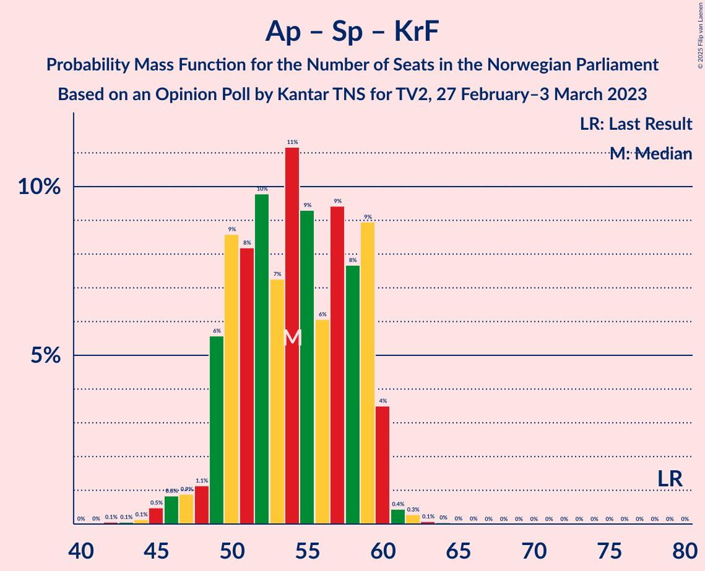

# Opinion Poll by Kantar TNS for TV2, 27 February–3 March 2023

<a href="#voting-intentions">Voting Intentions</a> | <a href="#seats">Seats</a> | <a href="#coalitions">Coalitions</a> | <a href="#technical-information">Technical Information</a>

## Voting Intentions

### Confidence Intervals

| Party | Last Result | Poll Result | 80% Confidence Interval | 90% Confidence Interval | 95% Confidence Interval | 99% Confidence Interval |
|:-----:|:-----------:|:-----------:|:-----------------------:|:-----------------------:|:-----------------------:|:-----------------------:|
| Høyre | 20.4% | 29.9% | 28.1–31.9% |27.6–32.4% |27.2–32.9% |26.3–33.8% |
| Arbeiderpartiet | 26.2% | 16.5% | 15.1–18.1% |14.7–18.6% |14.3–19.0% |13.7–19.8% |
| Fremskrittspartiet | 11.6% | 14.4% | 13.1–15.9% |12.7–16.4% |12.4–16.8% |11.7–17.5% |
| Sosialistisk Venstreparti | 7.6% | 9.4% | 8.3–10.7% |8.0–11.0% |7.7–11.4% |7.2–12.0% |
| Senterpartiet | 13.5% | 9.4% | 8.3–10.7% |8.0–11.0% |7.7–11.4% |7.2–12.0% |
| Rødt | 4.7% | 5.7% | 4.9–6.8% |4.7–7.1% |4.5–7.4% |4.1–7.9% |
| Venstre | 4.6% | 4.7% | 4.0–5.7% |3.8–6.0% |3.6–6.2% |3.2–6.8% |
| Kristelig Folkeparti | 3.8% | 4.3% | 3.6–5.3% |3.4–5.6% |3.2–5.8% |2.9–6.3% |
| Miljøpartiet De Grønne | 3.9% | 3.5% | 2.9–4.4% |2.7–4.6% |2.5–4.9% |2.3–5.3% |

*Note:* The poll result column reflects the actual value used in the calculations. Published results may vary slightly, and in addition be rounded to fewer digits.

## Seats

### Confidence Intervals

| Party | Last Result | Median | 80% Confidence Interval | 90% Confidence Interval | 95% Confidence Interval | 99% Confidence Interval |
|:-----:|:-----------:|:------:|:-----------------------:|:-----------------------:|:-----------------------:|:-----------------------:|
| <a href="#høyre">Høyre</a> | 36 | 52 | 49–56 |48–56 |47–58 |45–60 |
| <a href="#arbeiderpartiet">Arbeiderpartiet</a> | 48 | 32 | 29–34 |27–34 |26–35 |25–37 |
| <a href="#fremskrittspartiet">Fremskrittspartiet</a> | 21 | 25 | 22–29 |21–31 |21–31 |20–32 |
| <a href="#sosialistisk-venstreparti">Sosialistisk Venstreparti</a> | 13 | 16 | 14–19 |13–19 |13–20 |12–21 |
| <a href="#senterpartiet">Senterpartiet</a> | 28 | 16 | 14–19 |14–19 |14–20 |13–21 |
| <a href="#rødt">Rødt</a> | 8 | 10 | 8–12 |8–12 |7–13 |1–14 |
| <a href="#venstre">Venstre</a> | 8 | 8 | 3–10 |3–10 |2–11 |2–11 |
| <a href="#kristelig-folkeparti">Kristelig Folkeparti</a> | 3 | 7 | 3–9 |2–9 |2–10 |2–11 |
| <a href="#miljøpartiet-de-grønne">Miljøpartiet De Grønne</a> | 3 | 3 | 1–7 |1–8 |1–8 |1–9 |

### Høyre

*For a full overview of the results for this party, see the [Høyre](party-høyre.html) page.*

| Number of Seats | Probability | Accumulated | Special Marks |
|:---------------:|:-----------:|:-----------:|:-------------:|
| 36 | 0% | 100% | Last Result |
| 37 | 0% | 100% |  |
| 38 | 0% | 100% |  |
| 39 | 0% | 100% |  |
| 40 | 0% | 100% |  |
| 41 | 0% | 100% |  |
| 42 | 0% | 100% |  |
| 43 | 0% | 100% |  |
| 44 | 0.1% | 99.9% |  |
| 45 | 0.4% | 99.9% |  |
| 46 | 0.6% | 99.4% |  |
| 47 | 2% | 98.8% |  |
| 48 | 5% | 97% |  |
| 49 | 12% | 92% |  |
| 50 | 10% | 80% |  |
| 51 | 11% | 69% |  |
| 52 | 22% | 59% | Median |
| 53 | 13% | 37% |  |
| 54 | 7% | 24% |  |
| 55 | 6% | 16% |  |
| 56 | 6% | 10% |  |
| 57 | 2% | 5% |  |
| 58 | 1.2% | 3% |  |
| 59 | 2% | 2% |  |
| 60 | 0.4% | 0.6% |  |
| 61 | 0.1% | 0.2% |  |
| 62 | 0.1% | 0.1% |  |
| 63 | 0% | 0% |  |

### Arbeiderpartiet

*For a full overview of the results for this party, see the [Arbeiderpartiet](party-arbeiderpartiet.html) page.*

| Number of Seats | Probability | Accumulated | Special Marks |
|:---------------:|:-----------:|:-----------:|:-------------:|
| 23 | 0.1% | 100% |  |
| 24 | 0.2% | 99.9% |  |
| 25 | 0.7% | 99.7% |  |
| 26 | 3% | 99.0% |  |
| 27 | 2% | 96% |  |
| 28 | 3% | 95% |  |
| 29 | 7% | 91% |  |
| 30 | 13% | 84% |  |
| 31 | 14% | 72% |  |
| 32 | 20% | 58% | Median |
| 33 | 27% | 38% |  |
| 34 | 7% | 11% |  |
| 35 | 2% | 4% |  |
| 36 | 1.1% | 2% |  |
| 37 | 0.4% | 0.6% |  |
| 38 | 0.1% | 0.1% |  |
| 39 | 0% | 0% |  |
| 40 | 0% | 0% |  |
| 41 | 0% | 0% |  |
| 42 | 0% | 0% |  |
| 43 | 0% | 0% |  |
| 44 | 0% | 0% |  |
| 45 | 0% | 0% |  |
| 46 | 0% | 0% |  |
| 47 | 0% | 0% |  |
| 48 | 0% | 0% | Last Result |

### Fremskrittspartiet

*For a full overview of the results for this party, see the [Fremskrittspartiet](party-fremskrittspartiet.html) page.*

| Number of Seats | Probability | Accumulated | Special Marks |
|:---------------:|:-----------:|:-----------:|:-------------:|
| 18 | 0.2% | 100% |  |
| 19 | 0.3% | 99.8% |  |
| 20 | 2% | 99.6% |  |
| 21 | 7% | 98% | Last Result |
| 22 | 7% | 90% |  |
| 23 | 16% | 84% |  |
| 24 | 14% | 68% |  |
| 25 | 14% | 54% | Median |
| 26 | 12% | 40% |  |
| 27 | 7% | 28% |  |
| 28 | 6% | 21% |  |
| 29 | 6% | 15% |  |
| 30 | 3% | 9% |  |
| 31 | 6% | 6% |  |
| 32 | 0.5% | 0.6% |  |
| 33 | 0.1% | 0.1% |  |
| 34 | 0% | 0% |  |

### Sosialistisk Venstreparti

*For a full overview of the results for this party, see the [Sosialistisk Venstreparti](party-sosialistiskvenstreparti.html) page.*

| Number of Seats | Probability | Accumulated | Special Marks |
|:---------------:|:-----------:|:-----------:|:-------------:|
| 10 | 0.1% | 100% |  |
| 11 | 0.3% | 99.9% |  |
| 12 | 2% | 99.6% |  |
| 13 | 6% | 98% | Last Result |
| 14 | 13% | 92% |  |
| 15 | 22% | 79% |  |
| 16 | 16% | 57% | Median |
| 17 | 22% | 41% |  |
| 18 | 8% | 19% |  |
| 19 | 8% | 11% |  |
| 20 | 2% | 3% |  |
| 21 | 1.0% | 1.2% |  |
| 22 | 0.1% | 0.2% |  |
| 23 | 0% | 0% |  |

### Senterpartiet

*For a full overview of the results for this party, see the [Senterpartiet](party-senterpartiet.html) page.*

| Number of Seats | Probability | Accumulated | Special Marks |
|:---------------:|:-----------:|:-----------:|:-------------:|
| 11 | 0.1% | 100% |  |
| 12 | 0.4% | 99.9% |  |
| 13 | 1.2% | 99.5% |  |
| 14 | 12% | 98% |  |
| 15 | 23% | 86% |  |
| 16 | 18% | 63% | Median |
| 17 | 14% | 45% |  |
| 18 | 20% | 31% |  |
| 19 | 8% | 11% |  |
| 20 | 3% | 4% |  |
| 21 | 1.0% | 1.4% |  |
| 22 | 0.4% | 0.4% |  |
| 23 | 0.1% | 0.1% |  |
| 24 | 0% | 0% |  |
| 25 | 0% | 0% |  |
| 26 | 0% | 0% |  |
| 27 | 0% | 0% |  |
| 28 | 0% | 0% | Last Result |

### Rødt

*For a full overview of the results for this party, see the [Rødt](party-rødt.html) page.*

| Number of Seats | Probability | Accumulated | Special Marks |
|:---------------:|:-----------:|:-----------:|:-------------:|
| 1 | 0.5% | 100% |  |
| 2 | 0% | 99.5% |  |
| 3 | 0% | 99.5% |  |
| 4 | 0% | 99.5% |  |
| 5 | 0% | 99.5% |  |
| 6 | 0% | 99.5% |  |
| 7 | 2% | 99.5% |  |
| 8 | 10% | 97% | Last Result |
| 9 | 28% | 87% |  |
| 10 | 29% | 59% | Median |
| 11 | 19% | 30% |  |
| 12 | 9% | 11% |  |
| 13 | 2% | 3% |  |
| 14 | 0.5% | 0.6% |  |
| 15 | 0.1% | 0.1% |  |
| 16 | 0% | 0% |  |

### Venstre

*For a full overview of the results for this party, see the [Venstre](party-venstre.html) page.*

| Number of Seats | Probability | Accumulated | Special Marks |
|:---------------:|:-----------:|:-----------:|:-------------:|
| 2 | 4% | 100% |  |
| 3 | 8% | 96% |  |
| 4 | 0% | 88% |  |
| 5 | 0% | 88% |  |
| 6 | 1.2% | 88% |  |
| 7 | 17% | 86% |  |
| 8 | 31% | 69% | Last Result, Median |
| 9 | 27% | 39% |  |
| 10 | 9% | 12% |  |
| 11 | 3% | 3% |  |
| 12 | 0.3% | 0.4% |  |
| 13 | 0.1% | 0.1% |  |
| 14 | 0% | 0% |  |

### Kristelig Folkeparti

*For a full overview of the results for this party, see the [Kristelig Folkeparti](party-kristeligfolkeparti.html) page.*

| Number of Seats | Probability | Accumulated | Special Marks |
|:---------------:|:-----------:|:-----------:|:-------------:|
| 2 | 10% | 100% |  |
| 3 | 22% | 90% | Last Result |
| 4 | 0% | 68% |  |
| 5 | 0% | 68% |  |
| 6 | 0.6% | 68% |  |
| 7 | 26% | 68% | Median |
| 8 | 27% | 41% |  |
| 9 | 11% | 14% |  |
| 10 | 3% | 3% |  |
| 11 | 0.7% | 0.8% |  |
| 12 | 0.1% | 0.1% |  |
| 13 | 0% | 0% |  |

### Miljøpartiet De Grønne

*For a full overview of the results for this party, see the [Miljøpartiet De Grønne](party-miljøpartietdegrønne.html) page.*

| Number of Seats | Probability | Accumulated | Special Marks |
|:---------------:|:-----------:|:-----------:|:-------------:|
| 1 | 18% | 100% |  |
| 2 | 32% | 82% |  |
| 3 | 21% | 51% | Last Result, Median |
| 4 | 0% | 29% |  |
| 5 | 0% | 29% |  |
| 6 | 1.1% | 29% |  |
| 7 | 21% | 28% |  |
| 8 | 7% | 8% |  |
| 9 | 0.8% | 0.9% |  |
| 10 | 0.1% | 0.1% |  |
| 11 | 0% | 0% |  |

## Coalitions

### Confidence Intervals

| Coalition | Last Result | Median | Majority? | 80% Confidence Interval | 90% Confidence Interval | 95% Confidence Interval | 99% Confidence Interval |
|:---------:|:-----------:|:------:|:---------:|:-----------------------:|:-----------------------:|:-----------------------:|:-----------------------:|
| Høyre – Fremskrittspartiet – Senterpartiet – Venstre – Kristelig Folkeparti | 96 | 107 | 100% | 103–112 | 102–113 | 101–115 | 99–116 |
| Høyre – Fremskrittspartiet – Venstre – Kristelig Folkeparti – Miljøpartiet De Grønne | 71 | 94 | 100% | 91–99 | 90–99 | 89–101 | 87–102 |
| Høyre – Fremskrittspartiet – Venstre – Kristelig Folkeparti | 68 | 91 | 98.6% | 87–95 | 86–97 | 85–98 | 83–100 |
| Høyre – Fremskrittspartiet – Venstre | 65 | 85 | 52% | 80–90 | 79–91 | 78–92 | 76–94 |
| Høyre – Fremskrittspartiet | 57 | 77 | 3% | 72–82 | 71–83 | 71–85 | 69–88 |
| Arbeiderpartiet – Senterpartiet – Sosialistisk Venstreparti – Rødt – Miljøpartiet De Grønne | 100 | 77 | 0.9% | 73–81 | 72–82 | 71–83 | 68–85 |
| Arbeiderpartiet – Senterpartiet – Sosialistisk Venstreparti – Kristelig Folkeparti – Miljøpartiet De Grønne | 95 | 74 | 0.1% | 69–78 | 68–79 | 67–80 | 65–82 |
| Arbeiderpartiet – Senterpartiet – Sosialistisk Venstreparti – Rødt | 97 | 74 | 0% | 70–77 | 69–78 | 67–79 | 66–81 |
| Arbeiderpartiet – Senterpartiet – Sosialistisk Venstreparti – Miljøpartiet De Grønne | 92 | 68 | 0% | 63–71 | 62–72 | 61–73 | 59–75 |
| Høyre – Venstre – Kristelig Folkeparti | 47 | 66 | 0% | 62–70 | 61–71 | 60–72 | 58–73 |
| Arbeiderpartiet – Senterpartiet – Sosialistisk Venstreparti | 89 | 64 | 0% | 60–67 | 59–68 | 58–69 | 56–70 |
| Arbeiderpartiet – Sosialistisk Venstreparti – Rødt – Miljøpartiet De Grønne | 72 | 61 | 0% | 57–65 | 55–66 | 54–67 | 52–69 |
| Arbeiderpartiet – Senterpartiet – Kristelig Folkeparti – Miljøpartiet De Grønne | 82 | 58 | 0% | 52–63 | 51–64 | 50–65 | 47–67 |
| Arbeiderpartiet – Senterpartiet – Kristelig Folkeparti | 79 | 54 | 0% | 50–59 | 49–59 | 48–60 | 45–61 |
| Arbeiderpartiet – Senterpartiet | 76 | 48 | 0% | 45–51 | 44–51 | 43–52 | 41–53 |
| Arbeiderpartiet – Sosialistisk Venstreparti | 61 | 48 | 0% | 44–50 | 43–51 | 42–52 | 41–54 |
| Senterpartiet – Venstre – Kristelig Folkeparti | 39 | 31 | 0% | 26–35 | 25–35 | 24–36 | 20–38 |

### Høyre – Fremskrittspartiet – Senterpartiet – Venstre – Kristelig Folkeparti

| Number of Seats | Probability | Accumulated | Special Marks |
|:---------------:|:-----------:|:-----------:|:-------------:|
| 96 | 0% | 100% | Last Result |
| 97 | 0.1% | 100% |  |
| 98 | 0.1% | 99.8% |  |
| 99 | 0.3% | 99.7% |  |
| 100 | 1.0% | 99.4% |  |
| 101 | 2% | 98% |  |
| 102 | 3% | 96% |  |
| 103 | 9% | 93% |  |
| 104 | 5% | 84% |  |
| 105 | 9% | 79% |  |
| 106 | 11% | 70% |  |
| 107 | 12% | 59% |  |
| 108 | 10% | 47% | Median |
| 109 | 5% | 36% |  |
| 110 | 14% | 31% |  |
| 111 | 5% | 17% |  |
| 112 | 4% | 12% |  |
| 113 | 4% | 8% |  |
| 114 | 1.3% | 5% |  |
| 115 | 2% | 3% |  |
| 116 | 0.4% | 0.8% |  |
| 117 | 0.2% | 0.4% |  |
| 118 | 0.1% | 0.2% |  |
| 119 | 0% | 0.1% |  |
| 120 | 0% | 0% |  |

### Høyre – Fremskrittspartiet – Venstre – Kristelig Folkeparti – Miljøpartiet De Grønne

| Number of Seats | Probability | Accumulated | Special Marks |
|:---------------:|:-----------:|:-----------:|:-------------:|
| 71 | 0% | 100% | Last Result |
| 72 | 0% | 100% |  |
| 73 | 0% | 100% |  |
| 74 | 0% | 100% |  |
| 75 | 0% | 100% |  |
| 76 | 0% | 100% |  |
| 77 | 0% | 100% |  |
| 78 | 0% | 100% |  |
| 79 | 0% | 100% |  |
| 80 | 0% | 100% |  |
| 81 | 0% | 100% |  |
| 82 | 0% | 100% |  |
| 83 | 0% | 100% |  |
| 84 | 0% | 100% |  |
| 85 | 0.1% | 100% | Majority |
| 86 | 0.1% | 99.9% |  |
| 87 | 0.4% | 99.8% |  |
| 88 | 0.9% | 99.3% |  |
| 89 | 3% | 98% |  |
| 90 | 5% | 96% |  |
| 91 | 5% | 91% |  |
| 92 | 12% | 86% |  |
| 93 | 14% | 74% |  |
| 94 | 12% | 60% |  |
| 95 | 11% | 48% | Median |
| 96 | 11% | 37% |  |
| 97 | 7% | 26% |  |
| 98 | 8% | 19% |  |
| 99 | 5% | 10% |  |
| 100 | 1.1% | 5% |  |
| 101 | 2% | 4% |  |
| 102 | 1.4% | 2% |  |
| 103 | 0.2% | 0.4% |  |
| 104 | 0.1% | 0.2% |  |
| 105 | 0% | 0.1% |  |
| 106 | 0% | 0% |  |

### Høyre – Fremskrittspartiet – Venstre – Kristelig Folkeparti

| Number of Seats | Probability | Accumulated | Special Marks |
|:---------------:|:-----------:|:-----------:|:-------------:|
| 68 | 0% | 100% | Last Result |
| 69 | 0% | 100% |  |
| 70 | 0% | 100% |  |
| 71 | 0% | 100% |  |
| 72 | 0% | 100% |  |
| 73 | 0% | 100% |  |
| 74 | 0% | 100% |  |
| 75 | 0% | 100% |  |
| 76 | 0% | 100% |  |
| 77 | 0% | 100% |  |
| 78 | 0% | 100% |  |
| 79 | 0% | 100% |  |
| 80 | 0.1% | 100% |  |
| 81 | 0.1% | 99.9% |  |
| 82 | 0.2% | 99.8% |  |
| 83 | 0.4% | 99.6% |  |
| 84 | 0.6% | 99.2% |  |
| 85 | 1.2% | 98.6% | Majority |
| 86 | 3% | 97% |  |
| 87 | 10% | 95% |  |
| 88 | 7% | 85% |  |
| 89 | 14% | 78% |  |
| 90 | 11% | 64% |  |
| 91 | 11% | 53% |  |
| 92 | 11% | 42% | Median |
| 93 | 8% | 31% |  |
| 94 | 7% | 23% |  |
| 95 | 8% | 16% |  |
| 96 | 2% | 7% |  |
| 97 | 2% | 5% |  |
| 98 | 1.2% | 3% |  |
| 99 | 0.8% | 1.5% |  |
| 100 | 0.4% | 0.6% |  |
| 101 | 0.1% | 0.2% |  |
| 102 | 0% | 0.1% |  |
| 103 | 0% | 0% |  |

### Høyre – Fremskrittspartiet – Venstre

| Number of Seats | Probability | Accumulated | Special Marks |
|:---------------:|:-----------:|:-----------:|:-------------:|
| 65 | 0% | 100% | Last Result |
| 66 | 0% | 100% |  |
| 67 | 0% | 100% |  |
| 68 | 0% | 100% |  |
| 69 | 0% | 100% |  |
| 70 | 0% | 100% |  |
| 71 | 0% | 100% |  |
| 72 | 0% | 100% |  |
| 73 | 0% | 100% |  |
| 74 | 0.1% | 100% |  |
| 75 | 0.1% | 99.9% |  |
| 76 | 0.4% | 99.8% |  |
| 77 | 0.5% | 99.3% |  |
| 78 | 2% | 98.8% |  |
| 79 | 3% | 97% |  |
| 80 | 5% | 93% |  |
| 81 | 11% | 88% |  |
| 82 | 7% | 77% |  |
| 83 | 6% | 70% |  |
| 84 | 12% | 64% |  |
| 85 | 10% | 52% | Median, Majority |
| 86 | 10% | 42% |  |
| 87 | 7% | 32% |  |
| 88 | 9% | 25% |  |
| 89 | 4% | 16% |  |
| 90 | 6% | 12% |  |
| 91 | 3% | 6% |  |
| 92 | 2% | 3% |  |
| 93 | 0.6% | 1.1% |  |
| 94 | 0.2% | 0.5% |  |
| 95 | 0.2% | 0.3% |  |
| 96 | 0.1% | 0.2% |  |
| 97 | 0% | 0.1% |  |
| 98 | 0% | 0% |  |

### Høyre – Fremskrittspartiet

| Number of Seats | Probability | Accumulated | Special Marks |
|:---------------:|:-----------:|:-----------:|:-------------:|
| 57 | 0% | 100% | Last Result |
| 58 | 0% | 100% |  |
| 59 | 0% | 100% |  |
| 60 | 0% | 100% |  |
| 61 | 0% | 100% |  |
| 62 | 0% | 100% |  |
| 63 | 0% | 100% |  |
| 64 | 0% | 100% |  |
| 65 | 0% | 100% |  |
| 66 | 0% | 100% |  |
| 67 | 0.1% | 100% |  |
| 68 | 0.2% | 99.9% |  |
| 69 | 0.8% | 99.7% |  |
| 70 | 0.9% | 98.9% |  |
| 71 | 3% | 98% |  |
| 72 | 6% | 95% |  |
| 73 | 7% | 89% |  |
| 74 | 5% | 81% |  |
| 75 | 9% | 76% |  |
| 76 | 13% | 67% |  |
| 77 | 9% | 54% | Median |
| 78 | 11% | 45% |  |
| 79 | 11% | 34% |  |
| 80 | 4% | 23% |  |
| 81 | 6% | 19% |  |
| 82 | 5% | 13% |  |
| 83 | 3% | 7% |  |
| 84 | 1.4% | 4% |  |
| 85 | 2% | 3% | Majority |
| 86 | 0.6% | 1.3% |  |
| 87 | 0.2% | 0.8% |  |
| 88 | 0.4% | 0.6% |  |
| 89 | 0.2% | 0.2% |  |
| 90 | 0% | 0% |  |

### Arbeiderpartiet – Senterpartiet – Sosialistisk Venstreparti – Rødt – Miljøpartiet De Grønne

| Number of Seats | Probability | Accumulated | Special Marks |
|:---------------:|:-----------:|:-----------:|:-------------:|
| 66 | 0% | 100% |  |
| 67 | 0.1% | 99.9% |  |
| 68 | 0.4% | 99.8% |  |
| 69 | 0.8% | 99.4% |  |
| 70 | 0.9% | 98.6% |  |
| 71 | 0.9% | 98% |  |
| 72 | 3% | 97% |  |
| 73 | 7% | 93% |  |
| 74 | 7% | 86% |  |
| 75 | 6% | 79% |  |
| 76 | 9% | 73% |  |
| 77 | 14% | 64% | Median |
| 78 | 10% | 50% |  |
| 79 | 15% | 40% |  |
| 80 | 9% | 26% |  |
| 81 | 10% | 17% |  |
| 82 | 3% | 6% |  |
| 83 | 1.5% | 3% |  |
| 84 | 0.9% | 2% |  |
| 85 | 0.5% | 0.9% | Majority |
| 86 | 0.2% | 0.4% |  |
| 87 | 0.1% | 0.2% |  |
| 88 | 0.1% | 0.1% |  |
| 89 | 0% | 0.1% |  |
| 90 | 0% | 0% |  |
| 91 | 0% | 0% |  |
| 92 | 0% | 0% |  |
| 93 | 0% | 0% |  |
| 94 | 0% | 0% |  |
| 95 | 0% | 0% |  |
| 96 | 0% | 0% |  |
| 97 | 0% | 0% |  |
| 98 | 0% | 0% |  |
| 99 | 0% | 0% |  |
| 100 | 0% | 0% | Last Result |

### Arbeiderpartiet – Senterpartiet – Sosialistisk Venstreparti – Kristelig Folkeparti – Miljøpartiet De Grønne

| Number of Seats | Probability | Accumulated | Special Marks |
|:---------------:|:-----------:|:-----------:|:-------------:|
| 61 | 0.1% | 100% |  |
| 62 | 0.1% | 99.9% |  |
| 63 | 0.1% | 99.9% |  |
| 64 | 0.3% | 99.8% |  |
| 65 | 0.8% | 99.5% |  |
| 66 | 1.3% | 98.8% |  |
| 67 | 2% | 98% |  |
| 68 | 4% | 95% |  |
| 69 | 4% | 91% |  |
| 70 | 9% | 87% |  |
| 71 | 8% | 77% |  |
| 72 | 5% | 69% |  |
| 73 | 9% | 64% |  |
| 74 | 11% | 55% | Median |
| 75 | 10% | 44% |  |
| 76 | 9% | 35% |  |
| 77 | 7% | 25% |  |
| 78 | 9% | 18% |  |
| 79 | 6% | 9% |  |
| 80 | 2% | 4% |  |
| 81 | 0.5% | 2% |  |
| 82 | 0.6% | 1.1% |  |
| 83 | 0.2% | 0.5% |  |
| 84 | 0.3% | 0.3% |  |
| 85 | 0% | 0.1% | Majority |
| 86 | 0% | 0% |  |
| 87 | 0% | 0% |  |
| 88 | 0% | 0% |  |
| 89 | 0% | 0% |  |
| 90 | 0% | 0% |  |
| 91 | 0% | 0% |  |
| 92 | 0% | 0% |  |
| 93 | 0% | 0% |  |
| 94 | 0% | 0% |  |
| 95 | 0% | 0% | Last Result |

### Arbeiderpartiet – Senterpartiet – Sosialistisk Venstreparti – Rødt

| Number of Seats | Probability | Accumulated | Special Marks |
|:---------------:|:-----------:|:-----------:|:-------------:|
| 63 | 0% | 100% |  |
| 64 | 0.1% | 99.9% |  |
| 65 | 0.2% | 99.8% |  |
| 66 | 1.2% | 99.6% |  |
| 67 | 2% | 98% |  |
| 68 | 1.1% | 97% |  |
| 69 | 3% | 96% |  |
| 70 | 10% | 92% |  |
| 71 | 5% | 82% |  |
| 72 | 10% | 77% |  |
| 73 | 11% | 67% |  |
| 74 | 13% | 56% | Median |
| 75 | 9% | 43% |  |
| 76 | 18% | 34% |  |
| 77 | 7% | 16% |  |
| 78 | 5% | 10% |  |
| 79 | 3% | 5% |  |
| 80 | 1.0% | 2% |  |
| 81 | 0.7% | 1.2% |  |
| 82 | 0.3% | 0.4% |  |
| 83 | 0.1% | 0.1% |  |
| 84 | 0% | 0.1% |  |
| 85 | 0% | 0% | Majority |
| 86 | 0% | 0% |  |
| 87 | 0% | 0% |  |
| 88 | 0% | 0% |  |
| 89 | 0% | 0% |  |
| 90 | 0% | 0% |  |
| 91 | 0% | 0% |  |
| 92 | 0% | 0% |  |
| 93 | 0% | 0% |  |
| 94 | 0% | 0% |  |
| 95 | 0% | 0% |  |
| 96 | 0% | 0% |  |
| 97 | 0% | 0% | Last Result |

### Arbeiderpartiet – Senterpartiet – Sosialistisk Venstreparti – Miljøpartiet De Grønne

| Number of Seats | Probability | Accumulated | Special Marks |
|:---------------:|:-----------:|:-----------:|:-------------:|
| 57 | 0.1% | 100% |  |
| 58 | 0.3% | 99.9% |  |
| 59 | 0.2% | 99.6% |  |
| 60 | 0.8% | 99.3% |  |
| 61 | 2% | 98.5% |  |
| 62 | 3% | 96% |  |
| 63 | 5% | 93% |  |
| 64 | 6% | 88% |  |
| 65 | 6% | 82% |  |
| 66 | 12% | 76% |  |
| 67 | 12% | 64% | Median |
| 68 | 13% | 52% |  |
| 69 | 9% | 39% |  |
| 70 | 12% | 30% |  |
| 71 | 11% | 18% |  |
| 72 | 3% | 7% |  |
| 73 | 1.4% | 4% |  |
| 74 | 1.0% | 2% |  |
| 75 | 0.8% | 1.3% |  |
| 76 | 0.3% | 0.4% |  |
| 77 | 0.1% | 0.2% |  |
| 78 | 0% | 0.1% |  |
| 79 | 0% | 0% |  |
| 80 | 0% | 0% |  |
| 81 | 0% | 0% |  |
| 82 | 0% | 0% |  |
| 83 | 0% | 0% |  |
| 84 | 0% | 0% |  |
| 85 | 0% | 0% | Majority |
| 86 | 0% | 0% |  |
| 87 | 0% | 0% |  |
| 88 | 0% | 0% |  |
| 89 | 0% | 0% |  |
| 90 | 0% | 0% |  |
| 91 | 0% | 0% |  |
| 92 | 0% | 0% | Last Result |

### Høyre – Venstre – Kristelig Folkeparti

| Number of Seats | Probability | Accumulated | Special Marks |
|:---------------:|:-----------:|:-----------:|:-------------:|
| 47 | 0% | 100% | Last Result |
| 48 | 0% | 100% |  |
| 49 | 0% | 100% |  |
| 50 | 0% | 100% |  |
| 51 | 0% | 100% |  |
| 52 | 0% | 100% |  |
| 53 | 0% | 100% |  |
| 54 | 0% | 100% |  |
| 55 | 0.1% | 100% |  |
| 56 | 0.1% | 99.9% |  |
| 57 | 0.2% | 99.8% |  |
| 58 | 0.4% | 99.6% |  |
| 59 | 0.8% | 99.2% |  |
| 60 | 3% | 98% |  |
| 61 | 3% | 96% |  |
| 62 | 5% | 93% |  |
| 63 | 10% | 88% |  |
| 64 | 15% | 78% |  |
| 65 | 8% | 62% |  |
| 66 | 13% | 55% |  |
| 67 | 12% | 42% | Median |
| 68 | 12% | 29% |  |
| 69 | 7% | 18% |  |
| 70 | 4% | 11% |  |
| 71 | 3% | 7% |  |
| 72 | 4% | 5% |  |
| 73 | 0.4% | 0.9% |  |
| 74 | 0.3% | 0.5% |  |
| 75 | 0.1% | 0.2% |  |
| 76 | 0.1% | 0.1% |  |
| 77 | 0% | 0% |  |

### Arbeiderpartiet – Senterpartiet – Sosialistisk Venstreparti

| Number of Seats | Probability | Accumulated | Special Marks |
|:---------------:|:-----------:|:-----------:|:-------------:|
| 54 | 0% | 100% |  |
| 55 | 0.2% | 99.9% |  |
| 56 | 0.4% | 99.7% |  |
| 57 | 1.2% | 99.4% |  |
| 58 | 1.2% | 98% |  |
| 59 | 4% | 97% |  |
| 60 | 7% | 93% |  |
| 61 | 7% | 86% |  |
| 62 | 5% | 79% |  |
| 63 | 16% | 74% |  |
| 64 | 16% | 58% | Median |
| 65 | 11% | 42% |  |
| 66 | 10% | 30% |  |
| 67 | 11% | 21% |  |
| 68 | 6% | 9% |  |
| 69 | 2% | 3% |  |
| 70 | 0.5% | 1.0% |  |
| 71 | 0.2% | 0.5% |  |
| 72 | 0.1% | 0.3% |  |
| 73 | 0.1% | 0.1% |  |
| 74 | 0% | 0% |  |
| 75 | 0% | 0% |  |
| 76 | 0% | 0% |  |
| 77 | 0% | 0% |  |
| 78 | 0% | 0% |  |
| 79 | 0% | 0% |  |
| 80 | 0% | 0% |  |
| 81 | 0% | 0% |  |
| 82 | 0% | 0% |  |
| 83 | 0% | 0% |  |
| 84 | 0% | 0% |  |
| 85 | 0% | 0% | Majority |
| 86 | 0% | 0% |  |
| 87 | 0% | 0% |  |
| 88 | 0% | 0% |  |
| 89 | 0% | 0% | Last Result |

### Arbeiderpartiet – Sosialistisk Venstreparti – Rødt – Miljøpartiet De Grønne

| Number of Seats | Probability | Accumulated | Special Marks |
|:---------------:|:-----------:|:-----------:|:-------------:|
| 49 | 0% | 100% |  |
| 50 | 0% | 99.9% |  |
| 51 | 0.1% | 99.9% |  |
| 52 | 0.3% | 99.8% |  |
| 53 | 0.6% | 99.5% |  |
| 54 | 3% | 98.9% |  |
| 55 | 2% | 96% |  |
| 56 | 4% | 94% |  |
| 57 | 5% | 90% |  |
| 58 | 9% | 85% |  |
| 59 | 11% | 76% |  |
| 60 | 6% | 65% |  |
| 61 | 14% | 59% | Median |
| 62 | 13% | 45% |  |
| 63 | 9% | 31% |  |
| 64 | 5% | 22% |  |
| 65 | 9% | 17% |  |
| 66 | 3% | 8% |  |
| 67 | 2% | 4% |  |
| 68 | 1.0% | 2% |  |
| 69 | 0.3% | 0.6% |  |
| 70 | 0.1% | 0.3% |  |
| 71 | 0.1% | 0.2% |  |
| 72 | 0% | 0.1% | Last Result |
| 73 | 0% | 0% |  |

### Arbeiderpartiet – Senterpartiet – Kristelig Folkeparti – Miljøpartiet De Grønne

| Number of Seats | Probability | Accumulated | Special Marks |
|:---------------:|:-----------:|:-----------:|:-------------:|
| 45 | 0.1% | 100% |  |
| 46 | 0.1% | 99.9% |  |
| 47 | 0.4% | 99.8% |  |
| 48 | 0.1% | 99.4% |  |
| 49 | 0.9% | 99.3% |  |
| 50 | 2% | 98% |  |
| 51 | 3% | 96% |  |
| 52 | 3% | 93% |  |
| 53 | 9% | 90% |  |
| 54 | 5% | 80% |  |
| 55 | 7% | 76% |  |
| 56 | 4% | 69% |  |
| 57 | 12% | 65% |  |
| 58 | 6% | 53% | Median |
| 59 | 10% | 47% |  |
| 60 | 11% | 37% |  |
| 61 | 9% | 27% |  |
| 62 | 7% | 18% |  |
| 63 | 5% | 11% |  |
| 64 | 3% | 6% |  |
| 65 | 1.1% | 3% |  |
| 66 | 1.4% | 2% |  |
| 67 | 0.4% | 0.6% |  |
| 68 | 0.1% | 0.1% |  |
| 69 | 0% | 0.1% |  |
| 70 | 0% | 0% |  |
| 71 | 0% | 0% |  |
| 72 | 0% | 0% |  |
| 73 | 0% | 0% |  |
| 74 | 0% | 0% |  |
| 75 | 0% | 0% |  |
| 76 | 0% | 0% |  |
| 77 | 0% | 0% |  |
| 78 | 0% | 0% |  |
| 79 | 0% | 0% |  |
| 80 | 0% | 0% |  |
| 81 | 0% | 0% |  |
| 82 | 0% | 0% | Last Result |

### Arbeiderpartiet – Senterpartiet – Kristelig Folkeparti

| Number of Seats | Probability | Accumulated | Special Marks |
|:---------------:|:-----------:|:-----------:|:-------------:|
| 42 | 0.1% | 100% |  |
| 43 | 0.1% | 99.9% |  |
| 44 | 0.1% | 99.9% |  |
| 45 | 0.5% | 99.7% |  |
| 46 | 0.8% | 99.2% |  |
| 47 | 0.9% | 98% |  |
| 48 | 1.1% | 98% |  |
| 49 | 6% | 96% |  |
| 50 | 9% | 91% |  |
| 51 | 8% | 82% |  |
| 52 | 10% | 74% |  |
| 53 | 7% | 64% |  |
| 54 | 11% | 57% |  |
| 55 | 9% | 46% | Median |
| 56 | 6% | 36% |  |
| 57 | 9% | 30% |  |
| 58 | 8% | 21% |  |
| 59 | 9% | 13% |  |
| 60 | 4% | 4% |  |
| 61 | 0.4% | 0.9% |  |
| 62 | 0.3% | 0.4% |  |
| 63 | 0.1% | 0.1% |  |
| 64 | 0% | 0.1% |  |
| 65 | 0% | 0% |  |
| 66 | 0% | 0% |  |
| 67 | 0% | 0% |  |
| 68 | 0% | 0% |  |
| 69 | 0% | 0% |  |
| 70 | 0% | 0% |  |
| 71 | 0% | 0% |  |
| 72 | 0% | 0% |  |
| 73 | 0% | 0% |  |
| 74 | 0% | 0% |  |
| 75 | 0% | 0% |  |
| 76 | 0% | 0% |  |
| 77 | 0% | 0% |  |
| 78 | 0% | 0% |  |
| 79 | 0% | 0% | Last Result |

### Arbeiderpartiet – Senterpartiet

| Number of Seats | Probability | Accumulated | Special Marks |
|:---------------:|:-----------:|:-----------:|:-------------:|
| 39 | 0.1% | 100% |  |
| 40 | 0.2% | 99.9% |  |
| 41 | 0.4% | 99.7% |  |
| 42 | 0.9% | 99.3% |  |
| 43 | 2% | 98% |  |
| 44 | 5% | 97% |  |
| 45 | 9% | 92% |  |
| 46 | 11% | 83% |  |
| 47 | 18% | 72% |  |
| 48 | 11% | 54% | Median |
| 49 | 13% | 42% |  |
| 50 | 11% | 30% |  |
| 51 | 15% | 18% |  |
| 52 | 2% | 3% |  |
| 53 | 0.9% | 1.4% |  |
| 54 | 0.3% | 0.5% |  |
| 55 | 0.1% | 0.2% |  |
| 56 | 0% | 0.1% |  |
| 57 | 0% | 0% |  |
| 58 | 0% | 0% |  |
| 59 | 0% | 0% |  |
| 60 | 0% | 0% |  |
| 61 | 0% | 0% |  |
| 62 | 0% | 0% |  |
| 63 | 0% | 0% |  |
| 64 | 0% | 0% |  |
| 65 | 0% | 0% |  |
| 66 | 0% | 0% |  |
| 67 | 0% | 0% |  |
| 68 | 0% | 0% |  |
| 69 | 0% | 0% |  |
| 70 | 0% | 0% |  |
| 71 | 0% | 0% |  |
| 72 | 0% | 0% |  |
| 73 | 0% | 0% |  |
| 74 | 0% | 0% |  |
| 75 | 0% | 0% |  |
| 76 | 0% | 0% | Last Result |

### Arbeiderpartiet – Sosialistisk Venstreparti

| Number of Seats | Probability | Accumulated | Special Marks |
|:---------------:|:-----------:|:-----------:|:-------------:|
| 38 | 0.1% | 100% |  |
| 39 | 0.1% | 99.9% |  |
| 40 | 0.3% | 99.8% |  |
| 41 | 2% | 99.5% |  |
| 42 | 3% | 98% |  |
| 43 | 2% | 95% |  |
| 44 | 4% | 93% |  |
| 45 | 11% | 89% |  |
| 46 | 13% | 78% |  |
| 47 | 10% | 65% |  |
| 48 | 17% | 56% | Median |
| 49 | 15% | 38% |  |
| 50 | 15% | 24% |  |
| 51 | 5% | 9% |  |
| 52 | 2% | 4% |  |
| 53 | 1.1% | 2% |  |
| 54 | 0.3% | 0.5% |  |
| 55 | 0.2% | 0.2% |  |
| 56 | 0% | 0% |  |
| 57 | 0% | 0% |  |
| 58 | 0% | 0% |  |
| 59 | 0% | 0% |  |
| 60 | 0% | 0% |  |
| 61 | 0% | 0% | Last Result |

### Senterpartiet – Venstre – Kristelig Folkeparti

| Number of Seats | Probability | Accumulated | Special Marks |
|:---------------:|:-----------:|:-----------:|:-------------:|
| 19 | 0% | 100% |  |
| 20 | 0.5% | 99.9% |  |
| 21 | 0.5% | 99.4% |  |
| 22 | 0.4% | 99.0% |  |
| 23 | 0.3% | 98.5% |  |
| 24 | 0.9% | 98% |  |
| 25 | 7% | 97% |  |
| 26 | 8% | 90% |  |
| 27 | 6% | 82% |  |
| 28 | 6% | 76% |  |
| 29 | 9% | 71% |  |
| 30 | 10% | 62% |  |
| 31 | 14% | 52% | Median |
| 32 | 9% | 38% |  |
| 33 | 8% | 29% |  |
| 34 | 10% | 21% |  |
| 35 | 7% | 11% |  |
| 36 | 3% | 4% |  |
| 37 | 0.6% | 1.5% |  |
| 38 | 0.7% | 0.9% |  |
| 39 | 0.2% | 0.3% | Last Result |
| 40 | 0.1% | 0.1% |  |
| 41 | 0% | 0% |  |

## Technical Information

### Opinion Poll

+ **Polling firm:** Kantar TNS
+ **Commissioner(s):** TV2
+ **Fieldwork period:** 27 February–3 March 2023

### Calculations

+ **Sample size:** 992
+ **Simulations done:** 1,048,576
+ **Error estimate:** 1.94%

