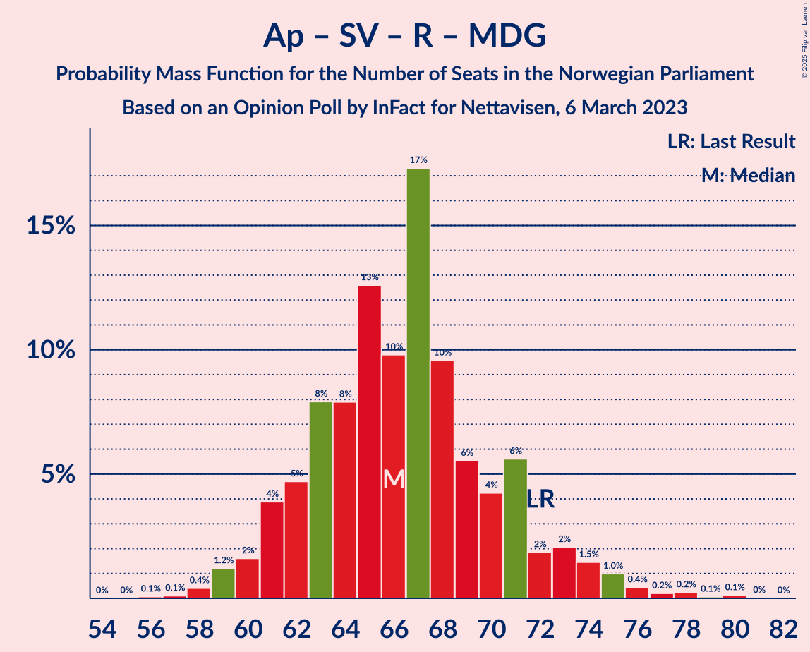

# Opinion Poll by InFact for Nettavisen, 6 March 2023

<a href="#voting-intentions">Voting Intentions</a> | <a href="#seats">Seats</a> | <a href="#coalitions">Coalitions</a> | <a href="#technical-information">Technical Information</a>

## Voting Intentions

### Confidence Intervals

| Party | Last Result | Poll Result | 80% Confidence Interval | 90% Confidence Interval | 95% Confidence Interval | 99% Confidence Interval |
|:-----:|:-----------:|:-----------:|:-----------------------:|:-----------------------:|:-----------------------:|:-----------------------:|
| Høyre | 20.4% | 28.9% | 27.1–30.8% |26.6–31.3% |26.2–31.8% |25.3–32.7% |
| Arbeiderpartiet | 26.2% | 19.6% | 18.1–21.3% |17.7–21.8% |17.3–22.2% |16.6–23.0% |
| Fremskrittspartiet | 11.6% | 13.7% | 12.3–15.2% |12.0–15.6% |11.7–15.9% |11.1–16.7% |
| Sosialistisk Venstreparti | 7.6% | 7.5% | 6.5–8.7% |6.2–9.0% |6.0–9.3% |5.6–9.9% |
| Rødt | 4.7% | 6.8% | 5.9–7.9% |5.6–8.2% |5.4–8.5% |5.0–9.1% |
| Miljøpartiet De Grønne | 3.9% | 5.2% | 4.4–6.2% |4.2–6.5% |4.0–6.7% |3.6–7.3% |
| Venstre | 4.6% | 4.9% | 4.1–5.9% |3.9–6.2% |3.7–6.4% |3.4–6.9% |
| Senterpartiet | 13.5% | 4.9% | 4.1–5.9% |3.9–6.2% |3.7–6.4% |3.4–6.9% |
| Kristelig Folkeparti | 3.8% | 3.8% | 3.1–4.7% |2.9–4.9% |2.8–5.2% |2.5–5.6% |

*Note:* The poll result column reflects the actual value used in the calculations. Published results may vary slightly, and in addition be rounded to fewer digits.

## Seats

### Confidence Intervals

| Party | Last Result | Median | 80% Confidence Interval | 90% Confidence Interval | 95% Confidence Interval | 99% Confidence Interval |
|:-----:|:-----------:|:------:|:-----------------------:|:-----------------------:|:-----------------------:|:-----------------------:|
| <a href="#høyre">Høyre</a> | 36 | 51 | 48–56 |48–58 |47–59 |45–62 |
| <a href="#arbeiderpartiet">Arbeiderpartiet</a> | 48 | 39 | 35–43 |34–45 |34–47 |33–48 |
| <a href="#fremskrittspartiet">Fremskrittspartiet</a> | 21 | 27 | 22–30 |21–31 |20–31 |19–33 |
| <a href="#sosialistisk-venstreparti">Sosialistisk Venstreparti</a> | 13 | 10 | 9–13 |8–14 |8–15 |7–16 |
| <a href="#rødt">Rødt</a> | 8 | 10 | 8–11 |8–12 |7–12 |6–14 |
| <a href="#miljøpartiet-de-grønne">Miljøpartiet De Grønne</a> | 3 | 7 | 6–9 |6–9 |3–10 |2–11 |
| <a href="#venstre">Venstre</a> | 8 | 7 | 6–9 |3–9 |3–9 |2–10 |
| <a href="#senterpartiet">Senterpartiet</a> | 28 | 7 | 5–9 |1–10 |1–11 |0–13 |
| <a href="#kristelig-folkeparti">Kristelig Folkeparti</a> | 3 | 3 | 2–6 |2–7 |2–7 |2–8 |

### Høyre

*For a full overview of the results for this party, see the [Høyre](party-høyre.html) page.*

| Number of Seats | Probability | Accumulated | Special Marks |
|:---------------:|:-----------:|:-----------:|:-------------:|
| 36 | 0% | 100% | Last Result |
| 37 | 0% | 100% |  |
| 38 | 0% | 100% |  |
| 39 | 0% | 100% |  |
| 40 | 0% | 100% |  |
| 41 | 0% | 100% |  |
| 42 | 0% | 100% |  |
| 43 | 0% | 100% |  |
| 44 | 0.1% | 100% |  |
| 45 | 0.5% | 99.9% |  |
| 46 | 1.3% | 99.4% |  |
| 47 | 2% | 98% |  |
| 48 | 9% | 96% |  |
| 49 | 17% | 87% |  |
| 50 | 12% | 71% |  |
| 51 | 12% | 59% | Median |
| 52 | 9% | 47% |  |
| 53 | 16% | 38% |  |
| 54 | 8% | 22% |  |
| 55 | 2% | 14% |  |
| 56 | 4% | 12% |  |
| 57 | 2% | 8% |  |
| 58 | 3% | 7% |  |
| 59 | 2% | 4% |  |
| 60 | 0.4% | 1.4% |  |
| 61 | 0.4% | 1.0% |  |
| 62 | 0.3% | 0.6% |  |
| 63 | 0.2% | 0.2% |  |
| 64 | 0% | 0% |  |

### Arbeiderpartiet

*For a full overview of the results for this party, see the [Arbeiderpartiet](party-arbeiderpartiet.html) page.*

| Number of Seats | Probability | Accumulated | Special Marks |
|:---------------:|:-----------:|:-----------:|:-------------:|
| 32 | 0.2% | 100% |  |
| 33 | 0.8% | 99.8% |  |
| 34 | 8% | 99.0% |  |
| 35 | 5% | 91% |  |
| 36 | 10% | 86% |  |
| 37 | 12% | 77% |  |
| 38 | 10% | 65% |  |
| 39 | 15% | 55% | Median |
| 40 | 7% | 40% |  |
| 41 | 12% | 33% |  |
| 42 | 10% | 21% |  |
| 43 | 4% | 11% |  |
| 44 | 2% | 7% |  |
| 45 | 1.3% | 5% |  |
| 46 | 0.7% | 4% |  |
| 47 | 3% | 3% |  |
| 48 | 0.3% | 0.5% | Last Result |
| 49 | 0.2% | 0.2% |  |
| 50 | 0% | 0% |  |

### Fremskrittspartiet

*For a full overview of the results for this party, see the [Fremskrittspartiet](party-fremskrittspartiet.html) page.*

| Number of Seats | Probability | Accumulated | Special Marks |
|:---------------:|:-----------:|:-----------:|:-------------:|
| 18 | 0.4% | 100% |  |
| 19 | 2% | 99.6% |  |
| 20 | 2% | 98% |  |
| 21 | 2% | 96% | Last Result |
| 22 | 5% | 94% |  |
| 23 | 10% | 89% |  |
| 24 | 8% | 79% |  |
| 25 | 10% | 71% |  |
| 26 | 8% | 62% |  |
| 27 | 12% | 54% | Median |
| 28 | 17% | 42% |  |
| 29 | 10% | 25% |  |
| 30 | 10% | 15% |  |
| 31 | 4% | 5% |  |
| 32 | 0.7% | 2% |  |
| 33 | 0.8% | 0.9% |  |
| 34 | 0.1% | 0.1% |  |
| 35 | 0% | 0% |  |

### Sosialistisk Venstreparti

*For a full overview of the results for this party, see the [Sosialistisk Venstreparti](party-sosialistiskvenstreparti.html) page.*

| Number of Seats | Probability | Accumulated | Special Marks |
|:---------------:|:-----------:|:-----------:|:-------------:|
| 7 | 0.5% | 100% |  |
| 8 | 5% | 99.5% |  |
| 9 | 20% | 94% |  |
| 10 | 31% | 75% | Median |
| 11 | 19% | 43% |  |
| 12 | 10% | 25% |  |
| 13 | 6% | 15% | Last Result |
| 14 | 6% | 9% |  |
| 15 | 3% | 3% |  |
| 16 | 0.3% | 0.5% |  |
| 17 | 0.2% | 0.2% |  |
| 18 | 0% | 0% |  |

### Rødt

*For a full overview of the results for this party, see the [Rødt](party-rødt.html) page.*

| Number of Seats | Probability | Accumulated | Special Marks |
|:---------------:|:-----------:|:-----------:|:-------------:|
| 6 | 0.7% | 100% |  |
| 7 | 2% | 99.3% |  |
| 8 | 18% | 97% | Last Result |
| 9 | 26% | 79% |  |
| 10 | 32% | 53% | Median |
| 11 | 15% | 21% |  |
| 12 | 4% | 6% |  |
| 13 | 1.0% | 2% |  |
| 14 | 0.7% | 0.9% |  |
| 15 | 0.1% | 0.2% |  |
| 16 | 0% | 0.1% |  |
| 17 | 0% | 0% |  |

### Miljøpartiet De Grønne

*For a full overview of the results for this party, see the [Miljøpartiet De Grønne](party-miljøpartietdegrønne.html) page.*

| Number of Seats | Probability | Accumulated | Special Marks |
|:---------------:|:-----------:|:-----------:|:-------------:|
| 2 | 0.5% | 100% |  |
| 3 | 3% | 99.5% | Last Result |
| 4 | 0% | 97% |  |
| 5 | 0.5% | 97% |  |
| 6 | 17% | 96% |  |
| 7 | 39% | 79% | Median |
| 8 | 30% | 40% |  |
| 9 | 5% | 10% |  |
| 10 | 4% | 5% |  |
| 11 | 0.8% | 0.9% |  |
| 12 | 0.1% | 0.1% |  |
| 13 | 0% | 0% |  |

### Venstre

*For a full overview of the results for this party, see the [Venstre](party-venstre.html) page.*

| Number of Seats | Probability | Accumulated | Special Marks |
|:---------------:|:-----------:|:-----------:|:-------------:|
| 2 | 1.1% | 100% |  |
| 3 | 5% | 98.9% |  |
| 4 | 0% | 94% |  |
| 5 | 3% | 94% |  |
| 6 | 36% | 90% |  |
| 7 | 20% | 54% | Median |
| 8 | 24% | 35% | Last Result |
| 9 | 9% | 11% |  |
| 10 | 1.1% | 1.3% |  |
| 11 | 0.2% | 0.2% |  |
| 12 | 0% | 0% |  |

### Senterpartiet

*For a full overview of the results for this party, see the [Senterpartiet](party-senterpartiet.html) page.*

| Number of Seats | Probability | Accumulated | Special Marks |
|:---------------:|:-----------:|:-----------:|:-------------:|
| 0 | 1.0% | 100% |  |
| 1 | 7% | 99.0% |  |
| 2 | 0.6% | 92% |  |
| 3 | 0% | 91% |  |
| 4 | 0% | 91% |  |
| 5 | 1.3% | 91% |  |
| 6 | 35% | 90% |  |
| 7 | 27% | 55% | Median |
| 8 | 13% | 28% |  |
| 9 | 8% | 15% |  |
| 10 | 5% | 8% |  |
| 11 | 0.8% | 3% |  |
| 12 | 1.2% | 2% |  |
| 13 | 1.1% | 1.2% |  |
| 14 | 0.1% | 0.1% |  |
| 15 | 0% | 0% |  |
| 16 | 0% | 0% |  |
| 17 | 0% | 0% |  |
| 18 | 0% | 0% |  |
| 19 | 0% | 0% |  |
| 20 | 0% | 0% |  |
| 21 | 0% | 0% |  |
| 22 | 0% | 0% |  |
| 23 | 0% | 0% |  |
| 24 | 0% | 0% |  |
| 25 | 0% | 0% |  |
| 26 | 0% | 0% |  |
| 27 | 0% | 0% |  |
| 28 | 0% | 0% | Last Result |

### Kristelig Folkeparti

*For a full overview of the results for this party, see the [Kristelig Folkeparti](party-kristeligfolkeparti.html) page.*

| Number of Seats | Probability | Accumulated | Special Marks |
|:---------------:|:-----------:|:-----------:|:-------------:|
| 1 | 0.3% | 100% |  |
| 2 | 27% | 99.7% |  |
| 3 | 36% | 73% | Last Result, Median |
| 4 | 0% | 37% |  |
| 5 | 5% | 37% |  |
| 6 | 24% | 32% |  |
| 7 | 7% | 8% |  |
| 8 | 1.1% | 1.2% |  |
| 9 | 0.1% | 0.1% |  |
| 10 | 0% | 0% |  |

## Coalitions

### Confidence Intervals

| Coalition | Last Result | Median | Majority? | 80% Confidence Interval | 90% Confidence Interval | 95% Confidence Interval | 99% Confidence Interval |
|:---------:|:-----------:|:------:|:---------:|:-----------------------:|:-----------------------:|:-----------------------:|:-----------------------:|
| Høyre – Fremskrittspartiet – Miljøpartiet De Grønne – Venstre – Kristelig Folkeparti | 71 | 96 | 99.7% | 91–101 | 89–102 | 88–103 | 85–105 |
| Høyre – Fremskrittspartiet – Senterpartiet – Venstre – Kristelig Folkeparti | 96 | 95 | 99.6% | 91–100 | 89–101 | 88–102 | 85–104 |
| Høyre – Fremskrittspartiet – Venstre – Kristelig Folkeparti | 68 | 89 | 85% | 84–94 | 82–94 | 80–96 | 78–98 |
| Høyre – Fremskrittspartiet – Venstre | 65 | 85 | 55% | 80–89 | 79–91 | 77–91 | 75–93 |
| Høyre – Fremskrittspartiet | 57 | 78 | 2% | 73–82 | 72–83 | 70–84 | 68–86 |
| Arbeiderpartiet – Sosialistisk Venstreparti – Rødt – Miljøpartiet De Grønne – Senterpartiet | 100 | 73 | 0.8% | 68–78 | 68–80 | 66–81 | 64–86 |
| Arbeiderpartiet – Sosialistisk Venstreparti – Miljøpartiet De Grønne – Senterpartiet – Kristelig Folkeparti | 95 | 68 | 0% | 63–72 | 61–74 | 60–75 | 59–78 |
| Arbeiderpartiet – Sosialistisk Venstreparti – Rødt – Miljøpartiet De Grønne | 72 | 66 | 0% | 62–71 | 61–73 | 60–74 | 58–77 |
| Arbeiderpartiet – Sosialistisk Venstreparti – Rødt – Senterpartiet | 97 | 66 | 0% | 61–71 | 60–73 | 59–73 | 57–77 |
| Arbeiderpartiet – Sosialistisk Venstreparti – Miljøpartiet De Grønne – Senterpartiet | 92 | 63 | 0% | 59–68 | 58–69 | 57–71 | 54–74 |
| Høyre – Venstre – Kristelig Folkeparti | 47 | 62 | 0% | 58–67 | 56–69 | 56–71 | 54–73 |
| Arbeiderpartiet – Miljøpartiet De Grønne – Senterpartiet – Kristelig Folkeparti | 82 | 57 | 0% | 51–62 | 50–64 | 49–65 | 47–67 |
| Arbeiderpartiet – Sosialistisk Venstreparti – Senterpartiet | 89 | 56 | 0% | 51–61 | 50–63 | 49–63 | 47–65 |
| Arbeiderpartiet – Senterpartiet – Kristelig Folkeparti | 79 | 50 | 0% | 44–54 | 43–56 | 41–58 | 39–60 |
| Arbeiderpartiet – Sosialistisk Venstreparti | 61 | 49 | 0% | 46–53 | 44–56 | 44–57 | 43–59 |
| Arbeiderpartiet – Senterpartiet | 76 | 46 | 0% | 41–50 | 40–52 | 38–53 | 35–55 |
| Senterpartiet – Venstre – Kristelig Folkeparti | 39 | 17 | 0% | 13–21 | 12–22 | 11–24 | 9–26 |

### Høyre – Fremskrittspartiet – Miljøpartiet De Grønne – Venstre – Kristelig Folkeparti

| Number of Seats | Probability | Accumulated | Special Marks |
|:---------------:|:-----------:|:-----------:|:-------------:|
| 71 | 0% | 100% | Last Result |
| 72 | 0% | 100% |  |
| 73 | 0% | 100% |  |
| 74 | 0% | 100% |  |
| 75 | 0% | 100% |  |
| 76 | 0% | 100% |  |
| 77 | 0% | 100% |  |
| 78 | 0% | 100% |  |
| 79 | 0% | 100% |  |
| 80 | 0% | 100% |  |
| 81 | 0% | 100% |  |
| 82 | 0.1% | 100% |  |
| 83 | 0.1% | 99.9% |  |
| 84 | 0.1% | 99.8% |  |
| 85 | 0.3% | 99.7% | Majority |
| 86 | 0.4% | 99.5% |  |
| 87 | 1.5% | 99.0% |  |
| 88 | 2% | 98% |  |
| 89 | 1.3% | 96% |  |
| 90 | 4% | 94% |  |
| 91 | 3% | 90% |  |
| 92 | 7% | 87% |  |
| 93 | 8% | 81% |  |
| 94 | 7% | 73% |  |
| 95 | 7% | 66% | Median |
| 96 | 12% | 59% |  |
| 97 | 17% | 47% |  |
| 98 | 5% | 30% |  |
| 99 | 7% | 25% |  |
| 100 | 7% | 18% |  |
| 101 | 5% | 11% |  |
| 102 | 2% | 6% |  |
| 103 | 2% | 4% |  |
| 104 | 1.3% | 2% |  |
| 105 | 0.5% | 1.0% |  |
| 106 | 0.1% | 0.5% |  |
| 107 | 0.2% | 0.3% |  |
| 108 | 0.1% | 0.1% |  |
| 109 | 0% | 0% |  |

### Høyre – Fremskrittspartiet – Senterpartiet – Venstre – Kristelig Folkeparti

| Number of Seats | Probability | Accumulated | Special Marks |
|:---------------:|:-----------:|:-----------:|:-------------:|
| 80 | 0.1% | 100% |  |
| 81 | 0% | 99.9% |  |
| 82 | 0.1% | 99.9% |  |
| 83 | 0.1% | 99.8% |  |
| 84 | 0.2% | 99.8% |  |
| 85 | 0.5% | 99.6% | Majority |
| 86 | 0.5% | 99.1% |  |
| 87 | 1.1% | 98.6% |  |
| 88 | 0.7% | 98% |  |
| 89 | 2% | 97% |  |
| 90 | 5% | 95% |  |
| 91 | 4% | 90% |  |
| 92 | 5% | 86% |  |
| 93 | 9% | 81% |  |
| 94 | 8% | 72% |  |
| 95 | 18% | 65% | Median |
| 96 | 14% | 47% | Last Result |
| 97 | 6% | 33% |  |
| 98 | 6% | 26% |  |
| 99 | 10% | 21% |  |
| 100 | 4% | 11% |  |
| 101 | 3% | 7% |  |
| 102 | 2% | 4% |  |
| 103 | 0.7% | 1.4% |  |
| 104 | 0.3% | 0.7% |  |
| 105 | 0.3% | 0.4% |  |
| 106 | 0% | 0.1% |  |
| 107 | 0% | 0.1% |  |
| 108 | 0% | 0% |  |

### Høyre – Fremskrittspartiet – Venstre – Kristelig Folkeparti

| Number of Seats | Probability | Accumulated | Special Marks |
|:---------------:|:-----------:|:-----------:|:-------------:|
| 68 | 0% | 100% | Last Result |
| 69 | 0% | 100% |  |
| 70 | 0% | 100% |  |
| 71 | 0% | 100% |  |
| 72 | 0% | 100% |  |
| 73 | 0% | 100% |  |
| 74 | 0% | 100% |  |
| 75 | 0% | 100% |  |
| 76 | 0.1% | 99.9% |  |
| 77 | 0.2% | 99.9% |  |
| 78 | 0.5% | 99.7% |  |
| 79 | 0.8% | 99.2% |  |
| 80 | 1.0% | 98% |  |
| 81 | 2% | 97% |  |
| 82 | 1.4% | 96% |  |
| 83 | 3% | 95% |  |
| 84 | 7% | 92% |  |
| 85 | 9% | 85% | Majority |
| 86 | 5% | 76% |  |
| 87 | 5% | 70% |  |
| 88 | 8% | 65% | Median |
| 89 | 16% | 57% |  |
| 90 | 13% | 42% |  |
| 91 | 4% | 29% |  |
| 92 | 6% | 25% |  |
| 93 | 8% | 18% |  |
| 94 | 5% | 10% |  |
| 95 | 2% | 5% |  |
| 96 | 2% | 3% |  |
| 97 | 0.5% | 1.3% |  |
| 98 | 0.3% | 0.8% |  |
| 99 | 0.3% | 0.5% |  |
| 100 | 0.1% | 0.1% |  |
| 101 | 0% | 0% |  |

### Høyre – Fremskrittspartiet – Venstre

| Number of Seats | Probability | Accumulated | Special Marks |
|:---------------:|:-----------:|:-----------:|:-------------:|
| 65 | 0% | 100% | Last Result |
| 66 | 0% | 100% |  |
| 67 | 0% | 100% |  |
| 68 | 0% | 100% |  |
| 69 | 0% | 100% |  |
| 70 | 0% | 100% |  |
| 71 | 0% | 100% |  |
| 72 | 0.1% | 99.9% |  |
| 73 | 0.1% | 99.8% |  |
| 74 | 0.2% | 99.7% |  |
| 75 | 0.5% | 99.6% |  |
| 76 | 0.9% | 99.1% |  |
| 77 | 2% | 98% |  |
| 78 | 1.3% | 97% |  |
| 79 | 5% | 95% |  |
| 80 | 3% | 90% |  |
| 81 | 4% | 87% |  |
| 82 | 10% | 83% |  |
| 83 | 5% | 72% |  |
| 84 | 12% | 67% |  |
| 85 | 9% | 55% | Median, Majority |
| 86 | 11% | 47% |  |
| 87 | 16% | 35% |  |
| 88 | 6% | 19% |  |
| 89 | 4% | 13% |  |
| 90 | 4% | 10% |  |
| 91 | 4% | 6% |  |
| 92 | 1.5% | 2% |  |
| 93 | 0.6% | 0.8% |  |
| 94 | 0.2% | 0.3% |  |
| 95 | 0.1% | 0.1% |  |
| 96 | 0% | 0% |  |

### Høyre – Fremskrittspartiet

| Number of Seats | Probability | Accumulated | Special Marks |
|:---------------:|:-----------:|:-----------:|:-------------:|
| 57 | 0% | 100% | Last Result |
| 58 | 0% | 100% |  |
| 59 | 0% | 100% |  |
| 60 | 0% | 100% |  |
| 61 | 0% | 100% |  |
| 62 | 0% | 100% |  |
| 63 | 0% | 100% |  |
| 64 | 0% | 100% |  |
| 65 | 0% | 100% |  |
| 66 | 0% | 100% |  |
| 67 | 0.1% | 99.9% |  |
| 68 | 0.4% | 99.8% |  |
| 69 | 0.9% | 99.4% |  |
| 70 | 1.2% | 98.5% |  |
| 71 | 2% | 97% |  |
| 72 | 2% | 95% |  |
| 73 | 5% | 93% |  |
| 74 | 6% | 89% |  |
| 75 | 3% | 82% |  |
| 76 | 12% | 79% |  |
| 77 | 10% | 67% |  |
| 78 | 12% | 57% | Median |
| 79 | 7% | 45% |  |
| 80 | 11% | 38% |  |
| 81 | 12% | 27% |  |
| 82 | 7% | 15% |  |
| 83 | 5% | 9% |  |
| 84 | 2% | 4% |  |
| 85 | 0.8% | 2% | Majority |
| 86 | 1.1% | 1.4% |  |
| 87 | 0.1% | 0.3% |  |
| 88 | 0.1% | 0.1% |  |
| 89 | 0% | 0% |  |

### Arbeiderpartiet – Sosialistisk Venstreparti – Rødt – Miljøpartiet De Grønne – Senterpartiet

| Number of Seats | Probability | Accumulated | Special Marks |
|:---------------:|:-----------:|:-----------:|:-------------:|
| 61 | 0.1% | 100% |  |
| 62 | 0.1% | 99.9% |  |
| 63 | 0.2% | 99.8% |  |
| 64 | 0.5% | 99.6% |  |
| 65 | 0.7% | 99.1% |  |
| 66 | 2% | 98% |  |
| 67 | 2% | 97% |  |
| 68 | 6% | 95% |  |
| 69 | 8% | 89% |  |
| 70 | 6% | 81% |  |
| 71 | 9% | 76% |  |
| 72 | 14% | 66% |  |
| 73 | 6% | 52% | Median |
| 74 | 12% | 46% |  |
| 75 | 10% | 34% |  |
| 76 | 6% | 24% |  |
| 77 | 8% | 19% |  |
| 78 | 3% | 11% |  |
| 79 | 2% | 8% |  |
| 80 | 2% | 5% |  |
| 81 | 1.1% | 3% |  |
| 82 | 0.7% | 2% |  |
| 83 | 0.7% | 2% |  |
| 84 | 0.2% | 0.9% |  |
| 85 | 0.2% | 0.8% | Majority |
| 86 | 0.3% | 0.6% |  |
| 87 | 0.1% | 0.2% |  |
| 88 | 0.1% | 0.1% |  |
| 89 | 0% | 0% |  |
| 90 | 0% | 0% |  |
| 91 | 0% | 0% |  |
| 92 | 0% | 0% |  |
| 93 | 0% | 0% |  |
| 94 | 0% | 0% |  |
| 95 | 0% | 0% |  |
| 96 | 0% | 0% |  |
| 97 | 0% | 0% |  |
| 98 | 0% | 0% |  |
| 99 | 0% | 0% |  |
| 100 | 0% | 0% | Last Result |

### Arbeiderpartiet – Sosialistisk Venstreparti – Miljøpartiet De Grønne – Senterpartiet – Kristelig Folkeparti

| Number of Seats | Probability | Accumulated | Special Marks |
|:---------------:|:-----------:|:-----------:|:-------------:|
| 56 | 0% | 100% |  |
| 57 | 0.1% | 99.9% |  |
| 58 | 0.1% | 99.8% |  |
| 59 | 0.7% | 99.7% |  |
| 60 | 3% | 99.0% |  |
| 61 | 3% | 96% |  |
| 62 | 2% | 93% |  |
| 63 | 5% | 91% |  |
| 64 | 5% | 85% |  |
| 65 | 11% | 80% |  |
| 66 | 8% | 70% | Median |
| 67 | 10% | 62% |  |
| 68 | 17% | 52% |  |
| 69 | 11% | 35% |  |
| 70 | 6% | 23% |  |
| 71 | 5% | 17% |  |
| 72 | 3% | 12% |  |
| 73 | 1.3% | 9% |  |
| 74 | 4% | 8% |  |
| 75 | 1.4% | 3% |  |
| 76 | 0.7% | 2% |  |
| 77 | 0.5% | 1.2% |  |
| 78 | 0.4% | 0.7% |  |
| 79 | 0.1% | 0.3% |  |
| 80 | 0.1% | 0.2% |  |
| 81 | 0% | 0.1% |  |
| 82 | 0% | 0% |  |
| 83 | 0% | 0% |  |
| 84 | 0% | 0% |  |
| 85 | 0% | 0% | Majority |
| 86 | 0% | 0% |  |
| 87 | 0% | 0% |  |
| 88 | 0% | 0% |  |
| 89 | 0% | 0% |  |
| 90 | 0% | 0% |  |
| 91 | 0% | 0% |  |
| 92 | 0% | 0% |  |
| 93 | 0% | 0% |  |
| 94 | 0% | 0% |  |
| 95 | 0% | 0% | Last Result |

### Arbeiderpartiet – Sosialistisk Venstreparti – Rødt – Miljøpartiet De Grønne

| Number of Seats | Probability | Accumulated | Special Marks |
|:---------------:|:-----------:|:-----------:|:-------------:|
| 56 | 0.1% | 100% |  |
| 57 | 0.1% | 99.9% |  |
| 58 | 0.4% | 99.8% |  |
| 59 | 1.2% | 99.4% |  |
| 60 | 2% | 98% |  |
| 61 | 4% | 97% |  |
| 62 | 5% | 93% |  |
| 63 | 8% | 88% |  |
| 64 | 8% | 80% |  |
| 65 | 13% | 72% |  |
| 66 | 10% | 60% | Median |
| 67 | 17% | 50% |  |
| 68 | 10% | 32% |  |
| 69 | 6% | 23% |  |
| 70 | 4% | 17% |  |
| 71 | 6% | 13% |  |
| 72 | 2% | 8% | Last Result |
| 73 | 2% | 6% |  |
| 74 | 1.5% | 4% |  |
| 75 | 1.0% | 2% |  |
| 76 | 0.4% | 1.1% |  |
| 77 | 0.2% | 0.7% |  |
| 78 | 0.2% | 0.5% |  |
| 79 | 0.1% | 0.2% |  |
| 80 | 0.1% | 0.2% |  |
| 81 | 0% | 0% |  |

### Arbeiderpartiet – Sosialistisk Venstreparti – Rødt – Senterpartiet

| Number of Seats | Probability | Accumulated | Special Marks |
|:---------------:|:-----------:|:-----------:|:-------------:|
| 54 | 0.1% | 100% |  |
| 55 | 0% | 99.9% |  |
| 56 | 0.4% | 99.9% |  |
| 57 | 0.2% | 99.5% |  |
| 58 | 2% | 99.3% |  |
| 59 | 0.8% | 98% |  |
| 60 | 4% | 97% |  |
| 61 | 5% | 93% |  |
| 62 | 6% | 87% |  |
| 63 | 6% | 81% |  |
| 64 | 14% | 75% |  |
| 65 | 9% | 61% |  |
| 66 | 9% | 52% | Median |
| 67 | 15% | 43% |  |
| 68 | 6% | 28% |  |
| 69 | 5% | 23% |  |
| 70 | 4% | 17% |  |
| 71 | 6% | 13% |  |
| 72 | 2% | 7% |  |
| 73 | 3% | 5% |  |
| 74 | 0.8% | 2% |  |
| 75 | 0.5% | 1.4% |  |
| 76 | 0.4% | 1.0% |  |
| 77 | 0.3% | 0.5% |  |
| 78 | 0.1% | 0.3% |  |
| 79 | 0.1% | 0.2% |  |
| 80 | 0% | 0% |  |
| 81 | 0% | 0% |  |
| 82 | 0% | 0% |  |
| 83 | 0% | 0% |  |
| 84 | 0% | 0% |  |
| 85 | 0% | 0% | Majority |
| 86 | 0% | 0% |  |
| 87 | 0% | 0% |  |
| 88 | 0% | 0% |  |
| 89 | 0% | 0% |  |
| 90 | 0% | 0% |  |
| 91 | 0% | 0% |  |
| 92 | 0% | 0% |  |
| 93 | 0% | 0% |  |
| 94 | 0% | 0% |  |
| 95 | 0% | 0% |  |
| 96 | 0% | 0% |  |
| 97 | 0% | 0% | Last Result |

### Arbeiderpartiet – Sosialistisk Venstreparti – Miljøpartiet De Grønne – Senterpartiet

| Number of Seats | Probability | Accumulated | Special Marks |
|:---------------:|:-----------:|:-----------:|:-------------:|
| 52 | 0% | 100% |  |
| 53 | 0.2% | 99.9% |  |
| 54 | 0.2% | 99.7% |  |
| 55 | 0.8% | 99.4% |  |
| 56 | 0.7% | 98.7% |  |
| 57 | 2% | 98% |  |
| 58 | 4% | 95% |  |
| 59 | 5% | 91% |  |
| 60 | 6% | 87% |  |
| 61 | 9% | 81% |  |
| 62 | 12% | 72% |  |
| 63 | 12% | 59% | Median |
| 64 | 8% | 48% |  |
| 65 | 12% | 40% |  |
| 66 | 8% | 28% |  |
| 67 | 5% | 19% |  |
| 68 | 4% | 14% |  |
| 69 | 5% | 10% |  |
| 70 | 1.3% | 5% |  |
| 71 | 1.5% | 4% |  |
| 72 | 0.7% | 2% |  |
| 73 | 0.6% | 1.4% |  |
| 74 | 0.3% | 0.8% |  |
| 75 | 0.3% | 0.4% |  |
| 76 | 0.1% | 0.1% |  |
| 77 | 0% | 0.1% |  |
| 78 | 0% | 0% |  |
| 79 | 0% | 0% |  |
| 80 | 0% | 0% |  |
| 81 | 0% | 0% |  |
| 82 | 0% | 0% |  |
| 83 | 0% | 0% |  |
| 84 | 0% | 0% |  |
| 85 | 0% | 0% | Majority |
| 86 | 0% | 0% |  |
| 87 | 0% | 0% |  |
| 88 | 0% | 0% |  |
| 89 | 0% | 0% |  |
| 90 | 0% | 0% |  |
| 91 | 0% | 0% |  |
| 92 | 0% | 0% | Last Result |

### Høyre – Venstre – Kristelig Folkeparti

| Number of Seats | Probability | Accumulated | Special Marks |
|:---------------:|:-----------:|:-----------:|:-------------:|
| 47 | 0% | 100% | Last Result |
| 48 | 0% | 100% |  |
| 49 | 0% | 100% |  |
| 50 | 0% | 100% |  |
| 51 | 0% | 100% |  |
| 52 | 0.1% | 100% |  |
| 53 | 0.1% | 99.9% |  |
| 54 | 0.6% | 99.8% |  |
| 55 | 1.2% | 99.2% |  |
| 56 | 4% | 98% |  |
| 57 | 3% | 94% |  |
| 58 | 4% | 91% |  |
| 59 | 7% | 87% |  |
| 60 | 9% | 79% |  |
| 61 | 11% | 71% | Median |
| 62 | 16% | 59% |  |
| 63 | 9% | 43% |  |
| 64 | 10% | 34% |  |
| 65 | 8% | 24% |  |
| 66 | 5% | 17% |  |
| 67 | 2% | 12% |  |
| 68 | 5% | 10% |  |
| 69 | 1.4% | 5% |  |
| 70 | 0.8% | 4% |  |
| 71 | 1.4% | 3% |  |
| 72 | 0.8% | 1.4% |  |
| 73 | 0.2% | 0.5% |  |
| 74 | 0.1% | 0.4% |  |
| 75 | 0.2% | 0.2% |  |
| 76 | 0% | 0% |  |

### Arbeiderpartiet – Miljøpartiet De Grønne – Senterpartiet – Kristelig Folkeparti

| Number of Seats | Probability | Accumulated | Special Marks |
|:---------------:|:-----------:|:-----------:|:-------------:|
| 45 | 0.1% | 100% |  |
| 46 | 0.3% | 99.9% |  |
| 47 | 0.2% | 99.6% |  |
| 48 | 2% | 99.4% |  |
| 49 | 0.9% | 98% |  |
| 50 | 2% | 97% |  |
| 51 | 5% | 95% |  |
| 52 | 3% | 90% |  |
| 53 | 5% | 87% |  |
| 54 | 8% | 81% |  |
| 55 | 8% | 74% |  |
| 56 | 11% | 66% | Median |
| 57 | 11% | 55% |  |
| 58 | 13% | 44% |  |
| 59 | 11% | 30% |  |
| 60 | 5% | 19% |  |
| 61 | 4% | 14% |  |
| 62 | 3% | 10% |  |
| 63 | 1.4% | 7% |  |
| 64 | 2% | 5% |  |
| 65 | 2% | 3% |  |
| 66 | 0.5% | 1.1% |  |
| 67 | 0.3% | 0.5% |  |
| 68 | 0.1% | 0.2% |  |
| 69 | 0.1% | 0.1% |  |
| 70 | 0% | 0% |  |
| 71 | 0% | 0% |  |
| 72 | 0% | 0% |  |
| 73 | 0% | 0% |  |
| 74 | 0% | 0% |  |
| 75 | 0% | 0% |  |
| 76 | 0% | 0% |  |
| 77 | 0% | 0% |  |
| 78 | 0% | 0% |  |
| 79 | 0% | 0% |  |
| 80 | 0% | 0% |  |
| 81 | 0% | 0% |  |
| 82 | 0% | 0% | Last Result |

### Arbeiderpartiet – Sosialistisk Venstreparti – Senterpartiet

| Number of Seats | Probability | Accumulated | Special Marks |
|:---------------:|:-----------:|:-----------:|:-------------:|
| 45 | 0.2% | 100% |  |
| 46 | 0.1% | 99.8% |  |
| 47 | 0.5% | 99.7% |  |
| 48 | 0.6% | 99.2% |  |
| 49 | 1.5% | 98.6% |  |
| 50 | 4% | 97% |  |
| 51 | 3% | 93% |  |
| 52 | 5% | 90% |  |
| 53 | 5% | 85% |  |
| 54 | 13% | 80% |  |
| 55 | 7% | 67% |  |
| 56 | 14% | 59% | Median |
| 57 | 10% | 46% |  |
| 58 | 10% | 36% |  |
| 59 | 9% | 26% |  |
| 60 | 3% | 17% |  |
| 61 | 5% | 14% |  |
| 62 | 3% | 9% |  |
| 63 | 3% | 6% |  |
| 64 | 1.1% | 2% |  |
| 65 | 0.9% | 1.4% |  |
| 66 | 0.2% | 0.4% |  |
| 67 | 0.1% | 0.2% |  |
| 68 | 0.1% | 0.1% |  |
| 69 | 0% | 0% |  |
| 70 | 0% | 0% |  |
| 71 | 0% | 0% |  |
| 72 | 0% | 0% |  |
| 73 | 0% | 0% |  |
| 74 | 0% | 0% |  |
| 75 | 0% | 0% |  |
| 76 | 0% | 0% |  |
| 77 | 0% | 0% |  |
| 78 | 0% | 0% |  |
| 79 | 0% | 0% |  |
| 80 | 0% | 0% |  |
| 81 | 0% | 0% |  |
| 82 | 0% | 0% |  |
| 83 | 0% | 0% |  |
| 84 | 0% | 0% |  |
| 85 | 0% | 0% | Majority |
| 86 | 0% | 0% |  |
| 87 | 0% | 0% |  |
| 88 | 0% | 0% |  |
| 89 | 0% | 0% | Last Result |

### Arbeiderpartiet – Senterpartiet – Kristelig Folkeparti

| Number of Seats | Probability | Accumulated | Special Marks |
|:---------------:|:-----------:|:-----------:|:-------------:|
| 37 | 0.1% | 100% |  |
| 38 | 0.3% | 99.9% |  |
| 39 | 0.2% | 99.6% |  |
| 40 | 2% | 99.5% |  |
| 41 | 0.7% | 98% |  |
| 42 | 1.2% | 97% |  |
| 43 | 4% | 96% |  |
| 44 | 4% | 92% |  |
| 45 | 3% | 89% |  |
| 46 | 9% | 86% |  |
| 47 | 6% | 76% |  |
| 48 | 5% | 70% |  |
| 49 | 11% | 66% | Median |
| 50 | 14% | 54% |  |
| 51 | 12% | 40% |  |
| 52 | 10% | 29% |  |
| 53 | 8% | 19% |  |
| 54 | 2% | 12% |  |
| 55 | 2% | 9% |  |
| 56 | 2% | 7% |  |
| 57 | 0.5% | 5% |  |
| 58 | 3% | 4% |  |
| 59 | 0.6% | 1.1% |  |
| 60 | 0.2% | 0.5% |  |
| 61 | 0.2% | 0.3% |  |
| 62 | 0% | 0.1% |  |
| 63 | 0% | 0% |  |
| 64 | 0% | 0% |  |
| 65 | 0% | 0% |  |
| 66 | 0% | 0% |  |
| 67 | 0% | 0% |  |
| 68 | 0% | 0% |  |
| 69 | 0% | 0% |  |
| 70 | 0% | 0% |  |
| 71 | 0% | 0% |  |
| 72 | 0% | 0% |  |
| 73 | 0% | 0% |  |
| 74 | 0% | 0% |  |
| 75 | 0% | 0% |  |
| 76 | 0% | 0% |  |
| 77 | 0% | 0% |  |
| 78 | 0% | 0% |  |
| 79 | 0% | 0% | Last Result |

### Arbeiderpartiet – Sosialistisk Venstreparti

| Number of Seats | Probability | Accumulated | Special Marks |
|:---------------:|:-----------:|:-----------:|:-------------:|
| 41 | 0% | 100% |  |
| 42 | 0.2% | 99.9% |  |
| 43 | 0.8% | 99.8% |  |
| 44 | 5% | 99.0% |  |
| 45 | 4% | 94% |  |
| 46 | 6% | 90% |  |
| 47 | 9% | 84% |  |
| 48 | 13% | 75% |  |
| 49 | 13% | 62% | Median |
| 50 | 12% | 49% |  |
| 51 | 8% | 37% |  |
| 52 | 15% | 29% |  |
| 53 | 4% | 13% |  |
| 54 | 2% | 10% |  |
| 55 | 2% | 8% |  |
| 56 | 2% | 5% |  |
| 57 | 3% | 4% |  |
| 58 | 0.5% | 1.0% |  |
| 59 | 0.3% | 0.5% |  |
| 60 | 0% | 0.2% |  |
| 61 | 0.2% | 0.2% | Last Result |
| 62 | 0% | 0% |  |

### Arbeiderpartiet – Senterpartiet

| Number of Seats | Probability | Accumulated | Special Marks |
|:---------------:|:-----------:|:-----------:|:-------------:|
| 34 | 0.1% | 100% |  |
| 35 | 0.8% | 99.9% |  |
| 36 | 0.3% | 99.2% |  |
| 37 | 0.6% | 98.9% |  |
| 38 | 2% | 98% |  |
| 39 | 1.2% | 96% |  |
| 40 | 4% | 95% |  |
| 41 | 3% | 92% |  |
| 42 | 6% | 88% |  |
| 43 | 10% | 82% |  |
| 44 | 9% | 71% |  |
| 45 | 10% | 62% |  |
| 46 | 8% | 52% | Median |
| 47 | 14% | 44% |  |
| 48 | 10% | 30% |  |
| 49 | 8% | 20% |  |
| 50 | 3% | 12% |  |
| 51 | 2% | 8% |  |
| 52 | 2% | 6% |  |
| 53 | 3% | 4% |  |
| 54 | 0.4% | 1.3% |  |
| 55 | 0.8% | 1.0% |  |
| 56 | 0.1% | 0.1% |  |
| 57 | 0% | 0% |  |
| 58 | 0% | 0% |  |
| 59 | 0% | 0% |  |
| 60 | 0% | 0% |  |
| 61 | 0% | 0% |  |
| 62 | 0% | 0% |  |
| 63 | 0% | 0% |  |
| 64 | 0% | 0% |  |
| 65 | 0% | 0% |  |
| 66 | 0% | 0% |  |
| 67 | 0% | 0% |  |
| 68 | 0% | 0% |  |
| 69 | 0% | 0% |  |
| 70 | 0% | 0% |  |
| 71 | 0% | 0% |  |
| 72 | 0% | 0% |  |
| 73 | 0% | 0% |  |
| 74 | 0% | 0% |  |
| 75 | 0% | 0% |  |
| 76 | 0% | 0% | Last Result |

### Senterpartiet – Venstre – Kristelig Folkeparti

| Number of Seats | Probability | Accumulated | Special Marks |
|:---------------:|:-----------:|:-----------:|:-------------:|
| 6 | 0.1% | 100% |  |
| 7 | 0% | 99.9% |  |
| 8 | 0% | 99.9% |  |
| 9 | 0.8% | 99.8% |  |
| 10 | 0.9% | 99.1% |  |
| 11 | 1.1% | 98% |  |
| 12 | 4% | 97% |  |
| 13 | 4% | 94% |  |
| 14 | 5% | 89% |  |
| 15 | 11% | 84% |  |
| 16 | 10% | 73% |  |
| 17 | 14% | 64% | Median |
| 18 | 17% | 50% |  |
| 19 | 10% | 32% |  |
| 20 | 9% | 23% |  |
| 21 | 6% | 13% |  |
| 22 | 3% | 7% |  |
| 23 | 1.4% | 4% |  |
| 24 | 2% | 3% |  |
| 25 | 0.4% | 1.0% |  |
| 26 | 0.3% | 0.6% |  |
| 27 | 0.2% | 0.3% |  |
| 28 | 0% | 0.1% |  |
| 29 | 0% | 0.1% |  |
| 30 | 0% | 0% |  |
| 31 | 0% | 0% |  |
| 32 | 0% | 0% |  |
| 33 | 0% | 0% |  |
| 34 | 0% | 0% |  |
| 35 | 0% | 0% |  |
| 36 | 0% | 0% |  |
| 37 | 0% | 0% |  |
| 38 | 0% | 0% |  |
| 39 | 0% | 0% | Last Result |

## Technical Information

### Opinion Poll

+ **Polling firm:** InFact
+ **Commissioner(s):** Nettavisen
+ **Fieldwork period:** 6 March 2023

### Calculations

+ **Sample size:** 1003
+ **Simulations done:** 1,048,576
+ **Error estimate:** 1.81%

