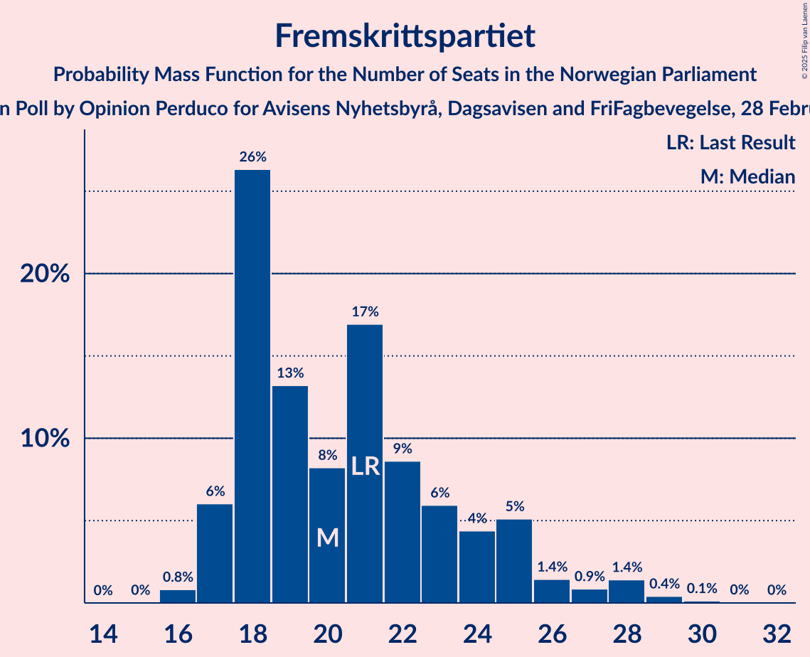
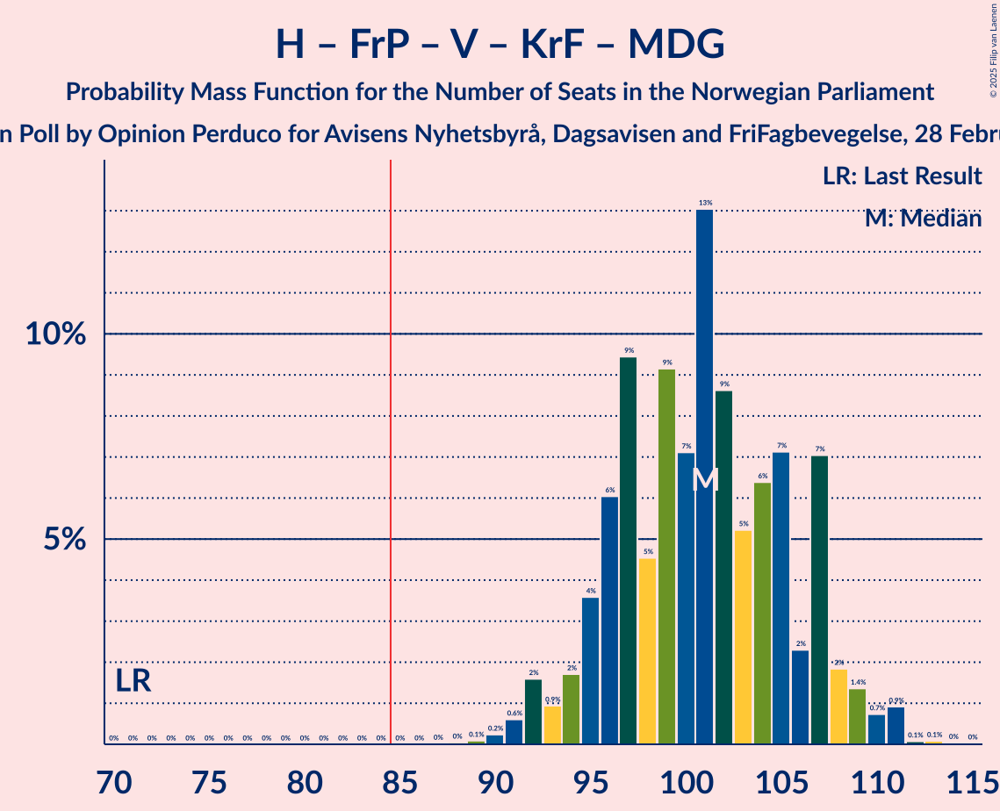

# Opinion Poll by Opinion Perduco for Avisens Nyhetsbyrå, Dagsavisen and FriFagbevegelse, 28 February–6 March 2023

<a href="#voting-intentions">Voting Intentions</a> | <a href="#seats">Seats</a> | <a href="#coalitions">Coalitions</a> | <a href="#technical-information">Technical Information</a>

## Voting Intentions

### Confidence Intervals

| Party | Last Result | Poll Result | 80% Confidence Interval | 90% Confidence Interval | 95% Confidence Interval | 99% Confidence Interval |
|:-----:|:-----------:|:-----------:|:-----------------------:|:-----------------------:|:-----------------------:|:-----------------------:|
| Høyre | 20.4% | 36.9% | 35.0–38.9% |34.5–39.5% |34.0–40.0% |33.1–40.9% |
| Arbeiderpartiet | 26.2% | 15.5% | 14.1–17.1% |13.7–17.5% |13.4–17.9% |12.8–18.7% |
| Fremskrittspartiet | 11.6% | 12.2% | 11.0–13.6% |10.6–14.0% |10.3–14.4% |9.8–15.1% |
| Sosialistisk Venstreparti | 7.6% | 7.9% | 6.9–9.1% |6.6–9.4% |6.4–9.8% |5.9–10.4% |
| Senterpartiet | 13.5% | 6.2% | 5.3–7.3% |5.1–7.6% |4.9–7.9% |4.5–8.4% |
| Rødt | 4.7% | 5.0% | 4.2–6.0% |4.0–6.3% |3.8–6.6% |3.5–7.1% |
| Venstre | 4.6% | 4.8% | 4.0–5.8% |3.8–6.1% |3.6–6.3% |3.3–6.8% |
| Kristelig Folkeparti | 3.8% | 4.1% | 3.4–5.0% |3.2–5.3% |3.0–5.5% |2.7–6.0% |
| Miljøpartiet De Grønne | 3.9% | 2.4% | 1.9–3.2% |1.7–3.4% |1.6–3.6% |1.4–3.9% |

*Note:* The poll result column reflects the actual value used in the calculations. Published results may vary slightly, and in addition be rounded to fewer digits.

## Seats

### Confidence Intervals

| Party | Last Result | Median | 80% Confidence Interval | 90% Confidence Interval | 95% Confidence Interval | 99% Confidence Interval |
|:-----:|:-----------:|:------:|:-----------------------:|:-----------------------:|:-----------------------:|:-----------------------:|
| <a href="#høyre">Høyre</a> | 36 | 68 | 63–71 |62–72 |61–74 |58–75 |
| <a href="#arbeiderpartiet">Arbeiderpartiet</a> | 48 | 31 | 27–33 |26–33 |25–34 |24–36 |
| <a href="#fremskrittspartiet">Fremskrittspartiet</a> | 21 | 20 | 18–24 |17–25 |17–27 |16–29 |
| <a href="#sosialistisk-venstreparti">Sosialistisk Venstreparti</a> | 13 | 12 | 10–14 |9–15 |9–16 |8–17 |
| <a href="#senterpartiet">Senterpartiet</a> | 28 | 10 | 7–14 |7–14 |7–14 |6–15 |
| <a href="#rødt">Rødt</a> | 8 | 7 | 6–9 |5–10 |1–10 |1–11 |
| <a href="#venstre">Venstre</a> | 8 | 7 | 3–9 |3–9 |2–10 |2–11 |
| <a href="#kristelig-folkeparti">Kristelig Folkeparti</a> | 3 | 6 | 2–7 |2–8 |2–8 |1–9 |
| <a href="#miljøpartiet-de-grønne">Miljøpartiet De Grønne</a> | 3 | 1 | 1–2 |0–2 |0–2 |0–3 |

### Høyre

*For a full overview of the results for this party, see the [Høyre](party-høyre.html) page.*

| Number of Seats | Probability | Accumulated | Special Marks |
|:---------------:|:-----------:|:-----------:|:-------------:|
| 36 | 0% | 100% | Last Result |
| 37 | 0% | 100% |  |
| 38 | 0% | 100% |  |
| 39 | 0% | 100% |  |
| 40 | 0% | 100% |  |
| 41 | 0% | 100% |  |
| 42 | 0% | 100% |  |
| 43 | 0% | 100% |  |
| 44 | 0% | 100% |  |
| 45 | 0% | 100% |  |
| 46 | 0% | 100% |  |
| 47 | 0% | 100% |  |
| 48 | 0% | 100% |  |
| 49 | 0% | 100% |  |
| 50 | 0% | 100% |  |
| 51 | 0% | 100% |  |
| 52 | 0% | 100% |  |
| 53 | 0% | 100% |  |
| 54 | 0% | 100% |  |
| 55 | 0% | 100% |  |
| 56 | 0.1% | 99.9% |  |
| 57 | 0.3% | 99.8% |  |
| 58 | 0.5% | 99.6% |  |
| 59 | 0.5% | 99.1% |  |
| 60 | 0.7% | 98.6% |  |
| 61 | 1.4% | 98% |  |
| 62 | 3% | 96% |  |
| 63 | 4% | 93% |  |
| 64 | 7% | 89% |  |
| 65 | 8% | 82% |  |
| 66 | 9% | 74% |  |
| 67 | 13% | 65% |  |
| 68 | 13% | 52% | Median |
| 69 | 18% | 39% |  |
| 70 | 5% | 21% |  |
| 71 | 9% | 16% |  |
| 72 | 3% | 8% |  |
| 73 | 2% | 5% |  |
| 74 | 1.5% | 3% |  |
| 75 | 1.0% | 1.4% |  |
| 76 | 0.3% | 0.4% |  |
| 77 | 0.1% | 0.1% |  |
| 78 | 0.1% | 0.1% |  |
| 79 | 0% | 0% |  |

### Arbeiderpartiet

*For a full overview of the results for this party, see the [Arbeiderpartiet](party-arbeiderpartiet.html) page.*

| Number of Seats | Probability | Accumulated | Special Marks |
|:---------------:|:-----------:|:-----------:|:-------------:|
| 21 | 0% | 100% |  |
| 22 | 0.1% | 99.9% |  |
| 23 | 0.3% | 99.9% |  |
| 24 | 1.1% | 99.5% |  |
| 25 | 1.1% | 98% |  |
| 26 | 4% | 97% |  |
| 27 | 6% | 93% |  |
| 28 | 11% | 87% |  |
| 29 | 7% | 76% |  |
| 30 | 11% | 69% |  |
| 31 | 10% | 58% | Median |
| 32 | 18% | 48% |  |
| 33 | 28% | 31% |  |
| 34 | 1.3% | 3% |  |
| 35 | 0.8% | 2% |  |
| 36 | 0.4% | 0.8% |  |
| 37 | 0.3% | 0.4% |  |
| 38 | 0.1% | 0.1% |  |
| 39 | 0% | 0% |  |
| 40 | 0% | 0% |  |
| 41 | 0% | 0% |  |
| 42 | 0% | 0% |  |
| 43 | 0% | 0% |  |
| 44 | 0% | 0% |  |
| 45 | 0% | 0% |  |
| 46 | 0% | 0% |  |
| 47 | 0% | 0% |  |
| 48 | 0% | 0% | Last Result |

### Fremskrittspartiet

*For a full overview of the results for this party, see the [Fremskrittspartiet](party-fremskrittspartiet.html) page.*

| Number of Seats | Probability | Accumulated | Special Marks |
|:---------------:|:-----------:|:-----------:|:-------------:|
| 16 | 0.8% | 100% |  |
| 17 | 6% | 99.1% |  |
| 18 | 26% | 93% |  |
| 19 | 13% | 67% |  |
| 20 | 8% | 54% | Median |
| 21 | 17% | 45% | Last Result |
| 22 | 9% | 28% |  |
| 23 | 6% | 20% |  |
| 24 | 4% | 14% |  |
| 25 | 5% | 9% |  |
| 26 | 1.4% | 4% |  |
| 27 | 0.9% | 3% |  |
| 28 | 1.4% | 2% |  |
| 29 | 0.4% | 0.6% |  |
| 30 | 0.1% | 0.2% |  |
| 31 | 0% | 0.1% |  |
| 32 | 0% | 0% |  |

### Sosialistisk Venstreparti

*For a full overview of the results for this party, see the [Sosialistisk Venstreparti](party-sosialistiskvenstreparti.html) page.*

| Number of Seats | Probability | Accumulated | Special Marks |
|:---------------:|:-----------:|:-----------:|:-------------:|
| 8 | 0.7% | 100% |  |
| 9 | 8% | 99.2% |  |
| 10 | 11% | 91% |  |
| 11 | 22% | 80% |  |
| 12 | 21% | 58% | Median |
| 13 | 19% | 37% | Last Result |
| 14 | 10% | 18% |  |
| 15 | 5% | 8% |  |
| 16 | 2% | 3% |  |
| 17 | 0.5% | 0.9% |  |
| 18 | 0.2% | 0.3% |  |
| 19 | 0.1% | 0.1% |  |
| 20 | 0% | 0% |  |

### Senterpartiet

*For a full overview of the results for this party, see the [Senterpartiet](party-senterpartiet.html) page.*

| Number of Seats | Probability | Accumulated | Special Marks |
|:---------------:|:-----------:|:-----------:|:-------------:|
| 5 | 0% | 100% |  |
| 6 | 2% | 99.9% |  |
| 7 | 11% | 98% |  |
| 8 | 15% | 87% |  |
| 9 | 16% | 73% |  |
| 10 | 16% | 56% | Median |
| 11 | 8% | 41% |  |
| 12 | 10% | 33% |  |
| 13 | 13% | 23% |  |
| 14 | 9% | 10% |  |
| 15 | 0.4% | 0.6% |  |
| 16 | 0.1% | 0.2% |  |
| 17 | 0% | 0% |  |
| 18 | 0% | 0% |  |
| 19 | 0% | 0% |  |
| 20 | 0% | 0% |  |
| 21 | 0% | 0% |  |
| 22 | 0% | 0% |  |
| 23 | 0% | 0% |  |
| 24 | 0% | 0% |  |
| 25 | 0% | 0% |  |
| 26 | 0% | 0% |  |
| 27 | 0% | 0% |  |
| 28 | 0% | 0% | Last Result |

### Rødt

*For a full overview of the results for this party, see the [Rødt](party-rødt.html) page.*

| Number of Seats | Probability | Accumulated | Special Marks |
|:---------------:|:-----------:|:-----------:|:-------------:|
| 1 | 5% | 100% |  |
| 2 | 0% | 95% |  |
| 3 | 0% | 95% |  |
| 4 | 0% | 95% |  |
| 5 | 0.4% | 95% |  |
| 6 | 16% | 95% |  |
| 7 | 34% | 78% | Median |
| 8 | 24% | 44% | Last Result |
| 9 | 12% | 20% |  |
| 10 | 7% | 8% |  |
| 11 | 1.4% | 2% |  |
| 12 | 0.2% | 0.2% |  |
| 13 | 0% | 0% |  |

### Venstre

*For a full overview of the results for this party, see the [Venstre](party-venstre.html) page.*

| Number of Seats | Probability | Accumulated | Special Marks |
|:---------------:|:-----------:|:-----------:|:-------------:|
| 2 | 3% | 100% |  |
| 3 | 7% | 97% |  |
| 4 | 0% | 90% |  |
| 5 | 0.1% | 90% |  |
| 6 | 16% | 90% |  |
| 7 | 40% | 74% | Median |
| 8 | 21% | 34% | Last Result |
| 9 | 10% | 13% |  |
| 10 | 3% | 4% |  |
| 11 | 0.6% | 0.8% |  |
| 12 | 0.1% | 0.1% |  |
| 13 | 0% | 0% |  |

### Kristelig Folkeparti

*For a full overview of the results for this party, see the [Kristelig Folkeparti](party-kristeligfolkeparti.html) page.*

| Number of Seats | Probability | Accumulated | Special Marks |
|:---------------:|:-----------:|:-----------:|:-------------:|
| 1 | 2% | 100% |  |
| 2 | 11% | 98% |  |
| 3 | 27% | 87% | Last Result |
| 4 | 0% | 60% |  |
| 5 | 0.2% | 60% |  |
| 6 | 31% | 60% | Median |
| 7 | 21% | 29% |  |
| 8 | 6% | 8% |  |
| 9 | 2% | 2% |  |
| 10 | 0.3% | 0.3% |  |
| 11 | 0% | 0% |  |

### Miljøpartiet De Grønne

*For a full overview of the results for this party, see the [Miljøpartiet De Grønne](party-miljøpartietdegrønne.html) page.*

| Number of Seats | Probability | Accumulated | Special Marks |
|:---------------:|:-----------:|:-----------:|:-------------:|
| 0 | 6% | 100% |  |
| 1 | 80% | 94% | Median |
| 2 | 13% | 14% |  |
| 3 | 0.7% | 1.0% | Last Result |
| 4 | 0% | 0.3% |  |
| 5 | 0% | 0.3% |  |
| 6 | 0.2% | 0.2% |  |
| 7 | 0% | 0.1% |  |
| 8 | 0% | 0% |  |

## Coalitions

### Confidence Intervals

| Coalition | Last Result | Median | Majority? | 80% Confidence Interval | 90% Confidence Interval | 95% Confidence Interval | 99% Confidence Interval |
|:---------:|:-----------:|:------:|:---------:|:-----------------------:|:-----------------------:|:-----------------------:|:-----------------------:|
| Høyre – Fremskrittspartiet – Senterpartiet – Venstre – Kristelig Folkeparti | 96 | 110 | 100% | 105–115 | 104–117 | 103–118 | 101–120 |
| Høyre – Fremskrittspartiet – Venstre – Kristelig Folkeparti – Miljøpartiet De Grønne | 71 | 101 | 100% | 96–107 | 94–108 | 92–109 | 91–111 |
| Høyre – Fremskrittspartiet – Venstre – Kristelig Folkeparti | 68 | 100 | 100% | 95–106 | 93–106 | 92–108 | 90–110 |
| Høyre – Fremskrittspartiet – Venstre | 65 | 94 | 99.6% | 90–100 | 89–101 | 87–102 | 85–104 |
| Høyre – Fremskrittspartiet | 57 | 88 | 82% | 83–93 | 82–94 | 81–95 | 78–98 |
| Høyre – Venstre – Kristelig Folkeparti | 47 | 80 | 9% | 74–84 | 73–85 | 71–86 | 69–89 |
| Arbeiderpartiet – Sosialistisk Venstreparti – Senterpartiet – Rødt – Miljøpartiet De Grønne | 100 | 61 | 0% | 55–66 | 55–67 | 54–69 | 51–71 |
| Arbeiderpartiet – Sosialistisk Venstreparti – Senterpartiet – Rødt | 97 | 60 | 0% | 54–65 | 54–66 | 53–68 | 50–70 |
| Arbeiderpartiet – Sosialistisk Venstreparti – Senterpartiet – Kristelig Folkeparti – Miljøpartiet De Grønne | 95 | 59 | 0% | 54–64 | 53–65 | 52–67 | 50–69 |
| Arbeiderpartiet – Sosialistisk Venstreparti – Senterpartiet – Miljøpartiet De Grønne | 92 | 54 | 0% | 49–58 | 48–59 | 48–61 | 46–63 |
| Arbeiderpartiet – Sosialistisk Venstreparti – Senterpartiet | 89 | 53 | 0% | 48–57 | 47–58 | 47–60 | 45–61 |
| Arbeiderpartiet – Sosialistisk Venstreparti – Rødt – Miljøpartiet De Grønne | 72 | 51 | 0% | 46–55 | 44–56 | 44–57 | 42–59 |
| Arbeiderpartiet – Senterpartiet – Kristelig Folkeparti – Miljøpartiet De Grønne | 82 | 47 | 0% | 42–52 | 41–53 | 40–54 | 38–55 |
| Arbeiderpartiet – Senterpartiet – Kristelig Folkeparti | 79 | 46 | 0% | 41–51 | 40–52 | 39–53 | 37–54 |
| Arbeiderpartiet – Sosialistisk Venstreparti | 61 | 43 | 0% | 38–46 | 37–47 | 36–48 | 35–49 |
| Arbeiderpartiet – Senterpartiet | 76 | 41 | 0% | 37–45 | 35–46 | 35–46 | 33–48 |
| Senterpartiet – Venstre – Kristelig Folkeparti | 39 | 22 | 0% | 18–27 | 17–28 | 16–28 | 15–30 |

### Høyre – Fremskrittspartiet – Senterpartiet – Venstre – Kristelig Folkeparti

| Number of Seats | Probability | Accumulated | Special Marks |
|:---------------:|:-----------:|:-----------:|:-------------:|
| 96 | 0% | 100% | Last Result |
| 97 | 0% | 100% |  |
| 98 | 0.1% | 100% |  |
| 99 | 0.1% | 99.9% |  |
| 100 | 0.1% | 99.9% |  |
| 101 | 0.5% | 99.8% |  |
| 102 | 1.1% | 99.3% |  |
| 103 | 1.4% | 98% |  |
| 104 | 4% | 97% |  |
| 105 | 9% | 93% |  |
| 106 | 3% | 84% |  |
| 107 | 9% | 81% |  |
| 108 | 6% | 72% |  |
| 109 | 10% | 66% |  |
| 110 | 12% | 55% |  |
| 111 | 11% | 43% | Median |
| 112 | 7% | 33% |  |
| 113 | 9% | 26% |  |
| 114 | 3% | 17% |  |
| 115 | 4% | 14% |  |
| 116 | 2% | 10% |  |
| 117 | 4% | 8% |  |
| 118 | 2% | 3% |  |
| 119 | 0.6% | 1.3% |  |
| 120 | 0.4% | 0.8% |  |
| 121 | 0.2% | 0.3% |  |
| 122 | 0% | 0.1% |  |
| 123 | 0% | 0.1% |  |
| 124 | 0% | 0.1% |  |
| 125 | 0% | 0% |  |

### Høyre – Fremskrittspartiet – Venstre – Kristelig Folkeparti – Miljøpartiet De Grønne

| Number of Seats | Probability | Accumulated | Special Marks |
|:---------------:|:-----------:|:-----------:|:-------------:|
| 71 | 0% | 100% | Last Result |
| 72 | 0% | 100% |  |
| 73 | 0% | 100% |  |
| 74 | 0% | 100% |  |
| 75 | 0% | 100% |  |
| 76 | 0% | 100% |  |
| 77 | 0% | 100% |  |
| 78 | 0% | 100% |  |
| 79 | 0% | 100% |  |
| 80 | 0% | 100% |  |
| 81 | 0% | 100% |  |
| 82 | 0% | 100% |  |
| 83 | 0% | 100% |  |
| 84 | 0% | 100% |  |
| 85 | 0% | 100% | Majority |
| 86 | 0% | 100% |  |
| 87 | 0% | 100% |  |
| 88 | 0% | 100% |  |
| 89 | 0.1% | 99.9% |  |
| 90 | 0.2% | 99.8% |  |
| 91 | 0.6% | 99.6% |  |
| 92 | 2% | 99.0% |  |
| 93 | 0.9% | 97% |  |
| 94 | 2% | 96% |  |
| 95 | 4% | 95% |  |
| 96 | 6% | 91% |  |
| 97 | 9% | 85% |  |
| 98 | 5% | 76% |  |
| 99 | 9% | 71% |  |
| 100 | 7% | 62% |  |
| 101 | 13% | 55% |  |
| 102 | 9% | 42% | Median |
| 103 | 5% | 33% |  |
| 104 | 6% | 28% |  |
| 105 | 7% | 22% |  |
| 106 | 2% | 14% |  |
| 107 | 7% | 12% |  |
| 108 | 2% | 5% |  |
| 109 | 1.4% | 3% |  |
| 110 | 0.7% | 2% |  |
| 111 | 0.9% | 1.2% |  |
| 112 | 0.1% | 0.2% |  |
| 113 | 0.1% | 0.2% |  |
| 114 | 0% | 0.1% |  |
| 115 | 0% | 0% |  |

### Høyre – Fremskrittspartiet – Venstre – Kristelig Folkeparti

| Number of Seats | Probability | Accumulated | Special Marks |
|:---------------:|:-----------:|:-----------:|:-------------:|
| 68 | 0% | 100% | Last Result |
| 69 | 0% | 100% |  |
| 70 | 0% | 100% |  |
| 71 | 0% | 100% |  |
| 72 | 0% | 100% |  |
| 73 | 0% | 100% |  |
| 74 | 0% | 100% |  |
| 75 | 0% | 100% |  |
| 76 | 0% | 100% |  |
| 77 | 0% | 100% |  |
| 78 | 0% | 100% |  |
| 79 | 0% | 100% |  |
| 80 | 0% | 100% |  |
| 81 | 0% | 100% |  |
| 82 | 0% | 100% |  |
| 83 | 0% | 100% |  |
| 84 | 0% | 100% |  |
| 85 | 0% | 100% | Majority |
| 86 | 0% | 100% |  |
| 87 | 0% | 100% |  |
| 88 | 0.2% | 99.9% |  |
| 89 | 0.1% | 99.7% |  |
| 90 | 0.7% | 99.6% |  |
| 91 | 0.8% | 98.9% |  |
| 92 | 2% | 98% |  |
| 93 | 2% | 96% |  |
| 94 | 3% | 95% |  |
| 95 | 7% | 91% |  |
| 96 | 10% | 85% |  |
| 97 | 4% | 75% |  |
| 98 | 9% | 70% |  |
| 99 | 8% | 61% |  |
| 100 | 12% | 53% |  |
| 101 | 8% | 41% | Median |
| 102 | 5% | 33% |  |
| 103 | 8% | 28% |  |
| 104 | 7% | 20% |  |
| 105 | 2% | 14% |  |
| 106 | 7% | 12% |  |
| 107 | 2% | 4% |  |
| 108 | 0.9% | 3% |  |
| 109 | 0.6% | 2% |  |
| 110 | 0.8% | 1.1% |  |
| 111 | 0.1% | 0.2% |  |
| 112 | 0.1% | 0.2% |  |
| 113 | 0% | 0.1% |  |
| 114 | 0% | 0% |  |

### Høyre – Fremskrittspartiet – Venstre

| Number of Seats | Probability | Accumulated | Special Marks |
|:---------------:|:-----------:|:-----------:|:-------------:|
| 65 | 0% | 100% | Last Result |
| 66 | 0% | 100% |  |
| 67 | 0% | 100% |  |
| 68 | 0% | 100% |  |
| 69 | 0% | 100% |  |
| 70 | 0% | 100% |  |
| 71 | 0% | 100% |  |
| 72 | 0% | 100% |  |
| 73 | 0% | 100% |  |
| 74 | 0% | 100% |  |
| 75 | 0% | 100% |  |
| 76 | 0% | 100% |  |
| 77 | 0% | 100% |  |
| 78 | 0% | 100% |  |
| 79 | 0% | 100% |  |
| 80 | 0% | 100% |  |
| 81 | 0% | 100% |  |
| 82 | 0.1% | 100% |  |
| 83 | 0.1% | 99.9% |  |
| 84 | 0.2% | 99.8% |  |
| 85 | 0.5% | 99.6% | Majority |
| 86 | 0.6% | 99.1% |  |
| 87 | 1.0% | 98% |  |
| 88 | 2% | 97% |  |
| 89 | 2% | 95% |  |
| 90 | 5% | 93% |  |
| 91 | 9% | 89% |  |
| 92 | 9% | 79% |  |
| 93 | 14% | 70% |  |
| 94 | 9% | 56% |  |
| 95 | 7% | 46% | Median |
| 96 | 3% | 39% |  |
| 97 | 10% | 36% |  |
| 98 | 4% | 25% |  |
| 99 | 6% | 21% |  |
| 100 | 7% | 15% |  |
| 101 | 4% | 8% |  |
| 102 | 2% | 4% |  |
| 103 | 1.1% | 2% |  |
| 104 | 0.2% | 0.7% |  |
| 105 | 0.2% | 0.5% |  |
| 106 | 0.1% | 0.3% |  |
| 107 | 0.2% | 0.2% |  |
| 108 | 0% | 0.1% |  |
| 109 | 0% | 0% |  |

### Høyre – Fremskrittspartiet

| Number of Seats | Probability | Accumulated | Special Marks |
|:---------------:|:-----------:|:-----------:|:-------------:|
| 57 | 0% | 100% | Last Result |
| 58 | 0% | 100% |  |
| 59 | 0% | 100% |  |
| 60 | 0% | 100% |  |
| 61 | 0% | 100% |  |
| 62 | 0% | 100% |  |
| 63 | 0% | 100% |  |
| 64 | 0% | 100% |  |
| 65 | 0% | 100% |  |
| 66 | 0% | 100% |  |
| 67 | 0% | 100% |  |
| 68 | 0% | 100% |  |
| 69 | 0% | 100% |  |
| 70 | 0% | 100% |  |
| 71 | 0% | 100% |  |
| 72 | 0% | 100% |  |
| 73 | 0% | 100% |  |
| 74 | 0% | 100% |  |
| 75 | 0% | 100% |  |
| 76 | 0.1% | 100% |  |
| 77 | 0.2% | 99.9% |  |
| 78 | 0.6% | 99.7% |  |
| 79 | 0.8% | 99.2% |  |
| 80 | 0.7% | 98% |  |
| 81 | 2% | 98% |  |
| 82 | 2% | 96% |  |
| 83 | 4% | 94% |  |
| 84 | 7% | 89% |  |
| 85 | 12% | 82% | Majority |
| 86 | 15% | 70% |  |
| 87 | 5% | 56% |  |
| 88 | 9% | 50% | Median |
| 89 | 5% | 41% |  |
| 90 | 13% | 37% |  |
| 91 | 4% | 24% |  |
| 92 | 6% | 20% |  |
| 93 | 7% | 14% |  |
| 94 | 3% | 7% |  |
| 95 | 2% | 4% |  |
| 96 | 0.9% | 2% |  |
| 97 | 0.2% | 0.7% |  |
| 98 | 0.2% | 0.5% |  |
| 99 | 0.1% | 0.4% |  |
| 100 | 0% | 0.2% |  |
| 101 | 0.1% | 0.2% |  |
| 102 | 0% | 0% |  |

### Høyre – Venstre – Kristelig Folkeparti

| Number of Seats | Probability | Accumulated | Special Marks |
|:---------------:|:-----------:|:-----------:|:-------------:|
| 47 | 0% | 100% | Last Result |
| 48 | 0% | 100% |  |
| 49 | 0% | 100% |  |
| 50 | 0% | 100% |  |
| 51 | 0% | 100% |  |
| 52 | 0% | 100% |  |
| 53 | 0% | 100% |  |
| 54 | 0% | 100% |  |
| 55 | 0% | 100% |  |
| 56 | 0% | 100% |  |
| 57 | 0% | 100% |  |
| 58 | 0% | 100% |  |
| 59 | 0% | 100% |  |
| 60 | 0% | 100% |  |
| 61 | 0% | 100% |  |
| 62 | 0% | 100% |  |
| 63 | 0% | 100% |  |
| 64 | 0% | 100% |  |
| 65 | 0% | 100% |  |
| 66 | 0.1% | 100% |  |
| 67 | 0.1% | 99.9% |  |
| 68 | 0.3% | 99.8% |  |
| 69 | 0.4% | 99.5% |  |
| 70 | 0.5% | 99.1% |  |
| 71 | 1.3% | 98.6% |  |
| 72 | 1.0% | 97% |  |
| 73 | 3% | 96% |  |
| 74 | 5% | 93% |  |
| 75 | 3% | 88% |  |
| 76 | 5% | 85% |  |
| 77 | 10% | 80% |  |
| 78 | 10% | 70% |  |
| 79 | 8% | 60% |  |
| 80 | 11% | 52% |  |
| 81 | 10% | 40% | Median |
| 82 | 11% | 31% |  |
| 83 | 5% | 20% |  |
| 84 | 6% | 15% |  |
| 85 | 5% | 9% | Majority |
| 86 | 2% | 4% |  |
| 87 | 0.8% | 2% |  |
| 88 | 0.6% | 1.2% |  |
| 89 | 0.3% | 0.6% |  |
| 90 | 0.1% | 0.2% |  |
| 91 | 0.1% | 0.1% |  |
| 92 | 0% | 0% |  |

### Arbeiderpartiet – Sosialistisk Venstreparti – Senterpartiet – Rødt – Miljøpartiet De Grønne

| Number of Seats | Probability | Accumulated | Special Marks |
|:---------------:|:-----------:|:-----------:|:-------------:|
| 49 | 0% | 100% |  |
| 50 | 0.3% | 99.9% |  |
| 51 | 0.4% | 99.6% |  |
| 52 | 0.4% | 99.3% |  |
| 53 | 1.0% | 98.8% |  |
| 54 | 1.1% | 98% |  |
| 55 | 7% | 97% |  |
| 56 | 2% | 90% |  |
| 57 | 7% | 87% |  |
| 58 | 8% | 80% |  |
| 59 | 7% | 73% |  |
| 60 | 4% | 66% |  |
| 61 | 12% | 62% | Median |
| 62 | 11% | 50% |  |
| 63 | 11% | 39% |  |
| 64 | 7% | 28% |  |
| 65 | 7% | 20% |  |
| 66 | 6% | 13% |  |
| 67 | 3% | 8% |  |
| 68 | 2% | 5% |  |
| 69 | 1.0% | 3% |  |
| 70 | 0.6% | 1.5% |  |
| 71 | 0.6% | 0.9% |  |
| 72 | 0.2% | 0.3% |  |
| 73 | 0.1% | 0.1% |  |
| 74 | 0% | 0% |  |
| 75 | 0% | 0% |  |
| 76 | 0% | 0% |  |
| 77 | 0% | 0% |  |
| 78 | 0% | 0% |  |
| 79 | 0% | 0% |  |
| 80 | 0% | 0% |  |
| 81 | 0% | 0% |  |
| 82 | 0% | 0% |  |
| 83 | 0% | 0% |  |
| 84 | 0% | 0% |  |
| 85 | 0% | 0% | Majority |
| 86 | 0% | 0% |  |
| 87 | 0% | 0% |  |
| 88 | 0% | 0% |  |
| 89 | 0% | 0% |  |
| 90 | 0% | 0% |  |
| 91 | 0% | 0% |  |
| 92 | 0% | 0% |  |
| 93 | 0% | 0% |  |
| 94 | 0% | 0% |  |
| 95 | 0% | 0% |  |
| 96 | 0% | 0% |  |
| 97 | 0% | 0% |  |
| 98 | 0% | 0% |  |
| 99 | 0% | 0% |  |
| 100 | 0% | 0% | Last Result |

### Arbeiderpartiet – Sosialistisk Venstreparti – Senterpartiet – Rødt

| Number of Seats | Probability | Accumulated | Special Marks |
|:---------------:|:-----------:|:-----------:|:-------------:|
| 48 | 0% | 100% |  |
| 49 | 0.3% | 99.9% |  |
| 50 | 0.4% | 99.6% |  |
| 51 | 0.4% | 99.2% |  |
| 52 | 1.1% | 98.8% |  |
| 53 | 2% | 98% |  |
| 54 | 7% | 96% |  |
| 55 | 3% | 89% |  |
| 56 | 6% | 86% |  |
| 57 | 7% | 80% |  |
| 58 | 8% | 73% |  |
| 59 | 5% | 65% |  |
| 60 | 12% | 60% | Median |
| 61 | 11% | 48% |  |
| 62 | 11% | 37% |  |
| 63 | 6% | 26% |  |
| 64 | 6% | 20% |  |
| 65 | 6% | 13% |  |
| 66 | 3% | 7% |  |
| 67 | 1.4% | 5% |  |
| 68 | 2% | 3% |  |
| 69 | 0.6% | 1.5% |  |
| 70 | 0.7% | 0.9% |  |
| 71 | 0.1% | 0.2% |  |
| 72 | 0% | 0.1% |  |
| 73 | 0% | 0% |  |
| 74 | 0% | 0% |  |
| 75 | 0% | 0% |  |
| 76 | 0% | 0% |  |
| 77 | 0% | 0% |  |
| 78 | 0% | 0% |  |
| 79 | 0% | 0% |  |
| 80 | 0% | 0% |  |
| 81 | 0% | 0% |  |
| 82 | 0% | 0% |  |
| 83 | 0% | 0% |  |
| 84 | 0% | 0% |  |
| 85 | 0% | 0% | Majority |
| 86 | 0% | 0% |  |
| 87 | 0% | 0% |  |
| 88 | 0% | 0% |  |
| 89 | 0% | 0% |  |
| 90 | 0% | 0% |  |
| 91 | 0% | 0% |  |
| 92 | 0% | 0% |  |
| 93 | 0% | 0% |  |
| 94 | 0% | 0% |  |
| 95 | 0% | 0% |  |
| 96 | 0% | 0% |  |
| 97 | 0% | 0% | Last Result |

### Arbeiderpartiet – Sosialistisk Venstreparti – Senterpartiet – Kristelig Folkeparti – Miljøpartiet De Grønne

| Number of Seats | Probability | Accumulated | Special Marks |
|:---------------:|:-----------:|:-----------:|:-------------:|
| 47 | 0% | 100% |  |
| 48 | 0.1% | 99.9% |  |
| 49 | 0.2% | 99.9% |  |
| 50 | 0.5% | 99.6% |  |
| 51 | 0.6% | 99.1% |  |
| 52 | 2% | 98.6% |  |
| 53 | 6% | 97% |  |
| 54 | 8% | 91% |  |
| 55 | 6% | 83% |  |
| 56 | 5% | 78% |  |
| 57 | 5% | 73% |  |
| 58 | 12% | 68% |  |
| 59 | 8% | 56% |  |
| 60 | 11% | 48% | Median |
| 61 | 15% | 37% |  |
| 62 | 5% | 22% |  |
| 63 | 6% | 17% |  |
| 64 | 5% | 11% |  |
| 65 | 2% | 6% |  |
| 66 | 1.4% | 4% |  |
| 67 | 1.0% | 3% |  |
| 68 | 0.9% | 2% |  |
| 69 | 0.3% | 0.6% |  |
| 70 | 0.2% | 0.4% |  |
| 71 | 0.1% | 0.2% |  |
| 72 | 0% | 0.1% |  |
| 73 | 0% | 0% |  |
| 74 | 0% | 0% |  |
| 75 | 0% | 0% |  |
| 76 | 0% | 0% |  |
| 77 | 0% | 0% |  |
| 78 | 0% | 0% |  |
| 79 | 0% | 0% |  |
| 80 | 0% | 0% |  |
| 81 | 0% | 0% |  |
| 82 | 0% | 0% |  |
| 83 | 0% | 0% |  |
| 84 | 0% | 0% |  |
| 85 | 0% | 0% | Majority |
| 86 | 0% | 0% |  |
| 87 | 0% | 0% |  |
| 88 | 0% | 0% |  |
| 89 | 0% | 0% |  |
| 90 | 0% | 0% |  |
| 91 | 0% | 0% |  |
| 92 | 0% | 0% |  |
| 93 | 0% | 0% |  |
| 94 | 0% | 0% |  |
| 95 | 0% | 0% | Last Result |

### Arbeiderpartiet – Sosialistisk Venstreparti – Senterpartiet – Miljøpartiet De Grønne

| Number of Seats | Probability | Accumulated | Special Marks |
|:---------------:|:-----------:|:-----------:|:-------------:|
| 43 | 0% | 100% |  |
| 44 | 0.2% | 99.9% |  |
| 45 | 0.2% | 99.7% |  |
| 46 | 1.1% | 99.6% |  |
| 47 | 0.7% | 98% |  |
| 48 | 5% | 98% |  |
| 49 | 5% | 93% |  |
| 50 | 7% | 87% |  |
| 51 | 4% | 80% |  |
| 52 | 10% | 76% |  |
| 53 | 7% | 66% |  |
| 54 | 11% | 59% | Median |
| 55 | 14% | 48% |  |
| 56 | 12% | 34% |  |
| 57 | 8% | 22% |  |
| 58 | 7% | 14% |  |
| 59 | 2% | 7% |  |
| 60 | 2% | 5% |  |
| 61 | 1.3% | 3% |  |
| 62 | 0.7% | 1.2% |  |
| 63 | 0.3% | 0.5% |  |
| 64 | 0.2% | 0.2% |  |
| 65 | 0.1% | 0.1% |  |
| 66 | 0% | 0% |  |
| 67 | 0% | 0% |  |
| 68 | 0% | 0% |  |
| 69 | 0% | 0% |  |
| 70 | 0% | 0% |  |
| 71 | 0% | 0% |  |
| 72 | 0% | 0% |  |
| 73 | 0% | 0% |  |
| 74 | 0% | 0% |  |
| 75 | 0% | 0% |  |
| 76 | 0% | 0% |  |
| 77 | 0% | 0% |  |
| 78 | 0% | 0% |  |
| 79 | 0% | 0% |  |
| 80 | 0% | 0% |  |
| 81 | 0% | 0% |  |
| 82 | 0% | 0% |  |
| 83 | 0% | 0% |  |
| 84 | 0% | 0% |  |
| 85 | 0% | 0% | Majority |
| 86 | 0% | 0% |  |
| 87 | 0% | 0% |  |
| 88 | 0% | 0% |  |
| 89 | 0% | 0% |  |
| 90 | 0% | 0% |  |
| 91 | 0% | 0% |  |
| 92 | 0% | 0% | Last Result |

### Arbeiderpartiet – Sosialistisk Venstreparti – Senterpartiet

| Number of Seats | Probability | Accumulated | Special Marks |
|:---------------:|:-----------:|:-----------:|:-------------:|
| 42 | 0.1% | 100% |  |
| 43 | 0.2% | 99.9% |  |
| 44 | 0.2% | 99.7% |  |
| 45 | 1.3% | 99.5% |  |
| 46 | 0.5% | 98% |  |
| 47 | 6% | 98% |  |
| 48 | 5% | 92% |  |
| 49 | 7% | 87% |  |
| 50 | 5% | 80% |  |
| 51 | 10% | 75% |  |
| 52 | 6% | 64% |  |
| 53 | 11% | 58% | Median |
| 54 | 14% | 47% |  |
| 55 | 14% | 33% |  |
| 56 | 5% | 19% |  |
| 57 | 7% | 14% |  |
| 58 | 2% | 7% |  |
| 59 | 1.3% | 4% |  |
| 60 | 2% | 3% |  |
| 61 | 0.7% | 1.1% |  |
| 62 | 0.3% | 0.4% |  |
| 63 | 0.1% | 0.1% |  |
| 64 | 0% | 0.1% |  |
| 65 | 0% | 0% |  |
| 66 | 0% | 0% |  |
| 67 | 0% | 0% |  |
| 68 | 0% | 0% |  |
| 69 | 0% | 0% |  |
| 70 | 0% | 0% |  |
| 71 | 0% | 0% |  |
| 72 | 0% | 0% |  |
| 73 | 0% | 0% |  |
| 74 | 0% | 0% |  |
| 75 | 0% | 0% |  |
| 76 | 0% | 0% |  |
| 77 | 0% | 0% |  |
| 78 | 0% | 0% |  |
| 79 | 0% | 0% |  |
| 80 | 0% | 0% |  |
| 81 | 0% | 0% |  |
| 82 | 0% | 0% |  |
| 83 | 0% | 0% |  |
| 84 | 0% | 0% |  |
| 85 | 0% | 0% | Majority |
| 86 | 0% | 0% |  |
| 87 | 0% | 0% |  |
| 88 | 0% | 0% |  |
| 89 | 0% | 0% | Last Result |

### Arbeiderpartiet – Sosialistisk Venstreparti – Rødt – Miljøpartiet De Grønne

| Number of Seats | Probability | Accumulated | Special Marks |
|:---------------:|:-----------:|:-----------:|:-------------:|
| 40 | 0.2% | 100% |  |
| 41 | 0.1% | 99.8% |  |
| 42 | 0.6% | 99.7% |  |
| 43 | 1.2% | 99.1% |  |
| 44 | 4% | 98% |  |
| 45 | 1.3% | 93% |  |
| 46 | 6% | 92% |  |
| 47 | 4% | 87% |  |
| 48 | 7% | 83% |  |
| 49 | 8% | 76% |  |
| 50 | 11% | 68% |  |
| 51 | 10% | 58% | Median |
| 52 | 10% | 48% |  |
| 53 | 14% | 38% |  |
| 54 | 9% | 24% |  |
| 55 | 5% | 15% |  |
| 56 | 5% | 9% |  |
| 57 | 2% | 4% |  |
| 58 | 1.0% | 2% |  |
| 59 | 0.9% | 1.3% |  |
| 60 | 0.3% | 0.4% |  |
| 61 | 0.1% | 0.2% |  |
| 62 | 0.1% | 0.1% |  |
| 63 | 0% | 0% |  |
| 64 | 0% | 0% |  |
| 65 | 0% | 0% |  |
| 66 | 0% | 0% |  |
| 67 | 0% | 0% |  |
| 68 | 0% | 0% |  |
| 69 | 0% | 0% |  |
| 70 | 0% | 0% |  |
| 71 | 0% | 0% |  |
| 72 | 0% | 0% | Last Result |

### Arbeiderpartiet – Senterpartiet – Kristelig Folkeparti – Miljøpartiet De Grønne

| Number of Seats | Probability | Accumulated | Special Marks |
|:---------------:|:-----------:|:-----------:|:-------------:|
| 36 | 0.1% | 100% |  |
| 37 | 0.3% | 99.9% |  |
| 38 | 0.3% | 99.6% |  |
| 39 | 1.1% | 99.3% |  |
| 40 | 3% | 98% |  |
| 41 | 4% | 95% |  |
| 42 | 6% | 91% |  |
| 43 | 2% | 85% |  |
| 44 | 12% | 83% |  |
| 45 | 4% | 71% |  |
| 46 | 6% | 67% |  |
| 47 | 14% | 60% |  |
| 48 | 9% | 47% | Median |
| 49 | 12% | 38% |  |
| 50 | 9% | 26% |  |
| 51 | 3% | 17% |  |
| 52 | 5% | 13% |  |
| 53 | 5% | 8% |  |
| 54 | 2% | 3% |  |
| 55 | 0.8% | 1.3% |  |
| 56 | 0.3% | 0.4% |  |
| 57 | 0.1% | 0.1% |  |
| 58 | 0% | 0% |  |
| 59 | 0% | 0% |  |
| 60 | 0% | 0% |  |
| 61 | 0% | 0% |  |
| 62 | 0% | 0% |  |
| 63 | 0% | 0% |  |
| 64 | 0% | 0% |  |
| 65 | 0% | 0% |  |
| 66 | 0% | 0% |  |
| 67 | 0% | 0% |  |
| 68 | 0% | 0% |  |
| 69 | 0% | 0% |  |
| 70 | 0% | 0% |  |
| 71 | 0% | 0% |  |
| 72 | 0% | 0% |  |
| 73 | 0% | 0% |  |
| 74 | 0% | 0% |  |
| 75 | 0% | 0% |  |
| 76 | 0% | 0% |  |
| 77 | 0% | 0% |  |
| 78 | 0% | 0% |  |
| 79 | 0% | 0% |  |
| 80 | 0% | 0% |  |
| 81 | 0% | 0% |  |
| 82 | 0% | 0% | Last Result |

### Arbeiderpartiet – Senterpartiet – Kristelig Folkeparti

| Number of Seats | Probability | Accumulated | Special Marks |
|:---------------:|:-----------:|:-----------:|:-------------:|
| 34 | 0% | 100% |  |
| 35 | 0.1% | 99.9% |  |
| 36 | 0.2% | 99.9% |  |
| 37 | 0.7% | 99.6% |  |
| 38 | 1.1% | 98.9% |  |
| 39 | 2% | 98% |  |
| 40 | 5% | 96% |  |
| 41 | 6% | 91% |  |
| 42 | 3% | 84% |  |
| 43 | 11% | 82% |  |
| 44 | 5% | 70% |  |
| 45 | 7% | 66% |  |
| 46 | 12% | 59% |  |
| 47 | 10% | 47% | Median |
| 48 | 13% | 36% |  |
| 49 | 6% | 24% |  |
| 50 | 5% | 18% |  |
| 51 | 7% | 13% |  |
| 52 | 3% | 6% |  |
| 53 | 2% | 3% |  |
| 54 | 0.6% | 0.9% |  |
| 55 | 0.3% | 0.3% |  |
| 56 | 0% | 0.1% |  |
| 57 | 0% | 0% |  |
| 58 | 0% | 0% |  |
| 59 | 0% | 0% |  |
| 60 | 0% | 0% |  |
| 61 | 0% | 0% |  |
| 62 | 0% | 0% |  |
| 63 | 0% | 0% |  |
| 64 | 0% | 0% |  |
| 65 | 0% | 0% |  |
| 66 | 0% | 0% |  |
| 67 | 0% | 0% |  |
| 68 | 0% | 0% |  |
| 69 | 0% | 0% |  |
| 70 | 0% | 0% |  |
| 71 | 0% | 0% |  |
| 72 | 0% | 0% |  |
| 73 | 0% | 0% |  |
| 74 | 0% | 0% |  |
| 75 | 0% | 0% |  |
| 76 | 0% | 0% |  |
| 77 | 0% | 0% |  |
| 78 | 0% | 0% |  |
| 79 | 0% | 0% | Last Result |

### Arbeiderpartiet – Sosialistisk Venstreparti

| Number of Seats | Probability | Accumulated | Special Marks |
|:---------------:|:-----------:|:-----------:|:-------------:|
| 33 | 0.1% | 100% |  |
| 34 | 0.2% | 99.9% |  |
| 35 | 1.0% | 99.7% |  |
| 36 | 1.4% | 98.7% |  |
| 37 | 5% | 97% |  |
| 38 | 5% | 93% |  |
| 39 | 5% | 87% |  |
| 40 | 7% | 83% |  |
| 41 | 12% | 76% |  |
| 42 | 8% | 64% |  |
| 43 | 12% | 56% | Median |
| 44 | 13% | 44% |  |
| 45 | 17% | 31% |  |
| 46 | 6% | 14% |  |
| 47 | 4% | 8% |  |
| 48 | 2% | 4% |  |
| 49 | 1.1% | 2% |  |
| 50 | 0.3% | 0.5% |  |
| 51 | 0.1% | 0.2% |  |
| 52 | 0% | 0.1% |  |
| 53 | 0% | 0% |  |
| 54 | 0% | 0% |  |
| 55 | 0% | 0% |  |
| 56 | 0% | 0% |  |
| 57 | 0% | 0% |  |
| 58 | 0% | 0% |  |
| 59 | 0% | 0% |  |
| 60 | 0% | 0% |  |
| 61 | 0% | 0% | Last Result |

### Arbeiderpartiet – Senterpartiet

| Number of Seats | Probability | Accumulated | Special Marks |
|:---------------:|:-----------:|:-----------:|:-------------:|
| 30 | 0% | 100% |  |
| 31 | 0.1% | 99.9% |  |
| 32 | 0.1% | 99.9% |  |
| 33 | 0.4% | 99.7% |  |
| 34 | 0.7% | 99.3% |  |
| 35 | 5% | 98.6% |  |
| 36 | 2% | 93% |  |
| 37 | 8% | 91% |  |
| 38 | 6% | 83% |  |
| 39 | 7% | 77% |  |
| 40 | 15% | 70% |  |
| 41 | 12% | 55% | Median |
| 42 | 10% | 43% |  |
| 43 | 10% | 33% |  |
| 44 | 10% | 23% |  |
| 45 | 7% | 13% |  |
| 46 | 5% | 6% |  |
| 47 | 0.4% | 1.0% |  |
| 48 | 0.4% | 0.5% |  |
| 49 | 0.1% | 0.1% |  |
| 50 | 0% | 0% |  |
| 51 | 0% | 0% |  |
| 52 | 0% | 0% |  |
| 53 | 0% | 0% |  |
| 54 | 0% | 0% |  |
| 55 | 0% | 0% |  |
| 56 | 0% | 0% |  |
| 57 | 0% | 0% |  |
| 58 | 0% | 0% |  |
| 59 | 0% | 0% |  |
| 60 | 0% | 0% |  |
| 61 | 0% | 0% |  |
| 62 | 0% | 0% |  |
| 63 | 0% | 0% |  |
| 64 | 0% | 0% |  |
| 65 | 0% | 0% |  |
| 66 | 0% | 0% |  |
| 67 | 0% | 0% |  |
| 68 | 0% | 0% |  |
| 69 | 0% | 0% |  |
| 70 | 0% | 0% |  |
| 71 | 0% | 0% |  |
| 72 | 0% | 0% |  |
| 73 | 0% | 0% |  |
| 74 | 0% | 0% |  |
| 75 | 0% | 0% |  |
| 76 | 0% | 0% | Last Result |

### Senterpartiet – Venstre – Kristelig Folkeparti

| Number of Seats | Probability | Accumulated | Special Marks |
|:---------------:|:-----------:|:-----------:|:-------------:|
| 12 | 0.1% | 100% |  |
| 13 | 0.1% | 99.9% |  |
| 14 | 0.1% | 99.8% |  |
| 15 | 1.3% | 99.7% |  |
| 16 | 2% | 98% |  |
| 17 | 2% | 96% |  |
| 18 | 7% | 94% |  |
| 19 | 9% | 87% |  |
| 20 | 9% | 78% |  |
| 21 | 17% | 69% |  |
| 22 | 7% | 52% |  |
| 23 | 11% | 45% | Median |
| 24 | 6% | 34% |  |
| 25 | 7% | 28% |  |
| 26 | 8% | 20% |  |
| 27 | 7% | 12% |  |
| 28 | 3% | 5% |  |
| 29 | 1.1% | 2% |  |
| 30 | 0.7% | 1.0% |  |
| 31 | 0.2% | 0.3% |  |
| 32 | 0% | 0.1% |  |
| 33 | 0% | 0% |  |
| 34 | 0% | 0% |  |
| 35 | 0% | 0% |  |
| 36 | 0% | 0% |  |
| 37 | 0% | 0% |  |
| 38 | 0% | 0% |  |
| 39 | 0% | 0% | Last Result |

## Technical Information

### Opinion Poll

+ **Polling firm:** Opinion Perduco
+ **Commissioner(s):** Avisens Nyhetsbyrå, Dagsavisen and FriFagbevegelse
+ **Fieldwork period:** 28 February–6 March 2023

### Calculations

+ **Sample size:** 999
+ **Simulations done:** 1,048,576
+ **Error estimate:** 1.57%

