# Opinion Poll by Norfakta for Klassekampen and Nationen, 7–8 March 2023

<a href="#voting-intentions">Voting Intentions</a> | <a href="#seats">Seats</a> | <a href="#coalitions">Coalitions</a> | <a href="#technical-information">Technical Information</a>

## Voting Intentions

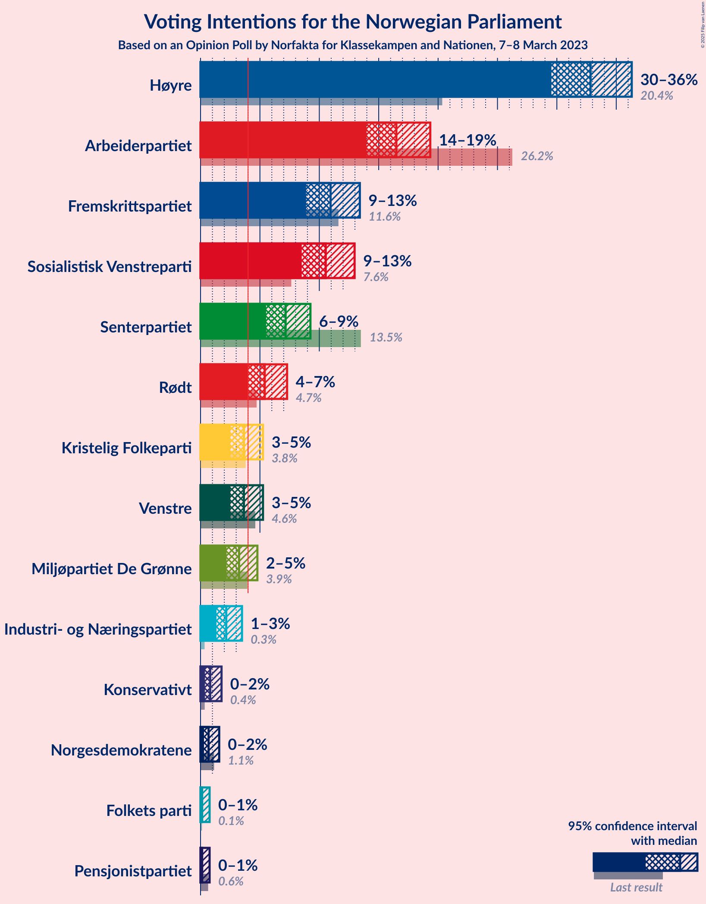

### Confidence Intervals

| Party | Last Result | Poll Result | 80% Confidence Interval | 90% Confidence Interval | 95% Confidence Interval | 99% Confidence Interval |
|:-----:|:-----------:|:-----------:|:-----------------------:|:-----------------------:|:-----------------------:|:-----------------------:|
| Høyre | 20.4% | 32.8% | 30.7–35.1% |30.1–35.8% |29.5–36.3% |28.5–37.4% |
| Arbeiderpartiet | 26.2% | 16.5% | 14.8–18.4% |14.4–18.9% |14.0–19.3% |13.2–20.3% |
| Fremskrittspartiet | 11.6% | 10.9% | 9.6–12.6% |9.2–13.0% |8.9–13.4% |8.3–14.2% |
| Sosialistisk Venstreparti | 7.6% | 10.5% | 9.2–12.1% |8.8–12.6% |8.5–13.0% |7.9–13.8% |
| Senterpartiet | 13.5% | 7.2% | 6.1–8.5% |5.8–8.9% |5.5–9.3% |5.0–10.0% |
| Rødt | 4.7% | 5.4% | 4.5–6.6% |4.2–7.0% |4.0–7.3% |3.6–7.9% |
| Venstre | 4.6% | 3.6% | 2.9–4.7% |2.7–5.0% |2.5–5.3% |2.2–5.8% |
| Kristelig Folkeparti | 3.8% | 3.6% | 2.9–4.7% |2.7–5.0% |2.5–5.3% |2.2–5.8% |
| Miljøpartiet De Grønne | 3.9% | 3.2% | 2.5–4.3% |2.3–4.5% |2.2–4.8% |1.9–5.3% |
| Industri- og Næringspartiet | 0.3% | 2.2% | 1.6–3.0% |1.5–3.3% |1.3–3.5% |1.1–3.9% |
| Konservativt | 0.4% | 0.8% | 0.5–1.4% |0.4–1.6% |0.4–1.8% |0.3–2.1% |
| Norgesdemokratene | 1.1% | 0.7% | 0.4–1.2% |0.4–1.4% |0.3–1.6% |0.2–1.9% |
| Folkets parti | 0.1% | 0.1% | 0.1–0.5% |0.0–0.6% |0.0–0.8% |0.0–1.0% |
| Pensjonistpartiet | 0.6% | 0.1% | 0.1–0.5% |0.0–0.6% |0.0–0.8% |0.0–1.0% |

*Note:* The poll result column reflects the actual value used in the calculations. Published results may vary slightly, and in addition be rounded to fewer digits.

## Seats

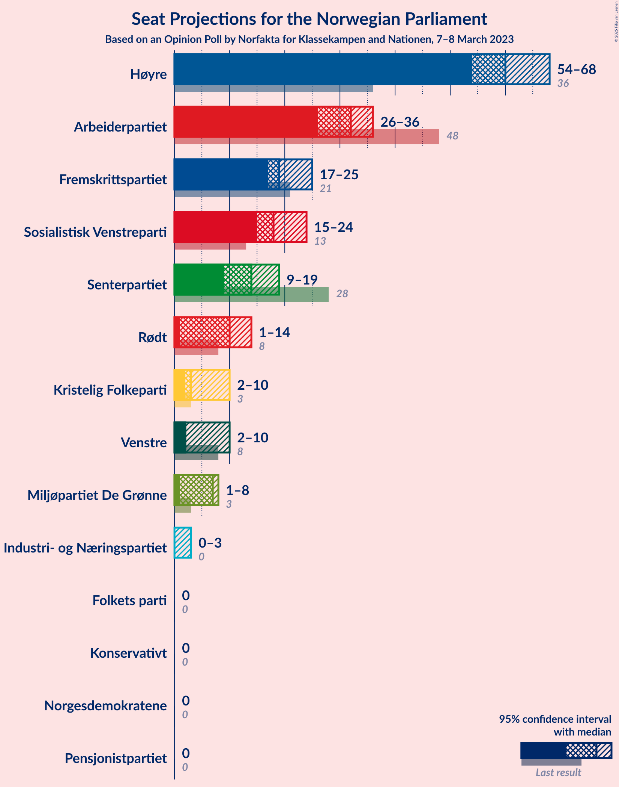

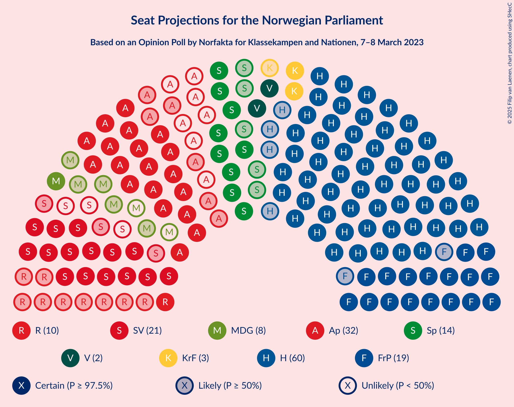

### Confidence Intervals

| Party | Last Result | Median | 80% Confidence Interval | 90% Confidence Interval | 95% Confidence Interval | 99% Confidence Interval |
|:-----:|:-----------:|:------:|:-----------------------:|:-----------------------:|:-----------------------:|:-----------------------:|
| <a href="#høyre">Høyre</a> | 36 | 60 | 57–65 |56–67 |54–68 |52–70 |
| <a href="#arbeiderpartiet">Arbeiderpartiet</a> | 48 | 32 | 27–35 |26–35 |26–36 |26–38 |
| <a href="#fremskrittspartiet">Fremskrittspartiet</a> | 21 | 19 | 17–24 |17–24 |17–25 |16–26 |
| <a href="#sosialistisk-venstreparti">Sosialistisk Venstreparti</a> | 13 | 18 | 16–23 |16–24 |15–24 |15–27 |
| <a href="#senterpartiet">Senterpartiet</a> | 28 | 14 | 11–16 |9–17 |9–19 |9–19 |
| <a href="#rødt">Rødt</a> | 8 | 10 | 1–12 |1–13 |1–14 |1–15 |
| <a href="#venstre">Venstre</a> | 8 | 2 | 2–8 |2–9 |2–10 |2–11 |
| <a href="#kristelig-folkeparti">Kristelig Folkeparti</a> | 3 | 3 | 2–10 |2–10 |2–10 |1–11 |
| <a href="#miljøpartiet-de-grønne">Miljøpartiet De Grønne</a> | 3 | 7 | 1–8 |1–8 |1–8 |1–10 |
| <a href="#industri--og-næringspartiet">Industri- og Næringspartiet</a> | 0 | 0 | 0–2 |0–2 |0–3 |0–7 |
| <a href="#konservativt">Konservativt</a> | 0 | 0 | 0 |0 |0 |0 |
| <a href="#norgesdemokratene">Norgesdemokratene</a> | 0 | 0 | 0 |0 |0 |0 |
| <a href="#folkets-parti">Folkets parti</a> | 0 | 0 | 0 |0 |0 |0 |
| <a href="#pensjonistpartiet">Pensjonistpartiet</a> | 0 | 0 | 0 |0 |0 |0 |

### Høyre

*For a full overview of the results for this party, see the [Høyre](party-høyre.html) page.*

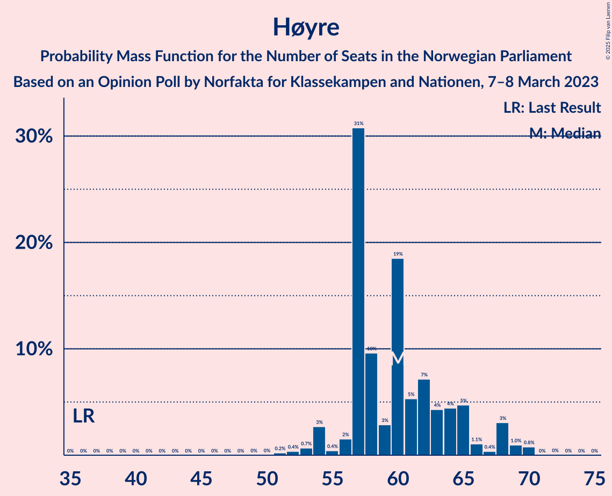

| Number of Seats | Probability | Accumulated | Special Marks |
|:---------------:|:-----------:|:-----------:|:-------------:|
| 36 | 0% | 100% | Last Result |
| 37 | 0% | 100% |  |
| 38 | 0% | 100% |  |
| 39 | 0% | 100% |  |
| 40 | 0% | 100% |  |
| 41 | 0% | 100% |  |
| 42 | 0% | 100% |  |
| 43 | 0% | 100% |  |
| 44 | 0% | 100% |  |
| 45 | 0% | 100% |  |
| 46 | 0% | 100% |  |
| 47 | 0% | 100% |  |
| 48 | 0% | 100% |  |
| 49 | 0% | 100% |  |
| 50 | 0% | 100% |  |
| 51 | 0.2% | 99.9% |  |
| 52 | 0.4% | 99.7% |  |
| 53 | 0.7% | 99.3% |  |
| 54 | 3% | 98.7% |  |
| 55 | 0.4% | 96% |  |
| 56 | 2% | 96% |  |
| 57 | 31% | 94% |  |
| 58 | 10% | 63% |  |
| 59 | 3% | 54% |  |
| 60 | 19% | 51% | Median |
| 61 | 5% | 32% |  |
| 62 | 7% | 27% |  |
| 63 | 4% | 20% |  |
| 64 | 4% | 15% |  |
| 65 | 5% | 11% |  |
| 66 | 1.1% | 6% |  |
| 67 | 0.4% | 5% |  |
| 68 | 3% | 5% |  |
| 69 | 1.0% | 2% |  |
| 70 | 0.8% | 0.8% |  |
| 71 | 0% | 0.1% |  |
| 72 | 0% | 0% |  |

### Arbeiderpartiet

*For a full overview of the results for this party, see the [Arbeiderpartiet](party-arbeiderpartiet.html) page.*

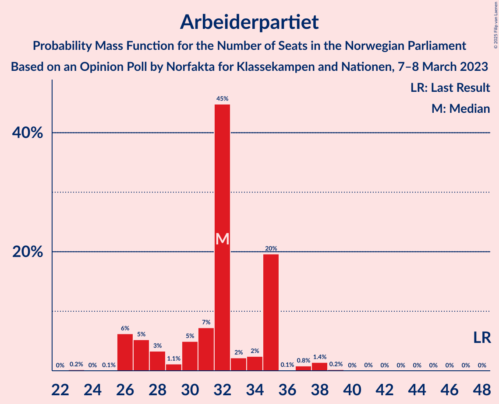

| Number of Seats | Probability | Accumulated | Special Marks |
|:---------------:|:-----------:|:-----------:|:-------------:|
| 23 | 0.2% | 100% |  |
| 24 | 0% | 99.8% |  |
| 25 | 0.1% | 99.8% |  |
| 26 | 6% | 99.7% |  |
| 27 | 5% | 93% |  |
| 28 | 3% | 88% |  |
| 29 | 1.1% | 85% |  |
| 30 | 5% | 84% |  |
| 31 | 7% | 79% |  |
| 32 | 45% | 72% | Median |
| 33 | 2% | 27% |  |
| 34 | 2% | 25% |  |
| 35 | 20% | 22% |  |
| 36 | 0.1% | 3% |  |
| 37 | 0.8% | 2% |  |
| 38 | 1.4% | 2% |  |
| 39 | 0.2% | 0.3% |  |
| 40 | 0% | 0.1% |  |
| 41 | 0% | 0% |  |
| 42 | 0% | 0% |  |
| 43 | 0% | 0% |  |
| 44 | 0% | 0% |  |
| 45 | 0% | 0% |  |
| 46 | 0% | 0% |  |
| 47 | 0% | 0% |  |
| 48 | 0% | 0% | Last Result |

### Fremskrittspartiet

*For a full overview of the results for this party, see the [Fremskrittspartiet](party-fremskrittspartiet.html) page.*

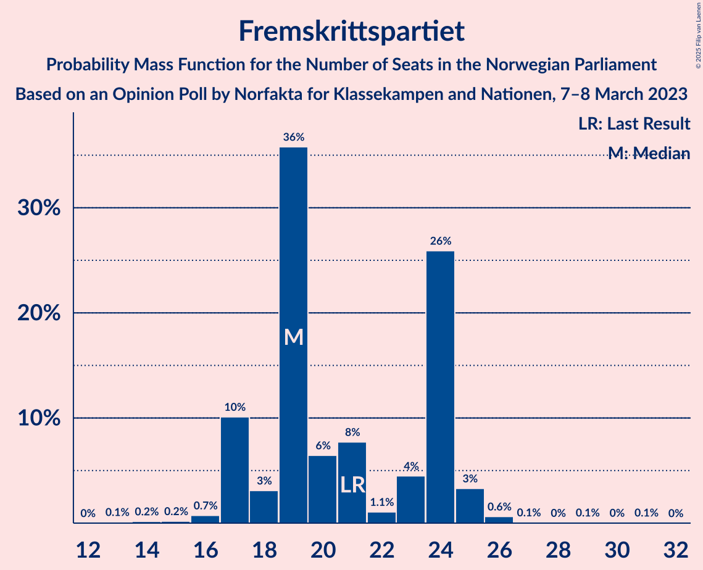

| Number of Seats | Probability | Accumulated | Special Marks |
|:---------------:|:-----------:|:-----------:|:-------------:|
| 13 | 0.1% | 100% |  |
| 14 | 0.2% | 99.9% |  |
| 15 | 0.2% | 99.7% |  |
| 16 | 0.7% | 99.5% |  |
| 17 | 10% | 98.8% |  |
| 18 | 3% | 89% |  |
| 19 | 36% | 86% | Median |
| 20 | 6% | 50% |  |
| 21 | 8% | 43% | Last Result |
| 22 | 1.1% | 36% |  |
| 23 | 4% | 35% |  |
| 24 | 26% | 30% |  |
| 25 | 3% | 4% |  |
| 26 | 0.6% | 0.9% |  |
| 27 | 0.1% | 0.2% |  |
| 28 | 0% | 0.2% |  |
| 29 | 0.1% | 0.1% |  |
| 30 | 0% | 0.1% |  |
| 31 | 0.1% | 0.1% |  |
| 32 | 0% | 0% |  |

### Sosialistisk Venstreparti

*For a full overview of the results for this party, see the [Sosialistisk Venstreparti](party-sosialistiskvenstreparti.html) page.*

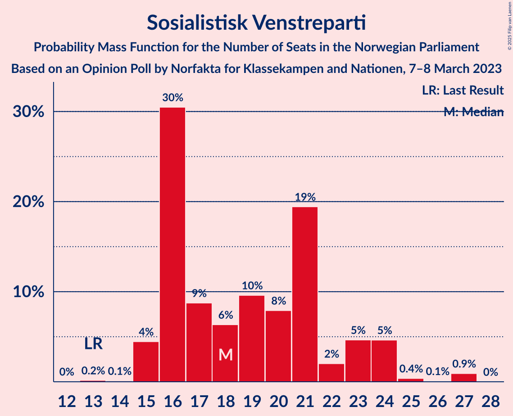

| Number of Seats | Probability | Accumulated | Special Marks |
|:---------------:|:-----------:|:-----------:|:-------------:|
| 13 | 0.2% | 100% | Last Result |
| 14 | 0.1% | 99.8% |  |
| 15 | 4% | 99.7% |  |
| 16 | 30% | 95% |  |
| 17 | 9% | 65% |  |
| 18 | 6% | 56% | Median |
| 19 | 10% | 50% |  |
| 20 | 8% | 40% |  |
| 21 | 19% | 32% |  |
| 22 | 2% | 13% |  |
| 23 | 5% | 11% |  |
| 24 | 5% | 6% |  |
| 25 | 0.4% | 1.4% |  |
| 26 | 0.1% | 1.0% |  |
| 27 | 0.9% | 0.9% |  |
| 28 | 0% | 0% |  |

### Senterpartiet

*For a full overview of the results for this party, see the [Senterpartiet](party-senterpartiet.html) page.*

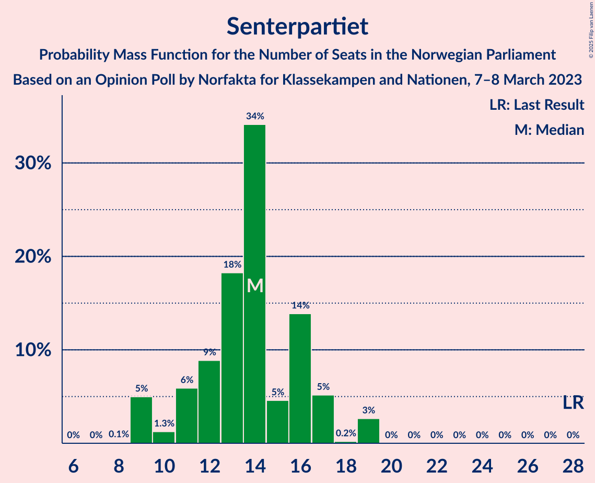

| Number of Seats | Probability | Accumulated | Special Marks |
|:---------------:|:-----------:|:-----------:|:-------------:|
| 8 | 0.1% | 100% |  |
| 9 | 5% | 99.9% |  |
| 10 | 1.3% | 95% |  |
| 11 | 6% | 94% |  |
| 12 | 9% | 88% |  |
| 13 | 18% | 79% |  |
| 14 | 34% | 61% | Median |
| 15 | 5% | 27% |  |
| 16 | 14% | 22% |  |
| 17 | 5% | 8% |  |
| 18 | 0.2% | 3% |  |
| 19 | 3% | 3% |  |
| 20 | 0% | 0% |  |
| 21 | 0% | 0% |  |
| 22 | 0% | 0% |  |
| 23 | 0% | 0% |  |
| 24 | 0% | 0% |  |
| 25 | 0% | 0% |  |
| 26 | 0% | 0% |  |
| 27 | 0% | 0% |  |
| 28 | 0% | 0% | Last Result |

### Rødt

*For a full overview of the results for this party, see the [Rødt](party-rødt.html) page.*

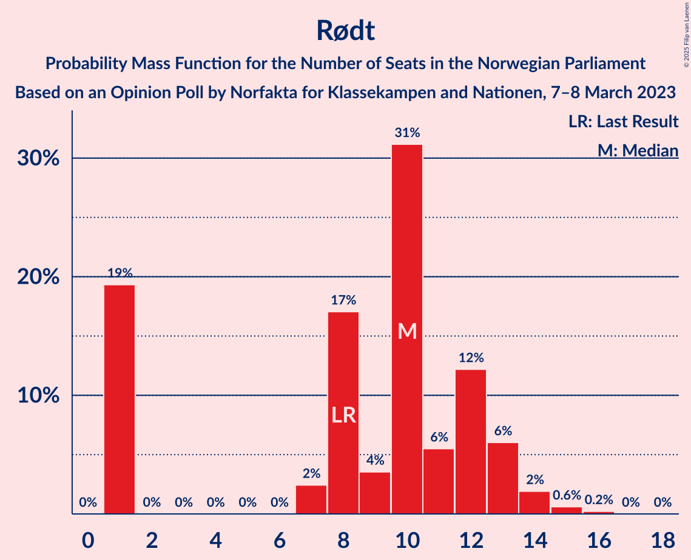

| Number of Seats | Probability | Accumulated | Special Marks |
|:---------------:|:-----------:|:-----------:|:-------------:|
| 1 | 19% | 100% |  |
| 2 | 0% | 81% |  |
| 3 | 0% | 81% |  |
| 4 | 0% | 81% |  |
| 5 | 0% | 81% |  |
| 6 | 0% | 81% |  |
| 7 | 2% | 81% |  |
| 8 | 17% | 78% | Last Result |
| 9 | 4% | 61% |  |
| 10 | 31% | 58% | Median |
| 11 | 6% | 26% |  |
| 12 | 12% | 21% |  |
| 13 | 6% | 9% |  |
| 14 | 2% | 3% |  |
| 15 | 0.6% | 0.8% |  |
| 16 | 0.2% | 0.2% |  |
| 17 | 0% | 0% |  |

### Venstre

*For a full overview of the results for this party, see the [Venstre](party-venstre.html) page.*

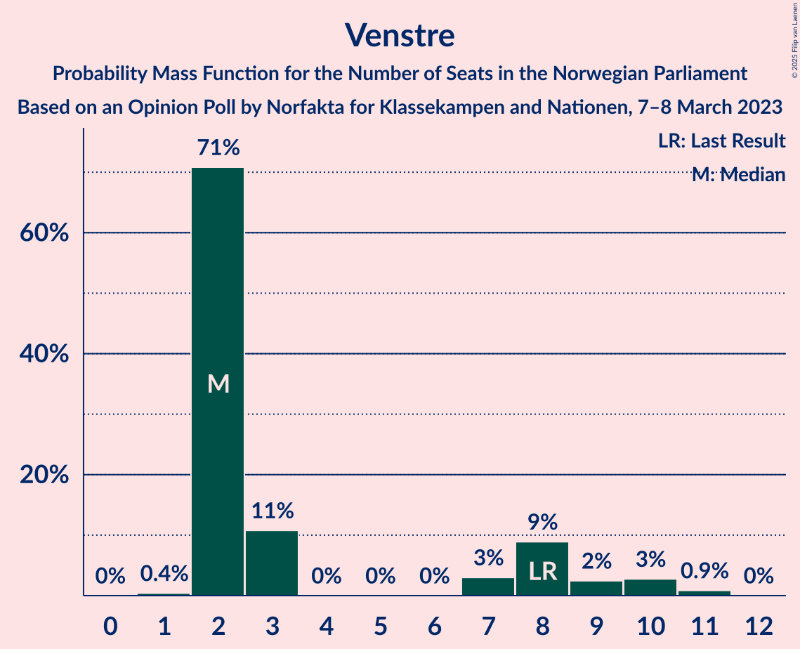

| Number of Seats | Probability | Accumulated | Special Marks |
|:---------------:|:-----------:|:-----------:|:-------------:|
| 1 | 0.4% | 100% |  |
| 2 | 71% | 99.6% | Median |
| 3 | 11% | 29% |  |
| 4 | 0% | 18% |  |
| 5 | 0% | 18% |  |
| 6 | 0% | 18% |  |
| 7 | 3% | 18% |  |
| 8 | 9% | 15% | Last Result |
| 9 | 2% | 6% |  |
| 10 | 3% | 4% |  |
| 11 | 0.9% | 0.9% |  |
| 12 | 0% | 0% |  |

### Kristelig Folkeparti

*For a full overview of the results for this party, see the [Kristelig Folkeparti](party-kristeligfolkeparti.html) page.*

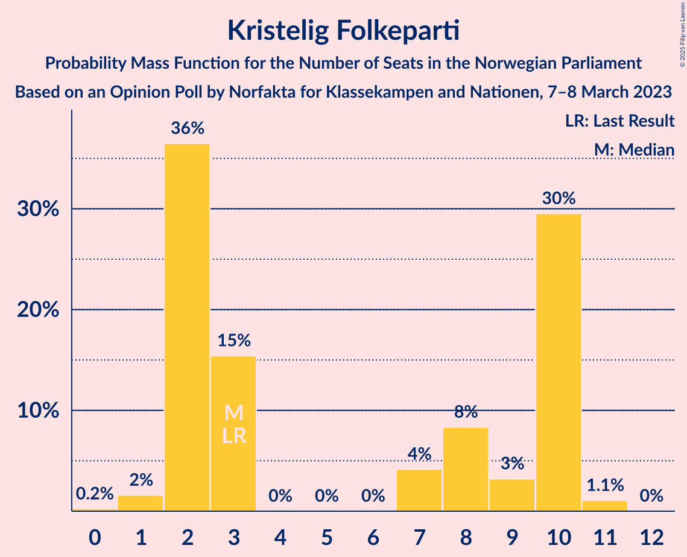

| Number of Seats | Probability | Accumulated | Special Marks |
|:---------------:|:-----------:|:-----------:|:-------------:|
| 0 | 0.2% | 100% |  |
| 1 | 2% | 99.8% |  |
| 2 | 36% | 98% |  |
| 3 | 15% | 62% | Last Result, Median |
| 4 | 0% | 46% |  |
| 5 | 0% | 46% |  |
| 6 | 0% | 46% |  |
| 7 | 4% | 46% |  |
| 8 | 8% | 42% |  |
| 9 | 3% | 34% |  |
| 10 | 30% | 31% |  |
| 11 | 1.1% | 1.1% |  |
| 12 | 0% | 0% |  |

### Miljøpartiet De Grønne

*For a full overview of the results for this party, see the [Miljøpartiet De Grønne](party-miljøpartietdegrønne.html) page.*

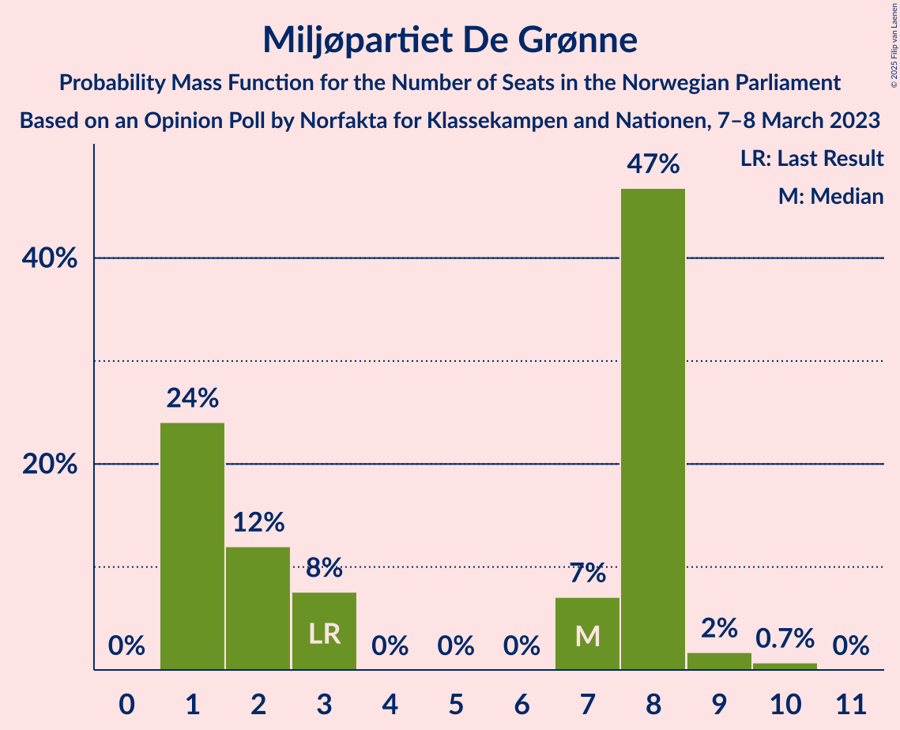

| Number of Seats | Probability | Accumulated | Special Marks |
|:---------------:|:-----------:|:-----------:|:-------------:|
| 1 | 24% | 100% |  |
| 2 | 12% | 76% |  |
| 3 | 8% | 64% | Last Result |
| 4 | 0% | 56% |  |
| 5 | 0% | 56% |  |
| 6 | 0% | 56% |  |
| 7 | 7% | 56% | Median |
| 8 | 47% | 49% |  |
| 9 | 2% | 2% |  |
| 10 | 0.7% | 0.7% |  |
| 11 | 0% | 0% |  |

### Industri- og Næringspartiet

*For a full overview of the results for this party, see the [Industri- og Næringspartiet](party-industri-ognæringspartiet.html) page.*

| Number of Seats | Probability | Accumulated | Special Marks |
|:---------------:|:-----------:|:-----------:|:-------------:|
| 0 | 62% | 100% | Last Result, Median |
| 1 | 3% | 38% |  |
| 2 | 32% | 35% |  |
| 3 | 0.6% | 3% |  |
| 4 | 0% | 2% |  |
| 5 | 0% | 2% |  |
| 6 | 0% | 2% |  |
| 7 | 2% | 2% |  |
| 8 | 0.1% | 0.1% |  |
| 9 | 0% | 0% |  |

### Konservativt

*For a full overview of the results for this party, see the [Konservativt](party-konservativt.html) page.*

| Number of Seats | Probability | Accumulated | Special Marks |
|:---------------:|:-----------:|:-----------:|:-------------:|
| 0 | 100% | 100% | Last Result, Median |

### Norgesdemokratene

*For a full overview of the results for this party, see the [Norgesdemokratene](party-norgesdemokratene.html) page.*

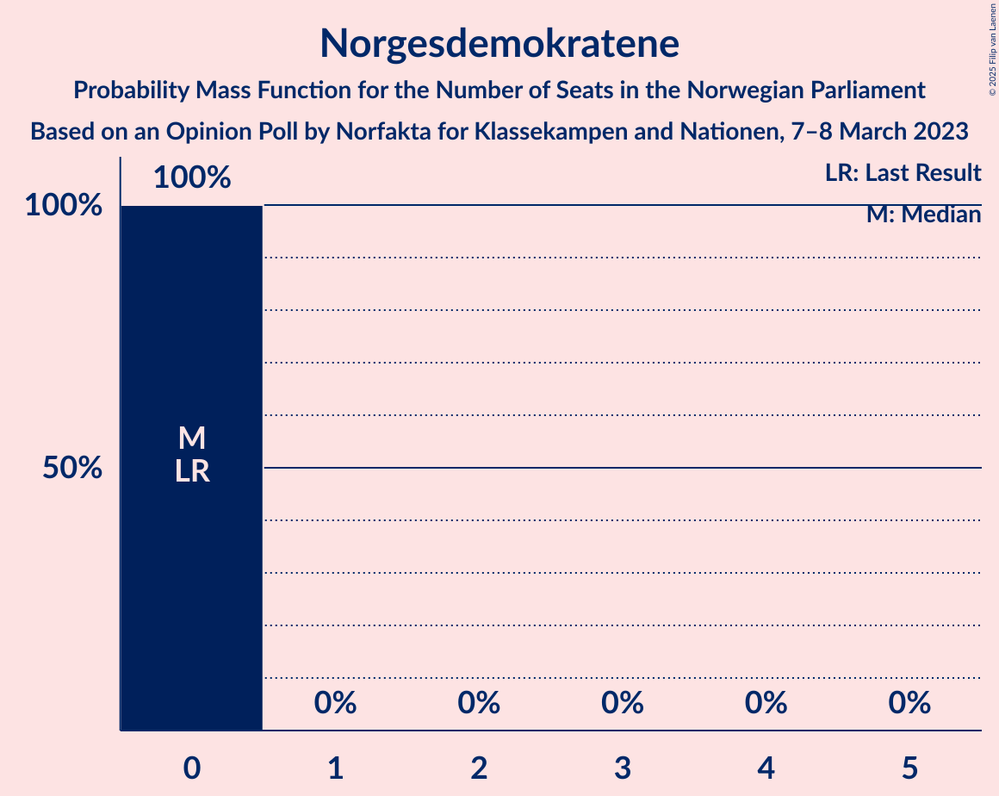

| Number of Seats | Probability | Accumulated | Special Marks |
|:---------------:|:-----------:|:-----------:|:-------------:|
| 0 | 100% | 100% | Last Result, Median |

### Folkets parti

*For a full overview of the results for this party, see the [Folkets parti](party-folketsparti.html) page.*

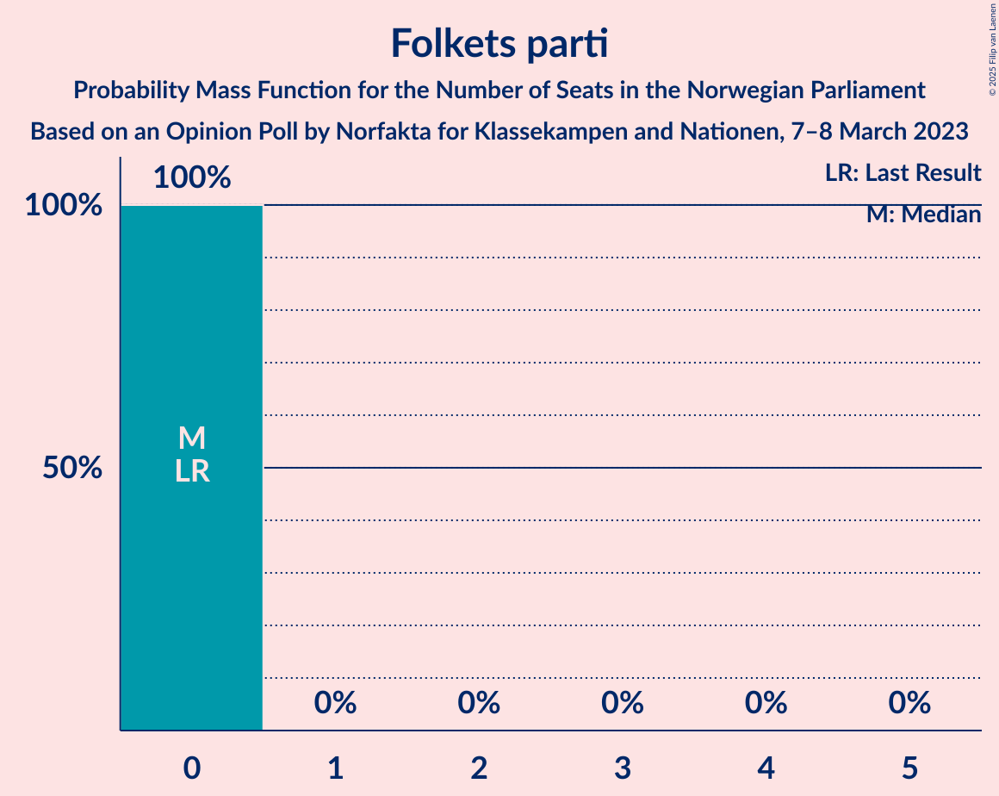

| Number of Seats | Probability | Accumulated | Special Marks |
|:---------------:|:-----------:|:-----------:|:-------------:|
| 0 | 100% | 100% | Last Result, Median |

### Pensjonistpartiet

*For a full overview of the results for this party, see the [Pensjonistpartiet](party-pensjonistpartiet.html) page.*

| Number of Seats | Probability | Accumulated | Special Marks |
|:---------------:|:-----------:|:-----------:|:-------------:|
| 0 | 100% | 100% | Last Result, Median |

## Coalitions

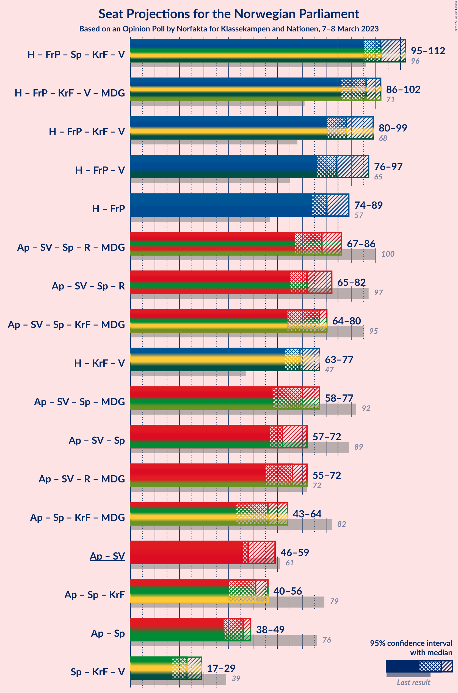

### Confidence Intervals

| Coalition | Last Result | Median | Majority? | 80% Confidence Interval | 90% Confidence Interval | 95% Confidence Interval | 99% Confidence Interval |
|:---------:|:-----------:|:------:|:---------:|:-----------------------:|:-----------------------:|:-----------------------:|:-----------------------:|
| Høyre – Fremskrittspartiet – Senterpartiet – Kristelig Folkeparti – Venstre | 96 | 102 | 100% | 99–109 | 97–110 | 95–112 | 94–116 |
| Høyre – Fremskrittspartiet – Kristelig Folkeparti – Venstre – Miljøpartiet De Grønne | 71 | 96 | 98% | 89–98 | 87–100 | 86–102 | 81–104 |
| Høyre – Fremskrittspartiet – Kristelig Folkeparti – Venstre | 68 | 88 | 92% | 86–94 | 83–99 | 80–99 | 80–102 |
| Høyre – Fremskrittspartiet – Venstre | 65 | 84 | 49% | 78–91 | 78–92 | 76–97 | 76–97 |
| Høyre – Fremskrittspartiet | 57 | 80 | 19% | 76–86 | 75–89 | 74–89 | 71–89 |
| Arbeiderpartiet – Sosialistisk Venstreparti – Senterpartiet – Rødt – Miljøpartiet De Grønne | 100 | 78 | 5% | 72–82 | 67–84 | 67–86 | 65–88 |
| Arbeiderpartiet – Sosialistisk Venstreparti – Senterpartiet – Rødt | 97 | 72 | 1.1% | 68–79 | 66–80 | 65–82 | 63–87 |
| Arbeiderpartiet – Sosialistisk Venstreparti – Senterpartiet – Kristelig Folkeparti – Miljøpartiet De Grønne | 95 | 77 | 0% | 67–80 | 65–80 | 64–80 | 60–82 |
| Høyre – Kristelig Folkeparti – Venstre | 47 | 69 | 0.1% | 63–75 | 63–76 | 63–77 | 61–81 |
| Arbeiderpartiet – Sosialistisk Venstreparti – Senterpartiet – Miljøpartiet De Grønne | 92 | 70 | 0% | 63–77 | 60–77 | 58–77 | 57–80 |
| Arbeiderpartiet – Sosialistisk Venstreparti – Senterpartiet | 89 | 62 | 0% | 58–69 | 57–71 | 57–72 | 56–76 |
| Arbeiderpartiet – Sosialistisk Venstreparti – Rødt – Miljøpartiet De Grønne | 72 | 66 | 0% | 57–69 | 55–71 | 55–72 | 50–73 |
| Arbeiderpartiet – Senterpartiet – Kristelig Folkeparti – Miljøpartiet De Grønne | 82 | 56 | 0% | 48–64 | 46–64 | 43–64 | 40–64 |
| Arbeiderpartiet – Sosialistisk Venstreparti | 61 | 48 | 0% | 46–56 | 46–59 | 46–59 | 45–61 |
| Arbeiderpartiet – Senterpartiet – Kristelig Folkeparti | 79 | 51 | 0% | 45–56 | 44–56 | 40–56 | 39–58 |
| Arbeiderpartiet – Senterpartiet | 76 | 46 | 0% | 41–48 | 41–49 | 38–49 | 37–53 |
| Senterpartiet – Kristelig Folkeparti – Venstre | 39 | 23 | 0% | 17–27 | 17–29 | 17–29 | 14–31 |

### Høyre – Fremskrittspartiet – Senterpartiet – Kristelig Folkeparti – Venstre

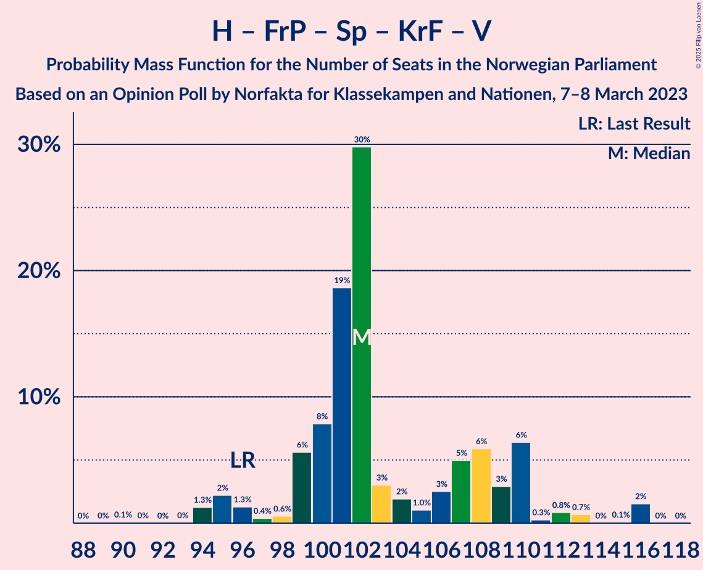

| Number of Seats | Probability | Accumulated | Special Marks |
|:---------------:|:-----------:|:-----------:|:-------------:|
| 90 | 0.1% | 100% |  |
| 91 | 0% | 99.9% |  |
| 92 | 0% | 99.9% |  |
| 93 | 0% | 99.9% |  |
| 94 | 1.3% | 99.8% |  |
| 95 | 2% | 98.6% |  |
| 96 | 1.3% | 96% | Last Result |
| 97 | 0.4% | 95% |  |
| 98 | 0.6% | 95% | Median |
| 99 | 6% | 94% |  |
| 100 | 8% | 88% |  |
| 101 | 19% | 81% |  |
| 102 | 30% | 62% |  |
| 103 | 3% | 32% |  |
| 104 | 2% | 29% |  |
| 105 | 1.0% | 27% |  |
| 106 | 3% | 26% |  |
| 107 | 5% | 24% |  |
| 108 | 6% | 19% |  |
| 109 | 3% | 13% |  |
| 110 | 6% | 10% |  |
| 111 | 0.3% | 3% |  |
| 112 | 0.8% | 3% |  |
| 113 | 0.7% | 2% |  |
| 114 | 0% | 2% |  |
| 115 | 0.1% | 2% |  |
| 116 | 2% | 2% |  |
| 117 | 0% | 0% |  |

### Høyre – Fremskrittspartiet – Kristelig Folkeparti – Venstre – Miljøpartiet De Grønne

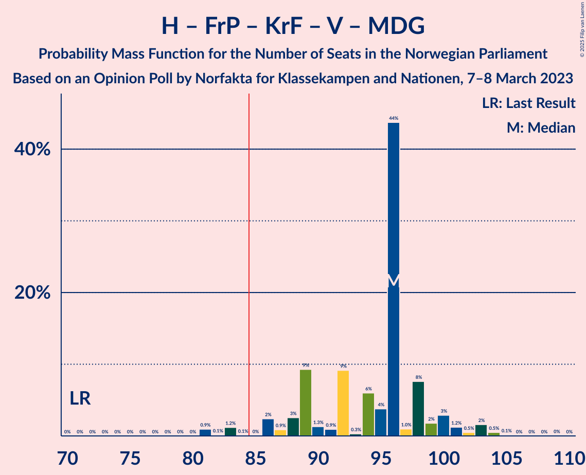

| Number of Seats | Probability | Accumulated | Special Marks |
|:---------------:|:-----------:|:-----------:|:-------------:|
| 71 | 0% | 100% | Last Result |
| 72 | 0% | 100% |  |
| 73 | 0% | 100% |  |
| 74 | 0% | 100% |  |
| 75 | 0% | 100% |  |
| 76 | 0% | 100% |  |
| 77 | 0% | 100% |  |
| 78 | 0% | 100% |  |
| 79 | 0% | 100% |  |
| 80 | 0% | 100% |  |
| 81 | 0.9% | 100% |  |
| 82 | 0.1% | 99.0% |  |
| 83 | 1.2% | 98.9% |  |
| 84 | 0.1% | 98% |  |
| 85 | 0% | 98% | Majority |
| 86 | 2% | 98% |  |
| 87 | 0.9% | 95% |  |
| 88 | 3% | 94% |  |
| 89 | 9% | 92% |  |
| 90 | 1.3% | 82% |  |
| 91 | 0.9% | 81% | Median |
| 92 | 9% | 80% |  |
| 93 | 0.3% | 71% |  |
| 94 | 6% | 71% |  |
| 95 | 4% | 65% |  |
| 96 | 44% | 61% |  |
| 97 | 1.0% | 17% |  |
| 98 | 8% | 16% |  |
| 99 | 2% | 9% |  |
| 100 | 3% | 7% |  |
| 101 | 1.2% | 4% |  |
| 102 | 0.5% | 3% |  |
| 103 | 2% | 2% |  |
| 104 | 0.5% | 0.7% |  |
| 105 | 0.1% | 0.2% |  |
| 106 | 0% | 0% |  |

### Høyre – Fremskrittspartiet – Kristelig Folkeparti – Venstre

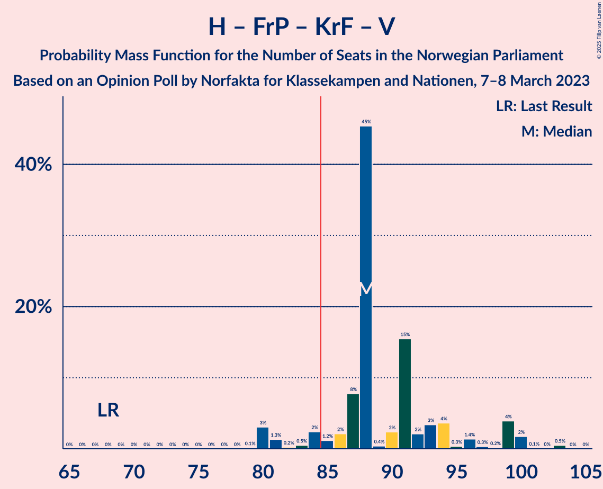

| Number of Seats | Probability | Accumulated | Special Marks |
|:---------------:|:-----------:|:-----------:|:-------------:|
| 68 | 0% | 100% | Last Result |
| 69 | 0% | 100% |  |
| 70 | 0% | 100% |  |
| 71 | 0% | 100% |  |
| 72 | 0% | 100% |  |
| 73 | 0% | 100% |  |
| 74 | 0% | 100% |  |
| 75 | 0% | 100% |  |
| 76 | 0% | 100% |  |
| 77 | 0% | 100% |  |
| 78 | 0% | 100% |  |
| 79 | 0.1% | 100% |  |
| 80 | 3% | 99.8% |  |
| 81 | 1.3% | 97% |  |
| 82 | 0.2% | 95% |  |
| 83 | 0.5% | 95% |  |
| 84 | 2% | 95% | Median |
| 85 | 1.2% | 92% | Majority |
| 86 | 2% | 91% |  |
| 87 | 8% | 89% |  |
| 88 | 45% | 81% |  |
| 89 | 0.4% | 36% |  |
| 90 | 2% | 35% |  |
| 91 | 15% | 33% |  |
| 92 | 2% | 18% |  |
| 93 | 3% | 15% |  |
| 94 | 4% | 12% |  |
| 95 | 0.3% | 8% |  |
| 96 | 1.4% | 8% |  |
| 97 | 0.3% | 7% |  |
| 98 | 0.2% | 6% |  |
| 99 | 4% | 6% |  |
| 100 | 2% | 2% |  |
| 101 | 0.1% | 0.6% |  |
| 102 | 0% | 0.5% |  |
| 103 | 0.5% | 0.5% |  |
| 104 | 0% | 0% |  |

### Høyre – Fremskrittspartiet – Venstre

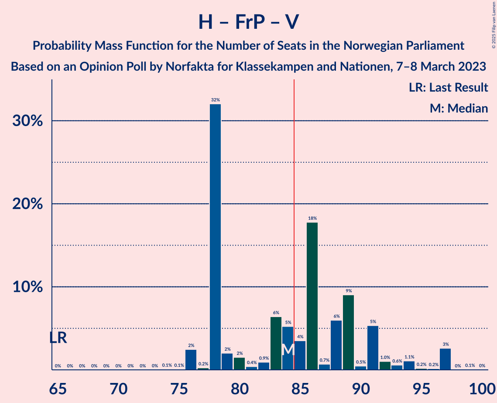

| Number of Seats | Probability | Accumulated | Special Marks |
|:---------------:|:-----------:|:-----------:|:-------------:|
| 65 | 0% | 100% | Last Result |
| 66 | 0% | 100% |  |
| 67 | 0% | 100% |  |
| 68 | 0% | 100% |  |
| 69 | 0% | 100% |  |
| 70 | 0% | 100% |  |
| 71 | 0% | 100% |  |
| 72 | 0% | 100% |  |
| 73 | 0% | 100% |  |
| 74 | 0.1% | 100% |  |
| 75 | 0.1% | 99.9% |  |
| 76 | 2% | 99.8% |  |
| 77 | 0.2% | 97% |  |
| 78 | 32% | 97% |  |
| 79 | 2% | 65% |  |
| 80 | 2% | 63% |  |
| 81 | 0.4% | 62% | Median |
| 82 | 0.9% | 61% |  |
| 83 | 6% | 60% |  |
| 84 | 5% | 54% |  |
| 85 | 4% | 49% | Majority |
| 86 | 18% | 45% |  |
| 87 | 0.7% | 27% |  |
| 88 | 6% | 27% |  |
| 89 | 9% | 21% |  |
| 90 | 0.5% | 12% |  |
| 91 | 5% | 11% |  |
| 92 | 1.0% | 6% |  |
| 93 | 0.6% | 5% |  |
| 94 | 1.1% | 4% |  |
| 95 | 0.2% | 3% |  |
| 96 | 0.2% | 3% |  |
| 97 | 3% | 3% |  |
| 98 | 0% | 0.1% |  |
| 99 | 0.1% | 0.1% |  |
| 100 | 0% | 0% |  |

### Høyre – Fremskrittspartiet

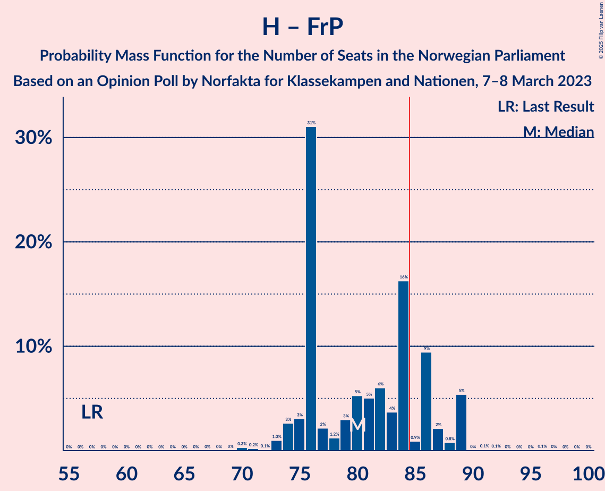

| Number of Seats | Probability | Accumulated | Special Marks |
|:---------------:|:-----------:|:-----------:|:-------------:|
| 57 | 0% | 100% | Last Result |
| 58 | 0% | 100% |  |
| 59 | 0% | 100% |  |
| 60 | 0% | 100% |  |
| 61 | 0% | 100% |  |
| 62 | 0% | 100% |  |
| 63 | 0% | 100% |  |
| 64 | 0% | 100% |  |
| 65 | 0% | 100% |  |
| 66 | 0% | 100% |  |
| 67 | 0% | 100% |  |
| 68 | 0% | 100% |  |
| 69 | 0% | 100% |  |
| 70 | 0.3% | 99.9% |  |
| 71 | 0.2% | 99.6% |  |
| 72 | 0.1% | 99.4% |  |
| 73 | 1.0% | 99.3% |  |
| 74 | 3% | 98% |  |
| 75 | 3% | 96% |  |
| 76 | 31% | 93% |  |
| 77 | 2% | 62% |  |
| 78 | 1.2% | 59% |  |
| 79 | 3% | 58% | Median |
| 80 | 5% | 55% |  |
| 81 | 5% | 50% |  |
| 82 | 6% | 45% |  |
| 83 | 4% | 39% |  |
| 84 | 16% | 35% |  |
| 85 | 0.9% | 19% | Majority |
| 86 | 9% | 18% |  |
| 87 | 2% | 9% |  |
| 88 | 0.8% | 6% |  |
| 89 | 5% | 6% |  |
| 90 | 0% | 0.3% |  |
| 91 | 0.1% | 0.2% |  |
| 92 | 0.1% | 0.2% |  |
| 93 | 0% | 0.1% |  |
| 94 | 0% | 0.1% |  |
| 95 | 0% | 0.1% |  |
| 96 | 0.1% | 0.1% |  |
| 97 | 0% | 0% |  |

### Arbeiderpartiet – Sosialistisk Venstreparti – Senterpartiet – Rødt – Miljøpartiet De Grønne

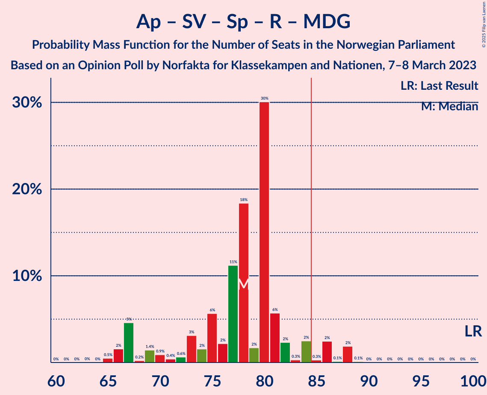

| Number of Seats | Probability | Accumulated | Special Marks |
|:---------------:|:-----------:|:-----------:|:-------------:|
| 65 | 0.5% | 100% |  |
| 66 | 2% | 99.5% |  |
| 67 | 5% | 98% |  |
| 68 | 0.2% | 93% |  |
| 69 | 1.4% | 93% |  |
| 70 | 0.9% | 92% |  |
| 71 | 0.4% | 91% |  |
| 72 | 0.6% | 90% |  |
| 73 | 3% | 90% |  |
| 74 | 2% | 87% |  |
| 75 | 6% | 85% |  |
| 76 | 2% | 79% |  |
| 77 | 11% | 77% |  |
| 78 | 18% | 66% |  |
| 79 | 2% | 48% |  |
| 80 | 30% | 46% |  |
| 81 | 6% | 16% | Median |
| 82 | 2% | 10% |  |
| 83 | 0.3% | 8% |  |
| 84 | 2% | 7% |  |
| 85 | 0.3% | 5% | Majority |
| 86 | 2% | 5% |  |
| 87 | 0.1% | 2% |  |
| 88 | 2% | 2% |  |
| 89 | 0.1% | 0.1% |  |
| 90 | 0% | 0% |  |
| 91 | 0% | 0% |  |
| 92 | 0% | 0% |  |
| 93 | 0% | 0% |  |
| 94 | 0% | 0% |  |
| 95 | 0% | 0% |  |
| 96 | 0% | 0% |  |
| 97 | 0% | 0% |  |
| 98 | 0% | 0% |  |
| 99 | 0% | 0% |  |
| 100 | 0% | 0% | Last Result |

### Arbeiderpartiet – Sosialistisk Venstreparti – Senterpartiet – Rødt

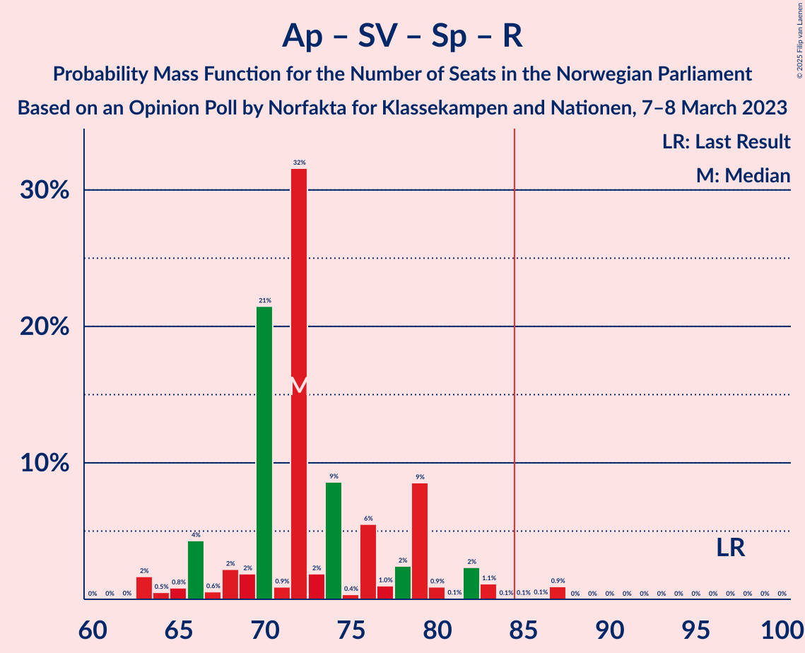

| Number of Seats | Probability | Accumulated | Special Marks |
|:---------------:|:-----------:|:-----------:|:-------------:|
| 61 | 0% | 100% |  |
| 62 | 0% | 99.9% |  |
| 63 | 2% | 99.9% |  |
| 64 | 0.5% | 98% |  |
| 65 | 0.8% | 98% |  |
| 66 | 4% | 97% |  |
| 67 | 0.6% | 93% |  |
| 68 | 2% | 92% |  |
| 69 | 2% | 90% |  |
| 70 | 21% | 88% |  |
| 71 | 0.9% | 66% |  |
| 72 | 32% | 66% |  |
| 73 | 2% | 34% |  |
| 74 | 9% | 32% | Median |
| 75 | 0.4% | 24% |  |
| 76 | 6% | 23% |  |
| 77 | 1.0% | 18% |  |
| 78 | 2% | 17% |  |
| 79 | 9% | 14% |  |
| 80 | 0.9% | 6% |  |
| 81 | 0.1% | 5% |  |
| 82 | 2% | 5% |  |
| 83 | 1.1% | 2% |  |
| 84 | 0.1% | 1.2% |  |
| 85 | 0.1% | 1.1% | Majority |
| 86 | 0.1% | 1.0% |  |
| 87 | 0.9% | 0.9% |  |
| 88 | 0% | 0% |  |
| 89 | 0% | 0% |  |
| 90 | 0% | 0% |  |
| 91 | 0% | 0% |  |
| 92 | 0% | 0% |  |
| 93 | 0% | 0% |  |
| 94 | 0% | 0% |  |
| 95 | 0% | 0% |  |
| 96 | 0% | 0% |  |
| 97 | 0% | 0% | Last Result |

### Arbeiderpartiet – Sosialistisk Venstreparti – Senterpartiet – Kristelig Folkeparti – Miljøpartiet De Grønne

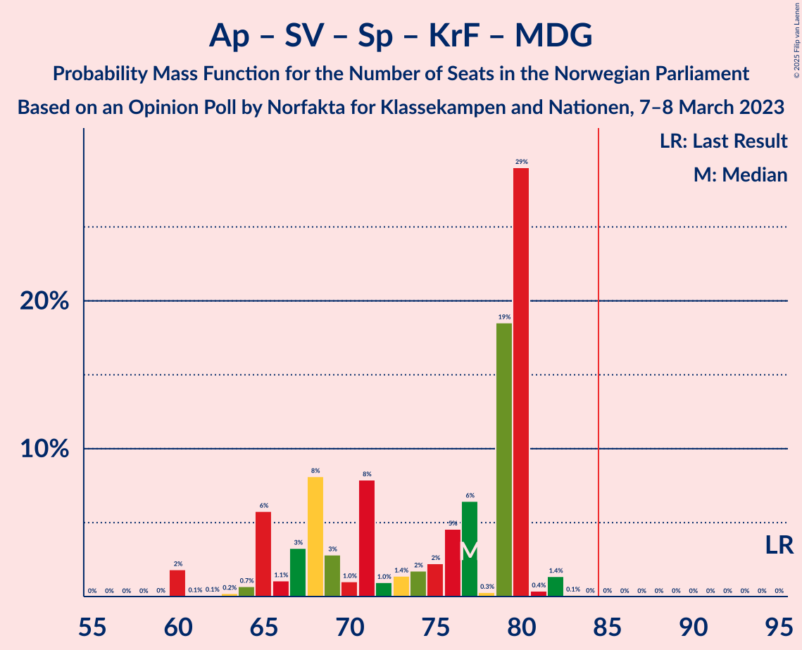

| Number of Seats | Probability | Accumulated | Special Marks |
|:---------------:|:-----------:|:-----------:|:-------------:|
| 60 | 2% | 100% |  |
| 61 | 0.1% | 98% |  |
| 62 | 0.1% | 98% |  |
| 63 | 0.2% | 98% |  |
| 64 | 0.7% | 98% |  |
| 65 | 6% | 97% |  |
| 66 | 1.1% | 91% |  |
| 67 | 3% | 90% |  |
| 68 | 8% | 87% |  |
| 69 | 3% | 79% |  |
| 70 | 1.0% | 76% |  |
| 71 | 8% | 75% |  |
| 72 | 1.0% | 67% |  |
| 73 | 1.4% | 66% |  |
| 74 | 2% | 65% | Median |
| 75 | 2% | 63% |  |
| 76 | 5% | 61% |  |
| 77 | 6% | 56% |  |
| 78 | 0.3% | 50% |  |
| 79 | 19% | 49% |  |
| 80 | 29% | 31% |  |
| 81 | 0.4% | 2% |  |
| 82 | 1.4% | 2% |  |
| 83 | 0.1% | 0.2% |  |
| 84 | 0% | 0% |  |
| 85 | 0% | 0% | Majority |
| 86 | 0% | 0% |  |
| 87 | 0% | 0% |  |
| 88 | 0% | 0% |  |
| 89 | 0% | 0% |  |
| 90 | 0% | 0% |  |
| 91 | 0% | 0% |  |
| 92 | 0% | 0% |  |
| 93 | 0% | 0% |  |
| 94 | 0% | 0% |  |
| 95 | 0% | 0% | Last Result |

### Høyre – Kristelig Folkeparti – Venstre

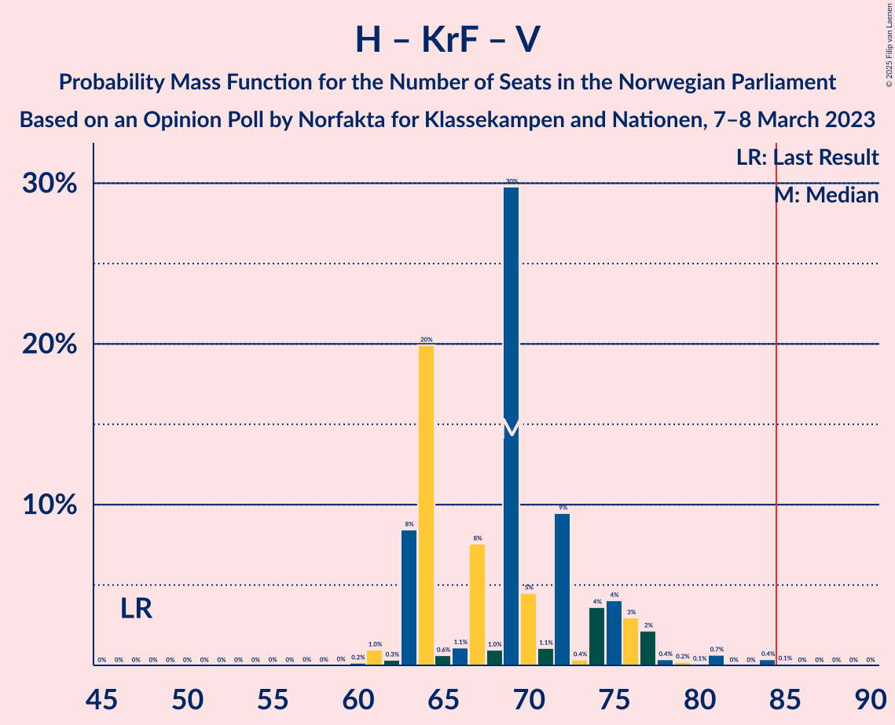

| Number of Seats | Probability | Accumulated | Special Marks |
|:---------------:|:-----------:|:-----------:|:-------------:|
| 47 | 0% | 100% | Last Result |
| 48 | 0% | 100% |  |
| 49 | 0% | 100% |  |
| 50 | 0% | 100% |  |
| 51 | 0% | 100% |  |
| 52 | 0% | 100% |  |
| 53 | 0% | 100% |  |
| 54 | 0% | 100% |  |
| 55 | 0% | 100% |  |
| 56 | 0% | 100% |  |
| 57 | 0% | 100% |  |
| 58 | 0% | 100% |  |
| 59 | 0% | 100% |  |
| 60 | 0.2% | 99.9% |  |
| 61 | 1.0% | 99.7% |  |
| 62 | 0.3% | 98.8% |  |
| 63 | 8% | 98% |  |
| 64 | 20% | 90% |  |
| 65 | 0.6% | 70% | Median |
| 66 | 1.1% | 69% |  |
| 67 | 8% | 68% |  |
| 68 | 1.0% | 61% |  |
| 69 | 30% | 60% |  |
| 70 | 5% | 30% |  |
| 71 | 1.1% | 26% |  |
| 72 | 9% | 24% |  |
| 73 | 0.4% | 15% |  |
| 74 | 4% | 15% |  |
| 75 | 4% | 11% |  |
| 76 | 3% | 7% |  |
| 77 | 2% | 4% |  |
| 78 | 0.4% | 2% |  |
| 79 | 0.2% | 1.4% |  |
| 80 | 0.1% | 1.2% |  |
| 81 | 0.7% | 1.1% |  |
| 82 | 0% | 0.5% |  |
| 83 | 0% | 0.5% |  |
| 84 | 0.4% | 0.5% |  |
| 85 | 0.1% | 0.1% | Majority |
| 86 | 0% | 0% |  |

### Arbeiderpartiet – Sosialistisk Venstreparti – Senterpartiet – Miljøpartiet De Grønne

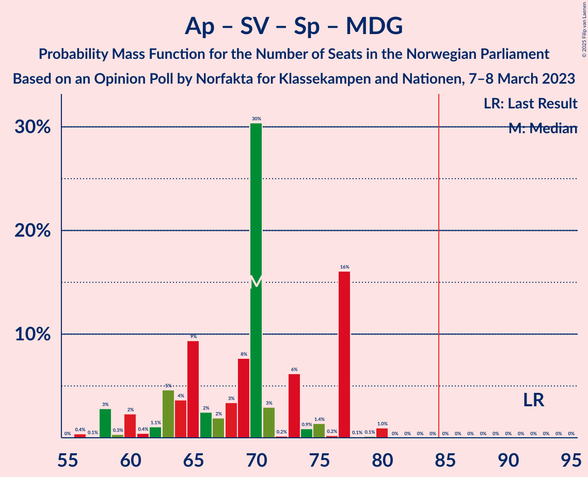

| Number of Seats | Probability | Accumulated | Special Marks |
|:---------------:|:-----------:|:-----------:|:-------------:|
| 56 | 0.4% | 100% |  |
| 57 | 0.1% | 99.6% |  |
| 58 | 3% | 99.5% |  |
| 59 | 0.3% | 97% |  |
| 60 | 2% | 96% |  |
| 61 | 0.4% | 94% |  |
| 62 | 1.1% | 94% |  |
| 63 | 5% | 93% |  |
| 64 | 4% | 88% |  |
| 65 | 9% | 84% |  |
| 66 | 2% | 75% |  |
| 67 | 2% | 72% |  |
| 68 | 3% | 71% |  |
| 69 | 8% | 67% |  |
| 70 | 30% | 59% |  |
| 71 | 3% | 29% | Median |
| 72 | 0.2% | 26% |  |
| 73 | 6% | 26% |  |
| 74 | 0.9% | 20% |  |
| 75 | 1.4% | 19% |  |
| 76 | 0.2% | 18% |  |
| 77 | 16% | 17% |  |
| 78 | 0.1% | 1.2% |  |
| 79 | 0.1% | 1.1% |  |
| 80 | 1.0% | 1.0% |  |
| 81 | 0% | 0% |  |
| 82 | 0% | 0% |  |
| 83 | 0% | 0% |  |
| 84 | 0% | 0% |  |
| 85 | 0% | 0% | Majority |
| 86 | 0% | 0% |  |
| 87 | 0% | 0% |  |
| 88 | 0% | 0% |  |
| 89 | 0% | 0% |  |
| 90 | 0% | 0% |  |
| 91 | 0% | 0% |  |
| 92 | 0% | 0% | Last Result |

### Arbeiderpartiet – Sosialistisk Venstreparti – Senterpartiet

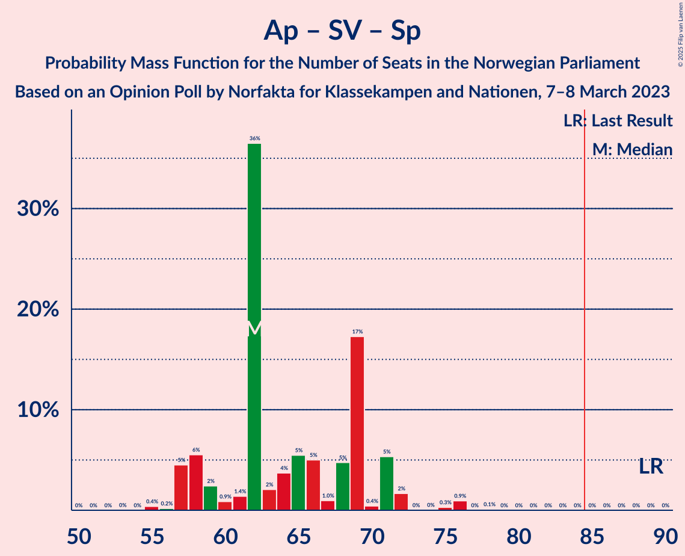

| Number of Seats | Probability | Accumulated | Special Marks |
|:---------------:|:-----------:|:-----------:|:-------------:|
| 55 | 0.4% | 100% |  |
| 56 | 0.2% | 99.6% |  |
| 57 | 5% | 99.4% |  |
| 58 | 6% | 95% |  |
| 59 | 2% | 89% |  |
| 60 | 0.9% | 87% |  |
| 61 | 1.4% | 86% |  |
| 62 | 36% | 85% |  |
| 63 | 2% | 48% |  |
| 64 | 4% | 46% | Median |
| 65 | 5% | 42% |  |
| 66 | 5% | 37% |  |
| 67 | 1.0% | 32% |  |
| 68 | 5% | 31% |  |
| 69 | 17% | 26% |  |
| 70 | 0.4% | 9% |  |
| 71 | 5% | 8% |  |
| 72 | 2% | 3% |  |
| 73 | 0% | 1.4% |  |
| 74 | 0% | 1.4% |  |
| 75 | 0.3% | 1.4% |  |
| 76 | 0.9% | 1.1% |  |
| 77 | 0% | 0.1% |  |
| 78 | 0.1% | 0.1% |  |
| 79 | 0% | 0% |  |
| 80 | 0% | 0% |  |
| 81 | 0% | 0% |  |
| 82 | 0% | 0% |  |
| 83 | 0% | 0% |  |
| 84 | 0% | 0% |  |
| 85 | 0% | 0% | Majority |
| 86 | 0% | 0% |  |
| 87 | 0% | 0% |  |
| 88 | 0% | 0% |  |
| 89 | 0% | 0% | Last Result |

### Arbeiderpartiet – Sosialistisk Venstreparti – Rødt – Miljøpartiet De Grønne

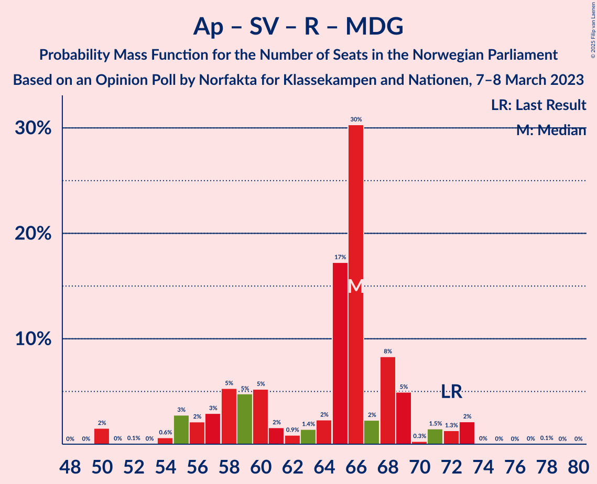

| Number of Seats | Probability | Accumulated | Special Marks |
|:---------------:|:-----------:|:-----------:|:-------------:|
| 50 | 2% | 100% |  |
| 51 | 0% | 98% |  |
| 52 | 0.1% | 98% |  |
| 53 | 0% | 98% |  |
| 54 | 0.6% | 98% |  |
| 55 | 3% | 98% |  |
| 56 | 2% | 95% |  |
| 57 | 3% | 93% |  |
| 58 | 5% | 90% |  |
| 59 | 5% | 85% |  |
| 60 | 5% | 80% |  |
| 61 | 2% | 75% |  |
| 62 | 0.9% | 73% |  |
| 63 | 1.4% | 72% |  |
| 64 | 2% | 71% |  |
| 65 | 17% | 68% |  |
| 66 | 30% | 51% |  |
| 67 | 2% | 21% | Median |
| 68 | 8% | 19% |  |
| 69 | 5% | 10% |  |
| 70 | 0.3% | 5% |  |
| 71 | 1.5% | 5% |  |
| 72 | 1.3% | 4% | Last Result |
| 73 | 2% | 2% |  |
| 74 | 0% | 0.2% |  |
| 75 | 0% | 0.1% |  |
| 76 | 0% | 0.1% |  |
| 77 | 0% | 0.1% |  |
| 78 | 0.1% | 0.1% |  |
| 79 | 0% | 0% |  |

### Arbeiderpartiet – Senterpartiet – Kristelig Folkeparti – Miljøpartiet De Grønne

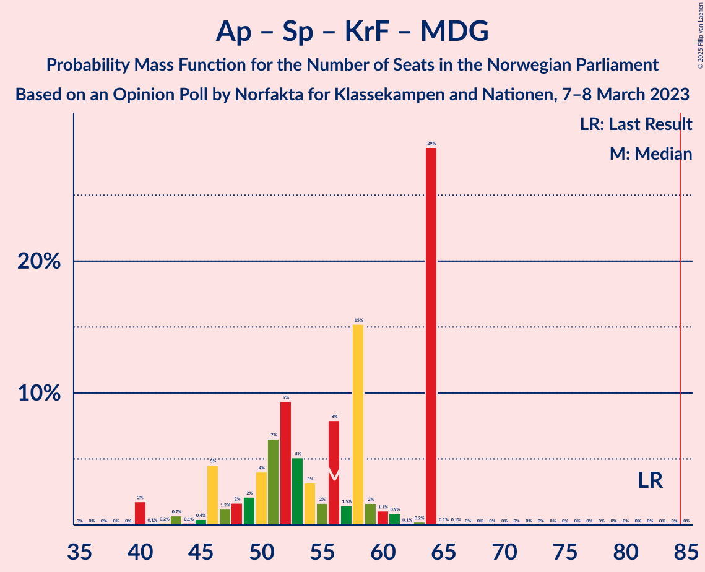

| Number of Seats | Probability | Accumulated | Special Marks |
|:---------------:|:-----------:|:-----------:|:-------------:|
| 40 | 2% | 100% |  |
| 41 | 0.1% | 98% |  |
| 42 | 0.2% | 98% |  |
| 43 | 0.7% | 98% |  |
| 44 | 0.1% | 97% |  |
| 45 | 0.4% | 97% |  |
| 46 | 5% | 97% |  |
| 47 | 1.2% | 92% |  |
| 48 | 2% | 91% |  |
| 49 | 2% | 89% |  |
| 50 | 4% | 87% |  |
| 51 | 7% | 83% |  |
| 52 | 9% | 77% |  |
| 53 | 5% | 67% |  |
| 54 | 3% | 62% |  |
| 55 | 2% | 59% |  |
| 56 | 8% | 57% | Median |
| 57 | 1.5% | 49% |  |
| 58 | 15% | 48% |  |
| 59 | 2% | 33% |  |
| 60 | 1.1% | 31% |  |
| 61 | 0.9% | 30% |  |
| 62 | 0.1% | 29% |  |
| 63 | 0.2% | 29% |  |
| 64 | 29% | 29% |  |
| 65 | 0.1% | 0.2% |  |
| 66 | 0.1% | 0.1% |  |
| 67 | 0% | 0% |  |
| 68 | 0% | 0% |  |
| 69 | 0% | 0% |  |
| 70 | 0% | 0% |  |
| 71 | 0% | 0% |  |
| 72 | 0% | 0% |  |
| 73 | 0% | 0% |  |
| 74 | 0% | 0% |  |
| 75 | 0% | 0% |  |
| 76 | 0% | 0% |  |
| 77 | 0% | 0% |  |
| 78 | 0% | 0% |  |
| 79 | 0% | 0% |  |
| 80 | 0% | 0% |  |
| 81 | 0% | 0% |  |
| 82 | 0% | 0% | Last Result |

### Arbeiderpartiet – Sosialistisk Venstreparti

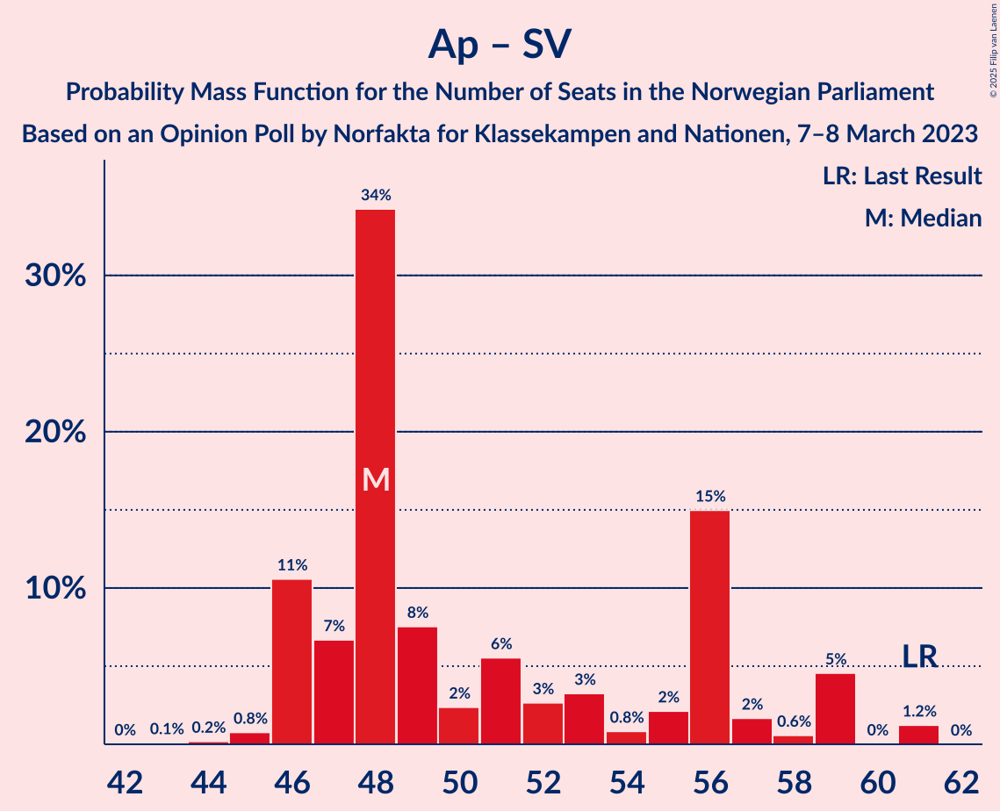

| Number of Seats | Probability | Accumulated | Special Marks |
|:---------------:|:-----------:|:-----------:|:-------------:|
| 43 | 0.1% | 100% |  |
| 44 | 0.2% | 99.9% |  |
| 45 | 0.8% | 99.7% |  |
| 46 | 11% | 98.9% |  |
| 47 | 7% | 88% |  |
| 48 | 34% | 82% |  |
| 49 | 8% | 47% |  |
| 50 | 2% | 40% | Median |
| 51 | 6% | 37% |  |
| 52 | 3% | 32% |  |
| 53 | 3% | 29% |  |
| 54 | 0.8% | 26% |  |
| 55 | 2% | 25% |  |
| 56 | 15% | 23% |  |
| 57 | 2% | 8% |  |
| 58 | 0.6% | 6% |  |
| 59 | 5% | 6% |  |
| 60 | 0% | 1.3% |  |
| 61 | 1.2% | 1.2% | Last Result |
| 62 | 0% | 0% |  |

### Arbeiderpartiet – Senterpartiet – Kristelig Folkeparti

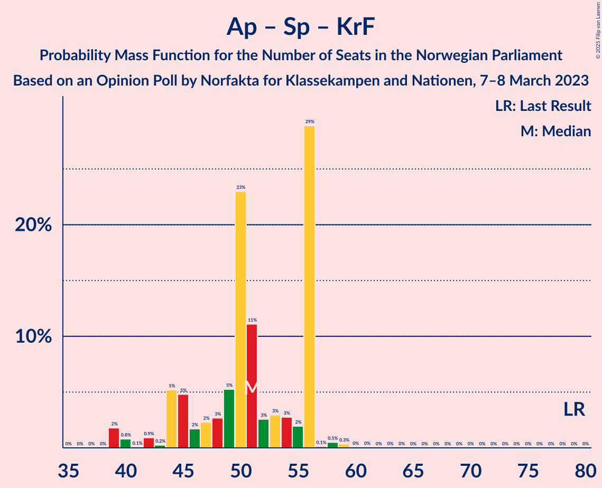

| Number of Seats | Probability | Accumulated | Special Marks |
|:---------------:|:-----------:|:-----------:|:-------------:|
| 39 | 2% | 100% |  |
| 40 | 0.8% | 98% |  |
| 41 | 0.1% | 97% |  |
| 42 | 0.9% | 97% |  |
| 43 | 0.2% | 96% |  |
| 44 | 5% | 96% |  |
| 45 | 5% | 91% |  |
| 46 | 2% | 86% |  |
| 47 | 2% | 84% |  |
| 48 | 3% | 82% |  |
| 49 | 5% | 80% | Median |
| 50 | 23% | 74% |  |
| 51 | 11% | 51% |  |
| 52 | 3% | 40% |  |
| 53 | 3% | 38% |  |
| 54 | 3% | 35% |  |
| 55 | 2% | 32% |  |
| 56 | 29% | 30% |  |
| 57 | 0.1% | 1.1% |  |
| 58 | 0.5% | 1.0% |  |
| 59 | 0.3% | 0.5% |  |
| 60 | 0% | 0.1% |  |
| 61 | 0% | 0.1% |  |
| 62 | 0% | 0% |  |
| 63 | 0% | 0% |  |
| 64 | 0% | 0% |  |
| 65 | 0% | 0% |  |
| 66 | 0% | 0% |  |
| 67 | 0% | 0% |  |
| 68 | 0% | 0% |  |
| 69 | 0% | 0% |  |
| 70 | 0% | 0% |  |
| 71 | 0% | 0% |  |
| 72 | 0% | 0% |  |
| 73 | 0% | 0% |  |
| 74 | 0% | 0% |  |
| 75 | 0% | 0% |  |
| 76 | 0% | 0% |  |
| 77 | 0% | 0% |  |
| 78 | 0% | 0% |  |
| 79 | 0% | 0% | Last Result |

### Arbeiderpartiet – Senterpartiet

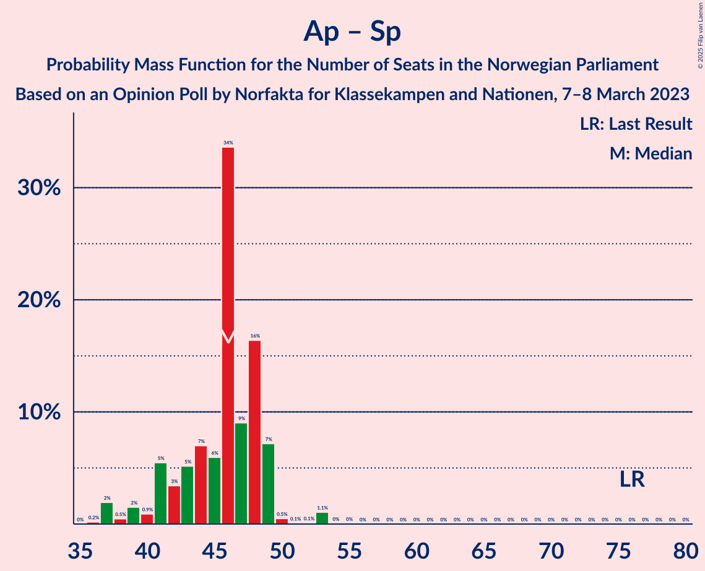

| Number of Seats | Probability | Accumulated | Special Marks |
|:---------------:|:-----------:|:-----------:|:-------------:|
| 36 | 0.2% | 100% |  |
| 37 | 2% | 99.8% |  |
| 38 | 0.5% | 98% |  |
| 39 | 2% | 97% |  |
| 40 | 0.9% | 96% |  |
| 41 | 5% | 95% |  |
| 42 | 3% | 90% |  |
| 43 | 5% | 86% |  |
| 44 | 7% | 81% |  |
| 45 | 6% | 74% |  |
| 46 | 34% | 68% | Median |
| 47 | 9% | 34% |  |
| 48 | 16% | 25% |  |
| 49 | 7% | 9% |  |
| 50 | 0.5% | 2% |  |
| 51 | 0.1% | 1.3% |  |
| 52 | 0.1% | 1.2% |  |
| 53 | 1.1% | 1.1% |  |
| 54 | 0% | 0.1% |  |
| 55 | 0% | 0% |  |
| 56 | 0% | 0% |  |
| 57 | 0% | 0% |  |
| 58 | 0% | 0% |  |
| 59 | 0% | 0% |  |
| 60 | 0% | 0% |  |
| 61 | 0% | 0% |  |
| 62 | 0% | 0% |  |
| 63 | 0% | 0% |  |
| 64 | 0% | 0% |  |
| 65 | 0% | 0% |  |
| 66 | 0% | 0% |  |
| 67 | 0% | 0% |  |
| 68 | 0% | 0% |  |
| 69 | 0% | 0% |  |
| 70 | 0% | 0% |  |
| 71 | 0% | 0% |  |
| 72 | 0% | 0% |  |
| 73 | 0% | 0% |  |
| 74 | 0% | 0% |  |
| 75 | 0% | 0% |  |
| 76 | 0% | 0% | Last Result |

### Senterpartiet – Kristelig Folkeparti – Venstre

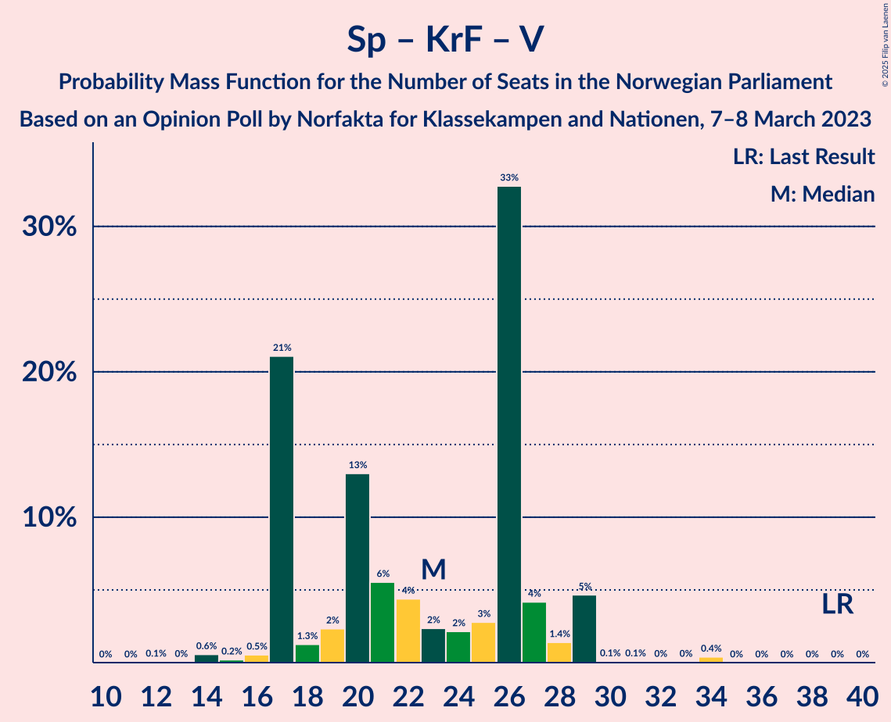

| Number of Seats | Probability | Accumulated | Special Marks |
|:---------------:|:-----------:|:-----------:|:-------------:|
| 12 | 0.1% | 100% |  |
| 13 | 0% | 99.9% |  |
| 14 | 0.6% | 99.9% |  |
| 15 | 0.2% | 99.3% |  |
| 16 | 0.5% | 99.1% |  |
| 17 | 21% | 98.6% |  |
| 18 | 1.3% | 78% |  |
| 19 | 2% | 76% | Median |
| 20 | 13% | 74% |  |
| 21 | 6% | 61% |  |
| 22 | 4% | 55% |  |
| 23 | 2% | 51% |  |
| 24 | 2% | 49% |  |
| 25 | 3% | 46% |  |
| 26 | 33% | 44% |  |
| 27 | 4% | 11% |  |
| 28 | 1.4% | 7% |  |
| 29 | 5% | 5% |  |
| 30 | 0.1% | 0.7% |  |
| 31 | 0.1% | 0.6% |  |
| 32 | 0% | 0.5% |  |
| 33 | 0% | 0.5% |  |
| 34 | 0.4% | 0.4% |  |
| 35 | 0% | 0% |  |
| 36 | 0% | 0% |  |
| 37 | 0% | 0% |  |
| 38 | 0% | 0% |  |
| 39 | 0% | 0% | Last Result |

## Technical Information

### Opinion Poll

+ **Polling firm:** Norfakta
+ **Commissioner(s):** Klassekampen and Nationen
+ **Fieldwork period:** 7–8 March 2023

### Calculations

+ **Sample size:** 740
+ **Simulations done:** 1,048,576
+ **Error estimate:** 2.44%

