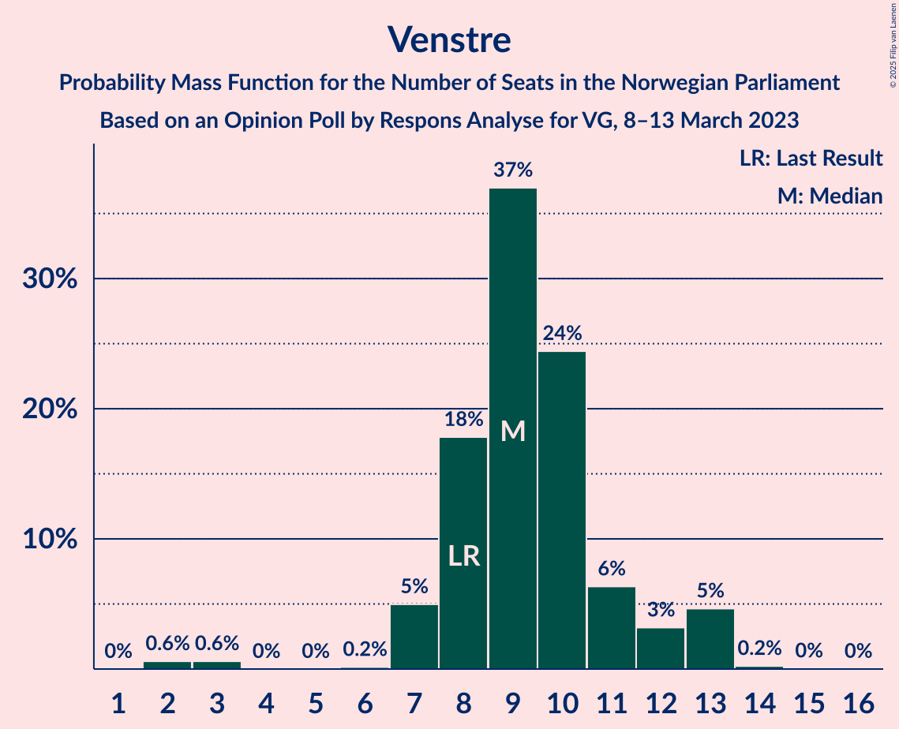
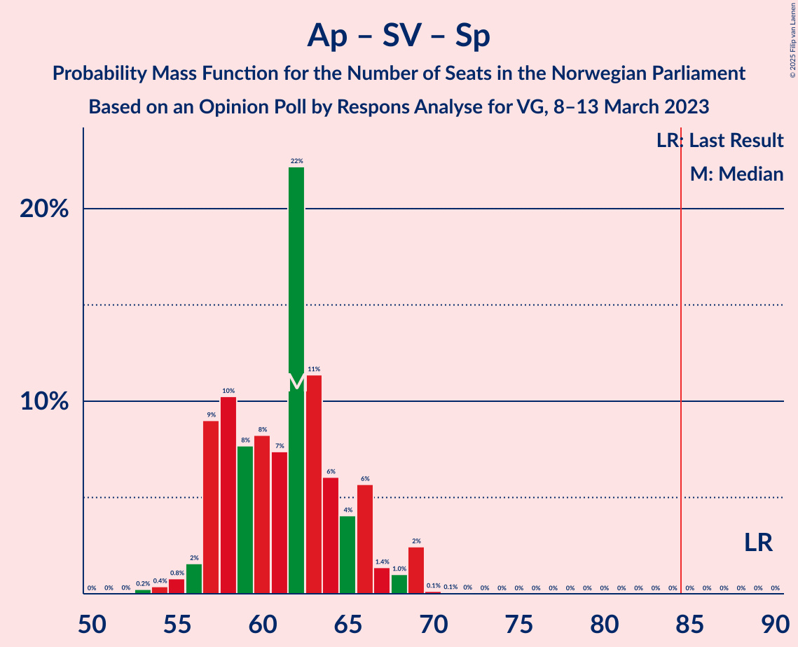
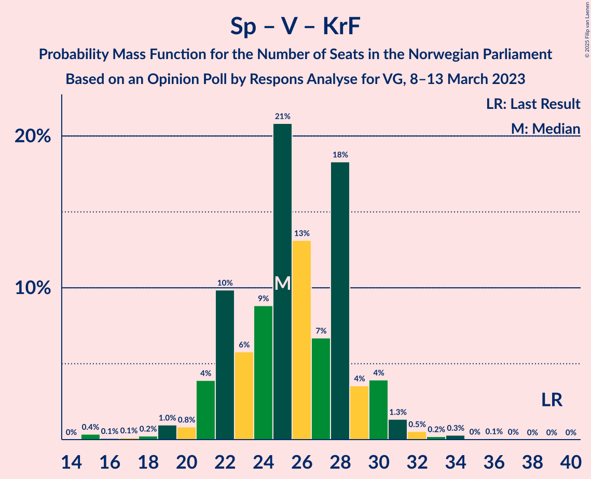

# Opinion Poll by Respons Analyse for VG, 8–13 March 2023

<a href="#voting-intentions">Voting Intentions</a> | <a href="#seats">Seats</a> | <a href="#coalitions">Coalitions</a> | <a href="#technical-information">Technical Information</a>

## Voting Intentions

### Confidence Intervals

| Party | Last Result | Poll Result | 80% Confidence Interval | 90% Confidence Interval | 95% Confidence Interval | 99% Confidence Interval |
|:-----:|:-----------:|:-----------:|:-----------------------:|:-----------------------:|:-----------------------:|:-----------------------:|
| Høyre | 20.4% | 30.9% | 29.1–32.8% |28.5–33.4% |28.1–33.8% |27.3–34.8% |
| Arbeiderpartiet | 26.2% | 18.1% | 16.6–19.7% |16.2–20.2% |15.8–20.6% |15.2–21.4% |
| Fremskrittspartiet | 11.6% | 10.0% | 8.9–11.3% |8.6–11.7% |8.3–12.0% |7.8–12.7% |
| Sosialistisk Venstreparti | 7.6% | 9.1% | 8.0–10.4% |7.7–10.7% |7.5–11.1% |7.0–11.7% |
| Rødt | 4.7% | 6.3% | 5.4–7.4% |5.2–7.7% |5.0–8.0% |4.6–8.6% |
| Senterpartiet | 13.5% | 6.3% | 5.4–7.4% |5.2–7.7% |5.0–8.0% |4.6–8.6% |
| Venstre | 4.6% | 5.5% | 4.7–6.5% |4.4–6.8% |4.3–7.1% |3.9–7.6% |
| Miljøpartiet De Grønne | 3.9% | 4.0% | 3.3–4.9% |3.1–5.2% |2.9–5.4% |2.7–5.9% |
| Kristelig Folkeparti | 3.8% | 3.9% | 3.2–4.8% |3.0–5.1% |2.9–5.3% |2.6–5.8% |
| Industri- og Næringspartiet | 0.3% | 3.5% | 2.9–4.4% |2.7–4.6% |2.5–4.8% |2.2–5.3% |

*Note:* The poll result column reflects the actual value used in the calculations. Published results may vary slightly, and in addition be rounded to fewer digits.

## Seats

### Confidence Intervals

| Party | Last Result | Median | 80% Confidence Interval | 90% Confidence Interval | 95% Confidence Interval | 99% Confidence Interval |
|:-----:|:-----------:|:------:|:-----------------------:|:-----------------------:|:-----------------------:|:-----------------------:|
| <a href="#høyre">Høyre</a> | 36 | 55 | 51–59 |50–60 |50–61 |48–63 |
| <a href="#arbeiderpartiet">Arbeiderpartiet</a> | 48 | 34 | 33–38 |33–40 |32–41 |31–42 |
| <a href="#fremskrittspartiet">Fremskrittspartiet</a> | 21 | 18 | 16–19 |15–21 |15–21 |13–22 |
| <a href="#sosialistisk-venstreparti">Sosialistisk Venstreparti</a> | 13 | 16 | 13–18 |13–19 |12–20 |11–20 |
| <a href="#rødt">Rødt</a> | 8 | 11 | 9–13 |9–13 |8–14 |7–15 |
| <a href="#senterpartiet">Senterpartiet</a> | 28 | 11 | 9–14 |8–14 |8–16 |7–16 |
| <a href="#venstre">Venstre</a> | 8 | 9 | 8–11 |7–12 |7–13 |2–13 |
| <a href="#miljøpartiet-de-grønne">Miljøpartiet De Grønne</a> | 3 | 7 | 2–8 |2–8 |2–9 |1–9 |
| <a href="#kristelig-folkeparti">Kristelig Folkeparti</a> | 3 | 7 | 2–8 |2–8 |2–9 |2–10 |
| <a href="#industri--og-næringspartiet">Industri- og Næringspartiet</a> | 0 | 3 | 2–7 |1–7 |0–8 |0–9 |

### Høyre

*For a full overview of the results for this party, see the [Høyre](party-høyre.html) page.*

| Number of Seats | Probability | Accumulated | Special Marks |
|:---------------:|:-----------:|:-----------:|:-------------:|
| 36 | 0% | 100% | Last Result |
| 37 | 0% | 100% |  |
| 38 | 0% | 100% |  |
| 39 | 0% | 100% |  |
| 40 | 0% | 100% |  |
| 41 | 0% | 100% |  |
| 42 | 0% | 100% |  |
| 43 | 0% | 100% |  |
| 44 | 0% | 100% |  |
| 45 | 0% | 100% |  |
| 46 | 0% | 100% |  |
| 47 | 0.1% | 99.9% |  |
| 48 | 1.0% | 99.8% |  |
| 49 | 0.8% | 98.9% |  |
| 50 | 5% | 98% |  |
| 51 | 4% | 93% |  |
| 52 | 3% | 89% |  |
| 53 | 11% | 85% |  |
| 54 | 10% | 75% |  |
| 55 | 20% | 65% | Median |
| 56 | 11% | 44% |  |
| 57 | 13% | 33% |  |
| 58 | 3% | 20% |  |
| 59 | 7% | 17% |  |
| 60 | 5% | 9% |  |
| 61 | 2% | 4% |  |
| 62 | 1.5% | 2% |  |
| 63 | 0.3% | 0.8% |  |
| 64 | 0.2% | 0.5% |  |
| 65 | 0.2% | 0.2% |  |
| 66 | 0% | 0.1% |  |
| 67 | 0% | 0% |  |

### Arbeiderpartiet

*For a full overview of the results for this party, see the [Arbeiderpartiet](party-arbeiderpartiet.html) page.*

| Number of Seats | Probability | Accumulated | Special Marks |
|:---------------:|:-----------:|:-----------:|:-------------:|
| 30 | 0.1% | 100% |  |
| 31 | 1.2% | 99.9% |  |
| 32 | 3% | 98.6% |  |
| 33 | 18% | 95% |  |
| 34 | 40% | 78% | Median |
| 35 | 14% | 38% |  |
| 36 | 5% | 23% |  |
| 37 | 8% | 18% |  |
| 38 | 3% | 10% |  |
| 39 | 1.5% | 7% |  |
| 40 | 1.4% | 6% |  |
| 41 | 2% | 4% |  |
| 42 | 2% | 2% |  |
| 43 | 0.2% | 0.4% |  |
| 44 | 0.2% | 0.2% |  |
| 45 | 0% | 0.1% |  |
| 46 | 0% | 0% |  |
| 47 | 0% | 0% |  |
| 48 | 0% | 0% | Last Result |

### Fremskrittspartiet

*For a full overview of the results for this party, see the [Fremskrittspartiet](party-fremskrittspartiet.html) page.*

| Number of Seats | Probability | Accumulated | Special Marks |
|:---------------:|:-----------:|:-----------:|:-------------:|
| 12 | 0.2% | 100% |  |
| 13 | 0.6% | 99.8% |  |
| 14 | 1.4% | 99.1% |  |
| 15 | 5% | 98% |  |
| 16 | 20% | 93% |  |
| 17 | 21% | 73% |  |
| 18 | 33% | 52% | Median |
| 19 | 9% | 19% |  |
| 20 | 4% | 10% |  |
| 21 | 5% | 5% | Last Result |
| 22 | 0.3% | 0.6% |  |
| 23 | 0.2% | 0.3% |  |
| 24 | 0% | 0% |  |

### Sosialistisk Venstreparti

*For a full overview of the results for this party, see the [Sosialistisk Venstreparti](party-sosialistiskvenstreparti.html) page.*

| Number of Seats | Probability | Accumulated | Special Marks |
|:---------------:|:-----------:|:-----------:|:-------------:|
| 10 | 0.4% | 100% |  |
| 11 | 0.9% | 99.6% |  |
| 12 | 3% | 98.7% |  |
| 13 | 8% | 96% | Last Result |
| 14 | 19% | 88% |  |
| 15 | 13% | 69% |  |
| 16 | 28% | 56% | Median |
| 17 | 6% | 28% |  |
| 18 | 16% | 21% |  |
| 19 | 3% | 6% |  |
| 20 | 2% | 3% |  |
| 21 | 0.3% | 0.4% |  |
| 22 | 0.1% | 0.1% |  |
| 23 | 0% | 0% |  |

### Rødt

*For a full overview of the results for this party, see the [Rødt](party-rødt.html) page.*

| Number of Seats | Probability | Accumulated | Special Marks |
|:---------------:|:-----------:|:-----------:|:-------------:|
| 6 | 0% | 100% |  |
| 7 | 0.6% | 99.9% |  |
| 8 | 3% | 99.3% | Last Result |
| 9 | 18% | 96% |  |
| 10 | 18% | 78% |  |
| 11 | 23% | 60% | Median |
| 12 | 21% | 37% |  |
| 13 | 13% | 16% |  |
| 14 | 2% | 3% |  |
| 15 | 0.3% | 0.7% |  |
| 16 | 0.4% | 0.4% |  |
| 17 | 0% | 0% |  |

### Senterpartiet

*For a full overview of the results for this party, see the [Senterpartiet](party-senterpartiet.html) page.*

| Number of Seats | Probability | Accumulated | Special Marks |
|:---------------:|:-----------:|:-----------:|:-------------:|
| 6 | 0.1% | 100% |  |
| 7 | 0.9% | 99.9% |  |
| 8 | 6% | 99.0% |  |
| 9 | 22% | 93% |  |
| 10 | 21% | 72% |  |
| 11 | 14% | 51% | Median |
| 12 | 16% | 37% |  |
| 13 | 10% | 21% |  |
| 14 | 6% | 11% |  |
| 15 | 2% | 5% |  |
| 16 | 3% | 3% |  |
| 17 | 0.1% | 0.1% |  |
| 18 | 0% | 0% |  |
| 19 | 0% | 0% |  |
| 20 | 0% | 0% |  |
| 21 | 0% | 0% |  |
| 22 | 0% | 0% |  |
| 23 | 0% | 0% |  |
| 24 | 0% | 0% |  |
| 25 | 0% | 0% |  |
| 26 | 0% | 0% |  |
| 27 | 0% | 0% |  |
| 28 | 0% | 0% | Last Result |

### Venstre

*For a full overview of the results for this party, see the [Venstre](party-venstre.html) page.*

| Number of Seats | Probability | Accumulated | Special Marks |
|:---------------:|:-----------:|:-----------:|:-------------:|
| 2 | 0.6% | 100% |  |
| 3 | 0.6% | 99.4% |  |
| 4 | 0% | 98.8% |  |
| 5 | 0% | 98.8% |  |
| 6 | 0.2% | 98.8% |  |
| 7 | 5% | 98.7% |  |
| 8 | 18% | 94% | Last Result |
| 9 | 37% | 76% | Median |
| 10 | 24% | 39% |  |
| 11 | 6% | 14% |  |
| 12 | 3% | 8% |  |
| 13 | 5% | 5% |  |
| 14 | 0.2% | 0.3% |  |
| 15 | 0% | 0.1% |  |
| 16 | 0% | 0% |  |

### Miljøpartiet De Grønne

*For a full overview of the results for this party, see the [Miljøpartiet De Grønne](party-miljøpartietdegrønne.html) page.*

| Number of Seats | Probability | Accumulated | Special Marks |
|:---------------:|:-----------:|:-----------:|:-------------:|
| 1 | 2% | 100% |  |
| 2 | 33% | 98% |  |
| 3 | 8% | 65% | Last Result |
| 4 | 0% | 57% |  |
| 5 | 0% | 57% |  |
| 6 | 7% | 57% |  |
| 7 | 25% | 50% | Median |
| 8 | 20% | 25% |  |
| 9 | 5% | 5% |  |
| 10 | 0.3% | 0.4% |  |
| 11 | 0% | 0% |  |

### Kristelig Folkeparti

*For a full overview of the results for this party, see the [Kristelig Folkeparti](party-kristeligfolkeparti.html) page.*

| Number of Seats | Probability | Accumulated | Special Marks |
|:---------------:|:-----------:|:-----------:|:-------------:|
| 0 | 0.1% | 100% |  |
| 1 | 0.3% | 99.9% |  |
| 2 | 30% | 99.5% |  |
| 3 | 11% | 70% | Last Result |
| 4 | 0% | 59% |  |
| 5 | 0% | 59% |  |
| 6 | 3% | 59% |  |
| 7 | 35% | 56% | Median |
| 8 | 17% | 21% |  |
| 9 | 3% | 4% |  |
| 10 | 1.1% | 1.1% |  |
| 11 | 0% | 0% |  |

### Industri- og Næringspartiet

*For a full overview of the results for this party, see the [Industri- og Næringspartiet](party-industri-ognæringspartiet.html) page.*

| Number of Seats | Probability | Accumulated | Special Marks |
|:---------------:|:-----------:|:-----------:|:-------------:|
| 0 | 3% | 100% | Last Result |
| 1 | 3% | 97% |  |
| 2 | 31% | 94% |  |
| 3 | 48% | 63% | Median |
| 4 | 0% | 15% |  |
| 5 | 0.1% | 15% |  |
| 6 | 4% | 15% |  |
| 7 | 8% | 11% |  |
| 8 | 2% | 3% |  |
| 9 | 0.5% | 0.6% |  |
| 10 | 0% | 0.1% |  |
| 11 | 0% | 0% |  |

## Coalitions

### Confidence Intervals

| Coalition | Last Result | Median | Majority? | 80% Confidence Interval | 90% Confidence Interval | 95% Confidence Interval | 99% Confidence Interval |
|:---------:|:-----------:|:------:|:---------:|:-----------------------:|:-----------------------:|:-----------------------:|:-----------------------:|
| Høyre – Fremskrittspartiet – Senterpartiet – Venstre – Kristelig Folkeparti | 96 | 98 | 100% | 94–103 | 94–104 | 93–104 | 89–106 |
| Høyre – Fremskrittspartiet – Venstre – Miljøpartiet De Grønne – Kristelig Folkeparti | 71 | 93 | 99.2% | 88–97 | 86–99 | 86–99 | 83–101 |
| Høyre – Fremskrittspartiet – Venstre – Kristelig Folkeparti | 68 | 88 | 79% | 83–92 | 83–93 | 82–93 | 79–95 |
| Høyre – Fremskrittspartiet – Venstre | 65 | 81 | 28% | 78–86 | 77–87 | 77–89 | 74–90 |
| Arbeiderpartiet – Sosialistisk Venstreparti – Rødt – Senterpartiet – Miljøpartiet De Grønne | 100 | 77 | 1.1% | 74–82 | 72–82 | 72–83 | 70–85 |
| Høyre – Fremskrittspartiet | 57 | 72 | 0% | 70–76 | 69–77 | 68–79 | 66–80 |
| Arbeiderpartiet – Sosialistisk Venstreparti – Rødt – Senterpartiet | 97 | 72 | 0% | 68–77 | 67–78 | 66–79 | 64–80 |
| Arbeiderpartiet – Sosialistisk Venstreparti – Senterpartiet – Miljøpartiet De Grønne – Kristelig Folkeparti | 95 | 72 | 0% | 67–76 | 66–77 | 65–79 | 63–79 |
| Høyre – Venstre – Kristelig Folkeparti | 47 | 70 | 0% | 66–75 | 64–77 | 63–77 | 61–78 |
| Arbeiderpartiet – Sosialistisk Venstreparti – Rødt – Miljøpartiet De Grønne | 72 | 67 | 0% | 62–70 | 62–71 | 61–72 | 59–74 |
| Arbeiderpartiet – Sosialistisk Venstreparti – Senterpartiet – Miljøpartiet De Grønne | 92 | 66 | 0% | 64–71 | 61–72 | 60–72 | 60–75 |
| Arbeiderpartiet – Sosialistisk Venstreparti – Senterpartiet | 89 | 62 | 0% | 57–66 | 57–67 | 56–69 | 54–69 |
| Arbeiderpartiet – Senterpartiet – Miljøpartiet De Grønne – Kristelig Folkeparti | 82 | 57 | 0% | 51–61 | 48–62 | 48–63 | 47–65 |
| Arbeiderpartiet – Senterpartiet – Kristelig Folkeparti | 79 | 51 | 0% | 46–56 | 46–57 | 46–58 | 43–60 |
| Arbeiderpartiet – Sosialistisk Venstreparti | 61 | 50 | 0% | 48–54 | 46–55 | 46–58 | 45–59 |
| Arbeiderpartiet – Senterpartiet | 76 | 46 | 0% | 43–49 | 43–51 | 42–51 | 40–53 |
| Senterpartiet – Venstre – Kristelig Folkeparti | 39 | 25 | 0% | 22–29 | 21–30 | 20–31 | 17–33 |

### Høyre – Fremskrittspartiet – Senterpartiet – Venstre – Kristelig Folkeparti

| Number of Seats | Probability | Accumulated | Special Marks |
|:---------------:|:-----------:|:-----------:|:-------------:|
| 87 | 0.2% | 100% |  |
| 88 | 0.1% | 99.8% |  |
| 89 | 0.3% | 99.8% |  |
| 90 | 0.4% | 99.5% |  |
| 91 | 0.4% | 99.1% |  |
| 92 | 1.1% | 98.7% |  |
| 93 | 0.9% | 98% |  |
| 94 | 7% | 97% |  |
| 95 | 5% | 90% |  |
| 96 | 8% | 84% | Last Result |
| 97 | 23% | 76% |  |
| 98 | 14% | 53% |  |
| 99 | 6% | 39% |  |
| 100 | 4% | 33% | Median |
| 101 | 9% | 28% |  |
| 102 | 9% | 19% |  |
| 103 | 3% | 10% |  |
| 104 | 6% | 7% |  |
| 105 | 0.4% | 1.4% |  |
| 106 | 0.7% | 1.0% |  |
| 107 | 0.2% | 0.3% |  |
| 108 | 0.1% | 0.1% |  |
| 109 | 0% | 0% |  |

### Høyre – Fremskrittspartiet – Venstre – Miljøpartiet De Grønne – Kristelig Folkeparti

| Number of Seats | Probability | Accumulated | Special Marks |
|:---------------:|:-----------:|:-----------:|:-------------:|
| 71 | 0% | 100% | Last Result |
| 72 | 0% | 100% |  |
| 73 | 0% | 100% |  |
| 74 | 0% | 100% |  |
| 75 | 0% | 100% |  |
| 76 | 0% | 100% |  |
| 77 | 0% | 100% |  |
| 78 | 0% | 100% |  |
| 79 | 0% | 100% |  |
| 80 | 0.1% | 100% |  |
| 81 | 0% | 99.9% |  |
| 82 | 0.1% | 99.9% |  |
| 83 | 0.3% | 99.8% |  |
| 84 | 0.3% | 99.5% |  |
| 85 | 1.2% | 99.2% | Majority |
| 86 | 3% | 98% |  |
| 87 | 3% | 95% |  |
| 88 | 4% | 92% |  |
| 89 | 4% | 88% |  |
| 90 | 16% | 84% |  |
| 91 | 8% | 67% |  |
| 92 | 7% | 59% |  |
| 93 | 11% | 53% |  |
| 94 | 12% | 42% |  |
| 95 | 7% | 30% |  |
| 96 | 12% | 23% | Median |
| 97 | 4% | 11% |  |
| 98 | 0.8% | 7% |  |
| 99 | 4% | 6% |  |
| 100 | 0.6% | 2% |  |
| 101 | 0.9% | 1.2% |  |
| 102 | 0.2% | 0.3% |  |
| 103 | 0.1% | 0.1% |  |
| 104 | 0% | 0% |  |

### Høyre – Fremskrittspartiet – Venstre – Kristelig Folkeparti

| Number of Seats | Probability | Accumulated | Special Marks |
|:---------------:|:-----------:|:-----------:|:-------------:|
| 68 | 0% | 100% | Last Result |
| 69 | 0% | 100% |  |
| 70 | 0% | 100% |  |
| 71 | 0% | 100% |  |
| 72 | 0% | 100% |  |
| 73 | 0% | 100% |  |
| 74 | 0% | 100% |  |
| 75 | 0% | 100% |  |
| 76 | 0.1% | 100% |  |
| 77 | 0.1% | 99.9% |  |
| 78 | 0.2% | 99.7% |  |
| 79 | 0.5% | 99.6% |  |
| 80 | 0.4% | 99.1% |  |
| 81 | 1.2% | 98.7% |  |
| 82 | 1.5% | 98% |  |
| 83 | 7% | 96% |  |
| 84 | 11% | 89% |  |
| 85 | 7% | 79% | Majority |
| 86 | 8% | 72% |  |
| 87 | 11% | 64% |  |
| 88 | 24% | 53% |  |
| 89 | 5% | 29% | Median |
| 90 | 5% | 24% |  |
| 91 | 6% | 19% |  |
| 92 | 7% | 13% |  |
| 93 | 5% | 6% |  |
| 94 | 0.7% | 2% |  |
| 95 | 0.5% | 0.8% |  |
| 96 | 0.1% | 0.3% |  |
| 97 | 0.1% | 0.2% |  |
| 98 | 0% | 0.1% |  |
| 99 | 0% | 0% |  |

### Høyre – Fremskrittspartiet – Venstre

| Number of Seats | Probability | Accumulated | Special Marks |
|:---------------:|:-----------:|:-----------:|:-------------:|
| 65 | 0% | 100% | Last Result |
| 66 | 0% | 100% |  |
| 67 | 0% | 100% |  |
| 68 | 0% | 100% |  |
| 69 | 0% | 100% |  |
| 70 | 0% | 100% |  |
| 71 | 0% | 100% |  |
| 72 | 0% | 99.9% |  |
| 73 | 0.1% | 99.9% |  |
| 74 | 0.4% | 99.8% |  |
| 75 | 0.9% | 99.4% |  |
| 76 | 0.8% | 98.5% |  |
| 77 | 5% | 98% |  |
| 78 | 6% | 93% |  |
| 79 | 4% | 87% |  |
| 80 | 12% | 83% |  |
| 81 | 22% | 71% |  |
| 82 | 7% | 49% | Median |
| 83 | 8% | 42% |  |
| 84 | 6% | 34% |  |
| 85 | 12% | 28% | Majority |
| 86 | 10% | 16% |  |
| 87 | 2% | 6% |  |
| 88 | 2% | 5% |  |
| 89 | 0.9% | 3% |  |
| 90 | 1.4% | 2% |  |
| 91 | 0.2% | 0.4% |  |
| 92 | 0.1% | 0.2% |  |
| 93 | 0% | 0.1% |  |
| 94 | 0.1% | 0.1% |  |
| 95 | 0% | 0% |  |

### Arbeiderpartiet – Sosialistisk Venstreparti – Rødt – Senterpartiet – Miljøpartiet De Grønne

| Number of Seats | Probability | Accumulated | Special Marks |
|:---------------:|:-----------:|:-----------:|:-------------:|
| 66 | 0% | 100% |  |
| 67 | 0.1% | 99.9% |  |
| 68 | 0.2% | 99.9% |  |
| 69 | 0.1% | 99.7% |  |
| 70 | 0.4% | 99.5% |  |
| 71 | 1.4% | 99.2% |  |
| 72 | 4% | 98% |  |
| 73 | 3% | 94% |  |
| 74 | 12% | 91% |  |
| 75 | 5% | 79% |  |
| 76 | 8% | 74% |  |
| 77 | 20% | 67% |  |
| 78 | 14% | 47% |  |
| 79 | 7% | 32% | Median |
| 80 | 7% | 26% |  |
| 81 | 9% | 19% |  |
| 82 | 7% | 10% |  |
| 83 | 2% | 3% |  |
| 84 | 0.7% | 2% |  |
| 85 | 0.6% | 1.1% | Majority |
| 86 | 0.1% | 0.5% |  |
| 87 | 0.1% | 0.4% |  |
| 88 | 0.1% | 0.2% |  |
| 89 | 0% | 0.1% |  |
| 90 | 0.1% | 0.1% |  |
| 91 | 0% | 0% |  |
| 92 | 0% | 0% |  |
| 93 | 0% | 0% |  |
| 94 | 0% | 0% |  |
| 95 | 0% | 0% |  |
| 96 | 0% | 0% |  |
| 97 | 0% | 0% |  |
| 98 | 0% | 0% |  |
| 99 | 0% | 0% |  |
| 100 | 0% | 0% | Last Result |

### Høyre – Fremskrittspartiet

| Number of Seats | Probability | Accumulated | Special Marks |
|:---------------:|:-----------:|:-----------:|:-------------:|
| 57 | 0% | 100% | Last Result |
| 58 | 0% | 100% |  |
| 59 | 0% | 100% |  |
| 60 | 0% | 100% |  |
| 61 | 0% | 100% |  |
| 62 | 0% | 100% |  |
| 63 | 0% | 100% |  |
| 64 | 0.1% | 100% |  |
| 65 | 0.2% | 99.9% |  |
| 66 | 0.3% | 99.7% |  |
| 67 | 1.2% | 99.4% |  |
| 68 | 2% | 98% |  |
| 69 | 3% | 96% |  |
| 70 | 13% | 93% |  |
| 71 | 14% | 80% |  |
| 72 | 19% | 66% |  |
| 73 | 8% | 47% | Median |
| 74 | 10% | 39% |  |
| 75 | 10% | 29% |  |
| 76 | 12% | 19% |  |
| 77 | 3% | 7% |  |
| 78 | 1.3% | 4% |  |
| 79 | 2% | 3% |  |
| 80 | 0.7% | 1.1% |  |
| 81 | 0.2% | 0.4% |  |
| 82 | 0.2% | 0.3% |  |
| 83 | 0.1% | 0.1% |  |
| 84 | 0% | 0% |  |

### Arbeiderpartiet – Sosialistisk Venstreparti – Rødt – Senterpartiet

| Number of Seats | Probability | Accumulated | Special Marks |
|:---------------:|:-----------:|:-----------:|:-------------:|
| 62 | 0.1% | 100% |  |
| 63 | 0.1% | 99.9% |  |
| 64 | 0.7% | 99.8% |  |
| 65 | 1.1% | 99.1% |  |
| 66 | 1.2% | 98% |  |
| 67 | 5% | 97% |  |
| 68 | 4% | 92% |  |
| 69 | 13% | 88% |  |
| 70 | 8% | 75% |  |
| 71 | 7% | 67% |  |
| 72 | 15% | 60% | Median |
| 73 | 8% | 45% |  |
| 74 | 8% | 36% |  |
| 75 | 11% | 28% |  |
| 76 | 7% | 17% |  |
| 77 | 3% | 11% |  |
| 78 | 3% | 8% |  |
| 79 | 3% | 5% |  |
| 80 | 1.3% | 2% |  |
| 81 | 0.2% | 0.4% |  |
| 82 | 0.1% | 0.1% |  |
| 83 | 0% | 0.1% |  |
| 84 | 0% | 0% |  |
| 85 | 0% | 0% | Majority |
| 86 | 0% | 0% |  |
| 87 | 0% | 0% |  |
| 88 | 0% | 0% |  |
| 89 | 0% | 0% |  |
| 90 | 0% | 0% |  |
| 91 | 0% | 0% |  |
| 92 | 0% | 0% |  |
| 93 | 0% | 0% |  |
| 94 | 0% | 0% |  |
| 95 | 0% | 0% |  |
| 96 | 0% | 0% |  |
| 97 | 0% | 0% | Last Result |

### Arbeiderpartiet – Sosialistisk Venstreparti – Senterpartiet – Miljøpartiet De Grønne – Kristelig Folkeparti

| Number of Seats | Probability | Accumulated | Special Marks |
|:---------------:|:-----------:|:-----------:|:-------------:|
| 61 | 0.1% | 100% |  |
| 62 | 0.2% | 99.9% |  |
| 63 | 0.4% | 99.7% |  |
| 64 | 1.4% | 99.4% |  |
| 65 | 0.9% | 98% |  |
| 66 | 6% | 97% |  |
| 67 | 3% | 91% |  |
| 68 | 10% | 89% |  |
| 69 | 4% | 79% |  |
| 70 | 3% | 74% |  |
| 71 | 8% | 71% |  |
| 72 | 23% | 63% |  |
| 73 | 12% | 41% |  |
| 74 | 8% | 29% |  |
| 75 | 5% | 20% | Median |
| 76 | 10% | 15% |  |
| 77 | 1.4% | 6% |  |
| 78 | 1.2% | 4% |  |
| 79 | 3% | 3% |  |
| 80 | 0.1% | 0.5% |  |
| 81 | 0.2% | 0.3% |  |
| 82 | 0.1% | 0.2% |  |
| 83 | 0% | 0% |  |
| 84 | 0% | 0% |  |
| 85 | 0% | 0% | Majority |
| 86 | 0% | 0% |  |
| 87 | 0% | 0% |  |
| 88 | 0% | 0% |  |
| 89 | 0% | 0% |  |
| 90 | 0% | 0% |  |
| 91 | 0% | 0% |  |
| 92 | 0% | 0% |  |
| 93 | 0% | 0% |  |
| 94 | 0% | 0% |  |
| 95 | 0% | 0% | Last Result |

### Høyre – Venstre – Kristelig Folkeparti

| Number of Seats | Probability | Accumulated | Special Marks |
|:---------------:|:-----------:|:-----------:|:-------------:|
| 47 | 0% | 100% | Last Result |
| 48 | 0% | 100% |  |
| 49 | 0% | 100% |  |
| 50 | 0% | 100% |  |
| 51 | 0% | 100% |  |
| 52 | 0% | 100% |  |
| 53 | 0% | 100% |  |
| 54 | 0% | 100% |  |
| 55 | 0% | 100% |  |
| 56 | 0% | 100% |  |
| 57 | 0% | 100% |  |
| 58 | 0% | 100% |  |
| 59 | 0% | 100% |  |
| 60 | 0.2% | 99.9% |  |
| 61 | 0.5% | 99.8% |  |
| 62 | 0.5% | 99.3% |  |
| 63 | 2% | 98.8% |  |
| 64 | 3% | 97% |  |
| 65 | 3% | 95% |  |
| 66 | 7% | 91% |  |
| 67 | 10% | 84% |  |
| 68 | 9% | 74% |  |
| 69 | 14% | 65% |  |
| 70 | 10% | 51% |  |
| 71 | 10% | 41% | Median |
| 72 | 7% | 31% |  |
| 73 | 10% | 24% |  |
| 74 | 2% | 14% |  |
| 75 | 2% | 12% |  |
| 76 | 5% | 10% |  |
| 77 | 4% | 5% |  |
| 78 | 1.0% | 1.2% |  |
| 79 | 0.2% | 0.3% |  |
| 80 | 0% | 0.1% |  |
| 81 | 0% | 0.1% |  |
| 82 | 0% | 0% |  |

### Arbeiderpartiet – Sosialistisk Venstreparti – Rødt – Miljøpartiet De Grønne

| Number of Seats | Probability | Accumulated | Special Marks |
|:---------------:|:-----------:|:-----------:|:-------------:|
| 56 | 0.1% | 100% |  |
| 57 | 0.1% | 99.9% |  |
| 58 | 0.1% | 99.9% |  |
| 59 | 0.4% | 99.8% |  |
| 60 | 0.8% | 99.4% |  |
| 61 | 2% | 98.6% |  |
| 62 | 7% | 97% |  |
| 63 | 11% | 90% |  |
| 64 | 5% | 79% |  |
| 65 | 11% | 74% |  |
| 66 | 6% | 64% |  |
| 67 | 10% | 58% |  |
| 68 | 28% | 48% | Median |
| 69 | 10% | 20% |  |
| 70 | 3% | 10% |  |
| 71 | 4% | 7% |  |
| 72 | 2% | 3% | Last Result |
| 73 | 0.8% | 2% |  |
| 74 | 0.3% | 0.7% |  |
| 75 | 0.1% | 0.4% |  |
| 76 | 0.2% | 0.4% |  |
| 77 | 0% | 0.2% |  |
| 78 | 0.1% | 0.2% |  |
| 79 | 0.1% | 0.1% |  |
| 80 | 0% | 0% |  |

### Arbeiderpartiet – Sosialistisk Venstreparti – Senterpartiet – Miljøpartiet De Grønne

| Number of Seats | Probability | Accumulated | Special Marks |
|:---------------:|:-----------:|:-----------:|:-------------:|
| 57 | 0.1% | 100% |  |
| 58 | 0.1% | 99.9% |  |
| 59 | 0.1% | 99.7% |  |
| 60 | 4% | 99.6% |  |
| 61 | 0.9% | 95% |  |
| 62 | 3% | 95% |  |
| 63 | 2% | 92% |  |
| 64 | 15% | 90% |  |
| 65 | 19% | 75% |  |
| 66 | 10% | 57% |  |
| 67 | 10% | 46% |  |
| 68 | 7% | 36% | Median |
| 69 | 12% | 28% |  |
| 70 | 5% | 17% |  |
| 71 | 6% | 12% |  |
| 72 | 4% | 5% |  |
| 73 | 0.4% | 2% |  |
| 74 | 0.7% | 1.2% |  |
| 75 | 0.2% | 0.6% |  |
| 76 | 0.2% | 0.4% |  |
| 77 | 0.1% | 0.2% |  |
| 78 | 0% | 0.1% |  |
| 79 | 0.1% | 0.1% |  |
| 80 | 0% | 0% |  |
| 81 | 0% | 0% |  |
| 82 | 0% | 0% |  |
| 83 | 0% | 0% |  |
| 84 | 0% | 0% |  |
| 85 | 0% | 0% | Majority |
| 86 | 0% | 0% |  |
| 87 | 0% | 0% |  |
| 88 | 0% | 0% |  |
| 89 | 0% | 0% |  |
| 90 | 0% | 0% |  |
| 91 | 0% | 0% |  |
| 92 | 0% | 0% | Last Result |

### Arbeiderpartiet – Sosialistisk Venstreparti – Senterpartiet

| Number of Seats | Probability | Accumulated | Special Marks |
|:---------------:|:-----------:|:-----------:|:-------------:|
| 53 | 0.2% | 100% |  |
| 54 | 0.4% | 99.7% |  |
| 55 | 0.8% | 99.3% |  |
| 56 | 2% | 98.6% |  |
| 57 | 9% | 97% |  |
| 58 | 10% | 88% |  |
| 59 | 8% | 78% |  |
| 60 | 8% | 70% |  |
| 61 | 7% | 62% | Median |
| 62 | 22% | 54% |  |
| 63 | 11% | 32% |  |
| 64 | 6% | 21% |  |
| 65 | 4% | 15% |  |
| 66 | 6% | 11% |  |
| 67 | 1.4% | 5% |  |
| 68 | 1.0% | 4% |  |
| 69 | 2% | 3% |  |
| 70 | 0.1% | 0.2% |  |
| 71 | 0.1% | 0.1% |  |
| 72 | 0% | 0.1% |  |
| 73 | 0% | 0% |  |
| 74 | 0% | 0% |  |
| 75 | 0% | 0% |  |
| 76 | 0% | 0% |  |
| 77 | 0% | 0% |  |
| 78 | 0% | 0% |  |
| 79 | 0% | 0% |  |
| 80 | 0% | 0% |  |
| 81 | 0% | 0% |  |
| 82 | 0% | 0% |  |
| 83 | 0% | 0% |  |
| 84 | 0% | 0% |  |
| 85 | 0% | 0% | Majority |
| 86 | 0% | 0% |  |
| 87 | 0% | 0% |  |
| 88 | 0% | 0% |  |
| 89 | 0% | 0% | Last Result |

### Arbeiderpartiet – Senterpartiet – Miljøpartiet De Grønne – Kristelig Folkeparti

| Number of Seats | Probability | Accumulated | Special Marks |
|:---------------:|:-----------:|:-----------:|:-------------:|
| 45 | 0.3% | 100% |  |
| 46 | 0.1% | 99.7% |  |
| 47 | 0.3% | 99.6% |  |
| 48 | 7% | 99.3% |  |
| 49 | 2% | 93% |  |
| 50 | 0.8% | 91% |  |
| 51 | 6% | 90% |  |
| 52 | 2% | 84% |  |
| 53 | 6% | 82% |  |
| 54 | 6% | 76% |  |
| 55 | 7% | 70% |  |
| 56 | 9% | 63% |  |
| 57 | 9% | 54% |  |
| 58 | 18% | 45% |  |
| 59 | 7% | 26% | Median |
| 60 | 9% | 19% |  |
| 61 | 5% | 11% |  |
| 62 | 2% | 6% |  |
| 63 | 1.3% | 4% |  |
| 64 | 2% | 2% |  |
| 65 | 0.2% | 0.6% |  |
| 66 | 0.2% | 0.3% |  |
| 67 | 0% | 0.1% |  |
| 68 | 0% | 0% |  |
| 69 | 0% | 0% |  |
| 70 | 0% | 0% |  |
| 71 | 0% | 0% |  |
| 72 | 0% | 0% |  |
| 73 | 0% | 0% |  |
| 74 | 0% | 0% |  |
| 75 | 0% | 0% |  |
| 76 | 0% | 0% |  |
| 77 | 0% | 0% |  |
| 78 | 0% | 0% |  |
| 79 | 0% | 0% |  |
| 80 | 0% | 0% |  |
| 81 | 0% | 0% |  |
| 82 | 0% | 0% | Last Result |

### Arbeiderpartiet – Senterpartiet – Kristelig Folkeparti

| Number of Seats | Probability | Accumulated | Special Marks |
|:---------------:|:-----------:|:-----------:|:-------------:|
| 42 | 0.3% | 100% |  |
| 43 | 0.3% | 99.6% |  |
| 44 | 0.4% | 99.3% |  |
| 45 | 1.3% | 98.9% |  |
| 46 | 10% | 98% |  |
| 47 | 4% | 88% |  |
| 48 | 4% | 83% |  |
| 49 | 13% | 79% |  |
| 50 | 15% | 66% |  |
| 51 | 10% | 51% |  |
| 52 | 8% | 41% | Median |
| 53 | 8% | 33% |  |
| 54 | 10% | 24% |  |
| 55 | 3% | 14% |  |
| 56 | 4% | 12% |  |
| 57 | 2% | 7% |  |
| 58 | 4% | 5% |  |
| 59 | 0.3% | 1.1% |  |
| 60 | 0.5% | 0.8% |  |
| 61 | 0.2% | 0.4% |  |
| 62 | 0.1% | 0.2% |  |
| 63 | 0% | 0% |  |
| 64 | 0% | 0% |  |
| 65 | 0% | 0% |  |
| 66 | 0% | 0% |  |
| 67 | 0% | 0% |  |
| 68 | 0% | 0% |  |
| 69 | 0% | 0% |  |
| 70 | 0% | 0% |  |
| 71 | 0% | 0% |  |
| 72 | 0% | 0% |  |
| 73 | 0% | 0% |  |
| 74 | 0% | 0% |  |
| 75 | 0% | 0% |  |
| 76 | 0% | 0% |  |
| 77 | 0% | 0% |  |
| 78 | 0% | 0% |  |
| 79 | 0% | 0% | Last Result |

### Arbeiderpartiet – Sosialistisk Venstreparti

| Number of Seats | Probability | Accumulated | Special Marks |
|:---------------:|:-----------:|:-----------:|:-------------:|
| 43 | 0.1% | 100% |  |
| 44 | 0.3% | 99.9% |  |
| 45 | 1.0% | 99.7% |  |
| 46 | 6% | 98.6% |  |
| 47 | 3% | 93% |  |
| 48 | 14% | 90% |  |
| 49 | 14% | 76% |  |
| 50 | 16% | 62% | Median |
| 51 | 16% | 46% |  |
| 52 | 10% | 30% |  |
| 53 | 9% | 20% |  |
| 54 | 5% | 11% |  |
| 55 | 1.2% | 6% |  |
| 56 | 0.9% | 5% |  |
| 57 | 0.7% | 4% |  |
| 58 | 0.7% | 3% |  |
| 59 | 2% | 2% |  |
| 60 | 0% | 0.1% |  |
| 61 | 0% | 0.1% | Last Result |
| 62 | 0% | 0% |  |

### Arbeiderpartiet – Senterpartiet

| Number of Seats | Probability | Accumulated | Special Marks |
|:---------------:|:-----------:|:-----------:|:-------------:|
| 39 | 0% | 100% |  |
| 40 | 0.8% | 99.9% |  |
| 41 | 0.8% | 99.1% |  |
| 42 | 3% | 98% |  |
| 43 | 16% | 95% |  |
| 44 | 17% | 80% |  |
| 45 | 11% | 63% | Median |
| 46 | 16% | 52% |  |
| 47 | 15% | 35% |  |
| 48 | 7% | 20% |  |
| 49 | 4% | 13% |  |
| 50 | 3% | 9% |  |
| 51 | 5% | 6% |  |
| 52 | 0.7% | 1.3% |  |
| 53 | 0.3% | 0.7% |  |
| 54 | 0.2% | 0.3% |  |
| 55 | 0.1% | 0.2% |  |
| 56 | 0% | 0.1% |  |
| 57 | 0% | 0% |  |
| 58 | 0% | 0% |  |
| 59 | 0% | 0% |  |
| 60 | 0% | 0% |  |
| 61 | 0% | 0% |  |
| 62 | 0% | 0% |  |
| 63 | 0% | 0% |  |
| 64 | 0% | 0% |  |
| 65 | 0% | 0% |  |
| 66 | 0% | 0% |  |
| 67 | 0% | 0% |  |
| 68 | 0% | 0% |  |
| 69 | 0% | 0% |  |
| 70 | 0% | 0% |  |
| 71 | 0% | 0% |  |
| 72 | 0% | 0% |  |
| 73 | 0% | 0% |  |
| 74 | 0% | 0% |  |
| 75 | 0% | 0% |  |
| 76 | 0% | 0% | Last Result |

### Senterpartiet – Venstre – Kristelig Folkeparti

| Number of Seats | Probability | Accumulated | Special Marks |
|:---------------:|:-----------:|:-----------:|:-------------:|
| 15 | 0.4% | 100% |  |
| 16 | 0.1% | 99.6% |  |
| 17 | 0.1% | 99.5% |  |
| 18 | 0.2% | 99.4% |  |
| 19 | 1.0% | 99.1% |  |
| 20 | 0.8% | 98% |  |
| 21 | 4% | 97% |  |
| 22 | 10% | 93% |  |
| 23 | 6% | 84% |  |
| 24 | 9% | 78% |  |
| 25 | 21% | 69% |  |
| 26 | 13% | 48% |  |
| 27 | 7% | 35% | Median |
| 28 | 18% | 28% |  |
| 29 | 4% | 10% |  |
| 30 | 4% | 6% |  |
| 31 | 1.3% | 3% |  |
| 32 | 0.5% | 1.2% |  |
| 33 | 0.2% | 0.7% |  |
| 34 | 0.3% | 0.4% |  |
| 35 | 0% | 0.2% |  |
| 36 | 0.1% | 0.1% |  |
| 37 | 0% | 0% |  |
| 38 | 0% | 0% |  |
| 39 | 0% | 0% | Last Result |

## Technical Information

### Opinion Poll

+ **Polling firm:** Respons Analyse
+ **Commissioner(s):** VG
+ **Fieldwork period:** 8–13 March 2023

### Calculations

+ **Sample size:** 1000
+ **Simulations done:** 1,048,576
+ **Error estimate:** 1.37%

